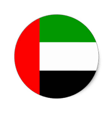
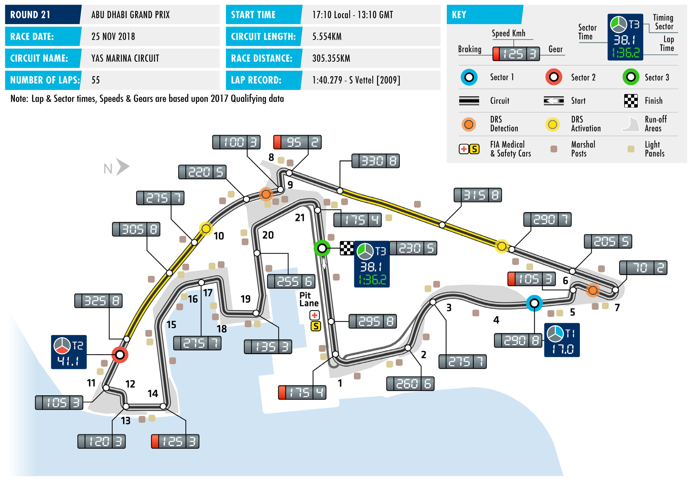
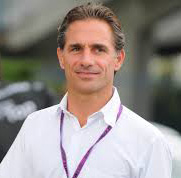

2018 ABU DHABI GRAND PRIX

23 – 25 November 2018

Over 240 days after cars first took to the track in Melbourne YAS MARINA CIRCUIT

to begin this year’s campaign and after more than 21,300 Length of lap: 5.554km individual laps have been raced at 20 events in 20 countries, Lap record: the 2018 FIA Formula One Championship draws to a close this 1:40.279 (Sebastian Vettel, Red Bull weekend at the 21st and final event of the year – the Abu Dhabi Racing, 2009) Grand Prix. Start line/finish line offset: 0.115km Since making its F1 calendar debut in 2009, futuristic Yas Marina Total number of race laps: Circuit has become the traditional and popular home of the sport’s 55 final round, hosting six of the last nine season-ending races. The Total race distance: track is made up of two opening sectors that feature a number 305.355km

of high-speed sections, followed a final slower, more technical Pitlane speed limits: segment. As a whole, the circuit thus provides a thorough workout 80km/h in practice, qualifying, and the race for cars, and presents engineers with a set-up conundrum as they

attempt to strike the perfect balance between straightline speed to CIRCUIT NOTES make the most of the first and second sector and aerodynamic grip

to optimise lap time in the closing sector. ► The orange bumps on the right between Turns 12 and 13 have

A further complicating factor is the day/night nature of the race. been extended by some 16m.

Following a 17:10 local time start, track temperatures drop steeply ► A 50mm high ‘sausage’ kerb has been added behind the negative during the race, typically by around 15˚C over the course of the kerb on the exit of Turn 21. 55 laps. The variation means that tyre performance can change DRS ZONE dramatically, and with only FP2 providing similar conditions, ► There will be two DRS zones in Abu accurately forecasting tyre behaviour in the race can be tricky. To Dhabi. The first zone’s detection cope with the conditions, tyre supplier Pirelli is bringing its softest point will be 40m before Turn 7, compounds to this event – the Supersoft, Ultrasoft and Hypersoft. with an activation point 270m after Turn 7. The second detection With confirmation of Lewis Hamilton’s fifth Drivers’ title coming in point is 50m after Turn 9 and the Mexico last month and with Mercedes sealing a fifth consecutive second activation takes place 165m after Turn 9. Constructors’ title in Brazil a fortnight ago, attention turns to the

lower placings. In the Drivers’ competition, Valtteri Bottas (237

points) can overhaul Kimi Räikkönen (251) in the race for third

overall, but Bottas’ current fourth spot is under threat from Red

Bull Racing’s Max Verstappen. With a win and a second place from

the last two events, the Dutchman is now just three points behind

the Mercedes driver. In the teams’ battle, the closest contest is for

P7, with Racing Point Force India on 48 points, six ahead of Sauber.

FAST FACTS

► This is the 10th Abu Dhabi Grand Prix. The finishes to their name here. Bottas’ came positions, and, of course, won two world race joined the calendar in 2009 and has in 2014 with Williams, while Räikkönen’s titles – in 2005 and 2006, with Renault. been ever present since. was scored in 2015 with Ferrari. ► Two other drivers confirmed as bidding

► Sebastian Vettel and Hamilton are the ► Mercedes is the most successful farewell to F1 this weekend are Marcus most successful drivers at this event. Both constructor at the Abu Dhabi Grand Prix. Ericsson and Stoffel Vandoorne. Ericsson drivers have three wins to their credit, The Silvers Arrows have won the last four made his F1 debut with Caterham at the with Vettel victorious for Red Bull Racing editions of the race. Red Bull are next on 2014 Australian Grand Prix. He joined in 2009, 2010 and 2013 and Hamilton the list with three wins, in 2009, 2010 and Sauber for 2015 and has raced for the triumphant in 2011 with McLaren and 2013. The only other teams to win here Swiss team since. The Swede is set to in 2014 and 2016 with Mercedes. Both are McLaren in 2011 and Lotus in 2012. make his 97th start here and will bid drivers have three other podium finishes: to add to his current career tally of 18 Vettel finished third in 2012, 2016 and ► Hamilton has the most pole positions championship points. Vandoorne made last year, while Hamilton has three here, with three. The Briton started from his debut at the 2016 Bahrain Grand Prix, second places – in 2010, 2015 and 2017. the front of the grid in 2009, 2012 and standing in at McLaren for the injured in 2016. Only in 2016 did he manage Alonso. All of Vandoorne’s 40 races to ► Apart from Hamilton and Vettel there are to convert pole into a win. On both the date have been with McLaren and he two other Abu Dhabi Grand Prix winners other occasions he failed to finish. A currently has a career total of 26 points. on the grid this year – Kimi Räikkönen and brake problem ended his 2009 race after Valtteri Bottas. Räikkönen won with Lotus 20 laps, while a fuel pressure problem ► Daniel Ricciardo is due to celebrate a in 2012, while Bottas was victorious last resulted in a DNF after 19 laps in 2012. different milestone on Sunday – his 150th year with Mercedes. F1 start. The Australian made his grand ► Fernando Alonso is set to bow out of prix debut at the 2011 British GP, driving ► The only other current driver with Formula 1 this weekend, at least for for HRT. Since then he has scored seven a podium finish to his name here is the foreseeable future. This will be his wins, 22 other podiums finishes and Fernando Alonso. The Spaniard finished 311th grand prix start. Across a grand three pole positions, all achieved during second in 2011 and in 2012. Both prix racing career that began in 2001 and his five seasons with Red Bull Racing. podiums were scored while driving for which encompassed stints with Minardi, Sunday will also be his 100th and final Ferrari. Aside from their wins, Räikkönen Renault, McLaren and Ferrari, he has start for the team, as he is moving to and Bottas also have single third place taken 32 wins, 65 other podiums, 22 pole Renault next season.

RACE STEWARDS BIOGRAPHIES

GARRY CONNELLY

CHAIRMAN, AUSTRALIAN INSTITUTE OF MOTOR SPORT SAFETY; F1 STEWARD; FIA WORLD MOTOR SPORT COUNCIL MEMBER, FIA SCIENTIFIC ADVISORY COMMITTEE MEMBER

Garry Connelly has been involved in motor sport since the late 1960s. A long- time rally competitor, Connelly was instrumental in bringing the World Rally Championship to Australia in 1988 and served as Chairman of the Organising Committee, Board member and Clerk of Course of Rally Australia until December 2002. He has been an FIA Steward and FIA Observer since 1989, covering the FIA’s World Rally Championship, World Touring Car Championship and Formula One Championship. He is Chairman of the Australian Institute of Motor Sport Safety and director of the Australian Road Safety Foundation. He is a member of the FIA World Motor Sport Council, member of the FIA Scientific Advisory Committee and FIA Environmental Delegate.

DENNIS DEAN

FIA WORLD MOTOR SPORT COUNTIL MEMBER; MEMBER, INTERNATIONAL SPORTING CODE REVIEW COMMISSION; F2, FORMULA E STEWARD

Dennis Dean has been involved in motor sport since becoming a scrutineer with the Sports Car Club of America (SCCA) in the late 1970s. He has served at national level as a scrutineer, steward, and race director, including 10 years as either assistant chief steward or chief steward (race director) of the SCCA’s National Championship Runoffs. He has scrutineered at 10 US Formula One races, in Las Vegas, Indianapolis and Austin. He was also vice president of Club Racing and Rally/Solo for SCCA. He currently serves as a member of both the FIA’s International Sporting Code Review Commission.

FELIPE GIAFFONE

FORMER INDYCAR DRIVER, MEMBER OF THE FIA TRUCK RACING COMMISSION

After a championship-winning junior kart and single-seater career in his native Brazil, Paulista Felipe Giaffone went to the US in 1995 where he became Formula Atlantic Rookie of the Year. In 2000 he progressed to the Indy Lights series taking one win, at the Firestone 400, in his debut season, as well as nine other podium finishes. In 2001 he made his IndyCar debut, taking another Rookie of the Year award. Giaffone’s best season in the series came the following year when he took one win, at Kentucky Speedway, and four other podium finishes on his way to fourth place overall. That year he also scored his best result from six Indianapolis 500 starts between 2001 and 2006, finishing third. From 2007 on Giaffone raced in Fórmula Truck, winning the Brazilian championship in 2007, 2009 and 2011. He also won the South American Championship in 2011. As well as TV work from 2009 to date, Giaffone has acted as a national steward at the Brazilian Grand Prix and in 2016 as an FIA international steward in WTCC. He is also President of the Brazilian Drivers’ Association.

2018 FIA Formula One World Championship

DRIVERS’ CHAMPIONSHIP STANDINGS

NAJIABREZA AILARTSUA EROPAGNIS IBAHD YNAMREG YRAGNUH STNIOP NIARHAB OCANOM ADANAC AIRTSUA MUIGLEB ECNARF OCIXEM ANIHC AISSUR NAPAJ LIZARB NIAPS YLATI ASU UBA BG

| 18 2 | 15 3 | 12 4 | 25 1 | 25 1 | 15 3 | 10 5 | 25 1 | NC | 18 2 | 25 1 | 25 1 | 18 2 | 25 1 | 25 1 | 25 1 | 25 1 | 15 3 | 12 4 | 25 1 |
| --- | --- | --- | --- | --- | --- | --- | --- | --- | --- | --- | --- | --- | --- | --- | --- | --- | --- | --- | --- |
| 25 1 | 25 1 | 4 8 | 12 4 | 12 4 | 18 2 | 25 1 | 10 5 | 15 3 | 25 1 | NC | 18 2 | 25 1 | 12 4 | 15 3 | 15 3 | 8 6 | 12 4 | 18 2 | 8 6 |
| 15 3 | NC | 15 3 | 18 2 | NC | 12 4 | 8 6 | 15 3 | 18 2 | 15 3 | 15 3 | 15 3 | NC | 18 2 | 10 5 | 12 4 | 10 5 | 25 1 | 15 3 | 15 3 |
| 4 8 | 18 2 | 18 2 | 14 | 18 2 | 10 5 | 18 2 | 6 7 | NC | 12 4 | 18 2 | 10 5 | 12 4 | 15 3 | 12 4 | 18 2 | 18 2 | 10 5 | 10 5 | 10 5 |
| 8 6 | NC | 10 5 | NC | 15 3 | 2 9 | 15 3 | 18 2 | 25 1 | 15 | 12 4 | NC | 15 3 | 10 5 | 18 2 | 10 5 | 15 3 | 18 2 | 25 1 | 18 2 |
| 12 4 | NC | 25 1 | NC | 10 5 | 25 1 | 12 4 | 12 4 | NC | 10 5 | NC | 12 4 | NC | NC | 8 6 | 8 6 | 12 4 | NC | NC | 12 4 |
| 6 7 | 8 6 | 8 6 | NC | NC | 4 8 | 6 7 | 2 9 | NC | 8 6 | 10 5 | 12 | NC | 13 | 1 10 | 12 | NC | 8 6 | 8 6 | NC |
| 11 | 16 | 12 | 15 3 | 2 9 | 12 | 14 | NC | 6 7 | 1 10 | 6 7 | 14 | 10 5 | 6 7 | 16 | 1 10 | 6 7 | 4 8 | NC | 1 10 |
| NC | 10 5 | 1 10 | 13 | 8 6 | 13 | 13 | 8 6 | 10 5 | 2 9 | 11 | 6 7 | 4 8 | 16 | 18 | 4 8 | NC | DQ | 15 | 2 9 |
| 10 5 | 6 7 | 6 7 | 6 7 | 4 8 | NC | NC | 16 | 4 8 | 4 8 | 16 | 4 8 | NC | NC | 6 7 | 14 | 14 | NC | NC | 17 |
| 12 | 1 10 | 11 | NC | NC | 8 6 | 2 9 | NC | 8 6 | 6 7 | 4 8 | 13 | 8 6 | 8 6 | NC | 2 9 | 2 9 | DQ | 11 | 15 |
| 1 10 | 11 | 2 9 | 10 5 | 6 7 | 1 10 | 4 8 | 4 8 | 12 | NC | 12 | 2 9 | 11 | 4 8 | 4 8 | 17 | 1 10 | 6 7 | NC | 12 |
| NC | 13 | 17 | NC | NC | 15 | 12 | 11 | 12 4 | NC | 8 6 | 1 10 | 6 7 | DQ | 15 | 11 | 4 8 | NC | 16 | 4 8 |
| 13 | 12 | 19 | 8 6 | 1 10 | 18 | 1 10 | 1 10 | 2 9 | NC | 15 | NC | NC | 11 | 2 9 | 6 7 | NC | NC | 6 7 | 6 7 |
| NC | 12 4 | 18 | 12 | NC | 6 7 | 11 | NC | 11 | 13 | 14 | 8 6 | 2 9 | 14 | 13 | NC | 11 | 12 | 1 10 | 13 |
| 2 9 | 4 8 | 13 | 2 9 | NC | 14 | 16 | 12 | 15 | 11 | 13 | NC | 15 | 12 | 12 | 16 | 15 | 11 | 4 8 | 14 |
| NC | 2 9 | 16 | 11 | 13 | 11 | 15 | 13 | 1 10 | NC | 2 9 | 15 | 1 10 | 15 | 11 | 13 | 12 | 1 10 | 2 9 | NC |
| 14 | 14 | 14 | 4 8 | 11 | 17 | NC | 17 | 14 | 12 | NC | 17 | 13 | 2 9 | 14 | 15 | 17 | 14 | 12 | 18 |
| 15 | 17 | 20 | 1 10 | 12 | 19 | NC | 14 | NC | NC | 1 10 | 11 | 14 | NC | 17 | NC | 13 | 2 9 | 14 | 11 |
| NC | 15 | 15 | NC | 14 | 16 | 17 | 15 | 13 | 14 | NC | 16 | 12 | 1 10 | 19 | 18 | 16 | 13 | 13 | 16 |

1 L. HAMILTON 383

2 S. VETTEL 302

3 K. RÄIKKÖNEN 251

4 V. BOTTAS 237

5 M. VERSTAPPEN 234

6 D. RICCIARDO 158

7 N. HÜLKENBERG 69

8 S. PÉREZ 58

9 K. MAGNUSSEN 55

10 F. ALONSO 50

11 E. OCON 49

12 C. SAINZ 45

13 R. GROSJEAN 35

14 C. LECLERC 33

15 P. GASLY 29

16 S. VANDOORNE 12

17 M. ERICSSON 9

18 L. STROLL 6

19 B. HARTLEY 4

20 S. SIROTKIN 1

2018 FIA Formula One World Championship

CONSTRUCTORS’ CHAMPIONSHIP STANDINGS

NAJIABREZA AILARTSUA EROPAGNIS IBAHD YNAMREG YRAGNUH STNIOP NIARHAB OCANOM ADANAC AIRTSUA MUIGLEB ECNARF OCIXEM ANIHC AISSUR NAPAJ LIZARB NIAPS YLATI ASU UBA BG

| 22 2 8 | 33 2 3 | 30 2 4 | 25 1 13 | 43 1 2 | 25 3 5 | 28 2 5 | 31 1 7 | NC NC | 30 2 4 | 43 1 2 | 35 1 5 | 30 2 4 | 40 1 3 | 37 14 | 43 1 2 | 43 1 2 | 25 3 5 | 22 4 5 | 35 1 5 |
| --- | --- | --- | --- | --- | --- | --- | --- | --- | --- | --- | --- | --- | --- | --- | --- | --- | --- | --- | --- |
| 40 1 3 | 25 1 NC | 19 3 8 | 30 2 4 | 12 4 NC | 30 2 4 | 33 1 6 | 25 3 5 | 33 2 3 | 40 1 3 | 15 3 NC | 33 2 3 | 25 1 NC | 30 2 4 | 25 35 | 27 3 4 | 18 5 6 | 37 1 4 | 33 2 3 | 23 3 6 |
| 20 4 6 | NC NC | 35 1 5 | NC NC | 25 15 10 | 27 1 9 | 27 3 4 | 30 2 4 | 25 1 NC | 10 5 NC | 12 4 NC | 12 4 NC | 15 3 NC | 10 5 NC | 26 26 | 18 5 6 | 27 3 4 | 18 2 NC | 25 1 NC | 30 2 4 |
| 7 7 10 | 8 6 11 | 10 6 9 | 10 5 NC | 6 7 NC | 5 8 10 | 10 7 8 | 6 8 9 | NC NC | 8 6 NC | 10 5 12 | 2 9 12 | 11 NC | 4 8 13 | 5 8 10 | 12 17 | 1 10 NC | 14 6 7 | 8 6 NC | 12 NC |
| NC NC | 10 5 13 | 1 10 17 | 13 NC | 8 6 NC | 13 15 | 12 13 | 8 6 11 | 22 4 5 | 2 9 NC | 8 6 11 | 7 7 10 | 10 7 8 | 16 DQ | 15 18 | 4 8 11 | 4 8 NC | NC DQ | 15 16 | 6 8 9 |
| 12 5 9 | 10 7 8 | 6 7 13 | 8 7 9 | 4 8 NC | 14 NC | 16 NC | 12 16 | 4 8 15 | 4 8 11 | 13 16 | 4 8 NC | 15 NC | 12 NC | 6 7 12 | 14 16 | 14 15 | 11 NC | 4 8 NC | 14 17 |
|  |  |  |  |  |  |  |  |  |  |  |  | 18 5 6 | 14 6 7 | 16 NC | 3 9 10 | 8 7 9 | 4 8 DQ | 11 NC | 1 10 15 |
| 13 NC | 2 9 12 | 16 19 | 8 6 11 | 1 10 13 | 11 18 | 1 10 15 | 1 10 13 | 3 9 10 | NC NC | 2 9 15 | 15 NC | 1 10 NC | 11 15 | 2 9 11 | 6 7 13 | 12 NC | 1 10 NC | 8 7 9 | 6 7 NC |
| 15 NC | 12 4 17 | 18 20 | 1 10 12 | 12 NC | 6 7 19 | 11 NC | 14 NC | 11 NC | 13 NC | 1 10 14 | 8 6 11 | 2 9 14 | 14 NC | 13 17 | NC NC | 11 13 | 2 9 12 | 1 10 14 | 11 13 |
| 14 NC | 14 15 | 14 15 | 4 8 NC | 11 14 | 16 17 | 17 NC | 15 17 | 13 14 | 12 14 | NC NC | 16 17 | 12 13 | 3 9 10 | 14 19 | 15 18 | 16 17 | 13 14 | 12 13 | 16 18 |
| 11 12 | 10 16 | 11 12 | 3 NC | 9 NC | 6 12 | 9 14 | NC NC | 6 7 | 7 10 | 7 8 | 13 14 |  |  |  |  |  |  |  |  |

1 MERCEDES AMG 620 PETRONAS MOTORSPORT

553 2 SCUDERIA FERRARI

3 ASTON MARTIN 392 RED BULL RACING

RENAULT SPORT 114 4 FORMULA ONE TEAM

90 5 HAAS F1 TEAM

62 6 MCLAREN F1 TEAM

RACING POINT 48 7 FORCE INDIA F1TEAM

ALFA ROMEO 42 8 SAUBER F1 TEAM

RED BULL 33 9 TORO ROSSO HONDA

WILLIAMS MARTINI 7 10 RACING

SAHARA FORCE INDIA 0 EX F1 TEAM

FORMULA ONE TIMETABLE & FIA MEDIA SCHEDULE

THURSDAY

Press conference 1500

FRIDAY

Practice session 1 1300-1430 Press conference 1500

Practice session 2 1700-1830

SATURDAY

Practice session 3 1400-1500 Qualifying 1700-1800 Followed by track interviews, press conference

SUNDAY

Drivers’ Parade 1530 Race 1710 Followed by parc fermé interviews and press conference

ADDITIONAL MEDIA OPPORTUNITIES

QUALIFYING

All drivers eliminated in Q1 or Q2 will be available for media interviews immediately after the end of each session, as will drivers who participated in Q3, but who are not required for the post-qualifying press conference. The TV Pen is located in front of the entrance to the media centre.

RACE

Any driver retiring before the end of the race will be made available at the TV pen interview area. In addition, during the race every team will make available at least one senior spokesperson for interview by officially accredited TV crews. A list of those nominated will be made available in the media centre.

FIA COMMUNICATIONS DEPARTMENT press@fia.com T +33 1 43 12 58 15
