ETIHAD AIRWAYS

ABU DHABI

GRAND PRIX

YAS MARINA 23 - 25 NOVEMBER

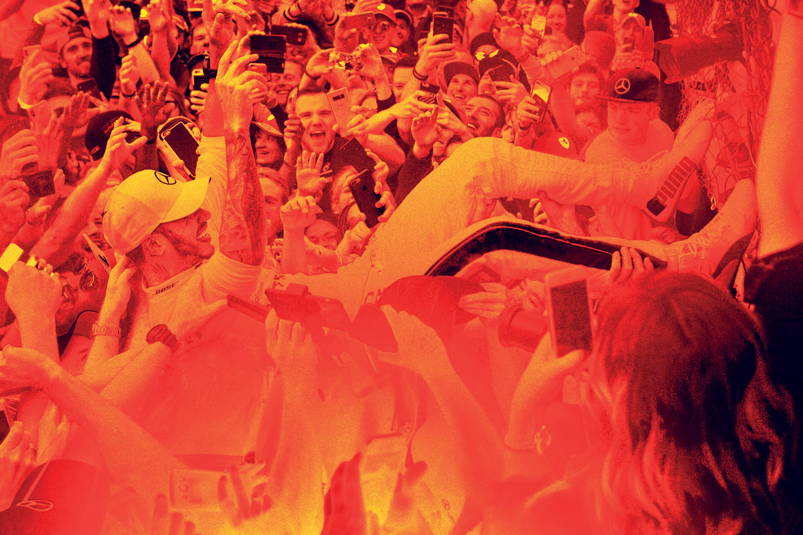

1

MEDIA GUIDE

CONTENTS

WELCOME MESSAGE 2 ...................................................................................................................................................................

MEDIA ACCREDITATION AND MEDIA CENTRE 3 ......................................................................................

MEDIA CENTRE KEY STAFF 4 ...............................................................................................................................................

MEDIA CENTRE FACILITIES 5 ..............................................................................................................................................

PRESS CONFERENCE SCHEDULE 6 ...........................................................................................................................

PHOTOGRAPHER'S SHUTTLE BUS SCHEDULE 7 .....................................................................................

SCHEDULE 8 ..................................................................................................................................................................................................

2018 FIA FORMULA 1® WORLD CHAMPIONSHIP 9 ...............................................................................

ABU DHABI 2009 – 2017 21 ......................................................................................................................................................

2017 FIA FORMULA 1® ETIHAD AIRWAYS ABU DHABI GRAND PRIX 25 .................

USEFUL ABU DHABI INFORMAION 28 .....................................................................................................................

MAPS & DIAGRAMS 30 ....................................................................................................................................................................

1

WELCOME

MESSAGE

FORMULA 1® 2018 ETIHAD AIRWAYS ABU DHABI GRAND PRIX

A very warm 10 year welcome and ‘thank you’ for being part of the Formula 1 Etihad Airways Abu Dhabi Grand Prix, regardless of how many you’ve experienced with us.

We are excited to reach this major milestone as we look to add to nine thrilling years of incredible F1®moments and memories with yet another extraordinary weekend of racing action and entertainment.

Our Media team, as ever, are on-hand to support you through-out the weekend to make it as seamless and productive for you as possible. Everything should be in place, but if you have any additional requirements please don’t hesitate to reach out to one of the team.

If you do get the chance, we recommend you try catch any or all of this year’s After-Race Concerts, we are welcoming some of the biggest names in rock, pop and modern alternative music including Post Malone (Thurs), The Weeknd (Fri), Sam Smith (Sat) and Guns N’ Roses (Sun). Wristbands are available at the Media reception desk.

Two additional attractions we suggest you try whilst visiting Abu Dhabi include the Louvre Abu Dhabi (where on showing your media pass you can enjoy a 50% discount, valid Thurs-Sun) and Warner Bros. World™ Abu Dhabi, new for 2018 and located on Yas Island adjacent to Ferrari World Abu Dhabi and Yas Water World.

May we wish you a great weekend!

Yours sincerely,

Yas Marina Circuit Team

2

MEDIA ACCREDITATION

AND MEDIA CENTRE

OPENING HOURS MEDIA ACCREDITATION CENTRE

Wednesday November 21 11:00 – 18:00

Thursday November 22 10:00 – 18:00

Friday November 23 10:00 – 19:00

Saturday November 24 10:00 – 15:00

Sunday November 25 10:00 – 14:00

MEDIA CENTRE

Wednesday November 21 12:00 – 20:00

Thursday November 22 08:30 – 22:00

Friday November 23 08:30 – 23:00

Saturday November 24 08:30 – Midnight

09:00 – Until last Sunday November 25 journalist leaves

LOCATION MAP

YAS BEACH ABU DHABI Y A S L IN K S WOWRALRDN -E ARB BUR DOHSA.BI SPTOALTIICOEN S A A D IY A T G O L F C L U B & C O R N IC H E WATEYRAWSORLD YAS LEISURE DRIVE YA ( S W I E S S LA T) ND YAHSO TPELLASZA YAST TERRARCAKCSEIDE EYNATSR WAENS CTE 12 15 18 19 2 0 25 S2 Y S1 FERARBAUR D I H W A O B R I L D YAS Mall OdRuUM 1 0 W E ST GRANDSTA N D NORTH GRANDSTAND F ABUH IDLHLABI 8 Y S 3 CENTRAL

MAD Club S 4 7 MARINA G RANDS BY TA OA N AS D RM DAW RA INLAK B MU AIILND PINITG MAIN GRANDSTAND 28 Y YAS * O Pn loy s Ot -pc eo rn acte iortnal IKEA ACE YAS HO TE L 5 YAS MARINA STA P F A F R K CAR

S5 V PCA AAL RRE T 2 GRANDSTAND K EASOTF FTIICCEKET 1 SOUTH Y EYNATSR EAANSCTE YAS MARINA SHUTTLE ROUTE YAS LEISURE DRIVE DUBAI - SHAHAMA

Gate Number Media Meeting Point Silver Car Park Y Y C a o s u r M te a s r y in S a h C u i t r t c le uit

Circuit Pick up / Drop off Circuit Circular Shuttle Yas Mall Car Park Information Point

Gateway Car Park Red Car Park Taxi Load Zone Yas Marina Boardwalk Yas Marina Shuttle Route

Ticket Office Gold Car Park Water Taxi Pedestrian Route (Paddock Club Only)

3

MEDIA CENTRE

KEY STAFF

FIA F1 Head of Communications & Media Delegate

Matteo Bonciani

F1 Deputy Media Delegate

Pierre Guyonnet-Duperat pguyonnet@fia.com

Director of Communications

Nick McElwee nick.mcelwee@ymc.ae

Head of Communications

Michael Golding Michael.Golding@ymc.ae

National Press Officer

Ziwar Nakhesh ziwarnakhesh@sevenmedia.ae

English Content Manager

Jennifer Pearson jenniferpearson@sevenmedia.ae

Media Centre Operations Manager

Azza El Tiraifi azza.eltiraifi@ymc.ae

Motorsport Media Manager

Stuart Sykes stuart@scotsport.com.au

Media Centre Logistics Manager

Rob van Leeuwen r.van.leeuwen@bigpond.com

Media Accreditation Manager

Blanca Angga blanca.angga@ymc.ae

4

MEDIA CENTRE

FACILITIES

The Media Accreditation Centre is at the West Gate Entrance of Yas Marina Circuit and the Media Centre for the FORMULA 1® 2018 ETIHAD AIRWAYS ABU DHABI GRAND PRIX is located in the Paddock, opposite Race Control. The journalists’ and the photographers’ work rooms are on the first floor of the Media Centre.

IT CHARGES

Standard line set-up charges are FREE.

ISDN LINES

These are available only by pre-order; the set-up cost is as for a standard line.

INTERNET

Internet access is available Free of Charge.

TELECOMS CENTRE

The first floor has a Telecoms Centre. Internet connection is also available at no cost in the Telecoms Centre. However, access is limited to 30 minutes per user at any one time. IT support staff will be on hand.

LOCKERS

Free lockers are available on the first floor of the Media Centre. Each locker can have its own code keyed in for privacy.

CATERING IN THE MEDIA CENTRE

There is a cafeteria on the first floor; opening hours are from 8:00am – 10:00pm. Snacks are complimentary from Thursday through to Sunday. Additionally, we will supply one complimentary hot meal per day from Thursday through to Sunday.

5

PRESS CONFERENCE

SCHEDULE

All press conferences organized by the FIA will be held in the Press Conference room on the ground floor of the Media Centre.

DAY TIME PARTICIPANTS

Drivers nominated by the FIA F1 Head of Thursday 22nd November 15:00 Communications and Media Delegate

Team members nominated by the FIA F1 Head of Friday 23rd November 15:00 Communications and Media Delegate

Saturday 24th November After F1 Qualifying Top three drivers in session

Sunday 25th November After the Race Top three finishing drivers

PLEASE NOTE:

After the press conferences on Thursday and Friday the participants will go to the tv pen.

Qualifying and post-race press conferences will take place after the parc fermé interviews and the podium ceremony, which will be broadcast in the Media Centre and the Press Conference Room.

6

PHOTOGRAPHER'S

SHUTTLE BUS

SCHEDULE

Photographers’ shuttles will take photographers to various points around the circuit ahead of each Formula One track session and will return photographers to the Paddock upon completion of the session.

Shuttles will operate continuously around the circuit during the track activity.

Support Categories: Shuttles for support race sessions will operate on a needs basis – please see Media Reception.

F1 SESSIONS & RACE

FRIDAY NOVEMBER 23

F1 First Practice Session 13:00 – 14:30 F1 Second Practice Session 17:00 – 18:30

Shuttle departs 12:30 – 13:00 Shuttle departs 16:30 – 17:00

Pick-ups from 14:30 Pick-ups from 18:30

SATURDAY NOVEMBER 24

F1 Third Practice Session: 14:00 – 15:00 F1 Qualifying 17:00 – 18:00

Shuttle departs 13:30 – 14:00 Shuttle departs 16:30 – 17:00

Pick-ups from 15:00 Pick-ups from 18:00

SUNDAY NOVEMBER 25

F1 Grand Prix 17:00 – 19:00

Shuttle departs 16:00 – 17:00

Pick-ups from 19:00

7

SCHEDULE

THURSDAY 22 NOV 2017

TIME ACTIVITY

15:00 - 16:00 FORMULA ONE Press Conference (Drivers)

FRIDAY 23 NOV 2018

TIME ACTIVITY

10:15 – 11:001 GP3 Series Practice Session

11:30 – 12:151 FIA Formula 2 Practice Session

13:00 – 14:301 Formula 1 First Practice Session

15:00 – 16:00 Formula 1 Press Conference

15:10 – 15:40 GP3 Series Qualifying Session

17:00 – 18:301 Formula 1 Second Practice Session

19:00 – 19:30 FIA Formula 2 Qualifying Session

20:00 – 20:30 FIA Formula 2 Press Conference

SATURDAY 24 NOV 2018

TIME ACTIVITY

12:30* - 13:152 GP3 Series First Race (18 laps or 40 mins)

14:00 – 15:001 Formula 1 Third Practice Session

15:10 – 15:40 FIA Formula 2 Drivers’ Parade

17:00 – 18:00 Formula 1 Qualifying Session

18:00 – 19:00 Formula 1 Press Conference

18:40* - 19:452 FIA Formula 2 First Race (31 laps or 60 mins)

20:00 – 20:30 FIA Formula 2 Press Conference

SUNDAY 25 NOV 2018

TIME ACTIVITY

12:10* - 12:452 GP3 Series Second Race (14 laps or 30 mins)

13:35* - 14:202 FIA Formula 2 Second Race (22 Laps or 45 mins)

15:15 – 15:20 Formula 1 End of Year F1 Drivers’ Photograph (Grid)

15:15 – 15:45 FIA Formula 2 Press Conference

15:30 – 16:00 Formula 1 Drivers’ Track Parade

15:35 – 16:05 Formula 1 Starting Grid Presentation

1 Fixed End Session 2 Approximate finishing time * These times refer to the start of the formation lap

8

2018 FIA FORMULA

1® WORLD

CHAMPIONSHIP

ENTRY LIST

MERCEDES AMG PETRONAS MOTORSPORT

Engine: Mercedes

44. Lewis Hamilton (GBR) 77. Valtteri Bottas (FIN)

SCUDERIA FERRARI

Engine: Ferrari

5. Sebastian Vettel (GER) 7. Kimi Räikkönen (FIN)

ASTON MARTIN RED BULL RACING

Engine: Renault

3. Daniel Ricciardo (AUS) 33. Max Verstappen (NDL)

RACING POINT FORCE INDIA F1 TEAM

Engine: Mercedes

11. Sergio Pérez (MEX) 31. Esteban Ocon (FRA)

WILLIAMS MARTINI RACING

Engine: Mercedes

18. Lance Stroll (CAN) 35. Sergey SIROTKIN (RUS)

RENAULT SPORT FORMULA 1 TEAM

Engine: Renault

27. Nico Hülkenberg (GER) 55. Carlos Sainz (ESP)

RED BULL TORO ROSSO HONDA

Engine: Honda

10. Pierre Gasly (FRA) 28. Brendon Hartley (NZL)

HAAS F1 TEAM

Engine: Ferrari

8. Romain Grosjean (FRA) 20. Kevin Magnussen (DEN)

McLAREN F1 TEAM

Engine: Renault

2. Stoffel Vandoorne (BEL) 14. Fernando Alonso (ESP)

ALFA ROMEO SAUBER F1 TEAM

Engine: Ferrari

9. Marcus Ericsson (SWE) 16. Charles Leclerc (MCO)

9

2018 FIA FORMULA 1®

WORLD CHAMPIONSHIP

2018 DRIVERS’ STANDINGS: after round 20, Brazil

| 2018 DRIVER’S STANDINGS: After Round 20, Brazil |  |  |  |  |  |  |  |
| --- | --- | --- | --- | --- | --- | --- | --- |
|  | Driver | Team | Wins | Poles | F/Laps | Podiums | Points |

1 Lewis Hamilton Mercedes 10 10 3 16 383

2 Sebastian Vettel Ferrari 5 5 2 11 302

3 Kimi Räikkönen Ferrari 1 1 1 12 251

4 Valtteri Bottas Mercedes 0 2 7 8 237

5 Max Verstappen Red Bull 2 0 2 10 234

6 Daniel Ricciardo Red Bull 2 2 4 2 158

7 Nico Hülkenberg Renault 0 0 0 0 69

8 Sergio Perez Racing Point 0 0 0 1 58

9 Kevin Magnussen Haas 0 0 1 0 55

10 Fernando Alonso McLaren 0 0 0 0 50

11 Esteban Ocon Racing Point 0 0 0 0 49

12 Carlos Sainz Renault 0 0 0 0 45

13 Romain Grosjean Haas 0 0 0 0 35

14 Charles Leclerc Sauber 0 0 0 0 33

15 Pierre Gasly Toro Rosso 0 0 0 0 29

16 Stoffel Vandoorne McLaren 0 0 0 0 12

17 Marcus Ericsson Sauber 0 0 0 0 9

18 Lance Stroll Williams 0 0 0 0 6

19 Brendon Hartley Toro Rosso 0 0 0 0 4

20 Sergey Sirotkin Williams 0 0 0 0 1

| 2018 CONSTRUCTOR’S STANDINGS |  |  |  |  |  |  |
| --- | --- | --- | --- | --- | --- | --- |
|  | Team | Wins | Poles | F/Laps | Podiums | Points |

1 Mercedes 10 12 10 24 620

2 Ferrari 6 6 3 23 553

3 Red Bull 4 2 6 12 392

4 Renault 0 0 0 0 114

5 Haas 0 0 1 0 90

6 McLaren 0 0 0 0 62

7 Racing Point Force India 0 0 0 0 48

8 Sauber 0 0 0 0 42

9 Toro Rosso 0 0 0 0 33

10 Williams 0 0 0 0 7

Excl Sahara Force India - - - - 0

10

2018 FIA FORMULA 1®

WORLD CHAMPIONSHIP

TEAM & DRIVER CAREER STATISTICS

Up to & including Round 20 Brazil, 2018

MERCEDES AMG PETRONAS F1 TEAM - Chassis F1 W08

Base Brackley, UK • Debut 1954 • Chassis W09 • Engine Mercedes • Races 188 • Wins 86 • Poles 100 • F/ Laps 66 Constructors’ Championships 5 (including 2018) • Drivers’ Championships 7 (including 2018) (in 1954 Fangio drove both a Mercedes & a Maserati to win the title)

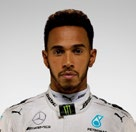

44 LEWIS Born January 7, 1985 • F1 Debut 2007 (McLaren) • Races 228 HAMILTON Wins 72 • Poles 82 • F/Laps 41

2018 Season Results so far

GP QUAL Race Points GP QUAL Race Points Australia 1 2 18 Hungary 1 1 25

Bahrain 4 3 15 Belgium 1 2 18

China 4 4 12 Italy* 3 1 25

Azerbaijan 2 1 25 Singapore 1 1 25

Spain 1 1 25 Russia 2 1 25

Monaco 3 3 15 Japan 1 1 25

Canada 4 5 10 USA* 1 3 15

France 1 1 25 Mexico 3 4 12

Austria 2 dnf - Brazil 1 1 25

GB 1 2 18 UAE

Germany* 14 1 25

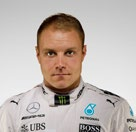

77 VALTTERI Born August 28, 1989 • F1 Debut 2013 (Williams) • Races117 BOTTAS Wins 3 • Poles 6 • F/Laps 10

2018 Season Results so far

GP QUAL Race Points GP QUAL Race Points Australia 10 8 4 Germany 2 2 18

Bahrain* 3 2 18 Hungary 2 5 10

China 3 2 18 Belgium* 10 4 12

Azerbaijan* 3 14 - Italy 4 3 15

Spain 2 2 18 Singapore 4 4 12

Monaco 5 5 10 Russia* 1 2 18

Canada 2 2 18 Japan 2 2 18

France* 2 7 6 USA 4 5 10

Austria 1 dnf - Mexico* 5 5 10

GB 4 4 12 UAE

* Fastest Lap 11

SCUDERIA FERRARI - Chassis SF-70H

Base: Maranello, Italy • Debut: 1950 • Chassis: SF-71H • Engine: Ferrari • Races: 969 • Wins: 235 • Poles: 234 • F/Laps:247 • Constructors’ Championships 16 • Drivers’ Championships 15

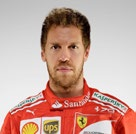

5 July 3 1987 • F1 Debut 2007 (BMW Sauber) • Races 218 SEBASTIAN Wins 52 • Poles 55 • F/Laps 35 VETTEL World Champion 2010 2011 2012 2013

2018 Season Results so far

GP QUAL Race Points GP QUAL Race Points

Australia 3 1 25 Hungary 4 2 18

Bahrain* 1 1 25 Belgium 2 1 25

China 1 8 4 Italy 2 4 12

Azerbaijan 1 4 12 Singapore 3 3 15

Spain 3 4 12 Russia 3 3 15

Monaco 2 2 18 Japan 9 6 8

Canada 1 1 25 USA 2 4 12

France 3 5 10 Mexico 4 2 18

Austria 3 3 15 Brazil 1 1 25

GB* 2 1 25 UAE

Germany 1 dnf -

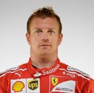

7 October 17, 1979 • F1 Debut: 2001 (Sauber) • Races: 291 KIMI Wins: 21 • Poles: 18 • F/Laps: 46 RAIKKONEN World Champion 2007

2018 Season Results so far

GP QUAL Race Points GP QUAL Race Points Australia 2 3 15 Hungary 3 3 15

Bahrain 2 dnf - Belgium 3 3 15

China 2 3 15 Italy 6 dnf -

Azerbaijan 6 2 18 Singapore 1 2 18

Spain 4 dnf - Russia 5 5 10

Monaco 4 4 12 Japan 4 4 12

Canada 5 6 8 USA 4 5 10

France 6 3 15 Mexico 3 1 25

Austria* 4 2 18 Brazil 6 3 15

GB 3 3 15 UAE 4 3 15

* Fastest Lap

12

ASTON MARTIN RED BULL RACING G - Chassis RB13

Base: Milton Keynes, UK • Debut: 2005 • Chassis: RB14 • Engine: Tag-Heuer (Renault) • Races: 264 Wins: 59 • Poles: 60 • F/Laps: 60 • Constructors’ Championships, 4 • Drivers’ Championships 4

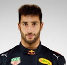

3 DANIEL July 1, 1989 RICCIARDO F1 Debut: 2011 (HRT) • Races 149 • Wins 7 • Poles 3 • F/Laps 13

2018 Season Results so far

GP QUAL Race Points GP QUAL Race Points

Australia* 5 4 12 Hungary* 12 4 12

Bahrain 5 dnf Belgium 8 dnf -

China* 6 1 25 Italy 15 dnf -

Azerbaijan 4 dnf - Singapore 6 6 8

Spain* 6 5 10 Russia 12 6 8

Monaco 1 1 25 Japan 15 4 12

Canada 6 4 12 USA 5 dnf -

France 5 4 12 Mexico 1 dnf -

Austria 7 dnf - Brazil 6 4 12

GB 6 5 10 UAE

Germany 15 dnf -

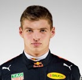

33 MAX September 30, 1997 • F1 Debut 2015 (STR) • Races 80 VERSTAPPEN Wins 5 • Poles 0 • F/Laps 4

2018 Season Results so far

GP QUAL Race Points GP QUAL Race Points

Australia 4 6 8 8 Hungary 7 dnf -

China 15 dnf - Belgium 7 3 15

Bahrain 5 5 10 Italy 5 5 10

Russia 5 dnf - - Singapore 2 18 18

Spain 5 3 15 Malaysia 11 5 10

Monaco n/t 9 2 Japan 3 3 15

Canada * 3 3 15 USA 15 2 18

Azerbaijan 4 2 18 Mexico 2 1 25

Austria 5 1 25 Brazil GB 5 15 - Uae

* Fastest Lap

13

RACING POINT FORCE INDIA F1 TEAM - Chassis VJM10

Base Silverstone, UK • Debut 2018 (Belgium) • Chassis VJM11 • Engine Mercedes • Races 8 • Wins 0 • Poles 0 • F/Laps 0

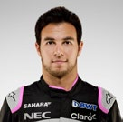

11 SERGIO January 26, 1990 • F1 Debut 2011 (Sauber) • Races 154 PEREZ Wins 0 • Poles 0 • F/Laps 4

2018 Season Results so far

GP QUAL Race Points GP QUAL Race Points

Australia* 13 11 - Hungary* 19 14 -

Bahrain 12 16 - Belgium 4 5 10

China* 8 12 - Italy 16 7 6

Azerbaijan 8 3 15 Singapore 7 16 -

Spain* 15 9 2 Russia 8 10 1

Monaco 9 12 - Japan 10 7 6

Canada 10 14 - USA 10 8 4

France 13 DNF - Mexico 13 DNF -

Austria 17 7 6 Brazil 12 10 1

GB 12 10 1 UAE

Germany 10 7 6

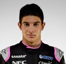

31 ESTEBAN September 17, 1996 • F1 Debut 2016 (Manor) • Races 49 OCON Wins 0 • Poles 0 • F/Laps 0

2018 Season Results so far

GP QUAL Race Points GP QUAL Race Points Australia* 15 12 Hungary* 18 13 -

Bahrain 9 10 1 Belgium 3 6 8

China* 12 11 - Italy 8 6 8

Azerbaijan 7 DNF - Singapore 9 DNF -

Spain* 13 DNF - Russia 6 9 2

Monaco 6 6 8 Japan 8 9 2

Canada 8 9 2 USA 6 DQ -

France 11 DNF - Mexico 11 11 -

Austria 11 6 8 Brazil 13 14 -

GB 10 7 6 UAE

Germany 16 8 4

**Round 1 (Australia) to Round 12 (Hungary) both drivers were with Sahara Force India F1 Team)

14

WILLIAMS MARTINI RACING - Chassis FW40

Base Wantage, UK • Debut 1978 • Chassis FW41 • Engine Mercedes • Races 697 (WGPE from 1977) Wins 114 • Poles 128 • F/Laps • 132 • Constructor’s Championships 9 • Driver’s Championships 7

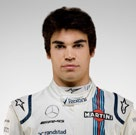

18 LANCE October 29, 1998 • F1 Debut 2017 (Williams) • Races 40 STROLL Wins 0 • Poles 0 • F/Laps 0

2017 Season Results so far

GP QUAL Race Points GP QUAL Race Points

AUSTRALIA 14 14 - HUNGARY 15 17 -

BAHRAIN 20 14 - BELGIUM 19 13 -

CHINA 18 14 - ITALY 10 9 2

AZERBAIJAN 11 8 4 SINGAPORE 20 14 -

SPAIN 19 11 - RUSSIA 20 15 -

MONACO 18 17 - JAPAN 14 17 -

CANADA 17 DNF - USA 18 14 -

FRANCE 20 17 - MEXICO 19 12 -

AUSTRIA 15 14 - BRAZIL 19 18 -

GB N/T 12 - UAE

GERMANY 19 DNF -

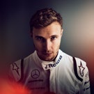

35 SERGEY August 27, 1995 • F1 Debu 2018 (Williams) • Races 20 SIROTKIN Wins 0 • Poles 0 • F/Laps0

2017 Season Results so far

GP QUAL Race Points GP QUAL Race Points AUSTRALIA 19 DNF - HUNGARY 20 16 -

BAHRAIN 18 15 - BELGIUM 18 12 -

CHINA 16 15 - ITALY 12 10 1

AZERBAIJAN 12 DNF - SINGAPORE 19 19 -

SPAIN 18 14 - RUSSIA 18 18 -

MONACO 13 16 - JAPAN 17 16 -

CANADA 18 17 - USA 17 13 -

FRANCE 19 15 - MEXICO 20 13 -

AUSTRIA 18 13 - BRAZIL 15 16 -

GB 18 14 - UAE

GERMANY 12 DNF -

15

RENAULT SPORT FORMULA ONE TEAM - Chassis R.S.17

Base Enstone, UK • Debut 1977 • Chassis RS18 • Engine Renault • Races 361 • Wins 35 • Poles 51 • F/Laps 31 Constructors’ Championships 2 • Drivers’ Championships 2

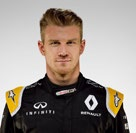

27 NICO August 19,1987 • F1 Debut 2010 (Williams) • Races 155 • Wins 0 • Poles 1 HULKENBERG

2018 Season Results so far

GP QUAL Race Points GP QUAL Race Points

Australia 8 7 6 Hungary 13 12 -

Bahrain 8 6 8 Belgium 15 dnf -

China 7 6 8 Italy 14 13 -

Azerbaijan 9 dnf - Singapore 10 10 1

Spain 16 dnf - Russia 15 12 -

Monaco 11 8 4 Japan 16 dnf -

Canada 7 7 6 USA 7 6 8

France 12 9 2 Mexico 7 6 8

Austria 10 dnf - Brazil 14 dnf -

GB 11 6 8 UAE

Germany 7 5 10

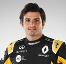

55 CARLOS September 1, 1994 • F1 Debut 2015 (STR) • Races 80 • Wins 0 • Poles 0 SAINZ

2018 Season Results so far

GP QUAL Race Points GP QUAL Race Points Australia 9 10 1 Germany 8 12 -

Bahrain 10 11 - Hungary 5 9 2

China 9 9 2 Belgium 16 11 -

Azerbaijan 10 5 10 Italy 7 8 4

Spain 9 7 6 Malaysia 12 8 4

Monaco 8 10 1 Japan 14 17 -

Canada 9 8 4 USA 13 10 1

France 7 8 4 Mexico 11 7 6

Austria 9 12 - Brazil 8 dnf - GB 16 dnf - UAE 16 12 -

16

RED BULL TORO ROSSO HONDA - Chassis STR12

Base Faenza, Italy • Debut 2006 • Chassis STR13 • Engine Honda • Races 246 • Wins 1 • Poles 1 • F/Laps 1

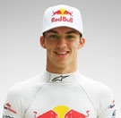

10 February 7, 1996 • F1 Debut 2017 (STR) • Races 25 PIERRE Wins 0 • Poles 0 • F/Laps 0 GASLY

2018 Season Results so far

GP QUAL Race Points GP QUAL Race Points

Australia - - - Hungary 6 6 8

Bahrain - - - Belgium 11 9 2

China - - - Italy 9 14 -

Azerbaijan - - - Singapore 15 13 -

Spain - - - Russia 13 dnf -

Monaco - - - Japan 7 11 -

Canada - - - USA 13 12 -

France - - - Mexico 15 10 1

Austria - - - Brazil 10 13 -

GB - - - UAE

Germany

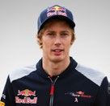

28 BRENDON November 10, 1989 • F1 Debu 2017 (STR) • Races 24 HARTLEY Wins 0 • Poles 0 • F/Laps 0

2018 Season Results so far

GP QUAL Race Points GP QUAL Race Points Australia 16 15 - Hungary 8 11 - Bahrain 11 17 - Belgium 12 14 -

China 15 20 - Italy 18 dnf -

Azerbaijan 10 1 Singapore 17 -

Spain nc 12 - Russia 16 dnf -

Monaco 16 19 - Japan 6 13 -

Canada 12 dnf - USA 14 9 2

France 17 14 - Mexico 14 14 -

Austria 19 dnf - Brazil 17 11 -

GB n/t dnf - UAE

Germany 18 10 1

17

HAAS F1 TEAM - Chassis VF17

Base North Carolina, USA & Banbury, UK • Debut 2016 Chassis • VF18 • Engine Ferrari • Races 61 • Wins 0 Poles 0 • F/Laps 1

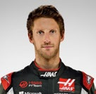

8 ROMAIN April 17, 1986 • F1 Debut 2009 (Renault) • Races 142 GROSJEAN Wins 0 • Poles 0 • F/Laps1

2018 Season Results so far

GP QUAL Race Points GP QUAL Race Points

Australia 7 dnf - Hungary 15 dnf 0

Bahrain 16 13 - Belgium 12 7 6

China 10 17 - Italy - 15 0

Azerbaijan nc dnf - Singapore 15 9 2

Spain 10 dnf - Russia 16 13 0

Monaco 15 15 - Japan 16 9 2

Canada n/t 12 - USA 14 14 0

France 10 11 - Mexico 19 15 0 Austria 6 4 12 Brazil

GB 8 dnf - UAE

Germany 6 6 8

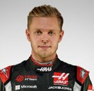

20 KEVIN October 5, 1992 • F1 Debut 2014 (McLaren) 2 • Races 802 • MAGNUSSEN Wins 02 • Poles 02 • F/Laps 1

2018 Season Results so far

GP QUAL Race Points GP QUAL Race Points Australia 6 dnf - Hungary 9 7 6

Bahrain 7 5 10 Belgium 9 8 4 China 11 10 1 Italy 11 16 -

Azerbaijan 15 13 - Singapore 16 18 -

Spain 7 6 8 Russia 5 8 4

Monaco 19 13 - Japan 12 dnf -

Canada 11 13 - USA 12 dq -

France 9 6 8 Mexico 18 15 -

Austria 8 5 10 Brazil 11 9 2

GB 7 9 2 UAE

* Fastest Lap

18

MCLAREN F1 TEAM - Chassis MCL32

Base Woking, UK • Debut 1966 • Chassis MCL33 • Engine Renault • Races 841 • Wins 182 • Poles 155 F/Laps 155 • Constructor's Championships 8 • Driver's Championships 12

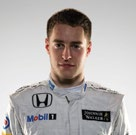

2 Stoffel March 26, 1992 • F1 Debut 2016 (McLaren) • Races 40 VANDOORNE Wins 0 • Poles 0 • F/Laps 0

2017 Season Results so far

GP QUAL Race Points GP QUAL Race Points

Australia 12 9 2 Hungary 16 dnf -

Bahrain 14 8 4 Belgium 20 15 -

China 14 13 - Italy 20 12 -

Azerbaijan 16 9 2 Singapore 18 12 -

Spain 11 dnf - Russia 19 16 -

Monaco 12 14 - Japan 19 15 -

Canada 15 16 - USA 20 11 -

France 18 12 - Mexico 17 8 4

Austria 16 15 - Brazil 20 15 -

GB 17 11 - UAE

Germany 20 13 -

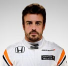

14 July 29, 1981 • F1 Debut 2001 (Minardi) • Races 311 FERNANDO Wins 32Poles 22 • F/Laps 23 ALONSO World Champion 2005 2006

2017 Season Results so far

GP QUAL Race Points GP QUAL Race Points Australia 11 5 10 Hungary 11 8 4

Bahrain 13 7 6 Belgium 17 dnf -

China 13 7 6 Italy 13 dnf -

Azerbaijan 13 7 6 Singapore 11 7 6

Spain 8 8 4 Russia 17 14 -

Monaco 7 dnf - Japan 18 14 -

Canada 14 dnf - USA 16 dnf -

France 16 16 - Mexico 12 dnf -

Austria 14 8 4 Brazil 18 17 -

GB 13 8 4 UAE

Germany 11 16 -

19

ALFA ROMEO SAUBER F1 TEAM - Chassis C36

Base Hinwil, Switzerland • Debut 1993 (excludes 2006-2010 – BMW years) • Chassis C37 • Engine Ferrari Races 372 • Wins 0 • Poles 0 • F/Laps 3

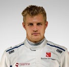

9 MARCUS Born September 2, 1990 • F1 Debut 2014 (Caterham) • Races 96 ERICSSON Wins 0 • Poles 0 • F/Laps 0

2018 Season Results so far

GP QUAL Race Points GP QUAL Race Points

Australia 17 dnf - Hungary 14 15 -

Bahrain 17 9 2 Belgium 14 10 1

China 20 16 - Italy 19 15 -

Azerbaijan 18 11 - Singapore 14 11 -

Spain 17 13 - Russia 10 13 -

Monaco 17 11 - Japan 20 12 -

Canada 19 15 - USA 19 10 1

France 15 13 - Mexico 10 9 2

Austria 20 10 1 Brazil 7 dnf -

GB 15 dnf - UAE

Germany 13 9 2

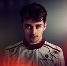

16 CHARLES Born October 16,1977 • F1 Debut 2018 (Sauber) • Races 20 LECLERC Wins 0 • Poles 0 • F/Laps 0

2018 Season Results so far

GP QUAL Race Points GP QUAL Race Points Australia 18 13 - Hungary 17 dnf -

Bahrain 19 12 - Belgium 13 dnf -

China 19 19 - Italy 17 11 -

Azerbaijan 14 6 8 Singapore 13 9 2

Spain 14 10 1 Russia 7 7 6

Monaco 14 18 - Japan 11 dnf -

Canada 13 10 1 USA 9 dnf -

France 8 10 1 Mexico 9 7 6

Austria 13 9 2 Brazil 8 7 6

GB 9 dnf - UAE

Germany 9 15 -

20

ABU DHABI

2009 – 2017

CURRENT DRIVER'S ABU DHABI RECORD

APPEARANCES BEST RESULT BEST QUALIFYING DNF

1st x 3 Pole x 3 2 HAMILTON 9 2011/14/16 2009/12/16 2009/12

1st x 1 Pole x 1 1 BOTTAS 5 2017 2017 2016

1st x 3 Pole x 2 1 VETTEL 9 2009/2010/2013 2010 /11 2011

1st x 1 3rd 1 RAIKKONEN 7 2012 2015 2013

4th 3rd 2 RICCIARDO 7 2014 2016 2011/17

4th 6th VERSTAPPEN 3 0 2016 2016/17

6th 5th 1 HULKENBERG 7 2014/17 2013 2012

11th 10th 2 SAINZ 3 2015 2015 2016/17

4th 6th 1 GROSJEAN 7 2013 2013 2012

11th 9th 1 MAGNUSSEN 3 2014 2014 2016

5th 4th PEREZ 7 0 2015 2015

8th 9th OCON 2 0 2017 2017

2nd 3rd ALONSO 9 0 2011/12 2010

12th 13th VANDOORNE 1 0 2017 2017

16th 17th GASLY 1 0 2017 2017

15th 20th HARTLEY 1 0 2017 2017

LECLERC 0 - - -

14th 18th ERICSSON 3 0 2015 2015

18th 15th STROLL 1 0 2017 2017

SIROTKIN 0 - - -

21

ABU DHABI 2009 – 2017

POLES/PODIUMS/FASTEST LAPS

2009

POLE Lewis Hamilton, McLaren Mercedes – 1:40.948 / 198.066 km/h WINNER Sebastian Vettel, Red Bull Renault

2nd Mark Webber, Red Bull Renault 3rd Jenson Button, Brawn Mercedes

F/LAP Sebastian Vettel, Red Bull Renault – 1:40.279 / 199.387 km/h

2010

POLE Sebastian Vettel, Red Bull Renault – 1:39.394 / 201.163 km/h WINNER Sebastian Vettel, Red Bull Renault

2nd Lewis Hamilton, McLaren Mercedes 3rd Jenson Button, McLaren Mercedes

F/LAP Lewis Hamilton, McLaren Mercedes – 1:41.274 / 197.428 km/h

2011

POLE Sebastian Vettel, Red Bull Renault – 1:38.481 / 203.027 km/h WINNER Lewis Hamilton, McLaren Mercedes

2nd Fernando Alonso, Ferrari

3rd Jenson Button, McLaren Mercedes

F/LAP Mark Webber, Red Bull Renault – 1:42.612 / 194.854 km/h

2012

POLE Lewis Hamilton, McLaren Mercedes – 1:40.630 / 198.692 km/h WINNER Kimi Räikkönen, Lotus F1 Renault

2nd Fernando Alonso, Ferrari

3rd Sebastian Vettel, Red Bull Renault

F/LAP Sebastian Vettel, Red Bull Renault – 1:43.964 / 192.320 km/h

2013

POLE Mark Webber, Red Bull Renault – 1:39.957 / 200.030 km/h WINNER Sebastian Vettel, Red Bull Renault

2nd Mark Webber, Red Bull Renault 3rd Nico Rosberg, Mercedes

F/LAP Fernando Alonso, Ferrari – 1:43.434 / 193.305 km/h

22

2014

POLE Nico Rosberg, Mercedes – 1:40.480 / 198.988 km/h WINNER Lewis Hamilton, Mercedes

2nd Felipe Massa, Williams Mercedes 3rd Valtteri Bottas, Williams Mercedes

F/LAP Daniel Ricciardo, Red Bull Renault – 1:44.496 / 191.341 km/h 2015

POLE Nico Rosberg, Mercedes – 1:40.237 / 199.471 km/h WINNER Nico Rosberg, Mercedes

2nd Lewis Hamilton, Mercedes 3rd Kimi Räikkönen, Ferrari

F/LAP Lewis Hamilton, Mercedes – 1:44.517 / 191.302 km/h

2016

POLE Lewis Hamilton, Mercedes – 1:38.755 / 202.464 km/h WINNER Lewis Hamilton, Mercedes

2nd Nico Rosberg, Mercedes 3rd Sebastian Vettel, Ferrari

F/LAP Sebastian Vettel, Ferrari – 1:43.729 / 192.756 km/h

2017

POLE Valtteri Bottas, Mercedes – 1:36.231 / 207.775 km/h WINNER Valtteri Bottas, Mercedes

2nd Lewis Hamilton, Mercedes 3rd Sebastian Vettel, Ferrari

F/LAP Valtteri Bottas, Mercedes – 1:40.650 / 198.652 km/h

23

ABU DHABI 2009 – 2017

DRIVERS WHO HAVE SCORED POINTS IN ABU DHABI

Total Driver 09 10 11 12 13 14 15 16 17

**

| 160 | Lewis HAMILTON |  | 18 | 25 |  | 6 | 50 | 18 | 25 | 18 |
| --- | --- | --- | --- | --- | --- | --- | --- | --- | --- | --- |
| 125 | Sebastian VETTEL | 10 | 25 |  | 15 | 25 | 8 | 12 | 15 | 15 |
| 78 | Nico ROSBERG |  | 12 | 8 |  | 15 |  | 25 | 18 |  |
| 64 | Felipe MASSA |  | 1 | 10 | 6 | 4 | 36 | 4 | 2 | 1 |
| 62 | Kimi RAÏKKÖNEN |  |  |  | 25 |  | 2 | 15 | 8 | 12 |
| 59 | Fernando ALONSO |  | 6 | 18 | 18 | 10 | 4 |  | 1 | 2 |
| 56 | Jenson BUTTON | 6 | 15 | 15 |  |  | 20 |  |  |  |
| 55 | Valtteri BOTTAS |  |  |  |  |  | 30 |  |  | 25 |
| 43 | Daniel RICCIARDO |  |  |  | 1 |  | 24 | 8 | 10 | 0 |
| 42 | Mark WEBBER | 8 | 4 | 12 |  | 18 |  |  |  |  |
| 36 | Nico HÜLKENBERG |  |  |  |  |  | 16 | 6 | 6 | 8 |
| 34 | Sergio PÉREZ |  |  |  |  | 2 | 12 | 10 | 4 | 6 |
| 22 | Max VERSTAPPEN |  |  |  |  |  |  |  | 12 | 10 |
| 17 | Rubens BARRICHELLO | 5 |  |  | 12 |  |  |  |  |  |
| 14 | Romain GROSJEAN |  |  |  |  | 12 |  | 2 |  |  |
| 12 | Kamui KOBAYASHI | 3 |  | 1 | 8 |  |  |  |  |  |
| 12 | Paul DI RESTA |  |  | 2 | 2 | 8 |  |  |  |  |
| 10 | Robert KUBICA |  | 10 |  |  |  |  |  |  |  |
| 10 | Pastor MALDONADO |  |  |  | 10 |  |  |  |  |  |
| 8 | Vitaly PETROV |  | 8 |  |  |  |  |  |  |  |
| 6 | Michael SCHUMACHER |  |  | 6 |  |  |  |  |  |  |
| 5 | Adrian SUTIL |  |  | 4 |  | 1 |  |  |  |  |
| 4 | Nick HEIDFELD | 4 |  |  |  |  |  |  |  |  |
| 4 | Bruno SENNA |  |  |  | 4 |  |  |  |  |  |
| 4 | Esteban OCON |  |  |  |  |  |  |  |  | 4 |
| 2 | Jarno TRULLI | 2 |  |  |  |  |  |  |  |  |
| 2 | Jaime ALGUERSUARI |  | 2 |  |  |  |  |  |  |  |
| 1 | Sebastien BUEMI | 1 |  |  |  |  |  |  |  |  |
| 1 | Daniil KVYAT |  |  |  |  |  |  | 1 |  |  |

** Double points awarded in 2014

24

2017 FIA FORMULA 1®

ETIHAD AIRWAYS

ABU DHABI GRAND PRIX

QUALIFYING

Pos. No. Driver Nat Car Qualifying Time

1 77 Valtteri BOTTAS FIN Mercedes 1:36.231 / 207.775 km/h

2 44 Lewis HAMILTON GBR Mercedes 1:36.403

3 5 Sebastian VETTEL GER Ferrari 1:36.777

4 3 Daniel RICCIARDO AUS Red Bull Renault 1:36.959

5 7 Kimi RAIKKONEN FIN Ferrari 1:36.985

6 33 Max VERSTAPPEN NDL Red Bull Renault 1:37.328

7 27 Nico HULKENBERG GER Renault 1:38.282

8 11 Sergio PEREZ MEX Force India Mercedes 1:38.374

9 31 Esteban OCON FRA Force India Mercedes 1:38.397

10 19 Felipe MASSA BRA Williams Mercedes 1:38.550

11 14 Fernando ALONSO ESP McLaren Honda 1:38.636

12 55 Carlos SAINZ ESP Renault 1:38.725

13 2 Stoffel VANDOORNE BEL McLaren Honda 1:38.808

14 20 Kevin MAGNUSSEN DEN Haas Ferrari 1:39.298

15 18 Lance STROLL CAN Williams Mercedes 1:39.646

16 8 Romain GROSJEAN FRA Haas Ferrari 1:39.516

17 10 Pierre GASLY FRA Toro Rosso Renault 1:39.724

18 94 Pascal WEHRLEIN GER Sauber Ferrari 1:39.930

19 9 Marcus ERICSSON SWE Sauber Ferrari 1:39.994

20 28 Brendon HARTLEY NZL Toro Rosso Renault 1:40.471

25

2017 FIA FORMULA 1® ETIHAD

AIRWAYS ABU DHABI GRAND PRIX

RACE CLASSIFICATION

Pos. No. Driver Nat Car Time / Gap

1 77 Valtteri BOTTAS FIN Mercedes 1:34.14.062 / 194.422 km/h

2 44 Lewis HAMILTON GBR Mercedes 3.899

3 5 Sebastian VETTEL GER Ferrari 19.330

4 7 Kimi RAIKKONEN FIN Ferrari 45.386

5 33 Max VERSTAPPEN NDL Red Bull Renault 46.269

6 27 Nico HULKENBERG GER Renault 85.713

7 11 Sergio PEREZ MEX Force India Mercedes 92.062

8 31 Esteban OCON FRA Force India Mercedes 98.911

9 14 Fernando ALONSO ESP McLaren Honda 1 lap

10 19 Felipe MASSA BRA Williams Mercedes 1 lap

11 8 Romain GROSJEAN FRA Haas Ferrari 1 lap

12 2 Stoffel VANDOORNE BEL McLaren Honda 1 lap

13 20 Kevin MAGNUSSEN DEN Haas Ferrari 1 lap

14 94 Pascal WEHRLEIN GER Sauber Ferrari 1 lap

15 28 Brendon HARTLEY NZL Toro Rosso Renault 1 lap

16 10 Pierre GASLY FRA Toro Rosso Renault 1 lap

17 9 Marcus ERICSSON SWE Sauber Ferrari 1 lap

18 18 Lance STROLL CAN Williams Mercedes 1 lap

NOT CLASSIFIED

55 Carlos SAINZ ESP Renault dnf 3 Daniel RICCIARDO AUS Red Bull Renault dnf

FASTEST LAP

77 Valtteri BOTTAS FIN Mercedes (lap 52) 1:40.650 / 198.652 km/h

26

2017 FIA FORMULA 1® ETIHAD

AIRWAYS ABU DHABI GRAND PRIX

RACE REVIEW

Silver Arrows win – in reverse order

Sometimes the supporting players are allowed their moment in the spotlight, and so it proved when Valtteri Bottas won the ninth Abu Dhabi Grand Prix for Mercedes ahead of teammate Lewis Hamilton and Sebastian Vettel’s Ferrari.

It was the fourth 1-2 finish for the Silver Arrows in a dominant 2017 season, but the first one in which the 28-year- old Finn, in his first year with the team, had led Hamilton home.

Bottas set up the victory, his third of the year, by starting from his fourth pole position. His time of 1 minute 36.231 seconds was two and a half seconds inside the 2016 pole-winning time, and he was clearly a man on a mission after finishing second to Vettel at Interlagos two weeks earlier.

‘I was so gutted in the last race in Brazil,’ he admitted, ‘being on pole but missing the win, so I have a clear target for tomorrow.’

Come Sunday, Valtteri’s aim was true. He outran world champion Hamilton by almost four seconds, with Vettel a distant third almost 20 seconds adrift.

‘I was really managing the pace and that way the race,’ said Bottas, who completed F1’s equivalent of a football hat-trick by setting the fastest race lap of 1:40.650, an average speed of 198.652 km/h.

‘The last few laps I started to go a bit quicker and build the gap,’ Bottas added. ‘It’s a really important win for me after a pretty difficult start to the second half of the season. I couldn’t be happier to finish the season like this.’

With the exception of Daniel Ricciardo’s Red Bull, sidelined by hydraulic issues after 20 laps, the other five cars at the front of the grid came home in their starting order. Kimi Räikkönen’s Ferrari was fourth ahead of the second Red Bull driven by Max Verstappen, a frustrated young man after being snarled up in late-race traffic.

Behind them, sixth place was a significant achievement for Nico Hülkenberg as it carried Renault past Toro Rosso in the constructors’ standings.

Force India supplied seventh and eighth in the shapes of Sergio Pérez and Esteban Ocon, with Fernando Alonso in the points for McLaren in ninth, the veteran Spaniard’s third consecutive top-10 finish rounding off a low-key season on a slightly higher note.

Another much-loved F1 veteran, Felipe Massa, rounded out the top 10 finishers – and this time it really was farewell for the Brazilian, coaxed out of the previous year’s retirement for one final fling with Williams.

Of the 20 starters, 18 completed the race. Joining Ricciardo on the DNF list was Carlos Sainz, whose Renault was released from a pit stop with its front left wheel incorrectly attached and almost coming adrift in Yas Marina Circuit’s unique tunnel.

Hamilton’s fourth title came with a comfortable 46-point margin over Vettel, with Bottas 12 points behind the German, while Mercedes swamped Ferrari by 146 points to make it four consecutive seasons with both titles won by the Silver Arrows. They were clearly the target for the rest in 2018.

27

USEFUL ABU DHABI

INFORMAION

Discover Abu Dhabi

Capture the architectural prowess of the Sheikh Zayed Grand Mosque, zoom to the pace of a speedboat tour of Abu Dhabi’s coastline, tune to the sound of the wind while sand skiing at sunset, and enjoy breath-taking views from the emirate’s clear skies. Experience an adrenaline-rush while challenging enormous sand dunes or the world’s faster roller coaster at Ferrari World Abu Dhabi, try one of Yas Waterworld’s 43 rides, slides & attractions, enjoy the peace and tranquility of a stroll through Al Ain’s cooling oasis, and cruise our waters in a traditional pearling boat.

Captivating culture, breathtaking luxury, exhilarating adventure and the warmth of Arabian hospitality await you in Abu Dhabi. www.visitabudhabi.ae

Abu Dhabi is a genuine leisure haven, with attractions for every taste - a destination that intrigues, captivates and invites you to discover more.

Culture & Heritage

Abu Dhabi’s culture is firmly rooted in Arabia’s Islamic traditions, creating a shining example of Islam’s true commitment to tolerance and hospitality. The combination of international influences and a strong commitment to local heritage has created an intriguing mix of new and old.

Once a vital green oasis on the caravan route from UAE to Oman, Al Ain (meaning ‘The Spring’) is the emirate’s heritage heartland, one of the world’s oldest continually inhabited settlements, and a UNESCO World Heritage Site.

An exquisite architectural work of art and one the world’s largest mosques, with a capacity for an astonishing 41,000 worshippers, Sheikh Zayed Grand Mosque features 82 domes, over 1,000 columns, 24-carat gold gilded chandeliers and the world’s largest hand knotted carpet. The main prayer hall is dominated by one of the world’s largest chandeliers –10 metres in diameter, 15 metres in height and weighing 12 tonnes.

Just seven minutes from downtown Abu Dhabi and 20 minutes from Abu Dhabi International Airport, the 27 square kilometre Saadiyat Island is undergoing remarkable transformation into a world class leisure, residential, business and cultural hub, housing the world’s largest single concentration of premier cultural assets.

Led by The Louvre Abu Dhabi, which is home to hundreds of acclaimed works of art and masterpieces from around the world. The Louvre Abu Dhabi will be joined by the Zayed National Museum and Guggenheim Abu Dhabi - all designed by Pritzker prize winners.

Desert Experiences

The vast expanse of desert that lies outside the Liwa Oasis in the Western Region is perfect for adrenaline fuelled off-road driving. With 300-metre dunes and long sand valleys, you’ll never get bored of desert driving.

Skiing takes on a whole new meaning on Abu Dhabi’s desert dunes. Boasting the world’s largest dunes, towering hundreds of metres above the surrounding plains, the Liwa Oasis is a sand skier’s paradise.

A trip to the desert isn’t complete without a night under the stars. You can arrange camping adventures with a tour company or rent a four wheel drive and buy the equipment yourself.

Almost a fairytale from ‘1001 nights’, the magnificent Qasr Al Sarab Desert Resort by Anantara seems to spring out of nowhere, a luxurious oasis in the midst of the mystic Liwa Desert. Enjoy an array of facilities and desert experiences and immerse yourself in the wonderful splendour of an eternally changing landscape.

On a dedicated Al Khatem plot in Al Ain, deep in Abu Dhabi’s heritage heartland, the Arabian Nights Village harnesses the soul and essence of old Arabia. Conceived to give visitors a chance to experience the mythical and timeless beauty of the desert and traditional Emirati life, the village is not a hotel, but by no means a rustic camp.

28

Discover Yas Island

An emerging entertainment destination within a 30-minute drive of the UAE capital, Yas Island is home to the state- of-the-art Yas Marina Circuit – host to the FORMULA 1® ETIHAD AIRWAYS ABU DHABI GRAND PRIX. Get to grips with Yas Marina Circuit through a series of track day packages, including ‘Driver Experiences’, ‘Passenger Experiences’, ‘Private Driving Tuition’ programmes and ‘Racing License Courses’.

The circuit’s centrepiece is Yas Hotel Abu Dhabi, a five-star, iconic hotel – the only one in the world to straddle an F1® race track and is breathtakingly built half on land and half over water.

Attracting super yachts from as far away as Australia for the annual FORMULA 1® ETIHAD AIRWAYS ABU DHABI GRAND PRIX, the Yas Marina is central to Abu Dhabi’s ambitions of becoming a strong rival to traditional yachting grounds such as the Mediterranean and Caribbean. Overlooking the stunning Yas Marina F1® Circuit, Cipriani features signature dishes from Harry’s Bar in Venice and classic Italian favourites.

It’s fast and furious fun for all ages at Ferrari World Abu Dhabi – the world’s first Ferrari theme park and the largest attraction of its kind. The park tells the Ferrari story with passion and excitement through more than 20 exhilarating and educational rides and attractions, interactive shopping and authentic Italian dining experiences.

Yas Waterworld spans an area equivalent to 15 football pitches, with 43 rides, slides and attractions – five of which are one-of-a-kind. Visitors to this this futuristic waterpark will be able to try the 238-metre long, world’s first, and largest hydromagnetic-powered, six-person tornado waterslide. For adrenaline seekers there are three-metre high waves on Bubble’s Barrel, which has the world’s largest surfable sheet wave for flowboards and bodyboards. The Bandit Bomber, a 550-metre coaster, is the first with onboard water and laser effects. Riders can shoot jets of water at targets, drop water bombs and trigger special effects, while people below can spray them with water as they pass. A true full-day experience, the park draws on Abu Dhabi’s heritage and has ‘The Lost Pearl’ as its theme. It also fea- tures a souk, pearl-diving exhibits and restaurants.

Warner Bros. World™ Abu Dhabi Brings together all your favorite Warner Bros. characters and stories under one roof to offer you an enthralling, captivating day out for all the family. Walk through the iconic Warner

Bros. shield and be transported to a whole new world of action, adventure, wackiness and more, in which you can create and enjoy many a memorable moment with family and friends!

On the west shores of Yas Island, Yas Links Abu Dhabi – an award-winning golf course, designed by Kyle Phillips, one of the world’s leading golf course architects – is in line with the traditional links golf commonly associated with the coastal towns of Scotland and Ireland. Voted among the ‘Top 10 New International Golf Courses’ by the influential US publication Golf Magazine, Yas Links features a 7,450-yard, par 72 course, utilising five teeing grounds per hole, with all 18 benefiting from ocean views. Recently Yas Links has also been named one of the world’s top 25 by influential US magazine, Golf Digest.

Set on Yas Island’s tranquil southern shores, Yas Beach is the island’s only stretch of beach. Open daily from 10am to 7pm, it is a great spot to relax and enjoy sun, sea, sand, food and drinks, and there’s plenty of car parking avail- able. The island also houses Abu Dhabi’s biggest and the UAE’s second largest shopping centre, the Yas Mall. The mall provides a vibrant getaway shopping experience for tourists, international guests and local residents.

Yas Mall

A Prime Destination for Shopping, Dining and Entertainment, Yas Mall is the capital’s ultimate destination for shop- ping, dining and entertainment right in the heart of Yas Island.

Immersed in natural light, the spacious avenues of this experiential shopping destination offer three floors of exciting, leading international and regional retail and restaurant brands, with 370 stores and more than 60 indoor and outdoor restaurants and cafes. Yas Mall also offers endless entertainment, with a 20 screen state-of-the-art cinema operated by VOX Cinemas and a family entertainment zone by Fun Works, as well as a direct link to Ferrari World Abu Dhabi, the world’s largest indoor theme park.

Yas Mall brings a variety of unique and exclusive stores, including the Capital’s only Apple store and TRYANO the luxury department store from Chalhoub Group with a range of shoes, bags and children’s clothing; in addition to the region’s largest stores from some of the most prominent brands such as Zara, Nike and Adidas, amongst many more.

For more info: www.yasmall.ae

29

MAPS & DIAGRAMS

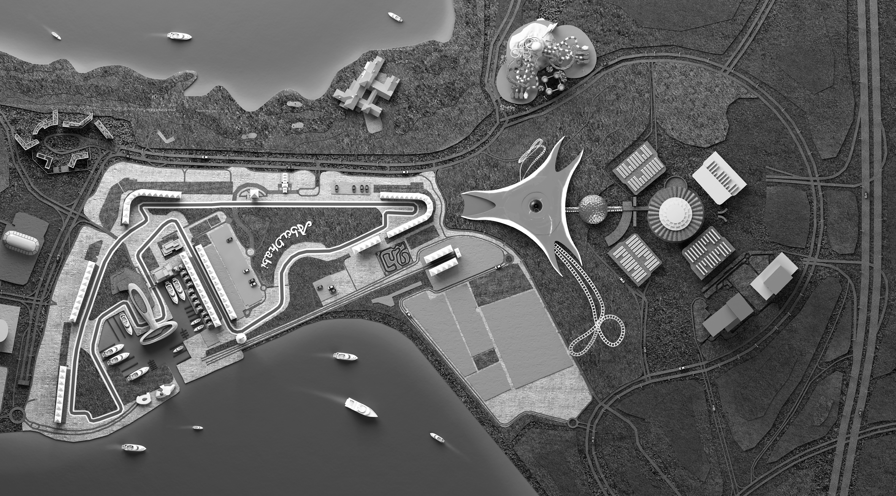

MEDIA CENTRE, MAC, PARKING & SHUTTLE

2018 MEDIA SHUTTLE

YYAASS WWEESSTT EENNTTRRAANNCCEE

M 2

M 3 RG 75

M 1

YYAASS EEAASSTT EENNTTRRAANNCCEE

M M 1 MEDIA PARKING 2 MEDIA ACCREDITATION CENTER

M MEDIA CENTER 3

Media Shuttle Schedule

Wednesday November 21 11:30 – 21:00

Thursday November 22 08:30 – 23:00

Friday November 23 08:30 – 00:00

Saturday November 24 08:30 – 01:00

Sunday November 25 08:30 – 02:00

30

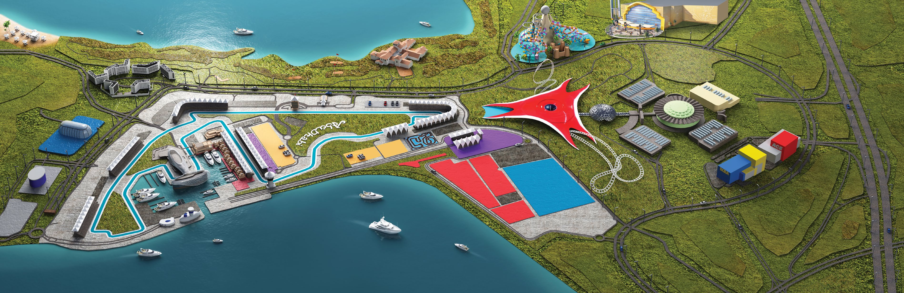

CIRCUIT MAP LAYOUT

31

PHOTOGRAPHERS WINDOW MAP

SETUOR

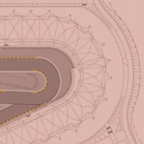

SSECCA D N A 77 T S SREHPARGOTOHP D N A R G H T R O setuoR N wodniW ffoporD/pukciP setuoR sseccA 6 5 gniklaW gnicneF GNIWOHS DNEGEL srehpargotohP ylnO oN & sirbeD - enoZ elttuhS elttuhS gniklaW NOITARUGIFNOC deR oN

2 TIUCRIC 4 LLUF

3

2

stohS rof noitacoL potS tiP 11 SMAHS eniL 11 yrtnaG tratS GRANDSTAND

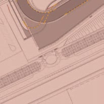

muidoP MAIN eniL BUILDING hsiniF PIT MAIN

D lortnoC N 12 A T S D ecaR N ANIRAM A 9911 R G T 2 S E W 9 8 02 ertneC 8811

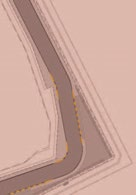

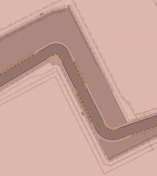

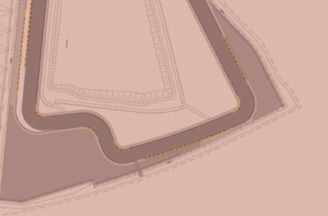

aideM 7711 1 4411 sseccA 01 oN 61

DNATSDNARG 51 3311 ANIRAM 2211 ANIRAM

1111 DNATSDNARG HTUOS 2

32

Note:

..........................................................................................................................................................................................................

..........................................................................................................................................................................................................

..........................................................................................................................................................................................................

..........................................................................................................................................................................................................

..........................................................................................................................................................................................................

..........................................................................................................................................................................................................

..........................................................................................................................................................................................................

..........................................................................................................................................................................................................

..........................................................................................................................................................................................................

..........................................................................................................................................................................................................

..........................................................................................................................................................................................................

..........................................................................................................................................................................................................

..........................................................................................................................................................................................................

..........................................................................................................................................................................................................

..........................................................................................................................................................................................................

..........................................................................................................................................................................................................

..........................................................................................................................................................................................................

..........................................................................................................................................................................................................

..........................................................................................................................................................................................................

..........................................................................................................................................................................................................

..........................................................................................................................................................................................................

..........................................................................................................................................................................................................

..........................................................................................................................................................................................................

33
