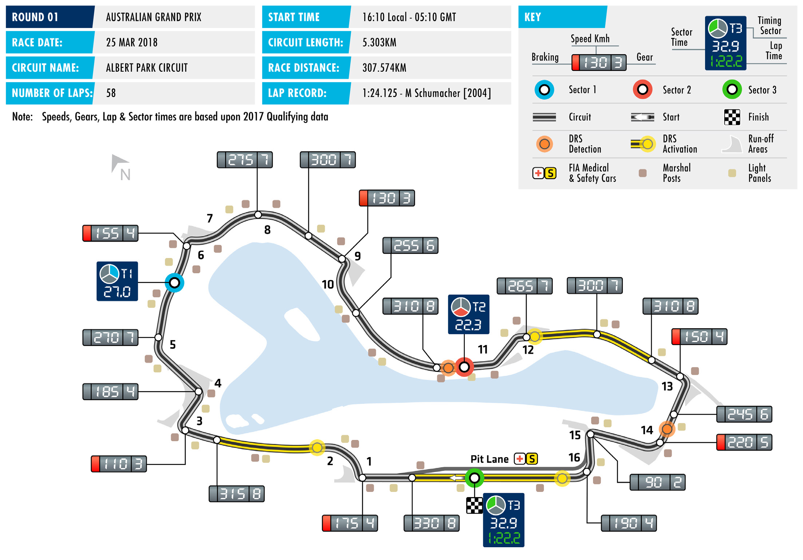

2018 AUSTRALIAN GRAND PRIX

23 – 25 March 2018

The 2018 FIA Formula 1 World Championship kicks off this MELBOURNE GRAND PRIX CIRCUIT

weekend at the season’s traditional curtain-raiser, the Length of lap: 5.303km Australian Grand Prix at the Melbourne Grand Prix Circuit Lap record: in Albert Park. 1:24.125 (Michael Schumacher, The temporary track around the Albert Park lake provides a Ferrari, 2004)

tough test for drivers, engineers and their new machinery. Start line/finish line offset: 0.000km A street circuit, the Albert Park surface lacks grip early in the Total number of race laps: weekend and for drivers the early practice sessions on a narrow 58 layout featuring close barriers are about building performance Total race distance: slowly as the tracks ‘rubbers in’ - no easy task as they prepare to 307.574km run their new cars in anger for the first time. For teams, the high Pitlane speed limits: track evolution at this unrepresentative venue, makes set-up 60km/h in practice, qualifying, something of a moving target, again a tricky prospect as they and the race

attempt to optimise performance of cars with just two weeks of

pre-season testing data to draw upon. CIRCUIT NOTES

► The kerb on the exit of Turn 5 has A further variable comes in the shape of a new range of tyres for been lengthened by 5 metres. 2018, with tyre manufacturer Pirelli increasing the number of dry ► The kerb on the exit of Turn 12 tyre compounds to seven. A new pink-banded hypersoft tyre has has again been ground down been introduced while at the harder end of the spectrum the to remove a bump that proved familiar orange-banded hard compound of last year becomes troublesome in 2017.

an ultrahard compound while the hard tyre gets a new ice-blue ► The kerbs on the exit of Turns 13 and 14 have been renewed, using livery. On offer this weekend in Melbourne are the yellow- 50mm negative kerbs. marked soft, the red supersoft and the purple ultrasoft. DRS ZONE While this weekend will offer the first real indication of the ► There will be three DRS zones at pecking order among F1’s teams, pre-season testing indicates the Australian Grand Prix. The first that the battle for this season’s titles is once again likely to detection point is 170m before Turn 11, with the Zone 1 activation be fought by 2017’s top three teams, champions Mercedes, point coming 104m after Turn runners-up Ferrari and third-placed Red Bull Racing. 12. The second detection point,

Formula 1’s midfield is meanwhile set to be another extremely shared by Zones 2 and 3, is 13m before Turn 14. The activation tight contest with last year’s fourth-placed outfit, Force India, point for Zone 2 is 30m after Turn likely to face stiff competition from Renault, Williams Toro Rosso 16, while the activation point for and potential dark horses Haas, while reinvigorated McLaren and Zone 3 is 32m after Turn 2.

Sauber looks set to join the fray after difficult recent seasons.

FAST FACTS

► This will be the 34th F1 Australian Albert Park is Fernando Alonso, who won his Australian tally in 2012, again with Grand Prix and the 23rd to be held at with Renault all the way back in 2006. McLaren. He has since taken pole four Melbourne’s Albert Park. The race joined times for Mercedes – in each of the past the calendar in 1985, with the first race ► Haas’ Kevin Magnussen scored his four years. 2016’s effort was Hamilton’s being held in Adelaide. It moved to maiden podium finish at the Australian 50th career pole and he currently Melbourne in 1996.. Grand Prix in 2014. It was the Dane’s has 72 to his name. Only two other grand prix debut and he finished second current drivers have been on pole here: ► The most successful driver here is for McLaren, behind winner Nico Rosberg Räikkönen in 2007, and Vettel, who has Michael Schumacher, with the German of Mercedes and ahead of third-placed three Melbourne poles to his credit, in winning four times from 19 attempts. He McLaren team-mate Jenson Button. 2010, 2011 and 2013. recorded a hat-tricks of wins from 2000 to 2002 and then won again in 2004 – ► Seven other drivers made their first ► Hamilton holds the outright record all for Ferrari. Next on the list is Jenson podium appearance at the Australian for podium appearances in Australia, Button. The Briton won for Brawn GP in GP: Philippe Streiff (1985) and Gianni with seven. Allied to his pair of wins, he 2009 and then scored a brace of victories Morbidelli (1995) tasted the champagne finished second in 2011, 2016 and last for McLaren in 2010 and 2012. in Adelaide, while Jacques Villeneuve year, and took third in 2007 and 2012. (1996), Räikkönen (2002), Hamilton ► Four current drivers have Australian (2007), Nico Rosberg (2008) and Vitaly ► Albert Park will be virgin territory for Grand Prix victories to their name, with Petrov (2011) all took their maiden four drivers this weekend. Reigning F2 three scoring a brace of wins, doing so podium finishes at Albert Park. champion Charles Leclerc makes his F1 with a different team on each occasion. race debut with Sauber, and multiple Kimi Räikkönen won for Ferrari in 2007 ► Ayrton Senna and Lewis Hamilton jointly race-winning former GP2 driver and and then for Lotus in 2013. Lewis hold the Australian Grand Prix pole former Renault reserve driver Sergey Hamilton won with McLaren in 2008 and position record, with six apiece. All of Sirotkin starts for Williams. However, with Mercedes in 2015, and Sebastian Senna’s were scored in Adelaide, while while Toro Rosso’s Pierre Gasly and Vettel won with Red Bull Racing in 2011 Hamilton’s have all come at Albert Park. Brendon Hartley made a total of nine and then with Ferrari last year. The only The Briton kicked off his record run in grand prix starts in 2017, neither has other current driver to have won at 2008 with McLaren and then doubled raced at this circuit before.

RACE STEWARDS BIOGRAPHIES

TIM MAYER

FIA ALTERNATE DELEGATE TO THE USA, FIA STEWARD

As the son of former McLaren team principal Teddy Mayer, Tim Mayer grew up around motor sport. He organised IndyCar races internationally from 1992-98, aided the construction of several circuits, and produced international TV for multiple series. In 1998 he became CART’s Senior VP for Racing Operations. He also became VP of ACCUS, the US ASN. In 2003, Mayer became COO of IMSA, operating multiple series at all levels, and also took on the role of COO and Race Director of the American Le Mans Series. He was elected an independent Director of ACCUS and FIA US Alternate Delegate, responsible for US World Championship events.

ENZO SPANO

PRESIDENT OF THE SPORTING COMMISSION OF THE AUTOMOBILE AND TOURING CLUB OF VENEZUELA

Italian-born Vincenzo Spano grew up in Venezuela, where he went on to study at the Universidad Central de Venezuela, becoming an attorney-at-law. Spano has wide-ranging experience in motor sport, from national to international level. He has worked for the Touring y Automóvil Club de Venezuela since 1991, and served as President of the Sporting Commission since 2001. He was president for two terms and now sits as a member of the Board of the Nacam- FIA zone. Since 1995 Spano has been a licenced steward and obtained his FIA steward superlicence in 2003. Spano has been involved with the FIA and FIA Institute in various roles since 2001: a member of the World Motor Sport Council, the FIA Committee, and the executive committee of the FIA Institute.

EMANUELE PIRRO

FORMER FORMULA ONE DRIVER AND FIVE-TIMES LE MANS WINNER

During a motor sport career spanning almost 40 years, Emanuele Pirro has achieved a huge amount of success, most notably in sportscar racing, with five Le Mans wins, victory at the Daytona 24 Hours and two wins at the Sebring 12 Hours. In addition, the Italian driver has won the German and Italian Touring Car championships (the latter twice) and has twice been American Le Mans Series Champion. Pirro, enjoyed a three-season F1 career from 1989 to 1991, firstly with Benetton and then for Scuderia Italia. His debut as an FIA Steward came at the 2010 Abu Dhabi Grand Prix and he has returned regularly since.

2017 Formula One World Championship

DRIVERS’ CHAMPIONSHIP FINAL STANDINGS

|  | ANIHC | NIARHAB | AISSUR | NIAPS | OCANOM | ADANAC | NAJIABREZA | AIRTSUA | BG | YRAGNUH | MUIGLEB | YLATI | EROPAGNIS | AISYALAM | NAPAJ | ASU | OCIXEM | LIZARB | IBAHD UBA |
| --- | --- | --- | --- | --- | --- | --- | --- | --- | --- | --- | --- | --- | --- | --- | --- | --- | --- | --- | --- |
| 18 2 | 25 1 | 18 2 | 12 4 | 25 1 | 6 7 | 25 1 | 10 5 | 12 4 | 25 1 | 12 4 | 25 1 | 25 1 | 25 1 | 18 2 | 25 1 | 25 1 | 2 9 | 12 4 | 18 2 |
| 25 1 | 18 2 | 25 1 | 18 2 | 18 2 | 25 1 | 12 4 | 12 4 | 18 2 | 6 7 | 25 1 | 18 2 | 15 3 | NC | 12 4 | NC | 18 2 | 12 4 | 25 1 | 15 3 |
| 15 3 | 8 6 | 15 3 | 25 1 | NC | 12 4 | 18 2 | 18 2 | 25 1 | 18 2 | 15 3 | 10 5 | 18 2 | 15 3 | 10 5 | 12 4 | 10 5 | 18 2 | 18 2 | 25 1 |
| 12 4 | 10 5 | 12 4 | 15 3 | NC | 18 2 | 6 7 | 14 | 10 5 | 15 3 | 18 2 | 12 4 | 10 5 | NC | NC | 10 5 | 15 3 | 15 3 | 15 3 | 12 4 |
| NC | 12 4 | 10 5 | NC | 15 3 | 15 3 | 15 3 | 25 1 | 15 3 | 10 5 | NC | 15 3 | 12 4 | 18 2 | 15 3 | 15 3 | NC | NC | 8 6 | NC |
| 10 5 | 15 3 | NC | 10 5 | NC | 10 5 | NC | NC | NC | 12 4 | 10 5 | NC | 1 10 | NC | 25 1 | 18 2 | 12 4 | 25 1 | 10 5 | 10 5 |
| 6 7 | 2 9 | 6 7 | 8 6 | 12 4 | 13 | 10 5 | NC | 6 7 | 2 9 | 4 8 | 17 | 2 9 | 10 5 | 8 6 | 6 7 | 4 8 | 6 7 | 2 9 | 6 7 |
| 1 10 | 1 10 | 1 10 | 6 7 | 10 5 | 12 | 8 6 | 8 6 | 4 8 | 4 8 | 2 9 | 2 9 | 8 6 | 1 10 | 1 10 | 8 6 | 8 6 | 10 5 | NC | 4 8 |
| 4 8 | 6 7 | NC | 1 10 | 6 7 | 8 6 | NC | 4 8 | NC | NC | 6 7 | 1 10 | 14 | 12 4 | NC | NC | 6 7 | NC | 11 | NC |
| 11 | 12 | 2 9 | 4 8 | 8 6 | NC | 4 8 | NC | 13 | 8 6 | 17 | 8 6 | 13 | NC | 16 | NC | NC | NC | 1 10 | 8 6 |
| 8 6 | 14 | 8 6 | 2 9 | 13 | 2 9 | NC | NC | 2 9 | 1 10 | – | 4 8 | 4 8 | 11 | 2 9 | 1 10 | 2 9 | 11 | 6 7 | 1 10 |
| NC | NC | NC | 11 | 16 | 15 | 2 9 | 15 3 | 1 10 | 16 | 14 | 11 | 6 7 | 4 8 | 4 8 | NC | 11 | 8 6 | 16 | 18 |
| NC | 11 | 4 8 | NC | 1 10 | 4 8 | 1 10 | 13 | 8 6 | 13 | NC | 6 7 | 15 | 2 9 | 13 | 2 9 | 14 | 15 | 15 | 11 |
| NC | 4 8 | NC | 13 | 14 | 1 10 | 12 | 6 7 | NC | 12 | 13 | 15 | 11 | NC | 12 | 4 8 | 16 | 4 8 | NC | 13 |
| NC | NC | 14 | NC | 12 | _ | 16 | 2 9 | NC | NC | 8 6 | NC | 17 | NC | 11 | 11 | NC | 1 10 | 4 8 | 2 9 |
| 13 | NC | NC | 14 | NC | NC | 14 | 12 | 12 | 11 | 1 10 | 14 | NC | 6 7 | 6 7 | 14 | 12 | 12 | NC | 12 |
| NC | 13 | 13 | NC | 15 | 11 | 11 | NC | 11 | NC | 12 | 13 | NC | 8 6 | 15 | 12 | – | – | – | – |
| – | – | 11 | 16 | 4 8 | NC | 15 | 1 10 | 14 | 17 | 15 | NC | 16 | 12 | 17 | 15 | NC | 14 | 14 | 14 |
| 2 9 | NC | 12 | 12 | 2 9 | 14 | NC | NC | 16 | 15 | 11 | 12 | 12 | NC | – | – | 1 10 | – | – | – |
| NC | 15 | NC | 15 | 11 | NC | 13 | 11 | 15 | 14 | 16 | 16 | 18 | NC | 18 | NC | 15 | NC | 13 | 17 |
| – | – | – | – | – | – | – | – | – | – | – | – | – | – | 14 | 13 | – | 13 | 12 | 16 |
| 12 | NC | – | – | – | – | – | – | – | – | – | – | – | – | – | – | – | – | – | – |
| – | – | – | – | – | – | – | – | – | – | – | – | – | – | – | – | 13 | NC | NC | 15 |
| – | – | – | – | – | NC | – | – | – | – | – | – | – | – | – | – | – | – | – | – |
| – | – | – | – | – | – | – | – | – | – | NC | – | – | – | – | – | – | – | – | – |

STNIOP

1 L. HAMILTON 363

2 S. VETTEL 317

3 V. BOTTAS 305

4 K. RÄIKKÖNEN 205

5 D. RICCIARDO 200

M. VERSTAPPEN 168 6

S. PÉREZ 100 7

E. OCON 87 8

C. SAINZ 54 9

N. HÜLKENBERG 43 10

F. MASSA 43 11

L. STROLL 40 12

R. GROSJEAN 28 13

K. MAGNUSSEN 19 14

F. ALONSO 17 15

S. VANDOORNE 13 16

J. PALMER 8 17

P. WEHRLEIN 5 18

D. KVYAT 5 19

M. ERICSSON 0 20

P. GASLY 0 21

A. GIOVINAZZI 0 22

B. HARTLEY 0 23

J. BUTTON 0 24

P. DI RESTA 0 25

2017 Formula One World Championship

CONSTRUCTORS’ CHAMPIONSHIP FINAL STANDINGS

NAJIABREZA AILARTSUA EROPAGNIS IBAHD YRAGNUH AISYALAM STNIOP NIARHAB OCANOM ADANAC AIRTSUA MUIGLEB OCIXEM ANIHC AISSUR NAPAJ LIZARB NIAPS YLATI ASU UBA BG

| 33 2 3 | 33 1 6 | 33 2 3 | 37 1 4 | 25 1 NC | 18 4 7 | 43 1 2 | 28 2 5 | 37 1 4 | 43 1 2 | 27 3 4 | 35 1 5 | 43 1 2 | 40 1 3 | 28 2 5 | 37 1 4 | 35 1 5 | 20 2 9 | 30 2 4 | 43 1 2 |
| --- | --- | --- | --- | --- | --- | --- | --- | --- | --- | --- | --- | --- | --- | --- | --- | --- | --- | --- | --- |
| 37 1 4 | 28 2 5 | 37 1 4 | 33 2 3 | 18 2 NC | 43 1 2 | 18 4 7 | 12 4 14 | 28 2 5 | 21 3 7 | 43 1 2 | 30 2 4 | 25 3 5 | NC NC | 12 4 NC | 10 5 NC | 33 2 3 | 27 3 4 | 40 1 3 | 27 3 4 |
| 10 5 NC | 27 3 4 | 10 5 NC | 10 5 NC | 15 3 NC | 25 3 5 | 15 3 NC | 25 1 NC | 15 3 NC | 22 4 5 | 10 5 NC | 15 3 NC | 13 4 10 | 18 2 NC | 40 1 3 | 33 2 3 | 12 4 NC | 25 1 NC | 18 5 6 | 10 5 NC |
| 7 7 10 | 3 9 10 | 7 7 10 | 14 6 7 | 22 4 5 | 12 13 | 18 5 6 | 8 6 NC | 10 7 8 | 6 8 9 | 6 8 9 | 2 9 17 | 10 6 9 | 11 5 10 | 9 6 10 | 14 6 7 | 12 6 8 | 16 5 7 | 2 9 NC | 10 7 8 |
| 8 6 NC | 14 NC | 8 6 NC | 2 9 11 | 13 16 | 2 9 15 | 2 9 NC | 15 3 NC | 3 9 10 | 1 10 16 | 14 NC | 4 8 11 | 10 7 8 | 4 8 11 | 6 8 9 | 1 10 NC | 2 9 11 | 8 6 11 | 6 7 16 | 1 10 18 |
| 11 NC | 12 13 | 2 9 13 | 4 8 NC | 8 6 15 | 11 NC | 4 8 11 | NC NC | 11 13 | 8 6 NC | 12 17 | 8 6 13 | 13 NC | 8 6 NC | 15 16 | 12 NC | 6 7 NC | NC NC | 1 10 11 | 8 6 NC |
| 6 8 9 | 6 7 NC | 12 NC | 1 10 12 | 8 7 9 | 8 6 14 | NC NC | 4 8 NC | 16 NC | 15 NC | 6 7 11 | 1 10 12 | 12 14 | 12 4 NC | 14 NC | 13 NC | 1 10 13 | 13 NC | 12 NC | 15 16 |
| NC NC | 4 8 11 | 4 8 NC | 13 NC | 1 10 14 | 5 8 10 | 1 10 12 | 6 7 13 | 8 6 NC | 12 13 | 13 NC | 6 7 15 | 11 15 | 2 9 NC | 12 13 | 6 8 9 | 14 16 | 4 8 15 | 15 NC | 11 13 |
| 13 NC | NC NC | 14 NC | 14 NC | 12 NC | NC NC | 14 16 | 2 9 12 | 12 NC | 11 NC | 9 6 10 | 14 NC | 17 NC | 6 7 NC | 6 7 11 | 11 14 | 12 NC | 1 10 12 | 4 8 NC | 2 9 12 |
| 12 NC | 15 NC | 11 NC | 15 16 | 4 8 11 | NC NC | 13 15 | 1 10 11 | 14 15 | 14 17 | 15 16 | 16 NC | 16 18 | 12 NC | 17 18 | 15 NC | 15 NC | 14 NC | 13 14 | 14 17 |

1 MERCEDES AMG 668 PETRONAS F1 TEAM

522 2 SCUDERIA FERRARI

3 RED BULL RACING 368

SAHARA FORCE INDIA 187 4 F1 TEAM

WILLIAMS MARTINI 83 5 RACING

57 6 RENAULT SPORT F1 TEAM

53 7 SCUDERIA TORO ROSSO

47 8 HAAS F1 TEAM

30 9 MCLAREN HONDA

5 10 SAUBER F1 TEAM

FORMULA ONE TIMETABLE & FIA MEDIA SCHEDULE

THURSDAY

Press conference 15.00

FRIDAY

Practice session 1 12.00-13.30 Press conference 14.00

Practice session 2 16.00-17.30

SATURDAY

Practice session 3 14.00-15.00 Qualifying 17.00-18.00 Followed by unilateral and press conference

SUNDAY

Drivers’ Parade 14.40 Race 16.10 Followed by podium interviews and press conference

ADDITIONAL MEDIA OPPORTUNITIES

QUALIFYING

All drivers eliminated in Q1 or Q2 will be available for media interviews immediately after the end of each session, as will drivers who participated in Q3, but who are not required for the post-qualifying press conference. The TV interview pen is located in the paddock on the first grassed area to the left, next to the fountain.

RACE

Any driver retiring before the end of the race will be made available at the TV pen interview area. In addition, during the race every team will make available at least one senior spokesperson for interview by officially accredited TV crews. A list of those nominated will be made available in the media centre.

FIA COMMUNICATIONS DEPARTMENT press@fia.com T +33 1 43 12 58 15
