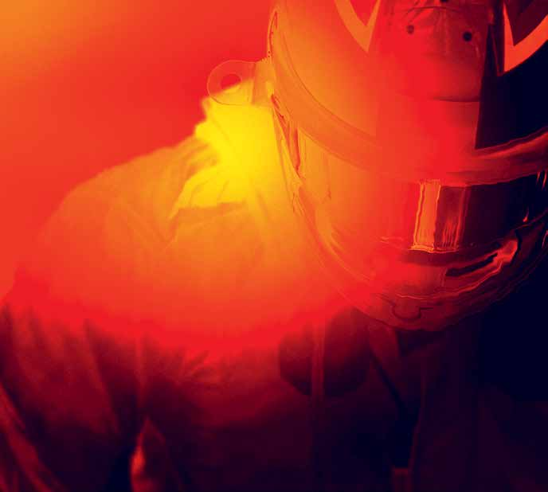
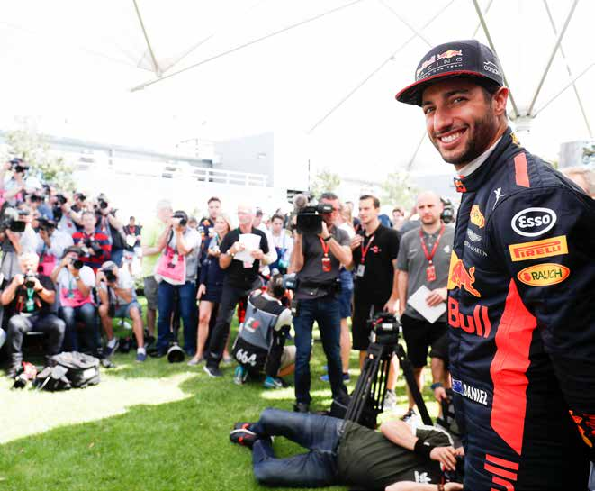

FO MUL A 1

OLE

I

OFFICIAL

22- MEDIA KIT

Official F1 Media Letterhead Width 210mm x Depth 297mm

Formula 1 Official Formula 1™ Media Kit 2018 Rolex Australian Grand Prix Melbourne 22-25 March

CONTENTS

WELCOME 3

KEY CONTACTS 4

OPENING HOURS 5

FORMULA 1® 2018 ROLEX AUSTRALIAN GRAND PRIX: Schedule 6 – 7

PRESS CONFERENCES 8

WORKING IN THE MEDIA CENTRE 9

INFORMATION FOR PHOTOGRAPHERS 10

IT AND TELECOMMUNICATIONS SERVICES 11

2018 FIA FORMULA ONE WORLD CHAMPIONSHIP™: Calendar 12

2018 FIA FORMULA ONE WORLD CHAMPIONSHIP™: Entry List 13

CHANGES IN THE REGULATIONS FOR 2018 14

2018 TEAM AND DRIVER STATISTICS 15 – 16

THE 2018 FORMULA 1® DRIVERS’ MELBOURNE RECORD 17 – 18

2017 FORMULA ONE WORLD CHAMPIONSHIP™: Drivers’ and Constructors’ Final Standings 19

2017 FORMULA 1® ROLEX AUSTRALIAN GRAND PRIX: Qualifying 20

2017 FORMULA 1® ROLEX AUSTRALIAN GRAND PRIX: Race Classification 21

2017 FORMULA 1® ROLEX AUSTRALIAN GRAND PRIX: Race Report 22

MELBOURNE STATISTICS 23 – 24

DRIVERS’ WORLD CHAMPIONSHIP 1950 – 2017 25

CONSTRUCTORS’ WORLD CHAMPIONSHIP 1958 – 2017 26

AUSTRALIAN DRIVERS IN THE WORLD CHAMPIONSHIP 27

USEFUL CONTACTS 28

2018 CIRCUIT MAP 29

Australian Grand Prix Corporation

Level 5/616 St Kilda Road Office: +61 (0) 3 9258 7100 Melbourne VIC 3004 Email: media@grandprix.com.au Australia Website: grandprix.com.au

2

F1 RED C PMS BLACK 6 C

ARTWORK MAY BE RELEASED BEFORE THE RACE TITLE AND EVENT TITLE SPONSOR HAVE BEEN CONFIRMED. PLEASE CHECK THAT ALL INFORMATION IS CORRECT BEFORE GOING TO PRINT. PLEASE CAN YOU ALSO PLACE THE OFFICIAL PROMOTERS ADDRESS, EMAIL AND TELEPHONE NUMBERS IN UPPER AND LOWER CASE IN THE DESIGNATED AREA MARKED BY THE X. PLEASE DO NOT CHANGE THE TYPEFACE OR TYPE SIZE.

Official F1 Media Letterhead Width 210mm x Depth 297mm

Formula 1 Official Formula 1™ Media Kit 2018 Rolex Australian Grand Prix Melbourne 22-25 March

WELCOME BACK...

FORMULA 1® 2018 ROLEX AUSTRALIAN GRAND PRIX

A warm welcome back to Melbourne to all our media friends and colleagues for the Formula 1®

2018 Rolex Australian Grand Prix. As always, our number one priority is to make it easier for

you to send the news from here to the world as the race weekend unfolds. We thank you for all

the work you do and we hope you enjoy being back in Melbourne.

Australian Grand Prix Corporation

Level 5/616 St Kilda Road Office: +61 (0) 3 9258 7100 Melbourne VIC 3004 Email: media@grandprix.com.au Australia Website: grandprix.com.au

3

F1 RED C PMS BLACK 6 C

ARTWORK MAY BE RELEASED BEFORE THE RACE TITLE AND EVENT TITLE SPONSOR HAVE BEEN CONFIRMED. PLEASE CHECK THAT ALL INFORMATION IS CORRECT BEFORE GOING TO PRINT. PLEASE CAN YOU ALSO PLACE THE OFFICIAL PROMOTERS ADDRESS, EMAIL AND TELEPHONE NUMBERS IN UPPER AND LOWER CASE IN THE DESIGNATED AREA MARKED BY THE X. PLEASE DO NOT CHANGE THE TYPEFACE OR TYPE SIZE.

Official F1 Media Letterhead Width 210mm x Depth 297mm

Formula 1 Official Formula 1™ Media Kit 2018 Rolex Australian Grand Prix Melbourne 22-25 March

KEY CONTACTS

FIA F1 Head of Communications and Media Delegate

MATTEO BONCIANI

mbonciani@fia.com

| FIA F1® Deputy Media Delegate |  |  |
| --- | --- | --- |
| PIERRE GUYONNET-DUPERAT pguyonnet@fia.com | +33 1 43 12 58 24 | +33 6 43 12 17 07 |

| AGPC Group Manager of PR, Media and Communications |  |  |
| --- | --- | --- |
| REBECCA HYDE rebecca.hyde@grandprix.com.au | +61 3 9258 7124 | +61 421 557 600 |

| AGPC Corporate Affairs and Communications Specialist |  |  |
| --- | --- | --- |
| ALISON VAN DEN DUNGEN alison.vandendungen@grandprix.com.au | +61 3 9258 7100 | +61 0 408 356 539 |

| AGPC Communications Coordinator |  |  |
| --- | --- | --- |
| ANITA NIELSEN anita.nielsen@grandprix.com.au | +61 3 9258 7130 | +61 433 363 422 |

| National Press Officer |  |  |
| --- | --- | --- |
| ROB VAN LEEUWEN rob.vanleeuwen@grandprix.com.au | +61 3 8698 8249 | +61 418 947 268 |

Australian Grand Prix Corporation

Level 5/616 St Kilda Road Office: +61 (0) 3 9258 7100 Melbourne VIC 3004 Email: media@grandprix.com.au Australia Website: grandprix.com.au

4

F1 RED C PMS BLACK 6 C

ARTWORK MAY BE RELEASED BEFORE THE RACE TITLE AND EVENT TITLE SPONSOR HAVE BEEN CONFIRMED. PLEASE CHECK THAT ALL INFORMATION IS CORRECT BEFORE GOING TO PRINT. PLEASE CAN YOU ALSO PLACE THE OFFICIAL PROMOTERS ADDRESS, EMAIL AND TELEPHONE NUMBERS IN UPPER AND LOWER CASE IN THE DESIGNATED AREA MARKED BY THE X. PLEASE DO NOT CHANGE THE TYPEFACE OR TYPE SIZE.

Official F1 Media Letterhead Width 210mm x Depth 297mm

Formula 1 Official Formula 1™ Media Kit 2018 Rolex Australian Grand Prix Melbourne 22-25 March

MEDIA CENTRE OPENING HOURS

Wednesday 21 March 12:00 – 20:00

Thursday 22 March 09:00 – 22:00

Friday 23 March 09:00 – 23:00

Saturday 24 March 09:00 – 24:00

Sunday 25 March 09:00 until the last Journalist leaves

MEDIA ACCREDITATION CENTRE

Tuesday 20 March 13:00 – 19:00 (permanent credentials only)

Wednesday 21 March 10:00 – 18:00

Thursday 22 March 09:00 – 18:00

Friday 23 March 09:00 – 18:00

Saturday 24 March 09:00 – 15:00

Sunday 25 March Closed

Australian Grand Prix Corporation

Level 5/616 St Kilda Road Office: +61 (0) 3 9258 7100 Melbourne VIC 3004 Email: media@grandprix.com.au Australia Website: grandprix.com.au

5

F1 RED C PMS BLACK 6 C

ARTWORK MAY BE RELEASED BEFORE THE RACE TITLE AND EVENT TITLE SPONSOR HAVE BEEN CONFIRMED. PLEASE CHECK THAT ALL INFORMATION IS CORRECT BEFORE GOING TO PRINT. PLEASE CAN YOU ALSO PLACE THE OFFICIAL PROMOTERS ADDRESS, EMAIL AND TELEPHONE NUMBERS IN UPPER AND LOWER CASE IN THE DESIGNATED AREA MARKED BY THE X. PLEASE DO NOT CHANGE THE TYPEFACE OR TYPE SIZE.

Official F1 Media Letterhead Width 210mm x Depth 297mm

Formula 1 Official Formula 1™ Media Kit 2018 Rolex Australian Grand Prix Melbourne 22-25 March

FORMULA 1® 2018 ROLEX AUSTRALIAN GRAND PRIX SCHEDULE

THURSDAY 22 MARCH

10:00 GATES OPEN TO PUBLIC 10:30-10:55 FERRARI CHALLENGE TROFEO PIRELLI - ASIA PACIFIC – 1ST PRACTICE SESSION 11:00-11:40 FORMULA SAE DEMONSTRATION & GUEST LAPS 11:50-12:10 SHANNONS AUSTRALIAN GT CHAMPIONSHIP – 1ST QUALIFYING SESSION 12:20-12:40 PORSCHE WILSON SECURITY CARRERA CUP – PRACTICE SESSION 12:50-13:20 COATES HIRE SUPERCARS – 1ST PRACTICE SESSION 13:30-13:55 FERRARI CHALLENGE TROFEO PIRELLI - ASIA PACIFIC – 2ND PRACTICE SESSION 14:05-14:20 MSS SECURITY ULTIMATE SPEED COMPARISON PRACTICE 14:25-14:40 AIR FORCE ROULETTES AIR DISPLAY 14:40-15:10 COATES HIRE SUPERCARS – SECOND PRACTICE SESSION 15:00-16:00 FIA FORMULA ONE PRESS CONFERENCE 15:20-15:40 SHANNONS AUSTRALIAN GT CHAMPIONSHIP – SECOND QUALIFYING SESSION 15:50-16:10 PORSCHE WILSON SECURITY CARRERA CUP – QUALIFYING SESSION 16:20-16:30 COATES HIRE SUPERCARS – QUALIFYING SESSION PART 1 (RACE 1) 16:40-16:50 COATES HIRE SUPERCARS – QUALIFYING SESSION PART 2 (RACE 2) 17:00-17:25 FERRARI CHALLENGE TROFEO PIRELLI - ASIA PACIFIC – 3RD PRACTICE SESSION 17:35-17:50 MSS SECURITY ULTIMATE SPEED COMPARISON #1 18:00-18:25 SHANNONS AUSTRALIAN GT CHAMPIONSHIP – 1ST RACE 11 LAPS 18:40-19:05 PORSCHE WILSON SECURITY CARRERA CUP – FIRST RACE 10 LAPS 20:00 GATES CLOSE TO PUBLIC

FRIDAY 23 MARCH

09:00 GATES OPEN TO PUBLIC 09:25-09:40 FERRARI CHALLENGE TROFEO PIRELLI - ASIA PACIFIC – SPLIT QUALIFYING SESSION 1 09:45-10:00 FERRARI CHALLENGE TROFEO PIRELLI - ASIA PACIFIC – SPLIT QUALIFYING SESSION 2 10:15-10:30 ASTON MARTIN GUEST LAPS 10:45-11:10 SHANNONS AUSTRALIAN GT CHAMPIONSHIP – 2ND RACE 11:30-11:45 AIR FORCE ROULETTES AIR DISPLAY 12:00-13:30 FORMULA ONE – 1ST PRACTICE SESSION 13:50-14:00 COATES HIRE SUPERCARS – QUALIFYING SESSION PART 3 (RACE 3) 14:00-15:00 FIA FORMULA ONE PRESS CONFERENCE 14:10-14:20 COATES HIRE SUPERCARS – QUALIFYING SESSION PART 4 (RACE 4) 14:30-14:45 MSS SECURITY ULTIMATE SPEED COMPARISON #2 14:55-15:20 PORSCHE WILSON SECURITY CARRERA CUP – 2ND RACE 10 LAPS 15:30-15:40 AIR FORCE F/A-18 JET AIR DISPLAY (RECONNAISANCE FLIGHT TBC) 16:00-17:30 FORMULA ONE – 2ND PRACTICE SESSION 17:50-18:50 COATES HIRE SUPERCARS – 1ST RACE 25 LAPS 20:00 GATES CLOSE TO PUBLIC

Australian Grand Prix Corporation

Level 5/616 St Kilda Road Office: +61 (0) 3 9258 7100 Melbourne VIC 3004 Email: media@grandprix.com.au Australia Website: grandprix.com.au

6

F1 RED C PMS BLACK 6 C

ARTWORK MAY BE RELEASED BEFORE THE RACE TITLE AND EVENT TITLE SPONSOR HAVE BEEN CONFIRMED. PLEASE CHECK THAT ALL INFORMATION IS CORRECT BEFORE GOING TO PRINT. PLEASE CAN YOU ALSO PLACE THE OFFICIAL PROMOTERS ADDRESS, EMAIL AND TELEPHONE NUMBERS IN UPPER AND LOWER CASE IN THE DESIGNATED AREA MARKED BY THE X. PLEASE DO NOT CHANGE THE TYPEFACE OR TYPE SIZE.

Official F1 Media Letterhead Width 210mm x Depth 297mm

Formula 1 Official Formula 1™ Media Kit 2018 Rolex Australian Grand Prix Melbourne 22-25 March

FORMULA 1® 2018 ROLEX AUSTRALIAN GRAND PRIX SCHEDULE

SATURDAY 24 MARCH

10:15 GATES OPEN TO PUBLIC

10:45-11:10 FERRARI CHALLENGE TROFEO PIRELLI - ASIA PACIFIC – 1ST RACE 10 LAPS

11:25-11:45 FERRARI PARADE

12:00-12:25 SHANNONS AUSTRALIAN GT CHAMPIONSHIP – 3RD RACE 11 LAPS

12:40-13:10 COATES HIRE SUPERCARS – 2ND RACE 13 LAPS

13:20-13:25 AIR FORCE ROULETTES AIR DISPLAY

14:00-15:00 FORMULA ONE – 3RD PRACTICE SESSION

15:20-15:45 PORSCHE WILSON SECURITY CARRERA CUP – 3RD RACE 10 LAPS

16:00-16:20 MSS SECURITY ULTIMATE SPEED COMPARISON #3

16:30-16:40 AIR FORCE F/A-18 JET AIR DISPLAY

17:00-18:00 FORMULA ONE – QUALIFYING SESSION

18:00-19:00 FIA FORMULA ONE PRESS CONFERENCE

18:20-19:20 COATES HIRE SUPERCARS – 3RD RACE 25 LAPS

20:00 GATES CLOSE TO PUBLIC

SUNDAY 25 MARCH

10:00 GATES OPEN TO PUBLIC

10:20-10:35 HISTORIC PARADE

10:50-11:15 FERRARI CHALLENGE TROFEO PIRELLI - ASIA PACIFIC – 2ND RACE 10 LAPS

11:30-11:45 MSS SECURITY ULTIMATE SPEED COMPARISON #4

12:00-12:25 SHANNONS AUSTRALIAN GT CHAMPIONSHIP – 4TH RACE 11 LAPS

12:30-12:45 LAMBORGHINI PARADE

12:50-13:00 MARK WEBBER PORSCHE GUEST LAPS

13:05-13:30 PORSCHE WILSON SECURITY CARRERA CUP – 4TH RACE 10 LAPS

13:45-14:15 COATES HIRE SUPERCARS – 4TH RACE 13 LAPS

14:35 FORMULA 1 DRIVERS PHOTOGRAPH – STARTING GRID

14:40-14:50 FORMULA ONE – FORMULA 1 DRIVERS PARADE

14:45-15:00 AIR FORCE ROULETTES AIR DISPLAY

15:20-15:30 AIR FORCE F/A-18 JET AIR DISPLAY

15:56-15:58 FORMULA ONE – NATIONAL ANTHEM

15:58 AIR FORCE C-17 GLOBEMASTER FLY OVER

16:10-18:10 FORMULA 1 ROLEX AUSTRALIAN GRAND PRIX (58 LAPS OR 120 MINS)

18:10-19:10 FIA FORMULA ONE PRESS CONFERENCE

20:00 GATES CLOSE TO PUBLIC

Australian Grand Prix Corporation

Level 5/616 St Kilda Road Office: +61 (0) 3 9258 7100 Melbourne VIC 3004 Email: media@grandprix.com.au Australia Website: grandprix.com.au

7

F1 RED C PMS BLACK 6 C

ARTWORK MAY BE RELEASED BEFORE THE RACE TITLE AND EVENT TITLE SPONSOR HAVE BEEN CONFIRMED. PLEASE CHECK THAT ALL INFORMATION IS CORRECT BEFORE GOING TO PRINT. PLEASE CAN YOU ALSO PLACE THE OFFICIAL PROMOTERS ADDRESS, EMAIL AND TELEPHONE NUMBERS IN UPPER AND LOWER CASE IN THE DESIGNATED AREA MARKED BY THE X. PLEASE DO NOT CHANGE THE TYPEFACE OR TYPE SIZE.

Official F1 Media Letterhead Width 210mm x Depth 297mm

Formula 1 Official Formula 1™ Media Kit 2018 Rolex Australian Grand Prix Melbourne 22-25 March

PRESS CONFERENCES

FORMULA ONE

The Media Centre will host four official FIA press conferences during the race weekend.

There will be one press conference on each of the four days during the event. All FIA pass conferences take place in the international press conference area, located on the first floor of the Media Centre. Transcripts will be distributed within the Media Centre. Please note that the FIA Accredited media may attend.

Thursday 22 March – 15:00 hrs

Participants: three drivers chosen by the FIA F1 Head of Communications and Media Delegate

Friday 23 March – 14:00 hrs

Participants: three team personalities chosen by the FIA F1 Head of Communications and Media Delegate

Saturday 24 March – 18:00 hrs

Participants: top three drivers of the qualifying session

Sunday 25 March – 18:10hrs

Participants: top three finishing drivers

ADDITIONAL FIA ACCREDITED MEDIA OPPORTUNITIES

Qualifying: All drivers eliminated in Q1 or Q2 will be available for media interviews immediately after the end of each session, as well as drivers who participated in Q3 and are not required to take part in the post qualifying press conference.

Race: Any driver retiring before the end of the race will be available for media interviews after his return to the paddock. In addition, all drivers who finish the race outside the top three will be available immediately after the end of the race for media interviews.

During the race every team will make at least one senior spokesperson available for interviews with officially accredited TV crews. A list will be made available in the Media Centre.

Australian Grand Prix Corporation

Level 5/616 St Kilda Road Office: +61 (0) 3 9258 7100 Melbourne VIC 3004 Email: media@grandprix.com.au Australia Website: grandprix.com.au

8

F1 RED C PMS BLACK 6 C

ARTWORK MAY BE RELEASED BEFORE THE RACE TITLE AND EVENT TITLE SPONSOR HAVE BEEN CONFIRMED. PLEASE CHECK THAT ALL INFORMATION IS CORRECT BEFORE GOING TO PRINT. PLEASE CAN YOU ALSO PLACE THE OFFICIAL PROMOTERS ADDRESS, EMAIL AND TELEPHONE NUMBERS IN UPPER AND LOWER CASE IN THE DESIGNATED AREA MARKED BY THE X. PLEASE DO NOT CHANGE THE TYPEFACE OR TYPE SIZE.

Official F1 Media Letterhead Width 210mm x Depth 297mm

Formula 1 Official Formula 1™ Media Kit 2018 Rolex Australian Grand Prix Melbourne 22-25 March

WORKING IN THE MEDIA CENTRE

The FIA Media Centre for the Formula 1® 2018 Rolex Australian Grand Prix is located in Pit Building 1, which also houses Race Control. This building is at the northern end of the Start-Finish Line, close to Pit Lane exit.

The International Media Car Park, for permit-holders only, is behind the Race Personnel and Paddock Club parking areas adjacent to the Formula 1® Paddock.

Access to this Car Park is through Gate 1, the main entrance on Canterbury Road. When you leave your car, walk back towards the starting grid and the Media Centre is in the two-storey building straight ahead of you.

The National Media Car Park, also for permit-holders only, is at the ‘Village Green’ at the southern end of the circuit and is accessed from Gate 10 via Fitzroy Street.

FIA Accredited Journalists and Radio representatives will be located on level one of the FIA Media Centre in Pit Building 1. FIA Accredited Photographers are located in the FIA Photographers’ Area in the Media Compound, a few meters north of the FIA Media Centre.

All accredited journalists and photographers must register at their respective Media Receptions upon arrival at the circuit.

Staff at the Reception Desk will assist with internet access, seating allocation and locker keys.

Coffee and hot drinks as well as light snacks and soft drinks will be available to purchase from Wednesday through to Sunday in the Media Café, located in the media compound.

If you have any queries or concerns about working in the Media Centre please contact staff at the Reception Desk.

Australian Grand Prix Corporation

Level 5/616 St Kilda Road Office: +61 (0) 3 9258 7100 Melbourne VIC 3004 Email: media@grandprix.com.au Australia Website: grandprix.com.au

9

F1 RED C PMS BLACK 6 C

ARTWORK MAY BE RELEASED BEFORE THE RACE TITLE AND EVENT TITLE SPONSOR HAVE BEEN CONFIRMED. PLEASE CHECK THAT ALL INFORMATION IS CORRECT BEFORE GOING TO PRINT. PLEASE CAN YOU ALSO PLACE THE OFFICIAL PROMOTERS ADDRESS, EMAIL AND TELEPHONE NUMBERS IN UPPER AND LOWER CASE IN THE DESIGNATED AREA MARKED BY THE X. PLEASE DO NOT CHANGE THE TYPEFACE OR TYPE SIZE.

Official F1 Media Letterhead Width 210mm x Depth 297mm

Formula 1 Official Formula 1™ Media Kit 2018 Rolex Australian Grand Prix Melbourne 22-25 March

INFORMATION FOR PHOTOGRAPHERS

PHOTOGRAPHIC SUPPORT SERVICES

Nikon and Canon will be located in the Media Compound.

PHOTOGRAPHERS SHUTTLE SERVICE

Once again there will be a comprehensive schedule of shuttle buses to take working photographers around the circuit on all three days when Formula One cars are on track.

The buses will depart at the following times:

Friday 23 March

1020 – 1120 – 1330 – 1520 – 1730 –1900

Saturday 24 March

1050 – 1320 – 1500 – 1555 – 1620 – 1800

Sunday 25 March

1010 – 1050 – 1255 – 1450 – 1455

The Shuttle Bus timetable is subject to change, so please be sure to check the Official Notice board located within the Media Centre for the latest details.

Please note: Photographers must have appropriate accreditation to use this service.

Australian Grand Prix Corporation

Level 5/616 St Kilda Road Office: +61 (0) 3 9258 7100 Melbourne VIC 3004 Email: media@grandprix.com.au Australia Website: grandprix.com.au

10

F1 RED C PMS BLACK 6 C

ARTWORK MAY BE RELEASED BEFORE THE RACE TITLE AND EVENT TITLE SPONSOR HAVE BEEN CONFIRMED. PLEASE CHECK THAT ALL INFORMATION IS CORRECT BEFORE GOING TO PRINT. PLEASE CAN YOU ALSO PLACE THE OFFICIAL PROMOTERS ADDRESS, EMAIL AND TELEPHONE NUMBERS IN UPPER AND LOWER CASE IN THE DESIGNATED AREA MARKED BY THE X. PLEASE DO NOT CHANGE THE TYPEFACE OR TYPE SIZE.

Official F1 Media Letterhead Width 210mm x Depth 297mm

Formula 1 Official Formula 1™ Media Kit 2018 Rolex Australian Grand Prix Melbourne 22-25 March

IT AND TELECOMMUNICATIONS SERVICES

STANDARD SERVICES

The following services are available to all media on arrival at the circuit, without pre-booking:

STANDARD PHONE SERVICES

Standard phone and fax services will be available to all media without a connection fee. Phones will be located at the front of the media work room.

INTERNET SERVICES

A public internet network will be available in both the Media Centre and Photographic Centre. This network will provide an Ethernet hand off point at most locations as well as a wireless network. This service will run at a speed of approximately 30/30 Mbps over a shared network. This will include Internet browsing, mail services and FTP services.

Media should apply for a wireless network username and password upon check-in at Media Reception.

Australian Grand Prix Corporation

Level 5/616 St Kilda Road Office: +61 (0) 3 9258 7100 Melbourne VIC 3004 Email: media@grandprix.com.au Australia Website: grandprix.com.au

11

F1 RED C PMS BLACK 6 C

ARTWORK MAY BE RELEASED BEFORE THE RACE TITLE AND EVENT TITLE SPONSOR HAVE BEEN CONFIRMED. PLEASE CHECK THAT ALL INFORMATION IS CORRECT BEFORE GOING TO PRINT. PLEASE CAN YOU ALSO PLACE THE OFFICIAL PROMOTERS ADDRESS, EMAIL AND TELEPHONE NUMBERS IN UPPER AND LOWER CASE IN THE DESIGNATED AREA MARKED BY THE X. PLEASE DO NOT CHANGE THE TYPEFACE OR TYPE SIZE.

Official F1 Media Letterhead Width 210mm x Depth 297mm

Formula 1 Official Formula 1™ Media Kit 2018 Rolex Australian Grand Prix Melbourne 22-25 March

2018 FIA FORMULA ONE WORLD CHAMPIONSHIP™ CALENDER

DATE VENUE FORMULA 1 GRAND PRIX

Mar 25 Melbourne Australia

Apr 8 Sakhir Bahrain

Apr 15 Shanghai China

Apr 29 Baku Azerbaijan

May 13 Barcelona Spain

May 27 Monaco Monaco

Jun 10 Montreal Canada

Jun 24 Le Castellet France

Jul 1 Spielberg Austria

Jul 8 Silverstone Great Britain

Jul 22 Hockenheim Germany

Jul 29 Budapest Hungary

Aug 26 Spa-Francorchamps Belgium

Sep 2 Monza Italy

Sep 16 Singapore Singapore

Sep 30 Sochi Russia

Oct 7 Suzuka Japan

Oct 21 Austin USA

Oct 28 Mexico City Mexico

Nov 11 Sao Paulo Brazil

Nov 25 Yas Marina Abu Dhabi

Australian Grand Prix Corporation

Level 5/616 St Kilda Road Office: +61 (0) 3 9258 7100 Melbourne VIC 3004 Email: media@grandprix.com.au Australia Website: grandprix.com.au

12

F1 RED C PMS BLACK 6 C

ARTWORK MAY BE RELEASED BEFORE THE RACE TITLE AND EVENT TITLE SPONSOR HAVE BEEN CONFIRMED. PLEASE CHECK THAT ALL INFORMATION IS CORRECT BEFORE GOING TO PRINT. PLEASE CAN YOU ALSO PLACE THE OFFICIAL PROMOTERS ADDRESS, EMAIL AND TELEPHONE NUMBERS IN UPPER AND LOWER CASE IN THE DESIGNATED AREA MARKED BY THE X. PLEASE DO NOT CHANGE THE TYPEFACE OR TYPE SIZE.

Official F1 Media Letterhead Width 210mm x Depth 297mm

Formula 1 Official Formula 1™ Media Kit 2018 Rolex Australian Grand Prix Melbourne 22-25 March

2018 FIA FORMULA ONE WORLD CHAMPIONSHIP • Entry List

Race Driver Nat. Team Chassis Engine No. 44 Lewis HAMILTON GBR Mercedes AMG Petronas Mercedes Mercedes Motorsport 77 Valtteri BOTTAS FIN Mercedes AMG Petronas Mercedes Mercedes Motorsport 5 Sebastian VETTEL GER Scuderia Ferrari Ferrari Ferrari 7 Kimi RAIKKONEN FIN Scuderia Ferrari Ferrari Ferrari 3 Daniel RICCIARDO AUS Aston Martin Red Bull Red Bull Racing Tag Heuer Racing 33 Max VERSTAPPEN NDL Aston Martin Red Bull Red Bull Racing Tag Heuer Racing 11 Sergio PEREZ MEX Sahara Force India F1 Force India Mercedes Team 31 Esteban OCON FRA Sahara Force India F1 Force India Mercedes Team 18 Lance STROLL CAN Williams Martini Racing Williams Mercedes 35 Sergey SIROTKIN Williams Martini Racing Williams Mercedes 27 Nico HULKENBERG GER Renault Sport Formula One Renault Renault Team 55 Carlos SAINZ ESP Renault Sport Formula One Renault Renault Team 10 Pierre Gasly FRA Red Bull Toro Rosso Honda STR Honda 28 Brendon Hartley NZL Red Bull Toro Rosso Honda STR Honda 8 Romain GROSJEAN FRA Haas F1 Team Haas Ferrari 20 Kevin MAGNUSSEN DEN Haas F1 Team Haas Ferrari 14 Fernando ALONSO ESP McLaren F1 Team McLaren Renault 2 Stoffell VANDOORNE BEL McLaren F1 Team McLaren Renault 9 Marcus ERICSSON SWE Alfa Romeo Sauber F1 Sauber Ferrari Team 16 Charles Leclerc MC Alfa Romeo Sauber F1 Sauber Ferrari Team

Australian Grand Prix Corporation

Level 5/616 St Kilda Road Office: +61 (0) 3 9258 7100 Melbourne VIC 3004 Email: media@grandprix.com.au Australia Website: grandprix.com.au

13

F1 RED C PMS BLACK 6 C

ARTWORK MAY BE RELEASED BEFORE THE RACE TITLE AND EVENT TITLE SPONSOR HAVE BEEN CONFIRMED. PLEASE CHECK THAT ALL INFORMATION IS CORRECT BEFORE GOING TO PRINT. PLEASE CAN YOU ALSO PLACE THE OFFICIAL PROMOTERS ADDRESS, EMAIL AND TELEPHONE NUMBERS IN UPPER AND LOWER CASE IN THE DESIGNATED AREA MARKED BY THE X. PLEASE DO NOT CHANGE THE TYPEFACE OR TYPE SIZE.

Official F1 Media Letterhead Width 210mm x Depth 297mm

Formula 1 Official Formula 1™ Media Kit 2018 Rolex Australian Grand Prix Melbourne 22-25 March

2018 FIA FORMULA ONE WORLD CHAMPIONSHIP™ • Key F1 Regulation Changes

After the technical rules revolution of 2017 – one that saw F1 cars become wider and faster – this season’s changes are relatively few in number. That doesn’t mean, of course, that they aren’t important – and some will be very obvious indeed…

Goodbye to T-wings and shark fins

When the teams considered the 2017 regulation changes, as always they were looking for what wasn’t written in the rules – ie the loopholes – as well as what was. The emergence of the extended, shark-finned engine covers, combined with the rather ungainly looking T-wings, was the result of one such loophole – but one that has been closed for 2018.

With the shark fins and T-wings outlawed for 2018, we can expect the rear of this season’s new cars to look more like that tested by Sauber in Austin back in October of last year, illustrated below. The engine cover still features a fin of sorts, but nothing like the huge swathes of carbon fibre we saw in 2017.

Hello to halos

The one change every F1 fan will immediately notice in 2018 is the introduction of the halo – the cockpit protection device designed to further improve driver safety in the event of an accident, and in particular to deflect debris away from the head.

The design of the halo, which we have seen teams trialling in practice and test sessions over the past two seasons, is not dissimilar to the original study carried out by Mercedes at the FIA’s request in 2015, with a central pillar supporting a 'loop' around the driver's head.

Though the halo is mandatory, with its core design dictated by the rules, there will be some scope for teams to modify its surface, so don’t be surprised to see a variety of small aero devices adorning this new addition.

The overall minimum weight of cars has gone up by 6kg to 734kg to compensate for the introduction of the halo, but it's estimated that the actual impact of the device plus the mountings could be as much as 14kg, which will leave teams with less room to play with when it comes to performance ballast - and also put heavier drivers at a potential disadvantage...

Trick suspension outlawed

Another small, but potentially important directive issued by the FIA ahead of the 2018 season relates to trick suspension systems which could be used to improve a car’s aerodynamic performance.

Last year teams including Red Bull and Ferrari tried set-ups with a small link in the front suspension connected to the upright, believed to cleverly allow the ride height of the car - a key factor in aero performance - to be varied over the course of a lap depending on steering angle. The FIA has since decreed such systems will not be allowed.

Australian Grand Prix Corporation

Level 5/616 St Kilda Road Office: +61 (0) 3 9258 7100 Melbourne VIC 3004 Email: media@grandprix.com.au Australia Website: grandprix.com.au

14

F1 RED C PMS BLACK 6 C

ARTWORK MAY BE RELEASED BEFORE THE RACE TITLE AND EVENT TITLE SPONSOR HAVE BEEN CONFIRMED. PLEASE CHECK THAT ALL INFORMATION IS CORRECT BEFORE GOING TO PRINT. PLEASE CAN YOU ALSO PLACE THE OFFICIAL PROMOTERS ADDRESS, EMAIL AND TELEPHONE NUMBERS IN UPPER AND LOWER CASE IN THE DESIGNATED AREA MARKED BY THE X. PLEASE DO NOT CHANGE THE TYPEFACE OR TYPE SIZE.

Official F1 Media Letterhead Width 210mm x Depth 297mm

Formula 1 Official Formula 1™ Media Kit 2018 Rolex Australian Grand Prix Melbourne 22-25 March

2018 FIA FORMULA ONE WORLD CHAMPIONSHIP™ • Team and Driver Statistics

MERCEDES-AMG PETRONAS MOTORSPORT – Chassis W09 EQ Power + Base: Brackley, U.K. • Races 168 • Wins 76 • Poles 88 • F/Laps 56 • Drivers' Championships 6 (In 1954, Fangio

drove both a Mercedes and a Maserati to win the title) • Constructors’ Championships 4

44 Lewis HAMILTON (GBR) 7.1.1985 • F1 Debut 2007 • Races 208 • Wins 62 • Poles 72 • F/Laps 38

World Champion 2008, ’14, ’15, ‘17

77 Valtteri BOTTAS (FIN) 28.8.1989 • F1 Debut 2013 • Races 97 • Wins 3 • Poles 4 • F/Laps 3

SCUDERIA FERRARI – Chassis SF70H

Base: Maranello, Italy • Races 949 • Wins 229 • Poles 213 • F/Laps 244 • Drivers' Championships 15 • Constructors' Championships 16

5 Sebastian VETTEL (GER) 3.7.1987 • F1 Debut 2007 • Races 198/199 • Wins 47 • Poles 50 • F/Laps 33 World Champion 2010, ‘11, ‘12, ‘13

7 Kimi RAIKKONEN (FIN) 17.10.1979 • F1 Debut 2001 • Races 271 • Wins 20 • Poles 17 • F/Laps 45

World Champion 2007

ASTON MARTIN RED BULL RACING – Chassis RB14

Base: Milton Keynes, UK • Races 244 • Wins 55 • Poles 58 • F/Laps 54 • Drivers' Championships 4 Constructors' Championships 4

3 Daniel RICCIARDO (AUS) 1.7.1989 • F1 Debut 2011 • Races 129 • Wins 5 • Poles 1 • F/Laps 9 33 Max VERSTAPPEN (NDL) 30.9.1997 • F1 Debut 2015 • Races 60 • Wins 3 • Poles 0 • F/Laps 2

SAHARA FORCE INDIA F1 TEAM – Chassis VJM11 Base: Silverstone, U.K. • Races 191 • Wins 0 • Poles 1 • F/Laps 5

11 Sergio PEREZ (MEX) 26.1.1990 • F1 Debut 2011 • Races 134 • Wins 0 • Poles 0 • F/Laps 4 31 Esteban OCON (FRA) 19.9.1996 • F1 Debut 2016 • Races 29 • Wins 0 • Poles 0 • F/Laps 0

WILLIAMS MARTINI RACING - Chassis FW41 Base: Grove, Wantage, UK • Races 690 • Wins 114 • Poles 128 • F/Laps 133 • Drivers' Championships 7

Constructors' Championships 9

18 Lance STROLL (CAN) 29.10.1998 • F1 Debut 2017 • Races 20 • Wins 0 • Poles 0 • F/Laps 0

35 Sergey SIROTKIN (RUS) 27.9.1995 •F1 Debut 2018 • Races 0 • Wins 0 • Poles 0 • F/Laps 0

Australian Grand Prix Corporation

Level 5/616 St Kilda Road Office: +61 (0) 3 9258 7100 M elbourne VIC 3004 Email: media@grandprix.com.au Australia Website: grandprix.com.au

15

F1 RED C PMS BLACK 6 C

ARTWORK MAY BE RELEASED BEFORE THE RACE TITLE AND EVENT TITLE SPONSOR HAVE BEEN CONFIRMED. PLEASE CHECK THAT ALL INFORMATION IS CORRECT BEFORE GOING TO PRINT. PLEASE CAN YOU ALSO PLACE THE OFFICIAL PROMOTERS ADDRESS, EMAIL AND TELEPHONE NUMBERS IN UPPER AND LOWER CASE IN THE DESIGNATED AREA MARKED BY THE X. PLEASE DO NOT CHANGE THE TYPEFACE OR TYPE SIZE.

Official F1 Media Letterhead Width 210mm x Depth 297mm

Formula 1 Official Formula 1™ Media Kit 2018 Rolex Australian Grand Prix Melbourne 22-25 March

RENAULT SPORT FORMULA ONE TEAM - Chassis RS18 Base: Enstone, U.K. • Races 341 • Wins 35 • Poles 51 • F/Laps 31 • Drivers' Championships 2 • Constructors'

Championships 2

27 Nico HULKENBERG (GER) 19.8.1987 • F1 Debut 2010 • Races 135 • Wins 0 • Poles 1 • F/Laps 2

55 Carlos SAINZ (ESP) 1.9.1994 • F1 Debut 2015 • Races 60 • Wins 0 • Poles 0 • F/Laps 0

RED BULL TORO ROSSO HONDA - Chassis STR13

Base: Faenza, Italy • Races 226 • Wins 1 • Poles 1 • F/Laps 1

10 Pierre GASLY (FRA) 7.2.96 • F1 Debut 2017 • Races 5 • Wins 0 • Poles 0 • F/Laps 0

28 Brendon HARTLEY (NZL) 10.11.89 • F1 Debut 2017 • Races 4 • Wins 0 • Poles 0 • F/Laps 1

HAAS F1 TEAM – Chassis VF-18

Base: Kannapolis, USA. • Races 41• Wins 0 • Poles 0 • F/Laps 0

8 Romain GROSJEAN (FRA) 17.4.1986 F1 Debut 2009 • Races 122 • Wins 0 • Poles 0 • F/Laps 1

20 Kevin MAGNUSSEN (DEN) 5.10.1992 • F1 Debut 2014 • Races 60 • Wins 0 • Poles 0 • F/Laps 0

McLAREN F1 TEAM – Chassis MCL33

Base: Woking, U.K. • Races 821 • Wins 182 • Poles 155 • F/Laps 155 • Drivers' Championships 12

Constructors' Championships 8

14 Fernando ALONSO (ESP) 29.7.1981 • F1 Debut 2001 • Races 290 • Wins 32 • Poles 22 • F/Laps 23

World Champion 2005, 2006 47 Stoffel Vandoorne (BEL) 26.03.1992 • F1 Debut 2016 • Races 21 • Wins 0 • Poles 0 • F/Laps 0

ALFA ROMEO SAUBER F1 TEAM - Chassis C37 Base: Hinwil, Switzerland • Races 352 • Wins 0 • Poles 0 (F1 stat) • F/Laps 3 (F1 stat)

9 Marcus ERICSSON (SWE) 2.9.1990 • F1 Debut 2014 • Races 76 • Wins 0 • Poles 0 • F/Laps 0 16 Charles LECLERC (MK) 16.10.1997 • F1 Debut 2018 • Races 0 • Wins 0 • Poles 0 • F/Laps 0

Australian Grand Prix Corporation

Level 5/616 St Kilda Road Office: +61 (0) 3 9258 7100 Melbourne VIC 3004 Email: media@grandprix.com.au Australia Website: grandprix.com.au

16

F1 RED C PMS BLACK 6 C

ARTWORK MAY BE RELEASED BEFORE THE RACE TITLE AND EVENT TITLE SPONSOR HAVE BEEN CONFIRMED. PLEASE CHECK THAT ALL INFORMATION IS CORRECT BEFORE GOING TO PRINT. PLEASE CAN YOU ALSO PLACE THE OFFICIAL PROMOTERS ADDRESS, EMAIL AND TELEPHONE NUMBERS IN UPPER AND LOWER CASE IN THE DESIGNATED AREA MARKED BY THE X. PLEASE DO NOT CHANGE THE TYPEFACE OR TYPE SIZE.

Official F1 Media Letterhead Width 210mm x Depth 297mm

Formula 1 Official Formula 1™ Media Kit 2018 Rolex Australian Grand Prix Melbourne 22-25 March

2018 FIA FORMULA ONE WORLD CHAMPIONSHIP™ • Current Drivers’ Melbourne Record • Qualifying/Race Position

|  |  | osnolA |  | sattoB |  | nosscirE |  | naejsorG |  | ylsaG |  | notlimaH |  | yeltraH |  | grebneklűH |  | crulceL |  | nessungaM |
| --- | --- | --- | --- | --- | --- | --- | --- | --- | --- | --- | --- | --- | --- | --- | --- | --- | --- | --- | --- | --- |
| 1996 | - |  | - |  | - |  | - |  | - |  | - |  | - |  | - |  | - |  | - |  |
| 1997 | - |  | - |  | - |  | - |  | - |  | - |  | - |  | - |  | - |  | - |  |
| 1998 | - |  | - |  | - |  | - |  | - |  | - |  | - |  | - |  | - |  | - |  |
| 1999 | - |  | - |  | - |  | - |  | - |  | - |  | - |  | - |  | - |  | - |  |
| 2000 | - |  | - |  | - |  | - |  | - |  | - |  | - |  | - |  | - |  | - |  |
| 2001 | 19/12 |  | - |  | - |  | - |  | - |  | - |  | - |  | - |  | - |  | - |  |
| 2002 | - |  | - |  | - |  | - |  | - |  | - |  | - |  | - |  | - |  | - |  |
| 2003 | 10/7 |  | - |  | - |  | - |  | - |  | - |  | - |  | - |  | - |  | - |  |
| 2004 | 5/3 |  | - |  | - |  | - |  | - |  | - |  | - |  | - |  | - |  | - |  |
| 2005 | 13/3 |  | - |  | - |  | - |  | - |  | - |  | - |  | - |  | - |  | - |  |
| 2006 | 3/1 |  | - |  | - |  | - |  | - |  | - |  | - |  | - |  | - |  | - |  |
| 2007 | 2/2 |  | - |  | - |  | - |  | - |  | 4/3 |  | - |  | - |  | - |  | - |  |
| 2008 | 12/4 |  | - |  | - |  | - |  | - |  | 1/1 |  | - |  | - |  | - |  | - |  |
| 2009 | 10/5 |  | - |  | - |  | - |  | - |  | 13/dq |  | - |  | - |  | - |  | - |  |
| 2010 | ¾ |  | - |  | - |  | - |  | - |  | 11/6 |  | - |  | 15/dnf |  | - |  | - |  |
| 2011 | 5/4 |  | - |  | - |  | - |  | - |  | 2/2 |  | - |  | - |  | - |  | - |  |
| 2012 | 12/5 |  | - |  | - |  | 3/dnf |  | - |  | 1/3 |  | - |  | 9/dnf |  | - |  | - |  |
| 2013 | 5/2 |  | 16/14 |  | - |  | 8/10 |  | - |  | 3/5 |  | - |  | 11/dns |  | - |  | - |  |
| 2014 | 5/4 |  | 10/5 |  | 20/dnf |  | 21/dnf |  | - |  | 1/dnf |  | - |  | 7/6 |  | - |  | 4/2 |  |
| 2015 | - |  | 6/dns |  | 16/8 |  | 9/dnf |  | - |  | 1/1 |  | - |  | 14/7 |  | - |  | 18/dns |  |
| 2016 | 12/dnf |  | 11/8 |  | 16/dnf |  | 19/6 |  | - |  | 1/2 |  | - |  | 10/7 |  | - |  | 18/dns |  |
| 2017 | 13/dnf |  | 3/3 |  | 15/dnf |  | 6/dnf |  | - |  | 1/2 |  | - |  | 12/11 |  | - |  | 17/dnf |  |

Australian Grand Prix Corporation

Level 5/616 St Kilda Road Office: +61 (0) 3 9258 7100 Melbourne VIC 3004 Email: media@grandprix.com.au Australia Website: grandprix.com.au

17

F1 RED C PMS BLACK 6 C

ARTWORK MAY BE RELEASED BEFORE THE RACE TITLE AND EVENT TITLE SPONSOR HAVE BEEN CONFIRMED. PLEASE CHECK THAT ALL INFORMATION IS CORRECT BEFORE GOING TO PRINT. PLEASE CAN YOU ALSO PLACE THE OFFICIAL PROMOTERS ADDRESS, EMAIL AND TELEPHONE NUMBERS IN UPPER AND LOWER CASE IN THE DESIGNATED AREA MARKED BY THE X. PLEASE DO NOT CHANGE THE TYPEFACE OR TYPE SIZE.

Official F1 Media Letterhead Width 210mm x Depth 297mm

Formula 1 Official Formula 1™ Media Kit 2018 Rolex Australian Grand Prix Melbourne 22-25 March

2018 FIA FORMULA ONE WORLD CHAMPIONSHIP™ • Current Drivers’ Melbourne Record • Qualifying/Race Position

|  |  | nocO |  | zereP |  | nenokkiaR |  | odraicciR |  | zniaS |  | niktoriS |  | llortS |  | enroodnaV |  | neppatsreV |  | letteV |
| --- | --- | --- | --- | --- | --- | --- | --- | --- | --- | --- | --- | --- | --- | --- | --- | --- | --- | --- | --- | --- |
| 1996 | - |  | - |  | - |  | - |  | - |  | - |  | - |  | - |  | - |  | - |  |
| 1997 | - |  | - |  | - |  | - |  | - |  | - |  | - |  | - |  | - |  | - |  |
| 1998 | - |  | - |  | - |  | - |  | - |  | - |  | - |  | - |  | - |  | - |  |
| 1999 | - |  | - |  | - |  | - |  | - |  | - |  | - |  | - |  | - |  | - |  |
| 2000 | - |  | - |  | - |  | - |  | - |  | - |  | - |  | - |  | - |  | - |  |
| 2001 | - |  | - |  | 13/6 |  | - |  | - |  | - |  | - |  | - |  | - |  | - |  |
| 2002 | - |  | - |  | 5/3 |  | - |  | - |  | - |  | - |  | - |  | - |  | - |  |
| 2003 | - |  | - |  | 15/3 |  | - |  | - |  | - |  | - |  | - |  | - |  | - |  |
| 2004 | - |  | - |  | 10/dnf |  | - |  | - |  | - |  | - |  | - |  | - |  | - |  |
| 2005 | - |  | - |  | 10/8 |  | - |  | - |  | - |  | - |  | - |  | - |  | - |  |
| 2006 | - |  | - |  | 4/2 |  | - |  | - |  | - |  | - |  | - |  | - |  | - |  |
| 2007 | - |  | - |  | 1/1 |  | - |  | - |  | - |  | - |  | - |  | - |  | - |  |
| 2008 | - |  | - |  | 16/8 |  | - |  | - |  | - |  | - |  | - |  | - |  | 10/dnf |  |
| 2009 | - |  | - |  | - |  | - |  | - |  | - |  | - |  | - |  | - |  | 3/13 |  |
| 2010 | - |  | - |  | - |  | - |  | - |  | - |  | - |  | - |  | - |  | 1/dnf |  |
| 2011 | - |  | 13/dq |  | - |  | - |  | - |  | - |  | - |  | - |  | - |  | 1/1 |  |
| 2012 | - |  | 17/8 |  | 18/7 |  | 10/9 |  | - |  | - |  | - |  | - |  | - |  | 6/2 |  |
| 2013 | - |  | 15/11 |  | 7/1 |  | 14/dnf |  | - |  | - |  | - |  | - |  | - |  | 1/3 |  |
| 2014 | - |  | 16/10 |  | 12/7 |  | 2/Ex |  | - |  | - |  | - |  | - |  | - |  | 13/dnf |  |
| 2015 | - |  | 15/10 |  | 5/dnf |  | 7/6 |  | 8/9 |  | - |  | - |  | - |  | 12/dnf |  | 4/3 |  |
| 2016 | - |  | 9/13 |  | 4/dnf |  | 8/4 |  | 7/9 |  | - |  | - |  | - |  | 5/10 |  | 3/3 |  |
| 2017 | 14/10 |  | 11/7 |  | 4/4 |  | 10/dnf |  | 8/8 |  | - |  | 19/dnf |  | 18/13 |  | 5/5 |  | 2/1 |  |

Australian Grand Prix Corporation

Level 5/616 St Kilda Road Office: +61 (0) 3 9258 7100 Melbourne VIC 3004 Email: media@grandprix.com.au Australia Website: grandprix.com.au

18

F1 RED C PMS BLACK 6 C

ARTWORK MAY BE RELEASED BEFORE THE RACE TITLE AND EVENT TITLE SPONSOR HAVE BEEN CONFIRMED. PLEASE CHECK THAT ALL INFORMATION IS CORRECT BEFORE GOING TO PRINT. PLEASE CAN YOU ALSO PLACE THE OFFICIAL PROMOTERS ADDRESS, EMAIL AND TELEPHONE NUMBERS IN UPPER AND LOWER CASE IN THE DESIGNATED AREA MARKED BY THE X. PLEASE DO NOT CHANGE THE TYPEFACE OR TYPE SIZE.

Official F1 Media Letterhead Width 210mm x Depth 297mm

Formula 1 Official Formula 1™ Media Kit 2018 Rolex Australian Grand Prix Melbourne 22-25 March

22001177 F FIAIA F FOORRMMUULLAA O ONNEE W WOORRLLDD C CHHAAMMPPIOIONNSSHHIPIP™™ • • D Drirviveersrs’ ’S Statannddininggss

DDrirviveer r TeTeaamm WWininss PPooleless FF//LLaappss PPooinintsts 11 LLeewwisi sH Haammiltilotonn MMeercrceeddees s 99 1111 77 336633

22 SSeebbaastsitaiann V Veetttetel l FFeerrrararir i 55 44 55 331177

33 VVaaltltteterir iB Bootttatas s MMeercrceeddees s 33 44 22 330055

44 KKimimi iR Raaikikkkoonneenn FFeerrrararir i 00 11 22 220055

55 DDaannieiel lR Riciccciaiardrdoo RReedd B Buull llR Raacciningg 11 00 11 220000

66 MMaaxx V Veersrtsatappppeenn RReedd B Buull llR Raacciningg 22 00 11 116688

77 SSeergrgioio P Peererez z FFoorcrcee I nInddiaia 00 00 11 110000

88 EEstsetebbaann O Occoonn FFoorcrcee I nInddiaia 00 00 00 8877

99 CCaarlrolos sS Saaininz z RReennaauultl t 00 00 00 5544

1100 NNicicoo H Huulklkeennbbeergrg RReennaauultl t 00 00 00 4433

1111 FFeeliplipee M Maasssasa WWilliilaliamms s 00 00 00 4433

1122 LLaannccee S Strtoroll ll WWilliilaliamms s 00 00 00 4400

1133 RRoommaainin G Grorosjsejeaann HHaaaas s 00 00 00 2288

1144 KKeevvinin M Maaggnnuusssesenn HHaaaas s 00 00 00 1199

1155 FFeernrnaannddoo A Alolonnsoso MMccLLaarerenn H Hoonnddaa 00 00 11 1177

1166 SStotofffefel lV Vaannddoooornrnee MMccLLaarerenn H Hoonnddaa 00 00 00 1133

1177 JJoolylyoonn P Paalmlmeer r RReennaauultl t 00 00 00 88

1188 PPaascscaal lW Weehhrlreleinin SSaauubbeer r 00 00 00 55

1199 DDaanniili ilK Kvvyyaat t ToTororo R Roosssoso 00 00 00 55

2200 MMaarcrcuus sE Erircicsssosonn SSaauubbeer r 00 00 00 00

2211 PPieierrrere G Gaaslsyly ToTororo R Roosssoso 00 00 00 00

2222 AA G Gioiovvininaazzziz i ToTororo R Roosssoso 00 00 00 00

2233 BBrerennddoonn H Haartrlteleyy ToTororo R Roosssoso 00 00 00 00

T2T244 PPaauul ld di iR Reestsata WWilliilaliamms s 00 00 00 00

T2T244 JJeennsosonn B Buutttotonn MMccLLaarerenn H Hoonnddaa 00 00 00 00

22001177 F FIAIA F FOORRMMUULLAA O ONNEE W WOORRLLDD C CHHAAMMPPIOIONNSSHHIPIP™™ • • C Coonnsstrturucctotorsrs’ ’S Statannddininggss

TeTeaamm WWininss PPooleless FF//LLaappss PPooinintsts 11 MMeercrceeddees s 1122 1155 99 666688

22 FFeerrrararir i 55 55 77 552222

33 RReedd B Buull llR Raacciningg 33 00 22 336688

44 FFoorcrcee I nInddiaia 00 00 11 118877

55 WWilliilaliamms s 00 00 00 8833

66 RReennaauultl t 00 00 00 5577

77 ToTororo R Roosssoso 00 00 00 5533

88 HHaaaas s 00 00 00 4477

99 MMccLLaarerenn 00 00 11 3300

1100 SSaauubbeer r 00 00 00 55

A ustralian Grand Prix Corporation

Level 5/616 St Kilda Road Office: +61 (0) 3 9258 7100 Melbourne VIC 3004 Email: media@grandprix.com.au Australia Website: grandprix.com.au

19

F1 RED C PMS BLACK 6 C

ARTWORK MAY BE RELEASED BEFORE THE RACE TITLE AND EVENT TITLE SPONSOR HAVE BEEN CONFIRMED. PLEASE CHECK THAT ALL INFORMATION IS CORRECT BEFORE GOING TO PRINT. PLEASE CAN YOU ALSO PLACE THE OFFICIAL PROMOTERS ADDRESS, EMAIL AND TELEPHONE NUMBERS IN UPPER AND LOWER CASE IN THE DESIGNATED AREA MARKED BY THE X. PLEASE DO NOT CHANGE THE TYPEFACE OR TYPE SIZE.

Official F1 Media Letterhead Width 210mm x Depth 297mm

Formula 1 Official Formula 1™ Media Kit 2018 Rolex Australian Grand Prix Melbourne 22-25 March

2017 FORMULA 1® ROLEX AUSTRALIAN GRAND PRIX • Qualifying

Australian Grand Prix Corporation

Level 5/616 St Kilda Road Office: +61 (0) 3 9258 7100 Melbourne VIC 3004 Email: media@grandprix.com.au Australia Website: grandprix.com.au

20

F1 RED C PMS BLACK 6 C

ARTWORK MAY BE RELEASED BEFORE THE RACE TITLE AND EVENT TITLE SPONSOR HAVE BEEN CONFIRMED. PLEASE CHECK THAT ALL INFORMATION IS CORRECT BEFORE GOING TO PRINT. PLEASE CAN YOU ALSO PLACE THE OFFICIAL PROMOTERS ADDRESS, EMAIL AND TELEPHONE NUMBERS IN UPPER AND LOWER CASE IN THE DESIGNATED AREA MARKED BY THE X. PLEASE DO NOT CHANGE THE TYPEFACE OR TYPE SIZE.

Official F1 Media Letterhead Width 210mm x Depth 297mm

Formula 1 Official Formula 1™ Media Kit 2018 Rolex Australian Grand Prix Melbourne 22-25 March

2017 FORMULA 1® ROLEX AUSTRALIAN GRAND PRIX • Race Classification

Australian Grand Prix Corporation

Level 5/616 St Kilda Road Office: +61 (0) 3 9258 7100 Melbourne VIC 3004 Email: media@grandprix.com.au Australia Website: grandprix.com.au

21

F1 RED C PMS BLACK 6 C

ARTWORK MAY BE RELEASED BEFORE THE RACE TITLE AND EVENT TITLE SPONSOR HAVE BEEN CONFIRMED. PLEASE CHECK THAT ALL INFORMATION IS CORRECT BEFORE GOING TO PRINT. PLEASE CAN YOU ALSO PLACE THE OFFICIAL PROMOTERS ADDRESS, EMAIL AND TELEPHONE NUMBERS IN UPPER AND LOWER CASE IN THE DESIGNATED AREA MARKED BY THE X. PLEASE DO NOT CHANGE THE TYPEFACE OR TYPE SIZE.

Official F1 Media Letterhead Width 210mm x Depth 297mm

Formula 1 Official Formula 1™ Media Kit 2018 Rolex Australian Grand Prix Melbourne 22-25 March

VETTEL DELIVERS GLORIOUS TRIUMPH FOR FERRARI • 2017 Race Report

Sebastian Vettel delivered a glorious and long-awaited victory for Ferrari with a beautifully-judged drive in perfect conditions at Albert Park on Sunday when, against expectations, he won the season- opening 2017 Formula 1® Rolex Australian Grand Prix.

The four-time champion German driver started second on the grid, but made the most of his ultra- soft tyres to inherit the lead from pole-sitter Lewis Hamilton after 17 laps, extend it, and then retain it in flawless fashion.

The Briton, who had dominated practice and qualifying with record-breaking speed, struggled to find a way past Dutch teenager Max Verstappen before the Red Bull’s pit-stop and, ultimately, had to settle for a frustrated second.

Vettel’s triumph was the 43rd of his career and his and Ferrari’s first since the 2015 Singapore Grand Prix. It was Ferrari’s first win in Australia for a decade since Finn Kimi Raikkonen finished first in 2007.

It was Vettel’s second win in Melbourne and Ferrari’s 225th overall, a signal result that led to raucous celebrations for the Italian team and a possible ending of Mercedes’ domination of the world championship.

Vettel came home 9.9 seconds clear of Hamilton, who battled on with intermittent engine problems, to finish second ahead of Mercedes team-mate Finn Valtteri Bottas, who moved from Williams to succeed retired 2016 champion German Nico Rosberg.

Raikkonen came home fourth, 11.1 seconds adrift, in the second Ferrari ahead of Verstappen, back- from-retirement Brazilian Felipe Massa of Williams and Mexican Sergio Perez of Force India.

Spaniard Carlos Sainz was an impressive eighth ahead of his Toro Rosso team-mate Russian Daniil Kvyat and, remarkably, Frenchman Esteban Ocon who finished 10th in his first outing in the second Force India, taking advantage of the late retirement of two-time champion Spaniard Fernando Alonso of Mercedes.

Luckless Australian Daniel Ricciardo endured a trying and disappointing day. After his crash in Saturday’s qualifying, he took a five-place grid penalty for a gearbox change, but was unable to start normally due to electronic problems, joining only after two laps. He was then forced to retire with an engine failure.

Australian Grand Prix Corporation

Level 5/616 St Kilda Road Office: +61 (0) 3 9258 7100 Melbourne VIC 3004 Email: media@grandprix.com.au Australia Website: grandprix.com.au

22

F1 RED C PMS BLACK 6 C

ARTWORK MAY BE RELEASED BEFORE THE RACE TITLE AND EVENT TITLE SPONSOR HAVE BEEN CONFIRMED. PLEASE CHECK THAT ALL INFORMATION IS CORRECT BEFORE GOING TO PRINT. PLEASE CAN YOU ALSO PLACE THE OFFICIAL PROMOTERS ADDRESS, EMAIL AND TELEPHONE NUMBERS IN UPPER AND LOWER CASE IN THE DESIGNATED AREA MARKED BY THE X. PLEASE DO NOT CHANGE THE TYPEFACE OR TYPE SIZE.

Official F1 Media Letterhead Width 210mm x Depth 297mm

Formula 1 Official Formula 1™ Media Kit 2018 Rolex Australian Grand Prix Melbourne 22-25 March

MELBOURNE STATISTICS

Year Pole Position Race Winner Fastest Lap

Jacques Villeneuve Damon Hill Jacques Villeneuve 1996 Williams-Renault Williams-Renault Williams-Renault 1:32.371 (206.636km/h) 1:32:50.491 1:33.421 (204.313km/h) Lap 27

Jacques Villeneuve David Coulthard Heinz-Harald Frentzen 1997 Williams-Renault McLaren-Mercedes Williams-Renault 1:29.369 (213.577km/h) 1:30:28.718 1:30.585 (210.710km/h) Lap 36

Mika Hakkinen Mika Hakkinen Mika Hakkinen 1998 McLaren-Mercedes McLaren-Mercedes McLaren-Mercedes 1:30.010 (212.096km/h) 1:31:45.996 1:31.649 (208.303km/h) Lap 39

Mika Hakkinen Eddie Irvine Michael Schumacher 1999 McLaren-Mercedes Ferrari Ferrari 1:30.462 (211.036km/h) 1:31:01.659 1:32.112 (207.256km/h) Lap 55

Mika Hakkinen Michael Schumacher Rubens Barrichello 2000 McLaren—Mercedes Ferrari Ferrari 1:30.556 (210.817km/h) 1:34:01.967 1:31.481 (208.685km/h) Lap 41

Michael Schumacher Michael Schumacher Michael Schumacher 2001 Ferrari Ferrari Ferrari 1:26.892 (219.707km/h) 1:38:26.533 1:28.214 (216.414km/h) Lap 34

Rubens Barrichello Michael Schumacher Kimi Raikkonen 2002 Ferrari Ferrari McLaren-Mercedes 1:25.843 (222.392km/h) 1:35:36.792 1:28.541 (215.615km/h) Lap 37

Michael Schumacher David Coulthard Kimi Raikkonen 2003 Ferrari McLaren-Mercedes McLaren-Mercedes 1:27.173 (218.999km/h) 1:34:42.124 1:27.724 (217.623km/h) Lap 32

Michael Schumacher Michael Schumacher Michael Schumacher 2004 Ferrari Ferrari Ferrari 1:24.408 (226.172km/h) 1:24:15.727 1:24.125 (226.933km/h) Lap 29

Giancarlo Fisichella Giancarlo Fisichella Fernando Alonso 2005 Renault 3:01.460 Renault Renault (aggregate qual. time) 1:24:17.336 1:25.683 (222.807km/h) Lap 24

Jenson Button Fernando Alonso Kimi Raikkonen 2006 Honda Renault McLaren-Mercedes 1:25.229 (223.994km/h) 1:34:27.870 1:26.045 (221.869km/h) Lap 57

Kimi Raikkonen Kimi Raikkonen Kimi Raikkonen 2007 Ferrari Ferrari Ferrari 1:26.072 (221.800km/h) 1:25:28.770 1:25.235 (223.978km/h) Lap 41

Australian Grand Prix Corporation

Level 5/616 St Kilda Road Office: +61 (0) 3 9258 7100 Melbourne VIC 3004 Email: media@grandprix.com.au Australia Website: grandprix.com.au

23

F1 RED C PMS BLACK 6 C

ARTWORK MAY BE RELEASED BEFORE THE RACE TITLE AND EVENT TITLE SPONSOR HAVE BEEN CONFIRMED. PLEASE CHECK THAT ALL INFORMATION IS CORRECT BEFORE GOING TO PRINT. PLEASE CAN YOU ALSO PLACE THE OFFICIAL PROMOTERS ADDRESS, EMAIL AND TELEPHONE NUMBERS IN UPPER AND LOWER CASE IN THE DESIGNATED AREA MARKED BY THE X. PLEASE DO NOT CHANGE THE TYPEFACE OR TYPE SIZE.

Official F1 Media Letterhead Width 210mm x Depth 297mm

Formula 1 Official Formula 1™ Media Kit 2018 Rolex Australian Grand Prix Melbourne 22-25 March

Year Pole Position Race Winner Fastest Lap

Lewis Hamilton Lewis Hamilton Heikki Kovalainen 2008 McLaren-Mercedes McLaren-Mercedes McLaren-Mercedes 1:26.714 (220.158km/h) 1:34:50.616 1:27.418 (218.385km/h) Lap 43

Jenson Button Jenson Button Nico Rosberg 2009 Brawn GP Brawn GP Williams 1:26.202 (221.465km/h) 1:34:15.784 1:27.706 (217.668km/h) Lap 48

Sebastian Vettel Jenson Button Mark Webber 2010 Red Bull Renault McLaren-Mercedes Red Bull Renault 1:23.919 (227.490km/h) 1:33.36.531 1:28.358 (216.061km/h) Lap 47

Sebastian Vettel Sebastian Vettel Felipe Massa 2011 Red Bull Renault Red Bull Renault Ferrari 1:23.529 (228.552km/h) 1:29:30.259 1:28.947 (214.631km/h) Lap 55

Jenson Button Lewis Hamilton Jenson Button Vodafone McLaren 2012 Vodafone McLaren Mercedes Vodafone McLaren Mercedes Mercedes 1:24.922 (224.803km/h) 1:29.187 (214.053km/h) Lap 56 1:34.09.565

Sebastian Vettel Kimi Raikkonen Kimi Raikkonen 2013 Red Bull Renault Lotus F1 Team Lotus F1 Team 1:27.407 (218.412km/h) 1:30.03.225 1:29.274 (213.845km/h) Lap 56

Lewis Hamilton Nico Rosberg Nico Rosberg 2014 Mercedes Mercedes Mercedes 1:44.231 (183.158km/h) 1:32.58.710 1:32.478 (206.436km/h) Lap 19

Lewis Hamilton Lewis Hamilton Lewis Hamilton 2015 Mercedes Mercedes Mercedes 1:26.327 (221.145 km/h) 1:31.54.067 1:30.945 (209.915 km/h) Lap 50

Lewis Hamilton Nico Rosberg Daniel Ricciardo 2016 Mercedes Mercedes Red Bull TAG Heuer 1:23.837 (227.713) 1:48.15.565 1:28.997 (214.511 km/h) Lap 49

Lewis Hamilton Sebastian Vettel Kimi Raikkonen 2017 Mercedes Ferrari Ferrari 1:22.188 (232.282) 1:24.11.672 1:26.538 (220.605 km/h) Lap 56

Australian Grand Prix Corporation

Level 5/616 St Kilda Road Office: +61 (0) 3 9258 7100 Melbourne VIC 3004 Email: media@grandprix.com.au Australia Website: grandprix.com.au

24

F1 RED C PMS BLACK 6 C

ARTWORK MAY BE RELEASED BEFORE THE RACE TITLE AND EVENT TITLE SPONSOR HAVE BEEN CONFIRMED. PLEASE CHECK THAT ALL INFORMATION IS CORRECT BEFORE GOING TO PRINT. PLEASE CAN YOU ALSO PLACE THE OFFICIAL PROMOTERS ADDRESS, EMAIL AND TELEPHONE NUMBERS IN UPPER AND LOWER CASE IN THE DESIGNATED AREA MARKED BY THE X. PLEASE DO NOT CHANGE THE TYPEFACE OR TYPE SIZE.

Official F1 Media Letterhead Width 210mm x Depth 297mm

Formula 1 Official Formula 1™ Media Kit 2018 Rolex Australian Grand Prix Melbourne 22-25 March

DRIVERS' WORLD CHAMPIONSHIP •1950-22001176

1950 G Farina (ITA) Alfa-Romeo 1951 J M Fangio (ARG) Alfa-Romeo

1952 A Ascari (ITA) Ferrari 1953 A Ascari (ITA) Ferrari

1954 J M Fangio (ARG) Mercedes/Maserati 1955 J M Fangio (ARG) Mercedes

1956 J M Fangio (ARG) Lancia/Ferrari 1957 J M Fangio (ARG) Maserati

1958 M Hawthorn (GBR) Ferrari 1959 J Brabham (AUS) Cooper-Climax

1960 J Brabham (AUS) Cooper-Climax 1961 P Hill (USA) Ferrari

1962 G Hill (GBR) BRM 1963 J Clark (GBR) Lotus-Climax

1964 J Surtees (GBR) Ferrari 1965 J Clark (GBR) Lotus-Climax

1966 J Brabham (AUS) Brabham-Repco 1967 D Hulme (NZL) Brabham-Repco

1968 G Hill (GBR) Lotus-Ford 1969 J Stewart (GBR) Matra-Ford

1970 J Rindt (AUT) Lotus-Ford 1971 J Stewart (GBR) Tyrrell-Ford

1972 E Fittipaldi (BRA) Lotus-Ford 1973 J Stewart (GBR) Tyrrell-Ford

1974 E Fittipaldi (BRA) McLaren-Ford 1975 N Lauda (AUT) Ferrari

1976 J Hunt (GBR) McLaren-Ford 1977 N Lauda (AUT) Ferrari

1978 M Andretti (USA) Lotus-Ford 1979 J Scheckter (RSA) Ferrari

1980 A Jones (AUS) Williams-Ford 1981 N Piquet (BRA) Brabham-Ford

1982 K Rosberg (FIN) Williams-Ford 1983 N Piquet (BRA) Brabham-BMW

1984 N Lauda (AUT) McLaren-TAG- 1985 A Prost (FRA) McLaren-TAG-Porsche Porsche 1986 A Prost (FRA) McLaren-TAG- 1987 N Piquet (BRA) Williams-Honda Porsche 1988 A Senna (BRA) McLaren-Honda 1989 A Prost (FRA) McLaren-Honda

1990 A Senna (BRA) McLaren-Honda 1991 A Senna (BRA) McLaren-Honda

1992 N Mansell (GBR) Williams-Renault 1993 A Prost (FRA) Williams-Renault

1994 M Schumacher Benetton-Ford 1995 M Schumacher Benetton-Renault (GER) (GER) 1996 D Hill (GBR) Williams-Renault 1997 J Villeneuve (CAN) Williams-Renault

1998 M Hakkinen (FIN) McLaren-Mercedes 1999 M Hakkinen (FIN) McLaren-Mercedes

2000 M Schumacher Ferrari 2001 M Schumacher Ferrari (GER) (GER) 2002 M Schumacher Ferrari 2003 M Schumacher Ferrari (GER) (GER) 2004 M Schumacher Ferrari 2005 F Alonso (ESP) Renault (GER) 2006 F Alonso (ESP) Renault 2007 K Raikkonen (FIN) Ferrari

2008 L Hamilton (GBR) McLaren-Mercedes 2009 J Button (GBR) Brawn GP

2010 S Vettel (GER) Red Bull Renault 2011 S Vettel (GER) Red Bull Renault

2012 S Vettel (GER) Red Bull Renault 2013 S Vettel (GER) Red Bull Renault

2014 L Hamilton (GBR) Mercedes 2015 L Hamilton (GBR) Mercedes

2016 N Rosberg (GER) Mercedes 2017 L Hamilton (GBR) Mercedes

Australian Grand Prix Corporation

Level 5/616 St Kilda Road Office: +61 (0) 3 9258 7100 Melbourne VIC 3004 Email: media@grandprix.com.au Australia Website: grandprix.com.au

25

F1 RED C PMS BLACK 6 C

ARTWORK MAY BE RELEASED BEFORE THE RACE TITLE AND EVENT TITLE SPONSOR HAVE BEEN CONFIRMED. PLEASE CHECK THAT ALL INFORMATION IS CORRECT BEFORE GOING TO PRINT. PLEASE CAN YOU ALSO PLACE THE OFFICIAL PROMOTERS ADDRESS, EMAIL AND TELEPHONE NUMBERS IN UPPER AND LOWER CASE IN THE DESIGNATED AREA MARKED BY THE X. PLEASE DO NOT CHANGE THE TYPEFACE OR TYPE SIZE.

Official F1 Media Letterhead Width 210mm x Depth 297mm

Formula 1 Official Formula 1™ Media Kit 2018 Rolex Australian Grand Prix Melbourne 22-25 March

CONSTRUCTORS' WORLD CHAMPIONSHIP • 1958-22001176

1958 Vanwall 1959 Cooper-Climax

1960 Cooper-Climax 1961 Ferrari

1962 BRM 1963 Lotus-Climax

1964 Ferrari 1965 Lotus-Climax

1966 Brabham-Repco 1967 Brabham-Repco

1968 Lotus-Ford 1969 Matra-Ford

1970 Lotus-Ford 1971 Tyrrell-Ford

1972 Lotus-Ford 1973 Lotus-Ford

1974 McLaren-Ford 1975 Ferrari

1976 Ferrari 1977 Ferrari

1978 Lotus-Ford 1979 Ferrari

1980 Williams-Ford 1981 Williams-Ford

1982 Ferrari 1983 Ferrari

1984 McLaren-TAG-Porsche 1985 McLaren-TAG-Porsche

1986 Williams-Honda 1987 Williams-Honda

1988 McLaren-Honda 1989 McLaren-Honda

1990 McLaren-Honda 1991 McLaren-Honda

1992 Williams-Renault 1993 Williams-Renault

1994 Williams-Renault 1995 Benetton-Renault

1996 Williams-Renault 1997 Williams-Renault

1998 McLaren-Mercedes 1999 Ferrari

2000 Ferrari 2001 Ferrari

2002 Ferrari 2003 Ferrari

2004 Ferrari 2005 Renault

2006 Renault 2007 Ferrari

2008 Ferrari 2009 Brawn GP

2010 Red Bull Renault 2011 Red Bull Renault

2012 Red Bull Renault 2013 Red Bull Renault

2014 Mercedes 2015 Mercedes

2016 Mercedes 2017 Mercedes

Ferrari holds record of 16 titles

Australian Grand Prix Corporation

Level 5/616 St Kilda Road Office: +61 (0) 3 9258 7100 Melbourne VIC 3004 Email: media@grandprix.com.au Australia Website: grandprix.com.au

26

F1 RED C PMS BLACK 6 C

ARTWORK MAY BE RELEASED BEFORE THE RACE TITLE AND EVENT TITLE SPONSOR HAVE BEEN CONFIRMED. PLEASE CHECK THAT ALL INFORMATION IS CORRECT BEFORE GOING TO PRINT. PLEASE CAN YOU ALSO PLACE THE OFFICIAL PROMOTERS ADDRESS, EMAIL AND TELEPHONE NUMBERS IN UPPER AND LOWER CASE IN THE DESIGNATED AREA MARKED BY THE X. PLEASE DO NOT CHANGE THE TYPEFACE OR TYPE SIZE.

Official F1 Media Letterhead Width 210mm x Depth 297mm

Formula 1 Official Formula 1™ Media Kit 2018 Rolex Australian Grand Prix Melbourne 22-25 March

AUSTRALIAN DRIVERS IN THE WORLD CHAMPIONSHIP

The full list of Australian title-winners and points-scorers is as follows:-

|  | Career | Races | Wins | Poles | F. Laps | Titles | Points |
| --- | --- | --- | --- | --- | --- | --- | --- |
| Mark Webber | 2002-13 | 215 | 9 | 13 | 19 | 0 | 1047.5 |
| Daniel Ricciardo | 2011- | 129 | 5 | 1 | 9 | 0 | 816 |
| Jack Brabham | 1955-70 | 126 | 14 | 13 | 10 | 3 | 253 |
| Alan Jones | 1975-86 | 116 | 12 | 6 | 13 | 1 | 199 |
| Tim Schenken | 1970-74 | 33 | 0 (3rd) | 0 | 0 | 0 | 7 |
| David Brabham | 1990-94 | 24 | 0 (10th) | 0 | 0 | 0 | 0 |
| Larry Perkins | 1974-77 | 11 | 0 (8th) | 0 | 0 | 0 | 0 |
| Dave Walker | 1971-72 | 11 | 0 (9th) | 0 | 0 | 0 | 0 |
| Vern Schuppan | 1972-77 | 9 | 0 (7th) | 0 | 0 | 0 | 0 |
| Frank Gardner | 1964-68 | 8 | 0 (8th) | 0 | 0 | 0 | 0 |
| Tony Gaze | 1952 | 4 | 0 (15th) | 0 | 0 | 0 | 0 |
| Paul Hawkins | 1965 | 3 | 0 (9th) | 0 | 0 | 0 | 0 |
| Warwick Brown | 1976 | 1 | 0 (14th) | 0 | 0 | 0 | 0 |
| Paul England | 1957 | 1 | 0 (dnf) | 0 | 0 | 0 | 0 |

* Figure in brackets represents that driver’s best race finish

Australian Grand Prix Corporation

Level 5/616 St Kilda Road Office: +61 (0) 3 9258 7100 Melbourne VIC 3004 Email: media@grandprix.com.au Australia Website: grandprix.com.au

27

F1 RED C PMS BLACK 6 C

ARTWORK MAY BE RELEASED BEFORE THE RACE TITLE AND EVENT TITLE SPONSOR HAVE BEEN CONFIRMED. PLEASE CHECK THAT ALL INFORMATION IS CORRECT BEFORE GOING TO PRINT. PLEASE CAN YOU ALSO PLACE THE OFFICIAL PROMOTERS ADDRESS, EMAIL AND TELEPHONE NUMBERS IN UPPER AND LOWER CASE IN THE DESIGNATED AREA MARKED BY THE X. PLEASE DO NOT CHANGE THE TYPEFACE OR TYPE SIZE.

Official F1 Media Letterhead Width 210mm x Depth 297mm

Formula 1 Official Formula 1™ Media Kit 2018 Rolex Australian Grand Prix Melbourne 22-25 March

USEFUL CONTACTS

AIRLINES

Qantas: 13 13 13

British Airways: 1300 767 177

Emirates: 1300 303 777

JetStar: 13 15 38

Malaysia Airlines: 13 26 27

Singapore Airlines: 13 10 11

Virgin Blue: 13 67 89

TRANSPORT

Taxi – Yellow Cabs: 13 22 27

Taxi – Silver Top: 13 10 08

Skybus Airport Shuttle: 03 9335 2811

RENTAL CAR

Avis: 13 63 33

Budget: 13 27 27

Hertz: 1300 132 607

Thrifty: 1300 367 227

Australian Grand Prix Corporation

Level 5/616 St Kilda Road Office: +61 (0) 3 9258 7100 Melbourne VIC 3004 Email: media@grandprix.com.au Australia Website: grandprix.com.au

28

F1 RED C PMS BLACK 6 C

ARTWORK MAY BE RELEASED BEFORE THE RACE TITLE AND EVENT TITLE SPONSOR HAVE BEEN CONFIRMED. PLEASE CHECK THAT ALL INFORMATION IS CORRECT BEFORE GOING TO PRINT. PLEASE CAN YOU ALSO PLACE THE OFFICIAL PROMOTERS ADDRESS, EMAIL AND TELEPHONE NUMBERS IN UPPER AND LOWER CASE IN THE DESIGNATED AREA MARKED BY THE X. PLEASE DO NOT CHANGE THE TYPEFACE OR TYPE SIZE.

ua.moc.xirpdnarg

| 1 NO | 2 00.91 DAO – | 3 )ylno 00.81 00.81 ai - - | 4 00.81 00.51 - - d | 5 | 6 | 7 | 8 | 9 | 01 | 11 | 21 TEERTS | 31 YORZTIF | 41 Z |
| --- | --- | --- | --- | --- | --- | --- | --- | --- | --- | --- | --- | --- | --- |
| ITATIDERCCA AIDEM | SRUOH R 00.31 ADLIK ERTNEC TS :hcraM 616/ 02 yadseuT 5L | deM 00.01 00.90 detiderccA :hcraM :hcraM AIF 12 tnenamreP( yadsendeW 22 yadsruhT | 00.90 00.90 esolC :hcraM :hcraM :hcraM 42 32 yadrutaS 52 yadirF yadnuS |  |  | ertne d | TS NOINU | D A O R G N O N DE N A D |  | 0 1 ATE G |  |  | Y X W |
| ER | 00.02 00.22 00.32 – – – 00. 00. 00. | sevael 00.42 tsal – – eht tsilanr 00. 00. lit |  |  |  | C noi aoR tatiderccA adliK tS 616 a |  |  |  |  |  |  | V |
| TNEC A | 21 90 90 :hcra :hc | 90 90 nu uoj :h : |  |  |  | ideM |  | 3311 |  |  |  |  | U |
| IDEM | M raM :hcraM 12 yadsende 22 yadsru 32 yad | craM hcraM 42 52 yadrut yadn |  | D A | TS EN | ROL |  | 7 | telahC | 4411 |  |  | T |
|  | W hT irF | aS uS |  | RO KILDA T | ONLY TRONS IN PRAMS | 6 |  |  | craP | REHCA |  |  | S |
|  |  |  |  | S TS E | PA AND FOR WHEELCHAIRS ACCESS 9 ATE G | kra |  |  | 51 bulC 8 |  | TSORP |  | R |
|  |  |  |  | CIR | TAEB | P ehT |  |  |  | 661 etar mro 51 | ANNES |  | Q |
|  |  |  | TS YOR | WHEELCHAIR ACCESS) (NO |  | sdleifneerG kraP treblA |  |  |  | oproC ftalP nruT yrtnE tiP | REBBEW |  | P D AO O R |
| m001 = e | ).xorppa( D ROA | T | TS SSAPREVO YOR | 8 ATE G |  | 21 ETIAW | 11 |  |  | enO bulC alumroF kcoddaP eg | OIGN |  | YR U B R ETN N A C |
| lacS | KILDA ST TS ES | S ANNAH IUOL |  |  |  |  | 5 | nootnoP egdirB |  | ehT nuoL M euqroT M raB tixE | AF oignaF egnuoL |  | M L |
| T | S DL Q | D ROA UEENS |  |  |  |  | 4 |  |  | tiP 1 M | S |  | K |
|  | OPOEL ROAD EENS |  | KRAL |  |  |  |  |  |  | AHBARB | SOM 1 SEN |  | 1 J ATE G |
|  | QU IN -UPS |  | C | 9 |  |  |  | lesuor |  |  | OJ |  | I |
| OP- | PICK OR OFFS |  |  | 01 |  |  |  | aC |  | 2 enacihC noilivaP |  |  | H |
| DR NO |  | 8 |  |  |  |  |  |  |  |  |  |  | G F |
|  |  |  |  |  |  |  |  |  |  | 2 | 2 | T | THGIRW E S |
|  | 5 TE |  | 7 |  |  |  | ODRAICCI MUIMERP | 4 | etaroproC mroftalP 4 & 3 nruT |  | ATE G |  | D |
|  | A G DAOR | TREBLA | 6 | 3 |  |  | R |  | TEUQIP | 33 |  | TEERTS | SLLIM C |
|  | Y | D |  |  |  |  | 55 | 3 |  |  |  |  | B |
|  | TIC | R N R STE A E |  | ST ORAY M |  |  |  | ATE G |  |  |  | DAOR DR | A EFREK |
| 1 | 2 | 3 | 4 | 5 | 6 | 7 | 8 | 9 | 01 | 11 | 21 | 31 | 41 |

1 ECIVRES RO 455 MF7.99 YRATNEMMOC LLAC 444 tisiv OIDAR ,noitamrofni REMOTSUC 8540 TNEVE SEIRIUQNE PG EVIL etad yratnemmoC TXET oidaR MF ot 7.99 pu PG roF tnevE .egnahc eviL ot tcejbus setiuS eb sdnatsdnarG yam ytilatipsoH dna gnitnirp SECIVRES fo emit eht ta tcerroc / ,11J si noitamrofni SELAS ,91B llA – diA 31Q .noitaroproC tsriF ,7M xirP dnarG nailartsuA

srebmuN 8102 ©

ssaprevO syawklaW

srebmuN nairtsedeP nairtsedeP nruT

8M ,6I SEITIVITCA ,11G ,4H ,3E saerA – gniweiV detcirtseR / SAERA AG

– stnioP 01U ,4K ylbmessA ,01I ,21F etaG noitaucavE ,1E ,8E yrtnE ,9B # GATE

elttuhS

s’rehpargotohP spotS

rebU TROPSNART

21V spotS spotS – dapileH marT ixaT

21M 6V 11M – – ertneC ertneC – ertneC noitataiderccA aideM daoR AIDEM aideM lanoitanretnI adliK lanoitaN aideM tS 616

M M 1 29

© 2018 Formula One World Championship Limited, a Formula One group company. All rights reserved. The F1 FORMULA 1 logo, F1 logo, F1 FIA FORMULA 1 WORLD CHAMPIONSHIP logo, FORMULA 1, FORMULA ONE, F1, FIA FORMULA ONE WORLD CHAMPIONSHIP, GRAND PRIX and related marks are trade marks of Formula One Licensing BV, a Formula One group company. Licensed by Formula One World Championship Limited, a Formula One group company. All rights reserved.
