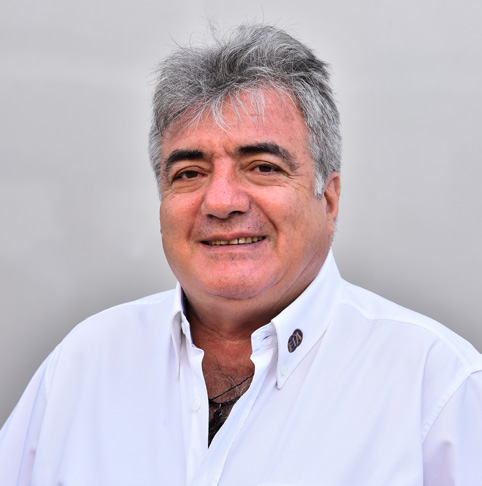
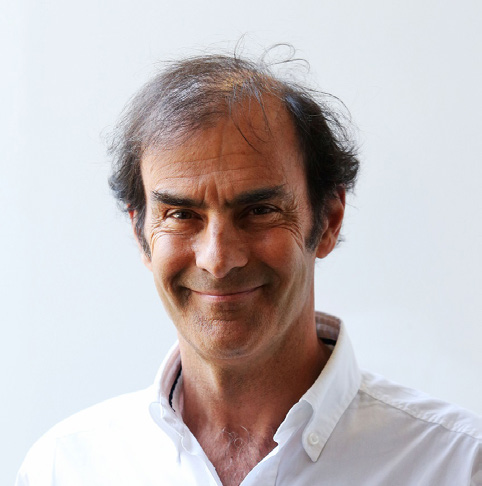

RACE STEWARDS BIOGRAPHIES

TIM MAYER

FIA ALTERNATE DELEGATE TO THE USA, FIA STEWARD

As the son of former McLaren team principal Teddy Mayer, Tim Mayer grew up around motor sport. He organised IndyCar races internationally from 1992-98, aided the construction of several circuits, and produced international TV for multiple series. In 1998 he became CART’s Senior VP for Racing Operations. He also became VP of ACCUS, the US ASN. In 2003, Mayer became COO of IMSA, operating multiple series at all levels, and also took on the role of COO and Race Director of the American Le Mans Series. He was elected an independent Director of ACCUS and FIA US Alternate Delegate, responsible for US World Championship events.

ENZO SPANO

PRESIDENT OF THE SPORTING COMMISSION OF THE AUTOMOBILE AND TOURING CLUB OF VENEZUELA

Italian-born Vincenzo Spano grew up in Venezuela, where he went on to study at the Universidad Central de Venezuela, becoming an attorney-at-law. Spano has wide-ranging experience in motor sport, from national to international level. He has worked for the Touring y Automóvil Club de Venezuela since 1991, and served as President of the Sporting Commission since 2001. He was president for two terms and now sits as a member of the Board of the Nacam- FIA zone. Since 1995 Spano has been a licenced steward and obtained his FIA steward superlicence in 2003. Spano has been involved with the FIA and FIA Institute in various roles since 2001: a member of the World Motor Sport Council, the FIA Committee, and the executive committee of the FIA Institute.

EMANUELE PIRRO

FORMER FORMULA ONE DRIVER AND FIVE-TIMES LE MANS WINNER

During a motor sport career spanning almost 40 years, Emanuele Pirro has achieved a huge amount of success, most notably in sportscar racing, with five Le Mans wins, victory at the Daytona 24 Hours and two wins at the Sebring 12 Hours. In addition, the Italian driver has won the German and Italian Touring Car championships (the latter twice) and has twice been American Le Mans Series Champion. Pirro, enjoyed a three-season F1 career from 1989 to 1991, firstly with Benetton and then for Scuderia Italia. His debut as an FIA Steward came at the 2010 Abu Dhabi Grand Prix and he has returned regularly since.
