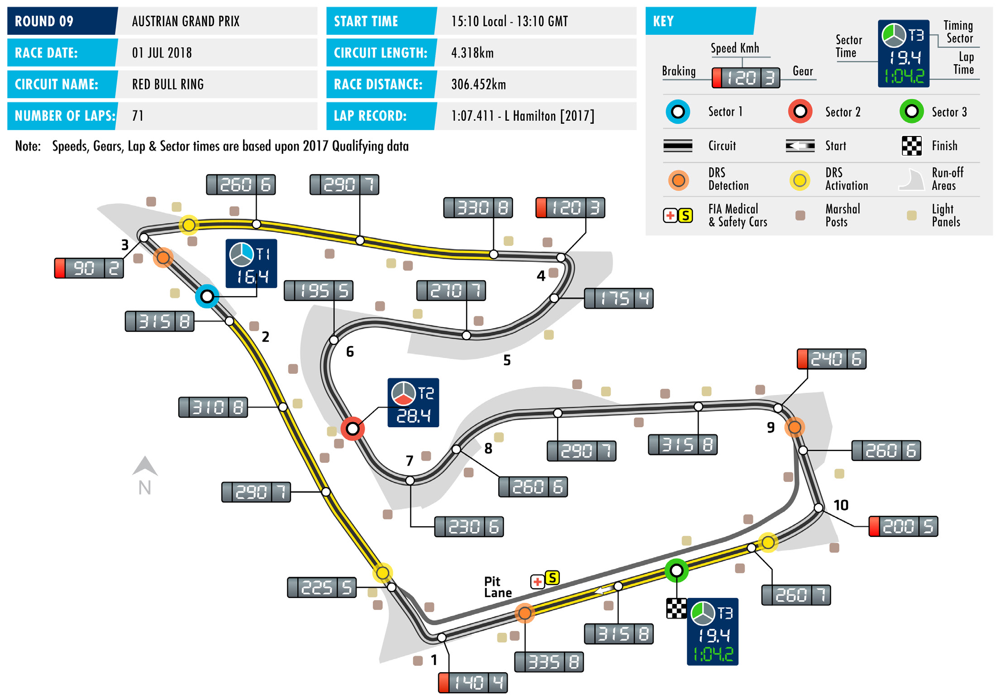
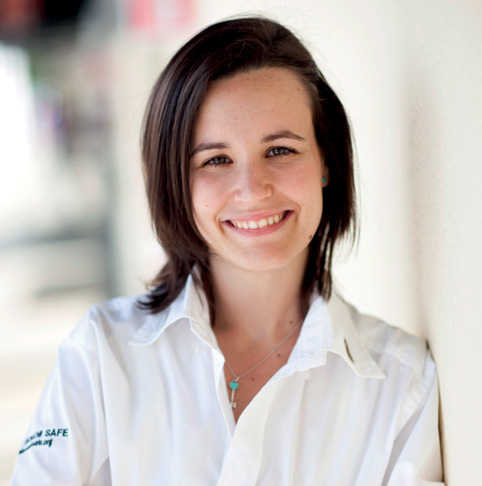

2018 AUSTRIAN GRAND PRIX

29 June – 01 July 2018

Following last weekend’s French Grand Prix, Formula 1 this RED BULL RING

weekend heads for the middle event of the sport’s first triple- Length of lap:

header of grands prix, with Round Nine of the 2018 FIA Formula 4.318km

1 World Championship taking place at the Red Bull Ring, home of Lap record: 1:07.411 (Lewis Hamilton, Mercedes, 2017) the Austrian Grand Prix. Start line/finish line offset: The rural circuit features one of the season’s most picturesque 0.126km

backdrops with the short 4.318km track draped across the foothills Total number of race laps: 71 of the spectacular Styrian mountains. And since its return in 2014

it has provided fans with some spectacular action thanks in most Total race distance: 306.452km part to the high-speed nature of the layout and to the shortness of Pitlane speed limits: the lap, which helps to promote close racing. 80km/h in practice, qualifying, and the race Made up of just 10 corners, with the kink between Turn 1 and

the old Turn 2 now recognised as a corner, the Red Bull Ring is CIRCUIT NOTES essentially made up four straights ending in tight corners and that ► The verge on the left approaching means that good traction and straight-line speed are key attributes Turn 3 has been widened at the in the quest for success here. request of MotoGP.

To aid with traction on the smooth track surface, tyre supplier ► The opening in the corner of the run-off area at Turn 4 has been Pirelli has this weekend brought its soft, supersoft and ultrasofts closed and a new one created compounds. And drivers have overwhelmingly prioritised the further around the run-off. ultrasoft, with only the Haas pairing of Kevin Magnussen and DRS ZONE Romain Grosjean selecting less than eight set of the purple-banded

tyre. ► There will be three DRS zones. The first has a detection point In the Drivers’ Championship standings, a faultless drive to victory 160m before Turn 1 with an from pole position in France last weekend saw Lewis Hamilton activation point 102m after Turn 1. The second zone will have a regain top spot, and he now has 145 points, 14 points clear of detection point 40m before Turn 3 Sebastian Vettel, who recovered from a first-lap collision with and an activation point 100m after Valtteri Bottas to finish fifth. Daniel Ricciardo lies third with 96 Turn 3. The detection point of the points, four ahead of Bottas. final zone is 151m before Turn 10, while its activation point is 106m Results at the Circuit Paul Ricard mean Mercedes currently lead after Turn 10.

the race for the Constructors’ title, with 237 points, 23 points

ahead of Ferrari, while Red Bull Racing are in third place with

164 points.

FAST FACTS

► This will be the 31st Austrian Grand Prix. ► McLaren are the most successful team at to date for the Finn. All of Bottas’ poles The inaugural race was held at Zeltweg this race, with six wins. The British team were scored in 2017, at the Bahrain, airfield in 1964 but then immediately won at the Österreichring in 1984 with Austrian, Brazilian and Abu Dhabi Grands fell off the calendar. The grand prix Niki Lauda and in 1985-’86 with Alain Prix. returned in 1970 at the almost 6km- Prost. The team then took three wins long Österreichring, which hosted the during the period the track was known ► In the four races held so far at the race until 1987. The race then fell off as the A1 Ring, with Mika Häkkinen Red Bull Ring the Safety Car has been the schedule once more before making victorious in 1998 and 2000, and David deployed on two occasions, for six laps a comeback at a shortened version of Coulthard winning in 2001. Ferrari are in 2015 when Fernando Alonso and Kimi the Österreichring, named the A1 Ring, next on the list with five wins, while Lotus Räikkönen collided on the first lap and for from 1997 until 2003. The Red Bull Ring, and Mercedes have four wins each. five laps in 2016 when Ferrari’s Sebastian welcomed Formula One back to Austria Vettel crashed out on lap 27. in 2014. ► Niki Lauda, René Arnoux and Nelson Piquet share the record for most Austrian ► Two teams scored their one and only ► Four-time F1 world champion Alain Grand Prix pole positions, with three Formula 1 victory in Austria. In 1976 US Prost is the most successful driver at each. Hamilton is the only current driver team Penske won at the Österreichring the Austrian Grand Prix, with three wins with multiple pole positions at this race. with Northern Ireland’s John Watson to his name – in 1983 with Renault and The Briton started from the front in 2015 at the wheel, while the following year then in, 1985 and 1986 with McLaren. and 2016. Australian future champion Alan Jones Ronnie Peterson, Alan Jones, Mika took the only win of Shadow’s 104-starts Häkkinen, Michael Schumacher and Nico ► The race on the A1 Ring/Red Bull Ring in F1. Watson’s win for Penske remains Rosberg are next on the list with two layout has been won from pole position the most recent win for a US-based team victories apiece. on five occasion, and all by different in Formula 1. drivers. Jacques Villeneuve started from ► Of the current drivers on the grid, only P1 in 1997, with the Canadian being ► Coulthard holds the record for victory Lewis Hamilton and Valtteri Bottas have followed by Häkkinen in 2000, Michael from furthest back on the grid on this previously won this race, with Briton Schumacher in 2003, Hamilton in 2016 layout. The Scot’s 2001 win for McLaren Hamilton winning for Mercedes in 2016 and Valtteri Bottas last year. was delivered from a starting postion and Finland’s Bottas scoring the second of seventh. Overall, the honour goes to win of his career here last year, also for ► Bottas’ 2017 pole position was the Jones, whose 1977 win was scored from the Silver Arrows second of four career front-of-grid starts 14th place on the grid.

RACE STEWARDS BIOGRAPHIES

GARRY CONNELLY

DIRECTOR, GLOBAL INSTITUTE FOR MOTOR SPORT SAFETY; DIRECTOR, AUSTRALIAN INSTITUTE OF MOTOR SPORT SAFETY; F1, WTCC STEWARD; FIA WORLD MOTOR SPORT COUNCIL MEMBER

Garry Connelly has been involved in motor sport since the late 1960s. A long- time rally competitor, Connelly was instrumental in bringing the World Rally Championship to Australia in 1988 and served as Chairman of the Organising Committee, Board member and Clerk of Course of Rally Australia until December 2002. He has been an FIA Steward and FIA Observer since 1989, covering the FIA’s World Rally Championship, World Touring Car Championship and Formula One Championship. He is a director of the Australian Institute of Motor Sport Safety and of the Global Institute of Motor Sport Safety. He is a member of the FIA World Motor Sport Council.

SILVIA BELLOT

MEMBER OF THE ROYAL SPANISH AUTOMOBILE FEDERATION BOARD OF DIRECTORS, FIA WOMEN IN MOTORSPORT COMMISSION MEMBER, F1, F2 AND GP3 STEWARD

Silvia Bellot began marshalling in 2001, when she was 16. In the years that followed she acted as a steward in a number of national and international series, including the European F3 Open, GT Open, BMW Europe, the Spanish Endurance Championship, DTM, World Series by Renault, the former FIA World Touring Car Championship and the FIA World Rally Championship. In 2009, she took part in the FIA trainee stewards’ program for F1 and what was then GP2 (now F2). She made her first appearance as a Formula 1 steward at the 2011 Turkish GP and in 2012 was awarded the FIA’s Outstanding Official prize. Away from the stewards’ room she is a member of the FIA’s Women in Motorsport Commission and also works closely with RACC, the Circuit de Catalunya and the Spanish federation in event organisation.

DEREK WARWICK

FORMER FORMULA 1 DRIVER AND WORLD SPORTSCAR CHAMPION, VICE-PRESIDENT OF THE FIA DRIVERS’ COMMISSION

Derek Warwick raced in 146 grands prix from 1981 to 1993, appearing for Toleman, Renault, Brabham, Arrows and Lotus. He scored 71 points and achieved four podium finishes, with two fastest laps. He was World Sportscar Champion in 1992, driving for Peugeot. He also won Le Mans in the same year. He raced Jaguar sportscars in 1986 and 1991 and competed in the British Touring Car Championship between 1995 and 1998, as well as a futher appearance at the Le Mans in 1996, driving for the Courage Competition team. Currently Vice-President of the FIA Drivers’ Commission, Warwick is a frequent FIA driver steward and is also a past President of the British Racing Drivers’ Club.

2018 FIA Formula One World Championship

DRIVERS’ CHAMPIONSHIP STANDINGS

NAJIABREZA AILARTSUA EROPAGNIS IBAHD YNAMREG YRAGNUH STNIOP NIARHAB OCANOM ADANAC AIRTSUA MUIGLEB ECNARF OCIXEM ANIHC AISSUR NAPAJ LIZARB NIAPS YLATI ASU UBA BG

| 18 2 | 15 3 | 12 4 | 25 1 | 25 1 | 15 3 | 10 5 | 25 1 |
| --- | --- | --- | --- | --- | --- | --- | --- |
| 25 1 | 25 1 | 4 8 | 12 4 | 12 4 | 18 2 | 25 1 | 10 5 |
| 12 4 | NC | 25 1 | NC | 10 5 | 25 1 | 12 4 | 12 4 |
| 4 8 | 18 2 | 18 2 | 14 | 18 2 | 10 5 | 18 2 | 6 7 |
| 15 3 | NC | 15 3 | 18 2 | NC | 12 4 | 8 6 | 15 3 |
| 8 6 | NC | 10 5 | NC | 15 3 | 2 9 | 15 3 | 18 2 |
| 6 7 | 8 6 | 8 6 | NC | NC | 4 8 | 6 7 | 2 9 |
| 10 5 | 6 7 | 6 7 | 6 7 | 4 8 | NC | NC | 16 |
| 1 10 | 11 | 2 9 | 10 5 | 6 7 | 1 10 | 4 8 | 4 8 |
| NC | 10 5 | 1 10 | 13 | 8 6 | 13 | 13 | 8 6 |
| NC | 12 4 | 18 | 12 | NC | 6 7 | 11 | NC |
| 11 | 16 | 12 | 15 3 | 2 9 | 12 | 14 | NC |
| 12 | 1 10 | 11 | NC | NC | 8 6 | 2 9 | NC |
| 13 | 12 | 19 | 8 6 | 1 10 | 18 | 1 10 | 1 10 |
| 2 9 | 4 8 | 13 | 2 9 | NC | 14 | 16 | 12 |
| 14 | 14 | 14 | 4 8 | 11 | 17 | NC | 17 |
| NC | 2 9 | 16 | 11 | 13 | 11 | 15 | 13 |
| 15 | 17 | 20 | 1 10 | 12 | 19 | NC | 14 |
| NC | 13 | 17 | NC | NC | 15 | 12 | 11 |
| NC | 15 | 15 | NC | 14 | 16 | 17 | 15 |

1 L. HAMILTON 145

2 S. VETTEL 131

3 D. RICCIARDO 96

4 V. BOTTAS 92

5 K. RÄIKKÖNEN 83

6 M. VERSTAPPEN 68

7 N. HÜLKENBERG 34

8 F. ALONSO 32

9 C. SAINZ 28

10 K. MAGNUSSEN 27

11 P. GASLY 18

12 S. PÉREZ 17

13 E. OCON 11

14 C. LECLERC 11

15 S. VANDOORNE 8

16 L. STROLL 4

17 M. ERICSSON 2

18 B. HARTLEY 1

19 R. GROSJEAN 0

20 S. SIROTKIN 0

2018 FIA Formula One World Championship

CONSTRUCTORS’ CHAMPIONSHIP STANDINGS

NAJIABREZA AILARTSUA EROPAGNIS IBAHD YNAMREG YRAGNUH STNIOP NIARHAB OCANOM ADANAC AIRTSUA MUIGLEB ECNARF OCIXEM ANIHC AISSUR NAPAJ LIZARB NIAPS YLATI ASU UBA BG

| 22 2 8 | 33 2 3 | 30 2 4 | 25 1 13 | 43 1 2 | 25 3 5 | 28 2 5 | 31 1 7 |
| --- | --- | --- | --- | --- | --- | --- | --- |
| 40 1 3 | 25 1 NC | 19 3 8 | 30 2 4 | 12 4 NC | 30 2 4 | 33 1 6 | 25 3 5 |
| 20 4 6 | NC NC | 35 1 5 | NC NC | 25 15 10 | 27 1 9 | 27 3 4 | 30 2 4 |
| 7 7 10 | 8 6 11 | 10 6 9 | 10 5 NC | 6 7 NC | 5 8 10 | 10 7 8 | 6 8 9 |
| 12 5 9 | 10 7 8 | 6 7 13 | 8 7 9 | 4 8 NC | 14 NC | 16 NC | 12 16 |
| 11 12 | 1 10 16 | 11 12 | 15 3 NC | 2 9 NC | 8 6 12 | 2 9 14 | NC NC |
| NC NC | 10 5 13 | 1 10 17 | 13 NC | 8 6 NC | 13 15 | 12 13 | 8 6 11 |
| 15 NC | 12 4 17 | 18 20 | 1 10 12 | 12 NC | 6 7 19 | 11 NC | 14 NC |
| 13 NC | 2 9 12 | 16 19 | 8 6 11 | 1 10 13 | 11 18 | 1 10 15 | 1 10 13 |
| 14 NC | 14 15 | 14 15 | 4 8 NC | 11 14 | 16 17 | 17 NC | 15 17 |

1 MERCEDES AMG 237 PETRONAS MOTORSPORT

214 2 SCUDERIA FERRARI

3 ASTON MARTIN 164 RED BULL RACING

RENAULT SPORT 62 4 FORMULA ONE TEAM

40 5 MCLAREN F1 TEAM

SAHARA FORCE INDIA 28 6 F1 TEAM

27 HAAS F1 TEAM 7

RED BULL 19 8 TORO ROSSO HONDA

ALFA ROMEO 13 9 SAUBER F1 TEAM

WILLIAMS MARTINI 4 10 RACING

FORMULA ONE TIMETABLE & FIA MEDIA SCHEDULE

THURSDAY

Press conference 1500

FRIDAY

Practice session 1 1100 - 1230 Press conference 1300

Practice session 2 1500 - 1630

SATURDAY

Practice session 3 1200 - 1300 Qualifying 1500 - 1600 Followed by unilateral and press conference

SUNDAY

Drivers’ Parade 1330 Race 1510 Followed by podium interviews and press conference

ADDITIONAL MEDIA OPPORTUNITIES

QUALIFYING

All drivers eliminated in Q1 or Q2 will be available for media interviews after the end of each session, as will drivers who participated in Q3, but who are not required for the post-qualifying press conference. The TV Pen is located at the end of the paddock, next to the FIA hospitality area.

RACE

Any driver retiring before the end of the race will be made available at the TV pen interview area. In addition, during the race every team will make available at least one senior spokesperson for interview by officially accredited TV crews. A list of those nominated will be made available in the media centre.

FIA COMMUNICATIONS DEPARTMENT press@fia.com T +33 1 43 12 58 15
