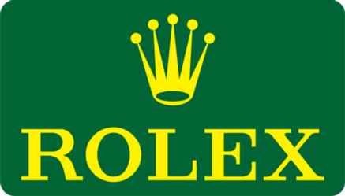

FORMULA 1 EYETIME GROSSER PREIS VON ÖSTERREICH 2018 - Spielberg

Media Map

MS04 3 MS05 T MS06 DRS ACTIVATION 2 4

MS07

S1 MS08 DRS DETECTION 2 2 MS09 MS03 6 5 DRS DETECTION 3

8 MS11 9

MS12 S2 MS13 7

MS10

MS02 10

MS14 DRS ACTIVATION 1

MS15 DRS ACTIVATION 3

MS01 1

Start Line

Control Line DRS DETECTION 1 S1 Sector 1 (170m before T3)

S2 Sector 2 (60m before T7)

T Speed Trap (170m before T4)

DRS Detection1 (160m before T1)

DRS Activation1 (102m after T1)

DRS Detection2 (40m before T3)

DRS Activation2 (100m after T3)

DRS Detection3 (151m before T10)

DRS Activation3 (106m after T10) 15 Corner Numbers

MS2 Marshal Sector

CCiirrccuuiitt CCeennttrreelliinnee LLeennggtthh == 4.318km

© 2018 Formula One World Championship Limited The F1 FORMULA 1 logo, F1 logo, FORMULA 1, FORMULA ONE, F1, FIA FORMULA ONE WORLD CHAMPIONSHIP, GRAND PRIX and related marks are trade marks of Formula One Licensing BV, a                                                                                                                        VERSION 2 - ISSUED 24.06.18
