Official title sponsor

EYETIME

GROSSER PREIS

VON ÖSTERREICH

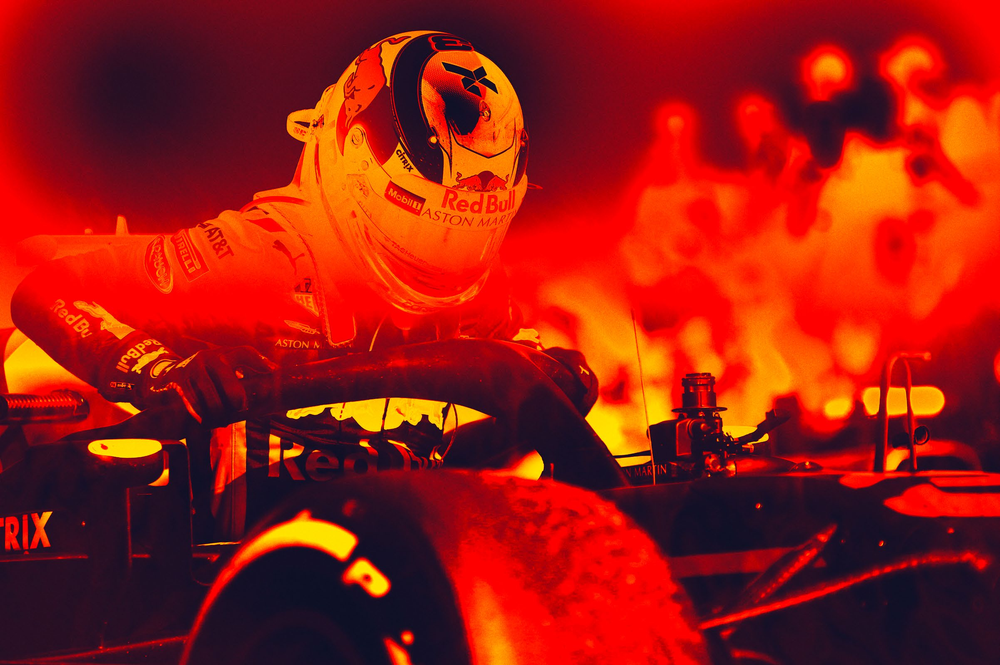

SPIELBERG 29 JUNE - 1 JULY

The F1 Logo, F1, FORMULA 1, FIA FORMULA ONE WORLD CHAMPIONSHIP, GRAND PRIX, GROSSER PREIS VON ÖSTERREICH and related marks are trade marks of Formula One Licensing BV, a Formula 1 company. All rights reserved. OFFICIAL MEDIA KIT

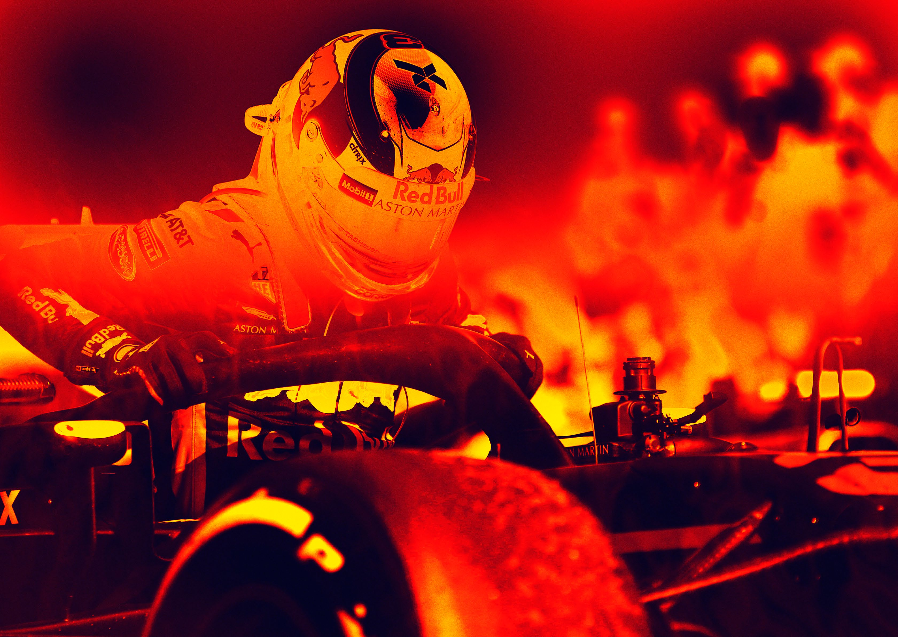

Formula 1 Formula 1 Grosser Preis von Grosser Preis von Österreich 2018 Österreich 2018

Spielberg 29 June - 01 July Spielberg 29 June - 01 July

42 Abu Dhabi Grand Prix CONTENTS MILESTONES: ÖSTERREICHRING – A1 RING – RED BULL RING 43 Drivers’ World Championship 2018

Intermediate Ranking

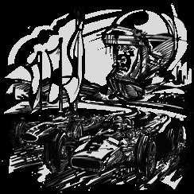

43 Constructors’ World Championship 2018 I. RED BULL RING 1969 Österreichring opens Intermediate Ranking 3 Milestones: Österreichring – A1 Ring – 1970 Jochen Rindt is the idol of the masses. More than 100,000 people cheer him on at Red Bull Ring 4 History of the Red Bull Ring IV. TEAMS AND DRIVERS 2018 his home Grand Prix, which he drops out of after 22 laps. Jochen Rindt dies a few

6 Red Bull Ring – Circuit in Detail 44 List of Drivers weeks later in Monza.

7 Red Bull Ring – Circuit Map 45 Overview of Driver Stats 1984 Niki Lauda wins his home Grand Prix 46 Mercedes

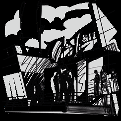

II. MEDIA SERVICE 46 Ferrari 1996 A1 Ring opens

8 Timetable 47 Red Bull Racing 1997 Formula 1 returns to the new A1 Ring. Gerhard Berger competes in his last race. 10 Media Accreditation Centre – Opening Hours 47 Williams 2003 10 Media Accreditation Centre – Location 48 Toro Rosso Michael Schumacher wins his last Formula 1 Grand Prix at the A1 Ring.

11 Media Centre – Opening Hours 48 Force India 2011 The Red Bull Ring opens its gates on 15 May 2011 , offering a new home for motor 11 Media Centre – Location 49 McLaren sports enthusiasts from Austria and beyond. 12 Photo Shuttle Service 49 Sauber 2014 12 Press Conferences F1 50 Renault Formula 1 returns to Spielberg. Tens of thousands of fans look forward to a

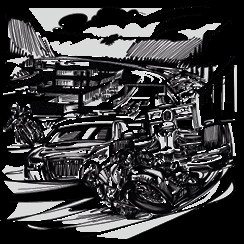

50 Haas motor sports spectacle par excellence, as well as an unusual supporting programme. III. FIA FORMULA 1 WORLD CHAMPIONSHIP 2018

13 Race Calendar V. FIA FORMULA 1 WORLD CHAMPIONSHIP

14 Australian Grand Prix – Results 2017

16 Bahrain Grand Prix – Results 51 Drivers’ World Championship 2017

18 Chinese Grand Prix – Results 52 Race Winners 2017

20 Azerbaijan Grand Prix – Results 52 Constructors’ World Championship 2017

22 Spanish Grand Prix – Results

24 Monaco Grand Prix – Results

26 Canadian Grand Prix – Results

28 French Grand Prix – Results

30 Austrian Grand Prix

31 British Grand Prix

32 German Grand Prix

33 Hungarian Grand Prix

34 Belgian Grand Prix

35 Italian Grand Prix

36 Singapore Grand Prix

37 Russian Grand Prix

38 Japanese Grand Prix

39 United States Grand Prix

40 Mexican Grand Prix

41 Brazilian Grand Prix

PROJEKT SPIELBERG GMBH & CO KG PROJEKT SPIELBERG GMBH & CO KG RED BULL RING STRASSE 1 RED BULL RING STRASSE 1 8724 SPIELBERG, AUSTRIA 8724 SPIELBERG, AUSTRIA T +43 3577 202 T +43 3577 202 INFORMATION@PROJEKT-SPIELBERG.COM – 2 – INFORMATION@PROJEKT-SPIELBERG.COM – 3 –

Formula 1 Formula 1 Grosser Preis von Grosser Preis von Österreich 2018 Österreich 2018

Spielberg 29 June - 01 July Spielberg 29 June - 01 July

HISTORY OF THE RED BULL RING “I think it’s brilliant that Austria once again has a world-class race track alongside everything else that

is so special about the region – it’s nothing short of a tradition now. To me, the first hanging left-hand FIVE DECADES FULL OF MOTORSPORT corner in the twisty downhill section is one of the most challenging bends in the entire calendar. It

At the Red Bull Ring, one can breathe decades of motor racing history that have left their mark on used to be called the Lauda Corner. Not a bad name, don’t you think?” the race track. Spectacular Formula 1 races took place there from 1963 to 2003, initially on the

airfield at Zeltweg, and later on the current grounds of the Red Bull Ring. Jochen Rindt and Niki Niki Lauda came eighth in the Formula V race on the Österreichring’s opening day in 1969, and in 1984 became

Lauda, Alain Prost and Michael Schumacher – they all lapped the legendary circuit over the years. the first and only Austrian to win an Austrian Grand Prix, for McLaren-TAG-Turbo. Now, the Red Bull Ring is about to take Spielberg to a new era of motor racing. History started to

be made there again in April 2011. The Ring was much more than just a Formula 1 showplace. Countless races involving touring cars and lower racing

formulas provided young talents with early opportunities. A 19-year-old Gerhard Berger raced around a track for the

The race held in 1963 on the military airstrip at Zeltweg was given the title ‘First Grand Prix of Austria’, but did not yet very first time there (in a 1600 cc Escort), and over the years that followed earned himself a kind of local citizenship.

have world championship status. In the 1960s, Formula 1 was still a relatively low-budget affair so, after the convivial “Just thinking about arriving there with the Alfasud behind me on the trailer makes my heart beat faster. I felt at

experience in the Steiermark region, a lot of love and persuasion was used to pull off an F1 World Championship race home there, and I used to really let rip, whether in the Alfasud or in Formula Ford.” A milestone in the new Formula 1

there in 1964. The cost of getting a car onto the starting grid back then was the equivalent of around € 100,000 now, a era was the extraordinary average speed of 248 km/h achieved by Nelson Piquet in a practice lap in 1984 aboard

fee which has since multiplied by around three hundred. The race was not bad – aside from the exit of top stars like Jim a Brabham with the famous BMW turbo engine. Gerhard Berger arrived at Formula 1 just in time to experience the

Clark, Graham Hill, Dan Gurney and John Surtees. Their more delicate vehicles fell victim to the surface of the airstrip, and high-point of the turbo craze. His Benetton-BMW is reputed to have put out 1,300 horsepower in practice in 1986.

for such a bumpy track there could be no future in Formula 1. So that was that. There were proud memories, but then, It had almost too much power for its own good.

with the emergence of Jochen Rindt, motor racing acquired a new status in Austria; and at the same time, politicians

were trying to find ways of promoting a structurally weak region. “The turbo years were the wildest time in Formula 1. And the Ring was tailor-made for a gut-feeling

driver like me, and simply the best racing track in the world – ideal for my senses, so that I could

“This track offers a fantastic symbiosis of architecture and landscape. I know of no other course anywhere experience and push the limit. When it came to corner-sequence, extreme speed and undulations, no

in the world which is set so magnificently within an attractive area. The new tracks tend to be sterile and other track could offer such an exciting mix – it was motor racing in its purest form.”

derive their impact from monumental structures which have nothing to do with racing as such. Here, the

ups and downs amid the landscape offer something more personal in nature. To me, it is if the track has Gerhard Berger participated in his very first race on the Österreichring (1978, Ford Escort), and dropped out in the

some kind of connection with its whole surroundings.” lead at the F1 race in 1986 (at the high-point of the turbo era, in a Benetton-BMW with more than 1000 horsepower).

Dr. Helmut Marko, winner of the very first race (1969) at the Österreichring on a Chevrolet Camaro. It was the first As the turbo era was superseded by a new engine formula, the politics of Formula 1 marketing also changed; things

support race of the opening event. Marko also won the second heat (Formula V), and we find a 20-year-old Niki Lauda became more aggressive, people wanted to see more money, and special arrangements were sought in state and

in eighth position on that race’s list. regional politics. Amid those circumstances, two truly messy and dramatic pile-ups in the first lap of the 1987 Grand

Prix provided a good excuse to rearrange the Formula 1 calendar and cross Austria off the list. When a fresh start was

That is how the Österreichring came to be built not far from the Zeltweg airfield, in the municipality of Spielberg. It was made after a ten year hiatus, both sides had gone to some lengths to accommodate each other, but the undisputed

opened in 1969, and 1970 saw its first Formula 1 World Championship race, while the sport was still within reasonable benefit was the existence of a ‘safe’, ‘modern’ track which, while continuing to make use of the geography of the

financial bounds. What was really exciting about that period was the contest to build Europe’s fastest racetrack, faster Aichfeld area and the track’s situation in a river basin, now satisfied the sport’s new sense of proportion, and even set

than the Hockenheimring (which still had its long forest sections) and Spa-Francorchamps. A backdrop of a hundred new trends in it. Of course, losing the long top-speed straight in the west was a shame but the new, shorter version

thousand spectators was also quite remarkable, but what was even more exciting was, of course, the fact that world of the track made up for this loss by accentuating the site‘s arena-like effect. There were seven Grand Prix races from

championship-leading Austrian Jochen Rindt entered the race, although he had to drop out because of a defect. It was his that point onwards, some of which were fabulous, some of which patchy (team orders), until gradually, the underlying

last world championship race; Jochen Rindt died three weeks later during a practice session for the Grand Prix at Monza. conditions behind the broader global Formula 1 vision changed, as did the political environment in Austria itself.

No-one could have imagined it at the time but Rindt was actually to be followed by some sort of successor and new heroes The last Formula 1 race in 2003 was followed by a period of uncertainty as to the future of the Ring. But after protracted

tackled the Ring which was, despite being one of the fastest, also one of the safest race tracks of its age. But it took much planning, which was much scrutinised in its environmental aspects, the Red Bull Ring entered operation in April 2011.

of his career for Niki Lauda to actually win a world championship race there, having made his debut at the Österreichring

15 years earlier; an Austrian victory finally came in 1984 and was crucial for his third world championship title.

PROJEKT SPIELBERG GMBH & CO KG PROJEKT SPIELBERG GMBH & CO KG RED BULL RING STRASSE 1 RED BULL RING STRASSE 1 8724 SPIELBERG, AUSTRIA 8724 SPIELBERG, AUSTRIA T +43 3577 202 T +43 3577 202 INFORMATION@PROJEKT-SPIELBERG.COM – 4 – INFORMATION@PROJEKT-SPIELBERG.COM – 5 –

Formula 1 Formula 1 Grosser Preis von Grosser Preis von Österreich 2018 Österreich 2018

Spielberg 29 June - 01 July Spielberg 29 June - 01 July

RED BULL RING – CIRCUIT DETAILS RED BULL RING – SITE MAP

The new Red Bull Ring complies with all current international safety standards. This means that every type of

racing permitted under FIA (four-wheel) rules can be held there. Its length is 4.3 three kilometres, and its routing

is the same as that used from 1996 to 2003 on the layout designed by the world’s most famous Grand Prix track

architect, Hermann Tilke.

Part of what makes this race track attractive is the sloping terrain around it which creates a natural arena. Natural 22 HOHFOEFRE-RT-ICTIKCEKTE RT ERNENNJNAJUASUESE CC 33 areas help solving the discrepancy between safety and the closeness of the spectators to the action in the best 10 10 DD possible way. In the best spots, one practically sits above the race cars and can spot the drivers in their cockpits

as they break, tackle accelerate out of the corners which gives one the feeling of being part of the action; at most

other tracks you are so far away you have to use binoculars. Certain places allow views of two thirds of the track,

and it is not unusual to witness the now-rare spectacle of cars powersliding; the road surface lends itself to pow- EE ersliding more than newly designed tracks. Since 2011, the Ring has welcomed many major top-class racing series BUSBUS FF s u c h a s t h e G e r m a n T o u ri n g C a r C h a m pi o n s h ip D T M a n d h o st e d m a n y e x c i t in g r a c e s in v a r i o u s cl a s s e s . T h e a im PPAADDDDOO CC KK SSUUPPPPOORRTT is t o o ff e r a b a l a n ce d se a s o n p r o g ra m m e w it h a m i x o f r a c e e v e n t s, p r e s e n t a ti o n s , t e s ti n g , a n d p u b l ic a c t iv it ie s.

4

A A F F 1 1 P P A A D D D D O O C C K K G 4 G

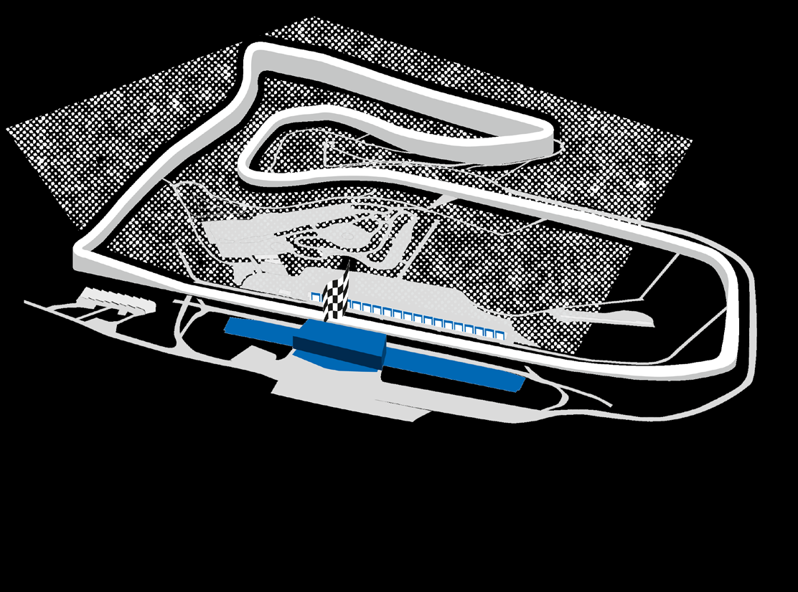

T3 REMUS FA FM A I M LY IL A Y R AE R A EA B B SC

T2 HI H T I R T A R D AD IO IO Ö Ö 3 3 B B Ü Ü H H N N E E F F 1 1 F F A A N N Z Z O O N N E E SC T6 PIRELLI T4 RAUCH 7 T7 7 T5 S S 12 HOFER-EVENT FILIALE T8 VOESTALPINE 12 HOFER-EVENT FILIALE S 36 S 36 5 9 11 T9 RINDT 5 9 11 T1 OMV MAXXMOTION KFZ-PARKPLÄTZE / PARKING HITRADIO Ö3 BÜHNE / HITRADIO Ö3 STAGE FAMILY AREA B STEIERMARK TRIBÜNE / STEIERMARK GRANDSTAND KFZ-PARKPLÄTZE / PARKING HITRADIO Ö3 BÜHNE / HITRADIO Ö3 STAGE FAMILY AREA B STEIERMARK TRIBÜNE / STEIERMARK GRANDSTAND SONDERPARKPLÄTZE A, B, C / SPECIAL PARKING A, B, C F1 FANZONE SC STEIRER CLUB C STEHPLÄTZE / GENERAL ADMISSION SONDERPARKPLÄTZE A, B, C / SPECIAL PARKING A, B, C F1 FANZONE SC STEIRER CLUB C STEHPLÄTZE / GENERAL ADMISSION BUSPARKPLÄTZE / BUS PARKING BANKOMAT / CASH MACHINE INFO POINT 1 + TOURISM INFORMATION D TRIBÜNE NORD / GRANDSTAND NORTH BUSPARKPLÄTZE / BUS PARKING BANKOMAT / CASH MACHINE INFO POINT 1 + TOURISM INFORMATION D TRIBÜNE NORD / GRANDSTAND NORTH MOTORRADPARKPLÄTZE / MOTORBIKE PARKING SPEISEN & GETRÄNKE / FOOD & BEVERAGES INFO POINT 2/3/4 + LOST & FOUND E TRIBÜNE MITTE / GRANDSTAND MIDDLE VOESTALPINE WING T10 RED BULL MOBILE MOTORRADPARKPLÄTZE / MOTORBIKE PARKING SPEISEN & GETRÄNKE / FOOD & BEVERAGES INFO POINT 2/3/4 + LOST & FOUND E TRIBÜNE MITTE / GRANDSTAND MIDDLE FAHRRADABSTELLPLÄTZE / BIKE PARKING WC / RESTROOMS FUßGÄNGERBRÜCKE / PEDESTRIAN BRIDGE F T G R R I A B N Ü D N S E T A O N S D T ( E e A y S e T t i ( m ey e e ) time) FAHRRADABSTELLPLÄTZE / BIKE PARKING WC / RESTROOMS FUßGÄNGERBRÜCKE / PEDESTRIAN BRIDGE F T G R R I A B N Ü D N S E T A O N S D T ( E e A y S e T t i ( m ey e e ) time) SHUTTLEBUSTERMINAL KNITTELFELD - JUDENBURG ERSTE HILFE / FIRST AID HOFER-TICKET RENNJAUSE G TRIBÜNE START / ZIEL / GRANDSTAND START / FINISH SHUTTLEBUSTERMINAL KNITTELFELD - JUDENBURG ERSTE HILFE / FIRST AID HOFER-TICKET RENNJAUSE G TRIBÜNE START / ZIEL / GRANDSTAND START / FINISH BARRIEREFREIE PARKPLÄTZE / DISABILITY PARKING POLIZEI / POLICE HOFER-EVENT FILIALE / HOFER-EVENT STORE TICKETVERKAUF / TICKET SALE BARRIEREFREIE PARKPLÄTZE / DISABILITY PARKING POLIZEI / POLICE HOFER-EVENT FILIALE / HOFER-EVENT STORE TICTKICETKVEETRVKEARUKFA U&F T /I C TKIECTKAEBTH OSLAULENG CAMPINGPLATZ / CAMP SITE FEUERWEHR / FIRE BRIGADE A RED BULL TRIBÜNE / RED BULL GRANDSTAND TICKET SALE & TICKET PICK-UP STATION gpTtiIcCkKeEtTsVhEoRpK, AoUeFt i&ck TeItC, KeEyTeAtBimHeOLUNG CAMPINGPLATZ / CAMP SITE FEUERWEHR / FIRE BRIGADE A RED BULL TRIBÜNE / RED BULL GRANDSTAND TICKET SALE & TICKET PICK-UP STATION gpticketshop, oeticket, eyetime Circuit: Red Bull Ring Sea level: 677 m Number of laps: 71

Circuit Length: 4,318 km Maximum uphill slope: 12 % Race distance: 306,452 km

Corners: 10 (3 left, 7 right) Maximum downhill slope: 9,3 % Lap record:

Track width: 12–13 m Lewis Hamilton (2017): 1:07.411

PROJEKT SPIELBERG GMBH & CO KG PROJEKT SPIELBERG GMBH & CO KG RED BULL RING STRASSE 1 RED BULL RING STRASSE 1 8724 SPIELBERG, AUSTRIA 8724 SPIELBERG, AUSTRIA T +43 3577 202 T +43 3577 202 INFORMATION@PROJEKT-SPIELBERG.COM – 6 – INFORMATION@PROJEKT-SPIELBERG.COM – 7 –

Formula 1 SATURDAY Grosser Preis von Österreich 2018

Spielberg 29 June - 01 July

TIMETABLE

FORMULA 1 EYETIME AUSTRIAN GRAND PRIX 2018

THRUSDAY

SUNDAY

FRIDAY

* These times refer to the start of the formation lap ¹ Fixed end session ² Approximate finishing time

* These times refer to the start of the formation lap ¹ Fixed end session ² Approximate finishing time

PROJEKT SPIELBERG GMBH & CO KG PROJEKT SPIELBERG GMBH & CO KG RED BULL RING STRASSE 1 RED BULL RING STRASSE 1 8724 SPIELBERG, AUSTRIA 8724 SPIELBERG, AUSTRIA T +43 3577 202 T +43 3577 202 INFORMATION@PROJEKT-SPIELBERG.COM – 8 – INFORMATION@PROJEKT-SPIELBERG.COM – 9 –

Formula 1 Formula 1 Grosser Preis von Grosser Preis von Österreich 2018 Österreich 2018

Spielberg 29 June - 01 July Spielberg 29 June - 01 July

OPENING HOURS OPENING HOURS

Media Accreditation Centre: Media Centre:

Thursday 8am – 6pm Thursday 9am – 10pm

Friday 8am – 4pm Friday 7am – 11pm

Saturday 8am – 12pm Saturday 7am – 11pm

Sunday 8am – 11am Sunday 7am – until the last journalist leaves the MC

Veranstaltungszentrum Spielberg

Marktpassage 1/C

8724 Spielberg

LOCATION OF MAC LOCATION OF MC

START-FINISH <<< L515 OBERE EXIT K N IT T E L F E L D OST VOE M S E T D A I L A P I C N E E N W TE I R NG SACHENDORFERSTRASSE 4 .1 K M T O M A C R E D B U L L R IN G 47 ° 1 3'0 6.4 6" N , 1 4°4 5'5 8.41“E

EXIT K N I T TE L FE LD WEST >>> 1 .7 K M T O M A C WIEN

SPIELBERG KNITTELFELD AREA OVERVIEW MEDIA P MEDIA SPIELBERGERSTRASSE L549 KLAGENFURT STRASSE <<< L518 TRIESTER MAC RIN G D E TA I L V I E W RED R E D B U L L L 5 4 5

L 54 4 VOL KS E S RZH C H U L S T R ASSE A N D ER IN G ERING BULL RING P ER STRASSE M E D IA ZOG -JOH STER S T R A S S E ME P DIA PARK I N G A R E A P RUMSTRASSE AN L518T R I E M E DIA MAC M V E E R D A I A N S A T C A C L R T E U D N I G T A S T Z I E O N N T C R E U N M T E S R P I E L B E R G , MA C N- RIN M A R K T P A S S A G E 1 / C , 8 7 2 4 S P I E L B E R G G BU N 1 4 ° 4 7 ' 5 1 , 7 ' ', E 4 7 ° 1 2 ' 2 8 , 6 ’' ZENT CHEN Z E LTWEG R O U T E T O M A C F R O M V I E N N A MARKTP HO F 20 m 100 m R O U T E T O M A C F R O M K L A G E N F U R T LATZ SPIELBERGERSTRASSE S U G G E S T E D R O U T E F R O M M A C T O R E D B ULL RING (4.8 KM)

PROJEKT SPIELBERG GMBH & CO KG PROJEKT SPIELBERG GMBH & CO KG RED BULL RING STRASSE 1 RED BULL RING STRASSE 1 8724 SPIELBERG, AUSTRIA 8724 SPIELBERG, AUSTRIA T +43 3577 202 T +43 3577 202 INFORMATION@PROJEKT-SPIELBERG.COM – 10 – INFORMATION@PROJEKT-SPIELBERG.COM – 11 –

Formula 1 Formula 1 Grosser Preis von Grosser Preis von Österreich 2018 Österreich 2018

Spielberg 29 June - 01 July Spielberg 29 June - 01 July

PHOTO-SHUTTLE-SERVICE FIA FORMULA 1 WORLD CHAMPIONSHIP 2018 SHUTTLE PLAN PROJEKT SPIELBERG RACE CALENDAR Red Bull Ring Straße 1 A-8724 Spielberg DATE RACE TRACK LOCATION

March 25 AUSTRALIAN GRAND PRIX Melbourne Grand Prix Circuit Melbourne 4WD TEST TRACK LANDHOTEL SCHÖNBERGHOF LEGENDE April 08 BAHRAIN GRAND PRIX Bahrain International Circuit Sakhir

GÄSTEHAUS ENZINGER Phototour - One Way April 15 CHINESE GRAND PRIX Shanghai International Circuit Shanghai

NORD GRANDSTAND P h o t o t o u r S tart A p r il 2 9 A Z E R B A IJ A N G RA N D P R IX B a k u C i t y C i rc u it B a k u REMUS P h o t o p o in ts M a y 1 3 S P A N IS H G R A N D P R I X Ci r cu i t d e B a rc e lo na-Catalunya Ca t a lunya RAUCH Phototower May 27 MONACO GRAND PRIX Circuit de Monaco Monte Carlo 1st Corner Podium June 10 CANADIAN GRAND PRIX Circuit Gilles Villeneuve Montréal PIRELLI June 24 FRENCH GRAND PRIX Circuit Paul Ricard Le Castellet OFFROAD BIKE TRACK MITTE GRANDSTAND VOESTALPINE RINDT OST GRANDSTAND J u l y 0 1 A U S T R IA N G R A N D P R IX R e d B u l l R in g S p ie l b e rg J u l y 0 8 B RI T IS H G R A N D P R IX S il ve rs t o n e C i rcuit S ilv e r s to ne

CENTER CAR PARK J u l y 2 2 G E R M A N G R A N D P R I X H o c k e n h e i m r in g H o c k e n h e im DRIVING RED RED BULL MOBILE J u l y 2 9 H U N G A R I A N G R A N D P RIX H u n g a r o r i n g B u d a p e s t BULL GRANDSTAND DDOCK P A A u g u s t 2 6 B E L G IA N G R A N D P R I X C i r c u i t d e S p a - F r a n c o r c h a m p s S p a - F r a n c o rchamps PIT B U I L D I N G F I N I S H LI N E

SGTRAARNTD-ZS IAEN LD v o e s w S ta T i A n l p R g i T n L e IN E SGTR P AAR H NTD- O ZSI A T EN L O D T O U R START S e p t e m b e r 02 I T A L I A N G R A N D P R IX A u t o d r o m o N a z i o n a l e M o n z a M o n z a September 16 SINGAPORE GRAND PRIX Marina Bay Street Circuit Singapur OMV MAXXM S O T T EI I E O R N MARK GRANDSTAND RED BULL P R O J E K T S P I E L B E R G G M B H & C O KG R e d B u l l R i n g S t r a ß e 1 S e p te m b e r 30 R U S S IA N G R A N D P R IX S o c h i A u t o d r o m S o c h i RING A - 8 7 2 4 S p i e l b e r g P h o n e : + 4 3 3 5 7 7 2 0 2 STRAßE i P n R f o O r J m E a K t T i - o S n P @ I E p L r B o j E e R k G t - . s C p O ie M lb e rg . co m O c to b er 0 7 JA P A N ES E G R A N D P R IX Su z u k a I n t er n a t io nal Racing Course S u zu k a October 21 UNITED STATES GRAND PRIX Circuit of the Americas Austin

October 28 MEXICAN GRAND PRIX Autódromo Hermanos Rodríguez Mexico City

November 11 BRAZILIAN GRAND PRIX Autódromo José Carlos Pace Sao Paulo

November 25 ABU DHABI GRAND PRIX Yas Marina Circuit Yas Marina

PRESS CONFERENCES F1

Thursday 3pm

Friday 1pm

Saturday after qualifying

Sunday after the race

An online version of the media kit is available at www.fia.com

PROJEKT SPIELBERG GMBH & CO KG PROJEKT SPIELBERG GMBH & CO KG RED BULL RING STRASSE 1 RED BULL RING STRASSE 1 8724 SPIELBERG, AUSTRIA 8724 SPIELBERG, AUSTRIA T +43 3577 202 T +43 3577 202 INFORMATION@PROJEKT-SPIELBERG.COM – 12 – INFORMATION@PROJEKT-SPIELBERG.COM – 13 –

Formula 1 Formula 1 Grosser Preis von Grosser Preis von Österreich 2018 Österreich 2018

Spielberg 29 June - 01 July Spielberg 29 June - 01 July

AUSTRALIAN GRAND PRIX – MELBOURNE AUSTRALIAN GRAND PRIX – MELBOURNE

MARCH 25 2018 / MELBOURNE GRAND PRIX CIRCUIT RESULTS

Pos. Nr. Driver Team Lap Time Points

| First Grand Prix 1996 | Number of Laps 58 | Circuit Length 5.303 km | Race Distance 307.574 km |
| --- | --- | --- | --- |
| Lap Record 1:24.125 by Michael Schumacher (2004) |  |  |  |

1 5 Sebastian Vettel Ferrari 58 1:29:33.283 25

2 44 Lewis Hamilton Mercedes 58 +5.036s 18

3 7 Kimi Räikkönen Ferrari 58 +6.309s 15

4 3 Daniel Ricciardo Red Bull Racing 58 +7.069s 12

5 14 Fernando Alonso McLaren Renault 58 +27.886s 10

6 33 Max Verstappen Red Bull Racing 58 +28.945s 8

7 27 Nico Hulkenberg Renault 58 +32.671s 6

8 77 Valtteri Bottas Mercedes 58 +34.339s 4

9 2 Stoffel Vandoorne McLaren Renault 58 +34.921s 2

10 55 Carlos Sainz Renault 58 +45.722s 1

11 11 Sergio Perez Force India Mercedes 58 +46.817s 0

12 31 Esteban Ocon Force India Mercedes 58 +60.278s 0

13 16 Charles Leclerc Sauber Ferrari 58 +75.759s 0

14 18 Lance Stroll Williams Mercedes 58 +78.288s 0

15 28 Brendon Hartley Scuderia Toro Rosso Honda 57 +1 lap 0

NC 8 Romain Grosjean Haas Ferrari 24 DNF 0

NC 20 Kevin Magnussen Haas Ferrari 22 DNF 0

NC 10 Pierre Gasly Scuderia Toro Rosso Honda 13 DNF 0

NC 9 Marcus Ericsson Sauber Ferrari 5 DNF 0

NC 35 Sergey Sirotkin Williams Mercedes 4 DNF 0

PROJEKT SPIELBERG GMBH & CO KG PROJEKT SPIELBERG GMBH & CO KG RED BULL RING STRASSE 1 RED BULL RING STRASSE 1 8724 SPIELBERG, AUSTRIA 8724 SPIELBERG, AUSTRIA T +43 3577 202 T +43 3577 202 INFORMATION@PROJEKT-SPIELBERG.COM – 14 – INFORMATION@PROJEKT-SPIELBERG.COM – 15 –

Formula 1 Formula 1 Grosser Preis von Grosser Preis von Österreich 2018 Österreich 2018

Spielberg 29 June - 01 July Spielberg 29 June - 01 July

BAHRAIN GRAND PRIX – SAKHIR BAHRAIN GRAND PRIX – SAKHIR

APRIL 08 2018 / BAHRAIN INTERNATIONAL CIRCUIT RESULTS

Pos. Nr. Driver Team Laps Time Points

| First Grand Prix 2004 | Number of Laps 57 | Circuit Length 5.412 km | Race Distance 308.238 km |
| --- | --- | --- | --- |
| Lap Record 1:31.447 by Pedro de la Rosa (2005) |  |  |  |

1 5 Sebastian Vettel Ferrari 57 1:32:01.940 25

2 77 Valtteri Bottas Mercedes 57 +0.699s 18

3 44 Lewis Hamilton Mercedes 57 +6.512s 15

4 10 Pierre Gasly Scuderia Toro Rosso Honda 57 +62.234s 12

5 20 Kevin Magnussen Haas Ferrari 57 +75.046s 10

6 27 Nico Hulkenberg Renault 57 +99.024s 8

7 14 Fernando Alonso McLaren Renault 56 +1 lap 6

8 2 Stoffel Vandoorne McLaren Renault 56 +1 lap 4

9 9 Marcus Ericsson Sauber Ferrari 56 +1 lap 2

10 31 Esteban Ocon Force India Mercedes 56 +1 lap 1

11 55 Carlos Sainz Renault 56 +1 lap 0

12 16 Charles Leclerc Sauber Ferrari 56 +1 lap 0

13 8 Romain Grosjean Haas Ferrari 56 +1 lap 0

14 18 Lance Stroll Williams Mercedes 56 +1 lap 0

15 35 Sergey Sirotkin Williams Mercedes 56 +1 lap 0

16 11 Sergio Perez Force India Mercedes 56 +1 lap 0

17 28 Brendon Hartley Scuderia Toro Rosso Honda 56 +1 lap 0

NC 7 Kimi Räikkönen Ferrari 35 DNF 0

NC 33 Max Verstappen Red Bull Racing 3 DNF 0

NC 3 Daniel Ricciardo Red Bull Racing 1 DNF 0

PROJEKT SPIELBERG GMBH & CO KG PROJEKT SPIELBERG GMBH & CO KG RED BULL RING STRASSE 1 RED BULL RING STRASSE 1 8724 SPIELBERG, AUSTRIA 8724 SPIELBERG, AUSTRIA T +43 3577 202 T +43 3577 202 INFORMATION@PROJEKT-SPIELBERG.COM – 16 – INFORMATION@PROJEKT-SPIELBERG.COM – 17 –

Formula 1 Formula 1 Grosser Preis von Grosser Preis von Österreich 2018 Österreich 2018

Spielberg 29 June - 01 July Spielberg 29 June - 01 July

CHINESE GRAND PRIX – SHANGHAI CHINESE GRAND PRIX – SHANGHAI

APRIL 15 2018 / SHANGHAI INTERNATIONAL CIRCUIT RESULTS

Pos. Nr. Driver Team Laps Time Points

| First Grand Prix 2004 | Number of Laps 56 | Circuit Length 5.451 km | Race Distance 305.066 km |
| --- | --- | --- | --- |
| Lap Record 1:32.238 by Michael Schumacher (2004) |  |  |  |

1 3 Daniel Ricciardo Red Bull Racing 56 1:35:36.380 25

2 77 Valtteri Bottas Mercedes 56 +8.894s 18

3 7 Kimi Räikkönen Ferrari 56 +9.637s 15

4 44 Lewis Hamilton Mercedes 56 +16.985s 12

5 33 Max Verstappen Red Bull Racing 56 +20.436s 10

6 27 Nico Hulkenberg Renault 56 +21.052s 8

7 14 Fernando Alonso McLaren Renault 56 +30.639s 6

8 5 Sebastian Vettel Ferrari 56 +35.286s 4

9 55 Carlos Sainz Renault 56 +35.763s 2

10 20 Kevin Magnussen Haas Ferrari 56 +39.594s 1

11 31 Esteban Ocon Force India Mercedes 56 +44.050s 0

12 11 Sergio Perez Force India Mercedes 56 +44.725s 0

13 2 Stoffel Vandoorne McLaren Renault 56 +49.373s 0

14 18 Lance Stroll Williams Mercedes 56 +55.490s 0

15 35 Sergey Sirotkin Williams Mercedes 56 +58.241s 0

16 9 Marcus Ericsson Sauber Ferrari 56 +62.604s 0

17 8 Romain Grosjean Haas Ferrari 56 +65.296s 0

18 10 Pierre Gasly Scuderia Toro Rosso Honda 56 +66.330s 0

19 16 Charles Leclerc Sauber Ferrari 56 +82.575s 0

20 28 Brendon Hartley Scuderia Toro Rosso Honda 51 DNF 0

PROJEKT SPIELBERG GMBH & CO KG PROJEKT SPIELBERG GMBH & CO KG RED BULL RING STRASSE 1 RED BULL RING STRASSE 1 8724 SPIELBERG, AUSTRIA 8724 SPIELBERG, AUSTRIA T +43 3577 202 T +43 3577 202 INFORMATION@PROJEKT-SPIELBERG.COM – 18 – INFORMATION@PROJEKT-SPIELBERG.COM – 19 –

Formula 1 Formula 1 Grosser Preis von Grosser Preis von Österreich 2018 Österreich 2018

Spielberg 29 June - 01 July Spielberg 29 June - 01 July

AZERBAIJAN GRAND PRIX – BAKU AZERBAIJAN GRAND PRIX – BAKU

APRIL 29 2018 / BAKU CITY CIRCUIT RESULTS

Pos. Nr. Driver Team Laps Time Points

| First Grand Prix 2016 | Number of Laps 51 | Circuit Length 6.003 km | Race Distance 306.049 km |
| --- | --- | --- | --- |
| Lap Record 1:43.441 Sebastian Vettel (2017) |  |  |  |

1 44 Lewis Hamilton Mercedes 51 1:43:44.291 25

2 7 Kimi Räikkönen Ferrari 51 +2.460s 18

3 11 Sergio Perez Force India Mercedes 51 +4.024s 15

4 5 Sebastian Vettel Ferrari 51 +5.329s 12

5 55 Carlos Sainz Renault 51 +7.515s 10

6 16 Charles Leclerc Sauber Ferrari 51 +9.158s 8

7 14 Fernando Alonso McLaren Renault 51 +10.931s 6

8 18 Lance Stroll Williams Mercedes 51 +12.546s 4

9 2 Stoffel Vandoorne McLaren Renault 51 +14.152s 2

10 28 Brendon Hartley Scuderia Toro Rosso Honda 51 +18.030s 1

11 9 Marcus Ericsson Sauber Ferrari 51 +18.512s 0

12 10 Pierre Gasly Scuderia Toro Rosso Honda 51 +24.720s 0

13 20 Kevin Magnussen Haas Ferrari 51 +40.663s 0

14 77 Valtteri Bottas Mercedes 48 DNF 0

NC 8 Romain Grosjean Haas Ferrari 42 DNF 0

NC 33 Max Verstappen Red Bull Racing 39 DNF 0

NC 3 Daniel Ricciardo Red Bull Racing 39 DNF 0

NC 27 Nico Hulkenberg Renault 10 DNF 0

NC 31 Esteban Ocon Force India Mercedes 0 DNF 0

NC 35 Sergey Sirotkin Williams Mercedes 0 DNF 0

PROJEKT SPIELBERG GMBH & CO KG PROJEKT SPIELBERG GMBH & CO KG RED BULL RING STRASSE 1 RED BULL RING STRASSE 1 8724 SPIELBERG, AUSTRIA 8724 SPIELBERG, AUSTRIA T +43 3577 202 T +43 3577 202 INFORMATION@PROJEKT-SPIELBERG.COM – 20 – INFORMATION@PROJEKT-SPIELBERG.COM – 21 –

Formula 1 Formula 1 Grosser Preis von Grosser Preis von Österreich 2018 Österreich 2018

Spielberg 29 June - 01 July Spielberg 29 June - 01 July

SPANISH GRAND PRIX – CATALUNYA SPANISH GRAND PRIX – CATALUNYA

MAY 13 2018 / CIRCUIT DE BARCELONA-CATALUNYA RESULTS

Pos. Nr. Driver Team Laps Time Points

| First Grand Prix 1991 | Number of Laps 66 | Circuit Length 4.655 km | Race Distance 307.104 km |
| --- | --- | --- | --- |
| Lap Record 1:18.441 by Daniel Ricciardo (2018) |  |  |  |

1 44 Lewis Hamilton Mercedes 66 1:35:29.972 25

2 77 Valtteri Bottas Mercedes 66 +20.593s 18

3 33 Max Verstappen Red Bull Racing 66 +26.873s 15

4 5 Sebastian Vettel Ferrari 66 +27.584s 12

5 3 Daniel Ricciardo Red Bull Racing 66 +50.058s 10

6 20 Kevin Magnussen Haas Ferrari 65 +1 lap 8

7 55 Carlos Sainz Renault 65 +1 lap 6

8 14 Fernando Alonso McLaren Renault 65 +1 lap 4

9 11 Sergio Perez Force India Mercedes 64 +2 laps 2

10 16 Charles Leclerc Sauber Ferrari 64 +2 laps 1

11 18 Lance Stroll Williams Mercedes 64 +2 laps 0

12 28 Brendon Hartley Scuderia Toro Rosso Honda 64 +2 laps 0

13 9 Marcus Ericsson Sauber Ferrari 64 +2 laps 0

14 35 Sergey Sirotkin Williams Mercedes 63 +3 laps 0

NC 2 Stoffel Vandoorne McLaren Renault 45 DNF 0

NC 31 Esteban Ocon Force India Mercedes 38 DNF 0

NC 7 Kimi Räikkönen Ferrari 25 DNF 0

NC 8 Romain Grosjean Haas Ferrari 0 DNF 0

NC 10 Pierre Gasly Scuderia Toro Rosso Honda 0 DNF 0

NC 27 Nico Hulkenberg Renault 0 DNF 0

PROJEKT SPIELBERG GMBH & CO KG PROJEKT SPIELBERG GMBH & CO KG RED BULL RING STRASSE 1 RED BULL RING STRASSE 1 8724 SPIELBERG, AUSTRIA 8724 SPIELBERG, AUSTRIA T +43 3577 202 T +43 3577 202 INFORMATION@PROJEKT-SPIELBERG.COM – 22 – INFORMATION@PROJEKT-SPIELBERG.COM – 23 –

Formula 1 Formula 1 Grosser Preis von Grosser Preis von Österreich 2018 Österreich 2018

Spielberg 29 June - 01 July Spielberg 29 June - 01 July

MONACO GRAND PRIX – MONTE CARLO MONACO GRAND PRIX – MONTE CARLO

MAY 27 2018 / CIRCUIT DE MONACO RESULTS

Pos. Nr. Driver Team Laps Time Points

| First Grand Prix 1950 | Number of Laps 78 | Circuit Length 3.337 km | Race Distance 260.286 km |
| --- | --- | --- | --- |
| Lap Record 1:14.260 by Max Verstappen (2018) |  |  |  |

1 3 Daniel Ricciardo Red Bull Racing 78 1:42:54.807 25

2 5 Sebastian Vettel Ferrari 78 +7.336s 18

3 44 Lewis Hamilton Mercedes 78 +17.013s 15

4 7 Kimi Räikkönen Ferrari 78 +18.127s 12

5 77 Valtteri Bottas Mercedes 78 +18.822s 10

6 31 Esteban Ocon Force India Mercedes 78 +23.667s 8

7 10 Pierre Gasly Scuderia Toro Rosso Honda 78 +24.331s 6

8 27 Nico Hulkenberg Renault 78 +24.839s 4

9 33 Max Verstappen Red Bull Racing 78 +25.317s 2

10 55 Carlos Sainz Renault 78 +69.013s 1

11 9 Marcus Ericsson Sauber Ferrari 78 +69.864s 0

12 11 Sergio Perez Force India Mercedes 78 +70.461s 0

13 20 Kevin Magnussen Haas Ferrari 78 +74.823s 0

14 2 Stoffel Vandoorne McLaren Renault 77 +1 lap 0

15 8 Romain Grosjean Haas Ferrari 77 +1 lap 0

16 35 Sergey Sirotkin Williams Mercedes 77 +1 lap 0

17 18 Lance Stroll Williams Mercedes 76 +2 laps 0

18 16 Charles Leclerc Sauber Ferrari 70 DNF 0

19 28 Brendon Hartley Scuderia Toro Rosso Honda 70 DNF 0

NC 14 Fernando Alonso McLaren Renault 52 DNF 0

PROJEKT SPIELBERG GMBH & CO KG PROJEKT SPIELBERG GMBH & CO KG RED BULL RING STRASSE 1 RED BULL RING STRASSE 1 8724 SPIELBERG, AUSTRIA 8724 SPIELBERG, AUSTRIA T +43 3577 202 T +43 3577 202 INFORMATION@PROJEKT-SPIELBERG.COM – 24 – INFORMATION@PROJEKT-SPIELBERG.COM – 25 –

Formula 1 Formula 1 Grosser Preis von Grosser Preis von Österreich 2018 Österreich 2018

Spielberg 29 June - 01 July Spielberg 29 June - 01 July

CANADIAN GRAND PRIX – MONTRÉAL CANADIAN GRAND PRIX – MONTRÉAL

JUNE 10 2018 / CIRCUIT GILLES-VILLENEUVE RESULTS

Pos. Nr. Driver Team Laps Time Points

| First Grand Prix 1978 | Number of Laps 70 | Circuit Length 4.361 km | Race Distance 305.270 km |
| --- | --- | --- | --- |
| Lap Record 1:13.622 by Rubens Barrichello (2004) |  |  |  |

1 5 Sebastian Vettel Ferrari 68 1:28:31.377 25

2 77 Valtteri Bottas Mercedes 68 +7.376s 18

3 33 Max Verstappen Red Bull Racing 68 +8.360s 15

4 3 Daniel Ricciardo Red Bull Racing 68 +20.892s 12

5 44 Lewis Hamilton Mercedes 68 +21.559s 10

6 7 Kimi Räikkönen Ferrari 68 +27.184s 8

7 27 Nico Hulkenberg Renault 67 +1 lap 6

8 55 Carlos Sainz Renault 67 +1 lap 4

9 31 Esteban Ocon Force India Mercedes 67 +1 lap 2

10 16 Charles Leclerc Sauber Ferrari 67 +1 lap 1

11 10 Pierre Gasly Scuderia Toro Rosso Honda 67 +1 lap 0

12 8 Romain Grosjean Haas Ferrari 67 +1 lap 0

13 20 Kevin Magnussen Haas Ferrari 67 +1 lap 0

14 11 Sergio Perez Force India Mercedes 67 +1 lap 0

15 9 Marcus Ericsson Sauber Ferrari 66 +2 laps 0

16 2 Stoffel Vandoorne McLaren Renault 66 +2 laps 0

17 35 Sergey Sirotkin Williams Mercedes 66 +2 laps 0

NC 14 Fernando Alonso McLaren Renault 40 DNF 0

NC 28 Brendon Hartley Scuderia Toro Rosso Honda 0 DNF 0

NC 18 Lance Stroll Williams Mercedes 0 DNF 0

PROJEKT SPIELBERG GMBH & CO KG PROJEKT SPIELBERG GMBH & CO KG RED BULL RING STRASSE 1 RED BULL RING STRASSE 1 8724 SPIELBERG, AUSTRIA 8724 SPIELBERG, AUSTRIA T +43 3577 202 T +43 3577 202 INFORMATION@PROJEKT-SPIELBERG.COM – 26 – INFORMATION@PROJEKT-SPIELBERG.COM – 27 –

Formula 1 Formula 1 Grosser Preis von Grosser Preis von Österreich 2018 Österreich 2018

Spielberg 29 June - 01 July Spielberg 29 June - 01 July

FRENCH GRAND PRIX – LE CASTELLET FRENCH GRAND PRIX – LE CASTELLET

JUNE 24 2018 / CIRCUIT PAUL RICARD RESULTS

Pos. Nr. Driver Team Laps Time Points

| First Grand Prix 1971 | Number of Laps 53 | Circuit Length 5.842 km | Race Distance 309.69 km |
| --- | --- | --- | --- |
| Lap Record 1:34.225 by Valtteri Bottas (2018) |  |  |  |

1 44 Lewis Hamilton Mercedes 53 1:30:11.385 25

2 33 Max Verstappen Red Bull Racing 53 +7.090s 18

3 7 Kimi Räikkönen Ferrari 53 +25.888s 15

4 3 Daniel Ricciardo Red Bull Racing 53 +34.736s 12

5 5 Sebastian Vettel Ferrari 53 +61.935s 10

6 20 Kevin Magnussen Haas Ferrari 53 +79.364s 8

7 77 Valtteri Bottas Mercedes 53 +80.632s 6

8 55 Carlos Sainz Renault 53 +87.184s 4

9 27 Nico Hulkenberg Renault 53 +91.989s 2

10 16 Charles Leclerc Sauber Ferrari 53 +93.873s 1

11 8 Romain Grosjean Haas Ferrari 52 +1 lap 0

12 2 Stoffel Vandoorne McLaren Renault 52 +1 lap 0

13 9 Marcus Ericsson Sauber Ferrari 52 +1 lap 0

14 28 Brendon Hartley Scuderia Toro Rosso 52 +1 lap 0

15 35 Sergey Sirotkin Williams Mercedes 52 +1 lap 0

16 14 Fernando Alonso McLaren Renault 50 DNF 0

17 18 Lance Stroll Williams Mercedes 48 DNF 0

NC 11 Sergio Perez Force India Mercedes 27 DNF 0

NC 31 Esteban Ocon Force India Mercedes 0 DNF 0

NC 10 Pierre Gasly Scuderia Toro Rosso 0 DNF 0

PROJEKT SPIELBERG GMBH & CO KG PROJEKT SPIELBERG GMBH & CO KG RED BULL RING STRASSE 1 RED BULL RING STRASSE 1 8724 SPIELBERG, AUSTRIA 8724 SPIELBERG, AUSTRIA T +43 3577 202 T +43 3577 202 INFORMATION@PROJEKT-SPIELBERG.COM – 28 – INFORMATION@PROJEKT-SPIELBERG.COM – 29 –

Formula 1 Formula 1 Grosser Preis von Grosser Preis von Österreich 2018 Österreich 2018

Spielberg 29 June - 01 July Spielberg 29 June - 01 July

AUSTRIAN GRAND PRIX – SPIELBERG BRITISH GRAND PRIX – SILVERSTONE

01. JULY 2018 / RED BULL RING 08. JULY 2018 / SILVERSTONE

| First Grand Prix 1970 | Number of Laps 71 | Circuit Length 4.318 km | Race Distance 306.452 km |
| --- | --- | --- | --- |
| Lap Record 1:07.411 by Lewis Hamilton (2017) |  |  |  |

| First Grand Prix 1950 | Number of Laps 52 | Circuit Length 5.891 km | Race Distance 306.198 km |
| --- | --- | --- | --- |
| Lap Record 1:30.621 by Lewis Hamilton (2017) |  |  |  |

PROJEKT SPIELBERG GMBH & CO KG PROJEKT SPIELBERG GMBH & CO KG RED BULL RING STRASSE 1 RED BULL RING STRASSE 1 8724 SPIELBERG, AUSTRIA 8724 SPIELBERG, AUSTRIA T +43 3577 202 T +43 3577 202 INFORMATION@PROJEKT-SPIELBERG.COM – 30 – INFORMATION@PROJEKT-SPIELBERG.COM – 31 –

Formula 1 Formula 1 Grosser Preis von Grosser Preis von Österreich 2018 Österreich 2018

Spielberg 29 June - 01 July Spielberg 29 June - 01 July

GERMAN GRAND PRIX – HOCKENHEIM HUNGARIAN GRAND PRIX – BUDAPEST

22. JULY 2018 / HOCKENHEIMRING 29. JULY 2018 / HUNGARORING

| First Grand Prix 1970 | Number of Laps 67 | Circuit Length 4.574 km | Race Distance 306.458 km |
| --- | --- | --- | --- |
| Lap Record 1:13.780 by Kimi Räikkönen (2004) |  |  |  |

| First Grand Prix 1986 | Number of Laps 70 | Circuit Length 4.381 km | Race Distance 306.630 km |
| --- | --- | --- | --- |
| Lap Record 1:19.071 by Michael Schumacher (2004) |  |  |  |

PROJEKT SPIELBERG GMBH & CO KG PROJEKT SPIELBERG GMBH & CO KG RED BULL RING STRASSE 1 RED BULL RING STRASSE 1 8724 SPIELBERG, AUSTRIA 8724 SPIELBERG, AUSTRIA T +43 3577 202 T +43 3577 202 INFORMATION@PROJEKT-SPIELBERG.COM – 32 – INFORMATION@PROJEKT-SPIELBERG.COM – 33 –

Formula 1 Formula 1 Grosser Preis von Grosser Preis von Österreich 2018 Österreich 2018

Spielberg 29 June - 01 July Spielberg 29 June - 01 July

BELGIAN GRAND PRIX – SPA-FRANCORCHAMPS ITALIAN GRAND PRIX – MONZA

26. AUGUST 2018 / CIRCUIT DE SPA-FRANCORCHAMPS 02 . SEPTEMBER 2018 / AUTODROMO NAZIONALE MONZA

| First Grand Prix 1950 | Number of Laps 44 | Circuit Length 7.004 km | Race Distance 308.052 km |
| --- | --- | --- | --- |
| Lap Record 1:46.577 by Sebastian Vettel (2017) |  |  |  |

| First Grand Prix 1950 | Number of Laps 53 | Circuit Length 5.793 km | Race Distance 306.720 km |
| --- | --- | --- | --- |
| Lap Record 1:21.046 by Rubens Barrichello (2004) |  |  |  |

PROJEKT SPIELBERG GMBH & CO KG PROJEKT SPIELBERG GMBH & CO KG RED BULL RING STRASSE 1 RED BULL RING STRASSE 1 8724 SPIELBERG, AUSTRIA 8724 SPIELBERG, AUSTRIA T +43 3577 202 T +43 3577 202 INFORMATION@PROJEKT-SPIELBERG.COM – 34 – INFORMATION@PROJEKT-SPIELBERG.COM – 35 –

Formula 1 Formula 1 Grosser Preis von Grosser Preis von Österreich 2018 Österreich 2018

Spielberg 29 June - 01 July Spielberg 29 June - 01 July

SINGAPORE GRAND PRIX – SINGAPUR RUSSIAN GRAND PRIX – SOCHI

16. SEPTEMBER 2018 / MARINA BAY STREET CIRCUIT 30. SEPTEMBER 2018 / SOCHI AUTODROM

| First Grand Prix 2008 | Number of Laps 61 | Circuit Length 5.065 km | Race Distance 308.828 km |
| --- | --- | --- | --- |
| Lap Record 1:45.008 by Lewis Hamilton (2017) |  |  |  |

| First Grand Prix 2014 | Number of Laps 53 | Circuit Length 5.848 km | Race Distance 309.745 km |
| --- | --- | --- | --- |
| Lap Record 1:36.844 by Kimi Räikkönen (2017) |  |  |  |

PROJEKT SPIELBERG GMBH & CO KG PROJEKT SPIELBERG GMBH & CO KG RED BULL RING STRASSE 1 RED BULL RING STRASSE 1 8724 SPIELBERG, AUSTRIA 8724 SPIELBERG, AUSTRIA T +43 3577 202 T +43 3577 202 INFORMATION@PROJEKT-SPIELBERG.COM – 36 – INFORMATION@PROJEKT-SPIELBERG.COM – 37 –

Formula 1 Formula 1 Grosser Preis von Grosser Preis von Österreich 2018 Österreich 2018

Spielberg 29 June - 01 July Spielberg 29 June - 01 July

JAPANESE GRAND PRIX – SUZUKA UNITED STATES GRAND PRIX – AUSTIN

07. OCTOBER 2018 / SUZUKA INTERNATIONAL RACING COURSE 21. OCTOBER 2018 / CIRCUIT OF THE AMERICAS

| First Grand Prix 1987 | Number of Laps 53 | Circuit Length 5.807 km | Race Distance 307.471 km |
| --- | --- | --- | --- |
| Lap Record 1:31.540 by Kimi Räikkönen (2005) |  |  |  |

| First Grand Prix 2012 | Number of Laps 56 | Circuit Length 5.513 km | Race Distance 308.405 km |
| --- | --- | --- | --- |
| Lap Record 1:37.766 by Sebastian Vettel (2017) |  |  |  |

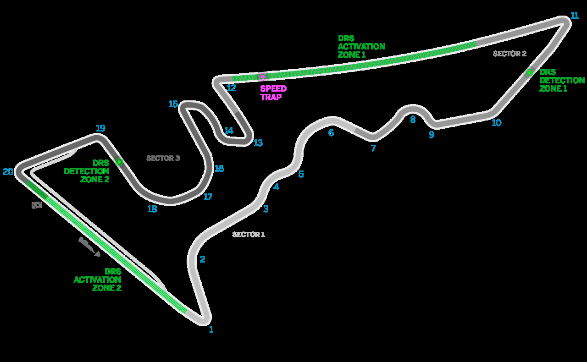

PROJEKT SPIELBERG GMBH & CO KG PROJEKT SPIELBERG GMBH & CO KG RED BULL RING STRASSE 1 RED BULL RING STRASSE 1 8724 SPIELBERG, AUSTRIA 8724 SPIELBERG, AUSTRIA T +43 3577 202 T +43 3577 202 INFORMATION@PROJEKT-SPIELBERG.COM – 38 – INFORMATION@PROJEKT-SPIELBERG.COM – 39 –

Formula 1 Formula 1 Grosser Preis von Grosser Preis von Österreich 2018 Österreich 2018

Spielberg 29 June - 01 July Spielberg 29 June - 01 July

MEXICAN GRAND PRIX – MEXICO CITY BRAZILIAN GRAND PRIX – SÃO PAULO

28. OCTOBER 2018 / AUTÓDROMO HERMANOS RODRÍGUEZ 11. NOVEMBER 2018 / AUTÓDROMO JOSÉ CARLOS PACE

| First Grand Prix 1963 | Number of Laps 71 | Circuit Length 4.304 km | Race Distance 305.354 km |
| --- | --- | --- | --- |
| Lap Record 1:18.785 by Sebastian Vettel (2017) |  |  |  |

| First Grand Prix 1973 | Number of Laps 71 | Circuit Length 4.309 km | Race Distance 305.909 km |
| --- | --- | --- | --- |
| Lap Record 1:11.044 by Max Verstappen (2017) |  |  |  |

PROJEKT SPIELBERG GMBH & CO KG PROJEKT SPIELBERG GMBH & CO KG RED BULL RING STRASSE 1 RED BULL RING STRASSE 1 8724 SPIELBERG, AUSTRIA 8724 SPIELBERG, AUSTRIA T +43 3577 202 T +43 3577 202 INFORMATION@PROJEKT-SPIELBERG.COM – 40 – INFORMATION@PROJEKT-SPIELBERG.COM – 41 –

Formula 1 Formula 1 Grosser Preis von Grosser Preis von Österreich 2018 Österreich 2018

Spielberg 29 June - 01 July Spielberg 29 June - 01 July

FIA FORMULA 1 DRIVERS’ WORLD CHAMPIONSHIP 2018

ABU DHABI GRAND PRIX – YAS MARINA INTERMEDIATE RANKING (8 OF 20 RACES) / 25 JUNE 2018

25. NOVEMBER 2018 / YAS MARINA CIRCUIT Pos. Driver Team Points 1 Lewis Hamilton Mercedes 145

| First Grand Prix 2009 | Number of Laps 55 | Circuit Length 5.554 km | Race Distance 305.355 km |
| --- | --- | --- | --- |
| Lap Record 1:40.279 by Sebastian Vettel (2009) |  |  |  |

2 Sebastian Vettel Ferrari 131

3 Daniel Ricciardo Red Bull Racing 96

4 Valtteri Bottas Mercedes 92

5 Kimi Räikkönen Ferrari 83

6 Max Verstappen Red Bull Racing 68

7 Nico Hulkenberg Renault 34

8 Fernando Alonso McLaren Renault 32

9 Carlos Sainz Renault 28

10 Kevin Magnussen Haas Ferrari 27

11 Pierre Gasly Scuderia Toro Rosso Honda 18

12 Sergio Perez Force India Mercedes 17

13 Esteban Ocon Force India Mercedes 11

14 Charles Leclerc Sauber Ferrari 11

15 Stoffel Vandoorne McLaren Renault 8

16 Lance Stroll Williams Mercedes 4

17 Marcus Ericsson Sauber Ferrari 2

18 Brendon Hartley Scuderia Toro Rosso Honda 1

19 Romain Grosjean Haas Ferrari 0

20 Sergey Sirotkin Williams Mercedes 0

FIA FORMULA 1 CONSTRUCTORS’ WORLD CHAMPIONSHIP 2018

INTERMEDIATE RANKING (8 OF 20 RACES) / 25 JUNE 2018

Pos. Team Points

1 Mercedes 237

2 Ferrari 214

3 Red Bull Racing 164

4 Renault 62

5 McLaren Renault 40

6 Force India Mercedes 28

7 Haas Ferrari 27

8 Scuderia Toro Rosso Honda 19

9 Sauber Ferrari 13

10 Williams Mercedes 4

PROJEKT SPIELBERG GMBH & CO KG PROJEKT SPIELBERG GMBH & CO KG RED BULL RING STRASSE 1 RED BULL RING STRASSE 1 8724 SPIELBERG, AUSTRIA 8724 SPIELBERG, AUSTRIA T +43 3577 202 T +43 3577 202 INFORMATION@PROJEKT-SPIELBERG.COM – 42 – INFORMATION@PROJEKT-SPIELBERG.COM – 43 –

Formula 1 Formula 1 Grosser Preis von Grosser Preis von Österreich 2018 Österreich 2018

Spielberg 29 June - 01 July Spielberg 29 June - 01 July

LIST OF DRIVERS OVERVIEW OF DRIVER STATS

STAND: 25 JUNE 2018

Nr. Driver Nation Team Driver F1-Debut Starts Poles Wins WC-Titels

44 Lewis Hamilton United Kingdom Mercedes Lewis Hamilton 2007 216 75 65 2008, 2014, 2015, 2017

77 Valtteri Bottas Finland Mercedes Valtteri Bottas 2013 106 4 3

3 Daniel Ricciardo Australia Red Bull Racing Daniel Ricciardo 2011 137 2 7

33 Max Verstappen Belgium Red Bull Racing Max Verstappen 2015 68 0 3

5 Sebastian Vettel Germany Ferrari Sebastian Vettel 2007 207 54 50 2010, 2011, 2012, 2013

7 Kimi Räikkönen Finland Ferrari Kimi Räikkönen 2001 281 17 20 2007

11 Sergio Perez Mexico Force India Sergio Perez 2011 144 0 0

31 Esteban Ocon France Force India Esteban Ocon 2016 37 0 0

18 Lance Stroll Canada Williams Lance Stroll 2017 28 0 0

35 Sergey Sirotkin Russia Williams Sergey Sirotkin 2018 8 0 0

2 Stoffel Vandoorne Belgium McLaren Stoffel Vandoorne 2016 29 0 0

14 Fernando Alonso Spain McLaren Fernando Alonso 2001 301 22 32 2005, 2006

10 Pierre Gasly France Toro Rosso Carlos Sainz 2015 68 0 0

28 Brendon Hartley New Zealand Toro Rosso Nico Hülkenberg 2010 145 1 0

8 Romain Grosjean France Haas Romain Grosjean 2009 132 0 0

20 Kevin Magnussen Denmark Haas Kevin Magnussen 2014 69 0 0

27 Nico Hülkenberg Germany Renault Marcus Ericsson 2014 84 0 0

55 Carlos Sainz Spain Renault Charles Leclerc 2018 8 0 0

9 Marcus Ericsson Sweden Sauber Pierre Gasly 2017 13 0 0

16 Charles Leclerc Monaco Sauber Brendon Hartley 2017 12 0 0

PROJEKT SPIELBERG GMBH & CO KG PROJEKT SPIELBERG GMBH & CO KG RED BULL RING STRASSE 1 RED BULL RING STRASSE 1 8724 SPIELBERG, AUSTRIA 8724 SPIELBERG, AUSTRIA T +43 3577 202 T +43 3577 202 INFORMATION@PROJEKT-SPIELBERG.COM – 44 – INFORMATION@PROJEKT-SPIELBERG.COM – 45 –

MERCEDES RED BULL RACING

Country: Germany First Season: 1970 Country: Austria First Season: 1997

Headquarters: Brackley, UK Constructors‘ Titles: 4 Headquarters: Milton Keynes, UK Constructors‘ Titles: 4

Team Manager: Toto Wolff Best Position: 1 (x 70) Team Manager: Christian Horner Best Position: 1 (x 57)

Technical Manager: James Allison Pole Positions: 83 Technical Manager: Pierre Waché Pole Positions: 59

Fastest Lap: 50 Fastest Lap: 59 Car: W09 Car: RB14

Engine: Mercedes Engine: TAG Heuer

Lewis Hamilton Valtteri Bottas Daniel Ricciardo Max Verstappen 44 3 Country United Kingdom Finland Country Australia Netherlands

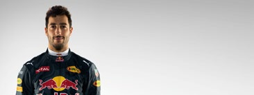

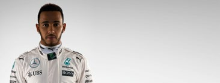

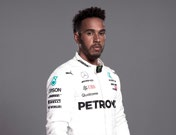

Date of Birth 07/01/1985 28/08/1989 HAMILTON Date of Birth 01/07/1989 30/09/1997 RICCIARDO

Place of Birth Stevenage Nastola Place of Birth Perth Hasselt

Best Starting Position 1 1 Best Starting Position 1 2 77 33 No. of GP Races 216 106 No. of GP Races 137 68 BOTTAS VERSTAPPEN Podium Finishes 123 26 Podium Finishes 29 14

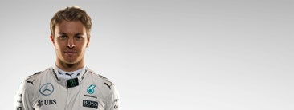

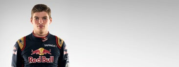

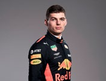

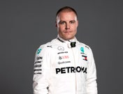

Best Position 1 (x 65) 1 (x 3) Best Position 1 (x 7) 1 (x 3)

Championship Titles 4 0 Championship Titles 0 0

FERRARI WILLIAMS

Country: Italy First Season: 1950 Country: United Kingdom First Season: 1978

Headquarters: Maranello, Italy Constructors‘ Titles: 16 Headquarters: Grove, UK Constructors‘ Titles: 9

Team Manager: Maurizio Arrivabene Best Position: 1 (x 233) Team Manager: Frank Williams Best Position: 1 (x 114)

Technical Manage: Mattia Binotto Pole Positions: 210 Technical Manager: Paddy Lowe Pole Positions: 128

Fastest Lap: 243 Fastest Lap: 133 Car: SF71H Car: FW41

Engine: Ferrari Engine: Mercedes

Sebastian Vettel Kimi Räikkönen Sergey Sirotkin Lance Stroll 5 35 Country Germany Finland Country Russia Canada

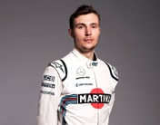

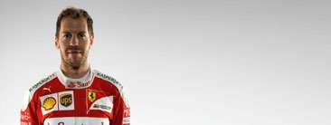

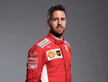

Date of Birth 03/07/1987 17/10/1979 VETTEL Date of Birth 25/08/1995 29/10/1998 SIROTKIN

Place of Birth Heppenheim Espoo Place of Birth Moscow Montreal

Best Starting Position 1 1 Best Starting Position 11 2 7 18 No. of GP Races 207 281 No. of GP Races 8 28 RÄIKKÖNEN STROLL Podium Finishes 103 95 Podium Finishes N/A 1

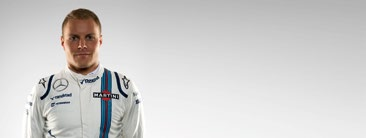

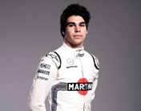

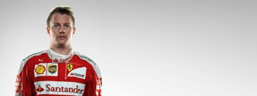

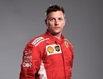

Best Position 1 (x 50) 1 (x 20) Best Position 14 (x 1) 3 (x 1)

Championship Titles 4 1 Championship Titles 0 0

Stand: 25.06.2018 Stand: 25.06.2018

PROJEKT SPIELBERG GMBH & CO KG PROJEKT SPIELBERG GMBH & CO KG RED BULL RING STRASSE 1 RED BULL RING STRASSE 1 8724 SPIELBERG, AUSTRIA 8724 SPIELBERG, AUSTRIA T +43 3577 202 T +43 3577 202 INFORMATION@PROJEKT-SPIELBERG.COM – 46 – INFORMATION@PROJEKT-SPIELBERG.COM – 47 –

TORO ROSSO MCLAREN

Country: Italy First Season: 1985 Country: Unites Kingdom First Season: 1966

Headquarters: Faenza, Italy Constructors‘ Titles: N/A Headquarters: Woking, UK Constructors‘ Titles: 8

Team Manager: Franz Tost Best Position: 1 (x 1) Team Manager: Eric Boullier Best Position: 1 (x 182)

Technical Manager: James Key Pole Positions: 1 Technical Manager: Tim Goss Pole Positions: 155

Fastest Lap: 1 Fastest Lap: 155 Car: STR13 Car: MCL33

Engine: Honda Engine: Renault

Pierre Gasly Brendon Hartley Fernando Alonso Stoffel Vandoorne

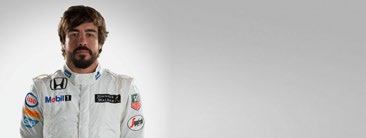

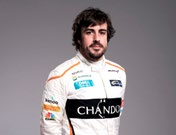

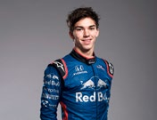

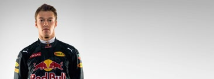

Country France New Zealand 10 Country Spain Belgium 14

Date of Birth 07/02/1996 10/11/1989 GASLY Date of Birth 29/07/1981 26/03/1992 ALONSO

Place of Birth Rouen Palmerston North Place of Birth Oviedo Kortrijk

Best Starting Position 5 11 Best Starting Position 1 7 28 02 No. of GP Races 13 12 No. of GP Races 301 29 HARTLEY VANDOORNE Podium Finishes N/A N/A Podium Finishes 97 N/A

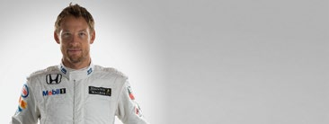

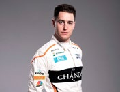

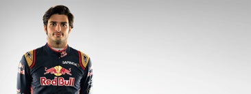

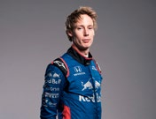

Best Position 4 (x 1) 10 (x 1) Best Position 1 (x 32) 7 (x 2)

Championship Titles 0 0 Championship Titles 2 0

FORCE INDIA SAUBER

Country: Switzerland First Season: 1993 Country: India First Season: 1991 Headquarters: Hinwil, Switzerland Constructors‘ Titles: N/A Headquarters: Silverstone, UK Constructors‘ Titles: N/A Team Manager: Frédéric Vasseur Best Position: 1 (x 1) Team Manager: Vijay Mallya Best Position: 2 (x 1) Technical Manager: TBC Pole Positions: 1 Technical Manager: Andrew Green Pole Positions: 1 Fastest Lap: 5 Fastest Lap: 5 Car: VJM11 Car: C37

Engine: Mercedes Engine: Ferrari

Esteban Ocon Sergio Pérez Marcus Ericsson Charles Leclerc

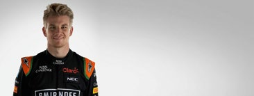

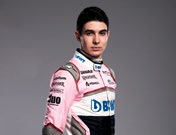

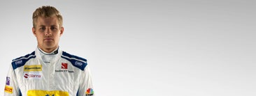

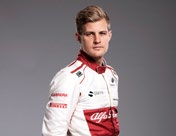

Country France Mexico 31 Country Sweden Monaco 9

Date of Birth 17/09/1996 26/01/1990 OCON Date of Birth 02/09/1990 16/10/1997 ERICSSON

Place of Birth Évreux Guadalajara Place of Birth Kumla Monte Carlo

Best Starting Position 3 4 Best Starting Position 9 8 11 16 No. of GP Races 37 144 No. of GP Races 84 8 Pérez LECLERC Podium Finishes N/A 8 Podium Finishes N/A N/A

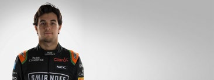

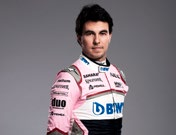

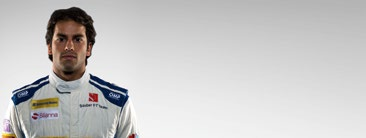

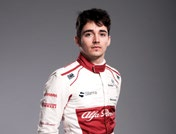

Best Position 5 (x 2) 5 (x 2) Best Position 8 (x 1) 6 (x 1)

Championship Titles 0 0 Championship Titles 0 0

Stand: 25.06.2018 Stand: 25.06.2018

PROJEKT SPIELBERG GMBH & CO KG PROJEKT SPIELBERG GMBH & CO KG RED BULL RING STRASSE 1 RED BULL RING STRASSE 1 8724 SPIELBERG, AUSTRIA 8724 SPIELBERG, AUSTRIA T +43 3577 202 T +43 3577 202 INFORMATION@PROJEKT-SPIELBERG.COM – 48 – INFORMATION@PROJEKT-SPIELBERG.COM – 49 –

Formula 1 RENAULT Grosser Preis von Österreich 2018

Spielberg 29 June - 01 July Country: France First Season: 1986

Headquarters: Enstone, UK Constructors‘ Titles: 2

Team Manager: Cyril Abiteboul Best Position: 1 (x 20)

Technical Manager: Bob Bell Pole Positions: 20

Fastest Lap: 13 Car: R.S.18 FIA FORMULA 1 DRIVERS’ WORLD CHAMPIONSHIP 2017

Engine: Renault

Pos. Driver Team Points Carlos Sainz Nico Hülkenberg 55 1 Lewis Hamilton Mercedes 363 Country Spain Germany 2 Sebastian Vettel Ferrari 317 Date of Birth 01/09/1994 19/08/1987 SAINZ 3 Valtteri Bottas Mercedes 305 Place of Birth Madrid Emmerich 4 Kimi Räikkönen Ferrari 205 Best Starting Position 5 1 27 5 Daniel Ricciardo Red Bull Racing 200 No. of GP Races 68 145 HÜLKENBERG 6 Max Verstappen Red Bull Racing 168 Podium Finishes N/A N/A 7 Sergio Perez Force India Mercedes 100 Best Position 4 (x 1) 4 (x 3) 8 Esteban Ocon Force India Mercedes 87 Championship Titles 0 0 9 Carlos Sainz Renault 54

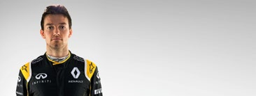

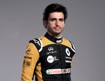

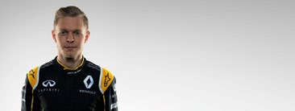

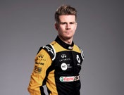

10 Nico Hulkenberg Renault 43

11 Felipe Massa Williams Mercedes 43 HAAS 12 Lance Stroll Williams Mercedes 40

13 Romain Grosjean Haas Ferrari 28 Country: USA First Season: 2016 14 Kevin Magnussen Haas Ferrari 19 Headquarters: N/A Constructors‘ Titles: N/A 15 Fernando Alonso McLaren Honda 17 Team Manager: Guenther Steiner Best Position: 5 (x 2) 16 Stoffel Vandoorne McLaren Honda 13 Technical Manager: Rob Taylor Pole Positions: N/A 17 Jolyon Palmer Renault 8 Fastest Lap: N/A Car: N/A 18 Pascal Wehrlein Sauber Ferrari 5

Engine: N/A 19 Daniil Kvyat Toro Rosso 5

20 Marcus Ericsson Sauber Ferrari 0 Kevin Magnussen Romain Grosjean 21 Pierre Gasly Toro Rosso 0 Country Denmark France 20 22 Antonio Giovinazzi Sauber Ferrari 0 Date of Birth 05/10/1992 17/04/1986 MAGNUSSEN 23 Brendon Hartley Toro Rosso 0 Place of Birth Roskilde Geneva

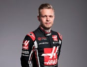

Best Starting Position 4 2 08 No. of GP Races 69 132 GROSJEAN Podium Finishes 1 10

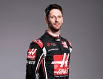

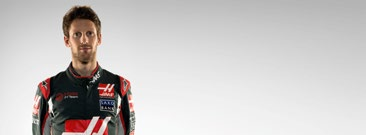

Best Position 2 (x 1) 2 (x 2)

Championship Titles 0 0

Stand: 26.06.2017

PROJEKT SPIELBERG GMBH & CO KG PROJEKT SPIELBERG GMBH & CO KG RED BULL RING STRASSE 1 RED BULL RING STRASSE 1 8724 SPIELBERG, AUSTRIA 8724 SPIELBERG, AUSTRIA T +43 3577 202 T +43 3577 202 INFORMATION@PROJEKT-SPIELBERG.COM – 50 – INFORMATION@PROJEKT-SPIELBERG.COM – 51 –

Formula 1 Formula 1 Grosser Preis von Grosser Preis von Österreich 2018 Österreich 2018

Spielberg 29 June - 01 July Spielberg 29 June - 01 July

FIA FORMULA 1 WORLD CHAMPIONSHIP RACE WINNERS 2017

Grand Prix Driver Team Time

Australia Sebastian Vettel Ferrari 1:24:11.672

China Lewis Hamilton Mercedes 1:37:36.158

Bahrain Sebastian Vettel Ferrari 1:33:53.374

Russia Valtteri Bottas Mercedes 1:28:08.743

Spain Lewis Hamilton Mercedes 1:35:56.497

Monaco Sebastian Vettel Ferrari 1:44:44.340

Canada Lewis Hamilton Mercedes 1:33:05.154

Azerbaijan Daniel Ricciardo Red Bull Racing 2:03:55.573

Austria Valtteri Bottas Mercedes 1:21:48.523

Great Britain Lewis Hamilton Mercedes 1:21:27.430

Hungary Sebastian Vettel Ferrari 1:39:46.713

Belgium Lewis Hamilton Mercedes 1:24:42.820

Italy Lewis Hamilton Mercedes 1:15:32.312

Singapore Lewis Hamilton Mercedes 2:03:23.544

Malaysia Max Verstappen Red Bull Racing 1:30:01.290

Japan Lewis Hamilton Mercedes 1:27:31.194

United States Lewis Hamilton Mercedes 1:33:50.991

Mexico Max Verstappen Red Bull Racing 1:36:26.552

Brazil Sebastian Vettel Ferrari 1:31:26.262

Abu Dhabi Valtteri Bottas Mercedes 1:34:14.062

FIA FORMULA 1 CONSTRUCTORS’ WORLD CHAMPIONSHIP 2017

Pos. Team Total Points

1 Mercedes 668

2 Ferrari 522

3 Red Bull Racing 368

4 Force India Mercedes 187

5 Williams Mercedes 83

6 Renault 57

7 Toro Rosso 53

8 Haas Ferrari 47

9 McLaren Honda 30

10 Sauber Ferrari 5

PROJEKT SPIELBERG GMBH & CO KG PROJEKT SPIELBERG GMBH & CO KG RED BULL RING STRASSE 1 RED BULL RING STRASSE 1 8724 SPIELBERG, AUSTRIA 8724 SPIELBERG, AUSTRIA T +43 3577 202 T +43 3577 202 INFORMATION@PROJEKT-SPIELBERG.COM – 52 – INFORMATION@PROJEKT-SPIELBERG.COM – 53 –

Formula 1 Formula 1 Grosser Preis von Grosser Preis von Österreich 2018 Österreich 2018

Spielberg 29 June - 01 July Spielberg 29 June - 01 July

PROJEKT SPIELBERG GMBH & CO KG PROJEKT SPIELBERG GMBH & CO KG RED BULL RING STRASSE 1 RED BULL RING STRASSE 1 8724 SPIELBERG, AUSTRIA 8724 SPIELBERG, AUSTRIA T +43 3577 202 T +43 3577 202 INFORMATION@PROJEKT-SPIELBERG.COM – 54 – INFORMATION@PROJEKT-SPIELBERG.COM – 55 –

Formula 1 Formula 1 Grosser Preis von Grosser Preis von Österreich 2018 Österreich 2018

Spielberg 29 June - 01 July Spielberg 29 June - 01 July

PROJEKT SPIELBERG GMBH & CO KG PROJEKT SPIELBERG GMBH & CO KG RED BULL RING STRASSE 1 RED BULL RING STRASSE 1 8724 SPIELBERG, AUSTRIA 8724 SPIELBERG, AUSTRIA T +43 3577 202 T +43 3577 202 INFORMATION@PROJEKT-SPIELBERG.COM – 56 – INFORMATION@PROJEKT-SPIELBERG.COM – 57 –

Formula 1 Formula 1 Grosser Preis von Grosser Preis von Österreich 2018 Österreich 2018

Spielberg 29 June - 01 July Spielberg 29 June - 01 July

PROJEKT SPIELBERG GMBH & CO KG PROJEKT SPIELBERG GMBH & CO KG RED BULL RING STRASSE 1 RED BULL RING STRASSE 1 8724 SPIELBERG, AUSTRIA 8724 SPIELBERG, AUSTRIA T +43 3577 202 T +43 3577 202 INFORMATION@PROJEKT-SPIELBERG.COM – 58 – INFORMATION@PROJEKT-SPIELBERG.COM – 59 –

Official title sponsor

EYETIME

GROSSER PREIS

VON ÖSTERREICH

SPIELBERG 29 JUNE - 1 JULY

The F1 Logo, F1, FORMULA 1, FIA FORMULA ONE WORLD CHAMPIONSHIP, GRAND PRIX, GROSSER PREIS VON ÖSTERREICH and related marks are trade marks of Formula One Licensing BV, a Formula 1 company. All rights reserved. OFFICIAL MEDIA KIT
