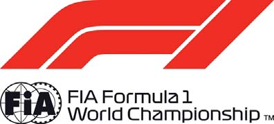
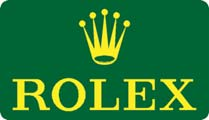

2018 AZERBAIJAN GRAND PRIX

26 - 29 April 2018

From The Stewards Document 5

To All Teams, All Officials Date 26 April 2018

Time 15:40

Title Championship Points

Description Championship Points

Enclosed AZE Doc 5 Corrected Championship Points.pdf

Garry Connelly Dennis Dean

Tom Kristensen Anar Shukurov

The Stewards

Doc 5 Time 15:40

FORMULA 1 2018 HEINEKEN CHINESE GRAND PRIX - Shanghai

Drivers' Championship

DRIVER TOTAL AUS BRN CHN AZE ESP MON CAN FRA AUT GBR GER HUN BEL ITA SGP RUS JPN USA MEX BRA UAE

| 1 | S. VETTEL | 54 | 25 1 | 25 1 | 4 8 |
| --- | --- | --- | --- | --- | --- |
| 2 | L. HAMILTON | 45 | 18 2 | 15 3 | 12 4 |
| 3 | V. BOTTAS | 40 | 4 8 | 18 2 | 18 2 |
| 4 | D. RICCIARDO | 37 | 12 4 | NC | 25 1 |
| 5 | K. RAIKKONEN | 30 | 15 3 | NC | 15 3 |
| 6 | F. ALONSO | 22 | 10 5 | 6 7 | 6 7 |
| 7 | N. HULKENBERG | 22 | 6 7 | 8 6 | 8 6 |
| 8 | M. VERSTAPPEN | 18 | 8 6 | NC | 10 5 |
| 9 | P. GASLY | 12 | NC | 12 4 | 18 |
| 10 | K. MAGNUSSEN | 11 | NC | 10 5 | 1 10 |
| 11 | S. VANDOORNE | 6 | 2 9 | 4 8 | 13 |
| 12 | C. SAINZ | 3 | 1 10 | 11 | 2 9 |
| 13 | M. ERICSSON | 2 | NC | 2 9 | 16 |
| 14 | E. OCON | 1 | 12 | 1 10 | 11 |
| 15 | S. PEREZ | 0 | 11 | 16 | 12 |
| 16 | C. LECLERC | 0 | 13 | 12 | 19 |
| 17 | R. GROSJEAN | 0 | NC | 13 | 17 |
| 18 | L. STROLL | 0 | 14 | 14 | 14 |
| 19 | S. SIROTKIN | 0 | NC | 15 | 15 |
| 20 | B. HARTLEY | 0 | 15 | 17 | 20 |

Garry Connelly Dennis Dean Tom Kristensen Anar Shukurov

The Stewards

© 2018 Formula One World Championship Limited The F1 FORMULA 1 logo, F1 logo, FORMULA 1, FORMULA ONE, F1, FIA FORMULA ONE WORLD CHAMPIONSHIP, GRAND PRIX and related marks are trade marks of Formula One Licensing BV, a Formula 1 company. The FIA logo is a trade mark of the Fédération Internationale de l’Automobile. All rights reserved. No part of these results/data may be reproduced, stored in a retrieval system or transmitted in any form or by any means electronic, mechanical, photocopying, recording, broadcasting or otherwise without prior permission of the copyright holder except for reproduction in local/national/international daily press and regular printed publications on sale to the public within 90 days of the event to which the results/data relate and provided that the copyright symbol and name of copyright owner appears.

FORMULA 1 2018 HEINEKEN CHINESE GRAND PRIX - Shanghai

Constructors' Championship

ENTRANT TOTAL AUS BRN CHN AZE ESP MON CAN FRA AUT GBR GER HUN BEL ITA SGP RUS JPN USA MEX BRA UAE

| 1 | Mercedes AMG Petronas Motorsport | 85 | 22 2 8 | 33 2 3 | 30 2 4 |
| --- | --- | --- | --- | --- | --- |
| 2 | Scuderia Ferrari | 84 | 40 1 3 | 25 1 NC | 19 3 8 |
| 3 | Aston Martin Red Bull Racing | 55 | 20 4 6 | NC NC | 35 1 5 |
| 4 | McLaren F1 Team | 28 | 12 5 9 | 10 7 8 | 6 7 13 |
| 5 | Renault Sport Formula One Team | 25 | 7 7 10 | 8 6 11 | 10 6 9 |
| 6 | Red Bull Toro Rosso Honda | 12 | 15 NC | 12 4 17 | 18 20 |
| 7 | Haas F1 Team | 11 | NC NC | 10 5 13 | 1 10 17 |
| 8 | Alfa Romeo Sauber F1 Team | 2 | 13 NC | 2 9 12 | 16 19 |
| 9 | Sahara Force India F1 Team | 1 | 11 12 | 1 10 16 | 11 12 |
| 10 | Williams Martini Racing | 0 | 14 NC | 14 15 | 14 15 |

Garry Connelly Dennis Dean Tom Kristensen Anar Shukurov

The Stewards

© 2018 Formula One World Championship Limited The F1 FORMULA 1 logo, F1 logo, FORMULA 1, FORMULA ONE, F1, FIA FORMULA ONE WORLD CHAMPIONSHIP, GRAND PRIX and related marks are trade marks of Formula One Licensing BV, a Formula 1 company. The FIA logo is a trade mark of the Fédération Internationale de l’Automobile. All rights reserved. No part of these results/data may be reproduced, stored in a retrieval system or transmitted in any form or by any means electronic, mechanical, photocopying, recording, broadcasting or otherwise without prior permission of the copyright holder except for reproduction in local/national/international daily press and regular printed publications on sale to the public within 90 days of the event to which the results/data relate and provided that the copyright symbol and name of copyright owner appears.
