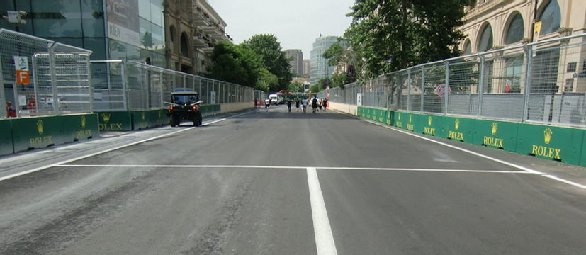

2018 AZERBAIJAN GRAND PRIX

26 - 29 April 2018

From The FIA Formula One Race Director Document 2

To All Teams, All Officials Date 26 April 2018

Time 09:00

Title Event Notes

Description Event Notes

Enclosed 2018_04_26_AZERBAIJAN_GP_EVENT_NOTES.pdf

Charlie Whiting

The FIA Formula One Race Director

2018 AZERBAIJAN GRAND PRIX

26-29 APRIL 2018

From The FIA Formula One Race Director Document 2

To Formula One Team Managers Date 26 April 2018

Time 09.00

EVENT NOTES

26 APRIL 2018

1) Issues arising from the Chinese Grand Prix

2) Changes to the circuit

2.1 The kerb on the apex of turn 8 has been renewed to replicate the quick fix done after the first day of practice in 2017.

3) Pit lane map

3.1 Safety Car lines.

3.2 The location of the pit entry and the pit exit.

3.3 Designated garage areas.

3.4 Safety Car position for first lap and rest of race.

3.5 Blue flag marshal at the pit exit.

3.6 Track light panel displaying pit entry status.

4) Pirelli Event Preview

4.1 With reference to Article 24.4(a) of the Sporting Regulations see the attached document provided by the official tyre supplier.

5) Weighing and weighing platform

5.1 The FIA weighing platform will be available for teams to use at the following times, however, no more than 10 team personnel may be present during any visit. Each visit should last no more than 10 minutes unless no other team is waiting in the pit lane :

a) From 13.30 Thursday until 16.30 on Saturday (between 15.00 and 16.30 each visit will be restricted to five minutes).

1/5

b) From when the cars are returned to the teams after qualifying until 21.30 on Saturday.

c) From 11.10 until 15.10 on Sunday.

Any team found to be abusing the time limits set out above, which we will be enforced by FIA security personnel and our own CCTV, will not be permitted to use the weighbridge again during the Event.

6) Red zones for photographers in the pit lane during practice sessions

6.1 See the attached drawing.

7) Practice starts

7.1 During practice sessions :

Practice starts may only be carried out in the pit exit on the left hand side after the corner but before the dashed white line across the pit exit, drivers should leave sufficient space on their right to allow other cars to pass.

7.2 During the time the pit exit is open for reconnaissance laps (15.40-15.50) :

Drivers may start further forward but no further forward than the end of the painted kerb, always keeping to the left and again leaving sufficient space on their right to allow other cars to pass.

7.3 At all times :

For reasons of safety and sporting equity, cars may not stop in the fast lane of the pits at any time the pit exit is open without a justifiable reason (a practice start is not considered a justifiable reason).

8) Lines or bollards at the pit entry and pit exit

8.1 In accordance with Chapter 4 (Section 5) of Appendix L to the ISC drivers must keep to the left of the solid white line at the pit exit when leaving the pits, no part of any car leaving the pits may cross this line.

8.2 For safety reasons the limits of the pit exit should not be exceeded by cutting the white line bordering the painted kerb on the apex with all four wheels.

8.3 When entering the pits drivers must keep to the left of the white line on the track before the start of the pit entry.

Furthermore, any car with four wheels to the left of the white line must enter the pit lane.

8.4 The dotted white lines across the pit exit and the pit entry are the track edges.

9) DRS

9.1 DRS will be globally disabled if panels 1, 2, 3, 4 or 20 are displaying yellow.

9.2 Detection will be automatically disabled if the light panel below is displaying yellow :

Zone 1 : Panel 19.

9.3 If automatic detection is not working , and permission has been given by race control to use manual detection, DRS must not be used in the relevant zone if panel 19 is displaying yellow.

10) Observing yellow flags during free practice and qualifying

10.1 Double waved : Any driver passing through a double waved yellow marshalling sector must reduce speed significantly and be prepared to change direction or stop.

2/5

In order for the stewards to be satisfied that any such driver has complied with these requirements it must be clear that he has not attempted to set a meaningful lap time, for practical purposes this means the driver should abandon the lap (this does not necessarily mean he has to pit as the track could well be clear the following lap).

10.2 Single waved : Drivers should reduce their speed and be prepared to change direction. It must be clear that a driver has reduced speed and, in order for this to be clear, a driver would be expected to have braked earlier and/or discernibly reduced speed in the relevant marshalling sector.

Drivers should not overtake any car in a single waved yellow marshalling sector unless it is clear that a car is slowing with a completely obvious problem, e.g. obvious accident damage or a deflated tyre.

11) Track light panels

11.1 The FIA light panels have been installed in the positions shown on the circuit map. In accordance with Appendix H to the ISC the light signals have the same meaning as flag signals.

12) Drivers leaving their pit stop position in the pit lane

12.1 For safety reasons, no car should be driven from its pit stop position at any time unless :

a) It has first been driven into the pit stop position having just entered the pit lane from the track, and ;

b) It is then driven immediately back onto the track from the pit stop position.

13) Fire extinguishers around the circuit

13.1 Indicated by small fluorescent orange boards with a white letter “F”.

14) Places where drivers can leave the track

14.1 Indicated by white and green panels (showing a man running!) on the fences, in addition the tops of the walls in these locations are painted fluorescent orange.

15) Places to remove cars from the track

15.1 Indicated by fluorescent orange panels 2m long on the walls or guardrails. Due to the nature of the track there are limited places where cars can be recovered, it is therefore extremely important that your drivers are familiar with these locations. In addition to openings in the walls cars can be pushed away from the back of the escape roads in turns 1, 2, 3, 4, 6, 7, 8, 12, 15 and 16.

15.2 This is not a track where a driver should take any risks to get back to the pits if he has a serious mechanical problem or damage to his car, the stewards will be asked to strictly enforce Article 22.11 of the Sporting Regulations at all times.

16) In laps and reconnaissance laps

16.1 In order to ensure that cars are not driven unnecessarily slowly on in laps during and after the end of qualifying or during reconnaissance laps when the pit exit is opened for the race, drivers must stay below the maximum time set by the FIA between the Safety Car lines shown on the pit lane map.

You will be informed of the maximum time after the first day of practice.

3/5

17) Support races

17.1 Teams are asked to keep their barriers no more than four metres from the garages during the support race practice sessions and races.

18) Post qualifying parc fermé

18.1 The cameras should be installed and operated in the same way as usual.

19) Operational personnel curfew

19.1 Boards warning anyone attempting to enter the paddock that the curfew is in operation will be placed immediately before the entry turnstiles at the appropriate times.

20) Removing cars from the grid

20.1 Via the two gates in the pit wall, the first just in front of pole position and the second beside grid position 14.

21) Car number light panels for the start

21.1 On the driver's left.

22) Track light panel displaying pit entry status

22.1 The light panel indicated on the pit lane map will display a flashing yellow arrow if cars are required to use the pit lane once the Safety Car has been deployed during the race.

22.2 The light panel indicated on the pit lane map will display a flashing red cross if the pit lane is closed at any point during the race.

23) Lapping during the race

23.1 The ISC requires drivers who are caught by another car about to lap him to allow the faster driver past at the first available opportunity. The F1 Marshalling System has been developed in order to ensure that the point at which a driver is shown blue flags is consistent, rather than trusting the ability of marshals to identify situations that require blue flags.

As it was at the end of last season the system will be set to give a pre-warning when the faster car is within 3.0s of the car about to be lapped, this should be used by the team of the slower car to warn their driver he is soon going to be lapped and that allowing the faster car through should be considered a priority. When the faster car is within 1.2s of the car about to be lapped blue flags will be shown to the slower car (in addition to blue light panels, blue cockpit lights and a message on the timing monitors) and the driver must allow the following driver to overtake at the first available opportunity.

It should be noted that the aim of using F1MS is ensure consistent application of the rules, additional instructions may also be given by race control when necessary.

24) Post race parc fermé

24.1 All cars must enter the pit lane and proceed directly to the weighing area.

25) Any other business

4/5

Charlie Whiting FIA Formula One Race Director

5/5

|  |  | Grand Prix of Azerbaijan 27-29/04/2018 (18R04BAK) |  |  |  |  |  |  |  |
| --- | --- | --- | --- | --- | --- | --- | --- | --- | --- |
|  |  | Compound |  | FL | FR | RL | RR |  | Mandatory race tyres |
|  |  | SOFT |  | S60 | S62 | S70 | S72 |  | SOFT |
|  |  | SUPERSOFT |  | X60 | X62 | X70 | X72 |  | SUPERSOFT |
|  |  | ULTRASOFT |  | U60 | U62 | U70 | U72 |  |  |
|  |  | INTERMEDIATE SOFT |  | G37 | G38 | G39 | G40 |  | Q3 tyre |
|  |  | WET SOFT Cross-Over time MINIMUM STARTING PRESSURE, BLISTERING SENSITIVITY, CAMBER LIMIT |  | W37 WET > 119% > INT > 113% > DRY | W38 Front (psi) | W39 | W40 | Rear (psi) | ULTRASOFT |
|  |  |  | Slicks |  | 22.0 |  |  | 21.0 |  |
|  |  |  | Intermediate |  | 20.0 |  |  | 20.0 |  |
|  |  |  | Wet |  | 19.0 |  |  | 19.0 |  |
| FE EOS Camber limit RE EOS Camber limit -3.50 ° -2.00 ° FE Blistering RE Blistering sensitivity sensitivity Low Low |  | TYRE HEATING STRATEGY |  |  |  |  |  |  |  |
| Storage temperature: Optimum time in Storage temperature: Optimum time in blanket (@80°): blanket (@60°): 60°C 40°C 2h 1h SLICKS INTER Maximum boost Blanket time window Maximum boost Blanket time window temperature (@80°): temperature (@60°): 1h @ 110°C 1h to 3h 30min @ 80°C 30 min to 2h Storage temperature: Optimum time in blanket (@60°): 40°C 1h WET Blanket time window NO BOOST (@60°): 30 min to 2h GENERAL NOTES Teams are kindly reminded that the following parameters will be subjected to FIA checks during the event: - Starting pressure. - Camber at maximum speed. - Maximum blanket temperature. - Tyre swapping. | Tyre Notes |  |  |  |  |  |  |  |  |
| ● Not permiGed to switch tyres from their originally allocated posi%on. Storage Temp˚C is the recommended temperature the tyre can stay in blankets without time limit. All temperature limits apply to the actual tyre surface temperature, measured with the IR ● Do not subject tyres to large deforma%on or heavy impact. gun detailed in TD029-15. ● Do not leave fiGed tyres exposed at an air temperature lower than 15°C SIDEWALLS HEATING CLARIFICATION (ALL PRODUCTS): you are allowed to apply a max. and/or any UV emission. temperature of 100 °C for max. 1 hr to the sidewalls as long as the max. temp/time at any part ● Revised prescrip%ons could be issued during the race weekend in of the tread is the one described in the corresponding section above. accordance with TD/007-16. | ● Not permiGed to switch tyres from their originally allocated posi%on. ● Do not subject tyres to large deforma%on or heavy impact. ● Do not leave fiGed tyres exposed at an air temperature lower than 15°C and/or any UV emission. ● Revised prescrip%ons could be issued during the race weekend in accordance with TD/007-16. |  |  |  |  | Storage Temp˚C is the recommended temperature the tyre can stay in blankets without time limit. All temperature limits apply to the actual tyre surface temperature, measured with the IR gun detailed in TD029-15. SIDEWALLS HEATING CLARIFICATION (ALL PRODUCTS): you are allowed to apply a max. temperature of 100 °C for max. 1 hr to the sidewalls as long as the max. temp/time at any part of the tread is the one described in the corresponding section above. |  |  |  |

2018 Azerbaijan Grand Prix Pit Lane

SAFETY CAR Line 2

PIT LANE Starts Pit Entry Status PIT LANE Ends PIT EXIT panel SAFETY CAR Line 1

CARS RECOVERED FROM SAFETY CAR TRACK PLACED HERE Race

SAFETY CAR First Lap

F1 Garages

X

PIT ENTRY

|  | 1 | 2 | 3 | 4 | 5 |  | 6 | 7 | 8 | 9 | 10 | 11 | 12 | 13 | 14 | 15 | 16 | 17 | 18 | 19 | 20 | 21 | 22 |  | 23 | 24 | 25 |  | 26 | 27 |  | 28 | 29 | 30 | 31 | 32 |  | 33 | 34 | 35 | 36 |  | 37 | 38 | 39 | 40 |  |  | 41 |  | 42 |  | 43 |  | 44 |
| --- | --- | --- | --- | --- | --- | --- | --- | --- | --- | --- | --- | --- | --- | --- | --- | --- | --- | --- | --- | --- | --- | --- | --- | --- | --- | --- | --- | --- | --- | --- | --- | --- | --- | --- | --- | --- | --- | --- | --- | --- | --- | --- | --- | --- | --- | --- | --- | --- | --- | --- | --- | --- | --- | --- | --- |
| lortnoC rewoT ecaR | AIF | AIF | AIF | AIF | 1F |  | 1F | sedecreM | sedecreM | sedecreM | irarreF/sedecreM | irarreF | irarreF | irarreF | lluB deR | lluB deR | lluB deR | aidnI ecroF/lluB deR | aidnI ecroF | aidnI ecroF | aidnI ecroF | smailliW | smailliW | yawklaW | smailliW | tluaneR/smailliW | tluaneR | tluaneR |  | tluaneR | ossoR oroT |  | ossoR oroT | ossoR oroT | saaH/ossoR oroT | saaH |  | saaH | saaH | neraLcM | neraLcM |  | neraLcM | rebuaS/neraLcM | rebuaS | rebuaS |  | rebuaS |  | illeriP |  | illeriP |  | illeriP |  |
| Designated Garage Areas |  | Pit Stop Position |  |  |  | Mercedes |  |  |  |  | Ferrari |  |  |  | Red Bull |  |  |  | Force India |  |  |  | Williams |  |  |  | Renault |  |  |  |  |  | Toro Rosso |  |  |  | Haas |  |  |  |  | McLaren |  |  |  |  | Sauber |  |  |  |  |  |  |  |  |

FAST LANE FAST LANE

Team Personnel Control Line (Race Start ONLY) Pole Position

Version 1 – 26 April 2018
