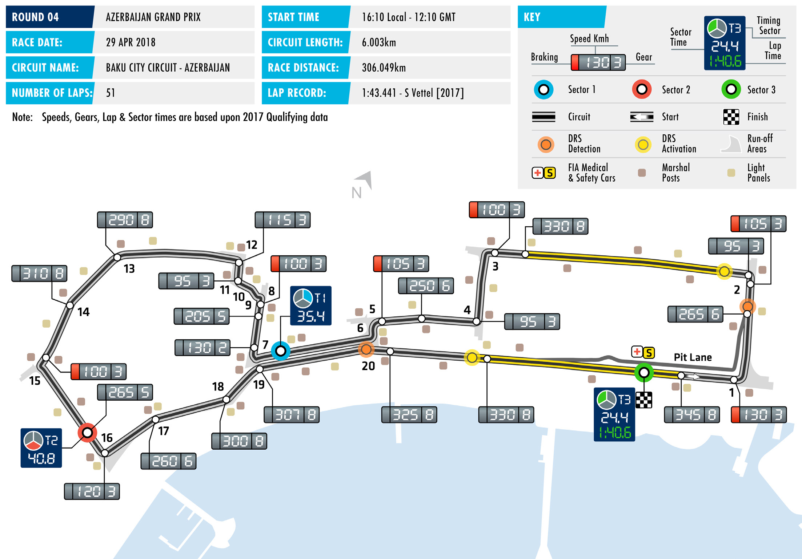
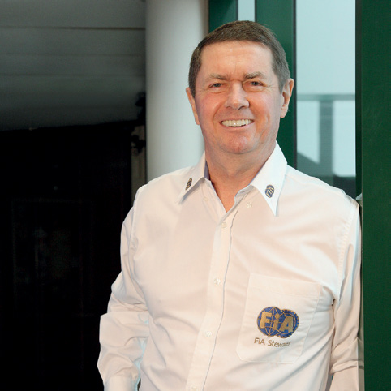
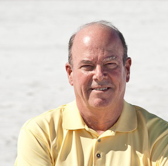
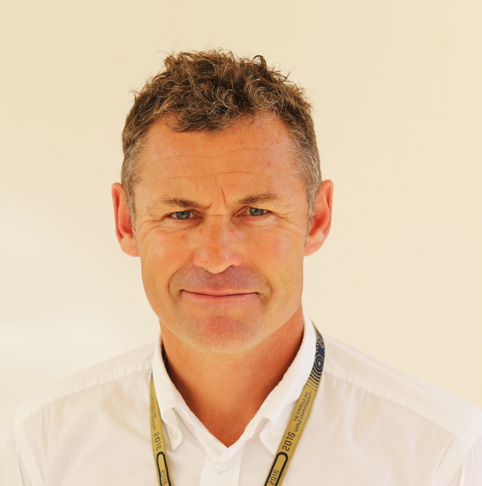

2018 AZERBAIJAN GRAND PRIX

27 – 29 April 2018

The early-season sequence of flyaway races draws to a close BAKU CITY CIRCUIT

this weekend with F1 heading to the Baku City Circuit, home Length of lap: 6.003km

of the Azerbaijan Grand Prix for Round Four of the 2018 FIA Lap record: 1:43.441 (Sebastian Vettel, Ferrari, 2017) Formula One World Championship. Start line/finish line offset: 0.104km The only grand prix held below sea-level doesn’t follow the Total number of race laps: 51 conventions of street circuit design. Baku features the low grip, Total race distance: 306.049km tight turns and unforgiving barriers expected of the type, but Pitlane speed limits: 80km/h in also encourages overtaking as well as ultra-high speeds on the practice, qualifying, and the race

2.1km pit straight, on which drivers spend over 20 seconds at CIRCUIT NOTES full throttle. ► The kerb at the apex of Turn 8 has been replaced. Keeping brakes and tyres warm for the excellent passing

opportunity into the Turn One left-hander has been problematic DRS ZONES in the past – and this is likely to be exacerbated by the move ► There are two DRS zones in Baku. from a late June race to the cooler temperatures of late April. The detection point of the first is Another major issue for teams to consider during practice at the SC2 line, while activation is is finding an acceptable compromise between performance 54m after Turn 2. The detection point of the second zone is at the on the fast start-finish section of track and on the low-speed apex of Turn 20, with activation middle sector of the lap. The race’s short history suggests there 347m after Turn 20. isn’t a one-size fits all solution.

Pirelli have returned to a sequential tyre allocation this weekend

with the soft, supersoft and ultrasoft compounds available.

After pre-season testing these three tyres were commonly

held to have the smallest performance differentials in the

Pirelli range, a belief confirmed by the time gaps in the season-

opening Australian Grand Prix. The low-speed sections of the

Baku City Circuit will, however, magnify the performance gap

between the tyres.

In the Drivers’ Championship Sebastian Vettel comes to Baku

with a nine-point lead over Lewis Hamilton but the picture is

less clear in the Constructors’ Championship. After three rounds

Ferrari have two victories, Red Bull the other but Mercedes may

count themselves unlucky, given that safety cars fell unkindly for

them while leading in both Australia and China. Nevertheless,

consistent scoring means that Mercedes hold a one-point lead

over Ferrari.

FAST FACTS

► This is the second Azerbaijan Grand Prix Third place for Williams’ Lance Stroll Indianapolis Motor Speedway, which has and the third Formula One grand prix in Azerbaijan was the only visit to the hosted both the United States Grand Prix to be held on the Baku City Circuit. The podium by a driver from outside the and the Indianapolis 500, the latter being circuit made its debut with the 2016 top three teams in the final standings of a round of the F1 World Championship European Grand Prix. the Constructors’ Championship. It was between 1950 and 1960. Stroll’s first, and so far only, podium. ► Nico Rosberg won the inaugural event ► Brendon Hartley, Pierre Gasly, Sergey in Baku for Mercedes, recording a grand ► The Azerbaijan Grand Prix was the most Sirotkin and Charles Leclerc are making chelem of pole (his 25th), victory, fastest overtaking-friendly race of 2017, with 42 their first F1 visit to the circuit, though lap and every lap led. Last year’s winner of the season’s 435 successful flying lap Hartley is the only circuit debutant. The was Daniel Ricciardo for Red Bull Racing. overtaking manoeuvres. other three have all appeared in junior The Australian won from tenth on the categories and all have featured on the grid having crashed in qualifying. ► Azerbaijan is the only country on the podium. Leclerc and Sirotkin drove here 2018 calendar in which Lewis Hamilton last year in Formula 2. Leclerc won the ► Mercedes are the only team to feature on has not been on the podium, and one of feature race and came second in the the podium at both races here. Following only two where he has not had a victory sprint, while Sirotkin was tenth and Rosberg’s 2016 win, Valtteri Bottas – the other being France, where his best fourth. The Russian also raced in Baku finished second last year. Mercedes result was third in 2007. Kimi Räikkönen during the final season of GP2, finishing are also the most successful engine has also been on the podium in every second and third. Gasly likewise appeared manufacturer, having had two teams on country on the 2018 schedule except in 2016, retiring from the feature race but the podium at both races: Sergio Pérez Azerbaijan. finishing second in the sprint. finished third in 2016 for Force India, and Lance Stroll finished third for Williams last ► The Baku City Circuit is one of six tracks to ► Mercedes have gone three races without year. The other driver to feature on the have hosted grands prix of different titles. a victory for the first time in the turbo- podium in Baku is Sebastian Vettel, who The others are Brands Hatch (British and hybrid era. They have previously lost finished second for Ferrari in 2016. European), Jerez (Spanish and European) consecutive races only twice: in 2014 The Nürburgring (German, Luxembourg, when Ricciardo won the Hungarian and ► Of the 60 podium places on offer in European), Imola (Italian and San Belgian Grands Prix, and last year when 2017, 59 were taken by the drivers from Marino) and Dijon (French and Swiss). Max Verstappen’s victory in Mexico was Mercedes, Ferrari and Red Bull Racing. There is also a case to be made for the followed by victory for Vettel in Brazil.

RACE STEWARDS BIOGRAPHIES

GARRY CONNELLY

DIRECTOR, GLOBAL INSTITUTE FOR MOTOR SPORT SAFETY; DIRECTOR, AUSTRALIAN INSTITUTE OF MOTOR SPORT SAFETY; F1, WTCC STEWARD; FIA WORLD MOTOR SPORT COUNCIL MEMBER

Garry Connelly has been involved in motor sport since the late 1960s. A long- time rally competitor, Connelly was instrumental in bringing the World Rally Championship to Australia in 1988 and served as Chairman of the Organising Committee, Board member and Clerk of Course of Rally Australia until December 2002. He has been an FIA Steward and FIA Observer since 1989, covering the FIA’s World Rally Championship, World Touring Car Championship and Formula One Championship. He is a director of the Australian Institute of Motor Sport Safety and of the Global Institute of Motor Sport Safety. He is a member of the FIA World Motor Sport Council.

DENNIS DEAN

FIA WORLD MOTOR SPORT COUNTIL MEMBER; MEMBER, INTERNATIONAL SPORTING CODE REVIEW COMMISSION; MEMBER, COMMISSION INTERNATIONALE DE KARTING; FORMULA E STEWARD

Dennis Dean has been involved in motor sport since becoming a scrutineer with the Sports Car Club of America (SCCA) in the late 1970s. He has served at national level as a scrutineer, steward, and race director, including 10 years as either assistant chief steward or chief steward (race director) of the SCCA’s National Championship Runoffs. He has scrutineered at 10 US Formula One races, in Las Vegas, Indianapolis and Austin. He was also vice president of Club Racing and Rally/Solo for SCCA. He currently serves as a member of both the FIA’s International Sporting Code Review Commission and the Commission Internationale de Karting. He is also chairman of the Steering Committee for the SCCA Hall of fame.

TOM KRISTENSEN

1980 NINE TIMES LE MANS WINNER, GERMAN F3 CHAMPION (1991), JAPANESE F3 CHAMPION (1993) ALMS CHAMPION (2001); PRESIDENT OF THE FIA DRIVERS’ COMMISSION, FIA WORLD MOTOR SPORT COUNCIL MEMBER

Denmark’s Tom Kristensen is the most successful driver in the history of the Le Mans 24-Hour race having won the endurance event nine times before retiring from competition in November 2014. Kristensen’s oustanding career saw him race in single-seaters, touring cars as well as testing in Formula One. However, it is for his achievements in sportscars that he is correctly most lauded. His first Le Mans win came in 1997, driving for the Joest Racing team. After two years competing with BMW, he rejoined Joest, now racing as Audi Sport Team Joest, in 2000, winning three Le Mans 24-Hours in succession with the team. He won again with Bentley in 2003 before returning to the wheel of Audi machines to win in 2004-’05, 2008 and 2013. In 2013 he also won the FIA World Endurance Championship title.

2018 Formula One World Championship

DRIVERS’ CHAMPIONSHIP STANDINGS

NAJIABREZA AILARTSUA EROPAGNIS IBAHD YNAMREG YRAGNUH STNIOP NIARHAB OCANOM ADANAC AIRTSUA MUIGLEB ECNARF OCIXEM ANIHC AISSUR NAPAJ LIZARB NIAPS YLATI ASU UBA BG

| 25 1 | 25 1 | 4 8 |
| --- | --- | --- |
| 18 2 | 15 3 | 12 4 |
| 4 8 | 18 2 | 18 2 |
| 12 4 | NC | 25 1 |
| 15 3 | NC | 15 3 |
| 10 5 | 6 7 | 6 7 |
| 6 7 | 8 6 | 8 6 |
| 8 6 | NC | 10 5 |
| NC | 12 4 | 18 |
| NC | 10 5 | 1 10 |
| 2 9 | 4 8 | 13 |
| 1 10 | 11 | 2 9 |
| NC | 2 9 | 16 |
| 12 | 1 10 | 11 |
| 11 | 16 | 12 |
| 13 | 12 | 19 |
| NC | 13 | 17 |
| 14 | 14 | 14 |
| NC | 15 | 15 |
| 15 | 17 | 20 |

1 S. VETTEL 54

2 L. HAMILTON 45

3 V. BOTTAS 40

4 D. RICCIARDO 37

5 K. RÄIKKÖNEN 30

6 F. ALONSO 22

7 N. HÜLKENBERG 22

8 M. VERSTAPPEN 18

9 P. GASLY 12

10 K. MAGNUSSEN 11

11 S. VANDOORNE 6

12 C. SAINZ 3

13 M. ERICSSON 2

14 E. OCON 1

15 S. PÉREZ 0

16 C. LECLERC 0

17 R. GROSJEAN 0

18 L. STROLL 0

19 S. SIROTKIN 0

20 B. HARTLEY 0

2018 Formula One World Championship

CONSTRUCTORS’ CHAMPIONSHIP STANDINGS

NAJIABREZA AILARTSUA EROPAGNIS IBAHD YNAMREG YRAGNUH STNIOP NIARHAB OCANOM ADANAC AIRTSUA MUIGLEB ECNARF OCIXEM ANIHC AISSUR NAPAJ LIZARB NIAPS YLATI ASU UBA BG

| 22 2 8 | 33 2 3 | 30 2 4 |
| --- | --- | --- |
| 40 1 3 | 25 1 NC | 19 3 8 |
| 20 4 6 | NC NC | 35 1 5 |
| 12 5 9 | 10 7 8 | 6 7 13 |
| 7 7 10 | 8 6 11 | 10 6 9 |
| 15 NC | 12 4 17 | 18 20 |
| NC NC | 10 5 13 | 1 10 17 |
| 13 NC | 2 9 12 | 16 19 |
| 11 12 | 1 10 16 | 11 12 |
| 14 NC | 14 15 | 14 15 |

1 MERCEDES AMG 85 PETRONAS MOTORSPORT

84 2 SCUDERIA FERRARI

3 ASTON MARTIN 55 RED BULL RACING

28 4 MCLAREN F1 TEAM

RENAULT SPORT 25 5 FORMULA ONE TEAM

RED BULL 12 6 TORO ROSSO HONDA

11 HAAS F1 TEAM 7

ALFA ROMEO 2 8 SAUBER F1 TEAM

SAHARA FORCE INDIA 1 9 F1 TEAM

WILLIAMS MARTINI 0 10 RACING

FORMULA ONE TIMETABLE & FIA MEDIA SCHEDULE

THURSDAY

Press conference 15.00

FRIDAY

Practice session 1 13.00-14.30 Press conference 15.00

Practice session 2 17.00-18.30

SATURDAY

Practice session 3 14.00-15.00 Qualifying 17.00-18.00 Followed by unilateral and press conference

SUNDAY

Drivers’ Parade 14.40 Race 16.10 Followed by podium interviews and press conference

ADDITIONAL MEDIA OPPORTUNITIES

QUALIFYING

All drivers eliminated in Q1 or Q2 will be available for media interviews immediately after the end of each session, as will drivers who participated in Q3, but who are not required for the post-qualifying press conference. The TV Pen is located in between the media centre and paddock.

RACE

Any driver retiring before the end of the race will be made available at the TV pen interview area. In addition, during the race every team will make available at least one senior spokesperson for interview by officially accredited TV crews. A list of those nominated will be made available in the media centre.

FIA COMMUNICATIONS DEPARTMENT press@fia.com T +33 1 43 12 58 15
