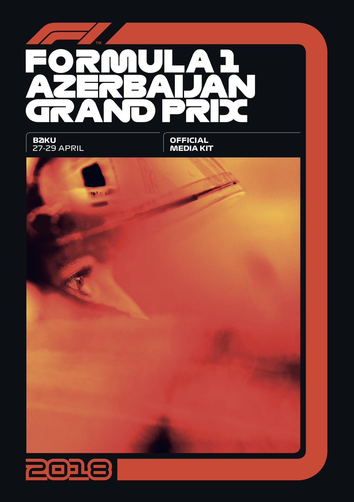

WELCOME BACK TO BAKU

Dear friends,

On behalf of Baku City Circuit, please let me welcome you to the third successive Formula 1 race weekend in Azerbaijan.

Last year’s race in Baku was widely recognised as the most exciting and dramatic race of the year – if not the decade – by members of the media, teams, drivers and the global F1 fanbase alike. It truly was a race that had it all culminating in the most unexpected podium line up in many years.

The fact that this historic race occurred under our new event title as the FORMULA 1 AZERBAIJAN GRAND PRIX filled us with an even greater sense of pride and satisfaction for a job well done.

This year we once again welcome the world to Baku at the slightly earlier date of late April to bear witness to the awe-inspiring sight of F1 cars negotiating one of the fastest and most testing circuits in Formula 1. Baku City Circuit’s winding, narrow sequences, 90-degree turns and high-speed straights - all set against the breath- taking backdrop of Baku’s UNESCO-protected old city, magnificent skylines and beautiful seaside promenade - have proven to be a major challenge to the current F1 grid, resulting in last year’s spectacular outcome and many on-track altercations.

We are very confident of a similar explosion of drama, speed and bravery occurring once again for the 2018 edition.

Furthermore, the off-track entertainment will be bigger and better than ever before with world-class music, visual and conceptual artists once again performing all along the specially constructed Fan Zone all weekend. The highlight will be three consecutive nightly concerts by some of the most successful artists in music: Jamiroquai, Afrojack, Christina Aguilera, Axwell Λ Ingrosso, Dua Lipa & Martin Solveig who will be performing in the new location of Baku’s magnificent Crystal Hall. The FORMULA 1 2018 AZERBAIJAN GRAND PRIX is truly shaping up to be the ultimate weekend of racing action and live entertainment.

Since our first race in 2016, Baku has established itself as an iconic host venue and continues to surprise and inspire all visitors. We encourage you to enjoy the warm Azerbaijani welcome and all the culinary and cultural delights our wonderful city has to offer.

It is our great hope that you will experience an unforgettable Formula 1 weekend with us here in Baku.

Azad Rahimov Chairman, Baku City Circuit Minister of Youth and Sports of the Azerbaijan Republic

3

TABLE OF CONTENTS

PART 1 PAGE FORMULA 1 2018 GRAND PRIX OF AZERBAIJAN GENERAL INFORMATION TIMETABLE 5-6

BAKU CIRCUIT MAP 7 TRAVEL INFORMATION HOW TO GET TO BAKU CITY CIRCUIT 8 8 - 1 68 TRAVEL GUIDE BAKU CITY INFORMATION – HISTORY & GEOGRAPHIC 17 USEFUL INFORMATION 18 RESTAURANT & CAFÉ GUIDE 19-21 CAR RENTAL 22 EMERGENCY & USEFUL NUMBERS 23 BCC ENTERTAINMENT RACE WEEKEND FAN ACTIVITIES 24-25

PART 2 PAGE

RESPONSIBILITIES AND CONTACTS MEDIA SERVICES 26 ACCREDITATION & MEDIA CENTRE OPENING TIMES 27 MEDIA FACILITIES 28

MEDIA TRANSPORT & SHUTTLES 29-32 MEDIA SIGHTSEEING TOUR 33 MEDIA EVENTS 34 PRESS CONFERENCES 35

PART 3 PAGE

2018 FIA F1 WORLD CHAMPIONSHIP 2018 RACE CALENDAR 36 DRIVERS’ ENTRY LIST 37 NEW RULES FOR 2018 38 TECHNICAL REGULATIONS 38 SPORTING REGULATIONS 38-430 POINTS, CLASSIFICATION AND DISTANCE RACE 40 TEAM INFORMATION 41-50

PART 4 PAGE

SUPPORT RACE FORMULA 2 51-55

4

GENERAL INFORMATION

TIMETABLE – FORMULA 1 2018 AZERBAIJAN GRAND PRIX BAKU 27-28-29 APRIL

THURSDAY

| 13:00 | 19:00 | FIA | INITIAL SCRUTINEERING |
| --- | --- | --- | --- |
| 14:00 | 15:30 | PROMOTER ACTIVITY | 3 DAY TICKET HOLDER PIT LANE WALK ONLY |
| 15:00 | 16:00 | FORMULA ONE | PRESS CONFERENCE |
| 16:00 | 18:00 | FORMULA ONE | TRACK CLOSED FIA/F1 SYSTEMS CHECKS – TRACK ACCESS RESTRICTED TO FIA/F1 ONLY |
| 16:45 | 17:00 | FIA | TRACK INSPECTION |
| 17:00 | 17:30 | FIA FORMULA 2 | DRIVERS’ & TEAM MANAGERS’ MEETING |
| 17:00 | 18:00 | FIA | HIGH SPEED TRACK TEST – FIA SAFETY AND MEDICAL CARS |
| 18:05 | 18:30 | FORMULA ONE | F1 EXPERIENCE – PIT LANE WALK |
| 18:05 | 18:35 | FORMULA ONE | HEINEKEN TRUCK TOUR TBC |
| 18:35 | 19:05 | FORMULA ONE | F1 EXPERIENCE – TRUCK TOUR |
| 19:00 | 20:00 | FORMULA ONE | TEAM MANAGERS’ MEETING |

FRIDAY

| 10:20 | 10:30 | FIA | MEDICAL INSPECTION |
| --- | --- | --- | --- |
| 10:30 | 10:45 | FIA | TRACK INSPECTION AND TRACK TEST |
| 11:00 | 11:45¹ | FIA FORMULA 2 | PRACTICE SESSION |
| 11:55 | 12:25 | PADDOCK CLUB | PADDOCK CLUB TRUCK TOUR |
| 11:55 | 12:45 | PADDOCK CLUB | PADDOCK CLUB PIT LANE WALK |
| 12:30 | 12:40 | FIA | TRACK INSPECTION |
| 13:00 | 14:30¹ | FORMULA ONE | FIRST PRACTICE SESSION |
| 15:00 | 15:30 | FIA FORMULA 2 | QUALIFYING SESSION |
| 15:00 | 15:30 | FORMULA ONE | PRESS CONFERENCE |
| 15:40 | 16:45 | PADDOCK CLUB | PADDOCK CLUB PIT LANE WALK |
| 15:40 | 16:10 | PADDOCK CLUB | PADDOCK CLUB TRUCK TOUR |
| 15:45 | 16:15 | FIA FORMULA 2 | PRESS CONFERENCE |
| 16:30 | 16:40 | FIA | TRACK INSPECTION |
| 17:00 | 18:30¹ | FORMULA ONE | SECOND PRACTICE SESSION |
| 18:45 | 19:30 | PADDOCK CLUB | PADDOCK CLUB TRUCK TOUR |
| 18:45 | 19:30 | PROMOTER ACTIVITY | MARSHAL/VOLUNTEER PIT LANE WALK |
| 20:00 | 21:00 | FORMULA ONE | DRIVERS’ MEETING |

* These times refer to the start of the formation lap ¹ Fixed End Session ² Approximate Finishing time

PLEASE NOTE THAT THIS TIMETABLE IS SUBJECT TO AMENDMENTS

5

SATURDAY

| 06:00 | 08:00 | PROMOTER ACTIVITY | GENERAL REHEARSAL |
| --- | --- | --- | --- |
| 10:00 | 10:20 | FIA FORMULA 2 | DRIVERS’ TRACK PARADE |
| 10:05 | 10:35 | PADDOCK CLUB | PADDOCK CLUB TRUCK TOUR |
| 10:40 | 10:50 | FIA | MEDICAL INSPECTION |
| 11:00 | 11:15 | FIA | TRACK INSPECTION AND SAFETY CAR TEST |
| 11:00 | 11:30 | FORMULA ONE | TEAM PIT STOP PRACTICE |
| 11:45 | 11:50 | FIA FORMULA 2 | PIT LANE OPEN |
| 12:00* | 13:05² | FIA FORMULA 2 | FIRST RACE (29 LAPS OR 60 MINS) |
| 13:20 | 13:50 | FIA FORMULA 2 | PRESS CONFERENCE |
| 13:30 | 13:40 | FIA | TRACK INSPECTION |
| 14:00 | 15:00¹ | FORMULA ONE | THIRD PRACTICE SESSION |
| 15:05 | 16:40 | PADDOCK CLUB | PADDOCK CLUB PIT LANE WALK |
| 15:50 | 16:20 | PADDOCK CLUB | PADDOCK CLUB TRUCK TOUR |
| 16:30 | 16:40 | FIA | TRACK INSPECTION |
| 17:00 | 18:00 | FORMULA ONE | QUALIFYING SESSION |
| 18:30 | 19:00 | PADDOCK CLUB | PADDOCK CLUB TRUCK TOUR |

SUNDAY

| 11:35 | 12:35 | PADDOCK CLUB | PADDOCK CLUB PIT LANE WALK |
| --- | --- | --- | --- |
| 11:35 | 12:05 | PADDOCK CLUB | PADDOCK CLUB TRUCK TOUR |
| 12:10 | 12:20 | FIA | MEDICAL INSPECTION |
| 12:20 | 12:35 | FIA | TRACK INSPECTION AND TRACK TEST |
| 12:55 | 13:00 | FIA FORMULA 2 | PIT LANE OPEN |
| 13:10* | 14:00² | FIA FORMULA 2 | SECOND RACE (21 LAPS OR 45 MINS) |
| 14:10 | 15:10 | PADDOCK CLUB | PADDOCK CLUB PIT LANE WALK |
| 14:15 | 14:45 | FIA FORMULA 2 | PRESS CONFERENCE |
| 14:30 | 15:00 | PADDOCK CLUB | PADDOCK CLUB TRUCK TOUR |
| 14:40 | 15:10 | FORMULA ONE | DRIVERS’ TRACK PARADE |
| 15:10 | 15:20 | FIA | MEDICAL INSPECTION |
| 15:20 | 15:30 | FIA | TRACK INSPECTION |
| 15:40 | 15:50 | FORMULA ONE | PIT LANE OPEN |
| 15:56 | 15:58 | FORMULA ONE | NATIONAL ANTHEM |
| 16:10* | 18:10² | FORMULA ONE | GRAND PRIX (51 LAPS OR 120 MINS) |

* These times refer to the start of the formation lap ¹ Fixed End Session ² Approximate Finishing time

PLEASE NOTE THAT THIS TIMETABLE IS SUBJECT TO AMENDMENT

6

GENERAL INFORMATION

BAKU CITY CIRCUIT MAP

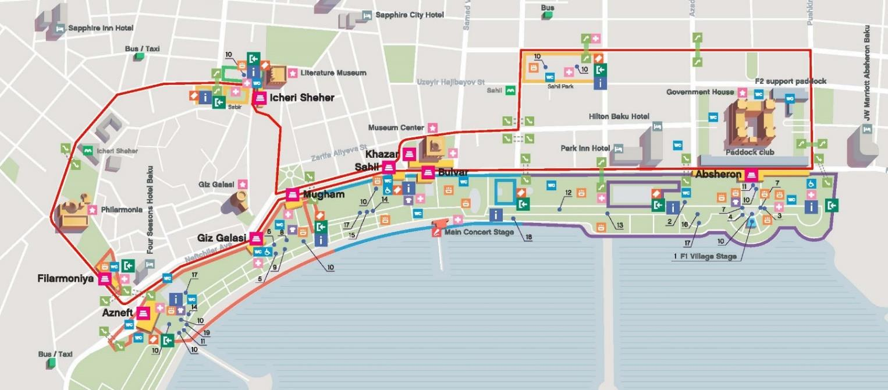

CIRCUIT STATISTICS

Track Length: 6.003km Laps: 51 Turns: 20 Official Top Speed in 2016: 366km/h Pit Lane Length: 295m Fastest pit stop: 1.92 seconds Average Speed: 211km/h Pit Lane Speed: 80km/h Fastest Corner: Turn 16 (Four Seasons Hotel) 170km/h Slowest Corner: Turn 8 (Entry point to the narrow section of the track) 86km/h

7

TRAVEL INFORMATION

HOW TO GET TO BAKU CITY CIRCUIT

Situated on the western edge of the Caspian Sea, Azerbaijan’s capital enjoys an original and unique appearance that seamlessly blends the ancient with the modern; factors which have contributed to some nicknaming the city ‘the Paris of the East’.

The specially constructed Baku City Circuit will see Formula 1 cars race around the picturesque streets of downtown Baku on the weekend of 27th-29th April. Fast, challenging, beautiful – these three words symbolize Baku City Circuit.

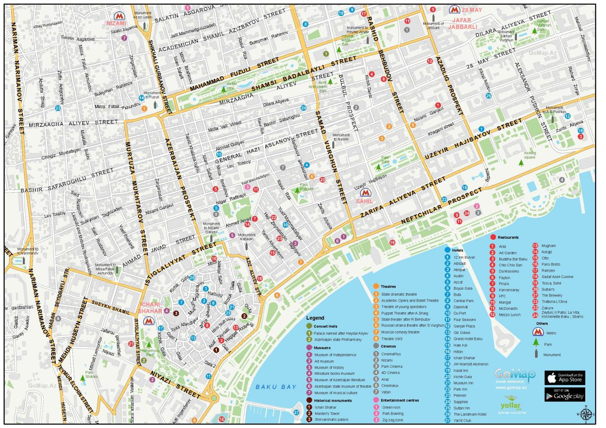

8

TRAVEL INFORMATION

HOW TO GET TO BAKU CITY CIRCUIT

Public Transport Information

Since there is NO parking reserved for spectators, Public Transport is the easiest way to get to and from the Race Track.

Airport

There are buses and taxis connecting the airport and the city.

Distance from the Airport to the Race Track - 23.7 km

There is a shuttle bus line operating 24/7 by route Airport – City Centre – Airport, please refer to http://www.aeroexpress.az/ website for more details.

The below Bus routes will be operational based on a 22-hour service through the period 27th – 29th April, from 06:00 AM till 04:00 AM.

Bus route #65

Operator: BNA Operator’s website: http://bna.az/en Nearest Stop at the Venue: Azerbaijan Avenue (near MUM Store) Stops by route: Fuzuli Square, M.Mukhtarov Street, Nizami Street and S. Rustamov Street Route: A. Javad Street → Azerbaijan Avenue → Fuzuli Square → Z. Ahmadbayov Street → Tbilisi Avenue → 20 January Street → A. Maharramov Street → Mir Jalal Street. Route frequency: 5 minutes

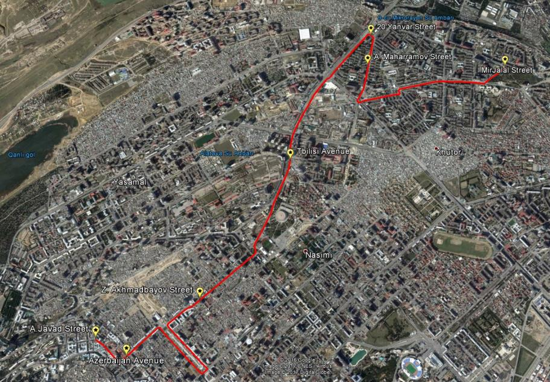

9

HOW TO GET TO BAKU CITY CIRCUIT

Bus route 5

Operator: BakuBus Operator’s website: https://www.bakubus.az/en Nearest Stop at the Venue: Rashid Behbudov Street (close to Rashid Behbudov Theatre) Stops by route: Narimanov Metro Station, 28 May Metro Station at Salatin Asgarova Street, 28 May Metro Station at Jafar Jabbarli Street, 28 May Street at Samed Vurgun Park, Nizami Street and Rashid Behbudov Street (close to Rashid Behbudov Theatre) Route: Narimanov Metro Station → 28 May Metro Station at Salatin Asgarova Street → 28 May Metro Station at Jafar Jabbarli Street → 28 May Street at Samed Vurgun Park → Nizami Street and Rashid Behbudov Street (close to Rashid Behbudov Theatre) Route frequency: 3 minutes

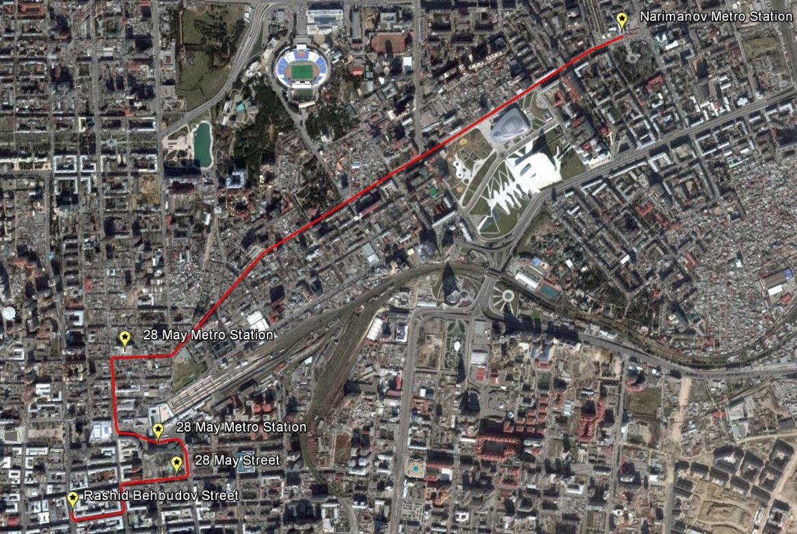

10

HOW TO GET TO BAKU CITY CIRCUIT

Bus route 53

Operator: BNA Operator’s website: http://bna.az/en Nearest Stop at the Venue: Baku Sports Hall Stops by route: 20th Zone Roundabout, Aquatic Centre, National Flag Square and Baku Sports Hall Route: 20th Zone Roundabout → Bibiheybat Road (city direction) → Neftchilar Avenue (E119 city direction) → Baku Sports Hall → turning maneuver at Funicular. Route frequency: 6 minutes

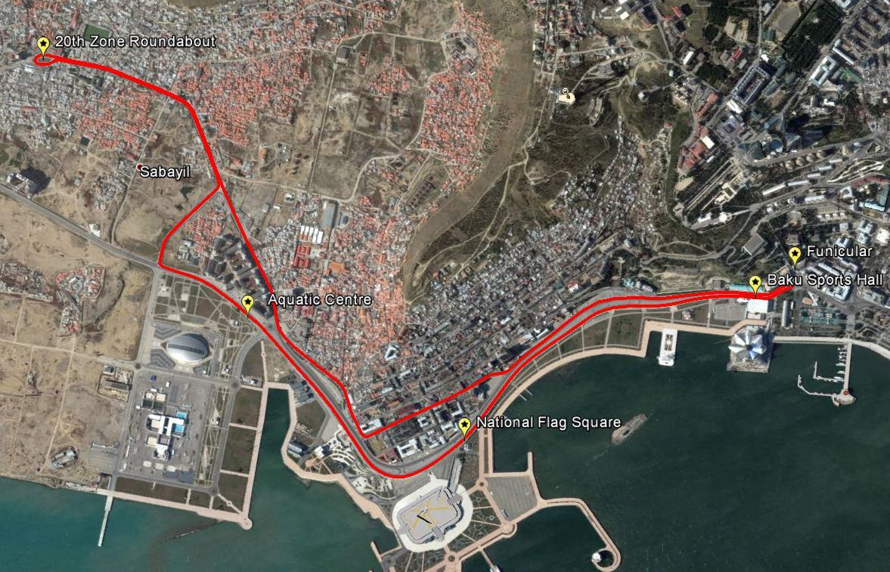

11

HOW TO GET TO BAKU CITY CIRCUIT

Metro Service

The efficient Metro system provides an easy way for getting around the city centre. The closest metro stations to the Race Track are as follows:

 Icheri Sheher metro station - in the immediate vicinity to the Race Track  28 May metro station - 0.7 km to the Race Track  During the Race days 27, 28, 29 April, Icheri Sheher and 28 May metro stations will be operational for Entry & Exit until 02:00a.m., and the remaining ones until 24:00 just for Exit only.

Please Note: Sahil metro station will not function during the race time due to repair works.

Please refer to http://www.metro.gov.az/en/ website for more details.

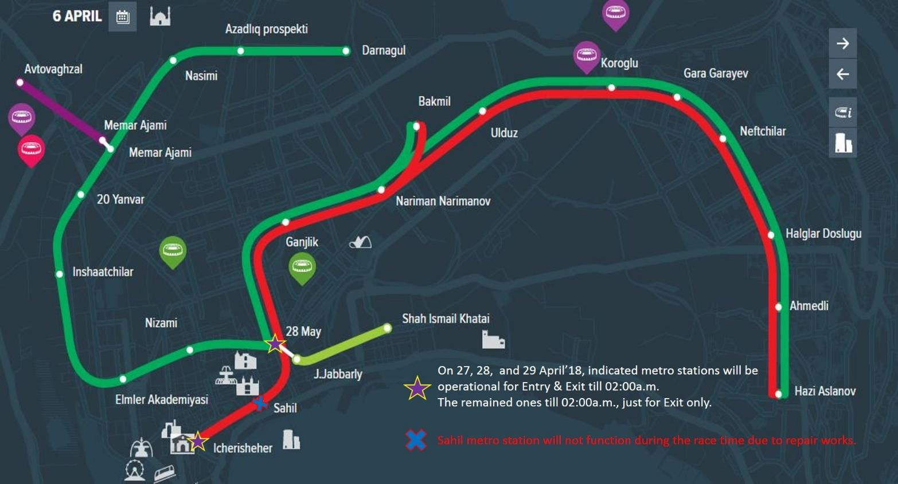

12

HOW TO GET TO BAKU CITY CIRCUIT

Taxi Service

 There is no shortage of available taxis in Baku. Please note, however, that during the race weekend, taxis can take you to the passenger drop-off point close to the race track but NOT to the actual venue entrance gates. As such, please remember to allow for plenty of time to reach your destination.

 Please refer to https://www.bakutaxi.info/taxi for the full list of all taxi companies operating in Baku.

 Inform yourself of the cost of your trip in advance using the above link so that you can compare rates from different firms and choose the most favourable option for you. Should a driver attempt to overcharge, do not hesitate to register a complaint with the relevant taxi company. Taxi fares in Baku are usually very affordable.

 Should you lose or forget anything in your taxi, please refer back to the taxi company to see if the lost item can be retrieved from their Lost & Found

 There are several ways to order a taxi including calling the dispatch service number (use above link for details), ordering online via the relevant website or using your smartphone app. Taxi fares vary depending on the class of the car and length of journey.

 For the convenience of customers, taxi companies offer many different payment options:

 Cash  Visa and MasterCard paid online in advance  Via smartphone application

If you want to pay the driver by credit card this needs to be made clear in advance as not all taxis provide such a service.

13

HOW TO GET TO BAKU CITY CIRCUIT

Road Closures, Traffic and Parking Control

The Road Closures, Traffic and Parking Control Plan will be partially implemented from Saturday 21st April onwards with full traffic closure around the circuit commencing from Monday 23rd April at 01:00.

The Road Closures, Traffic and Parking Control Plan will be deactivated on Tuesday, 1st May at 06:00.

There will be NO restrictions for local residents during the race week with regards to movements on foot with the exception of gaining entrance to the Venue itself.

There are no dedicated parking areas close to the Venue, Spectators are recommended to use Public Transport to reach the Venue. Please see the below maps for: (Closed Road, BCC Track, Public traffic directions during event)

Map – Road Closures, Traffic and Parking Control – Generic view

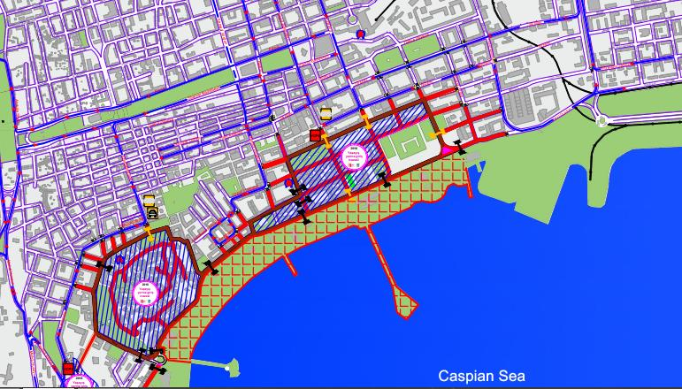

14

HOW TO GET TO BAKU CITY CIRCUIT

Map – Road Closures, Traffic and Parking Control – Zone 1 and Zone 2

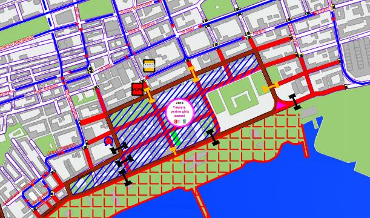

15

HOW TO GET TO BAKU CITY CIRCUIT

Map – Road Closures, Traffic and Parking Control – Zone 3 and Zone 4

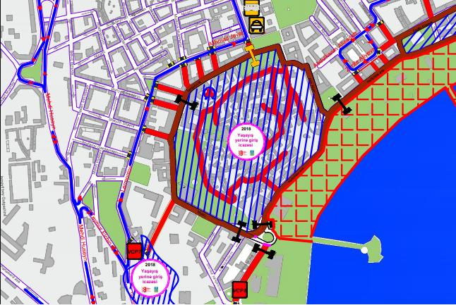

16

TRAVEL GUIDE

BAKU CITY INFORMATION – HISTORY AND GEOGRAPHY

Baku is the capital and largest city of Azerbaijan. It is located on the southern shore of the Absheron Peninsula, which projects into the Caspian Sea. At 28 metres below sea level, Baku is the lowest lying national capital in the world and is home to approximately 3 million people. It is twinned with the European cities of Naples in Italy, Sarajevo in Bosnia and Izmir in Turkey.

The capital city lies on the eastern side of Azerbaijan and is surrounded by the Caspian Sea - the world’s largest lake. Baku is famous for the unique Neft Dashlari (Oil Rocks), in the middle of the Caspian Sea, which is the largest inhabited and oldest offshore oil city in the world.

Baku offers visitors the opportunity to enjoy all the attractions that a modern European city has to offer while also embracing traditions and culture that date back to medieval times. Located at the crossroads of Europe and Asia, the city is one of the world’s best-kept secrets, hosting world-class sporting and cultural events and modern and ancient attractions, presenting visitors with unlimited things to discover and enjoy.

Perhaps one of the most unique features of Baku is that it is the first European city which the sun rises in. The picturesque city is built on a high hill and forms an amphitheater that slopes down to Baku Bay. It is often compared to San Francisco or Naples in Italy, with whom it is twinned.

Baku’s reputation as the ‘City of Contrasts’ is well earned with the city having perfectly combined the beauty and intrigue of its ancient past with its ambition to establish itself as a modern European city featuring award winning architecture, business centres and skyscrapers.

The city consists of two principal parts: the contemporary downtown area and the old Inner City (Icheri Sheher). The Old City of Baku along with the Palace of the Shirvanshahs and Maiden Tower were confirmed as UNESCO World Heritage Sites in 2000. Baku has existed for thousands of years and is firmly established as the pearl of Azerbaijani architecture and culture. Within its old town walls visitors can travel back in time as they explore a maze of narrow cobbled streets, ancient buildings and courtyards surrounding the 12th century Maiden Tower and the ornate Palace of the Shirvanshahs.

The modern face of Baku is equally impressive. New developments have redefined the hills that line the picturesque Bay of Baku and even the coastline itself. The iconic Heydar Aliyev Centre, designed by well-known architect Zaha Hadid, provides a stunning setting for music performances of world stars, museum exhibits and modern art collections. Visits to the National Art Museum and Museum of Modern Art are also highly recommended.

Baku’s Flame Towers are the tallest skyscrapers in the city at 190 meters, the flame shaped design symbolizing the essence of Baku. These spectacular buildings, which have become a symbol of the city’s new modern outlook, comprise apartments, a hotel and offices. The Flame Towers take on another dimension each evening when thousands of LED lights illuminate the façade of the three towers to display the movement of a fire visible from the farthest points of the city.

The giant national flag, standing at 162 meters, was once named in the Guinness World Record Book as the tallest unsupported flagpole. It stands just next to the Crystal Hall that was built specifically for the 2012 Eurovision Song Contest and which has played host to performances from international superstars, including Jennifer Lopez, Rihanna and Shakira.

17

USEFUL INFORMATION

Banks and credit cards There are a multitude of ATM machines located around Baku, most of which accept international debit and credit cards. Larger bank branches are open Mondays to Fridays (shorter day) but are closed on Saturdays and Sundays. International credit and debit cards are accepted in most restaurants and larger shops.

Currency The national currency is the Azerbaijani Manat (AZN). One hundred Gepik (coins) equals one Manat, and Manat notes come in 1, 5, 10, 20, 50 and 100 denominations. It is not possible to exchange currency into Manat in countries other than Azerbaijan, so visitors will need to use the foreign exchange desk at the arrivals hall at the airport or withdraw from ATMs around the city.

Electricity Standard electrical power in Azerbaijan is 220v. Electrical equipment and appliances use the standard European 220- 240v two-pin plug.

Gratuities and tipping Tipping is not expected across Azerbaijan but is common in Baku. Occasionally a service charge is included on the bill, particularly in more established hotels and restaurants. Like any other place in the world, tipping for above-average service will be appreciated.

Language The official language is Azerbaijani but many people also speak Russian, Turkish and English.

General Opening Hours Office hours are officially 09:00 to 18:00 Mondays through Fridays. Banks operate from 09:00 to 18:00, while service hours are from 09:30 to 17:00. Shops generally open around 09:30 or 10:00 and close around 20:00. Shops are open seven days a week. Bars and restaurants are open until at least 23:00.

Smoking Smoking is permitted in public areas across Azerbaijan, including most restaurants and bars. Smoking will not be permitted in any Baku City Circuit venue, except for designated smoking areas.

Taxes (VAT) VAT in Azerbaijan is similar to that in most European VAT systems, with tax levied on the supply of most goods and services and on the import of goods. VAT payers are entitled to recover the amount of VAT paid on purchases (input VAT) that exceeds the VAT received from their taxable supplies (output VAT).

Telephones The country code for Azerbaijan is 994 and the city code for Baku is 012. The international exit code for calling out of Azerbaijan is 00 and must be dialed before the relevant country code and telephone number. Azerbaijani mobile phone numbers have 10 digits and most mobile numbers start with 050 or 051. All 10 digits must be dialed for calls within Azerbaijan. For example: 050-123-XXXX. When calling from outside Azerbaijan, the country code then number minus the zero should be dialed. For example: +994-50-123-XXXX.

Time Zone Azerbaijan is UTC+4 hours.

18

RESTAURANTS & CAFÉS

FINE DINING

CHINAR PARIS BISTRO Bar-Lounge-Dining ¼ Za. Aliyevs str. Puppet thatre 1, S Alakbarova str +(994 12) 404 82 15 +(994 12) 404 82 11 reservations@parisbistro.az Reservations Centre *6363 reservations@chinar- dining.az

BUDDHA-BAR ART GARDEN Bar-Lounge-Restaurant 99,Neftchilar ave 22, A. Zeynally Str, Icheriseher +(994 12) 404 82 09 +(994 12) 492 13 31 reservations@buddhabar-baku.az Hrs: 10:00-02:00 reservations@parisbistro.az

EL PORTALON HOUSE OF SULTANS Spanish restaurant International & Azeri Cuisine (in front of the bay of Baku) 20, Boyuk Gala Str. Icherisheher +(994 12) 404 82 17 +(994 12) 437 23 06 reservations@elportalon.az

EVDE Bar-Grill S.Vurghun str. +(994 12) 404 82 13 reservations@evde-dining.az

19

RESTAURANTS & CAFÉS

MID RANGE

BAKU CAFÉ KARVANSARAY Art-Culture-Food 11,Boyuk gala str. 153, Neftchilar ave +(994 12) 492 66 68 +(994 12) 404 82 09 bakucafe@portbaku-dining.az

SAHIL CHANAGGALA Lounge-Dining 35 Tabriz str. 34, Neftchilar ave, seaside Boulevard +(994 12) 496 25 86 +(994 12) 404 82 12 +(994 12) 723 00 00 reservations@sahil-dining.az

MUGAM CLUB PIROSMANI European and Azeri Cuisine 9, A Rzayeva str. The Art of Georgian Cuisine +(994 12) 492 40 85 103, Khagani str. +(994 12) 598 07 04 +(994 12) 787 79 82

DALIDA ZEYTUN 42, Nizami str. Nargiz Mall Floor 3 Neftchilar ave, ‘Park Bulvar’ Seaside Boulevard +(994 12) 496 88 04 +(994 12) 492 40 85

MANQAL 126, Kilchik Gala str. Salyan highway, Shikhov beach Ramada Baku Hotel +(994 55) 920 10 15 +(994 55) 455 14 67 info@manqalbuku.com

20

RESTAURANTS & CAFÉS

BUDGET

FIRUZA CAFÉ CITY 14, Tarlan Aliyarbayov str 8, Rashid Behbudov str. Fountains Square Ramada Baku Hotel +(994 12) 493 96 34 +(994 12) 598 86 86

FISINCAN PIZZA HUT 1, Mirza Ibrahimov str 8, Rashid Behbudov str +(994 12) 594 99 90 +(994 12) 493 01 35

SHOPPING

SHOPPING MALLS

GANJLIK MALL PARK BULVAR Fatali Khan Khoyski ave. Neftchilar ave +(994 12) 404 82 42 +(994 12) 598 80 80 +(994 12) 493 35 87

28 MALL METRO PARK 95, Fuzuli str. 106A Tabriz str. +(994 12) 404 82 20 +(994 12) 566 96 83 +(994 12) 566 96 84

PORT BAKU MALL 151, Neftchilar ave +(994 12) 599 00 97 +(994 12) 599 00 98

21

CAR RENTAL

ALFA INTERNATIONAL TRANSPORT BAKU RENT SERVICE 96, Nizami str, Landmark II, Floor 2 7A, Izmar Str +(994 70) 278 32 00 +(994 50/55/70/77) 399 22 66

ATILLA TRANS & SERVICES FOUR DRIVE RENT A CAR 4, A Maharramov str 43, R.Behbudov str. +(994 12) 555 20 98 +(994 55) 210 66 54

AVIS RENT A CAR LIMUSINSERVIS 50, I.Gutgashenli str 122, Nizami str. +(994502) 223 02 48 +(994 12) 493 86 05

ANSAR AZRENTTRANS 12 I.Gutgashenli str. 24, Nakhchivani str. +(994 12) 511 78 38 +(994 55) 283 22 66 www.ansarltd.az

ATL TENT A CAR CARENT 34, Tbilisi ave 28/84 A.Neymathulla str. +(994 12) 404 31 86 +(994 55) 202 31 32 +(994 55) 555 25 27

AVTOTURIZM KRAL RENT A CAR 28, A.Jamil str 61, A. Alizadeh str. +(994 12) 408 58 80 +(994 12) 489 97 90

NASCAR 44, J.Jabbarly Str. +(994 12) 408 27 65

22

EMERGENCY AND USEFUL NUMBERS

GENERAL

101 Fire Brigade +(994 12) 590 91 19 Lost Property Office

102 Police +(994 12) 497 27 27 Airport Directory

103 Ambulance +(994 12) 493 93 66 Railway Station Directory

106 Exact time +(994 12) 493 08 68 Sea Port Directory

112 Ministry of Emergency Services www.baku.azerbaijan.travel Baku Tourism Info

113 Ambulance Traffic Accidents

919 State Migration Service

URGENT ON SITE ASSISTANCE +(994 50) 254 77 29 Venue +(994 50) 254 77 02 Paddock +(994 12) 497 09 11 Medi Club/ Nearest Hospital

23

BAKU CITY CIRCUIT

RACE WEEKEND FAN ACTIVITIES

After two successful races since its debut in 2016, the Formula 1 Azerbaijan Grand Prix returns to Baku in 2018 with an even more amazing racing and entertainment programme on offer than ever to help get Formula 1 fans into the outdoor festival spirit!

Baku City Circuit is home to the most beautiful vending area in Formula 1, situated as it is along the shores of the Caspian Sea boulevard in downtown Baku and is made up of six differently themed Zones adjacent to the main grandstands where fans can enjoy a variety of amazing entertainment activities and live performances by visual artists, musicians and much more.

The most amazing and unforgettable part of the off-track entertainment offering at the Formula 1 race weekend will be the three nightly concerts by Jamiroquai, Christina Aguilera and Dua Lipa on Friday, Saturday and Sunday respectively.

Vending Zones Entertainment

F1 Fan Zone / Purple Zone - this is the largest and most active Zone with a huge range of entertainment on offer for F1 fans of all ages. Photo Booths & Art Walls are on site to let you take home a special memory and leave an imprint of your stay in Baku while you can also challenge yourself in the exciting F1 Pit Stop Challenge and E-Sports Game Zone. You will also have plenty of time and opportunity to rest and recharge in our special Chill Out points in between enjoying the more physical activities. The Replica Podium will allow you to feel what it is like to win a Grand Prix and take home a special photo memento from the top step. To feel the true spirit of Azerbaijani culture, tradition and hospitality you must also visit the Azerbaijan Cultural Lounge. The most fabulous and memorable part for F1 fans are the Autograph Sessions which give you the chance to meet your F1 heroes face to face, get their autograph and take a picture with them.

Zone 2 / Blue Zone is dedicated to providing fans with an exciting, memorable and premium event experience. You can relax in the very comfortable chill-out zone, enjoy amazing roaming entertainers’ and dancers’ performances, spend a fantastic and unforgettable time participating in exciting outdoor activities including soaring up to 25 feet above the ground on the Bungee trampoline.

Zone 3 / Red Zone is the place where most entertainment options are located. The most amazing part of this zone is that there are a lot of entertainments for different age categories. One of these activities - the Children’s Driving School – helps kids to learn more about what makes motorsports and F1 in particular so special and fosters a love for the sport that will hopefully last forever. While the children are having fun, their mothers can pamper themselves at the Beauty Pit stop. You can also nurture your extreme sports needs by tackling the Climbing Wall or showing off your flexibility on the giant Trampoline. The mingling nature of this zone also allows for plenty of opportunities to get more acquainted with lots of people from all over the world. In addition, this Zone also has the popular Chill Out areas, Azerbaijani Cultural Lounge, live music performances and the beloved Art Wall and Replica podium for fans to enjoy.

Zone 4 / Green Zone – this is where modern and ancient styles meet. Whilst being located right in the middle the historical and ancient buildings of Baku, you can still relax to the sounds of live performances of classic and modern music performed by local DJ’s and musicians in this unique zone. Henna Art stalls are also on site here.

24

RACE WEEKEND FAN ACTIVITIES

Baku Crystal Hall / Yellow Zone with its distinct character and astonishing acoustic systems, Baku’s Crystal Hall is the perfect venue for this year’s Formula 1 post-race concerts. This incredible venue is dedicated to delivering a high- class concert experience for fans at the 2018 Formula 1 Azerbaijan Grand Prix. By hosting three major concerts by global superstars - Jamiroquai, Christina Aguilera and Dua Lipa - on Friday, Saturday and Sunday respectively –followed by world-famous DJ’s Afrojack, Axwell & Ingrosso and Martin Solveig, the Crystal Hall will be the perfect venue to keep the party going through each night.

Light Show - this will take place prior to every nightly concert. This incredible act helps to create the perfect atmosphere of magic, light, dance and music that will get fans into the mood ahead of the night’s live music offering.

Driver Autograph Sessions: Get close to the F1 heroes at the 2018 Formula 1 Azerbaijan Grand Prix weekend during the hugely popular Driver Autograph Sessions. Fans can get an autograph, take a selfie and shake the hand of their favorite driver throughout the weekend. The signing sessions will take place on the main F1 stage on Friday, Saturday and Sunday.

Q&A Sessions We want to bring Baku City Circuit guests a powerful and informative learning experience through a series of engaging live Q&A sessions with key personnel in the world of F1. These sessions are often the only time during the weekend dedicated to audience interaction with motorsport stars and F1 figures on the main Stage.

Drivers’ Parade The Drivers’ Parade is a lap around the Baku City Circuit taken by all the F1 drivers - usually on a single vehicle - where they can greet all the F1 fans that have come to cheer them on before the race starts. The Driver’s Parade will take place on 29th April, approximately an hour before the race starts and is certainly an experience not to be missed.

National Anthem The National Anthem Ceremony is always a proud moment for everyone associated with the Formula 1 Azerbaijan Grand Prix as it pays tribute to Azerbaijan, as well all the countries involved in this special occasion. Political and F1 dignitaries, as well as all the drivers, will line up before the start of the race on April 29th as the Azerbaijani national anthem is played in full as a mark of respect to the country hosting this major event.

Podium Ceremony (Track Invasion) The Podium Ceremony takes place after the race is finished on Sunday when the top three drivers celebrate their success in front of their adoring fans. Ahead of the ceremony, the track gates in F1 Fan Zone will open for fans to come closer to the podium and ‘invade’ the track to cheer on the winning driver(s)!

25

MEDIA SERVICES

RESPONSIBILITIES

RACE TRACK

Operating Company Baku City Circuit 93 Zarifa Aliyeva Street Baku, Azerbaijan, AZ1000 +99412 404 13 90 info@bakugp.az bakucitycircuit.com

FIA

FIA F1 Race Director, Starter and Safety Charlie Whiting Delegate

FIA F1 Medical Delegate Dr. Alain Chantegret

FIA F1 Deputy Medical Delegate Dr. Ian Roberts

FIA F1 Technical Delegate Jo Bauer

F1 Head of Communications & Media Delegate Matteo Bonciani

FIA F1 Deputy Media Delegate Pierre Guyonnet-Duperat

FIA F1 Safety Car Driver Bernd Mayländer

FIA F1 Medical Car Driver Alan van der Merwe

Stewards Garry Connelly, Denis Dean, Tom Kristensen

MEDIA CENTRE

National Press Officer Nigar Arpadarai, n.arpadarai@bakugp.az

Media Relations and Communications Ayan Aghayeva, a.aghayeva@bakugp.az

National Media Accreditation Nuray Hajiyeva, n.hajiyeva@bakugp.az

FIA F1 Head of Communications & Matteo Bonciani, mbonciani@fia.com Media Delegate

FIA F1 Deputy Media Delegate Pierre Guyonnet-Duperat, pguyonet@fia.com

26

ACCREDITATION AND MEDIA CENTRE

ACCREDITATION

The MAC will be located at the following address:

Port Baku Mall, Address 151 Neftchilar Ave, Baku AZ1010, Azerbaijan Phone: +994 51 250 25 94

| Media Accreditation Centre Operational Period | Hours of Operation |
| --- | --- |
| Wednesday, 25 – Apr-18 | 10:00-19:00 |
| Thursday,26- Apr -18 | 10:00-19:00 |
| Friday, 27- Apr -18 | 10:00-19:00 |
| Saturday, 28- Apr -18 | 10:00-15:00 |
| Sunday, 29- Apr -18 | 10:00-15:00 |

MEDIA CENTRE

The Media Centre is located on the second floor of the Hilton Hotel, Baku, offering views of the Formula 1 Paddock and Baku City Circuit.

| Media Centre Operational Period | Hours of Operation |
| --- | --- |
| Wednesday, 25 - Apr -18 | 11:00-23:00 |
| Thursday,26 - Apr -18 | 09:00-23:00 |
| Friday, 27- Apr -18 | 09:00-23:00 |
| Saturday, 28 - Apr -18 | 09:00-00:00 |
| Sunday, 29 - Apr -18 | 08:00- (until the last journalist leaves) |

27

FACILITIES

Facilities Press Room

• 442 Seats for media & photographers • 112 TV/Timing monitors • P.A speakers / data / WiFi

Locker Room

• 540 lockers (460 regular; 80 large lockers)

(Please obtain a key from one of the Media Centre staff at the reception desk. A small deposit per key is applicable.)

• Telecom Centre

- 2 Printer / photocopier / scanner - 12 Seats - 6 telephones & 6 public PC - Telefax services are available - upon Request TV/Radio

32 boxes are available to television and radio commentators 29 singles; 1 double; 1 speaker booth

28

MEDIA SERVICES

MEDIA TRANSPORT & SHUTTLES

There are four shuttle services organised for media, providing transportation from Heydar Aliyev International Airport to designated media hotels as well as from designated media hotels to the Media Centre and Media Accreditation Centre.

The media Car Park is located right next to the Media Accreditation Center, in front of the Port Baku Mall main entrance.

Photographers’ shuttles will be running around the circuit to deliver them to designated corners. In addition to shuttles, golf cart services operating within the Vending Zones (Baku Boulevard) will be available during each session.

From Airport – Hotel Media designated Neoplan busses will depart from Heydar Aliyev International Airport (GYD), located 20 km northeast of Baku, based on demand. These shuttles will travel to the Central Park and Azcot Hotel media hotels. Upon arrival at the airport, BCC‘s Arrivals and Departures Team will provide guidance to media shuttles. Media shuttles are recognisable by the ‘Media’ sign on the windshield.

For anyone not staying in the Central Park or Azcot Hotel, you can still avail of transportation to Baku City Circuit from these locations. Out of the two drop-off locations, the best one to reach central Baku from is the Grand Hotel from where you can easily reach your required destination.

Public transport services from/to GYD are also available, via Baku Bus services departing every 30 minutes into the city center. Public bus transportation is priced at 1.7 Manat (1 USD).

The cost of a Taxi cost from GYD to downtown Baku is approximately 25 Manat.

Uber also operates in Baku.

Hotels - Media Centre/MAC – Hotels

The shuttle service from media hotels to MAC/MC drop off zone will be provided according to MAC and MC operating hours’ schedules. If media are not staying in the Central Park or Stay Bridge Hotels, media can still avail of transportation to Baku City Circuit from these locations.

| Media Hotel Service to Media |  | Approximate | Frequency |
| --- | --- | --- | --- |
| Centre & Media Accreditation |  | Travel time |  |
| Centre Operating Times |  |  |  |
| 25.04 | 11:00 – 19:30 | 15 min | 60 min |
| 26.04 | 08:30 – 23:30 |  | 60 min |
| 27.04 | 08:30 – 23:30 |  | 08:30 – 12:30 – 30 min 12:30 – 23:30 – 60 min |
| 28.04 | 08:30 – 00:30 |  | 08:30 – 12:30 – 30 min 12:30 – 00:30 – 60 min |
| 29.04 | 08:30 – 02:30 |  | 08:30 – 10:30 – 30 min 10:30 – 02:30 – 60 min |

29

MEDIA TRANSPORT & SHUTTLES

From Media Car Park – Media Centre/MAC: Since the location of the Media Car Park is very close to the Media Accreditation Center, no shuttle service operating between media car park and media accreditation center will be provided.

Photographers’ shuttles before and after each session will link the important corners around the circuit. Operating Hours: Please refer to the schedule on the Media Centre’s official notice board for photographers’ shuttles. Furthermore, the golf cart service operating within the Vending Area will be available during each of the sessions. Please refer to the map provided in the media kit for golf carts pick up/drop off points.

Taxis to Media Centre: There is no shortage of taxis across Baku. However, as can be expected during a street race there will be traffic restrictions throughout parts of the city within the circuit’s perimeters. For media taking taxis to the Media Centre (located in the Hilton Hotel), you are advised to ask the taxi driver to take you as close as possible to the JW Marriott Hotel by Turn 1 (see map below) and then walk over the footbridge into the Paddock.

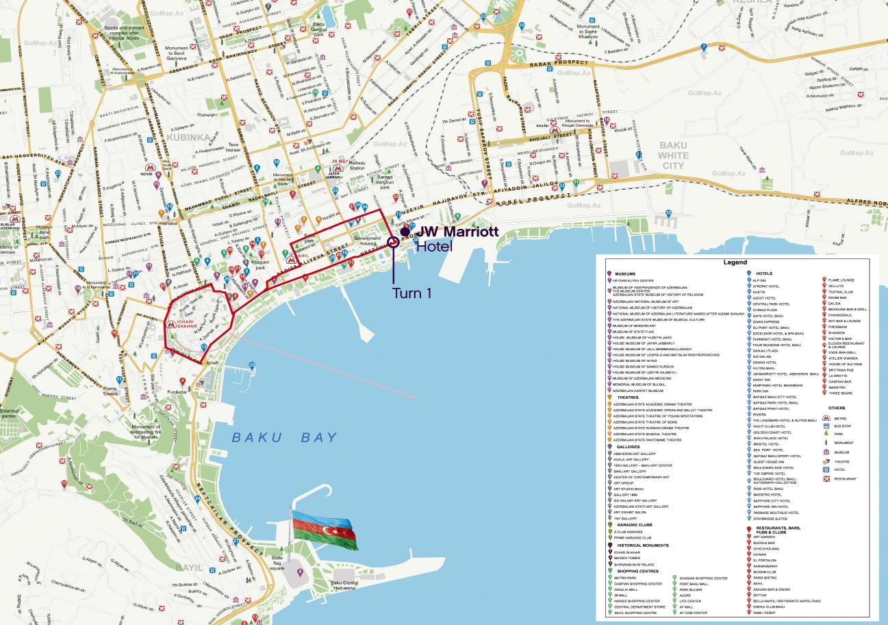

30

MEDIA TRANSPORT & SHUTTLES

F1 Concerts Info

Million-selling global artists Jamiroquai, Christina Aguilera and Dua Lipa will be performing on Friday 27th, Saturday 28th and Sunday 29th April respectively in Baku’s stunning Crystal Hall – adjacent to Flag Square - after the on-track action has ended. In addition, each of these major acts will be followed by three incredible after-parties with superstar DJ’s Afrojack (Friday) and Martin Solveig (Sunday) hitting the decks once the main concerts have finished.

The approximate start time for the warm up acts to come on stage is scheduled for 20.00, with the main artists coming on at 21.00 and finishing around 23.00. From 23:00 until 03:00 the aforementioned superstar DJ’s and local DJ’s will keep the party going long into the night.

All accredited media are guaranteed access to the concerts and after party DJ sets. Please ensure you keep your accreditation passes and wristbands (handed out on-site) on you at all times.

How to Get to the Baku Crystal Hall

On Foot: The walking distance from the furthest edge of the F1 Vending Area located along the Boulevard to the Crystal Hall is approximately 5km.

By Bus: Regular shuttle buses will also be made available each day after the on-track action has finished to bring you to the Crystal Hall. Shuttle busses will depart from the loading zone located at Turn 18. Moreover, an internal bus service will go around the racetrack in order to take spectators from selected pick up points to Turn 18. The closest pick up point for media for this internal transfer service is located at Turn 1.

Transfers from BCC to Crystal Hall: Friday: 20:00 – 21:00 Saturday: 19:30 – 21:00 Sunday: 18:30 – 21:00

Transfers from Crystal Hall to BCC: Friday: 23:00 – 04:00 Saturday: 23:00 – 04:00 Sunday: 23:00 – 04:00

The updated guide & map with the routes to and from the Crystal Hall together with the location of the shuttle pick-up and drop-off points can be found at www.bakucitycircuit.com.

31

MEDIA TRANSPORT & SHUTTLES

By Ferry: In addition to the shuttle bus service, there will also be a Ferry service from the Boulevard Vending Area laid on for all ticketholders & media every day to/from the Crystal Hall as per the below schedule:

17:50-18:05 Boarding & Embarkation at Boulevard Wharf

18:05-18:25 Departure and Transit to Crystal Hall

18:25-18:35 Arrival & Disembarkation at Crystal Hall Wharf

18:35-18:55 Departure and Transit back to Boulevard Wharf

18:55-19:10 Boarding & Embarkation at Boulevard Wharf

19:10-19:30 Departure and Transit to Crystal Hall

19:30-19:40 Arrival & Disembarkation at Crystal Hall Wharf

19:40-20:00 Departure and Transit back to Boulevard Wharf

20:00-20:15 Boarding & Embarkation at Boulevard Wharf

20:15-20:35 Departure and Transit to Crystal Hall

20:35-20:45 Arrival & Disembarkation at Crystal Hall wharf

20:45-21:05 Departure and Transit back to Boulevard wharf

Vessel: ‘Mirvari’

IMPORTANT: Smoking and e-cigarettes are not allowed on the vessel. All smoking materials must be extinguished before boarding the vessel. No smoking is allowed within 25 meters of entry to the ferry wharf.

32

MEDIA SIGHTSEEING TOUR

Media Sightseeing Tour – Wednesday April 25th

Baku City Circuit is excited to once again welcome the international media to Baku for the 2018 FORMULA 1 AZERBAIJAN GRAND PRIX. In order to enable you to experience more of our beautiful city and to visit the main historic landmarks and cultural highlights away from the track, BCC is once again offering media a complementary sightseeing tour on Wednesday April 25th.

The tour will cover the following key landmarks:

 Heydar Aliyev Center  Palace of Shirvanshah  Maiden Tower

Please Note: The tour will be carried out on a first come, first served basis with the maximum capacity being 60 people. All you need to do is to sign up by emailing mediaservices@bakugp.az no later than 9am on Tuesday, April 24th and providing your full name and media outlet.

Tour Schedule: Wednesday, 25 April

| Event | Time |
| --- | --- |
| Departure from MAC | 10:00 |
| Heydar Aliyev Center tour | 10:30 |
| Departure from Heydar Aliyev Centre | 12:30 |
| Shirvanshah Palace tour | 13:00 |
| Free Time | 14:30 |
| Maiden Tower tour | 15:30 |
| Departure from ‘Icheri Sheher’ downtown area | 16:30 |
| Arrival at MAC | 17:00 |

33

MEDIA EVENTS

| Media Cocktail Party |  |
| --- | --- |
| You are cordially invited to join us for a Media Cocktail Party in honour of the 2018 Formula 1 Azerbaijan Grand |  |
| Prix held in Baku. |  |
| Enjoy an evening of cocktails, delicious food and a stunning and ever-changing view of the city from the Hilton |  |
| Hotel’s revolving 360 Bar. |  |
| When: Thursday, April 26th from 7:30pm to 1am |  |
| Where: Hilton Hotel, 25th floor, 360 Bar |  |
| Please note: |  This party is for media and accredited F1 personnel only.  Restaurant management will check your credentials upon arrival in the Hilton Hotel lobby before providing you with a wristband that guarantees access for the evening’s entertainment in the 360 Bar only. As such, please remember to bring your F1 accreditation with you when coming to the party. |

34

PRESS CONFERENCES

FORMULA ONE

Thursday, 15.00 hrs in the Media Centre: Press Conference for a maximum of six drivers, chosen by the FIA Head of Communications & Media Delegate.

Friday, 15:00 hrs in the Media Centre: Press Conference for a maximum of six team representatives, chosen by the FIA Head of Communications & Media Delegate.

Saturday, following the Qualifying session: TV unilateral interview with the top three drivers of the qualifying session (transmitted in the Media Centre).

Saturday, after the TV unilateral interview in the Media Centre: Post-Qualifying Press Conference with the top three drivers of the qualifying session.

Sunday, following the podium celebrations: TV unilateral interview with the top three finishing drivers. (Transmitted into the Media Centre).

Sunday, after the TV unilateral interview in the Media Centre: Post-Race Press Conference with the top three finishing drivers.

Notice: Photographers are kindly requested to use the platform that has been provided behind the rows for the journalists in the press conference room.

35

2018 FIA FORMULA ONE WORLD CHAMPIONSHIP CALENDAR

23-25 Mar ROLEX AUSTRALIAN GRAND PRIX Melbourne

06-08 Apr GULF AIR BAHRAIN GRAND PRIX Sakhir

13-15 Apr HEINEKEN CHINESE GRAND PRIX Shanghai

27 -29 Apr AZERBAIJAN GRAND PRIX Baku

11-13 May GRAN PREMIO DE ESPAÑA Catalunya

24-27 May GRAND PRIX DE MONACO Monte Carlo

08-10 Jun HEINEKEN GRAND PRIX DU CANADA Montréal

22-24 Jun GRAND PRIX DE FRANCE Le Castellet

29 Jun -01 Jul GROSSER PREIS VON ÖSTERREICH Spielberg

06-08 Jul ROLEX BRITISH GRAND PRIX Silverstone

20-22 Jul GROSSER PREIS VON DEUTSCHLAND Hockenheim

27-29 Jul FORMULA MAGYAR NAGYDÍJ Budapest

| 24-26 Aug | BELGIAN GRAND PRIX | Spa |
| --- | --- | --- |
| 31Aug-02 Sep | GRAN PREMIO HEINEKEN D'ITALIA | Monza |
| 14-16 Sep | SINGAPORE GRAND PRIX | Singapore |
| 28 -30 Sep | VTB RUSSIAN GRAND PRIX | Sochi |
| 05 -07 Oct | JAPANESE GRAND PRIX | Suzuka |
| 19-21 Oct | UNITED STATES GRAND PRIX | Austin |
| 26-28 Oct | GRAN PREMIO DE MEXICO | Mexico City |
| 09-11 Nov | GRANDE PRĒMIO HEINEKEN DO BRASIL | São Paulo |
| 23-25 Nov | ETIHAD AIRWAYS ABU DHABI GRAND PRIX | Yas Marina |

36

ENTRY LIST

| No. | Driver | Country | Team |
| --- | --- | --- | --- |
| 44 | Lewis Hamilton | Great Britain | Mercedes AMG Petronas Motorsport |
| 77 | Valtteri Bottas | Finland | Mercedes AMG Petronas Motorsport |
| 5 | Sebastian Vettel | Germany | Scuderia Ferrari |
| 7 | Kimi Räikkönen | Finland | Scuderia Ferrari |

3 Daniel Ricciardo Australia Aston Martin Red Bull Racing

33 Max Verstappen Netherland Aston Martin Red Bull Racing

| 11 | Sergio Perez | Mexico | Sahara Force India F1 Team |
| --- | --- | --- | --- |
| 31 | Esteban Ocon | France | Sahara Force India F1 Team |

18 Lance Stroll Canada Williams Martini Racing

Williams Martini Racing 35 Sergey Sirotkin Russia

| 27 | Nico Hulkenberg | Germany | Renault Sport Formula One Team |
| --- | --- | --- | --- |
| 55 | Carlos Sainz | Spain | Renault Sport Formula One Team |

10 Pierre Gasly France Red Bull Toro Rosso Honda

28 Brendon Hartley New Zealand Red Bull Toro Rosso Honda

| 8 | Romain Grosjean | France | Haas F1 Team |
| --- | --- | --- | --- |
| 20 | Kevin Magnussen | Denmark | Haas F1 Team |

14 Fernando Alonso Spain McLaren F1 Team

2 Stoffel Vandoorne Belgium McLaren F1 Team

| 9 | Marcus Ericsson | Sweden | Alfa Romeo Sauber F1 Team |
| --- | --- | --- | --- |
| 16 | Charles Leclerc | Monaco | Alfa Romeo Sauber F1 Team |

37

2018 FIA FORMULA 1 WORLD CHAMPIONSHIP™ – NEW RULES IN 2018

After the rules revolution of 2017, one that saw F1 cars become wider and faster, this season’s changes are relatively few in number.

TECHNICAL REGULATIONS

Bodywork and Dimensions - T-wings and shark-fin style engine covers outlawed: 2017 loopholes in terms of the extended, shark-finned engine covers, combined with the T-wings have been closed for this season. The purpose of the T-wing was to better direct airflow to the main rear wing, and in some cases to create a little additional downforce. As a result, cars can be expected to still provide an engine cover featuring a fin of sorts, but nothing like the huge swathes of carbon fibre that was shown in 2017.

Introduction of the Halo - Halo cockpit protection device mandatory: The cockpit protection device designed to further improve driver safety in the event of an accident, and in particular to deflect debris away from the head. The core design is dictated by the rules, however small adjustments of the aero device can be expected by the teams. The device must withstand specified impact forces in each direction dictated by FIA rules. This has kept the teams occupied, not least because they would ideally keep the mounting as low-weight as possible.

Weight of Car: The overall minimum weight of cars has gone up by 6kg to 734kg to compensate for the introduction of the halo. However, the estimated weight of the halo including its mounting could be as much as 14kg, which leaves team with less room to play when it comes to performance ballast.

Trick suspension outlawed: The trick suspension system could have been used to improve the car’s aerodynamic performance has been banned for the 2018 season.

SPORTING REGULATIONS

Car Livery: Both cars entered by a competitor must be present in substantially the same livery at every event. Any significant change to this livery during a Championship season may only be made with the agreement of the Formula One Commission.

Power Units - Drivers allowed three rather than four power units per season – To make F1 power units even more reliable – and further reduce costs – this season each driver must make do with just three engines for the 21-race campaign. That compares with four engines last year. One less engine per season also means one less chance per season for teams to introduce significant power unit upgrades. As a result, those teams who best manage their development programme over the course of the year could stand to reap even bigger rewards.

Grid Penalties- simplified grid penalties for power unit changes – One less engine per driver could mean more grid penalties in 2018. However, there will be far less confusion for fans over how those penalties impact the starting order. This season, any driver who earns a grid penalty of 15 places or more will have to start from the back of the grid. If more than one driver receives such a penalty they will be arranged at the back of the grid in the order in which they changed elements. That should mean less headaches for fans - and those at the FIA tasked with deciding the grid!

38

2018 FIA FORMULA 1 WORLD CHAMPIONSHIP™ – NEW RULES IN 2018

Wider range of dry tyre compounds – As in 2017, official F1 tyre suppliers Pirelli will make three dry-weather compounds available to teams at each Grand Prix. However, for 2018 those three will be selected from a broader range of compounds, which now includes the new, pink-marked hypersoft at one end of the spectrum and the orange-marked superhard at the other.

It means in total there will be seven, rather than the previous five, slick tyre compounds, all of which are a step softer than in 2017, making them the fastest tyres in Formula 1 history. Reports based on initial data suggest they could immediately mean cars going a second per lap quicker.

Also new for 2018 is the ice blue colour of the hard compound. This frees up orange to be used on the aforementioned superhard, denoting it as the very hardest choice available in Pirelli’s range. The 2018 range in full is: hypersoft (pink), ultrasoft (purple), supersoft (red), soft (yellow), medium (white), hard (blue), superhard (orange).

Depending on how Pirelli choose to select compounds, the general move towards softer rubber should make 2018’s racing even more exciting, with more pit stops and fewer one-stop Grands Prix.

Motor Oil – After controversy over the past season surrounding oil consumption, this area will be more stringently regulated in 2018. It has been alleged that some manufacturers were deliberately allowing engine oil to enter the combustion chambers, thereby extracting extra performance on top of the strictly controlled fuel allowance.

Although this ruse was already prohibited, it was difficult to detect. Consequently, a catalogue of measures has been introduced to prevent the deliberate combustion of oil for performance purposes. The teams may now use only a single-specification engine oil on race weekends.

Furthermore, the level in the main oil tank will in future be monitored in real time and the data transmitted directly to the FIA. All other oil levels must be reported to the FIA one hour before the start of the race. In addition, the use of active control valves between oil tank and internal combustion engine is prohibited.

Test restrictions: The regulations for 2018 incorporate an additional exception to the test restrictions. In the case of promotional events hosted by the commercial rights holder, the teams are allowed to use the current car subject to certain conditions. In the season just finished, Liberty Media hosted an event in central London for the first time in the run-up to the British Grand Prix.

39

2018 FIA FORMULA 1 WORLD CHAMPIONSHIP™ – NEW RULES IN 2018

Safety: Introduction of a new race glove that has a 3mm thick flexible sensor stitched into. It is the sport’s first biometric monitoring device to monitor the drivers’ vital signs during the race. The technology is available for all glove manufactures and initially the device will use an optical sensor to measure ‘pulse oximetry’ or the amount of oxygen in the blood, alongside the pulse rate. In an event of an accident racing drivers may experience injuries that is affecting breathing and the oxygen content of the blood diminishes immediately. Monitoring the data also offers a range of vital information for track doctors before arriving at the scene. The sensor uses a new industrial version of Bluetooth that can send information over a 500m radius. The hardware can send 20 data packets a second and has a self-contained power source via a small battery. This battery can be charged inductively, so when the drivers take their gloves off they just lie them on a charging mat and it replenishes automatically.

The work to improve safety in Formula 1 never stops. In addition to the halo, there are some additional optimizations: there must now be triple instead of double wheel mountings, and the locations for these have been specified in greater detail; the wheel nuts must also be better secured against working loose.

POINTS, CLASSIFICATION & RACE DISTANCE

Race Distance - Formula One races are of near identical distance, calculated in the regulations as the least number of laps required to exceed 305 kilometres. Some races invariably take longer than others due to the differing average speed of circuits. The only exception is Monaco, where the race distance is calculated as the minimum number of laps exceeding 260 kilometres.

Points & Classification - The top ten finishers in each Grand Prix score points towards both the drivers’ and the constructors’ world championships, according to the following scale:

| Position | 1st | 2nd | 3rd | 4th | 5th | 6th | 7th | 8th | 9th | 10th |
| --- | --- | --- | --- | --- | --- | --- | --- | --- | --- | --- |
| Points | 25 | 18 | 15 | 12 | 10 | 8 | 6 | 4 | 2 | 1 |

The only exceptions to this is when a race is suspended and cannot be restarted, in which case if less than 75 percent of the race distance has been completed half points are awarded, and if less than two laps have been completed, no points are awarded.

Any driver who completes over 90 percent of the race will be classified as a finisher, regardless of whether they running as the winner took the chequered flag.

If a race is stopped before the full distance and a result is declared, the classification will reflect the race order at the end of the lap two laps prior to that on which the race was stopped (see ‘Suspending and resuming a race’). For example, if a race is stopped on lap 60, the classification will be as it was at the end of lap 58.

The drivers' and constructors' championship titles are awarded to the driver and constructor who score the most points over the course of the season.

40

2018 FIA FORMULA 1 WORLD CHAMPIONSHIP™ – TEAM INFORMATION

MERCEDES AMG PETRONAS MOTORSPORT

Headquarters Operations Centre Telephone +44 (0)1280 844 000 Brackley Fax +44 (0) 1280 844 001 NN13 7BD Website www.mercedesAMGF1.com England

Non-Executive Chairman Niki Lauda Team Principal & CEO Toto Wolff Technical Director James Allison MD of Mercedes AMG Andy Cowell High Performance Powertrains

Media Contacts:

Communications Bradley Lord Director Mob: + 44 (0)7785 682 893 Email: blord@mercedesamgf1.com Head of Media Felix Siggemann Relation Mob: + 44 (0)7864 609 468 Email: fsiggemann@mercedesamgf1.com Media Officer Rosa Herrero Venegas Mob: +44 7469 353 191 Email: rherrerovenegas@mercedesamgf1.com

Formula 1 Debut 1954 Chassis Mercedes-AMG F1 W09 EQ Power+ Constructors’ Titles 4 Power Unit Mercedes-AMG F1 M09 EQ Power+ GP Starts 174 GP Wins 76 Fastest Laps 57 Pole Positions 89 Total Points 3803

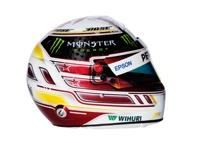

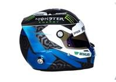

LEWIS HAMILTON VALTTERI BOTTAS 44 77

Date of Birth 07/01/1985 Date of Birth 28/08/1989 Formula 1 Debut 2007 Formula 1 Debut 2013 GP Starts 211 GP Starts 100 GP Wins 62 GP Wins 3 Pole Positions 73 Pole Positions 4 Podiums 119 Podiums 24 F1 Titles 4 F1 Titles N/A Total F1 Points 2655 Total F1 Points 1027

41

SCUDERIA FERRARI

Headquarters Ferrari S.p.A. Telephone +39 536 949 111 Via Ascari 55-57 Fax +39 536 949 049 41053 Maranello Website www.ferrari.com Italy

MD & Team Principal Maurizio Arrivabene Chief Designer Simone Resta Chief Technical Officer Mattia Binotto

Media Contact:

Alberto Antonini Mob: +39 344 0556 635 Email: Alberto.Antonini@ferrari.com

Formula 1 Debut 1950 Chassis SF71H Constructors’ Titles 16 Power unit Ferrari GP Starts 957 GP Wins 232 Fastest Lap 243 Pole Positions 216 Total Points 7914.5

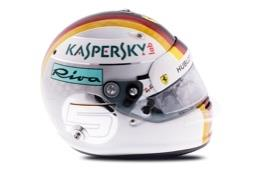

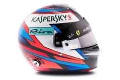

SEBASTIAN VETTEL KIMI RÄIKKÖNEN 5 7

Date of Birth 03/07/1987 Date of Birth 17/10/1979 Formula 1 Debut 2007 Formula 1 Debut 2001 GP Starts 202 GP Starts 276 GP Wins 49 GP Wins 20 Pole Positions 52 Pole Positions 17 Podiums 99 Podiums 93 F1 Titles 4 F1 Titles 1 Total F1 Points 2479 Total F1 Points 1595

42

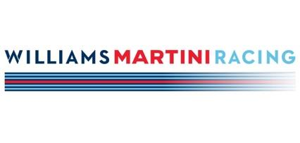

WILLIAMS MARTINI RACING

Headquarters Grove, Wantage Telephone +44 (0)1235 777 700 Oxfordshire Fax +44 (0)1235 777 960 OX12 0DQ Website www.williamsf1.com England

Team Principal Sir Frank Williams Team Manager Dave Redding CTO Paddy Lowe Head of Performance Rob Smedley Deputy Claire Williams Engineering Team Principal Chief Designer Ed Wood

Media Contacts:

Head of F1 Communications Sophie Ogg Mob: +44 (0)7977 275762 Email: Sophie.Ogg@williamsf1.com

Formula 1 Debut 1977 Chassis Williams FW41 Constructors’ Titles 9 Motor Mercedes GP Starts 695 GP Wins 114 Fastest Laps 133 Pole Positions 128 Total Points 3547

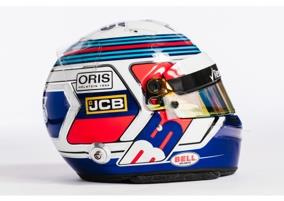

LANCE STROLL SERGEY SIROTKIN 18 35

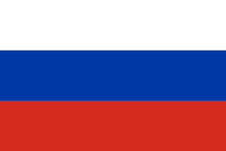

Date of Birth 29/10/1998 Date of Birth 25/08/1995 Formula 1 Debut 2017 Formula 1 Debut 2018 GP Starts 23 GP Starts 3 GP Wins N/A GP Wins N/A Pole Positions N/A Pole Positions N/A Podiums 1 Podiums N/A F1 Titles N/A F1 Titles N/A Total F1 Points 40 Total F1 Points N/A

43

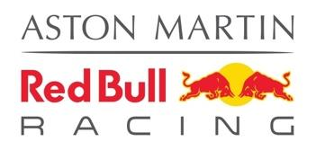

ASTON MARTIN RED BULL RACING

Headquarters Bradbourne Drive Telephone +44 (0)1908 279700 Tilbrook Fax +44 (0)1908 279810 Milton Keynes Website www.redbullracing.com MK7 8BJ, England

Team Principal Christian Horner OBE Chief Engineering Officer Rob Marshall

Chief Technical Adrian Newey OBE Chief Engineer, Dan Fallows Officer Aerodynamics

Chief Engineer, Paul Monaghan Chief Engineer, Pierre Waché Car Engineering Car Performance

Media Contacts: Head of Ben Wyatt Communications Mob: +44 (0)7771 854238 Email: ben.wyatt@redbullracing.com

Communications Manager Victoria Lloyd :Mob: +44 (0)7712 41 4196 Email: Victoria.lloyd@redbullracing.com James Ranson :Mob: +44 (0)7834 52 6354 Email: james.ranson@redbullracing.com

Formula 1 Debut 2005 Chassis RB14 Constructors’ Titles 4 Motor TAG Heuer GP Starts 250 GP Wins 56 Fastest Laps 56 Pole Positions 58 Total Points 3943.5

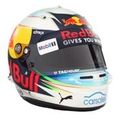

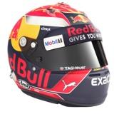

MAX VERSTAPPEN 33 DANIEL RICCIARDO 3

Date of Birth 30/09/1997 Date of Birth 01/07/1989 Formula 1 Debut 2014 Formula 1 Debut 2011 GP Starts 63 GP Starts 132 GP Wins 3 GP Wins 6 Pole Positions N/A Pole Positions 1 Podiums 11 Podiums 27 F1 Titles N/A F1 Titles N/A Total F1 Points 439 Total F1 Points 853

44

SAHARA FORCE INDIA F1 TEAM

Headquarters Dadford Road Telephone +44 (0)1327 850 800 Silverstone Fax +44 (0)1327 857 993 NN12 8TJ Website www.forceindiaf1.com England

Team Chief Dr. Vijay Mallya Deputy Team Robert Fernley Principal Technical Chief Andrew Green Chief Operating Otmar Szafnauer Officer Sporting Director Andy Stevenson Chief Race Engineer Tom McCullough

Media Contacts Head of Will Hings Communications Mob: +44 (0)7734 202020 Email: will.hings@forceindiaf1.com

Formula 1 Debut 2008 Chassis Force India VJM11 Constructors’ Titles N/A Motor Mercedes GP Starts 197 GP Wins N/A Fastest Laps 5 Pole Positions 1 Total Points 988

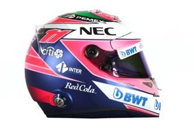

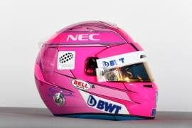

SERGIO PEREZ ESTEBAN OCON 11 31

Date of Birth 26/01/1990 Date of Birth 17/09/1996 Formula 1 Debut 2011 Formula 1 Debut 2016 GP Starts 139 GP Starts 32 GP Wins N/A GP Wins N/A Pole Positions N/A Pole Positions N/A Podiums 7 Podiums N/A F1 Titles N/A F1 Titles N/A Total F1 Points 467 Total F1 Points 88

45

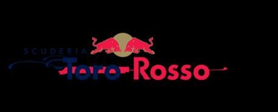

RED BULL TORO ROSSO HONDA

Headquarters Via Boaria, 229 Telephone +39 (0)546 696 111 48018 Faenza RA Fax +39 (0)546 620 998 Italy Website www.tororosso.com

Team Principal Franz Tost Team Manager Graham Watson Technical Director James Key

Media Contacts

Head of Fabiana Valenti Communications Mob: +39 335 7113 694 Email: fabiana.valenti@tororosso.com

Press Officer Jennifer Seeber Mob: +39 348 6095017 Email: Jennifer.seeber@tororosso.com

Formula 1 Debut 2006 Chassis STR13 Constructors’ Titles N/A Motor Honda GP Starts 232 GP Wins 1 Fastest Laps 1 Pole Positions 1 Total Points 394

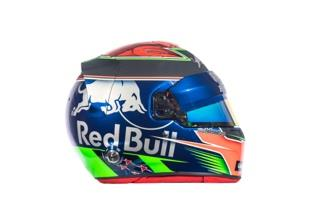

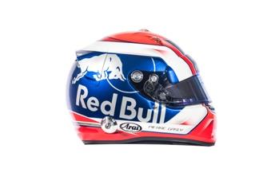

PIERRE GASLY BRENDON HARTLEY 10 28

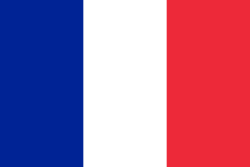

Date of Birth 07/02/1996 Date of Birth 10/11/1989 Formula 1 Debut 2017 Formula 1 Debut 2017 GP Starts 8 GP Starts 7 GP Wins N/A GP Wins N/A Pole Positions N/A Pole Positions N/A Podiums N/A Podiums N/A F1 Titles 0 F1 Titles N/A Total F1 Points 12 Total F1 Points 0

46

ALFA ROMEO SAUBER F1 TEAM

Headquarters Wildbachstrasse 9 Telephone +41 44 973 9000 8340 Hinwil Fax +44 44 973 9001 Switzerland Website www.sauberf1team.com

Team Principal Frédéric Vasseur Chief Designer Eric Gandelin/ Luca Furbatto Technical Director Jörg Zander Head of Nicolas Hennel Aerodynamics

Media Contacts

Head of Maria Guidotti; maria.guidotti@sauber-motorsport.com Communications

Formula 1 Debut 1993 Chassis Sauber C37 Constructors’ Titles 0 Motor Ferrari GP Starts 470 GP Wins 1 Fastest Laps 5 Pole Positions 1 Total Points 819

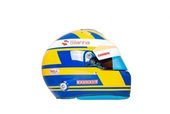

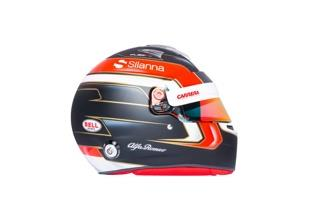

MARCUS ERICSSON CHARLES LECLERC 9 16

Date of Birth 02/09/1990 Date of Birth 16/10/1997 Formula 1 Debut 2014 Formula 1 Debut 2018 GP Starts 79 GP Starts 3 GP Wins N/A GP Wins N/A Pole Positions N/A Pole Positions N/A Podiums N/A Podiums N/A F1 Titles N/A F1 Titles N/A Total F1 Points 11 Total F1 Points 0

47

MCLAREN TEAM

Headquarters McLaren Telephone +44 (0) 1483 261 900 Technology Centre Fax +44 (0) 1483 261 963 Chertsey Road Website www.mclaren.com Woking, Surrey GU21 4YH, England

Executive Director, McLaren Technology Group Zak Brown Chief Operating Officer, McLaren Technology Group Jonathan Neale Racing Director Eric Boullier Chief Technical Officer - Chassis Tim Goss Team Manager Paul James

Media Contacts Group Communications Director Tim Bampton; Mob: +44 (0)7468 714614 Email : tim.bampton@mclaren.com Head of Media and Steve Cooper; Mob: +44(0)78 8142 6460 Creative Content Email: steve.cooper@mclaren.com Press Office Manager Silvia Hoffer; Mob: +44(0)75 8421 8639 Email: silvia.hoffer@mclaren.com PR & Media Manager Charlotte Sefton; Mob: +44(0)7500065321 Email: Charlotte.sefton@mclaren.com

Formula 1 Debut 1966 Chassis MCL33 Constructors’ Titles 8 Motor Renault GP Starts 827 GP Wins 182 Fastest Laps 154 Pole Positions 155 Total Points 5174.5

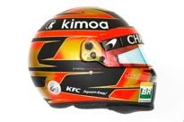

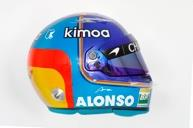

FERNANDO ALONSO STOFFEL VANDOORNE 14 2

Date of Birth 29/07/1981 Date of Birth 26/03/1992 Formula 1 Debut 2001 Formula 1 Debut 2016 GP Starts 293 GP Starts 24 GP Wins 32 GP Wins N/A Pole Positions 22 Pole Positions N/A Podiums 97 Podiums N/A F1 Titles 2 F1 Titles N/A Total F1 Points 1871 Total F1 Points 20

48

HAAS F1 TEAM

Headquarters Kannapolis Telephone + 1 704-652-4872 North Carolina USA Website www.haasf1team.com

Team Principal Gunther Steiner Chief Operating Officer Joe Custer Team Manager Pete Crolla Chief Race Engineer Ayao Komatsu Technical Director Rob Taylor Chief Aerodynamic Ben Agathangelou

Media Contacts

Head of Mike Arning Communications Mob: +1 704 875 3388 Ext. 802 Email: marning@haasf1team.com

Senior Press Officer Stuart Morrison Mob: +44 1295 237112 Email: smorrison@haasf1team.com

Formula 1 Debut 2016 Chassis Haas VF-18 Constructors’ Titles N/A Motor Ferrari 062 GP Starts 47 GP Wins N/A Fastest Laps N/A Pole Positions N/A Total Points 87

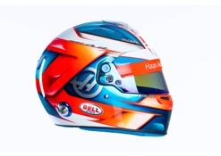

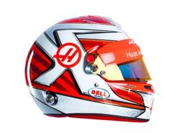

ROMAIN GROSJEAN KEVIN MAGNUSSEN 8 20

Date of Birth 17/04/1986 Date of Birth 05/10/1992 Formula 1 Debut 2009 Formula 1 Debut 2014 GP Starts 125 GP Starts 63 GP Wins N/A GP Wins N/A Pole Positions N/A Pole Positions N/A Podiums 10 Podiums 1 F1 Titles N/A F1 Titles N/A Total F1 Points 344 Total F1 Points 91

49

RENAULT SPORT FORMULA ONE TEAM

Headquarters Whiteways Telephone +44 (0)1608 678 000 Technical Centre Fax +44 (0)1608 678 609 Enstone Website www.renaultsport.com OX7 4EE, England

Managing Director Cyril Abiteboul Chief Technical Officer Bob Bell

Chassis Technical Nick Chester Engine Technical Rémi Taffin Director Director

Media Contacts

Head of Andy Stobart Communications Mob +44 (0)7703 36615; andy.stobart@uk.renaultsportf1.com Media Communi- Aurelie Donzelot cations Manager Mob +44 (0)7825 938476; aurelie.donzelot@uk.renaultsportf1.com

Lucy Genon Mob +33 6 11 71 61 78; lucy.genon@uk.renaultsportracing.com

Formula 1 Debut 1977 Chassis R.S.18 Constructors’ Titles 2 Motor Renault GP Starts 347 GP Wins 35 Fastest Laps 31 Pole Positions 51 Total Points 1408

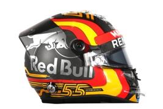

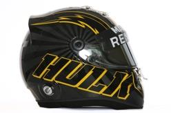

NICO HÜLKENBERG CARLOS SAINZ 27 55

Date of Birth 19/08/1987 Date of Birth 01/09/1994 Formula 1 Debut 2010 Formula 1 Debut 2015 GP Starts 138 GP Starts 63 GP Wins N/A GP Wins N/A Pole Positions 1 Pole Positions N/A Podiums N/A Podiums N/A F1 Titles N/A F1 Titles N/A Total F1 Points 427 Total F1 Points 11

50

SUPPORT RACES

FIA FORMULA 2 CHAMPIONSHIP

Formula 2 is widely accepted to be the chief feeder series to Formula 1, with many of its graduates moving on to

the top flight after honing their skills at this level.

After the 2018 seasons opening of Formula 2 in Bahrain, Baku City Circuit is proud to stage the second round of the season.

The new campaign is set to feature 12 rounds in all, with each meeting running in conjunction with a Formula 1 Grand Prix.

The series will introduce an all-new car for the 2018 season, with the same halo cockpit protection device as F1 fitted as standard.

There are 20 cars representing 10 teams on the grid.

Last year’s champion was Monegasque Charles Leclerc. He has since joined Formula 1 Team Sauber.

SAFETY & VALUES

Since its inception Formula 2 was designed to reflect five core values: performance, cost control, entertainment,

safety and preparation. The sporting and technical regulations are the blueprint of the championship and are only

changed if the proposed modifications fit into the template formed by these values, which remain the guiding

principles of Formula 2.

PERFORMANCE- F2 lap times are highly competitive with the final few rows on the grid proving that there isn’t

another junior formula which can match the performance levels of this series. Engines which provide over 612bhp,

plus ground effects and proper slick tyres make the Formula 2 cars powerful and tricky beasts to handle.

COST CONTROL- Operating at about 2% of the cost of running a Formula One team, F2 Teams nevertheless

race on the same tracks, on the same weekends, for the same audience and offer very impressive racing for the

crowd and the F1 paddock to enjoy. With centralised purchasing, strict limits on testing and an outright ban on individual developments costs are kept in check, while modifications are made with an eye on how they will affect

the price structure for the teams.

ENTERTAINMENT - By far F2 biggest selling point is the excitement its races provide for the fans. With two

races per weekend, reverse grids, compulsory pit stops, prime and option tyres and 22 identical cars on display,

the series never fails to enthrall and entertain.

51

FIA FORMULA 2 CHAMPIONSHIP

SAFETY - Racing at speeds very close to F1, safety is of course the highest priority. The F2 2018 car has passed

every one of the stringent F1 FIA crash tests, and includes anti-intrusion panels, while wearing the HANS device

is also compulsory. The championship dedicates commitment to safety ahead of all other considerations.

PREPARATIONS - The record speaks for itself: there has never been an F1 feeder category as successful as F2.

In 2016, the F1 grid was made up of ten F2 graduates, including five Champions, with two (Lewis Hamilton and

Nico Rosberg) going on to become Formula 1 World Champions (in 2008, 2014, 2015, 2016 and 2017). There

can be no finer testimonial to the benefit of the training the series provides to young drivers than that.

THE CAR AND ENGINE DIMENSIONS  Overall length : 5224mm  Overall width : 1900mm

 Overall Height : 1097mm (including FOM roll hoop camera)

 Wheelbase : 3135mm  Overall weight : 720 kg (driver on-board)

ENGINE  V6- 3.4 litre single turbo charged Mecachrome engine

 Rated to 620 HP @ 8750 rpm

 Fly-by-wire accelerator system  Rebuilt after 8000km

 Maximum Torque 600Nm.

PERFORMANCE  Acceleration : 0- 100km/h, 2.90sec

 : 0- 200km/h, 6.60sec  Max. speed : 335km/h (Monza aero configuration + DRS)

 Max. braking deceleration : -3.5G

 Max. lateral acceleration : +/- 3.9G

SAFETY STANDARDS  Full FIA F12018 safety standards  Halo F1 specifications

52

FIA FORMULA 2 CHAMPIONSHIP

MONOCOQUE & BODYWORK  Survival cell- Sandwich Carbon/aluminium honeycomb structure made by Dallara

 Front &rear wring- Carbon structures made by Dallara  Bodywork- Carbon- Kevlar heycomb structures made by Dallara

DRS  Same functionality of DRS used in Formula 1

 Hydraulic activation

GEARBOX  6-speed longitudinal Hewland sequential gearbox

 Electro-hydraulic command via paddle shift from steering wheel  ZF SACHS Carbon clutch  No on-board starter, anti-stall system

 Non-hydraulic ramp differential

FUEL CELL  FIA Standard, Premier FT 125 litres

ELECTRONIC FEATURES  Magneti Marelli Marvel SRG 480 ECU/GCU including data logging system  Magneti Marelli PDU 12-42 power supply management unit  CAN data acquisition pre-equipment

 Beacon receiver

SUSPENSION

 Double steel wishbones, pushrod operated, twin dampers and torsion bars suspension (F) and spring suspension (R)  Adjustable ride height, camber and toe

 Two way (F) / Four way (R) adjustable Koni dampers

 Adjustable anti-roll bar (Front/Rear)

BREAKS  6 pistons monobloc Brembo calipers

 TBC carbon-carbon brake discs and pads

WHEELS & TYRES  F1 standard wheel dimensions  O.Z. Racing  Magnesium rims  13” x 12” front & 13” x 13.7” rear F1 2017 standard wheel dimension  F2 specific Pirelli slick / wet tyres

53

FIA FORMULA 2 CHAMPIONSHIP

STEERING SYSTEM

 Non-assisted rack and pinion steering system  XAP steering wheel with dashboard, marshalling display, gear change and clutch paddles, marshalling & VSC display

CAMERA EQUIPMENT  Roll hoop, nose cone and face shot camera pre-equipment.

CALENDAR 6 – 8 April Sakhir Bahrain

27 – 29 June Baku Azerbaijan

11 – 13 May Barcelona Spain

24 – 26 May Monte Carlo Monaco

22 – 24 June Le Castellet France

29 June – 01 July Spielberg Austria

06 – 08 July Silverstone Great Britain

27 – 29 July Budapest Hungary

24 – 26 Aug SPA-Francorchamps Belgium

31 Aug – 02 Sept Monza Italy

28 – 30 Sept Sochi Russia

23 – 25 Nov Yas Marina Abu Dhabi

WEEKEND FORMAT & POINTS ALLOCATION

A race weekend is composed of one forty-five minutes practice session and one half hour qualifying session, followed by two races. The qualifying session is a straight fight for fastest lap time and determines the order of the grid for Race 1. Four

points are awarded for pole position.

Race 1 is run over 170km or 60 minutes (except for Monaco where the race is run over 140km and in Budapest

and Sochi where the race is run over 160km), and each driver must complete one compulsory pit stop and must

use at least one set of each specification of dry-weather tyres.

The top ten drivers score points (25, 18, 15, 12, 10, 8, 6, 4, 2, 1) with two points being awarded to the driver

who set the fastest lap of the race. The grid for Race 2 is determined by the finishing order of the first race, with the top 8 positions reversed. Race

2 is run over 120km or 45 minutes (except for Monaco where the race is run over 100km).

54

FIA FORMULA 2 CHAMPIONSHIP

The top eight finishers score points (15, 12, 10, 8, 6, 4, 2, 1) and the driver who sets the fastest lap scores

two points. Any driver who is not classified in the top ten positions at the end of the race or, didn’t start the race from his normal grid position will not be eligible for points awarded for fastest lap.

ENTRY LIST

|  | # |  | DRIVER |  | NATIONALITY |  | TEAM |
| --- | --- | --- | --- | --- | --- | --- | --- |
|  | 1 |  | Artem Markelov |  | RUS |  | RUSSIAN TIME |
|  | 2 |  | Tadasuke Makino |  | JPN |  | RUSSIAN TIME |
| 3 |  | Sean Gelael |  | IDN |  | PERTAMINA PREMA Theodore Racing |  |
| 4 |  | Nyck de Vries |  | NLD |  | PERTAMINA PREMA Theodore Racing |  |
|  | 5 | Alexander Albon (TBC) |  | THA |  | DAMS |  |
| 6 |  |  | Nicholas Latifi |  | CAN |  | DAMS |
| 7 |  | Jack Aitken |  | GBR |  | ART Grand Prix |  |
| 8 |  | George Russell |  | GBR |  | ART Grand Prix |  |
|  | 9 | Roberto Merhi |  | ESP |  | MP Motorsport |  |
| 10 |  |  | Ralph Boschung |  | CHE |  | MP Motorsport |
| 11 |  | Maximilian Günther |  | GER |  | BWT Arden |  |
| 12 |  | Nirei Fukuzumi |  | JPN |  | BWT Arden |  |
|  | 14 | Luca Ghiotto |  | ITA |  | Campos Vexatec Racing |  |
| 15 |  |  | Roy Nissany |  | ISR |  | Campos Vexatec Racing |
| 16 |  | Arjun Maini |  | IND |  | Trident |  |
| 17 |  | Santino Ferrucci |  | USA |  | Trident |  |
|  | 18 | Sérgio Sette Câmara |  | BRZ |  | Carlin |  |
| 19 |  |  | Lando Norris |  | GBR |  | Carlin |
| 20 |  | Louis Delétraz |  | CHE |  | Charouz Racing System |  |
| 21 |  | Antonio Fuoco |  | ITA |  | Charouz Racing System |  |

55

