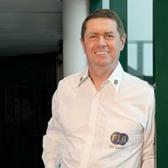
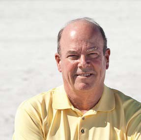
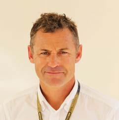

RACE STEWARDS BIOGRAPHIES

GARRY CONNELLY

DIRECTOR, GLOBAL INSTITUTE FOR MOTOR SPORT SAFETY; DIRECTOR, AUSTRALIAN INSTITUTE OF MOTOR SPORT SAFETY; F1, WTCC STEWARD; FIA WORLD MOTOR SPORT COUNCIL MEMBER

Garry Connelly has been involved in motor sport since the late 1960s. A long-                                                                             Championship to Australia in 1988 and served as Chairman of the Organising                                                                     December 2002. He has been an FIA Steward and FIA Observer since 1989, covering the FIA’s World Rally Championship, World Touring Car Championship                                                                                                                                                             member of the FIA World Motor Sport Council.

DENNIS DEAN

FIA WORLD MOTOR SPORT COUNTIL MEMBER; MEMBER, INTERNATIONAL SPORTING CODE REVIEW COMMISSION; MEMBER, COMMISSION INTERNATIONALE DE KARTING; FORMULA E STEWARD

                                                                                                                                                                                                                                                                                                                                                                                                                                                                                Racing and Rally/Solo for SCCA. He currently serves as a member of both the                                                                                                                                                  the SCCA Hall of fame.

TOM KRISTENSEN

1980 NINE TIMES LE MANS WINNER, GERMAN F3 CHAMPION                                                                                                           WORLD MOTOR SPORT COUNCIL MEMBER

Denmark’s Tom Kristensen is the most successful driver in the history of the Le                                                                                                                                                                                                                                                                                                                                                                                                                                                                                    in 2000, winning three Le Mans 24-Hours in succession with the team. He won again with Bentley in 2003 before returning to the wheel of Audi machines to win in 2004-’05, 2008 and 2013. In 2013 he also won the FIA World Endurance
