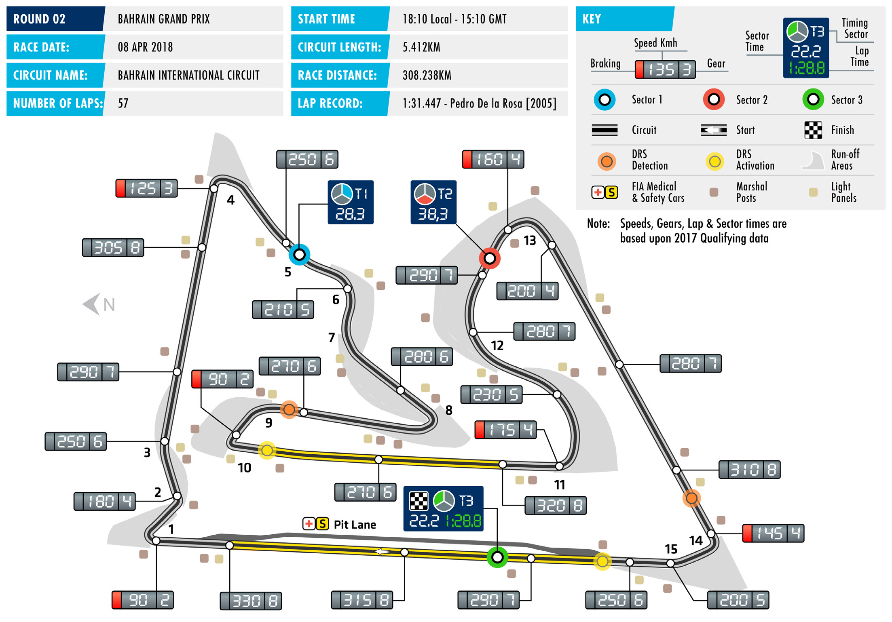

2018 BAHRAIN GRAND PRIX

06 – 08 April 2018

Formula One continues its early season long-haul programme BAHRAIN INTERNATIONAL CIRCUIT

this weekend with a visit to the Bahrain International Circuit, Length of lap:

home of Bahrain Grand Prix, round two of the 2018 FIA Formula 5.412km

One World Championship Lap record: 1:31.447 (Pedro de la Rosa, McLaren, Australia was a relatively gentle introduction to the season for 2005)

2018’s cars but Bahrain provides a stiffer challenge. Heat and dust Start line/finish line offset:

are both notorious engine breakers, while the stop-start nature 0.246km

of the track provides a harsh test for both brakes and tyres. Total number of race laps: 57 While the conversion of the Bahrain Grand Prix to a night race Total race distance: has improved the spectacle for fans, it brings with it challenges 308.238km

for both teams and drivers. The rapidly cooling track affects the Pitlane speed limits:

balance of the car in ways that are inconsistent with a standard, 80km/h in practice, qualifying, and mid-afternoon event. the race

The other consequence of racing at night is that it makes FP2,

conducted in the early evening, the only practice session from CIRCUIT NOTES

which meaningful set-up data is gathered. FP1 and FP3, both ► Other than routine maintenance

of which take place in the mid-afternoon, are not expected to no changes of significance have been made. be fruitful in the search for a good race balance, with the circuit

tending to move from oversteer on the hot track, towards

understeer as the asphalt cools. DRS ZONE ► The DRS sectors at the Bahrain Pirelli comes to Bahrain with its Medium, Soft and Supersoft International Circuit are broadly tyres. Superficially, this is the same combination as used in 2017, similar to last year, with 100m though last year no driver raced the Medium compound and added to the second zone. The detection point of the first zone the top ten all ran a two-stop strategy. With the tyres generally is 10m before Turn Nine and the considered to have moved one-step softer this year, wider activation point is 50m after Turn strategic choices should be in play. 10. The second zone’s detection point is 108m before Turn 14, with While the Australian Grand Prix is not generally considered activation occurring 170m after a reliable indicator of form, events in Albert Park two weeks Turn 15. ago did suggest exciting possibilities for the season ahead:

while Mercedes appear to have the advantage in qualifying,

the gaps between them, Ferrari and Red Bull were fractional

on long-run pace. Behind them, an equally compelling battle

looks to be developing among McLaren, Renault and Haas. The

idiosyncrasies of the Bahrain International Circuit ensure the

picture will not become entirely clear this weekend – but the

Bahrain Grand Prix will further sharpen the focus.

FAST FACTS

► This is the 14th Bahrain Grand Prix. The Hülkenberg raced here for Williams in four have raced previously at the Bahrain first event took place in 2004 and it has 2010, a year when the Bahrain Grand International Circuit. Sergey Sirotkin and been held every year since except 2011. Prix was the opening race of the season. Pierre Gasly both contested all four GP2 Stoffel Vandoorne made his debut for Championship races across two events in ► Fernando Alonso and Sebastian Vettel McLaren in 2016 as a late replacement 2015, with Gasly taking pole position at are the most successful drivers in Bahrain for Fernando Alonso, when the latter was the November meeting. Charles Leclerc with three wins each. Alonso won in ruled out on medical grounds. raced here last year at the Formula 2 2005 and 2006 for Renault, and 2010 season opener, finishing third in the for Ferrari; Vettel won the 2012 and ► Last year in Bahrain Valtteri Bottas took Feature race and winning the Sprint. 2013 races for Red Bull, adding a third his first pole position. The Finn followed Brendon Hartley made all four of his last year for Ferrari. Ferrari are the most that with three more during the course 2012 GP2 starts at this circuit, with a best successful constructor with five victories, of 2017. Of the current field, Alonso result of 10th. He has, however, been with Michael Schumacher winning the (2005), Vettel (2010, 2012) and Hamilton a frequent visitor with the FIA World inaugural race in 2004 and Felipe Massa (2015, 2016) have also started from pole. Enudrance Championship, appearing for adding back-to-back victories in 2007 Current Williams reserve driver Robert Porsche at the 6 Hours of Bahrain in each and 2008. Lewis Hamilton also has back- Kubica started from pole position for of the last four seasons. to-back victories in Sakhir, winning for BMW-Sauber in 2008. Mercedes in 2014 and 2015. The other ► Sebastian Vettel is due to start his 200th winners are Jenson Button (2009) and ► Starting from pole hasn’t been very grand prix this weekend. He mirrors Nico Rosberg (2016). useful in Bahrain: only five times has the achievement of Alonso and former the pole position driver converted the team-mate Mark Webber who also made ► Despite never having won the Bahrain advantage into victory, with Hamilton their 200th start in Bahrain. Vettel’s Grand Prix, Kimi Räikkönen has more being the most recent to do so in 2015. win in Australia two weeks ago was his podium appearances at this race than any The eventual winner, however, has 100th visit to the F1 podium. In terms of other driver. His eight podiums comprise never started from further back than the podiums, the German driver is fourth on three third places (2005-2007) and five second row, with both Alonso (2006) and the all-time list, with four of the top six seconds (2008, 2012, 2013, 2015, 2016). Button winning from P4. in the current field. Schumacher leads the way with 155 podiums, followed by ► Nico Hülkenberg and Stoffel Vandoorne ► Four drivers are making a Bahrain Grand Hamilton (118), Alain Prost (106), Vettel, both made their F1 debut at this circuit. Prix debut this weekend – though all Alonso (97) and Räikkönen (92).

RACE STEWARDS BIOGRAPHIES

DR GERD ENNSER

MEMBER OF THE DMSB’S EXECUTIVE COMMITTEE FOR AUTOMOBILE SPORT, FORMULA ONE AND DTM STEWARD

Dr Gerd Ennser has successfully combined his formal education in law with his passion for motor racing. While still active as a racing driver he began helping out with the management of his local motor sport club and since 2006 has been a permanent steward at every round of Germany’s DTM championship. Since 2010 he has also been a Formula One steward. Dr Ennser, who has worked as a judge, a prosecutor and in the legal department of an automotive- industry company, has also acted as a member of the steering committee of German motor sport body, the DMSB, since spring 2010, where he is responsible for automobile sport. In addition, Dr Ennser is a board member of the South Bavaria Section of ADAC, Germany’s biggest auto club.

PAOLO LONGONI

MEMBER OF THE ITALIAN MOTOR SPORT COMMISSION (CSAI); THE AUTOMOBILE CLUB OF MILAN

Paolo Longoni is a steward with nearly 30 years’ experience. Milanese Longoni began his stewards’ training at his home circuit – Monza – in 1990 and was immediately ‘bitten by the bug’ of motorsport. While his early stewarding experience was based largely at Monza, since 2006 Longoni has officiating at rounds of the Porsche Supercup, Ferrari Challenge Championship, FIA Historic Championship, ETCC, WTCC, Formula Two and Le Mans Series events. He frequently serves as the national steward at the Italian Grand Prix.

DANNY SULLIVAN

FORMER F1 DRIVER, INDIANAPOLIS 500 WINNER AND CART CHAMPION

US racer Danny Sullivan made his F1 debut with Tyrrell at the 1983 Brazilian Grand Prix. He raced just one season in F1, scoring a best result of fifth in Monaco. In 1984, Sullivan returned to the US where he resumed a successful Indy Car career. He is perhaps best known for his ‘spin and win’ victory at the 1985 Indianapolis 500, where he passed leader Mario Andretti, survived a 360 degree spin, and then caught and re-passed Andretti to claim the Borg-Warner Trophy. He won the Indy Car World Series title in 1988. After 17 victories from 170 Indy Car starts he drew a line under his open-wheel career in 1995. He finished third in the Le Mans 24 Hours in a Dauer Porsche 962 in 1994. He made four starts at Le Mans, the most recent being 2004

2018 Formula One World Championship

DRIVERS’ CHAMPIONSHIP STANDINGS

NAJIABREZA AILARTSUA EROPAGNIS IBAHD YNAMREG YRAGNUH STNIOP NIARHAB OCANOM ADANAC AIRTSUA MUIGLEB ECNARF OCIXEM ANIHC AISSUR NAPAJ LIZARB NIAPS YLATI ASU UBA BG

25 1 S. VETTEL 25 1 18 2 L. HAMILTON 18 2 15 3 K. RÄIKKÖNEN 15 3 12 4 D. RICCIARDO 12 4 10 5 F. ALONSO 10 5 8 M. VERSTAPPEN 8 6 6 6 N. HÜLKENBERG 6 7 7 4 V. BOTTAS 4 8 8 2 S. VANDOORNE 2 9 9 1 C. SAINZ 1 10 10

S. PÉREZ 0 11 11

E. OCON 0 12 12

C. LECLERC 0 13 13

L. STROLL 0 14 14

B. HARTLEY 0 15 15

R. GROSJEAN 0 16 NC

K. MAGNUSSEN 0 17 NC

P. GASLY 0 18 NC

M. ERICSSON 0 19 NC

S. SIROTKIN 0 20 NC

2018 Formula One World Championship

CONSTRUCTORS’ CHAMPIONSHIP STANDINGS

NAJIABREZA AILARTSUA EROPAGNIS IBAHD YNAMREG YRAGNUH STNIOP NIARHAB OCANOM ADANAC AIRTSUA MUIGLEB ECNARF OCIXEM ANIHC AISSUR NAPAJ LIZARB NIAPS YLATI ASU UBA BG

40 1 40 SCUDERIA FERRARI 1 3 22 MERCEDES AMG 22 2 PETRONAS MOTORSPORT 2 8 20 3 ASTON MARTIN 20 RED BULL RACING 4 6 12 12 4 MCLAREN F1 TEAM 5 9 7 RENAULT SPORT 7 5 FORMULA ONE TEAM 7 10

SAHARA FORCE INDIA 0 6 F1 TEAM 11 12

ALFA ROMEO 0 7 SAUBER F1 TEAM 13 NC

WILLIAMS MARTINI 0 8 RACING 14 NC

RED BULL 0 9 TORO ROSSO HONDA 15 NC

0 10 HAAS F1 TEAM NC NC

FORMULA ONE TIMETABLE & FIA MEDIA SCHEDULE

THURSDAY

Press conference 15.00

FRIDAY

Practice session 1 14.00-15.30 Press conference 16.00

Practice session 2 18.00-19.30

SATURDAY

Practice session 3 15.00-16.00 Qualifying 18.00-19.00 Followed by unilateral and press conference

SUNDAY

Drivers’ Parade 16.40 Race 18.10 Followed by podium interviews and press conference

ADDITIONAL MEDIA OPPORTUNITIES

QUALIFYING

All drivers eliminated in Q1 or Q2 will be available for media interviews immediately after the end of each session, as will drivers who participated in Q3, but who are not required for the post-qualifying press conference. The TV interview pen is located in the paddock, behind the FIA garage.

RACE

Any driver retiring before the end of the race will be made available at the TV pen interview area. In addition, during the race every team will make available at least one senior spokesperson for interview by officially accredited TV crews. A list of those nominated will be made available in the media centre.

FIA COMMUNICATIONS DEPARTMENT press@fia.com T +33 1 43 12 58 15
