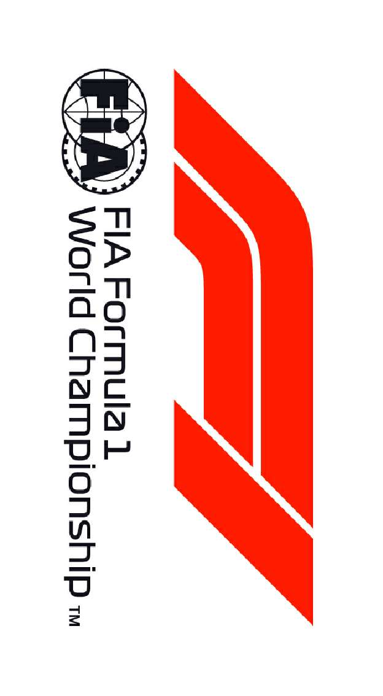
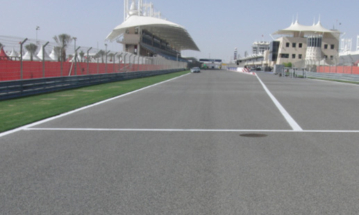
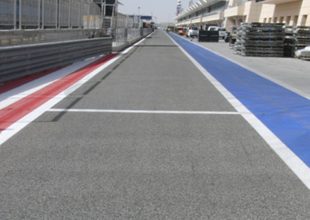
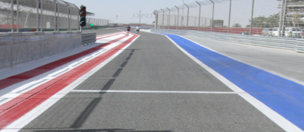
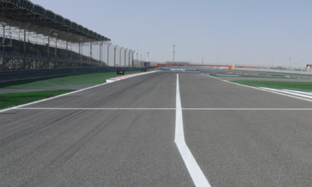

2018 BAHRAIN GRAND PRIX

5 - 8 April 2018

From The FIA Formula One Race Director Document 2

To All Teams, All Officials Date 05 April 2018

Time 09:00

Title Event Notes

Description Event Notes

Enclosed 2018_04_05_BAHRAIN_GP_EVENT_NOTES_v1.pdf

Charlie Whiting

The FIA Formula One Race Director

2018 BAHRAIN GRAND PRIX

5-8 APRIL 2018

From The FIA Formula One Race Director Document 2

To Formula One Team Managers Date 5 April 2018

Time 14.00

EVENT NOTES

5 APRIL 2018

1) Matters arising from the Australian Grand Prix

2) Changes to the circuit

2.1 Other than routine maintenance no changes of significance have been made.

3) Pit lane map

3.1 Safety Car lines.

3.2 The location of the pit entry and the pit exit.

3.3 Designated garage areas.

3.4 Safety Car position for first lap and rest of race.

3.5 Blue flag marshal at the pit exit.

3.6 Track light panels displaying pit entry status.

4) Pirelli Event Preview

4.1 With reference to Article 24.4(a) of the Sporting Regulations see the attached document provided by the official tyre supplier.

5) Weighing and weighing platform

5.1 The FIA weighing platform will be available for teams to use at the following times, however, no more than 10 team personnel may be present during any visit. Each visit should last no more than 10 minutes unless no other team is waiting in the pit lane :

a) From 14.30 Thursday until 17.30 on Saturday (between 16.00 and 17.30 each visit will be restricted to five minutes).

b) From when the cars are returned to the teams after qualifying until 22.30 on Saturday.

1/5

c) From 13.10 until 17.10 on Sunday.

Any team found to be abusing the time limits or personnel restrictions set out above, which we will be enforced by FIA security personnel and our own CCTV, will not be permitted to use the weighbridge again during the Event.

6) Red zones for photographers in the pit lane during sessions

6.1 See the attached drawing.

7) Practice starts

7.1 Practice starts may only be carried out on the right at the pit exit before the end of the pit wall. Drivers must leave adequate room on their left for another driver to pass.

7.2 For reasons of safety and sporting equity, cars may not stop in the fast lane at any time the pit exit is open without a justifiable reason (a practice start is not considered a justifiable reason).

8) Lines, bollards and flags at the pit entry and pit exit

8.1 In accordance with Chapter 4 (Section 5) of Appendix L to the ISC drivers must keep to the right of the solid white line at the pit exit when leaving the pits, no part of any car leaving the pits may cross this line.

8.2 In accordance with Chapter 4 (Section 4) of Appendix L to the ISC drivers entering the pits must keep to the right of the white line at the pit entry.

8.3 The dotted white line across the pit exit is the track edge.

9) DRS

9.1 DRS will be globally disabled if panels 1, 10, 11 or 17 are displaying yellow.

9.2 Detection will be automatically disabled if the light panels below are displaying yellow :

Zone 1 : Panels 8 or 9.

Zone 2 : Panel 16.

9.3 If automatic detection is not working , and permission has been given by race control to use manual detection, DRS should not be used in the relevant zone if panels 8, 9 or 16 are displaying yellow.

10) Observing yellow flags during free practice and qualifying

10.1 Double waved : Any driver passing through a double waved yellow marshalling sector must reduce speed significantly and be prepared to change direction or stop. In order for the stewards to be satisfied that any such driver has complied with these requirements it must be clear that he has not attempted to set a meaningful lap time, for practical purposes this means the driver should abandon the lap (this does not necessarily mean he has to pit as the track could well be clear the following lap).

10.2 Single waved : Drivers should reduce their speed and be prepared to change direction. It must be clear that a driver has reduced speed and, in order for this to be clear, a driver would be expected to have braked earlier and/or discernibly reduced speed in the relevant marshalling sector.

Drivers should not overtake any car in a single waved yellow marshalling sector unless it is clear that a car is slowing with a completely obvious problem, e.g. obvious accident damage or a deflated tyre.

2/5

11) Track light panels

11.1 The FIA track light panels have been installed in the positions shown on the circuit map. In accordance with Appendix H to the ISC the light signals have the same meaning as flag signals.

12) Suspended race procedure tests after P1 and P2

12.1 At the end of P1 all drivers who would like to participate in the suspended race procedure test should take the chequered flag, complete the lap, enter the pit lane and form up in a line in the fast lane. Engines should be switched off and the car power cycled.

Red lights will be shown around the track when the last car on the track takes the chequered flag after the end of the session.

Within a few minutes a “race resumption” time will be displayed on the timing monitors and the pit exit will open at the appointed time, drivers who were in the pits when the chequered flag was shown may join the back of the line of cars leaving the pits from the fast lane. During this lap the track light panels will display “SS” when the first car reaches S1. Drivers should then complete a lap, without overtaking, and proceed to the grid and form up in the correct grid box as indicated by the grid light panels. Once all the cars are on the grid the main race start light procedure will be initiated, when the red lights are extinguished drivers should leave the grid in an orderly fashion, they should not attempt to carry out a practice start.

12.2 At the end of P2 all drivers who would like to participate in the suspended race procedure test should take the chequered flag, complete the lap, enter the pit lane and form up in a line in the fast lane. Engines should be switched off and the car power cycled.

Red lights will be shown around the track when the last car on the track takes the chequered flag after the end of the session.

Within a few minutes a “race resumption” time will be displayed on the timing monitors and the pit exit will open at the appointed time, drivers who were in the pits when the chequered flag was shown may join the back of the line of cars leaving the pits from the fast lane. During this lap the track light panels will display “SS” when the first car reaches S1. Drivers should then complete a lap, without overtaking, and proceed to the grid and form up in the correct grid box as indicated by the grid light panels. Once all the cars are on the grid the main race start light procedure will be initiated, however, this time the start procedure will be aborted and the cars sent on another formation lap. When the cars return to the grid they should again form up in the correct grid box as indicated by the grid light panels. Once all the cars are on the grid for the second time the main race start light procedure will be initiated, when the red lights are extinguished drivers should leave the grid in an orderly fashion, they should not attempt to carry out a practice start.

13) Drivers leaving their pit stop position in the pit lane

13.1 For safety reasons, no car should be driven from its pit stop position at any time unless :

a) It has first been driven into the pit stop position having just entered the pit lane from the track, and ;

b) It is then driven immediately back onto the track from the pit stop position.

14) Fire extinguishers around the circuit

14.1 Indicated by small fluorescent orange boards with a white letter “F”.

15) Places to remove cars from the track

15.1 Indicated by fluorescent orange panels on the walls or guardrails.

3/5

16) Support races

16.1 Teams are asked to keep their barriers no more than four metres from the garages during the support race sessions and races.

17) In laps and reconnaissance laps

17.1 In order to ensure that cars are not driven unnecessarily slowly on in laps during and after the end of qualifying or during reconnaissance laps when the pit exit is opened for the race, drivers must stay below the maximum time set by the FIA between the Safety Car lines shown on the pit lane map.

You will be informed of the maximum time after the first day of practice.

18) Post qualifying parc fermé

18.1 The cameras should be installed and operated in the same way as 2017.

19) Operational personnel curfew

19.1 Boards warning anyone attempting to enter the paddock that the curfew is in operation will be placed immediately before the entry turnstiles at the appropriate times.

21) Removing cars from the grid

21.1 Two gates in the pit wall, beside grid positions 2 and 18.

22) Car number light panels for the start

22.1 On the driver’s right.

23) Track light panels displaying pit entry status

23.1 The light panels indicated on the pit lane map will display a flashing yellow arrow if cars are required to use the pit lane once the Safety Car has been deployed during the race.

23.2 The light panels indicated on the pit lane map will display a flashing red cross if the pit lane is closed at any point during the race.

24) Lapping during the race

24.1 The ISC requires drivers who are caught by another car about to lap him to allow the faster driver past at the first available opportunity. The F1 Marshalling System has been developed in order to ensure that the point at which a driver is shown blue flags is consistent, rather than trusting the ability of marshals to identify situations that require blue flags.

As it was at the end of last season the system will be set to give a pre-warning when the faster car is within 3.0s of the car about to be lapped, this should be used by the team of the slower car to warn their driver he is soon going to be lapped and that allowing the faster car through should be considered a priority. When the faster car is within 1.2s of the car about to be lapped blue flags will be shown to the slower car (in addition to blue light panels, blue cockpit lights and a message on the timing monitors) and the driver must allow the following driver to overtake at the first available opportunity.

It should be noted that the aim of using F1MS is ensure consistent application of the rules, additional instructions may also be given by race control when necessary.

4/5

25) Post race parc fermé

25.1 All cars must enter the pit lane and proceed directly to the weighing area.

26) Any other business

26.1 Presentation from the FIA Safety Department concerning anti-doping and alcohol testing.

Charlie Whiting FIA Formula One Race Director

5/5

|  |  | Grand Prix of Bahrain 06-08/04/2018 (18R02BAH) |  |  |  |  |  |  |  |
| --- | --- | --- | --- | --- | --- | --- | --- | --- | --- |
|  |  | Compound |  | FL | FR | RL | RR |  | Mandatory race tyres |
|  |  | MEDIUM |  | M60 | M62 | M70 | M72 |  | MEDIUM |
|  |  | SOFT |  | S60 | S62 | S70 | S72 |  | SOFT |
|  |  | SUPERSOFT |  | X60 | X62 | X70 | X72 |  |  |
|  |  | INTERMEDIATE BASE |  | I37 | I38 | I39 | I40 |  | Q3 tyre |
|  |  | WET BASE Cross-Over time MINIMUM STARTING PRESSURE, BLISTERING SENSITIVITY, CAMBER LIMIT |  | R37 WET > 119% > INT > 113% > DRY | R38 Front (psi) | R39 | R40 | Rear (psi) | SUPERSOFT |
|  |  |  | Slicks |  | 21.0 |  |  | 19.0 |  |
|  |  |  | Intermediate |  | 19.0 |  |  | 17.0 |  |
|  |  |  | Wet |  | 18.0 |  |  | 16.0 |  |
| FE EOS Camber limit RE EOS Camber limit -3.75 ° -2.00 ° FE Blistering RE Blistering sensitivity sensitivity Low Low |  | TYRE HEATING STRATEGY |  |  |  |  |  |  |  |
| Storage temperature: Optimum time in Storage temperature: Optimum time in blanket (@80°): blanket (@60°): 60°C 40°C 2h 1h SLICKS INTER Maximum boost Blanket time window Maximum boost Blanket time window temperature (@80°): temperature (@60°): 1h @ 110°C 1h to 3h 30min @ 80°C 30 min to 2h Storage temperature: Optimum time in blanket (@60°): 40°C 1h WET Blanket time window NO BOOST (@60°): 30 min to 2h GENERAL NOTES Teams are kindly reminded that the following parameters will be subjected to FIA checks during the event: - Starting pressure. - Camber at maximum speed. - Maximum blanket temperature. - Tyre swapping. | Tyre Notes |  |  |  |  |  |  |  |  |
| ● Not permiHed to switch tyres from their originally allocated posi$on. Storage Temp˚C is the recommended temperature the tyre can stay in blankets without time limit. All temperature limits apply to the actual tyre surface temperature, measured with the IR ● Do not subject tyres to large deforma$on or heavy impact. gun detailed in TD029-15. ● Do not leave fiHed tyres exposed at an air temperature lower than 15°C SIDEWALLS HEATING CLARIFICATION (ALL PRODUCTS): you are allowed to apply a max. and/or any UV emission. temperature of 100 °C for max. 1 hr to the sidewalls as long as the max. temp/time at any part ● Revised prescrip$ons could be issued during the race weekend in of the tread is the one described in the corresponding section above. accordance with TD/007-16. | ● Not permiHed to switch tyres from their originally allocated posi$on. ● Do not subject tyres to large deforma$on or heavy impact. ● Do not leave fiHed tyres exposed at an air temperature lower than 15°C and/or any UV emission. ● Revised prescrip$ons could be issued during the race weekend in accordance with TD/007-16. |  |  |  |  | Storage Temp˚C is the recommended temperature the tyre can stay in blankets without time limit. All temperature limits apply to the actual tyre surface temperature, measured with the IR gun detailed in TD029-15. SIDEWALLS HEATING CLARIFICATION (ALL PRODUCTS): you are allowed to apply a max. temperature of 100 °C for max. 1 hr to the sidewalls as long as the max. temp/time at any part of the tread is the one described in the corresponding section above. |  |  |  |

PUS GNIRENNAB DNA GNICNEF

rihkaS

- XIRP

.devreser DNARG sthgir llA .elibomotuA'l

ed NIARHAB elanoitanretnI

noitarédéF

eht fo RIA kram edart a si FLUG ogol AIF ehT .ynapmoc

1 1 alumroF ALUMROF a ,VB NOISULCXE gnisneciL

enO alumroF

8102 fo skram edart era skram detaler SREHPARGOTOHP dna XIRP DNARG ,PIHSNOIPMAHC

DLROW ENOZ ENO ALUMROF

AIF ,1F DER ,ENO ALUMROF detimiL ,1 ALUMROF pihsnoipmahC

,ogol dlroW 1F ,ogol enO 1 alumroF ALUMROF

8102 1F ehT ©

eniL enaL X yrtnE sutatS slenap lortnoC saerA 8102 RAC tiP detangiseD tiP paL lirpA YTEFAS egaraG tsriF 5– 1 noisreV

| A | AIF |
| --- | --- |
| B | AIF |
| C | 1 alumroF |

|  |  | sedecreM |
| --- | --- | --- |
| 0 | sedecreM |  |
| 1 | sedecreM |  |
| 2 | sedecreM |  |
| 3 | sedecreM | irarreF |
| 4 | irarreF |  |
| 5 | irarreF |  |
| 6 | irarreF |  |
| 7 | irarreF | lluB deR |
| 8 | lluB deR |  |
| 9 | lluB deR |  |
| 01 | lluB deR |  |
| 11 | lluB deR | aidnI ecroF |
| 21 | aidnI ecroF |  |
| 31 | aidnI ecroF |  |
| 41 | aidnI ecroF |  |
| 51 | aidnI ecroF | smailliW |
| 61 | smailliW |  |
| 71 | smailliW |  |
| 81 | smailliW |  |
| 91 | smailliW | tluaneR |
| 02 | tluaneR |  |
| 12 | tluaneR |  |
| 22 | tluaneR |  |
| 32 | ossoR oroT | ossoR oroT |
| 42 | ossoR oroT |  |
| 52 | ossoR oroT |  |
| 62 | saaH |  |
| 72 | saaH | saaH |
| 82 | saaH |  |
| 92 | neraLcM | neraLcM |
| 03 | neraLcM |  |
| 13 | neraLcM |  |
| 23 | rebuaS |  |
| 33 | rebuaS | rebuaS |
| 43 | rebuaS |  |
| 53 | ecneirepxE 1F |  |

X

YRTNE 1 eniL TIP RAC stratS ENAL YTEFAS ENAL TSAF

TIP

MORF xirP EREH )YLNO lennosreP DEREVOCER DECALP tratS dnarG maeT ecaR( KCART SRAC

niarhaB segaraG noitisoP

eloP

1F 8102

sdnE

ENAL

TIP

ENAL

RAC TSAF YTEFAS ecaR

TIXE

TIP 2 eniL

RAC

GALF YTEFAS lahsraM EULB

noitisoP

potS

tiP
