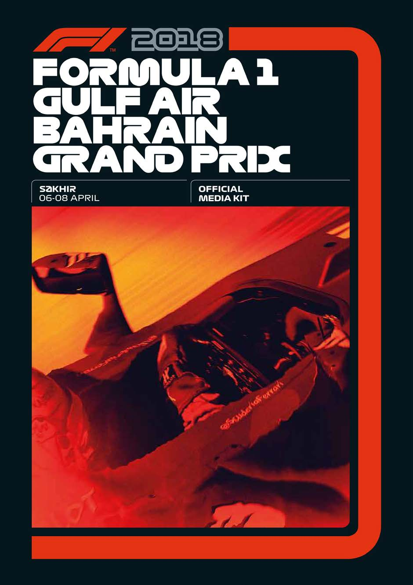

0

CONTENTS

PART 1 GENERAL INFORMATION Foreword by Arif Rahimi, Chairman of the Board 3 Welcome Note by Shaikh Salman bin Isa Al Khalifa, Chief Executive 4 Timetable 5-6 Circuit Map 7 Bahrain International Circuit – Specifications 8 Bahrain International Circuit – Additional Information 9-11 Bahrain International Circuit – A-Z 12-14

PART 2 MEDIA SERVICES Responsibilities: Organisation & Racetrack 15 Responsibilities: FIA & Media Centre 16 Accreditation & Media Centre Opening Times 17-18 Press Conferences 19

PART 3 2018 FIA FORMULA 1 WORLD CHAMPIONSHIP™ Calendar 20 Driver Entry List 21 Drivers at a Glance 22 Teams at a Glance 23

2018 Circuit Characteristics: Grand Prix Characteristics: Australian Grand Prix 24-25 Grand Prix Characteristics: Bahrain Grand Prix 26 Grand Prix Characteristics: Chinese Grand Prix 27 Grand Prix Characteristics: Azerbaijan Grand Prix 28 Grand Prix Characteristics: Spanish Grand Prix 29 Grand Prix Characteristics: Monaco Grand Prix 30 Grand Prix Characteristics: Canadian Grand Prix 31 Grand Prix Characteristics: French Grand Prix 32 Grand Prix Characteristics: Austrian Grand Prix 33 Grand Prix Characteristics: British Grand Prix 34 Grand Prix Characteristics: German Grand Prix 35 Grand Prix Characteristics: Hungarian Grand Prix 36 Grand Prix Characteristics: Belgian Grand Prix 37 Grand Prix Characteristics: Italian Grand Prix 38 Grand Prix Characteristics: Singapore Grand Prix 39 Grand Prix Characteristics: Russian Grand Prix 40 Grand Prix Characteristics: Japanese Grand Prix 41 Grand Prix Characteristics: United States Grand Prix 42 Grand Prix Characteristics: Mexican Grand Prix 43 Grand Prix Characteristics: Brazilian Grand Prix 44 Grand Prix Characteristics: Abu Dhabi Grand Prix 45

1

PART 4 TEAMS & DRIVERS Mercedes AMG Petronas Motorsport 46 Scuderia Ferrari 47 Williams Martini Racing 48 Aston Martin Red Bull Racing 49 Sahara Force India F1 Team 50 Red Bull Toro Rosso Honda 51 Alfa Romeo Sauber F1 Team 52 McLaren F1 Team 53 Haas F1 Team 54 Renault Sport Formula One Team 55

PART 5 STATISTICS 2018 FIA F1 World Championship Statistical Data 56-57  2018 Race Results to Date  2018 Team Standing to Date  2018 Drivers Standing to Date Bahrain Grand Prix History Statistics – Previous Winners (2004-2017) 58 Bahrain GP Driver History (2004-2017) 59-60 2017 Bahrain GP Results at a Glance 60 Drivers & Constructors Classification: End of 2017 Season 61-62

PART 6 HISTORY BOOK: FIGURES/FACTS/STATISTICS Driver World Champions 2017 – 1982 63 Driver World Champions 1981 – 1950 64 Constructor World Champions 2017 – 1982 65 Constructor World Champions 1981 - 1958 66 Driver Records: The Most 67 Team Records: The Most 68

PART 7 RULES & REGULATIONS New Rules in 2018 69 Points, Classification, Race Distance 71-72 Race Flags 72

PART 8 SUPPORT RACES FIA Formula 2 Championship 73-77 Porsche GT3 Cup Challenge Middle East 78-81

2

Dear Formula 1 Fans,

On behalf of the Board of the Bahrain International Circuit, welcome to The Home of Motorsport in the Middle East. We are honored to be hosting the second round of the 2018 Formula 1 World Championship. With the race so early in the season, it promises to be an exciting weekend of unpredictable racing as the teams continue to get to grips with their 2018 cars.

As a host of F1 for 14 years, we have always sought to embrace initiatives which bring fans closer to the sport. We are therefore delighted that this year there a number of new events running throughout the race weekend which support that aim. Together with other race promoters, we have worked closely with Formula 1 on the revised weekend package and new events which seek to bring fans closer to the action.

We are especially pleased that the new Formula 1 Pirelli Hot Laps programme will be launched at this year’s Bahrain Grand Prix. This will offer a few lucky fans the opportunity to be driven round the F1 track by a professional driver ahead of the race. I trust they will enjoy a thrilling experience.

A race weekend filled with so much on and off-track action would not be possible without the tireless work of the team here at the BIC. I thank all of them for their efforts, together with the continued support we receive from the Bahrain Motor Federation and the Motorsport Marshalls Club of Bahrain.

Lastly, I would also like to take the opportunity to thank our partners and sponsors, in particular Gulf Air which has supported us since our very first race back in 2004.

I hope that all fans have an unforgettable weekend of racing and entertainment at the Home of Motorsport in the Middle East.

ARIF RAHIMI

CHAIRMAN OF THE BOARD Bahrain International Circuit

3

Welcome to Bahrain International Circuit and to the FIA Formula 1 2018 Gulf Air Bahrain Grand Prix, for what promises to be an enthralling weekend of racing and entertainment.

Every year, our mission at BIC is to make your Grand Prix experience one you will never forget. That involves putting together an even bigger and better show than ever before, both on and off the race track. This year is no exception.

It is always a great honour to host the pinnacle of global motorsport in Formula 1, but we are equally proud of the support races we are hosting this weekend.

We are pleased to welcome back the FIA Formula 2 Championship for its opening race of the season. It is often said that the series is set up as a feeder to F1 and testament to that has been the progression of drivers this year into the top tier, not least last year’s champion Charles Leclerc. We are also pleased to welcome back the Porsche GT3 Cup Challenge Middle East, our very own home-grown series, which showcases the best of drivers from the region.

Off the track, our concert line-up follows in the tradition of global superstars at BIC, as we welcome GRAMMY Award winner Carlos Santana. Together with family entertainment including a Circus Stage, Street Musicians and Dancers and fun activities for kids under 12 in the F1 Village tent, there is something to keep all the family amused, in between the action on the track.

We are encouraged every year by the fact that the growing popularity of motorsport in the region which brings more and more fans to BIC for the F1 weekend.

I therefore extend a very warm Bahraini welcome to everyone, especially to those visiting BIC for the first time. We hope that your weekend will be filled with loads of wonderful memories.

Shaikh Salman bin Isa Al Khalifa Chief Executive – Bahrain International Circuit

4

TIMETABLE – FORMULA 1® 2018 GULF AIR BAHRAIN GRAND PRIX

THURSDAY – 05:24 SUNRISE 11:20 11:40 FIA FORMULA 2 F2 DRIVER’S GROUP PHOTOGRAPH - TRACK 14:00 14:30 FORMULA 1 SECURITY BRIEFING – DRIVER’S BRIEFING ROOM 14:00 20:00 FIA INITIAL SCRUTINEERING – FIA GARAGE 15:00 16:00 FORMULA 1 FIA PRESS CONFERENCE – PRESS ROOM 16:20 16:50 FORMULA 1 FORMULA 1 PIRELLI HOT LAPS - TRACK 16:30 17:00 FIA FORMULA 2 TEAM MANAGERS MEETING – DRIVER’S BRIEFING ROOM 17:00 17:30 FIA FORMULA 2 DRIVERS’ MEETING – DRIVER’s BRIEFING ROOM 17:00 18:45 PROMOTER ACTIVITY 3-DAY TICKET HOLDER PIT LANE WALK ONLY – PIT LANE 17:00 19:00 FIA TRACK CLOSED FIA/F1 SYSTEMS CHECKS - TRACK 17:45 18:00 FIA TRACK INSPECTION, TRACK COMPLETELY CLEAR - TRACK 18.00 19.00 FIA HIGH SPEED TRACK TEST- FIA SAFETY AND MEDICAL CARS 19:15 19:45 FORMULA 1 F1 EXPERIENCE – PIT LANE (F1 EXPERIENCE GUESTS ONLY) 19:45 20:15 FORMULA 1 F1 EXPERIENCE – TRUCK TOUR (F1 EXPERIENCE GUESTS ONLY) – TRACK 20:00 21:00 FORMULA 1 TEAM MANAGERS MEETING – DRIVER’S BRIEFING ROOM 17:56 SUNSET

FRIDAY - 5:23 SUNRISE 10:30 10:40 FIA MEDICAL INSPECTION - TRACK 10:45 11:00 FIA TRACK INSPECTION AND TRACK TEST -TRACK 11:30 12:15¹ FIA FORMULA 2 PRACTICE SESSION - TRACK 12:30 13:30 PADDOCK CLUB PADDOCK CLUB PIT LANE WALK – PIT LANE 12:40 13:10¹ PORSCHE GT3 CUP PRACTICE SESSION – TRACK MIDDLE EAST 13:30 13:40 FIA TRACK INSPECTION - TRACK 14:00 15:30¹ FORMULA 1 FIRST PRACTICE SESSION - TRACK 15:45 16:15 FORMULA 1 FORMULA 1 PIRELLI HOT LAPS 15:45 17:00 PADDOCK CLUB PADDOCK CLUB PIT LANE WALK – PIT LANE 16:00 17:00 FORMULA 1 FIA PRESS CONFERENCE – PRESS ROOM 16:15 16:30 PROMOTER ACTIVITY PARACHUTE DISPLAY TBC – AIR DISPLAY 16:40 17:00 PORSCHE GT3 CUP QUALIFIYING SESSION - TRACK MIDDLE EAST 17:30 17:40 FIA TRACK INSPECTION -TRACK 18:00 19:30¹ FORMULA 1 SECOND PRACTICE SESSION - TRACK 20:00 20:30 FIA FORMULA 1 QUALIFYING SESSION - TRACK 20:00 21:00 FORMULA 1 PRESS CONFERENCE – PRESS ROOM 20:40 21:10 PADDOCK CLUB PADDOCK CLUB TRUCK TOUR - TRACK 21:00 22:00 FORMULA 1 DRIVER’S MEETING – DRIVER’S BRIEFING 21:15 22:00 PROMOTER ACTIVITY MARSHAL PIT LANE WALK – PIT LANE 22:15 22:45 FIA FORMULA 2 PRESS CONFERENCE – PRESS ROOM 17:56 SUNSET

*These times refer to the start of the formation lap ¹Fixed End Sessions 2Approximate Finishing Time PLEASE NOTE THAT THIS TIMETABLE IS SUBJECT TO AMENDSMENTS

5

TIMETABLE – FORMULA 1® 2018 GULF AIR BAHRAIN GRAND PRIX

SATURDAY 5:22 SUNRISE 11:00 11:10 FIA MEDICAL INSPECTION - TRACK 11:15 11:30 FIA TRACK INSPECTION AND SAFETY CAR TEST - TRACK 11:40 12:40 PADDOCK CLUB PADDOCK CLUB PIT LANE WALK – PIT LANE 11:55* 12:25² PORSCHE GT3 CUP FIRST RACE (10 LAPS OR 25 MINS) MIDDLE EAST 12:10 12:30 FORMULA 1 TEAM PIT STOP PRACTICE – PIT LANE 12:55 13:00 FIA FORMULA 2 PIT LANE OPEN – PIT LANE 13:10* 14:15² FIA FORMULA 2 FIRST RACE (32 LAPS OR 60 MINS) 14:25 14:55 FIA FORMULA 2 FIA PRESS CONFERENCE – PRESS ROOM 14:30 14:40 FIA TRACK INSPECTION - TRACK 15:00 16:00¹ FORMULA 1 THIRD PRACTICE SESSION - TRACK 16:15 16:35 FORMULA 1 FORMULA 1 PIRELLI HOT LAPS – TRACK 16:15 17:25 PADDOCK CLUB PADDOCK CLUB PIT LANE WALK – PIT LANE 16:45 17:00 PROMOTER ACTIVITY PARACHUTE DISPLAY TBC - AIRDISPLAY 16:45 17:15 PADDOCK CLUB PADDOCK CLUB TRUCK TOUR – TRACK 17:30 17:40 FIA TRACK INSPECTION - TRACK 18:00 19:00 FORMULA 1 QUALIFYING SESSION - TRACK 19:20 19:30 FORMULA 1 FORMULA 1 PIRELLI HOT LAPS - TRACK 19:40 20:10 PADDOCK CLUB PADDOCK CLUB TRUCK TOUR - TRACK

SUNDAY 05:21 SUNRISE 12:25 12:45 FIA FORMULA 2 DRIVER’S PARADE – TRACK 13:15 13:25 FIA MEDICAL INSPECTION - TRACK 13:30 13:45 FIA TRACK INSPECTION AND TRACK TEST – TRACK 14:00 14:05 FIA FORMULA 2 PIT LANE OPEN – PIT LANE 14:15* 15:05² FIA FORMULA 2 SECOND RACE (23 LAPS OR 45 MIN) – TRACK 15:00 16:00 FORMULA 1 DRIVER’s AUTOGRAPH SESSION – FAN ZONE 15:15 15:45 FIA FORMULA 2 FIA PRESS CONFERENCE – PRESS ROOM 15:30* 16:00² PORSCHE GT3 CUP SEDCOND RACE (10 LAPS OR 25 MINS) – TRACK MIDDLE EAST 15:40 17:25 PADDOCK CLUB PADDOCK CLUB PIT LANE WALK – PIT LANE 16:10 16:30 FORMULA 1 FORMULA 1 PIRELLI HOT LAPS 16:30 17:00 PADDOCK CLUB PADDOCK CLUB TRUCK TOURS - TRACK 16:40 17:10 FORMULA 1 DRIVERS’ TRACK PARADE – TRACK 16:55 17:25 FORMULA 1 STARTING GRID PRESENTATION - TRACK 17:10 17:25 PROMOTER ACTIVITY PARACHUTE DISPLAY TBC – AIR DISPLAY 17:10 17:25 FIA MEDICAL INSPECTION - TRACK 17:20 17:30 FIA TRACK INSPECTION - TRACK 17:40 17:50 FORMULA 1 PIT LANE OPEN - PIT LANE 17:56 17:58 FORMULA 1 NATIONAL ANTHEM – TRACK 17:58 17:59 PROMOTER ACTIVITY GULF AIR FLY PAST TBC – AIR DISPLAY 18:10* 20:10² FORMULA 1 GRAND PRIX (57 LAPS OR 120 MINS) - TRACK 19:40 20:10 PADDOCK CLUB PADDOCK CLUB TRUCK TOUR - TRACK

* These times refer to the start of the formation lap ¹ Fixed End Session 2Approximate Finishing time PLEASE NOTE THAT THIS TIMETABLE IS SUBJECT TO AMENDMENTS 2018 FORMULA 1 GULF AIR BAHRAIN GRAND PRIX TIMETABLE– ISSUE 2 14/03/2018

6

BAHRAIN INTERNATIONAL CIRCUIT MAP

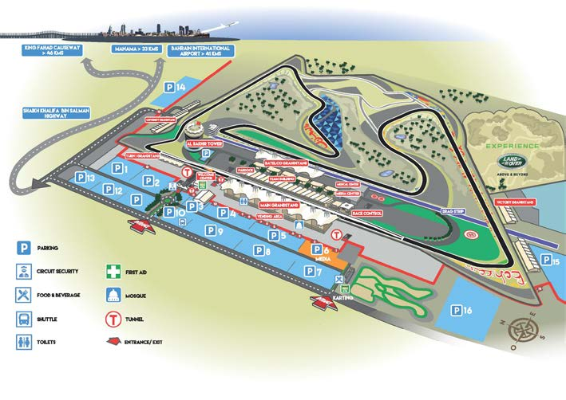

7

BAHRAIN INTERNATIONAL CIRCUIT – SPECIFICATIONS

Five different individual tracks and one drag strip:

• 2.55km Inner track with a width varying between 14m – 15M (8 turns) • 3.664km Outer track with a width varying between 14m – 17m (10 turns) • 5.412km Grand Prix track with a width varying between 14m – 22m width • 6.4km Full Circuit with a width varying between 14m – 22m • 3.7km Paddock Circuit (9 turns) 14 – 22m width • 1.2km Drag strip with a width of 18.5m (a part of the National Hot Rod Association Worldwide Network)

Specifications of the Grand Prix track:

• Investment $150 million US • Maximum uphill slope: 3.60% • Maximum downhill slope: 5.60% • Height between the lowest and highest points on the circuit: 0 to 18m • 15 turns (9 right and 6 left) • Forecast lap time for a 2.4-litre Formula One car: 1min 31secs • Length of start/finish straight 1,090 m • Four straights: - Pit straight: 1,090m - Straight 2: 555m - Straight 3: 680m - Straight 4: 750m

8

BAHRAIN INTERNATIONAL CIRCUIT ALSO INCLUDES:

• An 8-storey VIP tower (Sakhir Tower) with Roof terrace, VIP suites, Restaurant and Administration Offices • A total seating capacity for 45,000 spectators • Main Grandstand for 10,500 spectators and first-class hospitality suites • 47 VIP Hospitality Suites in the Main and Oasis Grandstands • State-of-the-art Pit and Paddock complex for 11 Grand Prix teams, their cars, equipment and support staff • Oasis Complex that includes 3,000-seat grandstand and a second pit building for support race and vehicle testing technical support • Race Control Tower with the latest technology including a nerve center with 41 remote controlled security cameras with zoom capability to enable Race Officials to monitor every aspect of the race track from a central point • A complete technical resource center dedicated to Formula One scrutineering and regulation control • Dedicated buildings for 18 international racing teams • Administration and hospitality buildings • Medical Centre constructed and equipped to stringent FIA Medical Commission and International racing standards • Television Broadcast Centre for International and Regional broadcasters • Media Centre for 500 journalists with 260 television sets • Photographers’ Centre for 120 International and Regional photographers • Under-the-track pedestrian and vehicle tunnels • Vending area for merchandising • New dual carriageway road access from Manama to circuit • Parking facilities for 13,000 cars

9

BAHRAIN INTERNATIONAL CIRCUIT – ADDITIONAL INFORMATION

Personnel

• 600 Race track Marshals • 750 TV technicians and commentators • 700 Cleaners, electricians and technicians • 97 Medical staff, 25 of which are doctors • 60 BIC Administration • 700 Catering and Merchandising staff • 800 Security staff • 1,000 Policemen

Construction details

• Workforce: 3,000+ at peak time • Total man-hours worked: 8,265,000hrs • Total Sub base for track: 272,648m • Total Asphalt base course: 60,000MT • Total Asphalt binding course: 30,000MT • Total Asphalt wearing course: 30,000MT • Total run-off area: 140,000m2 • Total grass carpet: 5,000m2 • Total Quantity of Concrete used: 70,000m3 • Total Steel: 8,500 MT • Total rock excavation: 968,459m3 • Total filling: 500,000m3 • Total length of tyre barriers: 4,100m • Total number of tyres: 82,000 • Total guardrail: 12,000m • Total FIA safety fencing: 5,000m

10

BAHRAIN INTERNATIONAL CIRCUIT – ADDITIONAL INFORMATION CONT.

Other Facilities

• A Technical Resource Centre dedicated to a Formula One Grand Prix or any other international race event, located on the start/finish straight • Main Grandstand with first-class hospitality suites • Dedicated support buildings for international racing teams • Administration and hospitality buildings • Multi-purpose second pit building with lounges and a grandstand for 6,000 spectators • A Medical Centre constructed and equipped to the defined International Standards • A Broadcast Centre for International and National media • A Media Centre with seating for 500 journalists • Under-track pedestrian and vehicle tunnels • VIP viewing tower • Helicopter landing facilities

| • Bahrain International Karting Circuit |  |
| --- | --- |
| State-of-the-Art Lighting System on Track: | • 495 light poles erected along the track • Each pole 10 to 45 meters in height • 5,000 luminaries • 500km of cabling • Provides light necessary for HDTV broadcasting |

11

BAHRAIN INTERNATIONAL CIRCUIT – A-Z

BIC TV/BIC Radio – BIC TV will transmit live on the giant screens all the on-and off-track activities at the circuit, keeping the fans involved and up-to-date with the day’s events. BIC’s radio broadcast will be transmitted on 107.0 FM and provided in both Arabic and English. Listeners at the circuit as well as across the island will be able to follow commentaries on the races and all other activities around the Grand Prix as well as updates and latest news on all F1 events.

Carlos Santana – The ten-time GRAMMY® winner is bringing his celebrated Divination Tour to the Bahrain International Circuit. He has signed on to be headlining performer at this year’s Formula 1 extravaganza and will be taking to the stage on Friday, April 6th 2018, the night of the race weekend. Santana is a superstar of world music and his ground-breaking Afro-Latin- blues-rock fusion transcended musical genres and generational, cultural and geographical boundaries. He has sold more than 100 million records and reached more than 100 million fans at concerts worldwide.

Celebrities – The Kingdom of Bahrain draws a glittering array of stars to the BIC from across the globe each year. To date, they have included Olympic legends Michael Johnson and Sir Steve Redgrave, golf icons Colin Montgomerie, Paul Casey, Camilo Villegas, Retief Goosen, Sergio Garcia and many more. Pop stars Ragheb Alama, John Legend, Anouska, Jay Kay, Mick Hucknall and Michael Jackson; rock superstar Eric Clapton, Rick Parfitt and Nick Mason; tennis hero Boris Becker and royalty from across Europe and the Middle East.

Dragster Xperience – One of BIC’s most popular products offers the public a chance to enjoy a passenger ride in a Top Fuel Dragster – the fastest car in the sport of drag racing. Power down BIC’s quarter-mile drag strip, which is a part of the ‘National Hot Rod Association Worldwide Network’, in blistering speed. Accelerate from zero to 100kph in just one second, while experiencing G-forces of up to 2Gs charging off the start line. BIC’s special fleet of Top Fuel Dragsters can seat two passengers at a time along with one driver.

Excellence – In 2007 the BIC became the first active Formula 1™ venue to be recognized as a Centre of Excellence by the FIA for its commitment to setting new standards in motor sport safety and its dedication to translate lessons learned from the sport into saving lives on the highway.

Further Off-Track Events – BIC is also a favorite venue for hosting a range of off-track events. Some of the major non-racing events held at the circuit include the Bahrain International Air Show, the Bahrain International Motor Show and Challenge Bahrain triathlon to name a few.

Glue – This legendary, indeed mythical, substance, was alleged to be keeping the sands of the Sakhir desert at bay prior to the inaugural Gulf Air Bahrain Grand Prix in 2004. Sadly, this great story wasn't true then and isn't true today.

History – On the 14th September 2002, the Kingdom of Bahrain signed a long-term agreement with Formula 1™ Management Ltd to host a round of the FIA Formula 1™ World Championship, starting from 2004.

12

BAHRAIN INTERNATIONAL CIRCUIT – A-Z

Interactive Entertainment – Each year the Formula 1™ Village is filled with a three-day festival of entertainment. In the Gulf, major occasions are as much a social event as a sporting spectacle and the BIC goes further each year to provide live performances, eye-catching artists and enjoyable opportunities that create a unique ambience focused on entertaining the ticket buying public.

Journalists – The BIC Media Centre can host up to 500 journalists from around the world, offering a state-of-the-art, modern communications infrastructure. ISDN, ADSL and direct lines as well as data uplinks are available in the Media Centre and Photographers.

Karting – BIC has opened a state-of-the-art karting facility, named Bahrain International Karting Circuit. The track has been designed to the highest international standards, and it is capable of hosting world championship-level events under the Commission Internationale de Karting- Federation Internationale de l’Automobile (CIK-FIA). The venue’s CIK circuit is 1.414 kilometers in distance and it features 14 turns. The Bahrain International Karting Circuit offers a wide array of experiences for the avid karter, including a Formula One-inspired Mini Grand Prix. It is also the only karting track in the world that can hold night racing under CIK standards, as the facility boasts a series of floodlights of 150 in all.

Live Acts – Benjamin Booker is the second major international artist joining legendary Carlos Santana, who will perform on the Saturday night of the weekend. Booker is one of music’s rising stars. The 28-year-old’s style has been described as “a raw brand of blues/boogie/soul” and as “bright, furious, explosive garage rock.” His concert at the Grand Prix will mark his debut appearance in the Kingdom of Bahrain. In addition, English electronic music duo Disclosure will be taking to the stage the same night to close the show with a DJ set. Aside from their Grammy nominations, Disclosure have also been nominated for multiple Brit Awards, MTV Video Music Awards, and International Dance Music Awards, including in 2016 when they won for Best Full Length Studio Recording for their album “Caracal”.

Marshals – Coordinated by the Bahrain Motor Federation, the event’s sporting organizer, a total of 800 marshals will work at the BIC through the Grand Prix weekend. Amongst these will be 38 sector and deputy marshals overseeing 8-10 marshals each, 25 working in the pit lane and 50 on the starting grid. There will be 120 fire marshals, 150 track marshals and a team of 30 doctors and medics.

Non-alcoholic – Podium celebrations in Bahrain are characterised by the spraying of Waard as a substitute for the traditional champagne, in accordance with local custom. Waard is a blend of rose water, locally produced pomegranate juice and sparkling water that is blended and bottled locally, specifically for the Grand Prix weekend.

Pit Walkabout – All three-day ticket holders will have access to the pit lane on the Thursday before the race weekend.

Quality – Bahrain International Circuit (BIC) prides itself on the quality of off-track entertainment it offers fans each year at the Formula One Gulf Air Bahrain Grand Prix. There are world-class attractions at the Formula One Village vending area. A long list of globally renowned acts will

13

BAHRAIN INTERNATIONAL CIRCUIT A-Z CONT…

be performing live, perfectly complementing the wide array of activities, game stalls, show and kids’ activities, all of which can be enjoyed all weekend.

Run Off Area – Providing eight meters both sides of the track on the straights and up to 10 meters on the outside of corners, the run-off areas feature different designs of Arabic artwork and script, designed as a themed journey both to enhance the presentation for viewers and to provide the drivers with optimum safety.

Support Series – The Porsche GT3 Cup Challenge Middle East will be back again in 2017 as the support race as well as the F2 (former GP2 Series) and TCR International Series.

Track Hire – The BIC serves as a unique setting for corporate functions. Open for hire, companies are able to access the BIC to stage business conferences and exhibitions, film a TV commercial, or rent time on the circuit for private racing events.

Underpinning the Economy – The Bahrain Grand Prix is a significant contributor to the national economy, and a vital showcase to global TV audiences. In 2010, the race weekend attracted over 100,000 visitors from across the Middle East region and various international destinations. An independent study illustrated that the 2012 Grand Prix had a gross economic impact of approximately US$295 million, supporting around 3,000 jobs.

Vending Area – The Bahrain International Circuit was designed with the spectator in mind. Accommodating 100,000 visitors on race day, the Grandstand (capacity: 50,000) in particular provides fantastic views of the track and racing action

Welsh Granite – Over 1200 tones of stone were used in the construction of the BIC, a third of it being Welsh granite, which is recognised for its adhesive characteristics and ideal for the track surface.

14

MEDIA SERVICES – RESPONSIBILITIES

ORGANISATION Organising Body Bahrain Motor Federation, P.O. Box 54336 Manama, Kingdom of Bahrain Phone +973 1745 2000 Fax +973 1745 2020 Email info@bmf.com.bh

President Shaikh Abdulla bin Isa Al Khalifa

Vice-President Shaikh Salman bin Isa bin Ebrahim Al Khalifa

RACE TRACK Operating Company Bahrain International Circuit PO Box 26381, Manama, Kingdom of Bahrain Phone +973 1745 0000 Fax +973 1745 1111 Email info@bic.co.bh

Clerk of the Course Fayez Ramzy Fayez

National Steward Mazen Al Hilli

Stewards Gerd Ennser, Paolo Longoni, Danny Sullivan

15

MEDIA SERVICES RESPONSIBILITIES CONT…

FIA Race Director, Starter and Safety Delegate Charlie Whiting

FIA Medical Delegate Alain Chantegret

FIA Deputy Medical Delegate Ian Roberts

FIA Head of Single-Seater Technical Matters Nikolas Tombazis

FIA Technical Delegate Jo Bauer

FIA F1 Head of Communications & Matteo Bonciani Media Delegate

FIA F1 Deputy Media Delegate Pierre Guyonnet-Duperat

FIA Safety Car Driver Bernd Mayländer

FIA Medical Car Driver Alan Van Der Merwe

MEDIA CENTRE National Press Officer Sarah Al Hashimi

National Press Officer Assistant Mariam Ahmed

International Media & PR Jassim Al Bardooli

Media Accreditation Salman Al Madhi

Media Centre Coordination Zahra Ali

16

MEDIA SERVICES – ACCREDITATION AND MEDIA CENTRE

ACCREDITATION Location The accreditation centre is located next to Sakhir Service Station (Gulf of Bahrain Avenue)

Opening hours Wednesday, 4th April 12.00 hrs – 18.00 hrs

Thursday, 5th April 10.00 hrs – 21.00 hrs

Friday, 6th April 10.00 hrs – 19.00 hrs

Saturday, 7th April 10.00 hrs – 15.00 hrs

Sunday, 8th April 10.00 hrs – 15.00 hrs (national press only)

MEDIA CENTRE & PHOTOGRAPHERS AREA Location The Media Centre is located directly in front of you, when you come out of the tunnel that leads from the Media Parking inside the Paddock Area.

Opening Hours Wednesday 4th April 10.00 hrs – 22.00 hrs

Thursday, 5th April 10.00 hrs – 22.00 hrs

Friday, 6th April 10.00 hrs – 00.00 hrs

Saturday, 7th April 10.00 hrs – 00.00 hrs

Sunday, 8th April 10.00 hrs – *until the last journalist/photographer leaves

17

MEDIA SERVICES MEDIA CENTRE & PHOTOGRAPHERS AREA CONT… Journalists’ Room:  440 seats.  10 public telephones of which 5 are located in a separate area.  Private telephones on request.  5 fax machines.  ISDN and direct lines as well as data uplinks are available.  10 Internet workstations.  349 lockers.

Photographers’ Area: The Photographers’ Area comprises the following facilities:  Photographers’ room inside the Media Centre with 100 seats.  ISDN and direct lines as well as data uplinks are available.  100 lockers.

Please obtain a key from the receptionist in the Photographers’ room. A deposit of BD 5 per key is required.

Television/Radio: 36 operational air-conditioned boxes are available to television and radio commentators below the Grandstand roof

Media Shuttle: There is a limited media shuttle service as the International and National Media car parks are very close to the Media Centre and Paddock, which can be reached through a tunnel. This tunnel leads from the Media car park to the entrance of the Media Centre.

Photographer Shuttle Route: A photographers’ shuttle service is provided from the Race Control Tower to important locations around the track. This service will also be provided during the support races. For further details, please check the official notice board in the photographers’ area.

Operating Hours: Please refer to the schedule on the official notice board in the photographers’ room.

Red Zones: There are no red zones at the Bahrain International Circuit

Photographers’ Towers: There are two photographers’ towers positioned at the circuit. The first one is located at the first corner. A shuttle service to turn number one will be offered from the grid during the warm-up lap (pick up on the service road in front of the main grandstand). The second one is located at the Pit Lane wall right in front of the podium.

18

MEDIA SERVICES – PRESS CONFERENCES Location: The Press Conference Room is outside the Media Centre. It is located inside the Formula 1 Paddock on the first floor of the Podium Building. Please follow the signs from the Media Centre to the Press Conference Room.

Formula 1 Thursday, 15.00 hrs, In the Press Conference Room: drivers chosen by the FIA Head of F1 Communications & Media Delegate

Friday, 16.00 hrs, In the Press Conference Room: team personalities chosen by the FIA Head of F1 Communications & Media Delegate

Saturday, following the qualifying sessions: TV unilateral interview with the top 3 drivers of the qualifying session

Saturday, after the unilateral interview, In the Press Conference Room: Post qualifying press conference with top 3 drivers of the qualifying session

Sunday, following the podium celebrations: TV unilateral interview with the top 3 finishing drivers

Sunday, after the unilateral interview, In the Press Conference Room: Post-race press conference with the top 3 finishing drivers

Note: Photographers are kindly requested to use the steps that have been provided behind the row for the journalists.

All TV unilateral interviews and press conferences will be transmitted into the Media Centre.

19

2018 FIA FORMULA 1 WORLD CHAMPIONSHIP™ – CALENDAR

23-25 Mar ROLEX AUSTRALIAN GRAND PRIX Melbourne

06-08 Apr GULF AIR BAHRAIN GRAND PRIX Sakhir

13-15 Apr HEINEKEN CHINESE GRAND PRIX Shanghai

27 -29 Apr AZERBAIJAN GRAND PRIX Baku

11-13 May GRAN PREMIO DE ESPAÑA Catalunya

24-27 May GRAND PRIX DE MONACO Monte Carlo

08-10 Jun HEINEKEN GRAND PRIX DU CANADA Montréal

22-24 Jun GRAND PRIX DE FRANCE Le Castellet

29 Jun -01 Jul GROSSER PREIS VON ÖSTERREICH Spielberg

06-08 Jul ROLEX BRITISH GRAND PRIX Silverstone

20-22 Jul GROSSER PREIS VON DEUTSCHLAND Hockenheim

27-29 Jul FORMULA MAGYAR NAGYDÍJ Budapest

24-26 Aug BELGIAN GRAND PRIX Spa

31Aug-02 Sep GRAN PREMIO HEINEKEN D'ITALIA Monza

14-16 Sep SINGAPORE GRAND PRIX Singapore

28 -30 Sep VTB RUSSIAN GRAND PRIX Sochi

05 -07 Oct JAPANESE GRAND PRIX Suzuka

19-21 Oct UNITED STATES GRAND PRIX Austin

26-28 Oct GRAN PREMIO DE MEXICO Mexico City

09-11 Nov GRANDE PRĒMIO HEINEKEN DO BRASIL São Paulo

23-25 Nov ETIHAD AIRWAYS ABU DHABI GRAND PRIX Yas Marina

20

2018 FIA FORMULA 1 WORLD CHAMPIONSHIP™ – DRIVER ENTRY LIST

| No. | Driver | Country | Team |
| --- | --- | --- | --- |
| 44 | Lewis Hamilton | Great Britain | Mercedes AMG Petronas Motorsport |
| 77 | Valtteri Bottas | Finland | Mercedes AMG Petronas Motorsport |
| 5 | Sebastian Vettel | Germany | Scuderia Ferrari |
| 7 | Kimi Räikkönen | Finland | Scuderia Ferrari |

3 Daniel Ricciardo Australia Aston Martin Red Bull Racing

33 Max Verstappen Netherland Aston Martin Red Bull Racing

| 11 | Sergio Perez | Mexico | Sahara Force India F1 Team |
| --- | --- | --- | --- |
| 31 | Esteban Ocon | France | Sahara Force India F1 Team |

18 Lance Stroll Canada Williams Martini Racing Williams Martini Racing 35 Sergey Sirotkin Russia

| 27 | Nico Hulkenberg | Germany | Renault Sport Formula One Team |
| --- | --- | --- | --- |
| 55 | Carlos Sainz | Spain | Renault Sport Formula One Team |

10 Pierre Gasly France Red Bull Toro Rosso Honda

28 Brendon Hartley New Zealand Red Bull Toro Rosso Honda

| 8 | Romain Grosjean | France | Haas F1 Team |
| --- | --- | --- | --- |
| 20 | Kevin Magnussen | Denmark | Haas F1 Team |

14 Fernando Alonso Spain McLaren F1 Team

2 Stoffel Vandoorne Belgium McLaren F1 Team

| 9 | Marcus Ericsson | Sweden | Alfa Romeo Sauber F1 Team |
| --- | --- | --- | --- |
| 16 | Charles Leclerc | Monaco | Alfa Romeo Sauber F1 Team |

21

2018 FIA FORMULA 1 WORLD CHAMPIONSHIP™ – DRIVERS AT A GLANCE

Driver Debut GP Entered Poles Podium Wins Titles Total Points

Sebastian Vettel 2007 200 50 99 48 4 2450

Lewis Hamilton 2007 209 73 118 62 4 2628

Valtteri Bottas 2013 98 4 22 3 0 991

Kimi Räikkönen 2001 274 17 92 20 1 1580

Daniel Ricciardo 2011 130 1 27 5 0 828

Max Verstappen 2014 61 0 11 3 0 429

Sergio Perez 2011 137 0 7 0 0 467

Esteban Ocon 2016 30 0 0 0 0 87

Carlos Sainz 2015 61 0 0 0 0 119

Nico Hulkenberg 2010 136 0 0 0 0 411

Lance Stroll 2017 21 0 1 0 0 40

Romain Grosjean 2009 123 0 10 0 0 344

Kevin Magnussen 2014 61 0 1 0 0 81

Fernando Alonso 2001 291 22 97 32 2 1859

Stoffel Vandoorne 2016 22 0 0 0 0 16

Marcus Ericsson 2014 77 0 0 0 0 9

Pierre Gasly 2017 6 0 0 0 0 0

Brendon Hartley 2017 5 0 0 0 0 0

Charles Leclerc 2018 1 0 0 0 0 0

Sergey Sirotkin 2018 1 0 0 0 0 0

22

2018 FIA FORMULA 1 WORLD CHAMPIONSHIP™ – TEAMS AT A GLANCE

| Team |  | F1 | Debut | Wins | Pole |  | Fastest |  | Total |
| --- | --- | --- | --- | --- | --- | --- | --- | --- | --- |
|  |  | Titles |  |  |  |  | Laps |  | Points |
| Mercedes AMG Petronas Motorsport | 4 |  | 1954 | 76 | 89 | 56 |  | 3740 |  |

Scuderia Ferrari 16 1950 231 214 243 7870.5

Aston Martin Red Bull Racing 4 1997 55 58 55 3908.5

Sahara Force India F1 Team 0 1991 0 1 5 987

Williams Martini Racing 9 1978 114 128 133 3547

Renault Sport Formula One Team 2 1986 20 20 13 1390

Red Bull Toro Rosso Honda 0 2006 1 1 1 382

Haas F1 Team 0 2016 0 0 0 76

McLaren F1 Team 8 1966 182 155 155 5158.5

Alfa Romeo Sauber F1 Team 0 1993 1 1 5 817

23

CIRCUIT CHARACTERISTICS

FORMULA 1 2018 ROLEX AUSTRALIAN GRAND PRIX MELBOURNE Date 23 – 25 Mar Race distance 307.574 km Circuit length 5.303 km Number of laps 58

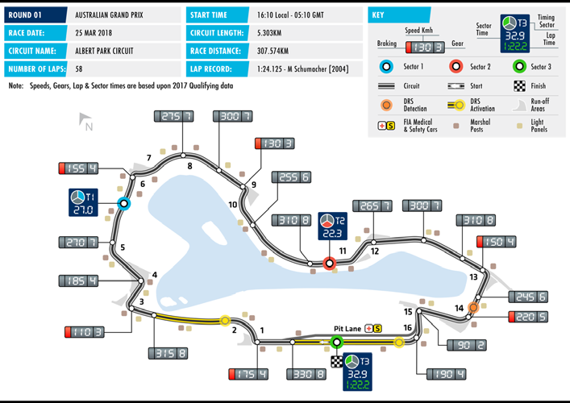

Melbourne’s Albert Park remains one of the most popular circuits with fans on the F1 calendar, offering a combination of long straights, sweeping curves and tight chicanes make it a welcome challenge for the drivers. The Australian Grand Prix is this season’s first round of the Formula 1 Championship, having held this distinction each year since the event moved to Melbourne in 1996, excluding 2006 and 2010.

24

FORMULA 1 2018 ROLEX AUSTRALIAN GRAND PRIX

RESULTS

Pos Driver Team Time / Retired Grid

1 Sebastian Vettel Scuderia Ferrari 1:29:33.283 3 Mercedes AMG Petronas 2 Lewis Hamilton +5.036s 1 Motorsport 3 Kimi Räikkönen Scuderia Ferrari +6.309s 2 4 Daniel Ricciardo Aston Martin Red Bull Racing +7.069s 8 5 Fernando Alonso McLaren F1 Team +27.886s 10 6 Max Verstappen Red Bull Toro Rosso Honda +28.945s 4 7 Nico Hulkenberg Renault Sport F1 Team +32.671s 7 Mercedes AMG Petronas 8 Valtteri Bottas +34.339s 15 Motorsport 9 Stoffel Vandoorne McLaren F1 Team +34.921s 11 10 Carlos Sainz Red Bull Toro Rosso Honda +45.722s 9 11 Sergio Perez Sahara Force India F1 Team +46.817s 12 12 Esteban Ocon Sahara Force India F1 Team +60.278s 14 13 Charles Leclerc Alfa Romeo Sauber F1 Team +75.759s 18 14 Lance Stroll Williams Martini Racing +78.288s 13 15 Brendon Hartley Red Bull Toro Rosso Honda +1 Lap 16 NC Romain Grosjean Haas F1 Team DNF 6 NC Kevin Magnussen Haas F1 Team DNF 5 NC Pierre Gasly Red Bull Toro Rosso Honda DNF 20 NC Marcus Ericsson Alfa Romeo Sauber F1 Team DNF 17 NC Sergey Sirotkin Williams Martini Racing DNF 19

Pole position Lewis Hamilton 1:21.164s Fastest lap Daniel Ricciardo 1:25.945s

25

FORMULA 1 2018 GULF AIR BAHRAIN GRAND PRIX SAKHIR Date 06 - 08 Apr Race distance 308.238 km Circuit length 5.412 km Number of laps 57

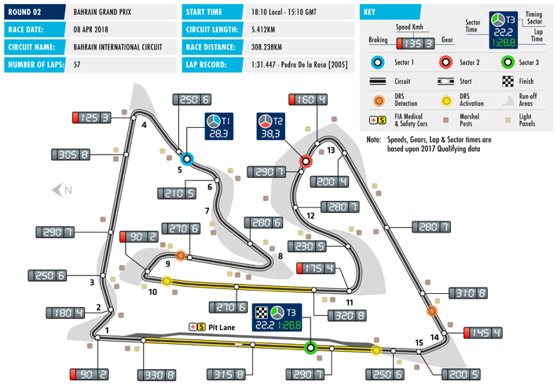

The Bahrain International Circuit has quickly become a popular host for world-class motor sport. Professional facilities and experienced staff has paved the way for numerous international race series to utilize the circuit, including: Formula 2 Championship and Porsche GT3 Cup.

26

FORMULA 1 2018 HEINEKEN CHINESE GRAND PRIX SHANGHAI Date 13 - 15 Apr Race distance 305.066 km Circuit length 5.451 km Number of laps 56

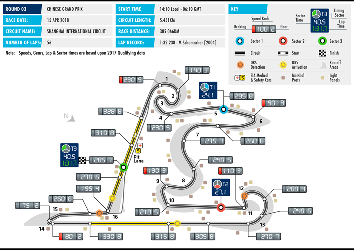

The Shanghai International Circuit boasts various winding turns and high-speed straights, demanding a great deal of acceleration and deceleration, while providing numerous overtaking opportunities.

27

FORMULA 1 2018 AZERBAIJAN GRAND PRIX BAKU Date 27 - 29 Apr Race distance 306.049km Circuit length 6.003 km Number of laps 51

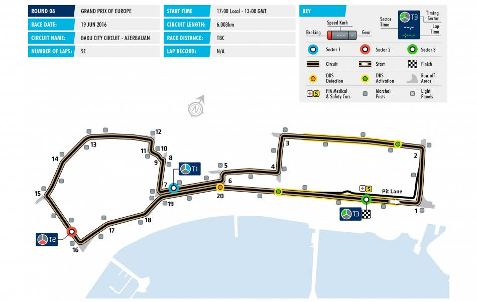

The six kilometre, anti-clockwise layout of the circuit was designed by circuit architect Hermann Tilke. The circuit starts adjacent to Azadliq Square, then loop around Government House before heading west to Maiden Tower. Here, the track has a narrow uphill traversal and then circle the Old City before opening up onto a 2.2 km (1.4 mi) stretch along Neftchilar Avenue back to the start line.

28

FORMULA 1 GRAND PRIX PREMIO DE ESPAÑA 2018 CATALUNYA Date 11 - 13 May Race distance 307.104 km Circuit length 4.655 km Number of laps 66

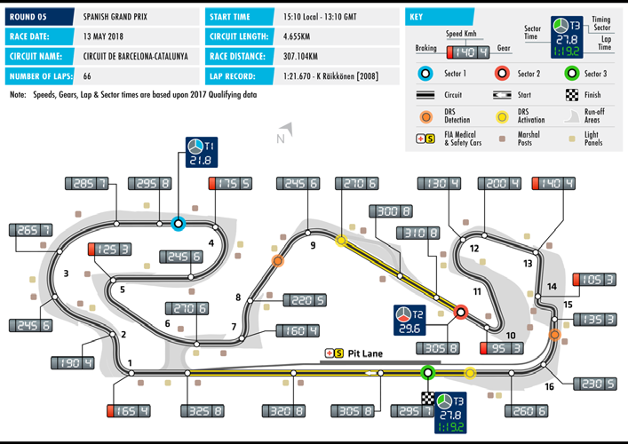

The Circuit de Catalunya was built in 1989 through the efforts of a Consortium composed of the Catalan Government, the Reial Automòbil Club de Catalunya (RACC) and the Montmeló Town Council. In September 1991, the 35th Spanish F1 Grand Prix was held following a seventeen-year of absence in Catalonia. Today, the circuit is a familiar site for teams and drivers as the track is used for extensive offseason testing. The circuit underwent resurfacing and track modifications over the winter.

29

FORMULA 1 GRAND PRIX DE MONACO 2018 MONTE CARLO Date 24 - 27 May Race distance 260.286 km Circuit length 3.337 km Number of laps 78

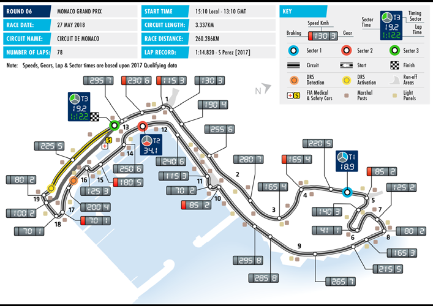

Monaco remains one of the most prestigious auto races in the world, long recognized for its entertainment and celebrity presence. Motorsports most famous street circuit takes six weeks to build up and organize, offering drivers with the challenge of negotiating numerous elevation shifts and very tight corners, including one of the slowest corners in F1 racing as well as one of the fastest. Due to its unique configuration, change in speeds and lack of straights, keeping the engine cool is a point of focus for the teams, as Formula One cars depend on air moving over the car to remove heat, and don’t use formal cooling technology.

30

FORMULA 1 HEINEKEN GRAND PRIX DU CANADA MONTREAL Date 08 - 10 Jun Race distance 305.270 km Circuit length 4.361 km Number of laps 70

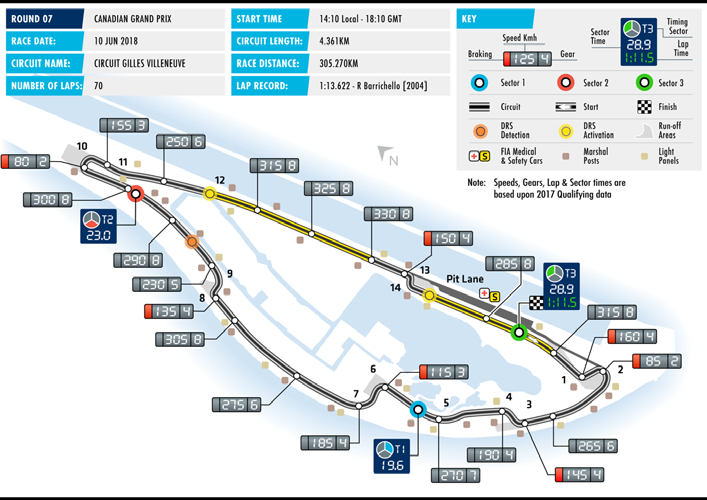

The circuit, on Ile Notre Dame, a man-made island on the St. Lawrence River, was renamed for Canadian Formula One driver Gilles Villenueve, following his death in 1982. 2006 saw the last occasion when US-based Champ Car and F1 ran on the same track. Formula One’s performance proved significantly better with a 5-to-7 second advantage both in terms of qualifying and recording of fastest lap times during the respective races. The Montreal Grand Prix continues to be tremendously popular with both teams and drivers, owing to its festive atmosphere.

31

FORMULA 1 GRAND PRIX DE FRANCE 2018 Le Castellet Date 22 - 24 Jun Race distance 5.861 km Circuit length 5.861 km Number of laps tbc

Today’s state-of-the-art venue can trace its F1 origins back to the early 1970s, when it held the first of its 14 French Grands Prix to date. After it saw its last F1 race in 1990 it underwent a transformation and was re-opened as the Paul Ricard High Tech Test Track in the beginning of the 21st century. Initially, as the new name suggests, it has been used exclusively for testing - its multi-configuration layout proved popular with F1 teams and set new standards in safety, pioneering the use of painted run-off areas instead of traditional gravel traps. In the lead up to its revival in F1, numerous modifications have been made to both the circuit and its setting to ensure a suitably challenge for the drivers and equally thrilling spectacle for race fans.

32

FORMULA 1 GROSSER PREIS VON ÖSTERREICH 2018 SPIELBERG Date 29 Jun - 01 Jul Race distance 306.452 km Circuit length 4.318 km Number of laps 71

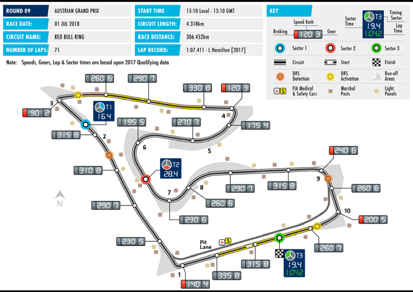

After its first Formula One race in 1970 the circuit previously known as the A1-Ring was removed from the F1 calendar in 2003. However, after its redevelopment and re-branding as the Red Bull Ring it was reopened in 2011 and celebrated its triumphant return in Formula One in 2014. It also hosts series including DTM, World Series by Renault and European Le Mans.

33

FORMULA 1 2018 ROLEX BRITISH GRAND PRIX SILVERSTONE Date 06 - 08 Jul Race distance 306.198 km Circuit length 5.891 km Number of laps 52

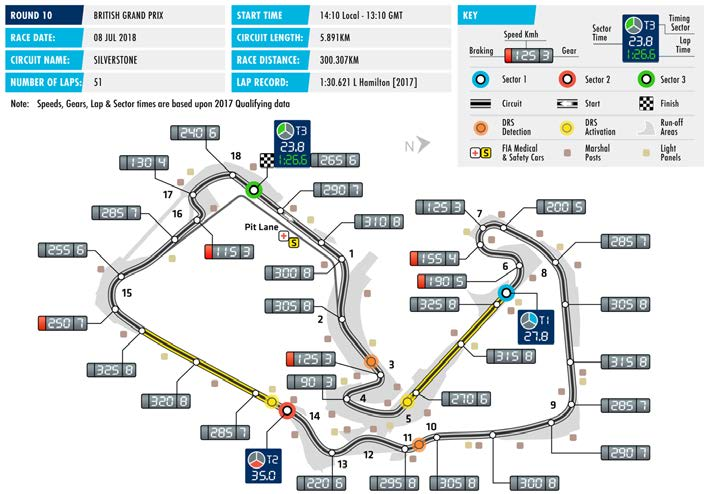

Silverstone continues to be a top draw for fans of Formula 1, offering a rich tradition of racing, a fast and challenging track, as well as the constant prospect of weather playing a critical role in race day strategy. Contracted to host F1 through 2027, Silverstone offers motorsport fans a wealth of viewing options staging events through the year, including British F3, Le Mans Series, and MotoGP, among others. The circuit has undergone major modifications and rebuilds, primarily in 1991 and most recently in 2010.

34

FORMEL 1 GROSSER PREIS VON DEUTSCHLAND 2018 HOCKENHEIM Date 20 - 22 Jul Race distance 306.458km Circuit length 4.574 km Number of laps 67

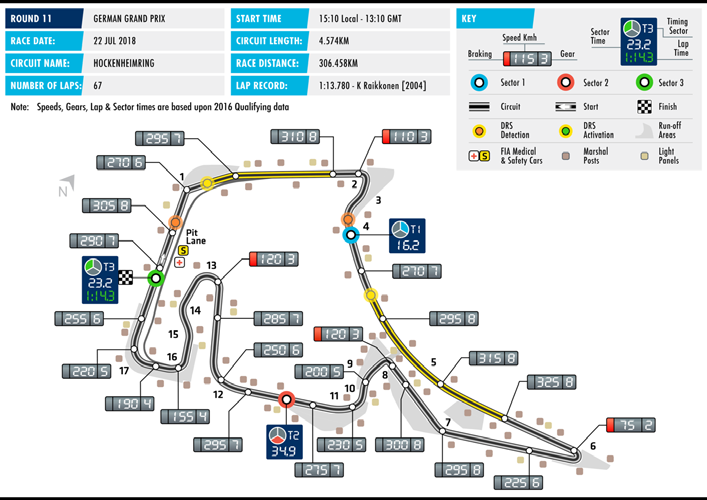

The Hockenheim Circuit hosted the German Grand Prix since 1970 when the F1 drivers decided to boycott the usual host circuit Nürburgring, unless major modifications were implemented. From 1977 to 2006, the Hockenheimring hosted the German Grand Prix with the lone exception being 1985. Between 2007-2014, the circuit alternated as a host of the German Grand Prix with the reconfigured Nürburgring. The Hockenheimring has a contract to host one more Formula 1 race in 2018.

35

FORMULA 1 MAGYAR NAGYDÍJ 2018 BUDAPEST Date 27 - 29 Jul Race distance 306.630 km Circuit length 4.381 km Number of laps 70

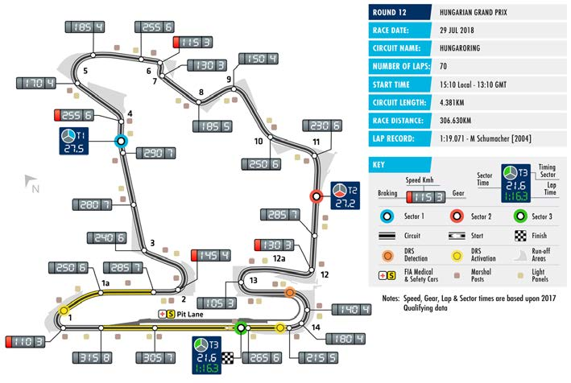

Home of the first Grand Prix to have been held behind the “Iron Curtain”, The Hungaroring was built in record time and remains today a major attraction in Hungary. Held in the summer, the circuit is built in a valley allowing excellent vantage points for spectators. The Grand Prix is popular with foreign fans from Germany, Austria and Poland.

36

FORMULA 1 2018 BELGIAN GRAND PRIX SPA – FRANCHORCHAMPS Date 24 - 26 Aug Race distance 308.052 km Circuit length 7.004 km Number of laps 44

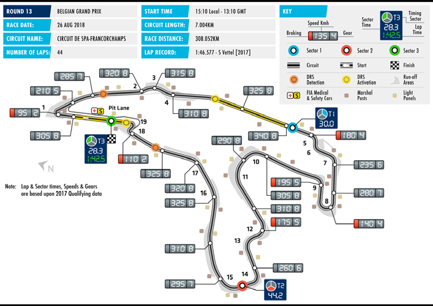

The Circuit de Spa-Francorchamps is legendary among race enthusiasts for its long-standing history and unique setting. It is considered one of the most challenging tracks in the world, mainly due to its fast, hilly and twisty layout within the Ardennes Forest. The circuit tests driver skills especially when trying to negotiate the Eau Rouge and Blanchimont corners. Designed originally in 1920, Spa-Francorchamps also plays host to a range of other race series including the Spa 24 Hours endurance race.

37

FORMULA 1 GRAND PREMIO HEINEKEN D’ITALIA 2018 MONZA Date 31 Aug - 02 Sep Race distance 306.720 km Circuit length 5.793 km Number of laps 53

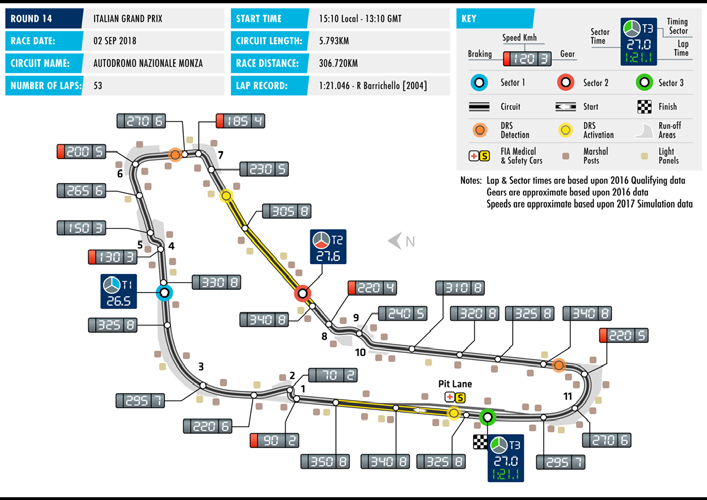

Monza has hosted the Italian Grand Prix since the inception of F1. A singular atmosphere with a dedicated following among the Italian “Tifosi”, Monza boasts some of the sport’s most famous turns, including Curva di Lesmo, and the Curva Parabolica, providing high speed thrills for both drivers and spectators.

38

FORMULA 1 2018 SINGAPORE GRAND PRIX SINGAPORE Date 14 - 16 Sep Race distance 308.828 km Circuit length 5.065 km Number of laps 61

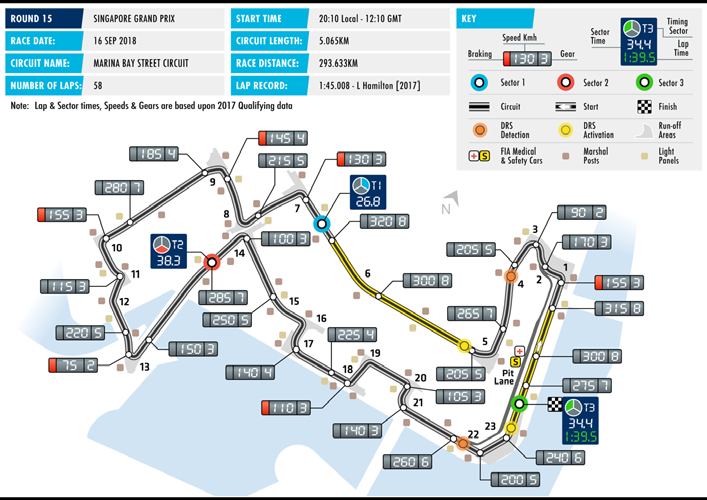

The Marina Bay Street Circuit plays host to the Singapore Grand Prix, Formula One’s first ever night race. Given its city setting, the circuit is popular with fans and teams for its easy access, allowing many of the drivers and engineers to simply walk from their hotels to the circuit. Drivers must negotiate tight racing lines, adjust to driving at night under a vast and sophisticated lighting system, and ensure their fitness to deal with the high levels of humidity.

39

FORMULA 1 2018 VTB RUSSIAN GRAND PRIX SOCHI Date 28 – 30 Sep Race distance 309.745 km Circuit length 5.848 km Number of laps 53

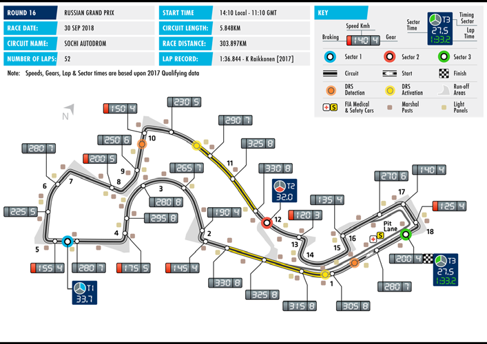

Sochi Autodrom circuit is located in the Black Sea resort of the same name. Sochi is the first purpose-built Formula One facility in Russia and hosted the country’s inaugural Grand Prix in October 2014, in the same year that the city also staged the Winter Olympics. The circuit which runs in a clockwise direction, consists of 12 right- and six left-hand corners, and combines both high-speed and technical sections. The track width varies from 13 meters at its narrowest point to 15 meters at the start-finish line.

40

FORMULA 1 2018 JAPANESE GRAND PRIX SUZUKA Date 05 - 07 Oct Race distance 307.471 km Circuit length 5.807 km Number of laps 53

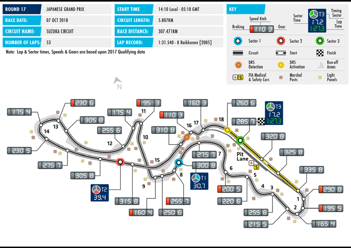

Designed as a Honda test track in 1962, the circuit is another of the racer’s favourite, featuring some of the most challenging corners. Among the most popular are the high-speed 130R and the famous Spoon Curve. Its "figure-of-eight" layout also makes the track unique in F1 racing, where the back straight passes over the front via an overpass.

41

FORMULA 1 2018 UNITED STATES GRAND PRIX AUSTIN Date 19 - 21 Oct Race distance 308.405 km Circuit length 5.513 km Number of laps 56

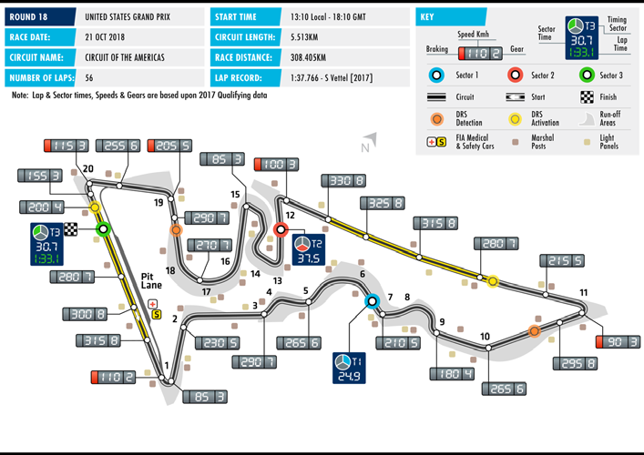

In 2012 The United States Grand Prix returned to the F1 calendar at Austin, Texas, the first Grand Prix on US soil since the 2007 race at the Indianapolis Motor Speedway. The track runs anticlockwise and features 20 corners, including sequences inspired by some of the world’s most celebrated circuits.

42

FORMULA 1 GRAN PREMIO DE MÉXICO 2018 MEXICO CITY Date 26 - 28 Oct Race distance 305.354 km Circuit length 4.304 km Number of laps 71

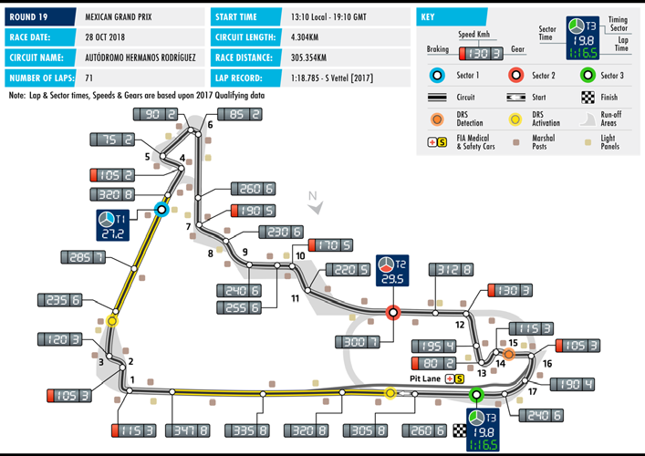

Returning to the F1 fold in in 2015. the Autodromo Hermanos Rodriguz circuit is situated in the center of Mexico City having not held a Formula One Grand Prix since 1992. The facility has been comprehensively upgraded, while the entire track was resurfaced for the occasion and changes made to a number of corners including Peraltada. It has been a huge success since its return delivering three sold out races in succession and winning the FIA Best Promoter trophy every year in the process.

43

FORMULA 1 GRANDE PRÊMIO DO BRASIL 2018 SAO PAULO Date 09 - 11 Nov Race distance 305.909 km Circuit length 4.309 km Number of laps 71

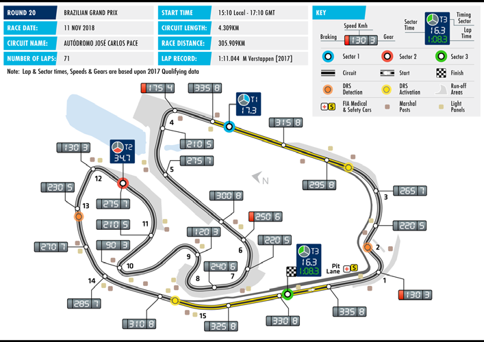

Located in Sao Paulo, Interlagos includes the Autodromo Jose Carlos Pace racetrack, home to the Brazilian Grand Prix. The Interlagos circuit has played host to some of the most exciting and memorable races in recent Formula One history, including Lewis Hamilton winning the World Championship on the last lap of the 2008 race. Regarded as one of the most challenging circuits in Grand prix racing, Alain Prost still holds the record with six victories in Brazil. Although there has been no Brazilian world champion since Senna’s death, the passion of the Brazilian fans keep the sport coming back every year.

44

FORMULA 1 2018 ETIHAD AIRWAYS ABU DHABI GRAND PRIX YAS MARINA Date 23 - 25 Nov Race distance 305.355km Circuit length 5.554 km Number of laps 55

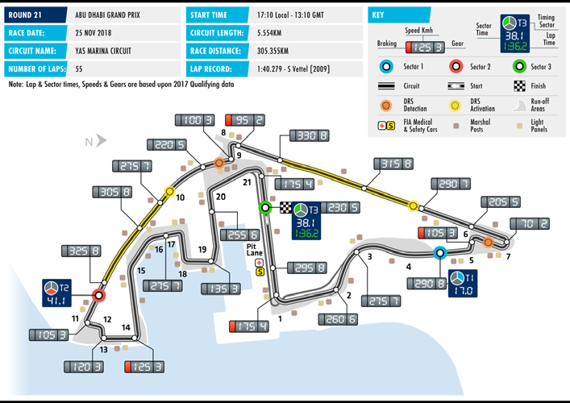

The Abu Dhabi Grand Prix located on Yas Island, is Formula One’s first ever day-night race, with a local start time of 17:10. Floodlights are activated from the start of the race to provide a transition into the evening. It has been the final race of the calendar for the past five seasons.

45

2018 FIA FORMULA 1 WORLD CHAMPIONSHIP™ – TEAM INFORMATION

MERCEDES AMG PETRONAS MOTORSPORT

Headquarters Operations Centre Telephone +44 (0)1280 844 000 Brackley Fax +44 (0) 1280 844 001 NN13 7BD Website www.mercedesAMGF1.com England

Non-Executive Chairman Niki Lauda Team Principal & CEO Toto Wolff Technical Director James Allison MD of Mercedes AMG Andy Cowell High Performance Powertrains

Media Contacts:

Communications Bradley Lord Director Mob: + 44 (0)7785 682 893 Email: blord@mercedesamgf1.com

Head of Media Felix Siggemann Relation Mob: + 44 (0)7864 609 468 Email: fsiggemann@mercedesamgf1.com

Media Officer Rosa Herrero Venegas Mob: +44 7469 353 191 Email: rherrerovenegas@mercedesamgf1.com

Formula 1 Debut 1954 Chassis Mercedes-AMG F1 W09 EQ Power+ Constructors’ Titles 4 Power Unit Mercedes-AMG F1 M09 EQ Power+ GP Starts 170 GP Wins 76 Fastest Laps 56 Pole Positions 89 Total Points 3740

LEWIS HAMILTON VALTTERI BOTTAS 44 77

Date of Birth 07/01/1985 Date of Birth 28/08/1989 Formula 1 Debut 2007 Formula 1 Debut 2013 GP Starts 209 GP Starts 98 GP Wins 62 GP Wins 3 Pole Positions 73 Pole Positions 4 Podiums 118 Podiums 22 F1 Titles 4 F1 Titles N/A Total F1 Points 2628 Total F1 Points 991

46

SCUDERIA FERRARI

Headquarters Ferrari S.p.A. Telephone +39 536 949 111 Via Ascari 55-57 Fax +39 536 949 049 41053 Maranello Website www.ferrari.com Field Code Changed Italy

MD & Team Principal Maurizio Arrivabene Chief Designer Simone Resta Chief Technical Officer Mattia Binotto

Media Contact:

Alberto Antonini Mob: +39 344 0556 635 Email: Alberto.Antonini@ferrari.com Field Code Changed

Formula 1 Debut 1950 Chassis SF71H Constructors’ Titles 16 Power unit Ferrari GP Starts 953 GP Wins 231 Fastest Lap 243 Pole Positions 214 Total Points 7870.5

SEBASTIAN VETTEL KIMI RÄIKKÖNEN 5 7

Date of Birth 03/07/1987 Date of Birth 17/10/1979 Formula 1 Debut 2007 Formula 1 Debut 2001 GP Starts 200 GP Starts 274 GP Wins 48 GP Wins 20 Pole Positions 50 Pole Positions 17 Podiums 99 Podiums 92 F1 Titles 4 F1 Titles 1 Total F1 Points 2450 Total F1 Points 1580

47

WILLIAMS MARTINI RACING

Headquarters Grove, Wantage Telephone +44 (0)1235 777 700 Oxfordshire Fax +44 (0)1235 777 960 OX12 0DQ Website www.williamsf1.com England

Team Principal Sir Frank Williams Team Manager Dave Redding CTO Paddy Lowe Head of Performance Rob Smedley Deputy Claire Williams Engineering Team Principal Chief Designer Ed Wood

Media Contacts:

Head of F1 Communications Sophie Ogg Mob: +44 (0)7977 275762 Email: Sophie.Ogg@williamsf1.com

Formula 1 Debut 1977 Chassis Williams FW41 Constructors’ Titles 9 Motor Mercedes GP Starts 691 GP Wins 114 Fastest Laps 133 Pole Positions 128 Total Points 3547

LANCE STROLL SERGEY SIROTKIN 18 35

Date of Birth 29/10/1998 Date of Birth 25/08/1995 Formula 1 Debut 2017 Formula 1 Debut 2018 GP Starts 21 GP Starts 1 GP Wins N/A GP Wins N/A Pole Positions N/A Pole Positions N/A Podiums 1 Podiums N/A F1 Titles N/A F1 Titles N/A Total F1 Points 40 Total F1 Points N/A

48

ASTON MARTIN RED BULL RACING

Headquarters Bradbourne Drive Telephone +44 (0)1908 279700 Tilbrook Fax +44 (0)1908 279810 Milton Keynes Website www.redbullracing.com MK7 8BJ, England

Team Principal Christian Horner OBE Chief Engineering Officer Rob Marshall

Chief Technical Adrian Newey OBE Chief Engineer, Dan Fallows Officer Aerodynamics

Chief Engineer, Paul Monaghan Chief Engineer, Pierre Waché Car Engineering Car Performance

Media Contacts: Head of Ben Wyatt Communications Mob: +44 (0)7771 854238 Email: ben.wyatt@redbullracing.com

Communications Manager Victoria Lloyd :Mob: +44 (0)7712 41 4196 Email: Victoria.lloyd@redbullracing.com James Ranson :Mob: +44 (0)7834 52 6354 Email: james.ranson@redbullracing.com Field Code Changed

Formula 1 Debut 2005 Chassis RB14 Constructors’ Titles 4 Motor TAG Heuer GP Starts 246 GP Wins 55 Fastest Laps 55 Pole Positions 58 Total Points 3908.5

MAX VERSTAPPEN 33 DANIEL RICCIARDO 03

Date of Birth 30/09/1997 Date of Birth 01/07/1989 Formula 1 Debut 2014 Formula 1 Debut 2011 GP Starts 61 GP Starts 130 GP Wins 3 GP Wins 5 Pole Positions N/A Pole Positions 1 Podiums 11 Podiums 27 F1 Titles N/A F1 Titles N/A Total F1 Points 429 Total F1 Points 828

49

SAHARA FORCE INDIA F1 TEAM

Headquarters Dadford Road Telephone +44 (0)1327 850 800 Silverstone Fax +44 (0)1327 857 993 NN12 8TJ Website www.forceindiaf1.com England

Team Chief Dr. Vijay Mallya Deputy Team Robert Fernley Principal Technical Chief Andrew Green Chief Operating Otmar Szafnauer Officer Sporting Director Andy Stevenson Chief Race Engineer Tom McCullough

Media Contacts Head of Will Hings Communications Mob: +44 (0)7734 202020 Email: will.hings@forceindiaf1.com

Formula 1 Debut 2008 Chassis Force India VJM11 Constructors’ Titles N/A Motor Mercedes GP Starts 193 GP Wins N/A Fastest Laps 5 Pole Positions 1 Total Points 987

SERGIO PEREZ Esteban Ocon 11 31

Date of Birth 26/01/1990 Date of Birth 17/09/1996 Formula 1 Debut 2011 Formula 1 Debut 2016 GP Starts 137 GP Starts 30 GP Wins N/A GP Wins N/A Pole Positions N/A Pole Positions N/A Podiums 7 Podiums N/A F1 Titles N/A F1 Titles N/A Total F1 Points 467 Total F1 Points 87

50

RED BULL TORO ROSSO HONDA

Headquarters Via Boaria, 229 Telephone +39 (0)546 696 111 48018 Faenza RA Fax +39 (0)546 620 998 Italy Website www.tororosso.com

Team Principal Franz Tost Team Manager Graham Watson Technical Director James Key

Media Contacts

Head of Fabiana Valenti Communications Mob: +39 335 7113 694 Email: fabiana.valenti@tororosso.com

Press Officer Jennifer Seeber Mob: +39 348 6095017 Email: Jennifer.seeber@tororosso.com

Formula 1 Debut 2006 Chassis STR13 Constructors’ Titles N/A Motor Honda GP Starts 228 GP Wins 1 Fastest Laps 1 Pole Positions 1 Total Points 382

PIERRE GASLY BRENDON HARTLEY 10 28

Date of Birth 07/02/1996 Date of Birth 10/11/1989 Formula 1 Debut 2017 Formula 1 Debut 2017 GP Starts 6 GP Starts 5 GP Wins N/A GP Wins N/A Pole Positions N/A Pole Positions N/A Podiums N/A Podiums N/A F1 Titles 0 F1 Titles N/A Total F1 Points 0 Total F1 Points 0

51

ALFA ROMEO SAUBER F1 TEAM

Headquarters Wildbachstrasse 9 Telephone +41 44 973 9000 8340 Hinwil Fax +44 44 973 9001 Switzerland Website www.sauberf1team.com

Team Principal Frédéric Vasseur Chief Designer Eric Gandelin/ Luca Furbatto Technical Director Jörg Zander Head of Nicolas Hennel Aerodynamics

Media Contacts

Head of Maria Guidotti; maria.guidotti@sauber-motorsport.com Communications

Formula 1 Debut 1993 Chassis Sauber C37 Constructors’ Titles 0 Motor Ferrari GP Starts 466 GP Wins 1 Fastest Laps 5 Pole Positions 1 Total Points 817

MARCUS ERICSSON CHARLES LECLERC 09 16

Date of Birth 02/09/1990 Date of Birth 16/10/1997 Formula 1 Debut 2014 Formula 1 Debut 2018 GP Starts 77 GP Starts 1 GP Wins N/A GP Wins N/A Pole Positions N/A Pole Positions N/A Podiums N/A Podiums N/A F1 Titles N/A F1 Titles N/A Total F1 Points 9 Total F1 Points 0

52

MCLAREN TEAM

Headquarters McLaren Telephone +44 (0) 1483 261 900 Technology Centre Fax +44 (0) 1483 261 963 Chertsey Road Website www.mclaren.com Woking, Surrey GU21 4YH, England

Executive Director, McLaren Technology Group Zak Brown Chief Operating Officer, McLaren Technology Group Jonathan Neale Racing Director Eric Boullier Chief Technical Officer - Chassis Tim Goss Team Manager Paul James

Media Contacts Group Communications Director Tim Bampton; Mob: +44 (0)7468 714614 Email : tim.bampton@mclaren.com Head of Media and Steve Cooper; Mob: +44(0)78 8142 6460 Creative content Email: steve.cooper@mclaren.com Press Office Manager Silvia Hoffer; Mob: +44(0)75 8421 8639 Email: silvia.hoffer@mclaren.com PR & Media Manager Charlotte Sefton; Mob: +44(0)7500065321 Email: Charlotte.sefton@mclaren.com

Formula 1 Debut 1966 Chassis MCL33 Constructors’ Titles 8 Motor Renault GP Starts 823 GP Wins 182 Fastest Laps 154 Pole Positions 155 Total Points 5158.5

FERNANDO ALONSO STOFFEL VANDOORNE 14 02

Date of Birth 29/07/1981 Date of Birth 26/03/1992 Formula 1 Debut 2001 Formula 1 Debut 2016 GP Starts 291 GP Starts 22 GP Wins 32 GP Wins N/A Pole Positions 22 Pole Positions N/A Podiums 97 Podiums N/A F1 Titles 2 F1 Titles N/A Total F1 Points 1859 Total F1 Points 16

53

HAAS F1 TEAM

Headquarters Kannapolis Telephone + 1 704-652-4872 North Carolina USA Website www.haasf1team.com

Team Principal Gunther Steiner Chief Operating Officer Joe Custer Team Manager Pete Crolla Chief Race Engineer Ayao Komatsu Technical Director Rob Taylor Chief Aerodynamic Ben Agathangelou

Media Contacts

Head of Mike Arning Communications Mob: +1 704 875 3388 Ext. 802 Email: marning@haasf1team.com Field Code Changed

Senior Press Officer Stuart Morrison Mob: +44 1295 237112 Email: smorrison@haasf1team.com

Formula 1 Debut 2016 Chassis Haas VF-18 Constructors’ Titles N/A Motor Ferrari 062 GP Starts 43 GP Wins N/A Fastest Laps N/A Pole Positions N/A Total Points 76

ROMAIN GROSJEAN KEVIN MAGNUSSEN 08 20

Date of Birth 17/04/1986 Date of Birth 05/10/1992 Formula 1 Debut 2009 Formula 1 Debut 2014 GP Starts 123 GP Starts 61 GP Wins N/A GP Wins N/A Pole Positions N/A Pole Positions N/A Podiums 10 Podiums 1 F1 Titles N/A F1 Titles N/A Total F1 Points 344 Total F1 Points 81

54

RENAULT SPORT FORMULA ONE TEAM

Headquarters Whiteways Telephone +44 (0)1608 678 000 Technical Centre Fax +44 (0)1608 678 609 Enstone Website www.renaultsport.com OX7 4EE, England

Managing Director Cyril Abiteboul Chief Technical Officer Bob Bell Chassis Technical Nick Chester Engine Technical Rémi Taffin Director Director

Media Contacts Head of Andy Stobart Communications Mob +44 (0)7703 36615; andy.stobart@uk.renaultsportf1.com Media Communi- Aurelie Donzelot cations Manager Mob +44 (0)7825 938476; aurelie.donzelot@uk.renaultsportf1.com

Lucy Genon Formatted: French (France) Mob +33 6 11 71 61 78; lucy.genon@uk.renaultsportracing.com Formatted: English (United States) Formatted: English (United States) Formula 1 Debut 1977 Chassis R.S.18 Constructors’ Titles 2 Motor Renault Formatted: English (United States) GP Starts 343 GP Wins 35 Fastest Laps 31 Pole Positions 51 Total Points 1390

NICO HÜLKENBERG CARLOS SAINZ 27 55

Date of Birth 19/08/1987 Date of Birth 01/09/1994 Formula 1 Debut 2010 Formula 1 Debut 2015 GP Starts 136 GP Starts 61 GP Wins N/A GP Wins N/A Pole Positions 1 Pole Positions N/A Podiums N/A Podiums N/A F1 Titles N/A F1 Titles N/A Total F1 Points 411 Total F1 Points 119

55

2018 FIA FORMULA 1 WORLD CHAMPIONSHIP™ – STATISTICAL DATA

2018 POLE POSITION/WINNER/FASTEST LAPS GP POLE POSITION WINNER FASTEST LAP Australia Lewis Hamilton Sebastian Vettel Daniel Ricciardo

2018 TEAM STANDING TO DATE

| TEAM |  | AUSTRALIA |  | TOTAL |
| --- | --- | --- | --- | --- |
| S | cuderia Ferrari | 40 | 40 | 40 |

Mercedes AMG Petronas Motorsport 22 22

Aston Martin Red Bull Racing 20 20

McLaren F1 Team 12 12

Renault Sport Formula One Team 7 7

Sahara Force India F1 Team 0 0

Alfa Romeo Sauber F1 Team 0 0

Williams Martini Racing 0 0

Red Bull Toro Rosso Honda 0 0

Haas F1 Team 0 0

56

2018 FIA FORMULA 1 WORLD CHAMPIONSHIP™ – STATISTICAL DATA CONT…

2018 DRIVERS STANDING TO DATE DRIVER AUSTRALIA TOTAL

Sebastian Vettel 25 25

Lewis Hamilton 18 18

Kimi Räikkonen 15 15

Daniel Ricciardo 12 12

Fernando Alonso 10 10

Max Verstappen 8 8

Nico Hulkenberg 6 6

Valtteri Bottas 4 4

Stoffel Vandoorne 2 2

Carlos Sainz 0 4

Sergio Perez 1 1

Esteban Ocon 0 0

Charles Leclerc 0 0

Lance Stroll 0 0

Brendon Hartley 0 0

Kevin Magnussen 0 0

Pierre Gasly 0 0

Marcus Ericsson 0 0

Romain Grosjean 0 0

Sergey Sirotkin 0 0

57

STATISTICAL HISTORY – BAHRAIN GRAND PRIX PREVIOUS WINNERS 2004-2017

Year Winner Pole Fastest Lap 2004 Michael Schumacher Michael Schumacher Michael Schumacher 2005 Fernando Alonso Fernando Alonso Pedro de la Rosa 2006 Fernando Alonso Michael Schumacher Nico Rosberg 2007 Felipe Massa Felipe Massa Felipe Massa 2008 Felipe Massa Robert Kubica Heikki Kovalainen 2009 Jenson Button Jarno Trulli Jarno Trulli 2010 Fernando Alonso Sebastian Vettel Fernando Alonso 2011 N.A N.A N.A 2012 Sebastian Vettel Sebastian Vettel Sebastian Vettel 2013 Sebastian Vettel Nico Rosberg Sebastian Vettel 2014 Lewis Hamilton Nico Rosberg Nico Rosberg 2015 Lewis Hamilton Lewis Hamilton Kimi Räikkonen 2016 Nico Rosberg Lewis Hamilton Nico Rosberg 2017 Sebastian Vettel Valtteri Bottas Lewis Hamilton

58

STATISTICAL HISTORY – BAHRAIN GRAND PRIX DRIVER HISTORY 2004 – 2017

|  |  |  |  | 2007 |  |  |  |  |  |  |  |  |  |  |
| --- | --- | --- | --- | --- | --- | --- | --- | --- | --- | --- | --- | --- | --- | --- |
| Driver | 2004 | 2005 | 2006 |  | 2008 | 2009 | 2010 | 2012 | 2013 | 2014 | 2015 | 2016 | 2 | 017 |

Sebastian Vettel - - - - DNF 2nd 4th 1st 1st 6th 5th NC 1st Daniel Ricciardo - - - - - - - 15th 16th 4t h 6th 4th 5th Fernando Alonso 6th 1st 1st 5th 10th 8th 1st 7th 8th 9th 11th - DNF Kimi Räikkonen DNF 3rd 3rd 3rd 2nd 6th - 2nd 2nd 10th 2nd 2nd 4th Jenson Button 3rd DNF 4th DNF DNF 1st 7th 18th 10th 17th DNF NC -

|  |  |  |  |  |  |  |  |  |  |  | - | 11th | DNF |
| --- | --- | --- | --- | --- | --- | --- | --- | --- | --- | --- | --- | --- | --- |
| Kevin Magnussen | - | - | - | - | - | - | - | - | - | DNF |  |  |  |

Pastor Maldonado - - - - - - - DNF 11th 14th 15th - - Romain Grosjean - - - - - - - 3rd 3rd 12th 7th 5th 8th Nico Rosberg - - 7th 10th 8th 9th 5th 5th 9th 2nd 3rd 1st - Lewis Hamilton - - - 2nd 13th 4th 3rd 8th 5th 1st 1st 3rd 2nd Adrian Sutil - - - 15th 19th 16th 12th - 13th DNF - - - Esteban Gutierrez - - - - - - - - 18th DNF - NC - Sergio Perez - - - - - - - 11th 6th 3rd 8th 16th 7th Nico Hulkenberg - - - - - - 14th 12th 12th 5th 13th 15th 9th Felipe Massa 12th 7th 9th 1st 1st 14th 2nd 9th 15th 7th 10th 8th 6th Valtteri Bottas - - - - - - - - 14th 8th 4th 9th 3rd Jean-Eric Vergne - - - - - - - 14th DNF DNF - - - Daniil Kvyat - - - - - - - - - 11th 9th 7th 12th Kamui Kobayashi - - - - - - DNF 13th - 15th - - -

| Marcus Ericsson | - | - | - | - | - | - | - | - | - | DNF | 14th | 12th | DNF |
| --- | --- | --- | --- | --- | --- | --- | --- | --- | --- | --- | --- | --- | --- |
| Jules Bianchi | - | - | - | - | - | - | - | - | 19th | 16th | - | - | - |
| Max Chilton | - | - | - | - | - | - | - | - | 20th | 13th | - | - | - |

Felipe Nasr - - - - - - - - - - 12th 14th 14th Will Stevens - - - - - - - - - - 16th - - Roberto Merhi - - - - - - - - - - 17th - - Max Verstappen - - - - - - - - - - 18th 6th DNF Carlo Sainz Jnr - - - - - - - - - - 19th NC DNF Stoffel Vandoorne - - - - - - - - - - - 10th DNS Pascal Wehrlein - - - - - - - - - - - 13th 11th

|  |  |  |  |  |  |  |  |  |  |  | - | 17th | - |
| --- | --- | --- | --- | --- | --- | --- | --- | --- | --- | --- | --- | --- | --- |
| Rio Haryanto | - | - | - | - | - | - | - | - | - | - |  |  |  |

Esteban Ocon - - - - - - - - - - - - 10th

59

STATISTICAL HISTORY – BAHRAIN GRAND PRIX DRIVER HISTORY 2004 – 2017 Cont…

Driver 2004 2005 2006 2007 2008 2009 2010 2012 2013 2014 2015 2016 2017 Joylon Palmer - - - - - - - - - - - DNS 13th Lance Stroll - - - - - - - - - - - - DNF

STATISTICAL HISTORY – 2017 FORMULA 1 GULF AIR BAHRAIN GRAND PRIX RESULTS

Pos Driver Team Time / Retired Grid

1 Sebastian Vettel Scuderia Ferrari 1:33:53.374 3 2 Lewis Hamilton Mercedes AMG Petronas F1 Team +6.660s 2 3 Valtteri Bottas Mercedes AMG Petronas F1 Team +20.397s 1 4 Kimi Räikkonen Scuderia Ferrari +22.475s 5 5 Daniel Ricciardo Red Bull Racing +39.346s 4 6 Felipe Massa Williams Martini Racing +54.326s 8 7 Sergio Perez Sahara Force India F1 Team +62.606s 18 8 Romain Grosjean Haas F1 Team +74.865s 9 9 Nico Hulkenberg Sahara Force India F1 Team +80.188s 7 10 Esteban Ocon Sahara Force India F1 Team +95.711s 14 11 Pascal Wehrlein Sauber Ferrari +1 Lap 13 12 Daniil Kvyat Red Bull Racing +1 Lap 11 13 Jolyon Palmer Renault Sport Formula One Team +1 Lap 10 14 Fernando Alonso McLaren Honda DNF 15 NC Marcus Ericsson Sauber Ferrari DNF 19 NC Carlos Sainz Renault Sport Formula One Team DNF 16 NC Lance Stroll Williams Martini Racing DNF 12 NC Max Verstappen Scuderia Toro Rosso DNF 6 NC Kevin Magnussen Renault Sport Formula One Team DNF 20 NC Stoffel Vandoorne McLaren Honda F1 Team DNF 17

Pole position Valtteri Bottas 1:28.769 Fastest lap Lewis Hamilton 1:32.798

60

STATISTICAL HISTORY – 2017 DRIVERS & CONSTRUCTORS CLASSIFICATIONS

| Pos | Driver | Points | Pos 1 Mercedes AMG Petronas F1 668 | Team | Poin | ts |
| --- | --- | --- | --- | --- | --- | --- |
| 2 | Sebastian Vettel | 317 | 2 3 Red Bull Racing Tag Heuer 368 | Scuderia Ferrari | 522 |  |
| 4 | Kimi Räikkonen | 205 | 4 5 Williams Martini Racing 83 | Sahara Force India F1 Team | 187 |  |
| 6 | Max Verstappen | 168 | 6 7 Scuderia Toro Rosso 53 | Renault | 57 |  |
| 8 | Esteban Ocon | 87 | 8 9 McLaren Honda 30 | Haas Ferrari | 47 |  |
| 10 | Nico Hulkenberg | 43 | 10 | Sauber Ferrari | 5 |  |
| 12 | Lance Stroll | 40 |  |  |  |  |
| 14 | Kevin Magnussen | 19 |  |  |  |  |
| 16 | Stoffel Vandoorne | 13 |  |  |  |  |
| 18 | Pascal Wehrlein | 5 |  |  |  |  |
| 20 | Marcus Ericsson | 0 |  |  |  |  |
| 22 | Antonio Giovinazzi | 0 |  |  |  |  |

61

STATISTICAL HISTORY – 2017 FIA FORMULA 1 WORLD CHAMPIONSHIP™ WINNERS RESULTS

GRAND PRIX DATE DRIVER TEAM TIME

Australia 26 Mar Sebastian Vettel Scuderia Ferrari 1:24:11.672

China 09 Apr Lewis Hamilton Mercedes AMG Petronas 1:37:36.158

Bahrain 16 Apr Sebastian Vettel Scuderia Ferrari 1:33:53.374

Russia 30 Apr Valtteri Bottas Mercedes AMG Petronas 1:28:08.743

Spain 14 May Lewis Hamilton Mercedes AMG Petronas 1:35:56.497

Monaco 28 May Sebastian Vettel Scuderia Ferrari 1:44:44.340

Canada 11 Jun Lewis Hamilton Mercedes AMG Petronas 1:33:05.154

Azerbaijan 25 Jun Daniel Ricciardo Red Bull Racing Tag Heuer 2:03:55.573

Austria 09 Jul Valtteri Bottas Mercedes AMG Petronas 1:21:48.523

Great Britain 16 Jul Lewis Hamilton Mercedes AMG Petronas 1:21:27.430

Hungary 30 Jul Sebastian Vettel Scuderia Ferrari 1:39:46.713

Belgium 27 Aug Lewis Hamilton Mercedes AMG Petronas 1:24:42.820

Italy 03 Sep Lewis Hamilton Mercedes AMG Petronas 1:15:32.312

Singapore 17 Sep Lewis Hamilton Mercedes AMG Petronas 2:03:23.544

Malaysia 01 Oct Max Verstappen Red Bull Racing Tag Heuer 1:30:01.290

Japan 08 Oct Lewis Hamilton Mercedes AMG Petronas 1:27:31.194

United States 22 Oct Lewis Hamilton Mercedes AMG Petronas 1:33:50.991

Mexico 29 Oct Max Verstappen Red Bull Racing Tag Heuer 1:36:26.552

Brazil 12 Nov Sebastian Vettel Scuderia Ferrari 1:31:26.262

Abu Dhabi 26 Nov Valtteri Bottas Mercedes AMG Petronas 1:34:14.062

62

HISTORY BOOK – FIGURES/FACTS/STATISTICS

DRIVER WORLD CHAMPIONS 2017 – 1982 (*not including/including deleted points)

Year Driver Nat. Team Points Wins Poles 2017 Lewis Hamilton GBR Mercedes AMG Petronas F1 363 9 11 2016 Nico Rosberg GER Mercedes AMG Petronas F1 385 9 8 2015 Lewis Hamilton GBR Mercedes AMG Petronas F1 381 10 11 2014 Lewis Hamilton GBR Mercedes AMG Petronas F1 384 11 7 2013 Sebastian Vettel GER RBR-Renault 397 13 9 2012 Sebastian Vettel GER RBR-Renault 281 5 6 2011 Sebastian Vettel GER RBR-Renault 392 11 15 2010 Sebastian Vettel GER RBR-Renault 256 5 10 2009 Jenson Button GBR Brawn Mercedes 95 6 6 2008 Lewis Hamilton GBR McLaren Mercedes 98 5 7 2007 Kimi Räikkönen FIN Ferrari 110 6 3 2006 Fernando Alonso ESP Renault 134 7 6 2005 Fernando Alonso ESP Renault 133 7 6 2004 Michael Schumacher GER Ferrari 148 13 8 2003 Michael Schumacher GER Ferrari 93 6 5 2002 Michael Schumacher GER Ferrari 144 11 9 2001 Michael Schumacher GER Ferrari 123 9 11 2000 Michael Schumacher GER Ferrari 108 9 9 1999 Mika Häkkinen FIN McLaren Mercedes 76 5 11 1998 Mika Häkkinen FIN McLaren Mercedes 100 8 9 1997 Jacques Villeneuve CAN Williams Renault 81 7 10 1996 Damon Hill GBR Williams Renault 97 8 9 1995 Michael Schumacher GER Benetton Renault 102 9 4 1994 Michael Schumacher GER Benetton Ford 92 8 6 1993 Alain Prost FRA Williams Renault 99 7 13 1992 Nigel Mansell GBR Williams Renault 108 9 14 1991 Ayrton Senna BRA McLaren Honda 96 7 8 1990 Ayrton Senna BRA McLaren Honda 78 6 10 1989 Alain Prost FRA McLaren Honda 76/81 * 4 2 1988 Ayrton Senna BRA McLaren Honda 90/94 * 8 13 1987 Nelson Piquet BRA Williams Honda 73/76 * 3 4 1986 Alain Prost FRA McLaren TAG Porsche 72/74 * 4 1 1985 Alain Prost FRA McLaren TAG Porsche 73/76 * 5 2 1984 Niki Lauda AUT McLaren TAG Porsche 72 5 0 1983 Nelson Piquet BRA Brabham BMW 59 3 1 1982 Keke Rosberg FIN Williams Ford 44 1 1

63

DRIVERS WORLD CHAMPIONS 1981 – 1950 (*not including / including deleted points)

Year Driver Nat. Team Points Wins Poles 1981 Nelson Piquet BRA Brabham 50 3 4 1980 Alan Jones AUS Williams 67 5 3 1979 Jody Scheckter S Ferrari 51 3 1 1978 Mario Andretti USA Lotus Ford 64 6 8 1977 Niki Lauda AUT Ferrari 72 3 2 1976 James Hunt GBR McLaren Ford 69 6 8 1975 Niki Lauda AUT Ferrari 64.5 5 9 1974 Emerson Fittipaldi BRA McLaren Ford 55 3 2 1973 Jackie Stewart GBR Tyrrell Ford 71 5 3 1972 Emerson Fittipaldi BRA Lotus Ford 61 5 3 1971 Jackie Stewart GBR Tyrrell Ford 62 6 6 1970 Jochen Rindt AUT Lotus Ford 45 5 3 1969 Jackie Stewart GBR Matra Ford 63 6 2 1968 Graham Hill GBR Lotus Ford 48 3 2 1967 Denny Hulme NZE Brabham Repco 51 2 0 1966 Jack Brabham AUS Brabham Repco 42/45 * 4 3 1965 Jim Clark GBR Lotus Climax 54 6 6 1964 John Surtees GBR Ferrari 40 2 2 1963 Jim Clark GBR Lotus Climax 54/73 * 7 7 1962 Graham Hill GBR BRM 42/52 * 4 1 1961 Phil Hill USA Ferrari 34/38 * 2 5 1960 Jack Brabham AUS Cooper Climax 43 5 3 1959 Jack Brabham AUS Cooper Climax 31/34 * 2 1 1958 Mike Hawthorn GBR Ferrari 42/49 * 1 4 1957 Juan-Manuel Fangio ARG Maserati 40/46 * 4 4 1956 Juan-Manuel Fangio ARG Lancia / Ferrari 30/33 * 3 5 1955 Juan-Manuel Fangio ARG Mercedes 40/41 * 4 3 1954 Juan-Manuel Fangio ARG Mercedes / Maserati 42/57 * 6 5 1953 Alberto Ascari ITA Ferrari 34.5/46.5 * 5 6 1952 Alberto Ascari ITA Ferrari 36/52.5 * 6 5 1951 Juan-Manuel Fangio ARG Alfa Romeo 31/37 * 3 4 1950 Guiseppe Farina ITA Alfa Romeo 30 3 2

64

CONSTRUCTOR WORLD CHAMPIONS 2017 – 1982

Year Constructor Points Driver 2017 Mercedes AMG Petronas F1 668 L. Hamilton, V. Bottas 2016 Mercedes AMG Petronas F1 765 L. Hamilton, N. Rosberg 2015 Mercedes AMG Petronas F1 703 L. Hamilton, N. Rosberg 2014 Mercedes AMG Petronas F1 701 L Hamilton, N Rosberg 2013 Red Bull Racing-Renault 596 S. Vettel, M. Webber 2012 Red Bull Racing-Renault 460 S. Vettel, M. Webber 2011 Red Bull Racing-Renault 650 S. Vettel, M. Webber 2010 Red Bull Racing-Renault 498 S. Vettel, M. Webber 2009 Brawn Mercedes 172 J. Button, R. Barrichello 2008 Ferrari 172 K. Räikkönen, F. Massa 2007 Ferrari 204 K. Räikkönen, F. Massa 2006 Mild Seven Renault F1 206 F. Alonso, G. Fisichella 2005 Mild Seven Renault F1 191 F. Alonso, G. Fisichella 2004 Ferrari 262 M. Schumacher, R. Barrichello 2003 Ferrari 158 M. Schumacher, R. Barrichello 2002 Ferrari 221 M. Schumacher, R. Barrichello 2001 Ferrari 179 M. Schumacher, R. Barrichello 2000 Ferrari 170 M. Schumacher, R. Barrichello 1999 Ferrari 128 M. Schumacher, E. Irvine 1998 McLaren Mercedes 156 M. Häkkinen, D. Coulthard 1997 Williams Renault 123 J. Villeneuve, H.-H. Frentzen 1996 Williams Renault 175 D. Hill, J. Villeneuve 1995 Benetton Renault 137 M. Schumacher, J. Herbert 1994 Williams Renault 118 A. Senna, D. Hill, D. Coulthard, N. Mansell 1993 Williams Renault 168 A. Prost, D. Hill 1992 Williams Renault 164 N. Mansell, R. Patrese 1991 McLaren Honda 139 A. Senna, G. Berger 1990 McLaren Honda 121 A. Senna, G. Berger 1989 McLaren Honda 141 A. Prost, A. Senna 1988 McLaren Honda Turbo 199 A. Senna, A. Prost 1987 Williams Honda Turbo 137 N. Piquet, N. Mansell, R. Patrese 1986 Williams Honda Turbo 141 N. Mansell, N. Piquet 1985 McLaren TAG Porsche Turbo 90 A. Prost, N. Lauda, J. Watson 1984 McLaren TAG Porsche Turbo 143.5 N. Lauda, A. Prost 1983 Ferrari Turbo 89 P. Tambay, R. Arnoux 1982 Ferrari Turbo 74 G. Villeneuve, D. Pironi, P. Tambay, M.

65

CONSTRUCTOR WORLD CHAMPIONS 1981 – 1958

Year Constructor Points Driver 1981 Williams Ford 95 A. Jones, C. Reutemann 1980 Williams Ford 120 A. Jones, C. Reutemann 1979 Ferrari 113 J. Scheckter, G. Villeneuve 1978 Lotus Ford 86 Mario Andretti, R. Peterson, J. P. Jarier 1977 Ferrari 95 N. Lauda, C. Reutemann, G. Villeneuve 1976 Ferrari 83 N. Lauda, C. Regazzoni, C. Reutemann 1975 Ferrari 72.5 N. Lauda, C. Regazzoni 1974 McLaren Ford 73 E. Fittipaldi, D. Hulme 1973 Lotus Ford 92 E. Fittipaldi, R. Peterson 1972 Lotus Ford 61 E. Fittipaldi, D. Walker, R. Wisell 1971 Tyrrell Ford 73 J. Stewart, F. Cevert 1970 Lotus Ford 59 J. Rindt, R. Wisell, E. Fittipaldi, J. Miles 1969 Matra Ford (Tyrrell) 66 J. Stewart, J. P. Beltoise, J. Servoz-Gavin 1968 Lotus Ford 62 G. Hill, J. Clark, J. Oliver 1967 Brabham Repco 63 D. Hulme, J. Brabham 1966 Brabham Repco 42/49 * J. Brabham, D. Hulme 1965 Lotus Climax 54/59 * J. Clark, M. Spence 1964 Ferrari 45/49 * J. Surtees, L. Bandini 1963 Lotus Climax 54/74 * J. Clark, T. Taylor 1962 BRM 42/56 * G. Hill, R. Ginther 1961 Ferrari 40/52 * P. Hill, W. von Trips, R. Ginther, G. 1960 Cooper Climax 48/58 * J. Brabha m , B. McLaren, H. Taylor, O. Gendebi en, T. Brooks 1959 Cooper Climax 40/53 * J. Brabham, J. L. Trintignant, B. McLaren, 1958 Vanwall 48/57 * S. M oss, T. Br oo ks, S. Lewis-Evans

66

DRIVERS’ RECORDS – AT THE BEGINNING OF THE 2018 SEASON - THE MOST…

F1 Titles GP Wins Points 1 M. Schumacher 7 1 M. Schumacher 91 1 L. Hamilton 2628 2 J. -M. Fangio 5 2 L. Hamilton 62 2 S. Vettel 2450 3 S. Vettel 4 3 A. Prost 51 3 F. Alonso 1859 = A. Prost 4 4 S. Vettel 48 4 N. Rosberg 1594.5 = L. Hamilton 4 5 A. Senna 41 5 K. Räikkönen 1580 6 J. Brabham 3 6 F. Alonso 32 6 M. Schumacher 1462 = J. Stewart 3 7 N. Mansell 31 7 J. Button 1214 = N. Lauda 3 8 J. Stewart 27 8 F. Massa 1167 = N. Piquet 3 9 J. Clark 25 9 M. Webber 786.5 = L. Hamilton 3 = N. Lauda 25 10 A. Prost 768.5 = A. Senna 3

GP Starts Pole Positions Fastest Lap 1 R. Barrichello 322 1 L. Hamilton 73 1 M. Schumacher 77 2 M. Schumacher 306 2 M. Schumacher 68 2 K. Räikkönen 45 3 F. Alonso 291 3 A. Senna 65 3 Alain Prost 41 4 J. Button 285 4 S. Vettel 50 4 L. Hamilton 38 5 K. Räikkönen 274 5 J. Clark 33 5 S. Vettel 33 6 F. Massa 272 = A. Prost 33 6 N. Mansell 30 7 R. Patrese 256 7 N. Mansell 32 7 Jim Clark 28 8 J. Trulli 255 8 J.M. Fangio 29 8 M. Häkkinen 25 9 D. Coulthard 247 = M. Häkkinen 29 9 N. Lauda 24 10 10 N. Lauda 24 10 JM. Fangio 23

67

TEAM’ RECORDS – AT THE BEGINNING OF THE 2018 SESSION - THE MOST…

F1 Titles GP Wins Fastest Laps 1 Ferrari 16 1 Ferrari 231 1 Ferrari 243 2 Williams 9 2 McLaren 182 2 McLaren 154 3 McLaren 8 3 Williams 114 3 Williams 133 4 Lotus (1952) 7 4 Lotus (1952) 79 4 Lotus 76 5 Red Bull 4 5 Mercedes AMG 76 5 Mercedes AMG 56 = Mercedes AMG 4 6 Red Bull 55 6 Red Bull 55 7 Brabham 2 7 Brabham 35 7 Brabham 41 = Cooper 2 = Renault 35 8 Benetton 36 = Renault 2 9 Benetton 27 9 Renault 31 10 Tyrell 23 10 Tyrell 20

GP Starts Pole Positions Points 1 Ferrari 953 1 Ferrari 214 1 Ferrari 7870.5 2 McLaren 823 2 McLaren 155 2 McLaren 5158.5 3 Williams 691 3 Williams 128 3 Red Bull 3908.5 4 Lotus (1952) 552 4 Lotus 107 4 Mercedes AMG 3740 5 Sauberl 464 5 Mercedes AMG 89 5 Williams 3547 6 Tyrell 430 6 Red Bull 58 6 Lotus 2517.5 7 Brabham 394 7 Renault 51 7 Renault 1383 8 Renault 343 8 Brabham 39 8 Force India 987 9 Minardi 340 9 Benetton 15 9 Brabham 864 10 Ligier 326 10 Tyrell 14 10 Benetton 851.5

68

2018 FIA FORMULA 1 WORLD CHAMPIONSHIP™ – NEW RULES IN 2018

After the rules revolution of 2017, one that saw F1 cars become wider and faster, this season’s changes are relatively few in number.

TECHNICAL REGULATIONS

Bodywork and Dimensions - T-wings and shark-fin style engine covers outlawed: 2017 loopholes in terms of the extended, shark-finned engine covers, combined with the T-wings have been closed for this season. The purpose of the T-wing was to better direct airflow to the main rear wing, and in some cases to create a little additional downforce. As a result, cars can be expected to still provide an engine cover featuring a fin of sorts, but nothing like the huge swathes of carbon fibre that was shown in 2017.

Introduction of the Halo - Halo cockpit protection device mandatory: The cockpit protection device designed to further improve driver safety in the event of an accident, and in particular to deflect debris away from the head. The core design is dictated by the rules, however small adjustments of the aero device can be expected by the teams. The device must withstand specified impact forces in each direction dictated by FIA rules. This has kept the teams occupied, not least because they would ideally keep the mounting as low-weight as possible.

Weight of Car: The overall minimum weight of cars has gone up by 6kg to 734kg to compensate for the introduction of the halo. However, the estimated weight of the halo including its mounting could be as much as 14kg, which leaves team with less room to play when it comes to performance ballast.

Trick suspension outlawed: The trick suspension system could have been used to improve the car’s aerodynamic performance has been banned for the 2018 season.

SPORTING REGULATIONS

Car Livery: Both cars entered by a competitor must be present in substantially the same livery at every event. Any significant change to this livery during a Championship season may only be made with the agreement of the Formula One Commission.

Power Units - Drivers allowed three rather than four power units per season – To make F1 power units even more reliable – and further reduce costs – this season each driver must make do with just three engines for the 21-race campaign. That compares with four engines last year. One less engine per season also means one less chance per season for teams to introduce significant power unit upgrades. As a result, those teams who best manage their development programme over the course of the year could stand to reap even bigger rewards.

Grid Penalties- simplified grid penalties for power unit changes – One less engine per driver could mean more grid penalties in 2018. However, there will be far less confusion for fans over how those penalties impact the starting order. This season, any driver who earns a grid penalty of 15 places or more will have to start from the back of the grid. If more than one

69

2018 FIA FORMULA 1 WORLD CHAMPIONSHIP™ – NEW RULES IN 2018

driver receives such a penalty they will be arranged at the back of the grid in the order in which they changed elements. That should mean less headaches for fans - and those at the FIA tasked with deciding the grid!

Wider range of dry tyre compounds – As in 2017, official F1 tyre suppliers Pirelli will make three dry-weather compounds available to teams at each Grand Prix. However, for 2018 those three will be selected from a broader range of compounds, which now includes the new, pink- marked hypersoft at one end of the spectrum and the orange-marked superhard at the other.

It means in total there will be seven, rather than the previous five, slick tyre compounds, all of which are a step softer than in 2017, making them the fastest tyres in Formula 1 history. Reports based on initial data suggest they could immediately mean cars going a second per lap quicker.

Also new for 2018 is the ice blue colour of the hard compound. This frees up orange to be used on the aforementioned superhard, denoting it as the very hardest choice available in Pirelli’s range. The 2018 range in full is: hypersoft (pink), ultrasoft (purple), supersoft (red), soft (yellow), medium (white), hard (blue), superhard (orange).

Depending on how Pirelli choose to select compounds, the general move towards softer rubber should make 2018’s racing even more exciting, with more pit stops and fewer one-stop Grands Prix.

Motor Oil – After controversy over the past season surrounding oil consumption, this area will be more stringently regulated in 2018. It has been alleged that some manufacturers were deliberately allowing engine oil to enter the combustion chambers, thereby extracting extra performance on top of the strictly controlled fuel allowance.

Although this ruse was already prohibited, it was difficult to detect. Consequently, a catalogue of measures has been introduced to prevent the deliberate combustion of oil for performance purposes. The teams may now use only a single-specification engine oil on race weekends.

Furthermore, the level in the main oil tank will in future be monitored in real time and the data transmitted directly to the FIA. All other oil levels must be reported to the FIA one hour before the start of the race. In addition, the use of active control valves between oil tank and internal combustion engine is prohibited.

Test restrictions: The regulations for 2018 incorporate an additional exception to the test restrictions. In the case of promotional events hosted by the commercial rights holder, the teams are allowed to use the current car subject to certain conditions. In the season just finished, Liberty Media hosted an event in central London for the first time in the run-up to the British Grand Prix.

Safety: Introduction of a new race glove that has a 3mm thick flexible sensor stitched into. It is the sport’s first biometric monitoring device to monitor the drivers’ vital signs during the race. The technology is available for all glove manufactures and initially the device will use

70

2018 FIA FORMULA 1 WORLD CHAMPIONSHIP™ – NEW RULES IN 2018

an optical sensor to measure ‘pulse oximetry’ or the amount of oxygen in the blood, alongside the pulse rate. In an event of an accident racing drivers may experience injuries that is affecting breathing and the oxygen content of the blood diminishes immediately. Monitoring the data also offers a range of vital information for track doctors before arriving at the scene. The sensor uses a new industrial version of Bluetooth that can send information over a 500m radius. The hardware can send 20 data packets a second and has a self-contained power source via a small battery. This battery can be charged inductively, so when the drivers take their gloves off they just lie them on a charging mat and it replenishes automatically.

The work to improve safety in Formula 1 never stops. In addition to the halo, there are some additional optimizations: there must now be triple instead of double wheel mountings, and the locations for these have been specified in greater detail; the wheel nuts must also be better secured against working loose.

POINTS, CLASSIFICATION & RACE DISTANCE

Race Distance - Formula One races are of near identical distance, calculated in the regulations as the least number of laps required to exceed 305 kilometres. Some races invariably take longer than others due to the differing average speed of circuits. The only exception is Monaco, where the race distance is calculated as the minimum number of laps exceeding 260 kilometres.

Points & Classification - The top ten finishers in each Grand Prix score points towards both the drivers’ and the constructors’ world championships, according to the following scale:

| Position | 1st | 2nd | 3rd | 4th | 5th | 6th | 7th | 8th | 9th | 10th |
| --- | --- | --- | --- | --- | --- | --- | --- | --- | --- | --- |
| Points | 25 | 18 | 15 | 12 | 10 | 8 | 6 | 4 | 2 | 1 |

The only exceptions to this is when a race is suspended and cannot be restarted, in which case if less than 75 percent of the race distance has been completed half points are awarded, and if less than two laps have been completed, no points are awarded.

Any driver who completes over 90 percent of the race will be classified as a finisher, regardless of whether they running as the winner took the chequered flag.

If a race is stopped before the full distance and a result is declared, the classification will reflect the race order at the end of the lap two laps prior to that on which the race was stopped (see ‘Suspending and resuming a race’). For example, if a race is stopped on lap 60, the classification will be as it was at the end of lap 58.

The drivers' and constructors' championship titles are awarded to the driver and constructor who score the most points over the course of the season.

71

2018 FIA FORMULA 1 WORLD CHAMPIONSHIP™ – NEW RULES IN 2018

In the event of any ties for position, the driver or constructor with superior race results (based on descending order, from number of wins to number of second-places down) will be awarded the place.

RACE FLAGS

FLAG MEANING

BLACK – with orange disc Warns driver of apparent mechanical failure and and driver’s number must return to his pit

| HALF BLACK, HALF WHITE – with | Warns of unsporting behaviour. May be followed by a |
| --- | --- |
| driver’s number | black flag if driver does not heed the warning |

BLACK – with a car number Driver must pit stop and report to clerk of the course

| BLACK & WHITE – | End of race |
| --- | --- |
| chequered flag |  |

BLUE – waved A faster car is behind, trying to overtake (overlap)

GREEN Previously warned hazard is now cleared, proceed at race speed RED Race stopped

WHITE A slow vehicle is on the circuit

YELLOW – single Danger ahead, proceed at reduced speed and with caution YELLOW – two Great danger ahead, be prepared to stop. Overtaking prohibited. YELLOW – with red stripes Slippery track surface ahead

72

SUPPORT RACES

FIA FORMULA 2 CHAMPIONSHIP

Formula 2 is widely accepted to be the chief feeder series to Formula 1, with many of its graduates moving on to the top flight after honing their skills at this level.

Formula 2 will be staging the opening round of its 2018 season in Bahrain. It also held its second and final pre-season test at Bahrain International Circuit in March.

The new campaign is set to feature 12 rounds in all, with each meeting running in conjunction with a Formula 1 Grand Prix.

The series will introduce an all-new car for the 2018 season, with the same halo cockpit protection device as F1 fitted as standard.

There are 20 cars representing 10 teams on the grid.

Last year’s champion was Monegasque Charles Leclerc. He has since joined Formula 1 team Sauber.

SAFETY & VALUES Since its inception Formula 2 was designed to reflect five core values: performance, cost control, entertainment, safety and preparation. The sporting and technical regulations are the blueprint of the championship and are only changed if the proposed modifications fit into the template formed by these values, which remain the guiding principles of Formula 2.

PERFORMANCE- F2 lap times are highly competitive with the final few rows on the grid proving that there isn’t another junior formula which can match the performance levels of this series. Engines which provide over 612bhp, plus ground effects and proper slick tyres make the Formula 2 cars powerful and tricky beasts to handle.

COST CONTROL- Operating at about 2% of the cost of running a Formula One team, F2 teams nevertheless race on the same tracks, on the same weekends, for the same audience and offer very impressive racing for the crowd and the F1 paddock to enjoy. With centralised purchasing, strict limits on testing and an outright ban on individual developments costs are kept in check, while modifications are made with an eye on how they will affect the price structure for the teams.

ENTERTAINMENT - By far F2 biggest selling point is the excitement its races provide for the fans. With two races per weekend, reverse grids, compulsory pit stops, prime and option tyres and 22 identical cars on display, the series never fails to enthral and entertain.

73

FIA FORMULA 2 CHAMPIONSHIP

SAFETY - Racing at speeds very close to F1, safety is of course the highest priority. The F2 2018 car has passed every one of the stringent F1 FIA crash tests, and includes anti-intrusion panels, while wearing the HANS device is also compulsory. The championship dedicates commitment to safety ahead of all other considerations.

PREPARATIONS - The record speaks for itself: there has never been an F1 feeder category as successful as F2. In 2016, the F1 grid was made up of ten F2 graduates, including five Champions, with two (Lewis Hamilton and Nico Rosberg) going on to become Formula 1 World Champions (in 2008, 2014, 2015, 2016 and 2017). There can be no finer testimonial to the benefit of the training the series provides to young drivers than that.

THE CAR AND ENGINE DIMENSIONS • Overall length : 5224mm • Overall width : 1900mm • Overall Height : 1097mm (including FOM roll hoop camera) • Wheelbase : 3135mm • Overall weight : 720 kg (driver on-board)

ENGINE • V6- 3.4 liter single turbo charged Mecachrome engine • Rated to 620 HP @ 8750 rpm • Fly-by-wire accelerator system • Rebuilt after 8000km • Maximum Torque 600Nm.

PERFORMANCE • Acceleration : 0- 100km/h, 2.90sec • : 0- 200km/h, 6.60sec • Max. speed : 335km/h (Monza aero configuration + DRS) • Max. braking deceleration : -3.5G • Max. lateral acceleration : +/- 3.9G

SAFETY STANDARDS • Full FIA F12018 safety standards • Halo F1 specifications

74

FIA FORMULA 2 CHAMPIONSHIP

MONOCOQUE & BODYWORK • Survival cell- Sandwich Carbon/aluminum honeycomb structure made by Dallara • Front &rear wring- Carbon structures made by Dallara • Bodywork- Carbon- Kevlar heycomb structures made by Dallara

DRS • Same functionality of DRS used in Formula 1 • Hydraulic activation

GEARBOX • 6-speed longitudinal Hewland sequential gearbox • Electro-hydraulic command via paddle shift from steering wheel • ZF SACHS Carbon clutch • No on-board starter, anti-stall system • Non-hydraulic ramp differential

FUEL CELL • FIA Standard, Premier FT 125 liters

ELECTRONIC FEATURES • Magneti Marelli Marvel SRG 480 ECU/GCU including data logging system • Magneti Marelli PDU 12-42 power supply management unit • CAN data acquisition pre-equipment • Beacon receiver

SUSPENSION • Double steel wishbones, pushrod operated, twin dampers and torsion bars suspension (F) and spring suspension (R) • Adjustable ride height, camber and toe • Two way (F) / Four way (R) adjustable Koni dampers • Adjustable anti-roll bar (Front/Rear)

BREAKS • 6 pistons monobloc Brembo calipers • TBC carbon-carbon brake discs and pads

WHEELS & TYRES • F1 standard wheel dimensions • O.Z. Racing • Magnesium rims • 13” x 12” front & 13” x 13.7” rear F1 2017 standard wheel dimension • F2 specific Pirelli slick / wet tyres

75

FIA FORMULA 2 CHAMPIONSHIP

STEERING SYSTEM • Non-assisted rack and pinion steering system • XAP steering wheel with dashboard, marshalling display, gear change and clutch paddles, marshalling & VSC display

CAMERA EQUIPMENT • Roll hoop, nose cone and face shot camera pre-equipment.

CALENDAR 6 – 8 April Sakhir Bahrain 27 – 29 June Baku Azerbaijan 11 – 13 May Barcelona Spain 24 – 26 May Monte Carlo Monaco 22 – 24 June Le Castellet France 29 June – 01 July Spielberg Austria 06 – 08 July Silverstone Great Britain 27 – 29 July Budapest Hungary 24 – 26 Aug SPA-Francorchamps Belgium 31 Aug – 02 Sept Monza Italy 28 – 30 Sept Sochi Russia 23 – 25 Nov Yas Marina Abu Dhabi

WEEKEND FORMAT & POINTS ALLOCATION

A race weekend is composed of one forty-five minutes practice session and one half hour qualifying session, followed by two races. The qualifying session is a straight fight for fastest lap time, and determines the order of the grid for Race 1. Four points are awarded for pole position.

Race 1 is run over 170km or 60 minutes (except for Monaco where the race is run over 140km and in Budapest where the race is run over 160km), and each driver must complete one compulsory pit stop and must use at least one set of each specification of dry-weather tyres.

The top ten drivers score points (25, 18, 15, 12, 10, 8, 6, 4, 2, 1) with two points being awarded to the driver who set the fastest lap of the race. The grid for Race 2 is determined by the finishing order of the first race, with the top 8 positions reversed. Race 2 is run over 120km or 45 minutes (except for Monaco where the race is run over 100km), with no pit stop allowed.

76

FIA FORMULA 2 CHAMPIONSHIP

The top eight finishers score points (15, 12, 10, 8, 6, 4, 2, 1) and the driver who sets the fastest lap scores two points. Any driver who is not classified in the top ten positions at the end of the race or, didn’t start the race from his normal grid position or, changed tyres during race two at a time when climatic conditions did not necessitate the use of a different specification of tyre, will not be eligible for points awarded for fastest lap.

ENTRY LIST

|  | # |  | DRIVER |  | NATIONALITY |  | TEAM |
| --- | --- | --- | --- | --- | --- | --- | --- |
|  | 1 |  | Artem Markelov |  | RUS |  | Russian Time |
|  | 2 |  | Tadasuke Makino |  | JPN |  | Russian Time |
| 3 |  | Sean Gelael |  | ID |  | Pertamina Prema Theodore Racing |  |
| 4 |  | Nyck de Vries |  | NLD |  | Pertamina Prema Theodore Racing |  |
|  | 5 |  | TBA |  |  |  | Dams |
|  | 6 |  | TBA |  |  |  | Dams |
| 7 |  | Jack Aitken |  | GBR |  | Art Grand Prix |  |
| 8 |  | George Russell |  | GBR |  | Art Grand Prix |  |
|  | 9 |  | TBA |  |  |  | MP Motorsport |
|  | 10 |  | Ralph Boschung |  | CH |  | MP Motorsport |
| 11 |  | Maximilian Günther |  | GER |  | BWT Arden |  |
| 12 |  | Nirei Fukuzumi |  | JPN |  | BWT Arden |  |
|  | 14 |  | Luca Ghiotto |  | ITA |  | Campos Vexatec Racing |
|  | 15 |  | TBA |  |  |  | Campos Vexatec Racing |
| 16 |  | Arjun Maini |  | IN |  | Trident |  |
| 17 |  | Santino Ferrucci |  | USA |  | Trident |  |
|  | 18 |  | Sérgio Sette Câmara |  | BRZ |  | Carlin |
|  | 19 |  | Lando Norris |  | GBR |  | Carlin |
| 20 |  | Louis Delétraz |  | CH |  | Charouz Racing System |  |
| 21 |  | Antonio Fuoco |  | ITA |  | Charouz Racing System |  |

77

PORSCHE GT3 CUP CHALLENGE MIDDLE EAST

The Porsche GT3 Cup Challenge Middle East is the biggest and most popular one-make motor racing championship in the entire region.

It has been the number one choice of the Arab world’s most promising circuit racing drivers to broaden their racing experience in a professionally run series.

Supporting the Formula 1 2018 Gulf Air Bahrain Grand Prix, the Porsche GT3 Cup is holding its sixth and final round of its 2017/2018 campaign.

Drivers race in identical Porsche GT3 Cup Car 911s, supplied by Lechner Racing.

Rules and Regulations- Clear rules ensure an equal footing: single-seated, near-standard race vehicles of the same make adhering to strict safety guidelines – the Porsche GT3 Cup Challenge Middle East regulations consistently ensure fair competition and the highest standard of safety for participants.

Drivers- Each of the registered teams has one driver per car. All drivers need to hold a valid FIA International license category ‘C’ or higher.

Race- Testing is restricted to officially organized test days. All participants must have qualified during the official time practice. There will be two practice and two qualifying sessions during the race weekend, each 30 minutes long.

Points Allocation- All drivers of the individual rounds are taken into account for the ranking at the end of the season. Drivers are awarded points according to the following scale:

| 1st | 25 pts | 5th | 17 pts | 9th | 12 pts | 13th | 8 pts | 17th | 4 pts |
| --- | --- | --- | --- | --- | --- | --- | --- | --- | --- |
| 2nd | 23 pts | 6th | 15 pts | 10th | 11 pts | 14th | 7 pts | 18th | 3 pts |
| 3rd | 21 pts | 7th | 14 pts | 11th | 10 pts | 15th | 6 pts | 19th | 2 pts |
| 4th | 19 pts | 8th | 13 pts | 12th | 9 pts | 16th | 5 pts | 20th | 1 pts |

78

PORSCHE GT3 CUP CHALLENGE MIDDLE EAST

SEASON & SCHEDULE

|  | ROUND 1 & 2 |  | ROUND 7 & 8 |
| --- | --- | --- | --- |
| Race 1 – 17th Nov 2017 Race 2 – 18th Nov 2017 Bahrain International Circuit, Bahrain | ROUND 3 & 4 | Race 7 – 2nd Feb 2018 Race 8 – 3rd Feb 2018 Yas Marina, Abu Dhabi | ROUND 9 & 10 |
| Race 3 – 8th Dec 2017 Race 4 – 9th Dec 2017 Dubai Autodrome, Dubai | ROUND 5 & 6 | Race 9 – 16th March 2018 Race 10 – 17th March 2018 Bahrain International Circuit, Bahrain | ROUND 11 & 12 |
| Race 5 – 26th Jan 2018 Race 6 – 27th Jan 2018 Dubai Autodrome, Dubai |  | Race 11 – 7th April 2018 Race 12 – 8th April 2018 Bahrain International Circuit, Bahrain |  |

79

PORSCHE GT3 CUP CHALLENGE MIDDLE EAST Overall Driver Standings GT3 Cup Challenge Middle East - Season 9 - 2017/2018

|  | noitisoP |  | yrtnE |  |  | revirD | emaN |  | taN |  | latoT | Rd 1 | Rd 2 | Rd 3 | Rd 4 | Rd 5 | Rd 6 | Rd 7 |  | Rd 8 |  | Rd 9 |  | Rd 10 | Rd 11 | Rd 12 |
| --- | --- | --- | --- | --- | --- | --- | --- | --- | --- | --- | --- | --- | --- | --- | --- | --- | --- | --- | --- | --- | --- | --- | --- | --- | --- | --- |
| 1 |  | 15 |  |  | Tom Oliphant |  |  | GBR |  | 215 |  | 23 | 25 | 23 | 25 | 25 | 23 | 23 |  | 25 |  | DNF |  | 23 |  |  |
| 2 |  | 7 |  |  | Al Faisal Al Zubair |  |  | OMN |  | 213 |  | 21 | 21 | 25 | 23 | 23 | 25 | 21 |  | 14 |  | 23 |  | 17 |  |  |
| 3 |  | 14 |  |  | Charlie Frijns |  |  | NED |  | 192 |  | 17 | 17 | 19 | 19 | 21 | 19 | 19 |  | 21 |  | 19 |  | 21 |  |  |
| 4 |  | 0 |  |  | Glynn Geddie |  |  | GBR |  | 146 |  | 15 | 12 | DNF | 15 | 19 | 15 | 15 |  | 15 |  | 21 |  | 19 |  |  |
| 5 |  | 21 |  |  | Magnus Oehman |  |  | SWE |  | 128 |  | 14 | 14 | 17 | 14 | 12 | 14 | 11 |  | 11 |  | 11 |  | 10 |  |  |
| 6 |  | 20 |  |  | Dylan Pereira |  |  | LUX |  | 119 |  | DNS | DNS | DNS | DNS | DNS | 21 | 25 |  | 23 |  | 25 |  | 25 |  |  |
| 7 |  | 8 |  | Khalid Al Wahaibi |  |  |  | OMN |  | 117 |  | 12 | 11 | 13 | 7 | 11 | 17 | 14 | 19 |  | DNS |  | 13 |  |  |  |
| 8 |  | 22 |  | Christoffer Bergstroem |  |  |  | SWE |  | 112 |  | 13 | 13 | 12 | 12 | 15 | 12 | 12 | 10 |  | 13 |  | DNF |  |  |  |
| 9 |  | 88 |  | Saul Hack |  |  |  | ZAF |  | 106 |  | 10 | 10 | 14 | 11 | 7 | 13 | 13 | 13 |  | DNF |  | 15 |  |  |  |
| 10 |  | 10 |  | Isa S. Al Khalifa |  |  |  | BAH |  | 101 |  | 11 | 15 | 10 | DNF | 14 | 11 | 17 | 12 |  | DNF |  | 11 |  |  |  |
| 11 |  | 86 |  | Jean- Baptiste Simmenauer |  |  |  | FRA |  | 98 |  | DNS | DNS | 15 | 17 | 17 | 10 | 5 | 17 |  | 17 |  | DNF |  |  |  |
| 12 |  | 27 |  | Mark Radcliffe |  |  |  | GBR |  | 87 |  | 8 | 9 | 6 | 6 | 13 | 9 | 8 | 8 |  | 12 |  | 8 |  |  |  |
| 13 |  | 42 |  | Carsten Tilke |  |  |  | GER |  | 83 |  | 5 | 8 | 8 | 8 | 10 | 8 | 10 | 9 |  | 10 |  | 7 |  |  |  |

80

PORSCHE GT3 CUP CHALLENGE MIDDLE EAST Overall Driver Standings GT3 Cup Challenge Middle East - Season 9 - 2017/2018 Cont…

|  | noitisoP |  | yrtnE |  | revirD | emaN |  | taN |  | latoT | Rd 1 | Rd 2 | Rd 3 | Rd 4 | Rd 5 | Rd 6 | Rd 7 | Rd 8 | Rd 9 | Rd 10 | Rd 11 | Rd 12 |
| --- | --- | --- | --- | --- | --- | --- | --- | --- | --- | --- | --- | --- | --- | --- | --- | --- | --- | --- | --- | --- | --- | --- |
| 14 |  | 77 |  | Mohammed Al Saud |  |  | KSA |  | 77 |  | 9 | 4 | 5 | 9 | 9 | 7 | 9 | 7 | 9 | 9 |  |  |
| 15 |  | 11 |  | Rob Frijns |  |  | NED |  | 63 |  | 6 | 6 | 7 | 5 | 8 | 6 | 6 | 5 | 8 | 6 |  |  |
| 16 |  | 3 |  | Zaid Ashkanani |  |  | KUW |  | 48 |  | 25 | 23 | DNS | DNS | DNS | DNS | DNS | DNS | DNS | DNS |  |  |
| 16 |  | 13 |  | Wolfgang Triller |  |  | GER |  | 48 |  | DNS | DNS | 21 | 21 | DNS | DNS | DNF | 6 | DNS | DNS |  |  |
| 18 |  | 17 |  | Fahad Algosaibi |  |  | KSA |  | 38 |  | 19 | 19 | DNS | DNS | DNS | DNS | DNS | DNS | DNS | DNS |  |  |
| 19 |  | 4 |  | Ali Al Khalifa |  |  | BAH |  | 33 |  | 7 | 7 | 9 | 10 | DNS | DNS | DNS | DNS | DNS | DNS |  |  |
| 20 |  | 33 |  | Isa A. Al Khalifa |  |  | BAH |  | 28 |  | DNS | DNS | DNS | DNS | DNS | DNS | DNS | DNS | 14 | 14 |  |  |
| 21 |  | 59 |  | Daniel Lu |  |  | CHN |  | 27 |  | DNS | DNS | DNS | DNS | DNS | DNS | DNS | DNS | 15 | 12 |  |  |
| 22 |  | 73 |  | Saud Al Faisal |  |  | KSA |  | 24 |  | DNS | DNS | 11 | 13 | DNS | DNS | DNS | DNS | DNS | DNS |  |  |
| 23 |  | 5 |  | Jaber Al Khalifa |  |  | BAH |  | 22 |  | DNS | DNS | DNS | DNS | 6 | 5 | 7 | 4 | DNS | DNS |  |  |
| 24 |  | 99 |  | Michael Knutzon |  |  | SWE |  | 15 |  | DNS | DNS | DNS | DNS | DNS | DNS | DNS | 3 | 7 | 5 |  |  |
| 25 |  | 87 |  | Alex Autumn |  |  | GER |  | 9 |  | 4 | 5 | DNS | DNS | DNS | DNS | DNS | DNS | DNS | DNS |  |  |

DNF = Did not Finish DNS = Did not Start

81

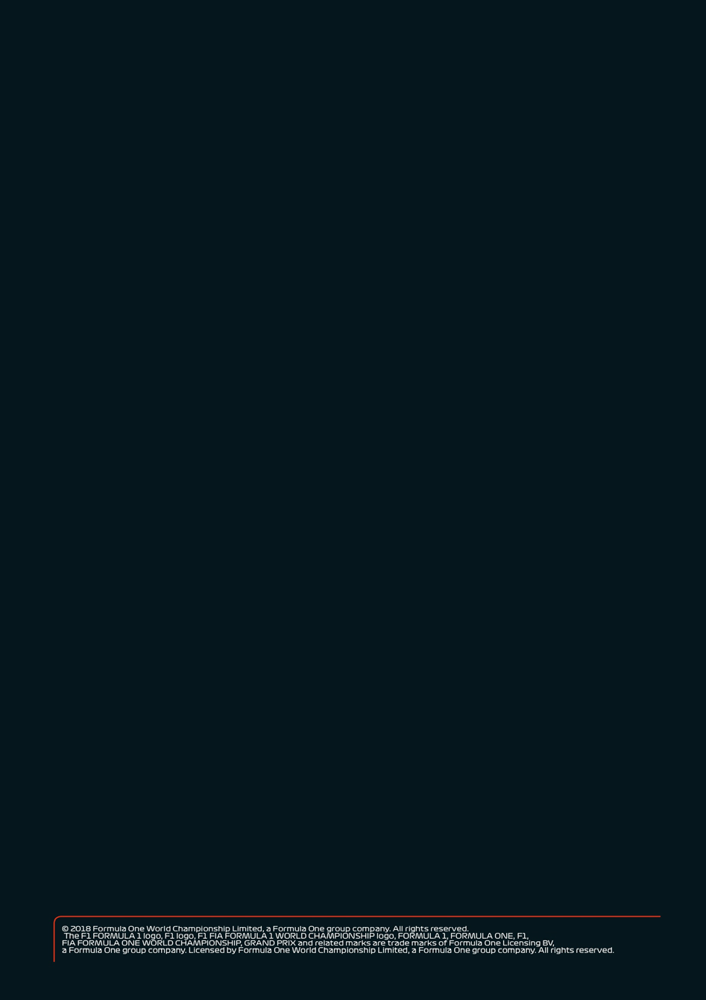

82
