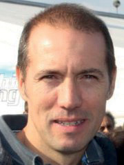

RACE STEWARDS BIOGRAPHIES

DR GERD ENNSER

MEMBER OF THE DMSB’S EXECUTIVE COMMITTEE FOR AUTOMOBILE SPORT, FORMULA ONE AND DTM STEWARD

Dr Gerd Ennser has successfully combined his formal education in law with his passion for motor racing. While still active as a racing driver he began helping out with the management of his local motor sport club and since 2006 has been a permanent steward at every round of Germany’s DTM championship. Since 2010 he has also been a Formula One steward. Dr Ennser, who has worked as a judge, a prosecutor and in the legal department of an automotive- industry company, has also acted as a member of the steering committee of German motor sport body, the DMSB, since spring 2010, where he is responsible for automobile sport. In addition, Dr Ennser is a board member of the South Bavaria Section of ADAC, Germany’s biggest auto club.

PAOLO LONGONI

MEMBER OF THE ITALIAN MOTOR SPORT COMMISSION (CSAI); THE AUTOMOBILE CLUB OF MILAN

Paolo Longoni is a steward with nearly 30 years’ experience. Milanese Longoni began his stewards’ training at his home circuit – Monza – in 1990 and was immediately ‘bitten by the bug’ of motorsport. While his early stewarding experience was based largely at Monza, since 2006 Longoni has officiating at rounds of the Porsche Supercup, Ferrari Challenge Championship, FIA Historic Championship, ETCC, WTCC, Formula Two and Le Mans Series events. He frequently serves as the national steward at the Italian Grand Prix.

DANNY SULLIVAN

FORMER F1 DRIVER, INDIANAPOLIS 500 WINNER AND CART CHAMPION

US racer Danny Sullivan made his F1 debut with Tyrrell at the 1983 Brazilian Grand Prix. He raced just one season in F1, scoring a best result of fifth in Monaco. In 1984, Sullivan returned to the US where he resumed a successful Indy Car career. He is perhaps best known for his ‘spin and win’ victory at the 1985 Indianapolis 500, where he passed leader Mario Andretti, survived a 360 degree spin, and then caught and re-passed Andretti to claim the Borg-Warner Trophy. He won the Indy Car World Series title in 1988. After 17 victories from 170 Indy Car starts he drew a line under his open-wheel career in 1995. He finished third in the Le Mans 24 Hours in a Dauer Porsche 962 in 1994. He made four starts at Le Mans, the most recent being 2004
