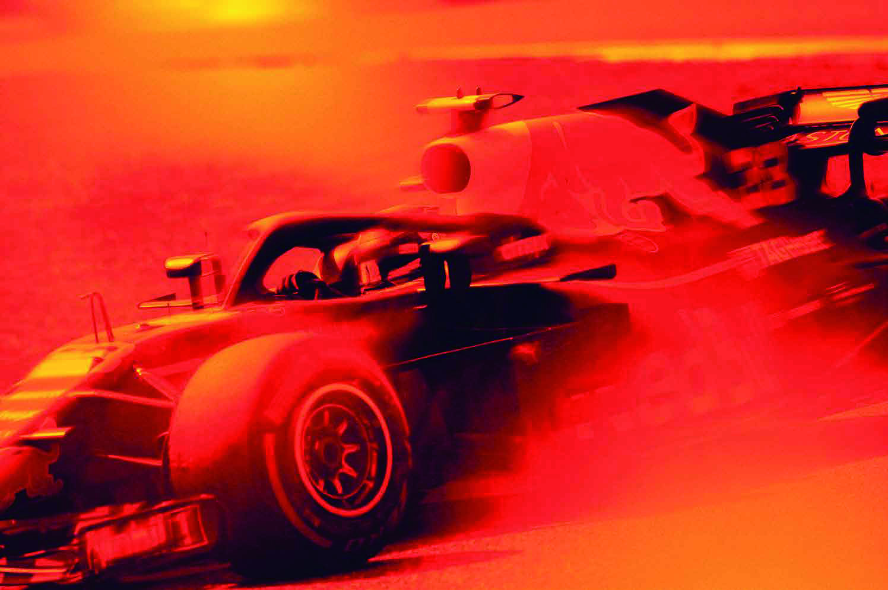
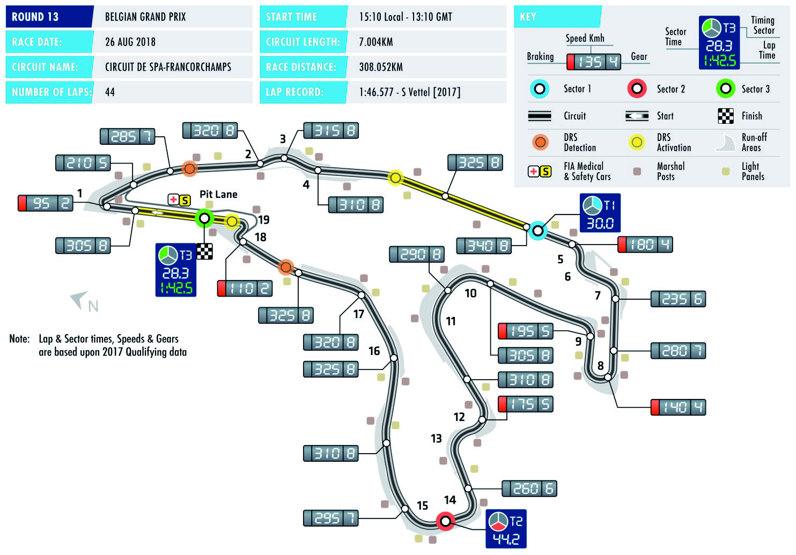

Official A4 Media Kit Cover Width 210mm x Depth 297mm (3mm bleed)

JOHNNIE WALKER

BELGIAN

SPA-FRANCORCHAMPS 24-26 AUGUST

The F1 logos, F1, FORMULA 1, FIA FORMULA ONE WORLD CHAMPIONSHIP, GRAND PRIX, BELGIAN GRAND PRIX and related marks are trade marks of Formula One Licensing BV, a Formula 1 company. All rights reserved. OFFICIAL MEDIA KIT

Official F1 Media Letterhead Width 210mm x Depth 297mm

Formula 1 Official Formula 1™ Media Kit 2018 Johnnie Walker Belgian Grand Prix

Spa-Francorchamps 24-26 August

Summary

Welcome in Spa-Francorchamp........................................................................... 2 FIA - Belgian GP: Map ........................................................................................ 3 Timetable ............................................................................................................. 4 - 5 Track Story .......................................................................................................... 6 - 7 - 8 Useful information ............................................................................................... 9 - 10 Media centre operation ........................................................................................ 11 Photographer’s area operation ............................................................................ 12 Press conference ................................................................................................ 13 Race Track Modification ...................................................................................... 14 Responsabilities Race Track ............................................................................... 15 Track information map ......................................................................................... 16 Track map ............................................................................................................ 17 Paddock map ....................................................................................................... 18 Belgian Grand Prix 2017 briefly ........................................................................... 19 Belgian Grand Prix 2017 Starting Grid ................................................................ 20 Belgian Grand Prix 2017 Race Classification ...................................................... 21 Belgian GP: story ........... ..................................................................................... 22 - 23 World championships 2017................................................................................... 24 Season 2018: changements ................................................................................ 25 Entry List ............................................................................................................. 26 Calendar .............................................................................................................. 27 Teams information ............................................................................................... 28 - 32 Media contacts .................................................................................................... 33 - 34 Results of each GP ............................................................................................. 35 - 46 World championship drivers................................................................................ 47 World championship constructors ...................................................................... 48

11

1

Promoter

Address Line 1 Office: +XX XXX XXX XXX

Address Line 2 Email: xxxxxxxxxxx.com

Postcode Website: Xxxxxx.com

The F1 logos, F1, FORMULA 1, FIA FORMULA ONE WORLD CHAMPIONSHIP, GRAND PRIX, BELGIAN GRAND PRIX and related marks are trade marks of Formula One Licensing BV, a Formula 1 company. All rights reserved.

PMS 2347 C PMS BLACK 6 C

ARTWORK MAY BE RELEASED BEFORE THE RACE TITLE AND EVENT TITLE SPONSOR HAVE BEEN CONFIRMED. PLEASE CHECK THAT ALL INFORMATION IS CORRECT BEFORE GOING TO PRINT. PLEASE CAN YOU ALSO PLACE THE OFFICIAL PROMOTERS ADDRESS, EMAIL AND TELEPHONE NUMBERS IN UPPER AND LOWER CASE IN THE DESIGNATED AREA MARKED BY THE X. PLEASE DO NOT CHANGE THE TYPEFACE OR TYPE SIZE.

Official F1 Media Letterhead Width 210mm x Depth 297mm

Formula 1 Official Formula 1™ Media Kit 2018 Johnnie Walker Belgian Grand Prix

Spa-Francorchamps 24-26 August

Welcome to

Spa - Francorchamps

The Spa Francorchamps race track is delighted to welcome all journalists and photographers of the international press for the 2018 Belgian Grand Prix.

We hope that the Belgian race of the Formula 1 championship will add to the excitement we are experiencing this year in the battle for the world championship titles.

In order to offer you the best possible working conditions during this 12th meeting of the racing season, the following services and equipment have been put at your disposal: Your facilities:

Journalists’ room

• 350 seats. • public telephones are located in a separate booth. • Private telephones on request. • •Wifi system whit cable connection ADSL, ISDN and TSTN as well as data uplinks are available. • Internet workstations. • 349 lockers. Please obtain a key from the Media Centre staff at the reception desk. (A deposit of 20€ per key is required).

Photographers’ Area

The Photographers’ Area comprises the following facilities: • Photographers’ room inside the Media Centre with 150 seats. Wifi system whit cable connection • ADSL, ISDN and TSTN as well as data uplinks are available. • 150 lockers. Please obtain a key from the receptionist in the Photographers’ room. (A deposit of 20€ per key is required).

Television / radio

34 booths operational air-conditioned.

2

2

Promoter

Address Line 1 Office: +XX XXX XXX XXX

Address Line 2 Email: xxxxxxxxxxx.com

Postcode Website: Xxxxxx.com

The F1 logos, F1, FORMULA 1, FIA FORMULA ONE WORLD CHAMPIONSHIP, GRAND PRIX, BELGIAN GRAND PRIX and related marks are trade marks of Formula One Licensing BV, a Formula 1 company. All rights reserved.

PMS 2347 C PMS BLACK 6 C

ARTWORK MAY BE RELEASED BEFORE THE RACE TITLE AND EVENT TITLE SPONSOR HAVE BEEN CONFIRMED. PLEASE CHECK THAT ALL INFORMATION IS CORRECT BEFORE GOING TO PRINT. PLEASE CAN YOU ALSO PLACE THE OFFICIAL PROMOTERS ADDRESS, EMAIL AND TELEPHONE NUMBERS IN UPPER AND LOWER CASE IN THE DESIGNATED AREA MARKED BY THE X. PLEASE DO NOT CHANGE THE TYPEFACE OR TYPE SIZE.

Official F1 Media Letterhead Width 210mm x Depth 297mm

Formula 1 Official Formula 1™ Media Kit 2018 Johnnie Walker Belgian Grand Prix

Spa-Francorchamps 24-26 August

3

3

Promoter

Address Line 1 Office: +XX XXX XXX XXX

Address Line 2 Email: xxxxxxxxxxx.com

Postcode Website: Xxxxxx.com

The F1 logos, F1, FORMULA 1, FIA FORMULA ONE WORLD CHAMPIONSHIP, GRAND PRIX, BELGIAN GRAND PRIX and related marks are trade marks of Formula One Licensing BV, a Formula 1 company. All rights reserved.

PMS 2347 C PMS BLACK 6 C

ARTWORK MAY BE RELEASED BEFORE THE RACE TITLE AND EVENT TITLE SPONSOR HAVE BEEN CONFIRMED. PLEASE CHECK THAT ALL INFORMATION IS CORRECT BEFORE GOING TO PRINT. PLEASE CAN YOU ALSO PLACE THE OFFICIAL PROMOTERS ADDRESS, EMAIL AND TELEPHONE NUMBERS IN UPPER AND LOWER CASE IN THE DESIGNATED AREA MARKED BY THE X. PLEASE DO NOT CHANGE THE TYPEFACE OR TYPE SIZE.

Official F1 Media Letterhead Width 210mm x Depth 297mm

Formula 1 Official Formula 1™ Media Kit 2018 Johnnie Walker Belgian Grand Prix

Spa-Francorchamps 24-26 August

4

Promoter

Address Line 1 Office: +XX XXX XXX XXX

Address Line 2 Email: xxxxxxxxxxx.com

Postcode Website: Xxxxxx.com

The F1 logos, F1, FORMULA 1, FIA FORMULA ONE WORLD CHAMPIONSHIP, GRAND PRIX, BELGIAN GRAND PRIX and related marks are trade marks of Formula One Licensing BV, a Formula 1 company. All rights reserved.

PMS 2347 C PMS BLACK 6 C

ARTWORK MAY BE RELEASED BEFORE THE RACE TITLE AND EVENT TITLE SPONSOR HAVE BEEN CONFIRMED. PLEASE CHECK THAT ALL INFORMATION IS CORRECT BEFORE GOING TO PRINT. PLEASE CAN YOU ALSO PLACE THE OFFICIAL PROMOTERS ADDRESS, EMAIL AND TELEPHONE NUMBERS IN UPPER AND LOWER CASE IN THE DESIGNATED AREA MARKED BY THE X. PLEASE DO NOT CHANGE THE TYPEFACE OR TYPE SIZE.

Official F1 Media Letterhead Width 210mm x Depth 297mm

Formula 1 Official Formula 1™ Media Kit 2018 Johnnie Walker Belgian Grand Prix

Spa-Francorchamps 24-26 August

5

Promoter

Address Line 1 Office: +XX XXX XXX XXX

Address Line 2 Email: xxxxxxxxxxx.com

Postcode Website: Xxxxxx.com

The F1 logos, F1, FORMULA 1, FIA FORMULA ONE WORLD CHAMPIONSHIP, GRAND PRIX, BELGIAN GRAND PRIX and related marks are trade marks of Formula One Licensing BV, a Formula 1 company. All rights reserved.

PMS 2347 C PMS BLACK 6 C

ARTWORK MAY BE RELEASED BEFORE THE RACE TITLE AND EVENT TITLE SPONSOR HAVE BEEN CONFIRMED. PLEASE CHECK THAT ALL INFORMATION IS CORRECT BEFORE GOING TO PRINT. PLEASE CAN YOU ALSO PLACE THE OFFICIAL PROMOTERS ADDRESS, EMAIL AND TELEPHONE NUMBERS IN UPPER AND LOWER CASE IN THE DESIGNATED AREA MARKED BY THE X. PLEASE DO NOT CHANGE THE TYPEFACE OR TYPE SIZE.

Official F1 Media Letterhead Width 210mm x Depth 297mm

Formula 1 Official Formula 1™ Media Kit 2018 Johnnie Walker Belgian Grand Prix

Spa-Francorchamps 24-26 August

Track History

Early in 1920, nothing, it seemed, was to disturb the usual quietness in the peaceful village of Francorchamps, perched on a hill very close to the Moors. Nothing, except that, on a beautiful summer day, while settled at the Hotel des Bruyeres, two people well-know in the car racing world, the one being Jules de Thier, Manager of the newspaper " La Meuse ", and the other, Henri Langlois Van Ophem, Chairman of the Sports Commission at the RACB (Royal Automobile Club Belgium), had the idea of taking advantage of the triangle drawn by the roads connecting Malmedy, Stavelot and Francorchamps to make a racing track of it.

While enjoying an ideal spot in these green Ardennes, the track stretched in a hilly landscape but was also made of numerous straight portions, particularly suitable to achieve high speeds. Moreover, being close to Spa, already famous on the international scale for its hydrotherapy, and where some car races had been popular for a few years, this track seemed to have a lot of assets to be successful. Therefore, a race was already scheduled for the following year. Prepared for August 1921, that race for cars could unfortunately not take place, due to a lack of representation. Indeed, although everything was ready, only one competitor was registered on the entry form. Eventually, the track was inaugurated by the motorcyclists, while the motorists started in 1922. 1924 saw the first organisation of the famous 24 Hours of Francorchamps, only one year after Le Mans, whereas the first real big international race for single-seaters, the European Grand Prix, was run in 1925. Seven cars took part in this event which saw the victory of the famous Alfa Romeo driver, Antonio Ascari.

During the period extending from the mid-twenties until the eve of World War II, the motorcycles Grand Prix and the prestigious car races like the 24 Hours of Francorchamps and the Belgian Grand Prix were going to be the major track events. As far as the track is concerned, it remained roughly the same as it used to be in the beginning. But something new occurred in 1939 : Francorchamps was getting an artificial curve, unique in its kind : the " raidillon " or steep rise. That obstacle, intended to be passed at a very high speed, was a forerunner of the orientation its manager wanted to give to the track : to make it one the fastest tracks in Europe, contrasting sharply that way with its German neighbour of The Eifel, which was very spectacular too but much more tortuous and therefore one of the slowest. World War II was going to interrupt the life of the track for seven long years during which that part of the Ardennes was little spared. 1947 saw the sports activities resume in the area around " L'Eau Rouge ". Once again, the prestigious races were in the spotlight : Motorcycles and Cars Grand Prix, to which were occasionally added the 24 Hours of the Racb, before they resumed annually from 1964. Later on, other organisations completed that programme. So, in the late fifties, the RAC from Spa organized its Grand Prix of Spa, then, in the early sewenties, the junior RAC, its 24 Hours motorcycles If everything seemed to develop properly, that situation would, however, only last until until 1970, when, for the last time, the Formula I Grand Prix took place along the fourteen-kilometre-long track. Due to the claims formulated through the sixties, a certain amount of Grand Prix drivers did not want to run in Francorchamps any longer for security reasons, which were quite difficult to solve for the Intercommunale Managers. The tune was however given. Because, even if the other races usually scheduled still took place, it was getting obvious that along its fourteen kilometres, the track had become very dangerous considering the increased performance of the cars and the few possibilities left to adapt the surroundings as it was the case when new tracks were built.

6

6

Promoter

Address Line 1 Office: +XX XXX XXX XXX

Address Line 2 Email: xxxxxxxxxxx.com

Postcode Website: Xxxxxx.com

The F1 logos, F1, FORMULA 1, FIA FORMULA ONE WORLD CHAMPIONSHIP, GRAND PRIX, BELGIAN GRAND PRIX and related marks are trade marks of Formula One Licensing BV, a Formula 1 company. All rights reserved.

PMS 2347 C PMS BLACK 6 C

ARTWORK MAY BE RELEASED BEFORE THE RACE TITLE AND EVENT TITLE SPONSOR HAVE BEEN CONFIRMED. PLEASE CHECK THAT ALL INFORMATION IS CORRECT BEFORE GOING TO PRINT. PLEASE CAN YOU ALSO PLACE THE OFFICIAL PROMOTERS ADDRESS, EMAIL AND TELEPHONE NUMBERS IN UPPER AND LOWER CASE IN THE DESIGNATED AREA MARKED BY THE X. PLEASE DO NOT CHANGE THE TYPEFACE OR TYPE SIZE.

Official F1 Media Letterhead Width 210mm x Depth 297mm

Formula 1 Official Formula 1™ Media Kit 2018 Johnnie Walker Belgian Grand Prix

Spa-Francorchamps 24-26 August

Track Historic (2)

The end of the big Francorchamps was close. They were bound to react if they wanted to preserve the track and create one which took better into account the safety measures claimed by the Grand Prix drivers. So, after different plans aimed at preserving the main characteristics of the track while eliminating some high risk areas (essentially the part included between Les Combes and Blanchimont), a track was eventually chosen and the works could start. The seven-kilometre-long track was inaugurated in 1979. More technical, winding and equipped with clearance areas, the new track kept the major part of the element which made it famous while combining improved safety for the pilots and new appeal for the spectators. Thanks to the new track, the Belgian Formula I Grand Prix would quickly come back to Francorchamps. That race was a major event which would pave the way for many others, with less media coverage, but which contributed to make Francorchamps more dynamics, to diversify its kind of activities and to put it at the forefront of the international stage.

Between 1980 and 1990, Francorchamps ran to a well-established schedule. Similarly, the circuit could be adapted to suit all requirements, in terms of FIA safety. However, Francorchamps remained a “racing” circuit which was only closed to public traffic when there were meets. The evolution of motor sports and above all, the increasingly professional marketing approach led the situation to become rather complicated. In order to safeguard its future, the circuit had to become permanent and be definitively closed to all public traffic. The completion of the Verviers- Prüm motorway, the compulsory purchase of the last roadside property and the building of a bypass between the villages of Francorchamps and Meiz-Burneville would enable this essential step towards the future.

So in the early part of this century, Francorchamps “went professional” and was a tremendous success with clubs and incentive day organisers from all over Europe wanting to book one or several days outside of the official races. With nothing established, a new wave of panic began to emerge at the end of the century over the Eau Rouge valley. In 1997 the Belgian government passed a law banning the advertising of tobacco. With teams sponsored by these advertisers, the very life of the Belgian F1 Grand Prix was under threat. Up until 2005, when a European directive came into force, there were many incidents resulting from the problem of the tobacco advertising ban, to the extent that it was even left out of the Grand Prix in 2003.

It was said that it was hard for Francorchamps since F1 reinstated the Raidillon- Combes-Blanchimont route to the delight of millions of fans in 2004 and 2005. However, this was not an easy time for the circuit. Francorchamps had grown very quickly but there were still a number of gaps to be filled. Although work on the track that the FIA demanded meant that the sections most prized by drivers could remain in the top of the world track, the infrastructure no longer met world FIA requirements. Thanks to the Walloon government, Francorchamps was provided with F1 stands which fitted in perfectly with the magic of the place and which paved the way to a new circuit, one that was even more professional and dynamic and better geared towards new activities in the world of business…

7

7

Promoter

Address Line 1 Office: +XX XXX XXX XXX

Address Line 2 Email: xxxxxxxxxxx.com

Postcode Website: Xxxxxx.com

The F1 logos, F1, FORMULA 1, FIA FORMULA ONE WORLD CHAMPIONSHIP, GRAND PRIX, BELGIAN GRAND PRIX and related marks are trade marks of Formula One Licensing BV, a Formula 1 company. All rights reserved.

PMS 2347 C PMS BLACK 6 C

ARTWORK MAY BE RELEASED BEFORE THE RACE TITLE AND EVENT TITLE SPONSOR HAVE BEEN CONFIRMED. PLEASE CHECK THAT ALL INFORMATION IS CORRECT BEFORE GOING TO PRINT. PLEASE CAN YOU ALSO PLACE THE OFFICIAL PROMOTERS ADDRESS, EMAIL AND TELEPHONE NUMBERS IN UPPER AND LOWER CASE IN THE DESIGNATED AREA MARKED BY THE X. PLEASE DO NOT CHANGE THE TYPEFACE OR TYPE SIZE.

Official F1 Media Letterhead Width 210mm x Depth 297mm

Formula 1 Official Formula 1™ Media Kit 2018 Johnnie Walker Belgian Grand Prix

Spa-Francorchamps 24-26 August

8 8

Promoter

Address Line 1 Office: +XX XXX XXX XXX

Address Line 2 Email: xxxxxxxxxxx.com

Postcode Website: Xxxxxx.com

The F1 logos, F1, FORMULA 1, FIA FORMULA ONE WORLD CHAMPIONSHIP, GRAND PRIX, BELGIAN GRAND PRIX and related marks are trade marks of Formula One Licensing BV, a Formula 1 company. All rights reserved.

PMS 2347 C PMS BLACK 6 C

ARTWORK MAY BE RELEASED BEFORE THE RACE TITLE AND EVENT TITLE SPONSOR HAVE BEEN CONFIRMED. PLEASE CHECK THAT ALL INFORMATION IS CORRECT BEFORE GOING TO PRINT. PLEASE CAN YOU ALSO PLACE THE OFFICIAL PROMOTERS ADDRESS, EMAIL AND TELEPHONE NUMBERS IN UPPER AND LOWER CASE IN THE DESIGNATED AREA MARKED BY THE X. PLEASE DO NOT CHANGE THE TYPEFACE OR TYPE SIZE.

Official F1 Media Letterhead Width 210mm x Depth 297mm

Formula 1 Official Formula 1™ Media Kit 2018 Johnnie Walker Belgian Grand Prix

Spa-Francorchamps 24-26 August

Useful Information

Emergency numbers Emergency number at the circuit: 112 Police general number: 101 Stavelot-Malmedy Police: +32/(0) 78 15 18 00

Hospitals Malmedy - Clinique Reine Astrid: +32/(0) 80 79 31 11 Verviers – CHPLT: +32/(0) 87 21 21 11 Liège – CHU: +32/(0) 4 366 71 11

Pharmacies Guard duty: 0900/10 500

Banks ING – Spa: +32/(0) 87 79 21 80 ING – Malmedy: +32/(0) 80 79 11 00 ING - Stavelot: +32/(0) 80 89 20 50 BNP Parisbas Fortis – Spa +32/(0) 87 29 35 40 BNP Parisbas Fortis – Malmedy +32/(0) 80 79 12 30

Taxis Spa: +32/(0) 87 77 01 02 +32/(0) 87 23 23 39 +32/(0)476 32 80 20 Verviers: +32/(0) 87 33 33 33 +32/(0) 87 31 55 04 Liège: +32/(0) 4 247 47 79 +32/(0) 4 367 50 40 +32/(0) 4 365 65 65 +32/(0) 4 233 50 40

Train stations Liège Guillemins: +32/(0) 4 241 26 56 Verviers Central: +32/(0) 4 241 53 28 General information : +32/(0) 2 528 28 28

9

9

Promoter

Address Line 1 Office: +XX XXX XXX XXX

Address Line 2 Email: xxxxxxxxxxx.com

Postcode Website: Xxxxxx.com

The F1 logos, F1, FORMULA 1, FIA FORMULA ONE WORLD CHAMPIONSHIP, GRAND PRIX, BELGIAN GRAND PRIX and related marks are trade marks of Formula One Licensing BV, a Formula 1 company. All rights reserved.

PMS 2347 C PMS BLACK 6 C

ARTWORK MAY BE RELEASED BEFORE THE RACE TITLE AND EVENT TITLE SPONSOR HAVE BEEN CONFIRMED. PLEASE CHECK THAT ALL INFORMATION IS CORRECT BEFORE GOING TO PRINT. PLEASE CAN YOU ALSO PLACE THE OFFICIAL PROMOTERS ADDRESS, EMAIL AND TELEPHONE NUMBERS IN UPPER AND LOWER CASE IN THE DESIGNATED AREA MARKED BY THE X. PLEASE DO NOT CHANGE THE TYPEFACE OR TYPE SIZE.

Official F1 Media Letterhead Width 210mm x Depth 297mm

Formula 1 Official Formula 1™ Media Kit 2018 Johnnie Walker Belgian Grand Prix

Spa-Francorchamps 24-26 August

Useful information

Airports

Liège: + 32/() 4 234 84 11 (distance 56 km - time 00:35 to 00:45 - www.liegeairport.com) Charleroi: +32/(0) 71 25 12 11 (distance 132 km - time 01:1 to 01:30 - www.charleroi-airport.be) Bruxelles: +32/(0) 2 753 77 53 (distance 134 km - time 01:19 to 01:19 - wwww.brusselsairport.be)

Car rentals Hertz - Liège Airport or centre: +32/(0) 4 222 42 73 Hertz – Charleroi: +32/(0) 71 37 78 98 Hertz - Bruxelles airport: +32/(0) 2 713 36 35 Hertz - Bruxeles centre: +32/(0) 2 524 31 00 Hertz – Verviers: +32/(0) 87 23 05 20

Avis - Liège centre: +32/(0) 4 250 35 16 Avis - Charleroi Airport: +32/(0) 71 35 19 98 Avis - Charleroi centre: +32/(0) 71 32 35 35 Avis - Bruxelles Airport: +32/(0) 2 720 09 44 Avis - Bruxelles centre: +32/(0) 2 527 17 05 Avis - Verviers centre: +32(0) 87 22 58 10

Tourism information Tourist federation of the Province de Liège : +32/(0) 4 237 95 26 ftpl@prov-liege.be

Tourist Office des Cantons de l’Est: +32/(0) 80 33 02 50 www.esatbelgium.be

Tourist information Office of Spa: +32/(0) 87 79 53 53 www.spa-info.be

Tourist information Office of Stavelot: +32/(0) 80 86 27 06 www.stavelot.be

Tourist information Office of Malmedy idem Canton de l’Est +32/(0) 80 33 02 50 www.malmedy.be

10

10

Promoter

Address Line 1 Office: +XX XXX XXX XXX

Address Line 2 Email: xxxxxxxxxxx.com

Postcode Website: Xxxxxx.com

The F1 logos, F1, FORMULA 1, FIA FORMULA ONE WORLD CHAMPIONSHIP, GRAND PRIX, BELGIAN GRAND PRIX and related marks are trade marks of Formula One Licensing BV, a Formula 1 company. All rights reserved.

PMS 2347 C PMS BLACK 6 C

ARTWORK MAY BE RELEASED BEFORE THE RACE TITLE AND EVENT TITLE SPONSOR HAVE BEEN CONFIRMED. PLEASE CHECK THAT ALL INFORMATION IS CORRECT BEFORE GOING TO PRINT. PLEASE CAN YOU ALSO PLACE THE OFFICIAL PROMOTERS ADDRESS, EMAIL AND TELEPHONE NUMBERS IN UPPER AND LOWER CASE IN THE DESIGNATED AREA MARKED BY THE X. PLEASE DO NOT CHANGE THE TYPEFACE OR TYPE SIZE.

Official F1 Media Letterhead Width 210mm x Depth 297mm

Formula 1 Official Formula 1™ Media Kit 2018 Johnnie Walker Belgian Grand Prix

Spa-Francorchamps 24-26 August

Media centre operation

Photographers holding permanent passes are entitled to enter the Media Centre in order to contact the journalist, on condition that they do not bring any large or bulky equipment with them and that they do not take a seat.

Media Accreditations Centre: opening hours

Thursday 8.00 h – 18.00 h Friday 8.00 h – 16.00 h Saturday 8.00 h – 12.00 h Sunday Closed

Media Centre: opening hours

Thursday 9.00 h - 22.00 h Friday 7.00 h - 23.00 h Saturday 7.00 h - 23.00 h Sunday 7.00 h - until the last journalist leaves

Welcome Desk

At the Welcome Desk, journalists can ask for a seat in the press room, a locker and the Press Kit.

FIA permanent pass holders can also pick up their parking for the next race and must sign the attendance list. A part from that, tabards for permanent credential holders are also available.

Journalist who need a private telephone line with the national company Belgacom, ask for it at the Welcome Desk.

Telecom Desk

The telecom desk offers to journalists a service for using telephones and computers with internet connexion and the possibility to print in this room .

Media Car Park Shuttle Service

A shuttle service will be available to ease the journalists and photographers’ transfers from the Media Car Park to the Media Centre and vice versa. The starting point is next F1 paddock entry.

11

11

Promoter

Address Line 1 Office: +XX XXX XXX XXX

Address Line 2 Email: xxxxxxxxxxx.com

Postcode Website: Xxxxxx.com

The F1 logos, F1, FORMULA 1, FIA FORMULA ONE WORLD CHAMPIONSHIP, GRAND PRIX, BELGIAN GRAND PRIX and related marks are trade marks of Formula One Licensing BV, a Formula 1 company. All rights reserved.

PMS 2347 C PMS BLACK 6 C

ARTWORK MAY BE RELEASED BEFORE THE RACE TITLE AND EVENT TITLE SPONSOR HAVE BEEN CONFIRMED. PLEASE CHECK THAT ALL INFORMATION IS CORRECT BEFORE GOING TO PRINT. PLEASE CAN YOU ALSO PLACE THE OFFICIAL PROMOTERS ADDRESS, EMAIL AND TELEPHONE NUMBERS IN UPPER AND LOWER CASE IN THE DESIGNATED AREA MARKED BY THE X. PLEASE DO NOT CHANGE THE TYPEFACE OR TYPE SIZE.

Official F1 Media Letterhead Width 210mm x Depth 297mm

Formula 1 Official Formula 1™ Media Kit 2018 Johnnie Walker Belgian Grand Prix

Spa-Francorchamps 24-26 August

Photographer’s area operation

The photographers’ area is located next the Press Room in the F1 Paddock. There is room available for 150 photographers approximately with 159 lockers. The request of telephone lines and internet connection works as in the Press Room.

Photographers with FIA permanent pass can pick up their tabard at the Welcome Desk.

A camera repair service will be available to all photographers free of charge.

Media Accreditations Centre: opening hours

Thursday 8.00 h – 18.00 h Friday 8.00 h – 16.00 h Saturday 8.00 h – 12.00 h Sunday Closed

Media Centre: opening hours

Thursday 9.00 h - 22.00 h Friday 7.00 h - 23.00 h Saturday 7.00 h - 23.00 h Sunday 7.00 h - until the last photographer’s leaves

Photo bus service around the service track

A photo bus (3) service will be available to ease the photographers’ transfers around the service tracks. You will find the starting points, as shown in the attached map.

Timetable for shuttle service

Practice sessions First departure 60’ before the start of the session.

Qualifying session Last departure 40’ before the start of the session. Pick up 5’/10’ after the chequered flag (several trips over at least half an hour)

Race First departure 90’ before the starting time of the race. Last departure 75’ before the start of the race

12

12

Promoter

Address Line 1 Office: +XX XXX XXX XXX

Address Line 2 Email: xxxxxxxxxxx.com

Postcode Website: Xxxxxx.com

The F1 logos, F1, FORMULA 1, FIA FORMULA ONE WORLD CHAMPIONSHIP, GRAND PRIX, BELGIAN GRAND PRIX and related marks are trade marks of Formula One Licensing BV, a Formula 1 company. All rights reserved.

PMS 2347 C PMS BLACK 6 C

ARTWORK MAY BE RELEASED BEFORE THE RACE TITLE AND EVENT TITLE SPONSOR HAVE BEEN CONFIRMED. PLEASE CHECK THAT ALL INFORMATION IS CORRECT BEFORE GOING TO PRINT. PLEASE CAN YOU ALSO PLACE THE OFFICIAL PROMOTERS ADDRESS, EMAIL AND TELEPHONE NUMBERS IN UPPER AND LOWER CASE IN THE DESIGNATED AREA MARKED BY THE X. PLEASE DO NOT CHANGE THE TYPEFACE OR TYPE SIZE.

OOffffiicciiaall FF11 MMeeddiiaa LLeetttteerrhheeaadd WWiiddtthh 221100mmmm xx DDeepptthh 229977mmmm

FFoorrmmuullaa 11 OOffffiicciiaall FFoorrmmuullaa 11™™ MMeeddiiaa KKiitt 22001188 JJoohhnnnniiee WWaallkkeerr BBeellggiiaann GGrraanndd PPrriixx

SSppaa--FFrraannccoorrcchhaammppss 2244--2266 AAuugguusstt

Press conference schedule

Thursday- 15:00h- Press Conference Room A maximum of six drivers chosen by the FIA F1 Head of Communications.

Friday- 13:00h- Press Conference Room A maximum of six team personalities chosen by the FIA F1 Head of Communications.

Saturday- After the qualifying- Press Conference Room Post-Qualifying Press Conference with top three drivers of the qualifying session. TV unilateral interview with top three drivers of the qualifying session.

Sunday- After the race - Press Conference Room Post-Qualifying Press Conference with top three drivers of the qualifying session. TV unilateral interview with top three drivers of the qualifying session.

All Press Conferences will take place in the FIA Press Conference Room. The TV pen will be located outside the paddock between the entrance (Race Control side) and the Media Centre, in order to be closer to the FIA Press Conference Room.

Qualifying and post-race press conferences will take place after the parc ferme interviews and the podium ceremony, which will be broadcast in the Media Centre and the Press Conference Room.

Additional Media Opportunities

Qualifying: All drivers eliminated in Q1 or Q2 will be available for media interviews in the TV pen immediately after the end of each session, as will drivers who participated in Q3, but who are not required for the post- qualifying press conference, at the back of the FIA garage, paddock side.

Race: Any driver retiring before the end of the race will be available for media interviews in the TV pen after his return to the paddock. In addition, all drivers who finish the race outside the top three will be available for media interviews immediately after the end of the race, at each team's individual garage/hospitality or at the back of the FIA garage.

During the race every team will make at least one senior spokesperson available for interviews by officially accredited TV crews. A list of those nominated will be available in the media centre.

1133 13

PPrroommootteerr

AAddddrreessss LLiinnee 11 OOffffiiccee:: ++XXXX XXXXXX XXXXXX XXXXXX

AAddddrreessss LLiinnee 22 EEmmaaiill:: xxxxxxxxxxxxxxxxxxxxxx..ccoomm

PPoossttccooddee WWeebbssiittee:: XXxxxxxxxxxx..ccoomm

TThhee FF11 llooggooss,, FF11,, FFOORRMMUULLAA 11,, FFIIAA FFOORRMMUULLAA OONNEE WWOORRLLDD CCHHAAMMPPIIOONNSSHHIIPP,, GGRRAANNDD PPRRIIXX,, BBEELLGGIIAANN GGRRAANNDD PPRRIIXX aanndd rreellaatteedd mmaarrkkss aarree ttrraaddee mmaarrkkss ooff FFoorrmmuullaa OOnnee LLiicceennssiinngg BBVV,, aa FFoorrmmuullaa 11 ccoommppaannyy.. AAllll rriigghhttss rreesseerrvveedd..

PPMMSS 22334477 CC PPMMSS BBLLAACCKK 66 CC

AARRTTWWOORRKK MMAAYY BBEE RREELLEEAASSEEDD BBEEFFOORREE TTHHEE RRAACCEE TTIITTLLEE AANNDD EEVVEENNTT TTIITTLLEE SSPPOONNSSOORR HHAAVVEE BBEEEENN CCOONNFFIIRRMMEEDD.. PPLLEEAASSEE CCHHEECCKK TTHHAATT AALLLL IINNFFOORRMMAATTIIOONN IISS CCOORRRREECCTT BBEEFFOORREE GGOOIINNGG TTOO PPRRIINNTT.. PPLLEEAASSEE CCAANN YYOOUU AALLSSOO PPLLAACCEE TTHHEE OOFFFFIICCIIAALL PPRROOMMOOTTEERRSS AADDDDRREESSSS,, EEMMAAIILL AANNDD TTEELLEEPPHHOONNEE NNUUMMBBEERRSS IINN UUPPPPEERR AANNDD LLOOWWEERR CCAASSEE IINN TTHHEE DDEESSIIGGNNAATTEEDD AARREEAA MMAARRKKEEDD BBYY TTHHEE XX.. PPLLEEAASSEE DDOO NNOOTT CCHHAANNGGEE TTHHEE TTYYPPEEFFAACCEE OORR TTYYPPEE SSIIZZEE..

Official F1 Media Letterhead Width 210mm x Depth 297mm

Formula 1 Official Formula 1™ Media Kit 2018 Johnnie Walker Belgian Grand Prix

Spa-Francorchamps 24-26 August

2018 track modifications

T1 2

T10 Virage - Turn number T2

T3 T18

T19 T4

T17

T16

T11 T10

T5 T12 T6

T15 T13 T9 T7

T14

T8

No track modification for 2018 F1 Grand Prix

14

14

Promoter

Address Line 1 Office: +XX XXX XXX XXX

Address Line 2 Email: xxxxxxxxxxx.com

Postcode Website: Xxxxxx.com

The F1 logos, F1, FORMULA 1, FIA FORMULA ONE WORLD CHAMPIONSHIP, GRAND PRIX, BELGIAN GRAND PRIX and related marks are trade marks of Formula One Licensing BV, a Formula 1 company. All rights reserved.

PMS 2347 C PMS BLACK 6 C

ARTWORK MAY BE RELEASED BEFORE THE RACE TITLE AND EVENT TITLE SPONSOR HAVE BEEN CONFIRMED. PLEASE CHECK THAT ALL INFORMATION IS CORRECT BEFORE GOING TO PRINT. PLEASE CAN YOU ALSO PLACE THE OFFICIAL PROMOTERS ADDRESS, EMAIL AND TELEPHONE NUMBERS IN UPPER AND LOWER CASE IN THE DESIGNATED AREA MARKED BY THE X. PLEASE DO NOT CHANGE THE TYPEFACE OR TYPE SIZE.

Official F1 Media Letterhead Width 210mm x Depth 297mm

Formula 1 Official Formula 1™ Media Kit 2018 Johnnie Walker Belgian Grand Prix

Spa-Francorchamps 24-26 August

Officials of the meeting

Clerk of the Course Roland Bruynseraede

Steward of the meeting Yves Bacquelaine

Secretary of the Meeting Xavier Schene

National Scrutineer Jean-Pierre De Backer

National Medical Officer Dr. Christian Wahlen

National Press Officer Guy Basyn

FIA

Race Director, Safety Delegate Starter Charlie Whiting

Medical Delegate Dr. Alain Chantegret Deputy Medical Delegate Ian Roberts

Technical Delegate Jo Bauer

FIA Head of Communication & Media Delegate Matteo Bonciani Deputy Media Delegate Pierre Guyonnet-Duperat

Commissaires sportifs G. Connelly, E Spano,M Salo

Safety Car Driver Bernd Mayländer

Medical Car Driver Alan van der Merwe

1155

Promoter

Address Line 1 Office: +XX XXX XXX XXX

Address Line 2 Email: xxxxxxxxxxx.com

Postcode Website: Xxxxxx.com

The F1 logos, F1, FORMULA 1, FIA FORMULA ONE WORLD CHAMPIONSHIP, GRAND PRIX, BELGIAN GRAND PRIX and related marks are trade marks of Formula One Licensing BV, a Formula 1 company. All rights reserved.

PMS 2347 C PMS BLACK 6 C

ARTWORK MAY BE RELEASED BEFORE THE RACE TITLE AND EVENT TITLE SPONSOR HAVE BEEN CONFIRMED. PLEASE CHECK THAT ALL INFORMATION IS CORRECT BEFORE GOING TO PRINT. PLEASE CAN YOU ALSO PLACE THE OFFICIAL PROMOTERS ADDRESS, EMAIL AND TELEPHONE NUMBERS IN UPPER AND LOWER CASE IN THE DESIGNATED AREA MARKED BY THE X. PLEASE DO NOT CHANGE THE TYPEFACE OR TYPE SIZE.

Official F1 Media Letterhead Width 210mm x Depth 297mm

Formula 1 Official Formula 1™ Media Kit 2018 Johnnie Walker Belgian Grand Prix

Spa-Francorchamps 24-26 August

Track information

Red Zones

La Source Photographers 1

Pit out

F1 start e g u o R Finish & Timing line u a E Intermediary 1: 2,2435 km Intermediary 2: 5,1127 km Pit in Paddock 2 Circuit Centerline: 7,004 km Raidillon Pit in : - 0,0850 km 3 Pit out: 0,3014 km 18 A lap by the Pits = 6,9556 km 19 S = secteur 4

1

Virages Turns number Kemmel

Chemins piétons S1 Public walk way S3 Chemins des ambulances Ambulance way 17

Photographe Photographer Blanchimont

Zones interdite Pouhon Red zone - No access

16 Fenêtre photographe Intermediary 1 Photographer window

11 10

S2

5

Courbe

Paul 6 Frère Les 13 12 Combes 15 9 Fagnes 16 7

14 8 Campus

Intermediary 2 Bruxelles

16

16

19.

Promoter

Address Line 1 Office: +XX XXX XXX XXX

Address Line 2 Email: xxxxxxxxxxx.com

Postcode Website: Xxxxxx.com

The F1 logos, F1, FORMULA 1, FIA FORMULA ONE WORLD CHAMPIONSHIP, GRAND PRIX, BELGIAN GRAND PRIX and related marks are trade marks of Formula One Licensing BV, a Formula 1 company. All rights reserved.

PMS 2347 C PMS BLACK 6 C

ARTWORK MAY BE RELEASED BEFORE THE RACE TITLE AND EVENT TITLE SPONSOR HAVE BEEN CONFIRMED. PLEASE CHECK THAT ALL INFORMATION IS CORRECT BEFORE GOING TO PRINT. PLEASE CAN YOU ALSO PLACE THE OFFICIAL PROMOTERS ADDRESS, EMAIL AND TELEPHONE NUMBERS IN UPPER AND LOWER CASE IN THE DESIGNATED AREA MARKED BY THE X. PLEASE DO NOT CHANGE THE TYPEFACE OR TYPE SIZE.

Official F1 Media Letterhead Width 210mm x Depth 297mm

Formula 1 Official Formula 1™ Media Kit 2018 Johnnie Walker Belgian Grand Prix

Spa-Francorchamps 24-26 August

310 m/Alt. 419

CIRCUIT DE SPA 220 m/alt. 424 690 m/Alt. 403 FRANCORCHAMPS La Source 1b T1 F1 pitlane: Entrée 1 370 m. Ster 890 m/alt. 390 Endurance pitlane: 260 m. 1c Grande pitlane: 19c 980 m. ge u o R 0 m - 7004 m/alt. 416 Ea u Line Start Chemins des ambulances Line T2 Ambulance way Finish 19b 2 Chemins piétons T3 T19 Public walk ways 19 6540 m/alt. 408 Raidillon 3 T18 1130 m/Alt. 414 1 18 T4 Poste commissaire Marshall post 4

T17 4b Virage - Turn number 1490 m/Alt. 430 Overflow Feux piste 6000 m/alt. 394 17 Parking Track light

Dégagement asphalté T17 Asphalt run off area Kemmel Blanchimont Dégagement gravier 4c Gravel run off area

5700 m/alt. 384 10b T16 3600 m alt. 400 16 11 15c T11 T10 10 Courbe Paul Frère Double

Gauche 5 5100 m 2200 m alt.370 alt.463 12 9b 15b T6 T5 4280 m/Alt. 377 lacideM ertneC Les Combes T15 13 T12 7 T13 12b Fagnes T9 9 3110 m/alt.438 7b T7 15

4740 m/Alt. 373 8b 15 T14 14 T8 Campus 2470 m/alt. 469

Bruxelles 8 2870 m/alt.456

17 17

Promoter

Address Line 1 Office: +XX XXX XXX XXX

Address Line 2 Email: xxxxxxxxxxx.com

Postcode Website: Xxxxxx.com

The F1 logos, F1, FORMULA 1, FIA FORMULA ONE WORLD CHAMPIONSHIP, GRAND PRIX, BELGIAN GRAND PRIX and related marks are trade marks of Formula One Licensing BV, a Formula 1 company. All rights reserved.

PMS 2347 C PMS BLACK 6 C

ARTWORK MAY BE RELEASED BEFORE THE RACE TITLE AND EVENT TITLE SPONSOR HAVE BEEN CONFIRMED. PLEASE CHECK THAT ALL INFORMATION IS CORRECT BEFORE GOING TO PRINT. PLEASE CAN YOU ALSO PLACE THE OFFICIAL PROMOTERS ADDRESS, EMAIL AND TELEPHONE NUMBERS IN UPPER AND LOWER CASE IN THE DESIGNATED AREA MARKED BY THE X. PLEASE DO NOT CHANGE THE TYPEFACE OR TYPE SIZE.

Official F1 Media Letterhead Width 210mm x Depth 297mm

Formula 1 Official Formula 1™ Media Kit 2018 Johnnie Walker Belgian Grand Prix

Spa-Francorchamps 24-26 August

Shuttle map s’rehpargotohP

swodniW secna y a W ecruoS lu b m e a c n a lu aL s e d n b i m m A - ehC elttuhS tniop

xirP seciffO yaw dnarG pu - xuaeruB cilbup aideM gnikraP apS kciP - notéip

lennuT nim ehC yaw 24 bulC kcoddaP 14 04 dnatsnarG cilbuP enubirT 93 83 73 bulC - kcoddaP 63 cilbup 53 43 33 nimehC 23 gnikraP 13 bulC kcoddaP 03 92 82 kcoddaP 72 62 bulC kcoddaP kcoddaP 52 32 mooR 42 seitilatipsoH .otohP 22 12 smaeT dnatsnarG 02 enubirT 91 mooR dnatsnarG 71 sserP 81 1F 21 enubirT 61 43 51 6 5

gnikraP 31 11 .refnoC seciffO mooR MOF 0 41 2 1 1 stsilanruoJ srehpargotohP 8 01 7 2 9 1 11 9 AIF yrtnE 51 41

lortnoC 7 ecaR 6 8 7161 9 8 1 1 lennuT segoL seciffO 5 3 MOF 4 AIF 1 3 2 0 2 2 2 2 eértnE retS etaG 42 seciffo 2 tiucriC 1 layorinU rewoT e 62 52 rtn 8272 e lennuT 09 32 d n C g kco 2313 a tsd n ip muidop d d 43 63 33 53 n a rG p o h S s’rehpargotohP lacideM ertneC a p 2 8373 0943 - e P G 24 4344 14 n u b irT ynomereC ock 54 d d p a lacinhceT e ertneC orsc h noitatS latoT lennuT P s’rehpargotohP uaE’l snolaS eguoR ed swodniW s’rehpargotohP

yaw W M k c enoZ cilbuP B a l u o m d d a p - cilbup r o F tnomihcnalB deR nim ehC eértnE etaG aiV

1818

Promoter

Address Line 1 Office: +XX XXX XXX XXX

Address Line 2 Email: xxxxxxxxxxx.com

Postcode Website: Xxxxxx.com

The F1 logos, F1, FORMULA 1, FIA FORMULA ONE WORLD CHAMPIONSHIP, GRAND PRIX, BELGIAN GRAND PRIX and related marks are trade marks of Formula One Licensing BV, a Formula 1 company. All rights reserved.

PMS 2347 C PMS BLACK 6 C

ARTWORK MAY BE RELEASED BEFORE THE RACE TITLE AND EVENT TITLE SPONSOR HAVE BEEN CONFIRMED. PLEASE CHECK THAT ALL INFORMATION IS CORRECT BEFORE GOING TO PRINT. PLEASE CAN YOU ALSO PLACE THE OFFICIAL PROMOTERS ADDRESS, EMAIL AND TELEPHONE NUMBERS IN UPPER AND LOWER CASE IN THE DESIGNATED AREA MARKED BY THE X. PLEASE DO NOT CHANGE THE TYPEFACE OR TYPE SIZE.

Official F1 Media Letterhead Width 210mm x Depth 297mm

Formula 1 Official Formula 1™ Media Kit 2018 Johnnie Walker Belgian Grand Prix

Spa-Francorchamps 24-26 August

Belgian Grand Prix 2017 briefly

Promotor Number of GP : 47 Spa Grand Prix First GP Director: André Maes June 10 1950 Phone : +32/87 22 44 66 Number of lap Fax: +32/87 22 44 55 44 - 308.052 km E-mail: info@spagrandprix.com

Track Altitude Lenght: 7003.95 m 391 - before Eau RougeLow: corner Number of corners High: 470 - after Les Combes corner 19: left - 10: right - 9

Best Race lap - 2017 Record Pole Sebastian Vettel: 1’46’ ’577 L. Hamilton: 1’42’’553 2017

Pole 2017 Podium 2017 Lewis Hamilton 1. L. Hamilton (Mercedes); 2. S. Vettel (Ferrari); Mercedes - 1'42’ ’553 3. D. Ricciardo (Red Bull)

Last winners World championships

2017: L Hamilton Mercedes :2017: L. Hamilton Mercedes 2016: N. Rosberg Mercedes 2016: N. Rosberg Mercedes 2015: L. Hamilton Mercedes 2015: L. Hamilton Mercedes 2014: D. Ricciardo Red Bull 2014: L. Hamilton Mercedes 2013: S. Vettel Red Bull 2013: S. Vettel Red Bull 2012: J. Button McLaren 2012: S. Vettel Red Bull 2011: S. Vettel Red Bull 2011: S. Vettel Red Bull 2010: L. Hamilton McLaren 2010: L. Hamilton Red Bull 2009: K. Raikkonen Ferrari 2009: J. Button Brawn GP 2008: F. Massa Ferrari 2008: L. Hamilton Ferrari 2007: K. Raïkkönen Ferrari 2007: K. Raïkkönen Ferrari 2006: No GP 2006: F. Alonso Renault 2005: K. Raïkkönen McLaren 2005: F. Alonso Renault 2004: K. Raikkönen McLaren 2004: M. Schumacher Ferrari 2003: No GP 2003: M. Schumacher Ferrari 2002: M. Schumacher Ferrari 2002: M. Schumacher Ferrari 2001: M. Schumacher (Ferrari) Ferrari 2001: M. Schumacher Ferrari 2000: M. Hakkinen McLaren 2000: M. Schumacher Ferrari 1999: D. Coulthard McLaren 1999: M. Hakkinen Ferrari 1998: D. Hill Jordan 1998: M. Hakkinen McLaren 1997: M. Schumacher Ferrari 1997: J. Villeneuve Williams 1996: M. Schumacher Ferrari 1996: D. Hill Williams 1995: M. Schumacher Benetton 1995: M. Schumacher Benetton 1994: D. Hill Williams 1994: M. Schumacher Williams 1993: D. Hill Williams 1993: A. Prost Williams 1992: M. Schumacher Benetton 1992: N. Mansell Williams 1991: A. Senna McLaren 1991: A. Senna McLaren 1990: A. Senna McLaren 1990: A. Senna McLaren 1989: A. Senna McLaren 1989: A. Prost McLaren

19 19

Promoter

Address Line 1 Office: +XX XXX XXX XXX

Address Line 2 Email: xxxxxxxxxxx.com

Postcode Website: Xxxxxx.com

The F1 logos, F1, FORMULA 1, FIA FORMULA ONE WORLD CHAMPIONSHIP, GRAND PRIX, BELGIAN GRAND PRIX and related marks are trade marks of Formula One Licensing BV, a Formula 1 company. All rights reserved.

PMS 2347 C PMS BLACK 6 C

ARTWORK MAY BE RELEASED BEFORE THE RACE TITLE AND EVENT TITLE SPONSOR HAVE BEEN CONFIRMED. PLEASE CHECK THAT ALL INFORMATION IS CORRECT BEFORE GOING TO PRINT. PLEASE CAN YOU ALSO PLACE THE OFFICIAL PROMOTERS ADDRESS, EMAIL AND TELEPHONE NUMBERS IN UPPER AND LOWER CASE IN THE DESIGNATED AREA MARKED BY THE X. PLEASE DO NOT CHANGE THE TYPEFACE OR TYPE SIZE.

Official F1 Media Letterhead Width 210mm x Depth 297mm

Formula 1 Official Formula 1™ Media Kit 2018 Johnnie Walker Belgian Grand Prix

Spa-Francorchamps 24-26 August

Belgian GP 2017 Starting grid

POS DRIVER Q1 LAPS Q2 LAPS Q3 LAPS

1 Lewis Hamilton 1:44.184 5 1:42.927 6 1:42.553 7

2 Sebastian Vettel 1:44.275 3 1:43.987 3 1:42.795 7

3 Valtteri Bottas 1:44.773 6 1:43.249 6 1:43.094 7

4 Kimi Raikkonen 1:44.729 3 1:43.700 3 1:43.270 5

5 Max Verstappen 1:44.535 3 1:43.940 3 1:43.380 6

6 Daniel Ricciardo 1:45.114 3 1:44.224 3 1:43.863 6

7 Nico Hulkenberg 1:45.280 6 1:44.988 6 1:44.982 3

8 Sergio Perez 1:45.591 4 1:44.894 6 1:45.244 4

9 Esteban Ocon 1:45.277 4 1:45.006 6 1:45.369 4

10 Jolyon Palmer 1:45.447 3 1:44.685 6 1

11 Fernando Alonso 1:45.668 6 1:45.090 5

12 Romain Grosjean 1:45.728 6 1:45.133 6

13 Kevin Magnussen 1:45.535 6 1:45.400 6

14 Carlos Sainz Jr. 1:45.374 6 1:45.439 6

15 Stoffel Vandoorne 1:45.441 7 4

16 Felipe Massa 1:45.823 7

17 Daniil Kvyat 1:46.028 6

18 Lance Stroll 1:46.915 5

19 Marcus Ericsson 1:47.214 6

20 Pascal Wehrlein 1:47.679 6

20 20

Promoter

Address Line 1 Office: +XX XXX XXX XXX

Address Line 2 Email: xxxxxxxxxxx.com

Postcode Website: Xxxxxx.com

The F1 logos, F1, FORMULA 1, FIA FORMULA ONE WORLD CHAMPIONSHIP, GRAND PRIX, BELGIAN GRAND PRIX and related marks are trade marks of Formula One Licensing BV, a Formula 1 company. All rights reserved.

PMS 2347 C PMS BLACK 6 C

ARTWORK MAY BE RELEASED BEFORE THE RACE TITLE AND EVENT TITLE SPONSOR HAVE BEEN CONFIRMED. PLEASE CHECK THAT ALL INFORMATION IS CORRECT BEFORE GOING TO PRINT. PLEASE CAN YOU ALSO PLACE THE OFFICIAL PROMOTERS ADDRESS, EMAIL AND TELEPHONE NUMBERS IN UPPER AND LOWER CASE IN THE DESIGNATED AREA MARKED BY THE X. PLEASE DO NOT CHANGE THE TYPEFACE OR TYPE SIZE.

Official F1 Media Letterhead Width 210mm x Depth 297mm

Formula 1 Official Formula 1™ Media Kit 2018 Johnnie Walker Belgian Grand Prix

Spa-Francorchamps 24-26 August

Belgian GP 2017 Race Classification

POS DRIVER TEAM LAPS TIME

1 Lewis Hamilton Mercedes AMG Petronas F1 Team 44 1:24:42.820

2 Sebastian Vettel Scuderia Ferrari 44 1:24:45.178

3 Daniel Ricciardo Red Bull Racing 44 1:24:53.611

4 Kimi Raikkonen Scuderia Ferrari 44 1:24:57.291

5 Valtteri Bottas Mercedes AMG Petronas F1 Team 44 1:24:59.276

6 Nico Hulkenberg Renault Sport F1 Team 44 1:25:10.907

7 Romain Grosjean Haas F1 Team 44 1:25:14.373

8 Felipe Massa Williams Martini Racing 44 1:25:19.469

9 Esteban Ocon SAHARA FORCE INDIA F1 TEAM 44 1:25:20.974

10 Carlos Sainz Jr. SCUDERIA TORO ROSSO 44 1:25:22.267

11 Lance Stroll Williams Martini Racing 44 1:25:31.819

12 Daniil Kvyat SCUDERIA TORO ROSSO 44 1:25:32.760

13 Jolyon Palmer Renault Sport F1 Team 44 1:25:36.059

14 Stoffel Vandoorne McLaren Honda 44 1:25:39.898

15 Kevin Magnussen Haas F1 Team 44 1:25:50.082

16 Marcus Ericsson Sauber F1 Team 44 1:25:52.531

17 Sergio Perez SAHARA FORCE INDIA F1 TEAM 42 1:22:16.804

18 Fernando Alonso McLaren Honda 25 0:47:50.744

19 Max Verstappen Red Bull Racing 7 0:13:03.332

20 Pascal Wehrlein Sauber F1 Team 2 0:04:22.309

2121

Promoter

Address Line 1 Office: +XX XXX XXX XXX

Address Line 2 Email: xxxxxxxxxxx.com

Postcode Website: Xxxxxx.com

The F1 logos, F1, FORMULA 1, FIA FORMULA ONE WORLD CHAMPIONSHIP, GRAND PRIX, BELGIAN GRAND PRIX and related marks are trade marks of Formula One Licensing BV, a Formula 1 company. All rights reserved.

PMS 2347 C PMS BLACK 6 C

ARTWORK MAY BE RELEASED BEFORE THE RACE TITLE AND EVENT TITLE SPONSOR HAVE BEEN CONFIRMED. PLEASE CHECK THAT ALL INFORMATION IS CORRECT BEFORE GOING TO PRINT. PLEASE CAN YOU ALSO PLACE THE OFFICIAL PROMOTERS ADDRESS, EMAIL AND TELEPHONE NUMBERS IN UPPER AND LOWER CASE IN THE DESIGNATED AREA MARKED BY THE X. PLEASE DO NOT CHANGE THE TYPEFACE OR TYPE SIZE.

Official F1 Media Letterhead Width 210mm x Depth 297mm

Formula 1 Official Formula 1™ Media Kit 2018 Johnnie Walker Belgian Grand Prix

Spa-Francorchamps 24-26 August

Belgian GP : Historic

Year Date Laps Lap Dist. Race Dist. Pole Winner

| 2016 | Aug 28 | 44 | 7.004 km | 308.052 km | Nico Rosberg | Nico Rosberg |
| --- | --- | --- | --- | --- | --- | --- |
| 2015 | Aug 23 | 44 | 7.004 km | 308.052 km | Hamilton Lewis | Hamilton Lewis |
| 2014 | Aug 24 | 44 | 7.004 km | 308.052 km | Rosberg Nico | Ricciardo Daniel |
| 2013 | Aug-25 | 44 | 7.004 km | 308.052 km | Hamilton, Lewis | Vettel Sebastian |
| 2012 | Sep-02 | 44 | 7.004 km | 308.052 km | Button, Jenson | Button, Jenson |
| 2011 | Aug-28 | 44 | 7.004 km | 308.052 km | Vettel, Sebastian | Vettel, Sebastian |
| 2010 | Aug-29 | 44 | 7.004 km | 308.052 km | Webber, Mark | Hamilton, Lewis |
| 2009 | Aug-30 | 44 | 7.004 km | 308.052 km | Fisichella, Giancarlo | Räikkönen, Kimi |
| 2008 | Sep-07 | 44 | 7.004 km | 308.052 km | Hamilton, Lewis | Massa, Felipe |
| 2007 | Sep-16 | 44 | 7.004 km | 308.176 km | Räikkönen, Kimi | Räikkönen, Kimi |
| 2005 | Sep-11 | 44 | 6.976 km | 306.927 km | Montoya, Juan Pablo | Räikkönen, Kimi |
| 2004 | Aug-29 | 44 | 6.976 km | 306.927 km | Trulli, Jarno | Räikkönen, Kimi |
| 2002 | Sep-01 | 44 | 6.963 km | 306.355 km | Schumacher, Michael | Schumacher, Michael |
| 2001 | Sep-02 | 44 | 6.968 km | 306.592 km | Montoya, Juan Pablo | Schumacher, Michael |
| 2000 | Aug-27 | 44 | 6.968 km | 306.592 km | Häkkinen, Mika | Häkkinen, Mika |
| 1999 | Aug-29 | 44 | 6.968 km | 306.592 km | Häkkinen, Mika | Coulthard, David |
| 1998 | Aug-30 | 44 | 6.968 km | 306.592 km | Häkkinen, Mika | Hill, Damon |
| 1997 | Aug-24 | 44 | 6.968 km | 306.592 km | Villeneuve, Jacques | Schumacher, Michael |
| 1996 | Aug-25 | 44 | 6.968 km | 306.592 km | Villeneuve, Jacques | Schumacher, Michael |
| 1995 | Aug-27 | 44 | 6.974 km | 306.856 km | Berger, Gerhard | Schumacher, Michael |
| 1994 | Aug-28 | 44 | 7.001 km | 308.044 km | Barrichello, Rubens | Hill, Damon |
| 1993 | Aug-29 | 44 | 6.974 km | 306.856 km | Prost, Alain | Hill, Damon |
| 1992 | Aug-30 | 44 | 6.974 km | 306.856 km | Mansell, Nigel | Schumacher, Michael |
| 1991 | Aug-25 | 44 | 6.940 km | 305.360 km | Senna, Ayrton | Senna, Ayrton |
| 1990 | Aug-26 | 44 | 6.940 km | 305.360 km | Senna, Ayrton | Senna, Ayrton |
| 1989 | Aug-27 | 44 | 6.940 km | 305.360 km | Senna, Ayrton | Senna, Ayrton |
| 1988 | Aug-28 | 43 | 6.940 km | 298.420 km | Senna, Ayrton | Senna, Ayrton |
| 1987 | May-17 | 43 | 6.940 km | 298.420 km | Mansell, Nigel | Prost, Alain |
| 1986 | May-25 | 43 | 6.940 km | 298.420 km | Piquet, Nelson | Mansell, Nigel |
| 1985 | Sep-15 | 43 | 6.940 km | 298.420 km | Prost, Alain | Senna, Ayrton |
| 1983 | May-22 | 40 | 6.949 km | 278.620 km | Prost, Alain | Prost, Alain |
| 1970 | Jun-07 | 28 | 14.100 km | 394.800 km | Stewart, Jackie | Rodríguez, Pedro |
| 1968 | Jun-09 | 28 | 14.100 km | 394.800 km | Amon, Chris | McLaren, Bruce |
| 1967 | Jun-18 | 28 | 14.100 km | 394.800 km | Clark, Jim | Gurney, Dan |
| 1966 | Jun-12 | 28 | 14.100 km | 394.800 km | Surtees, John | Surtees, John |
| 1965 | Jun-13 | 32 | 14.100 km | 451.200 km | Hill, Graham | Clark, Jim |
| 1964 | Jun-14 | 32 | 14.100 km | 451.200 km | Gurney, Dan | Clark, Jim |
| 1963 | Jun-09 | 32 | 14.100 km | 451.200 km | Hill, Graham | Clark, Jim |
| 1962 | Jun-17 | 32 | 14.100 km | 451.200 km | Hill, Graham | Clark, Jim |
| 1961 | Jun-18 | 30 | 14.100 km | 423.000 km | Hill, Phil | Hill, Phil |
| 1960 | Jun-19 | 36 | 14.100 km | 507.600 km | Brabham, Jack | Brabham, Jack |
| 1958 | Jun-15 | 24 | 14.100 km | 338.400 km | Hawthorn, Mike | Brooks, Tony |
| 1956 | Jun-03 | 36 | 14.120 km | 508.320 km | Fangio, Juan Manuel | Collins, Peter |
| 1955 | Jun-05 | 36 | 14.120 km | 508.320 km | Castellotti, Eugenio | Fangio, Juan Manuel |
| 1954 | Jun-20 | 36 | 14.120 km | 508.320 km | Fangio, Juan Manuel | Fangio, Juan Manuel |
| 1953 | Jun-21 | 36 | 14.120 km | 508.320 km | Fangio, Juan Manuel | Ascari, Alberto |
| 1952 | Jun-22 | 36 | 14.120 km | 508.320 km | Ascari, Alberto | Ascari, Alberto |
| 1951 | Jun-17 | 36 | 14.120 km | 508.320 km | Fangio, Juan Manuel | Farina, Giuseppe |
| 1950 | Jun-18 | 35 | 14.120 km | 494.200 km | Farina, Giuseppe | Fangio, Juan Manuel |

22 22

Promoter

Address Line 1 Office: +XX XXX XXX XXX

Address Line 2 Email: xxxxxxxxxxx.com

Postcode Website: Xxxxxx.com

The F1 logos, F1, FORMULA 1, FIA FORMULA ONE WORLD CHAMPIONSHIP, GRAND PRIX, BELGIAN GRAND PRIX and related marks are trade marks of Formula One Licensing BV, a Formula 1 company. All rights reserved.

PMS 2347 C PMS BLACK 6 C

ARTWORK MAY BE RELEASED BEFORE THE RACE TITLE AND EVENT TITLE SPONSOR HAVE BEEN CONFIRMED. PLEASE CHECK THAT ALL INFORMATION IS CORRECT BEFORE GOING TO PRINT. PLEASE CAN YOU ALSO PLACE THE OFFICIAL PROMOTERS ADDRESS, EMAIL AND TELEPHONE NUMBERS IN UPPER AND LOWER CASE IN THE DESIGNATED AREA MARKED BY THE X. PLEASE DO NOT CHANGE THE TYPEFACE OR TYPE SIZE.

Official F1 Media Letterhead Width 210mm x Depth 297mm

Formula 1 Official Formula 1™ Media Kit 2018 Johnnie Walker Belgian Grand Prix

Spa-Francorchamps 24-26 August

Historic 2

Francorchamps Profil

Location Type GP First GP First GP Winner Last GP Last GP Winner Spa-Francorchamps Road 46 BEL 1950 Fangio, Juan Manuel BEL 2016 Nico Rosberg

Configurations and fastest laps records

1 1970 14.100 km Amon, Chris 1970 03:27.4 244.744 km/h 1 1983 6.949 km de Cesaris, Andrea 1983 02:07.493 196.218 km/h 7 1985-1991 6.940 km Prost, Alain 1990 01:55.087 217.088 km/h 3 1992-1993; 1995 6.974 km Prost, Alain 1993 01:51.095 225.990 km/h 1 1994 7.001 km Hill, Damon 1994 01:57.117 215.200 km/h 6 1996-2001 6.968 km Schumacher, Michael 2001 01:49.758 228.546 km/h 1 2002 6.963 km Schumacher, Michael 2002 01:47.176 233.884 km/h 2 2004-2005 6.976 km Räikkönen, Kimi 2004 01:45.108 238.931 km/h 6 2007-2016 7.004 km Vettel, Sebastian 2009 01:47.263 235.071 km/h

Nivelles Profil

Location Type GP First GP First GP Winner Last GP Last GP Winner Nivelles, Belgium Race 2 BEL 1972 Fittipaldi, Emerson BEL 1974 Fittipaldi, Emerson

Configurations and fastest laps records

Year Date Laps Lap Dist. Race Dist. Pole ? Winner Fastest Lap 1974 May-12 85 3.724 km 316.540 km Regazzoni, Clay Fittipaldi, Emerson Hulme, Denny 1972 Jun-04 85 3.724 km 316.540 km Fittipaldi, Emerson Fittipaldi, Emerson Amon, Chris

Zolder Profil

Location Type GP First GP First GP Winner Last GP Last GP Winner Zolder, Belgium Race 10 BEL 1973 Stewart, Jackie BEL 1984 Alboreto, Michele

Configurations and fastest laps records

Year Date Laps Lap Dist. Race Dist. Pole ? Winner Fastest Lap 1984 Apr-29 70 4.262 km 298.340 km Alboreto, Michele Alboreto, Michele Arnoux, René 1982 May-09 70 4.262 km 298.340 km Prost, Alain Watson, John Watson, John 1981 May-17 70 4.262 km 298.340 km Reutemann, Carlos Reutemann, Carlos Reutemann, Carlos 1980 May-04 72 4.262 km 306.864 km Jones, Alan Pironi, Didier Laffite, Jacques 1979 May-13 70 4.262 km 298.340 km Laffite, Jacques Scheckter, Jody Villeneuve, Gilles 1978 May-21 70 4.262 km 298.340 km Andretti, Mario Andretti, Mario Peterson, Ronnie 1977 Jun-05 70 4.262 km 298.340 km Andretti, Mario Nilsson, Gunnar Nilsson, Gunnar 1976 May-16 70 4.262 km 298.340 km Lauda, Niki Lauda, Niki Lauda, Niki 1975 May-25 70 4.262 km 298.340 km Lauda, Niki Lauda, Niki Regazzoni, Clay 1973 May-20 70 4.220 km 295.400 km Peterson, Ronnie Stewart, Jackie Cévert, François

23 23

Promoter

Address Line 1 Office: +XX XXX XXX XXX

Address Line 2 Email: xxxxxxxxxxx.com

Postcode Website: Xxxxxx.com

The F1 logos, F1, FORMULA 1, FIA FORMULA ONE WORLD CHAMPIONSHIP, GRAND PRIX, BELGIAN GRAND PRIX and related marks are trade marks of Formula One Licensing BV, a Formula 1 company. All rights reserved.

PMS 2347 C PMS BLACK 6 C

ARTWORK MAY BE RELEASED BEFORE THE RACE TITLE AND EVENT TITLE SPONSOR HAVE BEEN CONFIRMED. PLEASE CHECK THAT ALL INFORMATION IS CORRECT BEFORE GOING TO PRINT. PLEASE CAN YOU ALSO PLACE THE OFFICIAL PROMOTERS ADDRESS, EMAIL AND TELEPHONE NUMBERS IN UPPER AND LOWER CASE IN THE DESIGNATED AREA MARKED BY THE X. PLEASE DO NOT CHANGE THE TYPEFACE OR TYPE SIZE.

Official F1 Media Letterhead Width 210mm x Depth 297mm

Formula 1 Official Formula 1™ Media Kit 2018 Johnnie Walker Belgian Grand Prix

Spa-Francorchamps 24-26 August

World Championship 2017

Drivers

|  |  | 1 | 2 | 3 | 4 | 5 | 6 | 7 | 8 | 9 | 10 | 11 | 12 | 13 | 14 | 15 | 16 | 17 | 18 | 19 | 20 |  |
| --- | --- | --- | --- | --- | --- | --- | --- | --- | --- | --- | --- | --- | --- | --- | --- | --- | --- | --- | --- | --- | --- | --- |
| Driver |  |  |  |  |  |  |  |  |  |  |  |  |  |  |  |  |  |  |  |  |  |  |
|  |  | AU | CH | BHR | RUS | ES | MC | CAN | AZE | AUT | GBR | HUN | BEL | ITA | SGP | MYS | JPN | USA | MEX | BRA | ABD | Pts |
| 1. | L. Hamilton | 18 | 25 | 18 | 12 | 25 | 6 | 25 | 10 | 12 | 25 | 12 | 25 | 25 | 25 | 18 | 25 | 25 | 2 | 12 | 18 | 363 |
| 2. | S. Vettel | 25 | 18 | 25 | 18 | 18 | 25 | 12 | 12 | 18 | 6 | 25 | 18 | 15 | - | 12 | - | 18 | 12 | 25 | 15 | 317 |
| 3. | V. Bottas | 15 | 8 | 15 | 25 | - | 12 | 18 | 18 | 25 | 18 | 15 | 10 | 18 | 15 | 10 | 12 | 10 | 18 | 18 | 25 | 305 |
| 4. | K. Raikkonen | 12 | 10 | 12 | 15 | - | 18 | 6 | - | 10 | 15 | 18 | 12 | 10 | - | - | 10 | 15 | 15 | 15 | 12 | 205 |
| 5. | D. Ricciardo | - | 12 | 10 | - | 15 | 15 | 15 | 25 | 15 | 10 | - | 15 | 12 | 18 | 15 | 15 | - | - | 8 | - | 200 |
| 6. | M. Verstappen | 10 | 15 | - | 10 | - | 10 | - | - | - | 12 | 10 | - | 1 | - | 25 | 18 | 12 | 25 | 10 | 10 | 168 |
| 7. | S. Perez | 6 | 2 | 6 | 8 | 12 | - | 10 | - | 6 | 2 | 4 | - | 2 | 10 | 8 | 6 | 4 | 6 | 2 | 6 | 100 |
| 8. | E. Ocon | 1 | 1 | 1 | 6 | 10 | - | 8 | 8 | 4 | 4 | 2 | 2 | 8 | 1 | 1 | 8 | 8 | 10 | - | 4 | 87 |
| 9. | C. Sainz | 4 | 6 | - | 1 | 6 | 8 | - | 4 | - | - | 6 | 1 | - | 12 | - | - | 6 | - | - | - | 54 |
| 10. | N. Hulkenberg | - | - | 2 | 4 | 8 | - | 4 | - | - | 8 | - | 8 | - | - | - | - | - | - | 1 | 8 | 43 |
| 11. | F. Massa | 8 | - | 8 | 2 | - | 2 | - | - | 2 | 1 | - | 4 | 4 | - | 2 | 1 | 2 | - | 6 | 1 | 43 |
| 12. | L. Stroll | - | - | - | - | - | - | 2 | 15 | 1 | - | - | - | 6 | 4 | 4 | - | - | 8 | - | - | 40 |
| 13. | R. Grosjean | - | - | 4 | - | 1 | 4 | 1 | - | 8 | - | - | 6 | - | 2 | - | 2 | - | - | - | - | 28 |
| 14. | K. Magnussen | - | 4 | - | - | - | 1 | - | 6 | - | - | - | - | - | - | - | 4 | - | 4 | - | - | 19 |
| 15. | F.Alonso | - | - | - | - | - |  | - | 2 | - | - | 8 | - | - | - | - | - | - | 1 | 4 | 2 | 17 |
| 16. | S. Vandoorne | - | - | - | - | - | - | - | - | - | - | 1 | - | - | 6 | 6 | - | - | - | - | - | 13 |
| 17. | J. Palmer | - | - | - | - | - | - | - | - | - | - | - | - | - | 8 | - | - |  |  |  |  | 8 |
| 18. | P. Wehrlein | - |  | - | - | 4 | - | - | 1 | - | - | - | - | - | - | - | - | - | - | - | - | 5 |

19. D. Kvyat 2 - - - 2 - - - - - - - - - 1 5

| 20. | M.Ericsson | - | - | - | - | - | - | - | - | - | - | - | - | - | - | - | - | - | - | - |  | - | 0 |
| --- | --- | --- | --- | --- | --- | --- | --- | --- | --- | --- | --- | --- | --- | --- | --- | --- | --- | --- | --- | --- | --- | --- | --- |
| 21. | P. Gasly |  |  |  |  |  |  |  |  |  |  |  |  |  |  | - | - |  | - | - |  | - | 0 |
| 22. | A. Giovbinazzi | - | - |  |  |  |  |  |  |  |  |  |  |  |  |  |  |  |  |  |  |  | 0 |
| 23. | B. Hartley |  |  |  |  |  |  |  |  |  |  |  |  |  |  |  |  | - | - | - | - |  |  |

Constructors

|  |  | 1 | 2 | 3 | 4 | 5 | 6 | 7 | 8 | 9 | 10 | 11 | 12 | 13 | 14 | 15 | 16 | 17 | 18 | 19 | 20 |  |
| --- | --- | --- | --- | --- | --- | --- | --- | --- | --- | --- | --- | --- | --- | --- | --- | --- | --- | --- | --- | --- | --- | --- |
| Constructors |  |  |  |  |  |  |  |  |  |  |  |  |  |  |  |  |  |  |  |  |  | Pts |
|  |  | AUS | CH | BHR | RUS | ESP | MC | CAN | AZE | AUT | GB | HU | BEL | ITA | SGP | MY | JPN | USA | ME | BRA | ABD |  |
| 1. | Mercedes | 33 | 33 | 33 | 37 | 25 | 18 | 43 | 28 | 37 | 43 | 27 | 35 | 43 | 40 | 28 | 37 | 35 | 20 | 30 | 43 | 668 |
| 2. | Ferrari | 37 | 28 | 37 | 33 | 18 | 43 | 18 | 12 | 28 | 21 | 43 | 30 | 25 | - | 12 | 10 | 33 | 27 | 40 | 27 | 522 |
| 3. | Red Bull | 10 | 27 | 10 | 10 | 15 | 25 | 15 | 25 | 15 | 22 | 10 | 15 | 13 | 18 | 40 | 33 | 12 | 25 | 18 | 10 | 368 |

4. Force India 7 3 7 14 22 - 18 8 10 6 6 2 10 11 9 14 12 16 2 10 187

| 5. | Williams | 8 | - | 8 | 2 | - | 2 | 2 | 15 | 3 | 1 | - | 4 | 10 | 4 | 6 | 1 | 2 | 8 | 6 | 1 | 83 |
| --- | --- | --- | --- | --- | --- | --- | --- | --- | --- | --- | --- | --- | --- | --- | --- | --- | --- | --- | --- | --- | --- | --- |
| 6. | Renault | - | - | 2 | 4 | 8 | - | 4 | - | - | 8 | - | 8 | - | 8 | - | - | 6 | - | 1 | 8 | 57 |
| 7. | Toro Rosso | 6 | 6 | - | 1 | 8 | 8 | - | 4 | - | - | 6 | 1 | - | 12 | - | - | 1 | - | - | - | 53 |
| 8. | Haas | - | 4 | 4 | - | 1 | 5 | 1 | 6 | 8 | - | - | 6 | - | 2 | - | 6 | - | 4 | - | - | 47 |
| 9. | McLaren | - | - | - | - | - | - | - | 2 | - | - | 9 | - | - | 6 | 6 | - | - | 1 | 4 | 2 | 30 |
| 10. | Sauber | - | - | - | - | 4 | - | - | 1 | - | - | - | - | - | - | - | - | - | - | - | - | 5 |

2244

Promoter

Address Line 1 Office: +XX XXX XXX XXX

Address Line 2 Email: xxxxxxxxxxx.com

Postcode Website: Xxxxxx.com

The F1 logos, F1, FORMULA 1, FIA FORMULA ONE WORLD CHAMPIONSHIP, GRAND PRIX, BELGIAN GRAND PRIX and related marks are trade marks of Formula One Licensing BV, a Formula 1 company. All rights reserved.

PMS 2347 C PMS BLACK 6 C

ARTWORK MAY BE RELEASED BEFORE THE RACE TITLE AND EVENT TITLE SPONSOR HAVE BEEN CONFIRMED. PLEASE CHECK THAT ALL INFORMATION IS CORRECT BEFORE GOING TO PRINT. PLEASE CAN YOU ALSO PLACE THE OFFICIAL PROMOTERS ADDRESS, EMAIL AND TELEPHONE NUMBERS IN UPPER AND LOWER CASE IN THE DESIGNATED AREA MARKED BY THE X. PLEASE DO NOT CHANGE THE TYPEFACE OR TYPE SIZE.

Official F1 Media Letterhead Width 210mm x Depth 297mm

Formula 1 Official Formula 1™ Media Kit 2018 Johnnie Walker Belgian Grand Prix

Spa-Francorchamps 24-26 August

Season 2018: changes

2018 FIA FORMULA ONE WORLD CHAMPIONSHIP™ • Key F1 Regulation Changes

After the technical rules revolution of 2017 – one that saw F1 cars become wider and faster –

this season’s changes are relatively few in number. That doesn’t mean, of course, that they

aren’t important – and some will be very obvious indeed…

Goodbye to T-wings and shark fins

When the teams considered the 2017 regulation changes, as always they were looking for

what wasn’t written in the rules – ie the loopholes – as well as what was . The emergence of

the extended, shark -finned engine covers, combined with the rather ungainly looking T -

wings, was the result of one such loophole – but one that has been closed for 2018. With the

shark fins and T -wings outlawed for 2018, we can expect th e rear of this season’s new cars

to look more like that tested by Sauber in Austin back in October of last year, illustrated

below. The engine cover still features a fin of sorts, but nothing like the huge swathes of

carbon fibre we saw in 2017.

Hello to halos

The one change every F1 fan will immediately notice in 2018 is the introduction of the halo –

the cockpit protection device designed to further improve driver safety in the event of an

accident, and in particular to deflect debris away from the head. The design of the halo,

which we have seen teams trialling in practice and test sessions over the past two seasons,

is not dissimilar to the original study carried out by Mercedes at the FIA’s request in 2015,

with a central pillar supporting a 'loop' aro und the driver's head. Though the halo is

mandatory, with its core design dictated by the rules, there will be some scope for teams to

modify its surface, so don’t be surprised to see a variety of small aero devices adorning this

new addition. The overall minimum weight of cars has gone up by 6kg to 734kg to

compensate for the introduction of the halo, but it's estimated that the actual impact of the

device plus the mountings could be as much as 14kg, which will leave teams with less room

to play with when it comes to performance ballast - and also put heavier drivers at a potential

disadvantage...

Trick suspension outlawed

Another small, but potentially important directive issued by the FIA ahead of the 2018 season

relates to trick suspension systems which could be used to improve a car’s aerodynamic

performance. Last year teams including Red Bull and Ferrari tried set -ups with a small link in

the front suspension connected to the upright, believed to cleverly allow the ride height of the

car - a key factor in aero performance - to be varied over the course of a lap depending on

steering angle. The FIA has since decreed such systems will not be allowed.

2255

Promoter

Address Line 1 Office: +XX XXX XXX XXX

Address Line 2 Email: xxxxxxxxxxx.com

Postcode Website: Xxxxxx.com

The F1 logos, F1, FORMULA 1, FIA FORMULA ONE WORLD CHAMPIONSHIP, GRAND PRIX, BELGIAN GRAND PRIX and related marks are trade marks of Formula One Licensing BV, a Formula 1 company. All rights reserved.

PMS 2347 C PMS BLACK 6 C

ARTWORK MAY BE RELEASED BEFORE THE RACE TITLE AND EVENT TITLE SPONSOR HAVE BEEN CONFIRMED. PLEASE CHECK THAT ALL INFORMATION IS CORRECT BEFORE GOING TO PRINT. PLEASE CAN YOU ALSO PLACE THE OFFICIAL PROMOTERS ADDRESS, EMAIL AND TELEPHONE NUMBERS IN UPPER AND LOWER CASE IN THE DESIGNATED AREA MARKED BY THE X. PLEASE DO NOT CHANGE THE TYPEFACE OR TYPE SIZE.

Official F1 Media Letterhead Width 210mm x Depth 297mm

Formula 1 Official Formula 1™ Media Kit 2018 Johnnie Walker Belgian Grand Prix

Spa-Francorchamps 24-26 August

Entry Listy

No Driver Nat Team Constructor

44 Lewis Hamilton GBR Mercedes AMG Petronas Motorsport Mercedes

77 Valtteri Bottas FIN Mercedes AMG Petronas Motorsport Mercedes

5 Sebastian Vettel GER Scuderia Ferrari Ferrari

7 Kimi Raikkonen FIN Scuderia Ferrari Ferrari

3 Daniel Ricciardo AUS Aston Martin Red Bull Racing Red Bull Racing TAG Heuer

33 Max Verstappen NED Aston Martin Red Bull Racing Red Bull Racing

11 Sergio Perez MEX Sahara Force India F1 Team Force India Mer cedes

31 Esteban Ocon FRA Sahara Force India F1 Team Force India Mercedes

18 Lance Stroll CAN Williams Martini Racing Williams Mercedes

35 Sergey Sirotkin RUS Williams Martini Racing Williams Mercedes

27 Nico Hulkenberg GER Renault Sport F ormula One Team Renault

55 Carlos Sainz ESP Renault Sport Formula One Team Renault

28 Brendon Hartley NZL Red Bull Toro Rosso Honda Scuderia Toro Rosso Honda

10 Pierre Gasly FRA Red Bull Toro Rosso Honda Scuderia Toro Rosso Honda

8 Romain Grosjean FRA Haas F1 Team Haas Ferrari

20 Kevin Magnussen DEN Haas F1 Team Haas Ferrari

14 Fernando Alonso ESP McLaren F1 Team McLaren Renault

2 Stoffel Vandoorne BEL McLaren F1 Team McLaren Renault

9 Marcus Ericsson SWE Alfa Romeo Saube r F1 Team Sauber Ferrari

16 Charles Leclerc MCO Alfa Romeo Sauber F1 Team Sauber Ferrari

26

26

Promoter

Address Line 1 Office: +XX XXX XXX XXX

Address Line 2 Email: xxxxxxxxxxx.com

Postcode Website: Xxxxxx.com

The F1 logos, F1, FORMULA 1, FIA FORMULA ONE WORLD CHAMPIONSHIP, GRAND PRIX, BELGIAN GRAND PRIX and related marks are trade marks of Formula One Licensing BV, a Formula 1 company. All rights reserved.

PMS 2347 C PMS BLACK 6 C

ARTWORK MAY BE RELEASED BEFORE THE RACE TITLE AND EVENT TITLE SPONSOR HAVE BEEN CONFIRMED. PLEASE CHECK THAT ALL INFORMATION IS CORRECT BEFORE GOING TO PRINT. PLEASE CAN YOU ALSO PLACE THE OFFICIAL PROMOTERS ADDRESS, EMAIL AND TELEPHONE NUMBERS IN UPPER AND LOWER CASE IN THE DESIGNATED AREA MARKED BY THE X. PLEASE DO NOT CHANGE THE TYPEFACE OR TYPE SIZE.

Official F1 Media Letterhead Width 210mm x Depth 297mm

Formula 1 Official Formula 1™ Media Kit 2018 Johnnie Walker Belgian Grand Prix

Spa-Francorchamps 24-26 August

Calendar 2018

GRAND PRIX CIRCUIT DATE

Australia GP Melbourne 25 Mar ch

Bahrain GP Bahrain 8 Apr il

China GP Shanghai 15 Apr il

Azerbaijan GP Baku 29 Apr il

Spain GP Catalunya 13 May

Monaco GP Monte Carlo 27 May

Canada GP Montreal 10 Jun e

France GP Paul Ricard 24 Jun e

Austria GP Red Bull Ring 1 Jul y

Great Britain GP Silverstone 8 Jul y

Germany GP Hockenheim 22 Jul y

Hungary GP Hungaroring 29 Jul y

Belgium GP Spa-Francorchamps 26 Aug ust

Italy GP Monza 2 Sep tember

Singapore GP Marina Bay 16 Sep tember

Russia GP Sochi 30 Sep tember

Japan GP Suzuka 7 Oct ober

USA GP Americas 21 Oct ober

Mexico GP Mexico City 28 Oct ober

Brazil GP Interlagos 11 Nov ember

Abu Dhabi GP Yas Marina 25 Nov ember

27 27

Promoter

Address Line 1 Office: +XX XXX XXX XXX

Address Line 2 Email: xxxxxxxxxxx.com

Postcode Website: Xxxxxx.com

The F1 logos, F1, FORMULA 1, FIA FORMULA ONE WORLD CHAMPIONSHIP, GRAND PRIX, BELGIAN GRAND PRIX and related marks are trade marks of Formula One Licensing BV, a Formula 1 company. All rights reserved.

PMS 2347 C PMS BLACK 6 C

ARTWORK MAY BE RELEASED BEFORE THE RACE TITLE AND EVENT TITLE SPONSOR HAVE BEEN CONFIRMED. PLEASE CHECK THAT ALL INFORMATION IS CORRECT BEFORE GOING TO PRINT. PLEASE CAN YOU ALSO PLACE THE OFFICIAL PROMOTERS ADDRESS, EMAIL AND TELEPHONE NUMBERS IN UPPER AND LOWER CASE IN THE DESIGNATED AREA MARKED BY THE X. PLEASE DO NOT CHANGE THE TYPEFACE OR TYPE SIZE.

Official F1 Media Letterhead Width 210mm x Depth 297mm

Formula 1 Official Formula 1™ Media Kit 2018 Johnnie Walker Belgian Grand Prix

Spa-Francorchamps 24-26 August

Mercedes AMG

Petronas

Motorsport

First Grand Prix 1954 Seasons 11 Races 180 Championships 5

Full name: Valtteri Bottas Full name: Lewis Carl Hamilton Birth date: January 7, 1985 Birth date: August 28, 1989 Birthplace: Tewin, Great Britain Birthplace: Nastola, Finland Current age: 33 years Current age: 28 years Height: 1.75 m Height: 1.73 m Weight: 66 kg Weight: 69 kg Current team: Mercedes Current: team Mercedes Previous teams: McLaren Previous teams: Williams

Scuderia

Ferrari

First Grand Prix 1950 Seasons 69 Races 961 Championships 16

Full name: Kimi-Matias Räikkönen Full name: Sebastian Vettel Nickname: Iceman Birth date: July 3, 1987 Birth date: October 17, 1979 Birthplace: Heppenheim, Germany Birthplace: Espoo, Finland Current age: 31 years Current age: 38 years Height: 1.76 m Height: 1.75 m Weight: 58 kg Weight: 62 kg Current team: Ferrari Current team: Ferrari Previous teams: BMW Sauber, Red Previous Bull, Toro Rosso teams: Lotus, McLaren, Sauber

28 28

Promoter

Address Line 1 Office: +XX XXX XXX XXX

Address Line 2 Email: xxxxxxxxxxx.com

Postcode Website: Xxxxxx.com

The F1 logos, F1, FORMULA 1, FIA FORMULA ONE WORLD CHAMPIONSHIP, GRAND PRIX, BELGIAN GRAND PRIX and related marks are trade marks of Formula One Licensing BV, a Formula 1 company. All rights reserved.

PMS 2347 C PMS BLACK 6 C

ARTWORK MAY BE RELEASED BEFORE THE RACE TITLE AND EVENT TITLE SPONSOR HAVE BEEN CONFIRMED. PLEASE CHECK THAT ALL INFORMATION IS CORRECT BEFORE GOING TO PRINT. PLEASE CAN YOU ALSO PLACE THE OFFICIAL PROMOTERS ADDRESS, EMAIL AND TELEPHONE NUMBERS IN UPPER AND LOWER CASE IN THE DESIGNATED AREA MARKED BY THE X. PLEASE DO NOT CHANGE THE TYPEFACE OR TYPE SIZE.

Official F1 Media Letterhead Width 210mm x Depth 297mm

Formula 1 Official Formula 1™ Media Kit 2018 Johnnie Walker Belgian Grand Prix

Spa-Francorchamps 24-26 August

Aston Martin

Red Bull

Racing

First Grand Prix 2005 Seasons 14 Races 255 Championships 4

Full name: Daniel Ricciardo Full name: Max Verstappen Birth date: July 1, 1989 Birth date: September 30, 1997 Birthplace: Perth, Australia Birthplace: Hasselt Belgium Current age: 29 years Current age: 20 years Height: 1.80m Height: 1.80 m Weight: 70.5 kg Weight: 67 kg Current team: Red Bull Current team: Red Bull Previous teams: HRT, Toro Rosso Previous teams: Toro Rosso

Sahara

Force India

F1 Team

First Grand Prix 2008 Seasons 10 Races 203 Championships 0

Full name: Sergio Perez Nickname: Checo Full name: Esteban Ocon Birth date: January 26, 1990 Birth date: September 17, 1996 Birthplace: Guadalajara, Mexico Birthplace: Evreux, France Current age: 29 years Current age: 21 years Height: 1.72 m Height: 1.86 m Weight: 62 kg Weight: 66 kg Current team: Force India Current: team Force India Previous teams: McLaren, Sauber Previous teams: Manor

29 29

Promoter

Address Line 1 Office: +XX XXX XXX XXX

Address Line 2 Email: xxxxxxxxxxx.com

Postcode Website: Xxxxxx.com

The F1 logos, F1, FORMULA 1, FIA FORMULA ONE WORLD CHAMPIONSHIP, GRAND PRIX, BELGIAN GRAND PRIX and related marks are trade marks of Formula One Licensing BV, a Formula 1 company. All rights reserved.

PMS 2347 C PMS BLACK 6 C

ARTWORK MAY BE RELEASED BEFORE THE RACE TITLE AND EVENT TITLE SPONSOR HAVE BEEN CONFIRMED. PLEASE CHECK THAT ALL INFORMATION IS CORRECT BEFORE GOING TO PRINT. PLEASE CAN YOU ALSO PLACE THE OFFICIAL PROMOTERS ADDRESS, EMAIL AND TELEPHONE NUMBERS IN UPPER AND LOWER CASE IN THE DESIGNATED AREA MARKED BY THE X. PLEASE DO NOT CHANGE THE TYPEFACE OR TYPE SIZE.

Official F1 Media Letterhead Width 210mm x Depth 297mm

Formula 1 Official Formula 1™ Media Kit 2018 Johnnie Walker Belgian Grand Prix

Spa-Francorchamps 24-26 August

Williams

Martini

Racing

First Grand Prix 1975 Seasons 49 Races 714 Championships 9

Full name: Lance Stroll Full name: Sergey Sirotkin Birth date: October 29, 1998 Birth date: August 27, 1995 Birthplace: Montreal, Canada Birthplace: Moscow Russia Current age: 19 years Current age: 22 years Height: 1.82 m Height: 1.84 m Weight: 70 kg Weight: 71 kg Current team: Current team: Williams

Renault Sport

Formula One

Team

First Grand Prix 1977 Seasons 41 Races 353 Championships 2

Full name: Carlos Sainz Jr Full name: Nico Hülkenberg Birth date: September 1, 1994 Birth date: August 19, 1987 Birthplace: Madrid Spain Birthplace: Emmerich am Rhein, Germany Current age: 24 years Current age: 31 years Height: 1.77 m Height: 1.84 m Weight: 66 kg Weight: 74 kg Current team: Renault Current team: Renault Previous teams: Toro Rosso Previous teams: Williams, Force India, Sauber, Force India

30

Promoter

Address Line 1 Office: +XX XXX XXX XXX

Address Line 2 Email: xxxxxxxxxxx.com

Postcode Website: Xxxxxx.com

The F1 logos, F1, FORMULA 1, FIA FORMULA ONE WORLD CHAMPIONSHIP, GRAND PRIX, BELGIAN GRAND PRIX and related marks are trade marks of Formula One Licensing BV, a Formula 1 company. All rights reserved.

PMS 2347 C PMS BLACK 6 C

ARTWORK MAY BE RELEASED BEFORE THE RACE TITLE AND EVENT TITLE SPONSOR HAVE BEEN CONFIRMED. PLEASE CHECK THAT ALL INFORMATION IS CORRECT BEFORE GOING TO PRINT. PLEASE CAN YOU ALSO PLACE THE OFFICIAL PROMOTERS ADDRESS, EMAIL AND TELEPHONE NUMBERS IN UPPER AND LOWER CASE IN THE DESIGNATED AREA MARKED BY THE X. PLEASE DO NOT CHANGE THE TYPEFACE OR TYPE SIZE.

Official F1 Media Letterhead Width 210mm x Depth 297mm

Formula 1 Official Formula 1™ Media Kit 2018 Johnnie Walker Belgian Grand Prix

Spa-Francorchamps 24-26 August

Red Bull

Toro Rosso

Honda

First Grand Prix 2006 Seasons 13 Races 238 Championships 0

Full name: Brendon Hartley Full name: Pierre Gasly Birth date: November 10, 1989 Birth date: February 7, 1996 Birthplace: Palmerston North, Australia Birthplace: Rouen, France Current age: 28 years Current age: 22 years Height: 1.84 m Height: 1.77 m Weight: 67 kg Weight: 70 kg Current team: Toro Rosso Current team: Toro Rosso

Haas

F1

Team

First Grand Prix 2016 Seasons 3 Races 51 Championships 0

Full name: Romain Grosjean Full name: Kevin Magnussen Birth date: April 17, 1986 Birth date: October 5, 1992 Birthplace: Genève, Switzerland Birthplace: Roskilde Danish Current: 32 years Current: 24 years Height: 1.80 m Height: 1,74 m Weight: 72 kg Weight: 68 kg Current team: Haas Current team: Haas Previous teams: Renault, Lotus Previous teams: McLaren, Renault

31

31

Promoter

Address Line 1 Office: +XX XXX XXX XXX

Address Line 2 Email: xxxxxxxxxxx.com

Postcode Website: Xxxxxx.com

The F1 logos, F1, FORMULA 1, FIA FORMULA ONE WORLD CHAMPIONSHIP, GRAND PRIX, BELGIAN GRAND PRIX and related marks are trade marks of Formula One Licensing BV, a Formula 1 company. All rights reserved.

PMS 2347 C PMS BLACK 6 C

ARTWORK MAY BE RELEASED BEFORE THE RACE TITLE AND EVENT TITLE SPONSOR HAVE BEEN CONFIRMED. PLEASE CHECK THAT ALL INFORMATION IS CORRECT BEFORE GOING TO PRINT. PLEASE CAN YOU ALSO PLACE THE OFFICIAL PROMOTERS ADDRESS, EMAIL AND TELEPHONE NUMBERS IN UPPER AND LOWER CASE IN THE DESIGNATED AREA MARKED BY THE X. PLEASE DO NOT CHANGE THE TYPEFACE OR TYPE SIZE.

Official F1 Media Letterhead Width 210mm x Depth 297mm

Formula 1 Official Formula 1™ Media Kit 2018 Johnnie Walker Belgian Grand Prix

Spa-Francorchamps 24-26 August

McLaren

F1

Team

First Grand Prix 1966 Seasons 53 Races 833 Championships 8

Full name: Stoffel Vandoorne Full name: Fernando Alonso Díaz Birth date: March, 26, 1992 Birth date: July 29, 1981 Birthplace: Courtrain, Belgium Birthplace: Oviedo, Spain Current age: 26 years Current age: 37 years Height: 1.77 m Height: 1.71 m Weight: 67 kg Weight: 68 kg Current team: McLaren Current team: McLaren Previous teams: McLaren Previous teams: Ferrari, Minardi, Renault

Alfa Romeo

Sauber

F1 Team

First Grand Prix 1993 Seasons 26 Races 365 Championships 0

Full name: Marcus Ericsson Full name: Charles Leclerc Birth date: September 2, 1990 Birth date: October 16, 1997 Birthplace: Kumla, Sweden Birthplace: Monaco Current age: 26 years Current age: 20 years Height: 1.82 m Height: 1.79 m Weight: 65 kg Weight: 69 kg Current team: Sauber Current team: Sauber Previous teams: Caterham

32 32

Promoter

Address Line 1 Office: +XX XXX XXX XXX

Address Line 2 Email: xxxxxxxxxxx.com

Postcode Website: Xxxxxx.com

The F1 logos, F1, FORMULA 1, FIA FORMULA ONE WORLD CHAMPIONSHIP, GRAND PRIX, BELGIAN GRAND PRIX and related marks are trade marks of Formula One Licensing BV, a Formula 1 company. All rights reserved.

PMS 2347 C PMS BLACK 6 C

ARTWORK MAY BE RELEASED BEFORE THE RACE TITLE AND EVENT TITLE SPONSOR HAVE BEEN CONFIRMED. PLEASE CHECK THAT ALL INFORMATION IS CORRECT BEFORE GOING TO PRINT. PLEASE CAN YOU ALSO PLACE THE OFFICIAL PROMOTERS ADDRESS, EMAIL AND TELEPHONE NUMBERS IN UPPER AND LOWER CASE IN THE DESIGNATED AREA MARKED BY THE X. PLEASE DO NOT CHANGE THE TYPEFACE OR TYPE SIZE.

Official F1 Media Letterhead Width 210mm x Depth 297mm

Formula 1 Official Formula 1™ Media Kit 2018 Johnnie Walker Belgian Grand Prix

Spa-Francorchamps 24-26 August

Media contacts

Mercedes AMG Petronas Motorsport

Head of Motorsports Communications: Bradley Lord +44 7785 682 893 – blord@mercedesamgf1.com Head of Media Relations : Félix Siggermann, +441280844348, fsiggermann@mercedesamgf1.com Head of Content: Ben Cowley +44 7920 214 276 – bcowley@mercedes-amg-f1.com Media Officer: Rosa Herrero +44 7469 353 191 – rherrerovenegas@mercedesamgf1.com Digital Manager: Phillip Porter +44 1280 844 284 – pporter@mercedesamgf1.com Content Officer: Dan Paddock +44 1280 846 124 – dp addock@mercedesamgf1.com

Williams Martini Racing

Head of Communications: Sophie Ogg +44 7977 27 5762 – sophie.ogg@williamsf1.com Press Officer: Jacques Heckstall-Smith +44 7788 317 639 – jacques.hsmith@williamsf1.com PR Manager - Lance Stroll: Ann Bradshaw +44 7713 317 006 – abc@annieb.co.uk

McLaren F1 Team

Group Communications Director: Tim Bampton +44 7468 714 614– tim.bampton@mclaren.com Head of media and creative content: Steve Cooper +44 7881 426 460 – steve.cooper@mclaren.com Press Office Manager: Silvia Hoffer Frangipane +44 7584 218 639 – silvia.hoffer@mclaren.com PR & Media Manager: Charlotte Sefton +44 7500 065 321 – Charlotte.sefton@mclaren.com

Red Bull Toro Rosso Honda

Head of Communications: Fabiana Valenti +39 335 711 3694 – fabiana.valenti@tororosso.com Press Officer: Jennifer Seeber +39 348 609 5017 – jennifer.seeber@tororosso.com Social Media Specialist: Diego Mandolfo +39 340 795 1078 – diego.mandolfo@tororosso.com Digital Producer, Josh Kruse, +390546696111 josh.kruse@tororosso.com

Aston Martin Red Bull Racing

Head of Communications: Ben Wyatt +44 7771 854 238 – ben.wyatt@redbullracing.com Producer: Nikki Vasiliadis +44 07702 353327 – nikki.vasiliadis@redbullracing.com Communications Manager: Victoria Lloyd +44 7712 414 196 – Victoria.lloyd@redbullracing.com Communications Manager: James Ranson +44 7834 526 354 – james.ranson@redbullracing.com Press Officer, Dana Hickfang, +447562951018, dana.hickfang@redbullracing.com

Scuderia Ferrari

Head of Motorsport Press Office: Alberto Antonini +39 344 0556635 – alberto.antonini@ferrari.com PR Coordinator: Gionata Giacobazzi +39 338 6476712 – jonathan.giacobazzi@ferrari.com Press Officer: Stefania Bocchi stefania.bocchi@ferrari.com Press Officer: Roberta Colleluori +39 334 6591343 – roberta.colleluori@ferrari.com Media & PR Consultant Sebastian Vettel : Britta Roeske +44 7764 386 402 – britta.roeske@sebastianvettel.com

3333

Promoter

Address Line 1 Office: +XX XXX XXX XXX

Address Line 2 Email: xxxxxxxxxxx.com

Postcode Website: Xxxxxx.com

The F1 logos, F1, FORMULA 1, FIA FORMULA ONE WORLD CHAMPIONSHIP, GRAND PRIX, BELGIAN GRAND PRIX and related marks are trade marks of Formula One Licensing BV, a Formula 1 company. All rights reserved.

PMS 2347 C PMS BLACK 6 C

ARTWORK MAY BE RELEASED BEFORE THE RACE TITLE AND EVENT TITLE SPONSOR HAVE BEEN CONFIRMED. PLEASE CHECK THAT ALL INFORMATION IS CORRECT BEFORE GOING TO PRINT. PLEASE CAN YOU ALSO PLACE THE OFFICIAL PROMOTERS ADDRESS, EMAIL AND TELEPHONE NUMBERS IN UPPER AND LOWER CASE IN THE DESIGNATED AREA MARKED BY THE X. PLEASE DO NOT CHANGE THE TYPEFACE OR TYPE SIZE.

Official F1 Media Letterhead Width 210mm x Depth 297mm

Formula 1 Official Formula 1™ Media Kit 2018 Johnnie Walker Belgian Grand Prix

Spa-Francorchamps 24-26 August

Media contacts

Communications Manager: Will Hings +44 7734 202 020 – will.hings@forceindiaf1.com Communications Coordinator: William Ponissi +44 7770 845 843 – William.ponissi@forceindiaf1.com

Renault Sport Formula One Team

Head of Communications & Marketing: Louis Bordes +33 604656096 – louis.bordes@fr.renaultsports.com Head of Communications: Andy Stobart +44 7703 366 151 – andy.stobart@uk.renaultsportracing.com Media Communications Manager: Clarisse Hoffmann +44 7747 468 273 – clarisse.hoffmann@uk.renaultsportracing.com Social Media Manager: Aurelie Donzelot +44 7825 938 476 - aurelie.donzelot@uk.renaultsportracing.com Communications Manager: Lucy Genon +33 611 716 178 / +44 781 659 4152 lucy.genon-rsrext@fr.renaultsportracing.com PR Manager: Laurence Letresor +33 676 03 30 29 – laurence.letresor@renaultsportf1.com

Alfa Romeo Sauber F1 Team

Head of Communications: Maria Guidotti +41 79 858 2647 – maria.guidotti@sauber-motorsport.com Digital Communications Manager: Akiko Itoga +41 79 770 1819 – akiko.itoga@sauber- motorsport.com Junior Digital Communications Manager: Mia Djacic +41 79 774 0312 – mia.djacic@sauber- motorsport.com

Honda R&D Europe (UK) Ltd.

Assistant Manager: Genki Miura +81 80 4933 6601 – genki_miura@hm.honda.co.jp

Fédération Internationale de l’Automobile

FIA F1 Head of Communications & Media Delegate: Matteo Bonciani +33 676 322 490 – mbonciani@fia.com FIA F1 Deputy Media Delegate: Pierre Guyonnet-Duperat +33 643 121 707 – pguyonnet@fia.com FIA F1 Communications Officer: Sandrine Gomez +33 673 212 685 – sgomez@fia.com

Formula 1

Director of Communications: Norman Howell +44 7970 181929 – nhowell@f1.com Senior Communications Officer : Luca Colajanni +44 7771 842144 – lcolajanni@f1.com

3434

Promoter

Address Line 1 Office: +XX XXX XXX XXX

Address Line 2 Email: xxxxxxxxxxx.com

Postcode Website: Xxxxxx.com

The F1 logos, F1, FORMULA 1, FIA FORMULA ONE WORLD CHAMPIONSHIP, GRAND PRIX, BELGIAN GRAND PRIX and related marks are trade marks of Formula One Licensing BV, a Formula 1 company. All rights reserved.

PMS 2347 C PMS BLACK 6 C

ARTWORK MAY BE RELEASED BEFORE THE RACE TITLE AND EVENT TITLE SPONSOR HAVE BEEN CONFIRMED. PLEASE CHECK THAT ALL INFORMATION IS CORRECT BEFORE GOING TO PRINT. PLEASE CAN YOU ALSO PLACE THE OFFICIAL PROMOTERS ADDRESS, EMAIL AND TELEPHONE NUMBERS IN UPPER AND LOWER CASE IN THE DESIGNATED AREA MARKED BY THE X. PLEASE DO NOT CHANGE THE TYPEFACE OR TYPE SIZE.

Official F1 Media Letterhead Width 210mm x Depth 297mm

Formula 1 Official Formula 1™ Media Kit 2018 Johnnie Walker Belgian Grand Prix

Spa-Francorchamps 24-26 August

Australian GP

Qualifying classifiction

POS DRIVER Q1 LAPS Q2 LAPS Q3 LAPS

1 Lewis Hamilton 1:22.824 7 1:22.051 5 1:21.164 8

2 Kimi Raikkonen 1:23.096 5 1:22.507 5 1:21.828 7

3 Sebastian Vettel 1:23.348 7 1:21.944 6 1:21.838 7

4 Max Verstappen 1:23.483 5 1:22.416 6 1:21.879 7

5 Daniel Ricciardo 1:23.494 5 1:22.897 5 1:22.152 7

6 Kevin Magnussen 1:23.909 8 1:23.300 6 1:23.187 3

7 Romain Grosjean 1:23.671 8 1:23.468 6 1:23.339 3

8 Nico Hulkenberg 1:23.782 8 1:23.544 5 1:23.532 3

9 Carlos Sainz Jr. 1:23.529 7 1:23.061 6 1:23.577 4

10 Valtteri Bottas 1:23.686 7 1:22.089 7 2

11 Fernando Alonso 1:23.597 8 1:23.692 6

12 Stoffel Vandoorne 1:24.073 8 1:23.853 6

13 Sergio Perez 1:24.344 8 1:24.005 6

14 Lance Stroll 1:24.464 8 1:24.230 5

15 Esteban Ocon 1:24.503 10 1:24.786 6

16 Brendon Hartley 1:24.532 8

17 Marcus Ericsson 1:24.556 9

18 Charles Leclerc 1:24.636 9

19 Sergey Sirotkin 1:24.922 8

20 Pierre Gasly 1:25.295 7 Race classification POS DRIVER TEAM LAPS TIME

1 Sebastian Vettel Scuderia Ferrari 58 1:29:33.283

2 Lewis Hamilton Mercedes AMG Petronas Motorsport 58 1:29:38.319

3 Kimi Raikkonen Scuderia Ferrari 58 1:29:39.592

4 Daniel Ricciardo Aston Martin Red Bull Racing 58 1:29:40.352

5 Fernando Alonso McLaren F1 Team 58 1:30:01.169

6 Max Verstappen Aston Martin Red Bull Racing 58 1:30:02.228

7 Nico Hulkenberg Renault Sport Formula One Team 58 1:30:05.954

8 Valtteri Bottas Mercedes AMG Petronas Motorsport 58 1:30:07.622

9 Stoffel Vandoorne McLaren F1 Team 58 1:30:08.204

10 Carlos Sainz Jr. Renault Sport Formula One Team 58 1:30:19.005

11 Sergio Perez Sahara Force India F1 Team 58 1:30:20.100

12 Esteban Ocon Sahara Force India F1 Team 58 1:30:33.561

13 Charles Leclerc Alfa Romeo Sauber F1 Team 58 1:30:49.042

14 Lance Stroll Williams Martini Racing 58 1:30:51.571

15 Brendon Hartley Red Bull Toro Rosso Honda 57 1:29:55.759

16 Romain Grosjean Haas F1 Team 24 0:36:32.878

17 Kevin Magnussen Haas F1 Team 22 0:33:31.467

18 Pierre Gasly Red Bull Toro Rosso Honda 13 0:20:11.451

19 Marcus Ericsson Alfa Romeo Sauber F1 Team 5 0:07:55.096

20 Sergey Sirotkin Williams Martini Racing 4 0:06:26.147

35 35

Promoter

Address Line 1 Office: +XX XXX XXX XXX

Address Line 2 Email: xxxxxxxxxxx.com

Postcode Website: Xxxxxx.com

The F1 logos, F1, FORMULA 1, FIA FORMULA ONE WORLD CHAMPIONSHIP, GRAND PRIX, BELGIAN GRAND PRIX and related marks are trade marks of Formula One Licensing BV, a Formula 1 company. All rights reserved.

PMS 2347 C PMS BLACK 6 C

ARTWORK MAY BE RELEASED BEFORE THE RACE TITLE AND EVENT TITLE SPONSOR HAVE BEEN CONFIRMED. PLEASE CHECK THAT ALL INFORMATION IS CORRECT BEFORE GOING TO PRINT. PLEASE CAN YOU ALSO PLACE THE OFFICIAL PROMOTERS ADDRESS, EMAIL AND TELEPHONE NUMBERS IN UPPER AND LOWER CASE IN THE DESIGNATED AREA MARKED BY THE X. PLEASE DO NOT CHANGE THE TYPEFACE OR TYPE SIZE.

Official F1 Media Letterhead Width 210mm x Depth 297mm

Formula 1 Official Formula 1™ Media Kit 2018 Johnnie Walker Belgian Grand Prix

Spa-Francorchamps 24-26 August

Bahrain GP

Qualifying classement

POS DRIVER Q1 LAPS Q2 LAPS Q3 LAPS

1 Sebastian Vettel 1:29.060 3 1:28.341 3 1:27.958 7

2 Kimi Raikkonen 1:28.951 3 1:28.515 3 1:28.101 7

3 Valtteri Bottas 1:29.275 3 1:28.794 6 1:28.124 7

4 Lewis Hamilton 1:29.396 4 1:28.458 6 1:28.220 6

5 Daniel Ricciardo 1:29.552 3 1:28.962 3 1:28.398 6

6 Pierre Gasly 1:30.121 6 1:29.836 6 1:29.329 6

7 Kevin Magnussen 1:29.594 7 1:29.623 6 1:29.358 3

8 Nico Hulkenberg 1:30.260 6 1:29.187 6 1:29.570 3

9 Esteban Ocon 1:30.338 6 1:30.009 6 1:29.874 4

10 Carlos Sainz Jr. 1:29.893 6 1:29.802 6 1:29.986 6

11 Brendon Hartley 1:30.412 9 1:30.105 6

12 Sergio Perez 1:30.218 5 1:30.156 6

13 Fernando Alonso 1:30.530 6 1:30.212 6

14 Stoffel Vandoorne 1:30.479 6 1:30.525 6

15 Max Verstappen 1:29.374 4

16 Romain Grosjean 1:30.530 7

17 Marcus Ericsson 1:31.063 9

18 Sergey Sirotkin 1:31.414 8

19 Charles Leclerc 1:31.420 8

20 Lance Stroll 1:31.503 8 Race classification

POS DRIVER TEAM LAPS TIME

1 Sebastian Vettel Scuderia Ferrari 57 1:32:01.940

2 Valtteri Bottas Mercedes AMG Petronas Motorsport 57 1:32:02.639

3 Lewis Hamilton Mercedes AMG Petronas Motorsport 57 1:32:08.452

4 Pierre Gasly Red Bull Toro Rosso Honda 57 1:33:04.174

5 Kevin Magnussen Haas F1 Team 57 1:33:16.986

6 Nico Hulkenberg Renault Sport Formula One Team 57 1:33:40.964

7 Fernando Alonso McLaren F1 Team 56 1:32:03.550

8 Stoffel Vandoorne McLaren F1 Team 56 1:32:13.129

9 Marcus Ericsson Alfa Romeo Sauber F1 Team 56 1:32:17.556

10 Esteban Ocon Sahara Force India F1 Team 56 1:32:23.685

11 Carlos Sainz Jr. Renault Sport Formula One Team 56 1:32:30.305

12 Charles Leclerc Alfa Romeo Sauber F1 Team 56 1:32:35.575

13 Romain Grosjean Haas F1 Team 56 1:32:39.046

14 Lance Stroll Williams Martini Racing 56 1:32:58.939

15 Sergey Sirotkin Williams Martini Racing 56 1:32:59.675

16 Sergio Perez Sahara Force India F1 Team 56 1:33:01.470

17 Brendon Hartley Red Bull Toro Rosso Honda 56 1:33:01.497

18 Kimi Raikkonen Scuderia Ferrari 35 0:57:13.729

19 Max Verstappen Aston Martin Red Bull Racing 3 0:06:48.872

20 Daniel Ricciardo Aston Martin Red Bull Racing 1 0:01:38.684

36 36

Promoter

Address Line 1 Office: +XX XXX XXX XXX

Address Line 2 Email: xxxxxxxxxxx.com

Postcode Website: Xxxxxx.com

The F1 logos, F1, FORMULA 1, FIA FORMULA ONE WORLD CHAMPIONSHIP, GRAND PRIX, BELGIAN GRAND PRIX and related marks are trade marks of Formula One Licensing BV, a Formula 1 company. All rights reserved.

PMS 2347 C PMS BLACK 6 C

ARTWORK MAY BE RELEASED BEFORE THE RACE TITLE AND EVENT TITLE SPONSOR HAVE BEEN CONFIRMED. PLEASE CHECK THAT ALL INFORMATION IS CORRECT BEFORE GOING TO PRINT. PLEASE CAN YOU ALSO PLACE THE OFFICIAL PROMOTERS ADDRESS, EMAIL AND TELEPHONE NUMBERS IN UPPER AND LOWER CASE IN THE DESIGNATED AREA MARKED BY THE X. PLEASE DO NOT CHANGE THE TYPEFACE OR TYPE SIZE.

Official F1 Media Letterhead Width 210mm x Depth 297mm

Formula 1 Official Formula 1™ Media Kit 2018 Johnnie Walker Belgian Grand Prix

Spa-Francorchamps 24-26 August

Chinese GP

Qualifying classement

POS DRIVER Q1 LAPS Q2 LAPS Q3 LAPS

1 Sebastian Vettel 1:32.171 3 1:32.385 5 1:31.095 7

2 Kimi Raikkonen 1:32.474 5 1:32.286 5 1:31.182 7

3 Valtteri Bottas 1:32.921 5 1:32.063 8 1:31.625 7

4 Lewis Hamilton 1:33.283 4 1:31.914 8 1:31.675 5

5 Max Verstappen 1:32.932 3 1:32.809 3 1:31.796 6

6 Daniel Ricciardo 1:33.877 3 1:32.688 3 1:31.948 6

7 Nico Hulkenberg 1:33.545 3 1:32.494 6 1:32.532 6

8 Sergio Perez 1:33.464 3 1:32.931 6 1:32.758 4

9 Carlos Sainz Jr. 1:33.315 6 1:32.970 6 1:32.819 6

10 Romain Grosjean 1:33.238 8 1:32.524 5 1:32.855 6

11 Kevin Magnussen 1:33.359 7 1:32.986 6

12 Esteban Ocon 1:33.585 3 1:33.057 6

13 Fernando Alonso 1:33.428 6 1:33.232 5

14 Stoffel Vandoorne 1:33.824 6 1:33.505 5

15 Brendon Hartley 1:34.013 9 1:33.795 6

16 Sergey Sirotkin 1:34.062 7

17 Pierre Gasly 1:34.101 9

18 Lance Stroll 1:34.285 7

19 Charles Leclerc 1:34.454 9

20 Marcus Ericsson 1:34.914 9 Race classification

POS DRIVER TEAM LAPS TIME

1 Daniel Ricciardo Aston Martin Red Bull Racing 56 1:35:36.380

2 Valtteri Bottas Mercedes AMG Petronas Motorsport 56 1:35:45.274

3 Kimi Raikkonen Scuderia Ferrari 56 1:35:46.017

4 Lewis Hamilton Mercedes AMG Petronas Motorsport 56 1:35:53.365

5 Max Verstappen Aston Martin Red Bull Racing 56 1:35:56.816

6 Nico Hulkenberg Renault Sport Formula One Team 56 1:35:57.432

7 Fernando Alonso McLaren F1 Team 56 1:36:07.019

8 Sebastian Vettel Scuderia Ferrari 56 1:36:11.666

9 Carlos Sainz Jr. Renault Sport Formula One Team 56 1:36:12.143

10 Kevin Magnussen Haas F1 Team 56 1:36:15.974

11 Esteban Ocon Sahara Force India F1 Team 56 1:36:20.430

12 Sergio Perez Sahara Force India F1 Team 56 1:36:21.105

13 Stoffel Vandoorne McLaren F1 Team 56 1:36:25.753

14 Lance Stroll Williams Martini Racing 56 1:36:31.870

15 Sergey Sirotkin Williams Martini Racing 56 1:36:34.621

16 Marcus Ericsson Alfa Romeo Sauber F1 Team 56 1:36:38.984

17 Romain Grosjean Haas F1 Team 56 1:36:41.676

18 Pierre Gasly Red Bull Toro Rosso Honda 56 1:36:42.710

19 Charles Leclerc Alfa Romeo Sauber F1 Team 56 1:36:58.955

20 Brendon Hartley Red Bull Toro Rosso Honda 51 1:28:45.258

37 37

Promoter

Address Line 1 Office: +XX XXX XXX XXX

Address Line 2 Email: xxxxxxxxxxx.com

Postcode Website: Xxxxxx.com

The F1 logos, F1, FORMULA 1, FIA FORMULA ONE WORLD CHAMPIONSHIP, GRAND PRIX, BELGIAN GRAND PRIX and related marks are trade marks of Formula One Licensing BV, a Formula 1 company. All rights reserved.

PMS 2347 C PMS BLACK 6 C

ARTWORK MAY BE RELEASED BEFORE THE RACE TITLE AND EVENT TITLE SPONSOR HAVE BEEN CONFIRMED. PLEASE CHECK THAT ALL INFORMATION IS CORRECT BEFORE GOING TO PRINT. PLEASE CAN YOU ALSO PLACE THE OFFICIAL PROMOTERS ADDRESS, EMAIL AND TELEPHONE NUMBERS IN UPPER AND LOWER CASE IN THE DESIGNATED AREA MARKED BY THE X. PLEASE DO NOT CHANGE THE TYPEFACE OR TYPE SIZE.

Official F1 Media Letterhead Width 210mm x Depth 297mm

Formula 1 Official Formula 1™ Media Kit 2018 Johnnie Walker Belgian Grand Prix

Spa-Francorchamps 24-26 August

Azerbaijan GP

Qualifying classement

POS DRIVER Q1 LAPS Q2 LAPS Q3 LAPS 1 Sebastian Vettel 1:42.762 7 1:43.015 7 1:41.498 5 2 Lewis Hamilton 1:42.693 7 1:42.676 7 1:41.677 7 3 Valtteri Bottas 1:43.355 7 1:42.679 7 1:41.837 7 4 Daniel Ricciardo 1:42.857 7 1:43.482 7 1:41.911 6 5 Max Verstappen 1:42.642 7 1:42.901 6 1:41.994 6 6 Kimi Raikkonen 1:42.538 7 1:42.510 7 1:42.490 6 7 Esteban Ocon 1:43.021 6 1:42.967 8 1:42.523 6 8 Sergio Perez 1:43.992 7 1:43.366 7 1:42.547 6 9 Nico Hulkenberg 1:43.746 8 1:43.232 6 1:43.066 6 10 Carlos Sainz Jr. 1:43.426 8 1:43.464 6 1:43.351 6 11 Lance Stroll 1:44.359 9 1:43.585 7 12 Sergey Sirotkin 1:44.261 9 1:43.886 8 13 Fernando Alonso 1:44.010 8 1:44.019 8 14 Charles Leclerc 1:43.752 10 1:44.074 7 15 Kevin Magnussen 1:43.674 9 1:44.759 5 16 Stoffel Vandoorne 1:44.489 8 17 Pierre Gasly 1:44.496 9 18 Marcus Ericsson 1:45.541 10 19 Brendon Hartley 1:57.354 5 20 Romain Grosjean 2 Race classification

POS DRIVER TEAM LAPS TIME 1 Lewis Hamilton Mercedes AMG Petronas Motorsport 51 1:43:44.291 2 Kimi Raikkonen Scuderia Ferrari 51 1:43:46.751 3 Sergio Perez Sahara Force India F1 Team 51 1:43:48.315 4 Sebastian Vettel Scuderia Ferrari 51 1:43:49.620 5 Carlos Sainz Jr. Renault Sport Formula One Team 51 1:43:51.806 6 Charles Leclerc Alfa Romeo Sauber F1 Team 51 1:43:53.449 7 Fernando Alonso McLaren F1 Team 51 1:43:55.222 8 Lance Stroll Williams Martini Racing 51 1:43:56.837 9 Stoffel Vandoorne McLaren F1 Team 51 1:43:58.443 10 Brendon Hartley Red Bull Toro Rosso Honda 51 1:44:02.321 11 Marcus Ericsson Alfa Romeo Sauber F1 Team 51 1:44:02.803 12 Pierre Gasly Red Bull Toro Rosso Honda 51 1:44:09.011 13 Kevin Magnussen Haas F1 Team 51 1:44:24.954 14 Valtteri Bottas Mercedes AMG Petronas Motorsport 48 1:38:22.444 15 Romain Grosjean Haas F1 Team 42 1:22:44.661 16 Max Verstappen Aston Martin Red Bull Racing 39 1:15:16.996 17 Daniel Ricciardo Aston Martin Red Bull Racing 39 1:15:17.230 18 Nico Hulkenberg Renault Sport Formula One Team 10 0:23:09.045 19 Esteban Ocon Sahara Force India F1 Team 0 20 Sergey Sirotkin Williams Martini Racing 0

38 38

Promoter

Address Line 1 Office: +XX XXX XXX XXX

Address Line 2 Email: xxxxxxxxxxx.com

Postcode Website: Xxxxxx.com

The F1 logos, F1, FORMULA 1, FIA FORMULA ONE WORLD CHAMPIONSHIP, GRAND PRIX, BELGIAN GRAND PRIX and related marks are trade marks of Formula One Licensing BV, a Formula 1 company. All rights reserved.

PMS 2347 C PMS BLACK 6 C

ARTWORK MAY BE RELEASED BEFORE THE RACE TITLE AND EVENT TITLE SPONSOR HAVE BEEN CONFIRMED. PLEASE CHECK THAT ALL INFORMATION IS CORRECT BEFORE GOING TO PRINT. PLEASE CAN YOU ALSO PLACE THE OFFICIAL PROMOTERS ADDRESS, EMAIL AND TELEPHONE NUMBERS IN UPPER AND LOWER CASE IN THE DESIGNATED AREA MARKED BY THE X. PLEASE DO NOT CHANGE THE TYPEFACE OR TYPE SIZE.

Official F1 Media Letterhead Width 210mm x Depth 297mm

Formula 1 Official Formula 1™ Media Kit 2018 Johnnie Walker Belgian Grand Prix

Spa-Francorchamps 24-26 August

Spanish GP

Qualifying classement

POS DRIVER Q1 LAPS Q2 LAPS Q3 LAPS

1 Lewis Hamilton 1:17.633 3 1:17.166 7 1:16.173 7

2 Valtteri Bottas 1:17.674 4 1:17.111 3 1:16.213 7

3 Sebastian Vettel 1:17.031 7 1:16.802 3 1:16.305 6

4 Kimi Raikkonen 1:17.483 6 1:17.071 3 1:16.612 6

5 Max Verstappen 1:17.411 5 1:17.266 5 1:16.816 5

6 Daniel Ricciardo 1:17.623 5 1:17.638 6 1:16.818 8

7 Kevin Magnussen 1:18.169 10 1:17.618 9 1:17.676 8

8 Fernando Alonso 1:18.276 9 1:18.100 6 1:17.721 6

9 Carlos Sainz Jr. 1:18.480 4 1:17.803 8 1:17.790 7

10 Romain Grosjean 1:18.305 10 1:17.699 8 1:17.835 8

11 Stoffel Vandoorne 1:18.885 10 1:18.323 8

12 Pierre Gasly 1:18.550 10 1:18.463 6

13 Esteban Ocon 1:18.813 10 1:18.696 8

14 Charles Leclerc 1:18.661 10 1:18.910 5

15 Sergio Perez 1:18.740 10 1:19.098 8

16 Nico Hulkenberg 1:18.923 6

17 Marcus Ericsson 1:19.493 9

18 Sergey Sirotkin 1:19.695 10

19 Lance Stroll 1:20.225 9 Race classification

POS DRIVER TEAM LAPS TIME

1 Lewis Hamilton Mercedes AMG Petronas Motorsport 66 1:35:29.972

2 Valtteri Bottas Mercedes AMG Petronas Motorsport 66 1:35:50.565

3 Max Verstappen Aston Martin Red Bull Racing 66 1:35:56.845

4 Sebastian Vettel Scuderia Ferrari 66 1:35:57.556

5 Daniel Ricciardo Aston Martin Red Bull Racing 66 1:36:20.030

6 Kevin Magnussen Haas F1 Team 65 1:35:48.205

7 Carlos Sainz Jr. Renault Sport Formula One Team 65 1:36:24.940

8 Fernando Alonso McLaren F1 Team 65 1:36:28.028

9 Sergio Perez Sahara Force India F1 Team 64 1:35:30.601

10 Charles Leclerc Alfa Romeo Sauber F1 Team 64 1:35:36.153

11 Lance Stroll Williams Martini Racing 64 1:35:40.965

12 Brendon Hartley Red Bull Toro Rosso Honda 64 1:35:49.920

13 Marcus Ericsson Alfa Romeo Sauber F1 Team 64 1:35:53.903

14 Sergey Sirotkin Williams Martini Racing 63 1:35:37.411

15 Stoffel Vandoorne McLaren F1 Team 45 1:09:35.469

16 Esteban Ocon Sahara Force India F1 Team 38 0:58:49.632

17 Kimi Raikkonen Scuderia Ferrari 25 0:40:10.169

18 Romain Grosjean Haas F1 Team 0

19 Pierre Gasly Red Bull Toro Rosso Honda 0

20 Nico Hulkenberg Renault Sport Formula One Team 0

39 39

Promoter

Address Line 1 Office: +XX XXX XXX XXX

Address Line 2 Email: xxxxxxxxxxx.com

Postcode Website: Xxxxxx.com

The F1 logos, F1, FORMULA 1, FIA FORMULA ONE WORLD CHAMPIONSHIP, GRAND PRIX, BELGIAN GRAND PRIX and related marks are trade marks of Formula One Licensing BV, a Formula 1 company. All rights reserved.

PMS 2347 C PMS BLACK 6 C

ARTWORK MAY BE RELEASED BEFORE THE RACE TITLE AND EVENT TITLE SPONSOR HAVE BEEN CONFIRMED. PLEASE CHECK THAT ALL INFORMATION IS CORRECT BEFORE GOING TO PRINT. PLEASE CAN YOU ALSO PLACE THE OFFICIAL PROMOTERS ADDRESS, EMAIL AND TELEPHONE NUMBERS IN UPPER AND LOWER CASE IN THE DESIGNATED AREA MARKED BY THE X. PLEASE DO NOT CHANGE THE TYPEFACE OR TYPE SIZE.

Official F1 Media Letterhead Width 210mm x Depth 297mm

Formula 1 Official Formula 1™ Media Kit 2018 Johnnie Walker Belgian Grand Prix

Spa-Francorchamps 24-26 August

Monaco GP

Qualifying classement

POS DRIVER Q1 LAPS Q2 LAPS Q3 LAPS

1 Daniel Ricciardo 1:12.013 5 1:11.278 6 1:10.810 6

2 Sebastian Vettel 1:12.415 8 1:11.518 6 1:11.039 7

3 Lewis Hamilton 1:12.460 8 1:11.584 8 1:11.232 6

4 Kimi Raikkonen 1:12.639 9 1:11.391 6 1:11.266 7

5 Valtteri Bottas 1:12.434 10 1:12.002 9 1:11.441 6

6 Esteban Ocon 1:13.028 11 1:12.188 10 1:12.061 6

7 Fernando Alonso 1:12.657 9 1:12.269 9 1:12.110 8

8 Carlos Sainz Jr. 1:12.950 12 1:12.286 9 1:12.130 7

9 Sergio Perez 1:12.848 11 1:12.194 6 1:12.154 6

10 Pierre Gasly 1:12.941 12 1:12.313 9 1:12.221 8

11 Nico Hulkenberg 1:13.065 12 1:12.411 10

12 Stoffel Vandoorne 1:12.463 10 1:12.440 9

13 Sergey Sirotkin 1:12.706 9 1:12.521 10

14 Charles Leclerc 1:12.829 11 1:12.714 9

15 Romain Grosjean 1:12.930 12 1:12.728 9

16 Brendon Hartley 1:13.179 12

17 Marcus Ericsson 1:13.265 11

18 Lance Stroll 1:13.323 10

19 Kevin Magnussen 1:13.393 12 Race classification

POS DRIVER TEAM LAPS TIME

1 Daniel Ricciardo Aston Martin Red Bull Racing 78 1:42:54.807

2 Sebastian Vettel Scuderia Ferrari 78 1:43:02.143

3 Lewis Hamilton Mercedes AMG Petronas Motorsport 78 1:43:11.820

4 Kimi Raikkonen Scuderia Ferrari 78 1:43:12.934

5 Valtteri Bottas Mercedes AMG Petronas Motorsport 78 1:43:13.629

6 Esteban Ocon Sahara Force India F1 Team 78 1:43:18.474

7 Pierre Gasly Red Bull Toro Rosso Honda 78 1:43:19.138

8 Nico Hulkenberg Renault Sport Formula One Team 78 1:43:19.646

9 Max Verstappen Aston Martin Red Bull Racing 78 1:43:20.124

10 Carlos Sainz Jr. Renault Sport Formula One Team 78 1:44:03.820

11 Marcus Ericsson Alfa Romeo Sauber F1 Team 78 1:44:04.671

12 Sergio Perez Sahara Force India F1 Team 78 1:44:05.268

13 Kevin Magnussen Haas F1 Team 78 1:44:09.630

14 Stoffel Vandoorne McLaren F1 Team 77 1:42:55.039

15 Romain Grosjean Haas F1 Team 77 1:43:25.050

16 Sergey Sirotkin Williams Martini Racing 77 1:43:46.428

17 Lance Stroll Williams Martini Racing 76 1:43:27.518

18 Charles Leclerc Alfa Romeo Sauber F1 Team 70 1:32:56.252

19 Brendon Hartley Red Bull Toro Rosso Honda 70 1:32:59.609

20 Fernando Alonso McLaren F1 Team 52 1:09:03.774

4040

Promoter

Address Line 1 Office: +XX XXX XXX XXX

Address Line 2 Email: xxxxxxxxxxx.com

Postcode Website: Xxxxxx.com

The F1 logos, F1, FORMULA 1, FIA FORMULA ONE WORLD CHAMPIONSHIP, GRAND PRIX, BELGIAN GRAND PRIX and related marks are trade marks of Formula One Licensing BV, a Formula 1 company. All rights reserved.

PMS 2347 C PMS BLACK 6 C

ARTWORK MAY BE RELEASED BEFORE THE RACE TITLE AND EVENT TITLE SPONSOR HAVE BEEN CONFIRMED. PLEASE CHECK THAT ALL INFORMATION IS CORRECT BEFORE GOING TO PRINT. PLEASE CAN YOU ALSO PLACE THE OFFICIAL PROMOTERS ADDRESS, EMAIL AND TELEPHONE NUMBERS IN UPPER AND LOWER CASE IN THE DESIGNATED AREA MARKED BY THE X. PLEASE DO NOT CHANGE THE TYPEFACE OR TYPE SIZE.

Official F1 Media Letterhead Width 210mm x Depth 297mm

Formula 1 Official Formula 1™ Media Kit 2018 Johnnie Walker Belgian Grand Prix

Spa-Francorchamps 24-26 August

GP Canada

Qualifying classement

POS DRIVER Q1 LAPS Q2 LAPS Q3 LAPS

1 Sebastian Vettel 1:11.710 7 1:11.524 5 1:10.764 6

2 Valtteri Bottas 1:11.950 6 1:11.514 8 1:10.857 6

3 Max Verstappen 1:12.008 4 1:11.472 6 1:10.937 6

4 Lewis Hamilton 1:11.835 8 1:11.740 7 1:10.996 6

5 Kimi Raikkonen 1:11.725 7 1:11.620 6 1:11.095 7

6 Daniel Ricciardo 1:12.459 6 1:11.434 6 1:11.116 6

7 Nico Hulkenberg 1:12.795 3 1:11.916 6 1:11.973 6

8 Esteban Ocon 1:12.577 5 1:12.141 6 1:12.084 3

9 Carlos Sainz Jr. 1:12.689 3 1:12.097 6 1:12.168 6

10 Sergio Perez 1:12.702 5 1:12.395 5 1:12.671 3

11 Kevin Magnussen 1:12.680 12 1:12.606 10

12 Brendon Hartley 1:12.587 10 1:12.635 7

13 Charles Leclerc 1:12.945 12 1:12.661 10

14 Fernando Alonso 1:12.979 8 1:12.856 6

15 Stoffel Vandoorne 1:12.998 8 1:12.865 6

16 Pierre Gasly 1:13.047 8

17 Lance Stroll 1:13.590 8

18 Sergey Sirotkin 1:13.643 10

19 Marcus Ericsson 1:14.593 6 Race qualif aying

POS DRIVER TEAM LAPS TIME

1 Sebastian Vettel Scuderia Ferrari 68 1:28:31.377

2 Valtteri Bottas Mercedes AMG Petronas Motorsport 68 1:28:38.753

3 Max Verstappen Aston Martin Red Bull Racing 68 1:28:39.737

4 Daniel Ricciardo Aston Martin Red Bull Racing 68 1:28:52.269

5 Lewis Hamilton Mercedes AMG Petronas Motorsport 68 1:28:52.936

6 Kimi Raikkonen Scuderia Ferrari 68 1:28:58.561

7 Nico Hulkenberg Renault Sport Formula One Team 67 1:28:55.353

8 Carlos Sainz Jr. Renault Sport Formula One Team 67 1:28:57.115

9 Esteban Ocon Sahara Force India F1 Team 67 1:29:00.910

10 Charles Leclerc Alfa Romeo Sauber F1 Team 67 1:29:10.898

11 Pierre Gasly Red Bull Toro Rosso Honda 67 1:29:15.278

12 Romain Grosjean Haas F1 Team 67 1:29:15.806

13 Kevin Magnussen Haas F1 Team 67 1:29:18.756

14 Sergio Perez Sahara Force India F1 Team 67 1:29:18.774

15 Marcus Ericsson Alfa Romeo Sauber F1 Team 66 1:28:41.105

16 Stoffel Vandoorne McLaren F1 Team 66 1:28:43.242

17 Sergey Sirotkin Williams Martini Racing 66 1:28:58.502

18 Fernando Alonso McLaren F1 Team 40 0:54:44.787

19 Brendon Hartley Red Bull Toro Rosso Honda 0

20 Lance Stroll Williams Martini Racing 0

41 41

Promoter

Address Line 1 Office: +XX XXX XXX XXX

Address Line 2 Email: xxxxxxxxxxx.com

Postcode Website: Xxxxxx.com

The F1 logos, F1, FORMULA 1, FIA FORMULA ONE WORLD CHAMPIONSHIP, GRAND PRIX, BELGIAN GRAND PRIX and related marks are trade marks of Formula One Licensing BV, a Formula 1 company. All rights reserved.

PMS 2347 C PMS BLACK 6 C

ARTWORK MAY BE RELEASED BEFORE THE RACE TITLE AND EVENT TITLE SPONSOR HAVE BEEN CONFIRMED. PLEASE CHECK THAT ALL INFORMATION IS CORRECT BEFORE GOING TO PRINT. PLEASE CAN YOU ALSO PLACE THE OFFICIAL PROMOTERS ADDRESS, EMAIL AND TELEPHONE NUMBERS IN UPPER AND LOWER CASE IN THE DESIGNATED AREA MARKED BY THE X. PLEASE DO NOT CHANGE THE TYPEFACE OR TYPE SIZE.

Official F1 Media Letterhead Width 210mm x Depth 297mm

Formula 1 Official Formula 1™ Media Kit 2018 Johnnie Walker Belgian Grand Prix

Spa-Francorchamps 24-26 August

French GP

Qualifying classement

POS DRIVER Q1 LAPS Q2 LAPS Q3 LAPS

1 Lewis Hamilton 1:31.271 8 1:30.645 5 1:30.029 6

2 Valtteri Bottas 1:31.776 5 1:31.227 6 1:30.147 6

3 Sebastian Vettel 1:31.820 8 1:30.751 8 1:30.400 6

4 Max Verstappen 1:31.531 5 1:30.818 8 1:30.705 7

5 Daniel Ricciardo 1:31.910 5 1:31.538 8 1:30.895 7

6 Kimi Raikkonen 1:31.567 7 1:30.772 8 1:31.057 7

7 Carlos Sainz Jr. 1:32.394 10 1:32.016 6 1:32.126 7

8 Charles Leclerc 1:32.538 10 1:32.055 8 1:32.635 4

9 Kevin Magnussen 1:32.169 10 1:31.510 8 1:32.930 6

10 Romain Grosjean 1:32.083 10 1:31.472 8 2

11 Esteban Ocon 1:32.786 6 1:32.075 8

12 Nico Hulkenberg 1:32.949 9 1:32.115 6

13 Sergio Perez 1:32.692 7 1:32.454 8

14 Pierre Gasly 1:32.447 10 1:32.460 7

15 Marcus Ericsson 1:32.804 10 1:32.820 8

16 Fernando Alonso 1:32.976 10

17 Brendon Hartley 1:33.025 10

18 Stoffel Vandoorne 1:33.162 10

19 Sergey Sirotkin 1:33.636 9

20 Lance Stroll 1:33.729 10 Race classification

POS DRIVER TEAM LAPS TIME

1 Lewis Hamilton Mercedes AMG Petronas Motorsport 53 1:30:11.385

2 Max Verstappen Aston Martin Red Bull Racing 53 1:30:18.475

3 Kimi Raikkonen Scuderia Ferrari 53 1:30:37.273

4 Daniel Ricciardo Aston Martin Red Bull Racing 53 1:30:46.121

5 Sebastian Vettel Scuderia Ferrari 53 1:31:13.320

6 Kevin Magnussen Haas F1 Team 53 1:31:30.749

7 Valtteri Bottas Mercedes AMG Petronas Motorsport 53 1:31:32.017

8 Carlos Sainz Jr. Renault Sport Formula One Team 53 1:31:38.569

9 Nico Hulkenberg Renault Sport Formula One Team 53 1:31:43.374

10 Charles Leclerc Alfa Romeo Sauber F1 Team 53 1:31:45.258

11 Romain Grosjean Haas F1 Team 52 1:30:22.411

12 Stoffel Vandoorne McLaren F1 Team 52 1:30:38.601

13 Marcus Ericsson Alfa Romeo Sauber F1 Team 52 1:30:58.828

14 Brendon Hartley Red Bull Toro Rosso Honda 52 1:31:00.302

15 Sergey Sirotkin Williams Martini Racing 52 1:31:17.064

16 Fernando Alonso McLaren F1 Team 50 1:27:44.089

17 Lance Stroll Williams Martini Racing 48 1:23:49.846

18 Sergio Perez Sahara Force India F1 Team 27 0:48:43.202

19 Esteban Ocon Sahara Force India F1 Team 0

20 Pierre Gasly Red Bull Toro Rosso Honda 0

4422

Promoter

Address Line 1 Office: +XX XXX XXX XXX

Address Line 2 Email: xxxxxxxxxxx.com

Postcode Website: Xxxxxx.com

The F1 logos, F1, FORMULA 1, FIA FORMULA ONE WORLD CHAMPIONSHIP, GRAND PRIX, BELGIAN GRAND PRIX and related marks are trade marks of Formula One Licensing BV, a Formula 1 company. All rights reserved.

PMS 2347 C PMS BLACK 6 C

ARTWORK MAY BE RELEASED BEFORE THE RACE TITLE AND EVENT TITLE SPONSOR HAVE BEEN CONFIRMED. PLEASE CHECK THAT ALL INFORMATION IS CORRECT BEFORE GOING TO PRINT. PLEASE CAN YOU ALSO PLACE THE OFFICIAL PROMOTERS ADDRESS, EMAIL AND TELEPHONE NUMBERS IN UPPER AND LOWER CASE IN THE DESIGNATED AREA MARKED BY THE X. PLEASE DO NOT CHANGE THE TYPEFACE OR TYPE SIZE.

Official F1 Media Letterhead Width 210mm x Depth 297mm

Formula 1 Official Formula 1™ Media Kit 2018 Johnnie Walker Belgian Grand Prix

Spa-Francorchamps 24-26 August

Austrian GP

Qualifying classement

POS DRIVER Q1 LAPS Q2 LAPS Q3 LAPS

1 Valtteri Bottas 1:04.175 5 1:03.756 6 1:03.130 7

2 Lewis Hamilton 1:04.080 8 1:03.577 6 1:03.149 7

3 Sebastian Vettel 1:04.347 5 1:03.544 6 1:03.464 7

4 Kimi Raikkonen 1:04.234 7 1:03.975 6 1:03.660 8

5 Max Verstappen 1:04.273 6 1:04.001 3 1:03.840 9

6 Romain Grosjean 1:04.242 8 1:04.059 3 1:03.892 6

7 Daniel Ricciardo 1:04.723 5 1:04.403 8 1:03.996 9

8 Kevin Magnussen 1:04.460 8 1:04.291 6 1:04.051 6

9 Carlos Sainz Jr. 1:04.948 8 1:04.561 5 1:04.725 6

10 Nico Hulkenberg 1:04.864 8 1:04.676 6 1:05.019 6

11 Esteban Ocon 1:05.148 11 1:04.845 8

12 Pierre Gasly 1:05.011 9 1:04.874 7

13 Charles Leclerc 1:04.967 11 1:04.979 8

14 Fernando Alonso 1:04.965 9 1:05.058 8

15 Lance Stroll 1:05.264 11 1:05.286 6

16 Stoffel Vandoorne 1:05.271 9

17 Sergio Perez 1:05.279 11

18 Sergey Sirotkin 1:05.322 10

19 Brendon Hartley 1:05.366 11

20 Marcus Ericsson 1:05.479 11 Race classification

POS DRIVER TEAM LAPS TIME

1 Max Verstappen Aston Martin Red Bull Racing 71 1:21:56.024

2 Kimi Raikkonen Scuderia Ferrari 71 1:21:57.528

3 Sebastian Vettel Scuderia Ferrari 71 1:21:59.205

4 Romain Grosjean Haas F1 Team 70 1:22:17.446

5 Kevin Magnussen Haas F1 Team 70 1:22:19.025

6 Esteban Ocon Sahara Force India F1 Team 70 1:22:29.945

7 Sergio Perez Sahara Force India F1 Team 70 1:22:31.443

8 Fernando Alonso McLaren F1 Team 70 1:22:46.163

9 Charles Leclerc Alfa Romeo Sauber F1 Team 70 1:22:50.469

10 Marcus Ericsson Alfa Romeo Sauber F1 Team 70 1:22:51.013

11 Pierre Gasly Red Bull Toro Rosso Honda 70 1:22:57.320

12 Carlos Sainz Jr. Renault Sport Formula One Team 70 1:23:02.341

13 Lance Stroll Williams Martini Racing 69 1:22:23.890

14 Sergey Sirotkin Williams Martini Racing 69 1:22:32.059

15 Stoffel Vandoorne McLaren F1 Team 65 1:18:48.889

16 Lewis Hamilton Mercedes AMG Petronas Motorsport 62 1:12:15.652

17 Brendon Hartley Red Bull Toro Rosso Honda 54 1:04:33.345

18 Daniel Ricciardo Aston Martin Red Bull Racing 53 1:02:04.264

19 Valtteri Bottas Mercedes AMG Petronas Motorsport 13 0:15:07.218

20 Nico Hulkenberg Renault Sport Formula One Team 11 0:13:09.934

4433

Promoter

Address Line 1 Office: +XX XXX XXX XXX

Address Line 2 Email: xxxxxxxxxxx.com

Postcode Website: Xxxxxx.com

The F1 logos, F1, FORMULA 1, FIA FORMULA ONE WORLD CHAMPIONSHIP, GRAND PRIX, BELGIAN GRAND PRIX and related marks are trade marks of Formula One Licensing BV, a Formula 1 company. All rights reserved.

PMS 2347 C PMS BLACK 6 C

ARTWORK MAY BE RELEASED BEFORE THE RACE TITLE AND EVENT TITLE SPONSOR HAVE BEEN CONFIRMED. PLEASE CHECK THAT ALL INFORMATION IS CORRECT BEFORE GOING TO PRINT. PLEASE CAN YOU ALSO PLACE THE OFFICIAL PROMOTERS ADDRESS, EMAIL AND TELEPHONE NUMBERS IN UPPER AND LOWER CASE IN THE DESIGNATED AREA MARKED BY THE X. PLEASE DO NOT CHANGE THE TYPEFACE OR TYPE SIZE.

Official F1 Media Letterhead Width 210mm x Depth 297mm

Formula 1 Official Formula 1™ Media Kit 2018 Johnnie Walker Belgian Grand Prix

Spa-Francorchamps 24-26 August

British GP

Qualifying classement

POS DRIVER Q1 LAPS Q2 LAPS Q3 LAPS

1 Lewis Hamilton 1:26.818 3 1:26.256 6 1:25.892 7

2 Sebastian Vettel 1:26.585 7 1:26.372 3 1:25.936 7

3 Kimi Raikkonen 1:27.549 7 1:26.483 3 1:25.990 7

4 Valtteri Bottas 1:27.025 3 1:26.413 6 1:26.217 6

5 Max Verstappen 1:27.309 5 1:27.013 3 1:26.602 6

6 Daniel Ricciardo 1:27.979 5 1:27.369 3 1:27.099 6

7 Kevin Magnussen 1:28.143 10 1:27.730 6 1:27.244 3

8 Romain Grosjean 1:28.086 11 1:27.522 6 1:27.455 3

9 Charles Leclerc 1:27.962 10 1:27.790 6 1:27.879 3

10 Esteban Ocon 1:28.279 8 1:27.843 6 1:28.194 6

11 Nico Hulkenberg 1:28.017 6 1:27.901 6

12 Sergio Perez 1:28.210 8 1:27.928 6

13 Fernando Alonso 1:28.187 6 1:28.139 6

14 Pierre Gasly 1:28.399 9 1:28.343 6

15 Marcus Ericsson 1:28.249 10 1:28.391 6

16 Carlos Sainz Jr. 1:28.456 8

17 Stoffel Vandoorne 1:29.096 9

18 Sergey Sirotkin 1:29.252 7

19 Lance Stroll 2 Race classement

POS DRIVER TEAM LAPS TIME

1 Sebastian Vettel Scuderia Ferrari 52 1:27:29.784

2 Lewis Hamilton Mercedes AMG Petronas Motorsport 52 1:27:32.048

3 Kimi Raikkonen Scuderia Ferrari 52 1:27:33.436

4 Valtteri Bottas Mercedes AMG Petronas Motorsport 52 1:27:38.667

5 Daniel Ricciardo Aston Martin Red Bull Racing 52 1:27:39.284

6 Nico Hulkenberg Renault Sport Formula One Team 52 1:27:58.004

7 Esteban Ocon Sahara Force India F1 Team 52 1:27:59.714

8 Fernando Alonso McLaren F1 Team 52 1:28:00.899

9 Kevin Magnussen Haas F1 Team 52 1:28:02.972

10 Sergio Perez Sahara Force India F1 Team 52 1:28:04.492

11 Stoffel Vandoorne McLaren F1 Team 52 1:28:05.558

12 Lance Stroll Williams Martini Racing 52 1:28:07.890

13 Pierre Gasly Red Bull Toro Rosso Honda 52 1:28:08.913

14 Sergey Sirotkin Williams Martini Racing 52 1:28:17.897

15 Max Verstappen Aston Martin Red Bull Racing 46 1:18:40.679

16 Romain Grosjean Haas F1 Team 37 1:01:57.160

17 Carlos Sainz Jr. Renault Sport Formula One Team 37 1:01:57.353

18 Marcus Ericsson Alfa Romeo Sauber F1 Team 31 0:49:53.800

19 Charles Leclerc Alfa Romeo Sauber F1 Team 18 0:28:46.875

20 Brendon Hartley Red Bull Toro Rosso Honda 1 0:02:54.472

44

Promoter

Address Line 1 Office: +XX XXX XXX XXX

Address Line 2 Email: xxxxxxxxxxx.com

Postcode Website: Xxxxxx.com

The F1 logos, F1, FORMULA 1, FIA FORMULA ONE WORLD CHAMPIONSHIP, GRAND PRIX, BELGIAN GRAND PRIX and related marks are trade marks of Formula One Licensing BV, a Formula 1 company. All rights reserved.

PMS 2347 C PMS BLACK 6 C

ARTWORK MAY BE RELEASED BEFORE THE RACE TITLE AND EVENT TITLE SPONSOR HAVE BEEN CONFIRMED. PLEASE CHECK THAT ALL INFORMATION IS CORRECT BEFORE GOING TO PRINT. PLEASE CAN YOU ALSO PLACE THE OFFICIAL PROMOTERS ADDRESS, EMAIL AND TELEPHONE NUMBERS IN UPPER AND LOWER CASE IN THE DESIGNATED AREA MARKED BY THE X. PLEASE DO NOT CHANGE THE TYPEFACE OR TYPE SIZE.

Official F1 Media Letterhead Width 210mm x Depth 297mm

Formula 1 Official Formula 1™ Media Kit 2018 Johnnie Walker Belgian Grand Prix

Spa-Francorchamps 24-26 August

German GP

Qualifying classement

POS DRIVER Q1 LAPS Q2 LAPS Q3 LAPS

1 Sebastian Vettel 1:12.538 6 1:12.505 3 1:11.212 7

2 Valtteri Bottas 1:12.962 8 1:12.152 3 1:11.416 7

3 Kimi Raikkonen 1:12.505 7 1:12.336 3 1:11.547 7

4 Max Verstappen 1:13.127 5 1:12.188 7 1:11.822 6

5 Kevin Magnussen 1:13.105 8 1:12.523 4 1:12.200 6

6 Romain Grosjean 1:12.986 8 1:12.722 4 1:12.544 5

7 Nico Hulkenberg 1:13.479 5 1:12.946 6 1:12.560 6

8 Carlos Sainz Jr. 1:13.324 8 1:13.032 5 1:12.692 6

9 Charles Leclerc 1:13.077 10 1:12.995 7 1:12.717 6

10 Sergio Perez 1:13.427 10 1:13.072 6 1:12.774 3

11 Fernando Alonso 1:13.614 10 1:13.657 6

12 Sergey Sirotkin 1:13.708 10 1:13.702 3

13 Marcus Ericsson 1:13.562 10 1:13.736 7

14 Lewis Hamilton 1:13.012 8

15 Daniel Ricciardo 1:13.318 6

16 Esteban Ocon 1:13.720 10

17 Pierre Gasly 1:13.749 9

18 Brendon Hartley 1:14.045 8

19 Lance Stroll 1:14.206 10

20 Stoffel Vandoorne 1:14.401 10 Race classement

POS DRIVER TEAM LAPS TIME

1 Lewis Hamilton Mercedes AMG Petronas Motorsport 67 1:32:29.845

2 Valtteri Bottas Mercedes AMG Petronas Motorsport 67 1:32:34.380

3 Kimi Raikkonen Scuderia Ferrari 67 1:32:36.577

4 Max Verstappen Aston Martin Red Bull Racing 67 1:32:37.499

5 Nico Hulkenberg Renault Sport Formula One Team 67 1:32:56.454

6 Romain Grosjean Haas F1 Team 67 1:32:58.716

7 Sergio Perez Sahara Force India F1 Team 67 1:33:00.401

8 Esteban Ocon Sahara Force India F1 Team 67 1:33:01.595

9 Marcus Ericsson Alfa Romeo Sauber F1 Team 67 1:33:02.207

10 Brendon Hartley Red Bull Toro Rosso Honda 67 1:33:04.042

11 Kevin Magnussen Haas F1 Team 67 1:33:04.764

12 Carlos Sainz Jr. Renault Sport Formula One Team 67 1:33:12.914

13 Stoffel Vandoorne McLaren F1 Team 67 1:33:16.462

14 Pierre Gasly Red Bull Toro Rosso Honda 66 1:33:08.490

15 Charles Leclerc Alfa Romeo Sauber F1 Team 66 1:33:10.282

16 Fernando Alonso McLaren F1 Team 65 1:31:52.896

17 Lance Stroll Williams Martini Racing 53 1:14:16.475

18 Sebastian Vettel Scuderia Ferrari 51 1:07:13.692

19 Sergey Sirotkin Williams Martini Racing 51 1:09:59.300

20 Daniel Ricciardo Aston Martin Red Bull Racing 27 0:36:06.859

45

Promoter

Address Line 1 Office: +XX XXX XXX XXX

Address Line 2 Email: xxxxxxxxxxx.com

Postcode Website: Xxxxxx.com

The F1 logos, F1, FORMULA 1, FIA FORMULA ONE WORLD CHAMPIONSHIP, GRAND PRIX, BELGIAN GRAND PRIX and related marks are trade marks of Formula One Licensing BV, a Formula 1 company. All rights reserved.

PMS 2347 C PMS BLACK 6 C

ARTWORK MAY BE RELEASED BEFORE THE RACE TITLE AND EVENT TITLE SPONSOR HAVE BEEN CONFIRMED. PLEASE CHECK THAT ALL INFORMATION IS CORRECT BEFORE GOING TO PRINT. PLEASE CAN YOU ALSO PLACE THE OFFICIAL PROMOTERS ADDRESS, EMAIL AND TELEPHONE NUMBERS IN UPPER AND LOWER CASE IN THE DESIGNATED AREA MARKED BY THE X. PLEASE DO NOT CHANGE THE TYPEFACE OR TYPE SIZE.

Official F1 Media Letterhead Width 210mm x Depth 297mm

Formula 1 Official Formula 1™ Media Kit 2018 Johnnie Walker Belgian Grand Prix

Spa-Francorchamps 24-26 August

Hungarian GP

Qualifying classement

POS DRIVER Q1 LAPS Q2 LAPS Q3 LAPS

1 Lewis Hamilton 1:17.419 12 1:31.242 5 1:35.658 9

2 Valtteri Bottas 1:17.123 13 1:32.081 4 1:35.918 8

3 Kimi Raikkonen 1:17.526 13 1:32.762 4 1:36.186 9

4 Sebastian Vettel 1:16.666 12 1:28.636 4 1:36.210 8

5 Carlos Sainz Jr. 1:17.829 12 1:30.771 5 1:36.743 8

6 Pierre Gasly 1:18.577 12 1:31.286 5 1:37.591 8

7 Max Verstappen 1:16.940 12 1:31.178 4 1:38.032 8

8 Brendon Hartley 1:18.429 12 1:32.590 5 1:38.128 8

9 Kevin Magnussen 1:18.314 11 1:32.968 5 1:39.858 8

10 Romain Grosjean 1:17.901 11 1:33.650 5 1:40.593 8

11 Fernando Alonso 1:18.208 11 1:35.214 8

12 Daniel Ricciardo 1:18.540 12 1:36.442 9

13 Nico Hulkenberg 1:17.905 12 1:36.506 8

14 Marcus Ericsson 1:18.641 13 1:37.075 9

15 Lance Stroll 1:18.560 12 3

16 Stoffel Vandoorne 1:18.782 11

17 Charles Leclerc 1:18.817 13

18 Esteban Ocon 1:19.142 12

19 Sergio Perez 1:19.200 11

20 Sergey Sirotkin 1:19.301 12

Race classification

POS DRIVER TEAM LAPS TIME

1 Lewis Hamilton Mercedes AMG Petronas Motorsport 70 1:37:16.427

2 Sebastian Vettel Scuderia Ferrari 70 1:37:33.550

3 Kimi Raikkonen Scuderia Ferrari 70 1:37:36.528

4 Daniel Ricciardo Aston Martin Red Bull Racing 70 1:38:02.846

5 Valtteri Bottas Mercedes AMG Petronas Motorsport 70 1:38:16.427

6 Pierre Gasly Red Bull Toro Rosso Honda 70 1:38:29.700

7 Kevin Magnussen Haas F1 Team 69 1:37:21.386

8 Fernando Alonso McLaren F1 Team 69 1:37:58.161

9 Carlos Sainz Jr. Renault Sport Formula One Team 69 1:38:10.524

10 Romain Grosjean Haas F1 Team 69 1:38:11.045

11 Brendon Hartley Red Bull Toro Rosso Honda 69 1:38:12.400

12 Nico Hulkenberg Renault Sport Formula One Team 69 1:38:18.622

13 Esteban Ocon Sahara Force India F1 Team 69 1:38:27.230

14 Sergio Perez Sahara Force India F1 Team 69 1:38:36.913

15 Marcus Ericsson Alfa Romeo Sauber F1 Team 68 1:37:57.725

16 Sergey Sirotkin Williams Martini Racing 68 1:38:07.313

17 Lance Stroll Williams Martini Racing 68 1:38:08.022

18 Stoffel Vandoorne McLaren F1 Team 49 1:09:53.912

19 Max Verstappen Aston Martin Red Bull Racing 5 0:07:08.059

20 Charles Leclerc Alfa Romeo Sauber F1 Team 0

46

Promoter

Address Line 1 Office: +XX XXX XXX XXX

Address Line 2 Email: xxxxxxxxxxx.com

Postcode Website: Xxxxxx.com

The F1 logos, F1, FORMULA 1, FIA FORMULA ONE WORLD CHAMPIONSHIP, GRAND PRIX, BELGIAN GRAND PRIX and related marks are trade marks of Formula One Licensing BV, a Formula 1 company. All rights reserved.

PMS 2347 C PMS BLACK 6 C

ARTWORK MAY BE RELEASED BEFORE THE RACE TITLE AND EVENT TITLE SPONSOR HAVE BEEN CONFIRMED. PLEASE CHECK THAT ALL INFORMATION IS CORRECT BEFORE GOING TO PRINT. PLEASE CAN YOU ALSO PLACE THE OFFICIAL PROMOTERS ADDRESS, EMAIL AND TELEPHONE NUMBERS IN UPPER AND LOWER CASE IN THE DESIGNATED AREA MARKED BY THE X. PLEASE DO NOT CHANGE THE TYPEFACE OR TYPE SIZE.

Official F1 Media Letterhead Width 210mm x Depth 297mm

Formula 1 Official Formula 1™ Media Kit 2018 Johnnie Walker Belgian Grand Prix

Spa-Francorchamps 24-26 August

World championship

2018 Drivers Pos Drivers AUS BHR CHN AZE ESP MCO CAN FRA AUT GBR DEU HUN Pts

Hamilton 18 15 12 25 25 15 10 25 0 18 25 25 213pts 1 GBR 2 3 4 1 1 3 5 1 DNF 2 1 1

Vettel 25 25 4 12 12 18 25 10 15 25 0 18 189pts 2 DEU 1 1 8 4 4 2 1 5 3 1 DNF 2

Raikkonen 15 0 15 18 0 12 8 15 18 15 15 15 146pts 3 FIN 3 DNF 3 2 DNF 4 6 3 2 3 3 3

Bottas 4 18 18 0 18 10 18 6 0 12 18 10 132pts 4 FIN 8 2 2 DNF 2 5 2 7 DNF 4 2 5

Ricciardo 12 0 25 0 10 25 12 12 0 10 0 12 118pts 5 AUS 4 DNF 1 DNF 5 1 4 4 DNF 5 DNF 4

Verstappen 8 0 10 0 15 2 15 18 25 0 12 0 105pts 6 NLD 6 DNF 5 DNF 3 9 3 2 1 DNF 4 DNF

Hulkenberg 6 8 8 0 0 4 6 2 0 8 10 0 52pts 7 DEU 7 6 6 DNF DNF 8 7 9 DNF 6 5 12

Magnussen 0 10 1 0 8 0 0 8 10 2 0 6 45pts 8 DNK DNF 5 10 13 6 13 13 6 5 9 11 7

Alonso 10 6 6 6 4 0 0 0 4 4 0 4 44pts 9 ESP 5 7 7 7 8 DNF DNF DNF 8 8 DNF 8

Perez 0 0 0 15 2 0 0 0 6 1 6 0 30pts 10 MEX 11 16 12 3 9 12 14 DNF 7 10 7 14

Sainz Jr. 1 0 2 10 6 1 4 4 0 0 0 2 30pts 11 ESP 10 11 9 5 7 10 8 8 12 DNF 12 9

Ocon 0 1 0 0 0 8 2 0 8 6 4 0 29pts 12 FRA 12 10 11 DNF DNF 6 9 DNF 6 7 8 13

0 12 0 0 0 6 0 0 0 0 0 8 26pts 13 Gasly DNF 4 18 12 DNF 7 11 DNF 11 13 14 6

Grosjean 0 0 0 0 0 0 0 0 12 0 8 1 21pts 14 FRA DNF 13 17 DNF DNF 15 12 11 4 DNF 6 10

Leclerc 0 0 0 8 1 0 1 1 2 0 0 0 13pts 15 MCO 13 12 19 6 10 DNF 10 10 9 DNF 15 DNF

2 4 0 2 0 0 0 0 0 0 0 0 8pts 16 Vandoorne 9 8 13 9 DNF 14 16 12 DNF 11 13 DNF

Ericsson 0 2 0 0 0 0 0 0 1 0 2 0 5pts 17 SWE DNF 9 16 11 13 11 15 13 10 DNF 9 15

Stroll 0 0 0 4 0 0 0 0 0 0 0 0 4pts 18 CAN 14 14 14 8 11 17 DNF DNF 14 12 DNF 17

Hartley 0 0 0 1 0 0 0 0 0 0 1 0 2pts 19 NZL 15 17 DNF 10 12 DNF DNF 14 DNF DNF 10 11

0 0 0 0 0 0 0 0 0 0 0 0 0pts 20 Sirotkin DNF 15 15 DNF 14 16 17 15 13 14 DNF 16 KEY: 25 Points Scored in Race 1 Position in Race DNS Did not start DNF Did not finish

47

Promoter

Address Line 1 Office: +XX XXX XXX XXX

Address Line 2 Email: xxxxxxxxxxx.com

Postcode Website: Xxxxxx.com

The F1 logos, F1, FORMULA 1, FIA FORMULA ONE WORLD CHAMPIONSHIP, GRAND PRIX, BELGIAN GRAND PRIX and related marks are trade marks of Formula One Licensing BV, a Formula 1 company. All rights reserved.

PMS 2347 C PMS BLACK 6 C

ARTWORK MAY BE RELEASED BEFORE THE RACE TITLE AND EVENT TITLE SPONSOR HAVE BEEN CONFIRMED. PLEASE CHECK THAT ALL INFORMATION IS CORRECT BEFORE GOING TO PRINT. PLEASE CAN YOU ALSO PLACE THE OFFICIAL PROMOTERS ADDRESS, EMAIL AND TELEPHONE NUMBERS IN UPPER AND LOWER CASE IN THE DESIGNATED AREA MARKED BY THE X. PLEASE DO NOT CHANGE THE TYPEFACE OR TYPE SIZE.

Official F1 Media Letterhead Width 210mm x Depth 297mm

Formula 1 Official Formula 1™ Media Kit 2018 Johnnie Walker Belgian Grand Prix

Spa-Francorchamps 24-26 August

World Championship

2018 Constructors

Pos Teams AUS BHR CHN AZE ESP MCO CAN FRA AUT GBR DEU HUN Pts

22 33 30 25 43 25 28 31 0 30 43 35 Mercedes AMG Petronas 345pts 1 2 2 2 1 1 3 2 1 DNF 2 1 1 Motorsport 8 3 4 DNF 2 5 5 7 DNF 4 2 5

40 25 19 30 12 30 33 25 33 40 15 33 2 Scuderia Ferrari 1 1 3 2 4 2 1 3 2 1 3 2 335pts 3 DNF 8 4 DNF 4 6 5 3 3 DNF 3

20 0 35 0 25 27 27 30 25 10 12 12 3 Aston Martin Red Bull Racing 4 DNF 1 DNF 3 1 3 2 1 5 4 4 223pts 6 DNF 5 DNF 5 9 4 4 DNF DNF DNF DNF

7 8 10 10 6 5 10 6 0 8 10 2 4 Renault Sport Formula One Team 7 6 6 5 7 8 7 8 12 6 5 9 82pts 10 11 9 DNF DNF 10 8 9 DNF DNF 12 12

0 10 1 0 8 0 0 8 22 2 8 7 5 Haas F1 Team DNF 5 10 13 6 13 12 6 4 9 6 7 66pts DNF 13 17 DNF DNF 15 13 11 5 DNF 11 10

0 1 0 15 2 8 2 0 14 7 10 0 6 Sahara Force India F1 Team 11 10 11 3 9 6 9 DNF 6 7 7 13 59pts 12 16 12 DNF DNF 12 14 DNF 7 10 8 14

12 10 6 8 4 0 0 0 4 4 0 4 7 McLaren F1 Team 5 7 7 7 8 14 16 12 8 8 13 8 52pts 9 8 13 9 DNF DNF DNF DNF DNF 11 DNF DNF

0 12 0 1 0 6 0 0 0 0 1 8 8 Red Bull Toro Rosso Honda 15 4 18 10 12 7 11 14 11 13 10 6 28pts DNF 17 DNF 12 DNF DNF DNF DNF DNF DNF 14 11

0 2 0 8 1 0 1 1 3 0 2 0 9 Alfa Romeo Sauber F1 Team 13 9 16 6 10 11 10 10 9 DNF 9 15 18pts DNF 12 19 11 13 DNF 15 13 10 DNF 15 DNF

0 0 0 4 0 0 0 0 0 0 0 0 10 Williams Martini Racing 14 14 14 8 11 16 17 15 13 12 DNF 16 4pts DNF 15 15 DNF 14 17 DNF DNF 14 14 DNF 17

KEY: 25 Points Scored in Race 1 Position in Race DNS Did not start DNF

48

Promoter

Address Line 1 Office: +XX XXX XXX XXX

Address Line 2 Email: xxxxxxxxxxx.com

Postcode Website: Xxxxxx.com

The F1 logos, F1, FORMULA 1, FIA FORMULA ONE WORLD CHAMPIONSHIP, GRAND PRIX, BELGIAN GRAND PRIX and related marks are trade marks of Formula One Licensing BV, a Formula 1 company. All rights reserved.

PMS 2347 C PMS BLACK 6 C

ARTWORK MAY BE RELEASED BEFORE THE RACE TITLE AND EVENT TITLE SPONSOR HAVE BEEN CONFIRMED. PLEASE CHECK THAT ALL INFORMATION IS CORRECT BEFORE GOING TO PRINT. PLEASE CAN YOU ALSO PLACE THE OFFICIAL PROMOTERS ADDRESS, EMAIL AND TELEPHONE NUMBERS IN UPPER AND LOWER CASE IN THE DESIGNATED AREA MARKED BY THE X. PLEASE DO NOT CHANGE THE TYPEFACE OR TYPE SIZE.
