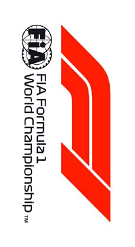
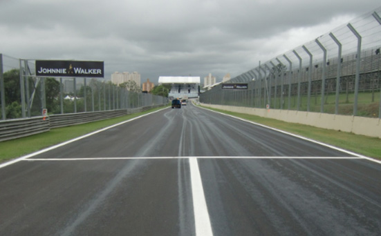
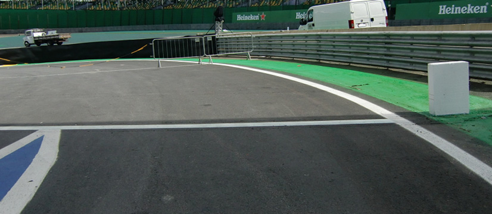
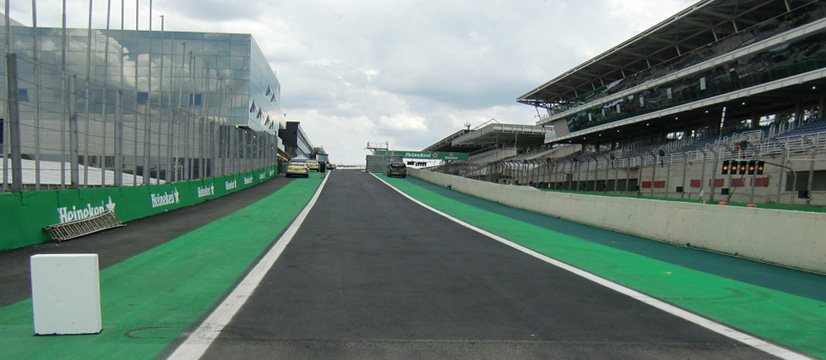
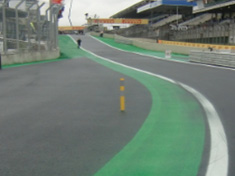
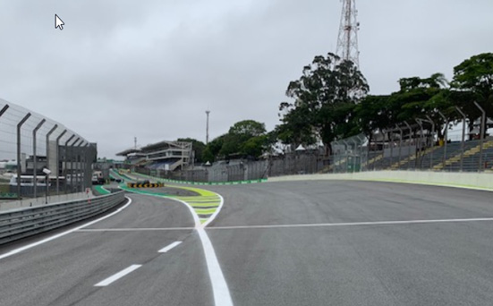
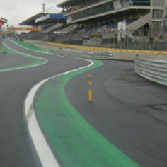

2018 BRAZILIAN GRAND PRIX

8 - 11 November 2018

From The FIA Formula One Race Director Document 2

To All Teams, All Officials Date 08 November 2018

Time 08:30

Title Event Notes

Description Event Notes

Enclosed 2018_11_08_BRAZILIAN_GP_EVENT_NOTES.pdf

Charlie Whiting

The FIA Formula One Race Director

2018 BRAZILIAN GRAND PRIX

8-11 NOVEMBER 2018

From The FIA Formula One Race Director Document 2

To Formula One Team Managers Date 8 November 2018

Time 08.30

EVENT NOTES

8 NOVEMBER 2018

1) Issues arising from the Mexican Grand Prix

2) Changes to the circuit

2.1 The guardrails on the left between turns 3 and 4 have been raised where they had previously subsided a little.

2.2 A new double kerb has been installed on the exit of turn 4.

2.3 The foam blocks in the SAFER barrier around turn 14 have been renewed.

2.4 A small section of the pit entry has been resurfaced.

2.5 In order to ensure that the grip of the track is more consistent it has been cleaned twice with very high pressure water.

2.6 Additional grooving has been carried out in various places around the track to help improve drainage.

3) Pit lane map

3.1 Safety Car lines.

3.2 The location of the pit entry and the pit exit.

3.3 Designated garage areas.

3.4 Safety Car position for first lap and rest of race.

3.5 Blue flag marshal.

3.6 Pit entry status light panels.

1/5

4) Pirelli Event Preview

4.1 With reference to Article 24.4(a) of the Sporting Regulations see the attached document provided by the official tyre supplier.

5) Weighing and weighing platform

5.1 The weighing platform will be available for general checks at the following times, however, no more than 10 team personnel may be present during any visit. Each visit should last no more than 10 minutes unless no other team is waiting in the pit lane :

a) From 14.30 on Thursday until 14.30 on Saturday (between 13.00 and 14.30 each visit will be restricted to five minutes).

b) From when the cars are returned to the teams after qualifying until 19.30 on Saturday.

c) From 10.00 to 11.00 and then from 13.15 to 14.00 on Sunday.

Any team found to be abusing the time limits set out above, which we will be enforced by FIA security personnel and our own CCTV, will not be permitted to use the weighbridge again during the Event.

6) Red zones for photographers in the pit lane during practice sessions

6.1 See the attached drawing.

7) Practice starts

7.1 Practice starts may only be carried out on the left at the end of the pit exit, room must always be left on the right for another car to pass if necessary.

There will be two marshals on the left behind the guardrail in the pit exit who will wave white flags when a car is stopped for the purpose of carrying out a practice start.

7.2 For reasons of safety and sporting equity, cars may not stop in the fast lane at any time the pit exit is open without a justifiable reason (a practice start is not considered a justifiable reason).

8) Pit exit

8.1 If one of your drivers is forced to stop in the pit exit, i.e. between the end of the pit lane and the place where they re-join the track proper, please ask them to stop on the left. There is more space on the left and the car can remain in a safe position.

9) Pit entry and pit exit

9.1 In accordance with Chapter 4 (Section 5) of Appendix L to the ISC drivers must keep to the left of the solid white line at the pit exit when leaving the pits, no part of any car leaving the pits may cross this line.

9.2 For safety reasons drivers must stay to the left of the white line at the pit entry.

9.3 Taking equipment to or from the grid via the gate in the pit entry will be permitted during the time the pit lane is open for the race (14.30-14.40 on Sunday), provided this is done by using only the green painted area to the left of the pit entry (when viewed from the pit lane looking towards the pit entry). Whenever team personnel are using this route a waved yellow flag will be shown to drivers entering the pits, they must slow down significantly in the pit entry and drive a greatly reduced speed in the pit lane itself.

2/5

9.4 Due to the nature of the pit exit we do not expect any driver intending to carry out a practice start to carry out any pre-start routines, this will be considered driving unnecessarily slowly in the pit exit and a report will be made to the stewards as a breach of Article 27.4 of the Sporting Regulations.

Therefore, and for the avoidance of doubt, any driver intending to carry out a practice start at the pit exit must drive to the allocated place as quickly as possible without slowing to carry out “burn-outs” or any associated pre-start routine.

This will apply at all times during the Event.

10) Observing yellow flags during free practice and qualifying

10.1 Double waved : Any driver passing through a double waved yellow marshalling sector must reduce speed significantly and be prepared to change direction or stop. In order for the stewards to be satisfied that any such driver has complied with these requirements it must be clear that he has not attempted to set a meaningful lap time, for practical purposes this means the driver should abandon the lap (this does not necessarily mean he has to pit as the track could well be clear the following lap).

10.2 Single waved : Drivers should reduce their speed and be prepared to change direction. It must be clear that a driver has reduced speed and, in order for this to be clear, a driver would be expected to have braked earlier and/or discernibly reduced speed in the relevant marshalling sector.

Drivers should not overtake any car in a single waved yellow marshalling sector unless it is clear that a car is slowing with a completely obvious problem, e.g. obvious accident damage or a deflated tyre.

11) Light panels

11.1 The FIA light panels have been installed in the positions shown on the circuit map. In accordance with Appendix H to the ISC the light signals have the same meaning as flag signals.

11.2 The light panel on the left in the pit entry relates only to cars in the pit entry (as opposed to cars on the track) and will be used to warn cars entering the pits that a car is either stopped or going slowly in the pit entry. This panel is designated “PE” on the circuit map.

12) Drivers leaving their pit stop position in the pit lane

12.1 For safety reasons, no car should be driven from its pit stop position at any time unless :

a) It has first been driven into the pit stop position having just entered the pit lane from the track, and ;

b) It is then driven immediately back onto the track from the pit stop position.

13) Fire extinguishers around the circuit

13.1 Where there are white boards with an red letter ‘F’ on the guardrails or debris fences these are accompanied by a small orange sticker. In these locations extinguishers are manned (40 in total around the track).

13.2 Where there are only small orange stickers present there is an extinguisher but it is not manned (360 in total around the track).

14) Places to remove cars from the track

14.1 Indicated by fluorescent orange panels on the walls or guardrails.

3/5

15) In laps and reconnaissance laps

15.1 In order to ensure that cars are not driven unnecessarily slowly on in laps during and after the end of qualifying or during reconnaissance laps when the pit exit is opened for the race, drivers must stay below the maximum time set by the FIA between the Safety Car lines shown on the pit lane map.

We will inform you of the maximum time after the first day of practice.

16) Post qualifying parc fermé

16.1 The cameras should be installed and operated in the same way as usual.

17) Operational personnel curfew

17.1 Boards warning anyone attempting to enter the paddock that the curfew is in operation will be placed immediately before the entry turnstiles at the appropriate times.

18) Removing cars from the grid

18.1 Via the gate in the pit entry alongside grid position 17.

19) Car number light panels for the start

19.1 On the driver’s right.

20) Track light panels displaying pit entry status

20.1 The light panels indicated on the pit lane map will display flashing yellow arrows if cars are required to use the pit lane once the Safety Car has been deployed during the race.

20.2 The light panels indicated on the pit lane map will display flashing red crosses if the pit lane is closed at any point during the race.

21) Lapping during the race

21.1 The ISC requires drivers who are caught by another car about to lap him to allow the faster driver past at the first available opportunity. The F1 Marshalling System has been developed in order to ensure that the point at which a driver is shown blue flags is consistent, rather than trusting the ability of marshals to identify situations that require blue flags.

As it was at the end of last season the system will be set to give a pre-warning when the faster car is within 3.0s of the car about to be lapped, this should be used by the team of the slower car to warn their driver he is soon going to be lapped and that allowing the faster car through should be considered a priority. When the faster car is within 1.2s of the car about to be lapped blue flags will be shown to the slower car (in addition to blue light panels, blue cockpit lights and a message on the timing monitors) and the driver must allow the following driver to overtake at the first available opportunity.

It should be noted that the aim of using F1MS is ensure consistent application of the rules, additional instructions may also be given by race control when necessary.

22) Rolling starts

22.1 If a rolling start procedure is used as set out in Article 39.16 the race will be deemed to have started when the leading car crosses the Line after the safety car has returned to the pits.

For the avoidance of doubt, and with the exception of the permission given in Article 39.16, no driver may overtake until he reaches the Line, unless a car slows with an obvious problem.

4/5

23) Post race parc fermé

23.1 Cars should complete a full slowing down lap and enter the pits normally, all cars will then be stopped in the weighing area.

24) Any other business

Charlie Whiting FIA Formula One Race Director

5/5

|  |  |  | Grand Prix of Brazil 09-11/11/2018 (18R20INT) |  |  |  |  |  |  |  |  |  |  |  |  |  |  |  |  |  |  |  |  |  |  |
| --- | --- | --- | --- | --- | --- | --- | --- | --- | --- | --- | --- | --- | --- | --- | --- | --- | --- | --- | --- | --- | --- | --- | --- | --- | --- |
|  |  |  | Compound |  |  | FL | FR | RL |  | RR |  |  |  |  |  |  | Ma |  |  |  |  |  |  |  | ndatory race tyres |
|  |  |  | MEDIUM |  |  | M60 | M62 | M70 |  | M72 |  |  |  |  |  |  |  |  |  |  |  |  |  |  | MEDIUM |
|  |  |  | SOFT |  |  | S60 | S62 | S70 |  | S72 |  |  |  |  |  |  |  |  |  |  |  |  |  |  | SOFT |
|  |  |  | SUPERSOFT |  |  | X60 | X62 | X70 |  | X72 |  |  |  |  |  |  |  |  |  |  |  |  |  |  |  |
|  |  |  | INTERMEDIATE BASE |  |  | I37 | I38 | I39 |  | I40 |  |  |  |  |  |  |  |  |  |  |  |  |  |  | Q3 tyre |
|  |  | Cross-Over time WET > 119% > INT > 113% > DRY | WET BASE MINIMUM STARTING PRESSURE, BLISTERING SENSITIVITY, CAMBER LIMIT |  |  | R37 | R38 Front (psi) | R39 |  | R40 |  |  |  |  |  | Rear (psi) |  |  |  |  |  |  |  |  | SUPERSOFT |
|  |  |  |  | Slicks |  |  | 23.0 |  |  |  |  |  |  |  |  |  | 21.0 |  |  |  |  |  |  |  |  |
|  |  |  |  | Intermediate |  |  | 21.0 |  |  |  |  |  |  |  |  |  | 20.0 |  |  |  |  |  |  |  |  |
|  |  |  |  | Wet |  |  | 20.0 |  |  |  |  |  |  |  |  |  | 19.0 |  |  |  |  |  |  |  |  |
| FE EOS Camber limit RE EOS Camber limit -3.50 ° -2.00 ° FE Blistering RE Blistering sensitivity sensitivity High Medium |  |  | TYRE HEATING STRATEGY |  |  |  |  |  |  |  |  |  |  |  |  |  |  |  |  |  |  |  |  |  |  |
| Temperature 0 40 60 80 100 (°C) |  |  |  |  |  |  |  |  |  |  |  |  |  |  |  |  |  |  |  |  |  |  |  |  |  |
|  |  |  |  |  | Slicks |  | storage |  |  |  |  |  |  |  |  |  |  | m | a | x | . | 3 | h | ma | x. 2h (max. temp = 100°C) |
|  |  |  |  |  | Intermediate |  | storage |  |  |  | m | ax | . | 2 | h |  |  | m | a | x | . | 3 | 0' |  | (max. temp = 80°C) |
|  |  |  |  |  | Wet |  | storage |  |  |  | m | ax | . | 2 | h |  |  |  |  |  |  |  |  |  | (max. temp = 60°C) |
| (Time limits apply before the start of each session). (Max. temperature for each product applies at all times during the event). GENERAL NOTES Teams are kindly reminded that the following parameters will be subjected to FIA checks during the event: - Starting pressure. - Camber at maximum speed. - Maximum blanket temperature. - Tyre swapping. | Tyre Notes |  |  |  |  |  |  |  |  |  |  |  |  |  |  |  |  |  |  |  |  |  |  |  |  |
| ●Not permitted to switch tyres from their originally allocated position. ●All temperature limits apply to the actual tyre surface temperature, measured with the IR gun detailed in TD029-15. ●Do not subject tyres to large deformation or heavy impact. ●SIDEWALL HEATING CLARIFICATION (all products): Teams are allowed to apply ●Do not leave fitted tyres exposed at an air temperature lower than 15°C a max. temperature of 100 °C for max. 1 hr to the sidewalls as long as the max. and/or any UV emission. temp/time at any part of the tread is the one described in the corresponding section above. ● Revised prescriptions could be issued during the race weekend in accordance with TD/007-16. ●BLANKET HEATING TIME for each temperature range to be counted from the moment the blanket control unit is set to reach its targeted temperature within ●STORAGE temperature is the recommended temperature the tyre can stay in its correspondent interval. blankets without time limit. | ●Not permitted to switch tyres from their originally allocated position. ●Do not subject tyres to large deformation or heavy impact. ●Do not leave fitted tyres exposed at an air temperature lower than 15°C and/or any UV emission. ● Revised prescriptions could be issued during the race weekend in accordance with TD/007-16. ●STORAGE temperature is the recommended temperature the tyre can stay in blankets without time limit. |  |  |  |  |  |  |  | ●All temperature limits apply to the actual tyre surface temperature, measured with the IR gun detailed in TD029-15. ●SIDEWALL HEATING CLARIFICATION (all products): Teams are allowed to apply a max. temperature of 100 °C for max. 1 hr to the sidewalls as long as the max. temp/time at any part of the tread is the one described in the corresponding section above. ●BLANKET HEATING TIME for each temperature range to be counted from the moment the blanket control unit is set to reach its targeted temperature within its correspondent interval. |  |  |  |  |  |  |  |  |  |  |  |  |  |  |  |  |

enaL

8102

| illeriP |  |
| --- | --- |
| illeriP |  |
| illeriP |  |
| rebuaS | rebuaS |
| rebuaS |  |
| neraLcM | neralcM |
| neraLcM |  |
| saaH | saaH |
| saaH |  |
| ossoR oroT | ossoR oroT |
| ossoR oroT |  |
| tluaneR | tluaneR |
| tluaneR |  |
| smailliW | smailliW |
| smailliW |  |
| aidnI ecroF | aidnI ecroF |
| aidnI ecroF |  |
| lluB deR | lluB deR |
| lluB deR |  |
| irarreF | irarreF |
| irarreF |  |
| sedecreM | sedecreM |
| sedecreM |  |
| AIF | detangiseD saerA egaraG |

tiP 32 rebmevoN

22 8– 1 12 noisreV 2 eniL sdnE

RAC ENAL 02 YTEFAS TIP 91

81 ENAL

TSAF 71

TIXE 61 TIP RAC

YTEFAS ecaR segaraG 51

xirP GALF 41 lahsraM 1F ETIHW dnarG galF lahsram 31 eulB stratS

CR 21 ENAL nailizarB TIP 11

01

8102 sdrallob 9 YRTNE 1 eniL

xepa RAC 8 TIP dna YTEFAS 7

GALF lahsraM X 6 ETIHW noitisoP

5 ENAL eloP slenap 4 yrtnE TSAF

sutatS tiP 3

2 X

1 eniL

RAC lortnoC 0 paL YTEFAS tsriF
