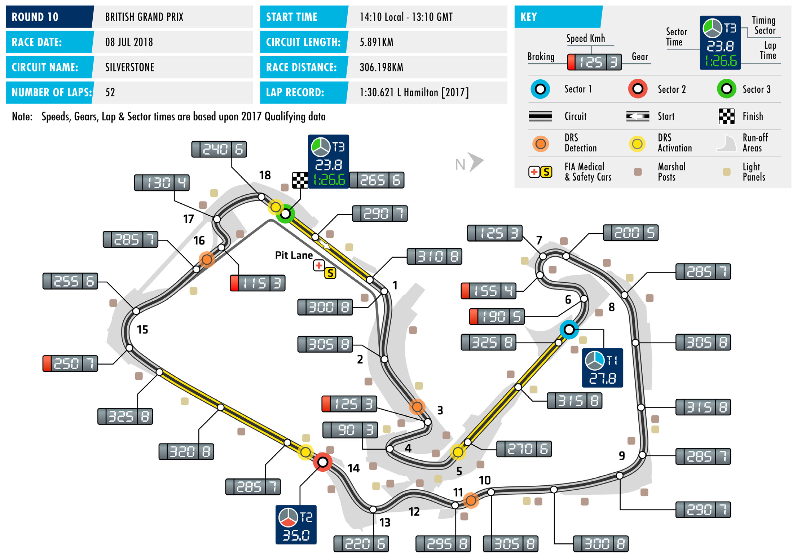

2018 BRITISH GRAND PRIX

06 – 08 July 2018

Following hard on the heels of races in France and Austria, this SILVERSTONE CIRCUIT

week teams reach the final act of F1’s first triple-header, the Length of lap:

British Grand Prix at Silverstone, Round 10 of the 2018 FIA Formula 5.891km

One World Championship. Lap record: 1:30.621 (Lewis Hamilton, Mercedes, The wide-open spaces of Silverstone couldn’t be more different 2017)

to the undulating Red Bull Ring. The Northamptonshire circuit is a Start line/finish line offset:

driver favourite, with a barrage of fast, flowing corners, of which 0.134km

high-speed Copse and the ultra-quick changes of direction through Total number of race laps: 52

Maggotts, Becketts and Chapel are the standouts. Total race distance: 306.198km

That said, ever since Silverstone adopted its new ‘Arena’ layout in Pitlane speed limits: 80km/h in practice, qualifying, and 2010, extra variety has been added to the circuit, with the intricate the race low-speed infield section offering a choice of racing lines and also CIRCUIT NOTES complicating the set-up decisions teams have to make. ► The entire track has been Silverstone is one of the easiest circuits on the F1 calendar resurfaced.

for braking but one of the toughest on tyres, the unrelenting ► The longitudinal and lateral sequences of high-speed turns putting vast amounts of lateral cambers of the track have been energy into the rubber. Accordingly, Pirelli have chosen to bring changed to assist drainage in Turns 1, 6, 16, 17 and 18. the ice blue hard compound tyre to a race for the first time. With

the circuit having recently been resurfaced, this weekend’s tyres ► New kerb elements have been will also be the thinner-gauge tread variant, as used in Spain and added behind the existing kerb on the exit of turn 15 and at the apex France. This is designed to reduce surface overheating and the of Turn 17. type of blistering which heavily influenced the outcome of last

weekend’s Austrian Grand Prix. DRS ZONE

► Silverstone has three DRS zones Coming to Great Britain, both championship tables are very tight. this year. The detection point of Sebastian Vettel has retaken the lead in the Drivers’ Championship, the first zone is 25m before Turn ahead of Lewis Hamilton by a solitary point. Ferrari’s double 3 (Village), with the activation podium, combined with Mercedes’ double DNF in Austria, point 30m after Turn 5 (Aintree). The second detection point is has likewise changed the order at the top of the Constructors’ at Turn 11 (Maggotts) with the Championship, with the Italian team now 10 points ahead of their activation point at the exit of Turn rival. It is notable also that nine races into 2018, Ferrari, Mercedes 14 (Chapel). The final zone has a and Red Bull each have three victories. This is not simply a two- detection point 83m before Turn 16 (Vale) and activation 62m after horse race. Turn 18 (Club).

FAST FACTS

► This is the 69th F1 World Championship Aintree in 1957, and Jo Siffert at Brands ► Nigel Mansell has a record seven British Grand Prix. It is one of two ever- Hatch in 1968 for Lotus. consecutive British Grands Prix fastest present races on the calendar, the other laps, beginning at Brands Hatch in 1986, being the Italian Grand Prix. This is the ► The victory for Brooks/Moss in the 1957 followed by six more at Silverstone. 52nd race to be held at Silverstone. The British Grand Prix was Vanwall’s first win Mansell also took another fastest lap on British Grand Prix has also been held at and therefore the first F1 win for a British home soil, his first also came at Brands Aintree (1955, 1957, 1959, 1961, 1962) constructor. It was also the final time a Hatch, in the 1983 European Grand Prix. and Brands Hatch (even-numbered years victory was shared, and the third time from 1964 to 1986). overall that had happened, following ► Daniel Ricciardo made his F1 race debut shared wins for Juan Manuel Fangio and at Silverstone. The Red Bull driver was ► With 16 victories, Ferrari are the most Luigi Fagioli at the 1951 French Grand loaned to the Spanish HRT team for the successful team at the British Grand Prix, Prix and Fangio with Luigi Musso at the second half of the 2011 season. two ahead of McLaren. At Silverstone, 1956 Argentinian Grand Prix. they’re likewise ahead of McLaren with ► The Williams team had their first ever F1 13 victories to 12. Ferrari’s first F1 victory ► Jim Clark, Alain Prost and Lewis Hamilton victory at Silverstone, courtesy of Clay came at this circuit, José Froilán González are tied on five victories apiece at the Regazzoni in 1979. In 1997, they won winning the 1951 British Grand Prix for British Grand Prix. Prost (1983, 1985, their hundredth at the same venue, the Scuderia. 1989-90, 1993) and Hamilton (2008, courtesy of Jacques Villeneuve. 2014-17) have taken all of their wins ► This was also González’s first F1 victory. at Silverstone, Clark won at all three ► While the track has been used in this Three other drivers have taken a debut venues, beginning at Aintree in 1962, configuration since 2010, the grid has win at Silverstone. Giuseppe ‘Nino’ Farina taking Silverstone wins 1963, 1965 and only been in its current location since won F1’s first world championship round 1967 and a Brands Hatch victory in 1964. 2011. Hamilton is the only driver to win in 1950 for Alfa Romeo. Peter Revson Prost’s 1993 victory made him the first from pole position, doing so in each of won for McLaren in 1973, and Johnny driver to win 50 grands prix. the last three years. He is also the Herbert took victory for Benetton in winner from furthest back on this layout, 1995. Three other drivers have taken a ► A sixth victory this weekend would not winning from P6 in 2014. In the entire debut win at the British Grand Prix. They only give Hamilton the outright record for history of the race at Silverstone, that are Stirling Moss at Aintree in 1955 for British Grand Prix wins but also be a fifth has only been bettered by Emerson Mercedes, Tony Brooks for Vanwall (in a consecutive win, beating the record of Fittipaldi, the Brazilian winning from P7 car handed over to Moss after 26 laps) at four he currently shares with Clark. for McLaren in 1975.

RACE STEWARDS BIOGRAPHIES

TIM MAYER

FIA STEWARD, ORGANIZER OF THE WORLD CHAMPIONSHIPS IN THE USA

As the son of former McLaren founder Teddy Mayer, Tim Mayer grew up around motor sport. He organised IndyCar races internationally from 1992-98, aided the construction of several circuits, and produced international TV for multiple series. In 1998 he became CART’s Senior VP for Racing Operations then in 2003, Mayer became COO of IMSA, operating multiple series at all levels, including the American Le Mans Series. In 2009 he left IMSA, working independently for several US series and focusing on coordinating US motorsports with the FIA. He was elected an Independent Director of ACCUS and US FIA Delegate, responsible for World Championship events in the US. He Stewards the FIA’s F1, WEC and World RX championships as well as teaching and working on multiple commissions.

MÜMTAZ TAHINCIOĞLU

FIA STEWARD

Mümtaz Tahincioğlu is an FIA Steward in Formula One, F2, WRC and regional rally championships. He is also a former steward for the WTCC. He served on the World Motorsport Council, and as vice-president of the FIA Single-Seater commission and president of the Volunteers and Officials Commission. In his native Turkey, he is a former president of the Turkish Automobile Sports Federation (TOSFED) and former general secretary of the multi-discipline Galatasaray Sports Club. He was Turkish karting champion three times, and a Turkish and European Formula 3 driver.

TOM KRISTENSEN

1980 NINE TIMES LE MANS WINNER, GERMAN F3 CHAMPION (1991), JAPANESE F3 CHAMPION (1993) ALMS CHAMPION (2001); PRESIDENT OF THE FIA DRIVERS’ COMMISSION, FIA WORLD MOTOR SPORT COUNCIL MEMBER

Denmark’s Tom Kristensen is the most successful driver in the history of the Le Mans 24-Hour race having won the endurance event nine times before retiring from competition in November 2014. Kristensen’s oustanding career saw him race in single-seaters, touring cars as well as testing in Formula One. However, it is for his achievements in sportscars that he is correctly most lauded. His first Le Mans win came in 1997, driving for the Joest Racing team. After two years competing with BMW, he rejoined Joest, now racing as Audi Sport Team Joest, in 2000, winning three Le Mans 24-Hours in succession with the team. He won again with Bentley in 2003 before returning to the wheel of Audi machines to win in 2004-’05, 2008 and 2013. In 2013 he also won the FIA World Endurance Championship title.

2018 FIA Formula One World Championship

DRIVERS’ CHAMPIONSHIP STANDINGS

NAJIABREZA AILARTSUA EROPAGNIS IBAHD YNAMREG YRAGNUH STNIOP NIARHAB OCANOM ADANAC AIRTSUA MUIGLEB ECNARF OCIXEM ANIHC AISSUR NAPAJ LIZARB NIAPS YLATI ASU UBA BG

| 25 1 | 25 1 | 4 8 | 12 4 | 12 4 | 18 2 | 25 1 | 10 5 | 15 3 |
| --- | --- | --- | --- | --- | --- | --- | --- | --- |
| 18 2 | 15 3 | 12 4 | 25 1 | 25 1 | 15 3 | 10 5 | 25 1 | NC |
| 15 3 | NC | 15 3 | 18 2 | NC | 12 4 | 8 6 | 15 3 | 18 2 |
| 12 4 | NC | 25 1 | NC | 10 5 | 25 1 | 12 4 | 12 4 | NC |
| 8 6 | NC | 10 5 | NC | 15 3 | 2 9 | 15 3 | 18 2 | 25 1 |
| 4 8 | 18 2 | 18 2 | 14 | 18 2 | 10 5 | 18 2 | 6 7 | NC |
| NC | 10 5 | 1 10 | 13 | 8 6 | 13 | 13 | 8 6 | 10 5 |
| 10 5 | 6 7 | 6 7 | 6 7 | 4 8 | NC | NC | 16 | 4 8 |
| 6 7 | 8 6 | 8 6 | NC | NC | 4 8 | 6 7 | 2 9 | NC |
| 1 10 | 11 | 2 9 | 10 5 | 6 7 | 1 10 | 4 8 | 4 8 | 12 |
| 11 | 16 | 12 | 15 3 | 2 9 | 12 | 14 | NC | 6 7 |
| 12 | 1 10 | 11 | NC | NC | 8 6 | 2 9 | NC | 8 6 |
| NC | 12 4 | 18 | 12 | NC | 6 7 | 11 | NC | 11 |
| 13 | 12 | 19 | 8 6 | 1 10 | 18 | 1 10 | 1 10 | 2 9 |
| NC | 13 | 17 | NC | NC | 15 | 12 | 11 | 12 4 |
| 2 9 | 4 8 | 13 | 2 9 | NC | 14 | 16 | 12 | 15 |
| 14 | 14 | 14 | 4 8 | 11 | 17 | NC | 17 | 14 |
| NC | 2 9 | 16 | 11 | 13 | 11 | 15 | 13 | 1 10 |
| 15 | 17 | 20 | 1 10 | 12 | 19 | NC | 14 | NC |
| NC | 15 | 15 | NC | 14 | 16 | 17 | 15 | 13 |

1 S. VETTEL 146

2 L. HAMILTON 145

3 K. RÄIKKÖNEN 101

4 D. RICCIARDO 96

5 M. VERSTAPPEN 93

6 V. BOTTAS 92

7 K. MAGNUSSEN 37

8 F. ALONSO 36

9 N. HÜLKENBERG 34

10 C. SAINZ 28

11 S. PÉREZ 23

12 E. OCON 19

13 P. GASLY 18

14 C. LECLERC 13

15 R. GROSJEAN 12

16 S. VANDOORNE 8

17 L. STROLL 4

18 M. ERICSSON 3

19 B. HARTLEY 1

20 S. SIROTKIN 0

2018 FIA Formula One World Championship

CONSTRUCTORS’ CHAMPIONSHIP STANDINGS

NAJIABREZA AILARTSUA EROPAGNIS IBAHD YNAMREG YRAGNUH STNIOP NIARHAB OCANOM ADANAC AIRTSUA MUIGLEB ECNARF OCIXEM ANIHC AISSUR NAPAJ LIZARB NIAPS YLATI ASU UBA BG

| 40 1 3 | 25 1 NC | 19 3 8 | 30 2 4 | 12 4 NC | 30 2 4 | 33 1 6 | 25 3 5 | 33 2 3 |
| --- | --- | --- | --- | --- | --- | --- | --- | --- |
| 22 2 8 | 33 2 3 | 30 2 4 | 25 1 13 | 43 1 2 | 25 3 5 | 28 2 5 | 31 1 7 | NC NC |
| 20 4 6 | NC NC | 35 1 5 | NC NC | 25 15 10 | 27 1 9 | 27 3 4 | 30 2 4 | 25 1 NC |
| 7 7 10 | 8 6 11 | 10 6 9 | 10 5 NC | 6 7 NC | 5 8 10 | 10 7 8 | 6 8 9 | 12 NC |
| NC NC | 10 5 13 | 1 10 17 | 13 NC | 8 6 NC | 13 15 | 12 13 | 8 6 11 | 22 4 5 |
| 12 5 9 | 10 7 8 | 6 7 13 | 8 7 9 | 4 8 NC | 14 NC | 16 NC | 12 16 | 4 8 15 |
| 11 12 | 1 10 16 | 11 12 | 15 3 NC | 2 9 NC | 8 6 12 | 2 9 14 | NC NC | 14 6 7 |
| 15 NC | 12 4 17 | 18 20 | 1 10 12 | 12 NC | 6 7 19 | 11 NC | 14 NC | 11 NC |
| 13 NC | 2 9 12 | 16 19 | 8 6 11 | 1 10 13 | 11 18 | 1 10 15 | 1 10 13 | 3 9 10 |
| 14 NC | 14 15 | 14 15 | 4 8 NC | 11 14 | 16 17 | 17 NC | 15 17 | 13 14 |

1 247 SCUDERIA FERRARI

MERCEDES AMG 237 2 PETRONAS MOTORSPORT

3 ASTON MARTIN 189 RED BULL RACING

RENAULT SPORT 62 4 FORMULA ONE TEAM

49 5 HAAS F1 TEAM

44 6 MCLAREN F1 TEAM

SAHARA FORCE INDIA 42 7 F1 TEAM

RED BULL 19 8 TORO ROSSO HONDA

ALFA ROMEO 16 9 SAUBER F1 TEAM

WILLIAMS MARTINI 4 10 RACING

FORMULA ONE TIMETABLE & FIA MEDIA SCHEDULE

THURSDAY

Press conference 1500

FRIDAY

Practice session 1 1000 - 1130 Press conference 1200

Practice session 2 1400 - 1530

SATURDAY

Practice session 3 1100 - 1200 Qualifying 1400 - 1500 Followed by unilateral and press conference

SUNDAY

Drivers’ Parade 1230 Race 1410 Followed by podium interviews and press conference

ADDITIONAL MEDIA OPPORTUNITIES

QUALIFYING

All drivers eliminated in Q1 or Q2 will be available for media interviews after the end of each session, as will drivers who participated in Q3, but who are not required for the post-qualifying press conference. The TV Pen is located at the end of the paddock, next to the FIA hospitality unit .

RACE

Any driver retiring before the end of the race will be made available at the TV pen interview area. In addition, during the race every team will make available at least one senior spokesperson for interview by officially accredited TV crews. A list of those nominated will be made available in the media centre.

FIA COMMUNICATIONS DEPARTMENT press@fia.com T +33 1 43 12 58 15
