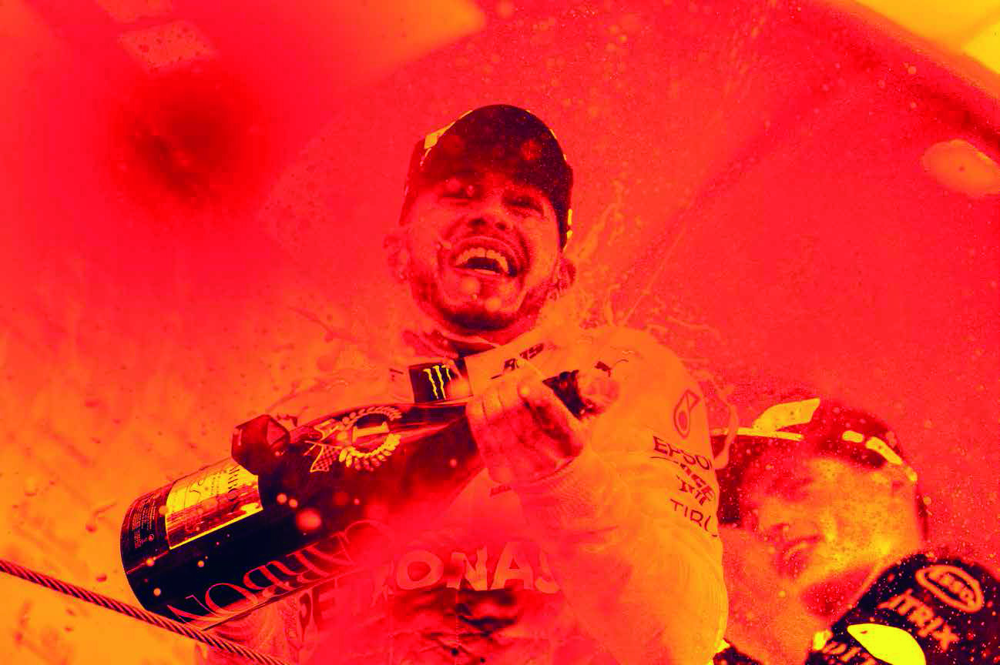
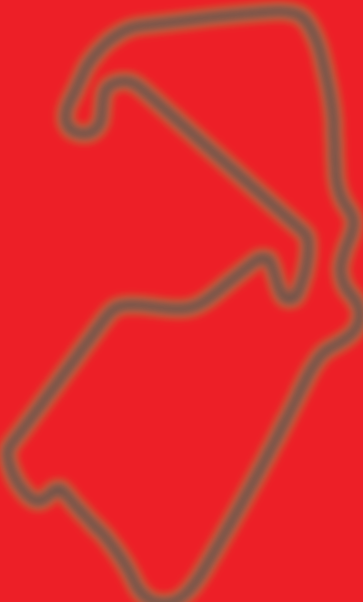
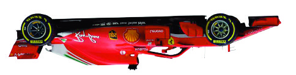
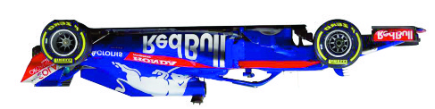
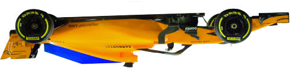
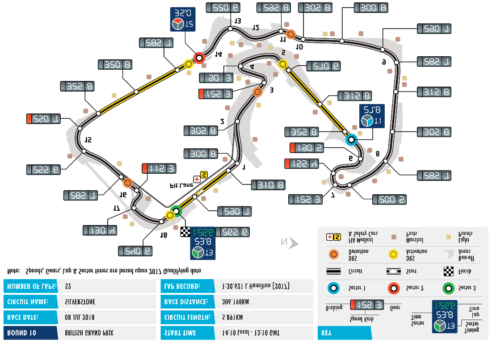

Official A4 Media Kit Cover Width 210mm x Depth 297mm (3mm bleed)

Official title sponsor

ROLEX BRITISH

GRAND PRIX

SILVERSTONE 5-8 JULY

The F1 logo, FORMULA 1, F1, FIA FORMULA ONE WORLD CHAMPIONSHIP, BRITISH GRAND PRIX and related marks are trade marks of Formula One Licensing BV, a Formula 1 company. All rights reserved OFFICIAL MEDIA KIT

Formula 1 Official Formula 1™ Media Kit 2018 Rolex British Grand Prix

Silverstone 05-08 July

CONTENTS

1

General Information

Timetable..................................................................................................3

2

Silverstone Information

Media Staff ...............................................................................................7

Useful Media Information .........................................................................8

Opening Hours of Media Facilities ...........................................................8

Accreditation Centre and Media Locations Map ......................................9

Red Zone Map .......................................................................................10

Pit Garage Allocation..............................................................................11

Silverstone Circuit Facts ........................................................................12

3

FIA Formula 1 World Championship

2018 Race Winners................................................................................13

Results of 2018 Races ..........................................................................14

Championship Positions (after Austrian GP)..........................................23

FIA Formula One World Champions 1950-2017 ....................................24

Silverstone Circuit

Silverstone Circuit, Northamptonshire NN12 8TN United Kingdom Tel: 0844 3728 200 www.silverstone.co.uk

The F1 logo, FORMULA 1, F1, FIA FORMULA ONE WORLD CHAMPIONSHIP, BRITISH GRAND PRIX and related marks are trade marks of Formula One Licensing BV, a Formula 1 company. All rights reserved 1

Formula 1 Official Formula 1™ Media Kit 2018 Rolex British Grand Prix

Silverstone 05-08 July

CONTENTS

4

Formula 1 Teams

Mercedes AMG Petronas F1 Team ........................................................25

Scuderia Ferrari .....................................................................................26

Aston Martin Red Bull Racing ...............................................................27

Sahara Force India F1 Team .................................................................28

Williams Martini Racing..........................................................................29

Renault Sport F1 Team ..........................................................................30

Red Bull Torro Rosso Honda..................................................................31

Haas F1 Team........................................................................................32

McLaren F1 Team ..................................................................................33

Alfa Romeo Sauber F1 Team.................................................................34

5

British Grand Prix

Lap timing sectors ..................................................................................35

Results of World Championship British GPs 1950-2017........................36

British Grand Prix Winners.....................................................................44

Drivers who have scored points in the British GP ..................................45

The British Racing Drivers’ Club ............................................................50

Silverstone Landmarks 1948-2017 ........................................................51 Silverstone Circuit

Silverstone Circuit, Northamptonshire NN12 8TN United Kingdom Tel: 0844 3728 200 www.silverstone.co.uk

The F1 logo, FORMULA 1, F1, FIA FORMULA ONE WORLD CHAMPIONSHIP, BRITISH GRAND PRIX and related marks are trade marks of Formula One Licensing BV, a Formula 1 company. All rights reserved 2

Formula 1 Official Formula 1™ Media Kit 2018 Rolex British Grand Prix

Silverstone 05-08 July

TIMETABLE

1

* These times refer to the start of the formation lap ¹ Fixed Time Session ² Approximate Finishing time This Timetable may be subject to change

Silverstone Circuit

Silverstone Circuit, Northamptonshire NN12 8TN United Kingdom Tel: 0844 3728 200 www.silverstone.co.uk

The F1 logo, FORMULA 1, F1, FIA FORMULA ONE WORLD CHAMPIONSHIP, BRITISH GRAND PRIX and related marks are trade marks of Formula One Licensing BV, a Formula 1 company. All rights reserved 3

Formula 1 Official Formula 1™ Media Kit 2018 Rolex British Grand Prix

Silverstone 05-08 July

TIMETABLE

* These times refer to the start of the formation lap ¹ Fixed Time Session ² Approximate Finishing time This Timetable may be subject to change

Silverstone Circuit

Silverstone Circuit, Northamptonshire NN12 8TN United Kingdom Tel: 0844 3728 200 www.silverstone.co.uk

The F1 logo, FORMULA 1, F1, FIA FORMULA ONE WORLD CHAMPIONSHIP, BRITISH GRAND PRIX and related marks are trade marks of Formula One Licensing BV, a Formula 1 company. All rights reserved 4

Formula 1 Official Formula 1™ Media Kit 2018 Rolex British Grand Prix

Silverstone 05-08 July

TIMETABLE

* These times refer to the start of the formation lap ¹ Fixed Time Session ² Approximate Finishing time This Timetable may be subject to change

Silverstone Circuit

Silverstone Circuit, Northamptonshire NN12 8TN United Kingdom Tel: 0844 3728 200 www.silverstone.co.uk

The F1 logo, FORMULA 1, F1, FIA FORMULA ONE WORLD CHAMPIONSHIP, BRITISH GRAND PRIX and related marks are trade marks of Formula One Licensing BV, a Formula 1 company. All rights reserved 5

Formula 1 Official Formula 1™ Media Kit 2018 Rolex British Grand Prix

Silverstone 05-08 July

TIMETABLE

* These times refer to the start of the formation lap ¹ Fixed Time Session ² Approximate Finishing time This Timetable may be subject to change

Silverstone Circuit

Silverstone Circuit, Northamptonshire NN12 8TN United Kingdom Tel: 0844 3728 200 www.silverstone.co.uk

The F1 logo, FORMULA 1, F1, FIA FORMULA ONE WORLD CHAMPIONSHIP, BRITISH GRAND PRIX and related marks are trade marks of Formula One Licensing BV, a Formula 1 company. All right s reserved 6

FFoorrmmuullaa 11 OOffffiicciiaall FFoorrmmuullaa 11™™ MMeeddiiaa KKiitt 22001188 RRoolleexx BBrriittiisshh GGrraanndd PPrriixx

SSiillvveerrssttoonnee 0055--0088 JJuullyy

MEDIA CONTACTS

FIA F1 Head of Communications & Media Delegate Matteo Bonciani Tel: +44 1327 320465 Mob: + 33 6763 22490

2 National Press Officer Dan Leach Tel: +44 1327 320462 Mob: +44 7956 105171

Media Accreditation Office Tel: +44 1327 857715 Carrie Bedford +44 1327 857727 Nicole Bralsford Marian Carr Mark Cone, Manager Kristina Gogin Enid Smith

International Media Centre Tel: +44 1327 320461 Fax: +44 1327 857849 Mark Baulch Mark Gold (French/Spanish/Italian speaker) Victoria Martin Daniel Nieroda Robert Pike Olivia Pocklington Thomas Spruce Tim Swietochowski Sarah Tibbetts

Photographers’ Area Tel: +44 1327 320463 Nigel Bailey Nick Gladwin

Pool Photographers Dan Bathie Mob: +44 7552 236849 Mike Hoyer Mob: +44 7799 836817

Photographers’ Shuttle Bus Drivers Alasdair Gill Mob: +44 7970 467942 Tom Howell Richard Templeman Seth Wilde

Silverstone Circuits Limited Media Office Tel: +44 1327 320445 / +44 1327 320467 Jade Beckett, Senior Event Brand Manager Mob: +44 7507 666715 Katie Tyler, Head of Communications Mob: +44 7771 808352

Silverstone Circuit

Silverstone Circuit, Northamptonshire NN12 8TN United Kingdom Tel: 0844 3728 200 www.silverstone.co.uk

The F1 logo, FORMULA 1, F1, FIA FORMULA ONE WORLD CHAMPIONSHIP, BRITISH GRAND PRIX and related marks are trade marks of Formula One Licensing BV, a Formula 1 company. All rights reserved 7

Formula 1 Official Formula 1™ Media Kit 2018 Rolex British Grand Prix

Silverstone 05-08 July

USEFUL MEDIA INFORMATION

Media Parking Photographers’ Area All Media car parking will be in the centre of the Circuit. A The Photographers’ Area is located adjacent to the shuttle bus system will be in operation to take media to and International Media Centre. from the International Media Centre in the F1 Paddock. The shuttle bus stop is situated next to the media car park and Photographers’ Tower the shuttles will be marked “F1 Personnel Shuttle”. There is a photographers’ tower and four photographer bunkers around the circuit (please check the red zone map The hours of operation will be from 06.00 until midnight on for details). Thursday and then from 05.00 on Friday running continuously through to 05.00 on Monday. Photographers’ Shuttles A shuttle bus will transport fully accredited photographers Thursday 06.00 – 00.00 around the circuit according to the following schedule. Friday 05.00 – Monday 05.00 The shuttle will leave the Paddock Bus Stop 60 minutes WiFi / Telecommunications before the start of each F1 session. On Sunday, the first By courtesy of Silverstone, a wireless internet connection shuttle will leave 90 minutes before the race. will be available in the International Media Centre and Photographers' Area. This service is free of charge. Please Media Café note that there are also telephones available for use on the Complimentary tea, coffee and biscuits are available in the front desks in the media centre.. Media Café. Silverstone will also provide a complimentary hot meal for all media personnel at the Media Café on To access the WiFi, please follow these instructions: Sunday evening at 19.30.

• Switch on your device and check that WiFi is enabled. • Select “2018F1GP Media” from the available network list. • Enter the following password “press2018F1” - please MEDIA SERVICES OPENING HOURS note this is case sensitive.

Media Accreditation Centre Lockers

Digital lockers are available in the International Media Thursday 08.00hrs – 18.00hrs Centre and the Photographers’ Area. Please see Reception Friday 08.00hrs – 16.00hrs staff to book. Saturday 08.00hrs – 12.00hrs Sunday Closed. Any remaining passes will be held at Ticket Collection.

International Media Centre and Photographers’ Area

Thursday 09.00hrs – 22.00hrs Friday 07.00hrs – 23.00hrs Saturday 07.00hrs – 23.00hrs Sunday 07.00hrs until the last journalist leaves

Silverstone Circuit

Silverstone Circuit, Northamptonshire NN12 8TN United Kingdom Tel: 0844 3728 200 www.silverstone.co.uk

The F1 logo, FORMULA 1, F1, FIA FORMULA ONE WORLD CHAMPIONSHIP, BRITISH GRAND PRIX and related marks are trade marks of Formula One Licensing BV, a Formula 1 company. All rights reserved 8

Formula 1 Official Formula 1™ Media Kit 2018 Rolex British Grand Prix

Silverstone 05-08 July

ACCREDITATION CENTRE

AND MEDIA LOCATIONS PLAN

ACCREDITATION CENTRE Any media accessing the OPENING HOURS Circuit via East Entrance will need to drive around the Thursday 5 July 08.00 - 18.00 Copse Tunnel external perimeter road Friday 6 July 08.00 - 16.00 NATIONAL PITS STRAIGHT to the main entrance. CORNER There will be no vehicular S a t u rd a y 7 J u l y 08.00 - 12.00 C O P S E access via Gate 6/Copse OTE C O R N E R Tunnel. S u n d ay 8 J u l y C Ticket collection office D O East Entrance 08.00 - 11.00 O W BROOKLANDS Opening Times CORNER Friday 6 July 06.00-14.00 inbound BUS 14.00-21.00 outbound Saturday 7 July MEDIA 06.00-14.00 inbound CAR PARK 14.00-21.00 outbound Sunday 8 July 06.00-13.00 inbound 13.00-21.00 outbound

LUFFIELD CORNER

S s t h a o y r t P S G e a c t u e rity A I N T R E E M e d i a WELLINGTON C O R N E R STRAIGHT

MAGGOTTS CORNER Main Entrance VILLAGE CORNER

BECKETTS CORNER DAOR FARM CURVE DROFDAD INTERNATIONAL ABBEY MEDIA CENTRE THE LOOP ENTRANCE 03 T H G AI R T S S PODIUM PI T CHAPEL CURVE L N A HANGAR O ATI STRAIGHT N R E T I N Circuit Location Silverstone Village A43 BUS

Towcester CLUB Northampton CORNER Junction 15A M1 A43

VALE Brackley Junction 10 M40

STOWE CORNER

Buckingham

Silverstone Circuit

Silverstone Circuit, Northamptonshire NN12 8TN United Kingdom Tel: 0844 3728 200 www.silverstone.co.uk

The F1 logo, FORMULA 1, F1, FIA FORMULA ONE WORLD CHAMPIONSHIP, BRITISH GRAND PRIX and related marks are trade marks of Formula One Licensing BV, a Formula 1 company. All rights reserved 9

Formula 1 Official Formula 1™ Media Kit 2018 Rolex British Grand Prix

Silverstone 05-08 July

RED ZONES

NATIONAL PITS STRAIGHT B COPSE WOODCOTE CORNER CORNER

BROOKLANDS CORNER

B WELLINGTON STRAIGHT BUS LUFFIELD CORNER

AINTREE CORNER MAGGOTTS BUS CORNER VILLAGE CORNER

BECKETTS T CORNER

ABBEY

BUS FARM CURVE THE LOOP BUS

CHAPEL CURVE INTERNATIONAL PITS STRAIGHT INTERNATIONAL MEDIA CENTRE

BUS BUS

B CLUB HANGAR CORNER STRAIGHT

VALE BUS STOWE B Bunker CORNER

T Tower

BUS Photo Shuttle Bus Stops B

Silverstone Circuit

Silverstone Circuit, Northamptonshire NN12 8TN United Kingdom Tel: 0844 3728 200 www.silverstone.co.uk

The F1 logo, FORMULA 1, F1, FIA FORMULA ONE WORLD CHAMPIONSHIP, BRITISH GRAND PRIX and related marks are trade marks of Formula One Licensing BV, a Formula 1 company. All rights reserved 10

Formula 1 Official Formula 1™ Media Kit 2018 Rolex British Grand Prix

Silverstone 05-08 July

F1 TEAM GARAGE ALLOCATION

01 Formula One Management

02, 03, 04, 05 FIA

F1 TEAMS

6, 7, 8 Haas F1 Team

9, 10, 11 Renault Sport F1 Team

12, 13, 14, 15 Sahara Force India F1 Team

16, 17, 18, 19 Mercedes AMG Petronas F1 Team

20, 21, 22, 23 Scuderia Ferrari

24, 25, 26, 27 Aston Martin Red Bull Racing

28, 29, 30 Williams Martini Racing

31, 32, 33 McLaren F1 Team

34, 35, 36 Red Bull Toro Rosso Honda

37, 38, 39 Alfa Romeo Sauber F1 Team

40, 41 F1 Experience

Silverstone Circuit

Silverstone Circuit, Northamptonshire NN12 8TN United Kingdom Tel: 0844 3728 200 www.silverstone.co.uk

The F1 logo, FORMULA 1, F1, FIA FORMULA ONE WORLD CHAMPIONSHIP, BRITISH GRAND PRIX and related marks are trade marks of Formula One Licensing BV, a Formula 1 company. All rights reserved 11

Formula 1 Official Formula 1™ Media Kit 2018 Rolex British Grand Prix

Silverstone 05-08 July

SILVERSTONE FACTS

GRAND PRIX CIRCUIT

NNAATTIIOONNAALL PPIITTSS SSTTRRAAIIGGHHTT CCOOPPSSEE Copse Corner: Named after nearby Copses – WWOOOODDCCOOTTEE CCOORRNNEERR Chapel Copse wood and Foxhole Copse. CCOORRNNEERR Maggotts Corner: Named after Maggot Moor. Becketts Corner:Adjacent to the ancient (1174) Chapel of St Thomas a` Beckett. Chapel Curve: Also relating to the Thomas a` Beckett Chapel. BBRROOOOKKLLAANNDDSS hangar Straight: Used to sweep past two large aircraft CCCOORRNNEERR hangars that were used in World War 2. Stowe Corner: Derives from the famous Stowe School to the south of the circuit. WWEELLLLIINNGGTTOONN vale:The link between Stowe Corner and Club Corner, which SSTTRRAAIIGGHHTT is set at a lower level to provide some undulation. It is thus a LLLUUUFFFFFFFFFIIIIEEEELLLLLDDDD kind of vale and is also located in the area of Aylesbury CCOORRNNEERR Vale District Council. Club Corner:The RAC organised the first Grand Prix at Silverstone and were instrumental in the naming of the original corners and this name AAIINNTTRREEEEEE was chosen to reflect the RAC’s clubhouse in Pall Mall. CCCCOOORRNNEERRR MMMAAGGGOTTS international Pits Straight:When the Grand Prix Circuit is divided into the International Circuit and the National Circuit, this is the VVIILLLLAAGGEE CCCOORRNER Pits Straight located on the International Circuit. CCOORRNNEERR Abbey Corner: “Luffield Abbey Farm” is what the existing Farm used to be called. The original Abbey was called BBBEECCKKEETTS Abbey Curve but the latest iteration is too acute to be CCCOORRNNEER called a curve and so it has been named ‘Abbey Corner’. AABBBBEEYY Farm Curve: Long left after Abbey Corner. This passes close to the Farm and campsite. HH TT TTHHHEEEEE LLLLLOOOOOOOOOPPP GG village Corner: Right hander after ‘Farm Curve’. AAII FFFFAAAARRRRMMMM CCCCUUUURRRVVVEE RR This is called ‘Village Corner’ after Silverstone Village. TT SS The loop:The long left hand corner referred to as ‘The Loop’. SS TT PPII Aintree Corner:The next, more gradual left hander, LL is called Aintree after the circuit where the NN AA CCCHHAAPPEELL CCUURVE British Grand Prix took place in 1955, 1957, 1959, OO TTII 1961 and 1962. This is consistent with the existing NN AA The SilverSTone Wing houses 41 garages, Brooklands Corner named after the circuit where RR race control, media centre, podium, a 100 seat the British Grand Prix took place in TT EE auditorium and hospitality areas. NN 1926 and 1927. II Wellington Straight:The straight to Brooklands, formerly known as the National Straight. This has been renamed ‘Wellington Straight’ CCCCLLLUUBB after the aircraft based at Silverstone CCCCOORRNNEERR during WW2. The straight is one of HHHAANNGGAARR the old runways. SSSSTTTRRAAIIGGHHTT Brooklands Corner: Named after the circuit where the British Grand Prix took place in 1926 and 1927. luffield Corner: Named after the ancient Luffield Abbey. Woodcote Corner: Named after the location of the VVAALLEEE RAC Club in Surrey. Circuit length - 5.891km (3.66 miles) national Pits Straight:When the Grand Prix Circuit is lap record - 1:33.401 - Mark Webber 2013 divided into the international Circuit and the National Circuit, SSTTOOWWEE this is the Pits Straight located on the National Circuit. CCCOORRNNEERR Average width of track - 15 metres hangar Straight - 770 metres Pit lane length - 457 metres

12

Formula 1 Official Formula 1™ Media Kit 2018 Rolex British Grand Prix

Silverstone 05-08 July

2018 FIA FORMULA 1

WORLD CHAMPIONSHIP

3 RACE WINNERS PRECEDING

THE 2018 FORMULA 1 ROLEX BRITISH GRAND PRIX

Grand Prix Date Winning Driver Team

Australia 25/03/2018 Sebastian Vettel Scuderia Ferrari

Bahrain 08/04/2018 Sebastian Vettel Scuderia Ferrari

China 13/04/2018 Daniel Ricciardo Red Bull Tag Heuer

Azerbaijan 29/04/2018 Lewis Hamilton Mercedes AMG Petronas F1 Team

Spain 13/05/2018 Lewis Hamilton Mercedes AMG Petronas F1 Team

Monaco 28/05/2018 Daniel Ricciardo Red Bull Tag Heuer

Canada 10/06/2018 Sebastian Vettel Scuderia Ferrari

France 24/06/2018 Lewis Hamilton Mercedes AMG Petronas F1 Team

Max Verstappen Austria 01/07/2018 Red Bull Tag Heuer

Silverstone Circuit

Silverstone Circuit, Northamptonshire NN12 8TN United Kingdom Tel: 0844 3728 200 www.silverstone.co.uk

The F1 logo, FORMULA 1, F1, FIA FORMULA ONE WORLD CHAMPIONSHIP, BRITISH GRAND PRIX and related marks are trade marks of Formula One Licensing BV, a Formula 1 company. All rights reserved 13

Formula 1 Official Formula 1™ Media Kit 2018 Rolex British Grand Prix

Silverstone 05-08 July

RACE RESULTS 2018

Pos No. Driver F1 Team Laps Time/Retired Points

1 5 Sebastian Vettel FERRARI 58 1:29:33.283 25

2 44 Lewis Hamilton MERCEDES 58 +5.036s 18

3 7 Kimi Räikkönen FERRARI 58 +6.309s 15

4 3 Daniel Ricciardo RED BULL RACING TAG HEUER 58 +7.069s 12

5 14 Fernando Alonso MCLAREN RENAULT 58 +27.886s 10

6 33 Max Verstappen RED BULL RACING TAG HEUER 58 +28.945s 8

7 27 Nico Hulkenberg RENAULT 58 +32.671s 6

8 77 Valtteri Bottas MERCEDES 58 +34.339s 4

9 2 Stoffel Vandoorne MCLAREN RENAULT 58 +34.921s 2

10 55 Carlos Sainz RENAULT 58 +45.722s 1

11 11 Sergio Perez FORCE INDIA MERCEDES 58 +46.817s 0

12 31 Esteban Ocon FORCE INDIA MERCEDES 58 +60.278s 0

13 16 Charles Leclerc SAUBER FERRARI 58 +75.759s 0

14 18 Lance Stroll WILLIAMS MERCEDES 58 +78.288s 0

15 28 Brendon Hartley SCUDERIA TORO ROSSO HONDA 57 +1 lap 0

NC 8 Romain Grosjean HAAS FERRARI 24 DNF 0

NC 20 Kevin Magnussen HAAS FERRARI 22 DNF 0

NC 10 Pierre Gasly SCUDERIA TORO ROSSO HONDA 13 DNF 0

NC 9 Marcus Ericsson SAUBER FERRARI 5 DNF 0

NC 35 Sergey Sirotkin WILLIAMS MERCEDES 4 DNF 0

Silverstone Circuit

Silverstone Circuit, Northamptonshire NN12 8TN United Kingdom Tel: 0844 3728 200 www.silverstone.co.uk

The F1 logo, FORMULA 1, F1, FIA FORMULA ONE WORLD CHAMPIONSHIP, BRITISH GRAND PRIX and related marks are trade marks of Formula One Licensing BV, a Formula 1 company. All rights reserved 14

Formula 1 Official Formula 1™ Media Kit 2018 Rolex British Grand Prix

Silverstone 05-08 July

RACE RESULTS 2018

Pos No. Driver F1 Team Laps Time/Retired Points

1 5 Sebastian Vettel FERRARI 57 1:32:01.940 25

2 77 Valtteri Bottas MERCEDES 57 +0.699s 18

3 44 Lewis Hamilton MERCEDES 57 +6.512s 15

4 10 Pierre Gasly SCUDERIA TORO ROSSO HONDA 57 +62.234s 12

5 20 Kevin Magnussen HAAS FERRARI 57 +75.046s 10

6 27 Nico Hulkenberg RENAULT 57 +99.024s 8

7 14 Fernando Alonso MCLAREN RENAULT 56 +1 lap 6

8 2 Stoffel Vandoorne MCLAREN RENAULT 56 +1 lap 4

9 9 Marcus Ericsson SAUBER FERRARI 56 +1 lap 2

10 31 Esteban Ocon FORCE INDIA MERCEDES 56 +1 lap 1

11 55 Carlos Sainz RENAULT 56 +1 lap 0

12 16 Charles Leclerc SAUBER FERRARI 56 +1 lap 0

13 8 Romain Grosjean HAAS FERRARI 56 +1 lap 0

14 18 Lance Stroll WILLIAMS MERCEDES 56 +1 lap 0

15 35 Sergey Sirotkin WILLIAMS MERCEDES 56 +1 lap 0

16 11 Sergio Perez FORCE INDIA MERCEDES 56 +1 lap 0

17 28 Brendon Hartley SCUDERIA TORO ROSSO HONDA 56 +1 lap 0

NC 7 Kimi Räikkönen FERRARI 35 DNF 0

NC 33 Max Verstappen RED BULL RACING TAG HEUER 3 DNF 0

NC 3 Daniel Ricciardo RED BULL RACING TAG HEUER 1 DNF 0

Silverstone Circuit

Silverstone Circuit, Northamptonshire NN12 8TN United Kingdom Tel: 0844 3728 200 www.silverstone.co.uk

The F1 logo, FORMULA 1, F1, FIA FORMULA ONE WORLD CHAMPIONSHIP, BRITISH GRAND PRIX and related marks are trade marks of Formula One Licensing BV, a Formula 1 company. All rights reserved 15

Formula 1 Official Formula 1™ Media Kit 2018 Rolex British Grand Prix

Silverstone 05-08 July

RACE RESULTS 2018

Pos No. Driver F1 Team Laps Time/Retired Points

1 3 Daniel Ricciardo RED BULL RACING TAG HEUER 56 1:35:36.380 25

2 77 Valtteri Bottas MERCEDES 56 +8.894s 18

3 7 Kimi Räikkönen FERRARI 56 +9.637s 15

4 44 Lewis Hamilton MERCEDES 56 +16.985s 12

5 33 Max Verstappen RED BULL RACING TAG HEUER 56 +20.436s 10

6 27 Nico Hulkenberg RENAULT 56 +21.052s 8

7 14 Fernando Alonso MCLAREN RENAULT 56 +30.639s 6

8 5 Sebastian Vettel FERRARI 56 +35.286s 4

9 55 Carlos Sainz RENAULT 56 +35.763s 2

10 20 Kevin Magnussen HAAS FERRARI 56 +39.594s 1

11 31 Esteban Ocon FORCE INDIA MERCEDES 56 +44.050s 0

12 11 Sergio Perez FORCE INDIA MERCEDES 56 +44.725s 0

13 2 Stoffel Vandoorne MCLAREN RENAULT 56 +49.373s 0

14 18 Lance Stroll WILLIAMS MERCEDES 56 +55.490s 0

15 35 Sergey Sirotkin WILLIAMS MERCEDES 56 +58.241s 0

16 9 Marcus Ericsson SAUBER FERRARI 56 +62.604s 0

17 8 Romain Grosjean HAAS FERRARI 56 +65.296s 0

18 10 Pierre Gasly SCUDERIA TORO ROSSO HONDA 56 +66.330s 0

19 16 Charles Leclerc SAUBER FERRARI 56 +82.575s 0

20 28 Brendon Hartley SCUDERIA TORO ROSSO HONDA 51 DNF 0

Silverstone Circuit

Silverstone Circuit, Northamptonshire NN12 8TN United Kingdom Tel: 0844 3728 200 www.silverstone.co.uk

The F1 logo, FORMULA 1, F1, FIA FORMULA ONE WORLD CHAMPIONSHIP, BRITISH GRAND PRIX and related marks are trade marks of Formula One Licensing BV, a Formula 1 company. All rights reserved 16

Formula 1 Official Formula 1™ Media Kit 2018 Rolex British Grand Prix

Silverstone 05-08 July

RACE RESULTS 2018

Pos No. Driver F1 Team Laps Time/Retired Point

1 44 Lewis Hamilton MERCEDES 51 1:43:44.291 25

2 7 Kimi Räikkönen FERRARI 51 +2.460s 18

3 11 Sergio Perez FORCE INDIA MERCEDES 51 +4.024s 15

4 5 Sebastian Vettel FERRARI 51 +5.329s 12

5 55 Carlos Sainz RENAULT 51 +7.515s 10

6 16 Charles Leclerc SAUBER FERRARI 51 +9.158s 8

7 14 Fernando Alonso MCLAREN RENAULT 51 +10.931s 6

8 18 Lance Stroll WILLIAMS MERCEDES 51 +12.546s 4

9 2 Stoffel Vandoorne MCLAREN RENAULT 51 +14.152s 2

10 28 Brendon Hartley SCUDERIA TORO ROSSO HONDA 51 +18.030s 1

11 9 Marcus Ericsson SAUBER FERRARI 51 +18.512s 0

12 10 Pierre Gasly SCUDERIA TORO ROSSO HONDA 51 +24.720s 0

13 20 Kevin Magnussen HAAS FERRARI 51 +40.663s 0

14 77 Valtteri Bottas MERCEDES 48 DNF 0

NC 8 Romain Grosjean HAAS FERRARI 42 DNF 0

NC 33 Max Verstappen RED BULL RACING TAG HEUER 39 DNF 0

NC 3 Daniel Ricciardo RED BULL RACING TAG HEUER 39 DNF 0

NC 27 Nico Hulkenberg RENAULT 10 DNF 0

NC 31 Esteban Ocon FORCE INDIA MERCEDES 0 DNF 0

NC 35 Sergey Sirotkin WILLIAMS MERCEDES 0 DNF 0

Silverstone Circuit

Silverstone Circuit, Northamptonshire NN12 8TN United Kingdom Tel: 0844 3728 200 www.silverstone.co.uk

The F1 logo, FORMULA 1, F1, FIA FORMULA ONE WORLD CHAMPIONSHIP, BRITISH GRAND PRIX and related marks are trade marks of Formula One Licensing BV, a Formula 1 company. All rights reserved 17

Formula 1 Official Formula 1™ Media Kit 2018 Rolex British Grand Prix

Silverstone 05-08 July

RACE RESULTS 2018

Pos No. Driver F1 Team Laps Time/Retired Points

1 44 Lewis Hamilton MERCEDES 66 1:35:29.972 25

2 77 Valtteri Bottas MERCEDES 66 +20.593s 18

3 33 Max Verstappen RED BULL RACING TAG HEUER 66 +26.873s 15

4 5 Sebastian Vettel FERRARI 66 +27.584s 12

5 3 Daniel Ricciardo RED BULL RACING TAG HEUER 66 +50.058s 10

6 20 Kevin Magnussen HAAS FERRARI 65 +1 lap 8

7 55 Carlos Sainz RENAULT 65 +1 lap 6

8 14 Fernando Alonso MCLAREN RENAULT 65 +1 lap 4

9 11 Sergio Perez FORCE INDIA MERCEDES 64 +2 laps 2

10 16 Charles Leclerc SAUBER FERRARI 64 +2 laps 1

11 18 Lance Stroll WILLIAMS MERCEDES 64 +2 laps 0

12 28 Brendon Hartley SCUDERIA TORO ROSSO HONDA 64 +2 laps 0

13 9 Marcus Ericsson SAUBER FERRARI 64 +2 laps 0

14 35 Sergey Sirotkin WILLIAMS MERCEDES 63 +3 laps 0

NC 2 Stoffel Vandoorne MCLAREN RENAULT 45 DNF 0

NC 31 Esteban Ocon FORCE INDIA MERCEDES 38 DNF 0

NC 7 Kimi Räikkönen FERRARI 25 DNF 0

NC 8 Romain Grosjean HAAS FERRARI 0 DNF 0

NC 10 Pierre Gasly SCUDERIA TORO ROSSO HONDA 0 DNF 0

NC 27 Nico Hulkenberg RENAULT 0 DNF 0

Silverstone Circuit

Silverstone Circuit, Northamptonshire NN12 8TN United Kingdom Tel: 0844 3728 200 www.silverstone.co.uk

The F1 logo, FORMULA 1, F1, FIA FORMULA ONE WORLD CHAMPIONSHIP, BRITISH GRAND PRIX and related marks are trade marks of Formula One Licensing BV, a Formula 1 company. All rights reserved 18

Formula 1 Official Formula 1™ Media Kit 2018 Rolex British Grand Prix

Silverstone 05-08 July

RACE RESULTS 2018

Pos No. Driver F1 Team Laps Time/Retired Points

1 3 Daniel Ricciardo RED BULL RACING TAG HEUER 78 1:42:54.807 25

2 5 Sebastian Vettel FERRARI 78 +7.336s 18

3 44 Lewis Hamilton MERCEDES 78 +17.013s 15

4 7 Kimi Räikkönen FERRARI 78 +18.127s 12

5 77 Valtteri Bottas MERCEDES 78 +18.822s 10

6 31 Esteban Ocon FORCE INDIA MERCEDES 78 +23.667s 8

7 10 Pierre Gasly SCUDERIA TORO ROSSO HONDA 78 +24.331s 6

8 27 Nico Hulkenberg RENAULT 78 +24.839s 4

9 33 Max Verstappen RED BULL RACING TAG HEUER 78 +25.317s 2

10 55 Carlos Sainz RENAULT 78 +69.013s 1

11 9 Marcus Ericsson SAUBER FERRARI 78 +69.864s 0

12 11 Sergio Perez FORCE INDIA MERCEDES 78 +70.461s 0

13 20 Kevin Magnussen HAAS FERRARI 78 +74.823s 0

14 2 Stoffel Vandoorne MCLAREN RENAULT 77 +1 lap 0

15 8 Romain Grosjean HAAS FERRARI 77 +1 lap 0

16 35 Sergey Sirotkin WILLIAMS MERCEDES 77 +1 lap 0

17 18 Lance Stroll WILLIAMS MERCEDES 76 +2 laps 0

18 16 Charles Leclerc SAUBER FERRARI 70 DNF 0

19 28 Brendon Hartley SCUDERIA TORO ROSSO HONDA 70 DNF 0

NC 14 Fernando Alonso MCLAREN RENAULT 52 DNF 0

Silverstone Circuit

Silverstone Circuit, Northamptonshire NN12 8TN United Kingdom Tel: 0844 3728 200 www.silverstone.co.uk

The F1 logo, FORMULA 1, F1, FIA FORMULA ONE WORLD CHAMPIONSHIP, BRITISH GRAND PRIX and related marks are trade marks of Formula One Licensing BV, a Formula 1 company. All rights reserved 19

Formula 1 Official Formula 1™ Media Kit 2018 Rolex British Grand Prix

Silverstone 05-08 July

RACE RESULTS 2018

Pos No. Driver F1 Team Laps Time/Retired Points

1 5 Sebastian Vettel FERRARI 68 1:28:31.377 25

2 77 Valtteri Bottas MERCEDES 68 +7.376s 18

3 33 Max Verstappen RED BULL RACING TAG HEUER 68 +8.360s 15

4 3 Daniel Ricciardo RED BULL RACING TAG HEUER 68 +20.892s 12

5 44 Lewis Hamilton MERCEDES 68 +21.559s 10

6 7 Kimi Räikkönen FERRARI 68 +27.184s 8

7 27 Nico Hulkenberg RENAULT 67 +1 lap 6

8 55 Carlos Sainz RENAULT 67 +1 lap 4

9 31 Esteban Ocon FORCE INDIA MERCEDES 67 +1 lap 2

10 16 Charles Leclerc SAUBER FERRARI 67 +1 lap 1

11 10 Pierre Gasly SCUDERIA TORO ROSSO HONDA 67 +1 lap 0

12 8 Romain Grosjean HAAS FERRARI 67 +1 lap 0

13 20 Kevin Magnussen HAAS FERRARI 67 +1 lap 0

14 11 Sergio Perez FORCE INDIA MERCEDES 67 +1 lap 0

15 9 Marcus Ericsson SAUBER FERRARI 66 +2 laps 0

16 2 Stoffel Vandoorne MCLAREN RENAULT 66 +2 laps 0

17 35 Sergey Sirotkin WILLIAMS MERCEDES 66 +2 laps 0

NC 14 Fernando Alonso MCLAREN RENAULT 40 DNF 0

NC 28 Brendon Hartley SCUDERIA TORO ROSSO HONDA 0 DNF 0

NC 18 Lance Stroll WILLIAMS MERCEDES 0 DNF 0

Silverstone Circuit

Silverstone Circuit, Northamptonshire NN12 8TN United Kingdom Tel: 0844 3728 200 www.silverstone.co.uk

The F1 logo, FORMULA 1, F1, FIA FORMULA ONE WORLD CHAMPIONSHIP, BRITISH GRAND PRIX and related marks are trade marks of Formula One Licensing BV, a Formula 1 company. All rights reserved 20

Formula 1 Official Formula 1™ Media Kit 2018 Rolex British Grand Prix

Silverstone 05-08 July

RACE RESULTS 2018

Pos No. Driver F1 Team Laps Time/Retired Points

1 44 Lewis Hamilton MERCEDES 53 1:30:11.385 25

2 33 Max Verstappen RED BULL RACING TAG HEUER 53 +7.090s 18

3 7 Kimi Räikkönen FERRARI 53 +25.888s 15

4 3 Daniel Ricciardo RED BULL RACING TAG HEUER 53 +34.736s 12

5 5 Sebastian Vettel FERRARI 53 +61.935s 10

6 20 Kevin Magnussen HAAS FERRARI 53 +79.364s 8

7 77 Valtteri Bottas MERCEDES 53 +80.632s 6

8 55 Carlos Sainz RENAULT 53 +87.184s 4

9 27 Nico Hulkenberg RENAULT 53 +91.989s 2

10 16 Charles Leclerc SAUBER FERRARI 53 +93.873s 1

11 8 Romain Grosjean HAAS FERRARI 52 +1 lap 0

12 2 Stoffel Vandoorne MCLAREN RENAULT 52 +1 lap 0

13 9 Marcus Ericsson SAUBER FERRARI 52 +1 lap 0

14 28 Brendon Hartley SCUDERIA TORO ROSSO HONDA 52 +1 lap 0

15 35 Sergey Sirotkin WILLIAMS MERCEDES 52 +1 lap 0

16 14 Fernando Alonso MCLAREN RENAULT 50 DNF 0

17 18 Lance Stroll WILLIAMS MERCEDES 48 DNF 0

NC 11 Sergio Perez FORCE INDIA MERCEDES 27 DNF 0

NC 31 Esteban Ocon FORCE INDIA MERCEDES 0 DNF 0

NC 10 Pierre Gasly SCUDERIA TORO ROSSO HONDA 0 DNF 0

Silverstone Circuit

Silverstone Circuit, Northamptonshire NN12 8TN United Kingdom Tel: 0844 3728 200 www.silverstone.co.uk

The F1 logo, FORMULA 1, F1, FIA FORMULA ONE WORLD CHAMPIONSHIP, BRITISH GRAND PRIX and related marks are trade marks of Formula One Licensing BV, a Formula 1 company. All rights reserved 21

Formula 1 Official Formula 1™ Media Kit 2018 Rolex British Grand Prix

Silverstone 05-08 July

RACE RESULTS 2018

Pos No. Driver F1 Team Laps Time/Retired Points

1 33 Max Verstappen RED BULL RACING TAG HEUER 71 1:21:56.024 25

2 7 Kimi Räikkönen FERRARI 71 +1.504s 18

3 5 Sebastian Vettel FERRARI 71 +3.181s 15

4 8 Romain Grosjean HAAS FERRARI 70 +1 lap 12

5 20 Kevin Magnussen HAAS FERRARI 70 +1 lap 10

6 31 Esteban Ocon FORCE INDIA MERCEDES 70 +1 lap 8

7 11 Sergio Perez FORCE INDIA MERCEDES 70 +1 lap 6

8 14 Fernando Alonso MCLAREN RENAULT 70 +1 lap 4

9 16 Charles Leclerc SAUBER FERRARI 70 +1 lap 2

10 9 Marcus Ericsson SAUBER FERRARI 70 +1 lap 1

11 10 Pierre Gasly SCUDERIA TORO ROSSO HONDA 70 +1 lap 0

12 55 Carlos Sainz RENAULT 70 +1 lap 0

13 35 Sergey Sirotkin WILLIAMS MERCEDES 69 +2 laps 0

14 18 Lance Stroll WILLIAMS MERCEDES 69 +2 laps 0

15 2 Stoffel Vandoorne MCLAREN RENAULT 65 DNF 0

NC 44 Lewis Hamilton MERCEDES 62 DNF 0

NC 28 Brendon Hartley SCUDERIA TORO ROSSO HONDA 54 DNF 0

NC 3 Daniel Ricciardo RED BULL RACING TAG HEUER 53 DNF 0

NC 77 Valtteri Bottas MERCEDES 13 DNF 0

NC 27 Nico Hulkenberg RENAULT 11 DNF 0

Silverstone Circuit

Silverstone Circuit, Northamptonshire NN12 8TN United Kingdom Tel: 0844 3728 200 www.silverstone.co.uk

The F1 logo, FORMULA 1, F1, FIA FORMULA ONE WORLD CHAMPIONSHIP, BRITISH GRAND PRIX and related marks are trade marks of Formula One Licensing BV, a Formula 1 company. All rights reserved 22

Formula 1 Official Formula 1™ Media Kit 2018 Rolex British Grand Prix

Silverstone 05-08 July

FIA Formula 1 Drivers’ Championship 2018

(After Austrian Grand Prix)

Pos Driver Nationality Team Points

1 Sebastian Vettel GER FERRARI 146

2 Lewis Hamilton GBR MERCEDES 145

3 Kimi Räikkönen FIN FERRARI 101

4 Daniel Ricciardo AUS RED BULL RACING TAG HEUER 96

5 Max Verstappen NED RED BULL RACING TAG HEUER 93

6 Valtteri Bottas FIN MERCEDES 92

7 Kevin Magnussen DEN HAAS FERRARI 37

8 Fernando Alonso ESP MCLAREN RENAULT 36

9 Nico Hulkenberg GER RENAULT 34

10 Carlos Sainz ESP RENAULT 28

11 Sergio Perez MEX FORCE INDIA MERCEDES 23

12 Esteban Ocon FRA FORCE INDIA MERCEDES 19

13 Pierre Gasly FRA SCUDERIA TORO ROSSO HONDA 18

14 Charles Leclerc MON SAUBER FERRARI 13

15 Romain Grosjean FRA HAAS FERRARI 12

16 Stoffel Vandoorne BEL MCLAREN RENAULT 8

17 Lance Stroll CAN WILLIAMS MERCEDES 4

18 Marcus Ericsson SWE SAUBER FERRARI 3

19 Brendon Hartley NZL SCUDERIA TORO ROSSO HONDA 1

20 Sergey Sirotkin RUS WILLIAMS MERCEDES 0

FIA Formula 1 Constructors’ Championship 2018

(After Austrian Grand Prix)

Pos Team Points

1 FERRARI 247

2 MERCEDES 237

3 RED BULL RACING TAG HEUER 189

4 RENAULT 62

5 HAAS FERRARI 49

6 MCLAREN RENAULT 44

7 FORCE INDIA MERCEDES 42

8 SCUDERIA TORO ROSSO HONDA 19

9 SAUBER FERRARI 16

10 WILLIAMS MERCEDES 4

Silverstone Circuit

Silverstone Circuit, Northamptonshire NN12 8TN United Kingdom Tel: 0844 3728 200 www.silverstone.co.uk

The F1 logo, FORMULA 1, F1, FIA FORMULA ONE WORLD CHAMPIONSHIP, BRITISH GRAND PRIX and related marks are trade marks of Formula One Licensing BV, a Formula 1 company. All rights reserved

23

Formula 1 Official Formula 1™ Media Kit 2018 Rolex British Grand Prix

Silverstone 05-08 July

F1 World Champions 1950 - 2017

1950 Nino Farina Alfa Romeo 1984 Niki Lauda McLaren TAG

1951 Juan Manuel Fangio Alfa Romeo 1985 Alain Prost McLaren TAG

1952 Alberto Ascari Ferrari 1986 Alain Prost McLaren TAG

1953 Alberto Ascari Ferrari 1987 Nelson Piquet Williams Honda

1954 Juan Manuel Fangio Maserati 1988 Ayrton Senna McLaren Honda

1955 Juan Manuel Fangio Mercedes 1989 Alain Prost McLaren Honda

1956 Juan Manuel Fangio Ferrari 1990 Ayrton Senna McLaren Honda

1957 Juan Manuel Fangio Maserati 1991 Ayrton Senna McLaren Honda

1958 Mike Hawthorn Ferrari 1992 Nigel Mansell Williams Renault

1959 Jack Brabham Cooper Climax 1993 Alain Prost Williams Renault

1960 Jack Brabham Cooper Climax 1994 Michael Schumacher Benetton Ford

1961 Phil Hill Ferrari 1995 Michael Schumacher Benetton Ford

1962 Graham Hill BRM 1996 Damon Hill Williams Renault

1963 Jim Clark Lotus Climax 1997 Jacques Villeneuve Williams Renault

1964 John Surtees Ferrari 1998 Mika Häkkinen McLaren Mercedes

1965 Jim Clark Lotus Climax 1999 Mika Häkkinen McLaren Mercedes

1966 Jack Brabham Brabham 2000 Michael Schumacher Ferrari

1967 Denny Hulme Brabham 2001 Michael Schumacher Ferrari

1968 Graham Hill Lotus Ford 2002 Michael Schumacher Ferrari

1969 Jackie Stewart Matra Ford 2003 Michael Schumacher Ferrari

1970 Jochen Rindt Lotus Ford 2004 Michael Schumacher Ferrari

1971 Jackie Stewart Tyrrell Ford 2005 Fernando Alonso Renault

1972 Emerson Fittipaldi Lotus Ford 2006 Fernando Alonso Renault

1973 Jackie Stewart Tyrrell Ford 2007 Kimi Räikkönen Ferrari

1974 Emerson Fittipaldi McLaren Ford 2008 Lewis Hamilton McLaren Mercedes

1975 Niki Lauda Ferrari 2009 Jenson Button Brawn Mercedes

1976 James Hunt McLaren Ford 2010 Sebastian Vettel Red Bull Racing

1977 Niki Lauda Ferrari 2011 Sebastian Vettel Red Bull Racing

1978 Mario Andretti Lotus Ford 2012 Sebastian Vettel Red Bull Racing

1979 Jody Scheckter Ferrari 2013 Sebastian Vettel Red Bull Racing

1980 Alan Jones Williams Ford 2014 Lewis Hamilton Mercedes

1981 Nelson Piquet Brabham Ford 2015 Lewis Hamilton Mercedes

1982 Keke Rosberg Williams Ford 2016 Nico Rosberg Mercedes

1983 Nelson Piquet Brabham BMW 2017 Lewis Hamilton Mercedes

24

Formula 1 Official Formula 1™ Media Kit 2018 Rolex British Grand Prix

Silverstone 05-08 July

MERCEDES AMG

PETRONAS F1 TEAM

CAR / ENGINE 4 Mercedes AMG F1 M09 EQ Power+ Formula One Debut: 2010 Australia Most Recent Win: 2018 France Grand Prix Victories: 70 Pole Positions: 84 Championship Wins: 4 2017 Championship: Winners

44. Lewis Hamilton 77. Valtteri Bottas

Born: Stevenage, Great Britain, Born: Nastola Finland on 07 January 1985 on 28 August 1989

F1 Debut: . . . . . . . 2007 Australia (McLaren) F1 Debut: . . . . . . . 2013 Australia (Williams) Grands Prix Contested: . . . . . . . . . . . . . 217 Grands Prix Contested: . . . . . . . . . . . . . 107 Grand Prix Victories:. . . . . . . . . . . . . . . . . 65 Grand Prix Victories:. . . . . . . . . . . . . . . . . . 3 Podiums: . . . . . . . . . . . . . . . . . . . . . . . . 123 Podiums: . . . . . . . . . . . . . . . . . . . . . . . . . 26 Championship Wins: . . . . . . . . . . . . . . . . . 4 Championship Wins: . . . . . . . . . . . . . . . . . 0 Most Recent Win:. . . . . . . . . . . France 2018 Most Recent Win: . . . . . . . . Abu Dhabi 2017

2018 Season so far... 2018 Season so far...

GP RACE POSTION POINTS GP RACE POSTION POINTS

Australia 2 18 Australia 8 4

Bahrain 3 15 Bahrain 2 18

China 4 12 China 2 18

Azerbaijan 1 25 Azerbaijan DNF 0

Spain 1 25 Spain 2 18

Monaco 3 15 Monaco 5 10

Canada 5 10 Canada 2 18

France 1 25 France 7 6

Austria DNF 0 Austria DNF 0

Bradley Lord Media contacts:

+44 (0)7785 682893 blord@mercedesamgf1.com www.mercedesamgf1.com

Silverstone Circuit

Silverstone Circuit, Northamptonshire NN12 8TN United Kingdom Tel: 0844 3728 200 www.silverstone.co.uk

The F1 logo, FORMULA 1, F1, FIA FORMULA ONE WORLD CHAMPIONSHIP, BRITISH GRAND PRIX and related marks are trade marks of Formula One Licensing BV, a Formula 1 company. All rights reserved 25

Formula 1 Official Formula 1™ Media Kit 2018 Rolex British Grand Prix

Silverstone 05-08 July

SCUDERIA FERRARI

CAR / ENGINE SF71H / Ferrari 063 Formula One Debut: 1950 Monaco Most Recent Win: 2018 Canada Grand Prix Victories: 233 Pole Positions: 213 Championship Wins: 16 2017 Championship: 2nd

5. Sebastian Vettel 7 . Kimi Räikkönen

Born: Heppenheim, Germany, Born: Espoo, Finland, on 3 July 1987 on 17 October 1979

F1 Debut: . . . . . . . . . . . . . 2007 USA (BMW) F1 Debut: . . . . . . . . 2001 Australia (Sauber) Grands Prix Contested: . . . . . . . . . . . . . 208 Grands Prix Contested: . . . . . . . . . . . . . 282 Grand Prix Victories:. . . . . . . . . . . . . . . . . 50 Grand Prix Victories:. . . . . . . . . . . . . . . . . 20 Podiums: . . . . . . . . . . . . . . . . . . . . . . . . 104 Podiums: . . . . . . . . . . . . . . . . . . . . . . . . . 96 Championship Wins: . . . . . . . . . . . . . . . . . 4 Championship Wins: . . . . . . . . . . . . . . . . . 1 Most Recent Win: . . . . . . . . Canada 2018 Most Recent Win: . . . . . . . . . Australia 2013

2018 Season so far... 2018 Season so far...

GP RACE POSTION POINTS GP RACE POSTION POINTS

Australia 1 25 Australia 3 15

Bahrain 1 25 Bahrain DNF 0

China 8 4 China 3 15

Azerbaijan 4 12 Azerbaijan 2 18

Spain 4 12 Spain DNF 0

Monaco 2 18 Monaco 4 12

Canada 1 25 Canada 6 8

France 5 10 France 3 15

Austria 3 15 Austria 2 18

Media contact: Alberto Antonini +39 344 055 6635 alberto.antonini@ferrari.com www.ferrari.com Silverstone Circuit

Silverstone Circuit, Northamptonshire NN12 8TN United Kingdom Tel: 0844 3728 200 www.silverstone.co.uk

The F1 logo, FORMULA 1, F1, FIA FORMULA ONE WORLD CHAMPIONSHIP, BRITISH GRAND PRIX and related marks are trade marks of Formula One Licensing BV, a Formula 1 company. All rights reserved

26

Formula 1 Official Formula 1™ Media Kit 2018 Rolex British Grand Prix

Silverstone 05-08 July

ASTON MARTIN RED BULL RACING

CAR / ENGINE RB14 / Tag Heuer R.E.18 Formula One Debut: 2005 Australia Most Recent Win: 2018 Austria Grand Prix Victories: 58 Pole Positions: 59 Championship Wins: 4 2017 Championship: 3rd

3. Daniel Ricciardo 33. Max Verstappen

Born: Perth, Australia Born Hasselt, Belgium on 1 July 1989 on 30 September 1997

F1 Debut: . . . . . . . . . . . . 2011 Britain (HRT) F1 Debut: . . . . . 2014 Australia (Toro Rosso) Grands Prix Contested: . . . . . . . . . . . . . 138 Grands Prix Contested: . . . . . . . . . . . . . . 69 Grand Prix Victories:. . . . . . . . . . . . . . . . . . 7 Grand Prix Victories:. . . . . . . . . . . . . . . . . . 4 Podiums: . . . . . . . . . . . . . . . . . . . . . . . . . 29 Podiums: . . . . . . . . . . . . . . . . . . . . . . . . . 15 Championship Wins: . . . . . . . . . . . . . . . . . 0 Championship Wins: . . . . . . . . . . . . . . . . . 0 Most Recent Win: . . . . . . . . . . Monaco 2018 Most Recent Win:. . . . . . . . . . . Austria 2018

2018 Season so far... 2018 Season so far...

GP RACE POSTION POINTS GP RACE POSTION POINTS

Australia 4 12 Australia 6 8

Bahrain DNF 0 Bahrain DNF 0

China 1 25 China 5 10

Azerbaijan DNF 0 Azerbaijan DNF 0

Spain 5 10 Spain 3 15

Monaco 1 25 Monaco 9 2

Canada 4 12 Canada 3 15

France 4 12 France 2 18

Austria DNF 0 Austria 1 25

Media contact: Ben Wyatt +44 (0)7771 854238 ben.wyatt@redbullracing.com www.redbullracing.com

Silverstone Circuit

Silverstone Circuit, Northamptonshire NN12 8TN United Kingdom Tel: 0844 3728 200 www.silverstone.co.uk

The F1 logo, FORMULA 1, F1, FIA FORMULA ONE WORLD CHAMPIONSHIP, BRITISH GRAND PRIX and related marks are trade marks of Formula One Licensing BV, a Formula 1 company. All rights reserved 27

Formula 1 Official Formula 1™ Media Kit 2018 Rolex British Grand Prix

Silverstone 05-08 July

SAHARA FORCE INDIA F1 TEAM

CAR / ENGINE VJM11 / Mercedes AMG F1 M09 Formula One Debut: 2008 Australia Most Recent Win: N/A Grand Prix Victories: 0 Pole Positions: 1 Championship Wins: 0 2017 Championship: 4th

11. Sergio Pérez 31. Esteban Ocon

Born: Guadalajara, Mexico Born: Evreux, Normandy, on 26 January 1990 on 17 September 1996

F1 Debut: . . . . . . . . 2011 Australia (Sauber) F1 Debut: . . . . . . . . . 2016 Belgium (Manor) Grands Prix Contested: . . . . . . . . . . . . . 145 Grands Prix Contested: . . . . . . . . . . . . . . 38 Grand Prix Victories:. . . . . . . . . . . . . . . . . . 0 Grand Prix Victories:. . . . . . . . . . . . . . . . . . 0 Podiums: . . . . . . . . . . . . . . . . . . . . . . . . . . 8 Podiums:. . . . . . . . . . . . . . . . . . . . . . . . . N/A Championship Wins: . . . . . . . . . . . . . . . . . 0 Championship Wins: . . . . . . . . . . . . . . . . . 0 Most Recent Win: . . . . . . . . . . . . . . . . . . N/A Most Recent Win: . . . . . . . . . . . . . . . . . . N/A

2018 Season so far... 2018 Season so far...

GP RACE POSTION POINTS GP RACE POSTION POINTS

Australia 11 0 Australia 12 0

Bahrain 16 0 Bahrain 10 1

China 12 0 China 11 0

Azerbaijan 3 15 Azerbaijan DNF 0

Spain 9 2 Spain DNF 0

Monaco 12 0 Monaco 6 8

Canada 14 0 Canada 9 2

France DNF 0 France DNF 0

Austria 7 6 Austria 6 8

Media contact: Will Hings +44 7734 202020 will.hings@forceindiaf1.com www.forceindiaf1.com Silverstone Circuit

Silverstone Circuit, Northamptonshire NN12 8TN United Kingdom Tel: 0844 3728 200 www.silverstone.co.uk

The F1 logo, FORMULA 1, F1, FIA FORMULA ONE WORLD CHAMPIONSHIP, BRITISH GRAND PRIX and related marks are trade marks of Formula One Licensing BV, a Formula 1 company. All rights reserved 28

Formula 1 Official Formula 1™ Media Kit 2018 Rolex British Grand Prix

Silverstone 05-08 July

WILLIAMS MARTINI RACING

CAR / ENGINE FW41 / Mercedes Mo9 Eq Power + Formula One Debut: 1978 Argentina Most Recent Win: 2012 Spain Grand Prix Victories: 114 Pole Positions: 129 Championship Wins: 9 2017 Championship: 5th

18. Lance Stroll 35. Sergey Sirotkin

Born: Montreal, Canada, Born: Moscow Russia on 29 October 1998 on 25 August 1995

F1 Debut: . . . . . . . 2017 Australia (Williams) F1 Debut: . . . . . . . 2018 Australia (Williams) Grands Prix Contested: . . . . . . . . . . . . . . 29 Grands Prix Contested: . . . . . . . . . . . . . . . 9 Grand Prix Victories:. . . . . . . . . . . . . . . . . . 0 Grand Prix Victories:. . . . . . . . . . . . . . . . . . 0 Podiums: . . . . . . . . . . . . . . . . . . . . . . . . . . 1 Podiums:. . . . . . . . . . . . . . . . . . . . . . . . . N/A Championship Wins: . . . . . . . . . . . . . . . . . 0 Championship Wins: . . . . . . . . . . . . . . . . . 0 Most Recent Win: . . . . . . . . . . . . . . . . . . N/A Most Recent Win: . . . . . . . . . . . . . . . . . . N/A

2018 Season so far... 2018 Season so far...

GP RACE POSTION POINTS GP RACE POSTION POINTS

Australia 14 0 Australia DNF 0

Bahrain 14 0 Bahrain 15 0

China 14 0 China 15 0

Azerbaijan 8 0 Azerbaijan DNF 0

Spain 11 0 Spain 14 0

Monaco 17 0 Monaco 16 0

Canada DNF 25 Canada 17 0

France DNF 0 France 15 0

Austria 14 0 Austria 13 0

Media contact: Sophie Ogg +44 (0)7977 275762 sophie.ogg@williamsf1.com www.williamsf1.com

Silverstone Circuit

Silverstone Circuit, Northamptonshire NN12 8TN United Kingdom Tel: 0844 3728 200 www.silverstone.co.uk

The F1 logo, FORMULA 1, F1, FIA FORMULA ONE WORLD CHAMPIONSHIP, BRITISH GRAND PRIX and related marks are trade marks of Formula One Licensing BV, a Formula 1 company. All rights reserved

29

Formula 1 Official Formula 1™ Media Kit 2018 Rolex British Grand Prix

Silverstone 05-08 July

RENAULT SPORT F1 TEAM

CAR / ENGINE Renault R.S.18 / R.E. 18 Formula One Debut: 1977 Britain Most Recent Win: Singapore 2008 Grand Prix Victories: 20 Pole Positions: 20 Championship Wins: 2 2017 Championship: 6th

27. Nico Hülkenberg 30. Carlos Sainz

Born Emmerich,Germany Born Madrid, Spain on 19 August 1987 on 1 September 1994

F1 Debut: . . . . . . . . 2010 Bahrain (Williams) F1 Debut: . . . . . 2015 Australia (Toro Rosso) Grands Prix Contested: . . . . . . . . . . . . . 146 Grands Prix Contested: . . . . . . . . . . . . . . 69 Grand Prix Victories:. . . . . . . . . . . . . . . . . . 0 Grand Prix Victories:. . . . . . . . . . . . . . . . . . 0 Podiums: . . . . . . . . . . . . . . . . . . . . . . . . . . 0 Podiums: . . . . . . . . . . . . . . . . . . . . . . . . . . 0 Championship Wins: . . . . . . . . . . . . . . . . . 0 Championship Wins: . . . . . . . . . . . . . . . . . 0 Most Recent Win: . . . . . . . . . . . . . . . . . . N/A Most Recent Win: . . . . . . . . . . . . . . . . . . N/A

2018 Season so far... 2018 Season so far...

GP RACE POSTION POINTS GP RACE POSTION POINTS

Australia 7 6 Australia 10 1

Bahrain 6 8 Bahrain 11 0

China 6 8 China 9 2

Azerbaijan DNF 0 Azerbaijan 5 10

Spain DNF 0 Spain 7 6

Monaco 8 4 Monaco 10 1

Canada 7 6 Canada 8 4

France 9 2 France 8 4

Austria 5 10 Austria 12 0

Andy Stobart Media contacts: +44 (0)7703 366151 andy.stobart@uk.renaultsportf1.com www.renaultsport.com

Silverstone Circuit

Silverstone Circuit, Northamptonshire NN12 8TN United Kingdom Tel: 0844 3728 200 www.silverstone.co.uk

The F1 logo, FORMULA 1, F1, FIA FORMULA ONE WORLD CHAMPIONSHIP, BRITISH GRAND PRIX and related marks are trade marks of Formula One Licensing BV, a Formula 1 company. All rights reserved

30

Formula 1 Official Formula 1™ Media Kit 2018 Rolex British Grand Prix

Silverstone 05-08 July

RED BULL TORRO ROSSO HONDA

CAR / ENGINE STR13 / Honda RA618H Formula One Debut: 2006 Bahrain Most Recent Win: Italy 2008 Grand Prix Victories: 1 Pole Positions: 1 Championship Wins: 0 2017 Championship: 7th

10. Pierre Gasley 28. Brendon Hartley

Rouen, France Born Palmerston North, New Zealand On 7 February 1996 On 10 November 1989

F1 Debut:. . . . . 2017 Malaysia (Toro Rosso) F1 Debut: . . . . . . . . 2017 USA (Toro Rosso) Grands Prix Contested: . . . . . . . . . . . . . . 18 Grands Prix Contested: . . . . . . . . . . . . . . 13 Grand Prix Victories:. . . . . . . . . . . . . . . . . . 0 Grand Prix Victories:. . . . . . . . . . . . . . . . . . 0 Podiums:. . . . . . . . . . . . . . . . . . . . . . . . . N/A Podiums: . . . . . . . . . . . . . . . . . . . . . . . . . . 0 Championship Wins: . . . . . . . . . . . . . . . . . 0 Championship Wins: . . . . . . . . . . . . . . . . . 0 Most Recent Win: . . . . . . . . . . . . . . . . . . N/A Most Recent Win: . . . . . . . . . . . . . . . . . . N/A

2018 Season so far... 2018 Season so far...

GP RACE POSTION POINTS GP RACE POSTION POINTS

Australia DNF 0 Australia 15 0

Bahrain 4 12 Bahrain 17 0

China 18 0 China DNF 0

Azerbaijan 12 0 Azerbaijan 10 1

Spain DNF 0 Spain 12 0

Monaco 7 6 Monaco DNF 0

Canada 7 6 Canada DNF 0

France DNF 0 France 14 0

Austria 11 0 Austria DNF 0

Media contact: Fabiana Valenti +39 335 711 3694 fabiana.valenti@tororosso.com www.tororosso.com

Silverstone Circuit

Silverstone Circuit, Northamptonshire NN12 8TN United Kingdom Tel: 0844 3728 200 www.silverstone.co.uk

The F1 logo, FORMULA 1, F1, FIA FORMULA ONE WORLD CHAMPIONSHIP, BRITISH GRAND PRIX and related marks are trade marks of Formula One Licensing BV, a Formula 1 company. All rights reserved

31

Formula 1 Official Formula 1™ Media Kit 2018 Rolex British Grand Prix

Silverstone 05-08 July

HAAS F1 TEAM

CAR / ENGINE VF-18 / Ferrari 063 Formula One Debut: 2016 Australia Most Recent Win: N/A Grand Prix Victories: 0 Pole Positions: 0 Championship Wins: 0 2017 Championship: 8th

8. Romain Grosjean 20.Kevin Magnussen

Born: Geneva, Switzerland Born Roskilde, Denmark on 17 April 1986 on 5 October 1992

F1 Debut: . . . . . . . . . 2009 Europe (Renault) F1 Debut: . . . . . . . 2014 Australia (McLaren) Grands Prix Contested: . . . . . . . . . . . . . 133 Grands Prix Contested: . . . . . . . . . . . . . . 70 Grand Prix Victories:. . . . . . . . . . . . . . . . . . 0 Grand Prix Victories:. . . . . . . . . . . . . . . . . . 0 Podiums: . . . . . . . . . . . . . . . . . . . . . . . . . 10 Podiums: . . . . . . . . . . . . . . . . . . . . . . . . . . 1 Championship Wins: . . . . . . . . . . . . . . . . . 0 Championship Wins: . . . . . . . . . . . . . . . . . 0 Most Recent Win: . . . . . . . . . . . . . . . . . . N/A Most Recent Win: . . . . . . . . . . . . . . . . . . N/A

2018 Season so far... 2018 Season so far...

GP RACE POSTION POINTS GP RACE POSTION POINTS

Australia DNF 0 Australia DNF 0

Bahrain 13 0 Bahrain 5 10

China 17 0 China 10 1

Azerbaijan DNF 0 Azerbaijan 13 0

Spain DNF 0 Spain 6 8

Monaco 15 0 Monaco 13 0

Canada 12 0 Canada 13 0

France 11 0 France 6 8

Austria 4 12 Austria 5 10

Mike Arning Media contact: +1 704 236 0405

marning@haasf1team.com www.haasf1team.com

Silverstone Circuit

Silverstone Circuit, Northamptonshire NN12 8TN United Kingdom Tel: 0844 3728 200 www.silverstone.co.uk

The F1 logo, FORMULA 1, F1, FIA FORMULA ONE WORLD CHAMPIONSHIP, BRITISH GRAND PRIX and related marks are trade marks of Formula One Licensing BV, a Formula 1 company. All rights reserved

32

Formula 1 Official Formula 1™ Media Kit 2018 Rolex British Grand Prix

Silverstone 05-08 July

McLAREN F1 TEAM

CAR / ENGINE McLaren MCL33 / Renault Formula One Debut: 1966 Monaco Most Recent Win: 2012 Brazil Grand Prix Victories: 182 Pole Positions: 155 Championship Wins: 8 2017 Championship: 9th

14. Fernando Alonso 2. Stoffel Vandoorne

Born: Oviedo, Spain, Born: Kortrijk, Belguim on 29 July 1981 on 26 March 1992

F1 Debut: . . . . . . . . 2001 Australia (Minardi) F1 Debut:. . . . . . . . 2016 Bahrain (McLaren) Grands Prix Contested: . . . . . . . . . . . . . 302 Grands Prix Contested: . . . . . . . . . . . . . . 30 Grand Prix Victories:. . . . . . . . . . . . . . . . . 32 Grand Prix Victories:. . . . . . . . . . . . . . . . . . 0 Podiums: . . . . . . . . . . . . . . . . . . . . . . . . . 97 Podiums: . . . . . . . . . . . . . . . . . . . . . . . . . . 0 Championship Wins: . . . . . . . . . . . . . . . . . 2 Championship Wins: . . . . . . . . . . . . . . . . . 0 Most Recent Win:. . . . . . . . . . . . 2013 Spain Most Recent Win: . . . . . . . . . . . . . . . . . . N/A

2018 Season so far... 2018 Season so far...

GP RACE POSTION POINTS GP RACE POSTION POINTS

Australia 5 10 Australia 9 2

Bahrain 7 6 Bahrain 8 4

China 7 6 China 13 0

Azerbaijan 7 6 Azerbaijan 9 2

Spain 8 4 Spain DNF 0

Monaco DNF 0 Monaco 14 0

Canada DNF 0 Canada 16 0

France 16 0 France 12 0

Austria 8 4 Austria 15 0

Media contacts: Steve Cooper +44 7881 426460 steve.cooper@mclaren.com Silverstone Circuit www.mclaren.com Silverstone Circuit, Northamptonshire NN12 8TN United Kingdom Tel: 0844 3728 200 www.silverstone.co.uk

The F1 logo, FORMULA 1, F1, FIA FORMULA ONE WORLD CHAMPIONSHIP, BRITISH GRAND PRIX and related marks are trade marks of Formula One Licensing BV, a Formula 1 company. All rights reserved

33

Formula 1 Official Formula 1™ Media Kit 2018 Rolex British Grand Prix

Silverstone 05-08 July

ALFA ROMEO SAUBER F1 TEAM

CAR / ENGINE C37 / Ferrari 063 Formula One Debut: 1993 South Africa Most Recent Win: 2008 Canada Grand Prix Victories: 1 Pole Positions: 1 Championship Wins: 0 2017 Championship: 10th

9. Marcus Ericsson 16. Charles Leclerc

Born Kumla, Sweden Monte Carlo, Monaco on 2 September 1990 on 16 October 1997

F1 Debut: . . . . . . 2014 Australia (Caterham) F1 Debut: . . . . . . . . 2018 Australia (Sauber) Grands Prix Contested: . . . . . . . . . . . . . . 85 Grands Prix Contested: . . . . . . . . . . . . . . . 9 Grand Prix Victories:. . . . . . . . . . . . . . . . . . 0 Grand Prix Victories:. . . . . . . . . . . . . . . . . . 0 Podiums: . . . . . . . . . . . . . . . . . . . . . . . . . . 0 Podiums: . . . . . . . . . . . . . . . . . . . . . . . . . . 0 Championship Wins: . . . . . . . . . . . . . . . . . 0 Championship Wins: . . . . . . . . . . . . . . . . . 0 Most Recent Win: . . . . . . . . . . . . . . . . . . N/A Most Recent Win: . . . . . . . . . . . . . . . . . . N/A

2018 Season so far... 2018 Season so far...

GP RACE POSTION POINTS GP RACE POSTION POINTS

Australia DNF 0 Australia 13 0

Bahrain 9 2 Bahrain 12 0

China 16 0 China 19 0

Azerbaijan 11 0 Azerbaijan 6 8

Spain 13 0 Spain 10 1

Monaco 11 0 Monaco DNF 4

Canada 11 0 Canada 7 6

France 13 0 France 10 1

Austria 10 1 Austria 9 2

Media contact: Maria Guidotti +41 79 858 2647 maria.guidotti@sauber-motorsport.com www.sauber-motorsport.com Silverstone Circuit

Silverstone Circuit, Northamptonshire NN12 8TN United Kingdom Tel: 0844 3728 200 www.silverstone.co.uk

The F1 logo, FORMULA 1, F1, FIA FORMULA ONE WORLD CHAMPIONSHIP, BRITISH GRAND PRIX and related marks are trade marks of Formula One Licensing BV, a Formula 1 company. All rights reserved

34

Formula 1 Official Formula 1™ Media Kit 2018 Rolex British Grand Prix

Silverstone 05-08 July

5

Silverstone Circuit

Silverstone Circuit, Northamptonshire NN12 8TN United Kingdom Tel: 0844 3728 200 www.silverstone.co.uk

The F1 logo, FORMULA 1, F1, FIA FORMULA ONE WORLD CHAMPIONSHIP, BRITISH GRAND PRIX and related marks are trade marks of Formula One Licensing BV, a Formula 1 company. All rights reserved 35

Formula 1 Official Formula 1™ Media Kit 2018 Rolex British Grand Prix

Silverstone 05-08 July

WORLD CHAMPIONSHIP BRITISH GRANDS PRIX

1950 (Silverstone) 1955 (Aintree) 1 Guiseppe Farina..............................Alfa Romeo 1 Stirling Moss.......................................Mercedes 2 Luigi Fagioli.....................................Alfa Romeo 2 Juan M Fangio ...................................Mercedes 3 Reg Parnell .....................................Alfa Romeo 3 Karl Kling............................................Mercedes 4 Giraud Cabantous ....................................Talbot 4 Piero Taruffi ........................................Mercedes 5 Louis Roiser .............................................Talbot 5 Luigi Musso..........................................Maserati 6 Bob Gerard.................................................ERA 6 Mike Hawthorn/Eugenio Castellotti .........Ferrari

1951 (Silverstone) 1956 (Silverstone)

1 Jose Gonzalez.........................................Ferrari 1 Juan M Fangio.........................................Ferrari 2 Juan M Fangio ................................Alfa Romeo 2 Peter Collins (shared with De Portago)...Ferrari 3 Luigi Villoresi ...........................................Ferrari 3 Jean Behra...........................................Maserati 4 Felice Bonetto .................................Alfa Romeo 4 Jack Fairman....................................Connaught 5 Reg Parnell ................................................BRM 5 Horace Gould.......................................Maserati 6 Consalvo .........................................Alfa Romeo 6 Luigi Villoresi ........................................Maserati

1952 (Silverstone) 1957 (Aintree)

1 Alberto Ascari ..........................................Ferrari 1 Tony Brooks/Stirling Moss .....................Vanwall 2 Piero Taruffi .............................................Ferrari 2 Luigi Musso .................................Lancia-Ferrari 3 Mike Hawthorn............................Cooper-Bristol 3 Mike Hawthorn.............................Lancia-Ferrari 4 Dennis Poore....................................Connaught 4 Maurice Trintignant/Peter Collins....Lancia-Ferrari 5 Eric Thompson .................................Connaught 5 Roy Salvadori.............................Cooper-Climax 6 Giuseppe Farina......................................Ferrari 6 Bob Gerard .................................Cooper-Bristol

1953 (Silverstone) 1958 (Silverstone)

1 Alberto Ascari ..........................................Ferrari 1 Peter Collins............................................Ferrari 2 Juan M Fangio .....................................Maserati 2 Mike Hawthorn ........................................Ferrari 3 Giuseppe Farina......................................Ferrari 3 Roy Salvadori.........................................Cooper 4 Jose Gonzalez .....................................Maserati 4 Stuart Lewis-Evans................................Vanwall 5 Mike Hawthorn ........................................Ferrari 5 Harry Schell ...............................................BRM 6 Felice Bonetto ......................................Maserati 6 Jack Brabham............................Cooper-Climax

1954 (Silverstone) 1959 (Aintree)

1 Jose Gonzalez.........................................Ferrari 1 Jack Brabham............................Cooper-Climax 2 Mike Hawthorn ........................................Ferrari 2 Stirling Moss ..............................................BRM 3 Onofre Marimon ...................................Maserati 3 Bruce McLaren...........................Cooper-Climax 4 Juan M Fangio ...................................Mercedes 4 Harry Schell ...............................................BRM 5 Maurice Trintignant..................................Ferrari 5 Maurice Trintignant ....................Cooper-Climax 6 Roberto Mieres.....................................Maserati 6 Roy Salvadori ................................Aston Martin

Silverstone Circuit

Silverstone Circuit, Northamptonshire NN12 8TN United Kingdom Tel: 0844 3728 200 www.silverstone.co.uk

The F1 logo, FORMULA 1, F1, FIA FORMULA ONE WORLD CHAMPIONSHIP, BRITISH GRAND PRIX and related marks are trade marks of Formula One Licensing BV, a Formula 1 company. All rights reserved

36

Formula 1 Official Formula 1™ Media Kit 2018 Rolex British Grand Prix

Silverstone 05-08 July

WORLD CHAMPIONSHIP BRITISH GRANDS PRIX

1960 (Silverstone) 1965 (Silverstone) 1 Jack Brabham ...........................Cooper-Climax 1 Jim Clark.......................................Lotus-Climax 2 John Surtees.................................Lotus-Climax 2 Graham Hill................................................BRM 3 Innes Ireland .................................Lotus-Climax 3 John Surtees ...........................................Ferrari 4 Bruce...........................McLaren Cooper-Climax 4 Mike Spence .................................Lotus-Climax 5 Tony Brooks ...............................Cooper-Climax 5 Jackie Stewart............................................BRM 6 Wolfgang von Trips..................................Ferrari 6 Dan Gurney.............................Brabham-Climax

1961 (Aintree) 1966 (Brands Hatch) 1 Wolfgang von Trips..................................Ferrari 1 Jack Brabham..........................Brabham-Repco 2 Phil Hill ....................................................Ferrari 2 Denny Hulme...........................Brabham-Repco 3 Richie Ginther..........................................Ferrari 3 Graham Hill................................................BRM 4 Jack Brabham............................Cooper-Climax 4 Jim Clark.......................................Lotus-Climax 5 Jo Bonnier.............................................Porsche 5 Jochen Rindt ...........................Cooper-Maserati 6 Roy Salvadori.............................Cooper-Climax 6 Bruce McLaren................McLaren-Serenissima

1962 (Aintree) 1967 (Silverstone) 1 Jim Clark.......................................Lotus-Climax 1 Jim Clark...........................................Lotus-Ford 2 John Surtees...................................Lola-Climax 2 Denny Hulme...........................Brabham-Repco 3 Bruce McLaren...........................Cooper-Climax 3 Chris Amon..............................................Ferrari 4 Graham Hill................................................BRM 4 Jack Brabham..........................Brabham-Repco 5 Jack Brabham............................Cooper-Climax 5 Pedro Rodriguez .....................Cooper-Maserati 6 Tony Maggs................................Cooper-Climax 6 John Surtees ...........................................Honda

1963 (Silverstone) 1968 (Brands Hatch) 1 Jim Clark.......................................Lotus-Climax 1 Jo Siffert ...........................................Lotus-Ford 2 John Surtees ...........................................Ferrari 2 Chris Amon..............................................Ferrari 3 Graham Hill................................................BRM 3 Jacky Ickx................................................Ferrari 4 Richie Ginther ............................................BRM 4 Denny Hulme...............................McLaren-Ford 5 Lorenzo Bandini.........................................BRM 5 John Surtees ...........................................Honda 6 Jim Hall ............................................Lotus-BRM 6 Jackie Stewart..................................Matra-Ford

1964 (Brands Hatch) 1969 (Silverstone) 1 Jim Clark.......................................Lotus-Climax 1 Jackie Stewart..................................Matra-Ford 2 Graham Hill................................................BRM 2 Jacky Ickx ...................................Brabham-Ford 3 John Surtees ...........................................Ferrari 3 Bruce McLaren............................McLaren-Ford 4 Jack Brabham .........................Brabham-Climax 4 Jochen Rindt.....................................Lotus-Ford 5 Lorenzo Bandini ......................................Ferrari 5 Piers Courage.............................Brabham-Ford 6 Phil Hill ....................................................Ferrari 6 Vic Elford .....................................McLaren-Ford

Silverstone Circuit

Silverstone Circuit, Northamptonshire NN12 8TN United Kingdom Tel: 0844 3728 200 www.silverstone.co.uk

The F1 logo, FORMULA 1, F1, FIA FORMULA ONE WORLD CHAMPIONSHIP, BRITISH GRAND PRIX and related marks are trade marks of Formula One Licensing BV, a Formula 1 company. All rights reserved 37

Formula 1 Official Formula 1™ Media Kit 2018 Rolex British Grand Prix

Silverstone 05-08 July

WORLD CHAMPIONSHIP BRITISH GRANDS PRIX

1970 (Brands Hatch) 1975 (Silverstone) 1 Jochen Rindt.....................................Lotus-Ford 1 Emerson Fittipaldi........................McLaren-Ford 2 Jack Brabham.............................Brabham-Ford 2 Carlos Pace ................................Brabham-Ford 3 Denny Hulme...............................McLaren-Ford 3 Jody Scheckter............................McLaren-Ford 4 Clay Regazzoni .......................................Ferrari 4 James Hunt..................................Hesketh-Ford 5 Chris Amon......................................March-Ford 5 Mark Donohue...............................Penske-Ford 6 Graham Hill.......................................Lotus-Ford 6 Vittorio Brambilla .............................March-Ford

1971 (Silverstone) 1976 (Brands Hatch) 1 Jackie Stewart .................................Tyrrell-Ford 1 Niki Lauda ...............................................Ferrari 2 Ronnie Peterson..............................March-Ford 2 Jody Scheckter................................Tyrrell-Ford 3 Emerson Fittipaldi.............................Lotus-Ford 3 John Watson..................................Penske-Ford 4 Henri Pescarolo...............................March-Ford 4 Tom Pryce ....................................Shadow-Ford 5 Rolf Stommelen ............................Surtees-Ford 5 Alan Jones ....................................Surtees-Ford 6 John Surtees.................................Surtees-Ford 6 Emerson Fittipaldi ........................Fittipaldi-Ford Note: James Hunt disqualified from race win for 1972 (Brands Hatch) technical infringements 1 Emerson Fittipaldi.............................Lotus-Ford 2 Jackie Stewart .................................Tyrrell-Ford 1977 (Silverstone) 3 Peter Revson...............................McLaren-Ford 1 James Hunt .................................McLaren-Ford 4 Chris Amon ...............................................Matra 2 Niki Lauda ...............................................Ferrari 5 Denny Hulme...............................McLaren-Ford 3 Gunnar Nilsson.................................Lotus-Ford 6 Arturo Merzario........................................Ferrari 4 Jochen Mass ...............................McLaren-Ford 5 Hans Stuck Jnr.............................Brabham-Alfa 1973 (Silverstone) 6 Jacques Laffite................................Ligier-Matra 1 Peter Revson...............................McLaren-Ford 2 Ronnie Peterson...............................Lotus-Ford 1978 (Brands Hatch) 3 Denny Hulme...............................McLaren-Ford 1 Carlos Reutemann ..................................Ferrari 4 James Hunt .....................................March-Ford 2 Niki Lauda....................................Brabham-Alfa 5 Francois Cevert ...............................Tyrrell-Ford 3 John Watson ................................Brabham-Alfa 6 Carlos Reutemann......................Brabham-Ford 4 Patrick Depailler ..............................Tyrrell-Ford 5 Hans Stuck...................................Shadow-Ford 1974 (Brands Hatch) 6 Patrick Tambay............................McLaren-Ford 1 Jody Scheckter................................Tyrrell-Ford 2 Emerson Fittipaldi.............................Lotus-Ford 1979 (Silverstone) 3 Jacky Ickx.........................................Lotus-Ford 1 Clay Regazzoni............................Williams-Ford 4 Clay Regazzoni .......................................Ferrari 2 Rene Arnoux..........................................Renault 5 Niki Lauda ...............................................Ferrari 3 Jean-Pierre Jarier.....................................Tyrrell 6 Carlos Reutemann......................Brabham-Ford 4 John Watson................................McLaren-Ford 5 Jody Scheckter........................................Ferrari 6 Jacky Ickx.........................................Ligier-Ford

Silverstone Circuit

Silverstone Circuit, Northamptonshire NN12 8TN United Kingdom Tel: 0844 3728 200 www.silverstone.co.uk

The F1 logo, FORMULA 1, F1, FIA FORMULA ONE WORLD CHAMPIONSHIP, BRITISH GRAND PRIX and related marks are trade marks of Formula One Licensing BV, a Formula 1 company. All rights reserved 38

Formula 1 Official Formula 1™ Media Kit 2018 Rolex British Grand Prix

Silverstone 05-08 July

WORLD CHAMPIONSHIP BRITISH GRANDS PRIX

1980 (Brands Hatch) 1985 (Silverstone) 1 Alan Jones ...................................Williams-Ford 1 Alain Prost ...................................McLaren-TAG 2 Nelson Piquet .............................Brabham-Ford 2 Michele Alboreto......................................Ferrari 3 Carlos Reutemann.......................Williams-Ford 3 Jacques Laffite ............................Ligier-Renault 4 Derek Daly.......................................Tyrrell-Ford 4 Nelson Piquet............................Brabham-BMW 5 Jean Pierre Jarier ............................Tyrrell-Ford 5 Derek Warwick.......................................Renault 6 Alain Prost...................................McLaren-Ford 6 Marc Surer.................................Brabham-BMW

1981 (Silverstone) 1986 (Brands Hatch) 1 John Watson................................McLaren-Ford 1 Nigel Mansell ............................Williams-Honda 2 Carlos Reutemann.......................Williams-Ford 2 Nelson Piquet ...........................Williams-Honda 3 Jacques Laffite ...............................Ligier-Talbot 3 Alain Prost ...................................McLaren-TAG 4 Eddie Cheever.................................Tyrrell-Ford 4 Rene Arnoux................................Ligier-Renault 5 Hector Rebaque..........................Brabham-Ford 5 Martin Brundle ............................Tyrrell-Renault 6 Slim Borgudd ......................................ATS-Ford 6 Phillipe Streiff..............................Tyrrell-Renault

1982 (Brands Hatch) 1987 (Silverstone) 1 Niki Lauda ...................................McLaren-Ford 1 Nigel Mansell ............................Williams-Honda 2 Didier Pironi.............................................Ferrari 2 Nelson Piquet ...........................Williams-Honda 3 Patrick Tambay........................................Ferrari 3 Ayrton Senna.................................Lotus-Honda 4 Elio de Angelis..................................Lotus-Ford 4 Satoru Nakajima............................Lotus-Honda 5 Derek Daly ...................................Williams-Ford 5 Derek Warwick .......................Arrows-Megatron 6 Alain Prost .............................................Renault 6 Teo Fabi ......................................Benetton-Ford

1983 (Silverstone) 1988 (Silverstone) 1 Alain Prost .............................................Renault 1 Ayrton Senna ...........................McLaren-Honda 2 Nelson Piquet............................Brabham-BMW 2 Nigel Mansell...............................Williams-Judd 3 Patrick Tambay........................................Ferrari 3 Alessandro Nannini.....................Benetton-Ford 4 Nigel Mansell...............................Lotus-Renault 4 Mauricio Gugelmin..........................March-Judd 5 Rene Arnoux............................................Ferrari 5 Nelson Piquet................................Lotus-Honda 6 Niki Lauda ...................................McLaren-Ford 6 Derek Warwick .......................Arrows-Megatron

1984 (Brands Hatch) 1989 (Silverstone) 1 Niki Lauda....................................McLaren-TAG 1 Alain Prost................................McLaren-Honda 2 Derek Warwick.......................................Renault 2 Nigel Mansell...........................................Ferrari 3 Ayrton Senna................................Toleman-Hart 3 Alessandro Nannini.....................Benetton-Ford 4 Elio de Angelis.............................Lotus-Renault 4 Nelson Piquet...................................Lotus-Judd 5 Michele Alboreto......................................Ferrari 5 Pier Luigi Martini............................Minardi-Ford 6 Rene Arnoux............................................Ferrari 6 L Perez-Sala..................................Minardi-Ford

Silverstone Circuit

Silverstone Circuit, Northamptonshire NN12 8TN United Kingdom Tel: 0844 3728 200 www.silverstone.co.uk

The F1 logo, FORMULA 1, F1, FIA FORMULA ONE WORLD CHAMPIONSHIP, BRITISH GRAND PRIX and related marks are trade marks of Formula One Licensing BV, a Formula 1 company. All rights reserved 39

Formula 1 Official Formula 1™ Media Kit 2018 Rolex British Grand Prix

Silverstone 05-08 July

WORLD CHAMPIONSHIP BRITISH GRANDS PRIX

1990 (Silverstone) 1995 (Silverstone) 1 Alain Prost...............................................Ferrari 1 Johnny Herbert ......................Benetton-Renault 2 Thierry Boutsen.......................Williams-Renault 2 Jean Alesi................................................Ferrari 3 Ayrton Senna ...........................McLaren-Honda 3 David Coulthard ......................Williams-Renault 4 Eric Bernard ...........................Lola-Lamborghini 4 Olivier Panis..................................Ligier-Mugen 5 Nelson Piquet..............................Benetton-Ford 5 Mark Blundell ......................McLaren-Mercedes 6 Aguri Suzuki...........................Lola-Lamborghini 6 Heinz H Frentzen...........................Sauber-Ford

1991 (Silverstone) 1996 (Silverstone) 1 Nigel Mansell ..........................Williams-Renault 1 Jacques Villeneuve .................Williams-Renault 2 Gerhard Berger ........................McLaren-Honda 2 Gerhard Berger......................Benetton-Renault 3 Alain Prost...............................................Ferrari 3 Mika Hakkinen ....................McLaren-Mercedes 4 Ayrton Senna ...........................McLaren-Honda 4 Rubens Barrichello...................Jordan-Peugeot 5 Nelson Piquet..............................Benetton-Ford 5 David Coulthard ..................McLaren-Mercedes 6 Bertrand Gachot.............................Jordan-Ford 6 Martin Brundle..........................Jordan-Peugeot

1992 (Silverstone) 1997 (Silverstone) 1 Nigel Mansell ..........................Williams-Renault 1 Jacques Villeneuve .................Williams-Renault 2 Riccardo Patrese ....................Williams-Renault 2 Jean Alesi...............................Benetton-Renault 3 Martin Brundle.............................Benetton-Ford 3 Alex Wurz...............................Benetton-Renault 4 Michael Schumacher ..................Benetton-Ford 4 David Coulthard ..................McLaren-Mercedes 5 Gerhard Berger ........................McLaren-Honda 5 Ralf Schumacher......................Jordan-Peugeot 6 Mika Häkkinen..................................Lotus-Ford 6 Damon Hill................................Arrows-Yamaha

1993 (Silverstone) 1998 (Silverstone) 1 Alain Prost...............................Williams-Renault 1 Michael Schumacher...............................Ferrari 2 Michael Schumacher ..................Benetton-Ford 2 Mika Häkkinen ....................McLaren-Mercedes 3 Riccardo Patrese ........................Benetton-Ford 3 Eddie Irvine .............................................Ferrari 4 Johnny Herbert.................................Lotus-Ford 4 Alexander Wurz ......................Benetton-Playlife 5 Ayrton Senna...............................McLaren-Ford 5 Giancarlo Fisichella ................Benetton-Playlife 6 Derek Warwick........................Footwork-Mugen 6 Ralf Schumacher ............Jordan-Mugen-Honda

1994 (Silverstone) 1999 (Silverstone) 1 Damon Hill ..............................Williams-Renault 1 David Coulthard ..................McLaren-Mercedes 2 Jean Alesi................................................Ferrari 2 Eddie Irvine .............................................Ferrari 3 Mika Häkkinen.......................McLaren-Peugeot 3 Ralf Schumacher ..................Williams-Supertec 4 Rubens Barrichello..........................Jordan-Hart 4 Heinz-Harald Frentzen....Jordan-Mugen Honda 5 David Coulthard ......................Williams-Renault 5 Damon Hill.......................Jordan-Mugen Honda 6 Ukyo Katayama .........................Tyrrell-Yamaha 6 Pedro Diniz .............................Sauber-Petronas

Silverstone Circuit

Silverstone Circuit, Northamptonshire NN12 8TN United Kingdom Tel: 0844 3728 200 www.silverstone.co.uk

The F1 logo, FORMULA 1, F1, FIA FORMULA ONE WORLD CHAMPIONSHIP, BRITISH GRAND PRIX and related marks are trade marks of Formula One Licensing BV, a Formula 1 company. All rights reserved 40

Formula 1 Official Formula 1™ Media Kit 2018 Rolex British Grand Prix

Silverstone 05-08 July

WORLD CHAMPIONSHIP BRITISH GRANDS PRIX

2000 (Silverstone) 2004 (Silverstone) 1 David Coulthard ..................McLaren-Mercedes 1 Michael Schumacher...............................Ferrari 2 Mika Häkkinen ....................McLaren-Mercedes 2 Kimi Räikkönen...................McLaren-Mercedes 3 Michael Schumacher...............................Ferrari 3 Rubens Barrichello..................................Ferrari . . 4 Ralf Schumacher........................Williams-BMW 4 Jenson Button...............................B A R-Honda 5 Jenson Button.............................Williams-BMW 5 Juan Pablo Montoya...................BMW-Williams 6 Jarno Trulli.......................Jordan-Mugen Honda 6 Giancarlo Fisichella ...............................Renault 7 David Coulthard ..................McLaren-Mercedes 8 Mark Webber ..........................Jaguar Cosworth 2001 (Silverstone) 1 Mika Häkkinen ...........West McLaren-Mercedes

2 Michael Schumacher...............................Ferrari 2005 (Silverstone)

3 Rubens Barrichello..................................Ferrari 1 Juan Pablo Montoya ...........McLaren-Mercedes 4 Juan Pablo Montoya...................BMW-Williams 2 Fernando Alonso ...................................Renault 5 Kimi Räikkönen.......................Sauber-Petronas 3 Kimi Räikkönen...................McLaren-Mercedes 6 Nick Heidfeld...........................Sauber-Petronas 4 Giancarlo Fisichella ...............................Renault 5 Jenson Button...............................B.A.R-Honda

6 Michael Schumacher...............................Ferrari 2002 (Silverstone) 7 Rubens Barrichello..................................Ferrari 1 Michael Schumacher...............................Ferrari 8 Ralf Schumacher.....................................Toyota 2 Rubens Barrichello..................................Ferrari 3 Juan Pablo Montoya...................BMW-Williams . . 4 Jacques Villeneuve.......................B A R-Honda 2006 (Silverstone) 5 Olivier Panis..................................B.A.R-Honda 1 Fernado Alonso .....................................Renualt 6 Nick Heidfeld...........................Sauber-Petronas 2 Michael Schumacher...............................Ferrari Note: Michael Schumacher scored his 60th Grand Prix 3 Kimi Räikkönen...................McLaren-Mercedes victory at Silverstone on 7 July 2002. 4 Giancarlo Fisichella ...............................Renault 5 Felipe Massa...........................................Ferrari 6 Juan Pablo Montoya ...........McLaren-Mercedes 2003 (Silverstone) 7 Nick Heidfeld ................................BMW-Sauber 1 Rubens Barrichello..................................Ferrari 8 Jacques Villeneuve.......................BMW-Sauber 2 Juan Pablo Montoya...................BMW-Williams 3 Kimi Räikkönen...................McLaren-Mercedes 4 Michael Schumacher...............................Ferrari 2007 (Silverstone) 5 David Coulthard ..................McLaren-Mercedes 1 Kimi Räikkönen .......................................Ferrari 6 Jarno Trulli.............................................Renault 2 Fernando Alonso.................McLaren-Mercedes 7 Cristiano da Matta ...................................Toyota 3 Lewis Hamilton....................McLaren-Mercedes 8 Jenson Button...............................B.A.R-Honda 4 Giancarlo Fisichella ...............................Renault 5 Robert Kubica...............................BMW-Sauber 6 Felipe Massa...........................................Ferrari 7 Nick Heidfeld ................................BMW-Sauber 8 Heikki Kovalainen..................................Renault Silverstone Circuit

Silverstone Circuit, Northamptonshire NN12 8TN United Kingdom Tel: 0844 3728 200 www.silverstone.co.uk

The F1 logo, FORMULA 1, F1, FIA FORMULA ONE WORLD CHAMPIONSHIP, BRITISH GRAND PRIX and related marks are trade marks of Formula One Licensing BV, a Formula 1 company. All rights reserved 41

Formula 1 Official Formula 1™ Media Kit 2018 Rolex British Grand Prix

Silverstone 05-08 July

WORLD CHAMPIONSHIP BRITISH GRANDS PRIX

2008 (Silverstone) 2012 (Silverstone) 1 Lewis Hamilton....................McLaren Mercedes 1 Mark Webber............................Red Bull Racing 2 Nick Heidfeld ................................BMW Sauber 2 Fernando Alonso .....................................Ferrari 3 Rubens Barrichello..................................Honda 3 Sebastian Vettel .......................Red Bull Racing 4 Kimi Räikkönen .......................................Ferrari 5 Heikki Kovalainen................McLaren Mercedes 4 Felipe Massa...........................................Ferrari 6 Fernando Alonso ...................................Renault 5 Kimi Räikkönen............................Lotus-Renault 7 Jarno Trulli...............................................Toyota 6 Romain Grosjean.........................Lotus-Renault 8 Kazuki Nakajima...................................Williams 7 Michael Schumacher..........................Mercedes 8 Lewis Hamilton....................McLaren-Mercedes 9 Bruno Senna...........................Williams-Renault 2009 (Silverstone) 10 Jenson Button.....................McLaren-Mercedes 1 Sebastian Vettel .......................Red Bull Racing 2 Mark Webber............................Red Bull Racing 2013 (Silverstone) 3 Rubens Barrichello ............................Brawn GP 1 Nico Rosberg .....................................Mercedes 4 Felipe Massa...........................................Ferrari 2 Mark Webber............................Red Bull Racing 5 Nico Rosberg........................................Williams 3 Fernando Alonso .....................................Ferrari 6 Jenson Button....................................Brawn GP 4 Lewis Hamilton...................................Mercedes 7 Jarno Trulli...............................................Toyota 5 Kimi Räikkönen............................Lotus-Renault 8 Kimi Räikkönen .......................................Ferrari 6 Felipe Massa...........................................Ferrari 7 Adrian Sutil......................Force India-Mercedes 2010 (Silverstone) 8 Daniel Ricciardo..............................STR Ferrari 1 Mark Webber............................Red Bull Racing 9 Paul di Resta...................Force India-Mercedes 2 Lewis Hamilton....................McLaren Mercedes 10 Nico Hulkenburg.........................Sauber-Ferrari 3 Nico Rosberg ...............................Mercedes GP 4 Jenson Button .....................McLaren Mercedes 2014 (Silverstone) 5 Rubens Barrichello...............Williams-Cosworth 1 Lewis Hamilton...................................Mercedes 6 Kamui Kobayashi..............BMW Sauber-Ferrari 2 Valtteri Bottas .......................................Williams 7 Sebastian Vettel .......................Red Bull Racing 3 Daniel Ricciardo.......................Red Bull Racing 8 Adrian Sutil......................Force India-Mercedes 4 Jenson Button.....................McLaren-Mercedes 5 Sebastian Vettel .......................Red Bull Racing

2011 (Silverstone) 6 Fernando Alonso .....................................Ferrari 1 Fernando Alonso .....................................Ferrari 7 Kevin Magnussen ................................McLaren 2 Sebastian Vettel .......................Red Bull Racing 8 Nico Hulkenburg .............Force India-Mercedes 3 Mark Webber............................Red Bull Racing 9 Daniil Kvyat......................................Toro Rosso 4 Fernando Alonso .....................................Ferrari 10 Jean-Eric Vergne .............................Toro Rosso 5 Felipe Massa...........................................Ferrari 6 Nico Rosberg .....................................Mercedes 7 Sergio Perez...............................Sauber-Ferrari 8 Nick Heidfeld .........................................Renault

Silverstone Circuit

Silverstone Circuit, Northamptonshire NN12 8TN United Kingdom Tel: 0844 3728 200 www.silverstone.co.uk

The F1 logo, FORMULA 1, F1, FIA FORMULA ONE WORLD CHAMPIONSHIP, BRITISH GRAND PRIX and related marks are trade marks of Formula One Licensing BV, a Formula 1 company. All rights reserved 42

Formula 1 Official Formula 1™ Media Kit 2018 Rolex British Grand Prix

Silverstone 05-08 July

WORLD CHAMPIONSHIP BRITISH GRANDS PRIX

2015 (Silverstone) 2017 (Silverstone) 1 Lewis Hamilton...................................Mercedes 1 Lewis Hamilton...................................Mercedes 2 Nico Rosberg .....................................Mercedes 2 Valtteri Bottas .....................................Mercedes 3 Sebastian Vettel ......................................Ferrari 3 Kimi Räikkönen .......................................Ferrari 4 Felipe Massa ........................................Williams 4 Max Verstappen .......................Red Bull Racing 5 Valtteri Bottas .......................................Williams 5 Daniel Ricciardo.......................Red Bull Racing 6 Daniil Kvyat ..............................Red Bull Racing 6 Nico Hulkenburg....................................Renualt 7 Nico Hulkenburg .............Force India-Mercedes 7 Sebastian Vettel ......................................Ferrari 8 Kimi Räikkönen .......................................Ferrari 8 Esteban Ocon .................Force India Mercedes 9 Sergio Perez ...................Force India-Mercedes 9 Sergio Perez ...................Force India Mercedes 10 Fernando Alonso ......................McLaren Honda 10 Felipe Massa .......................Williams Mercedes

2016 (Silverstone) 1 Lewis Hamilton...................................Mercedes 2 Max Verstappen .......................Red Bull Racing 3 Nico Rosberg .....................................Mercedes 4 Daniel Ricciardo.......................Red Bull Racing 5 Kimi Räikkönen .......................................Ferrari 6 Sergio Perez ...................Force India-Mercedes 7 Nico Hulkenburg .............Force India-Mercedes 8 Carlos Sainz ...................................Torro Rosso 9 Sebastian Vettel ......................................Ferrari 10 Daniil Kvyat.....................................Torro Rosso

Silverstone Circuit

Silverstone Circuit, Northamptonshire NN12 8TN United Kingdom Tel: 0844 3728 200 www.silverstone.co.uk

The F1 logo, FORMULA 1, F1, FIA FORMULA ONE WORLD CHAMPIONSHIP, BRITISH GRAND PRIX and related marks are trade marks of Formula One Licensing BV, a Formula 1 company. All rights reserved 43

Formula 1 Official Formula 1™ Media Kit 2018 Rolex British Grand Prix

Silverstone 05-08 July

BRITISH GRAND PRIX WINNERS 1950 - 2017

Year Winner Team Circuit

1950 Guiseppe Farina Alfa Romeo Silverstone

1951 Jose Gonzalez Ferrari Silverstone

1952 Alberto Ascari Ferrari Silverstone

1953 Alberto Ascari Ferrari Silverstone

1954 Jose Gonzalez Ferrari Silverstone

1955 Stirling Moss Mercedes Aintree

1956 Juan M Fangio Ferrari Silverstone

1957 Tony Brooks/Stirling Moss Vanwall Aintree

1958 Peter Collins Ferrari Silverstone

1959 Jack Brabham Cooper-Climax Aintree

1960 Jack Brabham Cooper-Climax Silverstone

1961 Wolfgang von Trips Ferrari Aintree

1962 Jim Clark Lotus-Climax Aintree

1963 Jim Clark Lotus-Climax Silverstone

1964 Jim Clark Lotus-Climax Brands Hatch

1965 Jim Clark Lotus-Climax Silverstone

1966 Jack Brabham Brabham-Repco Brands Hatch

1967 Jim Clark Lotus-Ford Silverstone

1968 Jo Siffert Lotus-Ford Brands Hatch

1969 Jackie Stewart Matra-Ford Silverstone

1970 Jochen Rindt Lotus-Ford Brands Hatch

1971 Jackie Stewart Tyrrell-Ford Silverstone

Silverstone Circuit

Silverstone Circuit, Northamptonshire NN12 8TN United Kingdom Tel: 0844 3728 200 www.silverstone.co.uk

The F1 logo, FORMULA 1, F1, FIA FORMULA ONE WORLD CHAMPIONSHIP, BRITISH GRAND PRIX and related marks are trade marks of Formula One Licensing BV, a Formula 1 company. All rights reserved 44

Formula 1 Official Formula 1™ Media Kit 2018 Rolex British Grand Prix

Silverstone 05-08 July

BRITISH GRAND PRIX WINNERS 1950 - 2017

Year Winner Team Circuit

1972 Emerson Fittipaldi Lotus-Ford Brands Hatch

1973 Peter Revson McLaren-Ford Silverstone

1974 Jody Scheckter Tyrrell-Ford Brands Hatch

1975 Emerson Fittipaldi McLaren-Ford Silverstone

1976 Niki Lauda Ferrari Brands Hatch

1977 James Hunt McLaren-Ford Silverstone

1978 Carlos Reutemann Ferrari Brands Hatch

1979 Clay Regazzoni Williams-Ford Silverstone

1980 Alan Jones Williams-Ford Brands Hatch

1981 John Watson McLaren-Ford Silverstone

1982 Niki Lauda McLaren-Ford Brands Hatch

1983 Alain Prost Renault Silverstone

1984 Niki Lauda McLaren-TAG Brands Hatch

1985 Alain Prost McLaren-TAG Silverstone

1986 Nigel Mansell Williams-Honda Brands Hatch

1987 Nigel Mansell Williams-Honda Silverstone

1988 Ayrton Senna McLaren-Honda Silverstone

1989 Alain Prost McLaren-Honda Silverstone

1990 Alain Prost Ferrari Silverstone

1991 Nigel Mansell Williams-Renault Silverstone

1992 Nigel Mansell Williams-Renault Silverstone

1993 Alain Prost Williams-Renault Silverstone

Silverstone Circuit

Silverstone Circuit, Northamptonshire NN12 8TN United Kingdom Tel: 0844 3728 200 www.silverstone.co.uk

The F1 logo, FORMULA 1, F1, FIA FORMULA ONE WORLD CHAMPIONSHIP, BRITISH GRAND PRIX and related marks are trade marks of Formula One Licensing BV, a Formula 1 company. All rights reserved 45

Formula 1 Official Formula 1™ Media Kit 2018 Rolex British Grand Prix

Silverstone 05-08 July

BRITISH GRAND PRIX WINNERS 1950 - 2017

Year Winner Team Circuit

1994 Damon Hill Williams-Renault Silverstone

1995 Johnny Herbert Bennetton-Renault Silverstone

1996 Jacques Villeneuve Williams-Renault Silverstone

1997 Jacques Villeneuve Williams-Renault Silverstone

1998 Michael Schumacher Ferrari Silverstone

1999 David Coulthard McLaren-Mercedes Silverstone

2000 David Coulthard McLaren-Mercedes Silverstone

2001 Mika Häkkinen West McLaren-Mercedes Silverstone

2002 Michael Schumacher Ferrari Silverstone

2003 Rubens Barrichello Ferrari Silverstone

2004 Michael Schumacher Ferrari Silverstone

2005 Juan Pablo Montoya McLaren-Mercedes Silverstone

2006 Fernando Alonso Renault Silverstone

2007 Kimi Räikkönen Ferrari Silverstone

2008 Lewis Hamilton McLaren-Mercedes Silverstone

2009 Sebastian Vettel Red Bull -Renault Silverstone

2010 Mark Webber Red Bull -Renault Silverstone

2011 Fernando Alonso Ferrari Silverstone

2012 Mark Webber Red Bull -Renault Silverstone

2013 Nico Rosberg Mercedes Silverstone

2014 Lewis Hamilton Mercedes Silverstone

2015 Lewis Hamilton Mercedes Silverstone

2016 Lewis Hamilton Mercedes Silverstone

2017 Lewis Hamilton Mercedes Silverstone

46

Formula 1 Official Formula 1™ Media Kit 2018 Rolex British Grand Prix

Silverstone 05-08 July

CURRENT GP DRIVERS WHO HAVE SCORED POINTS IN BRITISH GPs

1. Lewis Hamilton . . . . . . . . . . . . . . . . . . . 162 24 Alberto Ascari . . . . . . . . . . . . . . . . . . . . . 19 2. Fernando Alonso. . . . . . . . . . . . . . . . . . . 96 25 James Hunt. . . . . . . . . . . . . . . . . . . . . . . 15 3. Kimi Räikkönen. . . . . . . . . . . . . . . . . . . . 93 = 26 Guiseppe Farina . . . . . . . . . . . . . . . . . . . 14 4. Sebastian Vettel . . . . . . . . . . . . . . . . . . . 82 = 26 Jochen Rindt. . . . . . . . . . . . . . . . . . . . . . 14 5. Felipe Massa . . . . . . . . . . . . . . . . . . . . . 56 28 Damon Hill . . . . . . . . . . . . . . . . . . . . . . . 13 6. Valtteri Bottas . . . . . . . . . . . . . . . . . . . . . 46 29 Alan Jones . . . . . . . . . . . . . . . . . . . . . . . 11 7. Daniel Ricciardo . . . . . . . . . . . . . . . . . . . 41 30 Phil Hill . . . . . . . . . . . . . . . . . . . . . . . . . . . 7 8. Max Verstappen . . . . . . . . . . . . . . . . . . . 30 9. Nico Hulkenburg . . . . . . . . . . . . . . . . . . . 26 10. Sergio Perez . . . . . . . . . . . . . . . . . . . . . . 18 BRITISH DRIVERS WHO HAVE SCORED 11. Romain Grosjean . . . . . . . . . . . . . . . . . . . 8 POINTS IN BRITISH GPs =12. Carlos Sainz . . . . . . . . . . . . . . . . . . . . . . . 4 =12. Esterban Ocon . . . . . . . . . . . . . . . . . . . . . 4 1 Lewis Hamilton . . . . . . . . . . . . . . . . . . . 162 2 Nigel Mansell . . . . . . . . . . . . . . . . . . . . . 53 = 3 Jim Clark. . . . . . . . . . . . . . . . . . . . . . . . . 48 = 3 Graham Hill. . . . . . . . . . . . . . . . . . . . . . . 48 WORLD CHAMPIONS WHO HAVE SCORED 5 Jenson Button. . . . . . . . . . . . . . . . . . . . . 40 POINTS IN BRITISH GPs 6 David Coulthard . . . . . . . . . . . . . . . . . . . 37 7 John Surtees. . . . . . . . . . . . . . . . . . . . . . 30 1 Lewis Hamilton . . . . . . . . . . . . . . . . . . . 162 8 Jackie Stewart . . . . . . . . . . . . . . . . . . . . 27 2 Fernando Alonso. . . . . . . . . . . . . . . . . . . 96 9 Mike Hawthorn . . . . . . . . . . . . . . . . . . . . 24 3 Kimi Räikkönen. . . . . . . . . . . . . . . . . . . . 92 10 Stirling Moss . . . . . . . . . . . . . . . . . . . . 23.5 4 Nico Rosberg . . . . . . . . . . . . . . . . . . . . . 85 11 John Watson. . . . . . . . . . . . . . . . . . . . . . 19 5 Sebastian Vettel . . . . . . . . . . . . . . . . . . . 82 12 James Hunt. . . . . . . . . . . . . . . . . . . . . . . 15 6 Michael Schumacher . . . . . . . . . . . . . . . 76 = 13 Johnny Herbert . . . . . . . . . . . . . . . . . . . . 13 7 Nigel Mansell . . . . . . . . . . . . . . . . . . . . . 53 = 13 Damon Hill . . . . . . . . . . . . . . . . . . . . . . . 13 8 Alain Prost . . . . . . . . . . . . . . . . . . . . . . . 52 15 Derek Warwick . . . . . . . . . . . . . . . . . . . . 12 = 9 Jim Clark. . . . . . . . . . . . . . . . . . . . . . . . . 48 16 Peter Collins. . . . . . . . . . . . . . . . . . . . . 11.5 = 9 Graham Hill. . . . . . . . . . . . . . . . . . . . . . . 48 17 Eddie Irvine. . . . . . . . . . . . . . . . . . . . . . . 10 = 11 Jack Brabham. . . . . . . . . . . . . . . . . . . . . 42 = 18 Martin Brundle . . . . . . . . . . . . . . . . . . . . . 7 = 11 Niki Lauda. . . . . . . . . . . . . . . . . . . . . . . . 42 = 18 Roy Salvadori . . . . . . . . . . . . . . . . . . . . . . 7 13 Jenson Button. . . . . . . . . . . . . . . . . . . . . 40 20 Tony Brooks . . . . . . . . . . . . . . . . . . . . . . 6.5 14 Nelson Piquet . . . . . . . . . . . . . . . . . . . . . 34 21 Reg Parnell . . . . . . . . . . . . . . . . . . . . . . . . 5 15 Mika Häkkinen . . . . . . . . . . . . . . . . . . . . 31 22 Innes Ireland . . . . . . . . . . . . . . . . . . . . . . . 4 = 16 Juan Manuel Fangio . . . . . . . . . . . . . . . . 30 = 23 Jack Fairman . . . . . . . . . . . . . . . . . . . . . . 3 = 16 John Surtees. . . . . . . . . . . . . . . . . . . . . . 30 = 23 Stuart Lewis-Evans. . . . . . . . . . . . . . . . . . 3 18 Emerson Fittipaldi . . . . . . . . . . . . . . . . . . 29 = 23 Tom Pryce. . . . . . . . . . . . . . . . . . . . . . . . . 3 19 Jackie Stewart . . . . . . . . . . . . . . . . . . . . 27 = 23 Mike Spence . . . . . . . . . . . . . . . . . . . . . . . 3 20 Mike Hawthorn . . . . . . . . . . . . . . . . . . . . 24 = 27 Piers Courage. . . . . . . . . . . . . . . . . . . . . . 2 = 21 Jacques Villeneuve. . . . . . . . . . . . . . . . . 23 = 27 Horace Gould . . . . . . . . . . . . . . . . . . . . . . 2 = 21 Ayrton Senna . . . . . . . . . . . . . . . . . . . . . 23 = 27 Eric Thompson . . . . . . . . . . . . . . . . . . . . . 2 23 Jody Scheckter . . . . . . . . . . . . . . . . . . . . 21 = 27 Paul di Resta . . . . . . . . . . . . . . . . . . . . . . 2 31 Vic Elford. . . . . . . . . . . . . . . . . . . . . . . . . . 1

Silverstone Circuit

Silverstone Circuit, Northamptonshire NN12 8TN United Kingdom Tel: 0844 3728 200 www.silverstone.co.uk

The F1 logo, FORMULA 1, F1, FIA FORMULA ONE WORLD CHAMPIONSHIP, BRITISH GRAND PRIX and related marks are trade marks of Formula One Licensing BV, a Formula 1 company. All rights reserved 47

Formula 1 Official Formula 1™ Media Kit 2018 Rolex British Grand Prix

Silverstone 05-08 July

ALL DRIVERS WHO HAVE SCORED POINTS 40 Sergio Perez . . . . . . . . . . . . . . . . . . . . . . 18 IN THE BRITISH GRAND PRIX SINCE 1950 41 Bruce McLaren . . . . . . . . . . . . . . . . . . . . 17 = 42 Riccardo Patrese . . . . . . . . . . . . . . . . . . 16

1 Lewis Hamilton . . . . . . . . . . . . . . . . . . . 162 = 42 Giancarlo Fisichella . . . . . . . . . . . . . . . . 16 2 Fernando Alonso. . . . . . . . . . . . . . . . . . . 96 = 44 Chris Amon . . . . . . . . . . . . . . . . . . . . . . . 15 3 Kimi Räikkönen. . . . . . . . . . . . . . . . . . . . 93 = 44 James Hunt. . . . . . . . . . . . . . . . . . . . . . . 15 4 Mark Webber . . . . . . . . . . . . . . . . . . . . . 92 = 44 Jacky Ickx . . . . . . . . . . . . . . . . . . . . . . . . 15 5 Nico Rosberg . . . . . . . . . . . . . . . . . . . . . 85 = 44 Clay Regazzoni. . . . . . . . . . . . . . . . . . . . 15 6 Sebastian Vettel . . . . . . . . . . . . . . . . . . . 82 = 48 Guiseppe Farina . . . . . . . . . . . . . . . . . . . 14 7 Michael Schumacher . . . . . . . . . . . . . . . 76 = 48 Jochen Rindt. . . . . . . . . . . . . . . . . . . . . . 14 8 Rubens Barrichello . . . . . . . . . . . . . . . . . 56 = 50 Johnny Herbert . . . . . . . . . . . . . . . . . . . . 13 = 9 Felipe Massa . . . . . . . . . . . . . . . . . . . . . 56 = 50 Damon Hill . . . . . . . . . . . . . . . . . . . . . . . 13 = 9 Nigel Mansell . . . . . . . . . . . . . . . . . . . . . 53 = 52 Peter Revson . . . . . . . . . . . . . . . . . . . . . 13 11 Alain Prost . . . . . . . . . . . . . . . . . . . . . . . 52 = 52 Rene Arnoux . . . . . . . . . . . . . . . . . . . . . . 12 = 12 Jim Clark. . . . . . . . . . . . . . . . . . . . . . . . . 48 = 52 Ronnie Peterson . . . . . . . . . . . . . . . . . . . 12 = 12 Graham Hill. . . . . . . . . . . . . . . . . . . . . . . 48 = 52 Derek Warwick . . . . . . . . . . . . . . . . . . . . 12 14 Valtteri Bottas . . . . . . . . . . . . . . . . . . . . . 46 56 Peter Collins. . . . . . . . . . . . . . . . . . . . . 11.5 = 15 Jack Brabham. . . . . . . . . . . . . . . . . . . . . 42 = 57 Gerhard Berger . . . . . . . . . . . . . . . . . . . . 11 = 15 Niki Lauda. . . . . . . . . . . . . . . . . . . . . . . . 42 = 57 Alan Jones . . . . . . . . . . . . . . . . . . . . . . . 11 17 Daniel Ricciardo . . . . . . . . . . . . . . . . . . . 41 = 57 Ralf Schumacher. . . . . . . . . . . . . . . . . . . 11 18 Jenson Button. . . . . . . . . . . . . . . . . . . . . 40 = 60 Daniil Kvyat . . . . . . . . . . . . . . . . . . . . . . . 11 19 David Coulthard . . . . . . . . . . . . . . . . . . . 37 = 60 Eddie Irvine. . . . . . . . . . . . . . . . . . . . . . . 10 20 Nelson Piquet . . . . . . . . . . . . . . . . . . . . . 34 = 60 Wolfgang von Trips . . . . . . . . . . . . . . . . . 10 21 Juan Pablo Montoya . . . . . . . . . . . . . . . . 32 = 60 Adrian Sutil . . . . . . . . . . . . . . . . . . . . . . . 10 22 Mika Häkkinen . . . . . . . . . . . . . . . . . . . . 31 = 64 Jacques Laffite . . . . . . . . . . . . . . . . . . . . . 9 = 23 Juan Manuel Fangio . . . . . . . . . . . . . . . . 30 = 64 Jo Siffert . . . . . . . . . . . . . . . . . . . . . . . . . . 9 = 23 John Surtees. . . . . . . . . . . . . . . . . . . . . . 30 = 64 Patrick Tambay . . . . . . . . . . . . . . . . . . . . . 9 24 Max Verstappen . . . . . . . . . . . . . . . . . . . 30 = 64 Piero Taruffi. . . . . . . . . . . . . . . . . . . . . . . . 9 25 Emerson Fittipaldi . . . . . . . . . . . . . . . . . . 29 = 68 Michele Alboreto . . . . . . . . . . . . . . . . . . . . 8 26 Nico Hulkenburg . . . . . . . . . . . . . . . . . . . 26 = 68 Luigi Musso. . . . . . . . . . . . . . . . . . . . . . . . 8 27 Jackie Stewart . . . . . . . . . . . . . . . . . . . . 27 = 68 Alessandro Nannini. . . . . . . . . . . . . . . . . . 8 28 Denny Hulme . . . . . . . . . . . . . . . . . . . . . 25 = 68 Jarno Trulli . . . . . . . . . . . . . . . . . . . . . . . . 8 = 29 Mike Hawthorn . . . . . . . . . . . . . . . . . . . . 24 = 68 Kamui Kobayashi . . . . . . . . . . . . . . . . . . . 8 = 29 Jacques Villeneuve. . . . . . . . . . . . . . . . . 24 = 68 Romain Grosjean . . . . . . . . . . . . . . . . . . . 8 31 Stirling Moss . . . . . . . . . . . . . . . . . . . . 23.5 = 74 Martin Brundle . . . . . . . . . . . . . . . . . . . . . 7 32 Ayrton Senna . . . . . . . . . . . . . . . . . . . . . 23 = 74 Ritchie Ginther . . . . . . . . . . . . . . . . . . . . . 7 33 Jean Alesi . . . . . . . . . . . . . . . . . . . . . . . . 22 = 74 Phil Hill . . . . . . . . . . . . . . . . . . . . . . . . . . . 7 = 34 Froilan Gonzalez. . . . . . . . . . . . . . . . . . . 21 = 74 Roy Salvadori . . . . . . . . . . . . . . . . . . . . . . 7 = 34 Carlos Reutemann . . . . . . . . . . . . . . . . . 21 = 74 Maurice Trintignant . . . . . . . . . . . . . . . . . . 7 = 34 Jody Scheckter . . . . . . . . . . . . . . . . . . . . 21 = 74 Alexander Wurz . . . . . . . . . . . . . . . . . . . . 7 = 37 Alberto Ascari . . . . . . . . . . . . . . . . . . . . . 19 80 Tony Brooks . . . . . . . . . . . . . . . . . . . . . . 6.5 = 37 John Watson. . . . . . . . . . . . . . . . . . . . . . 19 = 81 Thierry Boutsen . . . . . . . . . . . . . . . . . . . . 6 = 37 Nick Heidfeld. . . . . . . . . . . . . . . . . . . . . . 19 = 81 Elio de Angelis . . . . . . . . . . . . . . . . . . . . . 6

Silverstone Circuit

Silverstone Circuit, Northamptonshire NN12 8TN United Kingdom Tel: 0844 3728 200 www.silverstone.co.uk

The F1 logo, FORMULA 1, F1, FIA FORMULA ONE WORLD CHAMPIONSHIP, BRITISH GRAND PRIX and related marks are trade marks of Formula One Licensing BV, a Formula 1 company. All rights reserved 48

Formula 1 Official Formula 1™ Media Kit 2018 Rolex British Grand Prix

Silverstone 05-08 July

= 81 Luigi Fagioli. . . . . . . . . . . . . . . . . . . . . . . . 6 =121 Mark Blundell . . . . . . . . . . . . . . . . . . . . . . 2 = 81 Jean-Pierre Jarier . . . . . . . . . . . . . . . . . . . 6 =121 Jo Bonnier. . . . . . . . . . . . . . . . . . . . . . . . . 2 = 81 Carlos Pace . . . . . . . . . . . . . . . . . . . . . . . 6 =121 Francois Cevert . . . . . . . . . . . . . . . . . . . . 2 = 81 Didier Pironi . . . . . . . . . . . . . . . . . . . . . . . 6 =121 Piers Courage. . . . . . . . . . . . . . . . . . . . . . 2 = 81 Kevin Magnussen . . . . . . . . . . . . . . . . . . . 6 =121 Cristiano da Matta. . . . . . . . . . . . . . . . . . . 2 = 89 Robert Kubica . . . . . . . . . . . . . . . . . . . . . . 5 =121 Andrea de Cesaris . . . . . . . . . . . . . . . . . . 2 = 89 Jean Behra . . . . . . . . . . . . . . . . . . . . . . . . 5 =121 Mark Donohue . . . . . . . . . . . . . . . . . . . . . 2 = 89 Derek Daly . . . . . . . . . . . . . . . . . . . . . . . . 5 =121 Horace Gould . . . . . . . . . . . . . . . . . . . . . . 2 = 89 Onofre Marimon . . . . . . . . . . . . . . . . . . . . 5 =121 Pierluigi Martini . . . . . . . . . . . . . . . . . . . . . 2 = 89 Olivier Panis . . . . . . . . . . . . . . . . . . . . . . . 5 =121 Louis Rosier . . . . . . . . . . . . . . . . . . . . . . . 2 = 89 Reg Parnell . . . . . . . . . . . . . . . . . . . . . . . . 5 =121 Hector Rebaque . . . . . . . . . . . . . . . . . . . . 2 = 89 Harry Schell . . . . . . . . . . . . . . . . . . . . . . . 5 =121 Pedro Rodriguez. . . . . . . . . . . . . . . . . . . . 2 = 96 Heikki Kovalainen . . . . . . . . . . . . . . . . . . . 4 =121 Rolf Stommelen . . . . . . . . . . . . . . . . . . . . 2 = 96 Lorenzo Bandini . . . . . . . . . . . . . . . . . . . . 4 =121 Eric Thompson . . . . . . . . . . . . . . . . . . . . . 2 = 96 Heinz-Harald Frentzen . . . . . . . . . . . . . . . 4 =121 Bruno Senna. . . . . . . . . . . . . . . . . . . . . . . 2 = 96 Innes Ireland . . . . . . . . . . . . . . . . . . . . . . . 4 =121 Paul di Resta . . . . . . . . . . . . . . . . . . . . . . 2 = 96 Karl Kling . . . . . . . . . . . . . . . . . . . . . . . . . 4 =137 Vittorio Brambilla. . . . . . . . . . . . . . . . . . . . 1 = 96 Gunnar Nilsson . . . . . . . . . . . . . . . . . . . . . 4 =137 Slim Borgudd . . . . . . . . . . . . . . . . . . . . . . 1 = 96 Hans Stuck . . . . . . . . . . . . . . . . . . . . . . . . 4 =137 Pedro Diniz . . . . . . . . . . . . . . . . . . . . . . . . 1 = 96 Luigi Villoresi. . . . . . . . . . . . . . . . . . . . . . . 4 =137 Vic Elford. . . . . . . . . . . . . . . . . . . . . . . . . . 1 = 96 Carlos Sainz . . . . . . . . . . . . . . . . . . . . . . . 4 =137 Teo Fabi . . . . . . . . . . . . . . . . . . . . . . . . . . 1 = 96 Esterban Ocon . . . . . . . . . . . . . . . . . . . . . 4 =137 Bertrand Gachot . . . . . . . . . . . . . . . . . . . . 1 106 Alfonso de Portago . . . . . . . . . . . . . . . . 3.5 =137 Dan Gurney . . . . . . . . . . . . . . . . . . . . . . . 1 =107 Eric Bernard . . . . . . . . . . . . . . . . . . . . . . . 3 =137 Jim Hall . . . . . . . . . . . . . . . . . . . . . . . . . . . 1 =107 Felice Bonetto. . . . . . . . . . . . . . . . . . . . . . 3 =137 Ukyo Katayama . . . . . . . . . . . . . . . . . . . . 1 =107 Eddie Cheever . . . . . . . . . . . . . . . . . . . . . 3 =137 Tony Maggs . . . . . . . . . . . . . . . . . . . . . . . 1 =107 Patrick Depailler . . . . . . . . . . . . . . . . . . . . 3 =137 Arturo Merzario . . . . . . . . . . . . . . . . . . . . . 1 =107 Jack Fairman . . . . . . . . . . . . . . . . . . . . . . 3 =137 Luis-Perez Sala . . . . . . . . . . . . . . . . . . . . 1 =107 Yves Giraud-Cabantous . . . . . . . . . . . . . . 3 =137 Phillipe Streiff . . . . . . . . . . . . . . . . . . . . . . 1 =107 Mauricio Gugelmin . . . . . . . . . . . . . . . . . . 3 =137 Marc Surer . . . . . . . . . . . . . . . . . . . . . . . . 1 =107 Stuart Lewis-Evans. . . . . . . . . . . . . . . . . . 3 =137 Aguri Suzuki . . . . . . . . . . . . . . . . . . . . . . . 1 =107 Jochen Mass. . . . . . . . . . . . . . . . . . . . . . . 3 =137 Kazuki Nakajima . . . . . . . . . . . . . . . . . . . . 1 =107 Satoru Nakajima . . . . . . . . . . . . . . . . . . . . 3 =137 Jaime Alguersuari . . . . . . . . . . . . . . . . . . . 1 =107 Henri Pescarolo . . . . . . . . . . . . . . . . . . . . 3 =137 Jean-Eric Vergne . . . . . . . . . . . . . . . . . . . 1 =107 Tom Pryce. . . . . . . . . . . . . . . . . . . . . . . . . 3 =107 Dennis Poore . . . . . . . . . . . . . . . . . . . . . . 3 =107 Mike Spence . . . . . . . . . . . . . . . . . . . . . . . 3

Silverstone Circuit

Silverstone Circuit, Northamptonshire NN12 8TN United Kingdom Tel: 0844 3728 200 www.silverstone.co.uk

The F1 logo, FORMULA 1, F1, FIA FORMULA ONE WORLD CHAMPIONSHIP, BRITISH GRAND PRIX and related marks are trade marks of Formula One Licensing BV, a Formula 1 company. All rights reserved 49

Formula 1 Official Formula 1™ Media Kit 2018 Rolex British Grand Prix

Silverstone 05-08 July

BRITISH RACING DRIVERS’ CLUB

The British Racing Drivers’ Club (BRDC) is very much Since the 1960s, the circuit has been run by Silverstone regarded as custodian of motor racing’s bloodline and Circuits Limited, a wholly-owned subsidiary company of the heritage in Great Britain, but its history is rooted in a very BRDC which was formed to develop the commercial different era. In the late 1920s eminent bacteriologist Dr aspects of the property. Today it is one of the best motor Dudley Benjafield, one of the famed ‘Bentley Boys’ and racing facilities in the world and this very much remains the three time Le Mans winner, organised a series of dinner Club’s aim for the future. parties from which the Club was born. It is not just the Formula One British Grand Prix that In April 1928 an official inauguration took place with just 25 Silverstone is proud to host at the 'Home of British Motor Members. The defined sense of purpose of the Club was Racing'. Throughout the year, a huge amount of major to promote the interests of motor sport generally, to International championships visit the circuit including celebrate any specific performance in motor sport, to MotoGP, the FIA World Endurance Championship, Blanc- extend hospitality to racing drivers from overseas and to pain GT Series and, new for 2018, the FIA World Rally further the interests of British drivers competing abroad. Cross Championship. These events running alongside the Great Britain's most high profile National championships Membership entry is and always has been restricted to such as the British Touring Car Championship and the ladies and gentlemen with proven experience at specific British Superbikes Championship, gives Silverstone one of levels of racing competition over a number of seasons. the most entertaining race calendars of any circuit in the Associate Membership is offered to those who have made world. an exceptional contribution to British motor sport over a considerable period of time, while Honorary Membership is TM bestowed upon distinctive individuals, such as Formula 1 President: Paddy Hopkirk MBE World Champions who would not normally qualify by dint of their nationality. Vice President for Life: Sir Stirling Moss OBE

The Club is proud to say it has many of the best drivers in Vice Presidents: Directors: the world, both past and present, among its membership Add Derek Warwick John Grant (Chairman) including Sir Jackie Stewart OBE, Nigel Mansell CBE, David Coulthard MBE Nick Adams Damon Hill OBE and three times F1 TM World Champion Martin Brundle Lord Maxwell Beaverbrook Lewis Hamilton MBE. Ron Dennis CBE Harry Handkammer Howden Ganley Jason Plato Now, 90 years since the Club was formed, there are more than 800 Members ranging from 18 to 98 years old, while Damon Hill OBE Gordon Shedden there are likely to be many more as young drivers progress Nigel Mansell CBE Philip Walker to become Full Members from the Rising Stars and Sir Jackie Stewart OBE SuperStars schemes. The ethos of the Club remains Sir Frank Williams CBE unchanged with the celebration of past success and support and encouragement of drivers of today and the

stars of the future remaining a priority. Club Office Manager: Lisa Benamore The BRDC became a major force in international motor racing when it organised its first event, the BRDC 500-Mile Website: Race at Brooklands in 1929. The Club took over the lease www.brdc.co.uk of Silverstone from the Royal Automobile Club in 1952 before purchasing the site’s freehold from the Ministry of Defence in 1971.

Silverstone Circuit

Silverstone Circuit, Northamptonshire NN12 8TN United Kingdom Tel: 0844 3728 200 www.silverstone.co.uk

The F1 logo, FORMULA 1, F1, FIA FORMULA ONE WORLD CHAMPIONSHIP, BRITISH GRAND PRIX and related marks are trade marks of Formula One Licensing BV, a Formula 1 company. All rights reserved 50

Formula 1 Official Formula 1™ Media Kit 2018 Rolex British Grand Prix

Silverstone 05-08 July

SILVERSTONE LANDMARKS

1948 – Converted RAF World War II bomber training base 1955 – The RAC decrees that Silverstone will alternate the hosts first Grand Prix in October, on a 3.67-mile circuit using British Grand Prix with the Aintree circuit in Liverpool. the perimeter roads and former runways of the former air- field. Lap record set at 77mph by Luigi Villoresi (Maserati). 1958 – BRDC gains control of the whole Silverstone site, by acquiring the lease of the farming land within the circuit from 1949 – The layout of the circuit was altered, to eliminate the the Ministry of Agriculture. use of the runways and instead use the whole of the perimeter track. A tight chicane, made of straw bales, was added at Club Corner to slow the cars as they drove towards 1963 – Resurfacing of the circuit takes place, as does the Abbey Curve, making the track length three miles. widening of some of the track. Armco barrier is installed at the start of the pits, which are elevated and approached by a ramp. 1950 – Silverstone is the very first circuit to host a race for the then-new World Championship for Drivers. Silverstone visited on this occasion by King George VI and Queen 1964 – A new agreement with the RAC sees the British Elizabeth, along with Princess Margaret and Earl and Lady Grand Prix alternating between Silverstone and Brands Mountbatten. ‘Royal Silverstone’, as this meeting becomes Hatch. known, attracted huge crowds. The circuit adopts a new shape, with the removal of the Club Chicane. This circuit llayout remains until the Woodcote Chicane is added in 1975. 1965 – Jackie Stewart scores his first Formula 1 victory, driving a BRM in the non-championship International Trophy Race at the circuit. 1951 – The Royal Automobile Club gives up running the circuit. The British Racing Drivers’ Club takes on the lease and sets about turning the temporary airfield track into 1966 – BRDC sets up Silverstone Circuits Ltd to look after its something more permanent. commercial activities.

1952 – The pits are relocated to the straight between 1971 – BRDC purchases the freehold of the entire 800-acre Woodcote and Copse Corners. Work also includes estate. The lap record tops 130mph (Jackie Stewart’s Tyrrell- resurfacing parts of the track; also digging ditches and Ford). Woodcote Corner becomes famous as the high-speed building earth banks on the outside of corners. On the track challenge of Formula 1. itself, widening and easing the line at Copse and Becketts changes the lap length to 2.927 miles. The Silverstone Club Circuit, for smaller meetings, is also born. 1973 – Jody Scheckter spins his McLaren exiting Woodcote on lap one of Grand Prix and triggers a multi-car pile up. This incident prompts the BRDC to look into ways of slowing 1953 – Silverstone receives an award for providing the best down Woodcote Corner; various ideas are put forward. flag marshals in the World. A special vote of thanks to the BRDC is handed out by Alberto Ascari, Giuseppe Farina and Luigi Villoresi. A helicopter visits the British Grand Prix for the 1975 – 44 modern pits are constructed and Woodcote is very first time! slowed by inserting a right-left-right S-bend in middle of the corner. The Woodcote Chicane instantly becomes a popular addition to the track for the crowds packed in the Woodcote Grandstands. Lap length is now 2.932 miles.

Silverstone Circuit

Silverstone Circuit, Northamptonshire NN12 8TN United Kingdom Tel: 0844 3728 200 www.silverstone.co.uk

The F1 logo, FORMULA 1, F1, FIA FORMULA ONE WORLD CHAMPIONSHIP, BRITISH GRAND PRIX and related marks are trade marks of Formula One Licensing BV, a Formula 1 company. All rights reserved 51

Formula 1 Official Formula 1™ Media Kit 2018 Rolex British Grand Prix

Silverstone 05-08 July

SILVERSTONE LANDMARKS

1977 – Silverstone wins “Best Organised Grand Prix of the 1996 – Revised Stowe Corner, faster than the 1994/95 Year” award. To top it off, reigning World Champion James version. An all-new Race Control Centre and a new Hunt wins the British Grand Prix, his only success of International Circuit for major events outside the F1 Grand the year. Prix. New lap length for the Grand Prix circuit is 3.152 miles, and the lap record is established by Jacques Villeneuve at an average speed of 127.096mph in 1m 29.288s. 1979 – The entire circuit is re-surfaced with ‘Delugrip’ high- grip material. The lap record tops 140mph (Clay Regazzoni’s Williams-Ford). 1997 – Major revisions to Copse corner, with a faster curve reinstated, and alterations to the Priory, Brooklands, Luffield complex, while resurfacing of the entire Grand Prix lap (now 1985 – Keke Rosberg becomes the fastest man ever around 3.194 miles long) create a faster and safer circuit. The British Silverstone, with a pole-position qualifying lap of 160.925 GP is won by Jacques Villeneuve, but Michael Schumacher mph in his Honda-turbo powered Williams. The lap record sets the new lap record at an average speed of 136.115mph. reaches 150mph (Alain Prost’s McLaren-TAG Turbo). Final Grand Prix for the Woodcote Chicane. 1998 – New startline gantry under footbridge. Provision of a fully-equipped Support Race Paddock with hard standing. 1987 – A new sharp left-right corner called ‘Luffield’ is in- Concrete wall erected from Club to Abbey corners, with serted before Woodcote, to trim speeds over the start/finish asphalt run-off area at Club. Raised banking at Priory Corner line. Lap length now 2.969 miles. to house new grandstand.

1988 – Silverstone gains an ‘exclusive’ contract for the 1999 – All new pit straight grandstands are constructed. The British Grand Prix. Despite the slower approach to new BRDC Clubhouse is opened. David Coulthard wins his Woodcote, Mansell qualifies his turbocharged Williams- first British Grand Prix. Honda at close to 160mph for the GP. An all-new interna- tional press centre is built above pits, named after the first Silverstone track manager, Jimmy Brown. 2000 – The Grand Prix takes place in April for the first time. Torrential rain throughout the weekend causes many problems for traffic and parking arrangements. The sun 1992 – Major revisions to the GP track add both spectator shines on raceday, with David Coulthard scoring another and driver appeal, with a new Becketts sequence, the Vale popular victory. link between Stowe and Club, Bridge bend and the Priory in-field loop. Lap length now 3.247 miles. 2001 – The Grand Prix meeting moves back to its traditional July date. Octagon promote their first British Grand Prix. 1994 – Revisions to enhance driver safety, with increased Legendary British radio and television commentator, Murray gravel trap areas at Copse, Stowe, Vale, Abbey and Priory Walker, calls his final British Grand Prix before retirement at all completed in 18 days, using 1,000 lorry loads of materials the end of the season. Silverstone and the BRDC recognise and removing 850 lorry loads of top soil. A chicane at Abbey Walker’s achievements by presenting him with the BRDC is introduced to slow the approach to Bridge Bend, while Gold Medal prior to the race. Copse Corner is tightened.

2002 – A new main entrance, access roads, car parks and pedestrian walkways are the start of a major circuit development. The ‘Masterplan’, a joint venture between the BRDC, Octagon and Formula One Management is in full Silverstone Circuit swing to improve Silverstone’s facilities.

Silverstone Circuit, Northamptonshire NN12 8TN United Kingdom Tel: 0844 3728 200 www.silverstone.co.uk

The F1 logo, FORMULA 1, F1, FIA FORMULA ONE WORLD CHAMPIONSHIP, BRITISH GRAND PRIX and related marks are trade marks of Formula One Licensing BV, a Formula 1 company. All rights reserved 52

Formula 1 Official Formula 1™ Media Kit 2018 Rolex British Grand Prix

Silverstone 05-08 July

SILVERSTONE LANDMARKS

2003 – Continued development work creates a new vehicle 2008 – Silverstone builds a new pit wall, completed in bridge over the Club Straight, new car parking areas on the January. The BRDC’s plans for a new pit and paddock infield of the circuit for teams and media at the Grand Prix, complex at the circuit have received planning permission and continued upgrading of spectator facilities (including the from the local authorities. This facility is a key part of the building of new toilet blocks). The old Stowe grandstands are BRDC’s overall vision for Silverstone and the vital first stage removed. Rubens Barrichello wins the British Grand Prix in reconfirming its position at the pinnacle of the motorsport driving a Ferrari. industry and the home of motor racing.

2009 - Silverstone continues with its plans to diversify the 2004 – One-way traffic routes further ease access to business and invest in the circuit and facilities despite the Silverstone. The Grand Prix is the last one promoted by IPG loss of the Formula 1TM Grand Prix. Plans for a new Grand company, Silverstone Motorsports. Further developments at Prix circuit to accommodate MotoGP in 2010 have been the Northamptonshire venue are expected to start shortly confirmed with work due to start in November of this year. after the race on 11 July, as the venue strives to become a Silverstone also continues to be a popular venue for motorsport ‘centre of excellence’. experiential launches and works closely with many motor manufacturers. In order to cater for the increased demand in this area, the Stowe Circuit facilities are being upgraded this 2005 – Silverstone Circuits Limited becomes the operator Autumn and will feature a 1.2 mile handling circuit, irrigated and promoter of Silverstone circuit as a member of the wet grip handling surface, constant radius circle, split grip BRDC Group of Companies. The 2005 British Grand Prix is braking pad and state of the art hospitality facility. a sell-out for the second year running, taking place in front of a capacity raceday crowd of 100,000. This follows a deal between the BRDC and the FIA securing the future of the 2010 – Following a 17 year deal agreed with FOM, the British Grand Prix at Silverstone for at least the next five Formula 1 British Grand Prix is now safe at Silverstone for years. the foreseeable future. In addition, the Northamptonshire venue’s new Grand Prix Circuit was officially opened by HRH The Duke York, KG and BRDC President Damon Hill OBE on 2006 – British Grand Prix moves to June to avoid 29 April. In 2010, Silverstone’s new circuit has already clash with FIFA World Cup Finals and brand new larger hosted the AirAsia British Grand Prix (MotoGP) on 18-20 capacity grandstands erected at Luffield and Woodcote. June which marked the return of Grand Prix motorcycle Damon Hill is elected as the new President of the BRDC. racing to Silverstone (the last race being held at the circuit in 1986). This year’s Formula 1 Santander British Grand Prix will be held on the new 3.66 mile (5.89km) circuit which 2007 – Silverstone Circuits Ltd make a number of includes five new turns. Work is currently also taking place improvements to its disabled facilities including an extra 31 on the new Pit and Paddock Complex which is scheduled for wheelchair spaces in Woodcote B grandstand, with each completion in 2011. space having the added benefit of two allocated seats for friends or family. Woodcote B grandstand was selected for these developments due its fantastic views of the track 2011 –The first Formula One British Grand Prix to be and large screens, and its close proximity to all operated from the new pit and paddock complex, The the amenities. Silverstone Wing. The building was officially opened on 17 May 2011 by HRH the Duke of Kent, KG, President in Chief of the British Racing Drivers’ Club. The opening was attended by five of Britain’s six living Formula World Champions – John Surtees OBE, Sir Jackie Stewart OBE, Nigel Mansell OBE, Damon Hill OBE and Jenson Button MBE, along with fellow Formula One luminaries, Sir Stirling Moss, Sir Frank Williams, Christian Horner, Ross Brawn, Silverstone Circuit David Coulthard, Martin Brundle and Murray Walker.

Silverstone Circuit, Northamptonshire NN12 8TN United Kingdom Tel: 0844 3728 200 www.silverstone.co.uk

The F1 logo, FORMULA 1, F1, FIA FORMULA ONE WORLD CHAMPIONSHIP, BRITISH GRAND PRIX and related marks are trade marks of Formula One Licensing BV, a Formula 1 company. All rights reserved 53

Formula 1 Official Formula 1™ Media Kit 2018 Rolex British Grand Prix

Silverstone 05-08 July

SILVERSTONE LANDMARKS

2012 – The Silverstone Wing is completed with Halls 4 and 5 2015 - began with the BRDC appointing a new management on the top floor finished in June, ready for use by the team at Silverstone Circuits Limited. This resulted in a new Formula One Paddock Club. The Wing houses 41 garages, ticket pricing strategy for the British Grand Prix, with more race control, media centre, auditorium, podium and hospital- affordable prices and a family-friendly offer with children ity areas and represents the second stage of a multi-million aged 10 and under now attending for free. Changes to the pound investment in the Home of British Motor Racing. This venue included an additional 1500 seat grandstand at Club year’s Grand Prix is looking to attract a record crowd and and an increase of 800 seats at Wellington Straight. The extra grandstands have been built to accommodate them - first phase of the Silverstone Wall of Fame was opened in over 71,000 fans will be seated at this year's event. May 2015 at the historic Bridge section of the former Grand Prix Circuit. The Wall enables fans to cement their place in Silverstone’s history with their names and dedications on 2013 – Building of the Silverstone University Technical personalised engraved stones. College, alongside National Pits Straight, is well underway and on schedule to welcome students in September 2013. The Silverstone UTC will offer young people aged 14 to 19 2018 - construction begins on brand new visitor attraction the opportunity to specialise in high performance engineering opening at Silverstone Circuit in Spring 2019. or events management alongside their core curriculum study. The Silverstone Experience which is supported by the During 2013, Silverstone has also made significant Heritage Lottery Fund, will take visitors on an exciting 2.5 investment in the circuit’s infrastructure to improve on-site hour journey through the past, present and future of camping and car park facilities with the installation of Silverstone and British Motor Racing. State of the art additional drainage systems. interactive displays will tell the fascinating stories of human endeavour, great sporting rivalries and engineering innovation. 2014 - In the second half of 2013, the BRDC secured an investment with MEPC, who acquired a 999-year lease on the Silverstone Industrial Estate and land around the outside of the circuit, on which planning permission has been granted. This agreement does not include the management or development of the circuit itself. 2014 sees the celebration of the 50th Grand Prix being held at Silverstone, since Luigi Villoresi won the first Grand Prix in 1948, two years before the inauguration of the FIA Formula One World Championship.

Silverstone Circuit

Silverstone Circuit, Northamptonshire NN12 8TN United Kingdom Tel: 0844 3728 200 www.silverstone.co.uk

The F1 logo, FORMULA 1, F1, FIA FORMULA ONE WORLD CHAMPIONSHIP, BRITISH GRAND PRIX and related marks are trade marks of Formula One Licensing BV, a Formula 1 company. All rights reserved 54
