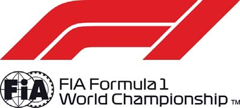

2018 BRITISH GRAND PRIX

5 - 8 July 2018

From The Stewards Document 58

To All Teams, All Officials Date 08 July 2018

Time 18:55

Title Championship Points

Description Championship Points

Enclosed GBR DOC 58 Championship Points.pdf

Tim Mayer Mumtaz Tahincioglu

Tom Kristensen Steve Stringwell

The Stewards

Doc 58 Time 18:55

FORMULA 1 2018 ROLEX BRITISH GRAND PRIX - Silverstone

Drivers' Championship

DRIVER TOTAL AUS BRN CHN AZE ESP MON CAN FRA AUT GBR GER HUN BEL ITA SGP RUS JPN USA MEX BRA UAE

| 1 | S. VETTEL | 171 | 25 1 | 25 1 | 4 8 | 12 4 | 12 4 | 18 2 | 25 1 | 10 5 | 15 3 | 25 1 |
| --- | --- | --- | --- | --- | --- | --- | --- | --- | --- | --- | --- | --- |
| 2 | L. HAMILTON | 163 | 18 2 | 15 3 | 12 4 | 25 1 | 25 1 | 15 3 | 10 5 | 25 1 | NC | 18 2 |
| 3 | K. RAIKKONEN | 116 | 15 3 | NC | 15 3 | 18 2 | NC | 12 4 | 8 6 | 15 3 | 18 2 | 15 3 |
| 4 | D. RICCIARDO | 106 | 12 4 | NC | 25 1 | NC | 10 5 | 25 1 | 12 4 | 12 4 | NC | 10 5 |
| 5 | V. BOTTAS | 104 | 4 8 | 18 2 | 18 2 | 14 | 18 2 | 10 5 | 18 2 | 6 7 | NC | 12 4 |
| 6 | M. VERSTAPPEN | 93 | 8 6 | NC | 10 5 | NC | 15 3 | 2 9 | 15 3 | 18 2 | 25 1 | 15 |
| 7 | N. HULKENBERG | 42 | 6 7 | 8 6 | 8 6 | NC | NC | 4 8 | 6 7 | 2 9 | NC | 8 6 |
| 8 | F. ALONSO | 40 | 10 5 | 6 7 | 6 7 | 6 7 | 4 8 | NC | NC | 16 | 4 8 | 4 8 |
| 9 | K. MAGNUSSEN | 39 | NC | 10 5 | 1 10 | 13 | 8 6 | 13 | 13 | 8 6 | 10 5 | 2 9 |
| 10 | C. SAINZ | 28 | 1 10 | 11 | 2 9 | 10 5 | 6 7 | 1 10 | 4 8 | 4 8 | 12 | NC |
| 11 | E. OCON | 25 | 12 | 1 10 | 11 | NC | NC | 8 6 | 2 9 | NC | 8 6 | 6 7 |
| 12 | S. PEREZ | 24 | 11 | 16 | 12 | 15 3 | 2 9 | 12 | 14 | NC | 6 7 | 1 10 |
| 13 | P. GASLY | 18 | NC | 12 4 | 18 | 12 | NC | 6 7 | 11 | NC | 11 | 13 |
| 14 | C. LECLERC | 13 | 13 | 12 | 19 | 8 6 | 1 10 | 18 | 1 10 | 1 10 | 2 9 | NC |
| 15 | R. GROSJEAN | 12 | NC | 13 | 17 | NC | NC | 15 | 12 | 11 | 12 4 | NC |
| 16 | S. VANDOORNE | 8 | 2 9 | 4 8 | 13 | 2 9 | NC | 14 | 16 | 12 | 15 | 11 |
| 17 | L. STROLL | 4 | 14 | 14 | 14 | 4 8 | 11 | 17 | NC | 17 | 13 | 12 |
| 18 | M. ERICSSON | 3 | NC | 2 9 | 16 | 11 | 13 | 11 | 15 | 13 | 1 10 | NC |
| 19 | B. HARTLEY | 1 | 15 | 17 | 20 | 1 10 | 12 | 19 | NC | 14 | NC | NC |
| 20 | S. SIROTKIN | 0 | NC | 15 | 15 | NC | 14 | 16 | 17 | 15 | 14 | 14 |

Tim Mayer Mumtaz Tahincioglu Tom Kristensen Steve Stringwell

The Stewards

© 2018 Formula One World Championship Limited The F1 FORMULA 1 logo, F1 logo, FORMULA 1, FORMULA ONE, F1, FIA FORMULA ONE WORLD CHAMPIONSHIP, GRAND PRIX and related marks are trade marks of Formula One Licensing BV, a Formula 1 company. The FIA logo is a trade mark of the Fédération Internationale de l’Automobile. All rights reserved. No part of these results/data may be reproduced, stored in a retrieval system or transmitted in any form or by any means electronic, mechanical, photocopying, recording, broadcasting or otherwise without prior permission of the copyright holder except for reproduction in local/national/international daily press and regular printed publications on sale to the public within 90 days of the event to which the results/data relate and provided that the copyright symbol and name of copyright owner appears.

FORMULA 1 2018 ROLEX BRITISH GRAND PRIX - Silverstone

Constructors' Championship

ENTRANT TOTAL AUS BRN CHN AZE ESP MON CAN FRA AUT GBR GER HUN BEL ITA SGP RUS JPN USA MEX BRA UAE

| 1 | Scuderia Ferrari | 287 | 40 1 3 | 25 1 NC | 19 3 8 | 30 2 4 | 12 4 NC | 30 2 4 | 33 1 6 | 25 3 5 | 33 2 3 | 40 1 3 |
| --- | --- | --- | --- | --- | --- | --- | --- | --- | --- | --- | --- | --- |
| 2 | Mercedes AMG Petronas Motorsport | 267 | 22 2 8 | 33 2 3 | 30 2 4 | 25 1 14 | 43 1 2 | 25 3 5 | 28 2 5 | 31 1 7 | NC NC | 30 2 4 |
| 3 | Aston Martin Red Bull Racing | 199 | 20 4 6 | NC NC | 35 1 5 | NC NC | 25 3 5 | 27 1 9 | 27 3 4 | 30 2 4 | 25 1 NC | 10 5 15 |
| 4 | Renault Sport Formula One Team | 70 | 7 7 10 | 8 6 11 | 10 6 9 | 10 5 NC | 6 7 NC | 5 8 10 | 10 7 8 | 6 8 9 | 12 NC | 8 6 NC |
| 5 | Haas F1 Team | 51 | NC NC | 10 5 13 | 1 10 17 | 13 NC | 8 6 NC | 13 15 | 12 13 | 8 6 11 | 22 4 5 | 2 9 NC |
| 6 | Sahara Force India F1 Team | 49 | 11 12 | 1 10 16 | 11 12 | 15 3 NC | 2 9 NC | 8 6 12 | 2 9 14 | NC NC | 14 6 7 | 7 7 10 |
| 7 | McLaren F1 Team | 48 | 12 5 9 | 10 7 8 | 6 7 13 | 8 7 9 | 4 8 NC | 14 NC | 16 NC | 12 16 | 4 8 15 | 4 8 11 |
| 8 | Red Bull Toro Rosso Honda | 19 | 15 NC | 12 4 17 | 18 20 | 1 10 12 | 12 NC | 6 7 19 | 11 NC | 14 NC | 11 NC | 13 NC |
| 9 | Alfa Romeo Sauber F1 Team | 16 | 13 NC | 2 9 12 | 16 19 | 8 6 11 | 1 10 13 | 11 18 | 1 10 15 | 1 10 13 | 3 9 10 | NC NC |
| 10 | Williams Martini Racing | 4 | 14 NC | 14 15 | 14 15 | 4 8 NC | 11 14 | 16 17 | 17 NC | 15 17 | 13 14 | 12 14 |

Tim Mayer Mumtaz Tahincioglu Tom Kristensen Steve Stringwell

The Stewards

© 2018 Formula One World Championship Limited The F1 FORMULA 1 logo, F1 logo, FORMULA 1, FORMULA ONE, F1, FIA FORMULA ONE WORLD CHAMPIONSHIP, GRAND PRIX and related marks are trade marks of Formula One Licensing BV, a Formula 1 company. The FIA logo is a trade mark of the Fédération Internationale de l’Automobile. All rights reserved. No part of these results/data may be reproduced, stored in a retrieval system or transmitted in any form or by any means electronic, mechanical, photocopying, recording, broadcasting or otherwise without prior permission of the copyright holder except for reproduction in local/national/international daily press and regular printed publications on sale to the public within 90 days of the event to which the results/data relate and provided that the copyright symbol and name of copyright owner appears.
