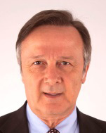

RACE STEWARDS BIOGRAPHIES

TIM MAYER

FIA STEWARD, ORGANIZER OF THE WORLD CHAMPIONSHIPS IN THE USA

As the son of former McLaren founder Teddy Mayer, Tim Mayer grew up around motor sport. He organised IndyCar races internationally from 1992-98, aided the construction of several circuits, and produced international TV for multiple series. In 1998 he became CART’s Senior VP for Racing Operations then in 2003, Mayer became COO of IMSA, operating multiple series at all levels, including the American Le Mans Series. In 2009 he left IMSA, working independently for several US series and focusing on coordinating US motorsports with the FIA. He was elected an Independent Director of ACCUS and US FIA Delegate, responsible for World Championship events in the US. He Stewards the FIA’s F1, WEC and World RX championships as well as teaching and working on multiple commissions.

MÜMTAZ TAHINCIOĞLU

FIA STEWARD

Mümtaz Tahincioğlu is an FIA Steward in Formula One, F2, WRC and regional rally championships. He is also a former steward for the WTCC. He served on the World Motorsport Council, and as vice-president of the FIA Single-Seater commission and president of the Volunteers and Officials Commission. In his native Turkey, he is a former president of the Turkish Automobile Sports Federation (TOSFED) and former general secretary of the multi-discipline Galatasaray Sports Club. He was Turkish karting champion three times, and a Turkish and European Formula 3 driver.

TOM KRISTENSEN

1980 NINE TIMES LE MANS WINNER, GERMAN F3 CHAMPION (1991), JAPANESE F3 CHAMPION (1993) ALMS CHAMPION (2001); PRESIDENT OF THE FIA DRIVERS’ COMMISSION, FIA WORLD MOTOR SPORT COUNCIL MEMBER

Denmark’s Tom Kristensen is the most successful driver in the history of the Le Mans 24-Hour race having won the endurance event nine times before retiring from competition in November 2014. Kristensen’s oustanding career saw him race in single-seaters, touring cars as well as testing in Formula One. However, it is for his achievements in sportscars that he is correctly most lauded. His first Le Mans win came in 1997, driving for the Joest Racing team. After two years competing with BMW, he rejoined Joest, now racing as Audi Sport Team Joest, in 2000, winning three Le Mans 24-Hours in succession with the team. He won again with Bentley in 2003 before returning to the wheel of Audi machines to win in 2004-’05, 2008 and 2013. In 2013 he also won the FIA World Endurance Championship title.
