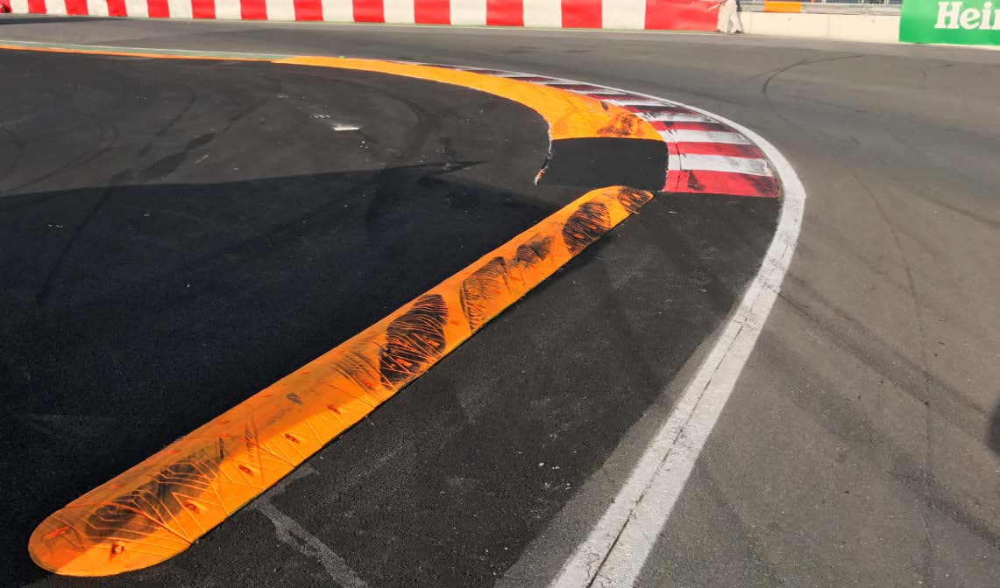
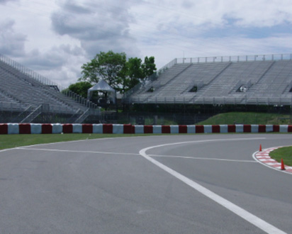
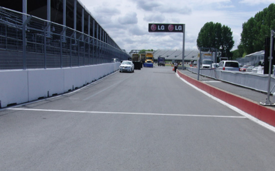

2018 CANADIAN GRAND PRIX

7 - 10 June 2018

From The FIA Formula One Race Director Document 2

To All Teams, All Officials Date 07 June 2018

Time 08:00

Title Event Notes

Description Event Notes

Enclosed 2018_CANADIAN_GP_EVENT_NOTES_07_06_2018_v1.pdf

Charlie Whiting

The FIA Formula One Race Director

2018 CANADIAN GRAND PRIX

7-10 JUNE 2018

From The FIA Formula One Race Director Document 2

To Formula One Team Managers Date 7 June 2018

Time 08.00

EVENT NOTES

7 JUNE 2018

1) Issues arising from the Monaco Grand Prix

Blowing air into a radiator ducts during a stop-and-go penalty

2) Changes to the circuit

2.1 Sections of the track have been resurfaced on the approach to turns 1, 6, 8 and 10.

2.2 The wall on the drivers left after the exit of turn 2 has been replaced and a new debris fence fitted.

2.3 The walls in the escape road at turn 3 have been re-aligned to provide a larger run-off and easier access for removing cars.

2.4 The wall on the left hand side of the track between turns 3 and 6 has been replaced and a new debris fences fitted.

2.5 The wall at the back of the run-off area at turn 6 has been replaced and a new debris fence fitted.

2.6 The free-standing wall in the run-off at turn 10 has been re-aligned to provide better protection for the rescue vehicles which are stationed there.

2.7 The walls straight on at turn 14 have been re-aligned.

2.8 The tyre barriers at turns 2 (inside), 4, 6, 10, 13 and 14 have all been replaced by suitable arrays of TecPro barriers.

3) Pit lane map

3.1 Safety Car lines.

3.2 The location of the pit entry and the pit exit.

1/6

3.3 Designated garage areas.

3.4 Safety Car position for first lap and rest of race.

3.5 Blue flag marshal at the pit exit.

3.6 Track light panels displaying pit entry status.

4) Pirelli Event Preview

4.1 With reference to Article 24.4(a) of the Sporting Regulations see the attached document provided by the official tyre supplier.

5) Weighing and weighing platform

5.1 The FIA weighing platform will be available for teams to use at the following times, however, no more than 10 team personnel may be present during any visit. Each visit should last no more than 10 minutes unless no other team is waiting in the pit lane :

a) From 10.30 Thursday until 13.30 on Saturday (between 12.00 and 13.30 each visit will be restricted to five minutes).

b) From when the cars are returned to the teams after qualifying until 18.30 on Saturday.

c) From 09.10 until 13.10 on Sunday.

Any team found to be abusing the time limits set out above, which we will be enforced by FIA security personnel and our own CCTV, will not be permitted to use the weighbridge again during the Event.

6) Red zones for photographers in the pit lane during practice sessions

6.1 See the attached drawing.

7) Practice starts

7.1 During practice sessions :

Practice starts may only be carried out at the pit exit on the left hand side and, for the avoidance of doubt, this includes any time the pit exit is open for the race.

7.2 During the time the pit exit is open for reconnaissance laps (13.30-13.40) :

As a number of drivers will want to carry out a practice start during this short period any driver going to the pit exit first, or any driver arriving there when no other car is present, should stop beyond the pit exit line and go as far as the end of the pit wall (where the Rolex clock is located). This should then allow other drivers to queue in a position to make a start without the need to stop more than once.

7.3 At all times :

For reasons of safety and sporting equity, cars may not stop in the fast lane at any time the pit exit is open without a justifiable reason (a practice start is not considered a justifiable reason).

8) Lines or bollards at the pit entry and pit exit

8.1 In accordance with Chapter 4 (Section 5) of Appendix L to the ISC drivers should keep to the left of the white line at the pit exit when leaving the pits, no part of any car leaving the pits may cross this line.

8.2 For safety reasons, drivers must stay to the left of the white line at the pit entry when entering the pits.

2/6

8.3 There will be no bollards in the first part of the pit lane between the beginning of the speed limit and the first garage. The only exception to this will be at the end of P2 and during qualifying when it will be necessary to protect cars in the weighing area.

Furthermore, drivers may cut across the white lines in the this section (always entering the pit lane by staying left of the block/bollard at the start of the speed limit), car speed calculations are based on a straight line between the pit speed loops.

9) DRS

9.1 DRS will be globally disabled if panels 1, 7, 8, 9, 12, 13, 14 or 15 are displaying yellow.

9.2 Detection will be automatically disabled if the light panels below are displaying yellow :

Zone 1 : Panels 5 or 6

Zones 2 and 3 : Panels 10 or 11

9.3 If automatic detection is not working, and permission has been given by race control to use manual detection, DRS must not be used in the relevant zone if panels 5, 6, 10 or 11 are displaying yellow.

10) Observing yellow flags during free practice and qualifying

10.1 Double waved : Any driver passing through a double waved yellow marshalling sector must reduce speed significantly and be prepared to change direction or stop. In order for the stewards to be satisfied that any such driver has complied with these requirements it must be clear that he has not attempted to set a meaningful lap time, for practical purposes this means the driver should abandon the lap (this does not necessarily mean he has to pit as the track could well be clear the following lap).

10.2 Single waved : Drivers should reduce their speed and be prepared to change direction. It must be clear that a driver has reduced speed and, in order for this to be clear, a driver would be expected to have braked earlier and/or discernibly reduced speed in the relevant marshalling sector.

Drivers should not overtake any car in a single waved yellow marshalling sector unless it is clear that a car is slowing with a completely obvious problem, e.g. obvious accident damage or a deflated tyre.

11) Track light panels

11.1 The FIA light panels have been installed in the positions shown on the circuit map. In accordance with Appendix H to the ISC the light signals have the same meaning as flag signals.

12) Drivers leaving their pit stop position in the pit lane

12.1 For safety reasons, no car should be driven from its pit stop position at any time unless :

a) It has first been driven into the pit stop position having just entered the pit lane from the track, and ;

b) It is then driven immediately back onto the track from the pit stop position.

13) Fire extinguishers around the circuit

13.1 Indicated by small white boards with a red letter “F”.

3/6

14) Places where drivers can leave the track

14.1 Indicated by fluorescent orange panels on the debris fences or walls.

15) Places to remove cars from the track

15.1 Indicated by fluorescent orange panels on the walls or guardrails.

16) In laps and reconnaissance laps

16.1 In order to ensure that cars are not driven unnecessarily slowly on in laps during and after the end of qualifying or during reconnaissance laps when the pit exit is opened for the race, drivers must stay below the maximum time set by the FIA between the Safety Car lines shown on the pit lane map.

You will be informed of the maximum time after the first day of practice.

17) Cutting the chicanes

17.1 Any driver who fails to negotiate turn 9 by using the track, and who passes completely to the left of the orange kerb element on the apex of the corner, must keep completely to the left of the orange speed bump and the orange block/bollard on the exit of the corner and re-join the track at the far end of the asphalt run-off area.

17.2 Any driver who fails to negotiate turn 14 by using the track, and who passes completely to the left of the orange kerb element on the apex of the corner (as opposed to the speed bump before it, see photo below), must keep to the left of the orange block/bollard and re-join the track at the far end of the asphalt run-off area.

17.3 The above requirements will not automatically apply to any driver who is judged to have been forced off the track, each such case will be judged individually.

4/6

18) Support races

18.1 Teams are asked to keep their barriers no more than four metres from the garages during all support race practice sessions and races.

19) Post qualifying parc fermé

19.1 The cameras should be installed and operated in the same way as 2017.

20) Operational personnel curfew

20.1 Boards warning anyone attempting to enter the paddock that the curfew is in operation will be placed immediately before the entry turnstiles at the appropriate times.

21) Removing cars from the grid

21.1 Via the old pit exit.

22) Car number light panels for the start

22.1 On the driver's left.

23) Track light panel displaying pit entry status

23.1 The light panel indicated on the pit lane map will display flashing yellow arrows if cars are required to use the pit lane once the Safety Car has been deployed during the race.

23.2 The light panel indicated on the pit lane map will display flashing red crosses if the pit lane is closed at any point during the race.

24) Lapping during the race

24.1 The ISC requires drivers who are caught by another car about to lap him to allow the faster driver past at the first available opportunity. The F1 Marshalling System has been developed in order to ensure that the point at which a driver is shown blue flags is consistent, rather than trusting the ability of marshals to identify situations that require blue flags.

As it was at the end of last season the system will be set to give a pre-warning when the faster car is within 3.0s of the car about to be lapped, this should be used by the team of the slower car to warn their driver he is soon going to be lapped and that allowing the faster car through should be considered a priority. When the faster car is within 1.2s of the car about to be lapped blue flags will be shown to the slower car (in addition to blue light panels, blue cockpit lights and a message on the timing monitors) and the driver must allow the following driver to overtake at the first available opportunity.

It should be noted that the aim of using F1MS is ensure consistent application of the rules, additional instructions may also be given by race control when necessary.

25) Post-race parc fermé

25.1 All cars must enter the pit lane and, with the exception of the first three, should be driven directly to the weighing area. The first three cars should be driven down the pit lane to the control tower without stopping.

5/6

26) Any other business

Charlie Whiting FIA Formula One Race Director

6/6

|  |  | Grand Prix of Canada 08-10/06/2018 (18R07MTL) |  |  |  |  |  |  |  |
| --- | --- | --- | --- | --- | --- | --- | --- | --- | --- |
|  |  | Compound |  | FL | FR | RL | RR |  | Mandatory race tyres |
|  |  | SUPERSOFT |  | X60 | X62 | X70 | X72 |  | SUPERSOFT |
|  |  | ULTRASOFT |  | U60 | U62 | U70 | U72 |  | ULTRASOFT |
|  |  | HYPERSOFT |  | K60 | K62 | K70 | K72 |  |  |
|  |  | INTERMEDIATE SOFT |  | G37 | G38 | G39 | G40 |  | Q3 tyre |
|  |  | WET SOFT Cross-Over time MINIMUM STARTING PRESSURE, BLISTERING SENSITIVITY, CAMBER LIMIT |  | W37 WET > 119% > INT > 113% > DRY | W38 Front (psi) | W39 | W40 | Rear (psi) | HYPERSOFT |
|  |  |  | Slicks |  | 21.0 |  |  | 19.5 |  |
|  |  |  | Intermediate |  | 19.0 |  |  | 18.5 |  |
|  |  |  | Wet |  | 18.0 |  |  | 17.5 |  |
| FE EOS Camber limit RE EOS Camber limit -3.50 ° -2.00 ° FE Blistering RE Blistering sensitivity sensitivity Medium Low |  | TYRE HEATING STRATEGY |  |  |  |  |  |  |  |
| Storage temperature: Optimum time in Storage temperature: Optimum time in blanket (@80°): blanket (@60°): 60°C 40°C 2h 1h SLICKS INTER Maximum boost Blanket time window Maximum boost Blanket time window temperature (@80°): temperature (@60°): 1h @ 110°C 1h to 3h 30min @ 80°C 30 min to 2h Storage temperature: Optimum time in blanket (@60°): 40°C 1h WET Blanket time window NO BOOST (@60°): 30 min to 2h GENERAL NOTES Teams are kindly reminded that the following parameters will be subjected to FIA checks during the event: - Starting pressure. - Camber at maximum speed. - Maximum blanket temperature. - Tyre swapping. | Tyre Notes |  |  |  |  |  |  |  |  |
| ● Not permiCed to switch tyres from their originally allocated posi%on. Storage Temp˚C is the recommended temperature the tyre can stay in blankets without time limit. All temperature limits apply to the actual tyre surface temperature, measured with the IR ● Do not subject tyres to large deforma%on or heavy impact. gun detailed in TD029-15. ● Do not leave fiCed tyres exposed at an air temperature lower than 15°C SIDEWALLS HEATING CLARIFICATION (ALL PRODUCTS): you are allowed to apply a max. and/or any UV emission. temperature of 100 °C for max. 1 hr to the sidewalls as long as the max. temp/time at any part ● Revised prescrip%ons could be issued during the race weekend in of the tread is the one described in the corresponding section above. accordance with TD/007-16. | ● Not permiCed to switch tyres from their originally allocated posi%on. ● Do not subject tyres to large deforma%on or heavy impact. ● Do not leave fiCed tyres exposed at an air temperature lower than 15°C and/or any UV emission. ● Revised prescrip%ons could be issued during the race weekend in accordance with TD/007-16. |  |  |  |  | Storage Temp˚C is the recommended temperature the tyre can stay in blankets without time limit. All temperature limits apply to the actual tyre surface temperature, measured with the IR gun detailed in TD029-15. SIDEWALLS HEATING CLARIFICATION (ALL PRODUCTS): you are allowed to apply a max. temperature of 100 °C for max. 1 hr to the sidewalls as long as the max. temp/time at any part of the tread is the one described in the corresponding section above. |  |  |  |

2018 Canadian Grand Prix Pit Lane

PIT LANE Starts

Pit Entry PIT LANE Ends Status panel SAFETY CAR Line 2

PIT ENTRY SAFETY CAR Race SAFETY CAR First Lap CARS RECOVERED FROM TRACK PLACED HERE

X PIT EXIT Blue Flag Marshal F1 Garages

SAFETY CAR Line 1

1 2 3 4 5 6 7 8 9 10 11 12 13 14 15 16 17 18 19 20 21 22 23 24 25 26 27 28 29 30 31 32 33 34 35 36 37 38 39 40

| AIF | AIF | AIF | rebuaS | rebuaS | rebuaS | neraLcM | neraLcM | neraLcM |  | saaH | saaH | saaH | ossoR oroT |  | ossoR oroT |  | ossoR oroT | tluaneR | tluaneR | tluaneR | smailliW | smailliW | smailliW | yawklaW | aidnI ecroF |  | aidnI ecroF | aidnI ecroF | lluB deR | lluB deR |  | lluB deR | lluB deR | irarreF |  | irarreF | irarreF | irarreF | sedecreM | sedecreM |  | sedecreM | sedecreM | 1 alumroF | 1 alumroF |  | 1 alumroF |
| --- | --- | --- | --- | --- | --- | --- | --- | --- | --- | --- | --- | --- | --- | --- | --- | --- | --- | --- | --- | --- | --- | --- | --- | --- | --- | --- | --- | --- | --- | --- | --- | --- | --- | --- | --- | --- | --- | --- | --- | --- | --- | --- | --- | --- | --- | --- | --- |
|  | Sauber |  |  |  | McLaren |  |  |  | Haas |  |  |  |  | Toro Rosso |  | Renault |  |  |  |  | Williams |  |  |  |  | Force India |  |  |  |  | Red Bull |  |  |  | Ferrari |  |  |  |  |  | Mercedes |  |  |  |  | Designated Garage Areas |  |

Pit Stop Position

FAST LANE FAST LANE

Pole Position

Version 1 – 7 June 2018

22

The F1 FORMULA 1 logo, F1 logo, F1 FIA FORMULA 1 WORLD CHAMPIONSHIP logo, FORMULA 1, FORMULA ONE, F1, FIA FORMULA ONE WORLD CHAMPIONSHIP, GRAND PRIX and related marks are trade marks of Formula One Licensing BV, a Formula 1 company. © 2018 Formula One World Championship Ltd.
