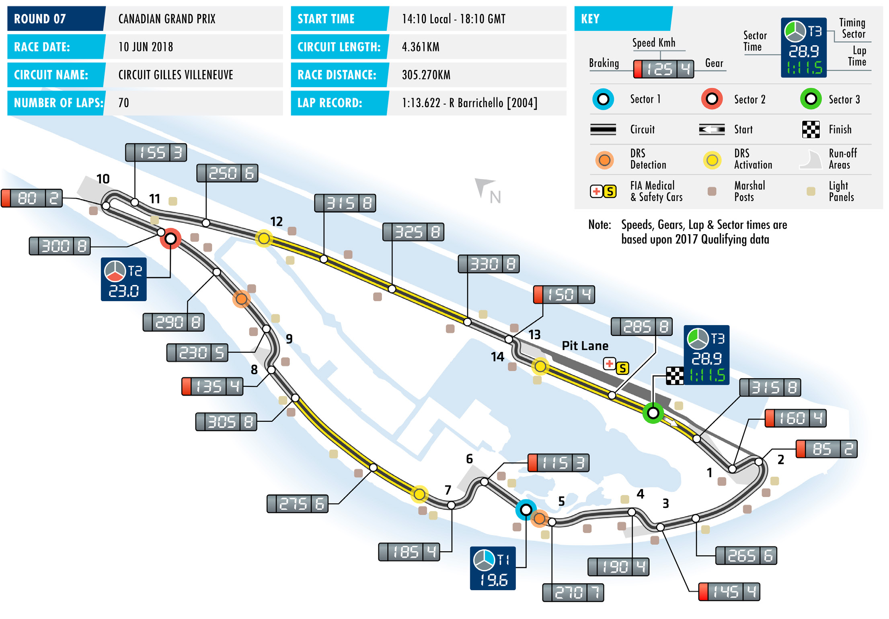
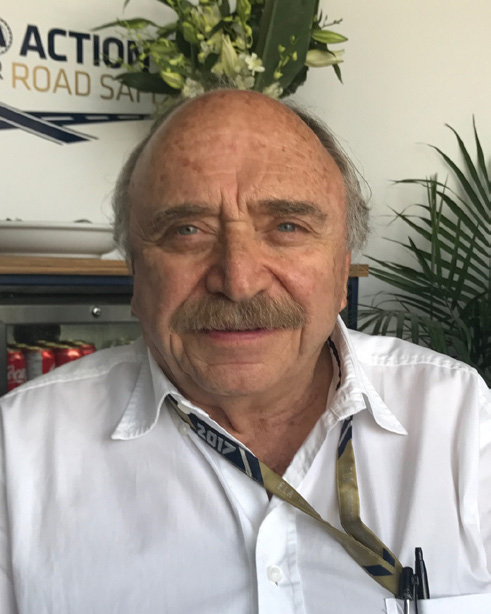

2018 CANADIAN GRAND PRIX

08-10 June 2018

The 2018 FIA Formula One World Championship approaches CIRCUIT GILLES VILLENEUVE

its one-third point as teams make their way to Montréal for Length of lap: 4.361km

Round Seven of the campaign, the Canadian Grand Prix. Lap record: 1:13.622 (Rubens Barrichello, Ferrari, 2004) While this weekend’s race takes place at a second consecutive Start line/finish line offset: 0.000km temporary circuit after Monaco, the Circuit Gilles Villeneuve, Total number of race laps: 70 located on the Île Notre-Dame in the St Lawrence River, presents Total race distance: 305.270km teams and drivers with a very different set of challenges than the Pitlane speed limits: 80km/h in tight confines and low speeds of the Principality’s twisting streets. practice, qualifying, and the race

Here, a series of fast straights lead into heavy-braking corners. CIRCUIT NOTES The high end-of-straight speeds and the stop/go nature of the ► The wall on the drivers’ left circuit lead to it being classed as the season’s toughest on brakes. after the exit of Turn 2 has been The frequent braking events lead to high temperatures within replaced and a new debris fence the discs and pads and the effect is compounded by the fact that fitted. The walls on the both sides of the track between Turns 3 and the straights, particularly on the first half of the lap, do not allow 6 and at the back of the run-off at sufficient time for cooling. Turn 6 have also been replaced, with new debris fences fitted. The temporary nature of the circuit also means that track

conditions evolve significantly across the weekend and this, allied ► The walls in the escape road at Turn 3 have been re-aligned to to the relatively smooth surface, means that grip is often at a provide a larger run-off and easier premium. As such, tyre supplier Pirelli has traditionally taken access for removing cars. The its softest compounds to Montréal. This year is no exception, with wall in the run-off at Turn 10 has F1’s teams being offered supersoft and ultrasoft compounds, as been re-aligned to provide better protection for rescue vehicles. The well as the softest of the range, the hypersoft tyre, which makes its walls straight on at Turn 14 have second appearance of the season after Monaco. been also been re-aligned.

The race there saw the Drivers’ Championship lead of Mercedes’ ► The tyre barriers at Turns 2 Lewis Hamilton narrowed to 14 points, as Red Bull’s Daniel (inside), 4, 6, 10, 13 and 14 have been replaced by TecPro barriers. Ricciardo joined the Briton and second-placed Sebastian Vettel

of Ferrari on two wins each this season. With Montréal accenting DRS ZONE power over aerodynamic poise, this weekend should see the ► There will be three DRS zones. return to prominence of Mercedes and Ferrari, and there aren’t A new zone has been added, many who would argue against Hamilton achieving a record- with a detection point 15m after equalling seventh Montreal victory on Sunday. Vettel, Ricciardo and Turn 5 and an activation point 95m after Turn 7. The previous zones their respective team-mates Kimi Räikkönen and Max Verstappen, remains unchanged. They share along with Hamilton’s team-mate Valtteri Bottas, might count a detection point 110m before themselves among that band, however. It promises to be another Turn 9, with activation points enthralling contest. 155m before Turn 12 and 70m after Turn 14.

FAST FACTS

► This will be the 49th Canadian Grand Prix 1999-2001, with Ferrari. Hamilton’s first ► The most successful constructor at the and the 39th to be held in Montreal. The pole here was his first ever, in 2007, with Circuit Gilles Villeneuve is Ferrari with 10 race has been held at two other venues: McLaren. He was on pole again with wins, one ahead of McLaren. The British Mosport in 1967, ’69, from ’71-’74 and McLaren in 2008 and 2010 and he has squad is more successful in Canada ‘76-’77, and Mont-Tremblant in 1968 started the last three races here from the overall, however, with 13 victories, two and 1970. front of the grid, with Mercedes. ahead of Ferrari.

► Michael Schumacher holds the record ► The only other current drivers to have ► Sebastian Vettel is set to start his 10th for most Canadian Grand Prix wins, with a pole position to their name at this Canadian Grand Prix this weekend. The seven. His first came with Benetton in track are Sebastian Vettel (2011, 2012 German has never failed to finish in 1994 and after joining Ferrari in 1996 he and 2013, all with Red Bull Racing) and Montreal and is the only current driver claimed another six in Montreal, in 1997, Fernando Alonso, who landed pole here with more than one Canadian Grand 1998, 2000 and from 2002-’04, all with in 2006 with Renault. Prix to his name to have scored points the Scuderia. every single time he has raced here. ► Four other current race drivers have also Vettel’s current team-mate, Räikkönen, ► Lewis Hamilton can equal the German’s won here, though only Hamilton is a can boast the most points finishes of record this weekend as victory here last multiple winner. Kimi Räikkönen won in a current driver (13) but an otherwise year took the Briton’s Montreal total to 2005 for McLaren, Fernando Alonso for perfect scoring record is blemished by a six. After scoring his maiden F1 win here Renault in 2006, Sebastian Vettel for Red 2008 DNF, when he was crashed into by in 2007 with McLaren he added further Bull Racing in 2013 and Daniel Ricciardo Hamilton in the pit lane. wins for the Woking team in 2010 and scored his maiden grand prix victory here 2012, before embarking on a hat-trick for in 2014, again with Red Bull Racing. ► Since the current circuit configuration Mercedes, starting in 2015. came into use in 2002 the race has been ► Another driver who can this weekend won from pole position eight times from ► Hamilton can also this weekend break break a record set by Schumacher is Kimi 15 events, with three occurring in the Schumacher’s record of Canadian Grand Räikkönen. The Finn and the German are last three years. Räikkonen, in 2005, and Prix pole positions. Both men have six tied for most fastest laps in Montreal, Jenson Button, in 2011, hold the record poles in Montreal, with Schumacher’s with each having four. Räikkönen took for wins from furthest back on the grid being scored in 1994 and 1995, with two with McLaren (2005 and 2006) and on this configuration. Both won from P7 Benetton, and then in 1997 and from two with Ferrari (2008 and 2015). on the grid.

RACE STEWARDS BIOGRAPHIES

DR GERD ENNSER

MEMBER OF THE DMSB’S EXECUTIVE COMMITTEE FOR AUTOMOBILE SPORT, FORMULA ONE AND DTM STEWARD

Dr Gerd Ennser has successfully combined his formal education in law with his passion for motor racing. While still active as a racing driver he began helping out with the management of his local motor sport club and since 2006 has been a permanent steward at every round of Germany’s DTM championship. Since 2010 he has also been a Formula One steward. Dr Ennser, who has worked as a judge, a prosecutor and in the legal department of an automotive- industry company, has also acted as a member of the steering committee of German motor sport body, the DMSB, since spring 2010, where he is responsible for automobile sport. In addition, Dr Ennser is a board member of the South Bavaria Section of ADAC, Germany’s biggest auto club.

JOSÉ ABED

FIA VICE PRESIDENT FOR SPORT

José Abed, an FIA Vice President since 2006, began competing in motor sport in 1961. In 1985, as a motor sport of cial, Abed founded the Mexican Organisation of International Motor Sport (OMDAI) which represents Mexico in the FIA. He sat as its Vice- President from 1985 to 1999, becoming President in 2003. In 1986, Abed began promoting truck racing events in Mexico and from 1986 to 1992, he was President of Mexican Grand Prix organising committee. In 1990 and 1991, he was President of the organising committee for the International Championship of Prototype Cars and from 1990 to 1995, Abed was designated Steward for various international Grand Prix events. Since 1990, Abed has been involved in manufacturing prototype chassis, electric cars, rally cars and kart chassis.

EMANUELE PIRRO

FORMER FORMULA ONE DRIVER AND FIVE-TIMES LE MANS WINNER. MEMBER OF THE FIA DRIVERS’ COMMISSION

During a motor sport career spanning almost 40 years, Emanuele Pirro has achieved a huge amount of success, most notably in sportscar racing, with five Le Mans wins, victory at the Daytona 24 Hours and two wins at the Sebring 12 Hours. In addition, the Italian driver has won the German and Italian Touring Car championships (the latter twice) and has twice been American Le Mans Series Champion. Pirro, enjoyed a three-season F1 career from 1989 to 1991, firstly with Benetton and then for Scuderia Italia. His debut as an FIA Steward came at the 2010 Abu Dhabi Grand Prix and he has returned regularly since.

2018 Formula One World Championship

DRIVERS’ CHAMPIONSHIP STANDINGS

NAJIABREZA AILARTSUA EROPAGNIS IBAHD YNAMREG YRAGNUH STNIOP NIARHAB OCANOM ADANAC AIRTSUA MUIGLEB ECNARF OCIXEM ANIHC AISSUR NAPAJ LIZARB NIAPS YLATI ASU UBA BG

| 18 2 | 15 3 | 12 4 | 25 1 | 25 1 | 15 3 |
| --- | --- | --- | --- | --- | --- |
| 25 1 | 25 1 | 4 8 | 12 4 | 12 4 | 18 2 |
| 12 4 | NC | 25 1 | NC | 10 5 | 25 1 |
| 4 8 | 18 2 | 18 2 | 14 | 18 2 | 10 5 |
| 15 3 | NC | 15 3 | 18 2 | NC | 12 4 |
| 8 6 | NC | 10 5 | NC | 15 3 | 2 9 |
| 10 5 | 6 7 | 6 7 | 6 7 | 4 8 | NC |
| 6 7 | 8 6 | 8 6 | NC | NC | 4 8 |
| 1 10 | 11 | 2 9 | 10 5 | 6 7 | 1 10 |
| NC | 10 5 | 1 10 | 13 | 8 6 | 13 |
| NC | 12 4 | 18 | 12 | NC | 6 7 |
| 11 | 16 | 12 | 15 3 | 2 9 | 12 |
| 12 | 1 10 | 11 | NC | NC | 8 6 |
| 13 | 12 | 19 | 8 6 | 1 10 | 18 |
| 2 9 | 4 8 | 13 | 2 9 | NC | 14 |
| 14 | 14 | 14 | 4 8 | 11 | 17 |
| NC | 2 9 | 16 | 11 | 13 | 11 |
| 15 | 17 | 20 | 1 10 | 12 | 19 |
| NC | 13 | 17 | NC | NC | 15 |
| NC | 15 | 15 | NC | 14 | 16 |

1 L. HAMILTON 110

2 S. VETTEL 96

3 D. RICCIARDO 72

4 V. BOTTAS 68

5 K. RÄIKKÖNEN 60

6 M. VERSTAPPEN 35

7 F. ALONSO 32

8 N. HÜLKENBERG 26

9 C. SAINZ 20

10 K. MAGNUSSEN 19

11 P. GASLY 18

12 S. PÉREZ 17

13 E. OCON 9

14 C. LECLERC 9

15 S. VANDOORNE 8

16 L. STROLL 4

17 M. ERICSSON 2

18 B. HARTLEY 1

19 R. GROSJEAN 0

20 S. SIROTKIN 0

2018 Formula One World Championship

CONSTRUCTORS’ CHAMPIONSHIP STANDINGS

NAJIABREZA AILARTSUA EROPAGNIS IBAHD YNAMREG YRAGNUH STNIOP NIARHAB OCANOM ADANAC AIRTSUA MUIGLEB ECNARF OCIXEM ANIHC AISSUR NAPAJ LIZARB NIAPS YLATI ASU UBA BG

| 22 2 8 | 33 2 3 | 30 2 4 | 25 1 13 | 43 1 2 | 25 3 5 |
| --- | --- | --- | --- | --- | --- |
| 40 1 3 | 25 1 NC | 19 3 8 | 30 2 4 | 12 4 NC | 30 2 4 |
| 20 4 6 | NC NC | 35 1 5 | NC NC | 25 15 10 | 27 1 9 |
| 7 7 10 | 8 6 11 | 10 6 9 | 10 5 NC | 6 7 NC | 5 8 10 |
| 12 5 9 | 10 7 8 | 6 7 13 | 8 7 9 | 4 8 NC | 14 NC |
| 11 12 | 1 10 16 | 11 12 | 15 3 NC | 2 9 NC | 8 6 12 |
| 15 NC | 12 4 17 | 18 20 | 1 10 12 | 12 NC | 6 7 19 |
| NC NC | 10 5 13 | 1 10 17 | 13 NC | 8 6 NC | 13 15 |
| 13 NC | 2 9 12 | 16 19 | 8 6 11 | 1 10 13 | 11 18 |
| 14 NC | 14 15 | 14 15 | 4 8 NC | 11 14 | 16 17 |

1 MERCEDES AMG 178 PETRONAS MOTORSPORT

156 2 SCUDERIA FERRARI

3 ASTON MARTIN 107 RED BULL RACING

RENAULT SPORT 46 4 FORMULA ONE TEAM

40 5 MCLAREN F1 TEAM

SAHARA FORCE INDIA 26 6 F1 TEAM

RED BULL 19 7 TORO ROSSO HONDA

19 HAAS F1 TEAM 8

ALFA ROMEO 11 9 SAUBER F1 TEAM

WILLIAMS MARTINI 4 10 RACING

FORMULA ONE TIMETABLE & FIA MEDIA SCHEDULE

THURSDAY

Press conference 11.00

FRIDAY

Practice session 1 10.00-11.30 Press conference 12.00

Practice session 2 14.00-15.30

SATURDAY

Practice session 3 11.00-12.00 Qualifying 14.00-15.00 Followed by unilateral and press conference

SUNDAY

Drivers’ Parade 12.40 Race 14.10 Followed by podium interviews and press conference

ADDITIONAL MEDIA OPPORTUNITIES

QUALIFYING

All drivers eliminated in Q1 or Q2 will be available for media interviews after the end of each session, as will drivers who participated in Q3, but who are not required for the post-qualifying press conference. The TV Pen is located in the paddock in front of FIA hospitality.

RACE

Any driver retiring before the end of the race will be made available at the TV pen interview area. In addition, during the race every team will make available at least one senior spokesperson for interview by officially accredited TV crews. A list of those nominated will be made available in the media centre.

FIA COMMUNICATIONS DEPARTMENT press@fia.com T +33 1 43 12 58 15
