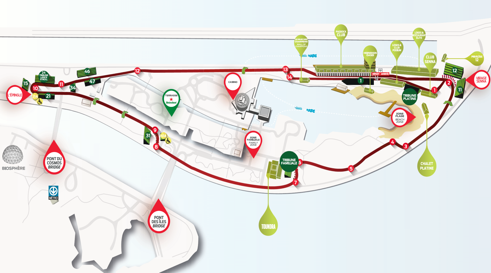
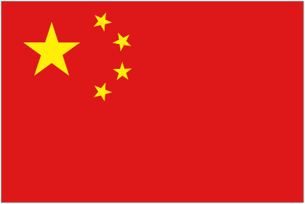
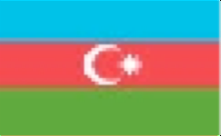

GUIDE MÉDIA 2018

2018 MEDIA KIT

TABLE DES MATIÈRES | TABLE OF CONTENT

SECTION 1 : RENSEIGNEMENTS GÉNÉRAUX | GENERAL INFORMATION COMITÉ ORGANISATEUR | ORGANIZING COMMITTEE 4 À PROPOS | A FEW FACTS 5

SECTION : 2 SERVICES DE PRESSE | MEDIA SERVICES PERSONNEL DU CENTRE MÉDIA | MEDIA CENTRE STAFF 7 CENTRE MÉDIA | MEDIA CENTRE 8 CENTRE D’ACCRÉDITATION MÉDIA | MEDIA ACCREDITATION CENTRE 9 NAVETTES MÉDIA | MEDIA SHUTTLES 9 CONFÉRENCES DE PRESSE | PRESS CONFERENCES 10 SERVICES AUX PHOTOGRAPHES | SERVICES FOR PHOTOGRAPHERS 11 HALTE MÉDIA | MEDIA HOSPITALITY 12 CARTE DU SITE | SITE MAP 13 CARTE DU CENTRE MÉDIA | MEDIA CENTRE MAP 14 ALLOCATION DES STANDS ET DES AIRES D’HOSPITALITÉ | PITS AND HOSPITALITY ALLOCATION 14

SECTION : 3 CHAMPIONNAT DU MONDE DE FORMULE 1 FIA 2018 | 2018 FIA FORMULA 1 WORLD CHAMPIONSHIP

CALENDRIER 2018 | 2018 CALENDAR 16 LISTE DES ENGAGÉS 2018 | 2018 ENTRY LIST 17 CLASSEMENT PROVISOIRE DES PILOTES ET CONSTRUCTEURS | PROVISIONAL DRIVER & CONSTRUCTOR STANDINGS 18 POLES, VICTOIRES ET MEILLEURS TOURS | POLES, WINNERS & BEST LAPS 18 POINTAGE DES PILOTES LORS DES 6 PREMIÈRES RONDES | DRIVER STANDINGS AFTER 6 ROUNDS 19 POINTAGE DES CONSTRUCTEURS LORS DES 6 PREMIÈRES RONDES | CONSTRUCTOR STANDINGS AFTER 6ROUNDS 20 RÉSULTATS DES COURSES | RACE RESULT 21

SECTION : 4 FORMULA 1 GRAND PRIX DU CANADA STATISTIQUES | STATISTICS 28 LES 6-8-10 PREMIERS DEPUIS 1967 | TOP 6-8-10 SINCE 1967 43

SECTION : 5 PERFORMANCES DES DERNIÈRES ANNÉES | RECENT RECORDS CLASSEMENT DES PILOTES 2015-2018 | 2015-2018 DRIVERS’ STANDING 48

SECTION : 6 COURSES DE SOUTIEN | SUPPORT RACES CHALLENGE FERRARI TROFEO PIRELLI | TROFEO PIRELLIFERRARI CHALLENGE 50 ULTRA 94 PORSCHE GT3 CUP CHALLENGE CANADA BY YOKOHAMA. 51 2 FORMULA 1600 52

SECTION 1 :

RENSEIGNEMENTS

GÉNÉRAUX | GENERAL

INFO

COMITÉ ORGANISATEUR | ORGANIZING COMMITTEE

PROMOTEUR : GROUPE DE COURSE OCTANE INC. / PROMOTER: OCTANE RACING GROUP INC.

PRÉSIDENT ET CHEF DE LA DIRECTION | PRESIDENT & CEO FRANÇOIS DUMONTIER DIRECTEUR, OPÉRATIONS | OPERATIONS DIRECTOR BRUNO SAVARD Ing DIRECTRICE PRINCIPALE, Expérience client et innovation | DOMINIQUE FAUTEUX SENIOR DIRECTOR, Client Experience & Innovation DIRECTRICE, Finance et administration | SENIOR DIRECTOR, Finance & Administration DAYNA GENDRON, CA CPA DIRECTEUR PRINCIPAL, Marketing | SENIOR DIRECTOR, Marketing MAXIME ST-LAURENT DIRECTRICE PRINCIPALE, Partenariats stratégiques | CHANTAL BRUNET SENIOR DIRECTOR, Strategic Partnerships DIRECTRICE PRINCIPALE, Loges et services corporatifs| JULIE RIOUX-PAQUETTE SENIOR DIRECTOR, Suites & Corporate Services CHEF DE PRESSE NATIONAL | NATIONAL PRESS OFFICER SANDRINE GARNEAU-LE BEL

OFFICIELS DE LA FIA | FIA OFFICIALS PRÉSIDENT | PRESIDENT JEAN TODT DIRECTEUR DE COURSE, STARTER OFFICIEL ET DÉLÉGUÉ SÉCURITÉ | CHARLIE WHITING RACE DIRECTOR, OFFICIAL STARTER ET SAFETY DELEGATE

COMMISSAIRES FIA | FIA INTERNATIONAL STEWARDS GERD ENNSER - JOSE ABED COMMISSAIRE DES PILOTES FIA | FIA DRIVER STEWARD EMANUELE PIRRO COMMISSAIRE ASN | ASN STEWARD PAUL COOKE

DÉLÉGUÉ MÉDICAL | MEDICAL DELEGATE Dr ALAIN CHANTEGRET DÉPUTÉ DÉLÉGUÉ MÉDICAL | DEPUTY MEDICAL DELEGATE Dr. IAN ROBERTS DÉLÉGUÉ TECHNIQUE | TECHNICAL DELEGATE JO BAUER DIRECTEUR DES COMMUNICATIONS F1 & DÉLEGUÉ MEDIA | MATTEO BONCIANI F1 HEAD OF COMMUNICATIONS & MEDIA DELEGATE DÉPUTÉ DÉLÉGUÉ FIA MÉDIA | FIA Deputy Media Delegate PIERRE GUYONNET-DUPERAT CONDUCTEUR- VOITURE DE SÉCURITÉ | SAFETY CAR DRIVER BERND MAYLÄNDER CONDUCTEUR DE LA VOITURE MÉDICALE | MEDICAL CAR DRIVER ALAN VAN DER MERWE

OFFICIELS DE L’ASN | ASN OFFICIALS

PRÉSIDENT ASN-CANADA | ASN-CANADA PRESIDENT ROGER PEART DIRECTEUR DE LA COURSE | CLERK OF THE COURSE FRANÇOIS RÉMILLARD DIRECTEUR DE COURSE (COURSES DE SOUTIEN) | BOB PAGE, DANY FRADETTE CLERK OF THE COURSE (SUPPORT RACES) MÉDECIN-CHEF | CHIEF MEDICAL OFFICER DR. JACQUES BOUCHARD CO-MÉDECIN CHEF | DEPUTY CHIEF MEDICAL DR. RONALD DENIS CHEF COMMISSAIRE TECHNIQUE | CHIEF SCRUTINEER JEAN-LUC DEHENAU SECRÉTAIRE DE L’ÉVÉNEMENT | SECRETARY OF THE EVENT MARC-ANDRÉ ROBERT CLUB ORGANISATEUR | ORGANIZING CLUB AUTOMOBILE CLUB DE L’ILE NOTRE-DAME 4

À PROPOS | A FEW FACTS

ÉVÉNEMENT | EVENT RADIO- GRAND PRIX FORMULA 1 GRAND PRIX DU CANADA 2018 RADIO GRAND PRIX 99,1 FM & 90,7 FM

7E RONDE DU CHAMPIONNAT DU MONDE FIA DE CENTRE INFOTOURISTE | TOURIST INFORMATION CENTRE FORMULE 1 2018 1255, RUE PEEL BUREAU 100 (ANGLE|CORNER SAINTE-CATHERINE OUEST) 7TH ROUND OF THE 2018 FIA FORMULA 1 WORLD 1 877 BONJOUR (266-5687)514 873-2015 CHAMPIONSHIP WWW.TOURISME-MONTREAL.ORG WWW.BONJOURQUEBEC.COM

DATE 8,9 ET 10 JUIN 2018 TÉLÉCOMMUNICATIONS |TELECOMMUNICATIONS JUNE 8, 9 AND 10, 2018 • APPELS INTERNATIONAUX (EXCLUANT LES ÉTATS-UNIS) :

HISTOIRE | HISTORY 011 + CODE DU PAYS + CODE RÉGIONAL + NUMÉRO 49E GRAND PRIX DU CANADA ET 39E GRAND PRIX À INTERNATIONAL TELEPHONE CALLS (EXCEPT USA): MONTRÉAL 011+ COUNTRY CODE + REGIONAL CODE + NUMBER 49TH GRAND PRIX DU CANADA AND 39RD GRAND PRIX IN MONTRÉAL • APPELS AU CANADA ET AUX ÉTATS-UNIS : 1 + CODE RÉGIONAL + NUMÉRO TELEPHONE CALLS FOR CANADA AND USA: 1 + REGIONAL CODE + NUMBER SITE CODE RÉGION DE MONTRÉAL|MONTRÉAL REGIONAL CODE : 514 CIRCUIT GILLES-VILLENEUVE, PARC JEAN-DRAPEAU MONTRÉAL (QUÉBEC) CANADA • TÉLÉPHONISTE | OPERATOR : 0

COURSE | RACE • RECHERCHE DE NUMÉRO|NUMBER INQUIRY : 411 OR WWW.CANADA411.CA 70 TOURS DE 4,361 KM (305,270 KM) 70 LAPS OF 4.361 KM (305.270 KM) • URGENCE | EMERGENCY : 911

SANCTION FÉDÉRATION INTERNATIONALE DE L’AUTOMOBILE (FIA) AÉROPORT | AIRPORT VOLS INTERNATIONAUX ET DOMESTIQUES : INTERNATIONAL AND DOMESTIC FLIGHTS: PROMOTEUR | PROMOTER MONTRÉAL-TRUDEAU (DORVAL) YUL 514 394-7377 GROUPE DE COURSE OCTANE INC. | OCTANE RACING WWW.ADMTL.COM GROUP INC. 2170 AVENUE PIERRE-DUPUY, BUREAU 100 TAXIS MONTRÉAL (QUÉBEC) CANADA H3C 3R4 TAXI DIAMOND 514 273-6331 TÉLÉPHONE | TELEPHONE: 514 350-4731 TAXI ROYAL 514 274-3333 TÉLÉCOPIEUR | FAX: 514 350-0007

MÉTÉO | WEATHER WWW.GPCANADA.CA ENVIRONNEMENT CANADA 514 283-3010 WWW.METEOMEDIA.COM FACEBOOK FORMULA 1 GRAND PRIX DU CANADA TWITTER @F1GPCANADA DISTANCES ROUTIÈRES | ROAD DISTANCES INSTAGRAM @F1GPCANADA WWW.QUEBEC511.GOUV.QC.CA LINKEDIN FORMULA 1 GRAND PRIX DU CANADA PINTEREST F1 GRAND PRIX DU CANADA YOUTUBE F1 GRAND PRIX DU CANADA

5

SECTION 2 :

SERVICES DE PRESSE |

MEDIA SERVICES

PERSONNEL DU CENTRE MÉDIA | TÉLÉPHONE AU CENTRE MÉDIA | MEDIA CENTER MEDIA CENTRE STAFF TELEPHONE (514) 397-8333 CENTRE D’ACCRÉDITATION | ACCREDITATION CENTER (438)390-9142

| TITRE \| TITLE | NOM \|NAME |  | LANGUES \| LANGUAGES |
| --- | --- | --- | --- |
| DIRECTEUR DES COMMUNICATIONS F1 FIA ET DÉLÉGUÉ MEDIA \| FIA F1 HEAD OF COMMUNICATIONS AND MEDIADELEGATE | MATTEOBONCIANI PIERRE GUYONNET-DUPERAT |  |  |
| CHEF DE PRESSE NATIONAL \| NATIONAL PRESSOFFICER | SANDRINE GARNEAU-LEBEL MAXIME BERTHIAUME |  |  |
| RESPONSABLE DE L’ACCRÉDITATION \| ACCREDITATIONCOORDINATOR | PIERREPETITCLERC GILLESPAQUETTE |  |  |
| SALLE DE PRESSE, ACCUEIL ET SERVICES \| PRESS ROOM, RECEPTION &SERVICES | LUDOVICTHÉBERGE CASSIDY CHARETTE ÉLIZABETH BERGERON BRUNOBASQUE GIOVANNIVENDITTOLI | VIRGINIE DURAND VIRGINIE PENASSE |  |
| REPROGRAPHIE DES RÉSULTATS \| RESULTSDUPLICATING | PIERREBOURDAGE YVONMARTINEAU |  |  |
| SOUTIEN TECHNIQUE INFORMATIQUE \| COMPUTER TECHNICALSUPPORT | FRÉDÉRICKDEXTRATEUR VITO GAUDINO HAO ZANG OVIDIU ZAHARIA OLIVIER FORTIER DUC LY CHRIS OGONEK SANDRINE GASPER- GARABET DZAGOUHNI CLARKE MOE LABADE COURTNEY HAMM |  |  |
| SERVICES AUDIO-VIDÉO\| AUDIO-VIDEOSERVICES | JOËLDESCHENAUX | KEVINALBERT |  |

7 SERVICES DE TÉLÉCOMMUNICATIONS (BELL) | CLAUDE TREMBLAY TELECOMMUNICATIONS SERVICES (BELL)

CENTRE MÉDIA | MEDIA CENTRE

HEURES D’OUVERTURE DU CENTRE MÉDIA MEDIA CENTRE OPENING HOURS MERCREDI 6 JUIN : 12 H à 20 H WEDNESDAY, JUNE 6: 12:00 PM - 8:00 PM JEUDI 7 JUIN : 9 H à 22 H THURSDAY, JUNE 7: 9:00 AM - 10:00 PM VENDREDI 8 JUIN : 7 H à 23 H FRIDAY, JUNE 8: 7:00 AM - 11:00 PM SAMEDI 9 JUIN : 7 H à 23 H SATURDAY, JUNE 9: 7:00 AM - 11:00 PM DIMANCHE 10 JUIN : 7 H - JUSQU’AU DÉPART DU SUNDAY, JUNE 10: 7:00 AM - UNTIL THE LAST JOURNALIST’S DERNIER JOURNALISTE DEPARTURE

ASSISTANCE EN LANGUE ÉTRANGÈRE ASSISTANCE IN FOREIGN LANGUAGES Français, anglais. Tous les jours de 8 h à 18 h French, English. Every day from 8 am to 6 pm

PHOTOCOPIE PHOTOCOPYING Tous les jours (heures d’ouverture). Voir comptoir d’accueil. Everyday (opening hours). Inquire at the welcome

CASIERS DESK. LOCKERS Clés disponibles à l’accueil. Dépôt requis de 10 $ CAN. Keys are available at the welcome desk. A $10 can deposit is required.

TÉLÉCOPIE FAX TRANSMISSION Tous les jours (heures d’ouverture). Voir comptoir d’accueil. Everyday (opening hours). Inquire at the welcome desk.

TÉLÉPHONES PUBLICS PUBLIC TELEPHONES Rendez-vous au comptoir téléphones publics. Available at the public telephones desk. Les principales cartes de crédit sont acceptées. Most major credit cards are accepted.

CONNEXION INTERNET INTERNET CONNECTION Le centre média et la zone photo sont équipés d’un réseau sans fil The media center and the photo zone are equipped with free Wi-Fi. (wi-fi) gratuit. Il y a possibilité d’avoir un poste muni d’une prise pour There is a possibility to have a workstation equipped with an ethernet câble Ethernet. entry.

ALIMENTATION ÉLECTRIQUE ELECTRICAL POWER Chaque poste est muni d’une prise de courant de 110-120 volts, 60 Each workstation is equipped with a power outlet. Voltage in Canada is cycles. Les membres de la presse internationale doivent valider la 100-120 volts, 60 cycles. Members of the international press must compatibilité de leurs appareils. Pour l’obtention d’un inquire about compatibility of their electronic and electric devices. To transformateur, s’adresser au comptoir d’accueil. Dépôt requis de obtain a transformer, please inquire at the welcome desk. A $20 can 20 $ CAN. deposit is required.

SOUTIEN INFORMATIQUE COMPUTER TECHNICAL SUPPORT Un technicien est disponible tous les jours (heures d’ouverture). A technician is available every day (opening hours). Inquire at the S’adresser au comptoir d’accueil. welcome desk.

8

CENTRE D’ACCRÉDITATION MÉDIA | MEDIA ACCREDITATION CENTRE

HEURES D’OUVERTURE OPENING HOURS

MERCREDI 6 JUIN : 11 H À 18 H WEDNESDAY, JUNE 6: 11:00 AM - 6:00 PM JEUDI 7 JUIN : 8 H À 18 H THURSDAY, JUNE 7: 8:00 AM - 6:00 PM

VENDREDI 8 JUIN : 8 H À 16 H FRIDAY, JUNE 8: 8:00 AM - 4:00 PM SAMEDI 9 JUIN : 8 H À 12 H SATURDAY, JUNE 9: 8:00 AM - 12:00 PM

LIEUX LOCATION Plaza Centre-Ville (Anciennement Hôtel Delta) Plaza Centre-Ville (used to be Hotel Delta) 777 Boulevard Robert-Bourassa (Coin St-Jacques) 777 Boulevard Robert-Bourassa (corner St-Jacques) T: 514 879-0718 T: 514 879-0718 *Dans la tour EVO Montréal *In the EVO- Montreal tower

NAVETTES SHUTTLES MÉDIA The shuttles will be operating from Wednesday, June 6 to Sunday, June Les navettes quittent Plaza Centre-Ville (777 Boulevard 10. They will leave the Plaza Centre-Ville (777 Boulevard Robert- Robert-Bourassa, coin St-Jacques) du mercredi 6 juin au Bourassa, corner St-Jacques) starting at 7:00 a.m. every day dimanche 10 juin. Les départs quotidiens débutent à 7 h (exceptionally 11:00 a.m. on Wednesday and 8:00 a.m. on Thursday) until (exceptionnellement à 11 h le mercredi et à 8 h le jeudi) et se 30 minutes after the Media Centre closes. terminent 30 minutes après la fermeture du Centre média. Please note that two shuttles will be available from the Alt Hotel (120

Veuillez noter que deux navettes seront disponibles de l’Hôtel rue Peel) from Wednesday, June 6 to Saturday, June 9 at 8:00 am and 9:00 Alt Giffintown (120 rue Peel) du mercredi 6 juin au samedi 9 am. Media wishing to be dropped off at the Alt must advise the driver juin à 7h30 et 8h30 et le dimanche 10 juin à 8h et 9h. Les who will gladly add a stop. médias souhaitant un arrêt à l’hôtel Alt en soirée doivent informer le chauffeur qui se fera un plaisir d’ajouter un arrêt. The shuttles will bring you directly to Circuit Gilles-Villeneuve, near the Media Centre. Please note that only media representatives with FIA and

Les navettes se rendent directement au circuit Gilles- FOM credentials will have access to the shuttle service. Villeneuve, à quelques dizaines de mètres du Centre média. À noter que seuls les représentants de la presse dûment accrédités par la FIA et la FOM ont accès à ce service de transport par navettes.

9

CONFÉRENCES DE PRESSE | PRESS CONFERENCES

Les conférences de presse de la Formule 1 se The F1 press conferences will take place in the press déroulent à la salle de conférence de presse du conference room in the media center. Access is centre média. À l’exception d’une autorisation forbidden to tv cameras, except to those authorized

spéciale de la FIA, aucune caméra vidéo n’est autorisée by the F1 head of communications. Photographers are durant ces conférences. Les photographes sont priés kindly invited to stay in the back of the room and on de se tenir à l’arrière de la salle et sur la tribune. the stand. The use of mobile phones is forbidden in L’usage de téléphones cellulaires est interdit dans this room.

cette salle.

JEUDI 7 JUIN – 11 H 00 CONFÉRENCE DE PRESSE AVEC UN MAXIMUM DE SIX THURSDAY, JUNE 7 – 11:00 AM PILOTES CHOISIS PAR LE PRESS CONFERENCE FOR A MAXIMUM OF SIX DIRECTEUR DES COMMUNICATIONS F1 FIA. DRIVERS CHOSEN BY THE FIA F1 HEAD OF

COMMUNICATIONS

VENDREDI 8 JUIN – 12 H 00 CONFÉRENCE DE PRESSE AVEC UN MAXIMUM DE SIX FRIDAY, JUNE 8 – NOON (12:00) REPRÉSENTANTS D’ÉCURIES CHOISIS PAR LE PRESS CONFERENCE FOR A MAXIMUM OF SIX TEAM DIRECTEUR DES COMMUNICATIONS F1 FIA PERSONALITIES, CHOSEN BY THE FIA F1 HEAD OF

COMMUNICATIONS

SAMEDI 9 JUIN – APRÈS LA SÉANCE DE QUALIFICATIONS SATURDAY, JUNE 9 – FOLLOWING THE QUALIFYING CONFÉRENCE DE PRESSE « POSITION DE TÊTE» AVEC SESSION LES TROIS PREMIERS PILOTES DE LA SÉANCE DE POST-QUALIFYING PRESS CONFERENCE WITH TOP

QUALIFICATION THREE DRIVERS OF THE QUALIFYING SESSION

DIMANCHE 10 JUIN – APRÈS SUNDAY, JUNE 10 – AFTER THE LE FORMULA 1 GRAND PRIX DU CANADA 2018 FORMULA 1 GRAND PRIX DU CANADA 2018 CONFÉRENCE DE PRESSE D’APRÈS COURSE AVEC LES POST-RACE PRESS CONFERENCE WITH TOP THREE

TROIS PREMIERS PILOTES. FINISHING DRIVERS.

10

SERVICES AUX PHOTOGRAPHES | SERVICES FOR PHOTOGRAPHERS

ZONE PHOTO PHOTOGRAPHERS ZONE Cette zone comporte un comptoir de dépannage, une aire This area provides services for photographers, working de travail et des casiers. facilities and lockers.

TOURS PHOTOGRAPHIQUES PHOTOGRAPHERS TOWER Il y a trois tours photographiques : au virage Senna, dans There are three photographers towers. One is located in the l’Épingle et devant le podium. Dimanche, l’accès aux tours Senna Curve, another in the Hairpin and the last one facing the photographiques de départ et de podium sera permis podium. Please note that on Sunday, the access to the podium uniquement à ceux possédant l’autorisation du directeur tower is restricted to photographers authorized by the F1 des communications F1. Des renseignements à cet effet head of communications. Information is available at the seront affichés à la zone photo. photographers' area.

NAVETTES DE PISTE CIRCUIT SHUTTLES • Une navette assurera le transport des photographes A shuttle bus will transport fully accredited photographers dûment accrédités en utilisant le circuit Gilles-Villeneuve, on the Circuit Gilles-Villeneuve according to the following selon l’horaire suivant : schedule: • ESSAIS LIBRES ET QUALIFICATIONS la navette quittera la tour F1 • PRACTICE AND QUALIFYING SESSIONS § 60 minutes avant le début des sessions The shuttle will leave the f1 tower § Le dernier départ se fera 40 minutes avant le § 60 minutes before the start of the session début des sessions. § Last departure 40 minutes before the start of the § L’embarquement de retour est prévu 5 à 10 session minutes suivant l’apparition du drapeau à § Pick up 5-10 minutes after the chequered flag. damiers. • RACE • COURSE First shuttle will leave le premier transport se fera § 90 minutes before the race § 90 minutes avant l’épreuve § The last shuttle, 75 minutes before the start of the § Le dernier 75 minutes avant le début de la race course. § There will be no boarding after the final race. § Aucune navette ne se rendra au circuit après la course finale. BASIN SHUTTLES NAVETTES DU BASSIN A shuttle skirting the Olympic basin will ensure a continuous Une navette longeant le bassin olympique assurera un transport to the unloading dock of the media shuttles, and to transport en continu the supporting races paddock. A stop can be carried out at the du débarcadère des navettes médias jusqu’au paddock des hairpin. courses de soutien. Un arrêt peut être effectué à l’épingle. CAMERA REPAIR SERVICE A minimum of two camera technicians are available daily

DÉPANNAGE ET RÉPARATION during opening hours.

Un minimum de deux techniciens photo est disponible tous Inquire at the Welcome Desk. 11 les jours durant les heures d’ouverture. S’adresser au comptoir d’accueil.

HALTE MÉDIA | MEDIA HOSPITALITY

LA HALTE MÉDIA EST OUVERTE EXCLUSIVEMENT THE MEDIA HOSPITALITY CENTRE IS OPEN EXCLUSIVELY AUX REPRÉSENTANTS DE LA PRESSE DÛMENT TO MEDIA REPRESENTATIVES WITH OFFICIAL ACCRÉDITÉS. CREDENTIALS.

JEUDI 7 JUIN THURSDAY, JUNE 7 8 h : petit-déjeuner et café 8:00 am : Coffee and Breakfast

11 h à 13 h 30 : repas froid 11:00 am to 13:30 pm: Cold lunch

13 h 30 à 16 h : rafraîchissements 1:30 pm to 4:00 pm: Refreshments

VENDREDI 8 JUIN FRIDAY, JUNE 8 7 h : café 7:00 am: Coffee 8 h à 10 h : petit-déjeuner 8:00 am to 10:00 am: Breakfast

11 h 30 à 14 h 00 : repas froid 11:30 am to 2:00 pm: Cold 14 h à 17 h : rafraîchissements lunch 2:00 pm to 5:00 pm:

SAMEDI 9 JUIN Refreshments 7 h : café

8 h à 10 h : petit-déjeuner SATURDAY, JUNE 9 11 h à 13 h 30 : repas 7:00 am: Coffee 13 h 30 à 17 h : rafraîchissements 8.00 am to 10:00 am: Breakfast

DIMANCHE 10 JUIN 11:00 am to 1:30 pm: Lunch 7 h : café 1:30 pm to 5:00 pm: Refreshments 8 h à 10 h : petit-déjeuner

11 h 30 à 14 h 00 : repas SUNDAY, JUNE 10 13 h 30 à 17 h : rafraîchissements 7:00 am: Coffee

8.00 am to 10:00 am: Breakfast 11:30 am to 2:00 pm: Lunch 1:30 pm to 5:00 pm: Refreshments

12

CARTE | MAP

CARTE DU SITE | SITE MAP

13

CARTE DU CENTRE MÉDIA | MEDIA CENTRE MAP

ALLOCATION DES STANDS ET AIRES D’HOSPITALITÉ | PITS AND HOSPITALITIES ALLOCATION

14

SECTION 3 :

CHAMPIONNAT DU

MONDE DE FORMULE 1

FIA 2018 | 2018 FIA

FORMULA 1 WORLD

CHAMPIONSHIP

CALENDRIER 2018 | 2018 SCHEDULE

|  | DATE | ÉVÉNEMENT \|EVENT | CIRCUIT | VILLE \|CITY |
| --- | --- | --- | --- | --- |
| 1 | 25 MARS \| MARCH25 | AUSTRALIE \|AUSTRALIA | ALBERT PARK GRAND PRIXCIRCUIT | MELBOURNE |
| 2 | 8 AVRIL \| APRIL8 | BAHREÏN \|BAHRAIN | BAHRAIN INTERNATIONALCIRCUIT | SAKHIR |
| 3 | 15 AVRIL \| APRIL15 | CHINE \|CHINA | SHANGHAI INTERNATIONAL CIRCUIT | SHANGHAI |
| 4 | 29 AVRIL \| APRIL29 | AZERBAIDJAN \|AZERBAIJAN | CIRCUIT DE VILLE \| STREET CIRCUIT | BAKOU \|BAKU |
| 5 | 13 MAI \| MAY13 | ESPAGNE \|SPAIN | CIRCUIT DE BARCELONA- CATALUNYA | BARCELONE \| BARCELONA |
| 6 | 27 MAI \| MAY27 | MONACO | CIRCUIT DE VILLE \| STREET CIRCUIT | MONTECARLO |
| 7 | 10 JUIN \| JUNE10 | CANADA | CIRCUITGILLES-VILLENEUVE | MONTRÉAL |
| 8 | 24 JUIN \| JUNE24 | FRANCE | CIRCUIT PAUL RICARD | LE CASTELLET |
| 9 | 1 JUILLET \| JULY1 | AUTRICHE \|AUSTRIA | RED BULLRING | SPIELBERG |
| 10 | 8 JUILLET \| JULY8 | GRANDE-BRETAGNE \| GREATBRITAIN | SILVERSTONE CIRCUITS | SILVERSTONE |
| 11 | 22 JUILLET \| JULY22 | ALLEMAGNE \|GERMANY | HOCKENHEIMRING | HOCKENHEIM |
| 12 | 29JUILLET \| JULY29 | HONGRIE \|HUNGARY | HUNGARORING | BUDAPEST |
| 13 | 26 AOÛT \| AUGUST26 | BELGIQUE \|BELGIUM | CIRCUIT DESPA-FRANCORCHAMPS | SPA- FRANCORCHAMPS |
| 14 | 2 SEPTEMBRE \| SEPTEMBER2 | ITALIE \|ITALY | AUTODROMO NAZIONALEMONZA | MONZA |
| 15 | 16 SEPTEMBRE \| SEPTEMBER16 | SINGAPOUR \|SINGAPORE | CIRCUIT DE VILLE \| STREET CIRCUIT | SINGAPORE |
| 16 | 30 SEPTEMBRE \| SEPTEMBER30 | RUSSIE \| RUSSIA | CIRCUIT DE VILLE \| STREET CIRCUIT | SOTCHI \| SOCHI |
| 17 | 7 OCTOBRE \| OCTOBER7 | JAPON \|JAPAN | SUZUKA INTERNATIONAL RACING COURSE | SUZUKA |
| 18 | 21OCTOBRE \| OCTOBER21 | ETATS-UNIS \|UNITED-STATES | CIRCUIT OF THEAMERICAS | AUSTIN |
| 19 | 28OCTOBRE \| OCTOBER28 | MEXIQUE \|MEXICO | AUTODROMO HERMANOS RODRIGUEZ | MEXICOCITY |
| 20 | 11 NOVEMBRE \| NOVEMBER11 | BRÉSIL \|BRAZIL | AUTÓDROMO JOSÉ CARLOS PACE | SAOPAULO |
| 21 | 25 NOVEMBRE \| NOVEMBER25 | ABOU DHABI \| ABUDHABI | YAS MARINACIRCUIT | ABOU DHABI \| ABU 1 DHABI |

LISTE DES ENGAGÉS 2018 | 2018 ENTRY LIST

| N0 | PILOTE \| DRIVER | NATIONALITÉ \| NATIONALITY | ÉQUIPE \| TEAM | CHÂSSIS \| CHASSIS | MOTEUR \| ENGINE |
| --- | --- | --- | --- | --- | --- |
| 44 | LEWISHAMILTON | GBR | MERCEDES AMG PETRONAS MOTORSPORT | F1 W09 | MERCEDES |
| 77 | VALTTERIBOTTAS | FIN |  |  |  |
| 5 | SEBASTIAN VETTEL | DEU | SCUDERIA FERRARI | SF71H | FERRARI |
| 7 | KIMIRÄIKKÖNEN | FIN |  |  |  |
| 3 | DANIEL RICCIARDO | AUS | ASTON MARTIN RED BULL RACING | RB14 | TAG HEUER |
| 33 | MAX VERSTAPPEN | NLD |  |  |  |
| 10 | PIERRE GASLY | FRA | RED BULL TORO ROSSO HONDA | STR13 | HONDA |
| 28 | BRENDON HARTLEY | NZL |  |  |  |
| 11 | SERGIO PÉREZ | MEX | SAHARA FORCE INDIA F1 TEAM | VJM11 | MERCEDES |
| 31 | ESTEBAN OCON | FRA |  |  |  |
| 18 | LANCE STROLL | CAN | WILLIAMS MARTINI RACING | FW41 | MERCEDES |
| 35 | SERGEY SIROTKIN | RUS |  |  |  |
| 8 | ROMAIN GROSJEAN | FRA | HAAS F1 TEAM | VF18 | FERRARI |
| 20 | KEVIN MAGNUSSEN | DNK |  |  |  |
| 27 | NICO HULKENBERG | DEU | RENAULT SPORT FORMULA ONE TEAM | R.S.18 | RENAULT |
| 55 | CARLOS SAINZ | ESP |  |  |  |
| 9 | MARCUS ERICSSON | SWE | ALFA ROMEO SAUBER F1 TEAM | C37 | FERRARI |
| 16 | CHARLES LECLERC | MCO |  |  |  |
| 14 | FERNANDO ALONSO | ESP | MCLAREN F1 TEAM | MCL33 | RENAULT |
| 2 | STOFFEL VANDOORNE | BEL |  |  |  |

17

CLASSEMENT PROVISOIRE DES PILOTES ET CONSTRUCTEURS | PROVISIONAL DRIVER & CONSTRUCTOR STANDINGS

| RANK | PILOTE \| DRIVER | NAT. | POINTS |
| --- | --- | --- | --- |
| 1 | LEWISHAMILTON | GBR | 110 |
| 2 | SEBASTIAN VETTEL | DEU | 96 |
| 3 | DANIEL RICCIARDO | AUS | 72 |
| 4 | VALTTERIBOTTAS | FIN | 68 |
| 5 | KIMIRÄIKKÖNEN | FIN | 60 |
| 6 | MAX VERSTAPPEN | NLD | 35 |
| 7 | FERNANDO ALONSO | ESP | 32 |
| 8 | NICO HULKENBERG | DEU | 26 |
| 9 | CARLOS SAINZ | ESP | 20 |
| 10 | KEVIN MAGNUSSEN | DNK | 19 |
| 11 | PIERRE GASLY | FRA | 18 |
| 12 | SERGIO PÉREZ | MEX | 17 |
| 13 | ESTEBAN OCON | FRA | 9 |
| 14 | CHARLES LECLERC | MCO | 9 |
| 15 | STOFFEL VANDOORNE | BEL | 8 |
| 16 | LANCE STROLL | CAN | 4 |
| 17 | MARCUS ERICSSON | SWE | 2 |
| 18 | BRENDON HARTLEY | NZL | 1 |
| 19 | ROMAIN GROSJEAN | FRA | 0 |
| 20 | SERGEY SIROTKIN | RUS | 0 |

| RANK | CONSTRUCTEURS CONSTRUCTORS | POINTS |
| --- | --- | --- |
| 1 | MERCEDES | 178 |
| 2 | FERRARI | 156 |
| 3 | RED BULL | 107 |
| 4 | RENAULT | 46 |
| 5 | MCLAREN | 40 |
| 6 | FORCE INDIA | 26 |
| 7 | TORO ROSSO | 19 |
| 8 | HAAS | 19 |
| 9 | SAUBER | 11 |
| 10 | WILLIAMS | 4 |

POLES, VICTOIRES ET MEILLEURS TOURS | POLES, WINNERS & FASTEST LAPS

|  | AUS | BHR | CHN | AZE | ESP | MONACO |
| --- | --- | --- | --- | --- | --- | --- |
| POLE POSITION | HAMILTON MERCEDES | VETTEL FERRARI | VETTEL FERRARI | VETTEL FERRARI | HAMILTON MERCEDES | RICCIARDO RED BULL RACING |
| VICTOIRE WINNER | VETTEL FERRARI | VETTEL FERRARI | RICCIARDO RED BULL RACING | HAMILTON MERCEDES | HAMILTON MERCEDES | RICCIARDO RED BULL RACING |
| MEILLEUR TOUR FASTEST LAP | RICCIARDO RED BULL RACING | BOTTAS MERCEDES | RICCIARDO RED BULL RACING | BOTTAS MERCEDES | RICCIARDO RED BULL RACING | VERSTAPPEN RED BULL RACING |

18

POINTAGE DES PILOTES LORS DES 6 PREMIÈRES RONDES | DRIVER STANDINGS AFTER 6 ROUNDS

| No | PILOTE\| DRIVER | NAT. | ÉQUIPE TEAM | AUS |  |  | BHR |  |  | CHN |  |  | AZE |  |  | ESP |  |  | MCO |  |  | RANG\|PTS RANK\|PTS |
| --- | --- | --- | --- | --- | --- | --- | --- | --- | --- | --- | --- | --- | --- | --- | --- | --- | --- | --- | --- | --- | --- | --- |
|  |  |  |  | GRID | POS | PTS | GRID | POS | PTS | GRID | POS | PTS | GRID | POS | PTS | GRID | POS | PTS | GRID | POS | PTS |  |
| 44 | LEWISHAMILTON | GBR | MERCEDES | 1 | 2 | 18 | 9 | 3 | 15 | 4 | 4 | 12 | 2 | 1 | 25 | 1 | 1 | 25 | 3 | 3 | 15 | 110 |
| 5 | SEBASTIAN VETTEL | DEU | FERRARI | 3 | 1 | 25 | 1 | 1 | 25 | 1 | 8 | 4 | 1 | 4 | 12 | 3 | 4 | 12 | 2 | 2 | 18 | 96 |
| 3 | DANIEL RICCIARDO | AUS | RED BULL | 8 | 4 | 12 | 4 | NF | - | 6 | 1 | 25 | 4 | NF | - | 6 | 5 | 10 | 1 | 1 | 25 | 72 |
| 77 | VALTTERIBOTTAS | FIN | MERCEDES | 15 | 8 | 4 | 3 | 2 | 18 | 3 | 2 | 18 | 3 | 14 | - | 2 | 2 | 18 | 5 | 5 | 10 | 68 |
| 7 | KIMIRÄIKKÖNEN | FIN | FERRARI | 2 | 3 | 15 | 2 | NF | - | 2 | 3 | 15 | 6 | 2 | 18 | 4 | NF | - | 4 | 4 | 12 | 60 |
| 33 | MAX VERSTAPPEN | NLD | RED BULL | 4 | 6 | 8 | 15 | NF | - | 5 | 5 | 10 | 5 | NF | - | 5 | 3 | 15 | 20 | 9 | 2 | 35 |
| 14 | FERNANDO ALONSO | ESP | McLAREN | 10 | 5 | 10 | 13 | 7 | 6 | 13 | 7 | 6 | 12 | 7 | 6 | 8 | 8 | 4 | 7 | NF | - | 32 |
| 27 | NICO HULKENBERG | DEU | RENAULT | 7 | 7 | 6 | 7 | 6 | 8 | 7 | 6 | 8 | 14 | NF | - | 16 | NF | - | 11 | 8 | 4 | 26 |
| 55 | CARLOS SAINZ | ESP | RENAULT | 9 | 10 | 1 | 10 | 11 | - | 9 | 9 | 2 | 9 | 5 | 10 | 9 | 7 | 6 | 8 | 10 | 1 | 20 |
| 20 | KEVIN MAGNUSSEN | DNK | HAAS | 5 | NF | - | 6 | 5 | 10 | 11 | 10 | 1 | 15 | 13 | - | 7 | 6 | 8 | 19 | 13 | - | 19 |
| 10 | PIERRE GASLY | FRA | TORO ROSSO | 20 | NF | - | 5 | 4 | 12 | 17 | 18 | - | 17 | 12 | - | 12 | NF | - | 10 | 7 | 6 | 18 |
| 11 | SERGIO PÉREZ | MEX | FORCE INDIA | 12 | 11 | - | 12 | 16 | - | 8 | 12 | - | 8 | 3 | 15 | 15 | 9 | 2 | 9 | 12 | - | 17 |
| 31 | ESTEBAN OCON | FRA | FORCE INDIA | 14 | 12 | - | 8 | 10 | 1 | 12 | 11 | - | 7 | NF | - | 13 | NF | - | 6 | 6 | 8 | 9 |
| 16 | CHARLES LECLERC | MCO | SAUBER | 18 | 13 | - | 19 | 12 | - | 19 | 19 | - | 13 | 6 | 8 | 14 | 10 | 1 | 14 | 18 | - | 9 |
| 2 | STOFFEL VANDOORNE | BEL | McLAREN | 11 | 9 | 2 | 14 | 8 | 4 | 14 | 13 | - | 16 | 9 | 2 | 11 | NF | - | 12 | 14 | - | 8 |
| 18 | LANCE STROLL | CAN | WILLIAMS | 13 | 14 | - | 20 | 14 | - | 18 | 14 | - | 10 | 8 | 4 | 18 | 11 | - | 17 | 17 | - | 4 |
| 9 | MARCUS ERICSSON | SWE | SAUBER | 17 | NF | - | 17 | 9 | 2 | 20 | 16 | - | 18 | 11 | - | 17 | 13 | - | 16 | 11 | - | 2 |
| 28 | BRENDON HARTLEY | NZL | TORO ROSSO | 16 | 15 | - | 11 | 17 | - | 15 | 20 | - | 19 | 10 | 1 | 20 | 12 | - | 15 | 19 | - | 1 |
| 8 | ROMAIN GROSJEAN | FRA | HAAS | 6 | NF | - | 16 | 13 | - | 10 | 17 | - | 20 | NF | - | 10 | NF | - | 18 | 15 | - | 0 |
| 35 | SERGEY SIROTKIN | RUS | WILLIAMS | 19 | NF | - | 18 | 15 | - | 16 | 15 | - | 11 | NF | - | 19 | 14 | - | 13 | 16 | - | 0 |

GRID: POSITION AU DÉPART | GRID POSITION - POS: POSITION FINALE | FINAL POSITION - PTS: POINTS - NF: NON FINISSANT | DID NOT FINISH - NP: NON PARTANT | DID NOT START - DSQ : DISQUALIFIÉ |DISQUALIFIED

19

POINTAGE DES CONSTRUCTEURS LORS DES 6 PREMIÈRES RONDES | CONSTRUCTOR STANDINGS

AFTER 6 ROUNDS

| ÉQUIPE \| TEAM | AUS | BHR | CHN | AZE | ESP | MCO | RANG/ RANK | POINTS |
| --- | --- | --- | --- | --- | --- | --- | --- | --- |
| MERCEDES | 22 | 33 | 30 | 25 | 43 | 25 | 1 | 178 |
| FERRARI | 40 | 25 | 19 | 30 | 12 | 30 | 2 | 156 |
| RED BULL | 20 | - | 35 | - | 25 | 27 | 3 | 107 |
| RENAULT | 7 | 8 | 10 | 10 | 6 | 5 | 4 | 46 |
| MCLAREN | 12 | 10 | 6 | 8 | 4 | - | 5 | 40 |
| FORCE INDIA | - | 1 | - | 15 | 2 | 8 | 6 | 26 |
| TORO ROSSO | - | 12 | - | 1 | - | 6 | 7 | 19 |
| HAAS | - | 10 | 1 | - | 8 | - | 8 | 19 |
| SAUBER | - | 2 | - | 8 | 1 | - | 9 | 11 |
| WILLIAMS | - | - | - | 4 | - | - | 10 | 4 |

20

RÉSULTATS DU GRAND PRIX D'AUSTRALIE | AUSTRALIAN GRAND PRIX RESULTS 25MARS2018|MARCH25,2018

POLE POSITION : LEWIS HAMILTON 1:21:164 235.213 KM/H CIRCUIT: MELBOURNE (ALBERT PARK) MEILLEUR TOUR | FASTEST LAP : DANIEL RICCIARDO 1:25.945 TOUR | LAP : 54 LONGUEUR | LENGTH: 5.303 KM DISTANCE | DISTANCE: 307.574KM MENEURS SUCCESSIFS | LAP LEADERS : LEWIS HAMILTON 1- 18 ; SEBASTIAN VETTEL 19 - 58 TOURS | LAPS: 58 PARTANTS-FINISSANTS | STARTERS-FINISHERS : 20-15 TEMPS |WEATHER: ENSOLEILLÉ |SUNNY AVANCE DU VAINQUEUR | MARGIN OF VICTORY : +05.036s

| COURSE / RACE 57 |  |  |  |  |  |  |  |  |  | QUALIFICATIONS |  |  |
| --- | --- | --- | --- | --- | --- | --- | --- | --- | --- | --- | --- | --- |
| TEMPS \|W POS | EATHER: N0 | ENSOLEILLÉ \|SUNNY PILOTE\| DRIVER | NAT. | ÉQUIPE \|TEAM | TOURS LAPS | TEMPS TIME | VITESSE MOY. AVG SPEED | PLUS RAPIDE FASTESTLAP | TOUR LAP | RÉSULTAT RESULT | TEMPS TIME |  |
| 1 | 5 | SEBASTIAN VETTEL | DEU | FERRARI | 58 | 1h29m 33.283s | 220.782 | 1’26’’469 | 53 | 3 | 1’21’’838 | Q3 |
| 2 | 44 | LEWIS HAMILTON | GBR | MERCEDES | 58 | (+05.036s) | 220.846 | 1’26’’444 | 50 | 1 | 1’21’’164 | Q3 |
| 3 | 7 | KIMI RÄIKKÖNEN | FIN | FERRARI | 58 | (+06.309s) | 221.027 | 1’26’’373 | 57 | 2 | 1’21’’828 | Q3 |
| 4 | 3 | DANIEL RICCIARDO | AUS | RED BULL RACING | 58 | (+07.069s) | 222.128 | 1’25’’945 | 54 | 5 | 1’22’’152 | Q3 |
| 5 | 14 | FERNANDO ALONSO | ESP | MCLAREN | 58 | (+27.886s) | 219.490 | 1’26’’978 | 57 | 11 | 1’23’’692 | Q2 |
| 6 | 33 | MAX VERSTAPPEN | NLD | RED BULL RACING | 58 | (28.945s) | 219.738 | 1’26’’880 | 54 | 4 | 1’21’’879 | Q3 |
| 7 | 27 | NICO HULKENBERG | DEU | RENAULT | 58 | (+32.671s) | 219.230 | 1’27’’081 | 57 | 8 | 1’23’’532 | Q3 |
| 8 | 77 | VALTTERI BOTTAS | FIN | MERCEDES | 58 | (+34.339s) | 219.387 | 1’27’’019 | 54 | 10 | - | Q3 |
| 9 | 2 | STOFFEL VANDOORNE | BEL | MCLAREN | 58 | (+34.921s) | 219.540 | 1’26’’958 | 57 | 12 | 1’23’’853 | Q2 |
| 10 | 55 | CARLOS SAINZ | ESP | RENAULT | 58 | (+45.722s) | 217.079 | 1’27’’944 | 51 | 9 | 1’23’’577 | Q3 |
| 11 | 11 | SERGIO PEREZ | MEX | FORCE INDIA | 58 | (+46.817s) | 217.849 | 1’27’’633 | 51 | 13 | 1’24’’005 | Q2 |
| 12 | 31 | ESTEBAN OCON | FRA | FORCE INDIA | 58 | (+1m 00.278s) | 217.932 | 1’27’’600 | 57 | 15 | 1’24’’786 | Q2 |
| 13 | 16 | CHARLES LECLERC | MCO | SAUBER | 58 | (+1m 15.759s) | 215.086 | 1’28’’759 | 56 | 18 | 1’24’’636 | Q1 |
| 14 | 18 | LANCE STROLL | CAN | WILLIAMS | 58 | (+1m 18.288s) | 215.688 | 1’28’’511 | 55 | 14 | 1’24’’230 | Q2 |
| 15 | 28 | BRENDON HARTLEY | NZL | TORO ROSSO | 57 | +1 Tour \| Lap | 216.508 | 1’28’’176 | 57 | 16 | 1’24’’532 | Q1 |
| NF | 8 | ROMAIN GROSJEAN | FRA | HAAS | 24 | ROUE \| WHEEL | 214.974 | 1’28’’805 | 23 | 7 | 1’23’’339 | Q3 |
| NF | 20 | KEVIN MAGNUSSEN | DNK | HAAS | 22 | ROUE \| WHEEL | 213.224 | 1’29’’534 | 21 | 6 | 1’23’’187 | Q3 |
| NF | 10 | PIERRE GASLY | FRA | TORO ROSSO | 13 | MOTEUR \| ENGINE | 210.601 | 1’30’’649 | 13 | 20 | 1’25’’295 | Q1 |
| NF | 9 | MARCUS ERICSSON | SWE | SAUBER | 5 | HYDRAULIQUE \| HYDRAULIC | 207.036 | 1’32’’210 | 4 | 17 | 1’24’’556 | Q1 |
| NF | 35 | SERGEY SIROTKIN | RUS | WILLIAMS | 4 | FREINS \| BRAKES | 206.224 | 1’32’’573 | 3 | 19 | 1’24’’922 | Q1 |

21 NF : NON-FINISSANT | DID NOT FINISH - NP : NON PARTANT | DID NOT START - NQ : NON QUALIFIÉ | NOT QUALIFIED - DSQ : DISQUALIFIÉ | DISQUALIFIED - P : PÉNALITÉ | PENALTY

RÉSULTATS DU GRAND PRIX DE BARHEÏN | BAHRAIN GRAND PRIX RESULTS 8 AVRIL 2018| APRIL 8,2018

CIRCUIT: BARHEIN(SAKHIR) POLE POSITION: SÉBASTIAN VETTEL 1:27.958 221.506 KM/H LONGUEUR | LENGTH : 5.412 KM MEILLEUR TOUR | FASTEST LAP: VALTERRI BOTTAS 1:33.740 TOUR | LAP :22 DISTANCE | DISTANCE : 308.238KM MENEURS SUCCESSIFS | LAP LEADERS : SÉBASTIAN VETTEL 1-17 & 26-57 ; VALTERRI BOTTAS 18 – 20 ; TOURS | LAPS : 57 LEWIS HAMILTON 21-25 TEMPS |WEATHER: COURSE DE NUIT |NIGHT RACE PARTANTS-FINISSANTS | STARTERS-FINISHERS : 20 - 17 AVANCE DU VAINQUEUR | MARGIN OF VICTORY : +0.699s

| COURSE / RACE |  |  |  |  |  |  |  |  |  | QUALIFICATIONS |  |  |
| --- | --- | --- | --- | --- | --- | --- | --- | --- | --- | --- | --- | --- |
| POS | N0 | PILOTE \| DRIVER | NAT. | ÉQUIPE \|TEAM | TOURS LAPS | TEMPS TIME | VITESSE MOY. AVG SPEED | PLUS RAPIDE FASTEST LAP | TOUR LAP | RÉSULTAT RESULT | TEMPS TIME |  |
| 1 | 5 | SEBASTIAN VETTEL | DEU | FERRARI | 57 | 1h 32m 01.940s | 206.274 | 1’34’’453 | 21 | 1 | 1’27’’958 | Q3 |
| 2 | 77 | VALTTERI BOTTAS | FIN | MERCEDES | 57 | (+0.699s) | 207.843 | 1’33’’740 | 22 | 3 | 1’28’’124 | Q3 |
| 3 | 44 | LEWIS HAMILTON | GBR | MERCEDES | 57 | (+6.512s) | 207.372 | 1’33’’953 | 51 | 4 | 1’28’’220 | Q3 |
| 4 | 10 | PIERRE GASLY | FRA | TORO ROSSO | 57 | (+1m 02.234s) | 205.382 | 1’34’’863 | 46 | 6 | 1’29’’329 | Q3 |
| 5 | 20 | KEVIN MAGNUSSEN | DNK | HAAS | 57 | (+1m 15.046s) | 206.550 | 1’34’’327 | 29 | 7 | 1’29’’358 | Q3 |
| 6 | 27 | NICO HULKENBERG | DEU | RENAULT | 57 | (+1m 39.024s) | 205.808 | 1’34’’667 | 50 | 8 | 1’29’’570 | Q3 |
| 7 | 14 | FERNANDO ALONSO | ESP | MCLAREN | 56 | +1 TOUR \| LAP | 206.898 | 1’34’’168 | 47 | 13 | 1’30’’212 | Q2 |
| 8 | 2 | STOFFEL VANDOORNE | BEL | MCLAREN | 56 | +1 TOUR \| LAP | 204.804 | 1’35’’131 | 30 | 14 | 1’30’’525 | Q2 |
| 9 | 9 | MARCUS ERICSSON | SWE | SAUBER | 56 | +1 TOUR \| LAP | 204.886 | 1’35’’093 | 26 | 17 | 1’31’’063 | Q1 |
| 10 | 31 | ESTEBAN OCON | FRA | FORCE INDIA | 56 | +1 TOUR \| LAP | 204.994 | 1’35’’043 | 38 | 9 | 1’29’’874 | Q3 |
| 11 | 55 | CARLOS SAINZ | ESP | RENALT | 56 | +1 TOUR \| LAP | 203.938 | 1’35’’535 | 35 | 10 | 1’29’’986 | Q3 |
| 12 | 16 | CHARLES LECLERC | MCO | SAUBER | 56 | +1 TOUR \| LAP | 204.961 | 1’35’’058 | 40 | 19 | 1’31’’420 | Q1 |
| 13 | 8 | ROMAIN GROSJEAN | FRA | HAAS | 56 | +1 TOUR \| LAP | 207.151 | 1’34’’053 | 47 | 16 | 1’30’’530 | Q1 |
| 14 | 18 | LANCE STROLL | CAN | WILLIAMS | 56 | +1 TOUR \| LAP | 204.514 | 1’35’’266 | 32 | 20 | 1’31’’503 | Q1 |
| 15 | 35 | SERGEY SIROTKIN | RUS | WILLIAMS | 56 | +1 TOUR \| LAP | 206.034 | 1’34’’563 | 42 | 18 | 1’31’’414 | Q1 |
| 16 | 11 | SERGIO PEREZ | MEX | FORCE INDIA | 56 | +1 TOUR \| LAP | 204.925 | 1’35’’075 | 35 | 12 | 1’30’’156 | Q2 |
| 17 | 28 | BRENDON HARTLEY | NZL | TORO ROSSO | 56 | +1 TOUR \| LAP | 205.760 | 1’34’’689 | 44 | 11 | 1’30’’105 | Q2 |
| NF | 7 | KIMI RÄIKKÖNEN | FIN | FERRARI | 35 | ROUE \| WHEEL | 206.528 | 1’34’’337 | 22 | 2 | 1’28’’101 | Q3 |
| NF | 33 | MAX VERSTAPPEN | NLD | RED BULL RACING | 3 | DIFFÉRENTIEL\| DIFFERENTIAL | 197.430 | 1’43’’654 | 1 | 15 | - | Q2 |
| NF | 3 | DANIEL RICCIARDO | AUS | RED BULL RACING | 1 | ÉLECTRICITÉ \| ELECTRICITY | 187.964 | 1’43’’654 | 1 | 5 | 1’28’’410 | Q3 |

NF : NON-FINISSANT|DID NOT FINISH - NP : NON PARTANT|DID NOT START - NQ : NON QUALIFIÉ|NOT QUALIFIED - DSQ : DISQUALIFIÉ|DISQUALIFIED - P : PÉNALITÉ|PENALTY 22

RÉSULTATS DU GRAND PRIX DE CHINE | CHINESE GRAND PRIX RESULTS 15 AVRIL 2018| APRIL 15,2018

CIRCUIT: SHANGHAI INTERNATIONAL CIRCUIT POLE POSITION: SEBASTIAN VETTEL 1:31.095 215.419 KM/H LONGUEUR | LENGTH : 5.451 KM MEILLEUR TOUR | FASTEST LAP: DANIEL RICCIARDO 1:35.785 TOUR | LAP :55 DISTANCE | DISTANCE : 305.066KM MENEURS SUCCESSIFS | LAP LEADERS : SEBASTIAN VETTEL 1 – 20; KIMI RAIKKONEN 21 - 26 ; TOURS | LAPS : 56 VALTTERI BOTTAS 27 - 44 ; DANIEL RICCIARDO 45 - 56 TEMPS |WEATHER: ENSOLEILLÉ |SUNNY PARTANTS-FINISSANTS | STARTERS-FINISHERS : 20 - 20 AVANCE DU VAINQUEUR | MARGIN OF VICTORY : +08.894s

| COURSE / RACE |  |  |  |  |  |  |  |  |  | QUALIFICATIONS |  |  |
| --- | --- | --- | --- | --- | --- | --- | --- | --- | --- | --- | --- | --- |
| POS | N0 | PILOTE\| DRIVER | NAT. | ÉQUIPE \|TEAM | TOURS LAPS | TEMPS TIME | VITESSE MOY. AVG SPEED | PLUS RAPIDE FASTESTLAP | TOUR LAP | RÉSULTAT RESULT | TEMPS TIME |  |
| 1 | 3 | DANIEL RICCIARDO | AUS | RED BULL RACING | 56 | 1h 35m 36.380s | 204.871 | 1’35’’785 | 55 | 6 | 1’31’’948 | Q3 |
| 2 | 77 | VALTTERI BOTTAS | FIN | MERCEDES | 56 | (+08.894s) | 202.332 | 1’36’’987 | 50 | 3 | 1’31’’625 | Q3 |
| 3 | 7 | KIMI RÄIKKÖNEN | FIN | FERRARI | 56 | (+09.637s) | 203.446 | 1’36’’456 | 48 | 2 | 1’31’’182 | Q3 |
| 4 | 44 | LEWIS HAMILTON | GBR | MERCEDES | 56 | (+16.985s) | 202.560 | 1’36’’878 | 20 | 4 | 1’31’’675 | Q3 |
| 5 | 33 | MAX VERSTAPPEN | NLD | RED BULL RACING | 56 | (+20.436s) | 203.975 | 1’36’’206 | 50 | 5 | 1’31’’796 | Q3 |
| 6 | 27 | NICO HULKENBERG | DEU | RENAULT | 56 | (+21.052s) | 202.554 | 1’36’’881 | 56 | 7 | 1’32’’532 | Q3 |
| 7 | 14 | FERNANDO ALONSO | ESP | MCLAREN | 56 | (+30.639s) | 201.818 | 1’37’’234 | 56 | 13 | 1’33’’232 | Q2 |
| 8 | 5 | SEBASTIAN VETTEL | DEU | FERRARI | 56 | (+35.286s) | 201.311 | 1’37’’479 | 24 | 1 | 1’31’’095 | Q3 |
| 9 | 55 | CARLOS SAINZ | ESP | RENAULT | 56 | (+35.763s) | 200.745 | 1’37’’754 | 54 | 9 | 1’32’’819 | Q3 |
| 10 | 20 | KEVIN MAGNUSSEN | DNK | HAAS | 56 | (+39.594s) | 199.931 | 1’38’’152 | 54 | 11 | 1’32’’986 | Q2 |
| 11 | 31 | ESTEBAN OCON | FRA | FORCE INDIA | 56 | (+44.050s) | 200.271 | 1’37’’985 | 47 | 12 | 1’33’’057 | Q2 |
| 12 | 11 | SERGIO PEREZ | MEX | FORCE INDIA | 56 | (+44.725s) | 200.911 | 1’37’’673 | 54 | 8 | 1’32’’758 | Q3 |
| 13 | 2 | STOFFEL VANDOORNE | BEL | MCLAREN | 56 | (+49.373s) | 199.961 | 1’38’’137 | 54 | 14 | 1’33’’505 | Q2 |
| 14 | 18 | LANCE STROLL | CAN | WILLIAMS | 56 | (+55.490s) | 199.224 | 1’38’’500 | 54 | 18 | 1’34’’285 | Q1 |
| 15 | 35 | SERGEY SIROTKIN | RUS | WILLIAMS | 56 | (+58.241s) | 198.974 | 1’38’’624 | 47 | 16 | 1’34’’062 | Q1 |
| 16 | 9 | MARCUS ERICSSON | SWE | SAUBER | 56 | (+1m 02.604s) | 199.455 | 1’38’’386 | 52 | 20 | 1’34’’914 | Q1 |
| 17 | 8 | ROMAIN GROSJEAN | FRA | HAAS | 56 | (+1m 05.296s) | 201.454 | 1’37’’410 | 51 | 10 | 1’32’’855 | Q3 |
| 18 | 10 | PIERRE GASLY | FRA | TORO ROSSO | 56 | (+1m 06.330s) | 199.494 | 1’38’’367 | 54 | 17 | 1’34’’101 | Q1 |
| 19 | 16 | CHARLES LECLERC | MCO | SAUBER | 56 | (+1m 22.575s) | 198.603 | 1’38’’808 | 23 | 19 | 1’34’’454 | Q1 |
| 20 | 28 | BRENDON HARTLEY | NZL | TORO ROSSO | 51 | BOÎTE DE VITESSE \| GEARBOX | 197.468 | 1’39’’376 | 50 | 15 | 1’33’’795 | Q2 |

NF : NON-FINISSANT | DID NOT FINISH - NP : NON PARTANT | DID NOT START - NQ : NON QUALIFIÉ | NOT QUALIFIED - DSQ : DISQUALIFIÉ | DISQUALIFIED - P : PÉNALITÉ | PENALTY

23

RÉSULTATS DU GRAND PRIX D’AZERBAÏDJAN | AZERBAIJAN GRAND PRIX RESULTS 29 AVRIL 2018| APRIL 29, 2018

CIRCUIT: CIRCUIT DE VILLE | STREET CIRCUIT POLE POSITION: SEBASTIAN VETTEL 1:41:498 212.918 KM/H LONGUEUR | LENGTH : 6.003 KM MEILLEUR TOUR | FASTEST LAP: VALTTERI BOTTAS 1:45:149 TOUR | LAP :37 DISTANCE | DISTANCE : 306.049KM MENEURS SUCCESSIFS | LAP LEADERS : SEBASTIAN VETTEL 1 – 30 ; VALTTERI BOTTAS 31 – 48 ; TOURS | LAPS : 51 LEWIS HAMILTON 49 - 51 TEMPS |WEATHER: NUAGEUX |CLOUDY PARTANTS-FINISSANTS | STARTERS-FINISHERS : 20-14 AVANCE DU VAINQUEUR | MARGIN OF VICTORY : +02.460s

| COURSE / RACE |  |  |  |  |  |  |  |  |  | QUALIFICATIONS |  |  |
| --- | --- | --- | --- | --- | --- | --- | --- | --- | --- | --- | --- | --- |
| POS | N0 | PILOTE \| DRIVER | NAT. | ÉQUIPE \|TEAM | TOURS LAPS | TEMPS TIME | VITESSE MOY. AVG SPEED | PLUS RAPIDE FASTEST LAP | TOUR LAP | RÉSULTAT RESULT | TEMPS TIME |  |
| 1 | 44 | LEWIS HAMILTON | GBR | MERCEDES | 51 | 1h 43m 44.291s | 205.013 | 1’45’’412 | 35 | 2 | 1’41’’677 | Q3 |
| 2 | 7 | KIMI RAIKKONEN | FIN | FERRARI | 51 | (+02.460s) | 202.874 | 1’46’’523 | 50 | 6 | 1’42’’490 | Q3 |
| 3 | 11 | SERGIO PEREZ | MEX | FORCE INDIA | 51 | (+0.4024s) | 203.480 | 1’46’’206 | 51 | 8 | 1’42’’547 | Q3 |
| 4 | 5 | SEBASTIAN VETTEL | DEU | FERRARI | 51 | (+05.329s) | 204.783 | 1’45’’530 | 38 | 1 | 1’41’’498 | Q3 |
| 5 | 55 | CARLOS SAINZ | ESP | RENAULT | 51 | (+7.515s) | 202.242 | 1’46’’856 | 50 | 10 | 1’43’’351 | Q3 |
| 6 | 16 | CHARLES LECLERC | MCO | SAUBER | 51 | (+09.158s) | 201.212 | 1’47’’403 | 31 | 14 | 1’44’’074 | Q2 |
| 7 | 14 | FERNANDO ALONSO | ESP | MCLAREN | 51 | (+10.931s) | 201.126 | 1’47’’449 | 32 | 13 | 1’44’’019 | Q2 |
| 8 | 18 | LANCE STROLL | CAN | WILLIAMS | 51 | (+12.546s) | 202.320 | 1’46’’815 | 50 | 11 | 1’43’’585 | Q2 |
| 9 | 2 | STOFFEL VANDOORNE | BEL | MCLAREN | 51 | (+14.152s) | 200.721 | 1’47’’666 | 50 | 16 | 1’44’’489 | Q1 |
| 10 | 28 | BRENDON HARTLEY | NZL | TORO ROSSO | 51 | (+18.030s) | 199.568 | 1’48’’288 | 51 | 19 | 1’57’’354 | Q1 |
| 11 | 9 | MARCUS ERICSSON | SWE | SAUBER | 51 | (+18.512s) | 200.239 | 1’47’’925 | 51 | 18 | 1’45’’541 | Q1 |
| 12 | 10 | PIERRE GASLY | FRA | TORO ROSSO | 51 | (+24.720s) | 200.035 | 1’48’’035 | 38 | 17 | 1’44’’496 | Q1 |
| 13 | 20 | KEVIN MAGNUSSEN | DNK | HAAS | 51 | (40.663s) | 199.813 | 1’48’’155 | 35 | 15 | 1’44’’759 | Q2 |
| 14 | 77 | VALTTERI BOTTAS | FIN | MERCEDES | 48 | CREVAISON \| PUNCTURE | 205.525 | 1’45’’149 | 37 | 3 | 1’41’’837 | Q3 |
| NF | 8 | ROMAIN GROSJEAN | FRA | HAAS | 42 | ACCIDENT | 202.197 | 1’46’’880 | 34 | 20 | - | Q1 |
| NF | 33 | MAX VERSTAPPEN | NLD | RED BULL RACING | 39 | ACCROCHAGE \| COLLISION | 204.317 | 1’45’’771 | 31 | 5 | 1’41’’994 | Q3 |
| NF | 3 | DANIEL RICCIARDO | AUS | RED BUL RACING | 39 | ACCROCHAGE \| COLLISION | 204.999 | 1’45’’419 | 34 | 4 | 1’41’’911 | Q3 |
| NF | 27 | NICO HULKENBERG | DEU | RENAULT | 10 | ACCIDENT | 198.506 | 1’48’’867 | 10 | 9 | 1’43’’066 | Q3 |
| NF | 31 | ESTEBAN OCON | FRA | FORCE INDIA | 0 | ACCROCHAGE \| COLLISION | - | - | - | 7 | 1’42’’523 | Q3 |
| NF | 35 | SERGEY SIROTKIN | RUS | WILLIAMS | 0 | ACCROCHAGE \| COLLISION | - | - | - | 12 | 1’43’’886 | Q2 |

24 NF : NON-FINISSANT|DID NOT FINISH - NP : NON PARTANT|DID NOT START - NQ : NON QUALIFIÉ|NOT QUALIFIED - DSQ : DISQUALIFIÉ|DISQUALIFIED - P : PÉNALITÉ|PENALTY

RÉSULTATS DU GRAND PRIX D’ESPAGNE | SPANISH GRAND PRIX RESULTS 13 MAI 2018| MAY 13, 2018

CIRCUIT: CIRCUIT DE BARCELONA-CATALUNYA POLE POSITION: LEWISHAMILTON 1:16:173 219.999 KM/H LONGUEUR | LENGTH : 4.655KM MEILLEUR TOUR | FASTEST LAP: DANIELRICCIARDO 1:18:441 TOUR | LAP :61 DISTANCE | DISTANCE : 307.104KM MENEURS SUCCESSIFS | LAP LEADERS : LEWIS HAMILTON 1-25 & 34-66 ; MAX VERSTAPPEN 26-33 TOURS | LAPS : 66 PARTANTS-FINISSANTS | STARTERS-FINISHERS : 20 – 14 TEMPS |WEATHER: ENSOLEILLÉ|SUNNY AVANCE DU VAINQUEUR | MARGIN OF VICTORY : +20.593s

| COURSE / RACE |  |  |  |  |  |  |  |  |  | QUALIFICATIONS |  |  |
| --- | --- | --- | --- | --- | --- | --- | --- | --- | --- | --- | --- | --- |
| POS | N0 | PILOTE \| DRIVER | NAT. | ÉQUIPE \|TEAM | TOURS LAPS | TEMPS TIME | VITESSE MOY. AVG SPEED | PLUS RAPIDE FASTEST LAP | TOUR LAP | RÉSULTAT RESULT | TEMPS TIME |  |
| 1 | 44 | LEWIS HAMILTON | GBR | MERCEDES | 66 | 1h 35m 29.972s | 211.770 | 1’19’’133 | 64 | 1 | 1’16’’173 | Q3 |
| 2 | 77 | VALTTERI BOTTAS | FIN | MERCEDES | 66 | (+20.593s) | 210.851 | 1’19’’478 | 56 | 2 | 1’16’’213 | Q3 |
| 3 | 33 | MAX VERSTAPPEN | NLD | RED BULL RACING | 66 | (+26.873s) | 210.999 | 1’19’’422 | 62 | 5 | 1’16’’816 | Q3 |
| 4 | 5 | SEBASTIAN VETTEL | DEU | FERRARI | 66 | (+27.584s) | 211.783 | 1’19’’128 | 61 | 3 | 1’16’’305 | Q3 |
| 5 | 3 | DANIEL RICCIARDO | AUS | RED BULL RACING | 66 | (+50.058s) | 213.638 | 1’18’’441 | 61 | 6 | 1’16’’818 | Q3 |
| 6 | 20 | KEVIN MAGNUSSEN | DNK | HAAS | 65 | +1 TOUR \| LAP | 208.833 | 1’20’’246 | 64 | 7 | 1’17’’676 | Q3 |
| 7 | 55 | CARLOS SAINZ | ESP | RENAULT | 65 | +1 TOUR \| LAP | 206.065 | 1’21’’324 | 61 | 9 | 1’17’’790 | Q3 |
| 8 | 14 | FERNANDO ALONSO | ESP | MCLAREN | 65 | +1 TOUR \| LAP | 207.589 | 1’20’’727 | 64 | 8 | 1’17’’721 | Q3 |
| 9 | 11 | SERGIO PEREZ | MEX | FORCE INDIA | 64 | +2 TOURS \| LAPS | 206.562 | 1’21’’128 | 43 | 15 | 1’19’’098 | Q2 |
| 10 | 16 | CHARLES LECLERC | MCO | SAUBER | 64 | +2 TOURS \| LAPS | 204.062 | 1’22’’122 | 51 | 14 | 1’18’’910 | Q2 |
| 11 | 18 | LANCE STROLL | CAN | WILLIAMS | 64 | +2 TOURS \| LAPS | 204.129 | 1’22’’095 | 60 | 19 | 1’20’’225 | Q1 |
| 12 | 28 | BRENDON HARTLEY | NZL | TORO ROSSO | 64 | +2 TOURS \| LAPS | 205.774 | 1’21’’439 | 63 | 20 | - | Q1 |
| 13 | 9 | MARCUS ERICSSON | SWE | SAUBER | 64 | +2 TOURS \| LAPS | 203.159 | 1’22’’487 | 50 | 17 | 1’19’’493 | Q1 |
| 14 | 35 | SERGEY SIROTKIN | RUS | WILLIAMS | 63 | +3 TOURS \| LAPS | 202.685 | 1’22’’680 | 57 | 18 | 1’19’’695 | Q1 |
| NF | 2 | STOFFEL VANDOORNE | BEL | MCLAREN | 45 | BOITE DE VITESSE \|GEARBOX | 202.896 | 1’22’’594 | 38 | 11 | 1’18’’323 | Q2 |
| 16 | 31 | ESTEBAN OCON | FRA | FORCE INDIA | 38 | RADIATEUR \|RADIATOR | 204.075 | 1’22’’117 | 36 | 13 | 1’18’’696 | Q2 |
| 17 | 7 | KIMI RAÏKKÖNEN | FIN | FERRARI | 25 | TURBO | 205.541 | 1’21’’531 | 23 | 4 | 1’16’’612 | Q3 |
| 18 | 8 | ROMAIN GROSJEAN | FRA | HAAS | 0 | ACCROCHAGE \| COLLISION | - | - | - | 10 | 1’17’’835 | Q3 |
| 19 | 10 | PIERRE GASLY | FRA | TORO ROSSO | 0 | ACCROCHAGE \| COLLISION | - | - | - | 12 | 1’18’’463 | Q2 |
| 20 | 27 | NICO HULKENBERG | DEU | RENAULT | 0 | ACCROCHAGE \| COLLISION | - | - | - | 16 | 1’18’’923 | Q1 |

25 NF : NON-FINISSANT|DID NOT FINISH - NP : NON PARTANT|DID NOT START - NQ : NON QUALIFIÉ|NOT QUALIFIED - DSQ : DISQUALIFIÉ|DISQUALIFIED - P : PÉNALITÉ|PENALTY

RÉSULTATS DU GRAND PRIX DE MONACO | MONACO GRAND PRIX RESULTS 27 MAI 2018| MAY 27, 2018

CIRCUIT: MONTE CARLO POLE POSITION: DANIEL RICCIARDO 1:10:810 169.654 KM/H LONGUEUR | LENGTH : 3.337 KM MEILLEUR TOUR | FASTEST LAP: MAX VERSTAPPEN 1:14:260 TOUR | LAP :60 DISTANCE | DISTANCE : 260.286KM MENEURS SUCCESSIFS | LAP LEADERS : DANIEL RICCIARDO 1 – 78 TOURS | LAPS : 78 PARTANTS-FINISSANTS | STARTERS-FINISHERS : 20 - 19 TEMPS |WEATHER: ENSOLEILLÉ | SUNNY AVANCE DU VAINQUEUR | MARGIN OF VICTORY : +07.336s

| COURSE / RACE |  |  |  |  |  |  |  |  |  | QUALIFICATIONS |  |  |
| --- | --- | --- | --- | --- | --- | --- | --- | --- | --- | --- | --- | --- |
| POS | N0 | PILOTE\| DRIVER | NAT. | ÉQUIPE \|TEAM | TOURS LAPS | TEMPS TIME | VITESSE MOY. AVG SPEED | PLUS RAPIDE FASTESTLAP | TOUR LAP | RÉSULTAT RESULT | TEMPS TIME |  |
| 1 | 3 | DANIEL RICCIARDO | AUS | RED BULL | 78 | 1h 42m 54.807s | 158.985 | 1’15’’562 | 13 | 1 | 1’10’’810 | Q3 |
| 2 | 5 | SEBASTIAN VETTEL | DEU | FERRARI | 78 | (+07.336s) | 157.933 | 1’16’’065 | 14 | 2 | 1’11’’039 | Q3 |
| 3 | 44 | LEWIS HAMILTON | GBR | MERCEDES | 78 | (+17.013s) | 157.509 | 1’16’’270 | 15 | 3 | 1’11’’039 | Q3 |
| 4 | 7 | KIMI RAIKKONEN | FIN | FERRARI | 78 | (+18.127s) | 157.257 | 1’16’’392 | 13 | 4 | 1’11’’266 | Q3 |
| 5 | 77 | VALTTERI BOTTAS | FIN | MERCEDES | 78 | (+18.822s) | 157.422 | 1’16’’312 | 21 | 5 | 1’11’’441 | Q3 |
| 6 | 31 | ESTEBAN OCON | FRA | FORCE INDIA | 78 | (+23.667s) | 155.961 | 1’17’’027 | 63 | 6 | 1’12’’061 | Q3 |
| 7 | 10 | PIERRE GASLY | FRA | TORO ROSSO | 78 | (+24.331s) | 155.815 | 1’17’’099 | 68 | 10 | 1’12’’221 | Q3 |
| 8 | 27 | NICO HULKENBERG | DEU | RENAULT | 78 | (+24.839s) | 157.942 | 1’16’’061 | 57 | 11 | 1’12’’411 | Q2 |
| 9 | 33 | MAX VERSTAPPEN | NLD | RED BULL | 78 | (+25.317s) | 161.772 | 1’14’’260 | 60 | 20 | - | Q1 |
| 10 | 55 | CARLOS SAINZ | ESP | RENAULT | 78 | (+1m 09.013s) | 155.027 | 1’17’’491 | 19 | 8 | 1’12’’130 | Q3 |
| 11 | 9 | MARCUS ERICSSON | SWE | SAUBER | 78 | (+1m 09.864s) | 156.145 | 1’16’’936 | 19 | 17 | 1’13’’265 | Q1 |
| 12 | 11 | SERGIO PEREZ | MEX | FORCE INDIA | 78 | (+1m 10.461s) | 154.917 | 1’17’’546 | 24 | 9 | 1’12’’154 | Q3 |
| 13 | 20 | KEVIN MAGNUSSEN | DNK | HAAS | 78 | (+1m 14.823s) | 155.057 | 1’17’’476 | 20 | 19 | 1’13’’393 | Q1 |
| 14 | 2 | STOFFEL VANDOORNE | BEL | MCLAREN | 77 | +1 TOUR \| LAP | 156.292 | 1’16’’864 | 76 | 12 | 1’12’’440 | Q2 |
| 15 | 8 | ROMAIN GROSJEAN | FRA | HAAS | 77 | +1 TOUR \| LAP | 160.557 | 1’14’’822 | 74 | 15 | 1’12’’728 | Q2 |
| 16 | 35 | SERGEY SIROTKIN | RUS | WILLIAMS | 77 | +1 TOUR \| LAP | 159.485 | 1’15’’325 | 75 | 13 | 1’12’’521 | Q2 |
| 17 | 18 | LANCE STROLL | CAN | WILLIAMS | 76 | +2 TOURS \| LAPS | 160.296 | 1’14’’944 | 61 | 18 | 1’13’’323 | Q1 |
| 18 | 16 | CHARLES LECLERC | MCO | SAUBER | 70 | ACCROCHAGE \| COLLISION | 154.590 | 1’17’’710 | 17 | 14 | 1’12’’714 | Q2 |
| 19 | 28 | BRENDON HARTLEY | NZL | TORO ROSSO | 70 | ACCROCHAGE \| COLLISION | 155.668 | 1’17’’172 | 15 | 16 | 1’13’’179 | Q1 |
| NF | 14 | FERNANDO ALONSO | ESP | MCLAREN | 52 | BOITE DE VITESSE \| GEARBOX | 155.979 | 1’17’’018 | 23 | 7 | 1’12’’110 | Q3 |

NF : NON-FINISSANT|DID NOT FINISH - NP : NON PARTANT|DID NOT START - NQ : NON QUALIFIÉ|NOT QUALIFIED - DSQ : DISQUALIFIÉ|DISQUALIFIED - P : PÉNALITÉ|PENALTY 26

SECTION 4 :

FORMULA 1 GRAND PRIX

DU CANADA

GRAND PRIX DU CANADA 2015 7JUIN2015|JUNE7,2015

CIRCUIT: GILLES-VILLENEUVE POLE POSITION: LEWIS HAMILTON 1:14.393 211.036 KM/H LONGUEUR | LENGTH : 4.361 KM MEILLEUR TOUR | FASTEST LAP: KIMI RAIKKONEN 1:16.987 TOUR | LAP42 DISTANCE | DISTANCE : 305.270KM MENEURS SUCCESSIFS | LAP LEADERS : LEWIS HAMILTON 1-28,30-70 NICOROSBERG 29 TOURS | LAPS : 70 PARTANTS-FINISSANTS | STARTERS-FINISHERS : 20-17 TEMPS |WEATHER: ENSOLEILLÉ |SUNNY AVANCE DU VAINQUEUR | MARGIN OF VICTORY : 2.285S

| COURSE / RACE |  |  |  |  |  |  |  |  |  | QUALIFICATIONS |  |  |
| --- | --- | --- | --- | --- | --- | --- | --- | --- | --- | --- | --- | --- |
| POS | N0 | PILOTE\| DRIVER | NAT. | ÉQUIPE \|TEAM | TOURS LAPS | TEMPS TIME | VITESSE MOY. AVG SPEED | PLUS RAPIDE FASTESTLAP | TOUR LAP | RÉSULTAT RESULT | TEMPS TIME |  |
| 1 | 44 | LEWISHAMILTON | GBR | MERCEDES | 70 | 1:31:53.145 | 202.649 | 1.17:473 | 64 | 1 | 1’14’’393 | Q3 |
| 2 | 6 | NICO ROSEBERG | DEU | MERCEDES | 70 | (+02.28s) | 202.218 | 1.17.637 | 63 | 2 | 1‘14‘‘702 | Q3 |
| 3 | 77 | VALTTERIBOTTAS | FIN | WILLIAMS | 70 | (+40.666s) | 201.478 | 1.17:922 | 67 | 4 | 1’15’’102 | Q3 |
| 4 | 7 | KIMI RAIKKONEN | FIN | FERRARI | 70 | (+45.625s) | 203.925 | 1.16:987 | 42 | 3 | 1’15’’014 | Q3 |
| 5 | 5 | SEBASTIAN VETTEL | DEU | FERRARI | 70 | (+49.903s) | 203.613 | 1.17:105 | 59 | 16 | 1’17’’344 | Q1 |
| 6 | 8 | FELIPE MASSA | BRA | WILIAMS | 70 | (+56.381s) | 202.437 | 1.17:553 | 64 | 17 | 1’17’’886 | Q1 |
| 7 | 13 | PASTOR MALDONADO | VEN | LOTUS | 70 | (+1m06.664s) | 200.888 | 1.18:385 | 66 | 6 | 1’15’’329 | Q3 |
| 8 | 27 | NICO HULKENBERG | DEU | FORCE INDIA | 69 | +1TOUR/LAP | 200.665 | 1.18:238 | 66 | 7 | 1’15’’614 | Q3 |
| 9 | 26 | DANIIL KVYAT | RUS | RED BULL | 69 | +1TOUR/LAP | 202.670 | 1.18:048 | 69 | 8 | 1’16’’079 | Q3 |
| 10 | 8 | ROMAIN GROSJEAN | FRA | LOTUS | 69 | +1TOUR/LAP | 201.357 | 1.17:969 | 51 | 5 | 1’15’’194 | Q3 |
| 11 | 11 | SERGIO PEREZ | MEX | FORCE INDIA | 69 | +1TOUR/LAP | 199.009 | 1.18:889 | 49 | 10 | 1’16’’338 | Q3 |
| 12 | 55 | CARLOSSAINZ | ESP | STR RENAULT | 69 | +1TOUR/LAP | 199.206 | 1.18:811 | 61 | 11 | 1‘16‘‘042 | Q2 |
| 13 | 3 | DANIELRICCIARDO | AUS | RED BULL | 69 | +1TOUR/LAP | 198.578 | 1.19:060 | 67 | 9 | 1’16’’114 | Q3 |
| 14 | 16 | MARCUSERICSSON | SWE | SAUBER | 69 | +1TOUR/LAP | 199.006 | 1.18:890 | 58 | 13 | 1‘16‘‘262 | Q2 |
| 15 | 33 | MAXVERSTAPPEN | NLD | STR RENAULT | 69 | +1TOUR/LAP | 199.700 | 1.18.616 | 50 | 12 | 1‘16‘‘245 | Q2 |
| 16 | 12 | FELIPENASR | BRA | SAUBER | 68 | +2 TOURS/LAPS | 198.508 | 1.19:088 | 47 | 15 | 1’16’’620 | Q2 |
| 17 | 28 | WILLSTEVENS | GBR | MARUSSIA | 66 | +4 TOURS/LAPS | 194.526 | 1.20:707 | 38 | 19 | 1‘19‘‘157 | Q1 |
| NF | 98 | ROBERTOMEHRI | ESP | MARUSSIA | 57 | TRANSMISSION | 200.947 | 1.20:804 | 37 | 18 | 1’19’’133 | Q1 |
| NF | 22 | JENSONBUTTON | GBR | MCLAREN | 54 | ÉCHAPPEMENT \| EXHAUST | 199.092 | 1.18:856 | 49 | 20 | - | Q1 |
| NF | 14 | FERNANDO ALONSO | ESP | MCLAREN | 44 | ÉCHAPPEMENT \| EXHAUST | 197.281 | 1.19:180 | 41 | 14 | 1’16’’276 | Q2 |

NF : NON-FINISSANT|DID NOT FINISH - NP : NON PARTANT|DID NOT START - NQ : NON QUALIFIÉ|NOT QUALIFIED - DSQ : DISQUALIFIÉ|DISQUALIFIED - P : PÉNALITÉ|PENALTY 28

GRAND PRIX DU CANADA 2016 12JUIN2016|JUNE12,2016

CIRCUIT: GILLES-VILLENEUVE POLE POSITION: LEWIS HAMILTON 1:12.812 215.618 KM/H LONGUEUR | LENGTH : 4.361 KM MEILLEUR TOUR | FASTEST LAP: NICO ROSBERG 1:15.599 TOUR | LAP60 DISTANCE | DISTANCE : 305.270KM MENEURS SUCCESSIFS | LAP LEADERS : SEBASTIAN VETTEL 1 1-10 ; 24-36 LEWIS HAMILTON 11-23; 37-70 TOURS | LAPS : 70 PARTANTS-FINISSANTS | STARTERS-FINISHERS : 22-19 TEMPS |WEATHER: NUAGEUX |CLOUDY AVANCE DU VAINQUEUR | MARGIN OF VICTORY : +5.011s

| COURSE / RACE |  |  |  |  |  |  |  |  |  | QUALIFICATIONS |  |  |
| --- | --- | --- | --- | --- | --- | --- | --- | --- | --- | --- | --- | --- |
| POS | N0 | PILOTE\| DRIVER | NAT. | ÉQUIPE \|TEAM | TOURS LAPS | TEMPS TIME | VITESSE MOY. AVG SPEED | PLUS RAPIDE FASTESTLAP | TOUR LAP | RÉSULTAT RESULT | TEMPS TIME |  |
| 1 | 44 | LEWIS HAMILTON | GBR | MERCEDES | 70 | 1h 31m 05.296s | 206.625 | 1’15’’981 | 68 | 1 | 1’12’’812 | Q3 |
| 2 | 5 | SEBASTIAN VETTEL | DEU | FERRARI | 70 | (+05.011s) | 205.770 | 1’16’’297 | 70 | 3 | 1‘12‘‘990 | Q3 |
| 3 | 77 | VALTTERI BOTTAS | FIN | WILLIAMS | 70 | (+46.422s) | 204.055 | 1’16’’938 | 68 | 7 | 1’13’’670 | Q3 |
| 4 | 33 | MAX VERSTAPPEN | NLD | RED BULL RACING | 70 | (+53.020s) | 205.710 | 1’16’’319 | 49 | 5 | 1’13’’414 | Q3 |
| 5 | 6 | NICO ROSBERG | DEU | MERCEDES | 70 | (+1m02.093s) | 207.669 | 1’15’’599 | 60 | 2 | 1’12’’874 | Q3 |
| 6 | 7 | KIMI RAIKKONEN | FIN | FERRARI | 70 | (+1m03.017s) | 204.106 | 1’16’’919 | 44 | 6 | 1’13’’579 | Q3 |
| 7 | 3 | DANIEL RICCIARDO | AUS | RED BULL RACING | 70 | (+1m03.634s) | 205.207 | 1’16’’506 | 51 | 4 | 1’13’’166 | Q3 |
| 8 | 27 | NICO HULKENBERG | DEU | FORCE INDIA | 69 | + 1 TOUR \| LAP | 204.945 | 1‘16‘‘604 | 68 | 9 | 1’13’’952 | Q3 |
| 9 | 55 | CARLOS SAINZ | ESP | TORO ROSSO | 69 | + 1 TOUR \| LAP | 205.014 | 1‘16‘‘578 | 54 | 16 | 1’21’’956 | Q2 |
| 10 | 11 | SERGIO PEREZ | MEX | FORCE INDIA | 69 | + 1 TOUR \| LAP | 205.065 | 1’16’’559 | 54 | 11 | 1’14’’317 | Q2 |
| 11 | 14 | FERNANDO ALONSO | ESP | MCLAREN | 69 | + 1 TOUR \| LAP | 203.081 | 1’17’’307 | 67 | 10 | 1’14’’338 | Q3 |
| 12 | 26 | DANIIL KVYAT | RUS | TORO ROSSO | 69 | + 1 TOUR \| LAP | 204.045 | 1’16’’942 | 50 | 13 | 1‘14‘‘457 | Q2 |
| 13 | 21 | ESTEBAN GUTIERREZ | MEX | HAAS | 68 | +2 TOURS \|LAPS | 201.981 | 1‘17‘‘728 | 48 | 14 | 1’14’’571 | Q2 |
| 14 | 8 | ROMAIN GROSJEAN | FRA | HAAS | 68 | +2 TOURS \|LAPS | 203.150 | 1’17’’281 | 50 | 15 | 1‘14‘‘803 | Q2 |
| 15 | 9 | MARCUS ERICSSON | SWE | SAUBER | 68 | +2 TOURS \|LAPS | 201.019 | 1’18’’100 | 63 | 19 | 1‘15‘‘635 | Q1 |
| 16 | 20 | KEVIN MAGNUSSEN | DNK | RENAULT | 68 | +2 TOURS \|LAPS | 200.701 | 1’18’’224 | 42 | 22 | - | Q1 |
| 17 | 94 | PASCAL WEHRLEIN | DEU | MANOR RACING | 68 | +2 TOURS \|LAPS | 200.552 | 1‘18‘‘282 | 48 | 18 | 1‘15‘‘599 | Q1 |
| 18 | 12 | FELIPE NASR | BRA | SAUBER | 68 | +2 TOURS \|LAPS | 201.579 | 1‘17‘‘883 | 66 | 20 | 1’16’’663 | Q1 |
| 19 | 88 | RIO HARYANTO | IDN | MANOR RACING | 68 | +2 TOURS \|LAPS | 199.593 | 1’18’’658 | 57 | 21 | 1’17’’052 | Q1 |
| NF | 19 | FELIPE MASSA | BRA | WILLIAMS | 35 | SURCHAUFFE \| OVERHEATING | 202.774 | 1’17’’424 | 32 | 8 | 1’13’’769 | Q3 |
| NF | 30 | JOYLON PALMER | GBR | RENAULT | 16 | PRESSION D’EAU \|WATER PRESSURE | 196.542 | 1’19’’879 | 6 | 17 | 1’15’’459 | Q1 |
| NF | 22 | JENSON BUTTON | GBR | MCLAREN | 9 | MOTEUR \| ENGINE | 197.589 | 1’19’’456 | 5 | 12 | 1’14’’437 | Q2 |

NF : NON-FINISSANT|DID NOT FINISH - NP : NON PARTANT|DID NOT START - NQ : NON QUALIFIÉ|NOT QUALIFIED - DSQ : DISQUALIFIÉ|DISQUALIFIED - P : PÉNALITÉ|PENALTY 29

GRAND PRIX DU CANADA 2017 11JUIN2017|JUNE11,2017

CIRCUIT: GILLES-VILLENEUVE POLE POSITION: LEWIS HAMILTON 1:11.459 219.701 KM/H LONGUEUR | LENGTH : 4.361 KM MEILLEUR TOUR | FASTEST LAP: LEWIS HAMILTON 1:14.551 TOUR | LAP64 DISTANCE | DISTANCE : 305.270KM MENEURS SUCCESSIFS | LAP LEADERS : LEWIS HAMILTON 1-70 TOURS | LAPS : 70 PARTANTS-FINISSANTS | STARTERS-FINISHERS : 20–16 TEMPS |WEATHER: ENSOLEILLÉ |SUNNY AVANCE DU VAINQUEUR | MARGIN OF VICTORY : +19.783s

| COURSE / RACE |  |  |  |  |  |  |  |  |  | QUALIFICATIONS |  |  |
| --- | --- | --- | --- | --- | --- | --- | --- | --- | --- | --- | --- | --- |
| POS | N0 | PILOTE\| DRIVER | NAT. | ÉQUIPE \|TEAM | TOURS LAPS | TEMPS TIME | VITESSE MOY. AVG SPEED | PLUS RAPIDE FASTESTLAP | TOUR LAP | RÉSULTAT RESULT | TEMPS TIME |  |
| 1 | 44 | LEWIS HAMILTON | GBR | MERCEDES | 70 | 1h 33m 05.154s | 210.589 | 1’14’’551 | 64 | 1 | 1’11’’459 | Q3 |
| 2 | 77 | VALTTERI BOTTAS | FIN | MERCEDES | 70 | (+19.783s) | 206.862 | 1’15’’894 | 65 | 3 | 1’12’’177 | Q3 |
| 3 | 3 | DANIEL RICCIARDO | AUS | RED BULL RACING | 70 | (+35.297s) | 206.126 | 1’16’’165 | 67 | 6 | 1’12’’557 | Q3 |
| 4 | 5 | SEBASTIAN VETTEL | DEU | FERRARI | 70 | (+35.907s) | 210.115 | 1’14’’719 | 70 | 2 | 1’11’’789 | Q3 |
| 5 | 11 | SERGIO PEREZ | MEX | FORCE INDIA | 70 | (+40.476s) | 205.581 | 1’16’’367 | 62 | 8 | 1’13’’018 | Q3 |
| 6 | 31 | ESTEBAN OCON | FRA | FORCE INDIA | 70 | (+40.716s) | 205.904 | 1’16’’247 | 68 | 9 | 1’13’’135 | Q3 |
| 7 | 7 | KIMI RAÏKKÖNEN | FIN | FERRARI | 70 | (+58.632s) | 208.251 | 1’15’’388 | 59 | 4 | 1’12’’252 | Q3 |
| 8 | 27 | NICO HULKENBERG | DEU | RENAULT | 70 | (1m 00.374s) | 206.205 | 1’16’’136 | 64 | 10 | 1’13’’271 | Q3 |
| 9 | 18 | LANCE STROLL | CAN | WILLIAMS | 69 | +1 TOUR \| LAP | 206.631 | 1’15’’979 | 64 | 17 | 1’14’’209 | Q1 |
| 10 | 8 | ROMAIN GROSJEAN | FRA | HAAS | 69 | +1 TOUR \| LAP | 204.026 | 1’16’’949 | 58 | 14 | 1’13’’839 | Q2 |
| 11 | 30 | JOLYON PALMER | GBR | RENAULT | 69 | +1 TOUR \| LAP | 204.678 | 1’16’’704 | 64 | 15 | 1’14’’293 | Q2 |
| 12 | 20 | KEVIN MAGNUSSEN | DNK | HAAS | 69 | +1 TOUR \| LAP | 205.651 | 1’16’’341 | 65 | 18 | 1’14’’318 | Q1 |
| 13 | 9 | MARCUS ERICSSON | SWE | SAUBER | 69 | +1 TOUR \| LAP | 203.904 | 1’16’’995 | 50 | 19 | 1’14’’495 | Q1 |
| 14 | 2 | STOFFEL VANDOORNE | BEL | MCLAREN | 69 | +1 TOUR \| LAP | 204.491 | 1’16’’774 | 69 | 16 | 1’14’’182 | Q1 |
| 15 | 94 | PASCAL WEHRLEIN | DEU | SAUBER | 68 | +2 TOURS \| LAPS | 203.650 | 1’17’’091 | 66 | 20 | 1’14’’810 | Q1 |
| 16 | 14 | FERNANDO ALONSO | ESP | MCLAREN | 66 | MOTEUR \|ENGINE | 206.974 | 1’15’’853 | 63 | 12 | 1’13’’693 | Q2 |
| NF | 26 | DANIIL KVYAT | RUS | TORO ROSSO | 54 | VIBRATION | 204.654 | 1’16’’713 | 33 | 11 | 1’13’’690 | Q2 |
| NF | 33 | MAX VERSTAPPEN | NLD | RED BULL RACING | 10 | ÉLECTRICITÉ \|ELECTRICS | 203.397 | 1’17’’187 | 9 | 5 | 1’12’’403 | Q3 |
| NF | 19 | FELIPE MASSA | BRA | WILLIAMS | 0 | ACCROCHAGE \| COLLISION | - | - | - | 7 | 1’12’’858 | Q3 |
| NF | 55 | CARLOS SAINZ | ESP | TORO ROSSO | 0 | ACCROCHAGE \| COLLISION | - | - | - | 13 | 1’13’’756 | Q2 |

30

NF : NON-FINISSANT|DID NOT FINISH - NP : NON PARTANT|DID NOT START - NQ : NON QUALIFIÉ|NOT QUALIFIED - DSQ : DISQUALIFIÉ|DISQUALIFIED - P : PÉNALITÉ|PENALTY

PERFORMANCES DES PILOTES LORS DES 48 GRAND PRIX DU CANADA | 48 GRAND PRIX DU CANADA DRIVER’S RECORDS

| VICTOIRES \|WINS |  |  |
| --- | --- | --- |
| 7 | SCHUMACHER MICHEAL(DEU) | 2004, 2003, 2002,2000, 1998, 1997,1994 |
| 6 HAMILTON, LEWIS(GBR) 2017,2016,2015, 2012,2010, 2007 |  |  |
| 3 | PIQUET, NELSON(BRA) | 1991, 1984,1982 |
| 2 SENNA, AYNTON(BRA) 1990,1988 JONES, ALAN(AUS) 1980,1979 STEWART, JACKIE(GBR) 1972,1971 ICKX, JACKY(BEL) 1970,1969 | ICKX, JACKY(BEL) | 1970,1969 |
| RICCIARDO, DANIEL(AUS) 2014 1 VETTEL, SEBASTIAN(DEU) 2013 BUTTON, JENSON(GBR) 2011 KUBICA, ROBERT(POL) 2008 ALONSO, FERNANDO(ESP) 2006 RAIKKONEN, KIMI(FIN) 2005 SCHUMACHER,RALF (DEU) 2001 HAKKINEN, MIKA (FIN) 1999 HILL, DAMON(GBR) 1996 ALESI, JEAN(FRA) 1995 PROST, ALAIN(FRA) 1993 BERGER, GERHARD(AUT) 1992 BOUTSEN, THIERRY(BEL) 1989 MANSELL, NIGEL(GBR) 1986 ALBORETO, MICHELEC(ITA) 1985 ARNOUX, RENÉ(FRA) 1983 LAFFITE, JACQUES(FRA) 1981 VILLENEUVE, GILLES(CAN) 1978 SCHECKTER, JODY(AFS) 1977 HUNT, JAMES(GBR) 1976 FITTIPALDI, EMERSON(BRA) 1974 REVSON, PETER(USA) 1973 HULME, DENNY(NZL) 1968 BRABHAM, JACK(AUS) 1967 | BRABHAM, JACK(AUS) | 1967 |

| POINTS |  |  |  |  |  |  |  |
| --- | --- | --- | --- | --- | --- | --- | --- |
| 150 | HAMILTON,L. | 19 | REGAZZONI, C. | 6 | BELTOISE, J.P | 2 | SAINZ, C. |
| 123 VETTEL, S. |  | 18 | ICKX,J. |  | CHEEVER,E. |  | SPENCE, M. |
| 118 | SCHUMACHER, M. | 16 | DEPAILLER,P. |  | DI RESTA,P. |  | STROLL, L. |
| 72 ROSBERG, N. |  |  | KUBICA,R. |  | HILL,G. |  | SURER,M. |
| 68 | ALONSO, F. |  | MANSELL,N. |  | JOHANSSON,S. |  | SURTEES,J. |
|  |  | 15 | BRABHAM,J. |  | LAUDA,N. |  |  |
| 66 RAIKKONEN, K. |  |  | FITTIPALDI,E. |  | MALDONADO,P |  | SUTIL,A. |
| 61 | BUTTON, J. |  | REVSON,P. |  | MASS,J. |  | VERSTAPPEN,J. |
| 54 | BOTTAS, V. |  | WATSON,J. |  | MODENA,S. |  | WISELL,R. |
| 49 | WEBBER,M. |  |  |  |  |  |  |
| 46 PIQUET,N. |  | 14 | ARNOUX,R. |  | MONTOYA,J.P. | 1 | BRAMBILLA,V. |
|  | RICCIARDO,D. | 13 | BOUTSEN,T REUTEMANN,C. |  | PIRONI,D. TAMBAY,P. |  | CAFFI,A. CEVERT,F. |
| 40 BARRICHELLO,R. |  |  |  |  | VILLENEUVE,J. |  |  |
| 34 | MASSA,F. | 12 | HUNT,J. | 5 | BUEMI, S. |  | COMAS,E. |
| PROST,A |  |  | IRVINE,E. |  | KOVALAINEN,H |  | DALY,D. |
| 32 | FISICHELLA,G. |  | VERGNE,J.E. | 4 | ALGUERSUARI,J |  | DE LA ROSA,P. |
| 30 ALESI,J. |  |  | VERSTAPPEN, M. |  | ANDRETTI,Ma. |  | DINIZ,P. |
| 26 | PÉREZ, S. | 10 | DE CESARIS,A. |  | DONOHUE,M. |  | GANLEY,H. |
| 25 SCHUMACHER, R. |  |  | PETERSON,R. |  | GURNEY,D. |  | GETHIN,P. |
| 23 COULTHARD,D. HULME, D. | COULTHARD,D. |  | PETROV,V. |  | HEBERT,J. |  |  |
|  |  | 9 | ALBORETO,M |  | OLIVIER,J. |  | KLIEN,C. |
| 22 | HULKENBERG, N. |  | DE ANGELIS,E. |  | PANIS,O. RINDT,J. |  | LEHTO,J.J. |
| 21 | JONES,A. |  | LAFFITE, J,A. |  | WENDLINGER,K. |  | MAGNUSSEN,J. |
|  | SCHECKTER,J. STEWART,J. VILLENEUVE,G. | 8 | ROSBERG,K WURZ,A. KOBAYASHI, K. | 3 | BRUNDLE,M. FRENTZEN,H.H. |  | MORBIDELLI,G. NAKANO,S. |
| 20 | GROSJEAN,R. HILL, D. |  | MCLAREN,B. |  | GIACOMELLI,B. SATO,T. |  | PALMER,J. REBAQUE,H. |
|  | SENNA, A. |  | OCON, E. TRULLI, J. | 2 | CAPELLI,I. ELFORD,V. |  | SERVOZ-GAVIN,J. |
| 19 | BERGER,G. HAKKINEN,M. HEIDFIELD, N. | 7 | RODRIGUEZ,P GLOCK,T. |  | GACHOT, B. KVYAT, D. LIUZZI, V. |  | WARWICK,D. |
|  | PATRESE,R. | 6 | AMON,C. |  | MAGNUSSEN, K. |  |  |

| RAIKKONEN, KIMI(FIN) | 2005 |
| --- | --- |
| SCHUMACHER,RALF (DEU) | 2001 |
| HAKKINEN, MIKA (FIN) | 1999 |

31

POLE POSITION, MEILLEURS TOURS & PODIUMS (PARTIE 1) | POLE POSITION, FASTEST LAPS & PODIUMS (PART 1)

| POLE POSITION |  |  |
| --- | --- | --- |
| 6 HAMILTON, L. SCHUMACHER, M. | HAMILTON, L. | 2017 2016 2015 2010 2008 2007 2001 2000 1999 1997 1995 1994 |
| 3 SENNA,A. 1992 19901988 PIQUET,N. 1984 19811980 VETTEL,S. 2013 20122011 | SENNA,A. VETTEL,S. | 1992 19901988 2013 20122011 |
| 2 PROST,A. 19931989 STEWART,J. 19711970 SCHUMACHER,R. 20042003 |  |  |
| 1 ROSBERG,N. 2014 ALONSO,F. 2006 BUTTON,J. 2005 MONTOYA,J.P. 2002 COULTHARD,D. 1998 HILL,D. 1996 PATRESE,R. 1991 MANSELL,N. 1986 DE ANGELIS,E. 1985 ARNOUX,R. 1983 PIRONI,D. 1982 JONES,A. 1979 JARIER,J-P. 1978 ANDRETTI,MA. 1977 HUNT,J. 1976 FITTIPALDI,E. 1974 PETERSON,R. 1973 REVSON,P. 1972 ICKX,J. 1969 RINDT,J. 1968 CLARK,J. 1967 | ROSBERG,N. CLARK,J. | 2014 1967 |

|  | MEILLEURS TOURS | F ASTEST LAP |
| --- | --- | --- |
| 4 | RAIKKONEN,K. | 2015 2008, 2006,2005 |
| 4 SCHUMACHER,M. 1998, 1995, 1994,1993 |  |  |
| 2 ALONSO,F. 2007,2004 BERGER,G. 1992,1990 SENNA,A. 1988,1985 PIQUET,N. 1986,1984 PIRONI,D. 1982,1980 JONES,A. 1979,1978 | ALONSO,F. | 2007,2004 |
| 1 HAMILTON, L. 2017 ROSBERG, N. 2016 MASSA,F. 2014 WEBBER,M. 2013 VETTEL,S. 2012 BUTTON,J. 2011 KUBICA,R 2010 BARRICHELLO,R. 2004 MONTOYA,J.P. 2002 SCHUMACHER,R. 2001 HAKKINEN,M. 2000 IRVINE,E. 1999 COULTHARD,D. 1997 VILLENEUVE,J. 1996 MANSELL,N. 1991 PALMER,J. 1989 TAMBAY,P. 1983 WATSON,J. 1981 ANDRETTI,MA. 1977 DEPAILLER,P. 1976 LAUDA,N. 1974 FITTIPALDI,E. 1973 STEWART,J. 1972 HULME,D. 1971 REGAZZONI,C. 1970 ICKX,J. & BRABHAMS, J. 1969 SIFFERT,J. 1968 CLARK,J. 1967 | HAMILTON, L. MASSA,F. | 2017 2016 2014 |

32

POLE POSITION, MEILLEURS TOURS & PODIUMS (PARTIE 2) | POLE POSITION, FASTEST LAPS & PODIUMS (PART 2)

| PODIUMS |  |  |  |  |
| --- | --- | --- | --- | --- |
|  | SCHUMACHER,M. | 1er/st x7 | 2e/nd x 5 |  |
|  | HAMILTON,L. | 1er/st x 6 |  | 3e/rd x 1 |
|  | PIQUET, N. | 1er/st x 3 | 2e/nd x 1 | 3e/rd x 1 |
|  | PROST, A. | 1er/st x 1 | 2e/nd x 2 | 3e/rd x 2 |
|  | ALESI, J. | 1er/st x 1 | 2e/nd x 1 | 3e/rd x 3 |
|  | BARRICHELLO, R. |  | 2e/nd x 3 | 3e/rd x 2 |
|  | VETTEL, S. | 1er/st x 1 | 2e/nd x 2 | 3e/rd x 1 |
|  | FISICHELLA, G. |  | 2e/nd x 2 | 3e/rd x 2 |
|  | ALONSO, F. | 1er/st x 1 | 2e/nd x 1 | 3e/rd x 1 |
|  | BUTTON, J. | 1er/st x 1 | 2e/nd x 1 | 3e/rd x 1 |
|  | HILL, D. | 1er/st x 1 | 2e/nd x 1 | 3e/rd x 1 |
|  | HULME, D. | 1er/st x 1 | 2e/nd x 1 | 3e/rd x 1 |
|  | VILLENEUVE, G. | 1er/st x 1 | 2e/nd x 1 | 3e/rd x 1 |
|  | PATRESE, R. |  | 2e/nd x 2 | 3e/rd x 1 |
|  | REGAZZONI, C. |  | 2e/nd x 2 | 3e/rd x 1 |
|  | BOTTAS, V. IRVINE, E. ICKX, J. JONES, A. SENNA, A. STEWART, J. | 1er/st x 2 1er/st x 2 1er/st x 2 1er/st x 2 | 2e/nd x 1 | 3e/rd x2 3e/rd x 3 |
|  | BRABHAM, J. | 1er/st x 1 | 2e/nd x 1 |  |
|  | FITTIPALDI, E. | 1er/st x 1 | 2e/nd x 1 |  |
|  | REVSON, P. | 1er/st x 1 | 2e/nd x 1 |  |
|  | SCHECKTER, J. | 1er/st x 1 | 2e/nd x 1 |  |
|  | SCHUMACHER, R. | 1er/st x 1 | 2e/nd x 1 |  |
|  | BOUTSEN, T. | 1er/st x 1 |  | 3e/rd x 1 |
|  | HAKKINEN, M. | 1er/st x 1 |  | 3e/rd x 1 |
|  | MANSELL, N. | 1er/st x 1 |  | 3e/rd x 1 |
|  | RAIKKONEN, K. | 1er/st x 1 |  | 3e/rd x 1 |
|  | RICCIARDO, D. ROSBERG, N. ROSBERG, N. DEPAILLER, P. HEIDFELD, N. | 1er/st x 1 | 2e/nd x 2 2e/nd x 2 2e/nd x 2 2e/nd x 2 | 3e/rdx1 |
|  | COULTHARD, D. |  | 2e/nd x 1 | 3e/rd x 1 |
|  | PETERSON, R. |  | 2e/nd x 1 | 3e/rd x 1 |
|  | REUTEMAN, C. |  | 2e/nd x 1 | 3e/rd x 1 |
|  | WATSON, J. |  | 2e/nd x 1 | 3e/rd x 1 |

PODIUMS 1 ALBORETO, M. 1er/st x 1

ARNOUX, R. 1er/st x 1

BERGER, G. 1er/st x 1

KUBICA, R. 1er/st x 1

HUNT, J. 1er/st x 1 1er/stx 1 LAFFITE, J.

CHEEVER, E. 2e/nd x 1

GROSJEAN, R. 2e/nd x 1

JOHANNSON, S. 2e/nd x 1

LAUDA, N. 2e/nd x 1

MCLAREN, B. 2e/nd x 1

MODENA, S. 2e/nd x 1

VILLENEUVE, J. 2e/nd x 1

AMON, C. 3e/rd x 1

DE CESARIS, A. 3e/rd x 1

DONOHUE, M. 3e/rd x 1

GURNEY, D. 3e/rd x 1

MASS, J. 3e/rd x 1

OLIVER, J. 3e/rd x 1

PEREZ, S. 3e/rd x 1

PIRONI, D. 3e/rd x 1

RINDT, J. 3e/rd x 1

RODRIGUEZ, P. 3e/rd x 1

MONTOYA, JP. 3e/rd x 1

ANDRETTI, M. 3e/rd x 1

TAMBAY, P. 3e/rd x 1

WEBBER, M. 3e/rd x 1

WURZ, A. 3e/rd x 1

33

| TOURS EN TÊTE\| MOST LAPS IN THE LEAD |  |  |  |  |  |  |  |  |  |
| --- | --- | --- | --- | --- | --- | --- | --- | --- | --- |
| 433 | SCHUMACHER,M. | 76 | ANDRETTI,M. | 50 | JONES,A. | 23 BRABHAM, J. MONTOYA, J.P. | BRABHAM, J. | 5 | ROSBERG, K.. |
| 352 HAMILTON,L. |  | 73 ARNOUX,R. HUNT,J. |  | 49 JARIER, J.P. |  |  |  | 4 WARWICK, D. |  |
| 187 | STEWART, J. |  | HUNT,J. | 40 BARICHELLO,R. HAKKINEN,M. | BARICHELLO,R. | 22 | WEBBER, M. | 3 BOUTSEN,T. GLOCK,T. NANNINI,A. RICCIARDO, D. SCHECKTER, J. | BOUTSEN,T. |
| 180 VETTEL,S. |  | 72 AMON,C. HULME, D. SCHUMACHER, R. |  |  |  | 15 DE ANGELIS, E.. |  |  |  |
| 154 | PIQUET, N. |  | HULME, D. | 39 | COULTHARD,D. | 13 | CLARK, J. |  |  |
| 131 MANSELL,N. |  |  |  | 34 PATRESE, R. REVSON, P. |  | 11 ALESI, J. |  |  |  |
| 129 | SENNA,A. | 71 VILLENEUVE, G. |  |  | REVSON, P. | 10 | HEIDFELD, N. |  | SCHECKTER, J. |
| 117 ICKX,J. |  | 66 | HILL,D. | 29 KUBICA,R. |  | 8 VILLENEUVE, J. |  | 2 TRULLI,J |  |
| 103 | ALONSO,F | 63 ROSEBERG,N. |  | 28 | PIRONI, D. | 7 | OLIVER, J. | 1 BUEMI, S. BUTTON, J. GROSJEAN, R. TAMBAY, P. | BUEMI, S. |
| 90 PROST,A. |  | 56 | FISICHELLA,G. | 27 RAIKKONEN, K. |  | 6 BELTOISE, J.P. MASSA, F. |  |  |  |
| 88 | BERGER,G. | 55 ALBORETO,M. |  | 26 FITTIPALDI,E. PETERSON,R. | FITTIPALDI,E. |  | MASSA, F. |  |  |
| 84 LAUDA, N. |  | 51 | LAFFITE, J. |  |  | 5 | RINDT, J. |  |  |

NOMBRE DE FOIS

DANS LES

POINTS, TOURS

EN TETE |

MOST OFTEN IN

THE POINTS,

LAPS

IN THE LEAD

| NOMBRE DE FOIS DANS LES POINTS \| MOST OFTEN IN THE POINTS |  |  |  |  |  |  |  |  |  |
| --- | --- | --- | --- | --- | --- | --- | --- | --- | --- |
| 14 | SCHUMACHER,M. | 4 | DE CESARIS, A. | 2 | BUEMIS, S. | 1 | BRAMBILLA,V. | 1 | MAGNUSSEN, K. |
| 13 | RAIKKONEN,K. |  | DEPAILLER, P. |  | FITTIPALDI, E |  | CAFFI,A. |  | MALDONADO, P. |
| 9 | BARRICHELLO,R |  | HAKKINEN,M. |  | GLOCK, T. |  | CAPELLI, I. |  | MODENA,S. |
|  | VETTEL, S. |  | HEIDFELD,N. |  | HERBERT, J |  | CEVERT, F. |  | MONTOYA, J. P |
| 8 | PIQUET,N. |  | HULKENBERG, N. |  | HILL, G. |  | CHEEVER,E. |  | MORBIDELLI, G. |
| 7 | ALONSO,F. |  | PATRESE, R. |  | HUNT,J. |  | COMAS,E. |  | NAKANO, S. |
|  | COULTHARD, D. |  | SCHECKTER,J. |  | ICKX,J. |  | DALY, D. |  | OCON, E. |
|  | FISICHELLA, G. |  | STEWART,J. |  | KOBAYASHI, K. |  | DE LA ROSA, P. |  | OLIVER, J. |
|  | HAMILTON, L. |  | TRULLI, J. |  | KUBIKA, R. |  | DINIZ,P. |  | PALMER, J. |
|  | MASA, F. |  | VILLENEUVE,G. |  | MASS, J. |  | DI RESTA, P. DONOHUE, M. |  | PETROV, V. |
|  | PROST,A. | 3 | AMON,C. |  | MCLAREN, B. |  | ELFORD, V. |  | REBAQUE, H. |
| 6 | ALESI, J. |  | GROSJEAN, R. |  | PANIS, O. |  | FRENTZEN, H-H. |  | RINDT,J. |
|  | ROSBERG, N. |  | HILL, D. |  | PETERSON, R. |  | GACHOT, B. |  | SAINZ, C. |
|  | WEBBER,M. |  | IRVINE, E. |  | PIRONI,D. |  | GANLEY, H. |  | SATO,T. |
| 5 | HULME, D. |  | JONES, A. |  | REVSON, P. |  | GETHIN, P.. |  | SERVOZ-GAVIN,J. |
|  | MANSELL, N. |  | PEREZ, S. |  | RODRIGUEZ,P. |  | GIACOMELLI, B.. |  | SPENCE,M. |
|  | REGAZZONI, C. |  | REUTEMANN,C. |  | SUTIL,A. |  | GURNEY,D. |  | STROLL, L. |
|  | SCHUMACHER, R. |  | RICCIARDO, D. |  | TAMBAY, P. |  | JOHANSSON,S. |  | SURER, M. |
|  | WATSON, J. |  | ROSBERG,K. |  | VERGNE,J-E. |  | KLIEN, C.. |  | SURTEES, J. |
| 4 | ARNOUX,R. |  | SENNA, A. |  | WENDLINGER,K. |  | KOVALAINEN,H. |  | VERSTAPPEN, J. |
|  | BERGER, G. | 2 | BELTOISE, J.P. |  | WURZ, A. |  | KVYAT, D. |  | VERSTAPPEN, M. |
|  | BOTTAS, V. |  | BOUTSEN,T. | 1 | ALBORETO,M. |  | LAFFITE, J. |  | VILLENEUVE,J. |
|  | BUTTON, J. |  | BRABHAM,J. |  | ALGUERSUARI,J. |  | LAUDA, N. |  | WARWICK, D. |
|  | DE ANGELIS, E. |  | BRUNDLE, M. |  | ANDRETTI, M. |  | LETHO,J.J. MAGNUSSEN,J. |  | WISELL, R. |

34

STATISTIQUES | STATISTICS

| DÉTENTEURS DE LA POLE QUIONT REMPORTÉ LE GRAND PRIX CANADAPOLE-SITTERS WHO WON THE GRAND PRIX DU CANADA |  |  |  |  |  |
| --- | --- | --- | --- | --- | --- |
| 2017 | HAMILTON, L | 1997 | SCHUMACHER,M. | 1983 | ARNOUX, R |
| 2016 HAMILTON, L |  | 1996 HILL,D. |  | 1979 JONES, A |  |
| 2015 | HAMILTON, L | 1994 | SCHUMACHER,M. | 1976 | HUNT, J |
| 2013 VETTEL, S. |  | 1993 PROST, A. |  | 1974 FITTIPALDI, E |  |
| 2010 | HAMILTON, L | 1990 | SENNA, A | 1971 | STEWART, J |
| 2007 | HAMILTON, L. | 1988 | SENNA, A | 1969 ICKX, J |  |
| 2006 | ALONSO, F | 1986 | MANSELL, N |  |  |
| 2000 | SCHUMACHER, M. | 1984 | PIQUET,N |  |  |

| DERNIERDÉPART EN CARRIÈRE AU CANADA (10 GP ET + ) LAST CAREER START IN CANADA (10 GP AND MORE) |  |  |  |  |  |
| --- | --- | --- | --- | --- | --- |
| 1998 | MAGNUSSEN, J | 1977 | SCHECKTER, I | 1973 | CEVERT, F |
| 1991 JOHANSSON,S |  | 1976 EDWARDS, G |  | 1973 STEWART, J |  |
| 1989 | DANNER, C | 1974 | BELTOISE,J-P | 1971 | EATON, G |
| 1977 NEVE, P |  |  |  |  |  |

| PREMIER DÉPART EN CARRIÈRE AU CANADA (10 GP ET +) FIRST CAREER START IN CANADA (10 GRANDS PRIX AND MORE) |  |  |  |
| --- | --- | --- | --- |
| 2004 | GLOCK, T. | 1979 | ZUNINO, R. |
| 1997 WURZ, A. |  | 1971 DONOHUE, M. |  |
| 1984 | ROTHENGATTER, H. | 1968 | PESCAROLO, H. |
| 1980 DE CESARIS, A. |  |  |  |

| DÉTENTEURS DE LA POLE QUIONT ABANDONNÉ RAPIDEMENTAPRÈS LE DÉPART POLE-SITTERS WHO QUICKLY RETIRED AFTER THE START |  |  |  |  |  |
| --- | --- | --- | --- | --- | --- |
| 2008 | HAMILTON, L | Après 19 tours, after 19 laps | 1989 | PROUST, A | Après 2 tours, after 2 laps |
| Après 29 tours, 1999 SCHUMACHER, M after29 laps |  |  | Après 23 tours, 1980 PIQUET,N after 23 laps |  |  |
| 1998 | COULTHARD, D | Après 18 tours, after 18 laps | 1973 | PETERSON, R | Après 16 tours, after 16 laps |
| 1992 | SENNA, A | Après 37 tours, after37 laps | Après 31 tours, 1970 STEWART, J after31 laps |  |  |

| PLUS JEUNES GAGNANTS AU CANADA YOUNGEST WINNERS IN CANADA |  |  |
| --- | --- | --- |
| 2007 | HAMILTON, L | à 22 ans, 5mois et 3 jours \| At 22 years, 5 months and 3 days |
| 2008 KUBICA, R à 23ans, 6mois et 1jours \| At 23years, 6months and 1day |  |  |
| 1969 | ICKX,J | à 24 ans, 8mois, 20jour \| At 24 years, 8months and 20days |
| 2004 ALONSO, F à 24ans, 11mois et 4jours \| At 24years, 11months and 4days |  |  |
| 2014 | RICCIARDO,D | à 24ans, 11mois et 7jours \| At 24years, 11months and 7days |
| 2010 HAMILTON, L à 25ans, 5mois et 6jours \| At 25years, 5months and 6days |  |  |
| 1994 | SCHUMACHER, M | à 25ans, 5mois et 9jours \| At 25years, 5months and 9days |
| 2005 RAIKKONEN. K à 25ans, 7mois et 28jours \| At 25years, 7months and 28days |  |  |
| 1970 | ICKX, J | à 25 ans, 8mois et 20 jours \| At 25 years, 8 monthsand 20 days |
| 2013 VETTEL, S à 25 ans, 11mois et 6 jours \| At 25 years, 11 monthsand 6 days |  |  |

| PLUS GRAND NOMBRE DE DÉPARTS AU CANADA AVANT DE L’EMPORTER MOST STARTS AT THE CANADIAN GRAND PRIX BEFORE WINNING IT |  |  |  |  |  |
| --- | --- | --- | --- | --- | --- |
| 12 1993 PROST, A. |  |  | 5 1985 ALBORETO, M 2006 ALONSO, F |  |  |
| 11 2011 BUTTON,J |  |  |  |  |  |
| 8 | 1999 | HAKKINEN,M |  | 1982 | PIQUET, N |
| 7 1992 BERGER,G |  |  | 2005 RAIKKONEN, K |  |  |
|  | 1981 | LAFFITE, J |  | 1977 | SCHECKTER, J |
| 6 | 1995 | ALESI, J | 2001 SCHUMACHER, R |  |  |
|  | 1983 | ARNOUX, R |  | 1988 | SENNA, A |
|  | 1989 1986 | BOUTSEN, T MANSELL, N | 1971 STEWART, J |  |  |

| GAGNANTS LES PLUS ÂGÉS AU CANADA \| OLDEST WINNERS IN CANADA |  |  |
| --- | --- | --- |
| 1967 | BRABHAM, J | à 41ans, 5mois et 25jours \| At 41years, 5 months and 25days |
| 1991 | PIQUET, N | à 38ans, 9mois et 20jours \| At 38years, 9months and 20days |
| 1993 | PROST, A | à 38ans, 3mois, 6jours\| At 38years, 3months and 6days |
| 1981 | LAFIFITE, J | à 37ans, 10 mois et 6jours \| At 37years, 10months and 6days |

35

STATISTIQUES | STATISTICS

| DÉPARTS POUR LE PLUS GRAND NOMBRE DE CONSTRUCTEURS DIFFÉRENTS DRIVERS WHO STARTED FOR THE HIGHEST NUMBER OF CONSTRUCTORS |  |  |
| --- | --- | --- |
| 9 | DE CESARIS, A. | ALFA ROMÉO, MCLAREN, LIGIER, MINARDI, RIAL, DALLARA, JORDAN, TYRRELL, SAUBER |
| 6 | BRUNDLE, M. TYRRELL, BRABHAM, BENETTON, LIGIER, MCLAREN, JORDAN BUTTON, J. CHEEVER, E. FISICHELLA, G. HEIDFELD, N. JARIER, J-P. PATRESE, R. TAMBAY, P. TRULLI, J. WARWICK, D. | WILLIAMS, BENETTON, RENAULT, BAR, HONDA, MCLAREN OSELLA, TYRRELL, LIGIER, RENAULT, ALFA ROMÉO, ARROWS MINARDI, JORDAN 2X, BENETTON, SAUBER, RENAULT, FORCE INDIA PROST, SAUBER, JORDAN, WILLIAMS, BMW, RENAULT MARCH, SHADOW, LOTUS, TYRRELL, OSELLA, LIGIER SHADOW, ARROWS, BRABHAM, ALFA ROMÉO, WILLIAMS, BENETTON ENSIGN, MCLAREN, LIGIER, FERRARI, RENAULT, LOLA HAAS MINARDI, PROST, JORDAN, RENAULT, TOYOTA, LOTUS TOLEMAN, RENAULT, BRABHAM, ARROWS, LOTUS, FOOTWORK |
| 5 | ALBORETO, M. ALESI, J. AMON, C. BARRICHELLO, R. BOUTSEN, T. DE LA ROSA, P. HERBERT, J. ICKX, J. LAUDA, N. | TYRRELL, FERRARI, ARROWS, FOOTWORK, MINARDI TYRRELL, FERRARI, BENETTON, SAUBER, PROST FERRARI, MARCH, MATRA, TYRELL, BRM JORDAN, STEWART, FERRARI, HONDA, WILLIAMS ARROWS, BENETTON, WILLIAMS, LIGIER, JORDAN ARROWS, JAGUAR, MCLAREN, BMW SAUBER, HRT LOTUS, BENETTON, SAUBER, STEWART, JAGUAR FERRARI, BRRABHAM, LOTUS, ENSIGN, LIGIER MARCH, BRM, FERRARI, BRABHAM, MCLAREN |

| VAINQUEURS AU CANADA ET CHAMPION DU MONDE LA MÊME ANNÉE WINNER INCANADA & WORLD CHAMPION THE SAME YEAR |  |  |  |  |  |
| --- | --- | --- | --- | --- | --- |
| 2017 | HAMILTON, L | 2002 | SCHUMACHER,M. | 1990 | SENNA, A. |
| 2015 HAMILTON, L |  | 2000 SCHUMACHER,M. |  | 1988 SENNA, A. |  |
| 2013 | VETTEL, S. | 1999 | HAKKINEN, M. | 1980 | JONES, A. |
| 2006 ALONSO, F |  | 1996 HILL, D. |  | 1976 HUNT, J. |  |
| 2004 | SCHUMACHER, M | 1994 | SCHUMACHER,M. | 1974 | FITTIPALDI, E. |
| 2003 | SCHUMACHER, M | 1993 | PROST, A. | 1971 STEWART, J. |  |

| "HAT TRICKS" & GRANDS CHELEMS |  |  |
| --- | --- | --- |
| 2017 | HAMILTON, L. | Pole, Meilleur tour, Victoire, Seul meneur Pole, Fastestlap, Win, Lonelyleader |
| 1994 | SCHUMACHER, M. | Pole, Meilleur tour, Victoire, Seul meneur Pole, Fastestlap, Win, Lonelyleader |
| 1988 | Pole, Meilleur tour, Victoire SENNA, A. Pole, Fastestlap, Win |  |
| 1984 | PIQUET, N. | Pole, Meilleur tour, Victoire, Seul meneur Pole, Fastestlap, Win, Lonelyleader |
| 1979 | Pole, Meilleur tour, Victoire JONES, A. Pole, Fastestlap, Win |  |
| 1969 | ICKX, J. | Pole, Meilleur tour, Victoire, Seul meneur Pole, Fastestlap, Win, Lonelyleader |

| PILOTES CANADIENS AU GRAND PRIX DU CANADA CANADIAN DRIVERS WHO STARTED AT THE GRAND PRIX DU CANADA |  |
| --- | --- |
| VILLENEUVE, J. | 2006, 2005, 2003, 2002, 2001, 2000, 1999, 1998,1997, 1996 |
| VILLENEUVE, G. | 1981, 1980, 1979, 1978, 1977 |
| BRACK, B. | 1972, 1969, 1968 |
| WIETZES, E. | 1974, 1967 |
| EATON, G. | 1970, 1969 |
| PEASE, A. | 1969, 1967 |
| CORDTS, J. | 1969 |
| STROLL, L. | 2017 |

| PREMIÈRE VICTOIRE ENCARRIÈRE AU CANADA FIRST CAREER WIN IN CANADA |  |  |  |  |  |
| --- | --- | --- | --- | --- | --- |
| 1978 | VILLENEUVE, G | 1995 | ALESI, J | 2008 | KUBICA,R |
| 1989 BOUTSEN, T |  | 2007 HAMILTON, L |  | 2014 RICCIARDO, D |  |

| DERNIÈRE VICTOIRE ENCARRIÈRE AU CANADA CANADA LAST CAREER WIN IN CANADA |  |  |  |  |  |
| --- | --- | --- | --- | --- | --- |
| 2008 | KUBICA, R | 1991 | PIQUET, N | 1973 | REVSON,P |
| 1995 ALESI, J |  | 1981 LAFFITE, J |  |  |  |

36

STATISTIQUES | STATISTICS

| ABANDONS APRÈS AVOIR MENÉ PLUS DE LA MOITIÉ DE LA COURSE DRIVERS WHO RETIRED AFTER LEADING MORE THAN HALF OF THE RACE |  |  |
| --- | --- | --- |
| 1995 | SCHUMACHER, M. Benetton Renault | Arrêt après avoir mené 57 des 68 tours (84% de l'épreuve) –5e Retiredafterleading57 of the 68 laps (84% of the race) –5th |
| 1992 | SENNA, A. Abandon après avoir mené 37 des 69 tours (54% de l'épreuve) –Non classé McLaren Honda Retiredafterleading37 of the 69 laps (54% of the race) –Not classified |  |
| 1991 | MANSELL, N. Williams Renault | Abandon après avoir mené 68 des 69 tours (99% de l'épreuve) –6e Retiredafterleading68 of the 69 laps (99% of the race) -6th |
| 1978 | JARIER, J.P. Lotus Ford | Abandon après avoir mené 49 des 70 tours (70% de l'épreuve) –Non classé Retiredafterleading49 of the 70 laps (70% of the race) –Not classified |
| 1977 | ANDRETTI, M. Lotus Ford | Abandon après avoir mené 76 des 80 tours (95% de l'épreuve) –9e Retiredafterleading76 of the 80 laps (95% of the race) -9th |
| 1974 | LAUDA, N. Ferrari | Abandon après avoir mené 67 des 80 tours (84% de l'épreuve) –Non classé Retiredafterleading67 of the 80 laps (84% of the race) –Not classified |
| 1968 | AMON, C. Ferrari | Abandon après avoir mené 72 des 90 tours (80% de l'épreuve) –8e Retiredafterleading72 of the 90 laps (80% of the race) -8th |

| PÈRE ET FILS AU GRAND PRIX DU CANADA \| FATHER AND SON AT THE GRAND PRIX DU CANADA |  |  |  |
| --- | --- | --- | --- |
| 1967-1970 | BRABHAM, Jack | 1990-1994 | BRABHAM, David |
| 1967-1974 | HILL, Graham | 1992-1999 HILL, Damon |  |
| 1971-1981 | ANDRETTI, Mario | 1993 | ANDRETTI, Michael |
| 1972-1973 | FITTIPALDI, Wilson | 1992-1994 | FITTIPALDI, Christian |
| 1977-1981 | VILLENEUVE, Gilles | 1996-2006 | VILLENEUVE, Jacques |
| 1978-1991 | PIQUET, Nelson | 2008 | PIQUET, Nelson jr. |
| 1978-1986 | ROSBERG, Keke | 2006-2016 | ROSBERG, Nico |
| 1988-1991 | NAKAJIMA, Satoru | 2007-2008 | NAKAJIMA, Kuzuki |
| 1997-1998 | MAGNUSSEN, Jan | 2014-2017 | MAGNUSSEN, Kevin |
| 1983-1989 | PALMER, Jonathan | 2016-2017 | PALMER, Jolyon |
| 1996-2003 | VERSTAPPEN, Jos | 2015-2017 | VERSTAPPEN, Max |

37

STATISTIQUES | STATISTICS

COMBINAISONS PILOTE / CONSTRUCTEUR AVEC LE PLUS DE DÉPARTS AU CANADA COMBINAISONS PILOTE / CONSTRUCTEUR LES PLUS PRODUCTIVES DRIVER / CONSTRUCTOR COMBINATION WITH THE MOST STARTS IN CANADA MOST PRODUCTIVE DRIVER/CONSTRUCTOR COMBINATION

11 SCHUMACHER, M. Ferrari (1996 à|to 2006) 90 pts HAMILTON, L. MERCEDES 1er/st x 3; 3e/rd x 1

9 LAFITTE, J. Ligier (1976 à|to 1982, 1985, 1986) 82 pts SCHUMACHER, M. FERRARI 1er/st x 6; 2e/nd x 3 COULTHARD, D. McLaren (1996 à|to 2004) VETTEL, S. RED BULL 1er/st x 1; 2e/nd x 1; 3e/rd x 1; 4e/th x 2 8 PIQUET, N. Brabham (1978 à|to 1985) 72 pts ROSBERG, N. MERCEDES 2e/nd x 2; 5e/th x 2; 6e/th x 2 HAKKINEN, M. McLaren (1994 à|to 2001) 60 pts 7 MASSA, F. Ferrari (2006 à|to 2013) 55 pts HULME, D. McLaren (1968 à|to 1974) 51 pts ROSBERG, N. Mercedes (2010 à|to 2016) 46 pts BUTTON, J. McLaren (2010 à|to 2016) 43 pts 6 BARRICHELLO, R. Ferrari (2000 à|to 2005) 33 pts BOTTAS, V. WILLIAMS 3e/rd x 2; 7e/th x 1 DE ANGELIS, E. Lotus (1980 à|to 1985) 31 pts RÄIKKÖNEN, K. FERRARI 4e/th x 1; 5e/th x 1; ; 6e/th x 1; 7e/th x 1; 10e/th x 1 MARTINI, P.L. Minardi (1985,1989 à|to 1991, 1994, 1995) PROST, A. McLaren (1980, 1984 à|to 1989) 28 pts BARRICHELLO, R. FERRARI 2e/nd x 2; 3e/rd x 2; 5e/th x 1 26 pts RAIKKONEN, K. Ferrari (2007, 2008, 2014 à|to 2017) SCHUMACHER, R. Williams (1999 à|to 2004) 24 pts

| HAMILTON, L. McLAREN | 1er/st x 3 |
| --- | --- |
| BUTTON, J. McLAREN | 1er/st x 1; 2e/nd x 1; 4e/thx 1 |
| ALONSO, F. FERRARI | 2e/nd x 1; 3e/rdx 1;5e/thx 1;6e/thx 1 |
| RICCIARDO, D. Red Bull | 1er/st x1; 3e/rdx1; 7e/thx1 |
| WEBBER, M. RED BULL | 3e/rdx 1;4e/thx 1;5e/thx 1;;7e/thx 1 |

| RÄIKKÖNEN, K. McLAREN | 1er/st x 1; 3e/rdx 1; 4e/thx 1; 5e/thx 1;6e/thx 1 |
| --- | --- |
| SCHUMACHER, M. BENETTON | 1er/st x 1; 2e/nd x 2; 5e/thx 1 |
| MASSA, F. FERRARI | 5e/thx 2;6e/thx 1;8e/thx 1;10e/thx 1 |
| SCHUMACHER, R. WILLIAMS | 1er/st x 1; 2e/nd x 1; 4e/thx 1 |
| VILLENEUVE, G. FERRARI | 1er/st x 1; 2e/nd x 1; 3e/rdx 1; 5e/thx 1 |
| HILL, D. WILLIAMS | 1er/st x1; 2e/ndx1; 3e/rdx1 |
| PIQUET, N. BRABHAM | 1er/st x 2; 5e/thx 1 |
| PROST, A. McLAREN | 2e/nd x 2; 3e/rdx2 |
| STEWART, J. TYRRELL | 1er/st x 2; 5e/thx1 |
| GROSJEAN. R. LOTUS | 2e/nd x 1; 10e/thx 1 |
| HAKKINEN, M. McLAREN | 1er/st x 1; 3e/rdx 1; 4e/thx 1; 5e/thx 1 |
| ALESI, J. FERRARI | 1er/st x 1; 3e/rdx 2 |
| HEIDFELD, N. BMW SAUBER | 2e/nd x 2; 7e/thx 1 |
| HULKENBERG, N. FORCE INDIA | 5e/thx1; 8e/thx2 |
| FISICHELLA, G. BENETTON | 2e/ndx2; 3e/rdx1 |
| HULME, D. McLAREN | 1er/st x 1; 2e/nd x 1; 3e/rdx 1; 4e/thx 1;6e/thx 1 |
| PIQUET, N. BENNETON | 38 1er/stx1; 2e/ndx1 |

SENNA, A. McLaren (1988 à|to 1993) 21 pts 5 ALESI, J. Ferrari (1991 à|to 1995)

ALONSO, F. Renault (2003 à|to 2006, 2008)

ALONSO, F. Ferrari (2010 à|to 2014) 20 pts ANDRETTI, M. Lotus (1976 à|to 1980) BERGER, G. Ferrari (1988, 1989, 1993 à|to 1995) HAMILTON, L. McLaren (2007, 2008, 2010 à|to 2012) HAMILTON, L. Mercedes (2013 à|to 2017) HULKENBERG, N. Force India (2011, 2012, 2014 à|to 2016) 19 pts MANSELL, N. Williams (1985, 1986, 1988, 1991, 1992) PATRESE, R. Williams (1988 à|to 1992)

REGAZZONI, C. Ferrari (1970 à|to 1972, 1974, 1976) 18 pts RAIKKONEN, K. McLaren (2002 à|to 2006)

VETTEL, S. Red Bull (2010 à|to 2014)

VILLENEUVE, G. Ferrari (1977 à|to 1981) 16 pts VILLENEUVE, J. BAR (1999 à|to 2003) 16 pts

16 pts

PERFORMANCES DES CONSTRUCTEURS LORS DES 48 GRANDS PRIX DU CANADA | CONSTRUCTOR RECORDS

FOR THE PAST 48 GRAND PRIX DU CANADA

| VICTOIRES \| WINS |  |  |  |
| --- | --- | --- | --- |
| 13 | MCLAREN |  | 2012, 2011, 2010,2007, 2005,1999, 1992, 1990,1988, 1976, 1974, 1973,1968 |
| 11 FERRARI |  |  | 2004,2003, 2002, 2000, 1998, 1997,1995,1985,1983,1978, 1970 |
| 7 | WILLIAMS |  | 2001, 1996, 1993, 1989, 1986,1980,1979 |
| 4 BRABHAM 1984, 1982, 1969,1967 |  |  |  |
| 3 | MERCEDES |  | 2017, 2016, 2015 |
| 2 BENETTON 1994, 1991 RED BULL 2014, 2013 TYRRELL 1972, 1971 | RED BULL | 1994, 1991 | 2014, 2013 |
| 1 | BMW SAUBER |  | 2008 |
| LIGIER 1981 RENAULT 2006 WOLF 1977 | RENAULT |  | 1981 2006 |

| MEILLEURS TOURS \| FASTESTLAPS |  |  |
| --- | --- | --- |
| 11 | MCLAREN | 2011,2007,2006,2005,2000, 1997,1992,1990,1988, 1981, 1971 |
| 9 FERRARI |  | 2015, 2008, 2004,1999,1998, 1983, 1982, 1974,1970 |
| 8 | WILLIAMS | 2014, 2002, 2001,1996,1991, 1986, 1979,1978 |
| 5 LOTUS 1985, 1977, 1973, 1968,1967 |  |  |
| 3 | BENETTON | 1995, 1994, 1993 |
| TYRRELL 1989, 1976, 1972 |  |  |
| 2 BRABHAM 1984, 1969 MERCEDES 2017, 2016 | BRABHAM RED BULL | 1984, 1969 2013, 2012 |
| RENAULT |  | 2010, 2003 |
| 1 | LIGIER | 1980 |

| POLES POSITION |  |  |
| --- | --- | --- |
| 11 | MCLAREN | 2010, 2008, 2007, 1998, 1992, 1990, 1989, 1988, 1976, 1974, 1972 |
| 8 WILLIAMS |  | 2004, 2003, 2002, 1996, 1993, 1991, 1986, 1979 |
| 6 | FERRARI | 2001, 2000, 1999, 1997, 1983, 1982 |
| 5 LOTUS 1985, 1978, 1977, 1973, 1967 |  |  |
| 4 | MERCEDES | 2017, 2016, 2015, 2014 |
| 3 | RED BULL 2013, 2012, 2011 |  |
| BENETTON 1995, 1994, 1993 TYRELL 1989, 1976, 1972 | BENETTON | 1995, 1994, 1993 |
| 1 | BAR | 2005 |
| RENAULT |  | 2006 |

| POINTS |  |  |  |  |  |  |  |  |  |  |  |
| --- | --- | --- | --- | --- | --- | --- | --- | --- | --- | --- | --- |
| 364 | FERRARI | 48 | BRABHAM | 16 | TOYOTA | 5 MATRA STEWART | MATRA |  | 3 | JAGUAR |  |
| 292 MCLAREN |  | 47 FORCE INDIA |  | 15 MARCH WOLF |  |  |  |  | 2 COOPER |  |  |
| 195 | RED BULL | 47 | TYRRELL |  | WOLF | 4 SURTEES ALFAROMEO | SURTEES |  |  | HONDA |  |
| 194 WILLIAMS |  | 40 SAUBER |  | 12 BRM |  |  |  |  | 1 FOOTWORK |  |  |
| 192 | MERCEDES | 28 | BMW SAUBER | 7 ARROWS SHADOW | ARROWS | 3 SUPER AGUI HESKETH ENSIGN PROST |  | SUPER AGUI |  |  | HAAS |
| 76 LOTUS |  | 26 JORDAN |  |  |  |  |  |  | ISO |  |  |
| 74 | BENETTON | 24 | TORO ROSSO | 6 BAR DALLARA | BAR |  | ENSIGN |  |  |  |  |
| 54 RENAULT |  | 22 LIGIER |  |  |  |  |  |  |  |  |  |

39

PERFORMANCES DES CONSTRUCTEURS LORS DES 48 GRANDS PRIX DU CANADA | CONSTRUCTOR

RECORDS FOR THE PAST 48 GRAND PRIX DU CANADA

| PODIUMS |  |  |  |  |
| --- | --- | --- | --- | --- |
| 33 | FERRARI | 1er/st x11 | 2e/nd x11 | 3e/nd x11 |
| 29 MCLAREN |  | 1er/st x13 | 2e/nd x8 | 3e/nd x8 |
| 20 | WILLIAMS | 1er/st x 7 | 2e/nd x5 | 3e/nd x8 |
| 11 BENETTON 1er/st x 2 2e/nd x6 3e/nd x3 |  |  |  |  |
| 7 | MERCEDES | 1er/st x 3 | 2e/ndx3 | 3e/rd X 1 |
| RED BULL 1er/st x 2 2e/ndx1 3e/rd X 4 |  |  |  |  |
| 5 BRABHAM 1er/st x 4 2e/ndx1 TYRRELL 1er/st x 2 2e/ndx3 | BRABHAM | 1er/st x 4 | 2e/ndx1 |  |
|  | LOTUS |  | 2e/ndx2 | 3e/rd X 3 |
| 3 BMW-SAUBER |  | 1er/st x 1 | 2e/ndx2 |  |
|  | JORDAN |  | 2e/ndx1 | 3e/rd X 2 |
| 2 RENAULT |  | 1er/st x 1 | 2e/ndx1 |  |
|  | WOLF | 1er/st x 1 | 2e/ndx1 |  |
| LIGIER |  | 1er/st x 1 |  | 3e/rd X 1 |
|  | MARCH |  | 2e/ndx1 | 3e/rd X 1 |
| 1 | BAR |  |  | 3e/rd X 1 |
| BRM | DALLARA |  |  | 3e/rd X 1 3e/rd X 1 |
| EAGLE | SAUBER |  |  | 3e/rd X 1 3e/rd X 1 |
| SHADOW |  |  |  | 3e/rd X 1 |

| DANS LES POINTS (SIX/HUIT/DIXPREMIERS) |  |  |  |
| --- | --- | --- | --- |
| FINISHED IN THE POINTS(FIRST SIX/EIGHT/TEN) |  |  |  |
| 57x McLAREN |  | 3 x ARROWS BMW SAUBER STEWART |  |
| 55x | FERRARI |  |  |
| 31x WILLIAMS |  |  |  |
| 21x | LOTUS | 2x ALFAROMEO DALLARA ENSIGN JAGUAR PROST SHADOW | ALFAROMEO |
| 18x REDBULL |  |  |  |
| 14x | BENETTON |  |  |
| 13x TYRRELL |  |  |  |
| 12x | MERCEDES |  |  |
| 10x BRABHAM |  |  |  |
| FORCE INDIA JORDAN | FORCE INDIA | WOLF | SURTEES |
| 9x | RENAULT SAUBER | 1x BAR EAGLE COOPER FOOTWORK HAAS HESKETH | BAR |
| 7x | LIGIER |  |  |
| TOROROSSO |  |  |  |
| 5x | TOYOTA |  |  |
| 4x BRM |  |  |  |
|  | MARCH MATRA | HONDA ISO | HONDA |

| TOURSEN TÊTE \|LAPS IN THELEAD |  |  |  |
| --- | --- | --- | --- |
| 789 | FERRARI | 39 | BMW-SAUBER |
| 656 MCLAREN |  | 27 MATRA |  |
| 440 | WILLIAMS | 24 | MARCH |
| 291 BRABHAM |  | 23 BRM |  |
| 255 | MERCEDES | 7 | HONDA |
| 183 REDBULL |  | 7 SHADOW |  |
| 174 | LOTUS | 5 | TOYOTA |
| 160 TYRRELL |  | 4 ARROWS |  |
| 154 | BENETTON | 3 | WOLF |
| 129 RENAULT |  |  |  |
| 78 | LIGER |  |  |

40

PERFORMANCES DES CONSTRUCTEURS LORS DES 48 GRANDS PRIX DU CANADA |

CONSTRUCTOR RECORDS FOR THE PAST 48 GRAND PRIX DU CANADA

| DÉPARTS/VOITURES AUCANADA STARTS/CARS INCANADA |  |  |  |  |  |
| --- | --- | --- | --- | --- | --- |
| 101 McLAREN |  | 10 | LOLA | 3 WOLF |  |
| 92 | FERRARI |  | PROST | 2 | AGS |
| 76 WILLIAMS |  | 8 | BMW SAUBER |  | COLONI |
| 69 | LOTUS |  | DALLARA |  | EUROBRUN |
| 56 TYRRELL |  |  | ENSIGN |  | FITTIPALDI |
| 49 | BRABHAM |  | MARUSSIA |  | MANOR |
| 40 SAUBER |  | 7 | HONDA |  | MIDLAND |
| 37 | MINARDI | 6 | ATS |  | RIAL |
| 36 LIGIER |  |  | CATERHAM |  | SPYKER |
| 36 | RENAULT |  | HRT |  | VENTURI |
| 33 MARCH |  |  | STEWART | 1 | DE TOMASO |
| 32 | ARROWS | 5 | COOPER |  | FONDMETAL |
| 30 JORDAN |  |  | TOLEMAN |  | PARNELLI |
| 29 | BENETTON | 4 | COPERSUCAR |  | REBAQUE |
| 25 BRM |  |  | FORTI |  | SIMTEK |
| 24 | RED BULL |  | HAAS |  | SPIRIT |
| 22 TORO ROSSO |  |  | ISO |  |  |
| 18 | FORCE INDIA |  | LARROUSSE |  |  |
| 16 MERCEDES |  |  | RAM |  |  |
| 14 BAR SURTEES TOYOTA | BAR TOYOTA |  | SUPER AGURI THEODORE VIRGIN |  |  |
| 13 ALFA ROMEO |  | 3 | EAGLE |  |  |
| 12 MATRA SHADOW | MATRA |  | HESKETH LEYTON HOUSE |  |  |
| 11 FOOTWORK 11 OSELLA | FOOTWORK |  | ONYX PACIFIC |  |  |
| 10 | JAGUAR |  | ZAKSPEED |  |  |

| "HAT TRICKS" & GRANDS CHELEMS |  |  |
| --- | --- | --- |
| 2017 MERCEDES |  | Hamilton : p. p., vict., m. t., bout en bout. Hamilton: p. p., win, f. l., startto finish. |
| 2016 | MERCEDES | Hamilton : p. p., vict.; Rosberg: m.t. Hamilton: p. p., win; Rosberg: f.l. |
| 2013 REDBULL |  | Vettel : p. p., vict.; Webber : m.t. Vettel: p. p., win; Webber: f.l. |
| 2007 | MCLAREN | Hamilton : p. p., vict.; Alonso : m.t. Hamilton : p. p., win; Alonso : f.l |
| 1996 WILLIAMS |  | Hill-p.p., v. + Villeneuve-m.t. + Hill\|Villeneuve-meneurs Hill-p.p., w. + Villeneuve-f.l. + Hill\|Villeneuve-leaders |
| 1994 | BENETTON | Schumacher-p.p., m.t., v., seulmeneur Schumacher-p.p., f.l., w., leader |
| 1992 MCLAREN |  | Berger-m.t., v. + Senna-p.p. + Berger\|Senna-meneurs Berger-f.l., w. + Senna-p.p. + Berger\|Senna-leaders |
| 1990 | MCLAREN | Senna-p.p., v. + Berger-m.t. Senna-p.p., w. + Berger-f.l. |
| 1988 | MCLAREN | Senna-p.p., m.t., v. + Senna\|Prost-meneurs Senna-p.p., f.l., w. + Senna\|Prost-leaders |
| 1986 | WILLIAMS | Mansell-p.p., v. + Piquet-m.t. Mansell-p.p., w. + Piquet-f.l. |
| Piquet-p.p., m.t., v., seulmeneur 1984 BRABHAM Piquet-p.p., f.l.,w., leader |  |  |
| 1983 | FERRARI | Arnoux-p.p., v. + Tambay-m.t. Arnoux-p.p., w. + Tambay-f.l. |
| 1979 | WILLIAMS | Jones-p.p., m.t., v. Jones-p.p., f.l.,w. |
| 1969 | FERRARI | Ickx-p.p., m.t., v. Ickx-p.p., f.l.,w. |

41

PERFORMANCES DES CONSTRUCTEURS LORS DES 48 GRANDS PRIX DU CANADA |

CONSTRUCTOR RECORDS FOR THE PAST 48 GRAND PRIX DU CANADA

|  | VAINQUEURS AU GP DU CANADA ET CHAMPIONS DU MONDE LA MÊMEANNÉE GRAND PRIX DU CANADA WINNERS AND WORLD CHAMPION THE SAMEYEAR |  |  |  |
| --- | --- | --- | --- | --- |
| 2017 MERCEDES-L.Hamilton |  |  | 1990 MCLAREN –A.Senna |  |
| 2015 |  | MERCEDES-L.Hamilton | 1988 | MCLAREN –A.Senna |
| 2013 RED BULL –S.Vettel |  |  | 1986 WILLIAMS –N.Mansell |  |
| 2006 |  | RENAULT –F.Alonso | 1983 | FERRARI –R.Arnoux |
| 2004 FERRARI –M.Schumacher |  |  | 1980 WILLIAMS –A.Jones |  |
| 2003 |  | FERRARI –M.Schumacher | 1976 | MCLAREN –J.Hunt |
| 2002 FERRARI –M.Schumacher |  |  | 1974 MCLAREN –E.Fittipaldi |  |
| 2000 |  | FERRARI –M.Schumacher | 1971 | TYRRELL –J.Stewart |
| 1996 WILLIAMS –D.Hills |  |  | 1967 BRABHAM –J.Brabham |  |
| 1993 |  | WILLIAMS –A.Prost |  |  |
| PREMIER DÉPART EN CARRIÈRE AU CANADA FIRST CAREER START IN CANADA |  |  |  |  |
| 1979 |  | REBAQUE |  |  |
| 1974 |  | PARNELLI,PENSKE |  |  |
| 1970 TYRRELL |  |  |  |  |

| DERNIER DÉPART EN CARRIÈRE AU CANADA LAST CAREER START IN CANADA |  |  |  |
| --- | --- | --- | --- |
| 1989 | RIAL |  |  |
| 1978 SURTEES |  |  |  |
| 1977 | PENSKE |  |  |
| 1969 | EAGLE |  |  |
| DERNIÈRE VICTOIRE EN CARRIÈRE AU CANADA \| LAST WIN INCANADA |  |  |  |
| 2008 | BMW-SAUBER | 1977 | WOLF |

42

LES 6-8-10 PREMIERS DEPUIS 1967 | TOP 6-8-10 SINCE 1967

| 2017 | 2016 | 2015 2013 | 2014 |
| --- | --- | --- | --- |
| CircuitGilles-Villeneuve ① L. Hamilton,Mercedes ② V. Bottas, Mercedes ③ D. Ricciardo, Red Bull ④ S. Vettel, Ferrari ⑤ S. Perez, Force India ⑥ E. Ocon, Force India ⑦ K. Raikkonen, Ferrari ⑧ N. Hulkenberg, Renault ⑨ L. Stroll, Williams ⑩ R. Grosjean, Haas Pole: L.Hamilton MT\|FL: L. Hamilton | CircuitGilles-Villeneuve ① L. Hamilton,Mercedes ② S. Vettel,Ferrari ③ V. Bottas,Williams ④ M.Verstappen, Red Bull ⑤ N. Rosberg,Mercedes ⑥ K. Raikkonen, Ferrari ⑦ D. Ricciardo, RedBull ⑧ N. Hulkenberg, Force India ⑨ C. Sainz, Toro Rosso ⑩ S.Perez, Force India Pole: L.Hamilton MT\|FL: N. Rosberg | CircuitGilles-Villeneuve ① L. Hamilton,Mercedes ② N. Rosberg,Mercedes ③ V. Bottas,Williams ④ K. Raikkonen,Ferrari ⑤ S. Vettel,Ferrari ⑥ F. Massa,Williams ⑦ P.Maldonado,Lotus ⑧ N.Hulkenbers, FIndia ⑨ D.Kvyat, RedBull ⑩ R. Grosjean,Lotus Pole: L.Hamilton MT\|FL: K.Räikkönen | CircuitGilles-Villeneuve ① D. Ricciardo, RedBull ② N. Rosberg,Mercedes ③ S. Vettel, RedBull ④ J. Button,Mercedes ⑤ N. Hulkenberg, ForceIndia ⑥ F. Alonso,Ferrari ⑦ V. Bottas,Williams ⑧ J-E. Vergne, ToroRosso ⑨ K. Magnussen,McLaren ⑩ K. Raikkonen,Ferrari Pole: N.Rosberg MT\|FL: N.Rosberg |
| 2013 | 2012 | 2011 | 2010 |
| CircuitGilles-Villeneuve ① S. Vettel, RedBull ② F. Alonso,Ferrari ③ L. Hamilton,Mercedes ④ M. Webber, RedBull ⑤ N. Rosberg,Mercedes ⑥ J-E. Vergne, ToroRosso ⑦ P. Di Resta, ForceIndia ⑧ F. Massa,Ferrari ⑨ K. Raikkonen,Lotus ⑩ A. Sutil, ForceIndia Pole: S.Vettel MT\|FL: M.Weber | CircuitGilles-Villeneuve ① L. Hamilton,McLaren ② R. Grosjean,Lotus ③ S. Perrez,Sauber ④ S. Vettel, RedBull ⑤ F. Alonso,Ferrari ⑥ N. Rosberg,Mercedes ⑦ M. Webber, RedBull ⑧ K. Raikkonen,Lotus ⑨ K. Kobayashi,Sauber ⑩ F. Massa,Ferrari Pole: S.Vettel MT\|FL: S.Vettel | CircuitGilles-Villeneuve ① J. Button,Mclaren ② S. Vettel, RedBull ③ M. Webber, RedBull ④ M. Schumacher,Mercedes ⑤ V. Petrov,Renault ⑥ F. Massa,Ferrari ⑦ K. Kobayashi,Sauber ⑧ J. Alguersari, ToroRosso ⑨ R. Barrichello,Williams ⑩ S. Buemi, ToroRosso Pole : S.Vettel MT\|FL: J.Button | CircuitGilles-Villeneuve ① L. Hamilton,Mclaren ② J. Button,Mclaren ③ F. Alonso,Ferrari ④ S. Vettel, RedBull ⑤ M. Webber, RedBull ⑥ N. Roseberg,Mercedes ⑦ R. Kubica,Renault ⑧ S. Buemi, ToroRosso ⑨ V. Liuzzi, ForceIndia ⑩ A. Sutill, ForceIndia Pole: L.Hamilton MT\|FL: R.Kubica |
| 2008 | 2007 | 2006 | 2005 |
| CircuitGilles-Villeneuve ① R. Kubica, BMWSauber ② N. Heidfeld, BMWSauber ③ D. Coulthard, RedBull/Renault ④ T. Glock,Toyota ⑤ F. Massa,Ferrari ⑥ J. Trulli,Toyota ⑦ R. Barrichello,Honda ⑧ S. Vettel, ToroRosso\|Ferrari Pole :L.Hamilton MT\|FL: K.Räikkönen | CircuitGilles-Villeneuve ① L. Hamilton,McLaren/Mercedes ② N. Heidfeld. BMWSauber ③ A. Wurz,Williams/Toyota ④ H. Kovalainen,Renault ⑤ K. Räikkönen,Ferrari ⑥ T. Sato, SuperAguri/Honda ⑦ F. Alonso,McLaren/Mercedes ⑧ R. Schumacher,Toyota Pole: L.Hamilton MT\|FL: F.Alonso | CircuitGilles-Villeneuve ① F. Alonso,Renault ② M. Schumacher,Ferrari ③ K. Räikkönen,McLaren/Mercedes ④ G. Fisichella,Renault ⑤ F. Massa, Sauber,Ferrari ⑥ J. Trulli,Toyota ⑦ D. Coulthard, RedBull ⑧ J. Button,Honda Pole: F. AlonsoMT\| FL: K.Räikkönen | CircuitGilles-Villeneuve ① K. Räikkönen,McLaren/Mercedes ② M. Schumacher,Ferrari ③ R. Barrichello,Ferrari ④ F. Massa,Sauber/Petronas ⑤ M. Webber,Williams/BMW ⑥ R. Schumacher,Toyota ⑦ D. Coulthard, RedBull/Ford ⑧ C. Klien, RedBull/Ford Pole: J. Button MT\|FL: K.Raikkonen 43 |

LES 6-8-10 PREMIERS DEPUIS 1967 | TOP 6-8-10 SINCE 1967

| 2004 | 2003 | 20132002 | 2001 |
| --- | --- | --- | --- |
| CircuitGilles-Villeneuve ① M. Schumacher,Ferrari ② R. Barrichello,Ferrari ③ J. Button, BARHonda ④ G. Fisichella, Sauber Petronas ⑤ K. Räikkönen,McLaren/Mercedes ⑥ D.Coulthard,McLaren/Mercedes ⑦ T. Glock, JordanFord ⑧ N. Heidfeld, JordanFord Pole: R.Schumacher MT\|FL: R.Barrichello | CircuitGilles-Villeneuve ① M. Schumacher, Ferrari ② R. Schumacher, Williams/BMW ③ J.P. Montoya, Williams/BMW ④ F. Alonso, Renault ⑤ R. Barrichello, Ferrari ⑥ K. Räikkönen, McLaren/Mercedes ⑦ M. Webber, Jaguar Racing ⑧ O. Panis, Toyota Panasonic Racing Pole: R.Schumacher MT\|FL: F.Alonso | CircuitGilles-Villeneuve ① M. Schumacher,Ferrari ② D. Coulthard, McLaren/Mercedes ③ R. Barrichello,Ferrari ④ K. Räikkönen, McLaren/Mercedes ⑤ G. Fisichella,Jordan/Honda ⑥ J. Trulli,Renault Pole: J.P.Montoya MT\|FL: J.P.Montoya | CircuitGilles-Villeneuve ① R. Schumacher,Williams/BMW ② M. Schumacher,Ferrari ③ M. Hakkinen, McLaren/Mercedes ④ K. Räikkönen,Sauber/Petronas ⑤ J. Alesi,Prost/Acer ⑥ P. De La Rosa, Jaguar/Cosworth Pole: M.Schumacher MT\|FL: R.Schumacher |
| 2000 | 1999 | 1998 | 1997 |
| CircuitGilles-Villeneuve ①M. Schumacher,Ferrari ②R. Barrichello,Ferrari ③G. Fisichella,Benetton/Playlife ④M. Hakkinen,McLaren/Mercedes ⑤J. Verstappen, Arrows/Supertec ⑥J. Trulli, Jordan/Mugen-Honda Pole: M.Schumacher MT\|FL: M.Hakkinen | CircuitGilles-Villeneuve ① M. Hakkinen,McLaren/Mercedes ② G. Fisichella,Benetton/Playlife ③ E. Irvine,Ferrari ④ R. Schumacher,Williams/Supertec ⑤ J. Herbert,Stewart/Ford ⑥ P. Diniz,Sauber/Petronas Pole: M.Schumacher MT\|FL: E.Irvine | CircuitGilles-Villeneuve ① M. Schumacher,Ferrari ② G. Fisichella,Benetton/Mécachrome ③ E. Irvine,Ferrari ④ A. Wurz,Benetton/Mécachrome ⑤ R. Barrichello,Stewart/Ford ⑥ J. Magnussen,Stewart/Ford Pole: D.Coulthard MT\|FL: M.Schumacher | CircuitGilles-Villeneuve ① M. Schumacher,Ferrari ② J. Alesi,Benetton/Renault ③ G. Fisichella,Jordan/Peugeot ④ H-H. Frentzen,Williams/Renault ⑤ J. Herbert,Sauber/Petronas ⑥ S. Nakano,Prost/Mugen-Honda Pole: M.Schumacher MT\|FL: D.Coulthard |
| 1996 | 1995 | 1994 | 1993 |
| CircuitGilles-Villeneuve ① D. Hill, Williams/Renault ② J. Villeneuve,Williams/Renault ③ J. Alesi,Benetton\|Renault ④ D. Coulthard,McLaren/Mercedes ⑤ M. Hakkinen,McLaren/Mercedes ⑥ M. Brundle,Jordan/Peugeot Pole: D.Hill MT\|FL: J.Villeneuve | CircuitGilles-Villeneuve ① J. Alesi,Ferrari ② R. Barrichello,Jordan/Peugeot ③ E. Irvine,Jordan/Peugeot ④ O. Panis,Ligier/Honda ⑤ M. Schumacher,Benetton/Renault ⑥ G. Morbidelli,Footwork/Hart Pole: M.Schumacher MT\|FL: M.Schumacher | CircuitGilles-Villeneuve ① M. Schumacher,Benetton/Ford ② D. Hill,Williams/Renault ③ J. Alesi,Ferrari ④ G. Berger,Ferrari ⑤ D. Coulthard,Williams/Renault ⑥ J.J. Lehto,Benetton/Ford Pole: M.Schumacher MT\|FL: M.Schumacher | CircuitGilles-Villeneuve ① A. Prost,Williams/Renault ② M. Schumacher,Benetton/Ford ③ D. Hill,Williams/Renault ④ G. Berger,Ferrari ⑤ M. Brundle,Ligier/Renault ⑥ K. Wendlinger,Sauber Pole: A.Prost MT\|FL:M.Schumacher |

44

LES 6-8-10 PREMIERS DEPUIS 1967 | TOP 6-8-10 SINCE 1967

| 1992 | 1991 | 20131990 | 1989 |
| --- | --- | --- | --- |
| CircuitGilles-Villeneuve ① G. Berger,McLaren/Honda ② M. Schumacher,Benetton/Ford ③ J. Alesi,Ferrari ④ K. Wendlinger,March/llmor ⑤ A. DeCesaris,Tyrrell/llmor ⑥ É. Comas,Ligier/Renault Pole: A.Senna MT\|FL: G.Berger | CircuitGilles-Villeneuve ① 1-N. Piquet,Benetton/Ford ② 2-S. Modena,Tyrrell/Honda ③ 3-R. Patrese,Williams/Renault ④ 4-A. DeCesaris,Jordan/Ford ⑤ 5-B. Gachot,Jordan/Ford ⑥ 6-N. Mansell,Williams/Renault Pole: R.Patrese MT\|FL: N.Mansell | CircuitGilles-Villeneuve ① A. Senna,McLaren/Honda ② N. Piquet,Benetton/Ford ③ N. Mansell,Ferrari ④ G. Berger,McLaren/Honda ⑤ A. Prost,Ferrari ⑥ D. Warwick,Lotus/Lamborghini Pole: A.Senna MT\|FL: G.Berger | CircuitGilles-Villeneuve ① T. Boutsen,Williams/Renault ② R. Patrese,Williams/Renault ③ A. DeCesaris,Dallara/Ford ④ N. Piquet,Lotus/Judd ⑤ R. Arnoux,Ligier/Ford ⑥ A. Caffi,Dallara/Ford Pole: A.Prost MT\|FL: J.Palmer |
| 1988 | 1986 | 1985 | 1984 |
| CircuitGilles-Villeneuve ① A. Senna, McLaren/HondaTurbo ② A. Prost, McLaren/HondaTurbo ③ T. Boutsen,Benetton/Ford ④ N. Piquet, Lotus/HondaTurbo ⑤ I. Capelli,March/Judd ⑥ J. Palmer,Tyrrell/Ford Pole: A.Senna MT\|FL: A.Senna | CircuitGilles-Villeneuve ① N. Mansell, Williams/HondaTurbo ② A. Prost,McLaren/TAG/Porsche ③ N. Piquet, Williams/HondaTurbo ④ K. Rosberg,McLaren/TAG/Porsche ⑤ A. Senna, Lotus/RenaultTurbo ⑥ R. Arnoux, Ligier/RenaultTurbo Pole: N.Mansell MT\|FL: N.Piquet | CircuitGilles-Villeneuve ① M. Alboreto,Ferrari ② S. Johansson,Ferrari ③ A. Prost,McLaren/TAG/Porsche ④ K. Rosberg,Williams/Honda ⑤ E. de Angelis,Lotus/Renault ⑥ N. Mansell,Williams/Honda Pole: E. deAngelis MT\|FL: A.Senna | CircuitGilles-Villeneuve ① N. Piquet,Brabham/BMW ② N. Lauda,McLaren/TAG/Porsche ③ A. Prost,McLaren/TAG/Porsche ④ E. de Angelis,Lotus/Renault ⑤ R. Arnoux,Ferrari ⑥ N. Mansell,Lotus/Renault Pole: N.Piquet MT\|FL: N.Piquet |
| 1983 | 1982 | 1981 | 1980 |
| CircuitGilles-Villeneuve ① R. Arnoux, FerrariTurbo ② E. Cheever, Renault Turbo ③ P. Tambay, Ferrari Turbo ④ K. Rosberg, Williams/Ford ⑤ A. Prost, RenaultTurbo ⑥ J. Watson, McLaren/Ford Pole: R.Arnoux MT\|FL: P.Tambay | CircuitGilles-Villeneuve ① N. Piquet, Brabham/BMW Turbo ② R. Patrese,Brabham/Ford ③ J.Watson,McLaren/Ford ④ E.deAngelis,Lotus/Ford ⑤ M.Surer,Arrows/Ford ⑥ A. DeCesaris, AlfaRoméo Pole: D.Pironi MT\|FL: D.Pironi | Circuit de l'ÎleNotre-Dame ① J. Laffite, LigierMatra ② J. Watson, McLarenFord ③ G. Villeneuve, Ferrari Turbo ④ B. Giacomelli, Alfa Roméo ⑤ N. Piquet,Brabham/Ford ⑥ E. de Angelis, Lotus/Ford Pole: N.Piquet MT\|FL: J.Watson | Circuit de l'îleNotre-Dame ① A. Jones,Williams/Ford ② C. Reutemann, Williams/Ford ③ D. Pironi,Ligier/Ford ④ J. Watson, McLaren/Ford ⑤ G. Villeneuve,Ferrari ⑥ H. Rebaque, Brabham/Ford Pole: N.Piquet MT\|FL: D.Pironi 45 |

LES 6-8-10 PREMIERS DEPUIS 1967 | TOP 6-8-10 SINCE 1967

| 1979 | 1978 | 20131977 | 1976 |
| --- | --- | --- | --- |
| Circuit de l'ÏleNotre-Dame ① A. Jones, Williams/Ford ② G. Villeneuve,Ferrari ③ C. Regazzoni, Williams/Ford ④ J. Scheckter,Ferrari ⑤ D. Pironi,Tyrrell/Ford ⑥ J. Watson, McLaren/Ford Pole: A.Jones MT\|FL: A.Jones | Circuit de l'ÏleNotre-Dame ① G. Villeneuve,Ferrari ② J. Scheckter, Wolf/Ford ③ C. Reutemann, Ferrari ④ R. Patrese,Arrows/Ford ⑤ P. Depallier, Tyrrell/Ford ⑥ D. Daly,Ensign/Ford Pole: J.P. Jarier MT\|FL: A.Jones | MosportRacePark ① J. Scheckter, Wolf/Ford ② P. Depallier, Tyrrell/Ford ③ J. Mass, McLaren/Ford ④ A. Jones, Shadow/Ford ⑤ P. Tambay, Ensign/Ford ⑥ V. Brambilla, Surtees/Ford Pole: M.Andretti MT\|FL:M.Andretti | MosportRacePark ① J. Hunt,McLaren/Ford ② P. Depallier, Tyrrell/Ford ③ M. Andretti, Lotus/Ford ④ J. Scheckter, Turrell/Ford ⑤ J. Mass,McLaren/Ford ⑥ C. Regazzoni,Ferrari Pole: J.Hunt MT\|FL: P.Depallier |
| 1974 | 1973 | 1972 | 1971 |
| MosportRacePark ① E. Fittipaldi,McLaren/Ford ② C. Regazzoni,Ferrari ③ R. Peterson,Lotus/Ford ④ J. Hunt,Hesketh/Ford ⑤ P. Depallier,Tyrrell/Ford ⑥ D. Hulme,McLaren/Ford Pole: E.Fittipaldi MT\|FL: N. LaudaFerrari | MosportRacePark ① P. Revson,McLaren/Ford ② E. Fittipaldi,Lotus/Ford ③ J. Olivier,Shadow/Ford ④ J.P. Beltoise,BRM ⑤ J. Stewart,Tyrrell/Ford ⑥ H. Ganley,Iso/Ford Pole: R.Peterson MT\|FL: E.Fittipaldi | MosportRacePark ① J. Stewart,Tyrrell/Ford ② P. Revson,McLaren/Ford ③ D. Hulme,McLaren/Ford ④ C. Reutemann,Brabham/Ford ⑤ C. Regazzoni,Ferrari ⑥ C. Amon,Matra Pole: P.Revson MT\|FL: J.Stewart | MosportRacePark ① J. Stewart,Tyrrell/Ford ② R. Peterson,March/Ford ③ M. Donohue,McLaren/Ford ④ D. Hulme,McLaren/Ford ⑤ R. Wisell,Lotus/Ford ⑥ F. Cevert,Tyrrell/Ford Pole: J.Stewart MT\|FL: D.Hulme |
| 1970 | 1969 | 1968 | 1967 |
| CircuitMont-Tremblant/St-Jovite ① J. Ickx,Ferrari ② C. Regazzoni,Ferrari ③ C. Amon,March/Ford ④ P. Rodriguez,BRM ⑤ J. Surtees,Surtees/Ford ⑥ P. Gethin,McLaren/Ford Pole: J.Stewart MT\|FL: C.Regazzoni | MosportRacePark ① J. Ickx,Brabham/Ford ② J. Brabham,Brabham/Ford ③ J. Rindt,Lotus/Ford ④ J.P. Beltoise,Matra/Ford ⑤ B. McLaren,McLaren/Ford ⑥ J. Servoz-Gavin,Matra/Ford Pole: J.Ickx MT\|FL: J.Ickx | CircuitMont-Tremblant/St-Jovite ① D. Hulme,McLaren/Ford ② B.McLaren\|McLaren/Ford ③ P. Rodriguez,BRM ④ G. Hill,Lotus/Forf ⑤ V. Elford,Cooper/BRM ⑥ J. Stewart,Matra/Ford Pole: J.Rindt MT\|FL: J.Siffert | MosportRacePark ① J. Brabham,Brabham/Repco ② D. Hulme,Brabham/Repco ③ D. Gurney,Eagle/Weslake ④ G. Hill,Lotus/Ford ⑤ M. Spence,BRM ⑥ C. Amon,Ferrari Pole: J.Clark MT\|FL: J.Clark |

46

SECTION 5 :

PERFORMANCES DES

DERNIÈRES ANNÉES |

RECENT YEARS’

RECORDS

CLASSEMENT DES PILOTES 2015-2017 | 2015-2017 DRIVERS’ STANDING

| 2017 |  |  |  |  |  |
| --- | --- | --- | --- | --- | --- |
|  | N0 | Pilote / Driver | NAT | Équipe / Team | PTS |
| 1 | 44 | L. HAMILTON | GBR | MERCEDES | 363 |
| 2 | 5 | S. VETTEL | DEU | FERRARI | 317 |
| 3 | 77 | V. BOTTAS | FIN | MERCEDES | 305 |
| 4 | 7 | K. RAIKKONEN | FIN | FERRARI | 205 |
| 5 | 3 | D. RICCIARDO | AUS | RED BULL RACING | 200 |
| 6 | 33 | M. VERSTAPPEN | NLD | RED BULL RACING | 168 |
| 7 | 11 | S. PEREZ | MEX | FORCE INDIA | 100 |
| 8 | 31 | E. OCON | FRA | FORCE INDIA | 87 |
| 9 | 55 | C. SAINZ | ESP | TORO ROSSO/ RENAULT | 54 |
| 10 | 27 | N. HULKENBERG | DEU | RENAULT | 43 |
| 11 | 19 | F. MASSA | BRA | WILLIAMS | 43 |
| 12 | 18 | L. STROLL | CAN | WILLIAMS | 40 |
| 13 | 8 | R. GROSJEAN | FRA | HAAS | 28 |
| 14 | 20 | K. MAGNUSSEN | DNK | HAAS | 19 |
| 15 | 14 | F. ALONSO | ESP | MCLAREN | 17 |
| 16 | 2 | S. VANDOORNE | BEL | MCLAREN | 13 |
| 17 | 30 | J. PALMER | GBR | RENAULT | 8 |
| 18 | 94 | P. WEHRLEIN | DEU | SAUBER | 5 |
| 19 | 26 | D. KVYAT | RUS | TORO ROSSO | 5 |
| 20 | 9 | M. ERICSSON | SWE | SAUBER | 0 |
| 21 | 10 | P. GASLY | FRA | TORO ROSSO | 0 |
| 22 | - | A. GIOVINAZZI | ITA | SAUBER | 0 |
| 23 | 28 | B. HARTLEY | NZL | TORO ROSSO | 0 |

| 2016 |  |  |  |  |  |
| --- | --- | --- | --- | --- | --- |
|  | N0 | Pilote / Driver | NAT | Équipe / Team | PTS |
| 1 | 6 | N.ROSBERG | DEU | MERCEDES | 385 |
| 2 | 44 | L.HAMILTON | GBR | MERCEDES | 380 |
| 3 | 3 | D.RICCIARDO | AUS | REDBULL | 256 |
| 4 | 5 | S.VETTEL | DEU | FERRARI | 212 |
| 5 | 33 | M.VERSTAPPEN | NLD | REDBULL | 204 |
| 6 | 7 | K.RAIKKONEN | FIN | FERRARI | 186 |
| 7 | 11 | S.PEREZ | MEX | FORCEINDIA | 101 |
| 8 | 77 | V.BOTTAS | FIN | WILLIAMS | 85 |
| 9 | 27 | N.HULKENBERG | DEU | FORCEINDIA | 72 |
| 10 | 14 | F.ALONSO | ESP | MCLAREN HONDA | 54 |
| 11 | 19 | F. MASSA | BRA | WILLIAMS | 53 |
| 12 | 55 | C.SAINZ | ESP | TOROROSSO | 46 |
| 13 | 8 | R.GROSJEAN | FRA | LOTUS | 29 |
| 14 | 26 | D.KVYAT | RUS | TOROROSSO | 25 |
| 15 | 22 | J.BUTTON | GBR | MCLAREN HONDA | 21 |
| 16 | 31 | K.MAGNUSSEN | DNK | HAAS | 7 |
| 17 | 12 | F.NASR | BRA | SAUBER | 2 |
| 18 | 30 | J.PALMER | GBR | RENAULT | 1 |
| 19 | 94 | P. WEHRLEIN | DEU | SAUBER | 1 |
| 20 | 2 | S.VANDOORNE | BEL | MCLAREN | 1 |
| 21 | 21 | E. GUTIERREZ | MEX | HAAS | 0 |
| 22 | 9 | M.ERICSSON | SWE | SAUBER | 0 |
| 23 | 31 | E.OCON | FRA | FORCEINDIA | 0 |
| 24 | 88 | R. HARYANTO | IDN | MANOR | 0 |

| 2015 |  |  |  |  |  |
| --- | --- | --- | --- | --- | --- |
|  | N0 | Pilote / Driver | NAT | Équipe / Team | PTS |
| 1 | 44 | L.HAMILTON | GBR | MERCEDES | 381 |
| 2 | 6 | N. ROSBERG | DEU | MERCEDES | 322 |
| 3 | 5 | S.VETTEL | DEU | FERRARI | 278 |
| 4 | 7 | K. RAIKKONEN | FIN | FERRARI | 150 |
| 5 | 77 | V.BOTTAS | FIN | WILLIAMS | 136 |
| 6 | 19 | F.MASSA | BRA | WILLIAMS | 121 |
| 7 | 26 | D.KVYAT | RUS | REDBULL | 95 |
| 8 | 3 | D.RICCIARDO | AUS | REDBULL | 92 |
| 9 | 11 | S.PEREZ | MEX | FORCE INDIA | 78 |
| 10 | 27 | N.HULKENBERG | DEU | FORCE INDIA | 58 |
| 11 | 8 | R.GROSJEAN | FRA | LOTUS | 51 |
| 12 | 33 | M.VERSTAPPEN | NLD | STR RENAULT | 49 |
| 13 | 12 | F.NASR | BRA | SAUBER | 27 |
| 14 | 13 | P.MALDONADO | VEN | LOTUS | 27 |
| 15 | 55 | C.SAINZ | ESP | STR RENAULT | 18 |
| 16 | 22 | J.BUTTON | GBR | MCLAREN HONDA | 16 |
| 17 | 14 | F.ALONSO | ESP | MCLAREN HONDA | 11 |
| 18 | 9 | M. ERICSSON | SWE | SAUBER | 9 |
| 19 | 98 | R. MERHI | ESP | MARUSSIA | 0 |
| 20 | 8 | A.ROSSI | USA | MARUSSIA | 0 |
| 21 | 28 | W. STEVENS | GBR | MARUSSIA | 0 |

48

SECTION 7 :

COURSES DE SOUTIEN |

SUPPORT RACES

CHALLENGE FERRARI TROFEO PIRELLI | TROFEO PIRELLI FERRARI CHALLENGE

| LISTEDES INSCRITS 2018 / 2018 ENTRY LIST |  |  |  |  |
| --- | --- | --- | --- | --- |
| No | Pilote/Driver | Pays/Country | Catégorie/Category | Équipe/Team |

6 JOEL WEINBERGER USA TP Continental AutoSports 9 ALFRED CAIOLA USA TP-AM Ferrari of Long Island 10 MURRAY ROTHLANDER CAN TP-AM Ferrari of Vancouver 11 PETER LUDWIG USA TP Wide World of Cars 12 JOHN BOYD USA TP-AM Ferrari of Denver 13 MARC MUZZO CAN TP Ferrari of Ontario 14 BRENT HOLDEN USA TP Scuderia CAVA - Ferrari of Newport Beach 16 FRANK SELLDORFF USA TP Ferrari of Fort Lauderdale 17 AMIR KERMANI USA TP The Collection 18 JAMES WEILAND USA TP Boardwalk Ferrari 19 CHRISTOPHER CAGNAZZI USA TP Ferrari of Long Island 25 ROSS CHOUEST USA TP-AM Ferrari of Palm Beach 28 JOSEPH RUBBO USA TP Ferrari of Long Island 30 DAVE MUSIAL USA TP-AM Lake Forest Sportscars 33 BENJAMIN HITES CHL TP The Collection 36 NEIL GEHANI USA TP-AM Continental AutoSports 51 ROB HODES USA TP-AM Scuderia CAVA - Ferrari of Washington 56 JOSE LUIS VALERA VEN TP Ferrari of Fort Lauderdale 61 JEAN-CLAUDE SAADA USA TP Boardwalk Ferrari 63 COOPER MACNEIL USA TP Scuderia Corsa - Ferrari of Beverly Hills 64 NAVEEN RAO USA TP Scuderia CAVA - Ferrari of San Diego 77 ANGIE KING PHL TP Scuderia Corsa - Ferrari of Beverly Hills 99 BARRY ZEKELMAN CAN TP-AM Ferrari of Ontario 107 CHRIS CAREL FRA CS Scuderia Corsa - Ferrari of Beverly Hills 111 BRADLEY SMITH USA CS-AM Scuderia Corsa - Ferrari South Bay 113 GEOFF PALERMO USA CS Ferrari of San Francisco 118 COLIN LIU CAN CS-AM Ferrari of Vancouver 121 THOMAS TIPPL USA CS Scuderia Corsa - Ferrari of Beverly Hills 122 BRIAN SIMON USA CS-AM Cauley Ferrari of Detroit 123 JOHN MEGRUE USA CS-AM Ferrari of Long Island 129 JAMES CAMP USA CS Scuderia Corsa - Ferrari South Bay 133 MICHAEL FASSBENDER IRL CS Ferrari North America 138 KEVAN MILLSTEIN USA CS-AM Scuderia CAVA - Ferrari of San Diego 142 MARK FULLER USA CS Scuderia Corsa - Ferrari Westlake 151 KAM HABIBI USA CS-AM The Collection 153 NEIL LANGBERG USA CS-AM Scuderia Corsa - Ferrari of Beverly Hills 155 DALE KATHECHIS USA CS-AM Miller Motorcars 171 BRIAN KAMINSKEY USA CS Ferrari of Long Island 172 CHRIS O'DONNELL USA CS-AM Wide World of Cars 177 ALDO GOTTARDO CAN CS-AM Ferrari of Ontario 178 AL HEGYI USA CS-AM Scuderia CAVA - Ferrari of Newport Beach 183 CHAS BRUCK USA CS-AM Ferrari of Tampa Bay 188 DAVID VARWIG USA CS Continental AutoSports 190 OSCAR PARADES - ARROYO MEX CS Scuderia Corsa - Ferrari Silicon Valley 197 ROBERTO CAVA ITA CS The Collection 50

Ultra 94 Porsche GT3 Cup Challenge Canada by

Yokohama

| LISTEDES INSCRITS 2018 / 2018 ENTRY LIST |  |  |  |  |  |
| --- | --- | --- | --- | --- | --- |
| No | Pilote/Driver | Résidence / Hometown | Équipe/Team | Commanditaire / Sponsors | Modèle Models |

2 Etienne BORGEAT (M) Montréal, Québec, Canada Lauzon Autosport - GT Racing Porsche Lauzon/Porsche Rive-Sud 991/2017

8 Stefan RZADZINSKI Edmonton, Alberta, Canada DFC Motorsport/ Speedstar Motorsport Downtown Porsche 991/2017

13 Orey FIDANI Woodridge, Ontario, Canada Pfaff Porsche Orlando Corporation 991/2016

14 Michael FANTIN Toronto, Ontario, Canada Engineered Automotive Engineering Automotive 991/2018

16 Jeff KINGSLEY Ajax, Ontario, Canada Policaro Motorsport/SportsCar Boutique Porsche Centre Oakville 991/2018

34 Shaun McKAIGE (M) Gilford, Ontario, Canada Fer-Pal Infrastructure Fer-Pal Infrastructure 991/2017

35 Michael DI MEO Toronto, Ontario, Canada Policaro Motorsport/SportsCar Boutique Porsche Centre Oakville 991/2018

38 Andrew DANYLIW Toronto, Ontario, Canada Policaro Motorsport/SportsCar Boutique Porsche Centre Oakville 991/2015

39 Alex ELLIS St. Catherines, Ontario, Canada Policaro Motorsport/SportsCar Boutique Porsche Centre Oakville 991/2016

47 Jason LEE Millville, NJ, USA Forty 7 Motorsport Forty 7 Motorsport 991/2014

48 Ethan SIMIONI Burlington, Ontario, Canada Policaro Motorsport/SportsCar Boutique Porsche Centre Oakville 991/2016

76 Michel BONNET Saint-Bruno, Québec, Canada Lauzon Autosport - GT Racing Porsche Lauzon/Porsche Rive-Sud 991/2014

77 Patrick DUSSAULT Montréal, Québec, Canada Lauzon Autosport - GT Racing Porsche Lauzon/Porsche Rive-Sud 991/2017

78 Roman DE ANGELIS Belle River, Ontrio, Canada Mark Motors Racing Mark Motors Racing 991/2018

83 James WALKER Chester Springs, Pennsylvania, USA Tullman Walker Racing Porsche Centre North Toronto 991/2017

84 Perry BORTOLOTTI (M) Ottawa, Ontario, Canada Mark Motors Racing Mark Motors Racing 991/2018

88 Marco CIRONE (M) Toronto, Ontario, Canada Mark Motors Racing Mark Motors Racing 991/2017

96 Remo RUSCITTI Vancouver, British Columbia, Canada OpenRoad Racing OpenRoad Auto Group 991/2017

98 Zacharie ROBICHON Ottawa, Ontario, Canada Mark Motors Racing Mark Motors Racing 991/2017

08 Martin HARVEY (M) Berthierville, Québec, Canada Wingho Racing/Porsche Prestige Porsche Prestige/McDonald's 991/2017

(M) = Master class

51

FORMULA 1600

| LISTEDES INSCRITS 2018 / 2018 ENTRY LIST |  |  |  |  |  |
| --- | --- | --- | --- | --- | --- |
| # | Classe/Class | Pilote/ Driver | Résidence/Hometown | Équipe/ Team | Voiture/Car |
| 0 | PRO | Robert Boyer | St-Anne des Lacs,QC | Boyer Racing | Spectrum/Honda |
| 2 | PRO | Michel Bonnet | Saint-Bruno, QC | MB Racing | VectorMG95/Kent |
| O3 | PRO AM | Lewis Mackenzie | Ottawa, ON | MortimerRacing | PRS 81/Kent |
| 3 | PRO | Loggan Cusson | Port Hope, ON | BGR Team | PIPER/Honda |
| 4 | PRO | Jake Craig | California, USA | BGR Team | PIPER/Honda |
| O4 | PRO | Matt Gidman | Toronto, ON | Britain West | Mygale/Honda |
| 5 | PRO | Joe Colasacco | Connecticut,USA | Avriana Racing | VD/HONDA |
| 6 | PRO | Abdrew Dobbie | Vancouver, BC | BGR Team | PIPER/Honda |
| O6 | PRO AM | David McGinnis | Harrow, ON | McGinnis Racing | Vector/Kent |
| 9 | PRO AM | Kieran Murphy | Toronto, ON | Grumpyddmen Racing | VD/Kent |
| 14 | PRO | Spike Kohlbecker | Missouri, USA | Exclusive Autosport | Spectrum / Honda |
| 19 | PRO AM | Alexandre Légaré | Montréal, QC | AL Racing Team | Mygale/Kent |
| 22 | PRO AM | Duncan Murdock | St-Lambert, QC | Murdock Racing | VD/Kent |
| 24 | PRO AM | Charles Courtois | Drummondville, QC | Courtois racing | VD/Kent |
| 26 | PRO | Charles Anti | Pennsylvania, USA | Antispeed Competition | Britain west |
| 49 | PRO | Guillaume Archambault | Terrebonne, QC | CMV Monoplace | CMV /Kent |
| 51 | PRO | David Taylor | Waterdown, ON | Vallis Motorsport | VD/Honda |
| 55 | PRO AM | Serge Bourdeau | Laval,QC | Excellence Chrysler | VD05/Kent |
| 64 | PRO | Jason Sharpe | Bolton, ON | Britain West | Mygale/Honda |
| 65 | PRO | Zachary Vanier | Garcon, ON | Britain West | Mygale/Honda |
| 66 | PRO | Bertrand Godin | Mont St-Hilaire, QC | Britain West | Mygale/Honda |
| 74 | PRO AM | Dany Lacroix | St-Eustache, QC | Excellence Chrysler | VD/Kent |
| 78 | PRO | Michel Legrand | Montréal, QC | Maison du rôti | Spectrum / Honda |
| 83 | PRO AM | Martin Brousseau | Trois-Rivières, QC | MR Racing | VD/Kent |
| 88 | PRO | Martin Verville | St Eustache,QC | Maison du rôti | VD/Honda |
| 90 | PRO | Kellen Ritter | Vancouver, BC | Exclusive Autosport | Spectrum / Honda |
| 91 | PRO | Matthew Taskinen | Calgary, AL | Exclusive Autosport | Spectrum / Honda |
| 93 | PRO | Dominic Legrand | Montréal, QC | Maison du rôti | Spectrum / Honda |
| 94 | PRO | Didier Schraenen | Mont St-Hilaire, QC | P Production/Dynatech | CMV/Honda |
| 95 | PRO | Marco Kacic | Colona, BC | Exclusive Autosport | Spectrum / Honda |
| 133 | PRO AM | Ron Beard | Hockessin, DE, USA | Beard Racing | Crosley65FF/Kent |
| PRO: Moteur/Engine Honda & Kent // PRO AM: Exclusivement moteur / ExclusivelyengineKent |  |  |  |  |  |

52
