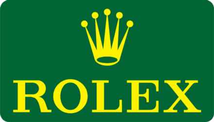

FORMULA 1 GRAND PRIX HEINEKEN DU CANADA 2018 - Montréal

Media Map

10 MS11

11

S2

DRS ACTIVATION 2 MS12

MS10 DRS DETECTION 2 12

8 9 MS9

MS13

MS8

T

MS7 MS14 14 13

DRS ACTIVATION 1 DRS ACTIVATION 3 MS6 6 7

MS15 MS5 S1 Start Line 5 Control Line DRS DETECTION 1 S1 Sector 1 (145m before turn 6) S2 Sector 2 (190m before turn 10) MS4 T Speed Trap (250m before turn 13) DRS Detection1 (15m after Turn 5) 4 DRS Activation1 (95m after Turn 7) 3 MS1 DRS Detection2 (110m after Turn 9) DRS Activation2 (155m before Turn 12) MS3 DRS Activation3 (70m after Turn 14) 1 15 Corner Numbers MS2 2

MS2 Marshal Sector Circuit Centreline Length = 4.361 km

The F1 FORMULA 1 logo, F1 logo, F1 FIA FORMULA 1 WORLD CHAMPIONSHIP logo, FORMULA 1, FORMULA ONE, F1, FIA FORMULA ONE WORLD CHAMPIONSHIP, GRAND PRIX and related marks are trade marks of Formula One Licensing BV, a Formula 1 company. © 2018 Formula One World Championship Ltd. VERSION 2 - ISSUED 03.06.18
