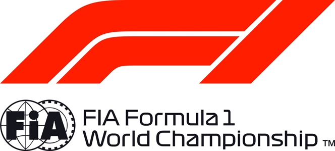

FORMULA 1 2018 HEINEKEN CHINESE GRAND PRIX - Shanghai

Constructors' Championship

ENTRANT TOTAL AUS BRN CHN AZE ESP MON CAN FRA AUT GBR GER HUN BEL ITA SGP RUS JPN USA MEX BRA UAE

| 1 | Mercedes AMG Petronas Motorsport | 85 | 22 2 8 | 33 2 3 | 30 2 4 |
| --- | --- | --- | --- | --- | --- |
| 2 | Scuderia Ferrari | 84 | 40 1 3 | 25 1 NC | 19 3 8 |
| 3 | Aston Martin Red Bull Racing | 55 | 20 4 6 | NC NC | 35 1 5 |
| 4 | McLaren F1 Team | 28 | 12 5 9 | 10 7 8 | 6 7 13 |
| 5 | Renault Sport Formula One Team | 25 | 7 7 10 | 8 6 11 | 10 6 9 |
| 6 | Red Bull Toro Rosso Honda | 12 | 15 NC | 12 4 17 | 18 20 |
| 7 | Haas F1 Team | 11 | NC NC | 10 5 13 | 1 10 17 |
| 8 | Alfa Romeo Sauber F1 Team | 2 | 13 NC | 2 9 12 | 16 19 |
| 9 | Sahara Force India F1 Team | 1 | 11 12 | 1 10 16 | 11 12 |
| 10 | Williams Martini Racing | 0 | 14 NC | 14 15 | 14 15 |

© 2018 Formula One World Championship Limited The F1 FORMULA 1 logo, F1 logo, FORMULA 1, FORMULA ONE, F1, FIA FORMULA ONE WORLD CHAMPIONSHIP, GRAND PRIX and related marks are trade marks of Formula One Licensing BV, a Formula 1 company. The FIA logo is a trade mark of the Fédération Internationale de l’Automobile. All rights reserved. No part of these results/data may be reproduced, stored in a retrieval system or transmitted in any form or by any means electronic, mechanical, photocopying, recording, broadcasting or otherwise without prior permission of the copyright holder except for reproduction in local/national/international daily press and regular printed publications on sale to the public within 90 days of the event to which the results/data relate and provided that the copyright symbol and name of copyright owner appears.
