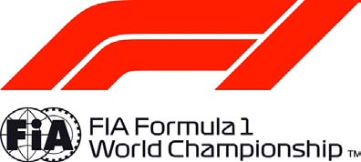

FORMULA 1 2018 HEINEKEN CHINESE GRAND PRIX - Shanghai

Race History Chart

LAP 1 GAP TIME LAP 2 GAP TIME LAP 3 GAP TIME LAP 4 GAP TIME LAP 5 GAP TIME

| 5 |  | 1:40.327 |
| --- | --- | --- |
| 77 | 1.080 | 1:41.407 |
| 33 | 2.234 | 1:42.561 |
| 7 | 3.283 | 1:43.610 |
| 44 | 4.035 | 1:44.362 |
| 3 | 4.647 | 1:44.974 |
| 27 | 5.400 | 1:45.727 |
| 55 | 5.811 | 1:46.138 |
| 8 | 6.355 | 1:46.682 |
| 20 | 7.013 | 1:47.340 |
| 14 | 7.812 | 1:48.139 |
| 18 | 8.668 | 1:48.995 |
| 31 | 9.393 | 1:49.720 |
| 11 | 9.754 | 1:50.081 |
| 35 | 10.449 | 1:50.776 |
| 2 | 10.703 | 1:51.030 |
| 28 | 11.212 | 1:51.539 |
| 16 | 11.319 | 1:51.646 |
| 10 | 11.814 | 1:52.141 |
| 9 | 12.515 | 1:52.842 |

| 5 |  | 1:38.417 |
| --- | --- | --- |
| 77 | 2.020 | 1:39.357 |
| 33 | 3.184 | 1:39.367 |
| 7 | 4.446 | 1:39.580 |
| 44 | 5.278 | 1:39.660 |
| 3 | 6.710 | 1:40.480 |
| 27 | 7.947 | 1:40.964 |
| 55 | 8.988 | 1:41.594 |
| 8 | 10.065 | 1:42.127 |
| 20 | 10.816 | 1:42.220 |
| 14 | 12.009 | 1:42.614 |
| 18 | 12.722 | 1:42.471 |
| 31 | 13.261 | 1:42.285 |
| 11 | 13.840 | 1:42.503 |
| 35 | 14.808 | 1:42.776 |
| 2 | 15.256 | 1:42.970 |
| 16 | 16.074 | 1:43.172 |
| 28 | 16.771 | 1:43.976 |
| 10 | 17.388 | 1:43.991 |
| 9 | 18.061 | 1:43.963 |

| 5 |  | 1:38.472 |
| --- | --- | --- |
| 77 | 2.622 | 1:39.074 |
| 33 | 4.031 | 1:39.319 |
| 7 | 5.193 | 1:39.219 |
| 44 | 6.359 | 1:39.553 |
| 3 | 8.297 | 1:40.059 |
| 27 | 10.086 | 1:40.611 |
| 55 | 11.382 | 1:40.866 |
| 8 | 12.486 | 1:40.893 |
| 20 | 13.543 | 1:41.199 |
| 14 | 14.418 | 1:40.881 |
| 18 | 15.466 | 1:41.216 |
| 31 | 16.342 | 1:41.553 |
| 11 | 17.328 | 1:41.960 |
| 35 | 18.463 | 1:42.127 |
| 2 | 18.949 | 1:42.165 |
| 16 | 20.145 | 1:42.543 |
| 28 | 20.908 | 1:42.609 |
| 10 | 21.471 | 1:42.555 |
| 9 | 23.173 | 1:43.584 |

| 5 |  | 1:39.025 |
| --- | --- | --- |
| 77 | 2.407 | 1:38.810 |
| 33 | 4.427 | 1:39.421 |
| 7 | 5.734 | 1:39.566 |
| 44 | 7.077 | 1:39.743 |
| 3 | 9.357 | 1:40.085 |
| 27 | 11.548 | 1:40.487 |
| 55 | 13.273 | 1:40.916 |
| 8 | 14.636 | 1:41.175 |
| 20 | 15.238 | 1:40.720 |
| 14 | 16.841 | 1:41.448 |
| 18 | 18.122 | 1:41.681 |
| 31 | 18.645 | 1:41.328 |
| 11 | 19.606 | 1:41.303 |
| 35 | 22.384 | 1:42.946 |
| 2 | 22.702 | 1:42.778 |
| 16 | 23.332 | 1:42.212 |
| 10 | 24.704 | 1:42.258 |
| 28 | 25.200 | 1:43.317 |
| 9 | 26.358 | 1:42.210 |

| 5 |  | 1:38.869 |
| --- | --- | --- |
| 77 | 2.519 | 1:38.981 |
| 33 | 4.974 | 1:39.416 |
| 7 | 6.582 | 1:39.717 |
| 44 | 8.071 | 1:39.863 |
| 3 | 10.203 | 1:39.715 |
| 27 | 13.395 | 1:40.716 |
| 55 | 15.505 | 1:41.101 |
| 8 | 16.973 | 1:41.206 |
| 20 | 17.766 | 1:41.397 |
| 14 | 19.384 | 1:41.412 |
| 18 | 20.877 | 1:41.624 |
| 31 | 21.309 | 1:41.533 |
| 11 | 22.088 | 1:41.351 |
| 2 | 24.510 | 1:40.677 |
| 35 | 26.002 | 1:42.487 |
| 16 | 26.564 | 1:42.101 |
| 10 | 27.368 | 1:41.533 |
| 28 | 28.547 | 1:42.216 |
| 9 | 29.504 | 1:42.015 |

Page 1 of 12

© 2018 Formula One World Championship Limited The F1 FORMULA 1 logo, F1 logo, FORMULA 1, FORMULA ONE, F1, FIA FORMULA ONE WORLD CHAMPIONSHIP, GRAND PRIX and related marks are trade marks of Formula One Licensing BV, a Formula 1 company. The FIA logo is a trade mark of the Fédération Internationale de l’Automobile. All rights reserved. No part of these results/data may be reproduced, stored in a retrieval system or transmitted in any form or by any means electronic, mechanical, photocopying, recording, broadcasting or otherwise without prior permission of the copyright holder except for reproduction in local/national/international daily press and regular printed publications on sale to the public within 90 days of the event to which the results/data relate and provided that the copyright symbol and name of copyright owner appears.

FORMULA 1 2018 HEINEKEN CHINESE GRAND PRIX - Shanghai

Race History Chart

LAP 6 GAP TIME LAP 7 GAP TIME LAP 8 GAP TIME LAP 9 GAP TIME LAP 10 GAP TIME

| 5 |  | 1:38.620 |
| --- | --- | --- |
| 77 | 2.465 | 1:38.566 |
| 33 | 5.455 | 1:39.101 |
| 7 | 7.234 | 1:39.272 |
| 44 | 8.826 | 1:39.375 |
| 3 | 10.808 | 1:39.225 |
| 27 | 15.163 | 1:40.388 |
| 55 | 17.398 | 1:40.513 |
| 20 | 19.791 | 1:40.645 |
| 8 | 20.159 | 1:41.806 |
| 14 | 21.590 | 1:40.826 |
| 31 | 23.256 | 1:40.567 |
| 18 | 24.405 | 1:42.148 |
| 11 | 25.107 | 1:41.639 |
| 2 | 27.287 | 1:41.397 |
| 35 | 28.825 | 1:41.443 |
| 16 | 29.960 | 1:42.016 |
| 10 | 30.479 | 1:41.731 |
| 28 | 32.203 | 1:42.276 |
| 9 | 33.098 | 1:42.214 |

| 5 |  | 1:38.658 |
| --- | --- | --- |
| 77 | 2.524 | 1:38.717 |
| 33 | 5.891 | 1:39.094 |
| 7 | 7.857 | 1:39.281 |
| 44 | 9.341 | 1:39.173 |
| 3 | 11.372 | 1:39.222 |
| 27 | 16.981 | 1:40.476 |
| 55 | 19.220 | 1:40.480 |
| 20 | 22.046 | 1:40.913 |
| 8 | 22.797 | 1:41.296 |
| 14 | 23.616 | 1:40.684 |
| 31 | 25.084 | 1:40.486 |
| 18 | 27.306 | 1:41.559 |
| 11 | 27.920 | 1:41.471 |
| 2 | 29.562 | 1:40.933 |
| 35 | 31.421 | 1:41.254 |
| 16 | 32.989 | 1:41.687 |
| 10 | 33.728 | 1:41.907 |
| 28 | 35.731 | 1:42.186 |
| 9 | 36.634 | 1:42.194 |

| 5 |  | 1:38.819 |
| --- | --- | --- |
| 77 | 2.586 | 1:38.881 |
| 33 | 6.417 | 1:39.345 |
| 7 | 8.636 | 1:39.598 |
| 44 | 10.004 | 1:39.482 |
| 3 | 11.764 | 1:39.211 |
| 27 | 18.709 | 1:40.547 |
| 55 | 20.866 | 1:40.465 |
| 20 | 24.346 | 1:41.119 |
| 8 | 25.261 | 1:41.283 |
| 14 | 25.783 | 1:40.986 |
| 31 | 27.106 | 1:40.841 |
| 18 | 29.727 | 1:41.240 |
| 11 | 30.537 | 1:41.436 |
| 2 | 31.529 | 1:40.786 |
| 35 | 34.015 | 1:41.413 |
| 16 | 35.946 | 1:41.776 |
| 10 | 36.489 | 1:41.580 |
| 28 | 38.674 | 1:41.762 |
| 9 | 39.833 | 1:42.018 |

| 5 |  | 1:38.774 |
| --- | --- | --- |
| 77 | 2.495 | 1:38.683 |
| 33 | 6.862 | 1:39.219 |
| 7 | 9.159 | 1:39.297 |
| 44 | 10.426 | 1:39.196 |
| 3 | 12.245 | 1:39.255 |
| 27 | 20.480 | 1:40.545 |
| 55 | 22.551 | 1:40.459 |
| 20 | 26.114 | 1:40.542 |
| 8 | 27.405 | 1:40.918 |
| 14 | 28.233 | 1:41.224 |
| 31 | 29.257 | 1:40.925 |
| 18 | 32.478 | 1:41.525 |
| 11 | 33.448 | 1:41.685 |
| 2 | 34.234 | 1:41.479 |
| 35 | 36.618 | 1:41.377 |
| 16 | 38.785 | 1:41.613 |
| 10 | 39.619 | 1:41.904 |
| 28 | 41.526 | 1:41.626 |
| 9 | 42.822 | 1:41.763 |

| 5 |  | 1:38.750 |
| --- | --- | --- |
| 77 | 2.546 | 1:38.801 |
| 33 | 7.296 | 1:39.184 |
| 7 | 9.610 | 1:39.201 |
| 44 | 10.860 | 1:39.184 |
| 3 | 12.661 | 1:39.166 |
| 27 | 21.909 | 1:40.179 |
| 55 | 24.385 | 1:40.584 |
| 20 | 27.623 | 1:40.259 |
| 8 | 29.140 | 1:40.485 |
| 14 | 29.856 | 1:40.373 |
| 31 | 31.045 | 1:40.538 |
| 18 | 34.580 | 1:40.852 |
| 11 | 35.617 | 1:40.919 |
| 2 | 36.827 | 1:41.343 |
| 35 | 38.823 | 1:40.955 |
| 16 | 41.585 | 1:41.550 |
| 10 | 42.482 | 1:41.613 |
| 9 | 45.744 | 1:41.672 |
| 28 | PIT | 1:46.763 |

Page 2 of 12

© 2018 Formula One World Championship Limited The F1 FORMULA 1 logo, F1 logo, FORMULA 1, FORMULA ONE, F1, FIA FORMULA ONE WORLD CHAMPIONSHIP, GRAND PRIX and related marks are trade marks of Formula One Licensing BV, a Formula 1 company. The FIA logo is a trade mark of the Fédération Internationale de l’Automobile. All rights reserved. No part of these results/data may be reproduced, stored in a retrieval system or transmitted in any form or by any means electronic, mechanical, photocopying, recording, broadcasting or otherwise without prior permission of the copyright holder except for reproduction in local/national/international daily press and regular printed publications on sale to the public within 90 days of the event to which the results/data relate and provided that the copyright symbol and name of copyright owner appears.

FORMULA 1 2018 HEINEKEN CHINESE GRAND PRIX - Shanghai

Race History Chart

LAP 11 GAP TIME LAP 12 GAP TIME LAP 13 GAP TIME LAP 14 GAP TIME LAP 15 GAP TIME

| 5 |  | 1:38.761 |
| --- | --- | --- |
| 77 | 2.866 | 1:39.081 |
| 33 | 7.983 | 1:39.448 |
| 7 | 10.360 | 1:39.511 |
| 44 | 11.717 | 1:39.618 |
| 3 | 13.264 | 1:39.364 |
| 27 | 23.902 | 1:40.754 |
| 55 | 26.557 | 1:40.933 |
| 20 | 29.567 | 1:40.705 |
| 8 | 31.096 | 1:40.717 |
| 14 | 31.918 | 1:40.823 |
| 31 | PIT | 1:44.877 |
| 18 | 37.314 | 1:41.495 |
| 11 | 38.590 | 1:41.734 |
| 2 | 39.300 | 1:41.234 |
| 35 | 41.443 | 1:41.381 |
| 16 | 44.682 | 1:41.858 |
| 10 | 45.227 | 1:41.506 |
| 9 | 48.454 | 1:41.471 |
| 28 | 69.405 | 1:58.627 |

| 5 |  | 1:38.796 |
| --- | --- | --- |
| 77 | 3.028 | 1:38.958 |
| 33 | 8.332 | 1:39.145 |
| 7 | 10.695 | 1:39.131 |
| 44 | 12.373 | 1:39.452 |
| 3 | 13.743 | 1:39.275 |
| 27 | 25.554 | 1:40.448 |
| 20 | 30.986 | 1:40.215 |
| 55 | PIT | 1:45.595 |
| 8 | 33.732 | 1:41.432 |
| 14 | 34.478 | 1:41.356 |
| 18 | 39.700 | 1:41.182 |
| 2 | 41.767 | 1:41.263 |
| 35 | 43.876 | 1:41.229 |
| 11 | PIT | 1:45.555 |
| 16 | 47.169 | 1:41.283 |
| 10 | 47.972 | 1:41.541 |
| 9 | 51.208 | 1:41.550 |
| 31 | 55.597 | 1:57.232 |
| 28 | 70.504 | 1:39.895 |

| 5 |  | 1:38.755 |
| --- | --- | --- |
| 77 | 3.231 | 1:38.958 |
| 33 | 8.645 | 1:39.068 |
| 7 | 11.203 | 1:39.263 |
| 44 | 12.779 | 1:39.161 |
| 3 | 14.545 | 1:39.557 |
| 27 | PIT | 1:44.632 |
| 20 | 32.557 | 1:40.326 |
| 8 | 35.476 | 1:40.499 |
| 14 | 36.373 | 1:40.650 |
| 18 | 41.694 | 1:40.749 |
| 2 | 43.869 | 1:40.857 |
| 35 | 46.067 | 1:40.946 |
| 16 | 49.731 | 1:41.317 |
| 10 | 50.395 | 1:41.178 |
| 55 | 53.376 | 1:58.775 |
| 9 | 54.628 | 1:42.175 |
| 31 | 56.553 | 1:39.711 |
| 11 | 63.306 | 1:56.712 |
| 28 | 72.339 | 1:40.590 |

| 5 |  | 1:39.006 |
| --- | --- | --- |
| 77 | 3.469 | 1:39.244 |
| 33 | 9.089 | 1:39.450 |
| 7 | 11.820 | 1:39.623 |
| 44 | 13.050 | 1:39.277 |
| 3 | 14.994 | 1:39.455 |
| 20 | 33.756 | 1:40.205 |
| 8 | 37.124 | 1:40.654 |
| 14 | 38.030 | 1:40.663 |
| 18 | 43.492 | 1:40.804 |
| 2 | 45.996 | 1:41.133 |
| 35 | 48.200 | 1:41.139 |
| 27 | 51.708 | 1:59.283 |
| 16 | 52.728 | 1:42.003 |
| 10 | 53.545 | 1:42.156 |
| 55 | 54.107 | 1:39.737 |
| 31 | 57.622 | 1:40.075 |
| 9 | 58.285 | 1:42.663 |
| 11 | 63.304 | 1:39.004 |
| 28 | 73.887 | 1:40.554 |

| 5 |  | 1:38.916 |
| --- | --- | --- |
| 77 | 3.801 | 1:39.248 |
| 33 | 9.604 | 1:39.431 |
| 7 | 12.524 | 1:39.620 |
| 44 | 13.759 | 1:39.625 |
| 3 | 15.822 | 1:39.744 |
| 20 | 35.001 | 1:40.161 |
| 8 | 38.886 | 1:40.678 |
| 14 | 39.587 | 1:40.473 |
| 18 | 45.864 | 1:41.288 |
| 2 | 48.181 | 1:41.101 |
| 35 | 50.612 | 1:41.328 |
| 27 | 52.481 | 1:39.689 |
| 16 | 55.395 | 1:41.583 |
| 55 | 56.333 | 1:41.142 |
| 10 | 57.049 | 1:42.420 |
| 31 | 58.954 | 1:40.248 |
| 9 | 61.412 | 1:42.043 |
| 11 | 63.648 | 1:39.260 |
| 28 | 75.508 | 1:40.537 |

Page 3 of 12

© 2018 Formula One World Championship Limited The F1 FORMULA 1 logo, F1 logo, FORMULA 1, FORMULA ONE, F1, FIA FORMULA ONE WORLD CHAMPIONSHIP, GRAND PRIX and related marks are trade marks of Formula One Licensing BV, a Formula 1 company. The FIA logo is a trade mark of the Fédération Internationale de l’Automobile. All rights reserved. No part of these results/data may be reproduced, stored in a retrieval system or transmitted in any form or by any means electronic, mechanical, photocopying, recording, broadcasting or otherwise without prior permission of the copyright holder except for reproduction in local/national/international daily press and regular printed publications on sale to the public within 90 days of the event to which the results/data relate and provided that the copyright symbol and name of copyright owner appears.

FORMULA 1 2018 HEINEKEN CHINESE GRAND PRIX - Shanghai

Race History Chart

LAP 16 GAP TIME LAP 17 GAP TIME LAP 18 GAP TIME LAP 19 GAP TIME LAP 20 GAP TIME

| 5 |  | 1:39.220 |
| --- | --- | --- |
| 77 | 3.560 | 1:38.979 |
| 33 | 9.741 | 1:39.357 |
| 7 | 12.690 | 1:39.386 |
| 44 | 14.168 | 1:39.629 |
| 3 | 15.973 | 1:39.371 |
| 20 | 35.848 | 1:40.067 |
| 14 | 41.536 | 1:41.169 |
| 8 | PIT | 1:45.320 |
| 18 | 47.812 | 1:41.168 |
| 2 | 49.880 | 1:40.919 |
| 35 | 52.692 | 1:41.300 |
| 27 | 53.120 | 1:39.859 |
| 55 | 57.444 | 1:40.331 |
| 16 | 58.205 | 1:42.030 |
| 10 | 59.875 | 1:42.046 |
| 31 | 60.459 | 1:40.725 |
| 9 | 64.259 | 1:42.067 |
| 11 | 64.654 | 1:40.226 |
| 28 | 76.981 | 1:40.693 |

| 5 |  | 1:39.454 |
| --- | --- | --- |
| 77 | 3.661 | 1:39.555 |
| 7 | 12.667 | 1:39.431 |
| 33 | PIT | 1:44.048 |
| 44 | 14.654 | 1:39.940 |
| 3 | PIT | 1:44.248 |
| 20 | 36.441 | 1:40.047 |
| 14 | 42.479 | 1:40.397 |
| 18 | 49.675 | 1:41.317 |
| 2 | 51.262 | 1:40.836 |
| 27 | 53.429 | 1:39.763 |
| 35 | 55.503 | 1:42.265 |
| 55 | 57.903 | 1:39.913 |
| 16 | 60.249 | 1:41.498 |
| 31 | 61.671 | 1:40.666 |
| 10 | 62.287 | 1:41.866 |
| 8 | 63.539 | 1:58.007 |
| 11 | 65.213 | 1:40.013 |
| 9 | 67.531 | 1:42.726 |
| 28 | 78.208 | 1:40.681 |

| 5 |  | 1:39.488 |
| --- | --- | --- |
| 77 | 3.493 | 1:39.320 |
| 7 | 12.191 | 1:39.012 |
| 44 | PIT | 1:43.390 |
| 33 | 31.163 | 1:56.316 |
| 20 | 36.835 | 1:39.882 |
| 3 | 37.914 | 1:56.635 |
| 14 | 43.271 | 1:40.280 |
| 18 | 51.114 | 1:40.927 |
| 2 | 52.176 | 1:40.402 |
| 27 | 53.563 | 1:39.622 |
| 35 | 56.896 | 1:40.881 |
| 55 | 58.519 | 1:40.104 |
| 16 | 62.041 | 1:41.280 |
| 31 | 62.513 | 1:40.330 |
| 8 | 63.901 | 1:39.850 |
| 10 | 64.494 | 1:41.695 |
| 11 | 65.614 | 1:39.889 |
| 9 | 69.350 | 1:41.307 |
| 28 | 79.549 | 1:40.829 |

| 5 |  | 1:39.405 |
| --- | --- | --- |
| 77 | PIT | 1:43.746 |
| 7 | 11.948 | 1:39.162 |
| 33 | 29.513 | 1:37.755 |
| 44 | 34.249 | 1:55.098 |
| 3 | 36.804 | 1:38.295 |
| 20 | 39.348 | 1:41.918 |
| 14 | 43.837 | 1:39.971 |
| 18 | 52.256 | 1:40.547 |
| 2 | 53.035 | 1:40.264 |
| 27 | 53.751 | 1:39.593 |
| 35 | 58.336 | 1:40.845 |
| 55 | 59.087 | 1:39.973 |
| 16 | 64.046 | 1:41.410 |
| 31 | 64.139 | 1:41.031 |
| 8 | 64.740 | 1:40.244 |
| 11 | 66.507 | 1:40.298 |
| 10 | 67.253 | 1:42.164 |
| 9 | 71.195 | 1:41.250 |
| 28 | 81.000 | 1:40.856 |

| 5 | PIT | 1:44.136 |
| --- | --- | --- |
| 7 | 7.050 | 1:39.238 |
| 77 | 17.721 | 1:54.023 |
| 33 | 23.827 | 1:38.450 |
| 44 | 26.991 | 1:36.878 |
| 3 | 30.827 | 1:38.159 |
| 20 | 34.978 | 1:39.766 |
| 14 | 39.803 | 1:40.102 |
| 18 | 48.792 | 1:40.672 |
| 2 | 49.542 | 1:40.643 |
| 27 | 49.972 | 1:40.357 |
| 55 | 54.570 | 1:39.619 |
| 35 | 55.592 | 1:41.392 |
| 31 | 59.665 | 1:39.662 |
| 8 | 60.619 | 1:40.015 |
| 16 | 62.341 | 1:42.431 |
| 11 | 62.766 | 1:40.395 |
| 9 | 68.131 | 1:41.072 |
| 10 | PIT | 1:46.866 |
| 28 | 77.089 | 1:40.225 |

Page 4 of 12

© 2018 Formula One World Championship Limited The F1 FORMULA 1 logo, F1 logo, FORMULA 1, FORMULA ONE, F1, FIA FORMULA ONE WORLD CHAMPIONSHIP, GRAND PRIX and related marks are trade marks of Formula One Licensing BV, a Formula 1 company. The FIA logo is a trade mark of the Fédération Internationale de l’Automobile. All rights reserved. No part of these results/data may be reproduced, stored in a retrieval system or transmitted in any form or by any means electronic, mechanical, photocopying, recording, broadcasting or otherwise without prior permission of the copyright holder except for reproduction in local/national/international daily press and regular printed publications on sale to the public within 90 days of the event to which the results/data relate and provided that the copyright symbol and name of copyright owner appears.

FORMULA 1 2018 HEINEKEN CHINESE GRAND PRIX - Shanghai

Race History Chart

LAP 21 GAP TIME LAP 22 GAP TIME LAP 23 GAP TIME LAP 24 GAP TIME LAP 25 GAP TIME

| 7 |  | 1:39.162 |
| --- | --- | --- |
| 77 | 8.520 | 1:37.011 |
| 5 | 9.770 | 1:55.982 |
| 33 | 15.802 | 1:38.187 |
| 44 | 18.041 | 1:37.262 |
| 3 | 22.660 | 1:38.045 |
| 20 | 28.719 | 1:39.953 |
| 14 | 33.738 | 1:40.147 |
| 18 | 43.213 | 1:40.633 |
| 27 | 43.937 | 1:40.177 |
| 2 | 44.736 | 1:41.406 |
| 55 | 48.425 | 1:40.067 |
| 35 | 50.389 | 1:41.009 |
| 31 | 53.098 | 1:39.645 |
| 8 | 53.928 | 1:39.521 |
| 11 | 56.760 | 1:40.206 |
| 9 | 63.130 | 1:41.211 |
| 16 | PIT | 1:47.280 |
| 28 | 71.321 | 1:40.444 |
| 10 | 82.066 | 1:58.295 |

| 7 |  | 1:39.378 |
| --- | --- | --- |
| 77 | 6.692 | 1:37.550 |
| 5 | 8.127 | 1:37.735 |
| 33 | 14.278 | 1:37.854 |
| 44 | 16.404 | 1:37.741 |
| 3 | 21.120 | 1:37.838 |
| 20 | 29.313 | 1:39.972 |
| 14 | 34.609 | 1:40.249 |
| 27 | 44.119 | 1:39.560 |
| 18 | 44.915 | 1:41.080 |
| 55 | 48.707 | 1:39.660 |
| 2 | PIT | 1:45.395 |
| 35 | 51.668 | 1:40.657 |
| 31 | 53.358 | 1:39.638 |
| 8 | 54.645 | 1:40.095 |
| 11 | 56.719 | 1:39.337 |
| 9 | 64.436 | 1:40.684 |
| 28 | 72.119 | 1:40.176 |
| 10 | 81.209 | 1:38.521 |
| 16 | 82.750 | 1:58.719 |

| 7 |  | 1:39.316 |
| --- | --- | --- |
| 77 | 4.947 | 1:37.571 |
| 5 | 6.315 | 1:37.504 |
| 33 | 12.638 | 1:37.676 |
| 44 | 14.843 | 1:37.755 |
| 3 | 19.752 | 1:37.948 |
| 20 | 29.787 | 1:39.790 |
| 14 | 35.274 | 1:39.981 |
| 27 | 44.387 | 1:39.584 |
| 55 | 48.942 | 1:39.551 |
| 18 | PIT | 1:45.569 |
| 35 | 53.088 | 1:40.736 |
| 31 | 53.833 | 1:39.791 |
| 8 | 55.167 | 1:39.838 |
| 11 | 56.768 | 1:39.365 |
| 9 | 65.606 | 1:40.486 |
| 2 | 69.784 | 1:58.347 |
| 28 | 73.197 | 1:40.394 |
| 10 | 80.597 | 1:38.704 |
| 16 | 82.242 | 1:38.808 |

| 7 |  | 1:39.667 |
| --- | --- | --- |
| 77 | 2.953 | 1:37.673 |
| 5 | 4.127 | 1:37.479 |
| 33 | 11.357 | 1:38.386 |
| 44 | 13.128 | 1:37.952 |
| 3 | 17.908 | 1:37.823 |
| 20 | PIT | 1:44.253 |
| 14 | 35.638 | 1:40.031 |
| 27 | 43.729 | 1:39.009 |
| 55 | 49.088 | 1:39.813 |
| 35 | 54.382 | 1:40.961 |
| 31 | 54.805 | 1:40.639 |
| 8 | 55.254 | 1:39.754 |
| 11 | 56.618 | 1:39.517 |
| 9 | 66.583 | 1:40.644 |
| 2 | 68.990 | 1:38.873 |
| 18 | 69.542 | 1:58.041 |
| 28 | 73.417 | 1:39.887 |
| 10 | 79.629 | 1:38.699 |
| 16 | 81.900 | 1:39.325 |

| 7 |  | 1:39.257 |
| --- | --- | --- |
| 77 | 1.271 | 1:37.575 |
| 5 | 2.620 | 1:37.750 |
| 33 | 9.887 | 1:37.787 |
| 44 | 11.557 | 1:37.686 |
| 3 | 16.208 | 1:37.557 |
| 14 | 36.319 | 1:39.938 |
| 27 | 43.532 | 1:39.060 |
| 55 | 49.219 | 1:39.388 |
| 20 | 52.305 | 1:57.189 |
| 31 | 55.958 | 1:40.410 |
| 8 | 57.092 | 1:41.095 |
| 35 | 57.760 | 1:42.635 |
| 11 | 58.016 | 1:40.655 |
| 9 | 68.251 | 1:40.925 |
| 2 | 69.302 | 1:39.569 |
| 18 | 70.805 | 1:40.520 |
| 28 | 74.219 | 1:40.059 |
| 10 | 79.287 | 1:38.915 |
| 16 | 82.324 | 1:39.681 |

Page 5 of 12

© 2018 Formula One World Championship Limited The F1 FORMULA 1 logo, F1 logo, FORMULA 1, FORMULA ONE, F1, FIA FORMULA ONE WORLD CHAMPIONSHIP, GRAND PRIX and related marks are trade marks of Formula One Licensing BV, a Formula 1 company. The FIA logo is a trade mark of the Fédération Internationale de l’Automobile. All rights reserved. No part of these results/data may be reproduced, stored in a retrieval system or transmitted in any form or by any means electronic, mechanical, photocopying, recording, broadcasting or otherwise without prior permission of the copyright holder except for reproduction in local/national/international daily press and regular printed publications on sale to the public within 90 days of the event to which the results/data relate and provided that the copyright symbol and name of copyright owner appears.

FORMULA 1 2018 HEINEKEN CHINESE GRAND PRIX - Shanghai

Race History Chart

LAP 26 GAP TIME LAP 27 GAP TIME LAP 28 GAP TIME LAP 29 GAP TIME LAP 30 GAP TIME

| 7 |  | 1:39.335 |
| --- | --- | --- |
| 77 | 0.513 | 1:38.577 |
| 5 | 1.112 | 1:37.827 |
| 33 | 8.114 | 1:37.562 |
| 44 | 9.672 | 1:37.450 |
| 3 | 14.522 | 1:37.649 |
| 14 | 36.706 | 1:39.722 |
| 27 | 42.919 | 1:38.722 |
| 55 | 49.084 | 1:39.200 |
| 20 | 51.252 | 1:38.282 |
| 31 | 55.998 | 1:39.375 |
| 8 | 57.112 | 1:39.355 |
| 11 | 58.281 | 1:39.600 |
| 35 | 60.158 | 1:41.733 |
| 2 | 69.662 | 1:39.695 |
| 9 | 70.591 | 1:41.675 |
| 18 | 71.395 | 1:39.925 |
| 28 | 75.004 | 1:40.120 |
| 10 | 78.909 | 1:38.957 |
| 16 | 82.740 | 1:39.751 |

| 77 |  | 1:38.448 |
| --- | --- | --- |
| 5 | 0.685 | 1:38.534 |
| 33 | 6.695 | 1:37.542 |
| 7 | PIT | 1:46.198 |
| 44 | 8.599 | 1:37.888 |
| 3 | 13.250 | 1:37.689 |
| 14 | 37.684 | 1:39.939 |
| 27 | 43.052 | 1:39.094 |
| 55 | 49.729 | 1:39.606 |
| 20 | 50.930 | 1:38.639 |
| 31 | 56.371 | 1:39.334 |
| 8 | 57.564 | 1:39.413 |
| 11 | 58.817 | 1:39.497 |
| 35 | 62.127 | 1:40.930 |
| 2 | 70.342 | 1:39.641 |
| 18 | 72.716 | 1:40.282 |
| 9 | 73.608 | 1:41.978 |
| 28 | 76.079 | 1:40.036 |
| 10 | 78.962 | 1:39.014 |
| 16 | 83.592 | 1:39.813 |

| 77 |  | 1:37.763 |
| --- | --- | --- |
| 5 | 0.941 | 1:38.019 |
| 33 | 6.571 | 1:37.639 |
| 44 | 8.674 | 1:37.838 |
| 3 | 13.027 | 1:37.540 |
| 7 | 25.739 | 1:56.265 |
| 14 | 40.180 | 1:40.259 |
| 27 | 44.713 | 1:39.424 |
| 55 | 51.700 | 1:39.734 |
| 20 | 52.501 | 1:39.334 |
| 31 | 58.132 | 1:39.524 |
| 8 | 59.128 | 1:39.327 |
| 11 | 61.092 | 1:40.038 |
| 35 | PIT | 1:45.487 |
| 2 | 72.063 | 1:39.484 |
| 18 | 74.359 | 1:39.406 |
| 9 | 77.420 | 1:41.575 |
| 28 | 79.028 | 1:40.712 |
| 10 | 80.659 | 1:39.460 |
| 16 | 94.713 | 1:48.884 |

| 77 |  | 1:37.654 |
| --- | --- | --- |
| 5 | 1.109 | 1:37.822 |
| 33 | 6.641 | 1:37.724 |
| 44 | 8.787 | 1:37.767 |
| 3 | 13.307 | 1:37.934 |
| 7 | 24.995 | 1:36.910 |
| 27 | 46.608 | 1:39.549 |
| 14 | PIT | 1:45.351 |
| 55 | 53.736 | 1:39.690 |
| 20 | 54.656 | 1:39.809 |
| 31 | 60.072 | 1:39.594 |
| 8 | 61.452 | 1:39.978 |
| 11 | 63.020 | 1:39.582 |
| 2 | 73.806 | 1:39.397 |
| 18 | 76.190 | 1:39.485 |
| 9 | PIT | 1:46.213 |
| 10 | 86.584 | 1:43.579 |
| 35 | 92.800 | 2:00.603 |
| 28 | 96.093 | 1:54.719 |
| 16 | 97.962 | 1:40.903 |

| 77 |  | 1:38.698 |
| --- | --- | --- |
| 5 | 1.050 | 1:38.639 |
| 33 | 6.190 | 1:38.247 |
| 44 | 8.856 | 1:38.767 |
| 3 | 12.782 | 1:38.173 |
| 7 | 23.945 | 1:37.648 |
| 27 | 47.483 | 1:39.573 |
| 55 | 54.945 | 1:39.907 |
| 20 | 55.597 | 1:39.639 |
| 31 | 61.081 | 1:39.707 |
| 8 | 62.449 | 1:39.695 |
| 11 | 64.259 | 1:39.937 |
| 14 | 67.384 | 1:58.205 |
| 2 | 74.871 | 1:39.763 |
| 18 | 77.563 | 1:40.071 |
| 10 | 88.635 | 1:40.749 |
| 35 | 93.359 | 1:39.257 |

Page 6 of 12

© 2018 Formula One World Championship Limited The F1 FORMULA 1 logo, F1 logo, FORMULA 1, FORMULA ONE, F1, FIA FORMULA ONE WORLD CHAMPIONSHIP, GRAND PRIX and related marks are trade marks of Formula One Licensing BV, a Formula 1 company. The FIA logo is a trade mark of the Fédération Internationale de l’Automobile. All rights reserved. No part of these results/data may be reproduced, stored in a retrieval system or transmitted in any form or by any means electronic, mechanical, photocopying, recording, broadcasting or otherwise without prior permission of the copyright holder except for reproduction in local/national/international daily press and regular printed publications on sale to the public within 90 days of the event to which the results/data relate and provided that the copyright symbol and name of copyright owner appears.

FORMULA 1 2018 HEINEKEN CHINESE GRAND PRIX - Shanghai

Race History Chart

LAP 31 GAP TIME LAP 32 GAP TIME LAP 33 GAP TIME LAP 34 GAP TIME LAP 35 GAP TIME

| 77 |  | 1:40.989 |
| --- | --- | --- |
| 5 | 2.741 | 1:42.680 |
| 16 | 1 LAP | 1:47.180 |
| 33 | PIT | 1:45.059 |
| 28 | PIT | 1:55.826 |
| 9 | 1 LAP | 2:05.988 |
| 44 | 12.788 | 1:44.921 |
| 3 | PIT | 1:48.178 |
| 7 | 32.361 | 1:49.405 |
| 27 | PIT | 2:02.077 |
| 20 | 78.243 | 2:03.635 |
| 55 | PIT | 2:08.065 |
| 8 | 87.439 | 2:05.979 |
| 31 | PIT | 2:08.026 |
| 11 | 88.693 | 2:05.423 |
| 14 | 92.704 | 2:06.309 |
| 2 | 102.832 | 2:08.950 |
| 18 | 107.226 | 2:10.652 |
| 10 | PIT | 2:17.386 |
| 35 | 128.023 | 2:15.653 |

| 77 |  | 2:42.901 |
| --- | --- | --- |
| 5 | 1.926 | 2:42.086 |
| 16 | 1 LAP | 2:39.950 |
| 9 | 1 LAP | 2:34.845 |
| 44 | 4.991 | 2:35.104 |
| 33 | 6.072 | 2:38.713 |
| 28 | 1 LAP | 2:37.585 |
| 7 | 8.703 | 2:19.243 |
| 3 | 9.989 | 2:32.919 |
| 20 | 50.584 | 2:15.242 |
| 27 | 56.973 | 2:31.303 |
| 8 | 60.981 | 2:16.443 |
| 14 | 64.865 | 2:15.062 |
| 11 | PIT | 2:19.679 |
| 55 | 70.098 | 2:30.978 |
| 2 | 73.590 | 2:13.659 |
| 31 | 74.834 | 2:29.617 |
| 18 | 78.329 | 2:14.004 |
| 35 | 99.840 | 2:14.718 |
| 10 | 124.970 | 2:42.839 |

| 77 |  | 2:38.230 |
| --- | --- | --- |
| 5 | 1.182 | 2:37.486 |
| 16 | 1 LAP | 2:37.501 |
| 9 | 1 LAP | 2:37.351 |
| 44 | 5.427 | 2:38.666 |
| 33 | 6.277 | 2:38.435 |
| 28 | 1 LAP | 2:38.153 |
| 7 | 7.555 | 2:37.082 |
| 3 | 8.312 | 2:36.553 |
| 20 | 9.155 | 1:56.801 |
| 27 | 12.141 | 1:53.398 |
| 8 | 14.421 | 1:51.670 |
| 14 | 20.895 | 1:54.260 |
| 55 | 23.849 | 1:51.981 |
| 2 | 26.293 | 1:50.933 |
| 31 | 27.557 | 1:50.953 |
| 18 | 29.270 | 1:49.171 |
| 11 | 30.984 | 2:03.743 |
| 35 | PIT | 1:48.838 |
| 10 | 67.832 | 1:41.092 |
| 16 | 112.600 | 1:50.825 |
| 9 | 113.388 | 1:50.043 |
| 28 | 114.535 | 1:47.696 |

| 77 |  | 2:27.194 |
| --- | --- | --- |
| 5 | 2.485 | 2:28.497 |
| 44 | 3.630 | 2:25.397 |
| 33 | 4.698 | 2:25.615 |
| 7 | 5.573 | 2:25.212 |
| 3 | 6.399 | 2:25.281 |
| 20 | 7.109 | 2:25.148 |
| 27 | 7.991 | 2:23.044 |
| 8 | 9.125 | 2:21.898 |
| 14 | 10.689 | 2:16.988 |
| 55 | 12.249 | 2:15.594 |
| 2 | 13.536 | 2:14.437 |
| 31 | 14.535 | 2:14.172 |
| 18 | 15.507 | 2:13.431 |
| 11 | 16.368 | 2:12.578 |
| 10 | 20.116 | 1:39.478 |
| 35 | 25.086 | 2:01.832 |
| 16 | 66.178 | 1:40.772 |
| 9 | 67.129 | 1:40.935 |
| 28 | 67.954 | 1:40.613 |

| 77 |  | 2:27.778 |
| --- | --- | --- |
| 5 | 0.989 | 2:26.282 |
| 44 | 1.665 | 2:25.813 |
| 33 | 2.393 | 2:25.473 |
| 7 | 2.935 | 2:25.140 |
| 3 | 3.908 | 2:25.287 |
| 27 | 5.200 | 2:24.987 |
| 20 | 5.500 | 2:26.169 |
| 14 | 6.421 | 2:23.510 |
| 8 | 6.497 | 2:25.150 |
| 55 | 6.806 | 2:22.335 |
| 2 | 7.367 | 2:21.609 |
| 31 | 7.437 | 2:20.680 |
| 18 | 8.041 | 2:20.312 |
| 11 | 8.324 | 2:19.734 |
| 10 | 8.730 | 2:16.392 |
| 35 | 9.671 | 2:12.363 |
| 16 | 18.829 | 1:40.429 |
| 9 | 19.690 | 1:40.339 |
| 28 | 20.706 | 1:40.530 |

Page 7 of 12

© 2018 Formula One World Championship Limited The F1 FORMULA 1 logo, F1 logo, FORMULA 1, FORMULA ONE, F1, FIA FORMULA ONE WORLD CHAMPIONSHIP, GRAND PRIX and related marks are trade marks of Formula One Licensing BV, a Formula 1 company. The FIA logo is a trade mark of the Fédération Internationale de l’Automobile. All rights reserved. No part of these results/data may be reproduced, stored in a retrieval system or transmitted in any form or by any means electronic, mechanical, photocopying, recording, broadcasting or otherwise without prior permission of the copyright holder except for reproduction in local/national/international daily press and regular printed publications on sale to the public within 90 days of the event to which the results/data relate and provided that the copyright symbol and name of copyright owner appears.

FORMULA 1 2018 HEINEKEN CHINESE GRAND PRIX - Shanghai

Race History Chart

LAP 36 GAP TIME LAP 37 GAP TIME LAP 38 GAP TIME LAP 39 GAP TIME LAP 40 GAP TIME

| 77 |  | 1:37.716 |
| --- | --- | --- |
| 5 | 1.831 | 1:38.558 |
| 44 | 2.812 | 1:38.863 |
| 33 | 3.769 | 1:39.092 |
| 7 | 4.238 | 1:39.019 |
| 3 | 4.891 | 1:38.699 |
| 27 | 6.009 | 1:38.525 |
| 20 | 8.013 | 1:40.229 |
| 14 | 8.907 | 1:40.202 |
| 55 | 10.107 | 1:41.017 |
| 8 | 10.754 | 1:41.973 |
| 31 | 10.987 | 1:41.266 |
| 11 | 11.818 | 1:41.210 |
| 2 | 12.716 | 1:43.065 |
| 18 | 13.164 | 1:42.839 |
| 10 | 13.475 | 1:42.461 |
| 35 | 14.373 | 1:42.418 |
| 16 | 21.497 | 1:40.384 |
| 9 | 22.127 | 1:40.153 |
| 28 | 23.126 | 1:40.136 |

| 77 |  | 1:37.675 |
| --- | --- | --- |
| 5 | 1.645 | 1:37.489 |
| 44 | 2.759 | 1:37.622 |
| 33 | 3.674 | 1:37.580 |
| 3 | 4.912 | 1:37.696 |
| 7 | 5.554 | 1:38.991 |
| 27 | 6.982 | 1:38.648 |
| 20 | 9.468 | 1:39.130 |
| 14 | 10.415 | 1:39.183 |
| 55 | 11.025 | 1:38.593 |
| 8 | 12.992 | 1:39.913 |
| 31 | 13.583 | 1:40.271 |
| 11 | 14.205 | 1:40.062 |
| 2 | 15.453 | 1:40.412 |
| 18 | 16.572 | 1:41.083 |
| 10 | 17.431 | 1:41.631 |
| 35 | 18.094 | 1:41.396 |
| 16 | 24.238 | 1:40.416 |
| 9 | 24.698 | 1:40.246 |
| 28 | 25.859 | 1:40.408 |

| 77 |  | 1:37.841 |
| --- | --- | --- |
| 5 | 1.626 | 1:37.822 |
| 44 | 2.541 | 1:37.623 |
| 33 | 3.219 | 1:37.386 |
| 3 | 4.089 | 1:37.018 |
| 7 | 5.655 | 1:37.942 |
| 27 | 7.732 | 1:38.591 |
| 20 | 10.434 | 1:38.807 |
| 14 | 11.210 | 1:38.636 |
| 55 | 11.743 | 1:38.559 |
| 8 | 14.654 | 1:39.503 |
| 31 | 15.121 | 1:39.379 |
| 11 | 15.651 | 1:39.287 |
| 2 | 17.184 | 1:39.572 |
| 18 | 18.864 | 1:40.133 |
| 10 | 19.815 | 1:40.225 |
| 35 | 20.735 | 1:40.482 |
| 16 | 27.052 | 1:40.655 |
| 9 | 27.753 | 1:40.896 |
| 28 | 28.288 | 1:40.270 |

| 77 |  | 1:37.775 |
| --- | --- | --- |
| 5 | 1.453 | 1:37.602 |
| 44 | 2.990 | 1:38.224 |
| 3 | 3.640 | 1:37.326 |
| 33 | 5.007 | 1:39.563 |
| 7 | 5.658 | 1:37.778 |
| 27 | 8.315 | 1:38.358 |
| 20 | 10.890 | 1:38.231 |
| 14 | 11.396 | 1:37.961 |
| 55 | 12.129 | 1:38.161 |
| 8 | 15.889 | 1:39.010 |
| 31 | 16.773 | 1:39.427 |
| 11 | 17.173 | 1:39.297 |
| 2 | 18.773 | 1:39.364 |
| 18 | 20.282 | 1:39.193 |
| 10 | 21.138 | 1:39.098 |
| 35 | 22.697 | 1:39.737 |
| 16 | 29.286 | 1:40.009 |
| 9 | 29.866 | 1:39.888 |
| 28 | 30.678 | 1:40.165 |

| 77 |  | 1:37.788 |
| --- | --- | --- |
| 5 | 1.228 | 1:37.563 |
| 3 | 2.819 | 1:36.967 |
| 44 | 3.454 | 1:38.252 |
| 33 | 4.696 | 1:37.477 |
| 7 | 5.972 | 1:38.102 |
| 27 | 8.549 | 1:38.022 |
| 20 | 11.300 | 1:38.198 |
| 14 | 12.015 | 1:38.407 |
| 55 | 12.704 | 1:38.363 |
| 8 | 16.888 | 1:38.787 |
| 31 | 17.733 | 1:38.748 |
| 11 | 18.335 | 1:38.950 |
| 2 | 20.378 | 1:39.393 |
| 18 | 21.852 | 1:39.358 |
| 10 | 22.635 | 1:39.285 |
| 35 | 24.537 | 1:39.628 |
| 9 | 31.760 | 1:39.682 |
| 16 | 32.385 | 1:40.887 |
| 28 | 33.060 | 1:40.170 |

Page 8 of 12

© 2018 Formula One World Championship Limited The F1 FORMULA 1 logo, F1 logo, FORMULA 1, FORMULA ONE, F1, FIA FORMULA ONE WORLD CHAMPIONSHIP, GRAND PRIX and related marks are trade marks of Formula One Licensing BV, a Formula 1 company. The FIA logo is a trade mark of the Fédération Internationale de l’Automobile. All rights reserved. No part of these results/data may be reproduced, stored in a retrieval system or transmitted in any form or by any means electronic, mechanical, photocopying, recording, broadcasting or otherwise without prior permission of the copyright holder except for reproduction in local/national/international daily press and regular printed publications on sale to the public within 90 days of the event to which the results/data relate and provided that the copyright symbol and name of copyright owner appears.

FORMULA 1 2018 HEINEKEN CHINESE GRAND PRIX - Shanghai

Race History Chart

LAP 41 GAP TIME LAP 42 GAP TIME LAP 43 GAP TIME LAP 44 GAP TIME LAP 45 GAP TIME

| 77 |  | 1:37.561 |
| --- | --- | --- |
| 5 | 1.185 | 1:37.518 |
| 3 | 1.866 | 1:36.608 |
| 44 | 3.748 | 1:37.855 |
| 33 | 4.311 | 1:37.176 |
| 7 | 5.780 | 1:37.369 |
| 27 | 8.807 | 1:37.819 |
| 20 | 12.678 | 1:38.939 |
| 14 | 12.997 | 1:38.543 |
| 55 | 13.684 | 1:38.541 |
| 8 | 18.271 | 1:38.944 |
| 31 | 18.955 | 1:38.783 |
| 11 | 19.356 | 1:38.582 |
| 2 | 21.833 | 1:39.016 |
| 18 | 23.216 | 1:38.925 |
| 10 | 24.176 | 1:39.102 |
| 35 | 26.269 | 1:39.293 |
| 9 | 32.890 | 1:38.691 |
| 16 | 34.870 | 1:40.046 |
| 28 | 35.380 | 1:39.881 |

| 77 |  | 1:37.533 |
| --- | --- | --- |
| 3 | 1.532 | 1:37.199 |
| 5 | 2.139 | 1:38.487 |
| 33 | 3.449 | 1:36.671 |
| 44 | 5.020 | 1:38.805 |
| 7 | 5.645 | 1:37.398 |
| 27 | 9.753 | 1:38.479 |
| 20 | 13.839 | 1:38.694 |
| 14 | 14.654 | 1:39.190 |
| 55 | 15.271 | 1:39.120 |
| 8 | 19.514 | 1:38.776 |
| 31 | 20.162 | 1:38.740 |
| 11 | 20.658 | 1:38.835 |
| 2 | 23.176 | 1:38.876 |
| 18 | 25.274 | 1:39.591 |
| 10 | 25.871 | 1:39.228 |
| 35 | 27.741 | 1:39.005 |
| 9 | 34.228 | 1:38.871 |
| 16 | 37.180 | 1:39.843 |
| 28 | 37.805 | 1:39.958 |

| 77 |  | 1:37.664 |
| --- | --- | --- |
| 3 | 0.838 | 1:36.970 |
| 7 | 5.701 | 1:37.720 |
| 44 | 6.982 | 1:39.626 |
| 33 | 8.853 | 1:43.068 |
| 5 | 10.271 | 1:45.796 |
| 27 | 10.516 | 1:38.427 |
| 20 | 14.541 | 1:38.366 |
| 14 | 15.205 | 1:38.215 |
| 55 | 16.169 | 1:38.562 |
| 8 | 20.549 | 1:38.699 |
| 31 | 21.156 | 1:38.658 |
| 11 | 21.712 | 1:38.718 |
| 2 | 24.307 | 1:38.795 |
| 18 | 26.561 | 1:38.951 |
| 10 | 27.364 | 1:39.157 |
| 35 | 29.402 | 1:39.325 |
| 9 | 35.548 | 1:38.984 |
| 16 | 39.382 | 1:39.866 |
| 28 | 39.947 | 1:39.806 |

| 77 |  | 1:37.138 |
| --- | --- | --- |
| 3 | 0.601 | 1:36.901 |
| 7 | 5.594 | 1:37.031 |
| 44 | 7.369 | 1:37.525 |
| 33 | 8.667 | 1:36.952 |
| 27 | 11.350 | 1:37.972 |
| 5 | 13.748 | 1:40.615 |
| 20 | 15.904 | 1:38.501 |
| 14 | 16.715 | 1:38.648 |
| 55 | 17.717 | 1:38.686 |
| 8 | 22.115 | 1:38.704 |
| 31 | 22.616 | 1:38.598 |
| 11 | 23.239 | 1:38.665 |
| 2 | 25.779 | 1:38.610 |
| 18 | 28.594 | 1:39.171 |
| 10 | 29.586 | 1:39.360 |
| 35 | 31.473 | 1:39.209 |
| 9 | 37.751 | 1:39.341 |
| 16 | 42.355 | 1:40.111 |
| 28 | 42.854 | 1:40.045 |

| 3 |  | 1:36.750 |
| --- | --- | --- |
| 77 | 1.558 | 1:38.909 |
| 7 | 5.109 | 1:36.866 |
| 44 | 7.489 | 1:37.471 |
| 33 | 8.707 | 1:37.391 |
| 27 | 12.464 | 1:38.465 |
| 5 | 14.585 | 1:38.188 |
| 20 | 17.029 | 1:38.476 |
| 14 | 17.724 | 1:38.360 |
| 55 | 19.223 | 1:38.857 |
| 31 | 24.086 | 1:38.821 |
| 8 | 24.724 | 1:39.960 |
| 11 | 24.902 | 1:39.014 |
| 2 | 27.330 | 1:38.902 |
| 18 | 30.565 | 1:39.322 |
| 10 | 31.224 | 1:38.989 |
| 35 | 33.239 | 1:39.117 |
| 9 | 39.424 | 1:39.024 |
| 16 | 44.753 | 1:39.749 |
| 28 | 45.673 | 1:40.170 |

Page 9 of 12

© 2018 Formula One World Championship Limited The F1 FORMULA 1 logo, F1 logo, FORMULA 1, FORMULA ONE, F1, FIA FORMULA ONE WORLD CHAMPIONSHIP, GRAND PRIX and related marks are trade marks of Formula One Licensing BV, a Formula 1 company. The FIA logo is a trade mark of the Fédération Internationale de l’Automobile. All rights reserved. No part of these results/data may be reproduced, stored in a retrieval system or transmitted in any form or by any means electronic, mechanical, photocopying, recording, broadcasting or otherwise without prior permission of the copyright holder except for reproduction in local/national/international daily press and regular printed publications on sale to the public within 90 days of the event to which the results/data relate and provided that the copyright symbol and name of copyright owner appears.

FORMULA 1 2018 HEINEKEN CHINESE GRAND PRIX - Shanghai

Race History Chart

LAP 46 GAP TIME LAP 47 GAP TIME LAP 48 GAP TIME LAP 49 GAP TIME LAP 50 GAP TIME

| 3 |  | 1:36.221 |
| --- | --- | --- |
| 77 | 3.020 | 1:37.683 |
| 7 | 5.771 | 1:36.883 |
| 44 | 8.367 | 1:37.099 |
| 33 | 9.373 | 1:36.887 |
| 27 | 13.972 | 1:37.729 |
| 5 | 16.106 | 1:37.742 |
| 20 | 19.082 | 1:38.274 |
| 14 | 19.610 | 1:38.107 |
| 55 | 21.190 | 1:38.188 |
| 31 | 25.900 | 1:38.035 |
| 11 | 26.563 | 1:37.882 |
| 2 | 30.453 | 1:39.344 |
| 18 | 33.631 | 1:39.287 |
| 8 | PIT | 1:45.401 |
| 10 | 34.202 | 1:39.199 |
| 35 | 36.058 | 1:39.040 |
| 9 | 41.908 | 1:38.705 |
| 16 | 48.458 | 1:39.926 |
| 28 | 49.306 | 1:39.854 |

| 3 |  | 1:35.983 |
| --- | --- | --- |
| 77 | 4.205 | 1:37.168 |
| 7 | 6.461 | 1:36.673 |
| 44 | 9.531 | 1:37.147 |
| 33 | 10.068 | 1:36.678 |
| 27 | 15.421 | 1:37.432 |
| 5 | 17.975 | 1:37.852 |
| 20 | 22.098 | 1:38.999 |
| 14 | 22.326 | 1:38.699 |
| 55 | 23.440 | 1:38.233 |
| 31 | 27.902 | 1:37.985 |
| 11 | 28.469 | 1:37.889 |
| 2 | 33.304 | 1:38.834 |
| 18 | 36.678 | 1:39.030 |
| 10 | 37.434 | 1:39.215 |
| 35 | 38.699 | 1:38.624 |
| 9 | 44.648 | 1:38.723 |
| 16 | 52.501 | 1:40.026 |
| 28 | 53.294 | 1:39.971 |
| 8 | 54.985 | 1:57.064 |

| 3 |  | 1:37.238 |
| --- | --- | --- |
| 77 | 4.153 | 1:37.186 |
| 7 | 5.679 | 1:36.456 |
| 33 | 9.119 | 1:36.289 |
| 44 | 10.698 | 1:38.405 |
| 27 | 15.701 | 1:37.518 |
| 5 | 18.578 | 1:37.841 |
| 14 | 22.745 | 1:37.657 |
| 55 | 24.094 | 1:37.892 |
| 20 | 24.829 | 1:39.969 |
| 31 | 28.679 | 1:38.015 |
| 11 | 29.566 | 1:38.335 |
| 2 | 34.936 | 1:38.870 |
| 18 | 37.986 | 1:38.546 |
| 10 | 38.734 | 1:38.538 |
| 35 | 40.134 | 1:38.673 |
| 9 | 45.984 | 1:38.574 |
| 16 | 54.891 | 1:39.628 |
| 8 | 55.459 | 1:37.712 |
| 28 | 55.944 | 1:39.888 |

| 3 |  | 1:37.019 |
| --- | --- | --- |
| 77 | 4.412 | 1:37.278 |
| 7 | 5.335 | 1:36.675 |
| 33 | 8.380 | 1:36.280 |
| 44 | 10.980 | 1:37.301 |
| 27 | 16.334 | 1:37.652 |
| 5 | 19.798 | 1:38.239 |
| 14 | 23.566 | 1:37.840 |
| 55 | 25.176 | 1:38.101 |
| 20 | 26.847 | 1:39.037 |
| 31 | 29.900 | 1:38.240 |
| 11 | 30.589 | 1:38.042 |
| 2 | 36.500 | 1:38.583 |
| 18 | 39.935 | 1:38.968 |
| 10 | 40.533 | 1:38.818 |
| 35 | 42.223 | 1:39.108 |
| 9 | 47.739 | 1:38.774 |
| 8 | 56.540 | 1:38.100 |
| 16 | 58.671 | 1:40.799 |
| 28 | 59.711 | 1:40.786 |

| 3 |  | 1:36.833 |
| --- | --- | --- |
| 77 | 4.566 | 1:36.987 |
| 7 | 5.172 | 1:36.670 |
| 33 | 7.753 | 1:36.206 |
| 44 | 11.353 | 1:37.206 |
| 27 | 17.294 | 1:37.793 |
| 5 | 21.143 | 1:38.178 |
| 14 | 24.119 | 1:37.386 |
| 55 | 26.232 | 1:37.889 |
| 20 | 28.525 | 1:38.511 |
| 31 | 31.145 | 1:38.078 |
| 11 | 31.695 | 1:37.939 |
| 2 | 37.946 | 1:38.279 |
| 18 | 41.767 | 1:38.665 |
| 10 | 42.441 | 1:38.741 |
| 35 | 44.031 | 1:38.641 |
| 9 | 49.341 | 1:38.435 |
| 8 | 57.765 | 1:38.058 |
| 16 | 61.820 | 1:39.982 |
| 28 | 62.254 | 1:39.376 |

Page 10 of 12

© 2018 Formula One World Championship Limited The F1 FORMULA 1 logo, F1 logo, FORMULA 1, FORMULA ONE, F1, FIA FORMULA ONE WORLD CHAMPIONSHIP, GRAND PRIX and related marks are trade marks of Formula One Licensing BV, a Formula 1 company. The FIA logo is a trade mark of the Fédération Internationale de l’Automobile. All rights reserved. No part of these results/data may be reproduced, stored in a retrieval system or transmitted in any form or by any means electronic, mechanical, photocopying, recording, broadcasting or otherwise without prior permission of the copyright holder except for reproduction in local/national/international daily press and regular printed publications on sale to the public within 90 days of the event to which the results/data relate and provided that the copyright symbol and name of copyright owner appears.

FORMULA 1 2018 HEINEKEN CHINESE GRAND PRIX - Shanghai

Race History Chart

LAP 51 GAP TIME LAP 52 GAP TIME LAP 53 GAP TIME LAP 54 GAP TIME LAP 55 GAP TIME

| 3 |  | 1:36.728 |
| --- | --- | --- |
| 77 | 5.066 | 1:37.228 |
| 7 | 5.798 | 1:37.354 |
| 33 | 7.387 | 1:36.362 |
| 44 | 11.785 | 1:37.160 |
| 27 | 17.960 | 1:37.394 |
| 5 | 22.626 | 1:38.211 |
| 14 | 24.839 | 1:37.448 |
| 55 | 27.314 | 1:37.810 |
| 20 | 30.171 | 1:38.374 |
| 31 | 32.676 | 1:38.259 |
| 11 | 33.327 | 1:38.360 |
| 2 | 39.711 | 1:38.493 |
| 18 | 43.851 | 1:38.812 |
| 10 | 45.136 | 1:39.423 |
| 35 | 46.081 | 1:38.778 |
| 9 | 51.309 | 1:38.696 |
| 8 | 58.447 | 1:37.410 |
| 16 | 64.944 | 1:39.852 |
| 28 | PIT | 1:45.667 |

| 3 |  | 1:36.772 |
| --- | --- | --- |
| 77 | 5.635 | 1:37.341 |
| 7 | 6.156 | 1:37.130 |
| 33 | 7.332 | 1:36.717 |
| 44 | 12.207 | 1:37.194 |
| 27 | 18.589 | 1:37.401 |
| 5 | 24.070 | 1:38.216 |
| 14 | 25.481 | 1:37.414 |
| 55 | 28.312 | 1:37.770 |
| 20 | 31.579 | 1:38.180 |
| 11 | 34.678 | 1:38.123 |
| 31 | 35.344 | 1:39.440 |
| 2 | 41.329 | 1:38.390 |
| 18 | 45.655 | 1:38.576 |
| 10 | 46.811 | 1:38.447 |
| 35 | 47.941 | 1:38.632 |
| 9 | 52.923 | 1:38.386 |
| 8 | 59.158 | 1:37.483 |
| 16 | 68.200 | 1:40.028 |

| 3 |  | 1:36.587 |
| --- | --- | --- |
| 77 | 6.339 | 1:37.291 |
| 7 | 6.920 | 1:37.351 |
| 33 | 7.805 | 1:37.060 |
| 44 | 13.701 | 1:38.081 |
| 27 | 19.200 | 1:37.198 |
| 5 | 26.006 | 1:38.523 |
| 14 | 26.720 | 1:37.826 |
| 55 | 29.590 | 1:37.865 |
| 20 | 33.431 | 1:38.439 |
| 11 | 36.321 | 1:38.230 |
| 31 | 37.691 | 1:38.934 |
| 2 | 43.132 | 1:38.390 |
| 18 | 47.925 | 1:38.857 |
| 10 | 49.239 | 1:39.015 |
| 35 | 50.350 | 1:38.996 |
| 9 | 54.871 | 1:38.535 |
| 8 | 60.382 | 1:37.811 |
| 16 | 71.472 | 1:39.859 |

| 3 |  | 1:36.430 |
| --- | --- | --- |
| 77 | 6.979 | 1:37.070 |
| 7 | 7.750 | 1:37.260 |
| 33 | 8.609 | 1:37.234 |
| 44 | 14.249 | 1:36.978 |
| 27 | 19.747 | 1:36.977 |
| 5 | 27.972 | 1:38.396 |
| 14 | 28.480 | 1:38.190 |
| 55 | 30.914 | 1:37.754 |
| 20 | 35.153 | 1:38.152 |
| 11 | 37.564 | 1:37.673 |
| 31 | 39.431 | 1:38.170 |
| 2 | 44.839 | 1:38.137 |
| 18 | 49.995 | 1:38.500 |
| 10 | 51.176 | 1:38.367 |
| 35 | 52.636 | 1:38.716 |
| 9 | 56.992 | 1:38.551 |
| 8 | 62.173 | 1:38.221 |
| 16 | 74.927 | 1:39.885 |

| 3 |  | 1:35.785 |
| --- | --- | --- |
| 77 | 8.400 | 1:37.206 |
| 7 | 9.234 | 1:37.269 |
| 33 | 9.912 | 1:37.088 |
| 44 | 15.976 | 1:37.512 |
| 27 | 20.912 | 1:36.950 |
| 14 | 30.146 | 1:37.451 |
| 5 | 32.795 | 1:40.608 |
| 55 | 33.624 | 1:38.495 |
| 20 | 37.702 | 1:38.334 |
| 11 | 39.873 | 1:38.094 |
| 31 | 42.028 | 1:38.382 |
| 2 | 47.433 | 1:38.379 |
| 18 | 52.955 | 1:38.745 |
| 10 | 54.155 | 1:38.764 |
| 35 | 56.013 | 1:39.162 |
| 9 | 60.133 | 1:38.926 |
| 8 | 64.047 | 1:37.659 |
| 16 | 79.066 | 1:39.924 |

Page 11 of 12

© 2018 Formula One World Championship Limited The F1 FORMULA 1 logo, F1 logo, FORMULA 1, FORMULA ONE, F1, FIA FORMULA ONE WORLD CHAMPIONSHIP, GRAND PRIX and related marks are trade marks of Formula One Licensing BV, a Formula 1 company. The FIA logo is a trade mark of the Fédération Internationale de l’Automobile. All rights reserved. No part of these results/data may be reproduced, stored in a retrieval system or transmitted in any form or by any means electronic, mechanical, photocopying, recording, broadcasting or otherwise without prior permission of the copyright holder except for reproduction in local/national/international daily press and regular printed publications on sale to the public within 90 days of the event to which the results/data relate and provided that the copyright symbol and name of copyright owner appears.

FORMULA 1 2018 HEINEKEN CHINESE GRAND PRIX - Shanghai

Race History Chart

LAP 56 GAP TIME

| 3 |  | 1:36.741 |
| --- | --- | --- |
| 77 | 8.894 | 1:37.235 |
| 7 | 9.637 | 1:37.144 |
| 33 | 10.436 | 1:37.265 |
| 44 | 16.985 | 1:37.750 |
| 27 | 21.052 | 1:36.881 |
| 14 | 30.639 | 1:37.234 |
| 5 | 35.286 | 1:39.232 |
| 55 | 35.763 | 1:38.880 |
| 20 | 39.594 | 1:38.633 |
| 31 | 44.050 | 1:38.763 |
| 11 | 44.725 | 1:41.593 |
| 2 | 49.373 | 1:38.681 |
| 18 | 55.490 | 1:39.276 |
| 10 | 56.330 | 1:38.916 |
| 35 | 58.241 | 1:38.969 |
| 9 | 62.604 | 1:39.212 |
| 8 | 65.296 | 1:37.990 |
| 16 | 82.575 | 1:40.250 |

Page 12 of 12

© 2018 Formula One World Championship Limited The F1 FORMULA 1 logo, F1 logo, FORMULA 1, FORMULA ONE, F1, FIA FORMULA ONE WORLD CHAMPIONSHIP, GRAND PRIX and related marks are trade marks of Formula One Licensing BV, a Formula 1 company. The FIA logo is a trade mark of the Fédération Internationale de l’Automobile. All rights reserved. No part of these results/data may be reproduced, stored in a retrieval system or transmitted in any form or by any means electronic, mechanical, photocopying, recording, broadcasting or otherwise without prior permission of the copyright holder except for reproduction in local/national/international daily press and regular printed publications on sale to the public within 90 days of the event to which the results/data relate and provided that the copyright symbol and name of copyright owner appears.
