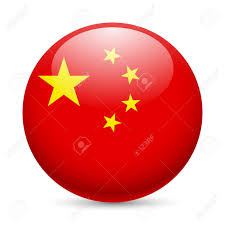
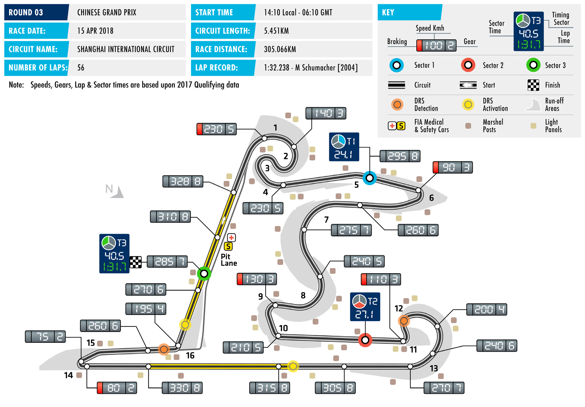
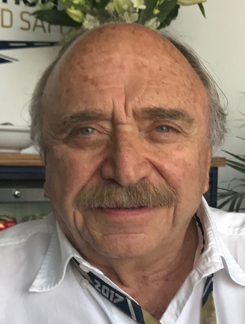
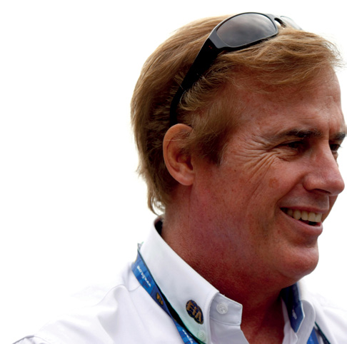

2018 CHINESE GRAND PRIX

13 – 15 April 2018

Following a first thrilling visit of the season to the Middle SHANGHAI INTERNATIONAL

East at last weekend’s Bahrain Grand Prix, Formula 1 rapidly CIRCUIT

returns to action with its first Far Eastern race of the year, the Length of lap: 5.451km

Chinese Grand Prix, round three of the 2018 FIA Formula 1 Lap record: 1:32.238 (Michael Schumacher, World Championship. Ferrari, 2004)

The imposing Shanghai International Circuit possesses a Start line/finish line offset:

number of characteristics that make for a challenging weekend, 0.190km

for both drivers and engineers. Total number of race laps: 56

Total race distance: 305.066km The SIC is a circuit of contrasts. On the one hand it’s recognised Pitlane speed limits: as a ‘front-limited’ circuit that puts high levels of stress on the 80km/h in practice, qualifying, and front tyres, especially through the opening tight and twisting the race complex of corners known as the ‘Snail’, where the emphasis is CIRCUIT NOTES on good balances and downforce. On the other hand set-up is

pulled in the opposite direction by the track’s two long straights, ► The concrete (inner) section of pit lane has been resurfaced. where teams seek to reduce drag in the search for straight line DRS ZONE speed. It’s a delicate balancing act that often eludes even the

best prepared team. ► The DRS zones at the Shanghai International Circuit will be as Matters are further complicated by the fact that the prevailing last year. The detection point cool temperatures at this time of year mean that getting front of the first zone is at Turn 12 and the activation point is 752m tyres switched on is tricky on the relatively smooth surface. before Turn 14. The second Failure to do so can result in high levels of graining and wear. zone’s detection point is 35m before Turn 16, with activation To help, Pirelli this weekend brings its ultrasoft compound to occurring 98m after Turn 16. Shanghai for the first time. The purple-banded tyres are part

of a three-compound selection that gaps the range for the first

time this season, with teams also being offered the medium

and soft tyre.

Ferrari’s Sebastian Vettel heads into this race on the back of

his best start to a season since 2011, the year of his second

world championship title. His two wins so far have given him

a 17-point lead over Lewis Hamilton, but the Mercedes driver

has an enviable record in Shanghai, with five victories to his

credit. Historic or current form? It’s set to be another fascinating

weekend of Formula 1 action.

FAST FACTS

► This is the 15th edition of the Chinese ► Hamilton again leads the way on podium further victories, the most recent being Grand Prix. The first event took place appearances with eight. In addition to his Max Verstappen’s 2017 Mexico Grand in 2004 and it has been held every year five wins he has one second place (2010) Prix win. The team’s first 1-2 also came since at the Shanghai International and two third places (2012, 2013). Only at the 2009 race here, with Mark Webber Circuit. four other current drivers have appeared taking second place behind Vettel. on the podium in China: Räikkönen Sixteen more have followed, with the ► Lewis Hamilton is by far the most Alonso, Vettel have five apiece, while most recent being at the 2016 Malaysian successful driver at the Chinese Grand the newest member of the club is Max GP when Daniel Ricciardo won ahead of Prix. The Briton has won the event five Verstappen, who finished third last year. Max Verstappen. times – in 2008 and 2011 for McLaren and in 2014, 2015 and last year with ► Hamilton also holds the record for most ► This weekend Valtteri Bottas is set to make Mercedes. Next on the list are Fernando pole positions in China: 2007, 2008, his 100th grand prix start. The Finn made Alonso (2005 and 2013) and Nico 2013-’15 and 2017. That’s three more his F1 race debut at the 2013 Australian Rosberg (2012 and 2016). The trio are than nearest rival Vettel who started Grand Prix for Williams. Since then he has the only multiple Chinese GP winners from the front of the grid in 2009, 2010 scored three wins (Russia, Austria and from the eight drivers to have won in and 2011. Abu Dhabi 2017) and four pole positions at the SIC. (Bahrain, Austria, Brazil, Abu Dhabi 2017). ► In the 14 events here the race has been ► Two other current drivers have won won from pole position nine times and ► This weekend Hamilton could break in China: Kimi Räikkönen, in 2007, and each of the last four races has been Räikkönen’s record of 27 consecutive Sebastian Vettel, in 2009. The other won from the front of the grid. Michael finishes in the points. The Finn’s record winners are Rubens Barrichello (2004), Schumacher holds the record for winning encompassed a stretch between the Michael Schumacher (2006), and Jenson from furthest back on the grid. The 2012 Bahrain GP and the 2013 Hungarian Button (2010). German’s sole win here was scored after GP. Hamilton last failed to finish at the starting from sixth place. 2016 Malaysian GP, when an engine ► The victories scored by Hamilton and problem ended his race after 40 laps. Rosberg make Mercedes the most ► The Shanghai International Circuit was Meanwhile, the double DNF suffered by successful constructor at this race, with the scene of Red Bull Racing’s first win Red Bull Racing in Bahrain brought to an five victories. Ferrari are next with four in Formula 1, with Vettel winning from end a run of 39 consecutive races in the and McLaren have three wins here. pole position. The team has since take 54 points for the Milton Keynes team.

RACE STEWARDS BIOGRAPHIES

NISH SHETTY

FIA STEWARD AND MEMBER OF THE FIA INTERNATIONAL COURT OF APPEAL

Nish Shetty sits on the FIA International Court of Appeal as a judge and is a permanent member of the National Court of Appeal (Singapore). He is also Chairman of the Disciplinary Commission of the Singapore Motor Sports Association and a national steward of the Singapore Grand Prix. Shetty has assisted the Singapore Motor Sports Association for many years as a legal advisor and committee member. In addition to being involved in the Singapore Grand Prix, Shetty has acted as a steward in the Singapore Karting Championship. Away from motor sport, he is a Partner and Head of International Arbitration and Dispute Resolution, South East Asia at global law firm Clifford Chance.

JOSÉ ABED

FIA VICE PRESIDENT

José Abed, an FIA Vice President since 2006, began competing in motor sport in 1961. In 1985, as a motor sport of cial, Abed founded the Mexican Organisation of International Motor Sport (OMDAI) which represents Mexico in the FIA. He sat as its Vice- President from 1985 to 1999, becoming President in 2003. In 1986, Abed began promoting truck racing events in Mexico and from 1986 to 1992, he was President of Mexican Grand Prix organising committee. In 1990 and 1991, he was President of the organising committee for the International Championship of Prototype Cars and from 1990 to 1995, Abed was designated Steward for various international Grand Prix events. Since 1990, Abed has been involved in manufacturing prototype chassis, electric cars, rally cars and kart chassis.

DANNY SULLIVAN

FORMER F1 DRIVER, INDIANAPOLIS 500 WINNER AND CART CHAMPION

US racer Danny Sullivan made his F1 debut with Tyrrell at the 1983 Brazilian Grand Prix. He raced just one season in F1, scoring a best result of fifth in Monaco. In 1984, Sullivan returned to the US where he resumed a successful Indy Car career. He is perhaps best known for his ‘spin and win’ victory at the 1985 Indianapolis 500, where he passed leader Mario Andretti, survived a 360 degree spin, and then caught and re-passed Andretti to claim the Borg-Warner Trophy. He won the Indy Car World Series title in 1988. After 17 victories from 170 Indy Car starts he drew a line under his open-wheel career in 1995. He finished third in the Le Mans 24 Hours in a Dauer Porsche 962 in 1994. He made four starts at Le Mans, the most recent being 2004

2018 Formula One World Championship

DRIVERS’ CHAMPIONSHIP STANDINGS

|  | NIARHAB | ANIHC | NAJIABREZA | NIAPS | OCANOM | ADANAC | ECNARF | AIRTSUA | BG | YNAMREG | YRAGNUH | MUIGLEB | YLATI | EROPAGNIS | AISSUR | NAPAJ | ASU | OCIXEM | LIZARB | IBAHD UBA |
| --- | --- | --- | --- | --- | --- | --- | --- | --- | --- | --- | --- | --- | --- | --- | --- | --- | --- | --- | --- | --- |
| 25 1 | 25 1 |  |  |  |  |  |  |  |  |  |  |  |  |  |  |  |  |  |  |  |
| 18 2 | 15 3 |  |  |  |  |  |  |  |  |  |  |  |  |  |  |  |  |  |  |  |
| 4 8 | 18 2 |  |  |  |  |  |  |  |  |  |  |  |  |  |  |  |  |  |  |  |
| 10 5 | 6 7 |  |  |  |  |  |  |  |  |  |  |  |  |  |  |  |  |  |  |  |
| 15 3 | NC |  |  |  |  |  |  |  |  |  |  |  |  |  |  |  |  |  |  |  |
| 6 7 | 8 6 |  |  |  |  |  |  |  |  |  |  |  |  |  |  |  |  |  |  |  |
| 12 4 | NC |  |  |  |  |  |  |  |  |  |  |  |  |  |  |  |  |  |  |  |
| NC | 12 4 |  |  |  |  |  |  |  |  |  |  |  |  |  |  |  |  |  |  |  |
| NC | 10 5 |  |  |  |  |  |  |  |  |  |  |  |  |  |  |  |  |  |  |  |
| 8 6 | NC |  |  |  |  |  |  |  |  |  |  |  |  |  |  |  |  |  |  |  |
| 2 9 | 4 8 |  |  |  |  |  |  |  |  |  |  |  |  |  |  |  |  |  |  |  |
| NC | 2 9 |  |  |  |  |  |  |  |  |  |  |  |  |  |  |  |  |  |  |  |
| 1 10 | 11 |  |  |  |  |  |  |  |  |  |  |  |  |  |  |  |  |  |  |  |
| 12 | 1 10 |  |  |  |  |  |  |  |  |  |  |  |  |  |  |  |  |  |  |  |
| 11 | 16 |  |  |  |  |  |  |  |  |  |  |  |  |  |  |  |  |  |  |  |
| 13 | 12 |  |  |  |  |  |  |  |  |  |  |  |  |  |  |  |  |  |  |  |
| NC | 13 |  |  |  |  |  |  |  |  |  |  |  |  |  |  |  |  |  |  |  |
| 14 | 14 |  |  |  |  |  |  |  |  |  |  |  |  |  |  |  |  |  |  |  |
| 15 | 17 |  |  |  |  |  |  |  |  |  |  |  |  |  |  |  |  |  |  |  |
| NC | 15 |  |  |  |  |  |  |  |  |  |  |  |  |  |  |  |  |  |  |  |

STNIOP

1 S. VETTEL 50

2 L. HAMILTON 33

3 V. BOTTAS 22

4 F. ALONSO 16

5 K. RÄIKKÖNEN 15

6 N. HÜLKENBERG 14

7 D. RICCIARDO 12

8= P. GASLY 12

9 K. MAGNUSSEN 10

10 M. VERSTAPPEN 8

11 S. VANDOORNE 6

12 M. ERICSSON 2

13 C. SAINZ 1

14 E. OCON 1

15 S. PÉREZ 0

16 C. LECLERC 0

17 R. GROSJEAN 0

18 L. STROLL 0

19 B. HARTLEY 0

20 S. SIROTKIN 0

2018 Formula One World Championship

CONSTRUCTORS’ CHAMPIONSHIP STANDINGS

NAJIABREZA AILARTSUA EROPAGNIS IBAHD YNAMREG YRAGNUH STNIOP NIARHAB OCANOM ADANAC AIRTSUA MUIGLEB ECNARF OCIXEM ANIHC AISSUR NAPAJ LIZARB NIAPS YLATI ASU UBA BG

| 40 1 3 | 25 1 NC |
| --- | --- |
| 22 2 8 | 33 2 3 |
| 12 5 9 | 10 7 8 |
| 20 4 6 | NC NC |
| 7 7 10 | 8 6 11 |
| 15 NC | 12 4 17 |
| NC NC | 10 5 13 |
| 13 NC | 2 9 12 |
| 11 12 | 1 10 16 |
| 14 NC | 14 15 |

1 65 SCUDERIA FERRARI

MERCEDES AMG 55 2 PETRONAS MOTORSPORT

3 MCLAREN F1 TEAM 22

ASTON MARTIN 20 4 RED BULL RACING

RENAULT SPORT 15 5 FORMULA ONE TEAM

RED BULL 12 6 TORO ROSSO HONDA

10 HAAS F1 TEAM 7

ALFA ROMEO 2 8 SAUBER F1 TEAM

SAHARA FORCE INDIA 1 9 F1 TEAM

WILLIAMS MARTINI 0 10 RACING

FORMULA ONE TIMETABLE & FIA MEDIA SCHEDULE

THURSDAY

Press conference 15.00

FRIDAY

Practice session 1 10.00-11.30 Press conference 12.00

Practice session 2 14.00-15.30

SATURDAY

Practice session 3 11.00-12.00 Qualifying 14.00-15.00 Followed by unilateral and press conference

SUNDAY

Drivers’ Parade 12.40 Race 14.10 Followed by podium interviews and press conference

ADDITIONAL MEDIA OPPORTUNITIES

QUALIFYING

All drivers eliminated in Q1 or Q2 will be available for media interviews immediately after the end of each session, as will drivers who participated in Q3, but who are not required for the post-qualifying press conference. The TV Pen is located in the paddock in front of the FIA garages.

RACE

Any driver retiring before the end of the race will be made available at the TV pen interview area. In addition, during the race every team will make available at least one senior spokesperson for interview by officially accredited TV crews. A list of those nominated will be made available in the media centre.

FIA COMMUNICATIONS DEPARTMENT press@fia.com T +33 1 43 12 58 15
