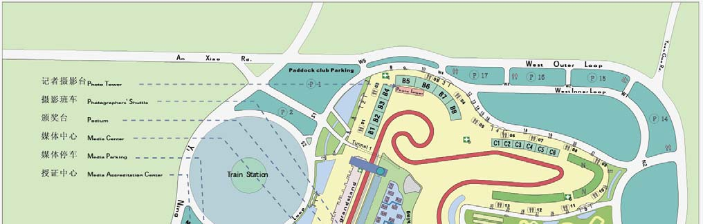
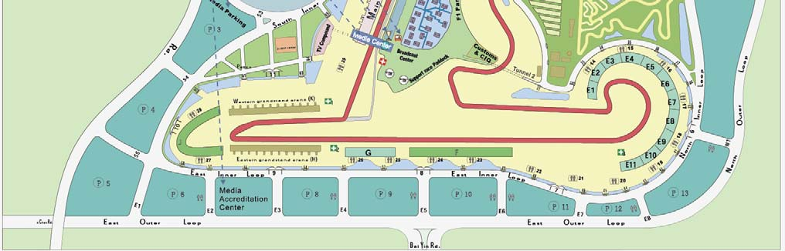
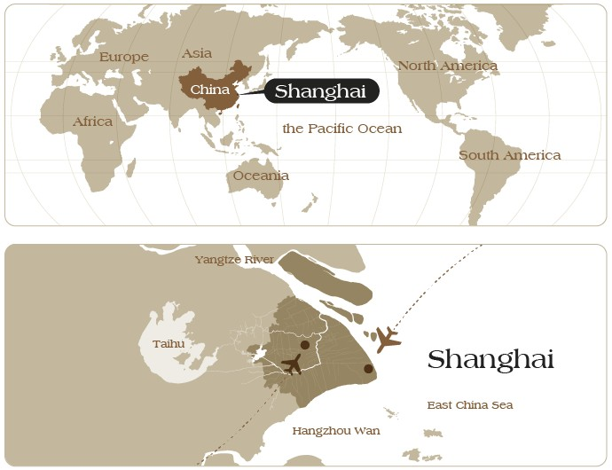
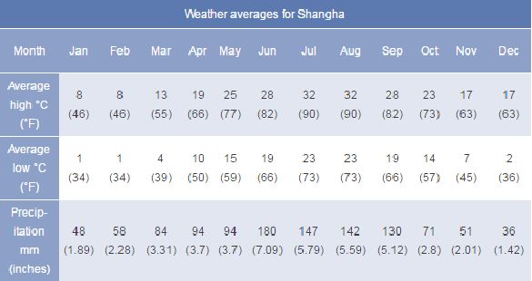

M E D I A K I T

Formula 1 2018 Heineken Chinese Grand Prix

SAIC INTERNATIONAL CIRCUIT

13-14-15.04.2018.

Welcome Address Forward by Jiang Lan

T A B L E O F C O N T E N T S

F O R E W O R D B Y Jiang Lan

2

Welcome to the 3rd Grand Prix of the 2018 FIA Formula One season. This PART 1 GENERAL INFORMATION Welcome Address 3 year marks 15 years of the F1Chinese Grand Prix at SAIC INTERNATIONAL Timetable 4 Circuit Map 6 CIRCUIT. On behalf of everyone at Shanghai Juss Sports Development

Circuit Introduction and History 7 (Group) Co., Ltd.; the host of the Chinese Grand Prix, I would like to Shanghai City Introduction 9 Useful Information 11 extend my warmest and sincerest welcome to all the media from

around the world.

PART 2 MEDIA SERVICES Responsibilities: Track / FIA / Media Centre 12 After 14 years’ of great efforts, the Chinese Grand Prix has developed Accreditation and Media Centre: Opening Hours 13 Media Centre and Photographers’ Area Facilities 14 and grown in stature. Its participation has increased and its value has Shuttle Bus Timetable 15 Press Conferences 16 been enhanced. The Chinese Grand Prix has been consistently and

successfully staged in Shanghai, which positions itself within the sports

PART 3 2018 FIA FORMULA ONE WORLD CHAMPIONSHIP world, the power and spirit of the city of Shanghai. We are honoured to Chinese Grand Prix – Characteristics 17 have such a large number of fans and media recognition. The result Calendar 18 Entry List 19 has been that the Chinese Grand Prix has established an important New Rules in 2018 20 History Book 22 status in formula one family.

PART 4 SUPPORT RACES Thank you very much for your efforts to promote F1 in China. We hereby PORSCHE CARRERA CUP ASIA 26 ensure that the entire staff of Chinese Grand Prix will do their best to

create a more convenient and comfortable working environment.

Furthermore, our staff is committed to provide meticulous and

thoughtful services for the duration for the Chinese Grand Prix.

Sincerely wish you enjoy your stay in Shanghai！

Vice President of Shanghai Jiushi (Group) Co., Ltd.

CEO of Shanghai Juss Sports Development(Group) Co., Ltd.

Jiang Lan

Welcome Address Forward by Jiang Lan

T A B L E O F C O N T E N T S

F O R E W O R D B Y Jiang Lan

3

Welcome to the 3rd Grand Prix of the 2018 FIA Formula One season. This PART 1 GENERAL INFORMATION Welcome Address 3 year marks 15 years of the F1Chinese Grand Prix at SAIC INTERNATIONAL Timetable 4 Circuit Map 6 CIRCUIT. On behalf of everyone at Shanghai Juss Sports Development

Circuit Introduction and History 7 (Group) Co., Ltd.; the host of the Chinese Grand Prix, I would like to Shanghai City Introduction 9 Useful Information 11 extend my warmest and sincerest welcome to all the media from

around the world.

PART 2 MEDIA SERVICES Responsibilities: Track / FIA / Media Centre 12 After 14 years’ of great efforts, the Chinese Grand Prix has developed Accreditation and Media Centre: Opening Hours 13 Media Centre and Photographers’ Area Facilities 14 and grown in stature. Its participation has increased and its value has Shuttle Bus Timetable 15 Press Conferences 16 been enhanced. The Chinese Grand Prix has been consistently and

successfully staged in Shanghai, which positions itself within the sports

PART 3 2018 FIA FORMULA ONE WORLD CHAMPIONSHIP world, the power and spirit of the city of Shanghai. We are honoured to Chinese Grand Prix – Characteristics 17 have such a large number of fans and media recognition. The result Calendar 18 Entry List 19 has been that the Chinese Grand Prix has established an important New Rules in 2018 20 History Book 22 status in formula one family.

PART 4 SUPPORT RACES Thank you very much for your efforts to promote F1 in China. We hereby PORSCHE CARRERA CUP ASIA 26 ensure that the entire staff of Chinese Grand Prix will do their best to

create a more convenient and comfortable working environment.

Furthermore, our staff is committed to provide meticulous and

thoughtful services for the duration for the Chinese Grand Prix.

Sincerely wish you enjoy your stay in Shanghai！

Vice President of Shanghai Jiushi (Group) Co., Ltd.

CEO of Shanghai Juss Sports Development(Group) Co., Ltd.

Jiang Lan

T I M E T A B L E SATURDAY 08:30 09:15 FORMULA1 TEAM PIT STOP PRACTICE 08:30 09:15 PADDOCK CLUB PADDOCK CLUB PIT LANE WALK 08:30 09:00 PADDOCK CLUB PADDOCK CLUB TRUCK TOUR C H I N E S E G R A N D P R I X 09:10 09:20 FIA MEDICAL INSPECTION THURSDAY 09:25 09:40 FIA TRACK INSPECTION AND SAFETY CAR TEST 10:00 16:00 FIA INITIAL SCRUTINEERING 09:50 10:20 PORSCHE CARRERA CUP ASIA QUALIFYING SESSION 10:00 10:30 FORMULA 1 SECURITY BRIEFING 4 10:30 10:40 FIA TRACK INSPECTION 13:00 15:00 FIA TRACK CLOSED FIA/F1 SYSTEMS CHECKS 11:00 12:00¹ FORMULA 1 THIRD PRACTICE SESSION TRACK ACCESS RESTRICTED TO FIA/F1 ONLY 12:10 13:45 PADDOCK CLUB PADDOCK CLUB PIT LANE WALK 13:45 14:00 FIA TRACK INSPECTION, TRACK COMPLETELY 12:10 12:40 PADDOCK CLUB PADDOCK CLUB TRUCK TOUR CLEAR 12:50 13:10 FORMULA 1 FORMULA 1 PIRELLI HOT LAPS 14:00 15:00 FIA HIGH SPEED TRACK TEST – FIA SAFETY AND 13:30 13:45 FIA TRACK INSPECTION MEDICAL CARS 14:00 15:00 FORMULA 1 QUALIFYING SESSION 15:00 16:00 FORMULA 1 PRESS CONFERENCE 15:30 16:00 PADDOCK CLUB PADDOCK CLUB TRUCK TOUR 15:10 15:40 FORMULA 1 FORMULA 1 PIRELLI HOT LAPS 15:30 16:30 PADDOCK CLUB PADDOCK CLUB PIT LANE WALK 15:45 16:30 FORMULA 1 DRIVERS’ AUTOGRAPH SESSION SUNDAY 16:00 17:00 FORMULA 1 TEAM MANAGERS’ MEETING 09:30 10:00 PADDOCK CLUB PADDOCK CLUB TRUCK TOUR 16:00 16:30 FORMULA 1 F1 EXPERIENCE – PIT LANE WALK 09:30 10:30 PADDOCK CLUB PADDOCK CLUB PIT LANE WALK (F1 EXPERIENCE GUESTS ONLY) 10:10 10:20 FIA MEDICAL INSPECTION 16:30 17:00 FORMULA 1 F1 EXPERIENCE – TRUCK TOUR 10:30 10:45 FIA TRACK INSPECTION AND TRACK TEST (F1 EXPERIENCE GUESTS ONLY) 11:00* 11:35² PORSCHE CARRERA CUP ASIA RACE (12 LAPS OR 30 MINS) 17:00 18:30 FORMULA 1 NIKE RUN THE TRACK 11:40 12:00 FORMULA1 FORMULA 1 PIRELLI HOT LAPS 12:10 13:25 PADDOCK CLUB PADDOCK CLUB PIT LANE WALK FRIDAY 12:40 13:00 FORMULA 1 DRIVERS’ PARADE 09:20 09:30 FIA MEDICAL INSPECTION 13:00 13:15 FORMULA 1 STARTING GRID PRESENTATION 09:30 09:45 FIA TRACK INSPECTION AND TRACK TEST 13:10 13:20 FIA MEDICAL INSPECTION 10:00 11:30¹ FORMULA 1 FIRST PRACTICE SESSION 13:20 13:40 FIA TRACK INSPECTION 11:35 13:30 PADDOCK CLUB PADDOCK CLUB PIT LANE WALK 13:40 13:50 FORMULA 1 PIT LANE OPEN 11:40 12:10 PADDOCK CLUB PADDOCK CLUB TRUCK TOUR 13:56 13:58 FORMULA 1 NATIONAL ANTHEM 12:00 13:00 FORMULA1 PRESS CONFERENCE 14:10* 16:10² FORMULA 1 GRAND PRIX (56 LAPS OR 120 MINS) 12:20 12:50 FORMULA 1 FORMULA 1 PIRELLI HOT LAPS 13:00 13:30 PORSCHE CARRERA CUP ASIA DRIVERS’ MEETING *These times refer to the start of the formation lap. ¹ Fixed Time Session ² Approximate finishing time 13:30 13:40 FIA TRACK INSPECTION Please note this timetable may be subject to amendments 14:00 15:30¹ FORMULA 1 SECOND PRACTICE SESSION 16:00 16:45 PORSCHE CARRERA CUP ASIA PRACTICE SESSION 17:00 17:30 PADDOCK CLUB PADDOCK CLUB PIT LANE WALK 17:00 17:30 PADDOCK CLUB PADDOCK CLUB TRUCK TOUR 17:00 18:00 FORMULA 1 DRIVERS’ MEETING 17:30 19:00 PROMOTER ACTIVITY PUBLIC PIT LANE WALK –EVENT COUPON HOLDERS ONLY 18:00 19:00 TRACK ACTIVITY MARSHAL PIT LANE WALK

T I M E T A B L E SATURDAY 08:30 09:15 FORMULA1 TEAM PIT STOP PRACTICE 08:30 09:15 PADDOCK CLUB PADDOCK CLUB PIT LANE WALK 08:30 09:00 PADDOCK CLUB PADDOCK CLUB TRUCK TOUR C H I N E S E G R A N D P R I X 09:10 09:20 FIA MEDICAL INSPECTION THURSDAY 09:25 09:40 FIA TRACK INSPECTION AND SAFETY CAR TEST 10:00 16:00 FIA INITIAL SCRUTINEERING 09:50 10:20 PORSCHE CARRERA CUP ASIA QUALIFYING SESSION 10:00 10:30 FORMULA 1 SECURITY BRIEFING 10:30 10:40 FIA TRACK INSPECTION 5 13:00 15:00 FIA TRACK CLOSED FIA/F1 SYSTEMS CHECKS 11:00 12:00¹ FORMULA 1 THIRD PRACTICE SESSION TRACK ACCESS RESTRICTED TO FIA/F1 ONLY 12:10 13:45 PADDOCK CLUB PADDOCK CLUB PIT LANE WALK 13:45 14:00 FIA TRACK INSPECTION, TRACK COMPLETELY 12:10 12:40 PADDOCK CLUB PADDOCK CLUB TRUCK TOUR CLEAR 12:50 13:10 FORMULA 1 FORMULA 1 PIRELLI HOT LAPS 14:00 15:00 FIA HIGH SPEED TRACK TEST – FIA SAFETY AND 13:30 13:45 FIA TRACK INSPECTION MEDICAL CARS 14:00 15:00 FORMULA 1 QUALIFYING SESSION 15:00 16:00 FORMULA 1 PRESS CONFERENCE 15:30 16:00 PADDOCK CLUB PADDOCK CLUB TRUCK TOUR 15:10 15:40 FORMULA 1 FORMULA 1 PIRELLI HOT LAPS 15:30 16:30 PADDOCK CLUB PADDOCK CLUB PIT LANE WALK 15:45 16:30 FORMULA 1 DRIVERS’ AUTOGRAPH SESSION SUNDAY 16:00 17:00 FORMULA 1 TEAM MANAGERS’ MEETING 09:30 10:00 PADDOCK CLUB PADDOCK CLUB TRUCK TOUR 16:00 16:30 FORMULA 1 F1 EXPERIENCE – PIT LANE WALK 09:30 10:30 PADDOCK CLUB PADDOCK CLUB PIT LANE WALK (F1 EXPERIENCE GUESTS ONLY) 10:10 10:20 FIA MEDICAL INSPECTION 16:30 17:00 FORMULA 1 F1 EXPERIENCE – TRUCK TOUR 10:30 10:45 FIA TRACK INSPECTION AND TRACK TEST (F1 EXPERIENCE GUESTS ONLY) 11:00* 11:35² PORSCHE CARRERA CUP ASIA RACE (12 LAPS OR 30 MINS) 17:00 18:30 FORMULA 1 NIKE RUN THE TRACK 11:40 12:00 FORMULA1 FORMULA 1 PIRELLI HOT LAPS 12:10 13:25 PADDOCK CLUB PADDOCK CLUB PIT LANE WALK FRIDAY 12:40 13:00 FORMULA 1 DRIVERS’ PARADE 09:20 09:30 FIA MEDICAL INSPECTION 13:00 13:15 FORMULA 1 STARTING GRID PRESENTATION 09:30 09:45 FIA TRACK INSPECTION AND TRACK TEST 13:10 13:20 FIA MEDICAL INSPECTION 10:00 11:30¹ FORMULA 1 FIRST PRACTICE SESSION 13:20 13:40 FIA TRACK INSPECTION 11:35 13:30 PADDOCK CLUB PADDOCK CLUB PIT LANE WALK 13:40 13:50 FORMULA 1 PIT LANE OPEN 11:40 12:10 PADDOCK CLUB PADDOCK CLUB TRUCK TOUR 13:56 13:58 FORMULA 1 NATIONAL ANTHEM 12:00 13:00 FORMULA1 PRESS CONFERENCE 14:10* 16:10² FORMULA 1 GRAND PRIX (56 LAPS OR 120 MINS) 12:20 12:50 FORMULA 1 FORMULA 1 PIRELLI HOT LAPS 13:00 13:30 PORSCHE CARRERA CUP ASIA DRIVERS’ MEETING *These times refer to the start of the formation lap. ¹ Fixed Time Session ² Approximate finishing time 13:30 13:40 FIA TRACK INSPECTION Please note this timetable may be subject to amendments 14:00 15:30¹ FORMULA 1 SECOND PRACTICE SESSION 16:00 16:45 PORSCHE CARRERA CUP ASIA PRACTICE SESSION 17:00 17:30 PADDOCK CLUB PADDOCK CLUB PIT LANE WALK 17:00 17:30 PADDOCK CLUB PADDOCK CLUB TRUCK TOUR 17:00 18:00 FORMULA 1 DRIVERS’ MEETING 17:30 19:00 PROMOTER ACTIVITY PUBLIC PIT LANE WALK –EVENT COUPON HOLDERS ONLY 18:00 19:00 TRACK ACTIVITY MARSHAL PIT LANE WALK

C I R C U I T M A P CIRCUIT FIGURE

&

INTRODUCTION

6

Specifications of the Grand Prix track:

 Two sections of the track have been nicknamed ‘snails’ – the first at turns 1, 2 and 3 has a closing radius; the second, at turns 10, 11 and 12 has an opening radius.

 At the end of the longest (1,175m) straight, cars are estimated to decelerate from 327 kph to 87 kph as they pass the Lotus grandstand.

 Maximum uphill slope: 3%.

 Maximum downhill slope: 8%.

 16 turns – 7 left, 9 right.

 Lap length of 5.45 km.

 The predicted average lap time for the Circuit is 1m, 34 seconds.

 Length of longest straight 1,175m.

 Total asphalt used (base, binder and wearing courses): 173,000 m2.

 Total length of tyre barriers: 6,500m, using a total of 174,000 units.

 Total guard rail: 11,700m.

 Total FIA safety fencing: 9,350m.

 Total number of concrete piles: 40,000, totalling 800,000m.

The SAIC INTERNATIONAL CIRCUIT includes:

 A total capacity of 200,000 spectators.

 A main grandstand for 29,000 spectators and first class hospitality suites.

 Dedicated team buildings for international racing teams.

 A Sky Restaurant.

 A media center above the track.

C I R C U I T M A P CIRCUIT FIGURE

&

INTRODUCTION

7

Specifications of the Grand Prix track:

 Two sections of the track have been nicknamed ‘snails’ – the first at turns 1, 2 and 3 has a closing radius; the second, at turns 10, 11 and 12 has an opening radius.

 At the end of the longest (1,175m) straight, cars are estimated to decelerate from 327 kph to 87 kph as they pass the Lotus grandstand.

 Maximum uphill slope: 3%.

 Maximum downhill slope: 8%.

 16 turns – 7 left, 9 right.

 Lap length of 5.45 km.

 The predicted average lap time for the Circuit is 1m, 34 seconds.

 Length of longest straight 1,175m.

 Total asphalt used (base, binder and wearing courses): 173,000 m2.

 Total length of tyre barriers: 6,500m, using a total of 174,000 units.

 Total guard rail: 11,700m.

 Total FIA safety fencing: 9,350m.

 Total number of concrete piles: 40,000, totalling 800,000m.

The SAIC INTERNATIONAL CIRCUIT includes:

 A total capacity of 200,000 spectators.

 A main grandstand for 29,000 spectators and first class hospitality suites.

 Dedicated team buildings for international racing teams.

 A Sky Restaurant.

 A media center above the track.

CIRCUIT HISTORY

Even after Formula 1's first visit to SAIC INTERNATIONAL CIRCUIT, it was already acknowledged

by the sport's insiders as the best of the recent spate of new circuits. 8

Ultra-modern, with space aplenty for overtaking and outstanding viewing for the 200,000 spectators,

supported by superb facilities for the teams and drivers, it is small wonder that the circuit made such

an extraordinary impact.

The site that was chosen in the Jiading district, 20km from Hongqiao international airport and 30km

north-west of the city centre in an area being developed as Shanghai International Auto City, along

with an automobile manufacturing base, exhibition and sales facilities.

Less than half of the 5.3 square kilometre site is covered by the circuit, with the rest to be developed

for other recreational uses.

Once the construction plans had been approved, there were only 18 months to build the circuit and

its infrastructure, requiring a workforce of 7000 to work around the clock. If the timescale wasn't

trouble enough, the site provided further problems as it was a swamp requiring specialist building

techniques to make it stable, with the building of 40,000 support piles, from 40 to 80m in depth and

topped with a layer of polystyrene (EPS, extruded polystyrene). In order to fulfill the need for

polystyrene, the company had to purchase the entire stock available in the Asian market.

Circuit design expert Herrman Tilke headed the project, coming up with a layout that offered seven

left turns and nine rights, and a 200mph back straight leading into a hairpin that's good for

overtaking as it's unusually wide. The gentle banking at the ever-tightening opening sequence of

corners is also a hit, with Turn 13 being the opposite as it opens out onto the back straight.

People talk of how Tilke took his inspiration for the layout from the Chinese Shang character, which

means "above" and ties in with Shanghai. However, this was done unwittingly. He had incorporated

local themes into the design even before this. Based on China being a gateway to the Asia Pacific

region, some of the grandstands have a roof based on a lotus leaf. The team offices are built on

stilts above a lake are in imitation of the water gardens in Shanghai's Yu-yuan garden. Although the

circuit is unremittingly modern, the detailing on many of the buildings is in traditional Chinese red

and gold. After nightfall, though, the circuit becomes futuristic again, with blue lights picking out the

architectural extravagances.

Apart from The Formula One Chinese Grand Prix, SAIC INTERNATIONAL CIRCUIT also stages

other international motor sports events such as The World Endurance Championship and The World

Touring Car Championship. In addition in the SAIC INTERNATIONAL CIRCUIT, we will also present

many exciting new events for motor racing fans.

SHANGHAI CITY

INTRODUCTION

 Location 9

Shanghai literally means the city by the sea. It is bordered on the north and west by Jiangsu Province , on the south by Zhejiang Province, and on the east by the East China Sea . Right in the middle of China's east coastline, Shanghai is an excellent sea and river port, boasting easy access to the vast hinterland.

 Population Due to constant inflow of people from other parts of the country, the size of population in Shanghai keeps growing. Before Shanghai was liberated in 1949, it only had a population of 5.2 million. According to the Shanghai Statistics Bureau, Shanghai's population of residents with permanent residence registration had grown to 24.15 million, among which 14.33 million were long-term residents and 9.8 million were immigrants by the end of 2015.

 Shanghai Weather & Climate

 Top 5 Must to go

Xintiandi USEFUL It’s a modern leisure and entertainment neighborhood in downtown Shanghai, provides an interesting window on the city and the rest of the world, on city’s yesteryears, today and tomorrow.

INFORM ATION The Bund 10 TELEPHONE NUMBERS It has also been known as Zhongshan First East Road, which measures about 1.5 kilometers in length. To its east is the Huangpu River. To its west are 52 classic buildings of Gothic and Baroque styles which used to house old Shanghai’s financial institutions and trading companies; therefore, the Bund is now acclaimed as an outdoor museum of international architecture. Emergency numbers Police (general number) 110 Fire brigade 119 Yu Garden Ambulance 120 This ancient property owned by a Ming dynasty official is the only Ming garden in the northern part of the Old City. Built in 1559, the 2-hectare garden has been around for over four centuries. It boasts over 40 ingeniously conceived, well laid out ancient buildings, which have interesting names Useful numbers Directory Assistance 114 like Iron Panther, Moon Tower and Hearing-Waves Pavilion. Tourist Information 962020 Airport Pudong 96990 Airport Hongqiao 96990 Shanghai's Nanjing Road Pedestrian Street Weather Forecast 12121 It was catapulted to fame in the 1920’s and today is known as the “No.1 Street of China”. It is flanked by hundreds of boutique shops housed in beautiful buildings, like time-honored brands like First Department Store and Yongan Department Store. Hospitals Huashan Hospital 86-21-52889999 With English 12 Wulumuqi Zhong Road China Art Museum language service Housed in the China Pavilion of the 2010 Shanghai World Expo, China Art Museum features 27 exhibition halls measuring 64,000 square meters in area as well as such facilities as theater, Air France 400 880 8808 conference hall and library. The 559-square-meter dining zone offers coffee, Western fast food and Airlines (Selection) British Airways 400 881 0207 Lufthansa 4008 868 868 tea. China Eastern Airlines 95530 Swiss 400 882 0880  Food Virgin Atlantic 86-21-5353 4600 Shanghai is a metropolis with unique charms. This 150-year-old city has a lot of memorable “tastes” Emirates 400 882 2380 that make people linger. As one of the world’s most food-savvy cultures, Shanghai is where culinary Qatar 400 994 9991 creations from all over the world converge. In traditional shanghai cuisine, foods are mainly braised in red sauce and stir-fried in rich oil.

Sweet and Sour Short Ribs Regal International East Asia Hotel 86-21-64155588 Brightly red; flavorful; sweet and sour Media Hotel No. 516 Hengshan Road （with shuttle to the circuit） Crowne Plaza Shanghai Anting 86-21-60568888

Yan Du Xian No. 6555 Boyuan Road. Red meat with white bamboo shoots in rich gravy, tasty, fresh

Braised Pork in Brown Sauce Pork braised to a red sheen, delicious, sweet ,salty ,gooey

Nanxiang Steamed Buns Thin wrappings, tender meat, juicy, delicious

Every year Shanghai host many international sports events, such as Formula One Chinese Grand Prix, Shanghai Global Champions Tour ,Shanghai ATP1000 Masters, Shanghai Snooker Masters and others. These events gather in Shanghai and perform an incomparable and marvelous match, and present the world the spirit of Shanghai, which is tolerant, striving for excellence, intelligent and open-minded, broad and modest, which draws widespread media attention.

 Top 5 Must to go

Xintiandi USEFUL It’s a modern leisure and entertainment neighborhood in downtown Shanghai, provides an interesting window on the city and the rest of the world, on city’s yesteryears, today and tomorrow.

INFORM ATION The Bund TELEPHONE NUMBERS 11 It has also been known as Zhongshan First East Road, which measures about 1.5 kilometers in length. To its east is the Huangpu River. To its west are 52 classic buildings of Gothic and Baroque styles which used to house old Shanghai’s financial institutions and trading companies; therefore, the Bund is now acclaimed as an outdoor museum of international architecture. Emergency numbers Police (general number) 110 Fire brigade 119 Yu Garden Ambulance 120 This ancient property owned by a Ming dynasty official is the only Ming garden in the northern part of the Old City. Built in 1559, the 2-hectare garden has been around for over four centuries. It boasts over 40 ingeniously conceived, well laid out ancient buildings, which have interesting names Useful numbers Directory Assistance 114 like Iron Panther, Moon Tower and Hearing-Waves Pavilion. Tourist Information 962020 Airport Pudong 96990 Airport Hongqiao 96990 Shanghai's Nanjing Road Pedestrian Street Weather Forecast 12121 It was catapulted to fame in the 1920’s and today is known as the “No.1 Street of China”. It is flanked by hundreds of boutique shops housed in beautiful buildings, like time-honored brands like First Department Store and Yongan Department Store. Hospitals Huashan Hospital 86-21-52889999 With English 12 Wulumuqi Zhong Road China Art Museum language service Housed in the China Pavilion of the 2010 Shanghai World Expo, China Art Museum features 27 exhibition halls measuring 64,000 square meters in area as well as such facilities as theater, Air France 400 880 8808 conference hall and library. The 559-square-meter dining zone offers coffee, Western fast food and Airlines (Selection) British Airways 400 881 0207 Lufthansa 4008 868 868 tea. China Eastern Airlines 95530 Swiss 400 882 0880  Food Virgin Atlantic 86-21-5353 4600 Shanghai is a metropolis with unique charms. This 150-year-old city has a lot of memorable “tastes” Emirates 400 882 2380 that make people linger. As one of the world’s most food-savvy cultures, Shanghai is where culinary Qatar 400 994 9991 creations from all over the world converge. In traditional shanghai cuisine, foods are mainly braised in red sauce and stir-fried in rich oil.

Sweet and Sour Short Ribs Regal International East Asia Hotel 86-21-64155588 Brightly red; flavorful; sweet and sour Media Hotel No. 516 Hengshan Road （with shuttle to the circuit） Crowne Plaza Shanghai Anting 86-21-60568888

Yan Du Xian No. 6555 Boyuan Road. Red meat with white bamboo shoots in rich gravy, tasty, fresh

Braised Pork in Brown Sauce Pork braised to a red sheen, delicious, sweet ,salty ,gooey

Nanxiang Steamed Buns Thin wrappings, tender meat, juicy, delicious

Every year Shanghai host many international sports events, such as Formula One Chinese Grand Prix, Shanghai Global Champions Tour ,Shanghai ATP1000 Masters, Shanghai Snooker Masters and others. These events gather in Shanghai and perform an incomparable and marvelous match, and present the world the spirit of Shanghai, which is tolerant, striving for excellence, intelligent and open-minded, broad and modest, which draws widespread media attention.

A c c r e d i t a t i o n MEIDA

SERVICES a n d M e d i a C e n t r e

R E S P O N S I B I L I T I E S 12 O P E N I N G H O U R S

RACETRACK ACCREDITATION Operating Company Shanghai Juss Event Management Co，Ltd. The 15th Floor Location The Media Accreditation Centre is located at Waihuan Rd. (East), between No.28 South Zhongshan Road Public Parking No. 6 and No. 8. The media hotel shuttles will have a stopover at Shanghai, P.R. China the accreditation centre and an additional media accreditation shuttle service will Phone: +86 (0)21 63339393 be provided to the circuit. Fax: +86 (0)21 63339434 Website: http://www.jussevent.com Opening hours Wednesday 11 April 2018 11.00 hrs – 18.00 hrs

Clerk of the Course Zhang Tao Thursday 12 April 2018 08.00 hrs – 18.00 hrs National Steward Zheng Honghai Friday 13 April 2018 08.00 hrs – 16.00 hrs

FIA Saturday 14 April 2018 08.00 hrs – 12.00 hrs

FIA F1 Race Director, Safety Delegate and Permanent Charlie Whiting Starter

FIA F1 Deputy Race Director Laurent Mekies MEDIA CENTRE/PHOTOGRAPHERS’ AREA FIA F1 Medical Delegate Alain Chantegret Location The Media Centre is located on the 9th floor of the control tower. The media centre can be accessed from the paddock entrance. FIA F1 Deputy Medical Delegate Ian Roberts The Photographers’ Area is MOVED TO THE MEDIA CENTRE.

FIA F1 Technical Delegate Jo Bauer Opening hours Wednesday 11 April 2018 12.00 hrs – 20.00 hrs

FIA Head of F1 Communications & Media Matteo Bonciani Thursday 12 April 2018 09.00 hrs – 22.00 hrs Delegate Friday 13 April 2018 07.00 hrs – 23.00 hrs FIA F1 Deputy Media Delegate Pierre Guyonnet-Duperat Saturday 14 April 2018 07.00 hrs – 23.00 hrs

Nish Shetty Sunday 15 April 2018 07.00 hrs – OPEN ENDED Stewards Jose Abed Danny Sullivan *until the departure of the last journalist/photographer

Safety Car Driver Bernd Mayländer

Medical Car Driver Alan van der Merwe

MEDIA CENTRE

National Press Officer Xu Wei

A c c r e d i t a t i o n MEIDA

SERVICES a n d M e d i a C e n t r e

R E S P O N S I B I L I T I E S O P E N I N G H O U R S 13

RACETRACK ACCREDITATION Operating Company Shanghai Juss Event Management Co，Ltd. The 15th Floor Location The Media Accreditation Centre is located at Waihuan Rd. (East), between No.28 South Zhongshan Road Public Parking No. 6 and No. 8. The media hotel shuttles will have a stopover at Shanghai, P.R. China the accreditation centre and an additional media accreditation shuttle service will Phone: +86 (0)21 63339393 be provided to the circuit. Fax: +86 (0)21 63339434 Website: http://www.jussevent.com Opening hours Wednesday 11 April 2018 11.00 hrs – 18.00 hrs

Clerk of the Course Zhang Tao Thursday 12 April 2018 08.00 hrs – 18.00 hrs National Steward Zheng Honghai Friday 13 April 2018 08.00 hrs – 16.00 hrs

FIA Saturday 14 April 2018 08.00 hrs – 12.00 hrs

FIA F1 Race Director, Safety Delegate and Permanent Charlie Whiting Starter

FIA F1 Deputy Race Director Laurent Mekies MEDIA CENTRE/PHOTOGRAPHERS’ AREA FIA F1 Medical Delegate Alain Chantegret Location The Media Centre is located on the 9th floor of the control tower. The media centre can be accessed from the paddock entrance. FIA F1 Deputy Medical Delegate Ian Roberts The Photographers’ Area is MOVED TO THE MEDIA CENTRE.

FIA F1 Technical Delegate Jo Bauer Opening hours Wednesday 11 April 2018 12.00 hrs – 20.00 hrs

FIA Head of F1 Communications & Media Matteo Bonciani Thursday 12 April 2018 09.00 hrs – 22.00 hrs Delegate Friday 13 April 2018 07.00 hrs – 23.00 hrs FIA F1 Deputy Media Delegate Pierre Guyonnet-Duperat Saturday 14 April 2018 07.00 hrs – 23.00 hrs

Nish Shetty Sunday 15 April 2018 07.00 hrs – OPEN ENDED Stewards Jose Abed Danny Sullivan *until the departure of the last journalist/photographer

Safety Car Driver Bernd Mayländer

Medical Car Driver Alan van der Merwe

MEDIA CENTRE

National Press Officer Xu Wei

FACILITIES SHUTTLE BUS TIMETABLE

Media Hotels Shuttles Media Centre  A sufficient number of seats. All non-smoking  waste paper baskets 11 April 12 April 13 April 14 April 15 April  5 telephone booths located in the telecom area. Wednesday Thursday Friday Saturday Sunday  Private telephones on request.  3 fax machines. Depart hotel: 14  Lockers (A deposit of ￥100 or $10 is required for each locker. A fee of ￥100 or 11:00 9:00 7:00 7:00 7:00 14:00 11:00 8:00 8:00 8:00 $10 will be charged for lost or damaged keys.) 13:00 9:00 9:00 9:00  Reception Telephone: +86 21 6956 9001 12:00 11:00 10:00 +86 21 6956 9002 11:00 Regal International Depart Circuit: Photographers’ Area  A sufficient number of seats . East Asia Hotel 15:00 16:30 16:00 16:00 16:00  ISDN and direct lines as well as data uplinks are available on request. 17:00 19:00 17:00 17:00 17:00  Lockers (A deposit of ￥100 or $10 is required for each locker. A fee of ￥100 or SHANGHAI 20:00 21:00 18:00 18:00 18:00 20:00 20:00 19:00 $10 will be charged for lost or damaged keys.) 22:00 21:00 20:00  23:00 22:00 21:00 23:00 22:00 23:00 Television / radio 40 operational air-conditioned and soundproof commentary booths are available to 24:00 television and radio above the main grandstand (5th floor). (the last journalist’s departure) Shuttle Services Media Hotels Shuttles Depart hotel: A media shuttle service is provided to and from the recommended media hotels Every 1 hour Every 1 hour Every 1 hour Every 1 hour Every 1 hour (Regal International East Asia Hotel in Shanghai downtown, Crowne Plaza from: 12:00 from: 9:00 from: 7:00 from: 7:00 from: 7:00 to: 16:00 to: 14:00 to: 10:00 to: 10:00 to: 10:00 Shanghai Anting close to the circuit) to the Circuit Media Parking (Parking No. 3). (Please refer to the official noticeboard in the Media Centre and Photographers’ Area Crowne Plaza for detailed schedule). Shanghai Anting Depart Circuit: Media Shuttles : Every 1 hour Every 1 hour Every 1 hour Every 1 hour Every 1 hour There is a non-stop media shuttle service between the Media Parking (Parking No. 3) from: 16:00 from: 16:00 from: 17:00 from: 17:00 from: 17:00 and the Media Centre. to: 20:00 to: 22:00 to: 23:00 to: 23:00 till the last journalist’s departure Photographers’ Shuttles Accreditation Center Route: A photographers’ shuttle service is provided non-stop during the Formula One practice sessions and race from the Race Control Tower to important locations between Wednesday Thursday Friday Saturday around the track, using the inner and outer service road. Accreditation Center Every 2 minutes Every 2 minutes Every 2 minutes Every 2 minutes Operating Hours: Please refer to the schedule on the official notice board in the and from: 10:00 from: 8:00 from: 8:00 from: 8:00 photographers’ room. to: 18:00 to: 18:00 to: 16:00 to: 12:00 Photographers’ Towers: For the position, please refer to the map of this press kit. No.3 Parking Lot Crossing the track: Crossing the track is not allowed from 30 minutes before each Media Shuttles practice session and 60 minutes before the Grand Prix race. between

Media Parking 3 non-stop media shuttle from 7:00 to 23:00 and

Control Center

Photographers’ Shuttles

Wednesday Thursday Friday Saturday Sunday clockwise

along non-stop media shuttle from 9:00 to 16:30 Service Track

*Notes: This timetable may be subject to amendments.Please pay attention to the noteboard *

FACILITIES SHUTTLE BUS TIMETABLE

| Media Hotels Shuttles | 11 April 12 April 13 April 14 April 15 April Wednesday Thursday Friday Saturday Sunday |  |  |  |  |  |
| --- | --- | --- | --- | --- | --- | --- |
| Regal International East Asia Hotel SHANGHAI | Depart hotel: |  |  |  |  |  |
|  | 11: 14: Depart Circuit: | 00 9:00 00 11:00 13:00 | 7:00 8:00 9:00 12:00 | 7:00 8:00 9:00 11:00 |  | 7:00 8:00 9:00 10:00 11:00 |
|  | 15: 17: 20: | 00 16:30 00 19:00 00 21:00 | 16:00 17:00 18:00 20:00 22:00 23:00 | 16:00 17:00 18:00 20:00 21:00 22:00 23:00 |  | 16:00 17:00 18:00 19:00 20:00 21:00 22:00 23:00 24:00 (the last journalist’s departure) |
| Crowne Plaza Shanghai Anting | Depart hotel: |  |  |  |  |  |
|  | Every 1 hour from: 12: to: 16: Depart Circuit: | Every 1 hour 00 from: 9:00 00 to: 14:00 | Every 1 hour from: 7:00 to: 10:00 | Every 1 hour from: 7:00 to: 10:00 | Every 1 hour from: 7:00 to: 10:00 |  |
|  | Every 1 hour from: 16: to: 20: | Every 1 hour 00 from: 16:00 00 to: 22:00 | Every 1 hour from: 17:00 to: 23:00 | Every 1 hour from: 17:00 to: 23:00 |  | Every 1 hour from: 17:00 till the last journalist’s departure |
| Accreditation Center |  |  |  |  |  |  |
| between Accreditation Center and No.3 Parking Lot | Wednesday Thursday Friday Saturday |  |  |  |  |  |
|  | Every 2 minute from: 10: to: 18: | s Every 2 minutes 00 from: 8:00 00 to: 18:00 | Every 2 minutes from: 8:00 to: 16:00 | Every 2 minutes from: 8:00 to: 12:00 |  |  |
| Media Shuttles |  |  |  |  |  |  |
| between Media Parking 3 and Control Center | non-stop media shuttle from 7:00 to 23:00 |  |  |  |  |  |
| Photographers’ Shuttles |  |  |  |  |  |  |
| clockwise along Service Track | Wednesday Thursday Friday Saturday Sunday |  | non-stop media shuttle from 9:00 to 16:30 |  |  |  |

Media Centre  A sufficient number of seats. All non-smoking  waste paper baskets  5 telephone booths located in the telecom area.  Private telephones on request.  3 fax machines. 15  Lockers (A deposit of ￥100 or $10 is required for each locker. A fee of ￥100 or $10 will be charged for lost or damaged keys.)  Reception Telephone: +86 21 6956 9001 +86 21 6956 9002

Photographers’ Area  A sufficient number of seats .  ISDN and direct lines as well as data uplinks are available on request.  Lockers (A deposit of ￥100 or $10 is required for each locker. A fee of ￥100 or $10 will be charged for lost or damaged keys.) 

Television / radio 40 operational air-conditioned and soundproof commentary booths are available to television and radio above the main grandstand (5th floor).

Shuttle Services Media Hotels Shuttles A media shuttle service is provided to and from the recommended media hotels (Regal International East Asia Hotel in Shanghai downtown, Crowne Plaza Shanghai Anting close to the circuit) to the Circuit Media Parking (Parking No. 3). (Please refer to the official noticeboard in the Media Centre and Photographers’ Area for detailed schedule).

Media Shuttles : There is a non-stop media shuttle service between the Media Parking (Parking No. 3) and the Media Centre.

Photographers’ Shuttles Route: A photographers’ shuttle service is provided non-stop during the Formula One practice sessions and race from the Race Control Tower to important locations around the track, using the inner and outer service road. Operating Hours: Please refer to the schedule on the official notice board in the photographers’ room. Photographers’ Towers: For the position, please refer to the map of this press kit. Crossing the track: Crossing the track is not allowed from 30 minutes before each practice session and 60 minutes before the Grand Prix race.

*Notes: This timetable may be subject to amendments.Please pay attention to the noteboard *

P R E S S C O N F E R E N C E S 2 0 1 8

FIA F O R M U L A O N E W O R L D PRESS CONFERENCE ROOM

Location The Press Conference Room is located next to the control tower on the first floor of the Podium Building. Please follow the signs from the Media Centre to the Press C H A M P I O N S H I P Conference Room - entrance from the paddock.

16 C I R C U I T C H A R A C T E R I S T I C S

FORMULA ONE ITINERARY CHINESE GRAND PRIX: SHANGHAI

Formula One Thursday, 15.00hrs, in the Press Conference Room: Date: 15 April 2018 Total race time 305.066 km a maximum of 6 drivers chosen by the FIA F1 Head of Communications & Media Circuit length: 5.451 km Number of laps: 56 Delegate.

Friday, 12.00hrs, in the Press Conference Room: 6 team personalities chosen by the FIA F1 Head of Communications & Media Delegate.

Saturday, following the qualifying session:  TV unilateral interview with the top three drivers of the qualifying session on the grid (transmitted into the Media Centre)  After the unilateral interview in the Press Conference Room: Pole position press conference with the top three drivers on the grid.

Sunday, following the podium celebration:  TV unilateral interview with the top three finishing drivers (transmitted into the Press Conference Room).  After the unilateral interview, Press Conference Room: Post-race press conference with the top three finishing drivers.

Note: Photographers are kindly requested to use the steps that have been provided behind the rows for the journalists.

The circuit map reproduced on the following pages is courtesy of the FIA.

The SAIC INTERNATIONAL CIRCUIT was designed as the race circuit for the new millennium. And the

modern track, with its stunning architecture, has achieved its goal of becoming China's gateway to the world

of Formula One racing since it debuted on the calendar in 2004.

Circuit architects Hermann Tilke and Peter Wahl on their creation: “The 5.4 kilometre racing track is shaped

like the Chinese character 'shang', which stands for 'high' or 'above'.

Other symbols represented in the architecture originate from Chinese history, such as the team buildings

arranged like pavilions in a lake to resemble the ancient Yuyan-Garden in Shanghai. Here, nature and

technology are carefully used to create harmony between the elements.”

Not only is the course remarkable for its change of acceleration and deceleration within different winding turns,

making high demands on the driver as well as the car, but also for its high-speed straights. These offer crucial

overtaking opportunities and give an intense and exciting motorsport experience to the spectators. The main

grandstand with 29,000 seats provides a spectacular view of almost 80 percent of the circuit.

P R E S S C O N F E R E N C E S 2 0 1 8

FIA F O R M U L A O N E W O R L D PRESS CONFERENCE ROOM

Location The Press Conference Room is located next to the control tower on the first floor of the Podium Building. Please follow the signs from the Media Centre to the Press C H A M P I O N S H I P Conference Room - entrance from the paddock.

17 C I R C U I T C H A R A C T E R I S T I C S

FORMULA ONE ITINERARY CHINESE GRAND PRIX: SHANGHAI

Formula One Thursday, 15.00hrs, in the Press Conference Room: Date: 15 April 2018 Total race time 305.066 km a maximum of 6 drivers chosen by the FIA F1 Head of Communications & Media Circuit length: 5.451 km Number of laps: 56 Delegate.

Friday, 12.00hrs, in the Press Conference Room: 6 team personalities chosen by the FIA F1 Head of Communications & Media Delegate.

Saturday, following the qualifying session:  TV unilateral interview with the top three drivers of the qualifying session on the grid (transmitted into the Media Centre)  After the unilateral interview in the Press Conference Room: Pole position press conference with the top three drivers on the grid.

Sunday, following the podium celebration:  TV unilateral interview with the top three finishing drivers (transmitted into the Press Conference Room).  After the unilateral interview, Press Conference Room: Post-race press conference with the top three finishing drivers.

Note: Photographers are kindly requested to use the steps that have been provided behind the rows for the journalists.

The circuit map reproduced on the following pages is courtesy of the FIA. The SAIC INTERNATIONAL CIRCUIT was designed as the race circuit for the new millennium. And the

modern track, with its stunning architecture, has achieved its goal of becoming China's gateway to the world

of Formula One racing since it debuted on the calendar in 2004.

Circuit architects Hermann Tilke and Peter Wahl on their creation: “The 5.4 kilometre racing track is shaped

like the Chinese character 'shang', which stands for 'high' or 'above'.

Other symbols represented in the architecture originate from Chinese history, such as the team buildings

arranged like pavilions in a lake to resemble the ancient Yuyan-Garden in Shanghai. Here, nature and

technology are carefully used to create harmony between the elements.”

Not only is the course remarkable for its change of acceleration and deceleration within different winding turns,

making high demands on the driver as well as the car, but also for its high-speed straights. These offer crucial

overtaking opportunities and give an intense and exciting motorsport experience to the spectators. The main

grandstand with 29,000 seats provides a spectacular view of almost 80 percent of the circuit.

2 0 1 8 F I A F O R M U L A O N E W O R L D C H A M P I O N S H I P 2 0 1 8 F I A F O R M U L A O N E W O R L D C H A M P I O N S H I P

C A L E N D A R E N T R Y L I S T

| Date | Country | Event name | Circuit Name |  |
| --- | --- | --- | --- | --- |
| 03-25 | AUS | 2018 FIA FORMULA 1 AUSTRALIAN GRAND PRIX | MELBOURNE GRAND PRIX CIRCUIT |  |
| 04-08 | BHR | 2018 FIA FORMULA 1 BAHRAIN GRAND PRIX | BAHRAIN INTERNATIONAL CIRCUIT | BAHRAIN INTERNATIONAL CIRCUIT |
| 04-15 | CHN | 2018 FIA FORMULA 1 CHINESEGRAND PRIX | SAIC INTERNATIONAL CIRCUIT | SAIC INTERNATIONAL CIRCUIT |
| 04-29 | AZE | 2018 FIA FORMULA 1 AZERBAIJAN GRAND PRIX | BAKU CITY CIRCUIT | BAKU CITY CIRCUIT |
| 05-13 | ESP | 2018 FIA FORMULA 1 SPANISH GRAND PRIX |  | CIRCUIT DE ARCELONA-CATALUNYA |
| 05-27 | MON | 2018 FIA FORMULA 1 MONACO GRAND PRIX | CIRCUIT DE MONACO |  |
| 06-10 | CAN | 2018 FIA FORMULA 1 CANADA GRAND PRIX |  | CIRCUIT GILLES-VILLENEUVE |
| 06-24 | FRA | 2018 FIA FORMULA 1 FRANCE GRAND PRIX |  | CIRCUIT PAUL RICARD |
| 07-01 | AUT | 2018 FIA FORMULA 1 AUSTRIAN GRAND PRIX | RED BULL RING | RED BULL RING |
| 07-08 | GBR | 2018 FIA FORMULA 1 BRITISH GRAND PRIX |  | SILVERSTONE CIRCUIT |
| 07-22 | GER | 2018 FIA FORMULA 1 GERMANY GRAND PRIX |  | HOCKENHEIMRING |
| 07-29 | HUN | 2018 FIA FORMULA 1 HUNGARY GRAND PRIX |  | HUNGARORING |
| 08-26 | BEL | 2018 FIA FORMULA 1 BELGIAN GRAND PRIX | CIRCUIT DE SPA-FRANCORCHAMPS | CIRCUIT DE SPA-FRANCORCHAMPS |
| 09-02 | ITA | 2018 FIA FORMULA 1 ITALIAN GRAND PRIX | AUTODROMO NAZIONALE MONZA | AUTODROMO NAZIONALE MONZA |
| 09-16 | SGP | 2018 FIA FORMULA 1 SIGAPORE GRAND PRIX |  | MARINA BAY STREET CIRCUIT |
| 09-30 | RUS | 2018 FIA FORMULA 1 RUSSIAN GRAND PRIX |  | SOCHI AUTODROM |
| 10-07 | JPN | 2018 FIA FORMULA 1 JAPANESE GRAND PRIX |  | SUZUKA INTERNATIONAL RACING COURSE |
| 10-21 | USA | 2018 FIA FORMULA 1 UNITED STATES GRAND PRIX | CIRCUIT OF THE AMERICAS |  |
| 10-28 | MEX | 2018 FIA FORMULA 1 GRAND MEXICO GRAND PRIX |  | AUTÓDROMO HERMANOS RODRÍGUEZ |
| 11-11 | BRA | 2018 FIA FORMULA 1 GRAND BRAZIL GRAND PRIX |  | AUTÓDROMO JOSÉ CARLOS PACE |
| 11-25 | ARE | 2018 FIA FORMULA 1 ABU DHABI GRAND PRIX | YAS MARINA CIRCUIT | YAS MARINA CIRCUIT |

18

No. Driver Nat. Team Car

44 Lewis Hamilton GBR Mercedes AMG Petronas Motorsport W09 W09 77 Valtteri Bottas FIN Mercedes AMG Petronas Motorsport

05 Sebastian Vettel GER Scuderia Ferrari SF71-H 07 Kimi Räikkönen FIN Scuderia Ferrari SF71-H

18 Lance Stroll CAN Williams Martini Racing FW41 35 Sergey Sirotkin RUS Williams Martini Racing FW41

03 Daniel Ricciardo AUS Red Bull Racing RB14 33 Max Verstappen NED Red Bull Racing RB14

11 Sergio Perez MEX Sahara Force India F1 Team VJM11 31 Esteban Ocon FRA Sahara Force India F1 Team VJM11

10 Pierre Gasly FRA Scuderia Toro Rosso STR13 28 Brendon Hartley NZL Scuderia Toro Rosso STR13

09 Marcus Ericsson SWE Sauber F1 Team C37 16 Charles Leclerc MON Sauber F1 Team C37

14 Fernando Alonso ESP McLaren MCL33 02 Stoffel Vandoorne BEL McLaren MCL33

08 Romain Grosjean FRA Haas F1 Team VF-18 20 Kevin Magnussen DNK Haas F1 Team VF-18

27 Nico Hulenberg GER Renault R.S.18 55 Carlos Sainz Jr ESP Renault R.S.18

2 0 1 8 F I A F O R M U L A O N E W O R L D C H A M P I O N S H I P

E N T R Y L I S T

19

No. Driver Nat. Team Car

44 Lewis Hamilton GBR Mercedes AMG Petronas Motorsport W09 W09 77 Valtteri Bottas FIN Mercedes AMG Petronas Motorsport

05 Sebastian Vettel GER Scuderia Ferrari SF71-H 07 Kimi Räikkönen FIN Scuderia Ferrari SF71-H

18 Lance Stroll CAN Williams Martini Racing FW41 35 Sergey Sirotkin RUS Williams Martini Racing FW41

03 Daniel Ricciardo AUS Red Bull Racing RB14 33 Max Verstappen NED Red Bull Racing RB14

11 Sergio Perez MEX Sahara Force India F1 Team VJM11 31 Esteban Ocon FRA Sahara Force India F1 Team VJM11

10 Pierre Gasly FRA Scuderia Toro Rosso STR13 28 Brendon Hartley NZL Scuderia Toro Rosso STR13

09 Marcus Ericsson SWE Sauber F1 Team C37 16 Charles Leclerc MON Sauber F1 Team C37

14 Fernando Alonso ESP McLaren MCL33 02 Stoffel Vandoorne BEL McLaren MCL33

08 Romain Grosjean FRA Haas F1 Team VF-18 20 Kevin Magnussen DNK Haas F1 Team VF-18

27 Nico Hulenberg GER Renault R.S.18 55 Carlos Sainz Jr ESP Renault R.S.18

2 0 1 8 F I A F O R M U L A O N E W O R L D C H A M P I O N S H I P

Three engines per season - In a bid to make F1 power units even more reliable – and further

2018 season changes reduce costs – this season each driver must make do with just three engines for the 21-race campaign. That compares with four engines last year (when, incidentally, the calendar featured one less Grand Prix).

After the rules revolution of 2017 – one that saw F1 cars become wider and faster – this season’s 20

changes are relatively few in number. That doesn’t mean, of course, that they aren’t important – and The exact impact this has remains to be seen, though treading the fine line between performance some will be very obvious indeed… and durability will certainly be tougher than ever: go too conservative and you’ll fall off the pace; go too aggressive and you risk costly failures and grid penalties – though those too have been Goodbye to T-wings and shark fins - When the teams considered the 2017 regulation changes, changed for 2018 (see below). as always they were looking for what wasn’t written in the rules – ie the loopholes – as well as what was. The emergence of the extended, shark-finned engine covers, combined with the rather One less engine per season will also mean one less chance per season for teams to introduce ungainly looking T-wings, was the result of one such loophole – but one that has been closed for significant power unit upgrades – meaning those who best manage their development programme 2018. over the course of the year could stand to reap even bigger rewards...

The blocks in red above show where developments were forbidden - but as you can see the small, Simpler grid penalties - One less engine per driver could mean more grid penalties in 2018. central space in between had no restrictions and the teams took full advantage, leading to some However, there will be far less confusion for fans over how those penalties impact the starting order. extreme solutions. Williams employed a double T-wing, while the likes of Force India (top drawing),

Renault and McLaren took things further, experimenting with multiple planes. The purpose of the T- Under the previous system, drivers changing multiple power unit elements could rack up multiple wing was to better direct airflow to the main rear wing, and in some cases to create a little additional grid drops, often in excess of the number of cars at the event. downforce. Now, any driver who earns a grid penalty of 15 places or more will have to start from the back of the With the shark fins and T-wings outlawed for 2018, we can expect the rear of this season’s new cars grid. If more than one driver receives such a penalty they will be arranged at the back of the grid in to look more like that tested by Sauber in Austin back in October of last year, illustrated below. The the order in which they changed elements. That should mean less headaches for fans - and those engine cover still features a fin of sorts, but nothing like the huge swathes of carbon fibre we saw in at the FIA tasked with deciding the grid! 2017.

Wider range of tyre compounds - As in 2017, official F1 tyre suppliers Pirelli will make three dry- Hello to halos - The one change every F1 fan will immediately notice in 2018 is the introduction of weather compounds available to teams at each Grand Prix. However, for 2018 those three will be the halo – the cockpit protection device designed to further improve driver safety in the event of an selected from a broader range of compounds, which now includes the new, pink-marked hypersoft accident, and in particular to deflect debris away from the head. at one end of the spectrum and the orange-marked superhard at the other.

It means in total there will be seven, rather than the previous five, slick tyre compounds, all of which The design of the halo, which we have seen teams trialling in practice and test sessions over the are a step softer than in 2017, making them the fastest tyres in Formula 1 history. Reports based on past two seasons, is not dissimilar to the original study carried out by Mercedes at the FIA’s request initial data suggest they could immediately mean cars going a second per lap quicker. in 2015, with a central pillar supporting a 'loop' around the driver's head. Also new for 2018 is the ice blue colour of the hard compound. This frees up orange to be used on Though the halo is mandatory, with its core design dictated by the rules, there will be some scope the aforementioned superhard, denoting it as the very hardest choice available in Pirelli’s range. for teams to modify its surface, so don’t be surprised to see a variety of small aero devices adorning The 2018 range in full is: hypersoft (pink), ultrasoft (purple), supersoft (red), soft (yellow), medium this new addition. (white), hard (blue), superhard (orange).

The figures in the drawing above indicate the impact forces, in kilonewtons, that the halo must Depending on how Pirelli choose to select compounds, the general move towards softer rubber withstand in each direction to pass the required FIA static load tests. This is an area which has should make 2018’s racing even more exciting, with more pit stops and fewer one-stop Grands Prix. occupied a lot of the teams' time, not least because they would ideally like to keep the mountings as low-weight as possible.

The overall minimum weight of cars has gone up by 6kg to 734kg to compensate for the introduction of the halo, but it's estimated that the actual impact of the device plus the mountings could be as much as 14kg, which will leave teams with less room to play with when it comes to performance ballast - and also put heavier drivers at a potential disadvantage...

2 0 1 8 F I A F O R M U L A O N E W O R L D C H A M P I O N S H I P

Three engines per season - In a bid to make F1 power units even more reliable – and further

2018 season changes reduce costs – this season each driver must make do with just three engines for the 21-race campaign. That compares with four engines last year (when, incidentally, the calendar featured one less Grand Prix).

After the rules revolution of 2017 – one that saw F1 cars become wider and faster – this season’s 21

changes are relatively few in number. That doesn’t mean, of course, that they aren’t important – and The exact impact this has remains to be seen, though treading the fine line between performance some will be very obvious indeed… and durability will certainly be tougher than ever: go too conservative and you’ll fall off the pace; go too aggressive and you risk costly failures and grid penalties – though those too have been Goodbye to T-wings and shark fins - When the teams considered the 2017 regulation changes, changed for 2018 (see below). as always they were looking for what wasn’t written in the rules – ie the loopholes – as well as what was. The emergence of the extended, shark-finned engine covers, combined with the rather One less engine per season will also mean one less chance per season for teams to introduce ungainly looking T-wings, was the result of one such loophole – but one that has been closed for significant power unit upgrades – meaning those who best manage their development programme 2018. over the course of the year could stand to reap even bigger rewards...

The blocks in red above show where developments were forbidden - but as you can see the small, Simpler grid penalties - One less engine per driver could mean more grid penalties in 2018. central space in between had no restrictions and the teams took full advantage, leading to some However, there will be far less confusion for fans over how those penalties impact the starting order. extreme solutions. Williams employed a double T-wing, while the likes of Force India (top drawing),

Renault and McLaren took things further, experimenting with multiple planes. The purpose of the T- Under the previous system, drivers changing multiple power unit elements could rack up multiple wing was to better direct airflow to the main rear wing, and in some cases to create a little additional grid drops, often in excess of the number of cars at the event. downforce. Now, any driver who earns a grid penalty of 15 places or more will have to start from the back of the With the shark fins and T-wings outlawed for 2018, we can expect the rear of this season’s new cars grid. If more than one driver receives such a penalty they will be arranged at the back of the grid in to look more like that tested by Sauber in Austin back in October of last year, illustrated below. The the order in which they changed elements. That should mean less headaches for fans - and those engine cover still features a fin of sorts, but nothing like the huge swathes of carbon fibre we saw in at the FIA tasked with deciding the grid! 2017.

Wider range of tyre compounds - As in 2017, official F1 tyre suppliers Pirelli will make three dry- Hello to halos - The one change every F1 fan will immediately notice in 2018 is the introduction of weather compounds available to teams at each Grand Prix. However, for 2018 those three will be the halo – the cockpit protection device designed to further improve driver safety in the event of an selected from a broader range of compounds, which now includes the new, pink-marked hypersoft accident, and in particular to deflect debris away from the head. at one end of the spectrum and the orange-marked superhard at the other.

It means in total there will be seven, rather than the previous five, slick tyre compounds, all of which The design of the halo, which we have seen teams trialling in practice and test sessions over the are a step softer than in 2017, making them the fastest tyres in Formula 1 history. Reports based on past two seasons, is not dissimilar to the original study carried out by Mercedes at the FIA’s request initial data suggest they could immediately mean cars going a second per lap quicker. in 2015, with a central pillar supporting a 'loop' around the driver's head. Also new for 2018 is the ice blue colour of the hard compound. This frees up orange to be used on Though the halo is mandatory, with its core design dictated by the rules, there will be some scope the aforementioned superhard, denoting it as the very hardest choice available in Pirelli’s range. for teams to modify its surface, so don’t be surprised to see a variety of small aero devices adorning The 2018 range in full is: hypersoft (pink), ultrasoft (purple), supersoft (red), soft (yellow), medium this new addition. (white), hard (blue), superhard (orange).

The figures in the drawing above indicate the impact forces, in kilonewtons, that the halo must Depending on how Pirelli choose to select compounds, the general move towards softer rubber withstand in each direction to pass the required FIA static load tests. This is an area which has should make 2018’s racing even more exciting, with more pit stops and fewer one-stop Grands Prix. occupied a lot of the teams' time, not least because they would ideally like to keep the mountings as low-weight as possible.

The overall minimum weight of cars has gone up by 6kg to 734kg to compensate for the introduction of the halo, but it's estimated that the actual impact of the device plus the mountings could be as much as 14kg, which will leave teams with less room to play with when it comes to performance ballast - and also put heavier drivers at a potential disadvantage...

- H I S T O R Y

B O O K 22

F I N A L R E S U L T S O F T H E 2 0 1 7 FIA F 1 W O R L D C H A M P I O N S H I P

DRIVERS

| P O S | DRIVER | A U S | C B R H H U N R S | E M C S O A P N N | A Z E | A U T | G B R | H U N | B E L | I T A | S G P | M Y S | J P N | U S A | M E X | B R A | A R D | P T S |
| --- | --- | --- | --- | --- | --- | --- | --- | --- | --- | --- | --- | --- | --- | --- | --- | --- | --- | --- |
| 1 | L. HAMILTON | 18 | 25 18 12 | 25 6 25 | 10 | 12 | 25 | 12 | 25 | 25 | 25 | 18 | 25 | 25 | 2 | 12 | 18 | 363 |
| 2 | S. VETTEL | 25 | 18 25 18 | 18 25 12 | 12 | 18 | 6 | 25 | 18 | 15 | - | 12 | - | 18 | 12 | 25 | 15 | 317 |
| 3 | V. BOTTAS | 15 | 8 15 25 | - 12 18 | 18 | 25 | 18 | 15 | 10 | 18 | 15 | 10 | 12 | 10 | 18 | 18 | 25 | 305 |
| 4 | K. RAIKKONE | N 12 | 10 12 15 | - 18 6 | - | 10 | 15 | 18 | 12 | 10 | - | - | 10 | 15 | 15 | 15 | 12 | 205 |
| 5 | D. RICCIARD | O - | 12 10 - | 15 15 15 | 25 | 15 | 10 | - | 15 | 12 | 18 | 15 | 15 | - | - | 8 | - | 200 |
| 6. | M. VERSTAPPE | N 10 | 15 - 10 | - 10 - | - | - | 12 | 10 | - | 1 | - | 25 | 18 | 12 | 25 | 10 | 10 | 168 |
| 7. | S. PEREZ | 6 | 2 6 8 | 12 - 10 | - | 6 | 2 | 4 | - | 2 | 10 | 8 | 6 | 4 | 6 | 2 | 6 | 100 |
| 8. | E. OCON | 1 | 1 1 6 | 10 - 8 | 8 | 4 | 4 | 2 | 2 | 8 | 1 | 1 | 8 | 8 | 10 | - | 4 | 87 |
| 9. | C. SAINZ | 4 | 6 - 1 | 6 8 - | 4 | - | - | 6 | 1 | - | 12 | - | - | 6 | - | - | - | 54 |
| 10. | N. HULKENBER | G - | - 2 4 | 8 - 4 | - | - | 8 | - | 8 | - | - | - | - | - | - | 1 | 8 | 43 |
| 11. | F. MASSA | 8 | - 8 2 | - 2 - | - | 2 | 1 | - | 4 | 4 | - | 2 | 1 | 2 | - | 6 | 1 | 43 |
| 12. | L. STROLL | - | - - - | - - 2 | 15 | 1 | - | - | - | 6 | 4 | 4 | - | - | 8 | - | - | 40 |
| 13. | R. GROSJEAN | - | - 4 - | 1 4 1 | - | 8 | - | - | 6 | - | 2 | - | 2 | - | - | - | - | 28 |
| 14. | K. MAGNUSSE | N - | 4 - - | - 1 - | 6 | - | - | - | - | - | - | - | 4 | - | 4 | - | - | 19 |
| 15. | F. ALONSO | - | - - - | - - | 2 | - | - | 8 | - | - | - | - | - | - | 1 | 4 | 2 | 17 |
| 16. | S. VANDOORN | E - | - - - | - - - | - | - | - | 1 | - | - | 6 | 6 | - | - | - | - | - | 13 |
| 17. | J. PALMER | - | - - - | - - - | - | - | - | - | - | - | 8 | - | - |  |  |  |  | 8 |
| 18. | P. WEHRLEIN | - | - - | 4 - - | 1 | - | - | - | - | - | - | - | - | - | - | - | - | 5 |
| 19. | D. KVYAT | 2 | - - - | 2 - - | - | - | - | - | - | - | - |  |  | 1 |  |  |  | 5 |
| 20. | M. ERICSSON | - | - - - | - - - | - | - | - | - | - | - | - | - | - | - | - | - | - | 0 |
| 21. | P. GASLY |  |  |  |  |  |  |  |  |  |  | - | - |  | - | - | - | 0 |
| 22. | A. GIOVINAZZ | I - | - |  |  |  |  |  |  |  |  |  |  |  |  |  |  | 0 |
| 23. | B. HARTLEY |  |  |  |  |  |  |  |  |  |  |  |  | - | - | - | - | 0 |

H I S T O R Y

B O O K

23

F I N A L R E S U L T S O F T H E 2 0 1 7 FIA W O R L D C H A M P I O N S H I P

CONSTRUCTORS

| P O S | CONSTRUCTOR | A C U H S N | B R H U R S | E M S O P N | C A N | A Z E | A U T | G B R | H U N | B E L | I T A | S G P | M Y S | J P N | U S A | M E X | B R A | A R D | P T S |
| --- | --- | --- | --- | --- | --- | --- | --- | --- | --- | --- | --- | --- | --- | --- | --- | --- | --- | --- | --- |
| 1. | Mercedes | 33 3 | 3 33 37 | 25 18 | 43 | 28 | 37 | 43 | 27 | 35 | 43 | 40 | 28 | 37 | 35 | 20 | 30 | 43 | 668 |
| 2. | Ferrari | 37 2 | 8 37 33 | 18 43 | 18 | 12 | 28 | 21 | 43 | 30 | 25 | - | 12 | 10 | 33 | 27 | 40 | 27 | 522 |
| 3. | Red Bull TAG Heuer | 10 2 | 7 10 10 | 15 25 | 15 | 25 | 15 | 22 | 10 | 15 | 13 | 18 | 40 | 33 | 12 | 25 | 18 | 10 | 368 |
| 4. | Force India Mercedes | 7 3 | 7 14 | 22 - | 18 | 8 | 10 | 6 | 6 | 2 | 10 | 11 | 9 | 14 | 12 | 16 | 2 | 10 | 187 |
| 5. | Williams Mercedes | 8 - | 8 2 | - 2 | 2 | 15 | 3 | 1 | - | 4 | 10 | 4 | 6 | 1 | 2 | 8 | 6 | 1 | 83 |
| 6. | Renault | - - | 2 4 | 8 - | 4 | - | - | 8 | - | 8 | - | 8 | - | - | 6 | - | 1 | 8 | 57 |
| 7. | Toro Rosso Renault | 6 6 | - 1 | 8 8 | - | 4 | - | - | 6 | 1 | - | 12 | - | - | 1 | - | - | - | 53 |
| 8. | Haas Ferrari | - 4 | 4 - | 1 5 | 1 | 6 | 8 | - | - | 6 | - | 2 | - | 6 | - | 4 | - | - | 47 |
| 9. | McLaren Honda | - - | - - | - - | - | 2 | - | - | 9 | - | - | 6 | 6 | - | - | 1 | 4 | 2 | 30 |
| 10. | Sauber Ferrari | - - | - - | 4 - | - | 1 | - | - | - | - | - | - | - | - | - | - | - | - | 5 |

H I S T O R Y H I S T O R Y

B O O K B O O K

24

W I N N E R S F R O M 2 0 0 4 – 2 0 1 7 F 1 C H I N E S E G R A N D P R I F A S T E S T L A P F R O M 2 0 0 4 – 2 0 1 7 F 1 C H I N E S E G R A N D P R I X

Year Time Average Speed(Km/h) Driver

| Year | Time | Average Speed(Km/h) | Driver |
| --- | --- | --- | --- |
| 2017 | 1:37:36.158 | 187.536 | Lewis Hamilton |
| 2016 | 1:38:53.891 | 185.079 | Nico Rosberg |
| 2015 | 1:39:42.008 | 183.590 | Lewis Hamilton |
| 2014 | 1:33:28.338 | 188.824 | Lewis Hamilton |
| 2013 | 1:36:26.945 | 188.824 | Fernando Alonso |
| 2012 | 1:36:26.929 | 189.778 | Nico Rosberg |
| 2011 | 1:36:58.226 | 188.758 | Lewis Hamilton |
| 2010 | 1:46:42.163 | 171.542 | Jenson Button |
| 2009 | 1:57:43.485 | 155.481 | Sebastian Vettel |
| 2008 | 1:31:57.403 | 199.050 | Lewis Hamilton |
| 2007 | 1:37:58.395 | 186.826 | Kimi Raikkonen |
| 2006 | 1:37:32.747 | 187.645 | Michael Schumacher |
| 2005 | 1:39:53.618 | 183.234 | Fernando Alonso |
| 2004 | 1:29:12.420 | 205.313 | Rubens Barrichello |

2017 01:35.378 205.746 Lewis Hamilton

2016 01:39.824 196.581 Nico Hülkenberg

2015 01:42.208 191.997 Lewis Hamilton

2014 01:40.402 195.450 Nico Rosberg

2013 01:36.808 202.706 Sebastian Vettel

2012 01:39.960 196.315 Kamui Kobayashi

2011 01:38.993 198.232 Mark Webber

2010 01:42.061 192.273 Lewis Hamilton

2009 01:52.592 174.289 Rubens Barrichello

2008 01:36.325 203.723 Lewis Hamilton

2007 01:37.454 201.363 Felipe Massa

2006 01:37.586 201.090 Fernando Alonso

2005 01:33.242 210.459 Kimi Raikkonen

2004 01:32.238 212.750 Michael Schumacher

H I S T O R Y H I S T O R Y

B O O K B O O K

25

W I N N E R S F R O M 2 0 0 4 – 2 0 1 7 F 1 C H I N E S E G R A N D P R I F A S T E S T L A P F R O M 2 0 0 4 – 2 0 1 7 F 1 C H I N E S E G R A N D P R I X

| Year | Time | Average Speed(Km/h) | Driver |
| --- | --- | --- | --- |
| 2017 | 01:35.378 | 205.746 | Lewis Hamilton |
| 2016 | 01:39.824 | 196.581 | Nico Hülkenberg |
| 2015 | 01:42.208 | 191.997 | Lewis Hamilton |
| 2014 | 01:40.402 | 195.450 | Nico Rosberg |
| 2013 | 01:36.808 | 202.706 | Sebastian Vettel |
| 2012 | 01:39.960 | 196.315 | Kamui Kobayashi |
| 2011 | 01:38.993 | 198.232 | Mark Webber |
| 2010 | 01:42.061 | 192.273 | Lewis Hamilton |
| 2009 | 01:52.592 | 174.289 | Rubens Barrichello |
| 2008 | 01:36.325 | 203.723 | Lewis Hamilton |
| 2007 | 01:37.454 | 201.363 | Felipe Massa |
| 2006 | 01:37.586 | 201.090 | Fernando Alonso |
| 2005 | 01:33.242 | 210.459 | Kimi Raikkonen |
| 2004 | 01:32.238 | 212.750 | Michael Schumacher |

Year Time Average Speed(Km/h) Driver

2017 1:37:36.158 187.536 Lewis Hamilton

2016 1:38:53.891 185.079 Nico Rosberg

2015 1:39:42.008 183.590 Lewis Hamilton

2014 1:33:28.338 188.824 Lewis Hamilton

2013 1:36:26.945 188.824 Fernando Alonso

2012 1:36:26.929 189.778 Nico Rosberg

2011 1:36:58.226 188.758 Lewis Hamilton

2010 1:46:42.163 171.542 Jenson Button

2009 1:57:43.485 155.481 Sebastian Vettel

2008 1:31:57.403 199.050 Lewis Hamilton

2007 1:37:58.395 186.826 Kimi Raikkonen

2006 1:37:32.747 187.645 Michael Schumacher

2005 1:39:53.618 183.234 Fernando Alonso

2004 1:29:12.420 205.313 Rubens Barrichello

S U P P O R T R A C E S

Porsche Carrera Cup Asia

Celebrating its 15th Anniversary in 2018, the Porsche Carrera Cup Asia is offering one of its most dynamic competitions to date, with a new car, full grid and exciting calendar setting up another dramatic season for 26 Asia’s top one-make racing series.

Each of this year’s entries will pilot identical Porsche 911 GT3 Cup car (Type 991 GII) as the latest generation of Porsche’s iconic race car is introduced to in the Porsche Carrera Cup Asia for the first time, bringing faster lap times, more technology and improved control.

Piloting the new car, several new faces will join series returnees as 28 drivers from more than 12 countries enter into the 2018 season, with a balanced mix of professional and Pro-Am drivers creating a multi-level competition among the region’s most talented contestants. Also returning in 2018 is the Porsche Dealer Trophy, which will see series’ dealer teams compete head-to-head as they are awarded points for based on the top performing dealer team driver.

They will compete across Asia’s most iconic and challenging tracks, including a return to the Sydney Motorsport Park in Australia and the ultra-demanding Bangsaen Street Circuit in Thailand, with an action-packed calendar that features 12 Rounds across 6 countries, including two Formula 1 support races and a grand finale at the home of Porsche China in Shanghai alongside the World Endurance Championship.

Carrying on the tradition of building relationships with fellow Porsche Carrera Cup competitions in the region, Porsche Carrera Cup Asia has two invitational races arranged for 2018 alongside Porsche Carrera Cup Australia following Round 7 in Sydney and the Porsche Carrera Cup Japan when the series travels to Fuji International Speedway for Round 2 and 3.

The youngest-ever Porsche China Junior will also join the series in 2018 after 16-year-old Chinese driver Daniel Lu was selected as the Porsche China Junior Team driver following the Porsche Junior Shootout at the end of 2017. Beating out hundreds of talented applicants from across Asia, Lu will receive a sponsored entry into the 2018 season, all-star guidance from Porsche coach Sascha Maaschen, as well as comprehensive training sessions to hone the young driver’s abilities both on and off the track.

The Porsche Carrera Cup Asia will also continue its critical role developing Asian motorsport talent in 2018 with the Porsche Talent Pool Programme. Extended to all drivers under the age of 26, it will give young talent access to star coaches and training while offering the life-changing opportunity to compete in the global Porsche Junior Programme Shoot out in Germany for the best performing driver.
