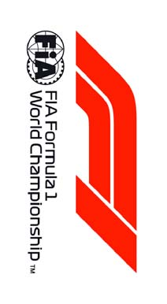
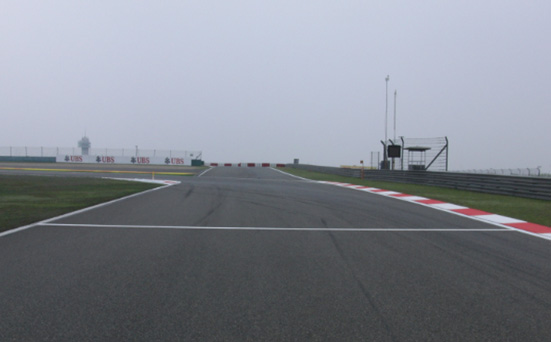
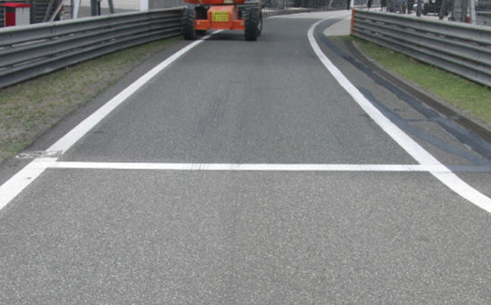
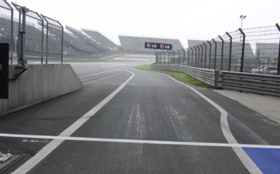
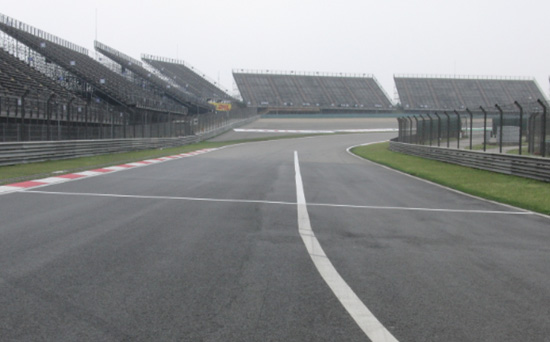

2018 CHINESE GRAND PRIX

12 - 15 April 2018

From The FIA Formula One Race Director Document 2

To All Teams, All Officials Date 12 April 2018

Time 09:00

Title Event Notes

Description Event Notes

Enclosed 2018_04_12_CHINESE_GP_EVENT_NOTES.pdf

Charlie Whiting

The FIA Formula One Race Director

2018 CHINESE GRAND PRIX

12-15 APRIL 2018

From The FIA Formula One Race Director Document 2

To Formula One Team Managers Date 12 April 2018

Time 09.00

EVENT NOTES

12 APRIL 2018

1) Matters arising from the Bahrain Grand Prix

2) Changes to the circuit

2.1 The concrete (inner) section of pit lane has been resurfaced.

2.2 Tube inserts have been placed in the tyre barriers at turns 1 and 8.

3) Pit lane map

3.1 Safety Car lines.

3.2 The location of the pit entry and the pit exit.

3.3 Designated garage areas.

3.4 Safety Car position for first lap and rest of race.

3.5 Blue flag marshal at the pit exit.

3.6 Track light panels displaying pit entry status.

4) Pirelli Event Preview

4.1 With reference to Article 24.4(a) of the Sporting Regulations see the attached document provided by the official tyre supplier.

5) Weighing and weighing platform

5.1 The FIA weighing platform will be available for teams to use at the following times, however, no more than 10 team personnel may be present during any visit. Each visit should last no more than 10 minutes unless no other team is waiting in the pit lane :

1/4

a) From 10.30 Thursday until 13.30 on Saturday (between 12.00 and 13.30 each visit will be restricted to five minutes).

b) From when the cars are returned to the teams after qualifying until 18.30 on Saturday.

c) From 09.10 until 13.10 on Sunday.

Any team found to be abusing the time limits set out above, which we will be enforced by FIA security personnel and our own CCTV, will not be permitted to use the weighbridge again during the Event.

6) Red zones for photographers in the pit lane during sessions

6.1 See the attached drawing.

7) Practice starts

7.1 Practice starts during sessions may only be carried out on the right at the pit exit before the end of the pit wall. Drivers must leave adequate room on their left for another driver to pass.

7.2 For reasons of safety and sporting equity, cars may not stop in the fast lane at any time the pit exit is open without a justifiable reason (a practice start is not considered a justifiable reason).

8) Lines, bollards and flags at the pit entry and pit exit

8.1 In accordance with Chapter 4 (Section 5) of Appendix L to the ISC drivers must keep to the right of the white line at the pit exit when leaving the pits, no part of any car leaving the pits may cross this line.

8.2 For safety reasons drivers must keep to the right of the bollard at the pit entry.

8.3 The dotted white line across the pit exit is the track edge.

8.4 If there is a yellow flag waved on the driver’s right at the beginning of the pit entry it will be warning of an incident around the corner of the pit entry. This flag is not intended for drivers staying on the track and competing a lap.

9) DRS

9.1 DRS will be globally disabled if panels 1, 16, 17, 19 or 20 are displaying yellow.

9.2 Detection will be automatically disabled if the light panels below are displaying yellow :

Zone 1 : Panels 13, 14 or 15.

Zone 2 : Panel 18.

9.3 If automatic detection is not working , and permission has been given by race control to use manual detection, DRS should not be used in the relevant zone if panels 13, 14, 15 or 18 are displaying yellow.

10) Observing yellow flags during free practice and qualifying

10.1 Double waved : Any driver passing through a double waved yellow marshalling sector must reduce speed significantly and be prepared to change direction or stop. In order for the stewards to be satisfied that any such driver has complied with these requirements it must be clear that he has not attempted to set a meaningful lap time, for practical purposes this means the driver should abandon the lap (this does not necessarily mean he has to pit as the track could well be clear the following lap).

2/4

10.2 Single waved : Drivers should reduce their speed and be prepared to change direction. It must be clear that a driver has reduced speed and, in order for this to be clear, a driver would be expected to have braked earlier and/or discernibly reduced speed in the relevant marshalling sector.

Drivers should not overtake any car in a single waved yellow marshalling sector unless it is clear that a car is slowing with a completely obvious problem, e.g. obvious accident damage or a deflated tyre.

11) Track light panels

11.1 The FIA track light panels have been installed in the positions shown on the circuit map. In accordance with Appendix H to the ISC the light signals have the same meaning as flag signals.

12) Drivers leaving their pit stop position in the pit lane

12.1 For safety reasons, no car should be driven from its pit stop position at any time unless :

a) It has first been driven into the pit stop position having just entered the pit lane from the track, and ;

b) It is then driven immediately back onto the track from the pit stop position.

13) Fire extinguishers around the circuit

13.1 Indicated by small fluorescent orange boards.

14) Places to remove cars from the track

14.1 Indicated by fluorescent orange panels on the walls or guardrails.

15) Support races

15.1 Teams are asked to keep their barriers no more than five metres from the garages during the support race sessions and races.

16) In laps and reconnaissance laps

16.1 In order to ensure that cars are not driven unnecessarily slowly on in laps during and after the end of qualifying or during reconnaissance laps when the pit exit is opened for the race, drivers must stay below the maximum time set by the FIA between the Safety Car lines shown on the pit lane map.

You will be informed of the maximum time after the first day of practice.

17) Post qualifying parc fermé

17.1 The cameras should be installed and operated in the same way as 2017.

18) Operational personnel curfew

18.1 Boards warning anyone attempting to enter the paddock that the curfew is in operation will be placed immediately before the entry turnstiles at the appropriate times.

19) Removing cars from the grid

19.1 Two gates in the pit wall, beside grid positions 5 and 18.

3/4

20) Car number light panels for the start

20.1 On the driver’s right.

21) Track light panels displaying pit entry status

21.1 The light panel indicated on the pit lane map will display a flashing yellow arrow if cars are required to use the pit lane once the Safety Car has been deployed during the race.

21.2 The light panel indicated on the pit lane map will display a flashing red cross if the pit lane is closed at any point during the race.

22) Lapping during the race

22.1 The ISC requires drivers who are caught by another car about to lap him to allow the faster driver past at the first available opportunity. The F1 Marshalling System has been developed in order to ensure that the point at which a driver is shown blue flags is consistent, rather than trusting the ability of marshals to identify situations that require blue flags.

As it was at the end of last season the system will be set to give a pre-warning when the faster car is within 3.0s of the car about to be lapped, this should be used by the team of the slower car to warn their driver he is soon going to be lapped and that allowing the faster car through should be considered a priority. When the faster car is within 1.2s of the car about to be lapped blue flags will be shown to the slower car (in addition to blue light panels, blue cockpit lights and a message on the timing monitors) and the driver must allow the following driver to overtake at the first available opportunity.

It should be noted that the aim of using F1MS is ensure consistent application of the rules, additional instructions may also be given by race control when necessary.

23) Post race parc fermé

23.1 All cars must enter the pit lane and proceed directly to the weighing area.

24) Any other business

Charlie Whiting FIA Formula One Race Director

4/4

|  |  | GrandPrixofChina 13-15/04/2018(18R03SHA) |  |  |  |  |  |  |  |
| --- | --- | --- | --- | --- | --- | --- | --- | --- | --- |
|  |  | Compound |  | FL | FR | RL | RR |  | Mandatoryracetyres |
|  |  | MEDIUM |  | M60 | M62 | M70 | M72 |  | MEDIUM |
|  |  | SOFT |  | S60 | S62 | S70 | S72 |  | SOFT |
|  |  | ULTRASOFT |  | U60 | U62 | U70 | U72 |  |  |
|  |  | INTERMEDIATEBASE |  | I37 | I38 | I39 | I40 |  | Q3tyre |
|  |  | WETSOFT Cross-Overtime MINIMUMSTARTINGPRESSURE,BLISTERINGSENSITIVITY,CAMBERLIMIT |  | W37 WET>119%>INT>113%>DRY | W38 Front(psi) | W39 | W40 | Rear(psi) | ULTRASOFT |
|  |  |  | Slicks |  | 21.0 |  |  | 20.0 |  |
|  |  |  | Intermediate |  | 19.0 |  |  | 18.0 |  |
|  |  |  | Wet |  | 18.0 |  |  | 17.0 |  |
| FEEOSCamberlimit REEOSCamberlimit -3.50° -2.00° FEBlistering REBlistering sensitivity sensitivity Low Low |  | TYREHEATINGSTRATEGY |  |  |  |  |  |  |  |
| Storagetemperature: Optimumtimein Storagetemperature: Optimumtimein blanket(@80°): blanket(@60°): 60°C 40°C 2h 1h SLICKS INTER Maximumboost Blankettimewindow Maximumboost Blankettimewindow temperature (@80°): temperature (@60°): 1h@110°C 1hto3h 30min@80°C 30minto2h Storagetemperature: Optimumtimein blanket(@60°): 40°C 1h WET Blankettimewindow NOBOOST (@60°): 30minto2h GENERALNOTES TeamsarekindlyremindedthatthefollowingparameterswillbesubjectedtoFIAchecksduringtheevent: -Startingpressure. -Camberatmaximumspeed. -Maximumblankettemperature. -Tyreswapping. | TyreNotes |  |  |  |  |  |  |  |  |
| භEŽƚƉĞƌŵŝƩĞĚƚŽƐǁŝƚĐŚƚLJƌĞƐĨƌŽŵƚŚĞŝƌŽƌŝŐŝŶĂůůLJĂůůŽĐĂƚĞĚƉŽƐŝƟŽŶ͘ Storage Temp˚C is the recommended temperature the tyre can stay in blankets without time limit.Alltemperaturelimitsapplytotheactualtyresurfacetemperature,measuredwiththeIR භŽŶŽƚƐƵďũĞĐƚƚLJƌĞƐƚŽůĂƌŐĞĚĞĨŽƌŵĂƟŽŶŽƌŚĞĂǀLJŝŵƉĂĐƚ͘ gundetailedinTD029-15. භŽŶŽƚůĞĂǀĞĮƩĞĚƚLJƌĞƐĞdžƉŽƐĞĚĂƚĂŶĂŝƌƚĞŵƉĞƌĂƚƵƌĞůŽǁĞƌƚŚĂŶϭϱΣ SIDEWALLSHEATINGCLARIFICATION(ALLPRODUCTS):youareallowedtoapplyamax. and/oranyUVemission. temperatureof100°Cformax.1hrtothesidewallsaslongasthemax.temp/timeatanypart භZĞǀŝƐĞĚƉƌĞƐĐƌŝƉƟŽŶƐĐŽƵůĚďĞŝƐƐƵĞĚĚƵƌŝŶŐƚŚĞƌĂĐĞǁĞĞŬĞŶĚŝŶ ofthetreadistheonedescribedinthecorrespondingsectionabove. accordancewithTD/007-16. | භEŽƚƉĞƌŵŝƩĞĚƚŽƐǁŝƚĐŚƚLJƌĞƐĨƌŽŵƚŚĞŝƌŽƌŝŐŝŶĂůůLJĂůůŽĐĂƚĞĚƉŽƐŝƟŽŶ͘ භŽŶŽƚƐƵďũĞĐƚƚLJƌĞƐƚŽůĂƌŐĞĚĞĨŽƌŵĂƟŽŶŽƌŚĞĂǀLJŝŵƉĂĐƚ͘ භŽŶŽƚůĞĂǀĞĮƩĞĚƚLJƌĞƐĞdžƉŽƐĞĚĂƚĂŶĂŝƌƚĞŵƉĞƌĂƚƵƌĞůŽǁĞƌƚŚĂŶϭϱΣ and/oranyUVemission. භZĞǀŝƐĞĚƉƌĞƐĐƌŝƉƟŽŶƐĐŽƵůĚďĞŝƐƐƵĞĚĚƵƌŝŶŐƚŚĞƌĂĐĞǁĞĞŬĞŶĚŝŶ accordancewithTD/007-16. |  |  |  |  | Storage Temp˚C is the recommended temperature the tyre can stay in blankets without time limit.Alltemperaturelimitsapplytotheactualtyresurfacetemperature,measuredwiththeIR gundetailedinTD029-15. SIDEWALLSHEATINGCLARIFICATION(ALLPRODUCTS):youareallowedtoapplyamax. temperatureof100°Cformax.1hrtothesidewallsaslongasthemax.temp/timeatanypart ofthetreadistheonedescribedinthecorrespondingsectionabove. |  |  |  |

enaL yrtnE sutatS lenap

tiP 8102 tiP lirpA 21– X 1 eniL noisreV

| A | AIF |  |
| --- | --- | --- |
| B | AIF | saerA detangiseD egaraG |
| C | AIF |  |
| 1 | MOF |  |
| 2 | sedecreM |  |
| 3 | sedecreM | sedecreM |
| 4 | sedecreM |  |
| 5 | irarreF |  |
| 6 | irarreF | irarreF |
| 7 | irarreF |  |
| 8 | lluB deR | lluB deR |
| 9 | lluB deR |  |
| 01 | lluB deR |  |
| 11 | aidnI ecroF |  |
| 21 | aidnI ecroF | aidnI ecroF |
| 31 | aidnI ecroF |  |
| 41 | smailliW | smailliW |
| 51 | smailliW |  |
| 61 | smailliW |  |
| 71 | tluaneR | tluaneR |
| 81 | tluaneR |  |
| 91 | tluaneR |  |
| 02 | ossoR oroT | ossoR oroT |
| 12 | ossoR oroT |  |
| 22 | ossoR oroT |  |
| 32 | saaH | saaH |
| 42 | saaH |  |
| 52 | saaH / neraLcM |  |
| 62 | neraLcM | neraLcM |
| 72 | neraLcM |  |
| 82 | rebuaS |  |
| 92 | rebuaS | rebuaS |
| 03 | rebuaS |  |
| 13 | illeriP |  |
| 23 | illeriP |  |
| 33 | ecneirepxE 1F |  |

lortnoC RAC paL YTEFAS tsriF

ENAL lennosreP )YLNO MORF EREH YRTNE 1 eniL tratS DEREVOCER TSAF DECALP TIP RAC maeT ecaR( YTEFAS KCART SRAC

xirP

dnarG stratS noitisoP ENAL

esenihC TIP eloP

8102 segaraG

1F

sdnE

ENAL

TIP

ENAL

RAC TSAF YTEFAS ecaR 2 eniL

RAC

YTEFAS

TIXE GALF TIP lahsraM

EULB

potS

tiP
