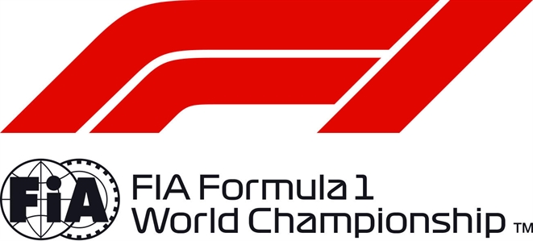

FORMULA 1 PIRELLI GRAND PRIX DE FRANCE 2018 - Le Castellet

Race History Chart

LAP 1 GAP TIME LAP 2 GAP TIME LAP 3 GAP TIME LAP 4 GAP TIME LAP 5 GAP TIME

| 44 |  | 2:09.395 |
| --- | --- | --- |
| 33 | 1.557 | 2:10.952 |
| 55 | 3.031 | 2:12.426 |
| 3 | 4.309 | 2:13.704 |
| 20 | 5.468 | 2:14.863 |
| 16 | 6.638 | 2:16.033 |
| 7 | 7.246 | 2:16.641 |
| 8 | 8.384 | 2:17.779 |
| 11 | 9.458 | 2:18.853 |
| 27 | 11.388 | 2:20.783 |
| 9 | 12.211 | 2:21.606 |
| 2 | 23.725 | 2:33.120 |
| 28 | 26.003 | 2:35.398 |
| 18 | PIT | 2:46.147 |
| 35 | PIT | 2:54.616 |
| 14 | PIT | 2:55.624 |
| 5 | PIT | 3:01.679 |
| 77 | PIT | 3:39.223 |

| 44 |  | 2:38.989 |
| --- | --- | --- |
| 33 | 1.338 | 2:38.770 |
| 55 | 2.497 | 2:38.455 |
| 3 | 3.698 | 2:38.378 |
| 20 | 4.771 | 2:38.292 |
| 16 | 6.213 | 2:38.564 |
| 7 | 7.670 | 2:39.413 |
| 8 | 9.320 | 2:39.925 |
| 11 | 11.365 | 2:40.896 |
| 27 | 12.732 | 2:40.333 |
| 9 | 14.807 | 2:41.585 |
| 2 | 16.479 | 2:31.743 |
| 28 | 17.814 | 2:30.800 |
| 18 | 19.029 | 2:21.266 |
| 35 | 20.628 | 2:14.396 |
| 14 | 22.320 | 2:15.080 |
| 5 | 23.196 | 2:09.901 |
| 77 | 43.292 | 1:52.453 |

| 44 |  | 2:29.156 |
| --- | --- | --- |
| 33 | 1.088 | 2:28.906 |
| 55 | 2.481 | 2:29.140 |
| 3 | 3.469 | 2:28.927 |
| 20 | 4.305 | 2:28.690 |
| 16 | 6.309 | 2:29.252 |
| 7 | 6.837 | 2:28.323 |
| 8 | 8.819 | 2:28.655 |
| 11 | 9.786 | 2:27.577 |
| 27 | 12.038 | 2:28.462 |
| 9 | 14.071 | 2:28.420 |
| 2 | 15.544 | 2:28.221 |
| 28 | 17.722 | 2:29.064 |
| 18 | 18.783 | 2:28.910 |
| 35 | 20.268 | 2:28.796 |
| 14 | 21.092 | 2:27.928 |
| 5 | 22.627 | 2:28.587 |
| 77 | 23.421 | 2:09.285 |

| 44 |  | 2:29.223 |
| --- | --- | --- |
| 33 | 0.938 | 2:29.073 |
| 55 | 2.043 | 2:28.785 |
| 3 | 3.191 | 2:28.945 |
| 20 | 4.489 | 2:29.407 |
| 16 | 5.740 | 2:28.654 |
| 7 | 6.880 | 2:29.266 |
| 8 | 8.729 | 2:29.133 |
| 11 | 9.983 | 2:29.420 |
| 27 | 11.807 | 2:28.992 |
| 9 | 14.380 | 2:29.532 |
| 2 | 16.734 | 2:30.413 |
| 28 | 19.784 | 2:31.285 |
| 18 | 21.982 | 2:32.422 |
| 35 | 23.310 | 2:32.265 |
| 14 | 24.669 | 2:32.800 |
| 5 | 26.322 | 2:32.918 |
| 77 | 27.629 | 2:33.431 |

| 44 |  | 2:24.134 |
| --- | --- | --- |
| 33 | 0.873 | 2:24.069 |
| 55 | 1.261 | 2:23.352 |
| 3 | 1.797 | 2:22.740 |
| 20 | 2.382 | 2:22.027 |
| 16 | 2.612 | 2:21.006 |
| 7 | 3.039 | 2:20.293 |
| 8 | 3.855 | 2:19.260 |
| 11 | 4.335 | 2:18.486 |
| 27 | 4.861 | 2:17.188 |
| 9 | 5.471 | 2:15.225 |
| 2 | 5.841 | 2:13.241 |
| 28 | 6.670 | 2:11.020 |
| 18 | 7.515 | 2:09.667 |
| 35 | 7.709 | 2:08.533 |
| 14 | 8.106 | 2:07.571 |
| 5 | 8.524 | 2:06.336 |
| 77 | 8.928 | 2:05.433 |

Page 1 of 11

© 2018 Formula One World Championship Limited The F1 FORMULA 1 logo, F1 logo, FORMULA 1, FORMULA ONE, F1, FIA FORMULA ONE WORLD CHAMPIONSHIP, GRAND PRIX and related marks are trade marks of Formula One Licensing BV, a Formula 1 company. The FIA logo is a trade mark of the Fédération Internationale de l’Automobile. All rights reserved. No part of these results/data may be reproduced, stored in a retrieval system or transmitted in any form or by any means electronic, mechanical, photocopying, recording, broadcasting or otherwise without prior permission of the copyright holder except for reproduction in local/national/international daily press and regular printed publications on sale to the public within 90 days of the event to which the results/data relate and provided that the copyright symbol and name of copyright owner appears.

FORMULA 1 PIRELLI GRAND PRIX DE FRANCE 2018 - Le Castellet

Race History Chart

LAP 6 GAP TIME LAP 7 GAP TIME LAP 8 GAP TIME LAP 9 GAP TIME LAP 10 GAP TIME

| 44 |  | 1:37.688 |
| --- | --- | --- |
| 33 | 1.240 | 1:38.055 |
| 55 | 2.569 | 1:38.996 |
| 3 | 3.030 | 1:38.921 |
| 20 | 4.894 | 1:40.200 |
| 7 | 5.197 | 1:39.846 |
| 16 | 6.594 | 1:41.670 |
| 8 | 6.736 | 1:40.569 |
| 11 | 7.489 | 1:40.842 |
| 27 | 8.040 | 1:40.867 |
| 9 | 9.018 | 1:41.235 |
| 2 | 9.476 | 1:41.323 |
| 28 | 10.322 | 1:41.340 |
| 18 | 11.257 | 1:41.430 |
| 5 | 11.523 | 1:40.687 |
| 77 | 12.117 | 1:40.877 |
| 35 | 13.228 | 1:43.207 |
| 14 | 18.967 | 1:48.549 |

| 44 |  | 1:37.454 |
| --- | --- | --- |
| 33 | 1.514 | 1:37.728 |
| 55 | 3.866 | 1:38.751 |
| 3 | 4.561 | 1:38.985 |
| 20 | 6.612 | 1:39.172 |
| 7 | 7.061 | 1:39.318 |
| 16 | 9.600 | 1:40.460 |
| 8 | 10.440 | 1:41.158 |
| 11 | 11.624 | 1:41.589 |
| 27 | 12.026 | 1:41.440 |
| 9 | 13.952 | 1:42.388 |
| 2 | 13.993 | 1:41.971 |
| 5 | 14.080 | 1:40.011 |
| 28 | 14.987 | 1:42.119 |
| 18 | 15.898 | 1:42.095 |
| 77 | 16.308 | 1:41.645 |
| 35 | 17.359 | 1:41.585 |
| 14 | 21.091 | 1:39.578 |

| 44 |  | 1:36.933 |
| --- | --- | --- |
| 33 | 2.127 | 1:37.546 |
| 55 | 5.860 | 1:38.927 |
| 3 | 6.324 | 1:38.696 |
| 7 | 8.207 | 1:38.079 |
| 20 | 9.850 | 1:40.171 |
| 16 | 11.959 | 1:39.292 |
| 8 | 12.538 | 1:39.031 |
| 11 | 14.185 | 1:39.494 |
| 27 | 14.593 | 1:39.500 |
| 2 | 17.979 | 1:40.919 |
| 5 | 18.297 | 1:41.150 |
| 9 | 19.831 | 1:42.812 |
| 77 | 20.232 | 1:40.857 |
| 28 | 21.162 | 1:43.108 |
| 18 | 21.729 | 1:42.764 |
| 35 | 22.383 | 1:41.957 |
| 14 | 23.766 | 1:39.608 |

| 44 |  | 1:37.385 |
| --- | --- | --- |
| 33 | 2.330 | 1:37.588 |
| 3 | 7.220 | 1:38.281 |
| 55 | 8.622 | 1:40.147 |
| 7 | 9.124 | 1:38.302 |
| 20 | 12.159 | 1:39.694 |
| 16 | 14.113 | 1:39.539 |
| 8 | 14.774 | 1:39.621 |
| 11 | 16.165 | 1:39.365 |
| 27 | 17.060 | 1:39.852 |
| 5 | 19.144 | 1:38.232 |
| 2 | 21.557 | 1:40.963 |
| 77 | 22.601 | 1:39.754 |
| 28 | 24.470 | 1:40.693 |
| 9 | 25.400 | 1:42.954 |
| 18 | 26.107 | 1:41.763 |
| 35 | 26.789 | 1:41.791 |
| 14 | 27.229 | 1:40.848 |

| 44 |  | 1:37.461 |
| --- | --- | --- |
| 33 | 2.625 | 1:37.756 |
| 3 | 7.757 | 1:37.998 |
| 7 | 9.745 | 1:38.082 |
| 55 | 11.430 | 1:40.269 |
| 20 | 14.179 | 1:39.481 |
| 16 | 16.218 | 1:39.566 |
| 8 | 17.376 | 1:40.063 |
| 11 | 18.627 | 1:39.923 |
| 27 | 19.668 | 1:40.069 |
| 5 | 20.143 | 1:38.460 |
| 2 | 24.182 | 1:40.086 |
| 77 | 24.827 | 1:39.687 |
| 28 | 27.339 | 1:40.330 |
| 9 | 28.902 | 1:40.963 |
| 18 | 29.813 | 1:41.167 |
| 35 | 30.680 | 1:41.352 |
| 14 | 31.232 | 1:41.464 |

Page 2 of 11

© 2018 Formula One World Championship Limited The F1 FORMULA 1 logo, F1 logo, FORMULA 1, FORMULA ONE, F1, FIA FORMULA ONE WORLD CHAMPIONSHIP, GRAND PRIX and related marks are trade marks of Formula One Licensing BV, a Formula 1 company. The FIA logo is a trade mark of the Fédération Internationale de l’Automobile. All rights reserved. No part of these results/data may be reproduced, stored in a retrieval system or transmitted in any form or by any means electronic, mechanical, photocopying, recording, broadcasting or otherwise without prior permission of the copyright holder except for reproduction in local/national/international daily press and regular printed publications on sale to the public within 90 days of the event to which the results/data relate and provided that the copyright symbol and name of copyright owner appears.

FORMULA 1 PIRELLI GRAND PRIX DE FRANCE 2018 - Le Castellet

Race History Chart

LAP 11 GAP TIME LAP 12 GAP TIME LAP 13 GAP TIME LAP 14 GAP TIME LAP 15 GAP TIME

| 44 |  | 1:37.498 |
| --- | --- | --- |
| 33 | 2.831 | 1:37.704 |
| 3 | 7.847 | 1:37.588 |
| 7 | 10.296 | 1:38.049 |
| 55 | 13.460 | 1:39.528 |
| 20 | 15.943 | 1:39.262 |
| 16 | 18.084 | 1:39.364 |
| 8 | 20.084 | 1:40.206 |
| 11 | 21.184 | 1:40.055 |
| 5 | 21.936 | 1:39.291 |
| 27 | 23.100 | 1:40.930 |
| 77 | 25.923 | 1:38.594 |
| 2 | 27.664 | 1:40.980 |
| 28 | 30.086 | 1:40.245 |
| 9 | 31.638 | 1:40.234 |
| 18 | 33.092 | 1:40.777 |
| 14 | 34.436 | 1:40.702 |
| 35 | 35.396 | 1:42.214 |

| 44 |  | 1:37.342 |
| --- | --- | --- |
| 33 | 2.944 | 1:37.455 |
| 3 | 7.803 | 1:37.298 |
| 7 | 10.690 | 1:37.736 |
| 55 | 15.452 | 1:39.334 |
| 20 | 18.178 | 1:39.577 |
| 16 | 20.125 | 1:39.383 |
| 8 | 22.555 | 1:39.813 |
| 11 | 23.833 | 1:39.991 |
| 5 | 24.232 | 1:39.638 |
| 27 | 25.670 | 1:39.912 |
| 77 | 27.511 | 1:38.930 |
| 2 | 30.406 | 1:40.084 |
| 28 | 32.516 | 1:39.772 |
| 9 | 34.666 | 1:40.370 |
| 18 | 36.015 | 1:40.265 |
| 14 | 37.250 | 1:40.156 |
| 35 | 39.177 | 1:41.123 |

| 44 |  | 1:37.019 |
| --- | --- | --- |
| 33 | 3.327 | 1:37.402 |
| 3 | 7.810 | 1:37.026 |
| 7 | 11.135 | 1:37.464 |
| 55 | 17.553 | 1:39.120 |
| 20 | 19.873 | 1:38.714 |
| 16 | 21.607 | 1:38.501 |
| 8 | 25.037 | 1:39.501 |
| 5 | 25.732 | 1:38.519 |
| 11 | 27.245 | 1:40.431 |
| 27 | 27.954 | 1:39.303 |
| 77 | 28.903 | 1:38.411 |
| 2 | 32.627 | 1:39.240 |
| 28 | 35.002 | 1:39.505 |
| 9 | 37.859 | 1:40.212 |
| 18 | 39.494 | 1:40.498 |
| 14 | 40.140 | 1:39.909 |
| 35 | 42.008 | 1:39.850 |

| 44 |  | 1:36.985 |
| --- | --- | --- |
| 33 | 3.755 | 1:37.413 |
| 3 | 7.926 | 1:37.101 |
| 7 | 11.563 | 1:37.413 |
| 55 | 19.424 | 1:38.856 |
| 20 | 21.723 | 1:38.835 |
| 16 | 23.267 | 1:38.645 |
| 5 | 26.391 | 1:37.644 |
| 8 | 28.200 | 1:40.148 |
| 27 | 29.509 | 1:38.540 |
| 11 | 30.846 | 1:40.586 |
| 77 | 31.263 | 1:39.345 |
| 2 | 35.287 | 1:39.645 |
| 28 | 37.661 | 1:39.644 |
| 9 | 40.810 | 1:39.936 |
| 18 | 42.530 | 1:40.021 |
| 14 | 43.197 | 1:40.042 |
| 35 | 44.878 | 1:39.855 |

| 44 |  | 1:36.964 |
| --- | --- | --- |
| 33 | 3.942 | 1:37.151 |
| 3 | 8.017 | 1:37.055 |
| 7 | 11.822 | 1:37.223 |
| 55 | 21.275 | 1:38.815 |
| 20 | 23.468 | 1:38.709 |
| 16 | 25.027 | 1:38.724 |
| 5 | 26.785 | 1:37.358 |
| 8 | 30.534 | 1:39.298 |
| 27 | 31.159 | 1:38.614 |
| 77 | 34.108 | 1:39.809 |
| 11 | 35.345 | 1:41.463 |
| 2 | 37.697 | 1:39.374 |
| 28 | 40.320 | 1:39.623 |
| 9 | 43.349 | 1:39.503 |
| 18 | 45.450 | 1:39.884 |
| 14 | 46.055 | 1:39.822 |
| 35 | 47.889 | 1:39.975 |

Page 3 of 11

© 2018 Formula One World Championship Limited The F1 FORMULA 1 logo, F1 logo, FORMULA 1, FORMULA ONE, F1, FIA FORMULA ONE WORLD CHAMPIONSHIP, GRAND PRIX and related marks are trade marks of Formula One Licensing BV, a Formula 1 company. The FIA logo is a trade mark of the Fédération Internationale de l’Automobile. All rights reserved. No part of these results/data may be reproduced, stored in a retrieval system or transmitted in any form or by any means electronic, mechanical, photocopying, recording, broadcasting or otherwise without prior permission of the copyright holder except for reproduction in local/national/international daily press and regular printed publications on sale to the public within 90 days of the event to which the results/data relate and provided that the copyright symbol and name of copyright owner appears.

FORMULA 1 PIRELLI GRAND PRIX DE FRANCE 2018 - Le Castellet

Race History Chart

LAP 16 GAP TIME LAP 17 GAP TIME LAP 18 GAP TIME LAP 19 GAP TIME LAP 20 GAP TIME

| 44 |  | 1:37.029 |
| --- | --- | --- |
| 33 | 4.047 | 1:37.134 |
| 3 | 8.059 | 1:37.071 |
| 7 | 11.562 | 1:36.769 |
| 55 | 23.079 | 1:38.833 |
| 20 | 25.353 | 1:38.914 |
| 16 | 26.749 | 1:38.751 |
| 5 | 27.318 | 1:37.562 |
| 27 | 32.333 | 1:38.203 |
| 8 | 33.727 | 1:40.222 |
| 77 | 35.192 | 1:38.113 |
| 11 | 37.355 | 1:39.039 |
| 2 | 39.900 | 1:39.232 |
| 28 | 42.941 | 1:39.650 |
| 9 | 45.669 | 1:39.349 |
| 18 | 47.987 | 1:39.566 |
| 14 | 48.715 | 1:39.689 |
| 35 | 50.544 | 1:39.684 |

| 44 |  | 1:36.637 |
| --- | --- | --- |
| 33 | 4.369 | 1:36.959 |
| 3 | 8.347 | 1:36.925 |
| 7 | 11.571 | 1:36.646 |
| 55 | 25.067 | 1:38.625 |
| 20 | 27.327 | 1:38.611 |
| 5 | 27.998 | 1:37.317 |
| 16 | 29.451 | 1:39.339 |
| 27 | 33.768 | 1:38.072 |
| 8 | 36.020 | 1:38.930 |
| 77 | 37.220 | 1:38.665 |
| 11 | 39.566 | 1:38.848 |
| 2 | 42.542 | 1:39.279 |
| 28 | 45.610 | 1:39.306 |
| 9 | 48.597 | 1:39.565 |
| 18 | 50.802 | 1:39.452 |
| 14 | 51.625 | 1:39.547 |
| 35 | 53.388 | 1:39.481 |

| 44 |  | 1:36.478 |
| --- | --- | --- |
| 33 | 4.640 | 1:36.749 |
| 3 | 8.683 | 1:36.814 |
| 7 | 12.351 | 1:37.258 |
| 55 | 27.342 | 1:38.753 |
| 5 | 28.836 | 1:37.316 |
| 20 | 30.472 | 1:39.623 |
| 16 | 31.666 | 1:38.693 |
| 27 | 35.468 | 1:38.178 |
| 8 | 38.408 | 1:38.866 |
| 77 | 39.286 | 1:38.544 |
| 11 | 41.849 | 1:38.761 |
| 2 | 45.211 | 1:39.147 |
| 28 | 48.538 | 1:39.406 |
| 9 | 51.464 | 1:39.345 |
| 14 | 54.131 | 1:38.984 |
| 18 | 54.941 | 1:40.617 |
| 35 | 56.650 | 1:39.740 |

| 44 |  | 1:36.448 |
| --- | --- | --- |
| 33 | 4.998 | 1:36.806 |
| 3 | 8.843 | 1:36.608 |
| 7 | 12.543 | 1:36.640 |
| 55 | 29.388 | 1:38.494 |
| 5 | 29.822 | 1:37.434 |
| 20 | 32.711 | 1:38.687 |
| 16 | 33.942 | 1:38.724 |
| 27 | 37.134 | 1:38.114 |
| 77 | 41.344 | 1:38.506 |
| 8 | 42.065 | 1:40.105 |
| 11 | 44.013 | 1:38.612 |
| 2 | 47.592 | 1:38.829 |
| 28 | 51.297 | 1:39.207 |
| 9 | 53.914 | 1:38.898 |
| 14 | 56.889 | 1:39.206 |
| 18 | 58.476 | 1:39.983 |
| 35 | 59.922 | 1:39.720 |

| 44 |  | 1:36.387 |
| --- | --- | --- |
| 33 | 5.565 | 1:36.954 |
| 3 | 9.018 | 1:36.562 |
| 7 | 12.905 | 1:36.749 |
| 5 | 30.622 | 1:37.187 |
| 55 | 32.594 | 1:39.593 |
| 20 | 34.930 | 1:38.606 |
| 16 | 35.935 | 1:38.380 |
| 27 | 38.727 | 1:37.980 |
| 77 | 43.002 | 1:38.045 |
| 8 | 45.087 | 1:39.409 |
| 11 | 46.522 | 1:38.896 |
| 2 | 49.843 | 1:38.638 |
| 28 | 53.975 | 1:39.065 |
| 9 | 56.347 | 1:38.820 |
| 14 | 59.301 | 1:38.799 |
| 18 | 61.460 | 1:39.371 |
| 35 | 63.061 | 1:39.526 |

Page 4 of 11

© 2018 Formula One World Championship Limited The F1 FORMULA 1 logo, F1 logo, FORMULA 1, FORMULA ONE, F1, FIA FORMULA ONE WORLD CHAMPIONSHIP, GRAND PRIX and related marks are trade marks of Formula One Licensing BV, a Formula 1 company. The FIA logo is a trade mark of the Fédération Internationale de l’Automobile. All rights reserved. No part of these results/data may be reproduced, stored in a retrieval system or transmitted in any form or by any means electronic, mechanical, photocopying, recording, broadcasting or otherwise without prior permission of the copyright holder except for reproduction in local/national/international daily press and regular printed publications on sale to the public within 90 days of the event to which the results/data relate and provided that the copyright symbol and name of copyright owner appears.

FORMULA 1 PIRELLI GRAND PRIX DE FRANCE 2018 - Le Castellet

Race History Chart

LAP 21 GAP TIME LAP 22 GAP TIME LAP 23 GAP TIME LAP 24 GAP TIME LAP 25 GAP TIME

| 44 |  | 1:36.877 |
| --- | --- | --- |
| 33 | 5.321 | 1:36.633 |
| 3 | 8.602 | 1:36.461 |
| 7 | 12.835 | 1:36.807 |
| 5 | 30.740 | 1:36.995 |
| 55 | 34.408 | 1:38.691 |
| 20 | 36.840 | 1:38.787 |
| 16 | 37.779 | 1:38.721 |
| 27 | 40.116 | 1:38.266 |
| 77 | 43.699 | 1:37.574 |
| 8 | 46.951 | 1:38.741 |
| 11 | 48.341 | 1:38.696 |
| 2 | 52.148 | 1:39.182 |
| 28 | 55.972 | 1:38.874 |
| 9 | 58.437 | 1:38.967 |
| 14 | 61.427 | 1:39.003 |
| 18 | 64.063 | 1:39.480 |
| 35 | 65.653 | 1:39.469 |

| 44 |  | 1:36.562 |
| --- | --- | --- |
| 33 | 5.561 | 1:36.802 |
| 3 | 8.505 | 1:36.465 |
| 7 | 13.018 | 1:36.745 |
| 5 | 30.984 | 1:36.806 |
| 55 | 36.690 | 1:38.844 |
| 20 | 38.802 | 1:38.524 |
| 16 | 39.701 | 1:38.484 |
| 27 | 41.987 | 1:38.433 |
| 77 | 44.557 | 1:37.420 |
| 8 | 49.116 | 1:38.727 |
| 11 | 50.509 | 1:38.730 |
| 2 | 54.460 | 1:38.874 |
| 28 | 58.283 | 1:38.873 |
| 9 | 60.914 | 1:39.039 |
| 14 | 63.742 | 1:38.877 |
| 18 | 66.546 | 1:39.045 |
| 35 | 68.016 | 1:38.925 |

| 44 |  | 1:36.375 |
| --- | --- | --- |
| 33 | 6.049 | 1:36.863 |
| 3 | 8.754 | 1:36.624 |
| 7 | 13.166 | 1:36.523 |
| 5 | 31.505 | 1:36.896 |
| 55 | 39.022 | 1:38.707 |
| 20 | 41.004 | 1:38.577 |
| 16 | 41.824 | 1:38.498 |
| 27 | 43.789 | 1:38.177 |
| 77 | 45.811 | 1:37.629 |
| 8 | 51.346 | 1:38.605 |
| 11 | 52.648 | 1:38.514 |
| 2 | 56.768 | 1:38.683 |
| 28 | 61.008 | 1:39.100 |
| 9 | 63.597 | 1:39.058 |
| 14 | 65.885 | 1:38.518 |
| 18 | 69.172 | 1:39.001 |
| 35 | 70.613 | 1:38.972 |

| 44 |  | 1:36.178 |
| --- | --- | --- |
| 33 | 6.917 | 1:37.046 |
| 3 | 9.223 | 1:36.647 |
| 7 | 13.699 | 1:36.711 |
| 5 | 31.990 | 1:36.663 |
| 55 | 41.295 | 1:38.451 |
| 20 | 42.957 | 1:38.131 |
| 27 | 45.543 | 1:37.932 |
| 16 | 46.800 | 1:41.154 |
| 77 | 48.004 | 1:38.371 |
| 8 | 53.692 | 1:38.524 |
| 11 | 55.325 | 1:38.855 |
| 2 | 59.307 | 1:38.717 |
| 28 | 63.602 | 1:38.772 |
| 9 | 66.256 | 1:38.837 |
| 14 | 68.138 | 1:38.431 |
| 18 | 71.907 | 1:38.913 |
| 35 | 73.433 | 1:38.998 |

| 44 |  | 1:36.364 |
| --- | --- | --- |
| 3 | 9.437 | 1:36.578 |
| 7 | 14.190 | 1:36.855 |
| 33 | PIT | 1:57.620 |
| 5 | 31.908 | 1:36.282 |
| 55 | 43.746 | 1:38.815 |
| 20 | 44.894 | 1:38.301 |
| 27 | 47.185 | 1:38.006 |
| 16 | 49.246 | 1:38.810 |
| 77 | 50.159 | 1:38.519 |
| 8 | 55.857 | 1:38.529 |
| 11 | 57.280 | 1:38.319 |
| 2 | 61.419 | 1:38.476 |
| 28 | 65.802 | 1:38.564 |
| 9 | 68.444 | 1:38.552 |
| 14 | 70.126 | 1:38.352 |
| 18 | 74.330 | 1:38.787 |
| 35 | 75.904 | 1:38.835 |

Page 5 of 11

© 2018 Formula One World Championship Limited The F1 FORMULA 1 logo, F1 logo, FORMULA 1, FORMULA ONE, F1, FIA FORMULA ONE WORLD CHAMPIONSHIP, GRAND PRIX and related marks are trade marks of Formula One Licensing BV, a Formula 1 company. The FIA logo is a trade mark of the Fédération Internationale de l’Automobile. All rights reserved. No part of these results/data may be reproduced, stored in a retrieval system or transmitted in any form or by any means electronic, mechanical, photocopying, recording, broadcasting or otherwise without prior permission of the copyright holder except for reproduction in local/national/international daily press and regular printed publications on sale to the public within 90 days of the event to which the results/data relate and provided that the copyright symbol and name of copyright owner appears.

FORMULA 1 PIRELLI GRAND PRIX DE FRANCE 2018 - Le Castellet

Race History Chart

LAP 26 GAP TIME LAP 27 GAP TIME LAP 28 GAP TIME LAP 29 GAP TIME LAP 30 GAP TIME

| 44 |  | 1:35.663 |
| --- | --- | --- |
| 3 | 10.566 | 1:36.792 |
| 7 | 15.558 | 1:37.031 |
| 33 | 31.713 | 1:39.203 |
| 5 | 33.428 | 1:37.183 |
| 20 | 47.803 | 1:38.572 |
| 27 | 49.513 | 1:37.991 |
| 16 | 52.070 | 1:38.487 |
| 77 | 52.889 | 1:38.393 |
| 8 | 58.618 | 1:38.424 |
| 11 | 60.098 | 1:38.481 |
| 2 | 64.244 | 1:38.488 |
| 28 | 68.813 | 1:38.674 |
| 55 | PIT | 2:00.939 |
| 9 | 71.546 | 1:38.765 |
| 14 | 72.902 | 1:38.439 |
| 18 | 77.561 | 1:38.894 |
| 35 | 78.953 | 1:38.712 |

| 44 |  | 1:35.793 |
| --- | --- | --- |
| 3 | 11.973 | 1:37.200 |
| 7 | 16.502 | 1:36.737 |
| 33 | 31.834 | 1:35.914 |
| 5 | 34.153 | 1:36.518 |
| 20 | 49.913 | 1:37.903 |
| 27 | 51.861 | 1:38.141 |
| 16 | 54.754 | 1:38.477 |
| 77 | 55.359 | 1:38.263 |
| 8 | 61.234 | 1:38.409 |
| 11 | 62.785 | 1:38.480 |
| 2 | 66.847 | 1:38.396 |
| 28 | 71.614 | 1:38.594 |
| 55 | 73.509 | 1:40.280 |
| 9 | 75.215 | 1:39.462 |
| 14 | 76.058 | 1:38.949 |
| 18 | 80.347 | 1:38.579 |
| 35 | 81.850 | 1:38.690 |

| 44 |  | 1:35.983 |
| --- | --- | --- |
| 7 | 17.415 | 1:36.896 |
| 33 | 31.797 | 1:35.946 |
| 3 | PIT | 1:57.778 |
| 5 | 34.728 | 1:36.558 |
| 27 | 53.778 | 1:37.900 |
| 77 | 57.135 | 1:37.759 |
| 16 | 58.509 | 1:39.738 |
| 8 | 63.410 | 1:38.159 |
| 2 | 69.125 | 1:38.261 |
| 20 | PIT | 1:59.864 |
| 28 | 74.228 | 1:38.597 |
| 55 | 74.721 | 1:37.195 |
| 9 | 78.065 | 1:38.833 |
| 14 | 78.425 | 1:38.350 |
| 18 | 82.984 | 1:38.620 |
| 35 | 84.555 | 1:38.688 |

| 44 |  | 1:35.859 |
| --- | --- | --- |
| 7 | 18.282 | 1:36.726 |
| 33 | 31.644 | 1:35.706 |
| 5 | 35.385 | 1:36.516 |
| 3 | 37.727 | 1:39.818 |
| 27 | 55.534 | 1:37.615 |
| 77 | 58.684 | 1:37.408 |
| 16 | 61.158 | 1:38.508 |
| 8 | 65.402 | 1:37.851 |
| 2 | 71.314 | 1:38.048 |
| 55 | 76.102 | 1:37.240 |
| 28 | 77.927 | 1:39.558 |
| 20 | 78.298 | 1:40.363 |
| 9 | 81.229 | 1:39.023 |
| 14 | 81.904 | 1:39.338 |
| 18 | 85.808 | 1:38.683 |
| 35 | 87.522 | 1:38.826 |

| 44 |  | 1:35.772 |
| --- | --- | --- |
| 7 | 19.354 | 1:36.844 |
| 33 | 31.629 | 1:35.757 |
| 5 | 35.937 | 1:36.324 |
| 3 | 38.023 | 1:36.068 |
| 27 | 57.526 | 1:37.764 |
| 77 | 60.035 | 1:37.123 |
| 16 | 64.328 | 1:38.942 |
| 8 | 67.653 | 1:38.023 |
| 2 | 73.858 | 1:38.316 |
| 55 | 77.731 | 1:37.401 |
| 20 | 80.100 | 1:37.574 |
| 28 | 81.939 | 1:39.784 |
| 9 | 84.049 | 1:38.592 |
| 14 | 84.740 | 1:38.608 |
| 18 | 88.839 | 1:38.803 |
| 35 | 90.461 | 1:38.711 |

Page 6 of 11

© 2018 Formula One World Championship Limited The F1 FORMULA 1 logo, F1 logo, FORMULA 1, FORMULA ONE, F1, FIA FORMULA ONE WORLD CHAMPIONSHIP, GRAND PRIX and related marks are trade marks of Formula One Licensing BV, a Formula 1 company. The FIA logo is a trade mark of the Fédération Internationale de l’Automobile. All rights reserved. No part of these results/data may be reproduced, stored in a retrieval system or transmitted in any form or by any means electronic, mechanical, photocopying, recording, broadcasting or otherwise without prior permission of the copyright holder except for reproduction in local/national/international daily press and regular printed publications on sale to the public within 90 days of the event to which the results/data relate and provided that the copyright symbol and name of copyright owner appears.

FORMULA 1 PIRELLI GRAND PRIX DE FRANCE 2018 - Le Castellet

Race History Chart

LAP 31 GAP TIME LAP 32 GAP TIME LAP 33 GAP TIME LAP 34 GAP TIME LAP 35 GAP TIME

| 44 |  | 1:36.277 |
| --- | --- | --- |
| 7 | 19.943 | 1:36.866 |
| 33 | 31.277 | 1:35.925 |
| 5 | 36.300 | 1:36.640 |
| 3 | 37.952 | 1:36.206 |
| 27 | 59.025 | 1:37.776 |
| 77 | 60.819 | 1:37.061 |
| 8 | 69.342 | 1:37.966 |
| 2 | 75.858 | 1:38.277 |
| 55 | 78.588 | 1:37.134 |
| 20 | 80.945 | 1:37.122 |
| 28 | 84.543 | 1:38.881 |
| 9 | 86.382 | 1:38.610 |
| 14 | 87.212 | 1:38.749 |
| 16 | PIT | 2:01.015 |
| 18 | 91.643 | 1:39.081 |
| 35 | 93.135 | 1:38.951 |

| 44 |  | 1:36.274 |
| --- | --- | --- |
| 7 | 20.423 | 1:36.754 |
| 33 | 30.601 | 1:35.598 |
| 5 | 36.338 | 1:36.312 |
| 3 | 37.569 | 1:35.891 |
| 27 | 60.770 | 1:38.019 |
| 77 | 61.813 | 1:37.268 |
| 8 | 70.518 | 1:37.450 |
| 2 | 77.438 | 1:37.854 |
| 55 | 79.481 | 1:37.167 |
| 20 | 81.789 | 1:37.118 |
| 28 | 86.622 | 1:38.353 |
| 9 | 88.783 | 1:38.675 |
| 14 | 89.562 | 1:38.624 |
| 16 | 92.773 | 1:39.981 |
| 18 | 94.768 | 1:39.399 |
| 35 | 96.033 | 1:39.172 |

| 7 |  | 1:36.525 |
| --- | --- | --- |
| 44 | PIT | 1:57.713 |
| 33 | 9.357 | 1:35.704 |
| 5 | 15.763 | 1:36.373 |
| 3 | 16.465 | 1:35.844 |
| 27 | 41.341 | 1:37.519 |
| 77 | 41.977 | 1:37.112 |
| 8 | 51.385 | 1:37.815 |
| 2 | 58.271 | 1:37.781 |
| 55 | 59.712 | 1:37.179 |
| 20 | 61.761 | 1:36.920 |
| 28 | 68.117 | 1:38.443 |
| 9 | 69.969 | 1:38.134 |
| 14 | 70.816 | 1:38.202 |
| 16 | 72.407 | 1:36.582 |
| 18 | 76.567 | 1:38.747 |
| 35 | 77.890 | 1:38.805 |

| 44 |  | 1:38.854 |
| --- | --- | --- |
| 33 | 5.319 | 1:35.581 |
| 3 | 12.524 | 1:35.678 |
| 5 | 13.601 | 1:37.457 |
| 7 | PIT | 1:58.187 |
| 77 | 39.290 | 1:36.932 |
| 27 | 40.261 | 1:38.539 |
| 2 | 56.415 | 1:37.763 |
| 55 | 57.084 | 1:36.991 |
| 20 | 59.080 | 1:36.938 |
| 28 | 66.705 | 1:38.207 |
| 9 | 68.501 | 1:38.151 |
| 14 | 69.475 | 1:38.278 |
| 16 | 69.845 | 1:37.057 |
| 18 | 75.326 | 1:38.378 |
| 8 | PIT | 2:04.504 |
| 35 | 76.593 | 1:38.322 |

| 44 |  | 1:35.348 |
| --- | --- | --- |
| 33 | 5.328 | 1:35.357 |
| 3 | 13.060 | 1:35.884 |
| 5 | 15.369 | 1:37.116 |
| 7 | 22.054 | 1:38.834 |
| 77 | 41.156 | 1:37.214 |
| 27 | 43.536 | 1:38.623 |
| 55 | 58.850 | 1:37.114 |
| 2 | 60.125 | 1:39.058 |
| 20 | 61.000 | 1:37.268 |
| 28 | 69.636 | 1:38.279 |
| 16 | 72.262 | 1:37.765 |
| 14 | 73.043 | 1:38.916 |
| 18 | 78.297 | 1:38.319 |
| 35 | 79.545 | 1:38.300 |
| 8 | 80.841 | 1:39.919 |
| 9 | PIT | 1:59.167 |

Page 7 of 11

© 2018 Formula One World Championship Limited The F1 FORMULA 1 logo, F1 logo, FORMULA 1, FORMULA ONE, F1, FIA FORMULA ONE WORLD CHAMPIONSHIP, GRAND PRIX and related marks are trade marks of Formula One Licensing BV, a Formula 1 company. The FIA logo is a trade mark of the Fédération Internationale de l’Automobile. All rights reserved. No part of these results/data may be reproduced, stored in a retrieval system or transmitted in any form or by any means electronic, mechanical, photocopying, recording, broadcasting or otherwise without prior permission of the copyright holder except for reproduction in local/national/international daily press and regular printed publications on sale to the public within 90 days of the event to which the results/data relate and provided that the copyright symbol and name of copyright owner appears.

FORMULA 1 PIRELLI GRAND PRIX DE FRANCE 2018 - Le Castellet

Race History Chart

LAP 36 GAP TIME LAP 37 GAP TIME LAP 38 GAP TIME LAP 39 GAP TIME LAP 40 GAP TIME

| 44 |  | 1:35.365 |
| --- | --- | --- |
| 33 | 5.118 | 1:35.155 |
| 3 | 13.176 | 1:35.481 |
| 5 | 16.880 | 1:36.876 |
| 7 | 21.499 | 1:34.810 |
| 77 | 41.981 | 1:36.190 |
| 27 | 46.427 | 1:38.256 |
| 55 | 60.485 | 1:37.000 |
| 2 | 62.865 | 1:38.105 |
| 20 | 63.419 | 1:37.784 |
| 28 | 72.401 | 1:38.130 |
| 16 | 73.776 | 1:36.879 |
| 14 | 76.196 | 1:38.518 |
| 18 | 82.169 | 1:39.237 |
| 8 | 82.290 | 1:36.814 |
| 35 | 84.019 | 1:39.839 |

| 44 |  | 1:35.744 |
| --- | --- | --- |
| 9 | 1 LAP | 1:41.258 |
| 33 | 4.584 | 1:35.210 |
| 3 | 12.814 | 1:35.382 |
| 5 | 18.621 | 1:37.485 |
| 7 | 20.792 | 1:35.037 |
| 77 | 42.696 | 1:36.459 |
| 55 | 61.539 | 1:36.798 |
| 20 | 64.560 | 1:36.885 |
| 2 | 66.151 | 1:39.030 |
| 27 | PIT | 1:59.841 |
| 28 | 74.819 | 1:38.162 |
| 16 | 75.218 | 1:37.186 |
| 14 | 78.958 | 1:38.506 |
| 8 | 83.143 | 1:36.597 |
| 18 | 86.264 | 1:39.839 |
| 35 | 87.065 | 1:38.790 |

| 44 |  | 1:35.208 |
| --- | --- | --- |
| 9 | 1 LAP | 1:36.494 |
| 33 | 4.822 | 1:35.446 |
| 3 | 13.049 | 1:35.443 |
| 5 | 20.823 | 1:37.410 |
| 7 | 21.241 | 1:35.657 |
| 77 | 43.944 | 1:36.456 |
| 55 | 63.184 | 1:36.853 |
| 20 | 65.950 | 1:36.598 |
| 2 | 68.788 | 1:37.845 |
| 27 | 75.718 | 1:40.402 |
| 16 | 77.853 | 1:37.843 |
| 14 | 82.703 | 1:38.953 |
| 8 | 84.847 | 1:36.912 |
| 18 | 90.036 | 1:38.980 |
| 35 | 91.039 | 1:39.182 |

| 44 |  | 1:35.379 |
| --- | --- | --- |
| 28 | PIT | 2:00.273 |
| 33 | 5.063 | 1:35.620 |
| 9 | 1 LAP | 1:38.768 |
| 3 | 13.145 | 1:35.475 |
| 7 | 21.806 | 1:35.944 |
| 5 | 23.514 | 1:38.070 |
| 55 | 64.310 | 1:36.505 |
| 20 | 67.222 | 1:36.651 |
| 2 | 71.115 | 1:37.706 |
| 77 | PIT | 2:03.532 |
| 27 | 77.020 | 1:36.681 |
| 16 | 79.642 | 1:37.168 |
| 14 | 86.126 | 1:38.802 |
| 8 | 86.509 | 1:37.041 |
| 18 | 93.456 | 1:38.799 |
| 35 | 94.189 | 1:38.529 |

| 44 |  | 1:35.635 |
| --- | --- | --- |
| 33 | 4.939 | 1:35.511 |
| 9 | 1 LAP | 1:37.021 |
| 28 | 1 LAP | 1:41.835 |
| 3 | 13.083 | 1:35.573 |
| 7 | 21.133 | 1:34.962 |
| 5 | PIT | 2:05.085 |
| 55 | 65.025 | 1:36.350 |
| 20 | 68.240 | 1:36.653 |
| 77 | 75.030 | 1:38.568 |
| 27 | 78.269 | 1:36.884 |
| 16 | 81.015 | 1:37.008 |
| 8 | 87.773 | 1:36.899 |
| 14 | 90.663 | 1:40.172 |
| 2 | PIT | 1:58.682 |

Page 8 of 11

© 2018 Formula One World Championship Limited The F1 FORMULA 1 logo, F1 logo, FORMULA 1, FORMULA ONE, F1, FIA FORMULA ONE WORLD CHAMPIONSHIP, GRAND PRIX and related marks are trade marks of Formula One Licensing BV, a Formula 1 company. The FIA logo is a trade mark of the Fédération Internationale de l’Automobile. All rights reserved. No part of these results/data may be reproduced, stored in a retrieval system or transmitted in any form or by any means electronic, mechanical, photocopying, recording, broadcasting or otherwise without prior permission of the copyright holder except for reproduction in local/national/international daily press and regular printed publications on sale to the public within 90 days of the event to which the results/data relate and provided that the copyright symbol and name of copyright owner appears.

FORMULA 1 PIRELLI GRAND PRIX DE FRANCE 2018 - Le Castellet

Race History Chart

LAP 41 GAP TIME LAP 42 GAP TIME LAP 43 GAP TIME LAP 44 GAP TIME LAP 45 GAP TIME

| 44 |  | 1:36.705 |
| --- | --- | --- |
| 18 | 1 LAP | 1:39.619 |
| 35 | 1 LAP | 1:39.934 |
| 33 | 3.299 | 1:35.065 |
| 9 | 1 LAP | 1:37.161 |
| 28 | 1 LAP | 1:36.839 |
| 3 | 12.828 | 1:36.450 |
| 7 | 19.022 | 1:34.594 |
| 5 | 55.005 | 1:38.746 |
| 55 | 64.645 | 1:36.325 |
| 20 | 68.078 | 1:36.543 |
| 77 | 72.550 | 1:34.225 |
| 27 | 77.975 | 1:36.411 |
| 16 | 80.906 | 1:36.596 |
| 8 | 87.612 | 1:36.544 |
| 14 | 92.792 | 1:38.834 |

| 44 |  | 1:34.998 |
| --- | --- | --- |
| 33 | 4.808 | 1:36.507 |
| 2 | 1 LAP | 1:42.411 |
| 18 | 1 LAP | 1:41.185 |
| 35 | 1 LAP | 1:40.833 |
| 9 | 1 LAP | 1:36.881 |
| 28 | 1 LAP | 1:36.904 |
| 3 | 14.192 | 1:36.362 |
| 7 | 18.729 | 1:34.705 |
| 5 | 54.492 | 1:34.485 |
| 55 | 65.821 | 1:36.174 |
| 20 | 69.559 | 1:36.479 |
| 77 | 72.699 | 1:35.147 |
| 27 | 79.530 | 1:36.553 |
| 16 | 82.366 | 1:36.458 |
| 8 | 88.992 | 1:36.378 |

| 44 |  | 1:34.813 |
| --- | --- | --- |
| 14 | 1 LAP | 1:40.101 |
| 33 | 5.222 | 1:35.227 |
| 2 | 1 LAP | 1:37.687 |
| 18 | 1 LAP | 1:39.358 |
| 35 | 1 LAP | 1:39.566 |
| 9 | 1 LAP | 1:37.848 |
| 3 | 16.277 | 1:36.898 |
| 28 | 1 LAP | 1:39.811 |
| 7 | 19.118 | 1:35.202 |
| 5 | 54.832 | 1:35.153 |
| 55 | 66.918 | 1:35.910 |
| 20 | 71.187 | 1:36.441 |
| 77 | 73.614 | 1:35.728 |
| 27 | 81.233 | 1:36.516 |
| 16 | 83.739 | 1:36.186 |
| 8 | 90.457 | 1:36.278 |

| 44 |  | 1:34.829 |
| --- | --- | --- |
| 33 | 5.511 | 1:35.118 |
| 14 | 1 LAP | 1:39.677 |
| 2 | 1 LAP | 1:37.372 |
| 18 | 1 LAP | 1:39.777 |
| 35 | 1 LAP | 1:39.745 |
| 3 | 18.300 | 1:36.852 |
| 9 | 1 LAP | 1:40.361 |
| 7 | 20.223 | 1:35.934 |
| 28 | 1 LAP | 1:39.449 |
| 5 | 54.796 | 1:34.793 |
| 55 | 67.996 | 1:35.907 |
| 20 | 72.251 | 1:35.893 |
| 77 | 74.083 | 1:35.298 |
| 27 | 82.734 | 1:36.330 |
| 16 | 85.108 | 1:36.198 |
| 8 | 91.549 | 1:35.921 |

| 44 |  | 1:35.072 |
| --- | --- | --- |
| 33 | 5.134 | 1:34.695 |
| 14 | 1 LAP | 1:39.177 |
| 2 | 1 LAP | 1:37.212 |
| 3 | 21.196 | 1:37.968 |
| 7 | 22.177 | 1:37.026 |
| 18 | 1 LAP | 1:40.859 |
| 35 | 1 LAP | 1:41.209 |
| 9 | 1 LAP | 1:39.510 |
| 28 | 1 LAP | 1:37.618 |
| 5 | 54.303 | 1:34.579 |
| 55 | 68.970 | 1:36.046 |
| 20 | 72.882 | 1:35.703 |
| 77 | 74.248 | 1:35.237 |
| 27 | 83.716 | 1:36.054 |
| 16 | 86.013 | 1:35.977 |
| 8 | 92.963 | 1:36.486 |

Page 9 of 11

© 2018 Formula One World Championship Limited The F1 FORMULA 1 logo, F1 logo, FORMULA 1, FORMULA ONE, F1, FIA FORMULA ONE WORLD CHAMPIONSHIP, GRAND PRIX and related marks are trade marks of Formula One Licensing BV, a Formula 1 company. The FIA logo is a trade mark of the Fédération Internationale de l’Automobile. All rights reserved. No part of these results/data may be reproduced, stored in a retrieval system or transmitted in any form or by any means electronic, mechanical, photocopying, recording, broadcasting or otherwise without prior permission of the copyright holder except for reproduction in local/national/international daily press and regular printed publications on sale to the public within 90 days of the event to which the results/data relate and provided that the copyright symbol and name of copyright owner appears.

FORMULA 1 PIRELLI GRAND PRIX DE FRANCE 2018 - Le Castellet

Race History Chart

LAP 46 GAP TIME LAP 47 GAP TIME LAP 48 GAP TIME LAP 49 GAP TIME LAP 50 GAP TIME

| 44 |  | 1:34.917 |
| --- | --- | --- |
| 33 | 5.006 | 1:34.789 |
| 2 | 1 LAP | 1:36.844 |
| 14 | 1 LAP | 1:40.723 |
| 3 | 21.969 | 1:35.690 |
| 7 | 22.353 | 1:35.093 |
| 18 | 1 LAP | 1:40.678 |
| 35 | 1 LAP | 1:40.198 |
| 9 | 1 LAP | 1:40.381 |
| 28 | 1 LAP | 1:39.903 |
| 5 | 54.187 | 1:34.801 |
| 55 | 69.691 | 1:35.638 |
| 20 | 73.662 | 1:35.697 |
| 77 | 74.826 | 1:35.495 |
| 27 | 84.672 | 1:35.873 |
| 16 | 87.252 | 1:36.156 |

| 44 |  | 1:35.333 |
| --- | --- | --- |
| 8 | 1 LAP | 1:38.791 |
| 33 | 3.948 | 1:34.275 |
| 2 | 1 LAP | 1:36.761 |
| 7 | 23.017 | 1:35.997 |
| 3 | 24.670 | 1:38.034 |
| 18 | 1 LAP | 1:39.927 |
| 35 | 1 LAP | 1:40.302 |
| 9 | 1 LAP | 1:40.200 |
| 28 | 1 LAP | 1:40.322 |
| 14 | PIT | 2:01.625 |
| 5 | 54.722 | 1:35.868 |
| 55 | 70.297 | 1:35.939 |
| 20 | 73.944 | 1:35.615 |
| 77 | 74.747 | 1:35.254 |
| 27 | 85.266 | 1:35.927 |
| 16 | 88.139 | 1:36.220 |

| 44 |  | 1:34.671 |
| --- | --- | --- |
| 8 | 1 LAP | 1:35.695 |
| 33 | 4.182 | 1:34.905 |
| 2 | 1 LAP | 1:36.698 |
| 7 | 22.744 | 1:34.398 |
| 3 | 25.723 | 1:35.724 |
| 18 | 1 LAP | 1:40.080 |
| 9 | 1 LAP | 1:38.956 |
| 35 | 1 LAP | 1:40.941 |
| 28 | 1 LAP | 1:39.936 |
| 14 | 1 LAP | 1:42.981 |
| 5 | 56.362 | 1:36.311 |
| 55 | 72.228 | 1:36.602 |
| 20 | 74.828 | 1:35.555 |
| 77 | 76.137 | 1:36.061 |
| 27 | 86.699 | 1:36.104 |
| 16 | 89.722 | 1:36.254 |

| 44 |  | 1:34.509 |
| --- | --- | --- |
| 33 | 4.640 | 1:34.967 |
| 8 | 1 LAP | 1:38.427 |
| 2 | 1 LAP | 1:36.675 |
| 7 | 22.655 | 1:34.420 |
| 3 | 27.082 | 1:35.868 |
| 9 | 1 LAP | 1:37.977 |
| 18 | 1 LAP | 1:40.714 |
| 28 | 1 LAP | 1:38.758 |
| 35 | 1 LAP | 1:40.494 |
| 14 | 1 LAP | 1:35.133 |
| 5 | 58.250 | 1:36.397 |
| 55 | 76.795 | 1:39.076 |
| 20 | 77.119 | 1:36.800 |
| 77 | 77.578 | 1:35.950 |
| 27 | 88.463 | 1:36.273 |
| 16 | 91.490 | 1:36.277 |

| 44 |  | 1:34.670 |
| --- | --- | --- |
| 33 | 4.938 | 1:34.968 |
| 8 | 1 LAP | 1:36.042 |
| 7 | 22.911 | 1:34.926 |
| 2 | 1 LAP | 1:37.694 |
| 3 | 28.837 | 1:36.425 |
| 9 | 1 LAP | 1:36.876 |
| 28 | 1 LAP | 1:37.324 |
| 35 | 1 LAP | 1:40.752 |
| 5 | 61.227 | 1:37.647 |
| 14 | 1 LAP | 1:45.971 |
| 20 | 77.874 | 1:35.425 |
| 77 | 79.557 | 1:36.649 |
| 55 | 82.314 | 1:40.189 |
| 27 | 90.736 | 1:36.943 |
| 16 | 93.461 | 1:36.641 |

Page 10 of 11

© 2018 Formula One World Championship Limited The F1 FORMULA 1 logo, F1 logo, FORMULA 1, FORMULA ONE, F1, FIA FORMULA ONE WORLD CHAMPIONSHIP, GRAND PRIX and related marks are trade marks of Formula One Licensing BV, a Formula 1 company. The FIA logo is a trade mark of the Fédération Internationale de l’Automobile. All rights reserved. No part of these results/data may be reproduced, stored in a retrieval system or transmitted in any form or by any means electronic, mechanical, photocopying, recording, broadcasting or otherwise without prior permission of the copyright holder except for reproduction in local/national/international daily press and regular printed publications on sale to the public within 90 days of the event to which the results/data relate and provided that the copyright symbol and name of copyright owner appears.

FORMULA 1 PIRELLI GRAND PRIX DE FRANCE 2018 - Le Castellet

Race History Chart

LAP 51 GAP TIME LAP 52 GAP TIME LAP 53 GAP TIME

| 44 |  | 1:35.594 |
| --- | --- | --- |
| 33 | 5.376 | 1:36.032 |
| 8 | 1 LAP | 1:37.350 |
| 7 | 31.507 | 1:44.190 |
| 2 | 1 LAP | 1:47.282 |
| 3 | 44.638 | 1:51.395 |
| 9 | 1 LAP | 1:51.057 |
| 28 | 1 LAP | 1:52.959 |
| 35 | 1 LAP | 1:56.276 |
| 5 | 81.085 | 1:55.452 |
| 14 | 1 LAP | 1:59.376 |
| 20 | 106.351 | 2:04.071 |
| 77 | 107.158 | 2:03.195 |
| 55 | 112.239 | 2:05.519 |
| 27 | 122.977 | 2:07.835 |
| 16 | 126.576 | 2:08.709 |

| 44 |  | 2:09.142 |
| --- | --- | --- |
| 33 | 7.399 | 2:11.165 |
| 8 | 1 LAP | 2:13.726 |
| 7 | 33.880 | 2:11.515 |
| 2 | 1 LAP | 2:09.993 |
| 3 | 41.100 | 2:05.604 |
| 9 | 1 LAP | 2:05.085 |
| 28 | 1 LAP | 2:03.018 |
| 35 | 1 LAP | 2:03.234 |
| 5 | 73.000 | 2:01.057 |
| 20 | 90.032 | 1:52.823 |
| 77 | 90.825 | 1:52.809 |
| 55 | 95.089 | 1:51.992 |
| 27 | 101.576 | 1:47.741 |
| 16 | 103.772 | 1:46.338 |

| 44 |  | 1:46.304 |
| --- | --- | --- |
| 33 | 7.090 | 1:45.995 |
| 8 | 1 LAP | 1:43.172 |
| 7 | 25.888 | 1:38.312 |
| 2 | 1 LAP | 1:37.982 |
| 3 | 34.736 | 1:39.940 |
| 9 | 1 LAP | 1:38.177 |
| 28 | 1 LAP | 1:36.928 |
| 35 | 1 LAP | 1:40.198 |
| 5 | 61.935 | 1:35.239 |
| 20 | 79.364 | 1:35.636 |
| 77 | 80.632 | 1:36.111 |
| 55 | 87.184 | 1:38.399 |
| 27 | 91.989 | 1:36.717 |
| 16 | 93.873 | 1:36.405 |

Page 11 of 11

© 2018 Formula One World Championship Limited The F1 FORMULA 1 logo, F1 logo, FORMULA 1, FORMULA ONE, F1, FIA FORMULA ONE WORLD CHAMPIONSHIP, GRAND PRIX and related marks are trade marks of Formula One Licensing BV, a Formula 1 company. The FIA logo is a trade mark of the Fédération Internationale de l’Automobile. All rights reserved. No part of these results/data may be reproduced, stored in a retrieval system or transmitted in any form or by any means electronic, mechanical, photocopying, recording, broadcasting or otherwise without prior permission of the copyright holder except for reproduction in local/national/international daily press and regular printed publications on sale to the public within 90 days of the event to which the results/data relate and provided that the copyright symbol and name of copyright owner appears.
