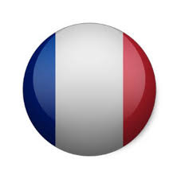
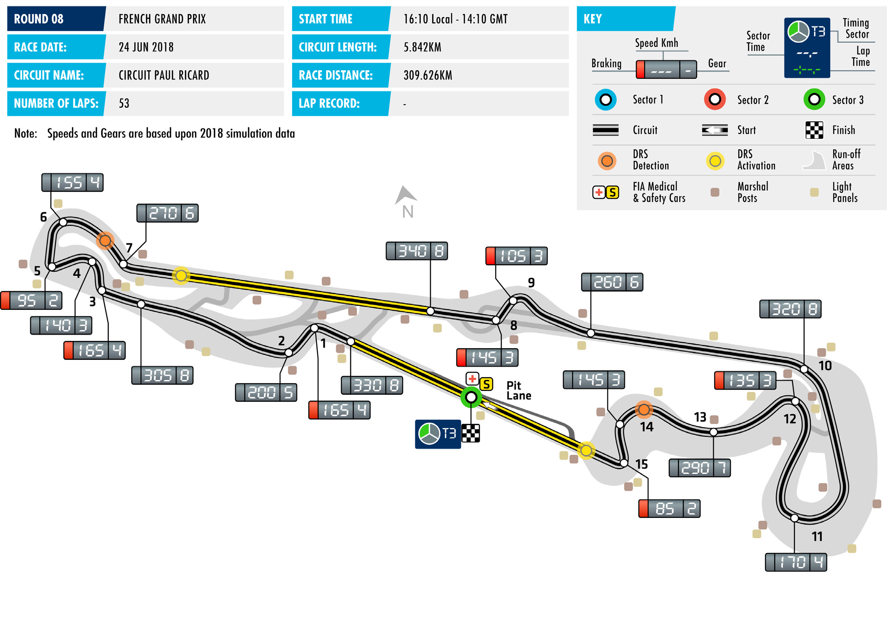
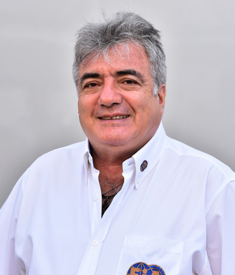
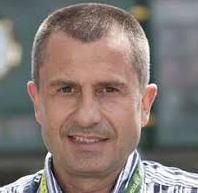

2018 FRENCH GRAND PRIX

22-24 June 2018

Following a decade-long hiatus, the French Grand Prix returns CIRCUIT PAUL RICARD

this week, with teams and drivers heading to Le Castellet and Length of lap:

the Circuit Paul Ricard for Round Eight of the 2018 FIA Formula 5.842km

One World Championship. Lap record: – Start line/finish line offset: The race returns to Ricard for the first time since 1990, and will 0.000km run on a full course layout for the first time since 1985 – albeit a Total number of race laps: modified version of the circuit formerly used, including a chicane 53

midway along the famous Mistral Straight. Total race distance: 309.626km Built on a plateau, the Mistral wind is just one of the variables Pitlane speed limits: drivers and teams will have to deal with this weekend. Ricard in this 80km/h in practice, qualifying, and the race configuration represents a mixed offering across the three sectors

– as might be expected from a flexible racing complex designed to DRS ZONE include a multitude of circuit configurations.

► There will be two DRS zones at The track features two high-speed straights and several heavy Paul Ricard. The first zone has a braking zones but also intricate, technical, low-speed sections, detection point 75m before Turn 7 and an activation point 170m while the famous Signes corner at the end of the Mistral straight after Turn 7. The second zone has will be one of the fastest corners in F1 this year. Put together, a detection point at Turn 14 and it teases teams with the possibility of going in very different activation 115m after Turn 15. directions on set-up – and Friday’s practice sessions are likely

to be very busy and see them experiment with a wide range of

downforce levels.

The situation in the Championships is equally intriguing. Mercedes,

Red Bull and Ferrari gave each taken a performance-based victory

from pole position in the last three races. In the Drivers’

Championship, victory in Canada has returned Sebastian Vettel

to the top of the table, a single point ahead of Lewis Hamilton.

The pair have pulled out a sizeable gap on the chasing pack, with

Valtteri Bottas now 34 points behind team-mate Hamilton. In the

Constructors’ Championship, Mercedes retain a slender lead, 17

points clear of Ferrari.

FAST FACTS

► This is the 59th running of the Formula field as a constructor with 17 victories, ► Pole has conferred a small advantage One World Championship French Grand including the last three races of the at Ricard in the past, with eight of the Prix. The race is one of the orginal rounds previous era. It only has two victories at 14 previous races won from P1 on the of the World Championship and has Ricard, however, and trails McLaren and grid. The third row is the furthest back been held from 1950 to 1954 and 1956 Williams who both have three victories at a winner has started: Ronnie Peterson to 2008. The 1955 race was cancelled this circuit. (1973) and Nelson Piquet (1985) were following the Le Mans disaster. The event both victorious from P5. returns this year after a 10-year hiatus, ► Both of Ferrari’s wins at the Circuit Paul the previous French Grand Prix being the Ricard were scored by drivers that are ► Victory for Fernando Alonso at the Le 2008 race contested at Magny-Cours. now senior management figures at rival Mans 24 Hours round of the FIA World teams: Niki Lauda in 1975 and Alain Prost Endurance Championship last weekend ► This is the 15th French Grand Prix to be in 1990. makes him one of three Le Mans winners held at the Circuit Paul Ricard. The race in the French Grand Prix field this year, first came here in 1971, returning in ► Alain Prost is the most successful driver the others being Nico Hülkenberg (2015), 1973, 1975-6, 1978, 1980, 1982-3, at Ricard. He took four of his six French and Brendon Hartley (2017). 1985-1990. The events between 1971 Grand Prix victories at this circuit. His and 1985 were held on the original wins were split between three different ► While F1 has not raced at Ricard for over 5.810km course and the races 1986-1990 manufacturers, victorious for Renault in a quarter of a century, most of the drivers on a shortened 3.813km circuit. 1983, McLaren in 1988 and 1989, and on the grid are familiar with the venue finally with Ferrari. – albeit not necessarily with the grand ► The French Grand Prix has also been held . prix track configuration. Pirelli has made at Reims (1950-51, 1953-54, 1956, 1958- ► There are two French Grand Prix winners extensive use of the circuit in recent years 61, 1963, 1966), Rouen (1952, 1957, in the 2018 field: Fernando Alonso won for both wet and slick tyre tests with 1962, 1964, 1968), Clermont-Ferrand the race in 2005 for Renault, and Kimi Ferrari, Mercedes, Red Bull and McLaren (1965, 1969-70, 1972), Le Mans (1967), Räikkönen in 2007 for Ferrari – both of participating, and the circuit is also Dijon (1974, 1977, 1979, 1981, 1984) and them on the way to winning the Drivers’ widely used for WEC testing. Carlos Sainz Magny-Cours (1991-2008). World Championship. Alonso and (twice) and Kevin Magnussen have both Räikkönen are also the only drivers in the won here in Formula Renault 3.5, while ► Michael Schumacher is the most current field to have started the French Pierre Gasly, Esteban Ocon and Stoffel successful French Grand Prix driver with Grand Prix from pole position: Alonso in Vandoorne have all won in the Eurocup eight wins. Ferrari are far ahead of the 2004 and 2005, Räikkönen in 2008. Formula Renault 2.0 series.

RACE STEWARDS BIOGRAPHIES

GARRY CONNELLY

DIRECTOR, GLOBAL INSTITUTE FOR MOTOR SPORT SAFETY; DIRECTOR, AUSTRALIAN INSTITUTE OF MOTOR SPORT SAFETY; F1, WTCC STEWARD; FIA WORLD MOTOR SPORT COUNCIL MEMBER

Garry Connelly has been involved in motor sport since the late 1960s. A long- time rally competitor, Connelly was instrumental in bringing the World Rally Championship to Australia in 1988 and served as Chairman of the Organising Committee, Board member and Clerk of Course of Rally Australia until December 2002. He has been an FIA Steward and FIA Observer since 1989, covering the FIA’s World Rally Championship, World Touring Car Championship and Formula One Championship. He is a director of the Australian Institute of Motor Sport Safety and of the Global Institute of Motor Sport Safety. He is a member of the FIA World Motor Sport Council.

ENZO SPANO

PRESIDENT OF THE SPORTING COMMISSION OF THE AUTOMOBILE AND TOURING CLUB OF VENEZUELA

Italian-born Vincenzo Spano grew up in Venezuela, where he went on to study at the Universidad Central de Venezuela, becoming an attorney-at-law. Spano has wide-ranging experience in motor sport, from national to international level. He has worked for the Touring y Automóvil Club de Venezuela since 1991, and served as President of the Sporting Commission since 2001. He was president for two terms and now sits as a member of the Board of the Nacam- FIA zone. Since 1995 Spano has been a licenced steward and obtained his FIA steward superlicence in 2003. Spano has been involved with the FIA and FIA Institute in various roles since 2001: a member of the World Motor Sport Council, the FIA Committee, and the executive committee of the FIA Institute.

YANNICK DALMAS

1992 WORLD SPORTSCAR CHAMPION, 1986 FRENCH F3 CHAMPION, FOUR TIMES LE MANS WINNER, F1 DRIVER

During a long racing career, Yannick Dalmas excelled in many forms of motorsport. Most famously, he won the 24 Hours of Le Mans four times in the 1990s, each with a different manufacturer. In 1992, alongside fellow FIA Steward Derek Warwick, he became World Sportscar Champion. As an open- wheel driver, he won the French F3 title in 1986 and, between 1987 and 1994, he participated in 49 F1 grands prix, driving for Larrousse and AGS. In recent years Dalmas has been an FIA Driver Advisor to the Stewards in WEC. This is his debut as a Formula One steward. He is a native of the Var region in France.

2018 Formula One World Championship

DRIVERS’ CHAMPIONSHIP STANDINGS

NAJIABREZA AILARTSUA EROPAGNIS IBAHD YNAMREG YRAGNUH STNIOP NIARHAB OCANOM ADANAC AIRTSUA MUIGLEB ECNARF OCIXEM ANIHC AISSUR NAPAJ LIZARB NIAPS YLATI ASU UBA BG

| 25 1 | 25 1 | 4 8 | 12 4 | 12 4 | 18 2 | 25 1 |
| --- | --- | --- | --- | --- | --- | --- |
| 18 2 | 15 3 | 12 4 | 25 1 | 25 1 | 15 3 | 10 5 |
| 4 8 | 18 2 | 18 2 | 14 | 18 2 | 10 5 | 18 2 |
| 12 4 | NC | 25 1 | NC | 10 5 | 25 1 | 12 4 |
| 15 3 | NC | 15 3 | 18 2 | NC | 12 4 | 8 6 |
| 8 6 | NC | 10 5 | NC | 15 3 | 2 9 | 15 3 |
| 10 5 | 6 7 | 6 7 | 6 7 | 4 8 | NC | NC |
| 6 7 | 8 6 | 8 6 | NC | NC | 4 8 | 6 7 |
| 1 10 | 11 | 2 9 | 10 5 | 6 7 | 1 10 | 4 8 |
| NC | 10 5 | 1 10 | 13 | 8 6 | 13 | 13 |
| NC | 12 4 | 18 | 12 | NC | 6 7 | 11 |
| 11 | 16 | 12 | 15 3 | 2 9 | 12 | 14 |
| 12 | 1 10 | 11 | NC | NC | 8 6 | 2 9 |
| 13 | 12 | 19 | 8 6 | 1 10 | 18 | 1 10 |
| 2 9 | 4 8 | 13 | 2 9 | NC | 14 | 16 |
| 14 | 14 | 14 | 4 8 | 11 | 17 | NC |
| NC | 2 9 | 16 | 11 | 13 | 11 | 15 |
| 15 | 17 | 20 | 1 10 | 12 | 19 | NC |
| NC | 13 | 17 | NC | NC | 15 | 12 |
| NC | 15 | 15 | NC | 14 | 16 | 17 |

1 S. VETTEL 121

2 L. HAMILTON 120

3 V. BOTTAS 86

4 D. RICCIARDO 84

5 K. RÄIKKÖNEN 68

6 M. VERSTAPPEN 50

7 F. ALONSO 32

8 N. HÜLKENBERG 32

9 C. SAINZ 24

10 K. MAGNUSSEN 19

11 P. GASLY 18

12 S. PÉREZ 17

13 E. OCON 11

14 C. LECLERC 10

15 S. VANDOORNE 8

16 L. STROLL 4

17 M. ERICSSON 2

18 B. HARTLEY 1

19 R. GROSJEAN 0

20 S. SIROTKIN 0

2018 Formula One World Championship

CONSTRUCTORS’ CHAMPIONSHIP STANDINGS

NAJIABREZA AILARTSUA EROPAGNIS IBAHD YNAMREG YRAGNUH STNIOP NIARHAB OCANOM ADANAC AIRTSUA MUIGLEB ECNARF OCIXEM ANIHC AISSUR NAPAJ LIZARB NIAPS YLATI ASU UBA BG

| 22 2 8 | 33 2 3 | 30 2 4 | 25 1 13 | 43 1 2 | 25 3 5 | 28 2 5 |
| --- | --- | --- | --- | --- | --- | --- |
| 40 1 3 | 25 1 NC | 19 3 8 | 30 2 4 | 12 4 NC | 30 2 4 | 33 1 6 |
| 20 4 6 | NC NC | 35 1 5 | NC NC | 25 15 10 | 27 1 9 | 27 3 4 |
| 7 7 10 | 8 6 11 | 10 6 9 | 10 5 NC | 6 7 NC | 5 8 10 | 10 7 8 |
| 12 5 9 | 10 7 8 | 6 7 13 | 8 7 9 | 4 8 NC | 14 NC | 16 NC |
| 11 12 | 1 10 16 | 11 12 | 15 3 NC | 2 9 NC | 8 6 12 | 2 9 14 |
| 15 NC | 12 4 17 | 18 20 | 1 10 12 | 12 NC | 6 7 19 | 11 NC |
| NC NC | 10 5 13 | 1 10 17 | 13 NC | 8 6 NC | 13 15 | 12 13 |
| 13 NC | 2 9 12 | 16 19 | 8 6 11 | 1 10 13 | 11 18 | 1 10 15 |
| 14 NC | 14 15 | 14 15 | 4 8 NC | 11 14 | 16 17 | 17 NC |

1 MERCEDES AMG 206 PETRONAS MOTORSPORT

189 2 SCUDERIA FERRARI

3 ASTON MARTIN 134 RED BULL RACING

RENAULT SPORT 56 4 FORMULA ONE TEAM

40 5 MCLAREN F1 TEAM

SAHARA FORCE INDIA 28 6 F1 TEAM

RED BULL 19 7 TORO ROSSO HONDA

19 8 HAAS F1 TEAM

ALFA ROMEO 12 9 SAUBER F1 TEAM

WILLIAMS MARTINI 4 10 RACING

FORMULA ONE TIMETABLE & FIA MEDIA SCHEDULE

THURSDAY

Press conference 1500

FRIDAY

Practice session 1 1200 - 1330 Press conference 1400

Practice session 2 1600 - 1730

SATURDAY

Practice session 3 1300 - 1400 Qualifying 1600 - 1700 Followed by unilateral and press conference

SUNDAY

Drivers’ Parade 1430 Race 1610 Followed by podium interviews and press conference

ADDITIONAL MEDIA OPPORTUNITIES

QUALIFYING

All drivers eliminated in Q1 or Q2 will be available for media interviews after the end of each session, as will drivers who participated in Q3, but who are not required for the post-qualifying press conference. The location of the TV Pen will be posted in the media centre.

RACE

Any driver retiring before the end of the race will be made available at the TV pen interview area. In addition, during the race every team will make available at least one senior spokesperson for interview by officially accredited TV crews. A list of those nominated will be made available in the media centre.

FIA COMMUNICATIONS DEPARTMENT press@fia.com T +33 1 43 12 58 15
