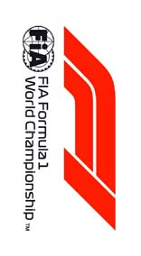
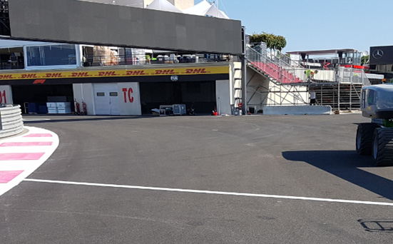
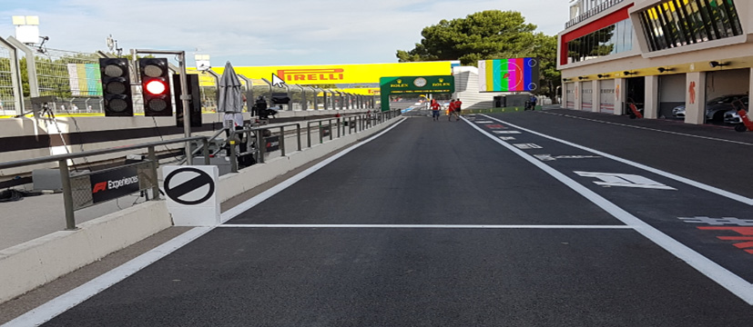

2018 FRENCH GRAND PRIX

21 - 24 June 2018

From The FIA Formula One Race Director Document 22

To All Teams, All Officials Date 23 June 2018

Time 12:30

Title Revised Event Notes

Description Revised Event Notes

Enclosed 2_EVENT_NOTES_21_06_2018_v2.pdf

Charlie Whiting

The FIA Formula One Race Director

2018 FRENCH GRAND PRIX

21-24 JUNE 2018

From The FIA Formula One Race Director Document 22

To Formula One Team Managers Date 23 June 2018

Time 12.30

EVENT NOTES V2

23 JUNE 2018

1) Issues arising from the Canadian Grand Prix

2) Pit lane map

2.1 Safety Car lines.

2.2 The location of the pit entry and the pit exit.

2.3 Designated garage areas.

2.4 Safety Car position for first lap and rest of race.

2.5 Blue flag marshal at the pit exit.

2.6 Track light panel displaying pit entry status.

3) Pirelli Event Preview

3.1 With reference to Article 24.4(a) of the Sporting Regulations see the attached document provided by the official tyre supplier.

4) Weighing and weighing platform

4.1 The FIA weighing platform will be available for teams to use at the following times, however, no more than 10 team personnel may be present during any visit. Each visit should last no more than 10 minutes unless no other team is waiting in the pit lane :

a) From 12.30 Thursday until 15.30 on Saturday (between 14.00 and 15.30 each visit will be restricted to five minutes).

b) From when the cars are returned to the teams after qualifying until 20.30 on Saturday.

1/4

c) From 11.00 until 16.00 on Sunday, however, when support race cars and personnel are in the pit lane between these times cars may only be pushed to the weighing area behind the line of barriers (see 16 below).

Any team found to be abusing the time limits set out above, which we will be enforced by FIA security personnel and our own CCTV, will not be permitted to use the weighbridge again during the Event.

5) Red zones for photographers in the pit lane during sessions

5.1 See the attached drawing.

6) Practice starts

6.1 Practice starts may only be carried out after the pit exit lights on the right hand side (in the slow lane of the second part of the pit lane) and, for the avoidance of doubt, this includes any time the pit exit is open for the race.

6.2 For reasons of safety and sporting equity, cars may not stop in the fast lane at any time the pit exit is open without a justifiable reason (a practice start is not considered a justifiable reason).

7) Lines or bollards at the pit entry and pit exit

7.1 In accordance with Chapter 4 (Section 5) of Appendix L to the ISC drivers must keep to the right of the white line at the pit exit when leaving the pits, no part of any car leaving the pits may cross this line.

7.2 For safety reasons drivers must keep to the right of the white line at the pit entry.

8) Observing yellow flags during free practice and qualifying

8.1 Double waved : Any driver passing through a double waved yellow marshalling sector must reduce speed significantly and be prepared to change direction or stop. In order for the stewards to be satisfied that any such driver has complied with these requirements it must be clear that he has not attempted to set a meaningful lap time, for practical purposes this means the driver should abandon the lap (this does not necessarily mean he has to pit as the track could well be clear the following lap).

8.2 Single waved : Drivers should reduce their speed and be prepared to change direction. It must be clear that a driver has reduced speed and, in order for this to be clear, a driver would be expected to have braked earlier and/or discernibly reduced speed in the relevant marshalling sector.

Drivers should not overtake any car in a single waved yellow marshalling sector unless it is clear that a car is slowing with a completely obvious problem, e.g. obvious accident damage or a deflated tyre.

9) Track light panels

9.1 The FIA track light panels have been installed in the positions shown on the circuit map. In accordance with Appendix H to the ISC the light signals have the same meaning as flag signals.

10) Turns 8 and 9

Any driver going straight on at turn 8 must re-join the track by driving around the three arrays of blocks in the escape road, to the left of the first, to the right of the second and to the left of the third.

2/4

11) Drivers leaving their pit stop position in the pit lane

11.1 For safety reasons, no car should be driven from its pit stop position at any time unless :

a) It has first been driven into the pit stop position having just entered the pit lane from the track, and ;

b) It is then driven immediately back onto the track from the pit stop position.

12) Fire extinguishers around the circuit

12.1 Indicated by small red boards with a white letter “F”.

13) Places to remove cars from the track

13.1 Indicated by fluorescent orange panels on the walls or guardrails.

14) Support races and pit walks

14.1 Teams are asked to keep their barriers on the white line which is approximately two metres from the garages during all support race practice sessions and races.

15) In laps and reconnaissance laps

15.1 In order to ensure that cars are not driven unnecessarily slowly on in laps during and after the end of qualifying or during reconnaissance laps when the pit exit is opened for the race, drivers must stay below the maximum time set by the FIA between the Safety Car lines shown on the pit lane map.

You will be informed of the maximum time after the first day of practice.

16) Post qualifying parc fermé

16.1 The cameras should be installed and operated as normal.

17) Operational personnel curfew

17.1 Boards warning anyone attempting to enter the paddock that the curfew is in operation will be placed immediately before the entry turnstiles at the appropriate times.

18) Removing cars from the grid

18.1 Two gates in the pit wall, the first is in front of pole position and the second beside grid position 16.

19) Car number light panels for the start

19.1 On the driver’s right.

20) Track light panels displaying pit entry status

20.1 The light panels indicated on the pit lane map will display flashing yellow arrows if cars are required to use the pit lane once the Safety Car has been deployed during the race.

20.2 The light panels indicated on the pit lane map will display flashing red crosses if the pit lane is closed at any point during the race.

3/4

21) Lapping during the race

21.1 The ISC requires drivers who are caught by another car about to lap him to allow the faster driver past at the first available opportunity. The F1 Marshalling System has been developed in order to ensure that the point at which a driver is shown blue flags is consistent, rather than trusting the ability of marshals to identify situations that require blue flags.

As it was at the end of last season the system will be set to give a pre-warning when the faster car is within 3.0s of the car about to be lapped, this should be used by the team of the slower car to warn their driver he is soon going to be lapped and that allowing the faster car through should be considered a priority. When the faster car is within 1.2s of the car about to be lapped blue flags will be shown to the slower car (in addition to blue light panels, blue cockpit lights and a message on the timing monitors) and the driver must allow the following driver to overtake at the first available opportunity.

It should be noted that the aim of using F1MS is ensure consistent application of the rules, additional instructions may also be given by race control when necessary.

22) Post race parc fermé

22.1 All cars must enter the pit lane, the cars in the first three places should stop under the podium and the remainder should proceed directly to the weighing area.

23) Any other business

Charlie Whiting FIA Formula One Race Director

4/4

|  |  | Grand Prix of France 22-24/06/2018 (18R08PRC) |  |  |  |  |  |  |  |
| --- | --- | --- | --- | --- | --- | --- | --- | --- | --- |
|  |  | Compound |  | FL | FR | RL | RR |  | Mandatory race tyres |
|  |  | SOFT |  | S80 | S82 | S90 | S92 |  | SOFT |
|  |  | SUPERSOFT |  | X80 | X82 | X90 | X92 |  | SUPERSOFT |
|  |  | ULTRASOFT |  | U80 | U82 | U90 | U92 |  |  |
|  |  | INTERMEDIATE BASE |  | I37 | I38 | I39 | I40 |  | Q3 tyre |
|  |  | WET BASE Cross-Over time MINIMUM STARTING PRESSURE, BLISTERING SENSITIVITY, CAMBER LIMIT |  | R37 WET > 119% > INT > 113% > DRY | R38 Front (psi) | R39 | R40 | Rear (psi) | ULTRASOFT |
|  |  |  | Slicks |  | 22.5 |  |  | 21.0 |  |
|  |  |  | Intermediate |  | 21.5 |  |  | 20.0 |  |
|  |  |  | Wet |  | 20.5 |  |  | 19.0 |  |
| FE EOS Camber limit RE EOS Camber limit -3.50 ° -2.00 ° FE Blistering RE Blistering sensitivity sensitivity Medium Low |  | TYRE HEATING STRATEGY |  |  |  |  |  |  |  |
| Storage temperature: Optimum time in Storage temperature: Optimum time in blanket (@80°): blanket (@60°): 60°C 40°C 2h 1h SLICKS INTER Maximum boost Blanket time window Maximum boost Blanket time window temperature (@80°): temperature (@60°): 1h @ 110°C 1h to 3h 30min @ 80°C 30 min to 2h Storage temperature: Optimum time in blanket (@60°): 40°C 1h WET Blanket time window NO BOOST (@60°): 30 min to 2h GENERAL NOTES Teams are kindly reminded that the following parameters will be subjected to FIA checks during the event: - Starting pressure. - Camber at maximum speed. - Maximum blanket temperature. - Tyre swapping. | Tyre Notes |  |  |  |  |  |  |  |  |
| ● Not permiHed to switch tyres from their originally allocated posi#on. Storage Temp˚C is the recommended temperature the tyre can stay in blankets without time limit. All temperature limits apply to the actual tyre surface temperature, measured with the IR ● Do not subject tyres to large deforma#on or heavy impact. gun detailed in TD029-15. ● Do not leave fiHed tyres exposed at an air temperature lower than 15°C SIDEWALLS HEATING CLARIFICATION (ALL PRODUCTS): you are allowed to apply a max. and/or any UV emission. temperature of 100 °C for max. 1 hr to the sidewalls as long as the max. temp/time at any part ● Revised prescrip#ons could be issued during the race weekend in of the tread is the one described in the corresponding section above. accordance with TD/007-16. | ● Not permiHed to switch tyres from their originally allocated posi#on. ● Do not subject tyres to large deforma#on or heavy impact. ● Do not leave fiHed tyres exposed at an air temperature lower than 15°C and/or any UV emission. ● Revised prescrip#ons could be issued during the race weekend in accordance with TD/007-16. |  |  |  |  | Storage Temp˚C is the recommended temperature the tyre can stay in blankets without time limit. All temperature limits apply to the actual tyre surface temperature, measured with the IR gun detailed in TD029-15. SIDEWALLS HEATING CLARIFICATION (ALL PRODUCTS): you are allowed to apply a max. temperature of 100 °C for max. 1 hr to the sidewalls as long as the max. temp/time at any part of the tread is the one described in the corresponding section above. |  |  |  |

2018 French Grand Prix Pit Lane

CARS RECOVERED FROM TRACK PLACED HERE

PIT LANE Ends SAFETY CAR Line 1 PIT LANE Starts

SAFETY CAR Line 2

SAFETY CAR Race

SAFETY CAR PIT EXIT F1 Garages PIT ENTRY First Lap Medical Centre X

X Pit Entry Status panels

12 11 10 9 8 7 6 5 4 3 2 1 TC

| 1F | rebuaS | neraLcM | saaH | oroT ossoR | tluaneR | smailliW | ecroF aidnI | lluB deR | irarreF | sedecreM | 1F | AIF |
| --- | --- | --- | --- | --- | --- | --- | --- | --- | --- | --- | --- | --- |
|  | Sauber | McLaren | Haas | Toro Rosso | Renault | Williams | Force India | Red Bull | Ferrari | Mercedes | Designated Garage Areas |  |

FAST LANE FAST LANE

Team Personnel Pole Position (Race Start ONLY)

Version 2 – 22 June 2018
