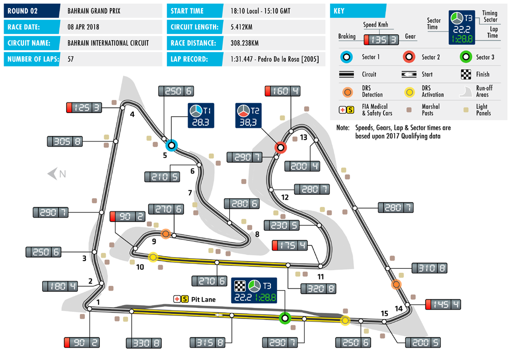
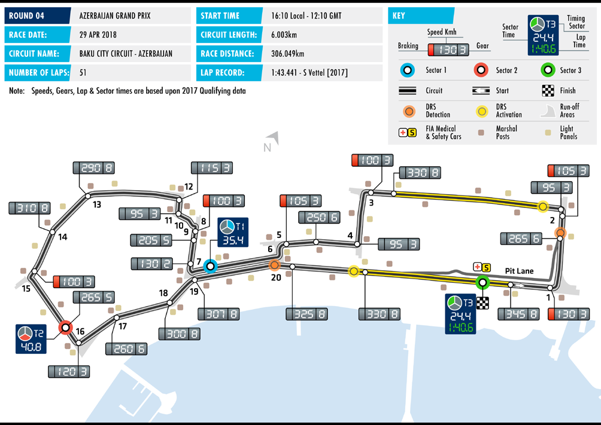
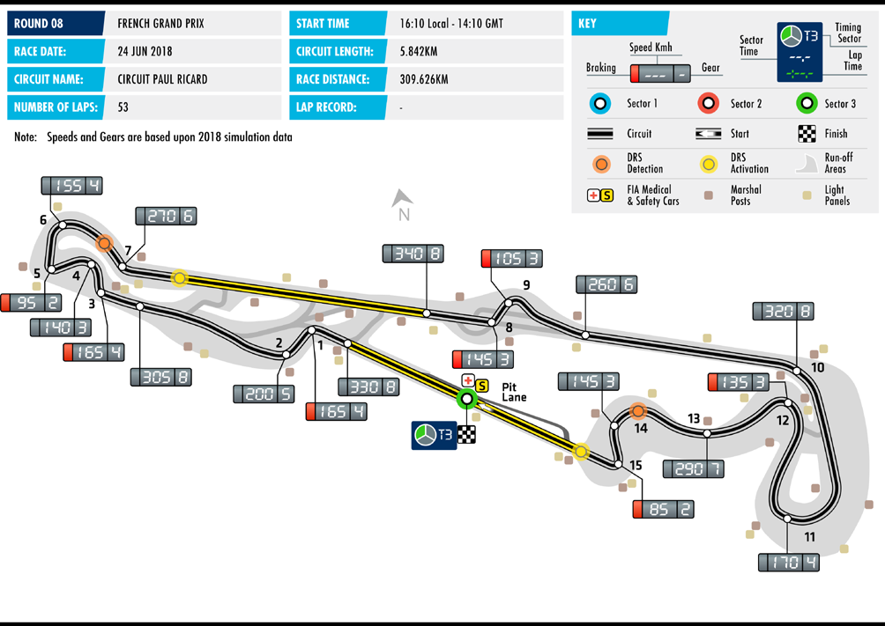
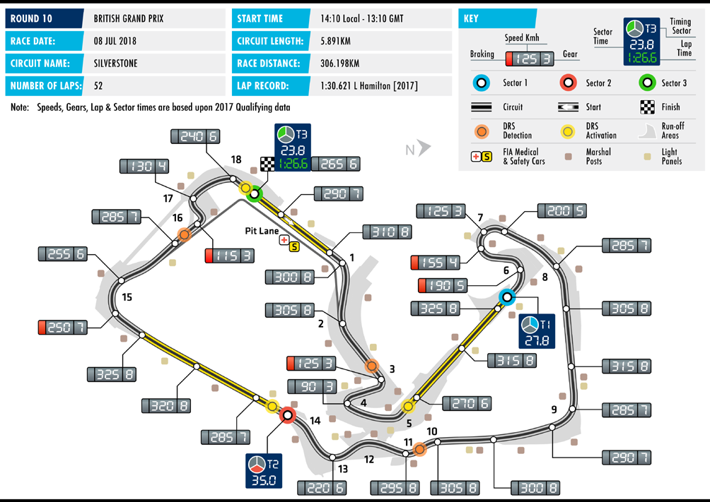

Official A4 Media Kit Cover Width 210mm x Depth 297mm (3mm bleed)

| OfficOiaffl iAci4a lM Ae4d Miae Kditia C Koivt eCro Wveidr tWh i2d1t0h m21m0 mx Dme xp tDhe 2p9th7 m29m7 m(3mm m(3 mblmee bdl)eed) | Official A4 Media Kit Cover Width 210mm x Depth 297mm (3mm bleed) The F1 logos, F1, FORMULA 1, FIA FORMULA ONE WORLD CHAMPIONSHIP, GROSSER PREIS VON DEUTSCHLAND, GRAND PRIX and related marks are trade marks of Formula One Licensing BV, a Formula 1 company. All rights reserved. The F1 Tlohgeo Fs1, Flo1g, FoOs,R FM1,U FLOAR 1M, FUILAA F 1O, RFMIAU FLOAR OMNUEL AW OONRELD W COHRALMD PCIHOANMSHPIIPO, NGSRHOISPS, GERRO PSRSEEISR VPORNEI SD EVUOTNS DCHEULATSNCDH, GLARNAND,D G PRRAINX Da nPdR rIXel aatnedd r melaatrekds amrear ks are trade mtraardkes omfa Frokrsm ouf lFao Ormneu Llaic Oennes iLnigc eBnVs, ian Fg oBrVm, au lFao 1r mcoumlap 1a ncoy.m Aplla rnigyh. Atsl lr reigshetrvs ereds.erved. | Official title sponsor EEMMIRIRAATTEESS EMIRATES GGRROOSSSSEERR P PRREEISIS GROSSER PREIS VVOONN VON DDEEUUTTSSCCHHLLAANNDD DEUTSCHLAND HOCHKOECNKHEENIHMEIM 20-2202 -J2U2L JYULY HOCKENHEIM 20-22 JULY OFFICIAL MEDIA KIT OFFOICFIAFILC MIAELD MIAE KDIITA KIT | EMIRATES GROSSER PREIS VON DEUTSCHLAND HOCKENHEIM 20 -22 JULY OFFICIAL MEDIA KIT |
| --- | --- | --- | --- |
| The F1 logos, F1, FORMULA 1, FIA FORMULA ONE WORLD CHAMPIONSHIP, GROSSER PREIS VON DEUTSCHLAND, GRAND PRIX and related marks are trade marks of Formula One Licensing BV, a Formula 1 company. All rights reserved. |  |  |  |

INHALTSVERZEICHNIS

1. ALLGEMEINE INFORMATIONEN Vorwort des Geschäftsführers der Hockenheim-Ring GmbH 3 Zeitplan 4-5 Streckenplan 6 Anfahrtsplan zum Hockenheimring 7 Anfahrtsbeschreibung Presseparkplatz 8 Daten und Fakten 9-11

1.1. HOCKENHEIMRING TRAVEL GUIDE Hockenheim im Überblick 12-13 Hotels, Restaurants & Cafés 14-17 Shopping / Banken / Autovermietung / Taxis 18 Bahnstationen / Flughäfen / Fluggesellschaften 19 Notfall Nummern / Krankenhäuser 20

2. MEDIA SERVICES Zuständigkeiten: Strecke / FIA / Pressezentrum 21 Akkreditierung / Pressezentrum Öffnungszeiten 22 Media Centre / Fotografen: Ausstattung 23 Shuttle-Services: Route / Zeiten 24 Pressekonferenzen 25

3. 2018 FIA FORMEL 1 Weltmeisterschaft Statistiken Rennkalender 26 Starterliste 27 Übersicht der Fahrer 28 Übersicht der Teams 29

2018 Rennstreckencharakteristik & Ergebnisse: Streckencharakteristik & Ergebnisse: Australian Grand Prix 30-31 Streckencharakteristik & Ergebnisse: Bahrain Grand Prix 32-33 Streckencharakteristik & Ergebnisse: Chinese Grand Prix 34-35 Streckencharakteristik & Ergebnisse: Azerbaijan Grand Prix 36-37 Streckencharakteristik & Ergebnisse: Spanish Grand Prix 38-49 Streckencharakteristik & Ergebnisse: Monaco Grand Prix 40-41 Streckencharakteristik & Ergebnisse: Canadian Grand Prix 42-43 Streckencharakteristik & Ergebnisse: French Grand Prix 44-45 Streckencharakteristik & Ergebnisse: Austrian Grand Prix 46-47 Streckencharakteristik & Ergebnisse: British Grand Prix 48-49 Streckencharakteristik: German Grand Prix 50 Streckencharakteristik: Hungarian Grand Prix 51 Streckencharakteristik: Belgium Grand Prix 52 Streckencharakteristik: Italian Grand Prix 53 Streckencharakteristik: Singapore Grand Prix 54 Streckencharakteristik: Russian Grand Prix 55

1

INHALTSVERZEICHNIS - FORTSETZUNG

2018 Streckencharakteristik & Ergebnisse: Streckencharakteristik: Japanese Grand Prix 56 Streckencharakteristik: United States Grand Prix 57 Streckencharakteristik: Mexican Grand Prix 58 Streckencharakteristik: Brazilian Grand Prix 59 Streckencharakteristik: Abu Dhabi Grand Prix 60

4. 2018 FIA FORMEL 1 WELTMEISTERSCHAFT TEAM INFORMATIONEN Mercedes AMG Petronas Formula One Team 61 Scuderia Ferrari 62 Williams Martini Racing 63 Aston Martin Red Bull Racing 64 Sahara Force India F1 Team 65 Red Bull Toro Rosso Honda 66 Alfa Romeo Sauber F1 Team 67 McLaren F1 Team 68 Haas F1 Team 69 Renault Sport F1 Team 70

5. STATISTIK 2018 FIA FORMEL 1 Weltmeisterschaft Statistiken   2018 Gewinnerübersicht der bisherigen Rennen 71   2018 Konstrukteurswertung 72   2018 Fahrerwertung 73

6. HISTORISCHE DATEN & FAKTEN: DER GROSSE PREIS VON DEUTSCHLAND Chronologie der Sieger des Großen Preis von Deutschland (2017-1950) 74-79 Chronologie der Fahrer-Weltmeisterschaft (2017-1950) 80-82 Chronologie der Konstrukteurs-Weltmeisterschaft (2017-1958) 83-84 Fahrer Rekorde zu Beginn der Saison 2018 85 Team Rekorde zu Beginn der Saison 2018 86

7. NEUE REGELN IN DER SAISON 2018 Neue Regeln 87 Punkte, Klassifizierung, Rennlänge 89 Rennflaggen 90

8. RAHMENPROGRAMM 8.1 Porsche Mobil 1 Supercup 91 8.2 ADAC Formel 4 93 8.3 BOSS GP 95

2

VORWORT

Herzlich willkommen in der Rennstadt der Metropolregion Rhein-Neckar: Hockenheim! Auch in

diesem Jahr richten sich wieder viele Augen auf den Hockenheimring, wenn die Formel 1 nach

einem Jahr „Deutschland-Pause“ zum 36. Mal in unserem Motodrom Station macht. Das gilt für

2018 sogar noch ein Stück mehr als in den Vorjahren. Neben uns freuen sich auch viele

Hockenheimer darauf, dass der internationale Rennsport wieder zu Gast bei Freunden ist. Wir laden

Sie daher herzlich dazu ein, die Geschwindigkeit und Spannung der Formel 1 auf dem

Hockenheimring und in Hockenheim zu erleben!

Mit Interesse verfolgen wir die Rennen der laufenden Saison. Die technische Weiterentwicklung und

Änderungen im Reglement haben zu einem positiven Trend geführt. Spannende, chancengleiche

Positionskämpfe begeistern die Zuschauer rund um die Welt – der Mythos Formel 1 lebt!

Aber auch eine Vielzahl von fanwirksamen Neuerungen der Rennserie hat dazu beigetragen, dass

die Königsklasse wieder zu alter Stärke gefunden hat. Das Rahmenprogramm bietet für die ganze

Familie Spaß und Unterhaltung und beschert ein Live-Erlebnis besonderer Art.

Neben der Formel 1 können sich die Motorsportfans auch auf weitere Rennserien freuen, die im

Rahmen des Grand-Prix-Wochenendes an den Start gehen werden. Der Porsche Mobil 1 Supercup,

die ADAC Formel 4 und die BOSS GP mit ihren unvergleichlichen hochdrehenden Zehnzylinder-

Triebwerken der vergangenen Formel 1 werden für viel Action auf der Strecke sorgen.

Abseits des Rennens kann man die Gelegenheit nutzen, unsere Stadt Hockenheim näher

kennenzulernen. Der Hockenheimer Marketing Verein richtet unter dem Motto „Hockenheim lebt

die Formel 1“ mit vielen Partnern unterhaltsame Aktivitäten am Samstag in der Innenstadt aus.

Auch die Vereine in der Stadt beteiligen sich rege.

Mit dem diesjährigen Rennen läuft unser Vertrag mit den Rechte-Inhabern aus. Wir würden es sehr

begrüßen, wenn die Königklasse auch künftig auf dem Hockenheimring um die Weltmeisterschaft

fahren würde.

Wir freuen uns auf das bedeutendste Motorsportereignis in Deutschland und erwarten ein volles

brodelndes Motodrom, zu dem auch eine Vielzahl von holländischen Fans beitragen werden. Wir

sind sicher, dass unser Rennen in der Saison 2018 ein Highlight im Kalender wird.

Große Kreisstadt Hockenheim Hockenheim-Ring GmbH

Dieter Gummer Georg Seiler

Oberbürgermeister Geschäftsführer

3

1. ALLGEMEINE INFORMATIONEN

ZEITPLAN – FORMEL 1 GROSSER PREIS VON DEUTSCHLAND 2018

THURSDAY 11:00 11:30 PROMOTER ACTIVITY PRESS ROOM SECURITY BRIEFING 11:00 17:00 FIA FIA GARAGE INITIAL SCRUTINEERING 12:30 13:00 FORMULA 1 TRACK FORMULA 1 PIRELLI HOT LAPS 13:00 15:00 FORMULA 1 TRACK TRACK CLOSED FIA/F1 SYSTEMS CHECKS 13:45 14:00 FIA TRACK TRACK INSPECTION, TRACK COMPLETELY CLEAR 14:00 15:00 FIA TRACK HIGH SPEED TRACK TEST – FIA SAFETY AND MEDICAL CARS 15:00 16:00 FORMULA 1 PRESS ROOM PRESS CONFERENCE 16:00 18:00 PROMOTER ACTIVITY PIT LANE PUBLIC PIT LANE WALK & TRACK TOURS FOR 3 DAY TICKET HOLDERS ONLY TBC 17:00 18:00 FORMULA 1 PRESS ROOM TEAM MANAGERS MEETING 17:00 19:00 PROMOTER ACTIVITY PIT LANE WELCOME BBQ 18:00 18:30 FORMULA 1 PIT LANE F1 EXPERIENCE – PIT LANE WALK (F1 EXPERIENCE GUESTS ONLY) 18:30 19:00 FORMULA 1 TRACK F1 EXPERIENCE – TRUCK TOUR (F1 EXPERIENCE GUESTS ONLY) FRIDAY 08:30 9:15 PADDOCK CLUB PIT LANE PADDOCK CLUB PIT LANE WALK 09:05 9:15 FIA TRACK MEDICAL INSPECTION 09:15 09:30 FIA TRACK TRACK INSPECTION AND SAFETY CAR TEST 09:45 10:151 ADAC F4 TRACK PRACTICE SESSION 10:30 10:40 FIA TRACK TRACK INSPECTION 11:00 12:301 FORMULA 1 TRACK FIRST PRACTICE SESSION 13:00 13:251 BOSS GP TBC TRACK FIRST PRACTICE SESSION 13:00 14:00 FORMULA 1 PRESS ROOM PRESS CONFERENCE 13:45 14:15 PADDOCK CLUB TRACK PADDOCK CLUB TRUCK TOURS 13:45 14:15 PADDOCK CLUB PIT LANE PADDOCK CLUB PIT LANE WALK 14:00 14:30 PORSCHE MOBIL 1 DRIVERS’ MEETING SUPERCUP 14:30 14:40 FIA TRACK TRACK INSPECTION 15:00 16:301 FORMULA 1 TRACK SECOND PRACTICE SESSION 16.45 17:15 FORMULA 1 TRACK FORMULA 1 PIRELLI HOT LAPS 17:20 18:051 PORSCHE MOBIL 1 TRACK PRACTICE SESSION SUPERCUP 18:00 19:00 FORMULA 1 PRESS ROOM DRIVER’S MEETING 18:30 18:55 BOSS GT TRACK SECOND PRACTICE SESSION 19:00 19:30 PADDOCK CLUB TRACK PADDOCK CLUB TRUCK TOUR 19:00 19:45 PROMOTER ACTIVITY PIT LANE MARSHAL PIT LANE WALK

*These times refer to the start of the formation lap 1Fixed End Sessions 2Approximate Finishing Time

PLEASE NOTE THAT THIS TIMETABLE IS SUBJECT TO AMENDMENTS

4

1. ALLGEMEINE INFORMATIONEN

ZEITPLAN – FORMEL 1 GROSSER PREIS VON DEUTSCHLAND 2018

SATURDAY 08:30 09:00 PADDOCK CLUB TRACK PADDOCK CLUB TRUCK TOUR 09:00 09:30 PADDOCK CLUB PIT LANE PADDOCK CLUB PIT LANE WALK 09:05 09:15 FIA TRACK MEDICAL INSPECTION 09:10 09:30 FORMULA 1 PIT LANE TEAM PIT STOP PRACTICE 09:15 09:30 FIA TRACK TRACK INSPECTION 09:50 10:05 ADAC F4 TRACK QUALIFYING SESSION 1 10:10 10:25 ADAC F4 TRACK QUALIFYING SESSION 2 10:50 11:20 BOSS GP TRACK QUALIFYING SESSION 11:30 11:40 FIA TRACK TRACK INSPECTION 12:00 13:001 FORMULA 1 TRACK THIRD PRACTICE SESSION 13:15 13:45 PADDOCK CLUB TRACK PADDOCK CLUB TRUCK TOUR 13:15 13:45 PADDOCK CLUB PIT LANE PADDOCK CLUB PIT LANE WALK 13:55 14:25 PORSCHE MOBIL 1 TRACK QUALIFYING SESSION SUPERCUP 14:30 14:40 FIA TRACK TRACK INSPECTION 15:00 16:00 FORMULA 1 TRACK QUALIFYING SESSION 16:30 16:50 FORMULA 1 TRACK FORMULA 1 PIRELLI HOT LAPS 17:00* 17:35² ADAC F4 TRACK FIRST RACE (… LAPS OR 30 MINS) 18:00 19:00 FORMULA 1 FAN ZONE FAN FORUM TBC 18:00* 18:252 BOSS GP TRACK FIRST RACE (… LAPS OR 20 MINS) 18:30 19:0 PADDOCK CLUB TRACK PADDOCK CLUB TRUCK TOURS

SUNDAY 08:50 09:20 PADDOCK CLUB TRACK PADDOCK CLUB TRUCK TOUR 09:30 09:40 FIA TRACK MEDICAL INSPECTION 09:40 09:55 FIA TRACK TRACK INSPECTION AND TRACK TEST 10:10* 10:45² ADAC F4 TRACK SECOND RACE (… LAPS OR 30 MINS) 11:05* 11:40² BOSS GP TRACK SECOND RACE ( … LAPS OR 25 MINS) 12:05* 12:40² PORSCHE MOBIL 1 TRACK RACE (14 LAPS OR 30 MINS) SUPERCUP 12:50 13:10 FORMULA 1 TRACK FORMULA 1 PIRELLI HOT LAPS 13:15 14:05 PADDOCK CLUB TRACK PADDOCK CLUB TRUCK TOUR 13:30 14:00 FORMULA 1 TRACK DRIVERS TRACK PARADE 14:00 14:15 PROMOTER ACTIVITY TRACK STARTING GRID PRESENTATION 14:00 14:10 FIA TRACK MEDICAL INSPECTION 14:10 14:20 FIA TRACK TRACK INSPECTION 14:30 14:40 FORMULA 1 PIT LANE PIT LANE OPEN 14:54 14:56 FORMULA 1 TRACK NATIONAL ANTHEM 15:10* 17:10² FORMULA 1 TRACK GRAND PRIX (67 LAPS OR 120 MINS)

* These times refer to the start of the formation lap ¹ Fixed End Session ² Approximate Finishing time PLEASE NOTE THAT THIS TIMETABLE IS SUBJECT TO AMENDMENTS

5

6

1. ALLGEMEINE INFORMATIONEN

ANFAHRT ZUM HOCKENHEIMRING

ANFAHRTSBESCHREIBUNG VON GROSSEN STÄDTEN

Frankfurt / Mannheim • Autobahn A6/E50 Richtung Heilbronn • Ausfahrt AS29 Schwetzingen/Hockenheim, B36 in Richtung Hockenheim • Ausfahrt B36 Hockenheim Nord/Hockenheim Talhaus, folgen Sie dem Rennfahrerlogo Richtung Hockenheim

Koblenz / Köln / Mainz • Autobahn A61/E31 Richtung Heilbronn/Stuttgart • Ausfahrt AS64 Hockenheim über die L722 nach Hockenheim, Talhaus, folgen Sie dem Rennfahrerlogo Richtung Hockenheim

Heilbronn • Autobahn A6/E50 Richtung Frankfurt • Ausfahrt Raststätte Hockenheim Ost, folgen Sie dem Rennfahrerlogo

Basel (CH) / Karlsruhe • Autobahn A5/E35 Richtung Heidelberg • Ausfahrt AS39 Walldorf, B39 Richtung Hockenheim • Bei Ankunft in Hockenheim, folgen Sie der Beschilderung zum Hockenheimring

PARKEN AM HOCKENHEIMRING

Bei Ankunft am Hockenheimring werden die Besucher auf die nächsten freien Parkplätze geleitet. Busse und akkreditierte Medienvertreter werden auf den Parkbereich P1 geleitet.

Die Orientierungshilfe gibt Ihnen einen Überblick der verfügbaren Park- und Campingplätze am Hockenheimring.

ÖFFENTLICHE VERKEHRSMITTEL

Hockenheim ist von Karlsruhe und Mannheim bequem mit dem Zug erreichbar. Vom Bahnhof aus verkehrt ein Shuttle-Bus zum Hockenheimring. Zu Fuß ist der Ring in ca. 30 min vom Bahnhof aus zu erreichen.

7

1. ALLGEMEINE INFORMATIONEN

ANFAHRTSBESCHREIBUNG PRESSEPARKPLATZ

Aus Süd kommend: Aus Nord kommend:

A5 Karlsruhe/Basel: A6 Mannheim/Frankfurt: Ausfahrt 39 Walldorf, über B39 der Ausfahrt 29 Schwetzingen/Hockenheim, nach Beschilderung folgend Hockenheim der Beschilderung folgend

A6 Heilbronn/Stuttgart: A61 Koblenz/Köln: Am Autobahnkreuz Walldorf auf die A5 Richtung Ausfahrt 64 Hockenheim, über L722 nach Hockenheim, Heidelberg/Frankfurt, Ausfahrt 39 Walldorf, über B39 der ab Hockenheim der Beschilderung folgend Beschilderung folgend A5 Heidelberg/Frankfurt: Ausfahrt 39 Walldorf, über B39 der Beschilderung folgend

8

1. GENERAL INFORMATION

FACTS & FIGURES / HOCKENHEIMRING BADEN-WÜRTTEMBERG A-Z

Im Verlauf des Rennwochenendes stellen sich auf der Showbühne des

Hockenheimrings in der F1® Fanzone, Fahrer der Formel 1 sowie der Autogramme Rahmenprogramm-Serien für persönliche Worte, Autogramme und

Fotos fürs Familienalbum den Fans zur Verfügung.

Der AvD (Automobilclub von Deutschland) setzt in seiner Funktion als

sportlicher Ausrichter auch in diesem Jahr wieder rund 500 Personen AvD ein. Dies sind insbesondere Sportwarte direkt an der Strecke, das

Boxenteam und Funktionäre/Offizielle.

| DRK | F1-Rundenrekord | Das Deutsche Rote Kreuz wird auch in diesem Jahr wieder mit mehr als 200 Sanitätern (60-70 direkt an der Strecke), über 30 Ärzten, 16 Rettungswagen, 3 Extrication Teams zu je 6 Personen und 2 Teams zu je 3 Personen allein in der Boxengasse über das gesamte Wochenende vor Ort sein. Der Finne Kimi Räikkönen (damals McLaren Mercedes) lieferte 2004 mit 1:13.780 Minuten den Rundenrekord (Streckenlänge 4,574 Kilometer). Die Durchschnittsgeschwindigkeit betrug 223.182 km/h. |
| --- | --- | --- |
| Fan-TV |  | Das auf den Videoleinwänden rund um die Strecke ausgestrahlte Fan- TV informiert das ganze Rennwochenende über interessante Begebenheiten aus der Boxengasse, Aktionen rund um den Ring, Verkehrsinfos und vieles mehr. |

An jedem Tag der Veranstaltung stehen rund 140 Mitarbeiter der Feuerwehr Feuerwehr in 22 Einsatzfahrzeugen in Bereitschaft.

Länge: 4,574 km

Breite: mind. 15 m Formel-1-Strecke

Kurven: 17

Geraden: 7

9

1. ALLGEMEINE INFORMATIONEN

FACTS & FIGURES / HOCKENHEIMRING BADEN-WÜRTTEMBERG A-Z

Geschichte 1932 Eröffnung am 29. Mai

1938 Umbau zum Kurpfalzring

1947 Umbenennung in Hockenheimring

1964/65 Bau des Motodroms

1966 Erster Weltmeisterschaftslauf für Motorräder

1970 Erster Formel 1 Grand Prix von Deutschland

seit 1977 Ständiger Austragungsort Großer Preis von Deutschland (außer 1985, 2007, 2009, 2011 und 2013)

2002 Umbau- und Modernisierungsmaßnahmen der Strecke Verkürzung der Rennstrecke von 6,823 km auf 4,574 km

2006 Markiert das 80-jährige Jubiläum des Großen Preis von Deutschland und das 30-jährige Jubiläum des Großen Preis von Deutschland auf dem Hockenheimring

2007 Der Hockenheimring feiert sein 75-jähriges Jubiläum

2010 Jubiläum 60 Jahre Formel 1 und 40 Jahre Formel 1 auf dem Hockenheimring

2012 Der Hockenheimring feiert sein 80-jähriges Jubiläum

2016 Der Hockenheimring feiert sein 50-jähriges Motodrom Jubiläum Geschwindigkeit Maximal: ca. 330 km/h Durchschnitt: ca. 195 km/h

Länge, Strecken GP-Strecke: 4,574 km Kleiner Kurs: 2,604 km Mit Schikane Einfahrt GP-Kurs: 2,589 km Ostkurs: 3,084 km Quartermile: 402,33 m

Mitarbeiter Während des Formel-1-Wochenendes beläuft sich die Anzahl der Mitarbeiter auf ca. 1.500, wobei von den Streckenposten über die Parkeinweiser bis hin zum Security-Personal jeder berücksichtigt ist. Pit-Walkabout Alle Fans, die im Besitz eines Tickets zum Großen Preis von Deutschland sind, haben am Donnerstag, den 19. Juli 2018 die Möglichkeit, exklusiv die Boxengasse zu besichtigen und an Busrundfahrten über die Strecke teilzunehmen.

10

1. GENERAL INFORMATION

FACTS & FIGURES / HOCKENHEIMRING BADEN-WÜRTTEMBERG A-Z

Polizei Am Wochenende des Großen Preis von Deutschland befinden sich rund 800 Polizeibeamte im Einsatz

Randstreifen Je 8 Meter rechts und links an den Geraden und bis zu 100 Meter in den Außenkurvenbereichen.

In den Kurven: Reifenstapel vor Dreifach-Leitplanken, dahinter Run-off Areas verstärkter Schutzraum (4,20m hoch), überwiegend asphaltiert.

Auf den Geraden: Betonelemente, Leitplanken und Schutzraum

Hockenheimring-Radio Auf der Spezialfrequenz 92,4 FM rund um Hockenheim gibt es powered by RPR1. am Rennwochenende alle Infos zum Renngeschehen, den Fahrern und der Strecke. Das RPR1-Team sendet live aus dem mobilen Sendestudio direkt auf dem Gelände. Neben spannenden Geschichten aus der Boxengasse liefert das Hockenheimring-Radio powered by RPR1. Stau- & Parkplatzinfos, Campingtipps und die besten Hits zum Feiern.

Telekommunikation Auf dem ganzen Gelände des Hockenheimrings werden rund 850 Internetleitungen sowie digitale und analoge Kommunikationseinrichtungen für Teams, Organisatoren, Medien, etc. installiert.

Verzehr Pro Veranstaltung werden rund 5,2 Tonnen Brat- sowie Brühwürste, 6.000 Schnitzel, 10.000 Frikadellen und 80.000 Brötchen, die eine Pyramide von 14m Länge und 8m Höhe bilden könnten, von den hungrigen Fans verzehrt. Zudem reichen Senf und Ketchup für die Füllung von 10 Badewannen. Dazu werden über das Wochenende mehr als 50.000 Einheiten Soft-Drinks und 50.000 Bierdosen ausgeschenkt. Aufeinandergestapelt ergibt dies einen Turm in Höhe von 11km.

Videoleinwände Um sicherzustellen, dass den Zuschauern kein Detail entgeht, sind insgesamt 7 Videowände an der gesamten Rennstrecke errichtet, sowie ein großformatiger Anzeigenturm.

Zuschauerzahlen Im Jahr 2016 kamen ca. 57.000 Zuschauer am Rennsonntag für das Motorsportereignis an den Hockenheimring.

11

1.1 ALLGEMEINE INFORMATIONEN - TRAVEL GUIDE

AUSFLUGSTIPPS RUND UM IHREN BESUCH AUF DEM HOCKENHEIMRING

Mehr als 700.000 Besucher zieht der Hockenheimring Baden-Württemberg jährlich in seinen Bann und

bietet mit seinem prall gefüllten Veranstaltungskalender von erstklassigen Motorsportveranstaltungen

über spektakuläre Open-Air-Konzerte bis hin zu prickelnden Fahrerlebnissen für jeden Fan das

Passende. Doch auch in der charmanten Region rund um den Traditionskurs gibt es viel zu erleben

und zu sehen. So wird die Metropolregion Rhein-Neckar nicht umsonst als ein ‘Motor der

gesellschaftlichen, wirtschaftlichen, sozialen und kulturellen Entwicklung’ bezeichnet. Eine Auswahl

der schönsten Ausflugsziele rund um Ihren Besuch auf dem Hockenheimring Baden-Württemberg

finden Sie hier:

HOCKENHEIM

• Wer nach einem aufregenden Tag im Motodrom nicht mehr lange unterwegs sein möchte,

aber dennoch Lust hat noch etwas zu unternehmen, der wird bereits in Hockenheim fündig.

Ca. 10 min Gehweg vom Ring entfernt, findet man in der Innenstadt eine breite Auswahl an

Restaurants und Bars sowie Einkaufsmöglichkeiten verschiedenster Art (Karlsruher Straße).

Live-Musik, Musicals, Comedy und vieles mehr steht regelmäßig auf dem Programm der

„Hockenheimer Stadthalle“ und dem „Pumpwerk Hockenheim“. Wasserratten kommen im

Freizeitbad „Aquadrom“ voll auf ihre Kosten. Ein Besuch lohnt auch das 1984 eröffnete

„Tabakmuseum“ im Haus der Stadtwerke.

Mehr Informationen rund um Hockenheim finden Sie unter: www.hockenheim.de

SCHWETZINGEN

• Entfernung zum Hockenheimring: 9 km. Mit dem Zug von Hockenheim: 6 min. Wie auch

Hockenheim, ist das nahegelegene Schwetzingen landesweit für seinen Spargel berühmt.

Genießen lässt sich das „Weiße Gold“ am besten in den zahlreichen Restaurants und Cafés

rund um den Schwetzinger Schlossplatz im Herzen der Stadt. Das Schwetzinger Barockschloss

verzaubert vor allem durch seine weitläufige Gartenanlage, welche das französische

Gartenparterre perfekt mit dem Stil englischer Landschaftsgärten vereint und deshalb oftmals

auch als „kleines Versailles“ bezeichnet wird.

Mehr Informationen rund um Schwetzingen finden Sie unter: www.schwetzingen.de

12

1.1 ALLGEMEINE INFORMATIONEN - TRAVEL GUIDE

AUSFLUGSTIPPS RUND UM IHREN BESUCH AUF DEM HOCKENHEIMRING

SPEYER

• Entfernung zum Hockenheimring: 12 km. Die Domstadt Speyer besticht nicht nur durch ihren

gigantischen Kaiserdom, eines der größten und bedeutendsten romanischen Bauwerke

Deutschlands und Weltkulturerbe der Unesco, sondern auch durch ihr vielfältiges

Freizeitangebot und die reizvolle Landschaft. Neben den vielen historischen

Sehenswürdigkeiten, welche über die ganze Stadt verteilt sind, erfreut sich insbesondere das

„Sea Life Speyer“ mit seiner faszinierenden Reise in die Unterwasserwelt und das

umfangreiche „Technik Museum“ größter Beliebtheit.

Mehr Informationen rund um Speyer finden Sie unter www.speyer.de

Heidelberg

• Entfernung zum Hockenheimring: 20 km. Heidelberg gilt als eine der schönsten Städte

Deutschlands. Das harmonische Ensemble von Schloss, Altstadt und Fluss inmitten der Berge

inspirierte bereits die Dichter und Maler. Ausflugspunkt Nr. 1 ist das Heidelberger Schloss, von

wo man einen traumhaften Ausblick auf die ganze Stadt und das Neckartal hat. In der

historischen Altstadt finden sich nicht nur zahlreiche Geschäfte, welche zu einem ausgiebigen

Einkaufsbummel einladen, sondern ebenso viele Restaurants, Cafés und Bars der

unterschiedlichsten Art. Besonders Nachtschwärmer kommen in der lebendigen

Studentenstadt voll auf ihre Kosten. Ein buntes Portfolio an kulturellen Einrichtungen runden

das Angebot ab.

Mehr Informationen rund um Heidelberg finden Sie unter: www.heidelberg.de

Mannheim

• Entfernung zum Hockenheimring: 26 km. Mit dem Zug von Hockenheim: ca. 20

min. Mannheim ist vielen Personen in erster Linie als erstklassiger Wirtschafts- und

Wissenschaftsstandort bekannt. Doch die Quadrate- und Universitätsstadt hat noch einiges

mehr zu bieten: So lockt bspw. der „Luisenpark Mannheim“ nicht nur im Sommer mit seinem

strahlenden Blumenmeer, den Sternen ganz nah ist man im Planetarium und das

Nationaltheater bringt so manches Highlight auf die Bühne. In der Innenstadt lassen feinste

Clubs und angesagte Bars die Nacht zum Tag werden und die Einkaufsmeile verführt zum

Shopping Deluxe.

Mehr Informationen rund um Mannheim finden Sie unter: www.mannheim.de

13

1.1 ALLGEMEINE INFORMATIONEN - TRAVEL GUIDE

UNTERBRINGUNG (HOTEL AUSWAHL)

|  | Hotel Motodrom Am Hockenheimring, 68766 Hockenheim Phone +49 (0) 6205/2 98-0 www.hockenheimring.de/hotel-motodrom H+Hotel Hockenheim Heidelberger Straße 8, 68766 Hockenheim Phone +49 (0) 6205/2 94-0 www.h-hotels.com | Astralis Hotel Domizil Schwetzinger Straße 50 69190 Walldorf Phone +49 (0) 6227 6080 www.astralis.de Leonardo Hotel Heidelberg City Centre Bergheimer Straße 63, 69115 Heidelberg Phone +49 (0) 6221/5080 www.leonardo-hotels.de |
| --- | --- | --- |
| Hotel Vorfelder Bahnhofstraße28, 69190 Walldorf Phone +49 (0) 6227/6990 | Hotel Vorfelder Bahnhofstraße28, 69190 Walldorf Phone +49 (0) 6227/6990 Gasthaus Zur Pfalz Schulstraße 25, 68766 Hockenheim Phone +49 (0) 6205/7625 www.hotelzurpfalzhockenheim.de Achat Hotels Hockenheimer Straße 86, 68799 Reilingen Phone +49 (0) 6205/9 59-0 www.achat-hotels.de Hotel Blautannen Blautannenstraße 2, 68804 Altlußheim Phone +49 (0) 6205/32752 www.hotel-blautannen.de Hotel Grenzhof Grenzhof 9, 69123 Heidelberg Phone +49 6202 / 943 – 0 www.grenzhof.de | Achat Comfort Hotel Gleisstraße 8/1, 68766 Hockenheim Phone +49 (0) 6205/2970 www.achat-hotel.de Hotel Am Flugplatz Hinter den Bergen 1/1, 68766 Hockenheim Phone +49 (0) 6205/20 84 100 www.hotel-am-flugplatz-hockenheim.de Gästehaus Doris Berlinallee 20, 68766 Hockenheim Phone +49 (0) 6205/7250 www.gaestehausdoris.de Hotel Adler Hockenheimer Straße 2, 68809 Neulußheim Phone +49 (0) 6205/20 81 800 www.hoteladler.de Luxhof Rheinhotel Ketscher Landstraße 2, 68804 Altlußheim Phone +49 (0) 6205/303-0 www.luxhof.de |

14

1.1 ALLGEMEINE INFORMATIONEN - TRAVEL GUIDE

RESTAURANTS & CAFÉS

Hockenheim

| Brauerei zum Stadtpark Parkstraße 1b, 68766 Hockenheim Phone +49 6205 283688 www.brauereizumstadtpark.de Hausbrauerei mit gutbürgerlicher Küche | et cetera Karlsruher Straße 25, 68799 Hockenheim Phone +49 6205 5999 www.et-cetera.com Kleines Bistro |  |
| --- | --- | --- |
| Knossos Palace Arndtstraße 3, 68766 Hockenheim Phone +49 6205 2047 007 Griechisches Restaurant |  | Bella Capri Untere Hauptstraße 9, 68766 Hockenheim Phone +49 6205 7169 Italienisches Restaurant mit Biergarten |
| China-Restaurant Kanton Heidelberger Str. 20, 68766 Hockenheim Phone +49 6205 1 33 61 Chinesisches Restaurant | Café Lato Karlsruher Straße 4, 68766 Hockenheim Phone +49 6205 287 1181 www.lato-hockenheim.de Gemütliches Café mit Snacks | Café Lato Karlsruher Straße 4, 68766 Hockenheim Phone +49 6205 287 1181 www.lato-hockenheim.de Gemütliches Café mit Snacks |

Heidelberg

CAFÉ ROSSI Cafe Villa

Rohrbacher Straße 4, 69115 Heidelberg Hauptstrasse 187, 69117 Heidelberg

Phone +496221 9746-0 Phone +49 6221 433 28 67

www.caferossi.de www.cafevilla.de

Same Same Heid’s Heidelberg

Steingasse 3, 69117 Heidelberg Speyrer Straße 15, 69124 Heidelberg

Phone +49 6221 7291 737 Phone +49 6221 1800 11 www.sushiheidelberg.de www.heids-heidelberg.de

Kleine Sushi-Bar Restaurant with Südseefeeling

Grenzhof – Hotel und Restaurant Vetter Alt Heidelberg Brauhaus

Grenzhof 8-9, 69123 Heidelberg Steingasse 9, 69117 Heidelberg

Phone +49 6202 9430 Phone +49 6221 16 5850 www.grenzhof.de www.brauhaus-vetter.de

Kleine aber feine Karte, wunderschöner Biergarten Typisches Brauhaus, deftige Speisen

15

1.1 ALLGEMEINE INFORMATIONEN - TRAVEL GUIDE

RESTAURANTS & CAFÉS

Heidelberg

Sakura Sushi Osteria Zafferano

Bergheimer Strasse 7, 69115 Heidelberg Poststrasse 34, 69115 Heidelberg

Phone +49 6221 453 1872 Phone +49 6221 8730 094

www.sakura-heidelberg.de Italienisches Restaurant, Pizza

Schwetzingen

| Kaffeehaus am Schloßplatz Schloßplatz 3, 68723 Schwetzingen Phone +49 6202 12170 www.kaffeehaus.de Café, Bar und Restaurant | Walzwerk Cafe Karlsruher Straße 1, 68723 Schwetzingen Phone +49 6202 9327 0 www.walzwerk-cafe.de Café, Restaurant und Bar |
| --- | --- |
| Grüner Baum Carl-Theodor-Straße 2, 68723 Schwetzingen Phone +49 6202 4362 www.wirtshauszumgruenenbaum.de Restaurant; Freitags & Samastags Mitternachtskartevon 23-3 h | Blaues Loch Zeyherstraße 3, 68723 Schwetzingen Phone +49 6202 21360 www.blaues-loch.de Gemütliches Restaurant mit großem Biergarten |

Mannheim

| Restaurant Lindbergh Seckenheimer Landstraße 170, 68163 Mannheim Phone +49 621 412465 www.restaurant-lindbergh.de Restaurant/Bar/großer Biergarten, freier Internetzugang; 1x wöchentlich Live-Musik | Grande Café Prag E4 17, 68159 Mannheim Phone +49 621 7605 9876 www.cafeprag.de Gemütliches, typisches Kaffeehaus |
| --- | --- |
| Café Vienna S1 15, 68161 Mannheim Phone +49 621 4457 9537 www.cafevienna.de Vegetarisches Restaurant, Deutsche & Italienische Küche | Playa del Mar Industriestraße 35, 68169 Mannheim Phone +49 621 1540 3469 www.playadelma.de Restaurant, Bar, Beach Club |

16

1.1 ALLGEMEINE INFORMATIONEN - TRAVEL GUIDE

BARS & LOUNGES

Heidelberg

|  | Boho Bar Kettengasse 11, 69117 Heidelberg Phone +49 6221 72 555 20 www.boho-heidelberg.de Kaiser Untere Strasse 30, 69117 Heidelberg Phone +49 6221 91 488 75 www.kaiser-heidelberg.de | Café Villa Hauptstrasse 187, 69117 Heidelberg Phone +49 6221 433 2867 www.cafevilla.de La Bohème Steingasse 11, 69117 Heidelberg Phone +49 6221 725 2168 |
| --- | --- | --- |
| Schiller’s Café und Vinothek Heiliggeiststrasse 5, 69117 Heidelberg Phone +49 175 4028 456 | Schiller’s Café und Vinothek Heiliggeiststrasse 5, 69117 Heidelberg Phone +49 175 4028 456 | Sonderbar Untere Strasse 13, 69117 Heidelberg Phone +49 6221 2520 |

17

1.1 ALLGEMEINE INFORMATIONEN- TRAVEL GUIDE

SHOPPING / BANKEN / AUTOVERMIETUNG / TAXIS

Shopping

| Hockenheim-Center Speyerer Straße 2, 68766 Hockenheim Phone +49 6205 207 123 | Rhein-Neckar-Zentrum Viernheim Robert-Schuman-Straße 8a, 68519 Viernheim Phone +49 6204 96240 |
| --- | --- |
| Rhein Galerie Ludwigshafen Im Zollhof 4, 67061 Ludwigshafen am Rhein Phone +49 621 5918 3410 | Mannheim Innenstadt Rund um den Wasserturm Altstadt Heidelberg Ausgehend vom Bismarckplatz |

Banken

| Commerzbank Obere Hauptstraße 16, 68766 Hockenheim Phone +49 6205 2027- 0 | Sparkasse Untere Hauptstraße 2, 68766 Hockenheim Phone +49 6221 5110 |
| --- | --- |
| Santander Consumer Bank Rohrbachstraße 8, 69115 Heidelberg Phone +49 6221 90190 | Volksbank Parkstr. 1a, 68766 Hockenheim Phone +49 6205 2930 |

Autovermietung

|  | Avis (Heidelberg) Phone +49 6221 2 22 15 | Europcar (Speyer) Phone +49 6232 6 77 90 |
| --- | --- | --- |
| Hertz (Mannheim) Phone +49 621 22997 & +49 621158266 | Hertz (Mannheim) Phone +49 621 22997 & +49 621158266 | Sixt (Heidelberg) Phone +49 180 6 666666 |

Taxis

|  | Taxi City-Car Phone +49 6205 1 60 00 | City Car (Speyer) Phone +49 6232 990 600 |
| --- | --- | --- |
| Auto-Funk-Taxi (Heidelberg) Phone +49 6221 30 20 30 | Auto-Funk-Taxi (Heidelberg) Phone +49 6221 30 20 30 |  |

18

1.1 ALLGEMEINE INFORMATIONEN- TRAVEL GUIDE

BAHNSTATIONEN / FLUGHÄFEN / FLUGGESELLSCHAFTEN

Bahnstationen

| Hockenheim Eisenbahnstrasse 2-4, 68766 Hockenheim Phone +49 6205 29 24 21 | Heidelberg Willy-Brandt-Platz 5, 69115 Heidelberg Phone +49 6221 525-0 |
| --- | --- |
| Frankfurt Bahnhof Frankfurt (Main) Hbf, Im Hauptbahnhof, 60329 Frankfurt (Main) Phone +49 69 265-0 | Mannheim Bahnhof Mannheim Willy-Brandt-Platz 17, 68161 Mannheim Phone +49 621 830 1055 |

Flughäfen

Airport Frankfurt Airport Stuttgart

Taudeport, Im Tauberngrund 27, 65451Frankfurt Flughafenstrasse 43, 70629 Stuttgart

Phone +49 69 690-0 Phone +49 711 9480

Fluggesellschaften

| Alitalia Phone 01805 074 747 | British Airways Phone 01805 266 522 |
| --- | --- |
| Air Berlin Phone 01805 737 800 | Condor Phone 01805 767 757 |
| Air France Phone 01805 830 830 | Deutsche Lufthansa Phone 01805 805 805 |
| Iberia Phone 01805 442 900 |  |

19

1.1 ALLGEMEINE INFORMATIONENEN - TRAVEL GUIDE

NOTFALL-NUMMERN

Notfall-Nummern

| Polizei (allgemein) Phone 110 | Polizei Hockenheim Phone 06205 2 86 00 |
| --- | --- |
| Feuerwehr Phone 112 | Ambulance Phone 06202 1 92 22 or 06205 1 55 11 |

Krankenhäuser

| Schwetzinger Krankenhaus | Universitätskrankenhaus Heidelberg |
| --- | --- |
| Bodelschwinghstrasse 10 | Im Neuenheimer Feld 672 |
| 68723 Schwetzingen | 69120 Heidelberg |
| Phone +49 6202 84 30 | Phone +49 6221 56-0 |
| Universitätsklinik Mannheim | Orthopädische Klinik Schlierbach |
| Theodor- Kutzer- Ufer 1-3 | Schlierbacher Landstrasse 200a |
| 68167 Mannheim | 69118 Heidelberg |
| Phone +49 621 3830 | Phone +49 6221 956 |
| Diakonissen Speyer |  |
| Hilgardstrasse 26 |  |
| 67346 Speyer |  |
| Phone +49 6232 220 |  |

20

2. MEDIA SERVICES

ZUSTÄNDIGKEITEN

STRECKE

Betreiber/ Veranstalter Hockenheim-Ring GmbH

Am Motodrom

68766 Hockenheim

Phone: +49 6205 950- 0

Fax: +49 6205 950-299

Email: info@hockenheimring.de

Website: www.hockenheimring.de

Rennleiter: Oliver Grodowski

Sportkommissar: Felix Holter

FIA

Renndirektor/Starter/Sicherheitsbeauftragter: Charlie Whiting

Medizinischer Beauftragter: Dr. Alain Chantegret

Technischer Beauftragter: Jo Bauer

F1 Head of Communications & Media Delegate: Matteo Bonciani

F1 Deputy Media Delegate: Pierre Guyonnet-Duperat

FIA Safety Car Driver: Bernd Mayländer

FIA Medical Car Driver: Alan Van Der Merwe

Stewards: Nish Shetty, Steve Stringwell, Mika Salo

PRESSEZENTRUM

National Press Officer: Egbert Thamm

International Media & PR: Tom Cooney

Media Accreditation National Press: Martina Rathmann

21

2. MEDIA SERVICES

AKKREDITIERUNG UND PRESSEZENTRUM

AKKREDITIERUNG

Ort Der Akkreditierungspavillon befindet sich in direkter Nähe zum Presseparkplatz

P1. Pavillon gegenüber der Hockenheimer Feuerwehr, Heidelberger Straße

89/1.

Öffnungszeiten Donnerstag, 19. Juli 08.00 – 18.00 Uhr

Freitag, 20. Juli 08.00 – 16.00 Uhr

Samstag, 21. Juli 08.00 – 12.00 Uhr

Sonntag, 22. Juli 08.00 – 10.00 Uhr

PRESSEZENTRUM

Ort Das Pressezentrum (Media Centre) befindet sich neben dem Sachs-Haus

innerhalb des Formel 1- Fahrerlagers.

Öffnungszeiten Donnerstag, 19. Juli 09.00 – 22.00 Uhr

Freitag, 20. Juli 07.00 – 23.00 Uhr

Samstag, 21. Juli 07.00 – 23.00 Uhr

Sonntag, 22. Juli 07.00 – 23.00 Uhr*

*Bis der letzte Journalist/Fotograf das Pressezentrum verlässt.

22

2. MEDIA SERVICES

PRESSEZENTRUM

Ausstattung

| Presseraum | • 350 Plätze • 8 Selbstwahltelefone • Private Telefone wie vorab bestellt • 1 Telefonfaxgerät • 52 Fernsehbildschirme • 52 Zeiten-/ Informationsbildschirme • Private WiFi Internet Verbindung auf Anfrage • 8 Internet-Arbeitsplätze • 250 Gepäckschließfächer (Der Schlüssel ist an der Rezeption des Pressezentrums gegen eine Kaution von 10,00 € erhältlich.) |
| --- | --- |
| Fotografenbereich | Der Fotografenbereich setzt sich zusammen aus • der Wire Sending Area im Sachs-Haus mit 103 Plätzen • dem Schließfachraum • dem Kamera-Service-Center Für die Fotografen stehen 110 Gepäckschließfächer zur Verfügung. (Der Schlüssel ist am Infotisch im Fotografenraum gegen eine Kaution von € 10,00 erhältlich.) Auch in diesem Jahr wird ein Reinigungs- und Mietservice für Kameras angeboten. Vier Fachkräfte stehen hierfür im Fotografenraum zur Verfügung. Im Fotografenbereich ist die Voraussetzung geschaffen, über 2500 Endgeräten einen Breitbandinternetzugang zu ermöglichen. |
| Fernsehen / Radio | Für TV und Rundfunk stehen 36 klimatisierte und schallisolierte Kommentatorenkabinen unter dem Dach der Haupttribüne zur Verfügung. |

23

2. MEDIA SERVICES

SHUTTLE SERVICE

Media Shuttles

| Route | Die Shuttles pendeln zwischen dem Media-Parkplatz, dem TV- Compound und dem Eingang zum Formel-1-Fahrerlager. |
| --- | --- |
| Betriebszeiten | Donnerstag: 08.00 – 22.00 Uhr Freitag: 07.00 – 23.00 Uhr Samstag: 07.00 – 23.00 Uhr Sonntag: 07.00 – open end* *Bis der letzte Journalist/Fotograf das Pressezentrum verlässt. |
| Hinweis | Wir bitten Pressevertreter, die zu einem späteren Zeitpunkt die Rennstrecke verlassen wollen, dies bitte einem Mitarbeiter an der Rezeption bis spätestens eine Stunde vor Schließung des Pressezentrums mitzuteilen. |

Fotografen Shuttles

| Route | Die Fotografen- Shuttles fahren während der Formel-1- Trainingssitzungen und während des Rennens kontinuierlich über die Service-Straße zu den Fotografen-Positionen an der Strecke. Dieser Service wird ebenfalls während der Rahmenrennen angeboten. |
| --- | --- |
| Betriebszeiten | Den Zeitplan finden Sie am offiziellen Nachrichtenbrett im Fotografenraum. |
| Red Zones | Bitte beachten Sie die Hinweise auf dem Nachrichtenbrett. Die Entscheidung zur Notwendigkeit der ‘Red Zones’ wird am Donnerstag- abend mitgeteilt. |
| Foto-Podeste | Der Plan für die Positionen der Foto-Podeste bzw. für gute Fotografen- Positionen an der Strecke hängt ebenfalls am offiziellen Nachrichtenbrett im Fotografenraum aus. |
| Überqueren der Strecke | Das Überqueren der Strecke ist ab 30 Minuten vor jedem Training sowie 60 Minuten vor dem Rennen nicht mehr gestattet. |

24

2. MEDIA SERVICES

PRESSEKONFERENZEN

| Formel 1 | Donnerstag, 15.00 Uhr, im Pressekonferenzraum: Mit maximal 6 Fahrern vom FIA Pressebeauftragten ausgewählt Freitag, 16.00 Uhr, Im Pressekonferenzraum: Mit 6 Teamvertretern – vom FIA Pressebeauftragten ausgewählt Samstag, nach dem Zeittraining: TV-Unilateral-Interview mit den 3 bestplatzierten Fahrern (wird ins Pressezentrum übertragen) Samstag, nach dem TV-Unilateral-Interview, im Pressekonferenzraum: Poleposition-Pressekonferenz mit den 3 bestplatzierten Fahrern Sonntag, nach der Siegerehrung: TV-Unilateral-Interview mit den 3 bestplatzierten Fahrern (wird ins Pressezentrum übertragen) Sonntag, nach dem TV-Unilateral-Interview, im Pressekonferenzraum: Sieger-Pressekonferenz mit den 3 bestplatzierten Fahren |
| --- | --- |
| Hinweis | Fotografen werden gebeten, sich auf den bereitstehenden Stufen hinter den Sitzreihen zu positionieren. |

25

3. 2018 FIA FORMULA 1 WORLD CHAMPIONSHIP™

RENNKALENDER

23-25 März ROLEX AUSTRALIAN GRAND PRIX Melbourne

06-08 April GULF AIR BAHRAIN GRAND PRIX Sakhir

13-15 April HEINEKEN CHINESE GRAND PRIX Shanghai

27-29 April AZERBAIJAN GRAND PRIX Baku

11-13 Mai GRAN PREMIO DE ESPAÑA Catalunya

24-27 Mai GRAND PRIX DE MONACO Monte Carlo

08-10 Juni HEINEKEN GRAND PRIX DU CANADA Montréal

22-24 Juni GRAND PRIX DE FRANCE Le Castellet

29 Juni-01 Juli GROSSER PREIS VON ÖSTERREICH Spielberg

06-08 Juli ROLEX BRITISH GRAND PRIX Silverstone

20-22 Juli GROSSER PREIS VON DEUTSCHLAND Hockenheim

27-29 Juli FORMULA MAGYAR NAGYDÍJ Budapest

24-26 Aug BELGIAN GRAND PRIX Spa

31Aug-02 Sep GRAN PREMIO HEINEKEN D'ITALIA Monza

14-16 Sep SINGAPORE GRAND PRIX Singapore

28 -30 Sep VTB RUSSIAN GRAND PRIX Sochi

05-07 Okt JAPANESE GRAND PRIX Suzuka

19-21 Okt UNITED STATES GRAND PRIX Austin

26-28 Okt GRAN PREMIO DE MEXICO Mexico City

09-11 Nov GRANDE PRĒMIO HEINEKEN DO BRASIL São Paulo

23-25 Nov ETIHAD AIRWAYS ABU DHABI GRAND PRIX Yas Marina

26

3. 2018 FIA FORMEL 1 WELTMEISTERSCHAFT

STARTERLISTE

| Nr. | Fahrer | Nationalität | Team |
| --- | --- | --- | --- |
| 44 | Lewis Hamilton | Great Britain | Mercedes AMG Petronas Motorsport |
| 77 | Valtteri Bottas | Finland | Mercedes AMG Petronas Motorsport |
| 5 | Sebastian Vettel | Germany | Scuderia Ferrari |
| 7 | Kimi Räikkönen | Finland | Scuderia Ferrari |

3 Daniel Ricciardo Australia Aston Martin Red Bull Racing

33 Max Verstappen Netherland Aston Martin Red Bull Racing

| 11 | Sergio Perez | Mexico | Sahara Force India F1 Team |
| --- | --- | --- | --- |
| 31 | Esteban Ocon | France | Sahara Force India F1 Team |

18 Lance Stroll Canada Williams Martini Racing

35 Sergey Sirotkin Russia Williams Martini Racing

| 27 | Nico Hülkenberg | Germany | Renault Sport Formula One Team |
| --- | --- | --- | --- |
| 55 | Carlos Sainz | Spain | Renault Sport Formula One Team |

10 Pierre Gasly France Red Bull Toro Rosso Honda

28 Brendon Hartley New Zealand Red Bull Toro Rosso Honda

| 8 | Romain Grosjean | France | Haas F1 Team |
| --- | --- | --- | --- |
| 20 | Kevin Magnussen | Denmark | Haas F1 Team |

14 Fernando Alonso Spain McLaren F1 Team

2 Stoffel Vandoorne Belgium McLaren F1 Team

| 9 | Marcus Ericsson | Sweden | Alfa Romeo Sauber F1 Team |
| --- | --- | --- | --- |
| 16 | Charles Leclerc | Monaco | Alfa Romeo Sauber F1 Team |

27

3. 2018 FIA FORMEL 1 WELTMEISTERSCHAFT – ÜBERSICHT DER FAHRER HISTORIE

Fahrer Debut GP Entered Poles Podium Wins Titles Total Points

Sebastian Vettel 2007 209 54 104 51 4 2596

Lewis Hamilton 2007 218 76 124 65 4 2773

Valtteri Bottas 2013 108 5 26 3 0 820

Kimi Räikkönen 2001 283 17 97 20 1 1681

Daniel Ricciardo 2011 139 2 29 7 0 922

Max Verstappen 2014 70 0 15 4 0 514

Sergio Perez 2011 146 0 8 0 0 490

Esteban Ocon 2016 39 0 0 0 0 112

Carlos Sainz 2015 70 0 0 0 0 146

Nico Hülkenberg 2010 147 0 0 0 0 447

Lance Stroll 2017 30 0 1 0 0 44

Romain Grosjean 2009 134 0 10 0 0 356

Kevin Magnussen 2014 71 0 1 0 0 120

Fernando Alonso 2001 303 22 97 32 2 1889

Stoffel Vandoorne 2016 31 0 0 0 0 22

Marcus Ericsson 2014 86 0 0 0 0 12

Pierre Gasly 2017 15 0 0 0 0 19

Brendon Hartley 2017 14 0 0 0 0 1

Charles Leclerc 2018 10 0 0 0 0 13

Sergey Sirotkin 2018 10 0 0 0 0 0

28

3. 2018 FIA FORMEL 1 WELTMEISTERSCHAFT – ÜBERSICHT DER TEAM HISTORIE

| Team |  | F1 | Debut | Wins | Pole |  | Fastest |  | Total |
| --- | --- | --- | --- | --- | --- | --- | --- | --- | --- |
|  |  | Titles |  |  |  |  | Laps |  | Points |
| Mercedes AMG Petronas Motorsport | 4 |  | 1954 | 79 | 93 | 59 |  | 3985 |  |

Scuderia Ferrari 16 1950 234 213 245 8313

Aston Martin Red Bull Racing 4 1997 58 59 59 4087.5

Sahara Force India F1 Team 0 1991 0 1 5 1039

Williams Martini Racing 9 1978 114 129 133 3551

Renault Sport Formula One Team 2 1986 35 51 31 1453

Red Bull Toro Rosso Honda 0 2006 1 1 1 402

Haas F1 Team 0 2016 0 0 0 127

McLaren F1 Team 8 1966 182 155 155 5194.5

Alfa Romeo Sauber F1 Team 0 1993 0 1 5 882

29

RENNSTRECKENCHARAKTERISTIK & ERGEBNISSE

FORMULA 1 2018 ROLEX AUSTRALIAN GRAND PRIX

MELBOURNE

Datum 23 – 25 Mar Renndistanz 307.574 km

Streckenlänge 5.303 km Anzahl der Runden 58

Melbournes Albert Park ist und bleibt eine der beliebtesten Strecken der Fans im Formel-1-Kalender. Sie zeichnet sich durch eine Kombination von langen Geraden, schablonierenden Kurven und engen Schikanen aus, die die Fahrer herausfordern. Dem australischen Grand Prix obliegt die Ehre, diese wie auch jede andere Saison seitdem das Event 1996 nach Melbourne gezogen ist, zu eröffnen (außer die in 2006 und 2010).

30

FORMULA 1 2018 ROLEX AUSTRALIAN GRAND PRIX

ERGEBNISSE

| Platz- | Fahrer | Team | Zeit / ausgefallen | Start- |
| --- | --- | --- | --- | --- |
| Ierung |  |  |  | platz |

1 Sebastian Vettel Scuderia Ferrari 1:29:33.283 3

Mercedes AMG Petronas 2 Lewis Hamilton +5.036s 1 Motorsport

3 Kimi Räikkönen Scuderia Ferrari +6.309s 2

4 Daniel Ricciardo Aston Martin Red Bull Racing +7.069s 8

5 Fernando Alonso McLaren F1 Team +27.886s 10

6 Max Verstappen Red Bull Toro Rosso Honda +28.945s 4

7 Nico Hülkenberg Renault Sport F1 Team +32.671s 7

Mercedes AMG Petronas 8 Valtteri Bottas +34.339s 15 Motorsport

9 Stoffel Vandoorne McLaren F1 Team +34.921s 11

10 Carlos Sainz Red Bull Toro Rosso Honda +45.722s 9

11 Sergio Perez Sahara Force India F1 Team +46.817s 12

12 Esteban Ocon Sahara Force India F1 Team +60.278s 14

13 Charles Leclerc Alfa Romeo Sauber F1 Team +75.759s 18

14 Lance Stroll Williams Martini Racing +78.288s 13

15 Brendon Hartley Red Bull Toro Rosso Honda +1 Lap 16

NC Romain Grosjean Haas F1 Team DNF 6

NC Kevin Magnussen Haas F1 Team DNF 5

NC Pierre Gasly Red Bull Toro Rosso Honda DNF 20

NC Marcus Ericsson Alfa Romeo Sauber F1 Team DNF 17

NC Sergey Sirotkin Williams Martini Racing DNF 19

Pole position Lewis Hamilton 1:21.164s

Schnellste Runde Daniel Ricciardo 1:25.945s

31

FORMULA 1 2018 GULF AIR BAHRAIN GRAND PRIX

SAKHIR

Datum 06 - 08 Apr Renndistanz 308.238 km

Streckenlänge 5.412 km Anzahl der Runden 57

Der Bahrain International Circuit hat sich schnell zu einer beliebten Rennstrecke für weltklasse Motorsport entwickelt. Eine professionelle Anlage und erfahrenes Personal haben den Weg für eine Vielfalt an internationalen Rennserien geebnet, wie z. B. Formel 3, GP2, GP2 Asia, FIA GT Championship, V8 Supercar Serie und das BMW Weltfinale. Zudem ist es noch immer das einzige Wüstenrennen im Formel-1-Kalender.

32

FORMULA 1 2018 GULF AIR BAHRAIN GRAND PRIX

ERGEBNISSE

| Platz- | Fahrer | Team | Zeit / ausgefallen | Start- |
| --- | --- | --- | --- | --- |
| ierung |  |  |  | platz |

1 Sebastian Vettel Scuderia Ferrari 1:32:01.940 1

Mercedes AMG Petronas 2 Valtteri Bottas +0.699s 3 Motorsport

Mercedes AMG Petronas 3 Lewis Hamilton +6.512s 9 Motorsport

4 Pierre Gasly Red Bull Toro Rosso Honda +62.234s 5

5 Kevin Magnussen Haas F1 Team +75.046s 6

6 Nico Hülkenberg Renault Sport F1 Team +99.024s 7

7 Fernando Alonso McLaren F1 Team +1 Lap 13

8 Stoffel Vandoorne McLaren F1 Team +1 Lap 14

9 Marcus Ericsson Alfa Romeo Sauber F1 Team +1 Lap 17

10 Esteban Ocon Sahara Force India F1 Team +1 Lap 8

11 Carlos Sainz Red Bull Toro Rosso Honda +1 Lap 10

12 Charles Leclerc Alfa Romeo Sauber F1 Team +1 Lap 19

13 Romain Grosjean Haas F1 Team +1 Lap 16

14 Lance Stroll Williams Martini Racing +1 Lap 20

15 Sergey Sirotkin Williams Martini Racing +1 Lap 18

16 Sergio Perez Sahara Force India F1 Team +1 Lap 12

17 Brendon Hartley Red Bull Toro Rosso Honda +1 Lap 11

NC Kimi Räikkönen Scuderia Ferrari DNF 2

NC Max Verstappen Red Bull Toro Rosso Honda DNF 15

NC Daniel Ricciardo Aston Martin Red Bull Racing DNF 4

Pole position Lewis Hamilton 1:27.958s

Schnellste Runde Valtteri Bottas 1:33.740s

Note – Perez ist im Rennen 12. geworden, allerdings wurden ihm 30 Strafsekunden auferlegt, da er in der Einführungsrunde überholt hat. Hartley ist ursprünglich 13. geworden, hat aber eine 30 sekündige Strafe erhalten, da er nicht seine ursprüngliche Position vor der Safety-Car Linie in der Einführungsrunde eingenommen hat.

33

FORMULA 1 2018 HEINEKEN CHINESE GRAND PRIX

SHANGHAI

Datum 13 - 15 Apr Renndistanz 305.066 km

Streckenlänge 5.451 km Anzahl der Runden 56

Der Shanghai International Circuit rühmt sich mit unterschiedlichen Windungen und Hochge- schwindigkeitsgeraden, die eine unglaubliche Beschleunigung wie auch Geschwindigkeits- reduzierung verlangt. Zudem bietet sie mehrere Überholmöglichkeiten.

34

FORMULA 1 2018 HEINEKEN CHINESE GRAND PRIX

ERGEBNISSE

| Platz- | Fahrer | Team | Zeit / ausgefallen | Start- |
| --- | --- | --- | --- | --- |
| ierung |  |  |  | platz |

1 Daniel Ricciardo Aston Martin Red Bull Racing 1:35:36.380 6

Mercedes AMG Petronas 2 Valtteri Bottas +8.894s 3 Motorsport

3 Kimi Räikkönen Scuderia Ferrari +9.637s 2

Mercedes AMG Petronas 4 Lewis Hamilton +16.985s 4 Motorsport

5 Max Verstappen Red Bull Toro Rosso Honda +20.436s 5

6 Nico Hülkenberg Renault Sport F1 Team +21.052s 7

7 Fernando Alonso McLaren F1 Team +30.639s 13

8 Sebastian Vettel Scuderia Ferrari +35.286s 1

9 Carlos Sainz Red Bull Toro Rosso Honda +35.763s 9

10 Kevin Magnussen Haas F1 Team +39.594s 11

11 Esteban Ocon Sahara Force India F1 Team +44.050s 12

12 Sergio Perez Sahara Force India F1 Team +44.725s 8

13 Stoffel Vandoorne McLaren F1 Team +49.373s 14

14 Lance Stroll Williams Martini Racing +55.490s 18

15 Sergey Sirotkin Williams Martini Racing +58.241s 16

16 Marcus Ericsson Alfa Romeo Sauber F1 Team +62.604s 20

17 Romain Grosjean Haas F1 Team +65.296s 10

18 Pierre Gasly Red Bull Toro Rosso Honda +66.330s 17

19 Charles Leclerc Alfa Romeo Sauber F1 Team +82.575s 19

20 Brendon Hartley Red Bull Toro Rosso Honda DNF 15

Pole position Sebastian Vettel 1:31.095s

Schnellste Runde Daniel Ricciardo 1:35785s

35

FORMULA 1 2018 AZERBAIJAN GRAND PRIX

BAKU

Datum 27 - 29 Apr Renndistanz 306.049 km

Streckenlänge 6.003 km Anzahl der Runden 51

Die sechs Kilometer lange Rennstrecke, bei der gegen den Uhrzeigersinn gefahren wird, wurde von dem Rennstrecken Architekten Hermann Tilke entworfen. Der Streckenverlauf verläuft mit dem Start angrenzend an den Azadliq Platz, über eine Schleife um das Regierungsgebäude weiter westlich Richtung Maiden Turm. Dort verläuft die Rennstrecke schmal, bergauf, Traversale und führt einmal um die Altstadt herum, bevor es auf eine 2.2 km lange Gerade auf der Avenue Neftchiar zurück auf die Startgerade geht.

36

FORMULA 1 GRAND PRIX 2018 AZERBAIJAN GRAND PRIX

ERGEBNISSE

| Platz- | Fahrer | Team | Zeit / ausgefallen | Start- |
| --- | --- | --- | --- | --- |
| ierung |  |  |  | platz |

Mercedes AMG Petronas 1 Lewis Hamilton 1:43:44.291 2 Motorsport

2 Kimi Räikkönen Scuderia Ferrari +2.460s 6

3 Sergio Perez Sahara Force India F1 Team +4.024s 8

4 Sebastian Vettel Scuderia Ferrari +5.329s 1

5 Carlos Sainz Red Bull Toro Rosso Honda +7.515s 9

6 Charles Leclerc Alfa Romeo Sauber F1 Team +9.158s 13

7 Fernando Alonso McLaren F1 Team +10.931s 12

8 Lance Stroll Williams Martini Racing +12.546s 10

9 Stoffel Vandoorne McLaren F1 Team +14.152s 16

10 Brendon Hartley Red Bull Toro Rosso Honda +18.030s 19

11 Marcus Ericsson Alfa Romeo Sauber F1 Team +18.512s 18

12 Pierre Gasly Red Bull Toro Rosso Honda +24.720s 17

13 Kevin Magnussen Haas F1 Team +40.663s 15

Mercedes AMG Petronas 14 Valtteri Bottas DNF 3 Motorsport

NC Romain Grosjean Haas F1 Team DNF 20

NC Max Verstappen Red Bull Toro Rosso Honda DNF 5

NC Daniel Ricciardo Aston Martin Red Bull Racing DNF 4

NC Nico Hülkenberg Renault Sport F1 Team DNF 14

NC Esteban Ocon Sahara Force India F1 Team DNF 7

NC Sergey Sirotkin Williams Martini Racing DNF 11

Pole position Sebastian Vettel 1:41.498s

Schnellste Runde Valtteri Bottas 1:45.149s

Note – Magnussen hat eine zehn Sekunden Strafe erhalten für die Verursachung einer Kollision.

37

FORMULA 1 GRAND PRIX PREMIO DE ESPAÑA 2018

CATALUNYA

Datum 11 - 13 Mai Renndistanz 307.104 km

Streckenlänge 4.655 km Anzahl der Runden 66

Die katalanische Rennstrecke wurde, aufgrund der Bemühungen eines Konsortiums bestehend aus der katalanischen Regierung, dem Reial Automobilclub (RACC) und dem Montmeló Stadtrat, 1989 erbaut. Im September 1991 wurde dort der 35. spanische Grand Prix ausgetragen, nachdem er 17 Jahre lang nicht mehr in Katalonien ausgetragen wurde. Heutzutage kennen sich die Fahrer und Teams bestens auf der Rennstrecke aus, da viele Off-Season Tests dort stattfinden.

38

FORMULA 1 GRAND PRIX PREMIO DE ESPAÑA 2018

ERGEBNISSE

| Platz- | Fahrer | Team | Zeit / | Startplatz |
| --- | --- | --- | --- | --- |
| ierung |  |  | ausgefallen |  |

Mercedes AMG Petronas 1 Lewis Hamilton 1:35:29.972 1 Motorsport

Mercedes AMG Petronas 2 Valtteri Bottas +20.593s 2 Motorsport

3 Max Verstappen Red Bull Toro Rosso Honda +26.873s 5

4 Sebastian Vettel Scuderia Ferrari +27.584s 3

5 Daniel Ricciardo Aston Martin Red Bull Racing +50.058s 6

6 Kevin Magnussen Haas F1 Team +1 Lap 7

7 Carlos Sainz Red Bull Toro Rosso Honda +1 Lap 9

8 Fernando Alonso McLaren F1 Team +1 Lap 8

9 Sergio Perez Sahara Force India F1 Team +2 Lap 15

10 Charles Leclerc Alfa Romeo Sauber F1 Team +2 Lap 14

11 Lance Stroll Williams Martini Racing +2 Lap 18

12 Brendon Hartley Red Bull Toro Rosso Honda +2 Lap 20

13 Marcus Ericsson Alfa Romeo Sauber F1 Team +2 Lap 17

14 Sergey Sirotkin Williams Martini Racing +3 Lap 19

Stoffel NC McLaren F1 Team DNF 11 Vandoorne

NC Esteban Ocon Sahara Force India F1 Team DNF 13

NC Kimi Räikkönen Scuderia Ferrari DNF 4

NC Romain Grosjean Haas F1 Team DNF 10

NC Pierre Gasly Red Bull Toro Rosso Honda DNF 12

NC Nico Hülkenberg Renault Sport F1 Team DNF 16

Pole position Lewis Hamilton 1:16.173s

Schnellste Runde Daniel Ricciardo 1:18.441s

Note – Sirotkin wurde aufgrund der Verursachung einer Kollision drei Plätze strafversetzt. Hartley ist fünft Plätze für einen ungeplanten Getriebewechsel strafvesetzt worden. Hartley hat es nicht geschafft 107% der Q1 Anforderungen zu bewältigen – fährt nur aufgrund des Ermessens der Stewards.

39

FORMULA 1 GRAND PRIX DE MONACO 2018

MONTE CARLO

Datum 24 - 27 Mai Renndistanz 260.286 km

Streckenlänge 3.337 km Anzahl der Runden 78

Monaco ist und bleibt eines der prestigeträchtigsten Autorennen der Welt, anerkannt für seinen Entertainment Status und Anwesenheit der Prominenten. Es dauert sechs Wochen, um die bekannteste Straßenrennstrecke der Welt zu bauen und zu organisieren. Die Herausforderungen für die Fahrer liegen in den unterschiedlichen Höhenunterschieden und sehr engen Kurven, inklusive eine der langsamsten sowie einer der schnellsten Kurven in der Formel 1. Durch die einzigartige Streckengestaltung, Geschwindig- keitswechsel und Mangel an Geraden, liegt das Hauptaugenmerk der Teams auf der Kühlung des Motors. Da Formel-1-Autos keine herkömmlichen Kühlungssysteme nutzen dürfen, sind sie extrem abhängig von der Luftzirkulation über dem Auto, um eine Überhitzung zu vermeiden.

40

FORMULA 1 GRAND PRIX DE MONACO 2018

ERGEBNISSE

| Platz- | Fahrer | Team | Zeit / | Startplatz |
| --- | --- | --- | --- | --- |
| ierung |  |  | ausgefallen |  |

1 Daniel Ricciardo Aston Martin Red Bull Racing 1:42:54.807 1

2 Sebastian Vettel Scuderia Ferrari +7.336s 2

Mercedes AMG Petronas 3 Lewis Hamilton +17.013s 3 Motorsport

4 Kimi Räikkönen Scuderia Ferrari +18.127s 4

Mercedes AMG Petronas 5 Valtteri Bottas +18.127s 5 Motorsport

6 Esteban Ocon Sahara Force India F1 Team +23.667s 6

7 Pierre Gasly Red Bull Toro Rosso Honda +24.331s 10

8 Nico Hülkenberg Renault Sport F1 Team +24.839s 11

9 Max Verstappen Aston Martin Red Bull Racing +25.317s 20

10 Carlos Sainz Renault Sport F1 Team +69.013s 8

11 Marcus Ericsson Alfa Romeo Sauber F1 Team +69.864s 16

12 Sergio Perez Sahara Force India F1 Team +70.461s 9

13 Kevin Magnussen Haas F1 Team +74.823s 19

Stoffel 14 McLaren F1 Team +1 Lap 12 Vandoorne

15 Romain Grosjean Haas F1 Team +1 Lap 18

16 Sergey Sirotkin Williams Martini Racing +1 Lap 13

17 Lance Stroll Williams Martini Racing +2 Lap 17

18 Charles Leclerc Alfa Romeo Sauber F1 Team DNF 14

19 Brendon Hartley Red Bull Toro Rosso Honda DNF 15

NC Fernando Alonso McLaren F1 Team DNF 7

Pole position Daniel Ricciardo 1:10.810s

Schnellste Runde Max Verstappen 1:14.260s

Note – Hartley hat eine fünf Sekunden Strafe für zu schnelles Fahren in der Boxengasse erhalten.

41

FORMULA 1 HEINEKEN GRAND PRIX DU CANADA

MONTREAL

Datum 08 - 10 Jun Renndistanz 305.270 km

Streckenlänge 4.361 km Anzahl der Runden 70

Die auf der künstlich angelegten Insel ‘Ile Notre Dame’ liegende Rennstrecke, angrenzend an den St. Lawrence Fluss, wurde nach dem Tod des Kanadischen Formel-1-Fahrers Gilles Villeneuve 1982 zu seinen Ehren umbenannt. 2006 war das Jahr, in dem das letzte Mal die Formel 1 und die in den USA ansässige Champ Car Serie auf der gleichen Rennstrecke gefahren sind. Die Leistungsfähigkeit der Formel-1-Autos hat sich als wesentlich besser herausgestellt, da sie einen 5-7 Sekunden Vorsprung im Qualifying als auch der schnellsten Rennrunde während der jeweiligen Rennen vorweisen konnten. Der kanadische Grand Prix ist aufgrund der festlichen Atmosphäre nach wie vor sehr beliebt bei Teams wie auch Fahrern.

42

.FORMULA 1 HEINEKEN GRAND PRIX DU CANADA 2018

ERBENISSE

| Platz- | Fahrer | Team | Zeit / | Startplatz |
| --- | --- | --- | --- | --- |
| ierung |  |  | ausgefallen |  |

1 Sebastian Vettel Scuderia Ferrari 1:10:764 1

Mercedes AMG Petronas 2 Valtteri Bottas +7.376s 2 Motorsport

3 Max Verstappen Red Bull Toro Rosso Honda +8.360s 3

4 Daniel Ricciardo Aston Martin Red Bull Racing +20.892s 6

Mercedes AMG Petronas 5 Lewis Hamilton +21.559s 4 Motorsport

6 Kimi Räikkönen Scuderia Ferrari +27.184s 5

7 Nico Hülkenberg Renault Sport F1 Team +1 Lap 7

8 Carlos Sainz Red Bull Toro Rosso Honda +1 Lap 9

9 Esteban Ocon Sahara Force India F1 Team +1 Lap 8

10 Charles Leclerc Alfa Romeo Sauber F1 Team +1 Lap 13

11 Pierre Gasly Red Bull Toro Rosso Honda +1 Lap 19

12 Romain Grosjean Haas F1 Team +1 Lap 20

13 Kevin Magnussen Haas F1 Team + 1 Lap 11

14 Sergio Perez Sahara Force India F1 Team +1 Lap 10

15 Marcus Ericsson Alfa Romeo Sauber F1 Team +2 Lap 18

Stoffel 16 McLaren F1 Team +2 Lap 15 Vandoorne

17 Sergey Sirotkin Williams Martini Racing +2 Lap 17

NC Fernando Alonso McLaren F1 Team DNF 14

NC Brendon Hartley Red Bull Toro Rosso Honda DNF 12

NC Lance Stroll Williams Martini Racing DNF 16

Pole position Sebastian Vettel 1:10.764s

Schnellste Runde Max Verstappen 1:13.864s

Note – Grosjean hat es nicht geschafft 107% der Q1 Anforderungen zu bewältigen – fährt nur aufgrund des Ermessens der Stewards.

43

FORMULA 1 GRAND PRIX DE FRANCE 2018

Le Castellet

Datum 22 - 24 Jun Renndistanz 5.861 km

Streckenlänge 5.861 km Anzahl der Runden tbc

Die technisch anspruchsvolle Rennstrecke hat ihren Formel-1-Ursprung in den frühen 70er-Jahren, als dort der erste von 14 französischen Grand Prix dort ausgetragen wurde. Nachdem im Jahr 1990 der letzte F1 Grand Prix dort ausgetragen wurde, wurde die Rennstrecke erneuert und als Paul Ricard High Test Rennstrecke Anfang des 21. Jahrhunderts wiedereröffnet. In den Anfangszeiten wurde die Rennstrecke ausschließlich als Teststrecke genutzt und erwies sich schnell als beliebt bei den F1 Teams durch ihre Multi-Konstruktion und das Layout sowie den neuen Sicherheitsstandards. Die Auslaufzonen sind farblich markiert und nicht durch Schotter abgegrenzt. Um die Formel 1 wieder begrüßen zu können, wurden einige Modifikationen an der Rennstrecke vorgenommen, um Herausforderungen für die Fahrer zu gewährleisten und ein Rennspektakel für die Fans sicherzustellen.

44

FORMULA 1 GRAND PRIX DE FRANCE 2018

ERGEBNISSE

| Platz- | Fahrer | Team | Zeit / | Startplatz |
| --- | --- | --- | --- | --- |
| ierung |  |  | ausgefallen |  |

Mercedes AMG Petronas 1 Lewis Hamilton 1:30:11.385 1 Motorsport

2 Max Verstappen Red Bull Toro Rosso Honda +7.090s 4

3 Kimi Räikkönen Scuderia Ferrari +25.888s 6

4 Daniel Ricciardo Aston Martin Red Bull Racing +34.736s 5

5 Sebastian Vettel Scuderia Ferrari +61.935s 3

6 Kevin Magnussen Haas F1 Team +79.364s 9

Mercedes AMG Petronas 7 Valtteri Bottas +80.632s 2 Motorsport

8 Carlos Sainz Red Bull Toro Rosso Honda +87.184s 7

9 Nico Hülkenberg Renault Sport F1 Team +91.989s 12

10 Charles Leclerc Alfa Romeo Sauber F1 Team +93.873s 8

11 Romain Grosjean Haas F1 Team +1 Lap 10

Stoffel 12 McLaren F1 Team +1 Lap 17 Vandoorne

13 Marcus Ericsson Alfa Romeo Sauber F1 Team +1 Lap 15

14 Brendon Hartley Red Bull Toro Rosso Honda +1 Lap 20

15 Sergey Sirotkin Williams Martini Racing + 1 Lap 18

16 Fernando Alonso McLaren F1 Team DNF 16

17 Lance Stroll Williams Martini Racing DNF 19

NC Sergio Perez Sahara Force India F1 Team DNF 13

NC Esteban Ocon Sahara Force India F1 Team DNF 11

NC Pierre Gasly Red Bull Toro Rosso Honda DNF 14

Pole position Lewis Hamilton 1:30.029s

Schnellste Runde Valtteri Bottas 1:34.225s

Note – Sirotkin hat eine fünf Sekunden Strafe für unnötig langsames Fahren hinter dem Safety Car erhalten.

45

FORMULA 1 GROSSER PREIS VON ÖSTERREICH 2018

SPIELBERG

Datum 29 Jun - 01 Jul Renndistanz 306.452 km

Streckenlänge 4.318 km Anzahl der Runden 71

Der österreichische Grand Prix hat eine triumphale Rückkehr an den Red Bull Ring in Spielberg 2014 erlebt, nachdem der österreichische Grand Prix das letzte Mal 2003 stattgefunden hat als die Rennstrecke noch unter A1-Ring geführt wurde. Die Rennstrecke ist auch beliebt bei Serien wie DTM, Renault World Series und European Le Mans.

46

FORMULA 1 GROSSER PREIS VON ÖSTERREICH 2018

ERGEBNISSE

| Platz- | Fahrer | Team | Zeit / | Startplatz |
| --- | --- | --- | --- | --- |
| ierung |  |  | ausgefallen |  |

1 Max Verstappen Red Bull Toro Rosso Honda 1:21:56.024 4

2 Kimi Räikkönen Scuderia Ferrari +1.504s 3

3 Sebastian Vettel Scuderia Ferrari +3.181s 6

4 Romain Grosjean Haas F1 Team +1 Lap 5

5 Kevin Magnussen Haas F1 Team +1 Lap 8

| 6 | Esteban Ocon | Sahara Force India F1 Team | +1 Lap | 11 |
| --- | --- | --- | --- | --- |
| 7 | Sergio Perez | Sahara Force India F1 Team | +1 Lap | 15 |
| 8 | Fernando Alonso | McLaren F1 Team | +1 Lap | 20 |

9 Charles Leclerc Alfa Romeo Sauber F1 Team +1 Lap 17

10 Marcus Ericsson Alfa Romeo Sauber F1 Team +1 Lap 18

11 Pierre Gasly Red Bull Toro Rosso Honda +1 Lap 12

12 Carlos Sainz Red Bull Toro Rosso Honda +1 Lap 9

13 Sergey Sirotkin Williams Martini Racing +2 Lap 16

14 Lance Stroll Williams Martini Racing +2 Lap 13

Stoffel 15 McLaren F1 Team DNF 14 Vandoorne

Mercedes AMG Petronas NC Lewis Hamilton DNF 2 Motorsport

NC Brendon Hartley Red Bull Toro Rosso Honda DNF 19

NC Daniel Ricciardo Aston Martin Red Bull Racing DNF 7

Mercedes AMG Petronas NC Valtteri Bottas DNF 1 Motorsport

NC Nico Hülkenberg Renault Sport F1 Team DNF 10

Pole position Valtteri Bottas 1:03.130s

Schnellste Runde Kimi Räikkönen 1:06.957s

47

FORMULA 1 2018 ROLEX BRITISH GRAND PRIX

SILVERSTONE

Datum 06 - 08 Jul Renndistanz 306.198 km

Streckenlänge 5.891 km Anzahl der Runden 52

Der Traditionskurs Silverstone ist und bleibt eine Augenweide für Formel-1-Fans. Die Rennstrecke ist schnell und herausfordernd und durch die unstetigen Wetterbedingungen spielt die Renntaktik eine entscheidende Rolle. Vertraglich ist der Rennstrecke eine Formel-1-Austragung bis ins Jahr 2019 zugesichert. Silverstone bietet Motorsport Fans ein reichhaltiges Rennangebot über das ganze Jahr an, wie z. B. die British F3 Serie, Le Mans und MotoGP. An der Rennstrecke wurden 1991 sowie in 2010 massive Änderungen und Neuerungen vorgenommen.

48

FORMULA 1 ROLEX BRITISH GRAND PRIX 2018

ERGEBNISSE

| Platz- | Fahrer | Team | Zeit / | Startplatz |
| --- | --- | --- | --- | --- |
| ierung |  |  | ausgefallen |  |

1 Sebastian Vettel Scuderia Ferrari 1:27:29.784 2

Mercedes AMG Petronas 2 Lewis Hamilton +2.264s 1 Motorsport

3 Kimi Räikkönen Scuderia Ferrari +3.652s 3

Mercedes AMG Petronas 4 Valtteri Bottas +8.883s 4 Motorsport

5 Daniel Ricciardo Aston Martin Red Bull Racing +9.500s 6

6 Nico Hülkenberg Renault Sport F1 Team +28.220s 11

7 Esteban Ocon Sahara Force India F1 Team +29.930s 10

8 Fernando Alonso McLaren F1 Team +31.115s 13

9 Kevin Magnussen Haas F1 Team +33.188s 7

10 Pierre Gasly Red Bull Toro Rosso Honda +34.129s 14

11 Sergio Perez Sahara Force India F1 Team +34.708s 12

Stoffel 12 McLaren F1 Team +35.774s 17 Vandoorne

13 Lance Stroll Williams Martini Racing +38.106s

14 Sergey Sirotkin Williams Martini Racing +48.113

15 Max Verstappen Aston Martin Red Bull Racing DNF 5

NC Romain Grosjean Haas F1 Team DNF 8

NC Carlos Sainz Red Bull Toro Rosso Honda DNF 16

NC Marcus Ericsson Alfa Romeo Sauber F1 Team DNF 15

NC Charles Leclerc Alfa Romeo Sauber F1 Team DNF 9

NC Brendon Hartley Red Bull Toro Rosso Honda DNF

Pole position Lewis Hamilton 1:25.892s

Schnellste Runde Sebastian Vettel 1:30.696s

Note - Stroll und Sirotkin mussten aus der Boxengasse starten, da ihre F1 Boliden während der Parkzeit im Parc Ferme modifiziert wurden. Hartley hat es nicht geschafft 107% der Q1 Anforderungen zu be- wältigen – fährt nur aufgrund des Ermessens der Stewards. Er wird von der Pit Lane starten nachdem seine survival cell ausgetauscht wurde.

49

FORMEL 1 GROSSER PREIS VON DEUTSCHLAND 2018

HOCKENHEIM

Datum 20 - 22 Jul Renndistanz 306.458km

Streckenlänge 4.574 km Anzahl der Runden 67

Seit 1970 richtet der Hockenheimring den deutschen Grand Prix aus, als damals die F1 Fahrer zu einem Boykott gegen den bis dahin immer genutzten Nürburgring aufriefen. Ihr Ziel war es, dass auf dem Nürburgring massive Streckenveränderungen vorgenommen werden sollten. Von 1977 bis 2006, bis auf das Jahr 1985, hat der Hockenheimring den Großen Preis von Deutschland ausgerichtet. Seit 2007 fand der Deutschland Grand Prix alternierend auf dem Hockenheimring und dem umgebauten Nürburgring statt. Hockenheims Vertrag mit F1 läuft nach diesem Rennen aus.

50

FORMULA 1 MAGYAR NAGYDÍJ 2018

BUDAPEST

Datum 27 - 29 Jul Renndistanz 306.630 km

Streckenlänge 4.381 km Anzahl der Runden 70

Der Große Preis von Ungarn ist der erste Grand Prix, der hinter dem ‘Eisernen Vorhang’ stattgefunden hat. Der ‘Hungaroring’ wurde in Rekordzeit erbaut und ist bis heute eine Hauptattraktion Ungarns. Der im Sommer stattfindende Grand Prix bietet hervorragende Aussichtspunkte für die Zuschauer, da die Rennstrecke in eine Talmulde gebaut wurde. Die Rennstrecke ist unter ausländischen Fans aus Deutschland, Österreich und Polen sehr beliebt.

51

FORMULA 1 2018 BELGIAN GRAND PRIX

SPA – FRANCHORCHAMPS

Datum 24 - 26 Aug Renndistanz 308.052 km

Streckenlänge 7.004 km Anzahl der Runden 44

Die Spa-Francorchamps Rennstrecke ist durch ihre langjährige Geschichte und einzigartige Kulisse legendär unter Motorsport Enthusiasten. Sie wird durch ihre Schnelligkeit, hügeligen und kurvenreichen Verlauf innerhalb des Ardennen Waldes als eine der herausforderndsten Rennstrecken der Welt gehandelt. Die Rennstrecke, speziell die Eau Rouge und Blanchimont Kurven, testen die Fähigkeit der Fahrer. Die 1920 entworfene Rennstrecke richtet auch Rennserien wie beispielsweise das Spa 24 Hours Langstreckenrennen aus.

52

FORMULA 1 GRAND PREMIO HEINEKEN D’ITALIA 2018

MONZA

Datum 31 Aug - 02 Sep Renndistanz 306.720 km

Streckenlänge 5.793 km Anzahl der Runden 53

Monza richtet seit der Einführung der Formel 1 den Großen Preis von Italien aus. Bekannt für ihre einzigartige Atmosphäre der treuen italienischen ‘Tifosi’ Fans, bietet die Rennstrecke einige der bekanntesten Kurven ihres Sports, wie z. B. die Curva di Lesmo und die Parabolika Kurve und liefern Hochgeschwindigkeitsthriller für Fahrer wie auch die Zuschauer.

53

FORMULA 1 2018 SINGAPORE GRAND PRIX

SINGAPORE

Datum 14 - 16 Sep Renndistanz 308.828 km

Streckenlänge 5.065 km Anzahl der Runden 61

Die Marina Bay Straßenstrecke veranstaltet den Großen Preis von Singapur, und damit Formel 1 erstes Nachtrennen. Da es sich um eine Stadtrennstrecke handelt, ist sie beliebt bei Fans und Teams durch ihre leichte Erreichbarkeit. Viele Fahrer und Ingenieure können einfach von ihren Hotels zur Rennstrecke laufen. Die Herausforderung für die Fahrer besteht in der Einhaltung enger Rennlinien sowie in der Gewöhnung an das Fahren bei Nacht unter gewaltigen und hochentwickelten Lichtsystemen. Zudem sollten sie sicherstellen, dass ihre körperliche Fitness sehr gut ist, um mit dem hohen Maß an Luftfeuchtigkeit fertig zu werden.

54

FORMULA 1 2018 VTB RUSSIAN GRAND PRIX

SOCHI

Datum 28 – 30 Sep Renndistanz 309.745 km

Streckenlänge 5.848 km Anzahl der Runden 53

Die Sotchi Autodrom Rennstrecke befindet sich im gleichnamigen Schwarzen Meer Resort. Sotchi ist die erste speziell angefertigte Formel-1-Rennstrecke in Russland und hat ihren Eröffnungs-Grand-Prix im Oktober 2014 gefeiert – in dem selben Jahr, indem auch die Olympischen Winterspiele in Sotchi stattgefunden haben. Die Rennstrecke verläuft im Uhrzeigersinn und hat 12 Rechts- und sechs Linkskurven und bietet Highspeed sowie sehr technische Abschnitte. Die Streckenbreite variiert von 13 Metern am schmalsten und 15 Meter am breitesten Abschnitt auf der Start-/Zielgeraden.

55

FORMULA 1 2018 JAPANESE GRAND PRIX

SUZUKA

Datum 05 - 07 Okt Renndistanz 307.471 km

Streckenlänge 5.807 km Anzahl der Runden 53

Suzuka wurde 1962 als Honda Teststrecke entworfen und ist eine der wenigen Rennstrecken in der Welt, die ein Verlauf wie eine Acht hat. Die Rückgerade verläuft über der Frontgeraden und wird von den Fahrern aufgrund ihrer speziellen Schnelligkeit und fließenden Verlaufs sehr geschätzt.

56

FORMULA 1 2018 UNITED STATES GRAND PRIX

AUSTIN

Datum 19 - 21 Okt Renndistanz 308.405 km

Streckenlänge 5.513 km Anzahl der Runden 56

Seit dem letzten Formel-1-Rennen auf amerikanischem Boden auf dem Indianapolis Motor Speedway 2007, kehrt die Formel 1 2012 mit dem Großen Preis der USA in Austin, Texas wieder in den Formel-1-Kalender zurück. Der Rennstreckenverlauf verläuft gegen den Uhrzeigersinn, enthält 21 Kurven, deren Verlauf von Sequenzen einiger der am meisten gefeierten Rennstrecken der Welt inspiriert sind.

57

FORMULA 1 GRAN PREMIO DE MÉXICO 2018

MEXICO CITY

Datum 26 - 28 Okt Renndistanz 305.354 km

Streckenlänge 4.304 km Anzahl der Runden 71

Das Autodrome Hermanos Rodriguez befindet sich in der Mitte von Mexiko Stadt und das Rennen in 2015 war das erste Rennen seit dem letzten Formel-1-Rennen auf dieser Strecke seit 1992. Damals wurde das Rennen von Nigel Mansell für das Williams Renault Team gewonnen. Die Einrichtungen wurden umfassend modernisiert, der Streckenbelag komplett erneuert und zudem wurden einige Kurven inklusive der Peraltada verändert.

58

FORMULA 1 GRANDE PRÊMIO DO BRASIL 2018

SAO PAULO

Datum 09 - 11 Nov Renndistanz 305.909 km

Streckenlänge 4.309 km Anzahl der Runden 71

Das Autodromo Jose Pace in Interlagos/Sao Paulo beheimatet den Großen Preis von Brasilien. Mit diesem Grand Prix verbindet man einige der spannendsten und erinnerungswürdigsten Rennen der Formel-1-Geschichte, wie z. B. in 2008 als Lewis Hamilton in der letzten Runde des Rennens die Weltmeisterschaft gewonnen hat. Als einer der herausforderndsten Formel-1-Rennstrecken ange- sehen, hält noch immer Alain Prost den Rekord von sechs Siegen in Brasilien.

59

FORMULA 1 2018 ETIHAD AIRWAYS ABU DHABI GRAND PRIX

YAS MARINA

Datum 23 - 25 Nov Renndistanz 305.355km

Streckenlänge 5.554 km Anzahl der Runden 55

Der Abu Dhabi Grand Prix auf der Insel Yas, ist Formel 1 erstes Tag-Nacht-Rennen. Es beginnt um 17:10 Uhr Ortszeit. Die Flutlichtanlagen sind schon von Beginn des Rennens angeschaltet, um den Übergang von Tages- zu Nachtlicht zu vereinfachen. Es ist seit den letzten vier Jahren das letzte Rennen der Saison.

60

4. 2018 FIA FORMEL 1 WELTMEISTERSCHAFT – TEAM INFORMATION

MERCEDES AMG PETRONAS MOTORSPORT

Headquarters Operations Centre Telephone +44 (0)1280 844 000 Brackley Fax +44 (0) 1280 844 001 NN13 7BD Website www.mercedesAMGF1.com England

Non-Executive Chairman Niki Lauda Team Principal & CEO Toto Wolff Technical Director James Allison MD of Mercedes AMG Andy Cowell High Performance Powertrains

Media Contacts:

Communications Bradley Lord Director Mob: + 44 (0)7785 682 893 Email: blord@mercedesamgf1.com

Head of Media Felix Siggemann Relation Mob: + 44 (0)7864 609 468 Email: fsiggemann@mercedesamgf1.com

Media Officer Rosa Herrero Venegas Mob: +44 7469 353 191 Email: rherrerovenegas@mercedesamgf1.com

Formula 1 Debut 1954 Chassis Mercedes-AMG F1 W09 EQ Power+ Constructors’ Titles 4 Power Unit Mercedes-AMG F1 M09 EQ Power+ GP Starts 179 GP Wins 79 Fastest Laps 59 Pole Positions 93 Total Points 3985

LEWIS HAMILTON VALTTERI BOTTAS 44 77

Date of Birth 07/01/1985 Date of Birth 28/08/1989 Formula 1 Debut 2007 Formula 1 Debut 2013 GP Starts 218 GP Starts 108 GP Wins 65 GP Wins 3 Pole Positions 76 Pole Positions 5 Podiums 124 Podiums 26 F1 Titles 4 F1 Titles N/A Total F1 Points 2773 Total F1 Points 820

61

SCUDERIA FERRARI

Headquarters Ferrari S.p.A. Telephone +39 536 949 111 Via Ascari 55-57 Fax +39 536 949 049 41053 Maranello Website www.ferrari.com Italy

MD & Team Principal Maurizio Arrivabene Chief Designer Simone Resta Chief Technical Officer Mattia Binotto

Media Contact:

Alberto Antonini Mob: +39 344 0556 635 Email: Alberto.Antonini@ferrari.com

Formula 1 Debut 1950 Chassis SF71H Constructors’ Titles 16 Power unit Ferrari GP Starts 962 GP Wins 234 Fastest Lap 245 Pole Positions 213 Total Points 8313

SEBASTIAN VETTEL KIMI RÄIKKÖNEN 5 7

Date of Birth 03/07/1987 Date of Birth 17/10/1979 Formula 1 Debut 2007 Formula 1 Debut 2001 GP Starts 209 GP Starts 283 GP Wins 51 GP Wins 20 Pole Positions 54 Pole Positions 17 Podiums 104 Podiums 96 F1 Titles 4 F1 Titles 1 Total F1 Points 2596 Total F1 Points 1681

62

WILLIAMS MARTINI RACING

Headquarters Grove, Wantage Telephone +44 (0)1235 777 700 Oxfordshire Fax +44 (0)1235 777 960 OX12 0DQ Website www.williamsf1.com England

Team Principal Sir Frank Williams Team Manager Dave Redding CTO Paddy Lowe Head of Performance Rob Smedley Deputy Claire Williams Engineering Team Principal Chief Designer Ed Wood

Media Contacts:

Head of F1 Communications Sophie Ogg Mob: +44 (0)7977 275762 Email: Sophie.Ogg@williamsf1.com

Formula 1 Debut 1977 Chassis Williams FW41 Constructors’ Titles 9 Motor Mercedes GP Starts 693 GP Wins 114 Fastest Laps 133 Pole Positions 129 Total Points 3551

LANCE STROLL SERGEY SIROTKIN 18 35

Date of Birth 29/10/1998 Date of Birth 25/08/1995 Formula 1 Debut 2017 Formula 1 Debut 2018 GP Starts 30 GP Starts 10 GP Wins N/A GP Wins N/A Pole Positions N/A Pole Positions N/A Podiums 1 Podiums N/A F1 Titles N/A F1 Titles N/A Total F1 Points 44 Total F1 Points N/A

63

ASTON MARTIN RED BULL RACING

Headquarters Bradbourne Drive Telephone +44 (0)1908 279700 Tilbrook Fax +44 (0)1908 279810 Milton Keynes Website www.redbullracing.com MK7 8BJ, England

Team Principal Christian Horner OBE Chief Engineering Officer Rob Marshall

Chief Technical Adrian Newey OBE Chief Engineer, Dan Fallows Officer Aerodynamics

Chief Engineer, Paul Monaghan Chief Engineer, Pierre Waché Car Engineering Car Performance

Media Contacts: Head of Ben Wyatt Communications Mob: +44 (0)7771 854238 Email: ben.wyatt@redbullracing.com

Communications Manager Victoria Lloyd :Mob: +44 (0)7712 41 4196 Email: Victoria.lloyd@redbullracing.com James Ranson :Mob: +44 (0)7834 52 6354 Email: james.ranson@redbullracing.com

Formula 1 Debut 2005 Chassis RB14 Constructors’ Titles 4 Motor TAG Heuer GP Starts 256 GP Wins 58 Fastest Laps 59 Pole Positions 59 Total Points 4087.5

MAX VERSTAPPEN 33 DANIEL RICCIARDO 03

Date of Birth 30/09/1997 Date of Birth 01/07/1989 Formula 1 Debut 2014 Formula 1 Debut 2011 GP Starts 70 GP Starts 139 GP Wins 4 GP Wins 7 Pole Positions N/A Pole Positions 2 Podiums 15 Podiums 29 F1 Titles N/A F1 Titles N/A Total F1 Points 514 Total F1 Points 922

64

SAHARA FORCE INDIA F1 TEAM

Headquarters Dadford Road Telephone +44 (0)1327 850 800 Silverstone Fax +44 (0)1327 857 993 NN12 8TJ Website www.forceindiaf1.com England

Team Chief Dr. Vijay Mallya Deputy Team Robert Fernley Principal Technical Chief Andrew Green Chief Operating Otmar Szafnauer Officer Sporting Director Andy Stevenson Chief Race Engineer Tom McCullough

Media Contacts Head of Will Hings Communications Mob: +44 (0)7734 202020 Email: will.hings@forceindiaf1.com

Formula 1 Debut 2008 Chassis Force India VJM11 Constructors’ Titles N/A Motor Mercedes GP Starts 202 GP Wins N/A Fastest Laps 5 Pole Positions 1 Total Points 1039

SERGIO PEREZ Esteban Ocon 11 31

Date of Birth 26/01/1990 Date of Birth 17/09/1996 Formula 1 Debut 2011 Formula 1 Debut 2016 GP Starts 146 GP Starts 39 GP Wins N/A GP Wins N/A Pole Positions N/A Pole Positions N/A Podiums 8 Podiums N/A F1 Titles N/A F1 Titles N/A Total F1 Points 490 Total F1 Points 112

65

RED BULL TORO ROSSO HONDA

Headquarters Via Boaria, 229 Telephone +39 (0)546 696 111 48018 Faenza RA Fax +39 (0)546 620 998 Italy Website www.tororosso.com

Team Principal Franz Tost Team Manager Graham Watson Technical Director James Key

Media Contacts

Head of Fabiana Valenti Communications Mob: +39 335 7113 694 Email: fabiana.valenti@tororosso.com

Press Officer Jennifer Seeber Mob: +39 348 6095017 Email: Jennifer.seeber@tororosso.com

Formula 1 Debut 2006 Chassis STR13 Constructors’ Titles N/A Motor Honda GP Starts 237 GP Wins 1 Fastest Laps 1 Pole Positions 1 Total Points 402

PIERRE GASLY BRENDON HARTLEY 10 28

Date of Birth 07/02/1996 Date of Birth 10/11/1989 Formula 1 Debut 2017 Formula 1 Debut 2017 GP Starts 15 GP Starts 14 GP Wins N/A GP Wins N/A Pole Positions N/A Pole Positions N/A Podiums N/A Podiums N/A F1 Titles 0 F1 Titles N/A Total F1 Points 19 Total F1 Points 1

66

ALFA ROMEO SAUBER F1 TEAM

Headquarters Wildbachstrasse 9 Telephone +41 44 973 9000 8340 Hinwil Fax +44 44 973 9001 Switzerland Website www.sauberf1team.com

Team Principal Frédéric Vasseur Chief Designer Eric Gandelin/ Luca Furbatto Technical Director Jörg Zander Head of Nicolas Hennel Aerodynamics

Media Contacts

Head of Maria Guidotti; maria.guidotti@sauber-motorsport.com Communications

Formula 1 Debut 1993 Chassis Sauber C37 Constructors’ Titles 0 Motor Ferrari GP Starts 452 GP Wins 1 Fastest Laps 5 Pole Positions 1 Total Points 882

MARCUS ERICSSON CHARLES LECLERC 09 16

Date of Birth 02/09/1990 Date of Birth 16/10/1997 Formula 1 Debut 2014 Formula 1 Debut 2018 GP Starts 86 GP Starts 10 GP Wins N/A GP Wins N/A Pole Positions N/A Pole Positions N/A Podiums N/A Podiums N/A F1 Titles N/A F1 Titles N/A Total F1 Points 12 Total F1 Points 13

67

MCLAREN TEAM

Headquarters McLaren Telephone +44 (0) 1483 261 900 Chertsey Road Fax +44 (0) 1483 261 963 Woking, Surrey Website www.mclaren.com GU21 4YH, England

Executive Director, McLaren Technology Group Zak Brown Performance Director Andrea Stella Sporting Director Gil de Ferran Chief Operating Officer, McLaren Technology Group Simon Roberts

Media Contacts Group Communications Director Tim Bampton; Mob: +44 (0)7468 714614 Email : tim.bampton@mclaren.com

Head of Media and Steve Cooper; Mob: +44(0)78 8142 6460 Creative content Email: steve.cooper@mclaren.com

Press Office Manager Silvia Hoffer; Mob: +44(0)75 8421 8639 Email: silvia.hoffer@mclaren.com

PR & Media Manager Charlotte Sefton; Mob: +44(0)7500065321 Email: Charlotte.sefton@mclaren.com

Formula 1 Debut 1966 Chassis MCL33 Constructors’ Titles 8 Motor Renault GP Starts 836 GP Wins 182 Fastest Laps 155 Pole Positions 155 Total Points 5194.5

FERNANDO ALONSO STOFFEL VANDOORNE 14 02

Date of Birth 29/07/1981 Date of Birth 26/03/1992 Formula 1 Debut 2001 Formula 1 Debut 2016 GP Starts 303 GP Starts 31 GP Wins 32 GP Wins N/A Pole Positions 22 Pole Positions N/A Podiums 97 Podiums N/A F1 Titles 2 F1 Titles N/A Total F1 Points 1889 Total F1 Points 22

68

HAAS F1 TEAM

Headquarters Kannapolis Telephone + 1 704-652-4872 North Carolina USA Website www.haasf1team.com

Team Principal Gunther Steiner Chief Operating Officer Joe Custer Team Manager Pete Crolla Chief Race Engineer Ayao Komatsu Technical Director Rob Taylor Chief Aerodynamic Ben Agathangelou

Media Contacts

Head of Mike Arning Communications Mob: +1 704 875 3388 Ext. 802 Email: marning@haasf1team.com

Senior Press Officer Stuart Morrison Mob: +44 1295 237112 Email: smorrison@haasf1team.com

Formula 1 Debut 2016 Chassis Haas VF-18 Constructors’ Titles N/A Motor Ferrari 062 GP Starts 52 GP Wins N/A Fastest Laps N/A Pole Positions N/A Total Points 127

ROMAIN GROSJEAN KEVIN MAGNUSSEN 08 20

Date of Birth 17/04/1986 Date of Birth 05/10/1992 Formula 1 Debut 2009 Formula 1 Debut 2014 GP Starts 134 GP Starts 71 GP Wins N/A GP Wins N/A Pole Positions N/A Pole Positions N/A Podiums 10 Podiums 1 F1 Titles N/A F1 Titles N/A Total F1 Points 356 Total F1 Points 120

69

RENAULT SPORT FORMULA ONE TEAM

Headquarters Whiteways Telephone +44 (0)1608 678 000 Technical Centre Fax +44 (0)1608 678 609 Enstone Website www.renaultsport.com OX7 4EE, England

Managing Director Cyril Abiteboul Chief Technical Officer Bob Bell Chassis Technical Nick Chester Engine Technical Rémi Taffin Director Director

Media Contacts

Head of Andy Stobart Communications Mob +44 (0)7703 36615; andy.stobart@uk.renaultsportf1.com

Media Communi- Aurelie Donzelot cations Manager Mob +44 (0)7825 938476; aurelie.donzelot@uk.renaultsportf1.com

Lucy Genon Mob +33 6 11 71 61 78; lucy.genon@uk.renaultsportracing.com

Formula 1 Debut 1977 Chassis R.S.18 Constructors’ Titles 2 Motor Renault GP Starts 355 GP Wins 35 Fastest Laps 31 Pole Positions 51 Total Points 1453

NICO HÜLKENBERG CARLOS SAINZ 27 55

Date of Birth 19/08/1987 Date of Birth 01/09/1994 Formula 1 Debut 2010 Formula 1 Debut 2015 GP Starts 147 GP Starts 70 GP Wins N/A GP Wins N/A Pole Positions 1 Pole Positions N/A Podiums N/A Podiums N/A F1 Titles N/A F1 Titles N/A Total F1 Points 447 Total F1 Points 146

70

5. 2018 FIA FORMEL 1 WELTMEISTERSCHAFT– STATISTIK

2018 GEWINNERÜBERSICHT DER BISHERIGEN RENNEN

POLE POSITION/SIEGER/SCHNELLSTE RUNDE

GP POLE POSITION WINNER FASTEST LAP

Australia Lewis Hamilton Sebastian Vettel Daniel Ricciardo

Bahrain Sebastian Vettel Sebastian Vettel Valtteri Bottas

China Sebastian Vettel Daniel Ricciardo Daniel Ricciardo

Azerbaijan Sebastian Vettel Lewis Hamilton Valtteri Bottas

Spain Lewis Hamilton Lewis Hamilton Daniel Ricciardo

Monaco Daniel Ricciardo Daniel Ricciardo Max Verstappen

Canada Sebastian Vettel Sebastian Vettel Max Verstappen

France Lewis Hamilton Lewis Hamilton Valtteri Bottas

Austria Valtteri Bottas Max Verstappen Kimi Räikkönen

Great Britain Lewis Hamilton Sebastian Vettel Sebastian Vettel

71

5. 2018 FIA FORMEL 1 WELTMEISTERSCHAFTEN – STATISTIKEN

2018 BISHERIGE KONSTRUKTEURSWERTUNG

| TEAM |  | neilartsuA |  | niarhaB |  | anihC |  | najiabrezA |  | neinapS |  | ocanoM |  | adanaK |  | hcierknarF |  | hcierretsÖ |  | dnalgnE |  | LATOT |
| --- | --- | --- | --- | --- | --- | --- | --- | --- | --- | --- | --- | --- | --- | --- | --- | --- | --- | --- | --- | --- | --- | --- |
| Scuderia Ferrari | 40 |  | 25 |  | 19 |  | 30 |  | 12 |  | 30 |  | 33 |  | 25 |  | 33 |  | 40 |  | 287 |  |
| Mercedes AMG Petronas Motorsport | 22 |  | 33 |  | 30 |  | 25 |  | 43 |  | 25 |  | 28 |  | 31 |  | - |  | 30 |  | 267 |  |
| Aston Martin Red Bull Racing | 20 |  | - |  | 35 |  | - |  | 25 |  | 27 |  | 27 |  | 30 |  | 25 |  | 10 |  | 199 |  |
| Renault Sport Formula One Team | 7 |  | 8 |  | 10 |  | 10 |  | 6 |  | 5 |  | 10 |  | 6 |  | - |  | 8 |  | 70 |  |
| Haas F1 Team | 0 |  | 10 |  | 1 |  | - |  | 8 |  | - |  | - |  | 8 |  | 22 |  | 2 |  | 51 |  |
| McLaren F1 Team | 12 |  | 10 |  | 6 |  | 8 |  | 4 |  | - |  | - |  | - |  | 4 |  | 4 |  | 48 |  |
| Sahara Force India F1 Team | 0 |  | 1 |  | - |  | 15 |  | 2 |  | 8 |  | 2 |  | - |  | 14 |  | 6 |  | 48 |  |
| Red Bull Toro Rosso Honda | 0 |  | 12 |  | - |  | 1 |  | - |  | 6 |  | - |  | - |  | - |  | 1 |  | 20 |  |
| Alfa Romeo Sauber F1 Team | 0 |  | 2 |  | - |  | 8 |  | 1 |  | - |  | 1 |  | 1 |  | 3 |  | 0 |  | 16 |  |
| Williams Martini Racing | 0 |  | - |  | - |  | 4 |  | - |  | - |  | - |  | - |  | - |  | 0 |  | 4 |  |

72

5. 2018 FIA FORMEL 1 WELTMEISTERSCHAFTEN – STATISTIKEN

2018 BISHERIGE FAHRERWERTUNG

| Fahrer |  | neilartsuA |  | niarhaB |  | anihC |  | najiabrezA |  | neinapS |  | ocanoM |  | adanaK |  | hcierknarF |  | hcierretsÖ |  | dnalgnE |  | LATOT |
| --- | --- | --- | --- | --- | --- | --- | --- | --- | --- | --- | --- | --- | --- | --- | --- | --- | --- | --- | --- | --- | --- | --- |
| Sebastian Vettel | 25 |  | 25 |  | 4 |  | 12 |  | 12 |  | 18 |  | 25 |  | 10 |  | 15 |  | 25 |  | 171 |  |
| Lewis Hamilton | 18 |  | 15 |  | 12 |  | 25 |  | 25 |  | 15 |  | 10 |  | 25 |  | - |  | 18 |  | 163 |  |
| Kimi Räikkonen | 15 |  | - |  | 15 |  | 18 |  | - |  | 12 |  | 8 |  | 15 |  | 18 |  | 15 |  | 116 |  |
| Daniel Ricciardo | 12 |  | - |  | 25 |  | - |  | 10 |  | 25 |  | 12 |  | 12 |  | - |  | 10 |  | 106 |  |
| Valtteri Bottas | 4 |  | 18 |  | 18 |  | - |  | 18 |  | 10 |  | 18 |  | 6 |  | - |  | 12 |  | 104 |  |
| Max Verstappen | 8 |  | - |  | 10 |  | - |  | 15 |  | 2 |  | 15 |  | 18 |  | 25 |  | 0 |  | 93 |  |
| Nico Hülkenberg | 6 |  | 8 |  | 8 |  | - |  | - |  | 4 |  | 6 |  | 2 |  | - |  | 8 |  | 42 |  |
| Fernando Alonso | 10 |  | 6 |  | 6 |  | 6 |  | 4 |  | - |  | - |  | - |  | 4 |  | 4 |  | 40 |  |
| Kevin Magnussen | - |  | 10 |  | 1 |  | - |  | 8 |  | - |  | - |  | 8 |  | 10 |  | 2 |  | 39 |  |
| Carlos Sainz | 1 |  | - |  | 2 |  | 10 |  | 6 |  | 1 |  | 4 |  | 4 |  | - |  | 0 |  | 28 |  |
| Sergio Perez | - |  | - |  | - |  | 15 |  | 2 |  | - |  | - |  | - |  | 6 |  | 1 |  | 24 |  |
| Esteban Ocon | - |  | 1 |  | - |  | - |  | - |  | 8 |  | 2 |  | - |  | 8 |  | 6 |  | 25 |  |
| Pierre Gasly | - |  | 12 |  | - |  | - |  | - |  | 6 |  | - |  | - |  | - |  | - |  | 18 |  |
| Charles Leclerc | - |  | - |  | - |  | 8 |  | 1 |  | - |  | 1 |  | 1 |  | 2 |  | 0 |  | 13 |  |
| Romain Grosjean | - |  | - |  | - |  | - |  | - |  | - |  | - |  | - |  | 12 |  | 0 |  | 12 |  |
| Stoffel Vandoorne | 2 |  | 4 |  | - |  | 2 |  | - |  | - |  | - |  | - |  | - |  | 0 |  | 8 |  |
| Lance Stroll | - |  | - |  | - |  | 4 |  | - |  | - |  | - |  | - |  | - |  | 0 |  | 4 |  |
| Marcus Ericsson | - |  | 2 |  | - |  | - |  | - |  | - |  | - |  | - |  | 1 |  | 0 |  | 3 |  |
| Brendon Hartley | - |  | - |  | - |  | 1 |  | - |  | - |  | - |  | - |  | - |  | 0 |  | 1 |  |
| Segey Sirotkin | - |  | - |  | - |  | - |  | - |  | - |  | - |  | - |  | - |  | 0 |  | 0 |  |

73

6. HISTORISCHE DATEN & FAKTEN

STATISTIKEN

GROSSER PREIS VON DEUTSCHLAND - SIEGER 2016 - 1991

| YEAR |  | RACE TRACK |  | DRIVER |  | NAT |  | TEAM |  |
| --- | --- | --- | --- | --- | --- | --- | --- | --- | --- |
|  | 2016 |  | Hockenheimring |  | Lewis Hamilton |  | GBR |  | Mercedes |
| 2014 |  | Hockenheimring |  | Nico Rosberg |  | GER |  | Mercedes |  |
|  | 2013 |  | Nürburgring |  | Sebastian Vettel |  | GER |  | Red Bull Racing |
| 2012 |  | Hockenheimring |  | Fernando Alonso |  | ESP |  | Scuderia Ferrari |  |
|  | 2011 |  | Nürburgring |  | Lewis Hamilton |  | GBR |  | Vodafone McLaren Mercedes |
| 2010 |  | Hockenheimring |  | Fernando Alonso |  | ESP |  | Scuderia Ferrari |  |
|  | 2009 |  | Nürburgring |  | Mark Webber |  | AUS |  | Red Bull Racing |
| 2008 |  | Hockenheimring |  | Lewis Hamilton |  | GBR |  | Vodafone McLaren Mercedes |  |
|  | 2006 |  | Hockenheimring |  | Michael Schumacher |  | GER |  | Scuderia Ferrari Malboro |
| 2005 |  | Hockenheimring |  | Fernando Alonso |  | ESP |  | Mild Seven Renault |  |
|  | 2004 |  | Hockenheimring |  | Michael Schumacher |  | GER |  | Scuderia Ferrari Malboro |
| 2003 |  | Hockenheimring |  | Juan Pabblo Montoya |  | COL |  | BMW Williams F1 Team |  |
|  | 2002 |  | Hockenheimring |  | Michael Schumacher |  | GER |  | Scuderia Ferrari Malboro |
| 2001 |  | Hockenheimring |  | Ralf Schumacher |  | GER |  | BMW Williams F1 Team |  |
|  | 2000 |  | Hockenheimring |  | Rubens Barrichello |  | BRA |  | Scuderia Ferrari Malboro |
| 1999 |  | Hockenheimring |  | Eddie Irvine |  | GBR |  | Scuderia Ferrari Malboro |  |
|  | 1998 |  | Hockenheimring |  | Mika Häkkinen |  | FIN |  | West McLaren Mercedes |
| 1997 |  | Hockenheimring |  | Gerhard Berger |  | AUT |  | Benetton Renault |  |
|  | 1996 |  | Hockenheimring |  | Damon Hill |  | GBR |  | Williams Renault |
| 1995 |  | Hockenheimring |  | Michael Schumacher |  | GER |  | Benetton Renault |  |
|  | 1994 |  | Hockenheimring |  | Gerhard Berger |  | AUT |  | Suderia Ferrari |
| 1993 |  | Hockenheimring |  | Alain Prost |  | FRA |  | Williams Renault |  |
|  | 1992 |  | Hockenheimring |  | Nigel Mansell |  | GBR |  | Williams Renault |
| 1991 |  | Hockenheimring |  | Nigel Mansell |  | GBR |  | Williams Renault |  |

74

6. HISTORISCHE DATEN & FAKTEN

STATISTIKEN

GROSSER PREIS VON DEUTSCHLAND - SIEGER 1990 - 1967

|  | YEAR |  | RACE TRACK |  | DRIVER |  | NAT |  | TEAM |
| --- | --- | --- | --- | --- | --- | --- | --- | --- | --- |
|  | 1990 |  | Hockenheimring |  | Ayrton Senna |  | BRA |  | Malboro McLaren Honda |
| 1989 |  | Hockenheimring |  | Ayrton Senna |  | BRA |  | Malboro McLaren Honda |  |
|  | 1988 |  | Hockenheimring |  | Ayrton Senna |  | BRA |  | Malboro McLaren Honda |
| 1987 |  | Hockenheimring |  | Nelson Piquet |  | BRA |  | Williams Honda |  |
|  | 1986 |  | Hockenheimring |  | Nelson Piquet |  | BRA |  | Williams Honda |
| 1985 |  | Nürburgring |  | Michele Alboreto |  | ITA |  | Scuderia Ferrari |  |
|  | 1984 |  | Hockenheimring |  | Alain Prost |  | FRA |  | Malboro McLaren |
| 1983 |  | Hockenheimring |  | René Arnoux |  | FRA |  | Scuderia Ferrari |  |
|  | 1982 |  | Hockenheimring |  | Patrick Tambay |  | FRA |  | Scuderia Ferrari |
| 1981 |  | Hockenheimring |  | Nelson Piquet |  | BRA |  | Brabham Parmalat |  |
|  | 1980 |  | Hockenheimring |  | Jacques Laffite |  | FRA |  | Talbot Ligier Gitanes |
| 1979 |  | Hockenheimring |  | Alan Jones |  | AUS |  | Saudia Williams |  |
|  | 1978 |  | Hockenheimring |  | Mario Andretti |  | US |  | JPS Lotus |
| 1977 |  | Hockenheimring |  | Niki Lauda |  | AUT |  | Scuderia Ferrari |  |
|  | 1976 |  | Nürburgring |  | James Hunt |  | GBR |  | Malboro McLaren |
| 1975 |  | Nürburgring |  | Carlos Reutemann |  | ARG |  | Martini Brabham |  |
|  | 1974 |  | Nürburgring |  | Clay Regazzoni |  | SUI |  | Scuderia Ferrari |
| 1973 |  | Nürburgring |  | Jackie Stewart |  | GBR |  | Elf Tyreell |  |
|  | 1972 |  | Nürburgring |  | Jackie Ickx |  | BEL |  | Scuderia Ferrari |
| 1971 |  | Nürburgring |  | Jackie Stewart |  | GBR |  | Elf Tyreell |  |
|  | 1970 |  | Hockenheimring |  | Jochen Rindt |  | AUT |  | Golf Leaf Lotus |
| 1969 |  | Nürburgring |  | Jacky Ickx |  | BEL |  | Brabham |  |
|  | 1968 |  | Nürburgring |  | Jackie Stewart |  | GBR |  | Matra |
| 1967 |  | Nürburgring |  | Denny Hulme |  | NZ |  | Brabham/ Repco |  |

75

6. HISTORISCHE DATEN & FAKTEN

STATISTIKEN

GROSSER PREIS VON DEUTSCHLAND - SIEGER 1966 - 1951

| YEAR |  | RACE TRACK |  | DRIVER |  | NAT |  | TEAM |  |
| --- | --- | --- | --- | --- | --- | --- | --- | --- | --- |
| 1966 |  | Nürburgring |  | Jack Brabham |  | AUS |  | Brabham |  |
| 1965 |  | Nürburgring |  | Jim Clarke |  | GBR |  | Lotus |  |
| 1964 |  | Nürburgring |  | John Surtees |  | GBR |  | Scuderia Ferrari |  |
| 1963 |  | Nürburgring |  | John Surtees |  | GBR |  | Scuderia Ferrari |  |
|  | 1962 |  | Nürburgring |  | Graham Hill |  | GBR |  | BRM |
| 1961 |  | Nürburgring |  | Stirling Moss |  | GBR |  | Lotus |  |
|  | 1959 |  | Avus |  | Tony Brooks |  | GBR |  | Cooper Ferrari |
| 1958 |  | Nürburgring |  | Tony Brooks |  | GBR |  | Vanwall |  |
|  | 1957 |  | Nürburgring |  | Juan-Manuel Fangio |  | ARG |  | Maserati |
| 1956 |  | Nürburgring |  | Juan-Manuel Fangio |  | ARG |  | Scuderia Ferrari |  |
|  | 1954 |  | Nürburgring |  | Juan-Manuel Fangio |  | ARG |  | Mercedes |
| 1953 |  | Nürburgring |  | Giuseppe Farina |  | ITA |  | Scuderia Ferrari |  |
|  | 1952 |  | Nürburgring |  | Alberto Ascari |  | ITA |  | Scuderia Ferrari |
| 1951 |  | Nürburgring |  | Alberto Ascari |  | ITA |  | Scuderia Ferrari |  |

76

6. HISTORISCHE DATEN & FAKTEN

STATISTIKEN – DER GROSSE PREIS VON DEUTSCHLAND

FAHRER & TEAM REKORDE

Die häufigsten Sieger am Hockenheimring

M. Schumacher 4 2006, 2004, 2002, 1995

N. Piquet 3 1987, 1986, 1981

A. Senna 3 1990, 1989, 1988

F. Alonso 3 2012, 2010, 2005

L. Hamilton 2 2011, 2008, 2016

A. Prost 2 1993, 1984

N. Mansell 2 1992, 1991

G. Berger 2 1997, 1994

Die häufigsten Pole-Positions am Hockenheimring

A. Prost 3 1993, 1984, 1993

N. Mansell 3 1992, 1991, 1987

A. Senna 3 1990, 1989, 1988

G. Berger 2 1997, 1994

D. Hill 2 1996, 1995

M. Häkkinen 2 1999, 1998

J.P. Montoya 2 2003, 2002

M. Schumacher 2 2004, 2002

K. Räikkönen 2 2006, 2005

77

6. HISTORISCHE DATEN & FAKTEN

STATISTIKEN – DER GROSSE PREIS VON DEUTSCHLAND

FAHRER & TEAM REKORDE

Die häufigsten Sieger-Teams am Hockenheimring

Ferrari 10 2012, 2010, 2006, 2004, 2002, 2000,

1999, 1994, 1983, 1982, 1977

Williams 9 2003, 2001, 1996, 1993, 1992, 1991,

1987, 1986, 1979

McLaren 7 2008, 1998, 1990, 1989, 1988, 1984,

1976

Lotus 2 1978, 1970

Benetton 2 1997, 1995

|  | Sieger am Hockenheimring & Weltmeister im selben Jahr |  |  |
| --- | --- | --- | --- |
| L. Hamilton | L. Hamilton | 2008, 2016 | 2008, 2016 |

F. Alonso 2005

M. Schumacher 2004, 2002, 1995

M. Häkkinen 1998

D. Hill 1996

A. Prost 1993

N. Mansell 1992

A. Senna 1990, 1988

78

6. HISTORISCHE DATEN & FAKTEN

STATISTIKEN – DER GROSSE PREIS VON DEUTSCHLAND

FAHRER & TEAM REKORDE

‘Hattrick’ Fahrer am Hockenheimring:

Pole Position, Sieger, Schnellste Runde

F. Alonso 2012

J.P. Montoya 2003

M. Schumacher 2002

G. Berger 1997

D. Hill 1996

A. Senna 1989

A. Prost 1984

79

6. HISTORISCHE DATEN & FAKTEN

STATISTIKEN – GEWINNER ÜBERSICHT DER SAISON 2017

GRAND PRIX DATE DRIVER TEAM TIME

Australia 26 Mar Sebastian Vettel Scuderia Ferrari 1:24:11.672

China 09 Apr Lewis Hamilton Mercedes AMG Petronas 1:37:36.158

Bahrain 16 Apr Sebastian Vettel Scuderia Ferrari 1:33:53.374

Russia 30 Apr Valtteri Bottas Mercedes AMG Petronas 1:28:08.743

Spain 14 May Lewis Hamilton Mercedes AMG Petronas 1:35:56.497

Monaco 28 May Sebastian Vettel Scuderia Ferrari 1:44:44.340

Canada 11 Jun Lewis Hamilton Mercedes AMG Petronas 1:33:05.154

Azerbaijan 25 Jun Daniel Ricciardo Red Bull Racing Tag Heuer 2:03:55.573

Austria 09 Jul Valtteri Bottas Mercedes AMG Petronas 1:21:48.523

Great Britain 16 Jul Lewis Hamilton Mercedes AMG Petronas 1:21:27.430

Hungary 30 Jul Sebastian Vettel Scuderia Ferrari 1:39:46.713

Belgium 27 Aug Lewis Hamilton Mercedes AMG Petronas 1:24:42.820

Italy 03 Sep Lewis Hamilton Mercedes AMG Petronas 1:15:32.312

Singapore 17 Sep Lewis Hamilton Mercedes AMG Petronas 2:03:23.544

Malaysia 01 Oct Max Verstappen Red Bull Racing Tag Heuer 1:30:01.290

Japan 08 Oct Lewis Hamilton Mercedes AMG Petronas 1:27:31.194

United States 22 Oct Lewis Hamilton Mercedes AMG Petronas 1:33:50.991

Mexico 29 Oct Max Verstappen Red Bull Racing Tag Heuer 1:36:26.552

Brazil 12 Nov Sebastian Vettel Scuderia Ferrari 1:31:26.262

Abu Dhabi 26 Nov Valtteri Bottas Mercedes AMG Petronas 1:34:14.062

80

6. HISTORISCHE DATEN & FAKTEN

CHRONOLOGIE DER FAHRERWELTMEISTER 2017 – 1982 (*not including/including deleted points)

Year Driver Nat. Team Points Wins Poles

2017 Lewis Hamilton GBR Mercedes AMG Petronas F1 363 9 11

2016 Nico Rosberg GER Mercedes AMG Petronas F1 385 9 8

2015 Lewis Hamilton GBR Mercedes AMG Petronas F1 381 10 11

2014 Lewis Hamilton GBR Mercedes AMG Petronas F1 384 11 7

2013 Sebastian Vettel GER RBR-Renault 397 13 9

2012 Sebastian Vettel GER RBR-Renault 281 5 6

2011 Sebastian Vettel GER RBR-Renault 392 11 15

2010 Sebastian Vettel GER RBR-Renault 256 5 10

2009 Jenson Button GBR Brawn Mercedes 95 6 6

2008 Lewis Hamilton GBR McLaren Mercedes 98 5 7

2007 Kimi Räikkönen FIN Ferrari 110 6 3

2006 Fernando Alonso ESP Renault 134 7 6

2005 Fernando Alonso ESP Renault 133 7 6

2004 Michael Schumacher GER Ferrari 148 13 8

2003 Michael Schumacher GER Ferrari 93 6 5

2002 Michael Schumacher GER Ferrari 144 11 9

2001 Michael Schumacher GER Ferrari 123 9 11

2000 Michael Schumacher GER Ferrari 108 9 9

1999 Mika Häkkinen FIN McLaren Mercedes 76 5 11

1998 Mika Häkkinen FIN McLaren Mercedes 100 8 9

1997 Jacques Villeneuve CAN Williams Renault 81 7 10

1996 Damon Hill GBR Williams Renault 97 8 9

1995 Michael Schumacher GER Benetton Renault 102 9 4

1994 Michael Schumacher GER Benetton Ford 92 8 6

1993 Alain Prost FRA Williams Renault 99 7 13

1992 Nigel Mansell GBR Williams Renault 108 9 14

1991 Ayrton Senna BRA McLaren Honda 96 7 8

1990 Ayrton Senna BRA McLaren Honda 78 6 10

1989 Alain Prost FRA McLaren Honda 76/81 * 4 2

1988 Ayrton Senna BRA McLaren Honda 90/94 * 8 13

1987 Nelson Piquet BRA Williams Honda 73/76 * 3 4

1986 Alain Prost FRA McLaren TAG Porsche 72/74 * 4 1

1985 Alain Prost FRA McLaren TAG Porsche 73/76 * 5 2

1984 Niki Lauda AUT McLaren TAG Porsche 72 5 0

1983 Nelson Piquet BRA Brabham BMW 59 3 1

1982 Keke Rosberg FIN Williams Ford 44 1 1

81

6. HISTORISCHE DATEN & FAKTEN

CHRONOLOGIE DER FAHRERWELTMEISTER 1981 – 1950 (*not including/including deleted points)

Year Driver Nat. Team Points Wins Poles

1981 Nelson Piquet BRA Brabham 50 3 4

1980 Alan Jones AUS Williams 67 5 3

1979 Jody Scheckter S Ferrari 51 3 1

1978 Mario Andretti USA Lotus Ford 64 6 8

1977 Niki Lauda AUT Ferrari 72 3 2

1976 James Hunt GBR McLaren Ford 69 6 8

1975 Niki Lauda AUT Ferrari 64.5 5 9

1974 Emerson Fittipaldi BRA McLaren Ford 55 3 2

1973 Jackie Stewart GBR Tyrrell Ford 71 5 3

1972 Emerson Fittipaldi BRA Lotus Ford 61 5 3

1971 Jackie Stewart GBR Tyrrell Ford 62 6 6

1970 Jochen Rindt AUT Lotus Ford 45 5 3

1969 Jackie Stewart GBR Matra Ford 63 6 2

1968 Graham Hill GBR Lotus Ford 48 3 2

1967 Denny Hulme NZE Brabham Repco 51 2 0

1966 Jack Brabham AUS Brabham Repco 42/45 * 4 3

1965 Jim Clark GBR Lotus Climax 54 6 6

1964 John Surtees GBR Ferrari 40 2 2

1963 Jim Clark GBR Lotus Climax 54/73 * 7 7

1962 Graham Hill GBR BRM 42/52 * 4 1

1961 Phil Hill USA Ferrari 34/38 * 2 5

1960 Jack Brabham AUS Cooper Climax 43 5 3

1959 Jack Brabham AUS Cooper Climax 31/34 * 2 1

1958 Mike Hawthorn GBR Ferrari 42/49 * 1 4

1957 Juan-Manuel Fangio ARG Maserati 40/46 * 4 4

1956 Juan-Manuel Fangio ARG Lancia / Ferrari 30/33 * 3 5

1955 Juan-Manuel Fangio ARG Mercedes 40/41 * 4 3

1954 Juan-Manuel Fangio ARG Mercedes / Maserati 42/57 * 6 5

1953 Alberto Ascari ITA Ferrari 34.5/46.5 * 5 6

1952 Alberto Ascari ITA Ferrari 36/52.5 * 6 5

1951 Juan-Manuel Fangio ARG Alfa Romeo 31/37 * 3 4

1950 Guiseppe Farina ITA Alfa Romeo 30 3 2

82

6. HISTORISCHE DATEN & FAKTEN

CHRONOLOGIE DER KONSTRUKTEURSWELTMEISTER 2017 – 1982 (*not including/including deleted points) Year Constructor Points Driver

2017 Mercedes AMG Petronas F1 668 L. Hamilton, V. Bottas

2016 Mercedes AMG Petronas F1 765 L. Hamilton, N. Rosberg

2015 Mercedes AMG Petronas F1 703 L. Hamilton, N. Rosberg

2014 Mercedes AMG Petronas F1 701 L Hamilton, N Rosberg

2013 Red Bull Racing-Renault 596 S. Vettel, M. Webber

2012 Red Bull Racing-Renault 460 S. Vettel, M. Webber

2011 Red Bull Racing-Renault 650 S. Vettel, M. Webber

2010 Red Bull Racing-Renault 498 S. Vettel, M. Webber

2009 Brawn Mercedes 172 J. Button, R. Barrichello

2008 Ferrari 172 K. Räikkönen, F. Massa

2007 Ferrari 204 K. Räikkönen, F. Massa

2006 Mild Seven Renault F1 206 F. Alonso, G. Fisichella

2005 Mild Seven Renault F1 191 F. Alonso, G. Fisichella

2004 Ferrari 262 M. Schumacher, R. Barrichello

2003 Ferrari 158 M. Schumacher, R. Barrichello

2002 Ferrari 221 M. Schumacher, R. Barrichello

2001 Ferrari 179 M. Schumacher, R. Barrichello 2000 Ferrari 170 M. Schumacher, R. Barrichello

1999 Ferrari 128 M. Schumacher, E. Irvine

1998 McLaren Mercedes 156 M. Häkkinen, D. Coulthard

1997 Williams Renault 123 J. Villeneuve, H.-H. Frentzen

1996 Williams Renault 175 D. Hill, J. Villeneuve

1995 Benetton Renault 137 M. Schumacher, J. Herbert

1994 Williams Renault 118 A. Senna, D. Hill, D. Coulthard, N. Mansell

1993 Williams Renault 168 A. Prost, D. Hill

1992 Williams Renault 164 N. Mansell, R. Patrese

1991 McLaren Honda 139 A. Senna, G. Berger

1990 McLaren Honda 121 A. Senna, G. Berger

1989 McLaren Honda 141 A. Prost, A. Senna

1988 McLaren Honda Turbo 199 A. Senna, A. Prost

1987 Williams Honda Turbo 137 N. Piquet, N. Mansell, R. Patrese

1986 Williams Honda Turbo 141 N. Mansell, N. Piquet

1985 McLaren TAG Porsche Turbo 90 A. Prost, N. Lauda, J. Watson

1984 McLaren TAG Porsche Turbo 143.5 N. Lauda, A. Prost

1983 Ferrari Turbo 89 P. Tambay, R. Arnoux

1982 Ferrari Turbo 74 G. Villeneuve, D. Pironi, P. Tambay, M.

83

6. HISTORISCHE DATEN & FAKTEN

CHRONOLOGIE DER KONSTRUKTEURSWELTMEISTER 1981 – 1958 (*not including/including deleted points) Year Constructor Points Driver

1981 Williams Ford 95 A. Jones, C. Reutemann

1980 Williams Ford 120 A. Jones, C. Reutemann 1979 Ferrari 113 J. Scheckter, G. Villeneuve

1978 Lotus Ford 86 Mario Andretti, R. Peterson, J. P. Jarier

1977 Ferrari 95 N. Lauda, C. Reutemann, G. Villeneuve

1976 Ferrari 83 N. Lauda, C. Regazzoni, C. Reutemann

1975 Ferrari 72.5 N. Lauda, C. Regazzoni

1974 McLaren Ford 73 E. Fittipaldi, D. Hulme

1973 Lotus Ford 92 E. Fittipaldi, R. Peterson

1972 Lotus Ford 61 E. Fittipaldi, D. Walker, R. Wisell

1971 Tyrrell Ford 73 J. Stewart, F. Cevert

1970 Lotus Ford 59 J. Rindt, R. Wisell, E. Fittipaldi, J. Miles

1969 Matra Ford (Tyrrell) 66 J. Stewart, J. P. Beltoise, J. Servoz-Gavin

1968 Lotus Ford 62 G. Hill, J. Clark, J. Oliver

1967 Brabham Repco 63 D. Hulme, J. Brabham

1966 Brabham Repco 42/49 * J. Brabham, D. Hulme

1965 Lotus Climax 54/59 * J. Clark, M. Spence

1964 Ferrari 45/49 * J. Surtees, L. Bandini

1963 Lotus Climax 54/74 * J. Clark, T. Taylor

1962 BRM 42/56 * G. Hill, R. Ginther

1961 Ferrari 40/52 * P. Hill, W. von Trips, R. Ginther, G.

1960 Cooper Climax 48/58 * J. Brabha m , B. McLaren, H. Taylor, O. Gendebi en, T. Brooks

1959 Cooper Climax 40/53 * J. Brabham, J. L. Trintignant, B. McLaren,

1958 Vanwall 48/57 * S. M oss, T. Br oo ks, S. Lewis-Evans

84

FAHRER REKORDE ZU BEGINN DER SAISON 2018+

F1 Titles GP Wins Points

1 M. Schumacher 7 1 M. Schumacher 91 1 L. Hamilton 2773

2 J. -M. Fangio 5 2 L. Hamilton 65 2 S. Vettel 2596

3 S. Vettel 4 3 A. Prost 51 3 F. Alonso 1889

= A. Prost 4 4 S. Vettel 51 4 K. Räikkönen 1681

= L. Hamilton 4 5 A. Senna 41 5 N. Rosberg 159.5

6 J. Brabham 3 6 F. Alonso 32 6 M. Schumacher 1462

= J. Stewart 3 7 N. Mansell 31 7 J. Button 1214

= N. Lauda 3 8 J. Stewart 27 8 F. Massa 1167

= N. Piquet 3 9 J. Clark 25 9 M. Webber 786.5

= L. Hamilton 3 = N. Lauda 25 10 A. Prost 768.5

= A. Senna 3

GP Starts Pole Positions Fastest Lap

1 R. Barrichello 322 1 L. Hamilton 76 1 M. Schumacher 77

2 M. Schumacher 306 2 M. Schumacher 68 2 K. Räikkönen 46

3 F. Alonso 303 3 A. Senna 65 3 Alain Prost 41

4 J. Button 285 4 S. Vettel 54 4 L. Hamilton 38

5 K. Räikkönen 283 5 J. Clark 33 5 S. Vettel 34

6 F. Massa 272 = A. Prost 33 6 N. Mansell 30

7 R. Patrese 256 7 N. Mansell 32 7 Jim Clark 28

8 J. Trulli 255 8 J.M. Fangio 29 8 M. Häkkinen 25

9 D. Coulthard 247 = M. Häkkinen 29 9 N. Lauda 24

10 10 N. Lauda 24 10 JM. Fangio 23

85

KONSTRUKTEURSREKORDE ZU BEGINN DER SAISON 2018+

F1 Titles GP Wins Fastest Laps

1 Ferrari 16 1 Ferrari 234 1 Ferrari 245

2 Williams 9 2 McLaren 182 2 McLaren 154

3 McLaren 8 3 Williams 114 3 Williams 133

4 Lotus (1952) 7 4 Lotus (1952) 79 4 Lotus 76

5 Red Bull 4 5 Mercedes AMG 79 5 Mercedes AMG 59

= Mercedes AMG 4 6 Red Bull 58 6 Red Bull 59

7 Brabham 2 7 Brabham 35 7 Brabham 41

= Cooper 2 = Renault 35 8 Benetton 36

= Renault 2 9 Benetton 27 9 Renault 31

10 Tyrell 23 10 Tyrell 20

GP Starts Pole Positions Points

1 Ferrari 962 1 Ferrari 213 1 Ferrari 8313 2 McLaren 836 2 McLaren 155 2 McLaren 5194.5 3 Williams 691 3 Williams 128 3 Red Bull 4087.5 4 Lotus (1952) 552 4 Lotus 107 4 Mercedes AMG 3985 5 Sauber 452 5 Mercedes AMG 93 5 Williams 3547 6 Tyrell 430 6 Red Bull 59 6 Lotus 2517.5 7 Brabham 394 7 Renault 51 7 Renault 1453 8 Renault 355 8 Brabham 39 8 Force India 1039 9 Minardi 340 9 Benetton 15 9 Brabham 864 10 Ligier 326 10 Tyrell 14 10 Benetton 851.5

86

7. 2018 FIA FORMEL 1 WELTMEISTERSCHAFT – NEUE REGULARIEN IN 2018

Nach den vielen Neuerungen der Regularien in 2017, die unter anderem die F1 Boliden breiter und schneller haben werden lassen, sind die Änderungen in dieser Saison vergleichsweise gering.

TECHNISCHE ÄNDERUNGEN

Karosserie und Dimensionen – Abschaffung der T-Flügel und haifischartige Motorenabdeckung: Die Hintertürchen der Regularien in der vergangenen Saison in Bezug auf die erweiterten Haiflossen artigen Motorenabdeckung in Verbindung mit den T-Flügeln wurden geschlossen. Der Grund der T- Flügel war einen verbesserten Luftfluss zu den Rückflügeln zu generieren und damit die Anpresskraft zu verbessern. Folglich können noch immer flügelartige Abdeckungen erwartet werden, aber nichts dergleichen in Bezug auf die Ausmaße wie in 2017.

Einführung des Halo - Halo Cockpit Schutz: Der Cockpit Schutz ist Pflicht und soll die Sicherheit des Fahrers im Cockpit zusätzlich im Fall eines Unfalls sicherstellen. Zusätzlich soll es Debris, also Ablagerungen z. B. der Reifen auf den Rennstrecken, vom Kopf des Fahrers abwehren. Das Grunddesign ist durch die Regularien festgelegt, allerdings werden kleinere Abgleichungen des Aero Apparats von Seiten der Teams erwartet. Der Apparat muss spezifischen Stoßkräften in allen Richtungen, die von der FIA festgelegt sind, entgegenhalten. Diese Änderung beschäftigt die Teams sehr, da sie natürlich das Interesse haben, den Halo so leicht wie möglich zu entwickeln.

Gewicht: Das Gesamtmindestgewicht der Autos ist mit 734kg 6kg schwerer als in der vorherigen Saison, um die Einführung des Halo zu kompensieren. Das Gewicht und die Befestigung des Halo kann bis zu 14kg ausmachen, was die Teams vor die Herausforderung stellt, weniger Spielraum für die Ballast-Leistung zu besitzen.

Trick Suspension abgeschafft: Das Trick Suspension System konnte in der vergangenen Saison dazu genutzt werden, die Aerodynamik des F1 Boliden zu verbessern.

SPORTLICHES REGLEMENT

Lackierung: Beide Autos eines Teams müssen im Wesentlichen die gleiche Lackierung inklusive Werbeaufkleber bei jedem Rennen aufweisen. Alle erheblichen Änderungen während der Saison müssen von der Formel-1-Kommission genehmigt werden.

Triebwerke – Fahrer dürfen anstatt vier nur noch drei Triebwerke pro Saison nutzen: Mit dieser Regel soll bezweckt werden, dass die Triebwerke zuverlässiger entwickelt werden sollen, um nicht zuletzt auch die Kosten zu reduzieren. Allerdings bedeutet es auch für die Teams, dass sie mit einem Motor weniger für die gesamte Saison auch einen Motor weniger haben, um erhebliche Leistungsverbesserungen einzuführen. Folglich haben die Teams einen Vorteil, die in ihrem Entwicklungsprogramm die Motorenleistung am zuverlässigsten testen und entwickeln.

87

2018 FIA FORMULA 1 WORLD CHAMPIONSHIP™ – NEW RULES IN 2018

Sanktionen - vereinfachte Sanktionen der Triebwerkwechsel – Ein Motor pro Fahrer weniger kann auch mehr Sanktionen am Rennwochenende bedeuten. Allerdings sind die Auswirkungen auf die Startfolge für Fans einfacher nachvollziehbar. Jeder Fahrer der eine Strafe von 15 Plätzen oder mehr bekommt, startet von ganz hinten in der Startaufstellung. Sind zwei Fahrer gleichzeitig davon betroffen, werden sie in der Reihenfolge, in der sie die Elemente getauscht haben, aufgestellt.

Größere Auswahl an Trockenreifen – Wie auch in 2017, wird Pirelli, der offizielle Reifenlieferant der F1 drei unterschiedliche Trockenreifensets den Teams an einem Rennwochenende zur Verfügung stellen. Allerdings können sie in dieser Saison auf eine größere Auswahl von Reifen zurückgreifen, inklusive der neuen pink-markierten hypersoften und der orange-markierten superharten Reifen. Insgesamt stehen nun sieben anstatt der bisherigen fünf profillosen Reifen zur Verfügung. Alle Reifen sind etwas weicher als in 2017 und machen sie somit zu den schnellsten Reifen in der Geschichte der Formel 1. Aufzeichnungen haben gezeigt, dass durch die weicheren Reifen die Autos eine Sekunde schneller pro Runde sind.

Auch neu in dieser Saison sind die harten ice blauen Reifen. Das erlaubt die Farbe orange ab sofort für die superharten Reifen zu nutzen. Die 2018 Pirelli Range sieht wie folgt aus: hypersoft (pink), ultrasoft (purple), supersoft (red), soft (yellow), medium (white), hard (blue), superhard (orange).

Die Entscheidung Pirellis, welche Reifen am Rennwochenende ausgewählt werden und durch die Tendenz weichere Reifen in dieser Saison zu nutzen, soll die Rennen spannender gestalten, nicht zuletzt durch mehrere Pit-Stopps und weniger Ein-Stopp-Strategien.

Motoren Öl – Nach den Kontroversen der letzten Saison bezüglich des Motorenölverbrauchs, wird dies in dieser Saison strenger reguliert. Es hat sich herausgestellt, dass einige Hersteller bewusst das Motorenöl durch die combustion chambers gepumpt hat, um die Leistungsperformance zusätzlich zu den strikt kontrollierten Treibstoffvorgaben zu steigern. Auch wenn dieser Trick bereits verboten wurde, war es schwierig dies für die Kontrolleure zu entdecken. Deswegen wurden Maßnahmen ergriffen, um die vorsätzliche Motorenölverbrennung zur Leistungssteigerung vorzubeugen. Den Teams ist es nun gestattet, einzelspezifisches Motorenöl an Rennwochenenden zu nutzen.

Darüber hinaus wird in Zukunft der Verbrauch im Treibstofftank und die übertragenen Daten in ‚live’ Zeit von der FIA überwacht. Alle weiteren Öl-Niveaus müssen der FIA eine Stunde vor dem Start des Rennens melden. Die Nutzung der Schaltventile zwischen den Motorenöltanks und des internen Verbrennungsmotors ist untersagt.

Test Einschränkungen: Die diesjährigen Regularien sehen eine weitere Ausnahme für Testrestriktionen vor. Bei F1 Promotion Events können Teams das aktuelle Auto unter bestimmten Umständen nutzen.

Sicherheit: Einführung eines neuen Rennhandschuhs, der 3mm dicke flexible Sensoren eingenäht hat. Es handelt sich um den ersten biometrisch überwachten Handschuh, der die vitalen Funktionen des Fahrers aufzeichnet, wie Pulsüberwachung und Sauerstoffgehalt im Blut. Im Fall eines Unfalls

88

2018 FIA FORMEL 1 WELTMEISTERSCHAFT – NEUE REGULARIEN IN 2018

können Fahrer Verletzungen, die das Atmen beeinflussen und extreme Auswirkungen auf den Sauerstoffgehalt im Blut haben können, erleiden. Die Überwachung der vitalen Informationen kann wichtige Informationen für den Streckenarzt geben, der als erstes am Unfallort erscheint.

Der Sensor benutzt eine industrielle Bluetooth Version, die Informationen in einem Radius von 500m aufzeichnen kann. Die Hardware kann 20 Datenpakete pro Sekunde übermitteln und besitzt eine eigene kleine Batterie. Diese Batterie wird induktiv geladen, d. h. wenn die Fahrer die Handschuhe ausziehen, brauchen sie sie nur auf eine aufladbare Matte zu legen, auf der sie automatisch wieder aufgeladen wird.

Es wird fortwährend an der Verbesserung der Sicherheit in der Formel 1 gearbeitet. Zusätzlich zu der Einführung des Halo sind weitere Optimierungen eingeführt worden. Es wurden nun dreifache anstatt zweifache Radaufhängungen eingeführt und ihre Position wird genau spezifiziert. Die Radbefestigungsmutter muss ebenfalls sicherer befestigt werden.

PUNKTE, KLASSIFIZIERUNG & RENNDISTANZ

Renndistanz – Formel 1 Rennen sind alle fast identisch in der Renndistanz und werden in den Regularien so kalkuliert, dass sie 305 Kilometer überschreitet. Hierfür zählt die geringste Rundenzahl, um 305 Kilometer zu erreichen. Manche Rennen dauern länger als andere, was der durchschnittlichen Geschwindigkeit einer Rennstrecke geschuldet ist. Die einzige Ausnahme ist Monaco – dort gilt die geringste Rundenzahl um 260 Kilometer zu erreichen.

Punkte – Die ersten Zehn eines jeden Rennens sichern sich Punkte für die Fahrer- wie auch die Teamwertung, wie im Folgenden aufgeführt:

| Position | 1st | 2nd | 3rd | 4th | 5th | 6th | 7th | 8th | 9th | 10th |
| --- | --- | --- | --- | --- | --- | --- | --- | --- | --- | --- |
| Punkte | 25 | 18 | 15 | 12 | 10 | 8 | 6 | 4 | 2 | 1 |

Die einzige Ausnahme ist, wenn das Rennen abgebrochen werden musste und nicht wieder neu gestartet werden kann. In diesem Fall, wenn weniger als 75% der Renndistanz absolviert wurde, wird die halbe Punktzahl vergeben und wenn weniger als zwei Runden gefahren wurden, werden keine Punkte zuerkannt.

Der Fahrer- und Teamweltmeisterschaftstitel wird dem Fahrer oder Team verliehen, der im Verlauf der Saison die meisten Punkte erzielt hat. Im Fall eines Unentschiedens, wird der Fahrer oder das Team Weltmeister, die über die Saison über die besseren Rennresultate vorweisen können.

89

2018 FIA FORMEL 1 WELTMEISTERSCHAFT – NEUE REGULARIEN

|  | FLAGGE | BEDEUTUNG |
| --- | --- | --- |
| Schwarz – mit orange Scheibe und Nummer Warnt den Fahrer vor einem offensichtlichen des Fahrers mechanischen Versagen | Halbschwarz, Halbweiss – mit der Nummer des Fahrers | Verwarnt unsportliches Verhalten. Eventuell gefolgt von der schwarzen Flagge |
| Schwarz – mit Fahrernummer Fahrer muss in die Box und zum Rennleiter | Schwarz & Weiss – Karierte Flagge | Rennen ist beendet |
| Ein schnelleres Auto versucht zu überholen Blau – geschwenkt (überrunden) |  |  |
| Grün |  | Die vorangegangene Gefahr ist behoben und es kann mit Renngeschwindigkeit weiter gefahren werden |
| Rot Das Rennen ist gestoppt worden |  |  |
| Weiss |  | Ein langsames Auto befindet sich auf der Rennstrecke |
| Gefahr auf der Strecke, mit reduzierter Gelb – eine Geschwindigkeit und vorsichtig weiter fahren |  |  |
| Gelb – zwei |  | Große Gefahr auf der Strecke, Möglichkeit des Anhaltens. Überholen verboten |

90

8. RAHMENPROGRAMM - RENNSERIEN

8.1 PORSCHE MOBIL 1 SUPERCUP

Der Porsche Mobil 1 Supercup startet 2018 in seine 26. Saison. Erstmals ausgetragen wurde der internationalste der Porsche Markenpokale bereits 1993 in Imola. Ein volles Fahrerfeld und Rennen auf traditionellen Strecken sorgen seit dem Debütjahr für spannenden Motorsport im Rahmen der Formel-1-Rennen.

2018 umfasst der Rennkalender neun Rennwochenenden mit zehn Läufen. Der Auftakt findet auf dem spanischen Circuit de Catalunya vor den Toren Barcelonas statt. Ebenfalls im Kalender stehen die Läufe in Monte Carlo/Monaco und im ungarischen Budapest. Auf beiden Strecken war der Porsche Mobil 1 Supercup seit seiner Gründung jedes Jahr zu Gast. Außerdem kehrt der Markenpokal nach einem Jahr Pause zurück nach Hockenheim/Deutschland. Weitere Stationen sind der Red Bull Ring im österreichischen Spielberg, sowie die Traditionsstrecken in Silverstone/Großbritannien, Spa- Francorchamps in Belgien sowie im italienischen Monza. Das Saisonfinale wird als Doppellauf in Mexiko-Stadt ausgetragen.

Traditionell setzt sich das Fahrerfeld des Porsche Mobil 1 Supercup mit Piloten aus verschiedensten Nationen zusammen. „Wir freuen uns über ein volles Starterfeld mit Neueinsteigern, aber auch erfahrenen Rennfahrern. Diese Mischung macht den Supercup so attraktiv und bietet spannenden Motorsport“, sagt Oliver Schwab, Leiter Porsche Mobil 1 Supercup. Als Titelverteidiger geht Michael Ammermüller in die Saison. Der Deutsche jubelte vergangenes Jahr das erste Mal in seiner Karriere über den Gewinn der Meisterschaft im Porsche Mobil 1 Supercup. Insgesamt sind 28 Fahrer fest eingeschrieben. Darüber hinaus ergänzen Gaststarter über die Saison immer wieder die Starterlisten.

Erfolgreiche Nachwuchsförderung Zum Fahrerfeld gehören 2018 auch die beiden Porsche-Junioren Thomas Preining aus Österreich und der Franzose Julien Andlauer. Preining nahm bereits 2017 an insgesamt vier Läufen als Gaststarter im Porsche Mobil 1 Supercup teil und überzeugte mit drei Top-Ten-Platzierungen. Andlauer ist aktueller Meister im Porsche Carrera Cup France und setzte sich im Sichtungsprogramm der Junioren im vergangenen Jahr gegen acht internationale Kandidaten durch. Neben einem Porsche-Fördergeld von 225.000 Euro für die Rennen im Rahmen der Formel 1 werden die talentierten Nachwuchsfahrer mit einem umfangreichen Coaching-Programm auf und neben der Strecke auf eine erfolgreiche Karriere im professionellen Motorsport vorbereitet.

Im Porsche Mobil 1 Supercup treffen aufstrebende Talente auf etablierte Profis, was die Rennserie zu einem idealen Sprungbrett für Nachwuchsrennfahrer macht. Das perfekte Beispiel dafür ist Earl Bamber. 2014 holte der Neuseeländer in seiner Debütsaison direkt den Gesamtsieg, stieg zum Porsche-Werksfahrer auf und gewann seitdem zweimal das 24-Stunden-Rennen von Le Mans. Insgesamt schafften neun aktuelle Porsche-Werkfahrer den Sprung zum Profi-Rennfahrer über den Supercup.

91

8. RAHMENPROGRAMM RENNSERIEN

8.1 PORSCHE MOBIL 1 SUPERCUP - Fortsetzung

8.1.1 KALENDER

• Die Porsche Mobil 1 Supercup Saison beginnt im Mai und endet im Oktober • Neun Rennen, die alle im Rahmen eines Formel-1-Wochenendes stattfinden

11 – 13 Mai Barcelona Spanien

24 – 27 Mai Monte Carlo Monaco

29 Juni – 01 Juli Spielberg Österreich

06 – 08 Juli Silverstone England

20 – 22 Juli Hockenheim Deutschland

27 – 29 Juli Budapest Ungarn

24 – 26 Aug SPA-Francorchamps Belgien

31 Aug – 02 Sept Monza Italien

26 – 28 Okt Mexico City Mexiko

WOCHENEND FORMAT & PUNKTEVERTEILUNG

Das Rennwochenende besteht aus einer 45minütigen Trainingseinheit und einer 30minütigen Qualifying Session, gefolgt von zwei Rennen.

Bei der Qualifying Session ist die schnellste Rundenzeit entscheidend und bestimmt die Startreihen- folge. Für die Pole Position werden vier Punkte vergeben.

Das erste Rennen findet über 170 km oder 60 Minuten statt (außer Monaco, dort beträgt die Renndistanz 140 km und in Budapest 160 km). Jeder Fahrer muss einen Pflichtboxenstopp einlegen und mindestens ein Set der spezifizierten Trocken-Wetterreifen nutzen.

Die ersten 15 Fahrer bekommen Punkte (25, 18, 15, 12, 10, 8, 6, 4, 2, 1).

92

8.2 RAHMENPROGRAMM RENNSERIEN

ADAC FORMEL 4

  Der viermalige Formel-1-Weltmeister Sebastian Vettel ist Schirmherr der ADAC Formel 4

  ADAC Formel 4 startet 2018 in die vierte Saison

  ADAC setzt mit der Formel 4 die erfolgreiche Tradition in der Formel-Nachwuchsförderung fort

  Kart-Aufsteiger treffen auf Talente mit Erfahrung in unterschiedlichen Formel-

Nachwuchsserien   ADAC Formel 4 fährt erstmals im Rahmen der Formel 1 und startet beim Grand Prix von

Deutschland in Hockenheim bei der „Königsklasse des Motorsports“

  Abarth Turbo-Motor mit 160 PS, Tatuus Chassis, Reifen von Pirelli   20 Saisonrennen an sieben Rennwochenenden in Deutschland und Österreich im Rahmen

des ADAC GT Masters sowie zweimal mit der DTM und einmal mit der Formel 1

  SPORT1 und/oder SPORT1+ übertragen die Rennen live oder re-live im TV

  2016 markierte den 25. Geburtstag der ADAC-Formel-Nachwuchsförderung, die 1991 mit

der ADAC Formel Junior begann

  Bekannte Fahrer aus den ADAC Formel-Nachwuchsserien: Sebastian Vettel, Nico Rosberg, Nico Hülkenberg, Ralf Schumacher, Pascal Wehrlein, Timo Glock, Marco Wittmann, René

Rast, André Lotterer u.v.m.

  Die ADAC Formel 4 startet in ihre vierte Saison und setzt damit die erfolgreiche Tradition in der Formel-Nachwuchsförderung fort

  Startberechtigt in der ADAC Formel 4 sind Fahrer ab 15 Jahren

Das Auto - Die ADAC Formel 4 fährt mit Chassis des Herstellers Tatuus. Die Chassis von Tatuus

entsprechen den hohen Sicherheitsanforderungen der FIA. Der aus der Formel 1 bekannte,

italienische Premium-Reifenhersteller Pirelli rüstet die ADAC Formel 4 aus. Neu dabei ist Felgen-

hersteller ATS.

Der Motor - Die ADAC Formel 4-Rennwagen treten mit seriennahen Motoren von Abarth an. Der 1,4

Liter 414 TF Turbo-Motor leistet rund 160PS bei einem maximalen Drehmoment von 250 Newtonmeter. Die Höchstgeschwindigkeit liegt bei rund 210 km/h. Der Vierzylindermotor beruht auf dem

Serientriebwerk des Abarth 500, ist aber für den Einsatz im Rennsport speziell modifiziert.

93

8.2 RAHMENPROGRAMM RENNSERIEN

ADAC FORMEL 4 - Fortsetzung

WOCHENEND FORMAT & PUNKTEVERTEILUNG

Ein Rennwochenende in der ADAC Formel 4 besteht üblicherweise aus drei 30-minütigen Rennen am Samstag und Sonntag. Diesen gehen zwei Freie Trainings voraus. Es folgen zwei Qualifyings à 15

Minuten, die von einer fünfminütigen Pause unterbrochen sind (15 Minuten Qualifying für Rennen 1 –

5 Min Pause – 15 Min Qualifying für Rennen 2).

Die Startreihenfolge für die Rennen 1 und 2 wird anhand der gefahrenen Zeiten in den beiden Quali-

fyings ermittelt. Es startet jeweils der Fahrer mit der schnellsten Rundenzeit von der Pole Position. Alle

weiteren Fahrer werden nach ihrer gefahrenen Rundenzeit dahinter einsortiert.

In Rennen 3 starten die ersten Acht aus Rennen 2 in umgekehrter Reihenfolge (reverse grid), d. h. der

Sieger aus Rennen 2 geht von Startplatz acht ins Rennen, der Achtplatzierte aus Rennen 2 von der

Pole Position, usw. Die restlichen Fahrer schließen sich analog ihrer Platzierungen aus Rennen 2 an, d.h. der Neuntplatzierte geht vom 9. Startplatz ins Rennen, der Letztplatzierte aus Rennen 2 vom

letzten Startplatz.

Die schnellsten 10 Fahrer bekommen Punkte. Punkte werden in allen Serien (Fahrer-, Rookie- und

Teamwertung) wie folgt vergeben: Platz 1/25 Punkte, 2/18, 3/15, 4/12, 5/10, 6/8, 7/6, 8/4, 9/2, 10/1.

8.2.1 KALENDER

• Die ADAC Formel 4 Saison beginnt im April und endet im September

13 – 15 April Oschersleben

04 – 06 May Hockenheimring

18 – 20 May Lausitzring

08 – 10 June Red Bull ring/Spielberg

20 – 22 July Hockenheimring

03 – 05 Aug Nürburgring

21 – 23 Sep Hockenheimring

94

8.3 RAHMENPROGRAMM RENNSERIEN

BOSS GP

BOSS GP ist die schnellste Rennserie Europas und eine der spektakulärsten in der internationalen Motorsportwelt.

Die Bezeichnung ‚BOSS’ steht für Big Open Single Seater, was so viel bedeutet wie: Hier sind nur die großen und PS-starken Formelrennfahrzeuge der letzten Jahre zugelassen. Den weltweit einzigartigen Grid bilden in vorderster Front die Formel-1-Boliden aus den letzten Jahren, zusammen mit den Fahrzeugen der GP2-Rennserie, welche die unmittelbare Vorstufe zur „Königsklasse“ darstellen. Nicht zu vergessen sind die nicht minder schnellen und hochmodernen Fahrzeuge der World Series by Renault 3.5 und der ehemaligen Superleague Formula. Alle zusammen bieten sie actiongeladenen, schnellen und stimmgewaltigen Motorsport vom Feinsten, welcher in dieser Form im globalen Motorsportuniversum seinesgleichen sucht. Am Ende jeder Saison, krönt jede Klasse ihren eigene BOSS GP-Meister.

Der kernige Achtzylinder-Sound der GP2-Boliden, die nicht minder aufregend klingenden Aggregate der World Series by Renault, die infernalischen lauten 12-Zylinder Superleague-Formula-Triebwerke und natürlich die atemberaubenden und unvergleichlich hochdrehenden Zehnzylinder-Triebwerke der Formel 1 „schreien“ hier im wahrsten Sinne des Wortes gemeinsam um die Wette. Alle zusammen bieten sie actiongeladenen, schnellen und stimmgewaltigen Motorsport vom Feinsten, welcher in dieser Form im globalen Motorsportuniversum seinesgleichen sucht.

Für 2018 sind sieben Rennwochenenden, mit insgesamt 14 Sprintrennen geplant. Dabei stehen solch bekannte und populäre Rennstrecken wie Hockenheim, Red Bull Ring, Monza, Assen, und Brno auf dem Terminkalender. Im Sommer 2018 wird die BOSS GP zum ersten Mal beim Grand Prix von Deutschland zwei Rennen im Rahmen der Formel 1 bestreiten, mit 25 Fahrzeugen wird gerechnet. Die Fahrer können es kaum erwarten, bis das grüne Licht an der Startampel erscheint.

95

8.3 RAHMENPROGRAMM RENNSERIEN

BOSS GP

8.3.1 KLASSEN & CHAMPIONSHIP STANDING

| • BOSS GP OPEN: |  |
| --- | --- |
| Typ Formel 1 Auto Baujahr 1997, Champ Car und IndyCar ab Baujahr 1997 | Engine ist frei Startnummern von 1 bis 99 |

|  | Pos |  | Name |  | Team |  | Auto | Punkte |
| --- | --- | --- | --- | --- | --- | --- | --- | --- |
| 1 |  | Ingo GERSTL (AUT) |  | TopSpeed |  | Toro Rosso STR1 Cosworth F1 |  | 125 |
| 2 |  | Phil STRATFORD (USA) |  | Penn Elcom Racing |  | Benetton B197 Judd F1 |  | 88 |
| 3 |  | Wolfgang JAKSCH (GER) |  | F Xtreme Racing |  | Super Aguri SA06 F1 |  | 2 |

| • BOSS GP FORMULA: |  |
| --- | --- |
| Typ GP2/Formel 2, GP3 (13/16), Auto GP, A1GP, Formula Acceleration 1, Superleague |  |
| Formula, World Series by Renault, World Series by Nissan, F3000 ab Baujahr 2002 | Nur Original-Motoren sind erlaubt, die Organisatoren können aufgrund der Leistungsdaten eine andere Einteilung vornehmen. Startnummern von 100 bis 999 |

|  | Pos |  | Name |  | Team |  | Car |  | Points |
| --- | --- | --- | --- | --- | --- | --- | --- | --- | --- |
| 1 |  | Florian SCHNITZENBAUMER (AUT) |  | TopSpeed |  | Dallara GP2 Mecachrome |  | 120 |  |
| 2 |  | Andreas FIEDLER (GER) |  | Fiedler Racing |  | Dallara GP2 Mecachrome |  | 101 |  |
| 3 |  | Armando MANGINI (ITA) |  | MM International |  | Dallara GP2 Mecachrome |  | 87 |  |

8.3.2 KALENDER

• Die BOSS GP Saison beginnt im April und endet im September

21/22 April Hockenheimring

19/20 Mai Red Bull Ring/Spielberg

30/01Juli Monza

21/22 Juli Hockenheimring

18/19 Aug Assen

8/9 Sep Brno

22 /23 Sep Red Bull Ring/Spielberg

96

Official A4 Media Kit Cover Width 210mm x Depth 297mm (3mm bleed)

| OfficOiaffl iAci4a lM Ae4d Miae Kditia C Koivt eCro Wveidr tWh i2d1t0h m21m0 mx Dme xp tDhe 2p9th7 m29m7 m(3mm m(3 mblmee bdl)eed) | Official A4 Media Kit Cover Width 210mm x Depth 297mm (3mm bleed) The F1 logos, F1, FORMULA 1, FIA FORMULA ONE WORLD CHAMPIONSHIP, GROSSER PREIS VON DEUTSCHLAND, GRAND PRIX and related marks are trade marks of Formula One Licensing BV, a Formula 1 company. All rights reserved. The F1 Tlohgeo Fs1, Flo1g, FoOs,R FM1,U FLOAR 1M, FUILAA F 1O, RFMIAU FLOAR OMNUEL AW OONRELD W COHRALMD PCIHOANMSHPIIPO, NGSRHOISPS, GERRO PSRSEEISR VPORNEI SD EVUOTNS DCHEULATSNCDH, GLARNAND,D G PRRAINX Da nPdR rIXel aatnedd r melaatrekds amrear ks are trade mtraardkes omfa Frokrsm ouf lFao Ormneu Llaic Oennes iLnigc eBnVs, ian Fg oBrVm, au lFao 1r mcoumlap 1a ncoy.m Aplla rnigyh. Atsl lr reigshetrvs ereds.erved. | The F1 logos, F1, FORMULA 1, FIA FORMULA ONE WORLD CHAMPIONSHIP, GROSSER PREIS VON DEUTSCHLAND, GRAND PRIX and related marks are trade marks of Formula One Licensing BV, a Formula 1 company. All rights reserved. The F1 Tlohgeo Fs1, Flo1g, FoOs,R FM1,U FLOAR 1M, FUILAA F 1O, RFMIAU FLOAR OMNUEL AW OONRELD W COHRALMD PCIHOANMSHPIIPO, NGSRHOISPS, GERRO PSRSEEISR VPORNEI SD EVUOTNS DCHEULATSNCDH, GLARNAND,D G PRRAINX Da nPdR rIXel aatnedd r melaatrekds amrear ks are trade mtraardkes omfa Frokrsm ouf lFao Ormneu Llaic Oennes iLnigc eBnVs, ian Fg oBrVm, au lFao 1r mcoumlap 1a ncoy.m Aplla rnigyh. Atsl lr reigshetrvs ereds.erved. | EEMMIRIRAATTEESS EMIRATES GGRROOSSSSEERR P PRREEISIS GROSSER PREIS VVOONN VON DDEEUUTTSSCCHHLLAANNDD DEUTSCHLAND HOCHKOECNKHEENIHMEIM 20-2202 -J2U2L JYULY HOCKENHEIM 20-22 JULY OFFICIAL MEDIA KIT OFFOICFIAFILC MIAELD MIAE KDIITA KIT EEMMIRIRAATTEESS EMIRATES GGRROOSSSSEERR P PRREEISIS GROSSER PREIS VVOONN VON DDEEUUTTSSCCHHLLAANNDD DEUTSCHLAND HOCHKOECNKHEENIHMEIM 20-2202 -J2U2L JYULY HOCKENHEIM 20-22 JULY OFFICIAL MEDIA KIT OFFOICFIAFILC MIAELD MIAE KDIITA KIT | EMIRATES GROSSER PREIS VON DEUTSCHLAND HOCKENHEIM 20 -22 JULY OFFICIAL MEDIA KIT |
| --- | --- | --- | --- | --- |
| The F1 logos, F1, FORMULA 1, FIA FORMULA ONE WORLD CHAMPIONSHIP, GROSSER PREIS VON DEUTSCHLAND, GRAND PRIX and related marks are trade marks of Formula One Licensing BV, a Formula 1 company. All rights reserved. |  |  |  |  |
