Official A4 Media Kit Cover Width 210mm x Depth 297mm (3mm bleed)

| OfficOiaffl iAci4a lM Ae4d Miae Kditia C Koivt eCro Wveidr tWh i2d1t0h m21m0 mx Dme xp tDhe 2p9th7 m29m7 m(3mm m(3 mblmee bdl)eed) | Official A4 Media Kit Cover Width 210mm x Depth 297mm (3mm bleed) The F1 logos, F1, FORMULA 1, FIA FORMULA ONE WORLD CHAMPIONSHIP, GROSSER PREIS VON DEUTSCHLAND, GRAND PRIX and related marks are trade marks of Formula One Licensing BV, a Formula 1 company. All rights reserved. The F1 Tlohgeo Fs1, Flo1g, FoOs,R FM1,U FLOAR 1M, FUILAA F 1O, RFMIAU FLOAR OMNUEL AW OONRELD W COHRALMD PCIHOANMSHPIIPO, NGSRHOISPS, GERRO PSRSEEISR VPORNEI SD EVUOTNS DCHEULATSNCDH, GLARNAND,D G PRRAINX Da nPdR rIXel aatnedd r melaatrekds amrear ks are trade mtraardkes omfa Frokrsm ouf lFao Ormneu Llaic Oennes iLnigc eBnVs, ian Fg oBrVm, au lFao 1r mcoumlap 1a ncoy.m Aplla rnigyh. Atsl lr reigshetrvs ereds.erved. | Official title sponsor EEMMIRIRAATTEESS EMIRATES GGRROOSSSSEERR P PRREEISIS GROSSER PREIS VVOONN VON DDEEUUTTSSCCHHLLAANNDD DEUTSCHLAND HOCHKOECNKHEENIHMEIM 20-2202 -J2U2L JYULY HOCKENHEIM 20-22 JULY OFFICIAL MEDIA KIT OFFOICFIAFILC MIAELD MIAE KDIITA KIT | EMIRATES GROSSER PREIS VON DEUTSCHLAND HOCKENHEIM 20 -22 JULY OFFICIAL MEDIA KIT |
| --- | --- | --- | --- |
| The F1 logos, F1, FORMULA 1, FIA FORMULA ONE WORLD CHAMPIONSHIP, GROSSER PREIS VON DEUTSCHLAND, GRAND PRIX and related marks are trade marks of Formula One Licensing BV, a Formula 1 company. All rights reserved. |  |  |  |

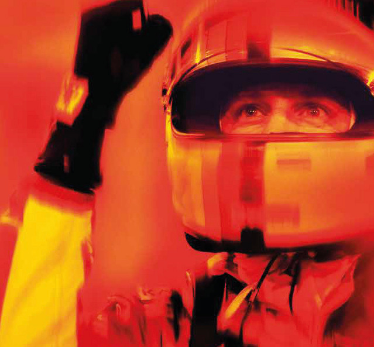

TABLE OF CONTENTS

1. GENERAL INFORMATION Welcome to the Hockenheimring - Foreword 3 Timetable 4-5 Circuit Map 6 Route to Hockenheimring 7 Route to Press Parking 8 Facts and Figures 9-11

1.1. HOCKENHEIMRING TRAVEL GUIDE Hockenheim at a Glance 12-13 Hotels / Restaurants & Cafés 14-17 Shopping / Banks / Car Rental / Taxis 18 Train Stations / Airport / Airlines 19 Emergency Numbers / Hospitals 20

2. MEDIA SERVICES Responsibilities: Track / FIA /Media Centre 21 Accreditation / Media Centre Opening Hours 22 Media Centre / Photographer’s area: Facilities 23 Shuttle-Services: Route / Timetable 24 Press Conferences 25

3. 2018 FIA FORMULA ONE WORLD CHAMPIONSHIP Race Calendar 26 Drivers Entry List 27 Drivers at a Glance 28 Teams at a Glance 29

2018 Circuit Characteristics & Results: Circuit Characteristic & Results: Australia Grand Prix 30-31 Circuit Characteristic & Results: Bahrain Grand Prix 32-33 Circuit Characteristic & Results: Chinese Grand Prix 34-35 Circuit Characteristic & Results: Azerbaijan Grand Prix 36-37 Circuit Characteristic & Results: Spanish Grand Prix 38-39 Circuit Characteristic & Results: Monaco Grand Prix 40-41 Circuit Characteristic & Results: Canadian Grand Prix 42-43 Circuit Characteristic & Results: French Grand Prix 44-45 Circuit Characteristic & Results: Austrian Grand Prix 46-47 Circuit Characteristic & Results: British Grand Prix 48-49 Circuit Characteristic: German Grand Prix 50 Circuit Characteristic: Hungarian Grand Prix 51 Circuit Characteristic: Belgium Grand Prix 52 Circuit Characteristic: Italian Grand Prix 53 Circuit Characteristic: Singapore Grand Prix 54 Circuit Characteristic: Russian Grand Prix 55

1

TABLE OF CONTENT - Continued

2018 Circuit Characteristic & Results: Circuit Characteristic: Japanese Grand Prix 56 Circuit Characteristic: United States Grand Prix 57 Circuit Characteristic: Mexican Grand Prix 58 Circuit Characteristic: Brazilian Grand Prix 59 Circuit Characteristic: Abu Dhabi Grand Prix 60

4. 2018 FIA FORMULA ONE CHAMPIONSHIP TEAM INFORMATIONEN Mercedes AMG Petronas Formula One Team 61 Scuderia Ferrari 62 Williams Martini Racing 63 Aston Martin Red Bull Racing 64 Sahara Force India F1 Team 65 Red Bull Toro Rosso Honda 66 Alfa Romeo Sauber F1 Team 67 McLaren F1 Team 68 Haas F1 Team 69 Renault Sport F1 Team 70

5. STATISTICS 2018 FIA F1 World Championship Statistical Data   2018 Race Results to Date 71   2018 Team Standing to Date 72   2018 Drivers Standing to Date 73

6. HISTORY BOOK: THE GERMAN FORMULA 1 GP - FIGURES/FACTS/STATISTICS Race Winners 74-76 Driver & Team Record Statistics 77-79 Driver World Champions 2017 80 Driver World Champions 2017-1950 81-82 Constructor World Champions 2017 – 1958 83-84 Driver Records: The Most 85 Team Records: The Most 86

7. RULES & REGULATIONS New Rules in 2018 87 Points, Classification, Race Distance 89 Race Flags 90

8. SUPPORT RACES 8.1 Porsche Mobil 1 Supercup 91 8.2 ADAC Formel 4 93 8.3 BOSS GP 95

2

WELCOME TO THE HOCKENHEIMRING

Welcome to the racing city of the Rhine-Neckar metropolitan region: Hockenheim! Many eyes will

once again be glued to the Hockenheimring this year when Formula 1 stops by our Motodrom for

the 36th time after taking a one-year "Germany break". This applies to 2018 even more than to

previous years... Besides us, many Hockenheim residents are also looking forward to hosting an

international racing event again. We therefore cordially invite you to experience the speed and

excitement of Formula 1 at the Hockenheimring and in Hockenheim!

We are keeping a keen eye on the races of the current season. The technical development and

changes in the regulations have initiated a positive trend. Exciting, fair positional battles are inspiring

spectators around the world – the Formula 1 legend is alive and well!

A variety of innovations dedicated to fans of the racing series have also helped the premiere class

of motor sport draw on its traditional strengths. The supporting programme offers fun and

entertainment for the whole family with an extra special live experience.

In addition to Formula 1, motor sport fans can also look forward to other racing series that will be

featured during the Grand Prix weekend. The Porsche Mobil 1 Supercup, the ADAC Formula 4 and

the BOSS GP with its incomparable high-revving ten-cylinder engines of the past Formula 1 will ensure

plenty of action on the track.

Apart from enjoying the races you can also take the opportunity to get to know our city: Hockenheim.

Under the motto "Hockenheim lives Formula 1", the Hockenheim Marketing Association and its many

partners are organising entertaining activities in the city centre on Saturday. The clubs in the city are

also actively involved.

With this year's race, our contract with the rights holders expires. We would very much welcome the

premiere class continuing to race for the World Cup at the Hockenheimring in the future.

We look forward to the most important motor sport event in Germany and expect the Motodrom to

be seated to capacity – including a large number of Dutch fans. We are sure that our race will be a

highlight of the 2018 season.

D      G      G     S      L    M        H          M        D        H          R    G  H

3

1. GENERAL INFORMATION

TIMETABLE – FORMULA 1 GROSSER PREIS VON DEUTSCHLAND 2018

THURSDAY 11:00 11:30 PROMOTER ACTIVITY PRESS ROOM SECURITY BRIEFING 11:00 17:00 FIA FIA GARAGE INITIAL SCRUTINEERING 12:30 13:00 FORMULA 1 TRACK FORMULA 1 PIRELLI HOT LAPS 13:00 15:00 FORMULA 1 TRACK TRACK CLOSED FIA/F1 SYSTEMS CHECKS 13:45 14:00 FIA TRACK TRACK INSPECTION, TRACK COMPLETELY CLEAR 14:00 15:00 FIA TRACK HIGH SPEED TRACK TEST – FIA SAFETY AND MEDICAL CARS 15:00 16:00 FORMULA 1 PRESS ROOM PRESS CONFERENCE 16:00 18:00 PROMOTER ACTIVITY PIT LANE PUBLIC PIT LANE WALK & TRACK TOURS FOR 3 DAY TICKET HOLDERS ONLY TBC 17:00 18:00 FORMULA 1 PRESS ROOM TEAM MANAGERS MEETING 17:00 19:00 PROMOTER ACTIVITY PIT LANE WELCOME BBQ 18:00 18:30 FORMULA 1 PIT LANE F1 EXPERIENCE – PIT LANE WALK (F1 EXPERIENCE GUESTS ONLY) 18:30 19:00 FORMULA 1 TRACK F1 EXPERIENCE – TRUCK TOUR (F1 EXPERIENCE GUESTS ONLY) FRIDAY 08:30 9:15 PADDOCK CLUB PIT LANE PADDOCK CLUB PIT LANE WALK 09:05 9:15 FIA TRACK MEDICAL INSPECTION 09:15 09:30 FIA TRACK TRACK INSPECTION AND SAFETY CAR TEST 09:45 10:151 ADAC F4 TRACK PRACTICE SESSION 10:30 10:40 FIA TRACK TRACK INSPECTION 11:00 12:301 FORMULA 1 TRACK FIRST PRACTICE SESSION 13:00 13:251 BOSS GP TBC TRACK FIRST PRACTICE SESSION 13:00 14:00 FORMULA 1 PRESS ROOM PRESS CONFERENCE 13:45 14:15 PADDOCK CLUB TRACK PADDOCK CLUB TRUCK TOURS 13:45 14:15 PADDOCK CLUB PIT LANE PADDOCK CLUB PIT LANE WALK 14:00 14:30 PORSCHE MOBIL 1 DRIVERS’ MEETING SUPERCUP 14:30 14:40 FIA TRACK TRACK INSPECTION 15:00 16:301 FORMULA 1 TRACK SECOND PRACTICE SESSION 16.45 17:15 FORMULA 1 TRACK FORMULA 1 PIRELLI HOT LAPS 17:20 18:051 PORSCHE MOBIL 1 TRACK PRACTICE SESSION SUPERCUP 18:00 19:00 FORMULA 1 PRESS ROOM DRIVER’S MEETING 18:30 18:55 BOSS GT TRACK SECOND PRACTICE SESSION 19:00 19:30 PADDOCK CLUB TRACK PADDOCK CLUB TRUCK TOUR 19:00 19:45 PROMOTER ACTIVITY PIT LANE MARSHAL PIT LANE WALK

*These times refer to the start of the formation lap 1Fixed End Sessions 2Approximate Finishing Time

PLEASE NOTE THAT THIS TIMETABLE IS SUBJECT TO AMENDMENTS

4

1. GENERAL INFORMATION

TIMETABLE – FORMULA 1 GROSSER PREIS VON DEUTSCHLAND 2018

SATURDAY 08:30 09:00 PADDOCK CLUB TRACK PADDOCK CLUB TRUCK TOUR 09:00 09:30 PADDOCK CLUB PIT LANE PADDOCK CLUB PIT LANE WALK 09:05 09:15 FIA TRACK MEDICAL INSPECTION 09:10 09:30 FORMULA 1 PIT LANE TEAM PIT STOP PRACTICE 09:15 09:30 FIA TRACK TRACK INSPECTION 09:50 10:05 ADAC F4 TRACK QUALIFYING SESSION 1 10:10 10:25 ADAC F4 TRACK QUALIFYING SESSION 2 10:50 11:20 BOSS GP TRACK QUALIFYING SESSION 11:30 11:40 FIA TRACK TRACK INSPECTION 12:00 13:001 FORMULA 1 TRACK THIRD PRACTICE SESSION 13:15 13:45 PADDOCK CLUB TRACK PADDOCK CLUB TRUCK TOUR 13:15 13:45 PADDOCK CLUB PIT LANE PADDOCK CLUB PIT LANE WALK 13:55 14:25 PORSCHE MOBIL 1 TRACK QUALIFYING SESSION SUPERCUP 14:30 14:40 FIA TRACK TRACK INSPECTION 15:00 16:00 FORMULA 1 TRACK QUALIFYING SESSION 16:30 16:50 FORMULA 1 TRACK FORMULA 1 PIRELLI HOT LAPS 17:00* 17:35² ADAC F4 TRACK FIRST RACE (… LAPS OR 30 MINS) 18:00 19:00 FORMULA 1 FAN ZONE FAN FORUM TBC 18:00* 18:252 BOSS GP TRACK FIRST RACE (… LAPS OR 20 MINS) 18:30 19:00 PADDOCK CLUB TRACK PADDOCK CLUB TRUCK TOURS SUNDAY 08:50 09:20 PADDOCK CLUB TRACK PADDOCK CLUB TRUCK TOUR 09:30 09:40 FIA TRACK MEDICAL INSPECTION 09:40 09:55 FIA TRACK TRACK INSPECTION AND TRACK TEST 10:10* 10:45² ADAC F4 TRACK SECOND RACE (… LAPS OR 30 MINS) 11:05* 11:40² BOSS GP TRACK SECOND RACE ( … LAPS OR 25 MINS) 12:05* 12:40² PORSCHE MOBIL 1 TRACK RACE (14 LAPS OR 30 MINS) SUPERCUP 12:50 13:10 FORMULA 1 TRACK FORMULA 1 PIRELLI HOT LAPS 13:15 14:05 PADDOCK CLUB TRACK PADDOCK CLUB TRUCK TOUR 13:30 14:00 FORMULA 1 TRACK DRIVERS TRACK PARADE 14:00 14:15 PROMOTER ACTIVITY TRACK STARTING GRID PRESENTATION 14:00 14:10 FIA TRACK MEDICAL INSPECTION 14:10 14:20 FIA TRACK TRACK INSPECTION 14:30 14:40 FORMULA 1 PIT LANE PIT LANE OPEN 14:54 14:56 FORMULA 1 TRACK NATIONAL ANTHEM 15:10* 17:10² FORMULA 1 TRACK GRAND PRIX (67 LAPS OR 120 MINS)

* These times refer to the start of the formation lap ¹ Fixed End Session ² Approximate Finishing time PLEASE NOTE THAT THIS TIMETABLE IS SUBJECT TO AMENDMENTS

5

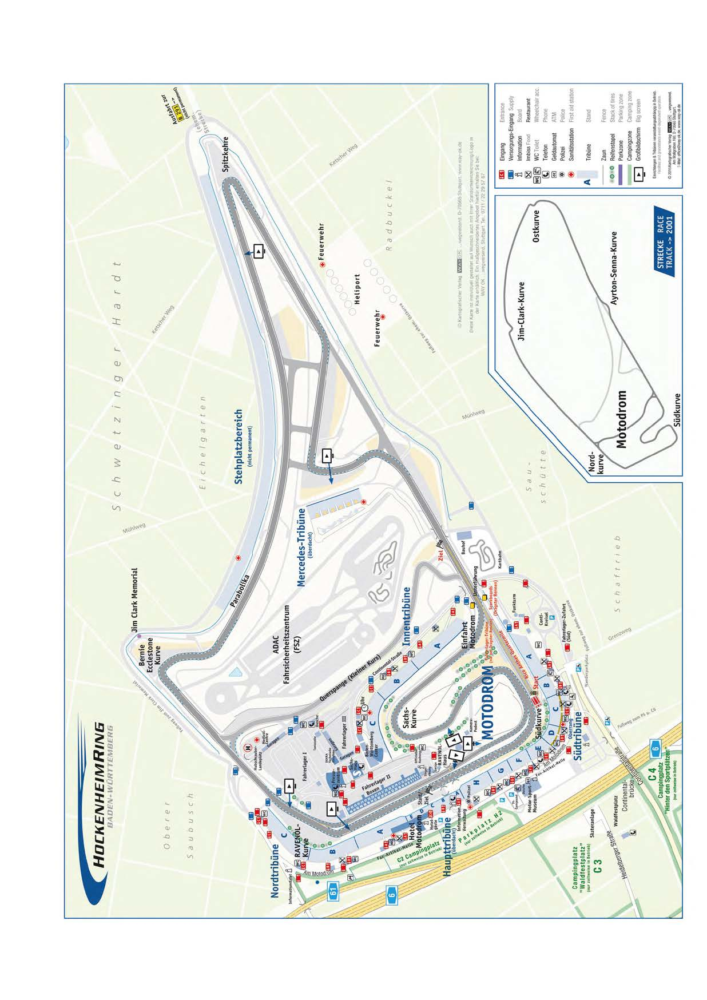

6

1. GENERAL INFORMATION

ROUTE TO HOCKENHEIMRING

APPROACHING FROM LARGER CITIES (AS BELOW)

Frankfurt / Mannheim • Autobahn (motorway) A6/E50 towards Heilbronn • Exit AS29 Schwetzingen/ Hockenheim, B36 in towards Hockenheim • Exit B36 Hockenheim Nord/ Hockenheim Talhaus, follow the racing driver logo towards Hockenheim

Koblenz / Köln / Mainz • Autobahn A61/E31 towards Heilbronn/ Stuttgart • Exit AS64 Hockenheim- L722 to Hockenheim Talhaus, follow the racing driver logo towards Hockenheim

Heilbronn • Autobahn A6/E50 towards Frankfurt • Exit Raststätte (motorway service) Hockenheim Ost, follow the racing driver logo

Basel (CH) / Karlsruhe • Autobahn A5/E35 towards Heidelberg • Exit AS39 Walldorf, B39 towards Hockenheim • Upon arrival in Hockenheim, follow the signage towards the Hockenheimring

PARKING AT HOCKENHEIMRING

Upon arrival, visitors will be guided towards the nearest available car parks. Busses and accredited media will be guided to P1.

PUBLIC TRANSPORT

Hockenheim is conveniently reached via train from Karlsruhe and Mannheim. There are shuttle busses operating between the train station and the Hockenheimring. Alternatively, it’s approx. 20 minutes walking distance.

7

1. GENERAL INFORMATION

ROUTE TO PRESS PARKING

From the south: From the north:

A5 Karlsruhe/Basel: A6 Mannheim/Frankfurt: Exit AS 39 „Walldorf“, follow the signs Exit AS 29 „Schwetzingen / Hockenheim“ via the B39 A61 Koblenz/Cologne: A 6 Heilbronn/Stuttgart: Exit AS 64 „Hockenheim“, take the L722 to Hockenheim, At motorway intersection „Walldorf“ onto the A5 towards from Hockenheim follow the pictograms Heidelberg/Frankfurt. Exit AS 39 „Walldorf“, follow the signs via the B39 A5 Heidelberg/Frankfurt: Exit AS 39 „Walldorf“, follow the signs via B39

8

1. GENERAL INFORMATION

FACTS & FIGURES / HOCKENHEIMRING BADEN-WÜRTTEMBERG A-Z

Throughout the Formula One™ weekend, F1 drivers, test drivers and

Autographs support race drivers will be available for autographs on the

‘Hockenheimring Stage’ at the F1-Fanzone.

The sporting organizer, the AvD (Automobilclub von Deutschland) will

have approximately 500 people working during the event. Amongst AvD these are marshals at the track, the team working in the pit lane and

other officials.

| Consumption (Food) | At each event, hungry fans consume approximately 5.2 tons of fried and cooked sausages, 6,000 cutlets, 10,000 meatballs and 80,000 bread rolls. You could build a pyramid of 14m length and 8m height from the above! The amount of mustard and ketchup consumed could fill 10 bathtubs. Additionally, more than 50,000 units of soft drinks and 50,000 cans of beer are drunk throughout the weekend. Piled on top of each other, that would be a tower of 11km in height, making it higher than the ‘Nanga Parbat’ and the ‘Zugspitze’ combined. |
| --- | --- |
| DRK | The German Red Cross will be present with more than 200 paramedics (60-70 of them directly at the track), more than 30 doctors, 16 ambulances, 3 extrication teams (6 people each) and 2 Teams of 3 people each dedicated to the pit lane only. |
| F1 Lap Record | Finnish driver Kimi Räikkönen (McLaren Mercedes) set a new lap record in 2004 with 1:13.780 minutes (on the track length of 4,574km). The average speed was 223.182 km/h. |

Fan TV will be transmitted onto the giant screens, strategically placed Fan-TV around the track. Throughout the weekend, it will broadcast

interesting news from the pit lane, competitions, traffic news and

entertainment.

Each race day, approx. 140 firemen and 22 fire engines are on stand- Fire Brigade by.

9

1. GENERAL INFORMATION

FACTS & FIGURES / HOCKENHEIMRING BADEN- WÜRTTEMBERG A-Z

| Formula One | Length: 4.574km Corners: 17 |
| --- | --- |
| Track | Width: at least 15m Straights: 6 |

Fan TV/ To ensure that spectators will not miss a single detail, giant Giant Screens screens have been placed around the track to broadcast interesting stories from the pit lane, events in the F1 Fanzone,® traffic information and so on. History 1932 Inauguration as motor racing track on 29th May 1938 Conversion from triangular to oval track layout; Named ‘Kurpfalzring’ 1947 Renamed to ‘Hockenheimring’ 1964/65 Construction of the ‘Motodrom’ 1966 First Motobike World Championship race 1970 First German Formula One Grand Prix since Permanent host to the German Grand Prix (exc.1985, 2007, 1977 2009, 2011, 2013, 2015, 2017)

Restructuring and modernisation of the track; shortening of 2002 the track from 6.823km to 4.574km

2006 Marked the 80th anniversary of the German Grand Prix and the 30th anniversary of the German Grand Prix at the Hockenheimring

2007 Marked the Hockenheimring’s 75th anniversary Anniversary: 60 years of Formula One and 40 years of Formula 2010 One at the Hockenheimring Marked the Hockenheimring’s 80th anniversary 2012

2016 Marked the Hockenheimring’s 50th Motodrom anniversary

Length F1 track length: 4.574 km (race tracks) Small track: 2.604 km Incl. entry to chicane (GP track): 2.589 km East Track: 3.084 km Quartermile: 402.33 m Pit-Walkabout All weekend ticket holders for the German Grand Prix will have access to the pit lane and get to see what’s behind the scenes! The pit walkabout will take place on Thursday, 28th July 2016 and they also get the opportunity to take part in bus rides over the track.

10

1. GENERAL INFORMATION

FACTS & FIGURES / HOCKENHEIMRING BADEN-WÜRTTEMBERG A-Z

Police Approximately 800 policemen will be present at the circuit during the German Grand Prix weekend.

Hockenheimring- Tune in to the dedicated special frequency of 92,4 FM for Radio powered by latest news around Hockenheim, the track, drivers, exciting RPR1. news from the pit lane, traffic and much more. The Ring Radio Team will be broadcasting live from their mobile broadcasting studio on the track.

Run-off Areas 8 meters on both sides of the track on straights and up to 100 meters on outside corners

Speeds Maximum approx. 330km/h

Average approx. 195km/h

Spectators In 2016 57,000 tickets were sold for Sunday’s race at the Hockenheimring.

Staff Throughout the weekend, approx. 1,500 staff is present and working around the track. This includes everyone from track marshals to parking assistants and security personnel.

Tarmac Width At least 15 meters

Telecommunications Throughout the Hockenheimring area, approximately 850 Internet lines, Hotspots as well as analogue lines are installed for teams, organisers and media.

11

1.1 GENERAL INFORMATION - TRAVEL GUIDE

HOCKENHEIMRING AT A GLANCE

With more than 700.000 visitors a year, there is something for everyone in Hockenheim. Hockenheim

has achieved fame worldwide for its racetrack, which regularly host to the elite of international

motor racing. Furthermore, the Hockenheim-Ring GmbH hosts spectacular Open Air-Concerts as

well as exciting driving experiences for motorsport fans. Hockenheim itself also offers a wide range

of activities for locals and visitors alike. It sense of community and numerous clubs of all kinds marks

it out as a city with high recreational value.

In addition, the famously charming region around the traditional racetrack has also a lot to offer. The

so called ‘Metropole Region Rhein-Neckar’ is also known as the center of social, economic and

cultural development. Stunning scenery and plenty of activities, both indoors and outdoors, leave

nothing to be desired. An overview of the most charming and enticing destinations to round up your

visit to the racetrack, are as follows:

HOCKENHEIM

• A mere ten-minute walk from the circuit, you’ll find a selection of restaurants, bars and

opportunities to shop on Karlsruher Straße. If you are in the mood for Live-Music, Musicals, or

a touch of Comedy, a visit to the ‘Hockenheimer Stadthalle’ and the ‘Pumpwerk

Hockenheim’ is a must. Should you fancy a good swim after a busy day you the ‘Aquadrom’

is your place to go. Or why not have a look into the famous ‘Tabacco Museum’, which

opened its doors in 1984.

For further information, please visit: www.hockenheim.de

SCHWETZINGEN

• Just like Hockenheim, nearby Schwetzingen (only 9km away by car or 6min by train) is famous

throughout Germany for its fabulous white asparagus. The best way to enjoy what is

commonly known as ‘White Gold’ is in one of the restaurants and Cafés around the

‘Schwetzinger Schlossplatz’ surrounding the palace in the heart of the city. Schwetzingen’s

baroque palace, with its beautifully landscaped gardens, also known as ‘Mini Versailles’, will

enchant you with beauty.

For further information, please visit: www.schwetzingen.de

12

1.1 GENERAL INFORMATION - TRAVEL GUIDE

HOCKENHEIMRING AT A GLANCE

SPEYER

• Distance to Hockenheimring: 12 km. Similarly, the cathedral of Speyer is well worth a visit for

culturally minded visitors. It’s so close and the gigantic imperial cathedral is simply awe-

inspiring and counts among one of the largest and most important romantic structures in

Germany. It has also been declared a world heritage site by UNESCO. Aside all those historic

places of interest, Speyer is also proud of their ‘Sea Life Speyer’, which takes you to a

fascinating underwater journey. Furthermore, the ‘Technic Museum’ is extremely popular for

its extensive exhibitions.

For more information, please visit: www.speyer.de

Heidelberg

• Distance to Hockenheimring: 20 km. Hockenheim also borders one of Germany’s most

famous and beautiful cities: Heidelberg. The main attraction is the palace of Heidelberg

‘Heidelberger Schloss’, from where you can enjoy unparalleled views across Heidelberg, its

old town and the Neckartal (the valley named after the river Neckar that winds through it).

The rapport of the palace, old town and river in the middle of the valley has inspired poets

and painters alike. Numerous shops across the historic town center as well as countless

restaurants, cafés and bars offer the perfect environment for some retail therapy and

relaxation. Heidelberg being a student city, also has a vibrant nightlife. There’s something for

everyone here: a Philharmonic Orchestra, cultural institutions and botanical gardens. And last

but not least, a boat trip on the Neckar is an absolute must!

For further information, please visit: www.heidelberg.de

Mannheim

• Distance to Hockenheimring: 26 km by car, ca. 20 min by train. Finally, there is Mannheim,

best known as a center of business and economies. Mannheim has a lot more to offer though.

A vibrant student city, it combines first class entertainment with cultural activities. A visit to

the ‘Luisenpark Mannheim’ will leave you in awe of the most stunning sea flowers you will ever

see. And if stargazing is more your cup of tea, you should head directly to the Planetarium or

to the National Theatre that stages a lot of highlights throughout the year. Or why not make

us of ‘shopping deluxe’ on the famous shopping mile in the center of town around the

‘Wasserturm’. For more information, please visit: www.mannheim.de

13

1.1 GENERAL INFORMATION - TRAVEL GUIDE

ACCOMONDATION OF HOTELS

|  | Hotel Motodrom Am Hockenheimring, 68766 Hockenheim Phone +49 (0) 6205/2 98-0 www.hockenheimring.de/hotel-motodrom H+Hotel Hockenheim Heidelberger Straße 8, 68766 Hockenheim Phone +49 (0) 6205/2 94-0 www.h-hotels.com | Astralis Hotel Domizil Schwetzinger Straße 50 69190 Walldorf Phone +49 (0) 6227 6080 www.astralis.de Leonardo Hotel Heidelberg City Centre Bergheimer Straße 63, 69115 Heidelberg Phone +49 (0) 6221/5080 www.leonardo-hotels.de |
| --- | --- | --- |
| Hotel Vorfelder Bahnhofstraße28, 69190 Walldorf Phone +49 (0) 6227/6990 | Hotel Vorfelder Bahnhofstraße28, 69190 Walldorf Phone +49 (0) 6227/6990 Gasthaus Zur Pfalz Schulstraße 25, 68766 Hockenheim Phone +49 (0) 6205/7625 www.hotelzurpfalzhockenheim.de Achat Hotels Hockenheimer Straße 86, 68799 Reilingen Phone +49 (0) 6205/9 59-0 www.achat-hotels.de Hotel Blautannen Blautannenstraße 2, 68804 Altlußheim Phone +49 (0) 6205/32752 www.hotel-blautannen.de Hotel Grenzhof Grenzhof 9, 69123 Heidelberg Phone +49 6202 / 943 – 0 www.grenzhof.de | Achat Comfort Hotel Gleisstraße 8/1, 68766 Hockenheim Phone +49 (0) 6205/2970 www.achat-hotel.de Hotel Am Flugplatz Hinter den Bergen 1/1, 68766 Hockenheim Phone +49 (0) 6205/20 84 100 www.hotel-am-flugplatz-hockenheim.de Gästehaus Doris Berlinallee 20, 68766 Hockenheim Phone +49 (0) 6205/7250 www.gaestehausdoris.de Hotel Adler Hockenheimer Straße 2, 68809 Neulußheim Phone +49 (0) 6205/20 81 800 www.hoteladler.de Luxhof Rheinhotel Ketscher Landstraße 2, 68804 Altlußheim Phone +49 (0) 6205/303-0 www.luxhof.de |

14

1.1 GENERAL INFORMATION - TRAVEL GUIDE

RESTAURANTS & CAFÉS

Hockenheim

| Brauerei zum Stadtpark Parkstraße 1b, 68766 Hockenheim Phone +49 6205 283688 www.brauereizumstadtpark.de Brewery with traditional menu | et cetera Karlsruher Straße 25, 68799 Hockenheim Phone +49 6205 5999 www.et-cetera.com Small Bistro |
| --- | --- |
| Knossos Palace Arndtstraße 3, 68766 Hockenheim Phone +49 6205 2047 007 Greek Restaurant | Bella Capri Untere Hauptstraße 9, 68766 Hockenheim Phone +49 6205 7169 Italian Restaurant with Beer garden |
| China-Restaurant Kanton Heidelberger Str. 20, 68766 Hockenheim Phone +49 6205 1 33 61 Chinese Restaurant | Café Lato Karlsruher Strasse 4, 68766 Hockenheim Phone +49 6205 287 1181 www.lato-hockenheim.de Coffee specialties & snacks around the clock |

Heidelberg

CAFÉ ROSSI Cafe Villa

Rohrbacher Straße 4, 69115 Heidelberg Hauptstraße 187, 69117 Heidelberg

Phone +496221 9746-0 Phone +49 6221 433 28 67

www.caferossi.de www.cafevilla.de

Same Same Heid’s Heidelberg

Steingasse 3, 69117 Heidelberg Speyrer Straße 15, 69124 Heidelberg

Phone +49 6221 7291 737 Phone +49 6221 1800 11

www.sushiheidelberg.de www.heids-heidelberg.de

Small Sushi-Bar

Grenzhof – Hotel und Restaurant Vetter Alt Heidelberg Brauhaus

Grenzhof 8-9, 69123 Heidelberg Steingasse 9, 69117 Heidelberg

Phone +49 6202 9430 Phone +49 6221 16 5850 www.grenzhof.de www.brauhaus-vetter.de

Small but very good menu ,beautiful Beer garden Typical Brewery, solid menu

15

1.1 GENERAL INFORMATION - TRAVEL GUIDE

RESTAURANTS & CAFÉS

Heidelberg

Sakura Sushi Osteria Zafferano

Bergheimer Strasse 7, 69115 Heidelberg Poststrasse 34, 69115 Heidelberg

Phone +49 6221 453 1872 Phone +49 6221 8730 094

www.sakura-heidelberg.de Italian Restaurant, Pizza

Schwetzingen

| Kaffeehaus am Schloßplatz Schloßplatz 3, 68723 Schwetzingen Phone +49 6202 12170 www.kaffeehaus.de Café, Bar and Restaurant | Walzwerk Café Karlsruher Straße 1, 68723 Schwetzingen Phone +49 6202 9327 0 www.walzwerk-cafe.de Café, Restaurant and Bar |
| --- | --- |
| Grüner Baum Carl-Theodor-Straße 2, 68723 Schwetzingen Phone +49 6202 4362 www.wirtshauszumgruenenbaum.de Restaurant; Fridays & Saturdays Midnight menu from 23-3 h | Blaues Loch Zeyherstraße 3, 68723 Schwetzingen Phone +49 6202 21360 www.blaues-loch.de Cozy Restaurant with large beer garden |

Mannheim

Restaurant Lindbergh Grande Café Prag

Seckenheimer Landstraße 170, 68163 Mannheim E4 17, 68159 Mannheim

Phone +49 621 412465 Phone +49 621 7605 9876

www.restaurant-lindbergh.de www.cafeprag.de

Restaurant/Bar/large Beer garden, Typical, cozy Coffeehouse

free Internet access; 1x weekly Live-Music

16

1.1 GENERAL INFORMATION - TRAVEL GUIDE

RESTAURANTS & CAFÉS

Mannheim

| Café Vienna | Playa del Mar |
| --- | --- |
| S1 15, 68161 Mannheim | Industriestraße 35, 68169 Mannheim |
| Phone +49 621 4457 9537 | Phone +49 621 1540 3469 |
| www.cafevienna.de | www.playadelma.de |
| Vegetarian Restaurant, German & Italian Cuisine | Restaurant, Bar, Beach Club |

BARS & LOUNGES

Heidelberg

|  | Boho Bar Kettengasse 11, 69117 Heidelberg Phone +49 6221 72 555 20 www.boho-heidelberg.de Kaiser Untere Straße 30, 69117 Heidelberg Phone +49 6221 91 488 75 www.kaiser-heidelberg.de | Café Villa Hauptstraße 187, 69117 Heidelberg Phone +49 6221 433 2867 www.cafevilla.de La Bohème Steingasse 11, 69117 Heidelberg Phone +49 6221 725 2168 |
| --- | --- | --- |
| Schiller’s Café und Vinothek Heiliggeiststrasse 5, 69117 Heidelberg Phone +49 175 4028 456 | Schiller’s Café und Vinothek Heiliggeiststrasse 5, 69117 Heidelberg Phone +49 175 4028 456 | Sonderbar Untere Straße 13, 69117 Heidelberg Phone +49 6221 2520 |

17

1.1 GENERAL INFORMATIONEN- TRAVEL GUIDE

SHOPPING / BANKS / CAR RENTALS / TAXIS

Shopping

| Hockenheim-Center Speyerer Straße 2, 68766 Hockenheim Phone +49 6205 207 123 | Rhein-Neckar-Zentrum Viernheim Robert-Schuman-Straße 8a, 68519 Viernheim Phone +49 6204 96240 |
| --- | --- |
| Rhein Galerie Ludwigshafen Im Zollhof 4, 67061 Ludwigshafen am Rhein Phone +49 621 5918 3410 | Mannheim Innenstadt Around Wasserturm Altstadt Heidelberg From Bismarckplatz |

Banks

| Commerzbank Obere Hauptstrasse 16, 68766 Hockenheim Phone +49 6205 2027- 0 | Sparkasse Untere Hauptstrasse 2, 68766 Hockenheim Phone +49 6221 5110 |
| --- | --- |
| Santander Consumer Bank Rohrbachstrasse 8, 69115 Heidelberg Phone +49 6221 90190 | Volksbank Parkstr. 1a, 68766 Hockenheim Phone +49 6205 2930 |

Car Rentals

|  | Avis (Heidelberg) Phone +49 6221 2 22 15 | Europcar (Speyer) Phone +49 6232 6 77 90 |
| --- | --- | --- |
| Hertz (Mannheim) Phone +49 621 22997 & +49 621158266 | Hertz (Mannheim) Phone +49 621 22997 & +49 621158266 | Sixt (Heidelberg) Phone +49 180 6 666666 |

Taxis

|  | Taxi City-Car Phone +49 6205 1 60 00 | City Car (Speyer) Phone +49 6232 990 600 |
| --- | --- | --- |
| Auto-Funk-Taxi (Heidelberg) Phone +49 6221 30 20 30 | Auto-Funk-Taxi (Heidelberg) Phone +49 6221 30 20 30 |  |

18

1.1 GENERAL INFORMATIONEN - TRAVEL GUIDE

TRAIN STATIONS / AIRPORTS /AIRLINES

Train Stations

| Hockenheim Eisenbahnstraße 2-4, 68766 Hockenheim Phone +49 6205 29 24 21 | Heidelberg Willy-Brandt-Platz 5, 69115 Heidelberg Phone +49 6221 525-0 |
| --- | --- |
| Frankfurt Bahnhof Frankfurt (Main) Hbf, Im Hauptbahnhof, 60329 Frankfurt (Main) Phone +49 69 265-0 | Mannheim Bahnhof Mannheim Willy-Brandt-Platz 17, 68161 Mannheim Phone +49 621 830 1055 |

Airports

Airport Frankfurt Airport Stuttgart

Taudeport, Im Tauberngrund 27, 65451Frankfurt Flughafenstraße 43, 70629 Stuttgart

Phone +49 69 690-0 Phone +49 711 9480

Airlines

| Alitalia Phone 01805 074 747 | British Airways Phone 01805 266 522 |
| --- | --- |
| Air Berlin Phone 01805 737 800 | Condor Phone 01805 767 757 |
| Air France Phone 01805 830 830 | Deutsche Lufthansa Phone 01805 805 805 |
| Iberia Phone 01805 442 900 |  |

19

1.1 GENERAL INFORMATIONEN- TRAVEL GUIDE

EMERGENCY- NUMBERS

Emergency- Numbers

| Police in General Phone 110 | Police Hockenheim Phone 06205 2 86 00 |
| --- | --- |
| Fire Brigade Phone 112 | Ambulance Phone 06202 1 92 22 or 06205 1 55 11 |

Hospitals

| Schwetzinger Hospital | Heidelberger University Hospital |
| --- | --- |
| Bodelschwinghstrasse 10 | Im Neuenheimer Feld 672 |
| 68723 Schwetzingen | 69120 Heidelberg |
| Phone +49 6202 84 30 | Phone +49 6221 56-0 |
| University Clinic of Mannheim | Orthopedic Clinic in Schlierbach |
| Theodor- Kutzer- Ufer 1-3 | Schlierbacher Landstrasse 200a |
| 68167 Mannheim | 69118 Heidelberg |
| Phone +49 621 3830 | Phone +49 6221 956 |
| Diakonissen Speyer |  |
| Hilgardstrasse 26 |  |
| 67346 Speyer |  |
| Phone +49 6232 220 |  |

20

2. MEDIA SERVICES

RESPONSIBILITIES

Track

Operating Company

Hockenheim-Ring GmbH

Am Motodrom

68766 Hockenheim

Phone: +49 6205 950- 0

Fax: +49 6205 950-299

Email: info@hockenheimring.de

Website: www.hockenheimring.de

Clerk of Course: Oliver Grodowski

Steward: Felix Holter

FIA

Race Director/Starter & Safety Delegate: Charlie Whiting

FIA Medical Delegate: Dr. Alain Chantegret

FIA Technical Delegate: Jo Bauer

F1 Head of Communications & Media Delegate: Matteo Bonciani

F1 Deputy Media Delegate: Pierre Guyonnet-Duperat

FIA Safety Car Driver: Bernd Mayländer

FIA Medical Car Driver: Alan Van Der Merwe

Stewards: Nish Shetty, Steve Stringwell, Mika Salo

MEDIA CENTRE - RESPONSIBILITIES

National Press Officer: Egbert Thamm

International Media & PR: Tom Cooney

Media Accreditation National Press: Martina Rathmann

21

2. MEDIA SERVICES

ACCREDITATION AND MEDIA CENTRE

ACCREDITATION

Location The Media Accreditation Centre is located next to the media car park in the

pavillion opposite the Hockenheim fire station on Heidelberger Straße 89/1.

Opening Hours Thursday, July 19th 08.00 – 18.00 hrs

Friday, July 20th 08.00 – 16.00 hrs

Saturday, July 21st 08.00 – 12.00 hrs

Sunday, July 22nd 08.00 – 10.00 hrs

MEDIA CENTRE

Location The Media Centre is located next to the Sachs-Haus in the Formula One

Paddock.

Opening Hours Thursday, July 19th 09.00 – 22.00 hrs

Friday, July 20th 07.00 – 23.00 hrs

Saturday, July 21st 07.00 – 23.00 hrs

Sunday, July 22nd 07.00 – 23.00 hrs*

*Until the last Journalist/ Photographer

leaves the Media Centre.

22

2. MEDIA SERVICES

MEDIA CENTRE

Facilities

| Press Room | • 350 seats • 8 public telephones • Private Telephones as requested • 1 fax machine • 52 TV monitors • 52 time-/ information monitors • Private WiFi internet connection on request • 8 Internet workstations (free of charge) • 250 lockers (Please obtain a key from one of the Media Centre staff at the reception desk. A deposit of €10,00 per key is applicable) |
| --- | --- |
| Photographers’ Area | The photographers’ Area comprises the following: • Wire Sending Area inside the Sachs-Haus, 103 seats • Locker room • Camera- Service- Centre There are a 110 lockers available to photographers. (Please obtain a key from one of the Media Centre staff at the reception desk. A deposit of €10,00 per key is applicable) A cleaning and hire service for cameras is offered as in previous years. Four specialists will be at your service in the photographers’ area. The Photographer’s Area offers a wire sending area for over 2500 devices to be used via the broadband internet lines. |
| TV / Radio | 36 air- conditioned and soundproof boxes are available to television and radio commentators below the grandstand roof. |

23

2. MEDIA SERVICES

SHUTTLE SERVICE

Media Shuttles

| Route | Shuttles operate between the Media Car Park, the TV- Compound and the entrance to the Formula One Paddock. |
| --- | --- |
| Operating Hours | Thursday, 19th July 08.00 – 22.00 hrs Friday, 20th July 07.00 – 23.00 hrs Saturday, 21st July 07.00 – 23.00 hrs Sunday, 22nd July 07.00 – open end* *Until the last Journalist/ Photographer leaves the Media Centre. |
| Notice | Journalists and photographers who wish to stay beyond the operating hours are kindly requested to contact the Media Centre staff at the reception desk at least one hour before the Media Centre closes. |

Photographers’ Shuttles

| Route | A photographers’ shuttle service is provided non-stop during the Formula 1 practice sessions and race to important locations around the track, using the service road. This service is also in operation during the support race practice sessions and support race. |
| --- | --- |
| Operating Hours | Please refer to the schedule on the official notice board in the photographers’ room. |
| Red Zones | Please refer to the note on the notice board which will be put up on Thursday night once the decision on this will be made. |
| Photographers’ Tower | Please refer to the map on the official notice board in the photographers’ room for information on the positions of the photographers’ tower. |
| Crossing the track | Crossing the track is allowed from 30 minutes before each practice session and 60 minutes before the Grand Prix race. |

24

2. MEDIA SERVICES

PRESS CONFERENCES

| Formel 1 | Thursday, 15.00 hrs, in the Media Centre: Press conference for a maximum of six drivers, chosen by the FIA F1 Head of Communications Friday, 13.00 hrs, in the Media Centre: Press Conference with a max. of six team personalities, chosen by the FIA F1 Head of Communications Saturday, following the qualifying session: TV-Unilateral interview with top three drivers of the qualifying session Saturday, after the TV-Unilateral interview, at the Media Centre: Post- Qualifying Press Conference with top three drivers of the qualifying session Sunday, before the podium celebrations: TV-Unilateral Interview with top three finishing drivers Sunday, after the TV-Unilateral Interview, in the Media Centre: Post- Race Press Conference with top three finishing drivers |
| --- | --- |
| Notice | Photographers’ are kindly requested to use the steps that have been provided behind the rows for the journalists. |

25

3. 2018 FIA FORMULA 1 WORLD CHAMPIONSHIP™

CALENDAR

23-25 Mar ROLEX AUSTRALIAN GRAND PRIX Melbourne

06-08 Apr GULF AIR BAHRAIN GRAND PRIX Sakhir

13-15 Apr HEINEKEN CHINESE GRAND PRIX Shanghai

27 -29 Apr AZERBAIJAN GRAND PRIX Baku

11-13 May GRAN PREMIO DE ESPAÑA Catalunya

24-27 May GRAND PRIX DE MONACO Monte Carlo

08-10 Jun HEINEKEN GRAND PRIX DU CANADA Montréal

22-24 Jun GRAND PRIX DE FRANCE Le Castellet

29 Jun -01 Jul GROSSER PREIS VON ÖSTERREICH Spielberg

06-08 Jul ROLEX BRITISH GRAND PRIX Silverstone

20-22 Jul GROSSER PREIS VON DEUTSCHLAND Hockenheim

27-29 Jul FORMULA MAGYAR NAGYDÍJ Budapest

24-26 Aug BELGIAN GRAND PRIX Spa

31Aug-02 Sep GRAN PREMIO HEINEKEN D'ITALIA Monza

14-16 Sep SINGAPORE GRAND PRIX Singapore

28 -30 Sep VTB RUSSIAN GRAND PRIX Sochi

05 -07 Oct JAPANESE GRAND PRIX Suzuka

19-21 Oct UNITED STATES GRAND PRIX Austin

26-28 Oct GRAN PREMIO DE MEXICO Mexico City

09-11 Nov GRANDE PRĒMIO HEINEKEN DO BRASIL São Paulo

23-25 Nov ETIHAD AIRWAYS ABU DHABI GRAND PRIX Yas Marina

26

3. 2018 FIA FORMULA 1 WORLD CHAMPIONSHIP™

DRIVER ENTRY LIST

| No. | Driver | Country | Team |
| --- | --- | --- | --- |
| 44 | Lewis Hamilton | Great Britain | Mercedes AMG Petronas Motorsport |
| 77 | Valtteri Bottas | Finland | Mercedes AMG Petronas Motorsport |
| 5 | Sebastian Vettel | Germany | Scuderia Ferrari |
| 7 | Kimi Räikkönen | Finland | Scuderia Ferrari |

3 Daniel Ricciardo Australia Aston Martin Red Bull Racing

33 Max Verstappen Netherland Aston Martin Red Bull Racing

| 11 | Sergio Perez | Mexico | Sahara Force India F1 Team |
| --- | --- | --- | --- |
| 31 | Esteban Ocon | France | Sahara Force India F1 Team |

18 Lance Stroll Canada Williams Martini Racing

Williams Martini Racing 35 Sergey Sirotkin Russia

| 27 | Nico Hulkenberg | Germany | Renault Sport Formula One Team |
| --- | --- | --- | --- |
| 55 | Carlos Sainz | Spain | Renault Sport Formula One Team |

10 Pierre Gasly France Red Bull Toro Rosso Honda

28 Brendon Hartley New Zealand Red Bull Toro Rosso Honda

| 8 | Romain Grosjean | France | Haas F1 Team |
| --- | --- | --- | --- |
| 20 | Kevin Magnussen | Denmark | Haas F1 Team |

14 Fernando Alonso Spain McLaren F1 Team

2 Stoffel Vandoorne Belgium McLaren F1 Team

| 9 | Marcus Ericsson | Sweden | Alfa Romeo Sauber F1 Team |
| --- | --- | --- | --- |
| 16 | Charles Leclerc | Monaco | Alfa Romeo Sauber F1 Team |

27

3. 2018 FIA FORMULA 1 WORLD CHAMPIONSHIP™ – DRIVERS AT A GLANCE

Driver Debut GP Entered Poles Podium Wins Titles Total Points

Sebastian Vettel 2007 209 54 104 51 4 2596

Lewis Hamilton 2007 218 76 124 65 4 2773

Valtteri Bottas 2013 108 5 26 3 0 820

Kimi Räikkönen 2001 283 17 97 20 1 1681

Daniel Ricciardo 2011 139 2 29 7 0 922

Max Verstappen 2014 70 0 15 4 0 514

Sergio Perez 2011 146 0 8 0 0 490

Esteban Ocon 2016 39 0 0 0 0 112

Carlos Sainz 2015 70 0 0 0 0 146

Nico Hulkenberg 2010 147 0 0 0 0 447

Lance Stroll 2017 30 0 1 0 0 44

Romain Grosjean 2009 134 0 10 0 0 356

Kevin Magnussen 2014 71 0 1 0 0 120

Fernando Alonso 2001 303 22 97 32 2 1889

Stoffel Vandoorne 2016 31 0 0 0 0 22

Marcus Ericsson 2014 86 0 0 0 0 12

Pierre Gasly 2017 15 0 0 0 0 19

Brendon Hartley 2017 14 0 0 0 0 1

Charles Leclerc 2018 10 0 0 0 0 13

Sergey Sirotkin 2018 10 0 0 0 0 0

28

3. 2018 FIA FORMULA 1 WORLD CHAMPIONSHIP™ – TEAMS AT A GLANCE

| Team |  | F1 | Debut | Wins | Pole |  | Fastest |  | Total |
| --- | --- | --- | --- | --- | --- | --- | --- | --- | --- |
|  |  | Titles |  |  |  |  | Laps |  | Points |
| Mercedes AMG Petronas Motorsport | 4 |  | 1954 | 79 | 93 | 59 |  | 3985 |  |

Scuderia Ferrari 16 1950 234 213 245 8313

Aston Martin Red Bull Racing 4 1997 58 59 59 4087.5

Sahara Force India F1 Team 0 1991 0 1 5 1039

Williams Martini Racing 9 1978 114 129 133 3551

Renault Sport Formula One Team 2 1986 35 51 31 1453

Red Bull Toro Rosso Honda 0 2006 1 1 1 402

Haas F1 Team 0 2016 0 0 0 127

McLaren F1 Team 8 1966 182 155 155 5194.5

Alfa Romeo Sauber F1 Team 0 1993 0 1 5 882

29

CIRCUIT CHARACTERISTICS

FORMULA 1 2018 ROLEX AUSTRALIAN GRAND PRIX

MELBOURNE

Date 23 – 25 Mar Race distance 307.574 km

Circuit length 5.303 km Number of laps 58

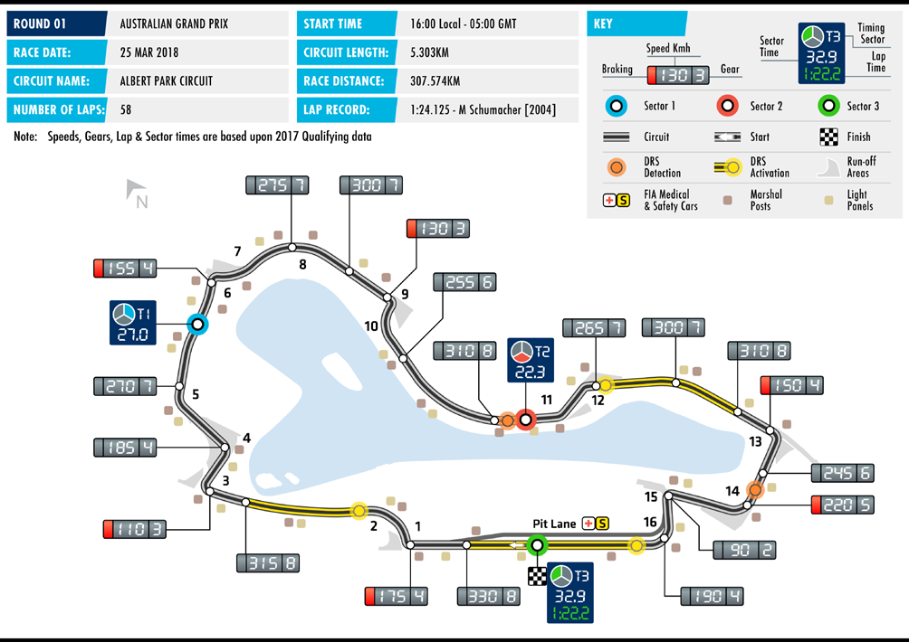

Melbourne’s Albert Park remains one of the most popular circuits with fans on the F1 calendar, offering a combination of long straights, sweeping curves and tight chicanes make it a welcome challenge for the drivers. The Australian Grand Prix is this season’s first round of the Formula 1 Championship, having held this distinction each year since the event moved to Melbourne in 1996, excluding 2006 and 2010.

30

FORMULA 1 2018 ROLEX AUSTRALIAN GRAND PRIX

RESULTS

Pos Driver Team Time / Retired Grid

1 Sebastian Vettel Scuderia Ferrari 1:29:33.283 3

Mercedes AMG Petronas 2 Lewis Hamilton +5.036s 1 Motorsport

3 Kimi Räikkönen Scuderia Ferrari +6.309s 2

4 Daniel Ricciardo Aston Martin Red Bull Racing +7.069s 8

5 Fernando Alonso McLaren F1 Team +27.886s 10

6 Max Verstappen Red Bull Toro Rosso Honda +28.945s 4

7 Nico Hulkenberg Renault Sport F1 Team +32.671s 7

Mercedes AMG Petronas 8 Valtteri Bottas +34.339s 15 Motorsport

9 Stoffel Vandoorne McLaren F1 Team +34.921s 11

10 Carlos Sainz Red Bull Toro Rosso Honda +45.722s 9

11 Sergio Perez Sahara Force India F1 Team +46.817s 12

12 Esteban Ocon Sahara Force India F1 Team +60.278s 14

13 Charles Leclerc Alfa Romeo Sauber F1 Team +75.759s 18

14 Lance Stroll Williams Martini Racing +78.288s 13

15 Brendon Hartley Red Bull Toro Rosso Honda +1 Lap 16

NC Romain Grosjean Haas F1 Team DNF 6

NC Kevin Magnussen Haas F1 Team DNF 5

NC Pierre Gasly Red Bull Toro Rosso Honda DNF 20

NC Marcus Ericsson Alfa Romeo Sauber F1 Team DNF 17

NC Sergey Sirotkin Williams Martini Racing DNF 19

Pole position Lewis Hamilton 1:21.164s

Fastest lap Daniel Ricciardo 1:25.945s

31

FORMULA 1 2018 GULF AIR BAHRAIN GRAND PRIX

SAKHIR

Date 06 - 08 Apr Race distance 308.238 km

Circuit length 5.412 km Number of laps 57

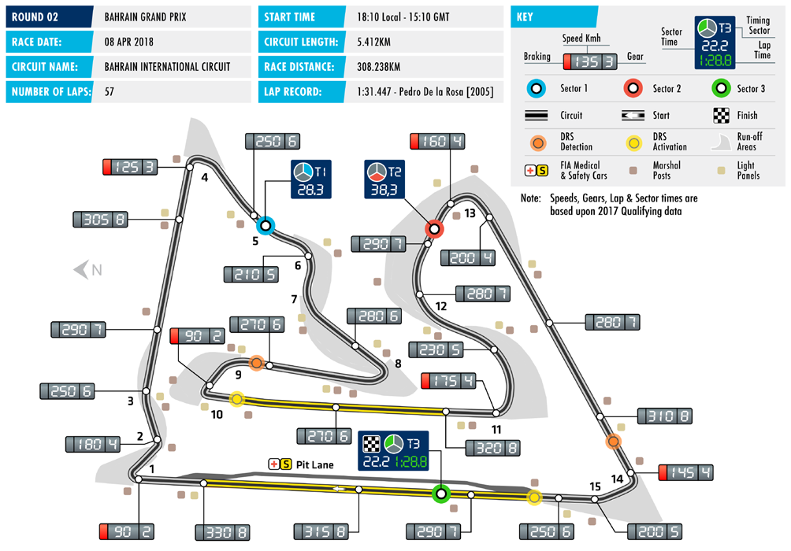

The Bahrain International Circuit has quickly become a popular host for world-class motor sport. Professional facilities and experienced staff has paved the way for numerous international race series to utilize the circuit, including: Formula 2 Championship and Porsche GT3 Cup.

32

FORMULA 1 2018 GULF AIR BAHRAIN GRAND PRIX

RESULTS

Pos Driver Team Time / Retired Grid

1 Sebastian Vettel Scuderia Ferrari 1:32:01.940 1

Mercedes AMG Petronas 2 Valtteri Bottas +0.699s 3 Motorsport

Mercedes AMG Petronas 3 Lewis Hamilton +6.512s 9 Motorsport

4 Pierre Gasly Red Bull Toro Rosso Honda +62.234s 5

5 Kevin Magnussen Haas F1 Team +75.046s 6

6 Nico Hulkenberg Renault Sport F1 Team +99.024s 7

7 Fernando Alonso McLaren F1 Team +1 Lap 13

8 Stoffel Vandoorne McLaren F1 Team +1 Lap 14

9 Marcus Ericsson Alfa Romeo Sauber F1 Team +1 Lap 17

10 Esteban Ocon Sahara Force India F1 Team +1 Lap 8

11 Carlos Sainz Red Bull Toro Rosso Honda +1 Lap 10

12 Charles Leclerc Alfa Romeo Sauber F1 Team +1 Lap 19

13 Romain Grosjean Haas F1 Team +1 Lap 16

14 Lance Stroll Williams Martini Racing +1 Lap 20

15 Sergey Sirotkin Williams Martini Racing +1 Lap 18

16 Sergio Perez Sahara Force India F1 Team +1 Lap 12

17 Brendon Hartley Red Bull Toro Rosso Honda +1 Lap 11

NC Kimi Räikkönen Scuderia Ferrari DNF 2

NC Max Verstappen Red Bull Toro Rosso Honda DNF 15

NC Daniel Ricciardo Aston Martin Red Bull Racing DNF 4

Pole position Lewis Hamilton 1:27.958s

Fastest lap Valtteri Bottas 1:33.740s

Note – Perez originally finished 12th but had 30s added to race time for passing on the formation lap. Hartley originally finished 13th but had 30s added to race time for failing to retake his original starting position before reaching the safety-car line on the formation lap.

33

FORMULA 1 2018 HEINEKEN CHINESE GRAND PRIX

SHANGHAI

Date 13 - 15 Apr Race distance 305.066 km

Circuit length 5.451 km Number of laps 56

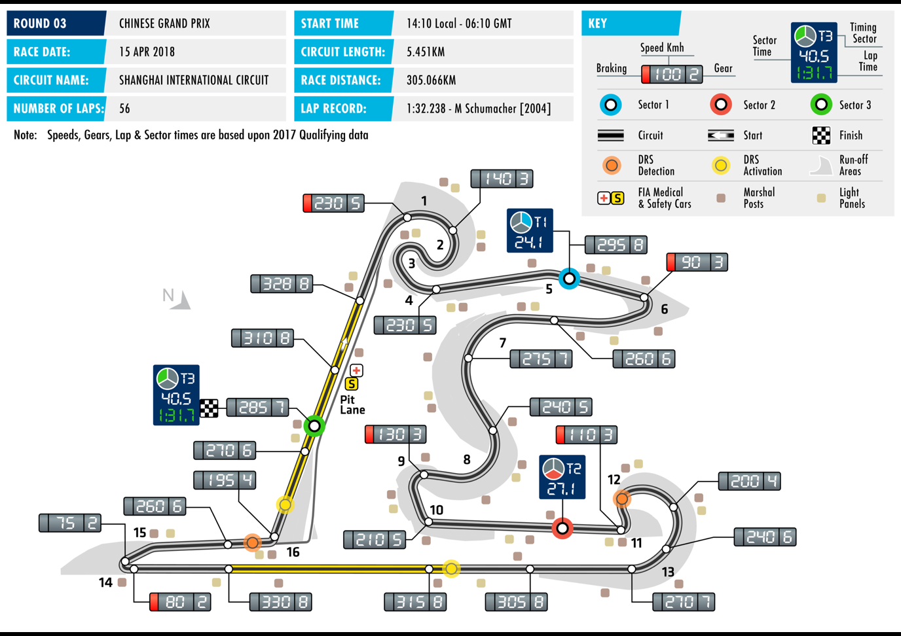

The Shanghai International Circuit boasts various winding turns and high-speed straights, demanding a great deal of acceleration and deceleration, while providing numerous overtaking opportunities.

34

FORMULA 1 2018 HEINEKEN CHINESE GRAND PRIX

RESULTS

Pos Driver Team Time / Retired Grid

1 Daniel Ricciardo Aston Martin Red Bull Racing 1:35:36.380 6

Mercedes AMG Petronas 2 Valtteri Bottas +8.894s 3 Motorsport

3 Kimi Räikkönen Scuderia Ferrari +9.637s 2

Mercedes AMG Petronas 4 Lewis Hamilton +16.985s 4 Motorsport

5 Max Verstappen Red Bull Toro Rosso Honda +20.436s 5

6 Nico Hulkenberg Renault Sport F1 Team +21.052s 7

7 Fernando Alonso McLaren F1 Team +30.639s 13

8 Sebastian Vettel Scuderia Ferrari +35.286s 1

9 Carlos Sainz Red Bull Toro Rosso Honda +35.763s 9

10 Kevin Magnussen Haas F1 Team +39.594s 11

11 Esteban Ocon Sahara Force India F1 Team +44.050s 12

12 Sergio Perez Sahara Force India F1 Team +44.725s 8

13 Stoffel Vandoorne McLaren F1 Team +49.373s 14

14 Lance Stroll Williams Martini Racing +55.490s 18

15 Sergey Sirotkin Williams Martini Racing +58.241s 16

16 Marcus Ericsson Alfa Romeo Sauber F1 Team +62.604s 20

17 Romain Grosjean Haas F1 Team +65.296s 10

18 Pierre Gasly Red Bull Toro Rosso Honda +66.330s 17

19 Charles Leclerc Alfa Romeo Sauber F1 Team +82.575s 19

20 Brendon Hartley Red Bull Toro Rosso Honda DNF 15

Pole position Sebastian Vettel 1:31.095s

Fastest lap Daniel Ricciardo 1:35785s

35

FORMULA 1 2018 AZERBAIJAN GRAND PRIX

BAKU

Date 27 - 29 Apr Race distance 306.049 km

Circuit length 6.003 km Number of laps 51

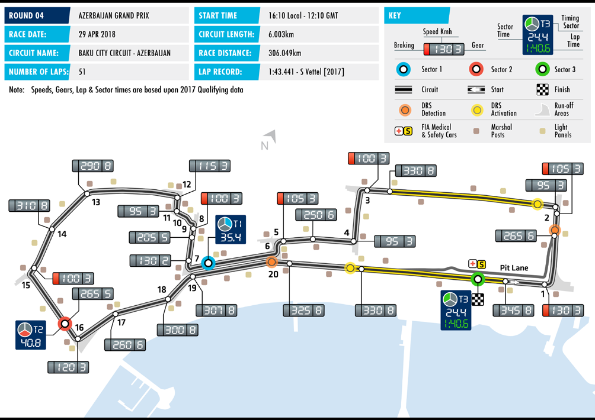

The six kilometre, anti-clockwise layout of the circuit was designed by circuit architect Hermann Tilke. The circuit starts adjacent to Azadliq Square, then loop around Government House before heading west to Maiden Tower. Here, the track has a narrow uphill traversal and then circle the Old City before opening up onto a 2.2 km (1.4 mi) stretch along Neftchilar Avenue back to the start line.

36

FORMULA 1 GRAND PRIX 2018 AZERBAIJAN GRAND PRIX

RESULTS

Pos Driver Team Time / Retired Grid

Mercedes AMG Petronas 1 Lewis Hamilton 1:43:44.291 2 Motorsport

2 Kimi Räikkönen Scuderia Ferrari +2.460s 6

3 Sergio Perez Sahara Force India F1 Team +4.024s 8

4 Sebastian Vettel Scuderia Ferrari +5.329s 1

5 Carlos Sainz Red Bull Toro Rosso Honda +7.515s 9

6 Charles Leclerc Alfa Romeo Sauber F1 Team +9.158s 13

7 Fernando Alonso McLaren F1 Team +10.931s 12

8 Lance Stroll Williams Martini Racing +12.546s 10

9 Stoffel Vandoorne McLaren F1 Team +14.152s 16

10 Brendon Hartley Red Bull Toro Rosso Honda +18.030s 19

11 Marcus Ericsson Alfa Romeo Sauber F1 Team +18.512s 18

12 Pierre Gasly Red Bull Toro Rosso Honda +24.720s 17

13 Kevin Magnussen Haas F1 Team +40.663s 15

Mercedes AMG Petronas 14 Valtteri Bottas DNF 3 Motorsport

NC Romain Grosjean Haas F1 Team DNF 20

NC Max Verstappen Red Bull Toro Rosso Honda DNF 5

NC Daniel Ricciardo Aston Martin Red Bull Racing DNF 4

NC Nico Hulkenberg Renault Sport F1 Team DNF 14

NC Esteban Ocon Sahara Force India F1 Team DNF 7

NC Sergey Sirotkin Williams Martini Racing DNF 11

Pole position Sebastian Vettel 1:41.498s

Fastest lap Valtteri Bottas 1:45.149s

Note – Magnussen received a 10-second time penalty for causing a collision.

37

FORMULA 1 GRAND PRIX PREMIO DE ESPAÑA 2018

CATALUNYA

Date 11 - 13 May Race distance 307.104 km

Circuit length 4.655 km Number of laps 66

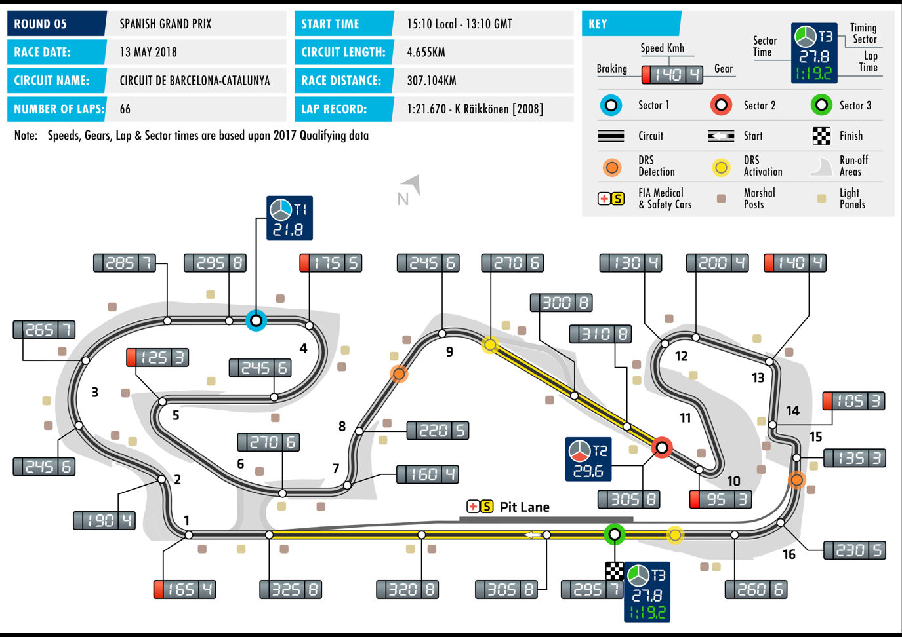

The Circuit de Catalunya was built in 1989 through the efforts of a Consortium composed of the Catalan Government, the Reial Automòbil Club de Catalunya (RACC) and the Montmeló Town Council. In September 1991, the 35th Spanish F1 Grand Prix was held following a seventeen-year of absence in Catalonia. Today, the circuit is a familiar site for teams and drivers as the track is used for extensive offseason testing. The circuit underwent resurfacing and track modifications over the winter.

38

FORMULA 1 GRAND PRIX PREMIO DE ESPAÑA 2018

RESULTS

Pos Driver Team Time / Retired Grid

Mercedes AMG Petronas 1 Lewis Hamilton 1:35:29.972 1 Motorsport

Mercedes AMG Petronas 2 Valtteri Bottas +20.593s 2 Motorsport

3 Max Verstappen Red Bull Toro Rosso Honda +26.873s 5

4 Sebastian Vettel Scuderia Ferrari +27.584s 3

5 Daniel Ricciardo Aston Martin Red Bull Racing +50.058s 6

6 Kevin Magnussen Haas F1 Team +1 Lap 7

7 Carlos Sainz Red Bull Toro Rosso Honda +1 Lap 9

8 Fernando Alonso McLaren F1 Team +1 Lap 8

9 Sergio Perez Sahara Force India F1 Team +2 Lap 15

10 Charles Leclerc Alfa Romeo Sauber F1 Team +2 Lap 14

11 Lance Stroll Williams Martini Racing +2 Lap 18

12 Brendon Hartley Red Bull Toro Rosso Honda +2 Lap 20

13 Marcus Ericsson Alfa Romeo Sauber F1 Team +2 Lap 17

14 Sergey Sirotkin Williams Martini Racing +3 Lap 19

NC Stoffel Vandoorne McLaren F1 Team DNF 11

NC Esteban Ocon Sahara Force India F1 Team DNF 13

NC Kimi Räikkönen Scuderia Ferrari DNF 4

NC Romain Grosjean Haas F1 Team DNF 10

NC Pierre Gasly Red Bull Toro Rosso Honda DNF 12

NC Nico Hulkenberg Renault Sport F1 Team DNF 16

Pole position Lewis Hamilton 1:16.173s

Fastest lap Daniel Ricciardo 1:18.441s

Note – Sirotkin penalised three places for causing a collision at the previous round. Hartley penalised five places for an unscheduled gearbox change. Hartley failed to meet 107% Q1 requirement – races at stewards’ discretion.

39

FORMULA 1 GRAND PRIX DE MONACO 2018

MONTE CARLO

Date 24 - 27 May Race distance 260.286 km

Circuit length 3.337 km Number of laps 78

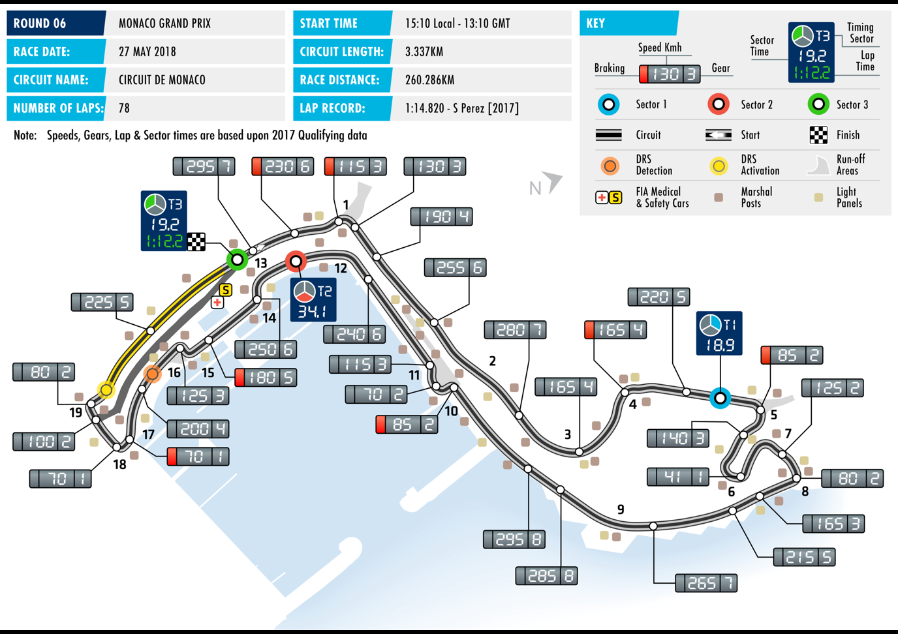

Monaco remains one of the most prestigious auto races in the world, long recognized for its entertainment and celebrity presence. Motorsports most famous street circuit takes six weeks to build up and organize, offering drivers with the challenge of negotiating numerous elevation shifts and very tight corners, including one of the slowest corners in F1 racing as well as one of the fastest. Due to its unique configuration, change in speeds and lack of straights, keeping the engine cool is a point of focus for the teams, as Formula One cars depend on air moving over the car to remove heat, and don’t use formal cooling technology.

40

FORMULA 1 GRAND PRIX DE MONACO 2018

RESULTS

Pos Driver Team Time / Retired Grid

1 Daniel Ricciardo Aston Martin Red Bull Racing 1:42:54.807 1

2 Sebastian Vettel Scuderia Ferrari +7.336s 2

Mercedes AMG Petronas 3 Lewis Hamilton +17.013s 3 Motorsport

4 Kimi Räikkönen Scuderia Ferrari +18.127s 4

Mercedes AMG Petronas 5 Valtteri Bottas +18.127s 5 Motorsport

6 Esteban Ocon Sahara Force India F1 Team +23.667s 6

7 Pierre Gasly Red Bull Toro Rosso Honda +24.331s 10

8 Nico Hulkenberg Renault Sport F1 Team +24.839s 11

9 Max Verstappen Aston Martin Red Bull Racing +25.317s 20

10 Carlos Sainz Renault Sport F1 Team +69.013s 8

11 Marcus Ericsson Alfa Romeo Sauber F1 Team +69.864s 16

12 Sergio Perez Sahara Force India F1 Team +70.461s 9

13 Kevin Magnussen Haas F1 Team +74.823s 19

14 Stoffel Vandoorne McLaren F1 Team +1 Lap 12

15 Romain Grosjean Haas F1 Team +1 Lap 18

16 Sergey Sirotkin Williams Martini Racing +1 Lap 13

17 Lance Stroll Williams Martini Racing +2 Lap 17

18 Charles Leclerc Alfa Romeo Sauber F1 Team DNF 14

19 Brendon Hartley Red Bull Toro Rosso Honda DNF 15

NC Fernando Alonso McLaren F1 Team DNF 7

Pole position Daniel Ricciardo 1:10.810s

Fastest lap Max Verstappen 1:14.260s

Note – Hartley received a 5-second time penalty for speeding in the pit lane.

41

FORMULA 1 HEINEKEN GRAND PRIX DU CANADA

MONTREAL

Date 08 - 10 Jun Race distance 305.270 km

Circuit length 4.361 km Number of laps 70

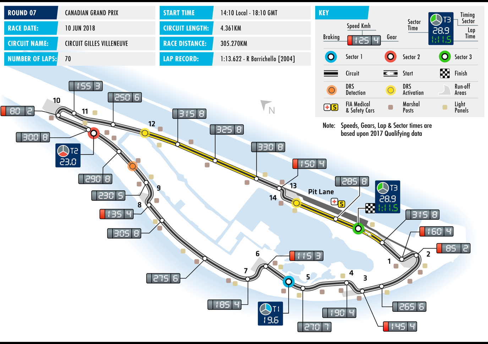

The circuit, on Ile Notre Dame, a man-made island on the St. Lawrence River, was renamed for Canadian Formula One driver Gilles Villeneuve, following his death in 1982. 2006 saw the last occasion when US-based Champ Car and F1 ran on the same track. Formula One’s performance proved significantly better with a 5-to-7 second advantage both in terms of qualifying and recording of fastest lap times during the respective races. The Montreal Grand Prix continues to be tremendously popular with both teams and drivers, owing to its festive atmosphere.

42

FORMULA 1 HEINEKEN GRAND PRIX DU CANADA 2018

RESULTS

Pos Driver Team Time / Retired Grid

1 Sebastian Vettel Scuderia Ferrari 1:10:764 1

Mercedes AMG Petronas 2 Valtteri Bottas +7.376s 2 Motorsport

3 Max Verstappen Red Bull Toro Rosso Honda +8.360s 3

4 Daniel Ricciardo Aston Martin Red Bull Racing +20.892s 6

Mercedes AMG Petronas 5 Lewis Hamilton +21.559s 4 Motorsport

6 Kimi Räikkönen Scuderia Ferrari +27.184s 5

7 Nico Hulkenberg Renault Sport F1 Team +1 Lap 7

8 Carlos Sainz Red Bull Toro Rosso Honda +1 Lap 9

9 Esteban Ocon Sahara Force India F1 Team +1 Lap 8

10 Charles Leclerc Alfa Romeo Sauber F1 Team +1 Lap 13

11 Pierre Gasly Red Bull Toro Rosso Honda +1 Lap 19

12 Romain Grosjean Haas F1 Team +1 Lap 20

13 Kevin Magnussen Haas F1 Team + 1 Lap 11

14 Sergio Perez Sahara Force India F1 Team +1 Lap 10

15 Marcus Ericsson Alfa Romeo Sauber F1 Team +2 Lap 18

16 Stoffel Vandoorne McLaren F1 Team +2 Lap 15

17 Sergey Sirotkin Williams Martini Racing +2 Lap 17

NC Fernando Alonso McLaren F1 Team DNF 14

NC Brendon Hartley Red Bull Toro Rosso Honda DNF 12

NC Lance Stroll Williams Martini Racing DNF 16

Pole position Sebastian Vettel 1:10.764s

Fastest lap Max Verstappen 1:13.864s

Note – Grosjean failed to meet 107% Q1 requirement so races at stewards’ discretion.

43

FORMULA 1 GRAND PRIX DE FRANCE 2018

Le Castellet

Date 22 - 24 Jun Race distance 5.861 km

Circuit length 5.861 km Number of laps 53

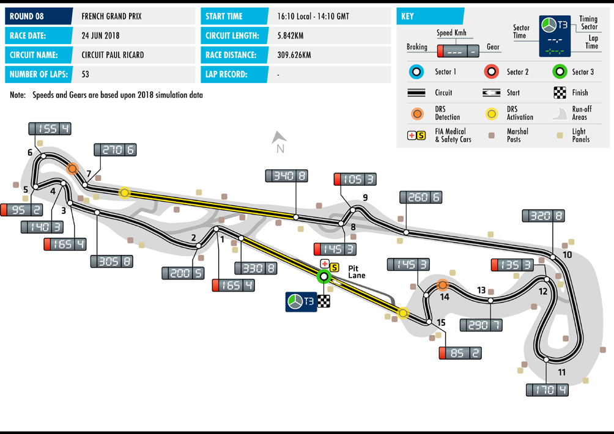

Today’s state-of-the-art venue can trace its F1 origins back to the early 1970s, when it held the first of its 14 French Grands Prix to date. After it saw its last F1 race in 1990 it underwent a transformation and was re-opened as the Paul Ricard High Tech Test Track in the beginning of the 21st century. Initially, as the new name suggests, it has been used exclusively for testing - its multi-configuration layout proved popular with F1 teams and set new standards in safety, pioneering the use of painted run-off areas instead of traditional gravel traps. In the lead up to its revival in F1, numerous modifications have been made to both the circuit and its setting to ensure a suitably challenge for the drivers and equally thrilling spectacle for race fans.

44

FORMULA 1 GRAND PRIX DE FRANCE 2018

RESULTS

Pos Driver Team Time / Retired Grid

Mercedes AMG Petronas 1 Lewis Hamilton 1:30:11.385 1 Motorsport

2 Max Verstappen Red Bull Toro Rosso Honda +7.090s 4

3 Kimi Räikkönen Scuderia Ferrari +25.888s 6

4 Daniel Ricciardo Aston Martin Red Bull Racing +34.736s 5

5 Sebastian Vettel Scuderia Ferrari +61.935s 3

6 Kevin Magnussen Haas F1 Team +79.364s 9

Mercedes AMG Petronas 7 Valtteri Bottas +80.632s 2 Motorsport

8 Carlos Sainz Red Bull Toro Rosso Honda +87.184s 7

9 Nico Hulkenberg Renault Sport F1 Team +91.989s 12

10 Charles Leclerc Alfa Romeo Sauber F1 Team +93.873s 8

11 Romain Grosjean Haas F1 Team +1 Lap 10

12 Stoffel Vandoorne McLaren F1 Team +1 Lap 17

13 Marcus Ericsson Alfa Romeo Sauber F1 Team +1 Lap 15

14 Brendon Hartley Red Bull Toro Rosso Honda +1 Lap 20

15 Sergey Sirotkin Williams Martini Racing + 1 Lap 18

16 Fernando Alonso McLaren F1 Team DNF 16

17 Lance Stroll Williams Martini Racing DNF 19

NC Sergio Perez Sahara Force India F1 Team DNF 13

NC Esteban Ocon Sahara Force India F1 Team DNF 11

NC Pierre Gasly Red Bull Toro Rosso Honda DNF 14

Pole position Lewis Hamilton 1:30.029s

Fastest lap Valtteri Bottas 1:34.225s

Note – Sirotkin had 5 seconds added to his time for driving unnecessarily slowly behind the Safety Car.

45

FORMULA 1 GROSSER PREIS VON ÖSTERREICH 2018

SPIELBERG

Date 29 Jun - 01 Jul Race distance 306.452 km

Circuit length 4.318 km Number of laps 71

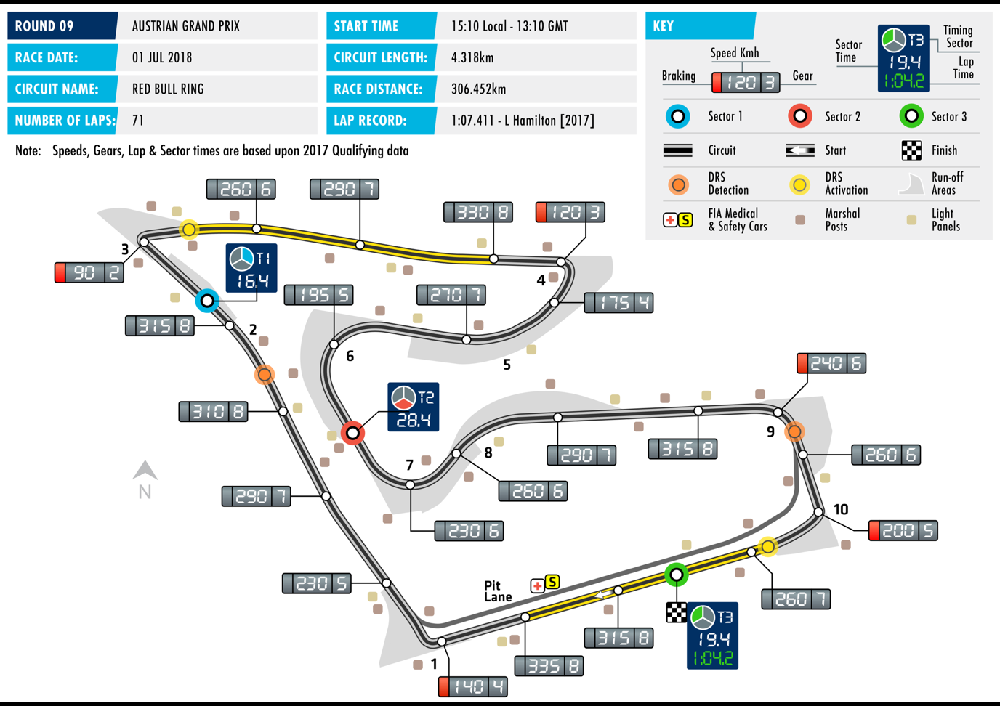

After its first Formula One race in 1970 the circuit previously known as the A1-Ring was removed from the F1 calendar in 2003. However, after its redevelopment and re-branding as the Red Bull Ring it was reopened in 2011 and celebrated its triumphant return in Formula One in 2014. It also hosts series including DTM, World Series by Renault and European Le Mans.

46

FORMULA 1 GROSSER PREIS VON ÖSTERREICH 2018

RESULTS

Pos Driver Team Time / Retired Grid

1 Max Verstappen Red Bull Toro Rosso Honda 1:21:56.024 4

2 Kimi Räikkönen Scuderia Ferrari +1.504s 3

3 Sebastian Vettel Scuderia Ferrari +3.181s 6

4 Romain Grosjean Haas F1 Team +1 Lap 5

5 Kevin Magnussen Haas F1 Team +1 Lap 8

| 6 | Esteban Ocon | Sahara Force India F1 Team | +1 Lap | 11 |
| --- | --- | --- | --- | --- |
| 7 | Sergio Perez | Sahara Force India F1 Team | +1 Lap | 15 |
| 8 | Fernando Alonso | McLaren F1 Team | +1 Lap | 20 |

9 Charles Leclerc Alfa Romeo Sauber F1 Team +1 Lap 17

10 Marcus Ericsson Alfa Romeo Sauber F1 Team +1 Lap 18

11 Pierre Gasly Red Bull Toro Rosso Honda +1 Lap 12

12 Carlos Sainz Red Bull Toro Rosso Honda +1 Lap 9

13 Sergey Sirotkin Williams Martini Racing +2 Lap 16

14 Lance Stroll Williams Martini Racing +2 Lap 13

15 Stoffel Vandoorne McLaren F1 Team DNF 14

Mercedes AMG Petronas NC Lewis Hamilton DNF 2 Motorsport

NC Brendon Hartley Red Bull Toro Rosso Honda DNF 19

NC Daniel Ricciardo Aston Martin Red Bull Racing DNF 7

Mercedes AMG Petronas NC Valtteri Bottas DNF 1 Motorsport

NC Nico Hulkenberg Renault Sport F1 Team DNF 10

Pole position Valtteri Bottas 1:03.130s

Fastest lap Kimi Räikkönen 1:06.957s

47

FORMULA 1 2018 ROLEX BRITISH GRAND PRIX

SILVERSTONE

Date 06 - 08 Jul Race distance 306.198 km

Circuit length 5.891 km Number of laps 52

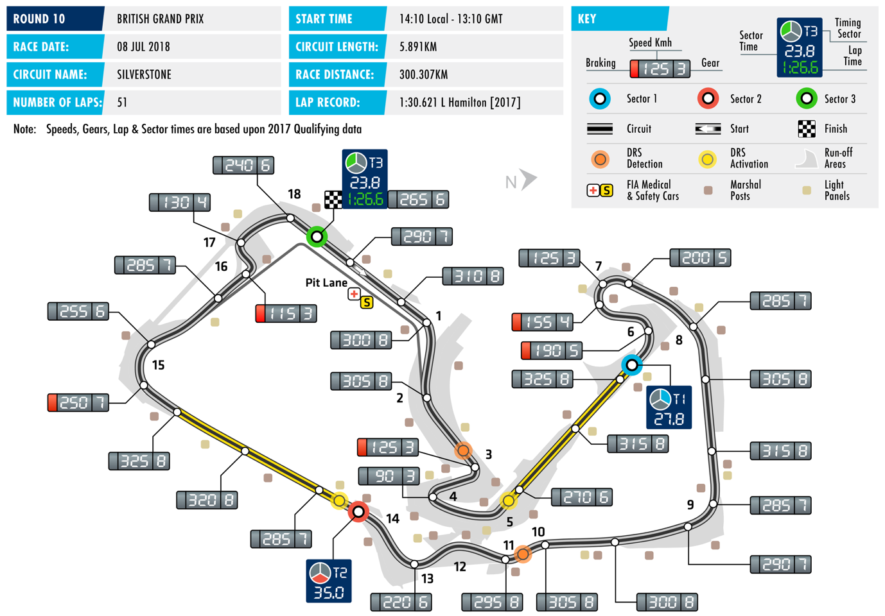

Silverstone continues to be a top draw for fans of Formula 1, offering a rich tradition of racing, a fast and challenging track, as well as the constant prospect of weather playing a critical role in race day strategy. Contracted to host F1 through 2019, Silverstone offers motorsport fans a wealth of viewing options staging events through the year, including British F3, Le Mans Series, and MotoGP, among others. The circuit has undergone major modifications and rebuilds, primarily in 1991 and most recently in 2010.

48

FORMULA 1 ROLEX BRITISH GRAND PRIX 2018

RESULTS

Pos Driver Team Time / Retired Grid

1 Sebastian Vettel Scuderia Ferrari 1:27:29.784 2

Mercedes AMG Petronas 2 Lewis Hamilton +2.264s 1 Motorsport

3 Kimi Räikkönen Scuderia Ferrari +3.652s 3

Mercedes AMG Petronas 4 Valtteri Bottas +8.883s 4 Motorsport

5 Daniel Ricciardo Aston Martin Red Bull Racing +9.500s 6

6 Nico Hulkenberg Renault Sport F1 Team +28.220s 11

7 Esteban Ocon Sahara Force India F1 Team +29.930s 10

8 Fernando Alonso McLaren F1 Team +31.115s 13

9 Kevin Magnussen Haas F1 Team +33.188s 7

10 Pierre Gasly Red Bull Toro Rosso Honda +34.129s 14

11 Sergio Perez Sahara Force India F1 Team +34.708s 12

12 Stoffel Vandoorne McLaren F1 Team +35.774s 17

13 Lance Stroll Williams Martini Racing +38.106s

14 Sergey Sirotkin Williams Martini Racing +48.113

15 Max Verstappen Aston Martin Red Bull Racing DNF 5

NC Romain Grosjean Haas F1 Team DNF 8

NC Carlos Sainz Red Bull Toro Rosso Honda DNF 16

NC Marcus Ericsson Alfa Romeo Sauber F1 Team DNF 15

NC Charles Leclerc Alfa Romeo Sauber F1 Team DNF 9

NC Brendon Hartley Red Bull Toro Rosso Honda DNF

Pole position Lewis Hamilton 1:25.892s

Fastest lap Sebastian Vettel 1:30.696s

Note - Stroll and Sirotkin required to start from the pit lane due to cars being modified whilst under Parc Ferme conditions. Hartley failed to set a time within the Q1 107% requirement so races at the stewards’ discretion. He will start from the pit lane after a change of survival cell.

49

FORMEL 1 GROSSER PREIS VON DEUTSCHLAND 2018

HOCKENHEIM

Date 20 - 22 Jul Race distance 306.458km

Circuit length 4.574 km Number of laps 67

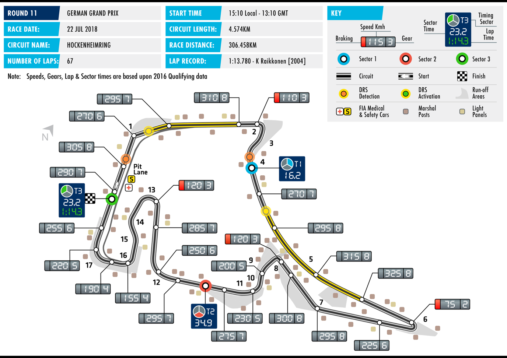

The Hockenheim Circuit hosted the German Grand Prix since 1970 when the F1 drivers decided to boycott the usual host circuit Nürburgring, unless major modifications were implemented. From 1977 to 2006, the Hockenheimring hosted the German Grand Prix with the lone exception being 1985. Between 2007-2014, the circuit alternated as a host of the German Grand Prix with the reconfigured Nürburgring. The Hockenheimring has a contract to host Formula 1 races until 2018.

50

FORMULA 1 MAGYAR NAGYDÍJ 2018

BUDAPEST

Date 27 - 29 Jul Race distance 306.630 km

Circuit length 4.381 km Number of laps 70

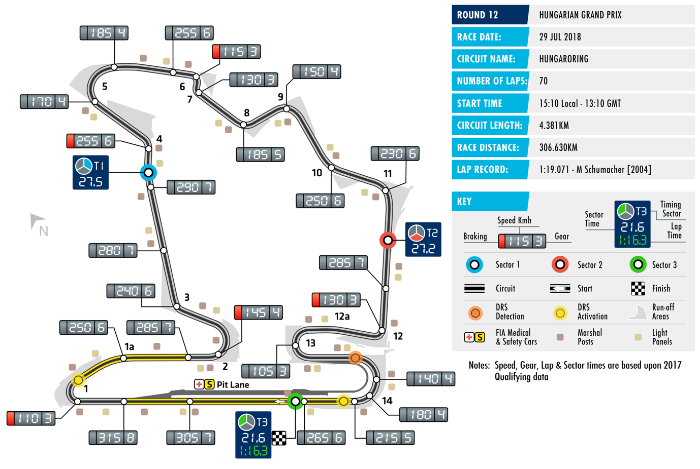

Home of the first Grand Prix to have been held behind the “Iron Curtain”, The Hungaroring was built in record time and remains today a major attraction in Hungary. Held in the summer, the circuit is built in a valley allowing excellent vantage points for spectators. The Grand Prix is popular with foreign fans from Germany, Austria and Poland.

51

FORMULA 1 2018 BELGIAN GRAND PRIX

SPA – FRANCHORCHAMPS

Date 24 - 26 Aug Race distance 308.052 km

Circuit length 7.004 km Number of laps 44

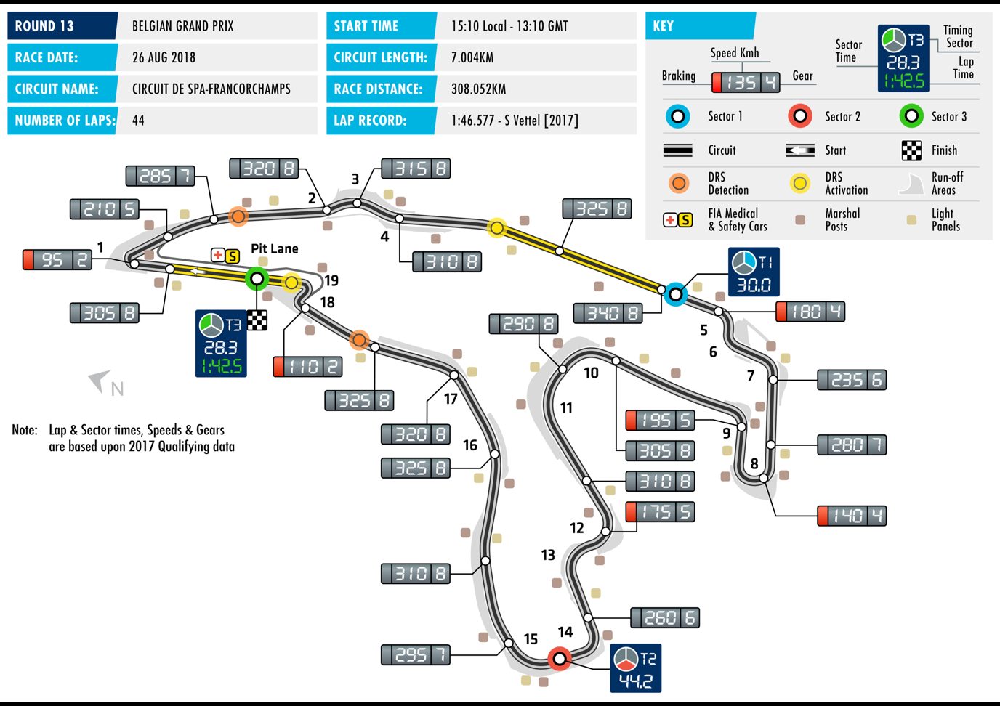

The Circuit de Spa-Francorchamps is legendary among race enthusiasts for its long-standing history and unique setting. It is considered one of the most challenging tracks in the world, mainly due to its fast, hilly and twisty layout within the Ardennes Forest. The circuit tests driver skills especially when trying to negotiate the Eau Rouge and Blanchimont corners. Designed originally in 1920, Spa- Francorchamps also plays host to a range of other race series including the Spa 24 Hours endurance race.

52

FORMULA 1 GRAND PREMIO HEINEKEN D’ITALIA 2018

MONZA

Date 31 Aug - 02 Sep Race distance 306.720 km

Circuit length 5.793 km Number of laps 53

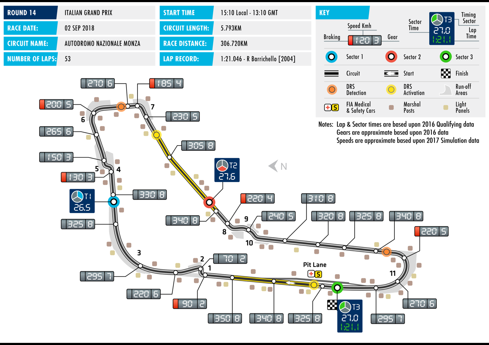

Monza has hosted the Italian Grand Prix since the inception of F1. A singular atmosphere with a dedicated following among the Italian “Tifosi”, Monza boasts some of the sport’s most famous turns, including Curva di Lesmo, and the Curva Parabolica, providing high speed thrills for both drivers and spectators.

53

FORMULA 1 2018 SINGAPORE GRAND PRIX

SINGAPORE

Date 14 - 16 Sep Race distance 308.828 km

Circuit length 5.065 km Number of laps 58

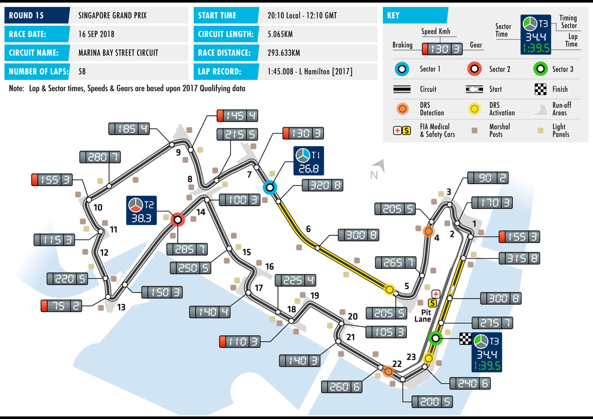

The Marina Bay Street Circuit plays host to the Singapore Grand Prix, Formula One’s first ever night race. Given its city setting, the circuit is popular with fans and teams for its easy access, allowing many of the drivers and engineers to simply walk from their hotels to the circuit. Drivers must negotiate tight racing lines, adjust to driving at night under a vast and sophisticated lighting system, and ensure their fitness to deal with the high levels of humidity.

54

FORMULA 1 2018 VTB RUSSIAN GRAND PRIX

SOCHI

Date 28 – 30 Sep Race distance 309.745 km

Circuit length 5.848 km Number of laps 52

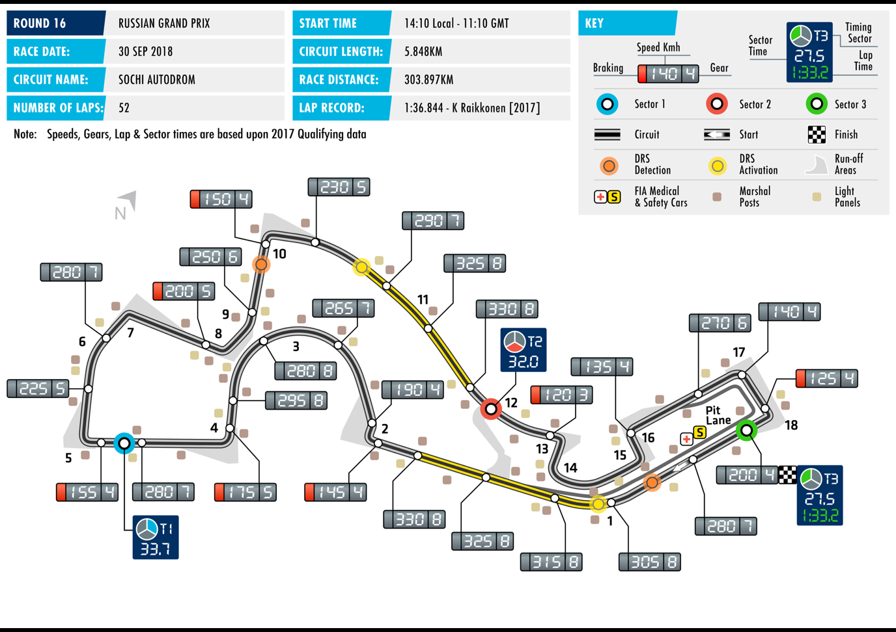

Sochi Autodrom circuit is located in the Black Sea resort of the same name. Sochi is the first purpose- built Formula One facility in Russia and hosted the country’s inaugural Grand Prix in October 2014, in the same year that the city also staged the Winter Olympics. The circuit which runs in a clockwise direction, consists of 12 right- and six left-hand corners, and combines both high-speed and technical sections. The track width varies from 13 meters at its narrowest point to 15 meters at the start-finish line.

55

FORMULA 1 2018 JAPANESE GRAND PRIX

SUZUKA

Date 05 - 07 Oct Race distance 307.471 km

Circuit length 5.807 km Number of laps 53

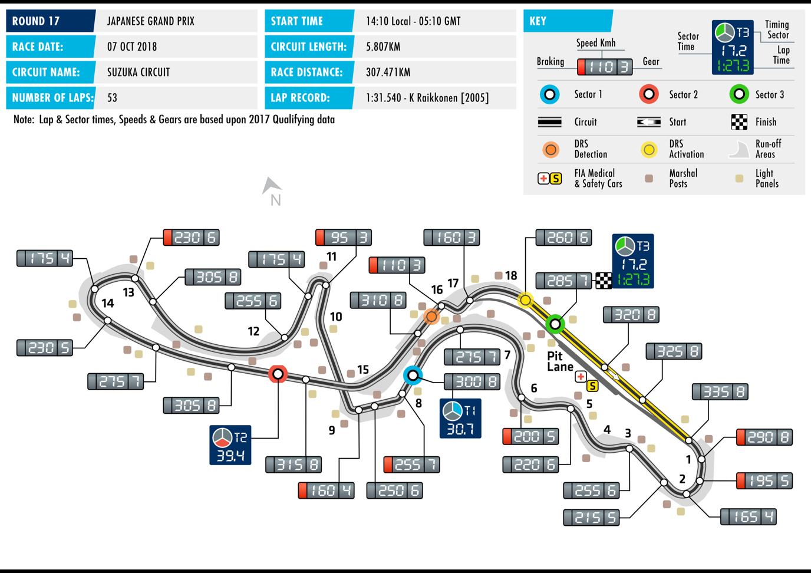

Designed as a Honda test track in 1962, the circuit is another of the racer’s favourite, featuring some of the most challenging corners. Among the most popular are the high-speed 130R and the famous Spoon Curve. Its "figure-of-eight" layout also makes the track unique in F1 racing, where the back straight passes over the front via an overpass.

56

FORMULA 1 2018 UNITED STATES GRAND PRIX

AUSTIN

Date 19 - 21 Oct Race distance 308.405 km

Circuit length 5.513 km Number of laps 56

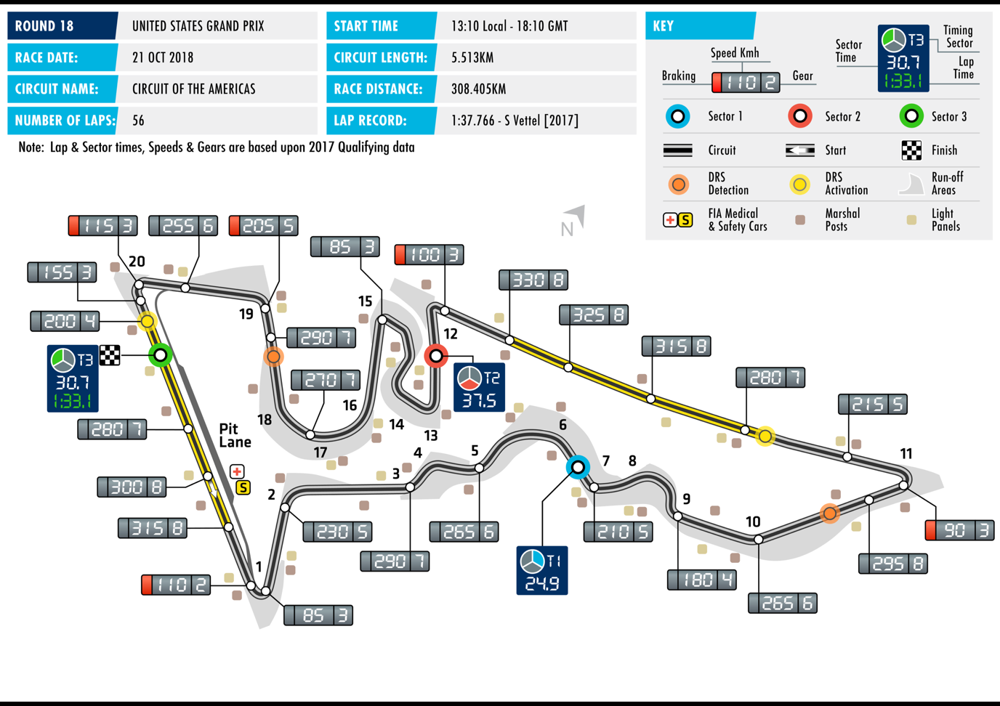

In 2012 The United States Grand Prix returned to the F1 calendar at Austin, Texas, the first Grand Prix on US soil since the 2007 race at the Indianapolis Motor Speedway. The track runs anticlockwise and features 20 corners, including sequences inspired by some of the world’s most celebrated circuits.

57

FORMULA 1 GRAN PREMIO DE MÉXICO 2018

MEXICO CITY

Date 26 - 28 Oct Race distance 305.354 km

Circuit length 4.304 km Number of laps 71

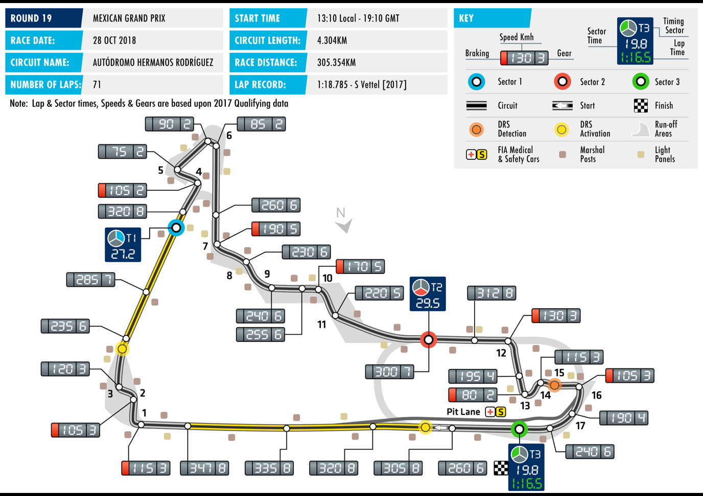

Returning to the F1 fold in in 2015. the Autodromo Hermanos Rodriguez circuit is situated in the center of Mexico City having not held a Formula One Grand Prix since 1992. The facility has been comprehensively upgraded, while the entire track was resurfaced for the occasion and changes made to a number of corners including Peraltada. It has been a huge success since its return delivering three sold out races in succession and winning the FIA Best Promoter trophy every year in the process.

58

FORMULA 1 GRANDE PRÊMIO DO BRASIL 2018

SAO PAULO

Date 09 - 11 Nov Race distance 305.909 km

Circuit length 4.309 km Number of laps 71

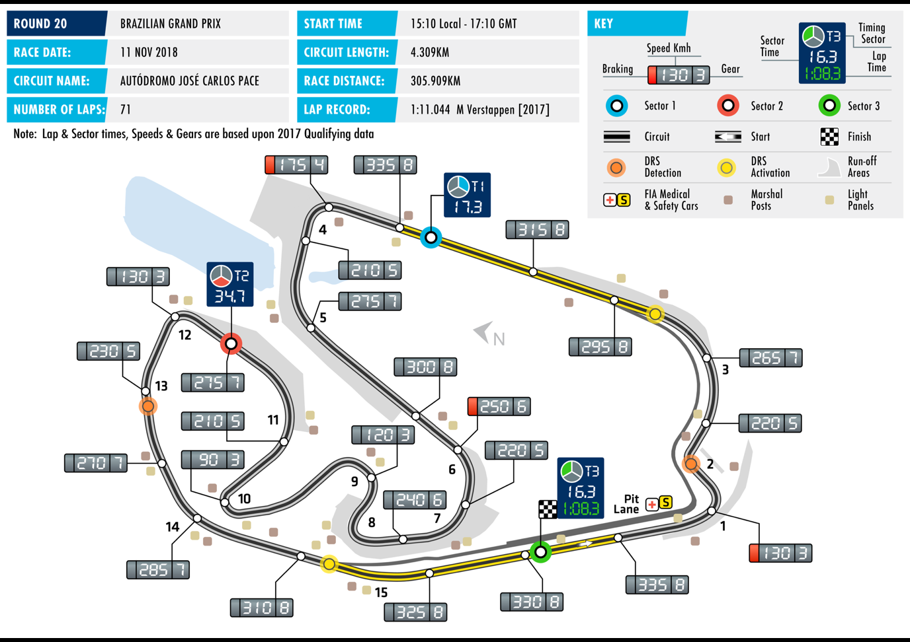

Located in Sao Paulo, Interlagos includes the Autodromo Jose Carlos Pace racetrack, home to the Brazilian Grand Prix. The Interlagos circuit has played host to some of the most exciting and memorable races in recent Formula One history, including Lewis Hamilton winning the World Championship on the last lap of the 2008 race. Regarded as one of the most challenging circuits in Grand prix racing, Alain Prost still holds the record with six victories in Brazil. Although there has been no Brazilian world champion since Senna’s death, the passion of the Brazilian fans keep the sport coming back every year.

59

FORMULA 1 2018 ETIHAD AIRWAYS ABU DHABI GRAND PRIX

YAS MARINA

Date 23 - 25 Nov Race distance 305.355km

Circuit length 5.554 km Number of laps 55

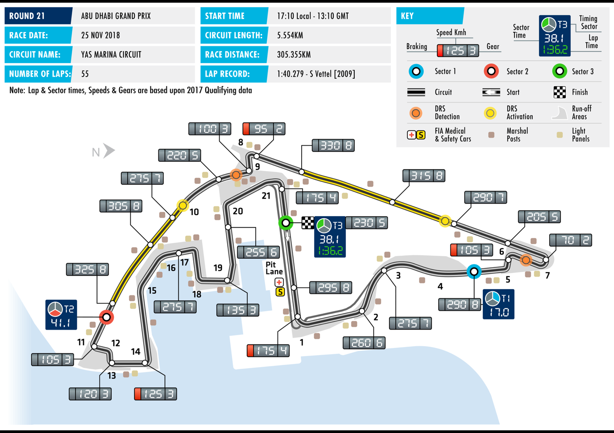

The Abu Dhabi Grand Prix located on Yas Island, is Formula One’s first ever day-night race, with a local start time of 17:10. Floodlights are activated from the start of the race to provide a transition into the evening. It has been the final race of the calendar for the past five seasons.

60

4. 2018 FIA FORMULA 1 WORLD CHAMPIONSHIP™ – TEAM INFORMATION

MERCEDES AMG PETRONAS MOTORSPORT

Headquarters Operations Centre Telephone +44 (0)1280 844 000 Brackley Fax +44 (0) 1280 844 001 NN13 7BD Website www.mercedesAMGF1.com England

Non-Executive Chairman Niki Lauda Team Principal & CEO Toto Wolff Technical Director James Allison MD of Mercedes AMG Andy Cowell High Performance Powertrains

Media Contacts:

Communications Bradley Lord Director Mob: + 44 (0)7785 682 893 Email: blord@mercedesamgf1.com

Head of Media Felix Siggemann Relation Mob: + 44 (0)7864 609 468 Email: fsiggemann@mercedesamgf1.com

Media Officer Rosa Herrero Venegas Mob: +44 7469 353 191 Email: rherrerovenegas@mercedesamgf1.com

Formula 1 Debut 1954 Chassis Mercedes-AMG F1 W09 EQ Power+ Constructors’ Titles 4 Power Unit Mercedes-AMG F1 M09 EQ Power+ GP Starts 179 GP Wins 79 Fastest Laps 59 Pole Positions 93 Total Points 3985

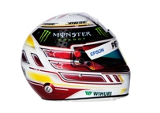

LEWIS HAMILTON VALTTERI BOTTAS 44 77

Date of Birth 07/01/1985 Date of Birth 28/08/1989 Formula 1 Debut 2007 Formula 1 Debut 2013 GP Starts 218 GP Starts 108 GP Wins 65 GP Wins 3 Pole Positions 76 Pole Positions 5 Podiums 124 Podiums 26 F1 Titles 4 F1 Titles N/A Total F1 Points 2773 Total F1 Points 820

61

SCUDERIA FERRARI

Headquarters Ferrari S.p.A. Telephone +39 536 949 111 Via Ascari 55-57 Fax +39 536 949 049 41053 Maranello Website www.ferrari.com Italy

MD & Team Principal Maurizio Arrivabene Chief Designer Simone Resta Chief Technical Officer Mattia Binotto

Media Contact:

Alberto Antonini Mob: +39 344 0556 635 Email: Alberto.Antonini@ferrari.com

Formula 1 Debut 1950 Chassis SF71H Constructors’ Titles 16 Power unit Ferrari GP Starts 962 GP Wins 234 Fastest Lap 245 Pole Positions 213 Total Points 8313

SEBASTIAN VETTEL KIMI RÄIKKÖNEN 5 7

Date of Birth 03/07/1987 Date of Birth 17/10/1979 Formula 1 Debut 2007 Formula 1 Debut 2001 GP Starts 209 GP Starts 283 GP Wins 51 GP Wins 20 Pole Positions 54 Pole Positions 17 Podiums 104 Podiums 97 F1 Titles 4 F1 Titles 1 Total F1 Points 2596 Total F1 Points 1681

62

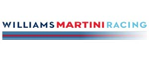

WILLIAMS MARTINI RACING

Headquarters Grove, Wantage Telephone +44 (0)1235 777 700 Oxfordshire Fax +44 (0)1235 777 960 OX12 0DQ Website www.williamsf1.com England

Team Principal Sir Frank Williams Team Manager Dave Redding CTO Paddy Lowe Head of Performance Rob Smedley Deputy Claire Williams Engineering Team Principal Chief Designer Ed Wood

Media Contacts:

Head of F1 Communications Sophie Ogg Mob: +44 (0)7977 275762 Email: Sophie.Ogg@williamsf1.com

Formula 1 Debut 1977 Chassis Williams FW41 Constructors’ Titles 9 Motor Mercedes GP Starts 693 GP Wins 114 Fastest Laps 133 Pole Positions 129 Total Points 3551

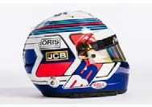

LANCE STROLL SERGEY SIROTKIN 18 35

Date of Birth 29/10/1998 Date of Birth 25/08/1995 Formula 1 Debut 2017 Formula 1 Debut 2018 GP Starts 30 GP Starts 10 GP Wins N/A GP Wins N/A Pole Positions N/A Pole Positions N/A Podiums 1 Podiums N/A F1 Titles N/A F1 Titles N/A Total F1 Points 44 Total F1 Points N/A

63

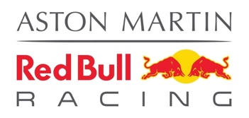

ASTON MARTIN RED BULL RACING

Headquarters Bradbourne Drive Telephone +44 (0)1908 279700 Tilbrook Fax +44 (0)1908 279810 Milton Keynes Website www.redbullracing.com MK7 8BJ, England

Team Principal Christian Horner OBE Chief Engineering Officer Rob Marshall

Chief Technical Adrian Newey OBE Chief Engineer, Dan Fallows Officer Aerodynamics

Chief Engineer, Paul Monaghan Chief Engineer, Pierre Waché Car Engineering Car Performance

Media Contacts: Head of Ben Wyatt Communications Mob: +44 (0)7771 854238 Email: ben.wyatt@redbullracing.com

Communications Manager Victoria Lloyd :Mob: +44 (0)7712 41 4196 Email: Victoria.lloyd@redbullracing.com James Ranson :Mob: +44 (0)7834 52 6354 Email: james.ranson@redbullracing.com

Formula 1 Debut 2005 Chassis RB14 Constructors’ Titles 4 Motor TAG Heuer GP Starts 256 GP Wins 58 Fastest Laps 59 Pole Positions 59 Total Points 4087.5

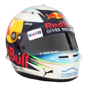

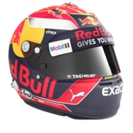

MAX VERSTAPPEN 33 DANIEL RICCIARDO 03

Date of Birth 30/09/1997 Date of Birth 01/07/1989 Formula 1 Debut 2014 Formula 1 Debut 2011 GP Starts 70 GP Starts 139 GP Wins 4 GP Wins 7 Pole Positions N/A Pole Positions 2 Podiums 15 Podiums 29 F1 Titles N/A F1 Titles N/A Total F1 Points 514 Total F1 Points 922

64

SAHARA FORCE INDIA F1 TEAM

Headquarters Dadford Road Telephone +44 (0)1327 850 800 Silverstone Fax +44 (0)1327 857 993 NN12 8TJ Website www.forceindiaf1.com England

Team Chief Dr. Vijay Mallya Deputy Team Robert Fernley Principal Technical Chief Andrew Green Chief Operating Otmar Szafnauer Officer Sporting Director Andy Stevenson Chief Race Engineer Tom McCullough

Media Contacts Head of Will Hings Communications Mob: +44 (0)7734 202020 Email: will.hings@forceindiaf1.com

Formula 1 Debut 2008 Chassis Force India VJM11 Constructors’ Titles N/A Motor Mercedes GP Starts 202 GP Wins N/A Fastest Laps 5 Pole Positions 1 Total Points 1039

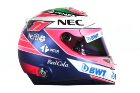

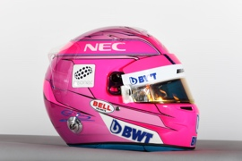

SERGIO PEREZ Esteban Ocon 11 31

Date of Birth 26/01/1990 Date of Birth 17/09/1996 Formula 1 Debut 2011 Formula 1 Debut 2016 GP Starts 146 GP Starts 39 GP Wins N/A GP Wins N/A Pole Positions N/A Pole Positions N/A Podiums 8 Podiums N/A F1 Titles N/A F1 Titles N/A Total F1 Points 490 Total F1 Points 112

65

RED BULL TORO ROSSO HONDA

Headquarters Via Boaria, 229 Telephone +39 (0)546 696 111 48018 Faenza RA Fax +39 (0)546 620 998 Italy Website www.tororosso.com

Team Principal Franz Tost Team Manager Graham Watson Technical Director James Key

Media Contacts

Head of Fabiana Valenti Communications Mob: +39 335 7113 694 Email: fabiana.valenti@tororosso.com

Press Officer Jennifer Seeber Mob: +39 348 6095017 Email: Jennifer.seeber@tororosso.com

Formula 1 Debut 2006 Chassis STR13 Constructors’ Titles N/A Motor Honda GP Starts 237 GP Wins 1 Fastest Laps 1 Pole Positions 1 Total Points 402

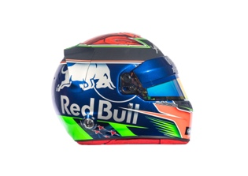

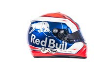

PIERRE GASLY BRENDON HARTLEY 10 28

Date of Birth 07/02/1996 Date of Birth 10/11/1989 Formula 1 Debut 2017 Formula 1 Debut 2017 GP Starts 15 GP Starts 14 GP Wins N/A GP Wins N/A Pole Positions N/A Pole Positions N/A Podiums N/A Podiums N/A F1 Titles 0 F1 Titles N/A Total F1 Points 19 Total F1 Points 1

66

ALFA ROMEO SAUBER F1 TEAM

Headquarters Wildbachstrasse 9 Telephone +41 44 973 9000 8340 Hinwil Fax +44 44 973 9001 Switzerland Website www.sauberf1team.com

Team Principal Frédéric Vasseur Chief Designer Eric Gandelin/ Luca Furbatto Technical Director Jörg Zander Head of Nicolas Hennel Aerodynamics

Media Contacts

Head of Maria Guidotti; maria.guidotti@sauber-motorsport.com Communications

Formula 1 Debut 1993 Chassis Sauber C37 Constructors’ Titles 0 Motor Ferrari GP Starts 452 GP Wins 1 Fastest Laps 5 Pole Positions 1 Total Points 882

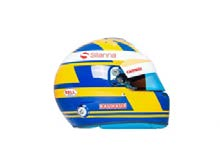

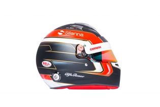

MARCUS ERICSSON CHARLES LECLERC 09 16

Date of Birth 02/09/1990 Date of Birth 16/10/1997 Formula 1 Debut 2014 Formula 1 Debut 2018 GP Starts 86 GP Starts 10 GP Wins N/A GP Wins N/A Pole Positions N/A Pole Positions N/A Podiums N/A Podiums N/A F1 Titles N/A F1 Titles N/A Total F1 Points 12 Total F1 Points 13

67

MCLAREN TEAM

Headquarters McLaren Telephone +44 (0) 1483 261 900 Chertsey Road Fax +44 (0) 1483 261 963 Woking, Surrey Website www.mclaren.com GU21 4YH, England

Executive Director, McLaren Technology Group Zak Brown Performance Director Andrea Stella Sporting Director Gil de Ferran Chief Operating Officer, McLaren Technology Group Simon Roberts

Media Contacts Group Communications Director Tim Bampton; Mob: +44 (0)7468 714614 Email : tim.bampton@mclaren.com

Head of Media and Steve Cooper; Mob: +44(0)78 8142 6460 Creative content Email: steve.cooper@mclaren.com

Press Office Manager Silvia Hoffer; Mob: +44(0)75 8421 8639 Email: silvia.hoffer@mclaren.com

PR & Media Manager Charlotte Sefton; Mob: +44(0)7500065321 Email: Charlotte.sefton@mclaren.com

Formula 1 Debut 1966 Chassis MCL33 Constructors’ Titles 8 Motor Renault GP Starts 836 GP Wins 182 Fastest Laps 155 Pole Positions 155 Total Points 5194.5

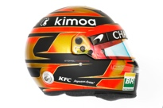

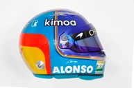

FERNANDO ALONSO STOFFEL VANDOORNE 14 02

Date of Birth 29/07/1981 Date of Birth 26/03/1992 Formula 1 Debut 2001 Formula 1 Debut 2016 GP Starts 303 GP Starts 31 GP Wins 32 GP Wins N/A Pole Positions 22 Pole Positions N/A Podiums 97 Podiums N/A F1 Titles 2 F1 Titles N/A Total F1 Points 1889 Total F1 Points 22

68

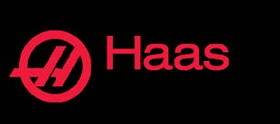

HAAS F1 TEAM

Headquarters Kannapolis Telephone + 1 704-652-4872 North Carolina USA Website www.haasf1team.com

Team Principal Gunther Steiner Chief Operating Officer Joe Custer Team Manager Pete Crolla Chief Race Engineer Ayao Komatsu Technical Director Rob Taylor Chief Aerodynamic Ben Agathangelou

Media Contacts

Head of Mike Arning Communications Mob: +1 704 875 3388 Ext. 802 Email: marning@haasf1team.com

Senior Press Officer Stuart Morrison Mob: +44 1295 237112 Email: smorrison@haasf1team.com

Formula 1 Debut 2016 Chassis Haas VF-18 Constructors’ Titles N/A Motor Ferrari 062 GP Starts 52 GP Wins N/A Fastest Laps N/A Pole Positions N/A Total Points 127

ROMAIN GROSJEAN KEVIN MAGNUSSEN 08 20

Date of Birth 17/04/1986 Date of Birth 05/10/1992 Formula 1 Debut 2009 Formula 1 Debut 2014 GP Starts 134 GP Starts 71 GP Wins N/A GP Wins N/A Pole Positions N/A Pole Positions N/A Podiums 10 Podiums 1 F1 Titles N/A F1 Titles N/A Total F1 Points 356 Total F1 Points 120

69

RENAULT SPORT FORMULA ONE TEAM

Headquarters Whiteways Telephone +44 (0)1608 678 000 Technical Centre Fax +44 (0)1608 678 609 Enstone Website www.renaultsport.com OX7 4EE, England

Managing Director Cyril Abiteboul Chief Technical Officer Bob Bell Chassis Technical Nick Chester Engine Technical Rémi Taffin Director Director

Media Contacts

Head of Andy Stobart Communications Mob +44 (0)7703 36615; andy.stobart@uk.renaultsportf1.com

Media Communi- Aurelie Donzelot cations Manager Mob +44 (0)7825 938476; aurelie.donzelot@uk.renaultsportf1.com

Lucy Genon Mob +33 6 11 71 61 78; lucy.genon@uk.renaultsportracing.com

Formula 1 Debut 1977 Chassis R.S.18 Constructors’ Titles 2 Motor Renault GP Starts 355 GP Wins 35 Fastest Laps 31 Pole Positions 51 Total Points 1453

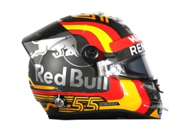

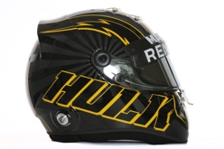

NICO HÜLKENBERG CARLOS SAINZ 27 55

Date of Birth 19/08/1987 Date of Birth 01/09/1994 Formula 1 Debut 2010 Formula 1 Debut 2015 GP Starts 147 GP Starts 70 GP Wins N/A GP Wins N/A Pole Positions 1 Pole Positions N/A Podiums N/A Podiums N/A F1 Titles N/A F1 Titles N/A Total F1 Points 447 Total F1 Points 146

70

5. 2018 FIA FORMULA 1 WORLD CHAMPIONSHIP™ – STATISTICS

2018 POLE POSITION/WINNER/FASTEST LAPS

GP POLE POSITION WINNER FASTEST LAP

Australia Lewis Hamilton Sebastian Vettel Daniel Ricciardo

Bahrain Sebastian Vettel Sebastian Vettel Valtteri Bottas

China Sebastian Vettel Daniel Ricciardo Daniel Ricciardo

Azerbaijan Sebastian Vettel Lewis Hamilton Valtteri Bottas

Spain Lewis Hamilton Lewis Hamilton Daniel Ricciardo

Monaco Daniel Ricciardo Daniel Ricciardo Max Verstappen

Canada Sebastian Vettel Sebastian Vettel Max Verstappen

France Lewis Hamilton Lewis Hamilton Valtteri Bottas

Austria Valtteri Bottas Max Verstappen Kimi Räikkönen

Great Britain Lewis Hamilton Sebastian Vettel Sebastian Vettel

71

5. 2018 FIA FORMULA 1 WORLD CHAMPIONSHIP™ – STATISTICAL DATA

2018 TEAM STANDING TO DATE

| TEAM |  | ailartsuA |  | niarhaB |  | anihC |  | najiabrezA |  | niapS |  | ocanoM |  | adanaC |  | ecnarF |  | airtsuA |  | naitirB taerG |  | LATOT |
| --- | --- | --- | --- | --- | --- | --- | --- | --- | --- | --- | --- | --- | --- | --- | --- | --- | --- | --- | --- | --- | --- | --- |
| Scuderia Ferrari | 40 |  | 25 |  | 19 |  | 30 |  | 12 |  | 30 |  | 33 |  | 25 |  | 33 |  | 40 |  | 287 |  |
| Mercedes AMG Petronas Motorsport | 22 |  | 33 |  | 30 |  | 25 |  | 43 |  | 25 |  | 28 |  | 31 |  | - |  | 30 |  | 267 |  |
| Aston Martin Red Bull Racing | 20 |  | - |  | 35 |  | - |  | 25 |  | 27 |  | 27 |  | 30 |  | 25 |  | 10 |  | 199 |  |
| Renault Sport Formula One Team | 7 |  | 8 |  | 10 |  | 10 |  | 6 |  | 5 |  | 10 |  | 6 |  | - |  | 8 |  | 70 |  |
| Haas F1 Team | 0 |  | 10 |  | 1 |  | - |  | 8 |  | - |  | - |  | 8 |  | 22 |  | 2 |  | 51 |  |
| McLaren F1 Team | 12 |  | 10 |  | 6 |  | 8 |  | 4 |  | - |  | - |  | - |  | 4 |  | 4 |  | 48 |  |
| Sahara Force India F1 Team | 0 |  | 1 |  | - |  | 15 |  | 2 |  | 8 |  | 2 |  | - |  | 14 |  | 6 |  | 48 |  |
| Red Bull Toro Rosso Honda | 0 |  | 12 |  | - |  | 1 |  | - |  | 6 |  | - |  | - |  | - |  | 1 |  | 20 |  |
| Alfa Romeo Sauber F1 Team | 0 |  | 2 |  | - |  | 8 |  | 1 |  | - |  | 1 |  | 1 |  | 3 |  | 0 |  | 16 |  |
| Williams Martini Racing | 0 |  | - |  | - |  | 4 |  | - |  | - |  | - |  | - |  | - |  | 0 |  | 4 |  |

72

5. 2018 FIA FORMULA 1 WORLD CHAMPIONSHIP™ – STATISTICAL DATA

2018 DRIVERS STANDING TO DATE

| DRIVER |  | ailartsuA |  | niarhaB |  | anihC |  | najiabrezA |  | niapS |  | ocanoM |  | adanaC |  | ecnarF |  | airtsuA |  | naitirB taerG |  | LATOT |
| --- | --- | --- | --- | --- | --- | --- | --- | --- | --- | --- | --- | --- | --- | --- | --- | --- | --- | --- | --- | --- | --- | --- |
| Sebastian Vettel | 25 |  | 25 |  | 4 |  | 12 |  | 12 |  | 18 |  | 25 |  | 10 |  | 15 |  | 25 |  | 171 |  |
| Lewis Hamilton | 18 |  | 15 |  | 12 |  | 25 |  | 25 |  | 15 |  | 10 |  | 25 |  | - |  | 18 |  | 163 |  |
| Kimi Räikkonen | 15 |  | - |  | 15 |  | 18 |  | - |  | 12 |  | 8 |  | 15 |  | 18 |  | 15 |  | 116 |  |
| Daniel Ricciardo | 12 |  | - |  | 25 |  | - |  | 10 |  | 25 |  | 12 |  | 12 |  | - |  | 10 |  | 106 |  |
| Valtteri Bottas | 4 |  | 18 |  | 18 |  | - |  | 18 |  | 10 |  | 18 |  | 6 |  | - |  | 12 |  | 104 |  |
| Max Verstappen | 8 |  | - |  | 10 |  | - |  | 15 |  | 2 |  | 15 |  | 18 |  | 25 |  | 0 |  | 93 |  |
| Nico Hülkenberg | 6 |  | 8 |  | 8 |  | - |  | - |  | 4 |  | 6 |  | 2 |  | - |  | 8 |  | 42 |  |
| Fernando Alonso | 10 |  | 6 |  | 6 |  | 6 |  | 4 |  | - |  | - |  | - |  | 4 |  | 4 |  | 40 |  |
| Kevin Magnussen | - |  | 10 |  | 1 |  | - |  | 8 |  | - |  | - |  | 8 |  | 10 |  | 2 |  | 39 |  |
| Carlos Sainz | 1 |  | - |  | 2 |  | 10 |  | 6 |  | 1 |  | 4 |  | 4 |  | - |  | 0 |  | 28 |  |
| Sergio Perez | - |  | - |  | - |  | 15 |  | 2 |  | - |  | - |  | - |  | 6 |  | 1 |  | 24 |  |
| Esteban Ocon | - |  | 1 |  | - |  | - |  | - |  | 8 |  | 2 |  | - |  | 8 |  | 6 |  | 25 |  |
| Pierre Gasly | - |  | 12 |  | - |  | - |  | - |  | 6 |  | - |  | - |  | - |  | - |  | 18 |  |
| Charles Leclerc | - |  | - |  | - |  | 8 |  | 1 |  | - |  | 1 |  | 1 |  | 2 |  | 0 |  | 13 |  |
| Romain Grosjean | - |  | - |  | - |  | - |  | - |  | - |  | - |  | - |  | 12 |  | 0 |  | 12 |  |
| Stoffel Vandoorne | 2 |  | 4 |  | - |  | 2 |  | - |  | - |  | - |  | - |  | - |  | 0 |  | 8 |  |
| Lance Stroll | - |  | - |  | - |  | 4 |  | - |  | - |  | - |  | - |  | - |  | 0 |  | 4 |  |
| Marcus Ericsson | - |  | 2 |  | - |  | - |  | - |  | - |  | - |  | - |  | 1 |  | 0 |  | 3 |  |
| Brendon Hartley | - |  | - |  | - |  | 1 |  | - |  | - |  | - |  | - |  | - |  | 0 |  | 1 |  |
| Segey Sirotkin | - |  | - |  | - |  | - |  | - |  | - |  | - |  | - |  | - |  | 0 |  | 0 |  |

73

6. STATISTICAL HISTORY – THE GERMAN FORMULA 1 GRAND PRIX PREVIOUS WINNERS

RACE WINNERS 2016 - 1990

| YEAR |  | RACE TRACK |  | DRIVER |  | NAT |  | TEAM |  |
| --- | --- | --- | --- | --- | --- | --- | --- | --- | --- |
|  | 2016 |  | Hockenheimring |  | Lewis Hamilton |  | GBR |  | Mercedes |
| 2014 |  | Hockenheimring |  | Nico Rosberg |  | GER |  | Mercedes |  |
|  | 2013 |  | Nürburgring |  | Sebastian Vettel |  | GER |  | Red Bull Racing |
| 2012 |  | Hockenheimring |  | Fernando Alonso |  | ESP |  | Scuderia Ferrari |  |
|  | 2011 |  | Nürburgring |  | Lewis Hamilton |  | GBR |  | Vodafone McLaren Mercedes |
| 2010 |  | Hockenheimring |  | Fernando Alonso |  | ESP |  | Scuderia Ferrari |  |
|  | 2009 |  | Nürburgring |  | Mark Webber |  | AUS |  | Red Bull Racing |
| 2008 |  | Hockenheimring |  | Lewis Hamilton |  | GBR |  | Vodafone McLaren Mercedes |  |
|  | 2006 |  | Hockenheimring |  | Michael Schumacher |  | GER |  | Scuderia Ferrari Malboro |
| 2005 |  | Hockenheimring |  | Fernando Alonso |  | ESP |  | Mild Seven Renault |  |
|  | 2004 |  | Hockenheimring |  | Michael Schumacher |  | GER |  | Scuderia Ferrari Malboro |
| 2003 |  | Hockenheimring |  | Juan Pabblo Montoya |  | COL |  | BMW Williams F1 Team |  |
|  | 2002 |  | Hockenheimring |  | Michael Schumacher |  | GER |  | Scuderia Ferrari Malboro |
| 2001 |  | Hockenheimring |  | Ralf Schumacher |  | GER |  | BMW Williams F1 Team |  |
|  | 2000 |  | Hockenheimring |  | Rubens Barrichello |  | BRA |  | Scuderia Ferrari Malboro |
| 1999 |  | Hockenheimring |  | Eddie Irvine |  | GBR |  | Scuderia Ferrari Malboro |  |
|  | 1998 |  | Hockenheimring |  | Mika Häkkinen |  | FIN |  | West McLaren Mercedes |
| 1997 |  | Hockenheimring |  | Gerhard Berger |  | AUT |  | Benetton Renault |  |
|  | 1996 |  | Hockenheimring |  | Damon Hill |  | GBR |  | Williams Renault |
| 1995 |  | Hockenheimring |  | Michael Schumacher |  | GER |  | Benetton Renault |  |
|  | 1994 |  | Hockenheimring |  | Gerhard Berger |  | AUT |  | Suderia Ferrari |
| 1993 |  | Hockenheimring |  | Alain Prost |  | FRA |  | Williams Renault |  |
|  | 1992 |  | Hockenheimring |  | Nigel Mansell |  | GBR |  | Williams Renault |
| 1991 |  | Hockenheimring |  | Nigel Mansell |  | GBR |  | Williams Renault |  |
|  | 1990 |  | Hockenheimring |  | Ayrton Senna |  | BRA |  | Malboro McLaren Honda |

74

RACE WINNERS 1989 - 1962

|  | YEAR |  | RACE TRACK |  | DRIVER |  | NAT |  | TEAM |
| --- | --- | --- | --- | --- | --- | --- | --- | --- | --- |
| 1989 |  | Hockenheimring |  | Ayrton Senna |  | BRA |  | Malboro McLaren Honda |  |
|  | 1988 |  | Hockenheimring |  | Ayrton Senna |  | BRA |  | Malboro McLaren Honda |
| 1987 |  | Hockenheimring |  | Nelson Piquet |  | BRA |  | Williams Honda |  |
|  | 1986 |  | Hockenheimring |  | Nelson Piquet |  | BRA |  | Williams Honda |
| 1985 |  | Nürburgring |  | Michele Alboreto |  | ITA |  | Scuderia Ferrari |  |
|  | 1984 |  | Hockenheimring |  | Alain Prost |  | FRA |  | Malboro McLaren |
| 1983 |  | Hockenheimring |  | René Arnoux |  | FRA |  | Scuderia Ferrari |  |
|  | 1982 |  | Hockenheimring |  | Patrick Tambay |  | FRA |  | Scuderia Ferrari |
| 1981 |  | Hockenheimring |  | Nelson Piquet |  | BRA |  | Brabham Parmalat |  |
|  | 1980 |  | Hockenheimring |  | Jacques Laffite |  | FRA |  | Talbot Ligier Gitanes |
| 1979 |  | Hockenheimring |  | Alan Jones |  | AUS |  | Saudia Williams |  |
|  | 1978 |  | Hockenheimring |  | Mario Andretti |  | US |  | JPS Lotus |
| 1977 |  | Hockenheimring |  | Niki Lauda |  | AUT |  | Scuderia Ferrari |  |
|  | 1976 |  | Nürburgring |  | James Hunt |  | GBR |  | Malboro McLaren |
| 1975 |  | Nürburgring |  | Carlos Reutemann |  | ARG |  | Martini Brabham |  |
|  | 1974 |  | Nürburgring |  | Clay Regazzoni |  | SUI |  | Scuderia Ferrari |
| 1973 |  | Nürburgring |  | Jackie Stewart |  | GBR |  | Elf Tyreell |  |
|  | 1972 |  | Nürburgring |  | Jackie Ickx |  | BEL |  | Scuderia Ferrari |
| 1971 |  | Nürburgring |  | Jackie Stewart |  | GBR |  | Elf Tyreell |  |
|  | 1970 |  | Hockenheimring |  | Jochen Rindt |  | AUT |  | Golf Leaf Lotus |
| 1969 |  | Nürburgring |  | Jacky Ickx |  | BEL |  | Brabham |  |
|  | 1968 |  | Nürburgring |  | Jackie Stewart |  | GBR |  | Matra |
| 1967 |  | Nürburgring |  | Denny Hulme |  | NZ |  | Brabham/ Repco |  |
|  | 1966 |  | Nürburgring |  | Jack Brabham |  | AUS |  | Brabham |
| 1965 |  | Nürburgring |  | Jim Clarke |  | GBR |  | Lotus |  |
|  | 1964 |  | Nürburgring |  | John Surtees |  | GBR |  | Scuderia Ferrari |

75

RACE WINNERS 1963 – 1951

| YEAR |  | RACE TRACK |  | DRIVER |  | NAT |  | TEAM |  |
| --- | --- | --- | --- | --- | --- | --- | --- | --- | --- |
| 1963 |  | Nürburgring |  | John Surtees |  | GBR |  | Scuderia Ferrari |  |
|  | 1962 |  | Nürburgring |  | Graham Hill |  | GBR |  | BRM |
| 1961 |  | Nürburgring |  | Stirling Moss |  | GBR |  | Lotus |  |
|  | 1959 |  | Avus |  | Tony Brooks |  | GBR |  | Cooper Ferrari |
| 1958 |  | Nürburgring |  | Tony Brooks |  | GBR |  | Vanwall |  |
|  | 1957 |  | Nürburgrin |  | Juan-Manuel Fangio |  | ARG |  | Maserati |
| 1956 |  | Nürburgring |  | Juan-Manuel Fangio |  | ARG |  | Scuderia Ferrari |  |
|  | 1954 |  | Nürburgring |  | Juan-Manuel Fangio |  | ARG |  | Mercedes |
| 1953 |  | Nürburgring |  | Giuseppe Farina |  | ITA |  | Scuderia Ferrari |  |
|  | 1952 |  | Nürburgring |  | Alberto Ascari |  | ITA |  | Scuderia Ferrari |
| 1951 |  | Nürburgring |  | Alberto Ascari |  | ITA |  | Scuderia Ferrari |  |

76

6. THE GERMAN FORMULA ONE GRAND PRIX

STATISTICS

DRIVER & TEAM RECORD STATISTICS

Highest number of wins at the Hockenheimring

M. Schumacher 4 2006, 2004, 2002, 1995

N. Piquet 3 1987, 1986, 1981

A. Senna 3 1990, 1989, 1988

F. Alonso 3 2012, 2010, 2005

L. Hamilton 2 2011, 2008, 2016

A. Prost 2 1993, 1984

N. Mansell 2 1992, 1991

G. Berger 2 1997, 1994

Highest number of Pole-Positions at the

Hockenheimring

A. Prost 3 1993, 1984, 1993

N. Mansell 3 1992, 1991, 1987

A. Senna 3 1990, 1989, 1988

G. Berger 2 1997, 1994

D. Hill 2 1996, 1995

M. Häkkinen 2 1999, 1998

J.P. Montoya 2 2003, 2002

M. Schumacher 2 2004, 2002

K. Räikkönnen 2 2006, 2005

77

6. THE GERMAN FORMULA ONE GRAND PRIX

STATISTICS

DRIVER & TEAM RECORD STATISTICS

Team with the highest number of wins at the

Hockenheimring

Ferrari 10 2012, 2010, 2006, 2004, 2002, 2000,

1999, 1994, 1983, 1982, 1977

Williams 9 2003, 2001, 1996, 1993, 1992, 1991,

1987, 1986, 1979

McLaren 7 2008, 1998, 1990, 1989, 1988, 1984,

1976

Lotus 2 1978, 1970

Benetton 2 1997, 1995

|  | Winner at Hockenheimring & World Champion in the same year |  |  |
| --- | --- | --- | --- |
| L. Hamilton | L. Hamilton | 2008, 2016 | 2008, 2016 |

F. Alonso 2005

M. Schumacher 2004, 2002, 1995

M. Häkkinen 1998

D. Hill 1996

A. Prost 1993

N. Mansell 1992

A. Senna 1990, 1988

78

6. THE GERMAN FORMULA ONE GRAND PRIX

STATISTICS

DRIVER & TEAM RECORD STATISTICS

Drivers with ‘Hattricks’ at Hockenheimring:

Pole Position, Wins, Fastest Lap

F. Alonso 2012

J.P. Montoya 2003

M. Schumacher 2002

G. Berger 1997

D. Hill 1996

A. Senna 1989

A. Prost 1984

79

6. STATISTICAL HISTORY – 2017 FIA FORMULA 1 WORLD CHAMPIONSHIP™

WINNERS RESULTS

GRAND PRIX DATE DRIVER TEAM TIME

Australia 26 Mar Sebastian Vettel Scuderia Ferrari 1:24:11.672

China 09 Apr Lewis Hamilton Mercedes AMG Petronas 1:37:36.158

Bahrain 16 Apr Sebastian Vettel Scuderia Ferrari 1:33:53.374

Russia 30 Apr Valtteri Bottas Mercedes AMG Petronas 1:28:08.743

Spain 14 May Lewis Hamilton Mercedes AMG Petronas 1:35:56.497

Monaco 28 May Sebastian Vettel Scuderia Ferrari 1:44:44.340

Canada 11 Jun Lewis Hamilton Mercedes AMG Petronas 1:33:05.154

Azerbaijan 25 Jun Daniel Ricciardo Red Bull Racing Tag Heuer 2:03:55.573

Austria 09 Jul Valtteri Bottas Mercedes AMG Petronas 1:21:48.523

Great Britain 16 Jul Lewis Hamilton Mercedes AMG Petronas 1:21:27.430

Hungary 30 Jul Sebastian Vettel Scuderia Ferrari 1:39:46.713

Belgium 27 Aug Lewis Hamilton Mercedes AMG Petronas 1:24:42.820

Italy 03 Sep Lewis Hamilton Mercedes AMG Petronas 1:15:32.312

Singapore 17 Sep Lewis Hamilton Mercedes AMG Petronas 2:03:23.544

Malaysia 01 Oct Max Verstappen Red Bull Racing Tag Heuer 1:30:01.290

Japan 08 Oct Lewis Hamilton Mercedes AMG Petronas 1:27:31.194

United States 22 Oct Lewis Hamilton Mercedes AMG Petronas 1:33:50.991

Mexico 29 Oct Max Verstappen Red Bull Racing Tag Heuer 1:36:26.552

Brazil 12 Nov Sebastian Vettel Scuderia Ferrari 1:31:26.262

Abu Dhabi 26 Nov Valtteri Bottas Mercedes AMG Petronas 1:34:14.062

80

HISTORY BOOK – FIGURES/FACTS/STATISTICS

DRIVER WORLD CHAMPIONS 2017 – 1982 (*not including/including deleted points)

Year Driver Nat. Team Points Wins Poles

2017 Lewis Hamilton GBR Mercedes AMG Petronas F1 363 9 11

2016 Nico Rosberg GER Mercedes AMG Petronas F1 385 9 8

2015 Lewis Hamilton GBR Mercedes AMG Petronas F1 381 10 11

2014 Lewis Hamilton GBR Mercedes AMG Petronas F1 384 11 7

2013 Sebastian Vettel GER RBR-Renault 397 13 9

2012 Sebastian Vettel GER RBR-Renault 281 5 6

2011 Sebastian Vettel GER RBR-Renault 392 11 15

2010 Sebastian Vettel GER RBR-Renault 256 5 10

2009 Jenson Button GBR Brawn Mercedes 95 6 6

2008 Lewis Hamilton GBR McLaren Mercedes 98 5 7

2007 Kimi Räikkönen FIN Ferrari 110 6 3

2006 Fernando Alonso ESP Renault 134 7 6

2005 Fernando Alonso ESP Renault 133 7 6

2004 Michael Schumacher GER Ferrari 148 13 8

2003 Michael Schumacher GER Ferrari 93 6 5

2002 Michael Schumacher GER Ferrari 144 11 9

2001 Michael Schumacher GER Ferrari 123 9 11

2000 Michael Schumacher GER Ferrari 108 9 9

1999 Mika Häkkinen FIN McLaren Mercedes 76 5 11

1998 Mika Häkkinen FIN McLaren Mercedes 100 8 9

1997 Jacques Villeneuve CAN Williams Renault 81 7 10

1996 Damon Hill GBR Williams Renault 97 8 9

1995 Michael Schumacher GER Benetton Renault 102 9 4

1994 Michael Schumacher GER Benetton Ford 92 8 6

1993 Alain Prost FRA Williams Renault 99 7 13

1992 Nigel Mansell GBR Williams Renault 108 9 14

1991 Ayrton Senna BRA McLaren Honda 96 7 8

1990 Ayrton Senna BRA McLaren Honda 78 6 10

1989 Alain Prost FRA McLaren Honda 76/81 * 4 2

1988 Ayrton Senna BRA McLaren Honda 90/94 * 8 13

1987 Nelson Piquet BRA Williams Honda 73/76 * 3 4

1986 Alain Prost FRA McLaren TAG Porsche 72/74 * 4 1

1985 Alain Prost FRA McLaren TAG Porsche 73/76 * 5 2

1984 Niki Lauda AUT McLaren TAG Porsche 72 5 0

1983 Nelson Piquet BRA Brabham BMW 59 3 1

1982 Keke Rosberg FIN Williams Ford 44 1 1

81

DRIVERS WORLD CHAMPIONS 1981 – 1950 (*not including / including deleted points)

Year Driver Nat. Team Points Wins Poles

1981 Nelson Piquet BRA Brabham 50 3 4

1980 Alan Jones AUS Williams 67 5 3

1979 Jody Scheckter S Ferrari 51 3 1

1978 Mario Andretti USA Lotus Ford 64 6 8

1977 Niki Lauda AUT Ferrari 72 3 2

1976 James Hunt GBR McLaren Ford 69 6 8

1975 Niki Lauda AUT Ferrari 64.5 5 9

1974 Emerson Fittipaldi BRA McLaren Ford 55 3 2

1973 Jackie Stewart GBR Tyrrell Ford 71 5 3

1972 Emerson Fittipaldi BRA Lotus Ford 61 5 3

1971 Jackie Stewart GBR Tyrrell Ford 62 6 6

1970 Jochen Rindt AUT Lotus Ford 45 5 3

1969 Jackie Stewart GBR Matra Ford 63 6 2

1968 Graham Hill GBR Lotus Ford 48 3 2

1967 Denny Hulme NZE Brabham Repco 51 2 0

1966 Jack Brabham AUS Brabham Repco 42/45 * 4 3

1965 Jim Clark GBR Lotus Climax 54 6 6

1964 John Surtees GBR Ferrari 40 2 2

1963 Jim Clark GBR Lotus Climax 54/73 * 7 7

1962 Graham Hill GBR BRM 42/52 * 4 1

1961 Phil Hill USA Ferrari 34/38 * 2 5

1960 Jack Brabham AUS Cooper Climax 43 5 3

1959 Jack Brabham AUS Cooper Climax 31/34 * 2 1

1958 Mike Hawthorn GBR Ferrari 42/49 * 1 4

1957 Juan-Manuel Fangio ARG Maserati 40/46 * 4 4

1956 Juan-Manuel Fangio ARG Lancia / Ferrari 30/33 * 3 5

1955 Juan-Manuel Fangio ARG Mercedes 40/41 * 4 3

1954 Juan-Manuel Fangio ARG Mercedes / Maserati 42/57 * 6 5

1953 Alberto Ascari ITA Ferrari 34.5/46.5 * 5 6

1952 Alberto Ascari ITA Ferrari 36/52.5 * 6 5

1951 Juan-Manuel Fangio ARG Alfa Romeo 31/37 * 3 4

1950 Guiseppe Farina ITA Alfa Romeo 30 3 2

82

CONSTRUCTOR WORLD CHAMPIONS 2017 – 1982

Year Constructor Points Driver

2017 Mercedes AMG Petronas F1 668 L. Hamilton, V. Bottas 2016 Mercedes AMG Petronas F1 765 L. Hamilton, N. Rosberg

2015 Mercedes AMG Petronas F1 703 L. Hamilton, N. Rosberg

2014 Mercedes AMG Petronas F1 701 L Hamilton, N Rosberg

2013 Red Bull Racing-Renault 596 S. Vettel, M. Webber

2012 Red Bull Racing-Renault 460 S. Vettel, M. Webber

2011 Red Bull Racing-Renault 650 S. Vettel, M. Webber

2010 Red Bull Racing-Renault 498 S. Vettel, M. Webber

2009 Brawn Mercedes 172 J. Button, R. Barrichello

2008 Ferrari 172 K. Räikkönen, F. Massa

2007 Ferrari 204 K. Räikkönen, F. Massa

2006 Mild Seven Renault F1 206 F. Alonso, G. Fisichella

2005 Mild Seven Renault F1 191 F. Alonso, G. Fisichella

2004 Ferrari 262 M. Schumacher, R. Barrichello

2003 Ferrari 158 M. Schumacher, R. Barrichello

2002 Ferrari 221 M. Schumacher, R. Barrichello

2001 Ferrari 179 M. Schumacher, R. Barrichello 2000 Ferrari 170 M. Schumacher, R. Barrichello

1999 Ferrari 128 M. Schumacher, E. Irvine

1998 McLaren Mercedes 156 M. Häkkinen, D. Coulthard

1997 Williams Renault 123 J. Villeneuve, H.-H. Frentzen

1996 Williams Renault 175 D. Hill, J. Villeneuve

1995 Benetton Renault 137 M. Schumacher, J. Herbert

1994 Williams Renault 118 A. Senna, D. Hill, D. Coulthard, N. Mansell

1993 Williams Renault 168 A. Prost, D. Hill

1992 Williams Renault 164 N. Mansell, R. Patrese

1991 McLaren Honda 139 A. Senna, G. Berger

1990 McLaren Honda 121 A. Senna, G. Berger

1989 McLaren Honda 141 A. Prost, A. Senna

1988 McLaren Honda Turbo 199 A. Senna, A. Prost

1987 Williams Honda Turbo 137 N. Piquet, N. Mansell, R. Patrese

1986 Williams Honda Turbo 141 N. Mansell, N. Piquet

1985 McLaren TAG Porsche Turbo 90 A. Prost, N. Lauda, J. Watson

1984 McLaren TAG Porsche Turbo 143.5 N. Lauda, A. Prost

1983 Ferrari Turbo 89 P. Tambay, R. Arnoux

1982 Ferrari Turbo 74 G. Villeneuve, D. Pironi, P. Tambay, M.

83

CONSTRUCTOR WORLD CHAMPIONS 1981 – 1958

Year Constructor Points Driver

1981 Williams Ford 95 A. Jones, C. Reutemann 1980 Williams Ford 120 A. Jones, C. Reutemann 1979 Ferrari 113 J. Scheckter, G. Villeneuve

1978 Lotus Ford 86 Mario Andretti, R. Peterson, J. P. Jarier

1977 Ferrari 95 N. Lauda, C. Reutemann, G. Villeneuve

1976 Ferrari 83 N. Lauda, C. Regazzoni, C. Reutemann

1975 Ferrari 72.5 N. Lauda, C. Regazzoni

1974 McLaren Ford 73 E. Fittipaldi, D. Hulme

1973 Lotus Ford 92 E. Fittipaldi, R. Peterson

1972 Lotus Ford 61 E. Fittipaldi, D. Walker, R. Wisell

1971 Tyrrell Ford 73 J. Stewart, F. Cevert

1970 Lotus Ford 59 J. Rindt, R. Wisell, E. Fittipaldi, J. Miles

1969 Matra Ford (Tyrrell) 66 J. Stewart, J. P. Beltoise, J. Servoz-Gavin

1968 Lotus Ford 62 G. Hill, J. Clark, J. Oliver

1967 Brabham Repco 63 D. Hulme, J. Brabham

1966 Brabham Repco 42/49 * J. Brabham, D. Hulme

1965 Lotus Climax 54/59 * J. Clark, M. Spence

1964 Ferrari 45/49 * J. Surtees, L. Bandini

1963 Lotus Climax 54/74 * J. Clark, T. Taylor

1962 BRM 42/56 * G. Hill, R. Ginther

1961 Ferrari 40/52 * P. Hill, W. von Trips, R. Ginther, G.

1960 Cooper Climax 48/58 * J. Brabha m , B. McLaren, H. Taylor, O. Gendebi en, T. Brooks

1959 Cooper Climax 40/53 * J. Brabham, J. L. Trintignant, B. McLaren,

1958 Vanwall 48/57 * S. M oss, T. Br oo ks, S. Lewis-Evans

84

DRIVERS’ RECORDS - THE MOST…

F1 Titles GP Wins Points

1 M. Schumacher 7 1 M. Schumacher 91 1 L. Hamilton 2773

2 J. -M. Fangio 5 2 L. Hamilton 65 2 S. Vettel 2596

3 S. Vettel 4 3 A. Prost 51 3 F. Alonso 1889

= A. Prost 4 4 S. Vettel 51 4 K. Räikkönen 1681

= L. Hamilton 4 5 A. Senna 41 5 N. Rosberg 159.5

6 J. Brabham 3 6 F. Alonso 32 6 M. Schumacher 1462

= J. Stewart 3 7 N. Mansell 31 7 J. Button 1214

= N. Lauda 3 8 J. Stewart 27 8 F. Massa 1167

= N. Piquet 3 9 J. Clark 25 9 M. Webber 786.5

= L. Hamilton 3 = N. Lauda 25 10 A. Prost 768.5

= A. Senna 3

GP Starts Pole Positions Fastest Lap

1 R. Barrichello 322 1 L. Hamilton 76 1 M. Schumacher 77

2 M. Schumacher 306 2 M. Schumacher 68 2 K. Räikkönen 46

3 F. Alonso 303 3 A. Senna 65 3 Alain Prost 41

4 J. Button 285 4 S. Vettel 54 4 L. Hamilton 38

5 K. Räikkönen 283 5 J. Clark 33 5 S. Vettel 34

6 F. Massa 272 = A. Prost 33 6 N. Mansell 30

7 R. Patrese 256 7 N. Mansell 32 7 Jim Clark 28

8 J. Trulli 255 8 J.M. Fangio 29 8 M. Häkkinen 25

9 D. Coulthard 247 = M. Häkkinen 29 9 N. Lauda 24

10 10 N. Lauda 24 10 JM. Fangio 23

85

TEAM’ RECORDS – THE MOST…

F1 Titles GP Wins Fastest Laps

1 Ferrari 16 1 Ferrari 234 1 Ferrari 245

2 Williams 9 2 McLaren 182 2 McLaren 154

3 McLaren 8 3 Williams 114 3 Williams 133

4 Lotus (1952) 7 4 Lotus (1952) 79 4 Lotus 76

5 Red Bull 4 5 Mercedes AMG 79 5 Mercedes AMG 59

= Mercedes AMG 4 6 Red Bull 58 6 Red Bull 59

7 Brabham 2 7 Brabham 35 7 Brabham 41

= Cooper 2 = Renault 35 8 Benetton 36

= Renault 2 9 Benetton 27 9 Renault 31

10 Tyrell 23 10 Tyrell 20

GP Starts Pole Positions Points

1 Ferrari 962 1 Ferrari 213 1 Ferrari 8313 2 McLaren 836 2 McLaren 155 2 McLaren 5194.5 3 Williams 691 3 Williams 128 3 Red Bull 4087.5 4 Lotus (1952) 552 4 Lotus 107 4 Mercedes AMG 3985 5 Sauber 452 5 Mercedes AMG 93 5 Williams 3547 6 Tyrell 430 6 Red Bull 59 6 Lotus 2517.5 7 Brabham 394 7 Renault 51 7 Renault 1453 8 Renault 355 8 Brabham 39 8 Force India 1039 9 Minardi 340 9 Benetton 15 9 Brabham 864 10 Ligier 326 10 Tyrell 14 10 Benetton 851.5

86

7. 2018 FIA FORMULA 1 WORLD CHAMPIONSHIP™ – NEW RULES IN 2018

After the rules revolution of 2017, one that saw F1 cars become wider and faster, this season’s changes are relatively few in number.

TECHNICAL REGULATIONS

Bodywork and Dimensions - T-wings and shark-fin style engine covers outlawed: 2017 loopholes in terms of the extended, shark-finned engine covers, combined with the T-wings have been closed for this season. The purpose of the T-wing was to better direct airflow to the main rear wing, and in some cases to create a little additional downforce. As a result, cars can be expected to still provide an engine cover featuring a fin of sorts, but nothing like the huge swathes of carbon fibre that was shown in 2017.

Introduction of the Halo - Halo cockpit protection device mandatory: The cockpit protection device designed to further improve driver safety in the event of an accident, and in particular to deflect debris away from the head. The core design is dictated by the rules, however small adjustments of the aero device can be expected by the teams. The device must withstand specified impact forces in each direction dictated by FIA rules. This has kept the teams occupied, not least because they would ideally keep the mounting as low-weight as possible.

Weight of Car: The overall minimum weight of cars has gone up by 6kg to 734kg to compensate for the introduction of the halo. However, the estimated weight of the halo including its mounting could be as much as 14kg, which leaves team with less room to play when it comes to performance ballast.

Trick suspension outlawed: The trick suspension system could have been used to improve the car’s aerodynamic performance has been banned for the 2018 season.

SPORTING REGULATIONS

Car Livery: Both cars entered by a competitor must be present in substantially the same livery at every event. Any significant change to this livery during a Championship season may only be made with the agreement of the Formula One Commission.

Power Units - Drivers allowed three rather than four power units per season – To make F1 power units even more reliable – and further reduce costs – this season each driver must make do with just three engines for the 21-race campaign. That compares with four engines last year. One less engine per season also means one less chance per season for teams to introduce significant power unit upgrades. As a result, those teams who best manage their development programme over the course of the year could stand to reap even bigger rewards.

Grid Penalties- simplified grid penalties for power unit changes – One less engine per driver could mean more grid penalties in 2018. However, there will be far less confusion for fans over how those penalties impact the starting order. This season, any driver who earns a grid penalty of 15 places or more will have to start from the back of the grid. If more than one driver receives such a penalty they Will be arranged at the back of the grid in the order in which they changed elements.

87

2018 FIA FORMULA 1 WORLD CHAMPIONSHIP™ – NEW RULES IN 2018

That should mean less headaches for fans - and those at the FIA tasked with deciding the grid!

Wider range of dry tyre compounds – As in 2017, official F1 tyre suppliers Pirelli will make three dry- weather compounds available to teams at each Grand Prix. However, for 2018 those three will be selected from a broader range of compounds, which now includes the new, pink-marked hypersoft at one end of the spectrum and the orange-marked superhard at the other.

It means in total there will be seven, rather than the previous five, slick tyre compounds, all of which are a step softer than in 2017, making them the fastest tyres in Formula 1 history. Reports based on initial data suggest they could immediately mean cars going a second per lap quicker.

Also new for 2018 is the ice blue colour of the hard compound. This frees up orange to be used on the aforementioned superhard, denoting it as the very hardest choice available in Pirelli’s range. The 2018 range in full is: hypersoft (pink), ultrasoft (purple), supersoft (red), soft (yellow), medium (white), hard (blue), superhard (orange).

Depending on how Pirelli choose to select compounds, the general move towards softer rubber should make 2018’s racing even more exciting, with more pit stops and fewer one-stop Grands Prix.

Motor Oil – After controversy over the past season surrounding oil consumption, this area will be more stringently regulated in 2018. It has been alleged that some manufacturers were deliberately allowing engine oil to enter the combustion chambers, thereby extracting extra performance on top of the strictly controlled fuel allowance.

Although this ruse was already prohibited, it was difficult to detect. Consequently, a catalogue of measures has been introduced to prevent the deliberate combustion of oil for performance purposes. The teams may now use only a single-specification engine oil on race weekends.

Furthermore, the level in the main oil tank will in future be monitored in real time and the data transmitted directly to the FIA. All other oil levels must be reported to the FIA one hour before the start of the race. In addition, the use of active control valves between oil tank and internal combustion engine is prohibited.

Test restrictions: The regulations for 2018 incorporate an additional exception to the test restrictions. In the case of promotional events hosted by the commercial rights holder, the teams are allowed to use the current car subject to certain conditions. In the season just finished, Liberty Media hosted an event in central London for the first time in the run-up to the British Grand Prix.

Safety: Introduction of a new race glove that has a 3mm thick flexible sensor stitched into. It is the sport’s first biometric monitoring device to monitor the drivers’ vital signs during the race. The technology is available for all glove manufactures and initially the device will use.

88

2018 FIA FORMULA 1 WORLD CHAMPIONSHIP™ – NEW RULES IN 2018

an optical sensor to measure ‘pulse oximetry’ or the amount of oxygen in the blood, alongside the pulse rate. In an event of an accident racing drivers may experience injuries that is affecting breathing and the oxygen content of the blood diminishes immediately. Monitoring the data also offers a range of vital information for track doctors before arriving at the scene. The sensor uses a new industrial version of Bluetooth that can send information over a 500m radius. The hardware can send 20 data packets a second and has a self-contained power source via a small battery. This battery can be charged inductively, so when the drivers take their gloves off they just lie them on a charging mat and it replenishes automatically.

The work to improve safety in Formula 1 never stops. In addition to the halo, there are some additional optimizations: there must now be triple instead of double wheel mountings, and the locations for these have been specified in greater detail; the wheel nuts must also be better secured against working loose.

POINTS, CLASSIFICATION & RACE DISTANCE

Race Distance - Formula One races are of near identical distance, calculated in the regulations as the least number of laps required to exceed 305 kilometres. Some races invariably take longer than others due to the differing average speed of circuits. The only exception is Monaco, where the race distance is calculated as the minimum number of laps exceeding 260 kilometres.

Points & Classification - The top ten finishers in each Grand Prix score points towards both the drivers’ and the constructors’ world championships, according to the following scale:

| Position | 1st | 2nd | 3rd | 4th | 5th | 6th | 7th | 8th | 9th | 10th |
| --- | --- | --- | --- | --- | --- | --- | --- | --- | --- | --- |
| Points | 25 | 18 | 15 | 12 | 10 | 8 | 6 | 4 | 2 | 1 |

The only exceptions to this is when a race is suspended and cannot be restarted, in which case if less than 75 percent of the race distance has been completed half points are awarded, and if less than two laps have been completed, no points are awarded.

Any driver who completes over 90 percent of the race will be classified as a finisher, regardless of whether they running as the winner took the chequered flag.

If a race is stopped before the full distance and a result is declared, the classification will reflect the race order at the end of the lap two laps prior to that on which the race was stopped (see ‘Suspending and resuming a race’). For example, if a race is stopped on lap 60, the classification will be as it was at the end of lap 58.

The drivers' and constructors' championship titles are awarded to the driver and constructor who score the most points over the course of the season.

89

2018 FIA FORMULA 1 WORLD CHAMPIONSHIP™ – NEW RULES IN 2018

In the event of any ties for position, the driver or constructor with superior race results (based on descending order, from number of wins to number of second-places down) will be awarded the place.

RACE FLAGS

FLAG MEANING

BLACK – with orange disc Warns driver of apparent mechanical failure and and driver’s number must return to his pit

| HALF BLACK, HALF WHITE – with | Warns of unsporting behaviour. May be followed by a |
| --- | --- |
| driver’s number | black flag if driver does not heed the warning |

BLACK – with a car number Driver must pit stop and report to clerk of the course

| BLACK & WHITE – | End of race |
| --- | --- |
| chequered flag |  |

BLUE – waved A faster car is behind, trying to overtake (overlap)

GREEN Previously warned hazard is now cleared, proceed at race speed

RED Race stopped

WHITE A slow vehicle is on the circuit

YELLOW – single Danger ahead, proceed at reduced speed and with caution

YELLOW – two Great danger ahead, be prepared to stop. Overtaking prohibited.

YELLOW – with red stripes Slippery t rack surface ahead

90

8. SUPPORT RACES

8.1 PORSCHE MOBIL 1 SUPERCUP

2018 marks the 26th season for the Porsche Mobil 1 Supercup. Porsche’s most international one-make cup was contested for the first time at Imola in 1993. With a capacity grid and races held on tradition- steeped racetracks, the series has offered gripping racing as support to Formula 1 ever since.

The 2018 race calendar consists of ten races over nine weekends. The season opens on Spain’s Circuit de Catalunya not far from Barcelona. Two rounds – Monte Carlo/Monaco and Budapest, Hungary – have been a permanent fixture on the Porsche Mobil 1 Supercup calendar since the series began. The one-make cup also returns to Hockenheim/Germany after a year’s break. Other venues on the calendar this season are the Red Bull Ring in Spielberg, Austria as well as the storied racetracks in Silverstone/Great Britain, Spa-Francorchamps in Belgium and Monza, Italy. A doubleheader at Mexico City concludes the season.

The Porsche Mobil 1 Supercup field is traditionally made up of pilots from all over the world. “We’re pleased with our grid packed with newcomers and seasoned race drivers. It’s the mix that makes the Supercup so appealing and guarantees some truly exciting motorsport,” says Oliver Schwab, the Porsche Mobil 1 Supercup manager. After celebrating his first championship title last year in the Porsche Mobil 1 Supercup, Michael Ammermüller returns to tackle the season as the defending champion. Twenty-eight pilots have signed on for the whole season, with additional guest starters bolstering the grid at individual races.

Successful junior support programme Joining the grid line-up in 2018 are the two Porsche Juniors, Thomas Preining from Austria and Frenchman Julien Andlauer. Preining contested four rounds of the Porsche Mobil 1 Supercup as a guest driver in 2017 and impressed with three top-ten results. Andlauer is the reigning champion of the Porsche Carrera Cup France and beat eight other international candidates at the junior selection shootout last year. In addition to receiving funding from Porsche to the value of 225.000 Euro towards their Supercup campaign run as support to Formula 1, the talented youngsters are coached on and off the racetrack in preparation for a successful career in professional motor racing.

Talented youngsters and ambitious teams pit themselves against seasoned specialists in the Porsche Mobil 1 Supercup, making the race series an excellent springboard for young hopefuls: Earl Bamber is a classic example: In his 2014 debut season, the New Zealander promptly clinched overall victory, was signed as a Porsche works driver and has won the 24 Hours of Le Mans – twice. A total of nine current Porsche works drivers have climbed the ladder via the Supercup to become professional race drivers.

91

8. SUPPORT RACES

8.1 PORSCHE MOBIL 1 SUPERCUP - Continued

8.1.1 CALENDAR

• The Porsche Mobil 1 Supercup season starts in May and ends in October • Nine Races – each of them taking place during the Formula One™ weekend

11 – 13 May Barcelona Spain

24 – 27 May Monte Carlo Monaco

29 Jun – 01 July Spielberg Austria

06 – 08 July Silverstone Great Britain

20 – 22 July Hockenheim Germany

27 – 29 July Budapest Hungary

24 – 26 Aug SPA-Francorchamps Belgium

31 Aug – 02 Sept Monza Italy

26 – 28 Oct Mexico City Mexico

WEEKEND FORMAT & POINTS

A race weekend features one 45minute practice session and one 30minute qualifying session, followed by one race. (14 laps + 1 formation lap in Hockenheim)

The top 15 drivers score points in the race (20, 18, 16, 14, 12, 10, 9, 8, 7, 6, 5, 4, 3, 2, 1).

92

8.2 SUPPORT RACES

ADAC FORMEL 4

ADAC Formula 4 is going from strength to strength and is experiencing its fourth season in 2018. With its Abarth Turbo-Motor with 160PS, Tatuus Chassis and Pirelli tyres it’s the perfect foundation to bring young kart talents together with experienced motorsport personnel. Not only has Sebastian Vettel been part of this series, the 4x Formula 1 World Champion has also become a patron of this series. Other German drivers of the likes of Nico Rosberg, Nico Hülkenberg, Ralf Schumacher, Pascal Wehrlein and Timo Glock have all driven in Formula 4.

The series is being broadcasted including one live-broadcast per race weekend. This year marks the first season in which the series is part of the support races at the Formula 1 weekend at Hockenheimring showcasing young talents such as David Schumacher (son of Ralf Schumacher) and Enzo Fittipaldi (grandson of Emerson Fittipaldi).

The Car- The ADAC Formel 4 cars all drive with Tatuus Chassis. They conform with all high FIA safety regulations. They use Pirelli tyres and ATS rims.

The Engine- The cars race with close to series production engines by Abarth. Its 1,4 liter 414 TF Turbo- Motor offers 160PS with a maximum torsional moment of 250 newton meter. Its top speed is 210km/h. The four-cylinder engine is based on the Abarth 500 series power unit, which has been modified for racing.

Drivers- Around 20 young talents with karting background from different motor sport series racing each other and also get the chance to race more experienced drivers. Drivers should be 15 years and over to be able to race in the ADAC Formel 4 series.

8.2.1 CALENDAR

• The ADAC Formel 4 season starts in April and ends in September

13 – 15 April Oschersleben

04 – 06 May Hockenheimring

18 – 20 May Lausitzring

08 – 10 June Red Bull ring/Spielberg

20 – 22 July Hockenheimring

03 – 05 Aug Nürburgring

21 – 23 Sep Hockenheimring

93

8.2 SUPPORT RACES

ADAC FORMEL 4 - Continued

WEEKEND FORMAT & POINTS

A race weekend usually features two 15minute practice sessions and two 15minute qualifying sessions, followed by three 30 minute races on Saturday and Sunday.

The driver with the fastest qualifying time starts from the pole position followed by the driver with the second best, third best etc qualifying time.

The top 10 drivers score points in the race (25, 18, 15, 12, 10, 8, 6, 4, 2, 1).

94

8.3 SUPPORT RACES

BOSS GP

BOSS GP, the fastest race series in Europe and one of the most spectacular series in the international motorsport world.

Brute race monsters from Formula 1 go head to head against GP2, Auto GP, World Series by Renault, Superleague Formula and any other powerful, fast and noisy formula cars. This series is built on speed, spectacle and noise and is a true paradise for the drivers as well for the motorsport fans.

BOSS stands for Big Open Single Seaters. The races will be between the top classes from the international single-seater categories past and present. There are two different classes in the BOSS GP series. In the ‘OPEN’ class, the fastest and most powerful cars such as Formula 1 and IndyCar, will fight for their Champion. In the ‘FORMULA’ class, mainly GP2, AutoGP, World Series by Renault and the cars of the Superleague Formula battling for the podium positions and the Championship points. At the end of the season every class will crown its own BOSS GP Champion.

The performance of these cars is unique, the starts are noisy, the races fast and furious. The series aims to stir the passion of all motorsport fans… with just a little assistance from the screaming V10, the howling V8’s and the grolling V6 engines. All together they bring an unforgettable mix of sound and speed you will never forget.

BOSS GP is a truly unique series in international motorsport. The open paddock and relaxed atmosphere provides every motorsport fan with the opportunity to touch, admire and be photographed with some of the world’s most famous and powerful cars and to have a chat with their teams and drivers.

For this year there are 7 double-header events planned with 14 races in total. Only top-class events and famous historical venues like Hockenheim, Red Bull Ring, Monza, Assen and Brno are scheduled for the 2018 BOSS GP Championship season.

The entry list will be filled with an impressive mix of 25 fast and noisy race cars from nearly every top single-seater category. The drivers cannot wait until the ‘green light’ turns on to push the pedal to the metal for another exciting and spectacular BOSS GP season!

95

8.3 SUPPORT RACES

BOSS GP

8.3.1 CLASSES & CHAMPIONSHIP STANDING

| • BOSS GP OPEN: |  |
| --- | --- |
| Type Formula 1 car built from 1997, Champ Car and IndyCar built from 1997 | Engine is free Numbers from 1 to 99 |

|  | Pos |  | Name |  | Team |  | Car |  | Points |
| --- | --- | --- | --- | --- | --- | --- | --- | --- | --- |
| 1 |  | Ingo GERSTL (AUT) |  | TopSpeed |  | Toro Rosso STR1 Cosworth F1 |  | 125 |  |
| 2 |  | Phil STRATFORD (USA) |  | Penn Elcom Racing |  | Benetton B197 Judd F1 |  | 88 |  |
| 3 |  | Wolfgang JAKSCH (GER) |  | F Xtreme Racing |  | Super Aguri SA06 F1 |  | 2 |  |

| • BOSS GP FORMULA: |  |
| --- | --- |
| Type GP2/Formula 2, GP3 (13/16), Auto GP, A1GP, Formula Acceleration 1, Superleague |  |
| Formula, World Series by Renault, World Series by Nissan, F3000 build from 2002 | Only original engine is allowed, organisation committee can make an exception in the classification of a car according to the performance data of the car Numbers from 100 to 999 |

|  | Pos |  | Name |  | Team |  | Car |  | Points |
| --- | --- | --- | --- | --- | --- | --- | --- | --- | --- |
| 1 |  | Florian SCHNITZENBAUMER (AUT) |  | TopSpeed |  | Dallara GP2 Mecachrome |  | 120 |  |
| 2 |  | Andreas FIEDLER (GER) |  | Fiedler Racing |  | Dallara GP2 Mecachrome |  | 101 |  |
| 3 |  | Armando MANGINI (ITA) |  | MM International |  | Dallara GP2 Mecachrome |  | 87 |  |

8.3.2 CALENDAR

• The BOSS GP season starts in April and ends in September

21st/ 22nd April Hockenheimring

19th/ 20th May Red Bull Ring/Spielberg

30th/ 01st July Monza

21st/ 22nd July Hockenheimring

18th/ 19th Aug Assen

8th/ 9th Sep Brno

22nd/ 23rd Sep Red Bull Ring/Spielberg

96

Official A4 Media Kit Cover Width 210mm x Depth 297mm (3mm bleed)

| OfficOiaffl iAci4a lM Ae4d Miae Kditia C Koivt eCro Wveidr tWh i2d1t0h m21m0 mx Dme xp tDhe 2p9th7 m29m7 m(3mm m(3 mblmee bdl)eed) | Official A4 Media Kit Cover Width 210mm x Depth 297mm (3mm bleed) The F1 logos, F1, FORMULA 1, FIA FORMULA ONE WORLD CHAMPIONSHIP, GROSSER PREIS VON DEUTSCHLAND, GRAND PRIX and related marks are trade marks of Formula One Licensing BV, a Formula 1 company. All rights reserved. The F1 Tlohgeo Fs1, Flo1g, FoOs,R FM1,U FLOAR 1M, FUILAA F 1O, RFMIAU FLOAR OMNUEL AW OONRELD W COHRALMD PCIHOANMSHPIIPO, NGSRHOISPS, GERRO PSRSEEISR VPORNEI SD EVUOTNS DCHEULATSNCDH, GLARNAND,D G PRRAINX Da nPdR rIXel aatnedd r melaatrekds amrear ks are trade mtraardkes omfa Frokrsm ouf lFao Ormneu Llaic Oennes iLnigc eBnVs, ian Fg oBrVm, au lFao 1r mcoumlap 1a ncoy.m Aplla rnigyh. Atsl lr reigshetrvs ereds.erved. | The F1 logos, F1, FORMULA 1, FIA FORMULA ONE WORLD CHAMPIONSHIP, GROSSER PREIS VON DEUTSCHLAND, GRAND PRIX and related marks are trade marks of Formula One Licensing BV, a Formula 1 company. All rights reserved. The F1 Tlohgeo Fs1, Flo1g, FoOs,R FM1,U FLOAR 1M, FUILAA F 1O, RFMIAU FLOAR OMNUEL AW OONRELD W COHRALMD PCIHOANMSHPIIPO, NGSRHOISPS, GERRO PSRSEEISR VPORNEI SD EVUOTNS DCHEULATSNCDH, GLARNAND,D G PRRAINX Da nPdR rIXel aatnedd r melaatrekds amrear ks are trade mtraardkes omfa Frokrsm ouf lFao Ormneu Llaic Oennes iLnigc eBnVs, ian Fg oBrVm, au lFao 1r mcoumlap 1a ncoy.m Aplla rnigyh. Atsl lr reigshetrvs ereds.erved. | EEMMIRIRAATTEESS EMIRATES GGRROOSSSSEERR P PRREEISIS GROSSER PREIS VVOONN VON DDEEUUTTSSCCHHLLAANNDD DEUTSCHLAND HOCHKOECNKHEENIHMEIM 20-2202 -J2U2L JYULY HOCKENHEIM 20-22 JULY OFFICIAL MEDIA KIT OFFOICFIAFILC MIAELD MIAE KDIITA KIT EEMMIRIRAATTEESS EMIRATES GGRROOSSSSEERR P PRREEISIS GROSSER PREIS VVOONN VON DDEEUUTTSSCCHHLLAANNDD DEUTSCHLAND HOCHKOECNKHEENIHMEIM 20-2202 -J2U2L JYULY HOCKENHEIM 20-22 JULY OFFICIAL MEDIA KIT OFFOICFIAFILC MIAELD MIAE KDIITA KIT | EMIRATES GROSSER PREIS VON DEUTSCHLAND HOCKENHEIM 20 -22 JULY OFFICIAL MEDIA KIT |
| --- | --- | --- | --- | --- |
| The F1 logos, F1, FORMULA 1, FIA FORMULA ONE WORLD CHAMPIONSHIP, GROSSER PREIS VON DEUTSCHLAND, GRAND PRIX and related marks are trade marks of Formula One Licensing BV, a Formula 1 company. All rights reserved. |  |  |  |  |
