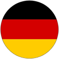
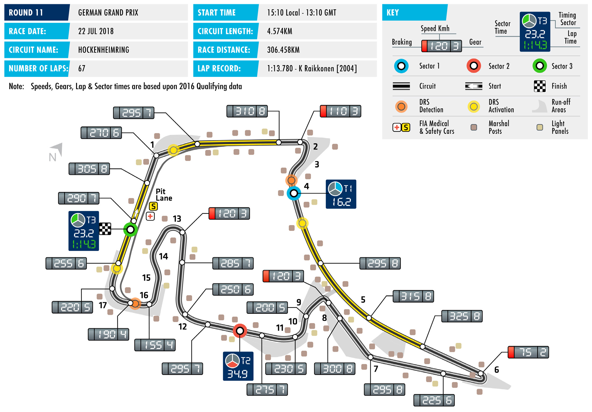
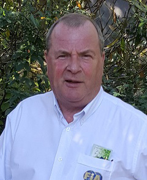
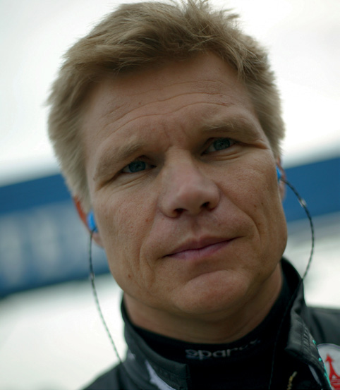

2018 GERMAN GRAND PRIX

20 – 22 July 2018

Round 11 of the 2018 FIA Formula 1 World Championship sees HOCKENHEIMRING

teams and drivers return to the Hockenheimring for the first Length of lap: 4.574km

time since 2016 for the German Grand Prix. Lap record: 1:13.780 (Kimi Räikkönen,

McLaren, 2004) The race has appeared on the F1 calendar every second year since Start line/finish line offset: 0.000km 2014 and since the last edition in 2016 F1’s technical regulations Total number of race laps: 67 have undergone major revisions. This year thus represents the Total race distance: 306.458km first opportunity to see what current Formula 1 cars are capable Pitlane speed limits: 80km/h in of around the 4.574km track. And given the nature of the circuit practice, qualifying, and the race it should mean that Kimi Räikkönen’s 14-year-old lap record will CIRCUIT NOTES come under threat this weekend.

► Tyre barriers have been upgraded Located in the Baden-Württemberg region, Hockenheim is usually through the addition of tyres, tube considered something of a power circuit thanks to a sequence of inserts or conveyor belting in Turns 1, 8, 12, 13 and 17. fast straights in the first half of the lap.

► A new double kerb has been The last generation of F1 cars routinely reached speeds of more installed on the exit of Turn 17. than 300km/h in these sections but a large proportion of any lap

time reduction is likely to come from the medium- and low-speed DRS ZONE

corners that follow where the greater downforce generated by ► This year there will be three DRS F1’s current cars will come into its own. Add in a third DRS zone on zones at the Hockenheimring. The first zone has a detection those fast straights and the gains could be significant. point at the exit of Turn 4 and an activation point 140m after Turn 4. There is a trade-off required, however. The quick straights accent The second and third zones share low-drag and top-end speed, but the Turn 6 hairpin and the a detection point, 20m after Turn low-speed corners of the stadium section put the focus on good 16. The second activation point is traction and downforce. It’s not an easy balancing acts for teams. located 60m after Turn 17, while the third is located 60m after Turn Going into this weekend Sebastian Vettel, fresh from his fourth win 1.

of the season at the British Grand Prix, carries a slim eight-point

advantage over chief title rival, Lewis Hamilton. Meanwhile, three

podium finishes in a row have consolidated Räikkönen’s hold on

third place, with the Finn now 10 points clear of Daniel Ricciardo.

In the battle for the Constructors’ crown, a successful run of results

that saw Ferrari outscore Mercedes by 37 points across F1’s first

triple header means the Italian team now leads the Anglo-German

outfit by 20 points, with Red Bull Racing in third place, 68 points

behind Mercedes.

FAST FACTS

► This will be the 63rd edition of the ► Williams are next on the list of most ► Only four German drivers have won their Formula One World Championship successful constructors, with nine home Grand Prix. Apart from Michael German Grand Prix. The race was not on German Grand Prix wins. All were scored Schumacher and Vettel, Nico Rosberg the calendar in 1950, 1955, 1960, 2007, at Hockenheim, with the first being won in Hockenheim in 2014, while in 2015 or last year. This is the 36th German delivered by Alan Jones in 1979 and the 2001 Ralf Schumacher took the final win GP to take place at the Hockenheimring. most recent being scored by Juan Pablo on the old 6.8km Hockenheimring before Montoya in 2003. the circuit was reconfigured to it current ► In addition to the Hockenheimring, the 4.574km layout. German Grand Prix has been held at ► Michael Schumacher is the most two other venues. The Nürburgring has successful driver at the German Grand ► Seven drivers are set to make their first hosted the race 26 times (from 1951-’54 Prix, winning in 1995, 2002, 2004 German Grand Prix starts this weekend – 1956-’58, 1961-’69, 1971-’76, 1985 and and 2006. All his victories came at the Esteban Ocon, Charles Leclerc, Brendon most recently in 2009, 2011 and 2013). Hockenheimring. Hartley, Pierre Gasly, Stoffel Vandoorne, The four-corner, 8.3km AVUS circuit in Lance Stroll and Sergey Sirotkin. Ocon Berlin hosted a single race, in 1959. ► Two current drivers have the opportunity drove in first practice for Renault in to this weekend match Schumacher’s 2016, He also raced at Hockenheim in ► Despite recent biennial appearances, benchmark. Lewis Hamilton and Alonso DTM and was a race winner here in the Hockenheim remains the seventh most- have three German Grand Prix wins FIA Formula 3 European Championship. visited venue in F1 history. Only Monza apiece. All of Alonso’s wins (2005, 2010 Leclerc drove in FP1 in 2016 for Haas, (67), Monaco (65), Silverstone (52), Spa and 2012) were scored in Hockenheim, won here in European F3 in 2015 and Francorchamps (50), the Nürburgring (40) while Hamilton has two wins at the was on the podium at this track in GP3 in and Montreal’s Circuit Gilles Villenueve Baden-Württemberg circuit (2008 and 2016. Hartley last raced here in Formula (39) have hosted more races. 2016) and one at the Nürburgring, in 3 Euro Series in 2009. Gasly raced here 2011. most recently in GP2 in 2016, finishing ► Ferrari are by far the most successful sixth in the sprint race, while Vandoorne constructors at the German Grand ► The only other driver on the current finished on the podium in both GP2 races Prix, with a massive 21 wins. Eleven grid with a German Grand Prix win here in 2014. Stroll raced here most of the Scuderia’s win have come at to his name is Sebastian Vettel. The recently in European F3 in 2016, winning Hockenheim, including it’s most recent Ferrari driver’s home win came at the all three final weekend races. Finally, German Grand Prix win, courtesy of Nürburgring in 2013 when he was driving Sirotkin won the GP2 feature race here in Fernando Alonso in 2012. for Red Bull Racing. 2016 and was second in the sprint race.

RACE STEWARDS BIOGRAPHIES

NISH SHETTY

FIA STEWARD AND MEMBER OF THE FIA INTERNATIONAL COURT OF APPEAL

Nish Shetty sits on the FIA International Court of Appeal as a judge and is a permanent member of the National Court of Appeal (Singapore). He is also Chairman of the Disciplinary Commission of the Singapore Motor Sports Association and a national steward of the Singapore Grand Prix. Shetty has assisted the Singapore Motor Sports Association for many years as a legal advisor and committee member. In addition to being involved in the Singapore Grand Prix, Shetty has acted as a steward in the Singapore Karting Championship. Away from motor sport, he is a Partner and Head of International Arbitration and Dispute Resolution, South East Asia at global law firm Clifford Chance.

STEVE STRINGWELL

FORMULA 1 STEWARD, PERMANENT CHAIRMAN STEWARD FOR PORSCHE SUPERCUP, BRITISH TOURING CAR CHAMPIONSHIP STEWARD

Englishman Steve Stringwell brings a wealth of experience to the F1 stewarding panel. He began marshalling in 1967 before spending 15 years rallying. Since 1986 he has held a series of posts within the UK’s Motor Sports Association, first as a steward, then chairman of the MSA’s national court and then as chairman of the MSA’s Judicial Advisory Panel. Stringwell serves as permanent chairman steward for the Porsche Supercup and acts a steward in the British Touring Car Championship. He has been chairman of support race stewards at the British Grand Prix since 2005 and has officiated at F1 grands prix since 2012. At home in Yorkshire he is a Justice of the Peace and magistrate in the city of Leeds.

MIKA SALO

FORMER F1 DRIVER, MEMBER OF THE FIA SINGLE-SEATER COMMISSION

Finnish racer Mika Salo competed in over 100 grands prix between 1994-2002. After junior success in Britain and Japan, Salo made his Formula One debut for Lotus at the last two rounds of the 1994 season. Over the next eight years the Finn drove for Tyrrell, Arrows, BAR, Ferrari, Sauber and Toyota. He twice finished on the podium for Ferrari and scored points for Toyota in the Japanese manufacturer’s debut race. After calling time on his F1 career, Salo competed predominantly in sports cars, most notably racing in GT classes. He has GT2 victories at both Le Mans and Sebring to his name, and in 2007 won the GT class in ALMS. He also tried his hand in CART and Australian V8s. Salo is still a familiar face in the Formula 1 paddock, working extensively for Finnish TV among other roles.

2018 FIA Formula One World Championship

DRIVERS’ CHAMPIONSHIP STANDINGS

|  | NIARHAB | ANIHC | NAJIABREZA | NIAPS | OCANOM | ADANAC | ECNARF | AIRTSUA | BG | YNAMREG | YRAGNUH | MUIGLEB | YLATI | EROPAGNIS | AISSUR | NAPAJ | ASU | OCIXEM | LIZARB | IBAHD UBA |
| --- | --- | --- | --- | --- | --- | --- | --- | --- | --- | --- | --- | --- | --- | --- | --- | --- | --- | --- | --- | --- |
| 25 1 | 25 1 | 4 8 | 12 4 | 12 4 | 18 2 | 25 1 | 10 5 | 15 3 | 25 1 |  |  |  |  |  |  |  |  |  |  |  |
| 18 2 | 15 3 | 12 4 | 25 1 | 25 1 | 15 3 | 10 5 | 25 1 | NC | 18 2 |  |  |  |  |  |  |  |  |  |  |  |
| 15 3 | NC | 15 3 | 18 2 | NC | 12 4 | 8 6 | 15 3 | 18 2 | 15 3 |  |  |  |  |  |  |  |  |  |  |  |
| 12 4 | NC | 25 1 | NC | 10 5 | 25 1 | 12 4 | 12 4 | NC | 10 5 |  |  |  |  |  |  |  |  |  |  |  |
| 4 8 | 18 2 | 18 2 | 14 | 18 2 | 10 5 | 18 2 | 6 7 | NC | 12 4 |  |  |  |  |  |  |  |  |  |  |  |
| 8 6 | NC | 10 5 | NC | 15 3 | 2 9 | 15 3 | 18 2 | 25 1 | 15 |  |  |  |  |  |  |  |  |  |  |  |
| 6 7 | 8 6 | 8 6 | NC | NC | 4 8 | 6 7 | 2 9 | NC | 8 6 |  |  |  |  |  |  |  |  |  |  |  |
| 10 5 | 6 7 | 6 7 | 6 7 | 4 8 | NC | NC | 16 | 4 8 | 4 8 |  |  |  |  |  |  |  |  |  |  |  |
| NC | 10 5 | 1 10 | 13 | 8 6 | 13 | 13 | 8 6 | 10 5 | 2 9 |  |  |  |  |  |  |  |  |  |  |  |
| 1 10 | 11 | 2 9 | 10 5 | 6 7 | 1 10 | 4 8 | 4 8 | 12 | NC |  |  |  |  |  |  |  |  |  |  |  |
| 12 | 1 10 | 11 | NC | NC | 8 6 | 2 9 | NC | 8 6 | 6 7 |  |  |  |  |  |  |  |  |  |  |  |
| 11 | 16 | 12 | 15 3 | 2 9 | 12 | 14 | NC | 6 7 | 1 10 |  |  |  |  |  |  |  |  |  |  |  |
| NC | 12 4 | 18 | 12 | NC | 6 7 | 11 | NC | 11 | 13 |  |  |  |  |  |  |  |  |  |  |  |
| 13 | 12 | 19 | 8 6 | 1 10 | 18 | 1 10 | 1 10 | 2 9 | NC |  |  |  |  |  |  |  |  |  |  |  |
| NC | 13 | 17 | NC | NC | 15 | 12 | 11 | 12 4 | NC |  |  |  |  |  |  |  |  |  |  |  |
| 2 9 | 4 8 | 13 | 2 9 | NC | 14 | 16 | 12 | 15 | 11 |  |  |  |  |  |  |  |  |  |  |  |
| 14 | 14 | 14 | 4 8 | 11 | 17 | NC | 17 | 14 | 12 |  |  |  |  |  |  |  |  |  |  |  |
| NC | 2 9 | 16 | 11 | 13 | 11 | 15 | 13 | 1 10 | NC |  |  |  |  |  |  |  |  |  |  |  |
| 15 | 17 | 20 | 1 10 | 12 | 19 | NC | 14 | NC | NC |  |  |  |  |  |  |  |  |  |  |  |
| NC | 15 | 15 | NC | 14 | 16 | 17 | 15 | 13 | 14 |  |  |  |  |  |  |  |  |  |  |  |

STNIOP

1 S. VETTEL 171

2 L. HAMILTON 163

3 K. RÄIKKÖNEN 116

4 D. RICCIARDO 106

5 V. BOTTAS 104

6 M. VERSTAPPEN 93

7 N. HÜLKENBERG 42

8 F. ALONSO 40

9 K. MAGNUSSEN 39

10 C. SAINZ 28

11 E. OCON 25

S. PÉREZ 24 12

P. GASLY 18 13

C. LECLERC 13 14

R. GROSJEAN 12 15

S. VANDOORNE 8 16

L. STROLL 4 17

M. ERICSSON 3 18

B. HARTLEY 1 19

S. SIROTKIN 0 20

2018 FIA Formula One World Championship

CONSTRUCTORS’ CHAMPIONSHIP STANDINGS

NAJIABREZA AILARTSUA EROPAGNIS IBAHD YNAMREG YRAGNUH STNIOP NIARHAB OCANOM ADANAC AIRTSUA MUIGLEB ECNARF OCIXEM ANIHC AISSUR NAPAJ LIZARB NIAPS YLATI ASU UBA BG

| 40 1 3 | 25 1 NC | 19 3 8 | 30 2 4 | 12 4 NC | 30 2 4 | 33 1 6 | 25 3 5 | 33 2 3 | 40 1 3 |
| --- | --- | --- | --- | --- | --- | --- | --- | --- | --- |
| 22 2 8 | 33 2 3 | 30 2 4 | 25 1 13 | 43 1 2 | 25 3 5 | 28 2 5 | 31 1 7 | NC NC | 30 2 4 |
| 20 4 6 | NC NC | 35 1 5 | NC NC | 25 15 10 | 27 1 9 | 27 3 4 | 30 2 4 | 25 1 NC | 10 5 NC |
| 7 7 10 | 8 6 11 | 10 6 9 | 10 5 NC | 6 7 NC | 5 8 10 | 10 7 8 | 6 8 9 | NC NC | 8 6 NC |
| NC NC | 10 5 13 | 1 10 17 | 13 NC | 8 6 NC | 13 15 | 12 13 | 8 6 11 | 22 4 5 | 2 9 NC |
| 11 12 | 1 10 16 | 11 12 | 15 3 NC | 2 9 NC | 8 6 12 | 2 9 14 | NC NC | 14 6 7 | 7 7 10 |
| 12 5 9 | 10 7 8 | 6 7 13 | 8 7 9 | 4 8 NC | 14 NC | 16 NC | 12 16 | 4 8 15 | 4 8 11 |
| 15 NC | 12 4 17 | 18 20 | 1 10 12 | 12 NC | 6 7 19 | 11 NC | 14 NC | 11 NC | 13 NC |
| 13 NC | 2 9 12 | 16 19 | 8 6 11 | 1 10 13 | 11 18 | 1 10 15 | 1 10 13 | 3 9 10 | NC NC |
| 14 NC | 14 15 | 14 15 | 4 8 NC | 11 14 | 16 17 | 17 NC | 15 17 | 13 14 | 12 14 |

1 287 SCUDERIA FERRARI

MERCEDES AMG 267 2 PETRONAS MOTORSPORT

3 ASTON MARTIN 199 RED BULL RACING

RENAULT SPORT 70 4 FORMULA ONE TEAM

51 5 HAAS F1 TEAM

SAHARA FORCE INDIA 49 6 F1 TEAM

48 MCLAREN F1 TEAM 7

RED BULL 19 8 TORO ROSSO HONDA

ALFA ROMEO 16 9 SAUBER F1 TEAM

WILLIAMS MARTINI 4 10 RACING

FORMULA ONE TIMETABLE & FIA MEDIA SCHEDULE

THURSDAY

Press conference 1500

FRIDAY

Practice session 1 1100 - 1230 Press conference 1300

Practice session 2 1500 - 1630

SATURDAY

Practice session 3 1200 - 1300 Qualifying 1500 - 1600 Followed by track interviews and press conference

SUNDAY

Drivers’ Parade 1330 Race 1510 Followed by parc fermé interviews and press conference

ADDITIONAL MEDIA OPPORTUNITIES

QUALIFYING

All drivers eliminated in Q1 or Q2 will be available for media interviews immediately after the end of each session, as will drivers who participated in Q3, but who are not required for the post-qualifying press conference. The TV Pen is located in the paddock, adjacent to the FIA Hospitality Unit.

RACE

Any driver retiring before the end of the race will be made available at the TV pen interview area. In addition, during the race every team will make available at least one senior spokesperson for interview by officially accredited TV crews. A list of those nominated will be made available in the media centre.

FIA COMMUNICATIONS DEPARTMENT press@fia.com T +33 1 43 12 58 15
