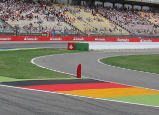

2018 GERMAN GRAND PRIX

19 - 22 July 2018

From The FIA Formula One Race Director Document 20

To All Teams, All Officials Date 21 July 2018

Time 19:00

Title Revised Event Notes

Description Event Notes

Enclosed 2_2018_GERMAN_GP_EVENT_NOTES_V2.pdf

Charlie Whiting

The FIA Formula One Race Director

2018 GERMAN GRAND PRIX

19-22 JULY 2018

From The FIA Formula One Race Director Document 19

To Formula One Team Managers Date 21 July 2018

Time 19.00

EVENT NOTES (V2)

21 JULY 2018

1) Issues arising from the British Grand Prix

2) Changes to the circuit

2.1 Tyre barriers have been upgraded by the addition of tyres, tube inserts or conveyor belting in turns 1, 8, 12, 13 and 17.

2.2 A new double kerb has been installed on the exit of turn 17.

3) Pit lane map

3.1 Safety Car lines.

3.2 The location of the pit entry and the pit exit.

3.3 Designated garage areas.

3.4 Safety Car position for first lap and rest of race.

3.5 Blue flag marshal at the pit exit.

3.6 Track light panel displaying pit entry status.

4) Pirelli Event Preview

4.1 With reference to Article 24.4(a) of the Sporting Regulations see the attached document provided by the official tyre supplier.

5) Weighing and weighing platform

5.1 Between 11.00 and 15.00 on Thursday, and by prior arrangement with Jo Bauer, the weighing platform will be available for teams to use for private deflection checks.

1/4

5.2 The weighing platform will be available for general checks at the following times, however, no more than 10 team personnel may be present during any visit. Each visit should last no more than 10 minutes unless no other team is waiting in the pit lane :

a) From 15.00 on Thursday until 14.30 on Saturday (between 13.00 and 14.30 each visit will be restricted to five minutes).

b) From when the cars are returned to the teams after qualifying until 19.30 on Saturday.

c) From 10.00 until 14.00 on Sunday.

Any team found to be abusing the time limits set out above, which we will be enforced by FIA security personnel and our own CCTV, will not be permitted to use the weighbridge again during the Event.

Lastly, cars should not be pushed to the weighing platform whilst any support race cars or personnel are in the pit lane.

6) Red zones for photographers in the pit lane during practice sessions

6.1 See the attached drawing.

7) Practice starts

7.1 Practice starts may only be carried out at the pit exit on the right hand side and, for the avoidance of doubt, this includes any time the pit exit is open for the race.

7.2 For reasons of safety and sporting equity, cars may not stop in the fast lane of the pits at any time the pit exit is open without a justifiable reason (a practice start is not considered a justifiable reason).

8) Lines or bollards at the pit entry and pit exit

8.1 In accordance with Chapter 4 (Section 5) of Appendix L to the ISC drivers must keep to the right of the white line at the pit exit when leaving the pits, no part of any car leaving the pits may cross this line.

8.2 For safety reasons drivers must stay to the right of the bollard at the pit entry when entering the pits.

9) Observing yellow flags during free practice and qualifying

9.1 Double waved : Any driver passing through a double waved yellow marshalling sector must reduce speed significantly and be prepared to change direction or stop. In order for the stewards to be satisfied that any such driver has complied with these requirements it must be clear that he has not attempted to set a meaningful lap time, for practical purposes this means the driver should abandon the lap (this does not necessarily mean he has to pit as the track could well be clear the following lap).

9.2 Single waved : Drivers should reduce their speed and be prepared to change direction. It must be clear that a driver has reduced speed and, in order for this to be clear, a driver would be expected to have braked earlier and/or discernibly reduced speed in the relevant marshalling sector.

Drivers should not overtake any car in a single waved yellow marshalling sector unless it is clear that a car is slowing with a completely obvious problem, e.g. obvious accident damage or a deflated tyre.

2/4

10) Suspended race procedure tests after P1 and P2

10.1 At the end of P1 and P2 one driver from each team may participate in the suspended race procedure test should take the chequered flag, complete the lap, enter the pit lane and form up in a line in the fast lane. Engines should be switched off.

Red lights will be shown around the track when the last car on the track takes the chequered flag after the end of the session.

Within a few minutes a “race resumption” time will be displayed on the timing monitors and the pit exit will open at the appointed time, drivers who were in the pits when the chequered flag was shown may join the back of the line of cars leaving the pits from the fast lane. During this lap the track light panels will display “SS” when the first car reaches S1. Drivers should then complete a lap, without overtaking, and proceed to the grid and form up in the correct grid box as indicated by the grid light panels. Once all the cars are on the grid the main race start light procedure will be initiated, when the red lights are extinguished drivers should leave the grid, they may make a practice start but this must be done safely and at no time should a driver attempt a practice start if there is another car in front of him on the same side of the grid.

11) Track light panels

11.1 The FIA light panels have been installed in the positions shown on the circuit map. In accordance with Appendix H to the ISC the light signals have the same meaning as flag signals.

12) Drivers leaving their pit stop position in the pit lane

12.1 For safety reasons, no car should be driven from its pit stop position at any time unless :

a) It has first been driven into the pit stop position having just entered the pit lane from the track, and ;

b) It is then driven immediately back onto the track from the pit stop position.

13) Fire extinguishers around the circuit

13.1 Indicated by fluorescent orange boards around the circuit.

14) Places to remove cars from the track

14.1 Indicated by fluorescent orange panels on the walls or guardrails.

15) In laps and reconnaissance laps

15.1 In order to ensure that cars are not driven unnecessarily slowly on in laps during and after the end of qualifying or during reconnaissance laps when the pit exit is opened for the race, drivers must stay below the maximum time set by the FIA between the Safety Car lines shown on the pit lane map.

You will be informed of the maximum time after the first day of practice.

16) Support races and pit walks

16.1 Teams are asked to keep their barriers no more than three metres from the garages during all support race practice sessions and races in addition to all pit walks (including Thursday afternoon).

17) Post qualifying parc fermé

17.1 The cameras should be installed and operated in the same way as usual.

3/4

18) Operational personnel curfew

18.1 Boards warning anyone attempting to enter the paddock that the curfew is in operation will be placed immediately before the entry turnstiles at the relevant times.

19) Removing cars from the grid

19.1 Two gates in the pit wall, beside pole position and position 14.

20) Car number light panels for the start

20.1 On the driver's right.

21) Track light panel displaying pit entry status

21.1 The light panel indicated on the pit lane map will display a flashing yellow arrow if cars are required to use the pit lane once the Safety Car has been deployed during the race.

21.2 The light panel indicated on the pit lane map will display a flashing red cross if the pit lane is closed at any point during the race.

22) Lapping during the race

22.1 The ISC requires drivers who are caught by another car about to lap him to allow the faster driver past at the first available opportunity. The F1 Marshalling System has been developed in order to ensure that the point at which a driver is shown blue flags is consistent, rather than trusting the ability of marshals to identify situations that require blue flags.

As it was at the end of last season the system will be set to give a pre-warning when the faster car is within 3.0s of the car about to be lapped, this should be used by the team of the slower car to warn their driver he is soon going to be lapped and that allowing the faster car through should be considered a priority. When the faster car is within 1.2s of the car about to be lapped blue flags will be shown to the slower car (in addition to blue light panels, blue cockpit lights and a message on the timing monitors) and the driver must allow the following driver to overtake at the first available opportunity.

It should be noted that the aim of using F1MS is ensure consistent application of the rules, additional instructions may also be given by race control when necessary.

23) Rolling starts

23.1 If a rolling start procedure is used as set out in Article 39.16 the race will be deemed to have started when the leading car crosses the Line after the safety car has returned to the pits.

For the avoidance of doubt, and with the exception of the permission given in Article 39.16, no driver may overtake until he reaches the Line, unless a car slows with an obvious problem.

24) Post race parc fermé

24.1 All cars must enter the pit lane and proceed directly to the weighing area.

25) Any other business

Charlie Whiting FIA Formula One Race Director

4/4

|  |  | Grand Prix of Germany 20-22/07/2018 (18R11HCK) |  |  |  |  |  |  |  |
| --- | --- | --- | --- | --- | --- | --- | --- | --- | --- |
|  |  | Compound |  | FL | FR | RL | RR |  | Mandatory race tyres |
|  |  | MEDIUM |  | M60 | M62 | M70 | M72 |  | MEDIUM |
|  |  | SOFT |  | S60 | S62 | S70 | S72 |  | SOFT |
|  |  | ULTRASOFT |  | U60 | U62 | U70 | U72 |  |  |
|  |  | INTERMEDIATE SOFT |  | G37 | G38 | G39 | G40 |  | Q3 tyre |
|  |  | WET SOFT Cross-Over time MINIMUM STARTING PRESSURE, BLISTERING SENSITIVITY, CAMBER LIMIT |  | W37 WET > 119% > INT > 113% > DRY | W38 Front (psi) | W39 | W40 | Rear (psi) | ULTRASOFT |
|  |  |  | Slicks |  | 21.5 |  |  | 20.0 |  |
|  |  |  | Intermediate |  | 19.5 |  |  | 19.0 |  |
|  |  |  | Wet |  | 18.5 |  |  | 18.0 |  |
| FE EOS Camber limit RE EOS Camber limit -3.50 ° -2.00 ° FE Blistering RE Blistering sensitivity sensitivity Medium Low |  | TYRE HEATING STRATEGY |  |  |  |  |  |  |  |
| Storage temperature: Optimum time in Storage temperature: Optimum time in blanket (@80°): blanket (@60°): 60°C 40°C 2h 1h SLICKS INTER Maximum boost Blanket time window Maximum boost Blanket time window temperature (@80°): temperature (@60°): 1h @ 110°C 1h to 3h 30min @ 80°C 30 min to 2h Storage temperature: Optimum time in blanket (@60°): 40°C 1h WET Blanket time window NO BOOST (@60°): 30 min to 2h GENERAL NOTES Teams are kindly reminded that the following parameters will be subjected to FIA checks during the event: - Starting pressure. - Camber at maximum speed. - Maximum blanket temperature. - Tyre swapping. | Tyre Notes |  |  |  |  |  |  |  |  |
| ● Not permiFed to switch tyres from their originally allocated posi%on. Storage Temp˚C is the recommended temperature the tyre can stay in blankets without time limit. All temperature limits apply to the actual tyre surface temperature, measured with the IR ● Do not subject tyres to large deforma%on or heavy impact. gun detailed in TD029-15. ● Do not leave fiFed tyres exposed at an air temperature lower than 15°C SIDEWALLS HEATING CLARIFICATION (ALL PRODUCTS): you are allowed to apply a max. and/or any UV emission. temperature of 100 °C for max. 1 hr to the sidewalls as long as the max. temp/time at any part ● Revised prescrip%ons could be issued during the race weekend in of the tread is the one described in the corresponding section above. accordance with TD/007-16. | ● Not permiFed to switch tyres from their originally allocated posi%on. ● Do not subject tyres to large deforma%on or heavy impact. ● Do not leave fiFed tyres exposed at an air temperature lower than 15°C and/or any UV emission. ● Revised prescrip%ons could be issued during the race weekend in accordance with TD/007-16. |  |  |  |  | Storage Temp˚C is the recommended temperature the tyre can stay in blankets without time limit. All temperature limits apply to the actual tyre surface temperature, measured with the IR gun detailed in TD029-15. SIDEWALLS HEATING CLARIFICATION (ALL PRODUCTS): you are allowed to apply a max. temperature of 100 °C for max. 1 hr to the sidewalls as long as the max. temp/time at any part of the tread is the one described in the corresponding section above. |  |  |  |

2018 German Grand Prix Pit Lane

SAFETY CAR Line 2 SAFETY CAR Line 1

Pit Entry Status panel

PIT LANE Starts X PIT LANE Ends

PIT EXIT SAFETY CAR CARS RECOVERED FROM First Lap TRACK PLACED HERE

PIT ENTRY

F1 Garages

Pit Entry Bollard SAFETY CAR Blue Flag Race Marshal (End of pit wall)

| 48 | 47 | 46 | 45 |  | 44 | 43 | 42 | 41 | 40 | 39 | 38 | 37 | 36 | 35 | 34 | 33 | 32 | 31 | 30 | 29 | 28 | 27 | 26 | 25 | 24 | 23 | 22 | 21 | 20 | 19 | 18 | 17 | 16 | 15 | 14 | 12 | 11 | 10 | 9 | 8 | 7 | 6 | 5 | 4 | 3 | 2 | 1 | 0 |
| --- | --- | --- | --- | --- | --- | --- | --- | --- | --- | --- | --- | --- | --- | --- | --- | --- | --- | --- | --- | --- | --- | --- | --- | --- | --- | --- | --- | --- | --- | --- | --- | --- | --- | --- | --- | --- | --- | --- | --- | --- | --- | --- | --- | --- | --- | --- | --- | --- |
|  |  | spaL toH 1F | spaL toH 1F |  | spaL toH 1F | rebuaS | rebuaS | rebuaS | rebuaS / neraLcM | neraLcM | neraLcM | neraLcM | saaH | saaH | saaH | saaH / ossoR oroT | ossoR oroT | ossoR oroT | ossoR oroT | tluaneR | tluaneR | tluaneR | tluaneR | smailliW | smailliW | smailliW | smailliW | aidnI ecroF | aidnI ecroF | aidnI ecroF | aidnI ecroF | lluB deR | lluB deR | lluB deR | lluB deR | irarreF | irarreF | irarreF | irarreF | sedecreM | sedecreM | sedecreM | sedecreM | AIF | AIF | AIF | 1F | 1F |
|  |  |  |  | Sauber |  |  |  |  | McLaren |  |  |  | Haas |  |  |  | Toro Rosso |  |  |  | Renault |  |  | Williams |  |  |  | Force India |  |  |  | Red Bull |  |  |  | Ferrari |  |  |  | Mercedes |  |  |  | Designated Garage Areas |  |  |  |  |

Pit Stop

FAST LANE FAST LANE

Team Personnel (Race Start ONLY)

Version 2 – 19 July 2018
