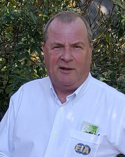
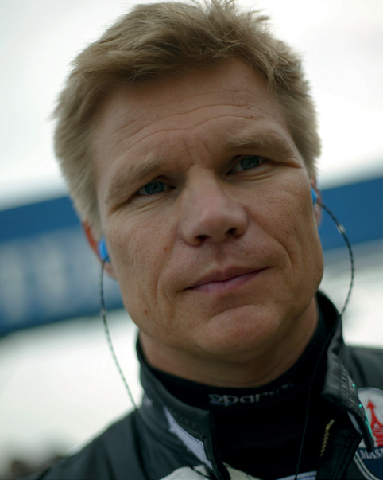

RACE STEWARDS BIOGRAPHIES

NISH SHETTY

FIA STEWARD AND MEMBER OF THE FIA INTERNATIONAL COURT OF APPEAL

Nish Shetty sits on the FIA International Court of Appeal as a judge and is a permanent member of the National Court of Appeal (Singapore). He is also Chairman of the Disciplinary Commission of the Singapore Motor Sports Association and a national steward of the Singapore Grand Prix. Shetty has assisted the Singapore Motor Sports Association for many years as a legal advisor and committee member. In addition to being involved in the Singapore Grand Prix, Shetty has acted as a steward in the Singapore Karting Championship. Away from motor sport, he is a Partner and Head of International Arbitration and Dispute Resolution, South East Asia at global law firm Clifford Chance.

STEVE STRINGWELL

FORMULA 1 STEWARD, PERMANENT CHAIRMAN STEWARD FOR PORSCHE SUPERCUP, BRITISH TOURING CAR CHAMPIONSHIP STEWARD

Englishman Steve Stringwell brings a wealth of experience to the F1 stewarding panel. He began marshalling in 1967 before spending 15 years rallying. Since 1986 he has held a series of posts within the UK’s Motor Sports Association, first as a steward, then chairman of the MSA’s national court and then as chairman of the MSA’s Judicial Advisory Panel. Stringwell serves as permanent chairman steward for the Porsche Supercup and acts a steward in the British Touring Car Championship. He has been chairman of support race stewards at the British Grand Prix since 2005 and has officiated at F1 grands prix since 2012. At home in Yorkshire he is a Justice of the Peace and magistrate in the city of Leeds.

MIKA SALO

FORMER F1 DRIVER, MEMBER OF THE FIA SINGLE-SEATER COMMISSION

Finnish racer Mika Salo competed in over 100 grands prix between 1994-2002. After junior success in Britain and Japan, Salo made his Formula One debut for Lotus at the last two rounds of the 1994 season. Over the next eight years the Finn drove for Tyrrell, Arrows, BAR, Ferrari, Sauber and Toyota. He twice finished on the podium for Ferrari and scored points for Toyota in the Japanese manufacturer’s debut race. After calling time on his F1 career, Salo competed predominantly in sports cars, most notably racing in GT classes. He has GT2 victories at both Le Mans and Sebring to his name, and in 2007 won the GT class in ALMS. He also tried his hand in CART and Australian V8s. Salo is still a familiar face in the Formula 1 paddock, working extensively for Finnish TV among other roles.
