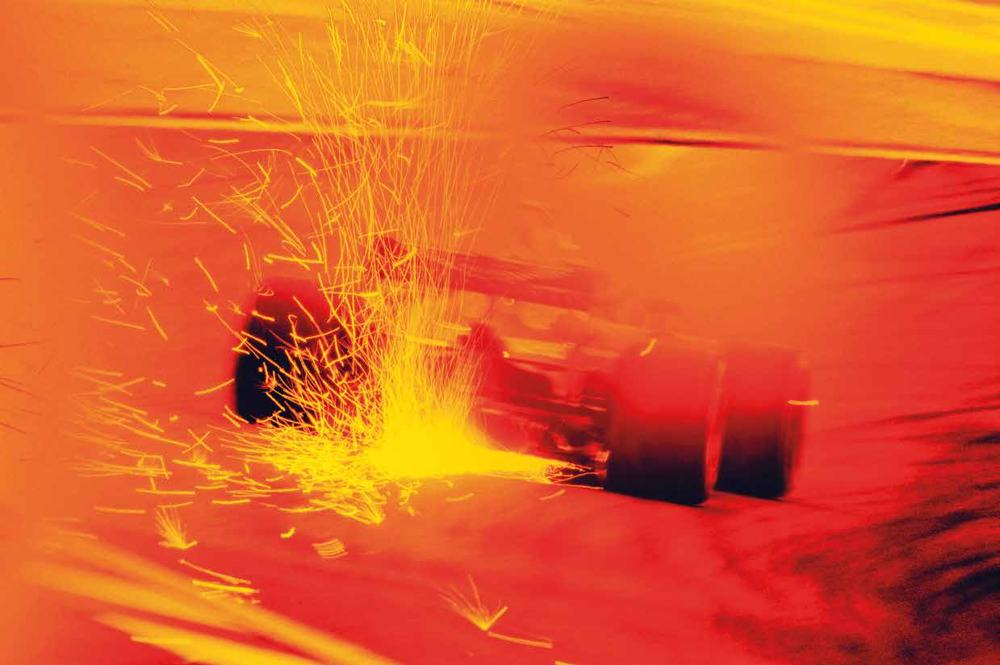

Official A4 Media Kit Cover Width 210mm x Depth 297mm (3mm bleed) Official F1 Media Letterhead Width 210mm x Depth 297mm

Formula 1 Official title sponsor Official Formula 1™ Media Kit Rolex Magyar Nagydíj 2018

Budapest 27-29 July

ROLEX

MAGYAR NAGYDĪJ

BUDAPEST

27-29 JULY

Promoter

The F1 logo, F1, FORMULA 1, FIA FORMULA ONE WORLD CHAMPIONSHIP, GRAND PRIX, MAGYAR NAGYDIJ and related marks are trade marks of Address Line 1 Office: +XX XXX XXX XXX Formula One Licensing BV, a Formula 1 company. All rights reserved. Address Line 2 Email: xxxxxxxxxxx.com Postcode Website: Xxxxxx.com 1 The F1 logo, F1, FORMULA 1, FIA FORMULA ONE WORLD CHAMPIONSHIP, GRAND PRIX, MAGYAR NAGYDIJ and related marks are trade marks of Formula One Licensing BV, a Formula 1 company. All rights reserved.

PMS 2347 C PMS BLACK 6 C

ARTWORK MAY BE RELEASED BEFORE THE RACE TITLE AND EVENT TITLE SPONSOR HAVE BEEN CONFIRMED. PLEASE CHECK THAT ALL INFORMATION IS CORRECT BEFORE GOING TO PRINT. PLEASE CAN YOU ALSO PLACE THE OFFICIAL PROMOTERS ADDRESS, EMAIL AND TELEPHONE NUMBERS IN UPPER AND LOWER CASE IN THE DESIGNATED AREA MARKED BY THE X. PLEASE DO NOT CHANGE THE TYPEFACE OR TYPE SIZE.

x

Official F1 Media Letterhead Width 210mm x Depth 297mm

Formula 1 Official Formula 1™ Media Kit Rolex Magyar Nagydíj 2018

Budapest 27-29 July

WELCOME TO HUNGARORING!

ÜDVÖZÖLJÜK A HUNGARORINGEN!

HUPNrGoAmRoOtReIrNG H-2146 MOGYORÓD PF.:10 Address Line 1 Office: +XX XXX XXX XXX TELA.:d+d36re 2s8s 4L4in4e 4 244 Email: xxxxxxxxxxx.com E-MPAoIsLt: cHoGdPeMEDIA@HUNWGAeRbOsRitIeN:G X.HxxUxxx.com 3

The F1 logo, F1, FORMULA 1, FIA FORMULA ONE WORLD CHAMPIONSHIP, GRAND PRIX, MAGYAR NAGYDIJ and related marks are trade marks of Formula One Licensing BV, a Formula 1 company. All rights reserved.

PMS 2347 C PMS BLACK 6 C

ARTWORK MAY BE RELEASED BEFORE THE RACE TITLE AND EVENT TITLE SPONSOR HAVE BEEN CONFIRMED. PLEASE CHECK THAT ALL INFORMATION IS CORRECT BEFORE GOING TO PRINT. PLEASE CAN YOU ALSO PLACE THE OFFICIAL PROMOTERS ADDRESS, EMAIL AND TELEPHONE NUMBERS IN UPPER AND LOWER CASE IN THE DESIGNATED AREA MARKED BY THE X. PLEASE DO NOT CHANGE THE TYPEFACE OR TYPE SIZE.

Official F1 Media Letterhead Width 210mm x Depth 297mm

Formula 1 Official Formula 1™ Media Kit Rolex Magyar Nagydíj 2018

Budapest 27-29 July

TABLE OF CONTENTS

MEDIA INFORMATION

Formula One Timetable 6

Accreditation Centre 8

Media Centre 8

Photographers’ Centre 10

FACTS & FIGURES

Formula One Calendar 13

Provisional Entry List 14

Garage Allocation 15

Teams and Drivers 16

WEIGHTS & MEASURES

Statistics After Silverstone 28

Current World Championship Standing 29

Statistics of Participating Drivers 30

History of Hungaroring 31

Starting Grid – Hungaroring 2017 33

Race Classification – Hungaroring 2017 34

Winners of the Hungarian Grand Prix 35

Points won at the Hungaroring 36

Chronology of World Champions 38

Maps 39

Promoter

Address Line 1 Office: +XX XXX XXX XXX Address Line 2 Email: xxxxxxxxxxx.com Postcode Website: Xxxxxx.com 4 The F1 logo, F1, FORMULA 1, FIA FORMULA ONE WORLD CHAMPIONSHIP, GRAND PRIX, MAGYAR NAGYDIJ and related marks are trade marks of Formula One Licensing BV, a Formula 1 company. All rights reserved.

PMS 2347 C PMS BLACK 6 C

ARTWORK MAY BE RELEASED BEFORE THE RACE TITLE AND EVENT TITLE SPONSOR HAVE BEEN CONFIRMED. PLEASE CHECK THAT ALL INFORMATION IS CORRECT BEFORE GOING TO PRINT. PLEASE CAN YOU ALSO PLACE THE OFFICIAL PROMOTERS ADDRESS, EMAIL AND TELEPHONE NUMBERS IN UPPER AND LOWER CASE IN THE DESIGNATED AREA MARKED BY THE X. PLEASE DO NOT CHANGE THE TYPEFACE OR TYPE SIZE.

Official F1 Media Letterhead Width 210mm x Depth 297mm

Formula 1 Official Formula 1™ Media Kit Rolex Magyar Nagydíj 2018

Budapest 27-29 July

MEDIA

INFORMATION

Promoter

Address Line 1 Office: +XX XXX XXX XXX Address Line 2 Email: xxxxxxxxxxx.com Postcode Website: Xxxxxx.com 5

The F1 logo, F1, FORMULA 1, FIA FORMULA ONE WORLD CHAMPIONSHIP, GRAND PRIX, MAGYAR NAGYDIJ and related marks are trade marks of Formula One Licensing BV, a Formula 1 company. All rights reserved.

PMS 2347 C PMS BLACK 6 C

ARTWORK MAY BE RELEASED BEFORE THE RACE TITLE AND EVENT TITLE SPONSOR HAVE BEEN CONFIRMED. PLEASE CHECK THAT ALL INFORMATION IS CORRECT BEFORE GOING TO PRINT. PLEASE CAN YOU ALSO PLACE THE OFFICIAL PROMOTERS ADDRESS, EMAIL AND TELEPHONE NUMBERS IN UPPER AND LOWER CASE IN THE DESIGNATED AREA MARKED BY THE X. PLEASE DO NOT CHANGE THE TYPEFACE OR TYPE SIZE.

Official F1 Media Letterhead Width 210mm x Depth 297mm

Formula 1 Official Formula 1™ Media Kit Rolex Magyar Nagydíj 2018

Budapest 27-29 July

FORMULA 1 HUNGARIAN GRAND PRIX 2018

TIMETABLE

Thursday, 26 July 2018

9:00 FIA Track inspection 11:00 - 17:00 FORMULA 1 INITIAL SCRUTINEERING 11:00 Promoter Activity Security Briefing (in the Briefing Room) 13:00 - 15:00 FIA Track closed, FIA/FOM system checks

13:45 FIA Track inspection

14:00 - 15:00 FIA High speed track test 15:00 FORMULA 1 Stewards' Meeting

15:00 FORMULA 1 PRESS CONFERENCE

16:00 - 18:00 Public Pit Lane Walk Three day ticket holders only

16:30 FIA Formula 2 Drivers' and Team Managers' Meeting

17:00 FORMULA 1 TEAM MANAGERS' MEETING

18:00 GP3 Series Drivers' and Team Managers' Meeting

18:00 - 18:30 ## F1 Experience Pit Lane Walk F1 Experience guests only

18:30 - 19:00 ## F1 Experience Truck Tour F1 Experience guests only

Friday, 27 July 2018

8:00 - 8:50 ## Formula 1 F1 2 Seater 8:50 FIA Medical Inspection 9:00 FIA Track inspection and track test

9:30 - 10:15 ## GP3 SERIES PRACTICE SESSION 10:30 FIA Track inspection

11:00 - 12:30 ## FORMULA 1 FIRST PRACTICE SESSION 12:55 - 13:40 ## FIA FORMULA 2 PRACTICE SESSION 13:00 - 14:00 FORMULA 1 Press Conference 13:50 - 14:20 ## Paddock Club Paddock Club Truck Tour

13:50 - 14:20 ## Paddock Club Paddock Club Pit Lane Walk

14:00 PORSCHE MOBIL 1 SUPERCUP Drivers' Meeting

14:30 FIA Track inspection

15:00 - 16:30 ## FORMULA 1 SECOND PRACTICE SESSION

16:55 - 17:25 ## FIA FORMULA 2 QUALIFYING SESSION

17:40 - 17:50 ## Formula 1 F1 2 Seater

18:00 FORMULA 1 Drivers' Meeting

18:10 - 18:55 ## PORSCHE MOBIL 1 SUPERCUP PRACTICE SESSION

19:00 - 19:30 Promoter Activity Marshal Pit Lane Walk

19:00 - 19:30 ## Paddock Club Paddock Club Truck Tour

19:00 - 19:30 ## FIA FORMULA 2 Press Conference

Promoter

Address Line 1 Office: +XX XXX XXX XXX Address Line 2 Email: xxxxxxxxxxx.com Postcode Website: Xxxxxx.com 6 The F1 logo, F1, FORMULA 1, FIA FORMULA ONE WORLD CHAMPIONSHIP, GRAND PRIX, MAGYAR NAGYDIJ and related marks are trade marks of Formula One Licensing BV, a Formula 1 company. All rights reserved.

PMS 2347 C PMS BLACK 6 C

ARTWORK MAY BE RELEASED BEFORE THE RACE TITLE AND Timetable 1 / 2 EVENT TITLE SPONSOR HAVE BEEN CONFIRMED. PLEASE CHECK THAT ALL INFORMATION IS CORRECT BEFORE GOING TO PRINT. PLEASE CAN YOU ALSO PLACE THE OFFICIAL PROMOTERS ADDRESS, EMAIL AND TELEPHONE NUMBERS IN UPPER AND LOWER CASE IN THE DESIGNATED AREA MARKED BY THE X. PLEASE DO NOT CHANGE THE TYPEFACE OR TYPE SIZE.

Official F1 Media Letterhead Width 210mm x Depth 297mm

Formula 1 Official Formula 1™ Media Kit Rolex Magyar Nagydíj 2018

Budapest 27-29 July

Saturday, 28 July 2018

9:00 - 9:30 ## Paddock Club Paddock Club Pit Lane Walk 9:00 - 9:30 ## Paddock Club Paddock Club Truck Tour 9:00 - 9:45 ## FORMULA 1 Team pit stop practice 9:30 - 9:50 ## Formula 1 F1 2 Seater 10:05 FIA Medical Inspection 10:15 FIA Track inspection and safety car test

10:45 - 11:15 ## GP3 SERIES QUALIFYING SESSION 11:30 FIA Track inspection

12:00 - 13:00 ## FORMULA 1 THIRD PRACTICE SESSION

13:25 - 13:55 ## PORSCHE MOBIL 1 SUPERCUP QUALIFYING SESSION 14:00 - 14:20 ## FIA FORMULA 2 Drivers' Parade

14:00 - 14:30 ## Paddock Club Paddock Club Truck Tour

14:00 - 14:45 ## Paddock Club Paddock Club Pit Lane Walk

14:30 FIA Track inspection

15:00 - 16:00 ## FORMULA 1 QUALIFYING SESSION 16:30 - 16:35 FIA FORMULA 2 Pit Lane Open

16:45 - 17:50 ## FIA FORMULA 2 FIRST RACE (37 laps or 60 minutes)

18:05 - 18:35 ## FIA FORMULA 2 Press Conference

18:15 - 18:20 GP3 SERIES Pit Lane Open

18:30 - 19:15 ## GP3 SERIES FIRST RACE (22 laps or 40 minutes)

Sunday, 29 July 2018

8:30 - 9:00 ## Formula 1 F1 2 Seater

9:05 FIA Medical Inspection

9:15 FIA Track inspection and track test

9:50 - 9:55 GP3 SERIES Pit Lane Open

10:05 - 10:40 ## GP3 SERIES SECOND RACE (17 laps or 30 minutes) 11:05 - 11:10 FIA FORMULA 2 Pit Lane Open

11:20 - 12:10 ## FIA FORMULA 2 SECOND RACE (28 laps or 45 minutes) 12:25 - 12:55 FIA FORMULA 2 Press Conference

12:35 - 13:10 ## PORSCHE MOBIL 1 SUPERCUP RACE (14 laps or 30 minutes)

13:20 - 13:50 ## Paddock Club Paddock Club Pit Lane Walk

13:25 - 13:55 ## Paddock Club Paddock Club Truck Tour

13:30 FORMULA 1 Drivers' Track Parade

14:00 - 14:15 ## FORMULA 1 Starting grid presentation

14:00 FIA Medical Inspection

14:10 FIA Track inspection

14:30 - 14:40 ## FORMULA 1 Pit Lane Open

14:54 FORMULA 1 National Anthem

15:10 - 17:10 ## FORMULA 1 GRAND PRIX (70 laps or 120 minutes)

Promoter

Address Line 1 Office: +XX XXX XXX XXX Address Line 2 Email: xxxxxxxxxxx.com Postcode Website: Xxxxxx.com 7

The F1 logo, F1, FORMULA 1, FIA FORMULA ONE WORLD CHAMPIONSHIP, GRAND PRIX, MAGYAR NAGYDIJ and related marks are trade marks of Formula One Licensing BV, a Formula 1 company. All rights reserved.

PMS 2347 C PMS BLACK 6 C

ARTWORK MAY BE RELEASED BEFORE THE RACE TITLE AND EVENT TITLE SPONSOR HAVE BEEN CONFIRMED. PLEASE CHECK THAT ALL INFOTRimMetaAblTe ION IS CORRECT BEFORE GOING TO PRINT. PLEASE CAN YOU 2 / 2 ALSO PLACE THE OFFICIAL PROMOTERS ADDRESS, EMAIL AND TELEPHONE NUMBERS IN UPPER AND LOWER CASE IN THE DESIGNATED AREA MARKED BY THE X. PLEASE DO NOT CHANGE THE TYPEFACE OR TYPE SIZE.

Official F1 Media Letterhead Width 210mm x Depth 297mm

Formula 1 Official Formula 1™ Media Kit Rolex Magyar Nagydíj 2018

Budapest 27-29 July

ACCREDITATION CENTRE

Location: You will find the accreditation centre directly in front of the main entrance of the circuit, next

to the MOL Petrol station

Opening hours:

Thursday: 08.00 a. m. – 06.00 p. m.

Friday: 08.00 a. m. – 04.00 p. m.

Saturday: 08.00 a. m. – 12.00 p. m.

MEDIA CENTRE

Location: The Media Centre is located on the 2nd and 3rd floor of the tower building.

Opening hours:

Thursday: 08.00 a. m. – 10.00 p. m.

Friday: 07.00 a. m. – 11.00 p m.

Saturday: 07.00 a. m. – 11.00 p. m.

Sunday: 07.00 a. m. – until the last journalist leaves

The whole Media Centre is a non-smoking area, please respect it.

TECHNICAL EQUIPMENT

417 seats with sufficient working space

124 TV monitors

3 live recording systems with various types of connections

22 recallable card telephones

5 fax machines

6 computers with Internet connections free of charge

private phones (as ordered)

phone cards are sold in the telecommunication room

41 sound-isolated and air-conditioned reporter places for TV and radiobroadcast

261 lockers

Basic WDSL lines

WiFi services

LOCKERS

There are lockers on the 2nd and the 3rd floor. Keys for the lockers can be requested at the reception, Promoter against a deposit of 10 EURO or 3000 HUF. Address Line 1 Office: +XX XXX XXX XXX AAlsdod hreesrse Lyioneu 2have thEem paoisl: sibixlixtyxx txox cxoxpxyxx a.cnodm rent extension cords Postcode Website: Xxxxxx.com 8 The F1 logo, F1, FORMULA 1, FIA FORMULA ONE WORLD CHAMPIONSHIP, GRAND PRIX, MAGYAR NAGYDIJ and related marks are trade marks of Formula One Licensing BV, a Formula 1 company. All rights reserved.

PMS 2347 C PMS BLACK 6 C

ARTWORK MAY BE RELEASED BEFORE THE RACE TITLE AND EVENT TITLE SPONSOR HAVE BEEN CONFIRMED. PLEASE CHECK THAT ALL INFORMATION IS CORRECT BEFORE GOING TO PRINT. PLEASE CAN YOU ALSO PLACE THE OFFICIAL PROMOTERS ADDRESS, EMAIL AND TELEPHONE NUMBERS IN UPPER AND LOWER CASE IN THE DESIGNATED AREA MARKED BY THE X. PLEASE DO NOT CHANGE THE TYPEFACE OR TYPE SIZE.

Official F1 Media Letterhead Width 210mm x Depth 297mm

Formula 1 Official Formula 1™ Media Kit Rolex Magyar Nagydíj 2018

Budapest 27-29 July

TELECOMMUNICATION CENTRE

Next to the reception you will find the Telecommunication centre.

The opening hours correspond to the opening hours of the Media Centre.

Opposite the reception desk a buffet will be at your service every day with food

(from 12.00 o’clock), coffee and refreshments.

Consultants of the Media Office:

FIA F1 Head of Communications & Media Delegate Matteo Bonciani

FIA F1 Deputy Media Delegate Pierre Guyonnet-Duperat

National Press Officer Anita Tóth

Media Centre Co-ordinator Dóri Takács

The Media Centre staff at the reception is at your service at any time.

MEDIA SHUTTLE SERVICE

The buses run between the International Car Park and the Media Centre

Thursday: 07.30 a. m. – 10.00 p. m.

Friday: 06.30 a. m. – 11.00 p. m.

Saturday: 06.30 a. m. – 11.00 p. m.

Sunday: 06.30 a. m. – until the last journalist leaves

PRESS CONFERENCES – FORMULA ONE

Location: Media Centre, press conference room on the 2nd floor

Thursday, 03.00 p. m.: Press Conference for a maximum of six drivers, chosen by

F1 Head of Communications

Friday, 01.00 p. m.: Press Conference for maximum six team personalities, chosen by F1

Head of Communications

Saturday: Post-qualifying Press Conference with top three drivers of the qualifying

session

Sunday: Post-race Press Conference with the top three finishing drivers

Promoter

Address Line 1 Office: +XX XXX XXX XXX Address Line 2 Email: xxxxxxxxxxx.com Postcode Website: Xxxxxx.com 9

The F1 logo, F1, FORMULA 1, FIA FORMULA ONE WORLD CHAMPIONSHIP, GRAND PRIX, MAGYAR NAGYDIJ and related marks are trade marks of Formula One Licensing BV, a Formula 1 company. All rights reserved.

PMS 2347 C PMS BLACK 6 C

ARTWORK MAY BE RELEASED BEFORE THE RACE TITLE AND EVENT TITLE SPONSOR HAVE BEEN CONFIRMED. PLEASE CHECK THAT ALL INFORMATION IS CORRECT BEFORE GOING TO PRINT. PLEASE CAN YOU ALSO PLACE THE OFFICIAL PROMOTERS ADDRESS, EMAIL AND TELEPHONE NUMBERS IN UPPER AND LOWER CASE IN THE DESIGNATED AREA MARKED BY THE X. PLEASE DO NOT CHANGE THE TYPEFACE OR TYPE SIZE.

Official F1 Media Letterhead Width 210mm x Depth 297mm

Formula 1 Official Formula 1™ Media Kit Rolex Magyar Nagydíj 2018

Budapest 27-29 July

PHOTOGRAPHERS’ CENTRE

Location: It is situated under the paddock, next to the tunnel

Opening hours: The opening hours correspond to the opening hours of the Media Centre

The whole Photographers’ Area is a non-smoking area, please respect it.

TECHNICAL EQUIPMENT

140 seats with sufficient working space

16 TV monitors

128 lockers

18 lockers with plug

private phones (as ordered)

Basic WDSL lines

camera service

WiFi services

Keys for the lockers can be requested from the staff of the Photographers’ Area, in return of a deposit

of 10 EURO or 3000 HUF

The staff of the Photographers’ Area is at your service at anytime.

SHUTTLE SERVICE

The buses run between the International Car Park and the Media Centre continuously

Thursday: 07.30 a. m. – 10.00 p. m.

Friday: 06.30 a. m. – 11.00 p. m.

Saturday: 06.30 a. m. – 11.00 p. m.

Sunday: 06.30 a. m. – until the last journalist leaves

Promoter

Address Line 1 Office: +XX XXX XXX XXX Address Line 2 Email: xxxxxxxxxxx.com Postcode Website: Xxxxxx.com 10 The F1 logo, F1, FORMULA 1, FIA FORMULA ONE WORLD CHAMPIONSHIP, GRAND PRIX, MAGYAR NAGYDIJ and related marks are trade marks of Formula One Licensing BV, a Formula 1 company. All rights reserved.

PMS 2347 C PMS BLACK 6 C

ARTWORK MAY BE RELEASED BEFORE THE RACE TITLE AND EVENT TITLE SPONSOR HAVE BEEN CONFIRMED. PLEASE CHECK THAT ALL INFORMATION IS CORRECT BEFORE GOING TO PRINT. PLEASE CAN YOU ALSO PLACE THE OFFICIAL PROMOTERS ADDRESS, EMAIL AND TELEPHONE NUMBERS IN UPPER AND LOWER CASE IN THE DESIGNATED AREA MARKED BY THE X. PLEASE DO NOT CHANGE THE TYPEFACE OR TYPE SIZE.

Official F1 Media Letterhead Width 210mm x Depth 297mm

Formula 1 Official Formula 1™ Media Kit Rolex Magyar Nagydíj 2018

Budapest 27-29 July

PHOTOGRAPHERS’ SHUTTLE CIRCUIT SERVICE

The photographers’ shuttle buses go around the circuit all day long. The bus leaves from the entrance

of the tunnel under the photographers’ area and returns here after making around.

Photographers can cross the track till track closing time, which is indicated by a car with a red flag that

goes around the track 15 minutes before the start of each event. It is forbidden to cross the track after

this.

Track opening: within 5 minutes after the end of each event, indicated by a car with a green flag that

goes around the track.

Attention! Please take note of the Red Zones, do not stay there!

The Red Zone Map can be found on the Official Notice Board.

Promoter

Address Line 1 Office: +XX XXX XXX XXX Address Line 2 Email: xxxxxxxxxxx.com Postcode Website: Xxxxxx.com 11

The F1 logo, F1, FORMULA 1, FIA FORMULA ONE WORLD CHAMPIONSHIP, GRAND PRIX, MAGYAR NAGYDIJ and related marks are trade marks of Formula One Licensing BV, a Formula 1 company. All rights reserved.

PMS 2347 C PMS BLACK 6 C

ARTWORK MAY BE RELEASED BEFORE THE RACE TITLE AND EVENT TITLE SPONSOR HAVE BEEN CONFIRMED. PLEASE CHECK THAT ALL INFORMATION IS CORRECT BEFORE GOING TO PRINT. PLEASE CAN YOU ALSO PLACE THE OFFICIAL PROMOTERS ADDRESS, EMAIL AND TELEPHONE NUMBERS IN UPPER AND LOWER CASE IN THE DESIGNATED AREA MARKED BY THE X. PLEASE DO NOT CHANGE THE TYPEFACE OR TYPE SIZE.

Official F1 Media Letterhead Width 210mm x Depth 297mm

Formula 1 Official Formula 1™ Media Kit Rolex Magyar Nagydíj 2018

Budapest 27-29 July

FACTS & FIGURES

Promoter

Address Line 1 Office: +XX XXX XXX XXX Address Line 2 Email: xxxxxxxxxxx.com Postcode Website: Xxxxxx.com 12

The F1 logo, F1, FORMULA 1, FIA FORMULA ONE WORLD CHAMPIONSHIP, GRAND PRIX, MAGYAR NAGYDIJ and related marks are trade marks of Formula One Licensing BV, a Formula 1 company. All rights reserved.

PMS 2347 C PMS BLACK 6 C

ARTWORK MAY BE RELEASED BEFORE THE RACE TITLE AND EVENT TITLE SPONSOR HAVE BEEN CONFIRMED. PLEASE CHECK THAT ALL INFORMATION IS CORRECT BEFORE GOING TO PRINT. PLEASE CAN YOU ALSO PLACE THE OFFICIAL PROMOTERS ADDRESS, EMAIL AND TELEPHONE NUMBERS IN UPPER AND LOWER CASE IN THE DESIGNATED AREA MARKED BY THE X. PLEASE DO NOT CHANGE THE TYPEFACE OR TYPE SIZE.

Official F1 Media Letterhead Width 210mm x Depth 297mm

Formula 1 Official Formula 1™ Media Kit Rolex Magyar Nagydíj 2018

Budapest 27-29 July

FORMULA ONE CALENDAR 2018

| Date | Country | Location | Winner |
| --- | --- | --- | --- |
| 25.03. 2018. | Australia | Melbourne | Sebastian Vettel |
| 08. 04. 2018. | Bahrain | Bahrain | Sebastian Vettel |
| 15. 04. 2018. | China | Shanghai | Daniel Ricciardo |
| 29. 04. 2018. | Azerbaijan | Baku | Lewis Hamilton |
| 13. 05. 2018. | Spain | Catalunya | Lewis Hamilton |
| 27. 05. 2018. | Monaco | Monte-Carlo | Daniel Ricciardo |
| 10. 06. 2018. | Canada | Montreal | Sebastian Vettel |
| 24. 06. 2018. | France | Paul Ricard | Lewis Hamilton |
| 01. 07. 2018. | Austria | Red Bull Ring | Max Verstappen |
| 08. 07. 2018. | Great Britain | Silverstone | Sebastian Vettel |
| 22. 07. 2018. | Germany | Hockenheim | Lewis Hamilton |
| 29. 07. 2018. | Hungary | Hungaroring |  |
| 26. 08. 2018. | Belgium | Spa-Francorchamps |  |
| 02. 09. 2018. | Italy | Monza |  |
| 16. 09. 2018. | Singapore | Marina Bay |  |
| 30. 09. 2018. | Russia | Sochi |  |
| 07. 10. 2018. | Japan | Suzuka |  |
| 21. 10. 2018. | USA | Americas |  |
| 28. 10. 2018. | Mexico | Mexico City |  |
| 11. 11. 2018. | Brazil | Interlagos |  |
| 25. 11. 2018. | Abu Dhabi | Yas Marina |  |

Promoter

Address Line 1 Office: +XX XXX XXX XXX Address Line 2 Email: xxxxxxxxxxx.com Postcode Website: Xxxxxx.com 13 The F1 logo, F1, FORMULA 1, FIA FORMULA ONE WORLD CHAMPIONSHIP, GRAND PRIX, MAGYAR NAGYDIJ and related marks are trade marks of Formula One Licensing BV, a Formula 1 company. All rights reserved.

PMS 2347 C PMS BLACK 6 C

ARTWORK MAY BE RELEASED BEFORE THE RACE TITLE AND EVENT TITLE SPONSOR HAVE BEEN CONFIRMED. PLEASE CHECK THAT ALL INFORMATION IS CORRECT BEFORE GOING TO PRINT. PLEASE CAN YOU ALSO PLACE THE OFFICIAL PROMOTERS ADDRESS, EMAIL AND TELEPHONE NUMBERS IN UPPER AND LOWER CASE IN THE DESIGNATED AREA MARKED BY THE X. PLEASE DO NOT CHANGE THE TYPEFACE OR TYPE SIZE.

Official F1 Media Letterhead Width 210mm x Depth 297mm

Formula 1 Official Formula 1™ Media Kit Rolex Magyar Nagydíj 2018

Budapest 27-29 July

2018 FIA FORMULA ONE WORLD CHAMPIONSHIP

ENTRY LIST

| No | DRIVER | NAT | TEAM | ENGINE |
| --- | --- | --- | --- | --- |
| 2 | Stoffel Vandoorne | BEL | McLaren F1 Team | Renault |
| 14 | Fernando Alonso | ESP | McLaren F1 Team | Renault |
| 3 | Daniel Ricciardo | AUS | Aston Martin Red Bull Racing | TAG Heuer |
| 33 | Max Verstappen | NED | Aston Martin Red Bull Racing | TAG Heuer |
| 5 | Sebastian Vettel | GER | Scuderia Ferrari | Ferrari |
| 7 | Kimi Räikkönen | FIN | Scuderia Ferrari | Ferrari |
| 8 | Romain Grosjean | FRA | Haas F1 Team | Ferrari |
| 20 | Kevin Magnussen | DEN | Haas F1 Team | Ferrari |
| 9 | Marcus Ericsson | SWE | Alfa Romeo Sauber F1 Team | Ferrari |
| 16 | Charles Leclerc | MC | Alfa Romeo Sauber F1 Team | Ferrari |
| 10 | Pierre Gasly | FRA | Red Bull Toro Rosso Honda | Honda |
| 28 | Brendon Hartley | NZ | Red Bull Toro Rosso Honda | Honda |
| 11 | Sergio Pérez | MEX | Sahara Force India F1 Team | Mercedes |
| 31 | Esteban Ocon | FRA | Sahara Force India F1 Team | Mercedes |
| 18 | Lance Stroll | CAN | Williams Martini Racing | Mercedes |
| 35 | Sergey Sirotkin | RUS | Williams Martini Racing | Mercedes |
| 27 | Nico Hülkenberg | GER | Renault Sport F1 Team | Renault |
| 55 | Carlos Sainz | ESP | Renault Sport F1 Team | Renault |
| 44 | Lewis Hamilton | GBR | Mercedes AMG Petronas Motorsport | Mercedes |
| 77 | Valtteri Bottas | FIN | Mercedes AMG Petronas Motorsport | Mercedes |

Promoter

Address Line 1 Office: +XX XXX XXX XXX Address Line 2 Email: xxxxxxxxxxx.com Postcode Website: Xxxxxx.com 14

The F1 logo, F1, FORMULA 1, FIA FORMULA ONE WORLD CHAMPIONSHIP, GRAND PRIX, MAGYAR NAGYDIJ and related marks are trade marks of Formula One Licensing BV, a Formula 1 company. All rights reserved.

PMS 2347 C PMS BLACK 6 C

ARTWORK MAY BE RELEASED BEFORE THE RACE TITLE AND EVENT TITLE SPONSOR HAVE BEEN CONFIRMED. PLEASE CHECK THAT ALL INFORMATION IS CORRECT BEFORE GOING TO PRINT. PLEASE CAN YOU ALSO PLACE THE OFFICIAL PROMOTERS ADDRESS, EMAIL AND TELEPHONE NUMBERS IN UPPER AND LOWER CASE IN THE DESIGNATED AREA MARKED BY THE X. PLEASE DO NOT CHANGE THE TYPEFACE OR TYPE SIZE.

Official F1 Media Letterhead Width 210mm x Depth 297mm

Formula 1 Official Formula 1™ Media Kit Rolex Magyar Nagydíj 2018

Budapest 27-29 July

HUNGARIAN GRAND PRIX 2018

GAFORRMAULAG 1 HEUN GAARLIALN GORACNDA PRTIX 2I0O18 N

GARAGE ALLOCATION

| FIA |  | GARAGE 0 GARAGE 1 GARAGE 2 GARAGE 3 GARAGE 4 |
| --- | --- | --- |
| F1 |  | GARAGE 5 |
| PADDOCK - PIT LANE - MILLENNIUM TOWER BUILDING ACCESS |  |  |
| F1 |  | GARAGE A GARAGE B GARAGE C |
| MERCEDES AMG PETRONAS MOTORSPORT | 44 77 | GARAGE 6 GARAGE 7 GARAGE 8 GARAGE 9 GARAGE 10 |
| SCUDERIA FERRARI | 5 7 | GARAGE 11 GARAGE 12 GARAGE 13 GARAGE 14 GARAGE 15 |
| ASTON MARTIN RED BULL RACING | 3 33 | GARAGE 16 GARAGE 17 GARAGE 18 GARAGE 19 GARAGE 20 |
| SAHARA FORCE INDIA F1 TEAM | 11 | GARAGE 21 GARAGE 22 GARAGE 23 |
| PADDOCK - PIT LANE ACCESS WALKWAY |  |  |
| SAHARA FORCE INDIA F1 TEAM | 31 | GARAGE 24 GARAGE 25 |
| WILLIAMS MARTINI RACING | 18 35 | GARAGE 26 GARAGE 27 GARAGE 28 GARAGE 29 GARAGE 30 |
| RENAULT SPORT FORMULA ONE TEAM | 27 55 | GARAGE 31 GARAGE 32 GARAGE 33 GARAGE 34 GARAGE 35 |
| RED BULL TORO ROSSO HONDA | 28 10 | GARAGE 36 GARAGE 37 GARAGE 38 GARAGE 39 |
| PADDOCK - PIT LANE ACCESS WALKWAY |  |  |
| HAAS F1 TEAM | 8 20 | GARAGE 40 GARAGE 41 GARAGE 42 GARAGE 43 |
| McLAREN F1 TEAM | 14 2 | GARAGE 44 GARAGE 45 GARAGE 46 GARAGE 47 |
| ALFA ROMEO SAUBER F1 TEAM | 9 16 | GARAGE 48 GARAGE 49 GARAGE 50 GARAGE 51 |
| F1 EXPERIENCE |  | GARAGE 52 GARAGE 53 GARAGE 54 GARAGE 55 |
| PADDOCK - PIT LANE ACCESS WALKWAY |  |  |
| PADDOCK CLUB |  | GARAGE 56 GARAGE 57 |
| Pit Lane Officials fice: +XX XXX XXX XXX |  | GARAGE 58 GARAGE 59 |

KCODDAP ENAL

TIP

Promoter

Address Line 1 Address Line 2 Email: xxxxxxxxxxx.com Postcode Website: Xxxxxx.com 15 The F1 logo, F1, FORMULA 1, FIA FORMULA ONE WORLD CHAMPIONSHIP, GRAND PRIX, MAGYAR NAGYDIJ and related marks are trade marks of Formula One Licensing BV, a Formula 1 company. All rights reserved.

PMS 2347 C PMS BLACK 6 C

ARTWORK MAY BE RELEASED BEFORE THE RACE TITLE AND EVENT TITLE SPONSOR HAVE BEEN CONFIRMED. PLEASE CHECK THAT ALL INFORMATION IS CORRECT BEFORE GOING TO PRINT. PLEASE CAN YOU ALSO PLACE THE OFFICIAL PROMOTERS ADDRESS, EMAIL AND TELEPHONE NUMBERS IN UPPER AND LOWER CASE IN THE DESIGNATED AREA MARKED BY THE X. PLEASE DO NOT CHANGE THE TYPEFACE OR TYPE SIZE.

Official F1 Media Letterhead Width 210mm x Depth 297mm

Formula 1 Official Formula 1™ Media Kit Rolex Magyar Nagydíj 2018

Budapest 27-29 July

TEAMS & DRIVERS

Promoter

Address Line 1 Office: +XX XXX XXX XXX Address Line 2 Email: xxxxxxxxxxx.com Postcode Website: Xxxxxx.com 16

The F1 logo, F1, FORMULA 1, FIA FORMULA ONE WORLD CHAMPIONSHIP, GRAND PRIX, MAGYAR NAGYDIJ and related marks are trade marks of Formula One Licensing BV, a Formula 1 company. All rights reserved.

PMS 2347 C PMS BLACK 6 C

ARTWORK MAY BE RELEASED BEFORE THE RACE TITLE AND EVENT TITLE SPONSOR HAVE BEEN CONFIRMED. PLEASE CHECK THAT ALL INFORMATION IS CORRECT BEFORE GOING TO PRINT. PLEASE CAN YOU ALSO PLACE THE OFFICIAL PROMOTERS ADDRESS, EMAIL AND TELEPHONE NUMBERS IN UPPER AND LOWER CASE IN THE DESIGNATED AREA MARKED BY THE X. PLEASE DO NOT CHANGE THE TYPEFACE OR TYPE SIZE.

Official F1 Media Letterhead Width 210mm x Depth 297mm

Formula 1 Official Formula 1™ Media Kit Rolex Magyar Nagydíj 2018

Budapest 27-29 July

MERCEDES AMG PETRONAS MOTORSPORT

| Headquarters: | Brackley, ENG |
| --- | --- |
| Homepage: | www.mercedesAMGF1.com |
| Media contacts: | Bradley Lord, email: blord@mercedesamgf1.com |
| Team Principal: | Toto Wolff |
| First GP: | France, 1954 |
| First GP-win: | France, 1954 |
| Number of GP: | 178 |
| Number of wins: | 80 |
| Number of Pole Positions: | 93 |
| Number of Fastest Laps: | 60 |
| World Constructors’ Champion: | 4 (2014, 2015, 2016, 2017) |
| World Drivers’ Champion: | 1954 (J. M. Fangio), 1955 (J. M. Fangio), 2014 (L. Ham- ilton) , 2015 (L. Hamilton), 2016 (N. Rosberg), 2017 (L. Hamilton |
| Car: | F1 M09 EQ Power+ |

44 LEWIS HAMILTON 77 VALTTERI BOTTAS

| Born: | 07. 01. 1985. |
| --- | --- |
| Nationality: | British |
| First GP: | Australia, 2007 |
| First victory: | Canada, 2007 |
| Championship: | 4 |
| GP started: | 219 |
| Wins: | 66 |
| Podium Places: | 125 |
| Pole Positions: | 76 |
| Fastest Laps: | 39 |

| Born: | 28. 08. 1989. |
| --- | --- |
| Nationality: | Finnish |
| First GP: | Australia, 2013 |
| First victory: | Russia, 2017 |
| Championship: | – |
| GP started: | 108 |
| Wins: | 3 |
| Podium Places: | 27 |
| Pole Positions: | 5 |
| Fastest Laps: | 6 |

Promoter

Address Line 1 Office: +XX XXX XXX XXX Address Line 2 Email: xxxxxxxxxxx.com Postcode Website: Xxxxxx.com 17 The F1 logo, F1, FORMULA 1, FIA FORMULA ONE WORLD CHAMPIONSHIP, GRAND PRIX, MAGYAR NAGYDIJ and related marks are trade marks of Formula One Licensing BV, a Formula 1 company. All rights reserved.

PMS 2347 C PMS BLACK 6 C

ARTWORK MAY BE RELEASED BEFORE THE RACE TITLE AND EVENT TITLE SPONSOR HAVE BEEN CONFIRMED. PLEASE CHECK THAT ALL INFORMATION IS CORRECT BEFORE GOING TO PRINT. PLEASE CAN YOU ALSO PLACE THE OFFICIAL PROMOTERS ADDRESS, EMAIL AND TELEPHONE NUMBERS IN UPPER AND LOWER CASE IN THE DESIGNATED AREA MARKED BY THE X. PLEASE DO NOT CHANGE THE TYPEFACE OR TYPE SIZE.

Official F1 Media Letterhead Width 210mm x Depth 297mm

Formula 1 Official Formula 1™ Media Kit Rolex Magyar Nagydíj 2018

Budapest 27-29 July

ASTON MARTIN RED BULL RACING

| Headquarters: | Milton Keynes, UK |
| --- | --- |
| Homepage: | www.redbullracing.com |
| Media Contacts: | Ben Wyatt email: ben.wyatt@redbullracing.com |
| General Director: | Christian Horner |
| First GP: | Australia, 2005 |
| First GP-win: | China, 2009 |
| Number of GP: | 255 |
| Number of wins: | 58 |
| Number of Pole Positions: | 59 |
| Number of Fastest Laps: | 59 |
| World Constructors’ Champion: | 2010, 2011, 2012, 2013 |
| World Drivers’ Champion: | 2010 (Sebastian Vettel), 2011 (Sebastian Vettel), 2012 (Sebastian Vettel), 2013 (Sebastian Vettel) |
| Car: | RB14 |

3 DANIEL RICCIARDO 33 MAX VERSTAPPEN

| Born: | 01. 07. 1989. |
| --- | --- |
| Nationality: | Australian |
| First GP: | Great Britain, 2011 |
| First victory: | Canada, 2014 |
| Championship: | – |
| GP started: | 140 |
| Wins: | 7 |
| Podium Places: | 29 |
| Pole Positions: | 2 |
| Fastest Laps: | 12 |

| Born: | 30. 09. 1997. |
| --- | --- |
| Nationality: | Holland |
| First GP: | Australia, 2015 |
| First Victory: | Spain, 2016 |
| Championship: | – |
| GP started: | 71 |
| Wins: | 4 |
| Podium Places: | 15 |
| Pole Positions: | – |
| Fastest Laps: | 4 |

Promoter

Address Line 1 Office: +XX XXX XXX XXX Address Line 2 Email: xxxxxxxxxxx.com Postcode Website: Xxxxxx.com 18

The F1 logo, F1, FORMULA 1, FIA FORMULA ONE WORLD CHAMPIONSHIP, GRAND PRIX, MAGYAR NAGYDIJ and related marks are trade marks of Formula One Licensing BV, a Formula 1 company. All rights reserved.

PMS 2347 C PMS BLACK 6 C

ARTWORK MAY BE RELEASED BEFORE THE RACE TITLE AND EVENT TITLE SPONSOR HAVE BEEN CONFIRMED. PLEASE CHECK THAT ALL INFORMATION IS CORRECT BEFORE GOING TO PRINT. PLEASE CAN YOU ALSO PLACE THE OFFICIAL PROMOTERS ADDRESS, EMAIL AND TELEPHONE NUMBERS IN UPPER AND LOWER CASE IN THE DESIGNATED AREA MARKED BY THE X. PLEASE DO NOT CHANGE THE TYPEFACE OR TYPE SIZE.

Official F1 Media Letterhead Width 210mm x Depth 297mm

Formula 1 Official Formula 1™ Media Kit Rolex Magyar Nagydíj 2018

Budapest 27-29 July

WILLIAMS MARTINI RACING

| Headquarters: | Grove, UK |
| --- | --- |
| Homepage: | www.williamsf1.com |
| Media Contacts: | Sophie Ogg, media@williamsf1.com |
| Team Principal: | Sir Frank Williams |
| First GP: | Argentina, 1975 |
| First GP-win: | Great-Britain, 1979 |
| Number of GP: | 701 |
| Number of wins: | 114 |
| Number of Pole Positions: | 128 |
| Number of Fastest Laps: | 133 |
| World Constructors’ Champion: | 1980, 1981, 1986, 1987, 1992, 1993, 1994, 1996, 1997 |
| World Drivers’ Champion: | 1980 (Alan Jones), 1982 (Keke Rosberg), 1987 (Nelson Piquet), 1992 (Nigel Mansell), 1993 (Alain Prost), 1996 (Damon Hill), 1997 (Jacques Villeneuve) |
| Car: | FW41 |

18 LANCE STROLL 35 SERGEY SIROTKIN

| Born: | 29. 10. 1998. |
| --- | --- |
| Nationality: | Canadian |
| First GP: | Australia, 2017 |
| First victory: | – |
| Championship: | – |
| GP started: | 31 |
| Wins: | – |
| Podium Places: | 1 |
| Pole Positions: | – |
| Fastest Laps: | – |

| Born: | 27. 08. 1995. |
| --- | --- |
| Nationality: | Russian |
| First GP: | Australia, 2017 |
| First Victory: | – |
| Championship: | – |
| GP started: | 11 |
| Wins: | – |
| Podium places: | – |
| Pole Positions: | – |
| Fastest Laps: | – |

Promoter

Address Line 1 Office: +XX XXX XXX XXX Address Line 2 Email: xxxxxxxxxxx.com Postcode Website: Xxxxxx.com 19 The F1 logo, F1, FORMULA 1, FIA FORMULA ONE WORLD CHAMPIONSHIP, GRAND PRIX, MAGYAR NAGYDIJ and related marks are trade marks of Formula One Licensing BV, a Formula 1 company. All rights reserved.

PMS 2347 C PMS BLACK 6 C

ARTWORK MAY BE RELEASED BEFORE THE RACE TITLE AND EVENT TITLE SPONSOR HAVE BEEN CONFIRMED. PLEASE CHECK THAT ALL INFORMATION IS CORRECT BEFORE GOING TO PRINT. PLEASE CAN YOU ALSO PLACE THE OFFICIAL PROMOTERS ADDRESS, EMAIL AND TELEPHONE NUMBERS IN UPPER AND LOWER CASE IN THE DESIGNATED AREA MARKED BY THE X. PLEASE DO NOT CHANGE THE TYPEFACE OR TYPE SIZE.

Official F1 Media Letterhead Width 210mm x Depth 297mm

Formula 1 Official Formula 1™ Media Kit Rolex Magyar Nagydíj 2018

Budapest 27-29 July

SCUDERIA FERRARI

| Headquarters: | Maranello, ITA |
| --- | --- |
| Homepage: | www.ferrari.com |
| Media Contacts: | Alberto Antonini, email: Alberto.Antonini@ferrari.com |
| Team Principal: | Maurizio Arrivabene |
| First GP: | Monaco, 1950 |
| First GP-win: | Great-Britain, 1951 |
| Number of GP: | 960 |
| Number of wins: | 233 |
| Number of Pole Positions: | 218 |
| Number of Fastest Laps: | 246 |
| World Constructors’ Champion: | 1961,1964,1975,1976,1977,1979,1982,1983,1999, 2000, 2001, 2002, 2003, 2004, 2007, 2008 |
| World Drivers’ Champion: | 1952 (Alberto Ascari), 1953 (Alberto Ascari),1956 (Juan-Manuel Fangio), 1958 (MikeHawthorn),1961 (Phil Hill), 1964 (John Surtees), 1975 (Niki Lauda),1977 (Niki Lauda), 1979 (Jody Scheckter), 2000 (Michael Schumacher), 2001 (Michael Schumacher),2002 (Mi- chael Schumacher), 2003 (Michael Schumacher), 2004 (Michael Schumacher), 2007 (Kimi Räikkönen) |
| Car: | SF71-H |

5 SEBASTIAN VETTEL 7 KIMI RÄIKKÖNEN

| Born: | 03. 07. 1987. |
| --- | --- |
| Nationality: | German |
| First GP: | USA, 2007 |
| First victory: | Italy, 2008 |
| Championship: | 4 |
| GP started: | 209 |
| Wins: | 51 |
| Podium places: | 105 |
| Pole positions: | 55 |
| FaPsrtoemsto ltaeprs: | 34 |

| Born: | 17. 10. 1979. |
| --- | --- |
| Nationality: | Finnish |
| First GP: | Australia, 2001 |
| First victory: | Malaysia, 2003 |
| Championship: | 1 |
| GP started: | 281 |
| Wins: | 20 |
| Podium places: | 98 |
| Pole positions: | 17 |
| Fastest laps: | 46 |

Address Line 1 Office: +XX XXX XXX XXX Address Line 2 Email: xxxxxxxxxxx.com Postcode Website: Xxxxxx.com 20

The F1 logo, F1, FORMULA 1, FIA FORMULA ONE WORLD CHAMPIONSHIP, GRAND PRIX, MAGYAR NAGYDIJ and related marks are trade marks of Formula One Licensing BV, a Formula 1 company. All rights reserved.

PMS 2347 C PMS BLACK 6 C

ARTWORK MAY BE RELEASED BEFORE THE RACE TITLE AND EVENT TITLE SPONSOR HAVE BEEN CONFIRMED. PLEASE CHECK THAT ALL INFORMATION IS CORRECT BEFORE GOING TO PRINT. PLEASE CAN YOU ALSO PLACE THE OFFICIAL PROMOTERS ADDRESS, EMAIL AND TELEPHONE NUMBERS IN UPPER AND LOWER CASE IN THE DESIGNATED AREA MARKED BY THE X. PLEASE DO NOT CHANGE THE TYPEFACE OR TYPE SIZE.

Official F1 Media Letterhead Width 210mm x Depth 297mm

Formula 1 Official Formula 1™ Media Kit Rolex Magyar Nagydíj 2018

Budapest 27-29 July

McLAREN F1 TEAM

| Headquarters: | Woking, UK |
| --- | --- |
| Homepage: | www.mclaren.com |
| Media Contacts: | Silvia Hoffer Frangipane silvia.hoffer@mclaren.com Tim Bampton tim.bampton@mclaren.com |
| Team Chief: | Zak Brown |
| First GP: | Monaco, 1966 |
| First GP-win: | Belgium, 1968 |
| Number of GP: | 832 |
| Number of wins: | 182 |
| Number of Pole Positions: | 155 |
| Number of Fastest Laps: | 154 |
| World Constructors’ Champion: | 1974, 1984, 1985, 1988, 1989, 1990, 1991, 1998 |
| World Drivers’ Champion: | 1974 (Emerson Fittipaldi), 1976 (James Hunt), 1984 (Niki Lauda), 1985 (Alain Prost), 1986 (Alain Prost), 1988 (Ayrton Senna), 1989 (Alain Prost), 1990 (Ayrton Senna), 1991 (Ayrton Senna), 1998 (Mika Häkkinen), 1999 (Mika Häkkinen), 2008 (Lewis Hamilton) |
| Car: | MCL33 |

2 STOFFEL VANDOORNE 14 FERNANDO ALONSO

| Born: | 26. 03. 1992. |
| --- | --- |
| Nationality: | Belgium |
| First GP: | Bahrain, 2016 |
| First victory: | – |
| Championship: | – |
| GP started: | 31 |
| Wins: | – |
| Podium places: | – |
| Pole Positions: | – |
| Fastest Laps: | – |

| Born: | 29. 07. 1981. |
| --- | --- |
| Nationality: | Spanish |
| First GP: | Australia, 2001 |
| First victory: | Hungary, 2003 |
| Championship: | 2 |
| GP started: | 301 |
| Wins: | 32 |
| Podium places: | 97 |
| Pole Positions: | 22 |
| Fastest Laps: | 23 |

Promoter

Address Line 1 Office: +XX XXX XXX XXX Address Line 2 Email: xxxxxxxxxxx.com Postcode Website: Xxxxxx.com 21 The F1 logo, F1, FORMULA 1, FIA FORMULA ONE WORLD CHAMPIONSHIP, GRAND PRIX, MAGYAR NAGYDIJ and related marks are trade marks of Formula One Licensing BV, a Formula 1 company. All rights reserved.

PMS 2347 C PMS BLACK 6 C

ARTWORK MAY BE RELEASED BEFORE THE RACE TITLE AND EVENT TITLE SPONSOR HAVE BEEN CONFIRMED. PLEASE CHECK THAT ALL INFORMATION IS CORRECT BEFORE GOING TO PRINT. PLEASE CAN YOU ALSO PLACE THE OFFICIAL PROMOTERS ADDRESS, EMAIL AND TELEPHONE NUMBERS IN UPPER AND LOWER CASE IN THE DESIGNATED AREA MARKED BY THE X. PLEASE DO NOT CHANGE THE TYPEFACE OR TYPE SIZE.

Official F1 Media Letterhead Width 210mm x Depth 297mm

Formula 1 Official Formula 1™ Media Kit Rolex Magyar Nagydíj 2018

Budapest 27-29 July

SAHARA FORCE INDIA F1 TEAM

| Headquarters: | Silverstone, UK |
| --- | --- |
| Homepage: | www.forceindiaf1.com |
| Media Contacts: | Will Hings, email: will.hings@forceindiaf1.com |
| Team Chief: | Dr. Vijay Mallya |
| First GP: | Australia, 2008 |
| First GP-win: | – |
| Number of GP: | 202 |
| Number of wins: | – |
| Number of Pole Positions: | 1 |
| Number of Fastest Laps: | 5 |
| World Constructors’ Champion: | – |
| World Drivers’ Champion: | – |
| Car: | VJM11 |

31 ESTEBAN OCON 11 SERGIO PÉREZ

| Born: | 17. 09. 1996. |
| --- | --- |
| Nationality: | French |
| First GP: | Belgium, 2016 |
| First victory: | – |
| Championship: | – |
| GP started: | 40 |
| Wins: | – |
| Podium places: | – |
| Pole Positions: | – |
| Fastest Laps: | – |

| Born: | 26. 01. 1990. |
| --- | --- |
| Nationality: | Mexican |
| First GP: | Australia, 2011 |
| First victory: | – |
| Championship: | – |
| GP started: | 145 |
| Wins: | – |
| Podium places: | 8 |
| Pole Positions: | – |
| Fastest Laps: | 4 |

Promoter

Address Line 1 Office: +XX XXX XXX XXX Address Line 2 Email: xxxxxxxxxxx.com Postcode Website: Xxxxxx.com 22

The F1 logo, F1, FORMULA 1, FIA FORMULA ONE WORLD CHAMPIONSHIP, GRAND PRIX, MAGYAR NAGYDIJ and related marks are trade marks of Formula One Licensing BV, a Formula 1 company. All rights reserved.

PMS 2347 C PMS BLACK 6 C

ARTWORK MAY BE RELEASED BEFORE THE RACE TITLE AND EVENT TITLE SPONSOR HAVE BEEN CONFIRMED. PLEASE CHECK THAT ALL INFORMATION IS CORRECT BEFORE GOING TO PRINT. PLEASE CAN YOU ALSO PLACE THE OFFICIAL PROMOTERS ADDRESS, EMAIL AND TELEPHONE NUMBERS IN UPPER AND LOWER CASE IN THE DESIGNATED AREA MARKED BY THE X. PLEASE DO NOT CHANGE THE TYPEFACE OR TYPE SIZE.

Official F1 Media Letterhead Width 210mm x Depth 297mm

Formula 1 Official Formula 1™ Media Kit Rolex Magyar Nagydíj 2018

Budapest 27-29 July

RED BULL TORO ROSSO HONDA

| Headquarters: | Faenza, ITA |
| --- | --- |
| Homepage: | www.tororosso.com |
| Media Contacts: | Fabiana Valenti, email: fabiana.valenti@tororosso.com |
| Team Chief: | Franz Tost |
| First GP: | Bahrain, 2006 |
| First GP-win: | Italy, 2008 |
| Number of GP: | 237 |
| Number of wins: | 1 |
| Number of Pole Positions: | 1 |
| Number of Fastest Laps: | 1 |
| World Constructors’ Champion: | – |
| World Drivers’ Champion: | – |
| Car: | STR 13 |

10 PIERRE GASLY 28 BRENDON HARTLEY

| Born: | 07. 02. 1996. |
| --- | --- |
| Nationality: | French |
| First GP: | Malaysia, 2017 |
| First victory: | – |
| Championship: | – |
| GP started: | 16 |
| Wins: | – |
| Podium places: | – |
| Pole Positions: | – |
| Fastest Laps: | – |

| Born: | 10. 11. 1989. |
| --- | --- |
| Nationality: | New Zealander |
| First GP: | USA, 2017 |
| First victory: | – |
| Championship: | – |
| GP started: | 15 |
| Wins: | – |
| Podium places: | – |
| Pole Positions: | – |
| Fastest Laps: | – |

Promoter

Address Line 1 Office: +XX XXX XXX XXX Address Line 2 Email: xxxxxxxxxxx.com Postcode Website: Xxxxxx.com 23 The F1 logo, F1, FORMULA 1, FIA FORMULA ONE WORLD CHAMPIONSHIP, GRAND PRIX, MAGYAR NAGYDIJ and related marks are trade marks of Formula One Licensing BV, a Formula 1 company. All rights reserved.

PMS 2347 C PMS BLACK 6 C

ARTWORK MAY BE RELEASED BEFORE THE RACE TITLE AND EVENT TITLE SPONSOR HAVE BEEN CONFIRMED. PLEASE CHECK THAT ALL INFORMATION IS CORRECT BEFORE GOING TO PRINT. PLEASE CAN YOU ALSO PLACE THE OFFICIAL PROMOTERS ADDRESS, EMAIL AND TELEPHONE NUMBERS IN UPPER AND LOWER CASE IN THE DESIGNATED AREA MARKED BY THE X. PLEASE DO NOT CHANGE THE TYPEFACE OR TYPE SIZE.

Official F1 Media Letterhead Width 210mm x Depth 297mm

Formula 1 Official Formula 1™ Media Kit Rolex Magyar Nagydíj 2018

Budapest 27-29 July

HAAS F1 TEAM

| Headquarters: | Oxnard, California |
| --- | --- |
| Homepage: | www.haasf1team.com |
| Media Contacts: | Mike Arning, email: marning@haasf1team.com |
| Team Chief: | Guenther Steiner |
| First GP: | Australia, 2016 |
| First GP-win: | – |
| Number of GP: | 52 |
| Number of wins: | – |
| Number of Pole Positions: | – |
| Number of Fastest Laps: | – |
| World Constructors’ Champion: | – |
| World Drivers’ Champion: | – |
| Car: | Haas VF-18 |

8 ROMAIN GROSJEAN 20 KEVIN MAGNUSSEN

| Born: | 17. 04. 1986. |
| --- | --- |
| Nationality: | French |
| First GP | Europe, 2009 |
| First victory: | – |
| Championship: | – |
| GP started: | 133 |
| Wins: | – |
| Podium places: | 10 |
| Pole Positions: | – |
| Fastest Laps: | 1 |

| Born: | 05. 10. 1992. |
| --- | --- |
| Nationality: | Danish |
| First GP: | Australia, 2014 |
| First victory: | – |
| Championship: | – |
| GP started: | 71 |
| Wins: | – |
| Podium places: | 1 |
| Pole Positions: | – |
| Fastest Laps: |  |

Promoter

Address Line 1 Office: +XX XXX XXX XXX Address Line 2 Email: xxxxxxxxxxx.com Postcode Website: Xxxxxx.com 24

The F1 logo, F1, FORMULA 1, FIA FORMULA ONE WORLD CHAMPIONSHIP, GRAND PRIX, MAGYAR NAGYDIJ and related marks are trade marks of Formula One Licensing BV, a Formula 1 company. All rights reserved.

PMS 2347 C PMS BLACK 6 C

ARTWORK MAY BE RELEASED BEFORE THE RACE TITLE AND EVENT TITLE SPONSOR HAVE BEEN CONFIRMED. PLEASE CHECK THAT ALL INFORMATION IS CORRECT BEFORE GOING TO PRINT. PLEASE CAN YOU ALSO PLACE THE OFFICIAL PROMOTERS ADDRESS, EMAIL AND TELEPHONE NUMBERS IN UPPER AND LOWER CASE IN THE DESIGNATED AREA MARKED BY THE X. PLEASE DO NOT CHANGE THE TYPEFACE OR TYPE SIZE.

Official F1 Media Letterhead Width 210mm x Depth 297mm

Formula 1 Official Formula 1™ Media Kit Rolex Magyar Nagydíj 2018

Budapest 27-29 July

ALFA ROMEO SAUBER F1 TEAM

| Headquarters: | Hinwil, SUI |
| --- | --- |
| Homepage: | www.sauberf1team.com |
| Media Contacts: | Maria Guidotti email: maria.guidotti@sauber-group.com |
| Team Principal: | Frederic Vasseur |
| First GP: | South Africa, 1993 |
| First GP-win: | – |
| Number of GP: | 363 |
| Number of wins: | – |
| Number of Pole Positions: | – |
| Number of Fastest Laps: | 3 |
| World Constructors’ Champion: | – |
| World Drivers’ Champion: | – |
| Car: | C37 |

9 MARCUS ERICSSON 16 CHARLES LECLERC

| Born: | 02. 09. 1990. |
| --- | --- |
| Nationality: | Swedish |
| First GP: | Australia, 2014 |
| First victory: | – |
| Championship: | – |
| GP started: | 87 |
| Wins: | – |
| Podium places: | – |
| Pole Positions: | – |
| Fastest Laps: | – |

| Born: | 16. 10. 1997. |
| --- | --- |
| Nationality: | Monacan |
| First GP: | Australia, 2018 |
| First victory: | – |
| Championship: | – |
| GP started: | 11 |
| Wins: | – |
| Podium places: | – |
| Pole Positions: | – |
| Fastest Laps: | – |

Promoter

Address Line 1 Office: +XX XXX XXX XXX Address Line 2 Email: xxxxxxxxxxx.com Postcode Website: Xxxxxx.com 25

The F1 logo, F1, FORMULA 1, FIA FORMULA ONE WORLD CHAMPIONSHIP, GRAND PRIX, MAGYAR NAGYDIJ and related marks are trade marks of Formula One Licensing BV, a Formula 1 company. All rights reserved.

PMS 2347 C PMS BLACK 6 C

ARTWORK MAY BE RELEASED BEFORE THE RACE TITLE AND EVENT TITLE SPONSOR HAVE BEEN CONFIRMED. PLEASE CHECK THAT ALL INFORMATION IS CORRECT BEFORE GOING TO PRINT. PLEASE CAN YOU ALSO PLACE THE OFFICIAL PROMOTERS ADDRESS, EMAIL AND TELEPHONE NUMBERS IN UPPER AND LOWER CASE IN THE DESIGNATED AREA MARKED BY THE X. PLEASE DO NOT CHANGE THE TYPEFACE OR TYPE SIZE.

Official F1 Media Letterhead Width 210mm x Depth 297mm

Formula 1 Official Formula 1™ Media Kit Rolex Magyar Nagydíj 2018

Budapest 27-29 July

RENAULT SPORT F1 TEAM

| Headquarters: | Enstone, UK |
| --- | --- |
| Homepage: | www.renaultf1.com |
| Media Contacts: | Andy Stobart, e-mail: andy.stobart@uk.renaultsportracing.com |
| Team Principal: | Cyril Abiteboul |
| First GP: | 1977, British Grand Prix |
| First GP-win: | 1979, French Grand Prix |
| Number of GP: | 352 |
| Number of wins: | 35 |
| Number of Pole Positions: | 51 |
| Number of Fastest Laps: | 31 |
| World Constructors’ Champion: | 2 (2005,2006) |
| World Drivers’ Champion: | 2005 (Fernando Alonso), 2006 (Fernando Alonso) |
| Car: | RS18 |

27 NICO HÜLKENBERG 55 CARLOS SAINZ

| Born: | 19. 08. 1987. |
| --- | --- |
| Nationality: | German |
| First GP: | Bahrain, 2010 |
| First victory: | – |
| Championship: | – |
| GP started: | 146 |
| Wins: | – |
| Podium places: | – |
| Pole Positions: | 1 |
| Fastest Laps: | 2 |

| Born: | 01. 09. 1994. |
| --- | --- |
| Nationality: | Spanish |
| First GP: | Australia, 2015 |
| First victory: | – |
| Championship: | – |
| GP started: | 71 |
| Wins: | – |
| Podium places: | – |
| Pole Positions: | – |
| Fastest Laps: | – |

Promoter

Address Line 1 Office: +XX XXX XXX XXX Address Line 2 Email: xxxxxxxxxxx.com Postcode Website: Xxxxxx.com 26

The F1 logo, F1, FORMULA 1, FIA FORMULA ONE WORLD CHAMPIONSHIP, GRAND PRIX, MAGYAR NAGYDIJ and related marks are trade marks of Formula One Licensing BV, a Formula 1 company. All rights reserved.

PMS 2347 C PMS BLACK 6 C

ARTWORK MAY BE RELEASED BEFORE THE RACE TITLE AND EVENT TITLE SPONSOR HAVE BEEN CONFIRMED. PLEASE CHECK THAT ALL INFORMATION IS CORRECT BEFORE GOING TO PRINT. PLEASE CAN YOU ALSO PLACE THE OFFICIAL PROMOTERS ADDRESS, EMAIL AND TELEPHONE NUMBERS IN UPPER AND LOWER CASE IN THE DESIGNATED AREA MARKED BY THE X. PLEASE DO NOT CHANGE THE TYPEFACE OR TYPE SIZE.

Official F1 Media Letterhead Width 210mm x Depth 297mm

Formula 1 Official Formula 1™ Media Kit Rolex Magyar Nagydíj 2018

Budapest 27-29 July

WEIGHTS & MEASURES

Promoter

Address Line 1 Office: +XX XXX XXX XXX Address Line 2 Email: xxxxxxxxxxx.com Postcode Website: Xxxxxx.com 27

The F1 logo, F1, FORMULA 1, FIA FORMULA ONE WORLD CHAMPIONSHIP, GRAND PRIX, MAGYAR NAGYDIJ and related marks are trade marks of Formula One Licensing BV, a Formula 1 company. All rights reserved.

PMS 2347 C PMS BLACK 6 C

ARTWORK MAY BE RELEASED BEFORE THE RACE TITLE AND EVENT TITLE SPONSOR HAVE BEEN CONFIRMED. PLEASE CHECK THAT ALL INFORMATION IS CORRECT BEFORE GOING TO PRINT. PLEASE CAN YOU ALSO PLACE THE OFFICIAL PROMOTERS ADDRESS, EMAIL AND TELEPHONE NUMBERS IN UPPER AND LOWER CASE IN THE DESIGNATED AREA MARKED BY THE X. PLEASE DO NOT CHANGE THE TYPEFACE OR TYPE SIZE.

Official F1 Media Letterhead Width 210mm x Depth 297mm

Formula 1 Official Formula 1™ Media Kit Rolex Magyar Nagydíj 2018

Budapest 27-29 July

STATISTICS AFTER GERMANY

WINNERS

| Date | Grand Prix | Driver | Team |
| --- | --- | --- | --- |
| 25.03. 2018. | Australia | Sebastian Vettel | Scuderia Ferrari |
| 08. 04. 2018. | Bahrain | Sebastian Vettel | Scuderia Ferrari |
| 15. 04. 2018. | China | Daniel Ricciardo | Aston Martin Red Bull |
| 29. 04. 2018. | Azerbaijan | Lewis Hamilton | Mercedes AMG Petronas |
| 13. 05. 2018. | Spain | Lewis Hamilton | Mercedes AMG Petronas |
| 27. 05. 2018. | Monaco | Daniel Ricciardo | Aston Martin Red Bull |
| 10. 06. 2018. | Canada | Sebastian Vettel | Scuderia Ferrari |
| 24. 06. 2018. | France | Lewis Hamilton | Mercedes AMG Petronas |
| 01. 07. 2018. | Austria | Max Verstappen | Aston Martin Red Bull |
| 08. 07. 2018. | Great Britain | Sebastian Vettel | Scuderia Ferrari |
| 22. 07. 2018 | Germany | Lewis Hamilton | Mercedes AMG Petronas |

POLE POSITIONS

| Date | Grand Prix | Driver | Team |
| --- | --- | --- | --- |
| 25.03. 2018. | Australia | Lewis Hamilton | Mercedes AMG Petronas |
| 08. 04. 2018. | Bahrain | Sebastian Vettel | Scuderia Ferrari |
| 15. 04. 2018. | China | Sebastian Vettel | Scuderia Ferrari |
| 29. 04. 2018. | Azerbaijan | Sebastian Vettel | Scuderia Ferrari |
| 13. 05. 2018. | Spain | Lewis Hamilton | Mercedes AMG Petronas |
| 27. 05. 2018. | Monaco | Daniel Ricciardo | Aston Martin Red Bull |
| 10. 06. 2018. | Canada | Sebastian Vettel | Scuderia Ferrari |
| 24. 06. 2018. | France | Lewis Hamilton | Mercedes AMG Petronas |
| 01. 07. 2018. | Austria | Valtteri Bottas | Mercedes AMG Petronas |
| 08. 07. 2018. | Great Britain | Lewis Hamilton | Mercedes AMG Petronas |
| 22. 07. 2018 | Germany | Sebastian Vettel | Scuderia Ferrari |

FASTEST LAPS

| Date | Grand Prix | Driver | Team |
| --- | --- | --- | --- |
| 25.03. 2018. | Australia | Daniel Ricciardo | Aston Martin Red Bull |
| 08. 04. 2018. | Bahrain | Valtteri Bottas | Mercedes AMG Petronas |
| 15. 04. 2018. | China | Daniel Ricciardo | Aston Martin Red Bull |
| 29. 04. 2018. | Azerbaijan | Valtteri Bottas | Mercedes AMG Petronas |
| 13. 05. 2018. | Spain | Daniel Ricciardo | Aston Martin Red Bull |
| 27. 05. 2018. | Monaco | Max Verstappen | Aston Martin Red Bull |
| 10. 06. 2018. | Canada | Max Verstappen | Aston Martin Red Bull |
| 24. 06. 2018. | France | Valtteri Bottas | Mercedes AMG Petronas |
| 01. 07. 2018. Promoter | Austria | Kimi Räikkönen | Scuderia Ferrari |
| 08. 07. 2018. Address Line 1 | Great Britain Office: +XX XXX XX | Sebastian Vettel X XXX | Scuderia Ferrari |
| Address Line 2 22. 07. 2018 Postcode | Email: xxxxxxxxx Germany Website: Xxxxxx.co | xx.com Lewis Hamilton m | Mercedes AMG Petronas |

28 The F1 logo, F1, FORMULA 1, FIA FORMULA ONE WORLD CHAMPIONSHIP, GRAND PRIX, MAGYAR NAGYDIJ and related marks are trade marks of Formula One Licensing BV, a Formula 1 company. All rights reserved.

PMS 2347 C PMS BLACK 6 C

ARTWORK MAY BE RELEASED BEFORE THE RACE TITLE AND EVENT TITLE SPONSOR HAVE BEEN CONFIRMED. PLEASE CHECK THAT ALL INFORMATION IS CORRECT BEFORE GOING TO PRINT. PLEASE CAN YOU ALSO PLACE THE OFFICIAL PROMOTERS ADDRESS, EMAIL AND TELEPHONE NUMBERS IN UPPER AND LOWER CASE IN THE DESIGNATED AREA MARKED BY THE X. PLEASE DO NOT CHANGE THE TYPEFACE OR TYPE SIZE.

Official F1 Media Letterhead Width 210mm x Depth 297mm

Formula 1 Official Formula 1™ Media Kit Rolex Magyar Nagydíj 2018

Budapest 27-29 July

FIA FORMULA ONE WORLD CHAMPIONSHIP 2018

DRIVERS’ CHAMPIONSHIP

| Cla | Drivers | Total | Aus | Bhr | Chn | Aze | Esp | Mco | Can | Fra | Aut | Gbr | Ger |
| --- | --- | --- | --- | --- | --- | --- | --- | --- | --- | --- | --- | --- | --- |
| 1 | Lewis Hamilton | 188 | 18 | 15 | 12 | 25 | 25 | 15 | 10 | 25 |  | 18 | 25 |
| 2 | Sebastian Vettel | 171 | 25 | 25 | 4 | 12 | 12 | 18 | 25 | 10 | 15 | 25 |  |
| 3 | Kimi Räikkönen | 131 | 15 |  | 15 | 18 |  | 12 | 8 | 15 | 18 | 15 | 15 |
| 4 | Valtteri Bottas | 122 | 4 | 18 | 18 |  | 18 | 10 | 18 | 6 | 12 |  | 18 |
| 5 | Daniel Ricciardo | 106 | 12 |  | 25 |  | 10 | 25 | 12 | 12 |  | 10 |  |
| 6 | Max Verstappen | 105 | 8 |  | 10 |  | 15 | 2 | 15 | 18 | 25 |  | 12 |
| 7 | Nico Hülkenberg | 52 | 6 | 8 | 8 |  |  | 4 | 6 | 2 |  | 8 | 10 |
| 8 | Fernando Alonso | 40 | 10 | 6 | 6 | 6 | 4 |  |  |  | 4 | 4 |  |
| 9 | Kevin Magnussen | 39 |  | 10 | 1 |  | 8 |  |  | 8 | 10 | 2 |  |
| 10 | Segio Pérez | 30 |  |  |  | 15 | 2 |  |  |  | 6 | 1 | 6 |
| 11 | Esteban Ocon | 29 |  | 1 |  |  |  | 8 | 2 |  | 8 | 6 | 4 |
| 12 | Carlos Sainz | 28 | 1 |  | 2 | 10 | 6 | 1 | 4 | 4 |  |  |  |
| 13 | Romain Grosjean | 20 |  |  |  |  |  |  |  |  | 12 |  | 8 |
| 14 | Pierre Gasly | 18 |  | 12 |  |  |  | 6 |  |  |  |  |  |
| 15 | Charles Leclerc | 13 |  |  |  | 8 | 1 |  | 1 | 1 | 2 |  |  |
| 16 | Stoffel Vandoorne | 8 | 2 | 4 |  | 2 |  |  |  |  |  |  |  |
| 17 | Marcus Ericsson | 5 |  | 2 |  |  |  |  |  |  | 1 |  | 2 |
| 18 | Lance Stroll | 4 |  |  |  | 4 |  |  |  |  |  |  |  |
| 19 | Brendon Hartley | 2 |  |  |  | 1 |  |  |  |  |  |  | 1 |
| 20 | Sergey Sirotkin | 0 |  |  |  |  |  |  |  |  |  |  |  |

FIA FORMULA ONE WORLD CHAMPIONSHIP 2018

CONSTRUCTORS’ CHAMPIONSHIP

| Cla | Drivers | Total | Aus | Bhr | Chn | Aze | Esp | Mco | Can | Fra | Aut | Gbr | Ger |
| --- | --- | --- | --- | --- | --- | --- | --- | --- | --- | --- | --- | --- | --- |
| 1 | Mercedes | 310 | 22 | 33 | 30 | 25 | 43 | 25 | 28 | 31 | - | 30 | 43 |
| 2 | Ferrari | 302 | 40 | 25 | 19 | 30 | 12 | 30 | 33 | 25 | 33 | 40 | 15 |
| 3 | Red Bull/Tag Heuer | 211 | 20 | - | 35 | - | 25 | 27 | 27 | 30 | 25 | 10 | 12 |
| 4 | Renault | 80 | 7 | 8 | 10 | 10 | 6 | 5 | 10 | 6 | - | 8 | 10 |
| 5 | Haas/Ferrari | 59 | - | 10 | 1 | - | 8 | - | - | 8 | 22 | 2 | 8 |
| 5 | Force India/Mercedes | 59 | - | 1 | - | 15 | 2 | 8 | 2 | - | 14 | 7 | 10 |
| 7 | McLaren/Renault | 48 | 12 | 10 | 6 | 8 | 4 | - | - | - | 4 | 4 |  |
| 8 | Toro Rosso/Honda | 20 | - | 12 | - | 1 | - | 6 | - | - | - | - | 1 |
| 9 | Sauber/Ferrari | 18 | - | 2 | - | 8 | 1 | - | 1 | 1 | 3 | - | 2 |
| 10 | Williams/Mercedes | 4 | - | - | - | 4 | - | - | - | - | - | - |  |

Promoter

Address Line 1 Office: +XX XXX XXX XXX Address Line 2 Email: xxxxxxxxxxx.com Postcode Website: Xxxxxx.com 29

The F1 logo, F1, FORMULA 1, FIA FORMULA ONE WORLD CHAMPIONSHIP, GRAND PRIX, MAGYAR NAGYDIJ and related marks are trade marks of Formula One Licensing BV, a Formula 1 company. All rights reserved.

PMS 2347 C PMS BLACK 6 C

ARTWORK MAY BE RELEASED BEFORE THE RACE TITLE AND EVENT TITLE SPONSOR HAVE BEEN CONFIRMED. PLEASE CHECK THAT ALL INFORMATION IS CORRECT BEFORE GOING TO PRINT. PLEASE CAN YOU ALSO PLACE THE OFFICIAL PROMOTERS ADDRESS, EMAIL AND TELEPHONE NUMBERS IN UPPER AND LOWER CASE IN THE DESIGNATED AREA MARKED BY THE X. PLEASE DO NOT CHANGE THE TYPEFACE OR TYPE SIZE.

Official F1 Media Letterhead Width 210mm x Depth 297mm

Formula 1 Official Formula 1™ Media Kit Rolex Magyar Nagydíj 2018

Budapest 27-29 July

STATISTICS OF PARTICIPATING DRIVERS

NUMBER OF WINS

| Lewis Hamilton | 66 |
| --- | --- |
| Sebastian Vettel | 51 |
| Fernando Alonso | 32 |
| Kimi Räikkönen | 20 |
| Daniel Ricciardo | 7 |
| Max Verstappen | 4 |
| Valtteri Bottas | 3 |

NUMBER OF POLE POSITIONS

| Lewis Hamilton | 76 |
| --- | --- |
| Sebastian Vettel | 55 |
| Fernando Alonso | 22 |
| Kimi Räikkönen | 17 |
| Valtteri Bottas | 5 |
| Daniel Ricciardo | 2 |
| Nico Hülkenberg | 1 |

NUMBER OF FASTEST LAPS

| Kimi Räikkönen | 46 |
| --- | --- |
| Lewis Hamilton | 39 |
| Sebastian Vettel | 34 |
| Fernando Alonso | 23 |
| Daniel Ricciardo | 12 |
| Valtteri Bottas | 6 |
| Sergio Pérez | 4 |
| Max Verstappen | 4 |
| Nico Hülkenberg | 2 |
| Romain Grosjean | 1 |

Promoter

Address Line 1 Office: +XX XXX XXX XXX Address Line 2 Email: xxxxxxxxxxx.com Postcode Website: Xxxxxx.com 30

The F1 logo, F1, FORMULA 1, FIA FORMULA ONE WORLD CHAMPIONSHIP, GRAND PRIX, MAGYAR NAGYDIJ and related marks are trade marks of Formula One Licensing BV, a Formula 1 company. All rights reserved.

PMS 2347 C PMS BLACK 6 C

ARTWORK MAY BE RELEASED BEFORE THE RACE TITLE AND EVENT TITLE SPONSOR HAVE BEEN CONFIRMED. PLEASE CHECK THAT ALL INFORMATION IS CORRECT BEFORE GOING TO PRINT. PLEASE CAN YOU ALSO PLACE THE OFFICIAL PROMOTERS ADDRESS, EMAIL AND TELEPHONE NUMBERS IN UPPER AND LOWER CASE IN THE DESIGNATED AREA MARKED BY THE X. PLEASE DO NOT CHANGE THE TYPEFACE OR TYPE SIZE.

Official F1 Media Letterhead Width 210mm x Depth 297mm

Formula 1 Official Formula 1™ Media Kit Rolex Magyar Nagydíj 2018

Budapest 27-29 July

HUNGARORING

Classical. This is what it has become over the past years, the race track of Hungaroring.

It was built more than three decades ago as a rarity of its time, for being the first one beyond the Iron

Curtain, and now it is still special as the third behind Monte-Carlo and Monza to have continuously fea-

tured in the F1 race calendar.

Hungaroring is preparing for a great event, the 33rd Hungarian Grand Prix this year, and for this occasion

perhaps a little nostalgia is allowed, recalling the victory of Nelson Piquet at the first race held here – in

front of more than two hundred-thousand (!) spectators. We also remember how Nigel Mansell (who

always celebrated his birthday at us and once got a horse called Skala as a present) lost a wheel nut and

with it the race itself, even though he had started from pole position in 1987. Damon Hill’s bad luck is

also memorable, when in the final lap, due to a technical problem victory slipped his hands (1997), just

as the great battles fought on the asphalt between Alain Prost and Ayrton Senna. Jenson Button’s rainy

victory (his first) is just as much the part of the race track’s history as Michael Schumacher's four or

Lewis Hamilton’s five Hungarian victories respectively.

The track is dusty, and the race is hot – this is the most often heard remark from those speaking about

the Hungarian run. Then immediately added: one of the most challenging races of the season from the

pilots’ point of view. To win on this tricky, tortuous track that hardly offers any straights is an enormous

achievement, which took Sebastian Vettel 9 years to conquer, though being one of the most talented

drivers of our time.

Now it is history but at that time it was a fantastic achievement (and quite unparalleled in the world)

that Hungaroring was built within a mere eight months, so that on the 10 August 1986 the First Hun-

garian Grand Prix could take place. The total length of the circuit was 4014.76 meters.

The race track has been reconstructed twice since then, first in 1989 removing chicane nr.3 from the

trackline (the length of the track was 3972 km), than in 2003. This latter brought a more significant

change: longer finish straight, modified 1st and 14th corners and a total track length now is 4381, 44 m.

Hungaroring has by now developed to serve as a centre of motorsports, all those interested in the

sports can find adequate possibilities and one can choose from the following options: Test Course for

Driving Technique, Hungaroring Off Road Park, Hungaroring Gokart Centre, Hungaroring School for Rac-

ing Training.

Among the many modern race tracks built in a uniform style, Hungaroring represents an older tradition,

the classical style that has gained extra value for now. It is really popular with the drivers and the teams.

„The valley, the environment is beautiful and the proximity of the capital is a great attraction to every-

one. As for the track... In 2016 we put new asphalt on the track as a first step of improvements” , says

Zsolt Gyulay, president CEO of Hungaroring who is a two-time Olympic champion, still amazed by the

professionalism demonstrated by the teams. As he says, the reason why it is excellent to work with the

field and staff members of Formula-1 is that they are quick to take up the pace. Promoter

Address Line 1 Office: +XX XXX XXX XXX Address Line 2 Email: xxxxxxxxxxx.com Postcode Website: Xxxxxx.com 31 The F1 logo, F1, FORMULA 1, FIA FORMULA ONE WORLD CHAMPIONSHIP, GRAND PRIX, MAGYAR NAGYDIJ and related marks are trade marks of Formula One Licensing BV, a Formula 1 company. All rights reserved.

PMS 2347 C PMS BLACK 6 C

ARTWORK MAY BE RELEASED BEFORE THE RACE TITLE AND EVENT TITLE SPONSOR HAVE BEEN CONFIRMED. PLEASE CHECK THAT ALL INFORMATION IS CORRECT BEFORE GOING TO PRINT. PLEASE CAN YOU ALSO PLACE THE OFFICIAL PROMOTERS ADDRESS, EMAIL AND TELEPHONE NUMBERS IN UPPER AND LOWER CASE IN THE DESIGNATED AREA MARKED BY THE X. PLEASE DO NOT CHANGE THE TYPEFACE OR TYPE SIZE.

Official F1 Media Letterhead Width 210mm x Depth 297mm

Formula 1 Official Formula 1™ Media Kit Rolex Magyar Nagydíj 2018

Budapest 27-29 July

„Everybody is highly disciplined here, as basically the whole of motorsport is. Also it demands profes-

sionalism to know that we play a part in one of the most, or perhaps the most viewed race series of the

world, which means obligations for the drivers and the hosting countries alike” Gyulay adds.

Back to the Hungarian Grand Prix once more. It must not go unmentioned that our race has never been

in danger in the past decades, what is more, once (in 2002) it won the prize of Run of the Year, that was

received at the season closing gala of the international association.

An organic part of the race track’s history that on Hungaroring, as the first Hungarian, Csaba Kesjár (who

unfortunately later died in a tragic racing accident) drove a Formula 1 car in 1987, testing Zakspeed,

and also here was the first run of Formula 1 of Zsolt Baumgartner’s career (2003 – Jordan), who got the

great opportunity after the accident and injury of Ralph Firmann, and than he had a contract for a full

season with Minardi in the following year.

At the moment there is no Hungarian driver in the Formula-1 world championship series, yet in the rac-

ing calendar the Hungarian Grand Prix with its decades long history still plays a significant role, and will

continue to do so based on our contract until 2026.

Promoter

Address Line 1 Office: +XX XXX XXX XXX Address Line 2 Email: xxxxxxxxxxx.com Postcode Website: Xxxxxx.com 32

The F1 logo, F1, FORMULA 1, FIA FORMULA ONE WORLD CHAMPIONSHIP, GRAND PRIX, MAGYAR NAGYDIJ and related marks are trade marks of Formula One Licensing BV, a Formula 1 company. All rights reserved.

PMS 2347 C PMS BLACK 6 C

ARTWORK MAY BE RELEASED BEFORE THE RACE TITLE AND EVENT TITLE SPONSOR HAVE BEEN CONFIRMED. PLEASE CHECK THAT ALL INFORMATION IS CORRECT BEFORE GOING TO PRINT. PLEASE CAN YOU ALSO PLACE THE OFFICIAL PROMOTERS ADDRESS, EMAIL AND TELEPHONE NUMBERS IN UPPER AND LOWER CASE IN THE DESIGNATED AREA MARKED BY THE X. PLEASE DO NOT CHANGE THE TYPEFACE OR TYPE SIZE.

Official F1 Media Letterhead Width 210mm x Depth 297mm

Formula 1 Official Formula 1™ Media Kit Rolex Magyar Nagydíj 2018

Budapest 27-29 July

STARTING GRID HUNGARORING 2017

| Pos. | Nr. | Driver | Car | Result |
| --- | --- | --- | --- | --- |
| 1 | 5 | Sebastian Vettel | Ferrari | 1'16.276 |
| 2 | 7 | Kimi Räikkönen | Ferrari | 1'16.444 |
| 3 | 77 | Valtteri Bottas | Mercedes | 1'16.530 |
| 4 | 44 | Lewis Hamilton | Mercedes | 1'16.707 |
| 5 | 33 | Max Verstappen | Red Bull/TAG Heuer | 1'16.797 |
| 6 | 3 | Daniel Ricciardo | Red Bull/TAG Heuer | 1'16.818 |
| 7 | 14 | Fernando Alonso | McLaren/Honda | 1'17.549 |
| 8 | 2 | S.Vandoorne | McLaren/Honda | 1'17.894 |
| 9 | 55 | Carlos Sainz | Toro Rosso/Renault | 1'18.912 |
| 10 | 30 | Jolyon Palmer | Renault | 1'18.415 |
| 11 | 31 | Esteban Ocon | Force India/Mercedes | 1'18.495 |
| 12 | 27 | Nico Hülkenberg | Renault | 1'17.468 |
| 13 | 11 | Sergio Pérez | Force India/Mercedes | 1'18.639 |
| 14 | 8 | Romain Grosjean | Haas/Ferrari | 1'18.771 |
| 15 | 20 | Kevin Magnussen | Haas/Ferrari | 1'19.095 |
| 16 | 26 | Daniil Kvyat | Toro Rosso/Renault | 1'18.538 |
| 17 | 18 | Lance Stroll | Williams/Mercedes | 1'19.102 |
| 18 | 94 | Pascal Wehrlein | Sauber/Ferrari | 1'19.839 |
| 19 | 40 | Paul Di Resta | Williams/Mercedes | 1'19.868 |
| 20 | 9 | Marcus Ericsson | Sauber/Ferrari | 1'19.972 |

Promoter

Address Line 1 Office: +XX XXX XXX XXX Address Line 2 Email: xxxxxxxxxxx.com Postcode Website: Xxxxxx.com 33 The F1 logo, F1, FORMULA 1, FIA FORMULA ONE WORLD CHAMPIONSHIP, GRAND PRIX, MAGYAR NAGYDIJ and related marks are trade marks of Formula One Licensing BV, a Formula 1 company. All rights reserved.

PMS 2347 C PMS BLACK 6 C

ARTWORK MAY BE RELEASED BEFORE THE RACE TITLE AND EVENT TITLE SPONSOR HAVE BEEN CONFIRMED. PLEASE CHECK THAT ALL INFORMATION IS CORRECT BEFORE GOING TO PRINT. PLEASE CAN YOU ALSO PLACE THE OFFICIAL PROMOTERS ADDRESS, EMAIL AND TELEPHONE NUMBERS IN UPPER AND LOWER CASE IN THE DESIGNATED AREA MARKED BY THE X. PLEASE DO NOT CHANGE THE TYPEFACE OR TYPE SIZE.

Official F1 Media Letterhead Width 210mm x Depth 297mm

Formula 1 Official Formula 1™ Media Kit Rolex Magyar Nagydíj 2018

Budapest 27-29 July

RACE CLASSIFICATION HUNGARORING 2017

(after 70 laps)

| Pos | Driver | Team | Laps | Time | Gap |
| --- | --- | --- | --- | --- | --- |
| 1 | Sebastian Vettel | Ferrari | 70 | 1:39'46.713 |  |
| 2 | Kimi Räikkönen | Ferrari | 70 | 1:39'47.621 | 0.908 |
| 3 | Valtteri Bottas | Mercedes | 70 | 1:39'59.175 | 12.462 |
| 4 | Lewis Hamilton | Mercedes | 70 | 1:39'59.598 | 12.885 |
| 5 | Max Verstappen | Red Bull/TAG Heuer | 70 | 1:39'59.989 | 13.276 |
| 6 | Fernando Alonso | McLaren/Honda | 70 | 1:40'57.936 | 1'11.223 |
| 7 | Carlos Sainz | Toro Rosso/Renault | 69 | 1:39'56.379 | 1 Lap |
| 8 | Sergio Pérez | Force India/Mercedes | 69 | 1:39'57.415 | 1 Lap |
| 9 | Esteban Ocon | Force India/Mercedes | 69 | 1:40'06.145 | 1 Lap |
| 10 | S.Vandoorne | McLaren/Honda | 69 | 1:40'06.740 | 1 Lap |
| 11 | Daniil Kvyat | Toro Rosso/Renault | 69 | 1:40'14.446 | 1 Lap |
| 12 | Jolyon Palmer | Renault | 69 | 1:40'14.925 | 1 Lap |
| 13 | Kevin Magnussen | Haas/Ferrari | 69 | 1:40'18.195 | 1 Lap |
| 14 | Lance Stroll | Williams/Mercedes | 69 | 1:40'38.709 | 1 Lap |
| 15 | Pascal Wehrlein | Sauber/Ferrari | 68 | 1:40'11.875 | 2 Laps |
| 16 | Marcus Ericsson | Sauber/Ferrari | 68 | 1:40'29.343 | 2 Laps |
| 17 | Nico Hülkenberg | Renault | 67 | 1:37'46.787 | Collision |
| Not classified |  |  |  |  |  |
|  | Paul Di Resta | Williams/Mercedes | 60 | 1:28'58.199 | Oil leak |
|  | Romain Grosjean | Haas/Ferrari | 20 | 31'58.359 | Wheel |
|  | Daniel Ricciardo | Red Bull/TAG Heuer | 0 |  | Collision |
|  | Felipe Massa | Williams/Mercedes | 0 |  | Withdrawn |

Promoter

Address Line 1 Office: +XX XXX XXX XXX Address Line 2 Email: xxxxxxxxxxx.com Postcode Website: Xxxxxx.com 34

The F1 logo, F1, FORMULA 1, FIA FORMULA ONE WORLD CHAMPIONSHIP, GRAND PRIX, MAGYAR NAGYDIJ and related marks are trade marks of Formula One Licensing BV, a Formula 1 company. All rights reserved.

PMS 2347 C PMS BLACK 6 C

ARTWORK MAY BE RELEASED BEFORE THE RACE TITLE AND EVENT TITLE SPONSOR HAVE BEEN CONFIRMED. PLEASE CHECK THAT ALL INFORMATION IS CORRECT BEFORE GOING TO PRINT. PLEASE CAN YOU ALSO PLACE THE OFFICIAL PROMOTERS ADDRESS, EMAIL AND TELEPHONE NUMBERS IN UPPER AND LOWER CASE IN THE DESIGNATED AREA MARKED BY THE X. PLEASE DO NOT CHANGE THE TYPEFACE OR TYPE SIZE.

Official F1 Media Letterhead Width 210mm x Depth 297mm

Formula 1 Official Formula 1™ Media Kit Rolex Magyar Nagydíj 2018

Budapest 27-29 July

THE WINNERS OF THE LAST 32 HUNGARIAN

GRAND PRIX

| YEAR | CIRCUIT | DRIVER | CAR |
| --- | --- | --- | --- |
| 1986 | HUNGARORING | NELSON PIQUET | WILLIAMS-HONDA |
| 1987 | HUNGARORING | NELSON PIQUET | WILLIAMS-HONDA |
| 1988 | HUNGARORING | AYRTON SENNA | McLAREN-HONDA |
| 1989 | HUNGARORING | NIGEL MANSELL | FERRARI |
| 1990 | HUNGARORING | THIERRY BOUTSEN | WILLIAMS-RENAULT |
| 1991 | HUNGARORING | AYRTON SENNA | McLAREN-HONDA |
| 1992 | HUNGARORING | AYRTON SENNA | McLAREN-HONDA |
| 1993 | HUNGARORING | DAMON HILL | WILLIAMS-RENAULT |
| 1994 | HUNGARORING | MICHAEL SCHUMACHER | BENETTON-FORD |
| 1995 | HUNGARORING | DAMON HILL | WILLIAMS-RENAULT |
| 1996 | HUNGARORING | JACQUES VILLENEUVE | WILLIAMS-RENAULT |
| 1997 | HUNGARORING | JACQUES VILLENEUVE | WILLIAMS-RENAULT |
| 1998 | HUNGARORING | MICHAEL SCHUMACHER | FERRARI |
| 1999 | HUNGARORING | MIKA HÄKKINEN | McLAREN-MERCEDES |
| 2000 | HUNGARORING | MIKA HÄKKINEN | McLAREN-MERCEDES |
| 2001 | HUNGARORING | MICHAEL SCHUMACHER | FERRARI |
| 2002 | HUNGARORING | RUBENS BARRICHELLO | FERRARI |
| 2003 | HUNGARORING | FERNANDO ALONSO | RENAULT |
| 2004 | HUNGARORING | MICHAEL SCHUMACHER | FERRARI |
| 2005 | HUNGARORING | KIMI RÄIKKÖNEN | McLAREN-MERCEDES |
| 2006 | HUNGARORING | JENSON BUTTON | HONDA |
| 2007 | HUNGARORING | LEWIS HAMILTON | McLAREN-MERCEDES |
| 2008 | HUNGARORING | HEIKKI KOVALAINEN | McLAREN-MERCEDES |
| 2009 | HUNGARORING | LEWIS HAMILTON | McLAREN-MERCEDES |
| 2010 | HUNGARORING | MARK WEBBER | RED BULL RACING |
| 2011 | HUNGARORING | JENSON BUTTON | McLAREN-MERCEDES |
| 2012 | HUNGARORING | LEWIS HAMILTON | McLAREN-MERCEDES |
| 2013 | HUNGARORING | LEWIS HAMILTON | MERCEDES |
| 2014 | HUNGARORING | DANIEL RICCIARDO | RED BULL-RENAULT |
| 2015 | HUNGARORING | SEBASTIAN VETTEL | FERRARI |
| 20P1r6o mot | eHrUNGARORING | LEWIS HAMILTON | MERCEDES |
| 20A1d7dres | s HLUinNe G1ARORINOGffice: +XX X | SXEXB XAXSXT XIAXNX VETTEL | FERRARI |

Postcode Website: Xxxxxx.com 35 The F1 logo, F1, FORMULA 1, FIA FORMULA ONE WORLD CHAMPIONSHIP, GRAND PRIX, MAGYAR NAGYDIJ and related marks are trade marks of Formula One Licensing BV, a Formula 1 company. All rights reserved.

PMS 2347 C PMS BLACK 6 C

ARTWORK MAY BE RELEASED BEFORE THE RACE TITLE AND EVENT TITLE SPONSOR HAVE BEEN CONFIRMED. PLEASE CHECK THAT ALL INFORMATION IS CORRECT BEFORE GOING TO PRINT. PLEASE CAN YOU ALSO PLACE THE OFFICIAL PROMOTERS ADDRESS, EMAIL AND TELEPHONE NUMBERS IN UPPER AND LOWER CASE IN THE DESIGNATED AREA MARKED BY THE X. PLEASE DO NOT CHANGE THE TYPEFACE OR TYPE SIZE.

Official F1 Media Letterhead Width 210mm x Depth 297mm

Formula 1 Official Formula 1™ Media Kit Rolex Magyar Nagydíj 2018

Budapest 27-29 July

POINTS SCORED AT THE HUNGARORING

| HÜLKENBERG | TRULLI | SAINZ | PETROV | MONTOYA | GLOCK | PROST | DE LAROSA | KOVALAINEN | PATRESE | HEIDFELD | KVYAT | BERGER | BOUTSEN | BOTTAS | PIQUET | VILLENEUVE | MANSELL | R. SCHUMACHER | HÄKKINEN | GROSJEAN | M. VERSTAPPEN | COULTHARD | BARRICHELLO | MASSA | HILL |  | N. ROSBERG | A. SENNA | RICCIARDO | WEBBER | M. SCHUMACHER | BUTTON | RÄIKKÖNEN | ALONSO | VETTEL | HAMILTON | NAME |
| --- | --- | --- | --- | --- | --- | --- | --- | --- | --- | --- | --- | --- | --- | --- | --- | --- | --- | --- | --- | --- | --- | --- | --- | --- | --- | --- | --- | --- | --- | --- | --- | --- | --- | --- | --- | --- | --- |
|  |  |  |  |  |  |  |  |  |  |  |  |  |  |  | 9 |  | 4 |  |  |  |  |  |  |  |  |  |  | 6 |  |  |  |  |  |  |  |  | 86 |
|  |  |  |  |  |  | 4 |  |  | 2 |  |  |  | 3 |  | 9 |  |  |  |  |  |  |  |  |  |  |  |  | 6 |  |  |  |  |  |  |  |  | 87 |
|  |  |  |  |  |  | 6 |  |  | 1 |  |  | 3 | 4 |  |  |  |  |  |  |  |  |  |  |  |  |  |  | 9 |  |  |  |  |  |  |  |  | 88 |
|  |  |  |  |  |  | 3 |  |  |  |  |  |  | 4 |  | 1 |  | 9 |  |  |  |  |  |  |  |  |  |  | 6 |  |  |  |  |  |  |  |  | 89 |
|  |  |  |  |  |  |  |  |  | 3 |  |  |  | 9 |  | 4 |  |  |  |  |  |  |  |  |  |  |  |  | 6 |  |  |  |  |  |  |  |  | 90 |
|  |  |  |  |  |  |  |  |  | 4 |  |  | 3 |  |  |  |  | 6 |  |  |  |  |  |  |  |  |  |  | 10 |  |  |  |  |  |  |  |  | 91 |
|  |  |  |  |  |  |  |  |  |  |  |  | 4 |  |  |  |  | 6 |  | 3 |  |  |  |  |  |  |  |  | 10 |  |  |  |  |  |  |  |  | 92 |
|  |  |  |  |  |  |  |  |  | 6 |  |  | 4 |  |  |  |  |  |  |  |  |  |  |  |  | 10 |  |  |  |  |  |  |  |  |  |  |  | 93 |
|  |  |  |  |  |  |  |  |  |  |  |  |  |  |  |  |  |  |  |  |  |  |  |  |  | 6 |  |  |  |  |  | 10 |  |  |  |  |  | 94 |
|  |  |  |  |  |  |  |  |  |  |  |  | 4 |  |  |  |  |  |  |  |  |  | 6 |  |  | 10 |  |  |  |  |  |  |  |  |  |  |  | 95 |
|  |  |  |  |  |  |  |  |  |  |  |  |  |  |  |  | 10 |  |  | 3 |  |  |  | 1 |  | 6 |  |  |  |  |  |  |  |  |  |  |  | 96 |
|  |  |  |  |  |  |  |  |  |  |  |  |  |  |  |  | 10 |  | 2 |  |  |  |  |  |  | 6 |  |  |  |  |  | 3 |  |  |  |  |  | 97 |
|  |  |  |  |  |  |  |  |  |  |  |  |  |  |  |  | 4 |  |  | 1 |  |  | 6 |  |  | 3 |  |  |  |  |  | 10 |  |  |  |  |  | 98 |
|  |  |  |  |  |  |  |  |  |  |  |  |  |  |  |  |  |  |  | 10 |  |  | 6 | 2 |  | 1 |  |  |  |  |  |  |  |  |  |  |  | 99 |
|  |  |  |  |  |  |  |  |  |  |  |  |  |  |  |  |  |  | 2 | 10 |  |  | 4 | 3 |  |  |  |  |  |  |  | 6 |  |  |  |  |  | 0 |
|  |  |  |  |  |  |  |  |  |  | 1 |  |  |  |  |  |  |  | 3 | 2 |  |  | 4 | 6 |  |  |  |  |  |  |  | 10 |  |  |  |  |  | 1 |
|  |  |  |  |  |  |  |  |  |  |  |  |  |  |  |  |  |  | 4 |  |  |  | 2 | 10 |  |  |  |  |  |  |  | 6 |  | 3 |  |  |  | 2 |
|  | 2 |  |  | 6 |  |  |  |  |  |  |  |  |  |  |  |  |  | 5 |  |  |  | 4 |  |  |  |  |  |  |  | 3 | 1 |  | 8 | 10 |  |  | 3 |
|  |  |  |  | 5 |  |  |  |  |  |  |  |  |  |  |  |  |  |  |  |  |  |  | 8 |  |  |  |  |  |  |  | 10 | 4 |  | 6 |  |  | 4 |
|  | 5 |  |  |  |  |  |  |  |  | 3 |  |  |  |  |  |  |  | 6 |  |  |  |  |  |  |  |  |  |  |  | 2 | 8 | 4 | 10 |  |  |  | 5 |
|  |  |  |  |  |  |  | 8 |  |  | 6 |  |  |  |  |  |  |  | 3 |  |  |  | 4 | 5 |  |  |  |  |  |  |  | 1 | 10 |  |  |  |  | 6 |
|  |  |  |  |  |  |  |  | 1 |  | 6 |  |  |  |  |  |  |  | 3 |  |  |  |  |  | 2 |  |  | 2 |  |  |  |  |  | 8 | 5 |  | 10 | 7 |
|  | 2 |  |  |  | 8 |  |  | 10 |  |  |  |  |  |  |  |  |  |  |  |  |  |  |  |  |  |  |  |  |  |  |  |  | 6 | 5 |  | 4 | 8 |
|  | 1 |  |  |  | 3 |  |  | 4 |  |  |  |  |  |  |  |  |  |  |  |  |  |  |  |  |  |  | 5 |  |  | 6 |  | 2 | 8 |  |  | 10 | 9 |
| 8 |  |  | 10 |  |  |  | 6 |  |  |  |  |  |  |  |  |  |  |  |  |  |  |  | 1 | 12 |  |  |  |  |  | 25 |  | 4 |  | 18 | 15 |  | 10 |
|  |  |  |  |  |  |  |  |  |  |  |  |  |  |  |  |  |  |  |  |  |  |  |  | 8 |  |  | 2 |  |  | 10 |  | 25 |  | 15 | 18 | 12 | 11 |
|  |  |  |  |  |  |  |  |  |  |  |  |  |  |  |  |  |  |  |  | 15 |  |  |  | 2 |  |  | 1 |  |  | 4 |  | 8 | 18 | 10 | 12 | 25 | 12 |
|  |  |  |  |  |  |  |  |  |  |  |  |  |  |  |  |  |  |  |  | 8 |  |  |  | 4 |  |  |  |  |  | 12 |  | 6 | 18 | 10 | 15 | 25 | 13 |
|  |  |  |  |  |  |  |  |  |  |  |  |  |  | 4 |  |  |  |  |  |  |  |  |  | 10 |  |  | 12 |  | 25 |  |  | 1 | 8 | 18 | 6 | 15 | 14 |
|  |  |  |  |  |  |  |  |  |  |  | 18 |  |  |  |  |  |  |  |  | 6 | 12 |  |  |  |  |  | 4 |  | 15 |  |  | 2 |  | 10 | 25 | 8 | 15 |
| 1 |  | 4 |  |  |  |  |  |  |  |  |  |  |  | 2 |  |  |  |  |  |  | 10 |  |  |  |  |  | 18 |  | 15 |  |  |  | 8 | 6 | 12 | 25 | 16 |
|  |  | 6 |  |  |  |  |  |  |  |  |  |  |  | 15 |  |  |  |  |  |  | 10 |  |  |  |  |  |  |  |  |  |  |  | 18 | 8 | 25 | 12 | 17 |
| 9 | Pro 10 | mo 10 | ter 10 | 11 | 11 | 13 | 14 | 15 | 16 | 16 | 18 | 18 | 20 | 21 | 23 | 24 | 25 | 28 | 29 | 29 | 32 | 36 | 36 | 38 | 42 |  | 4 | 5 | 5 | 6 | 6 | 6 | 1 | 1 | 1 | 1 |  |
|  |  |  |  |  |  |  |  |  |  |  |  |  |  |  |  |  |  |  |  |  |  |  |  |  |  | 2 | 4 | 3 | 5 | 2 | 5 | 6 | 13 | 21 | 28 | 46 | T |

Address Line 1 Office: +XX XXX XXX XXX Address Line 2 Email: xxxxxxxxxxx.com Postcode Website: Xxxxxx.com 36

The F1 logo, F1, FORMULA 1, FIA FORMULA ONE WORLD CHAMPIONSHIP, GRAND PRIX, MAGYAR NAGYDIJ and related marks are trade marks of Formula One Licensing BV, a Formula 1 company. All rights reserved.

PMS 2347 C PMS BLACK 6 C

ARTWORK MAY BE RELEASED BEFORE THE RACE TITLE AND EVENT TITLE SPONSOR HAVE BEEN CONFIRMED. PLEASE CHECK THAT ALL INFORMATION IS CORRECT BEFORE GOING TO PRINT. PLEASE CAN YOU ALSO PLACE THE OFFICIAL PROMOTERS ADDRESS, EMAIL AND TELEPHONE NUMBERS IN UPPER AND LOWER CASE IN THE DESIGNATED AREA MARKED BY THE X. PLEASE DO NOT CHANGE THE TYPEFACE OR TYPE SIZE.

Official F1 Media Letterhead Width 210mm x Depth 297mm

Formula 1 Official Formula 1™ Media Kit Rolex Magyar Nagydíj 2018

Budapest 27-29 July

POINTS SCORED AT THE HUNGARORING

| WENDLINGER | VERGNE | VANDOORNE | NAKANO | MALDONADO | ERICSSON | BERNARD | ALGUERSUARI | PIZZONIA | OCON | KOBAYASHI | GUGELMIN | FISICHELLA | DUMFRIES | CHEEVER | CAPELLI | BLUNDELL | N. PIQUETJr. | JOHANSSON | SATO | PANIS | J. VERSTAPPEN | IRVINE | BUEMI | KUBICA | WARWICK | PÉREZ | DIRESTA | B. SENNA | ALESI | HERBERT | FRENTZEN | BRUNDLE | NAME |
| --- | --- | --- | --- | --- | --- | --- | --- | --- | --- | --- | --- | --- | --- | --- | --- | --- | --- | --- | --- | --- | --- | --- | --- | --- | --- | --- | --- | --- | --- | --- | --- | --- | --- |
|  |  |  |  |  |  |  |  |  |  |  | 2 |  | 2 | 2 |  |  |  | 3 |  |  |  |  |  |  | 1 |  |  |  |  |  |  | 1 | 86 87 88 89 |
|  |  |  |  |  |  | 1 |  |  |  |  |  |  |  |  | 1 |  |  |  |  |  |  |  |  |  | 2 |  |  |  |  |  |  |  | 90 91 |
|  |  |  |  |  |  |  |  |  |  |  |  |  |  |  | 1 |  |  |  |  |  |  |  |  |  |  |  |  |  | 2 |  |  | 2 | 92 |
| 1 |  |  |  |  |  |  |  |  |  |  |  |  |  |  |  |  |  |  |  |  |  |  |  |  | 3 |  |  |  |  |  |  | 2 | 93 |
|  |  |  |  |  |  |  |  |  |  |  |  |  |  |  |  | 2 |  |  |  |  | 4 |  |  |  |  |  |  |  |  |  |  | 3 | 94 |
|  |  |  |  |  |  |  |  |  |  |  |  |  |  |  |  |  |  |  |  | 1 1 |  |  |  |  |  |  |  |  |  | 3 | 2 |  | 95 96 |
|  |  |  | 1 |  |  |  |  |  |  |  |  |  |  |  |  |  |  |  |  | 2 |  |  |  |  |  |  |  |  | 4 | 4 | 2 3 |  | 97 98 99 |
|  |  |  |  |  |  |  |  |  |  |  |  | 1 |  |  |  |  |  |  |  |  |  | 4 |  |  |  |  |  |  |  |  | 1 |  | 00 01 02 03 |
|  |  |  |  |  |  |  |  | 2 |  |  |  | 1 |  |  |  |  |  |  | 3 1 |  |  |  |  | 4 |  |  |  |  |  |  |  |  | 04 05 06 07 |
|  |  |  |  |  |  |  |  |  |  | 2 |  |  |  |  |  |  | 3 |  |  |  |  |  |  | 1 |  |  |  |  |  |  |  |  | 08 09 10 |
|  |  |  |  |  |  |  | 1 |  |  |  |  |  |  |  |  |  |  |  |  |  |  |  | 4 |  |  |  | 6 | 6 |  |  |  |  | 11 12 |
|  | 1 |  |  | 1 | 1 |  |  |  |  |  |  |  |  |  |  |  |  |  |  |  |  |  |  |  |  | 2 |  |  |  |  |  |  | 13 14 15 16 |
|  |  | 1 |  |  |  |  |  |  | 2 |  |  |  |  |  |  |  |  |  |  |  |  |  |  |  |  | 4 |  |  |  |  |  |  | 17 |
| ter 1 | 1 | 1 | 1 | 1 | 1 | 1 | 1 | 2 | 2 | 2 | 2 | 2 | 2 | 2 | 2 | 2 | 3 | 3 | 4 | 4 | 4 | 4 |  |  |  |  |  |  |  |  |  |  |  |
|  |  |  |  |  |  |  |  |  |  |  |  |  |  |  |  |  |  |  |  |  |  |  | 4 | 5 | 6 | 6 | 6 | 6 | 6 | 7 | 8 | 8 | T |

Promoter

Address Line 1 Office: +XX XXX XXX XXX Address Line 2 Email: xxxxxxxxxxx.com Postcode Website: Xxxxxx.com 37 The F1 logo, F1, FORMULA 1, FIA FORMULA ONE WORLD CHAMPIONSHIP, GRAND PRIX, MAGYAR NAGYDIJ and related marks are trade marks of Formula One Licensing BV, a Formula 1 company. All rights reserved.

PMS 2347 C PMS BLACK 6 C

ARTWORK MAY BE RELEASED BEFORE THE RACE TITLE AND EVENT TITLE SPONSOR HAVE BEEN CONFIRMED. PLEASE CHECK THAT ALL INFORMATION IS CORRECT BEFORE GOING TO PRINT. PLEASE CAN YOU ALSO PLACE THE OFFICIAL PROMOTERS ADDRESS, EMAIL AND TELEPHONE NUMBERS IN UPPER AND LOWER CASE IN THE DESIGNATED AREA MARKED BY THE X. PLEASE DO NOT CHANGE THE TYPEFACE OR TYPE SIZE.

Official F1 Media Letterhead Width 210mm x Depth 297mm

Formula 1 Official Formula 1™ Media Kit Rolex Magyar Nagydíj 2018

Budapest 27-29 July

CHRONOLOGY OF FORMULA ONE

WORLD CHAMPIONS

| YEAR | DRIVER | NAT. | TEAM |
| --- | --- | --- | --- |
| 2017 | L. HAMILTON | GBR | Mercedes |
| 2016 | N. ROSBERG | GER | Mercedes |
| 2015 | L. HAMILTON | GBR | Mercedes |
| 2014 | L. HAMILTON | GBR | Mercedes |
| 2013 | S. VETTEL | GER | Red Bull |
| 2012 | S. VETTEL | GER | Red Bull |
| 2011 | S. VETTEL | GER | Red Bull |
| 2010 | S. VETTEL | GER | Red Bull |
| 2009 | J. BUTTON | GBR | BrawnGP F1Team |
| 2008 | L. HAMILTON | GBR | McLaren Mercedes |
| 2007 | K. RÄIKÖNNEN | FIN | Ferrari |
| 2006 | F. ALONSO | ESP | Renault |
| 2005 | F. ALONSO | ESP | Renault |
| 2004 | M. SCHUMACHER | GER | Ferrari |
| 2003 | M. SCHUMACHER | GER | Ferrari |
| 2002 | M. SCHUMACHER | GER | Ferrari |
| 2001 | M. SCHUMACHER | GER | Ferrari |
| 2000 | M. SCHUMACHER | GER | Ferrari |
| 1999 | M. HÄKKINEN | FIN | McLaren-Mercedes |
| 1998 | M. HÄKKINEN | FIN | McLaren- Mercedes |
| 1997 | J. VILLENEUVE | CAN | Williams-Renault |
| 1996 | D. HILL | GBR | Williams-Renault |
| 1995 | M. SCHUMACHER | GER | Benetton-Renault |
| 1994 | M. SCHUMACHER | GER | Benetton-Ford |
| 1993 | A. PROST | FRA | Williams-Renault |
| 1992 | N. MANSELL | GBR | Williams-Renault |
| 1991 | A. SENNA | BRA | McLaren-Honda |
| 1990 | A. SENNA | BRA | McLaren-Honda |
| 1989 | A. PROST | FRA | McLaren-Honda |
| 1988 | A. SENNA | BRA | McLaren-Honda Turbo |
| 1987 | N. PIQUET | BRA | Williams-Honda Turbo |
| 1986 | A. PROST | FRA | McLaren TAG Porsche Turbo |
| 1985 | A. PROST | FRA | McLaren TAG Porsche Turbo |
| Pr 1984 | omoter N. LAUDA | AUT | McLaren TAG Porsche Turbo |

| YEAR | DRIVER | NAT. | TEAM |
| --- | --- | --- | --- |
| 1983 | N. PIQUET | BRA | BrabhamBMW Turbo |
| 1982 | K. ROSBERG | FIN | Williams-Ford |
| 1981 | N. PIQUET | BRA | Brabham-Ford |
| 1980 | A. JONES | AUS | Williams-Ford |
| 1979 | J. SCHECKTER | SA | Ferrari |
| 1978 | M. ANDRETTI | USA | Lotus-Ford |
| 1977 | N. LAUDA | AUT | Ferrari |
| 1976 | J. HUNT | GBR | McLaren-Ford |
| 1975 | N. LAUDA | AUT | Ferrari |
| 1974 | E. FITTIPALDI | BRA | McLaren-Ford |
| 1973 | J. STEWART | GBR | Tyrell-Ford |
| 1972 | E. FITTIPALDI | BRA | Lotus-Ford |
| 1971 | J. STEWART | GBR | Tyrell-Ford |
| 1970 | J. RINDT | AUT | Lotus-Ford |
| 1969 | J. STEWART | GBR | Matra-Ford |
| 1968 | G. HILL | GBR | Lotus-Ford |
| 1967 | D. HULME | NZ | Brabham Repco |
| 1966 | J. BRABHAM | AUS | Brabham Repco |
| 1965 | J. CLARK | GBR | Lotus-Climax |
| 1964 | J. SURTEES | GBR | Ferrari |
| 1963 | J. CLARK | GBR | Lotus-Climax |
| 1962 | G. HILL | GBR | BRM |
| 1961 | P. HILL | USA | Ferrari |
| 1960 | J. BRABHAM | AUS | Cooper-Climax |
| 1959 | J. BRABHAM | AUS | Cooper-Climax |
| 1958 | M. HAWTHORN | GBR | Ferrari |
| 1957 | J. M. FANGIO | ARG | Maserati |
| 1956 | J. M. FANGIO | ARG | Lancia-Ferrari |
| 1955 | J. M. FANGIO | ARG | Mercedes |
| 1954 | J. M. FANGIO | ARG | Mercedes/ Maserati |
| 1953 | A. ASCARI | ITA | Ferrari |
| 1952 | A. ASCARI | ITA | Ferrari |
| 1951 | J. M. FANGIO | ARG | Alfa Romeo |
| 1950 | G. FARINA | ITA | Alfa Romeo |

Address Line 2 Email: xxxxxxxxxxx.com Postcode Website: Xxxxxx.com 38

The F1 logo, F1, FORMULA 1, FIA FORMULA ONE WORLD CHAMPIONSHIP, GRAND PRIX, MAGYAR NAGYDIJ and related marks are trade marks of Formula One Licensing BV, a Formula 1 company. All rights reserved.

PMS 2347 C PMS BLACK 6 C

ARTWORK MAY BE RELEASED BEFORE THE RACE TITLE AND EVENT TITLE SPONSOR HAVE BEEN CONFIRMED. PLEASE CHECK THAT ALL INFORMATION IS CORRECT BEFORE GOING TO PRINT. PLEASE CAN YOU ALSO PLACE THE OFFICIAL PROMOTERS ADDRESS, EMAIL AND TELEPHONE NUMBERS IN UPPER AND LOWER CASE IN THE DESIGNATED AREA MARKED BY THE X. PLEASE DO NOT CHANGE THE TYPEFACE OR TYPE SIZE.

Official F1 Media Letterhead Width 210mm x Depth 297mm

Formula 1 Official Formula 1™ Media Kit Rolex Magyar Nagydíj 2018

Budapest 27-29 July

MAPS

Promoter

Address Line 1 Office: +XX XXX XXX XXX Address Line 2 Email: xxxxxxxxxxx.com Postcode Website: Xxxxxx.com 39

The F1 logo, F1, FORMULA 1, FIA FORMULA ONE WORLD CHAMPIONSHIP, GRAND PRIX, MAGYAR NAGYDIJ and related marks are trade marks of Formula One Licensing BV, a Formula 1 company. All rights reserved.

PMS 2347 C PMS BLACK 6 C

ARTWORK MAY BE RELEASED BEFORE THE RACE TITLE AND EVENT TITLE SPONSOR HAVE BEEN CONFIRMED. PLEASE CHECK THAT ALL INFORMATION IS CORRECT BEFORE GOING TO PRINT. PLEASE CAN YOU ALSO PLACE THE OFFICIAL PROMOTERS ADDRESS, EMAIL AND TELEPHONE NUMBERS IN UPPER AND LOWER CASE IN THE DESIGNATED AREA MARKED BY THE X. PLEASE DO NOT CHANGE THE TYPEFACE OR TYPE SIZE.

Official F1 Media Letterhead Width 210mm x Depth 297mm

Formula 1 Official Formula 1™ Media Kit Rolex Magyar Nagydíj 2018

Budapest 27-29 July

MOOR ECNEREFNOC ROOLF SSERP MOOR SSERP dn2

STELIOT ELAM

ELAMEF STELIOT

ERTNEC LANOITAN RECIFFO SSERP ERTNEC

ROOLF )GNIRORAGNUH( ROOLF /GNIRORAGNUH/ ERTNEC AIDEM FFATS MOOR ROOLF oT SSERP dr3 AIDEM dn2 AIDEM dn2

TEFFUB NOITPECER

SSERP ETAGELED

BULC AIF AERA KCODDAP

ENOHPELET MOOR

Promoter 46 Address Line 1 Office: +XX XXX XXX XXX Address Line 2 Email: xxxxxxxxxxx.com Postcode Website: Xxxxxx.com 40 The F1 logo, F1, FORMULA 1, FIA FORMULA ONE WORLD CHAMPIONSHIP, GRAND PRIX, MAGYAR NAGYDIJ and related marks are trade marks of Formula One Licensing BV, a Formula 1 company. All rights reserved.

PMS 2347 C PMS BLACK 6 C

ARTWORK MAY BE RELEASED BEFORE THE RACE TITLE AND EVENT TITLE SPONSOR HAVE BEEN CONFIRMED. PLEASE CHECK THAT ALL INFORMATION IS CORRECT BEFORE GOING TO PRINT. PLEASE CAN YOU ALSO PLACE THE OFFICIAL PROMOTERS ADDRESS, EMAIL AND TELEPHONE NUMBERS IN UPPER AND LOWER CASE IN THE DESIGNATED AREA MARKED BY THE X. PLEASE DO NOT CHANGE THE TYPEFACE OR TYPE SIZE.

Official F1 Media Letterhead Width 210mm x Depth 297mm

Formula 1 Official Formula 1™ Media Kit Rolex Magyar Nagydíj 2018

Budapest 27-29 July

ROOLF

dn2

)GNIRORAGNUH(

MOOR

SSERP

Promoter

Address Line 1 Office: +XX XXX XXX XXX 47 Address Line 2 Email: xxxxxxxxxxx.com Postcode Website: Xxxxxx.com 41

The F1 logo, F1, FORMULA 1, FIA FORMULA ONE WORLD CHAMPIONSHIP, GRAND PRIX, MAGYAR NAGYDIJ and related marks are trade marks of Formula One Licensing BV, a Formula 1 company. All rights reserved.

PMS 2347 C PMS BLACK 6 C

ARTWORK MAY BE RELEASED BEFORE THE RACE TITLE AND EVENT TITLE SPONSOR HAVE BEEN CONFIRMED. PLEASE CHECK THAT ALL INFORMATION IS CORRECT BEFORE GOING TO PRINT. PLEASE CAN YOU ALSO PLACE THE OFFICIAL PROMOTERS ADDRESS, EMAIL AND TELEPHONE NUMBERS IN UPPER AND LOWER CASE IN THE DESIGNATED AREA MARKED BY THE X. PLEASE DO NOT CHANGE THE TYPEFACE OR TYPE SIZE.

Official F1 Media Letterhead Width 210mm x Depth 297mm

Formula 1 Official Formula 1™ Media Kit Rolex Magyar Nagydíj 2018

Budapest 27-29 July

ROOLF

dn3

)GNIRORAGNUH(

MOOR

SSERP

Promoter 48 Address Line 1 Office: +XX XXX XXX XXX Address Line 2 Email: xxxxxxxxxxx.com Postcode Website: Xxxxxx.com 42 The F1 logo, F1, FORMULA 1, FIA FORMULA ONE WORLD CHAMPIONSHIP, GRAND PRIX, MAGYAR NAGYDIJ and related marks are trade marks of Formula One Licensing BV, a Formula 1 company. All rights reserved.

PMS 2347 C PMS BLACK 6 C

ARTWORK MAY BE RELEASED BEFORE THE RACE TITLE AND EVENT TITLE SPONSOR HAVE BEEN CONFIRMED. PLEASE CHECK THAT ALL INFORMATION IS CORRECT BEFORE GOING TO PRINT. PLEASE CAN YOU ALSO PLACE THE OFFICIAL PROMOTERS ADDRESS, EMAIL AND TELEPHONE NUMBERS IN UPPER AND LOWER CASE IN THE DESIGNATED AREA MARKED BY THE X. PLEASE DO NOT CHANGE THE TYPEFACE OR TYPE SIZE.

Official F1 Media Letterhead Width 210mm x Depth 297mm

Formula 1 Official Formula 1™ Media Kit Rolex Magyar Nagydíj 2018

Budapest 27-29 July

ertneC

lacideM

)ecarret KRAP ESAB )ecarret )roolf )llaw KCURT LACINHCET rednu( )ecarret rednu( eht sdrawetS )roolf )roolf )roolf dr3 )roolf no( ot moor rednu( & ot TSACDAORB émref ts1( ts1( ts1( dn2( ts1( draob 3PG ’srehpargotohP moor ERTNEC crap troppus mooR eciffO lortnoC ertneC seciffO eciton

SREILPPUS / 2F gnifeirB MOF gnimiT ecaR ecaR aideM MOF laiciffO AIF SREILPPUS REILPPUS crap émref ERYT HSINIF AIF DLEIFNI TRATS )roolf )roolf )roolf KCODDAP SEIRES 3PG KRAP ertnec yawklaw ts1( ts1( ts1( RAC snoitacinummoC )foor lennosrep muidoP rotceriD sdrawetS KCODDAP 2F AIF LENNOSREP KCODDAP eht no( BULC ENAL KCART ecaR 1F 1F KCODDAP TIP 1F GNIRORAGNUH 1F seciffO 1F DLEIFNI 3PG / 2F AIF

LENNOSREP KRAP MSA RAC 1F

KCODDAP ECIVRES MSA TROPPUS SECAR KRAP BULC RAC 1F sdrawetS seciffO

KCODDAP ertnec LANOITANRETNI KRAP pots CSMP CSMP CSMP noitatidercca RAC sub seciffo AIDEM elttuhS eciffo gniroragnuH etag lanoitaN niaM

BULC KRAP KCODDAP RAC 1F

6O KRAP dna YRTN T IXE RAC 5O E /

Promoter

Address Line 1 Office: +XX XXX XXX XXX Address Line 2 Email: xxxxxxxxxxx.com Postcode Website: Xxxxxx.com 43 The F1 logo, F1, FORMULA 1, FIA FORMULA ONE WORLD CHAMPIONSHIP, GRAND PRIX, MAGYAR NAGYDIJ and related marks are trade marks of Formula One Licensing BV, a Formula 1 company. All rights reserved.

PMS 2347 C PMS BLACK 6 C

ARTWORK MAY BE RELEASED BEFORE THE RACE TITLE AND EVENT TITLE SPONSOR HAVE BEEN CONFIRMED. PLEASE CHECK THAT ALL INFORMATION IS CORRECT BEFORE GOING TO PRINT. PLEASE CAN YOU ALSO PLACE THE OFFICIAL PROMOTERS ADDRESS, EMAIL AND TELEPHONE NUMBERS IN UPPER AND LOWER CASE IN THE DESIGNATED AREA MARKED BY THE X. PLEASE DO NOT CHANGE THE TYPEFACE OR TYPE SIZE.

Official F1 Media Letterhead Width 210mm x Depth 297mm

Formula 1 Official Formula 1™ Media Kit Rolex Magyar Nagydíj 2018

Budapest 27-29 July

RED ZONES

HUNGARORING RED ZONES

14 15 T6

T5

T7 T9 13 T8 17 16

T4 12

18

T10 T11

11 19 N

10 20

9 T3 T12 22 21

8 T2 T13 6 24

5 7 23

25 Beyond the T1 pit exit line T14 1

4 3 2 26

Legend

PERMANENT RED ZONES

RED ZONE ONLY FOR THE FIRST TWO LAPS IN EACH RACE

OPENINGS ON THE LINE OF FIRST PROTECTION ARE PERMANENT RED ZONES AT ALL TIMES.

Promoter GUARDRAIL / GUARDRAIL / BARRIER BARRIER Address Line 1 Office: +XX XXX XXX XXX Address Line 2 Email: xxxxxxxxxxx.com Postcode Website: Xxxxxx.com 44 The F1 logo, F1, FORMULA 1, FIA FORMULA ONE WORLD CHAMPIONSHIP, GRAND PRIX, MAGYAR NAGYDIJ and related marks are trade marks of Formula One Licensing BV, a Formula 1 company. All rights reserved.

PMS 2347 C PMS BLACK 6 C

ARTWORK MAY BE RELEASED BEFORE THE RACE TITLE AND EVENT TITLE SPONSOR HAVE BEEN CONFIRMED. PLEASE CHECK THAT ALL INFORMATION IS CORRECT BEFORE GOING TO PRINT. PLEASE CAN YOU ALSO PLACE THE OFFICIAL PROMOTERS ADDRESS, EMAIL AND TELEPHONE NUMBERS IN UPPER AND LOWER CASE IN THE DESIGNATED AREA MARKED BY THE X. PLEASE DO NOT CHANGE THE TYPEFACE OR TYPE SIZE.

x

Official A4 Media Kit Cover Width 210mm x Depth 297mm (3mm bleed)

Official title sponsor

ROLEX

MAGYAR NAGYDĪJ

BUDAPEST

27-29 JULY

The F1 logo, F1, FORMULA 1, FIA FORMULA ONE WORLD CHAMPIONSHIP, GRAND PRIX, MAGYAR NAGYDIJ and related marks are trade marks of Formula One Licensing BV, a Formula 1 company. All rights reserved.
