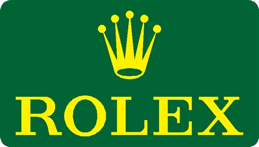

FORMULA 1 GRAN PREMIO HEINEKEN D’ITALIA 2018 - Monza

Race Lap Chart

POS 1 2 3 4 5 6 7 8 9 10 11 12 13 14 15 16 17 18 19 20 GRID 7 5 44 77 33 8 55 31 10 18 20 35 14 11 16 28 2 9 3 27 LAP 1 7 44 33 77 8 55 31 18 35 14 10 20 11 16 2 27 3 5 9 LAP 2 7 44 33 77 8 55 31 18 35 14 10 20 11 16 2 27 3 5 9 LAP 3 7 44 33 77 8 55 31 18 35 14 10 20 11 16 2 27 3 5 9 LAP 4 7 44 33 77 8 55 31 18 35 14 10 11 16 2 27 3 5 9 20 LAP 5 7 44 33 77 8 55 31 18 35 14 10 11 16 27 3 5 2 9 20 LAP 6 7 44 33 77 8 55 31 18 35 14 11 10 16 3 5 27 2 9 20 LAP 7 7 44 33 77 8 55 31 18 35 14 11 10 16 3 5 27 2 9 20 LAP 8 7 44 33 77 8 55 31 18 35 11 14 16 10 3 5 27 2 9 20 LAP 9 7 44 33 77 8 55 31 18 35 11 10 5 16 3 27 2 9 14 20 LAP 10 7 44 33 77 8 55 31 18 35 11 5 10 3 16 27 2 9 20 LAP 11 7 44 33 77 8 55 31 18 35 11 5 10 3 27 16 2 9 20 LAP 12 7 44 33 77 8 55 31 18 35 11 5 3 10 27 16 2 9 20 LAP 13 7 44 33 77 8 55 31 18 11 35 5 3 10 27 16 2 9 20 LAP 14 7 44 33 77 8 31 55 18 11 5 35 3 10 27 16 2 9 20 LAP 15 7 44 33 77 8 31 55 11 18 5 35 3 10 27 16 2 9 20 LAP 16 7 44 33 77 8 31 55 11 5 18 35 3 10 27 16 2 9 20 LAP 17 7 44 33 77 8 31 55 11 5 LAP 18 7 44 33 77 8 31 55 5 11 LAP 19 7 44 33 77 8 31 55 5 11 LAP 20 44 7 33 77 8 31 5 55 11 LAP 21 44 33 77 7 8 31 5 55 11 LAP 22 44 33 77 7 8 31 5 55 11 LAP 23 44 33 77 7 31 5 8 55 11 LAP 24 44 33 77 7 5 31 11 55 18 LAP 25 44 33 77 7 5 31 11 55 18 LAP 26 44 77 33 7 5 31 11 55 18 LAP 27 44 77 7 5 31 33 11 55 18 LAP 28 44 77 7 5 31 33 11 55 18 LAP 29 77 7 44 33 5 31 11 55 18 LAP 30 77 7 44 33 31 11 55 18 35 LAP 31 77 7 44 33 31 11 55 18 5 LAP 32 77 7 44 33 31 11 55 5 18 LAP 33 77 7 44 33 31 11 55 5 18 LAP 34 77 7 44 33 31 11 5 55 18 LAP 35 77 7 44 33 31 11 5 55 35 LAP 36 7 44 77 33 31 11 5 55 8 LAP 37 7 44 33 77 31 11 5 55 8 LAP 38 7 44 33 77 5 55 8 LAP 39 7 44 33 77 5 8 31 LAP 40 7 44 33 77 5 8 31 11 55 LAP 41 7 44 33 77 5 8 31 11 55 LAP 42 7 44 33 77 5 8 31 11 55 LAP 43 7 44 33 77 5 8 31 11 55 LAP 44 7 44 33 77 5 8 31 11 55 LAP 45 44 7 33 77 5 8 31 11 55 LAP 46 44 7 33 77 5 8 31 11 55 LAP 47 44 7 33 77 5 8 31 11 55 LAP 48 44 7 33 77 5 8 31 11 55 LAP 49 44 7 33 77 5 8 31 11 55 LAP 50 44 7 33 77 5 8 31 11 55 LAP 51 44 7 33 77 5 8 31 11 55 LAP 52 44 7 33 77 5 8 31 11 55 LAP 53 44 7 33 77 5 8 31 11 55

|  |  |  |  |  |  | 2 2 2 2 | 20 20 20 20 20 20 20 20 20 20 | 20 20 20 20 20 20 20 |
| --- | --- | --- | --- | --- | --- | --- | --- | --- |
|  |  |  | 10 |  | 16 | 2 | 20 |  |
|  |  |  |  | 2 | 16 | 10 | 20 |  |
|  |  |  |  | 16 | 2 | 10 | 20 |  |
|  |  |  |  | 16 | 2 | 10 | 20 |  |
|  |  |  |  | 16 | 2 | 10 | 20 |  |
|  |  |  |  | 16 | 2 | 10 | 20 |  |
|  |  |  |  | 16 | 2 | 10 | 20 |  |
|  |  | 27 | 9 | 16 | 2 | 10 | 20 |  |
|  | 35 | 9 | 16 | 2 | 10 | 27 | 20 |  |
|  | 35 | 16 | 2 | 10 | 27 | 9 | 20 |  |
|  | 35 | 16 | 2 | 10 | 27 | 9 | 20 |  |
|  | 35 | 16 | 2 | 10 | 27 | 9 | 20 |  |
|  | 35 | 16 | 2 | 10 | 27 | 9 | 20 |  |
|  | 35 | 16 | 2 | 10 | 27 | 9 | 20 |  |
|  | 35 | 16 | 2 | 10 | 27 | 9 | 20 |  |
| 18 | 35 | 16 | 2 | 27 | 10 | 9 | 20 |  |
| 18 | 35 | 16 | 2 | 27 | 10 | 9 | 20 |  |
| 18 | 35 | 16 | 2 | 27 | 10 | 9 | 20 |  |
| 18 | 35 | 16 | 2 | 27 | 10 | 9 | 20 |  |

|  | 31 |
| --- | --- |
| 11 | 55 |

© 2018 Formula One World Championship Limited The F1 FORMULA 1 logo, F1 logo, FORMULA 1, FORMULA ONE, F1, FIA FORMULA ONE WORLD CHAMPIONSHIP, GRAND PRIX and related marks are trade marks of Formula One Licensing BV, a Formula 1 company. The FIA logo is a trade mark of the Fédération Internationale de l’Automobile. All rights reserved. No part of these results/data may be reproduced, stored in a retrieval system or transmitted in any form or by any means electronic, mechanical, photocopying, recording, broadcasting or otherwise without prior permission of the copyright holder except for reproduction in local/national/international daily press and regular printed publications on sale to the public within 90 days of the event to which the results/data relate and provided that the copyright symbol and name of copyright owner appears.
