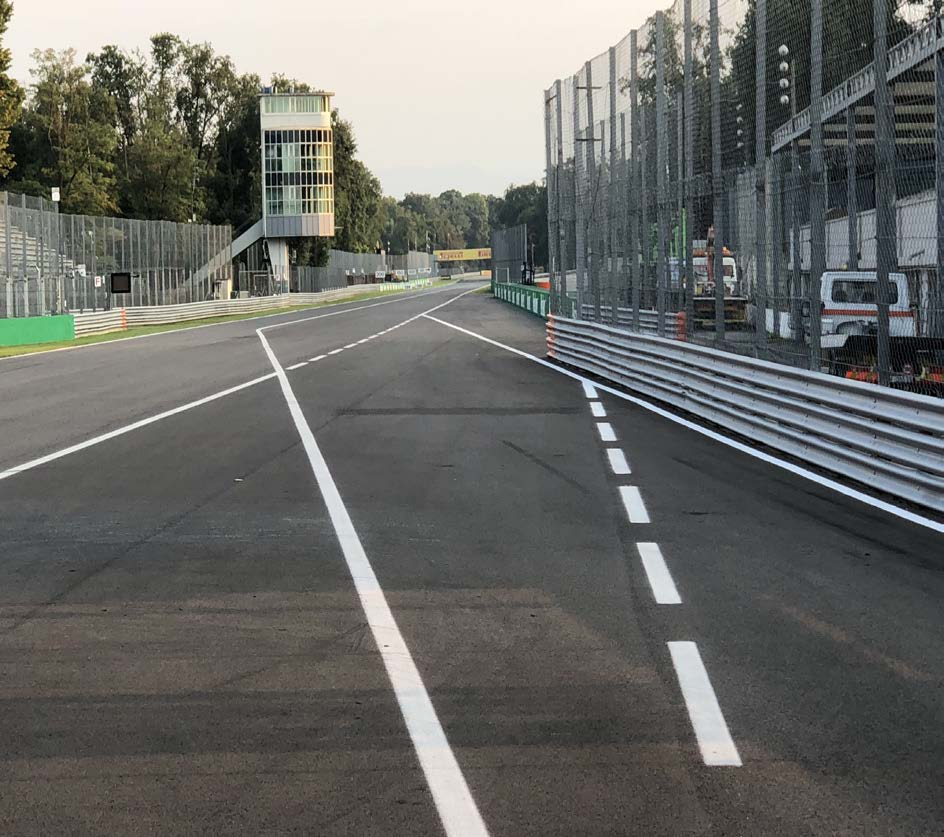
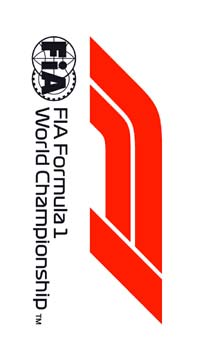
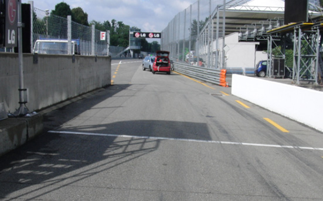
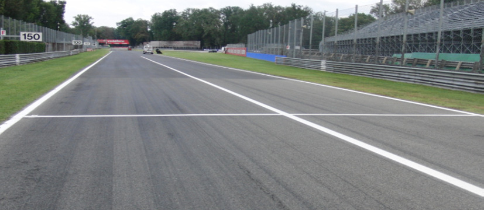

2018 ITALIAN GRAND PRIX

30 August - 02 September 2018

From The FIA Formula One Race Director Document 2

To All Teams, All Officials Date 30 August 2018

Time 09:00

Title Event Notes

Description Event Notes

Enclosed 2018_08_30_ITALIAN_GP_EVENT_NOTES.pdf

Charlie Whiting

The FIA Formula One Race Director

2018 ITALIAN GRAND PRIX

30 AUGUST - 2 SEPTEMBER 2018

From The FIA Formula One Race Director Document 2

To Formula One Team Managers Date 30 August 2018

Time 09.00

EVENT NOTES

30 AUGUST 2018

1) Issues arising from the Belgian Grand Prix

2) Changes to the circuit

2.1 A kerb has replaced the polystyrene block in the run-off area at turn 4.

2.2 Double kerbs have been installed on the exit of turns 6, 7 and 10.

3) Pit lane map

3.1 Safety Car lines.

3.2 The location of the pit entry and the pit exit.

3.3 Designated garage areas.

3.4 Safety Car position for first lap and rest of race.

3.5 Blue flag marshal at the pit exit.

3.6 Track light panels displaying pit entry status.

4) Pirelli Event Preview

4.1 With reference to Article 24.4(a) of the Sporting Regulations see the attached document provided by the official tyre supplier.

5) Weighing and weighing platform

5.1 Between 11.00 and 15.00 on Thursday, and by prior arrangement with Jo Bauer, the weighing platform will be available for teams to use for private deflection checks.

1/6

5.2 The weighing platform will be available for general checks at the following times, however, no more than 10 team personnel may be present during any visit. Each visit should last no more than 10 minutes unless no other team is waiting in the pit lane :

a) From 15.00 on Thursday until 14.30 on Saturday (between 13.00 and 14.30 each visit will be restricted to five minutes).

b) From when the cars are returned to the teams after qualifying until 19.30 on Saturday.

c) From 10.00 until 14.00 on Sunday.

Any team found to be abusing the time limits set out above, which we will be enforced by FIA security personnel and our own CCTV, will not be permitted to use the weighbridge again during the Event.

Lastly, cars should not be pushed to the weighing platform whilst any support race cars or personnel are in the pit lane.

6) Red zones for photographers in the pit lane during practice sessions

6.1 See the attached drawing.

7) Practice starts

7.1 Practice starts during sessions may only be carried out on the right after the end of the pit wall but before the first dotted white line across the pit exit. Drivers wishing to carry out a start should stop on the right in order to allow other cars to pass on their left.

During the time the pit exit is open for the race practice starts may be carried out after the end of the pit wall but before the second dotted white line across the pit exit. Drivers wishing to carry out a start should stop on the right in order to allow other cars to pass on their left.

During these times any driver passing a car which has stopped to carry out a practice start may, if necessary, cross the white line that is referred to in 8.1 below. Any driver crossing this line must move back to the right of it as quickly as possible.

See the photograph on page 6.

7.2 For reasons of safety and sporting equity, cars may not stop in the fast lane at any time the pit exit is open without a justifiable reason (a practice start is not considered a justifiable reason).

8) Lines or bollards at the pit entry and pit exit

8.1 In accordance with Chapter 4 (Section 5) of Appendix L to the ISC drivers must keep to the right of the white line at the pit exit when leaving the pits, no part of any car leaving the pits may cross this line.

8.2 For safety reasons drivers must stay to the right of the bollard at the pit entry when entering the pits.

8.3 The dotted white line across the pit exit is the track edge.

9) Chicanes

9.1 Any driver who uses a part of the areas behind the second apexes of the first and second chicanes, and which is suspected of gaining any sort of advantage from doing so, will be immediately reported to the Stewards.

9.2 As normal three rows of polystyrene blocks have been placed in the escape road at the first chicane in exactly the same positions as last year. In order to ensure that cars are able to re- join the track safely any driver using the escape road must go around the end of each of these rows and re-join the track at the end of the escape road.

2/6

Drivers may only use the grass if it is clearly unavoidable.

9.3 Any driver going straight on at the second chicane (who hence misses the black and yellow bumps placed before the apex kerb of turn 5) must stay to the right of the yellow line and the bollard, he may then re-join the track at the far end of the asphalt run-off area.

10) Observing yellow flags during free practice and qualifying

10.1 Double waved : Any driver passing through a double waved yellow marshalling sector must reduce speed significantly and be prepared to change direction or stop. In order for the stewards to be satisfied that any such driver has complied with these requirements it must be clear that he has not attempted to set a meaningful lap time, for practical purposes this means the driver should abandon the lap (this does not necessarily mean he has to pit as the track could well be clear the following lap).

10.2 Single waved : Drivers should reduce their speed and be prepared to change direction. It must be clear that a driver has reduced speed and, in order for this to be clear, a driver would be expected to have braked earlier and/or discernibly reduced speed in the relevant marshalling sector.

Drivers should not overtake any car in a single waved yellow marshalling sector unless it is clear that a car is slowing with a completely obvious problem, e.g. obvious accident damage or a deflated tyre.

11) Track light panels

11.1 The FIA light panels have been installed in the positions shown on the circuit map. In accordance with Appendix H to the ISC the light signals have the same meaning as flag signals.

12) Drivers leaving their pit stop position in the pit lane

12.1 For safety reasons, no car should be driven from its pit stop position at any time unless :

a) It has first been driven into the pit stop position having just entered the pit lane from the track, and ;

b) It is then driven immediately back onto the track from the pit stop position.

13) Fire extinguishers around the circuit

13.1 Indicated by small white boards with a red letter “F”.

14) Places to remove cars from the track

14.1 Indicated by fluorescent orange panels on the walls or guardrails.

15) Support races

15.1 Teams are asked to keep their barriers no more than three metres from the garages during all support race practice sessions and races.

16) In laps and reconnaissance laps

16.1 In order to ensure that cars are not driven unnecessarily slowly on in laps during and after the end of qualifying or during reconnaissance laps when the pit exit is opened for the race, drivers must stay below the maximum time set by the FIA between the Safety Car lines shown on the pit lane map.

We will inform you of the maximum time after the first day of practice.

3/6

17) Post qualifying parc fermé

17.1 The cameras should be installed and operated in the same way as usual.

18) Operational personnel curfew

18.1 Boards warning anyone attempting to enter the paddock that the curfew is in operation will be placed immediately before the entry turnstiles at the appropriate times.

19) Removing cars from the grid

19.1 Via the pit exit or through the gate in the pit wall.

20) Car number light panels for the start

20.1 On the driver's right.

21) Track light panels displaying pit entry status

21.1 The light panels indicated on the pit lane map will display flashing yellow arrows if cars are required to use the pit lane once the Safety Car has been deployed during the race.

21.2 The light panels indicated on the pit lane map will display flashing red crosses if the pit lane is closed at any point during the race.

22) Lapping during the race

22.1 The ISC requires drivers who are caught by another car about to lap him to allow the faster driver past at the first available opportunity. The F1 Marshalling System has been developed in order to ensure that the point at which a driver is shown blue flags is consistent, rather than trusting the ability of marshals to identify situations that require blue flags.

As it was at the end of last season the system will be set to give a pre-warning when the faster car is within 3.0s of the car about to be lapped, this should be used by the team of the slower car to warn their driver he is soon going to be lapped and that allowing the faster car through should be considered a priority. When the faster car is within 1.2s of the car about to be lapped blue flags will be shown to the slower car (in addition to blue light panels, blue cockpit lights and a message on the timing monitors) and the driver must allow the following driver to overtake at the first available opportunity.

It should be noted that the aim of using F1MS is ensure consistent application of the rules, additional instructions may also be given by race control when necessary.

23) Rolling starts

23.1 If a rolling start procedure is used as set out in Article 39.16 the race will be deemed to have started when the leading car crosses the Line after the safety car has returned to the pits.

For the avoidance of doubt, and with the exception of the permission given in Article 39.16, no driver may overtake until he reaches the Line, unless a car slows with an obvious problem.

24) Post race parc fermé

24.1 All cars should complete a full slowing down lap and enter the pits normally, all cars will then be stopped in the weighing area.

4/6

25) Any other business

Charlie Whiting FIA Formula One Race Director

5/6

6/6

|  |  | Grand Prix of Italy 31/08-02/09/2018 (18R14MZA) |  |  |  |  |  |  |  |
| --- | --- | --- | --- | --- | --- | --- | --- | --- | --- |
|  |  | Compound |  | FL | FR | RL | RR |  | Mandatory race tyres |
|  |  | MEDIUM |  | M60 | M62 | M70 | M72 |  | MEDIUM |
|  |  | SOFT |  | S60 | S62 | S70 | S72 |  | SOFT |
|  |  | SUPERSOFT |  | X60 | X62 | X70 | X72 |  |  |
|  |  | INTERMEDIATE BASE |  | I37 | I38 | I39 | I40 |  | Q3 tyre |
|  |  | WET BASE Cross-Over time MINIMUM STARTING PRESSURE, BLISTERING SENSITIVITY, CAMBER LIMIT |  | R37 WET > 119% > INT > 113% > DRY | R38 Front (psi) | R39 | R40 | Rear (psi) | SUPERSOFT |
|  |  |  | Slicks |  | 22.5 |  |  | 21.5 |  |
|  |  |  | Intermediate |  | 20.5 |  |  | 20.5 |  |
|  |  |  | Wet |  | 19.5 |  |  | 19.5 |  |
| FE EOS Camber limit RE EOS Camber limit -3.00 ° -2.00 ° FE Blistering RE Blistering sensitivity sensitivity High Medium |  | TYRE HEATING STRATEGY |  |  |  |  |  |  |  |
| Storage temperature: Optimum time in Storage temperature: Optimum time in blanket (@80°): blanket (@60°): 60°C 40°C 2h 1h SLICKS INTER Maximum boost Blanket time window Maximum boost Blanket time window temperature (@80°): temperature (@60°): 1h @ 110°C 1h to 3h 30min @ 80°C 30 min to 2h Storage temperature: Optimum time in blanket (@60°): 40°C 1h WET Blanket time window NO BOOST (@60°): 30 min to 2h GENERAL NOTES Teams are kindly reminded that the following parameters will be subjected to FIA checks during the event: - Starting pressure. - Camber at maximum speed. - Maximum blanket temperature. - Tyre swapping. | Tyre Notes |  |  |  |  |  |  |  |  |
| ● Not permiCed to switch tyres from their originally allocated posi$on. Storage Temp˚C is the recommended temperature the tyre can stay in blankets without time limit. All temperature limits apply to the actual tyre surface temperature, measured with the IR ● Do not subject tyres to large deforma$on or heavy impact. gun detailed in TD029-15. ● Do not leave fiCed tyres exposed at an air temperature lower than 15°C SIDEWALLS HEATING CLARIFICATION (ALL PRODUCTS): you are allowed to apply a max. and/or any UV emission. temperature of 100 °C for max. 1 hr to the sidewalls as long as the max. temp/time at any part ● Revised prescrip$ons could be issued during the race weekend in of the tread is the one described in the corresponding section above. accordance with TD/007-16. | ● Not permiCed to switch tyres from their originally allocated posi$on. ● Do not subject tyres to large deforma$on or heavy impact. ● Do not leave fiCed tyres exposed at an air temperature lower than 15°C and/or any UV emission. ● Revised prescrip$ons could be issued during the race weekend in accordance with TD/007-16. |  |  |  |  | Storage Temp˚C is the recommended temperature the tyre can stay in blankets without time limit. All temperature limits apply to the actual tyre surface temperature, measured with the IR gun detailed in TD029-15. SIDEWALLS HEATING CLARIFICATION (ALL PRODUCTS): you are allowed to apply a max. temperature of 100 °C for max. 1 hr to the sidewalls as long as the max. temp/time at any part of the tread is the one described in the corresponding section above. |  |  |  |

slenap enaL yrtnE X sutatS 8102 tiP tiP eniL tsuguA lortnoC X 03– 1 1 eniL RAC noisreV paL RAC YTEFAS tsriF YTEFAS

| 1 | AIF | egaraG saerA detangiseD |  |
| --- | --- | --- | --- |
| 2 | AIF |  | ENAL TSAF ENAL TSAF |
| 3 | AIF |  |  |
| 4 | AIF |  |  |
| 5 | AIF |  |  |
| 6 | MOF |  |  |
| 7 | MOF |  |  |
| 8 | sedecreM | sedecreM |  |
| 9 | sedecreM |  |  |
| 01 | sedecreM |  |  |
| 11 | sedecreM |  |  |
| 21 | sedecreM |  |  |
| 31 | irarreF | irarreF |  |
| 41 | irarreF |  |  |
| 51 | irarreF |  |  |
| 61 | irarreF |  |  |
| 71 | irarreF |  |  |
| 81 | lluB deR | lluB deR |  |
| 91 | lluB deR |  |  |
| 02 | lluB deR |  |  |
| 12 | lluB deR |  |  |
| 22 | aidnI ecroF/lluB deR |  |  |
| 32 | aidnI ecroF | aidnI ecroF |  |
| 42 | aidnI ecroF |  |  |
| 52 | aidnI ecroF |  |  |
| 62 | aidnI ecroF |  |  |
| 72 | aidnI ecroF |  |  |
| 82 | yawklaW | smailliW |  |
| 92 | smailliW |  |  |
| 03 | smailliW |  |  |
| 13 | smailliW |  |  |
| 23 | smailliW |  |  |
| 33 | tluaneR/smailliW | tluaneR |  |
| 43 | tluaneR |  |  |
| 53 | tluaneR |  |  |
| 63 | tluaneR |  |  |
| 73 | tlunaeR |  |  |
| 83 | tluaneR |  |  |
| 93 | ossoR oroT | ossoR oroT |  |
| 04 | ossoR oroT |  |  |
| 14 | ossoR oroT |  |  |
| 24 | ossoR oroT |  |  |
| 34 | saaH/ossoR oroT | saaH |  |
| 44 | saaH |  |  |
| 54 | saaH |  |  |
| 64 | saaH |  |  |
| 74 | saaH |  |  |
| 84 | neraLcM | neraLcM |  |
| 94 | neraLcM |  |  |
| 05 | neraLcM |  |  |
| 15 | neraLcM |  |  |
| 25 | neraLcM |  |  |
| 35 | rebuaS | rebuaS |  |
| 45 | rebuaS |  |  |
| 55 | rebuaS |  |  |
| 65 | rebuaS |  |  |
| 75 | rebuaS |  |  |
| 85 | spaL toH 1F |  |  |
| 95 | spaL toH 1F |  |  |
| 06 | spaL toH 1F |  |  |

yrtnE dralloB

tiP

YRTNE

TIP

stratS

xirP ENAL

TIP dnarG

segaraG

nailatI 1F sdnE

ENAL

8102 TIP

noitisoP

eloP

RAC ecaR YTEFAS

TIXE

TIP

GALF lahsraM EULB

2 eniL

RAC

YTEFAS
