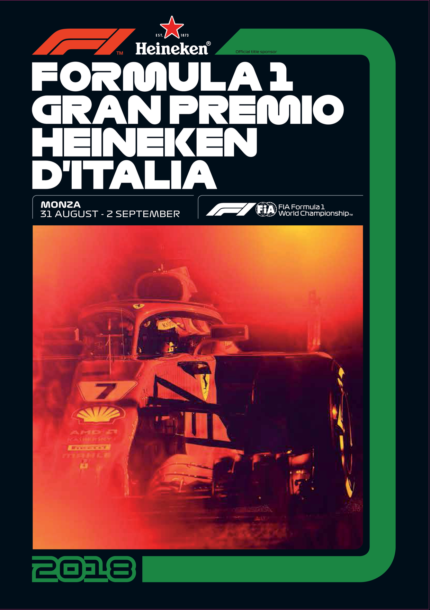

FORMULA 1

GRAN PREMIO HEINEKEN

D’ITALIA 2018

Monza Autodrome

31 August - 2 September

Media Kit

C O N T E N T S

General Information

Timetable ..............................................................................................................................3

Monza Information

Officials of the meeting .......................................................................................................7

Media Staff ...........................................................................................................................8

Media Services Opening Hours ...........................................................................................9

Photographers’ Area ..........................................................................................................10

Itinerary for Press Parking and Media Centre ..................................................................11

Red Zones Map ..................................................................................................................12

F1 Team Garage Allocation ...............................................................................................13

Media Centre Press Conferences ......................................................................................14

FIA Formula 1 World Championship

2018 Formula 1 Races .......................................................................................................15

2018 FIA F1 World Championship Standings ...................................................................16

F1 World Champions since 1950 .......................................................................................17

2018 Race Results ..............................................................................................................19

2018 FIA F1 Italian Grand Prix - Entry List........................................................................32

2018 FIA F1 World Championship Teams and Drivers ....................................................33

1

C O N T E N T S

Italian Grand Prix

Monza F1 Track Characteristics .......................................................................................44

Italian Grand Prix: Win, Pole & Fastest Lap 1921 - 2015 .................................................45

The Podium of the Italian Grand Prix 1921 - 2015 ..........................................................50

Drivers’ Presences at the Italian Grand Prix ....................................................................55

Teams’ Presences at the Italian Grand Prix .....................................................................56

F1 Italian Grand Prix Race Records ..................................................................................57

2017 FIA F1 Italian Grand Prix Starting Grid.....................................................................58

2017 FIA F1 Italian Grand Prix Race Classification..........................................................59

Attendance from 2005 .......................................................................................................60

Useful Numbers

Useful Numbers .................................................................................................................61

The Autodromo Nazionale of Monza

The Autodrome Installations .............................................................................................62

Autodromo Nazionale Monza History ..............................................................................63

2

T I M E T A B L E

THURSDAY, August 30th

11:00 11:30 PROMOTER ACTIVITY PRESS CONF. ROOM SECURITY BRIEFING

11:00 17:00 FIA FIA GARAGE INITIAL SCRUTINEERING

12:00 13:00 FORMULA 1 TRACK/PIT LANE F1 TRUCK TOUR/PTANE WALK (AWS/MIT)

13:00 14:00 FORMULA 1 PRESS CONF. ROOM TEAM MANAGER’S MEETING

13:00 15:00 FIA TRACK TRACK CLOSED FIA/F1 SYSTEMS CHECKS

13:45 14:00 FIA TRACK TRACK INSPECTION, TRACK COMPLETELY CLEAR

14:00 15:00 FIA TRACK HIGH SPEED TRACK TEST - FIA SAFETY AND MEDICAL CARS

15:00 16:00 FORMULA 1 PRESS CONF. ROOM PRESS CONFERENCE

15:15 15:45 FORMULA 1 TRACK FORMULA 1 PIRELLI HOT LAPS

16:00 18:00 PROMOTER ACTIVITY PIT LANE PUBLIC PIT LANE WALK FOR 3 DAY TICKET HOLDERS ONLY

16:00 18:00 PROMOTER ACTIVITY PIT LANE AUTOGRAPH SESSION

16:30 17:00 FIA FORMULA 2 PRESS CONF. ROOM TEAM MANAGERS' & DRIVERS' MEETING

17:00 17:30 GP3 SERIES PRESS CONF. ROOM TEAM MANAGERS' & DRIVERS' MEETING

18:00 19:00 FORMULA 1 PIT LANE / TRACK FAN FORUM

18:00 19:30 FORMULA 1 PIT LANE / TRACK F1 EXPERIENCE - PIT LANE WALK & TRACK TOUR (F1 EXPERIENCE GUESTS ONLY)

3

T I M E T A B L E

FRIDAY, August 31st

08:50 09:00 FIA TRACK MEDICAL INSPECTION

09:00 09:15 FIA TRACK TRACK INSPECTION AND SAFETY CAR TEST

09:30 10:15¹ GP3 SERIES TRACK PRACTICE SESSION

10:30 10:40 FIA TRACK TRACK INSPECTION

11:00 12:30¹ FORMULA 1 TRACK FIRST PRACTICE SESSION

12:55 13:40¹ FIA FORMULA 2 TRACK PRACTICE SESSION

13:00 14:00 FORMULA 1 PRESS CONF. ROOM PRESS CONFERENCE

13:50 14:20 FORMULA 1 TRACK FORMULA 1 PIRELLI HOT LAPS

13:50 14:40 PADDOCK CLUB PIT LANE PADDOCK CLUB PIT LANE WALK

14:00 14:30 PORSCHE MOBIL 1 SUPERCUP PRESS CONF. ROOM DRIVERS' MEETING

14:30 14:40 FIA TRACK TRACK INSPECTION

15:00 16:30¹ FORMULA 1 TRACK SECOND PRACTICE SESSION

16:55 17:25 FIA FORMULA 2 TRACK QUALIFYING SESSION

17:45 17:55¹ GP3 SERIES TRACK PRACTICE SESSION

18:00 18:30 GP3 SERIES TRACK QUALIFYING SESSION

18:00 19:00 FORMULA 1 PRESS CONF. ROOM DRIVERS' MEETING

18:45 19:30 PORSCHE MOBIL1 SUPERCUP TRACK PRACTICE SESSION

19:00 19:30 FIA FORMULA 2 PRESS CONF. ROOM PRESS CONFERENCE

19:30 20:00 PADDOCK CLUB TRACK PADDOCK CLUB TRUCK TOUR

19:30 20:00 FORMULA 1 TRACK F! EXPERIENCE ELITE SUPERCARS PARADE LAP (BEHIND TRUCK TOUR)

* These times refer to the start of the formation lap ¹ Fixed End Session ² Approximate Finishing time

4

T I M E T A B L E

SATURDAY, September 1st

08:45 09:15 PADDOCK CLUB TRACK PADDOCK CLUB TRUCK TOUR

09:00 09:45 PADDOCK CLUB PIT LANE PADDOCK CLUB PIT LANE WALK

09:10 09:40 FORMULA 1 PIT LANE TEAM PIT STOP PRACTICE

09:25 09:35 FIA TRACK MEDICAL INSPECTION

09:35 09:50 FIA TRACK TRACK INSPECTION AND SAFETY CAR TEST

10:15 10:20 GP3 SERIES PIT LANE PIT LANE OPEN

10:30* 11:15² GP3 SERIES TRACK FIRST RACE (22 LAPS OR 40 MINS)

11:30 11:40 FIA TRACK TRACK INSPECTION

12:00 13:00¹ FORMULA 1 TRACK THIRD PRACTICE SESSION

13:25 13:55 PORSCHE MOBIL 1 SUPERCUP TRACK QUALIFYING SESSION

14:00 14:20 FORMULA 1 TRACK FORMULA 1 PIRELLI HOT LAPS

14:00 14:45 PADDOCK CLUB PIT LANE PADDOCK CLUB PIT LANE WALK

14:30 14:40 FIA TRACK TRACK INSPECTION

15:00 16:00 FORMULA 1 TRACK QUALIFYING SESSION

16:00 17:00 FORMULA 1 PRESS CONF. ROOM PRESS CONFERENCE

16:30 16:35 FIA FORMULA 2 PIT LANE PIT LANE OPEN

16:45* 17:50² FIA FORMULA 2 TRACK FIRST RACE (30 LAPS OR 60 MINS)

18:00 18:30 PADDOCK CLUB TRACK PADDOCK CLUB TRUCK TOUR

18:05 18:35 FIA FORMULA 2 PRESS CONF. ROOM PRESS CONFERENCE

18:15 19:00 PROMOTER ACTIVITY PIT LANE MARSHAL PIT LANE WALK

18:30 19:00 FORMULA 1 TRACK F1 TRUCK TOUR (AWS)

* These times refer to the start of the formation lap ¹ Fixed End Session ² Approximate Finishing time

5

T I M E T A B L E

SUNDAY, September 2nd

08:35 08:45 FIA TRACK MEDICAL INSPECTION

08:45 09:00 FIA TRACK TRACK INSPECTION AND TRACK TEST

09:25 09:30 GP3 SERIES PIT LANE PIT LANE OPEN

09:40* 10:15² GP3 SERIES TRACK SECOND RACE (17 LAPS OR 30 MINS)

10:40 10:45 FIA FORMULA 2 PIT LANE PIT LANE OPEN

10:55* 11:45² FIA FORMULA 2 TRACK SECOND RACE (21 LAPS OR 45 MINS)

12:00 12:30 FIA FORMULA 2 PRESS CONF. ROOM PRESS CONFERENCE

12:10* 12:45² PORSCHE MOBIL 1 SUPERCUP TRACK RACE (14 LAPS OR 30 MINS)

12:50 13:10 FORMULA 1 TRACK FORMULA 1 PIRELLI HOT LAPS

12:50 13:10 FORMULA 1 PIT LANE F1 PIT LANE WALK (AWS)

13:10 14:10 PADDOCK CLUB PIT LANE PADDOCK CLUB PIT LANE WALK

13:20 13:50 PADDOCK CLUB TRACK PADDOCK CLUB TRUCK TOUR

13:30 14:00 FORMULA 1 TRACK DRIVERS' TRACK PARADE

14:00 14:15 FORMULA 1 TRACK STARTING GRID PRESENTATION

14:00 14:10 FIA TRACK MEDICAL INSPECTION

14:10 14:20 FIA TRACK TRACK INSPECTION

14:30 14:40 FORMULA 1 PIT LANE PIT LANE OPEN

14:54 14:56 FORMULA 1 TRACK NATIONAL ANTHEM

14:57 14:59 PROMOTER ACTIVITY AIR DISPLAY FRECCE TRICOLORE

15:10* 17:10² FORMULA 1 TRACK GRAND PRIX (53 LAPS OR 120 MINS)

* These times refer to the start of the formation lap ¹ Fixed End Session ² Approximate Finishing time

6

O F F I C I A L S O F T H E M E E T I N G

Charlie Whiting

Race Director, Safety Delegate and Permanent Starter

Fabrizio Fondacci

Clerk of the Course

Tim Mayer, Gerd Ennser, Danny Sullivan

F1 Stewards

Paolo Longoni

National Steward

Dr. Alain Chantegret

FIA Medical Delegate

Claudio Pusineri

Circuit Medical Responsible

Jo Bauer

FIA Technical Delegates

Bernd Mayländer

FIA F1 Safety Car Driver

Alan Van der Merwe

FIA F1 Medical Car Driver

Matteo Bonciani

FIA F1 Head of Communications & Media Delegate

Pierre Guyonnet-Duperat

FIA F1 Deputy Media Delegate

Paolo Redaelli

National Press Officer

7

M E D I A S T A F F

FIA F1 Head of Communications & Media Delegate

Matteo Bonciani

FIA F1 Deputy Media Delegate

Pierre Guyonnet-Duperat

National Press Officer

Paolo Redaelli

MEDIA CENTRE Tel. +39 039 2482400 - Fax +39 039 2482401

Coordinator

Mariella Grimoldi

Press Office, Social & Web

Davide Casati

FIA F1 Head of Communications & Media Delegate's Assistants

Alessandra Filippi

Barbara Lazzati

FIA F1 Communications Officer's Assistant - Multilingual Translator

Simonetta Santoro

National Press Officer Assistant

Paolo Moroni

Press Office

Luca Brida (coordinator)

Filippo Facco

Reception Desk

Eleonora Brianzoli, Simone Colzani, Giulia Gori, Laura Mapelli, Valentina Pillai

Runners

Marco Brida (Coordinator), Daniele Fratus (Coordinator), Ruben Ruggiero, Gigi Vitelli

Photographers' Area

Teodoro Fiumara (Coordinator), Stefano Aroldi, Pasquale Errico

MEDIA ACCREDITATION CENTRE Tel. +39 039 490251

Filippo Redaelli (Coordinator), Maria Stella Baldelli, Monica Bergamasco, Fabiano Scarani

8

MEDIA SERVICES OPENING HOURS

MEDIA ACCREDITATION CENTRE Tel. +39 039 490251

(GPS: Latitude - Longitude: 45.616127 9.258978 - Lat: N 45° 36' 58" - Long: E 9° 15' 32")

Opening Hours

Thursday August 30th 08.00 - 18.00 hrs

Friday August 31st 08.00 - 16.00 hrs

Saturday September 1st 08.00 - 12.00 hrs

Sunday September 2nd 08.00 - 11.00 hrs for National Press only

Passes must be collected directly by the accredited representative

MEDIA CENTRE Tel. +39 039 2482400 - Fax. +39 039 2482401

Opening Hours

Thursday August 30th 09.00 – 22.00 hrs

Friday August 31st 07.00 – 23.00 hrs

Saturday September 1st 07.00 – 23.00 hrs

Sunday September 2nd 07.00 – ........ Until the last journalist leaves

Media Centre Facilities

• 420 seats - Each seat is connected with a private telephone line

• Internet Connections Service: two passwords are free

• Catering Service is available for the accredited journalists

• 3 copiers

• 6 computers with Internet connection free of charge and color printers

9

PPHHOOTTOOGGRRAAPPHHEERRSS'' AARREEAA

An equipped area for photographers is situated in the Media Centre.

This area offers 120 seats with possibility of installing private telephones

and many lockers.

The photographers, moreover, can make advantage of a free camera service.

The opening hours of the Photographers’ Area are those of the Media Centre.

PHOTOGRAPHER’S CIRCUIT SHUTTLES

A minibus service linking the various corners around the circuit is at

disposal of the photographers. This service is available before and after

each pratice and pre qualyfing session, as well as before the race.

The shuttle departs from the track, after the starting line, according

following hours:

PRACTICE SESSIONS - First departure 60 minutes before the

start of the session;

QUALIFYING SESSIONS: - Last departure 40 minutes before the

start of the session;

- Pick-up 5/10 minutes after the

chequered flag (make several trips

over at least half an hour).

RACE: - First departure 90 minutes before the

starting time of the race;

- Last departure 75 minutes before the

start of the race;

- No pick-up.

Use of shuttle service and access to the track is allowed

only for permanent or “race by race” tabards holders.

10

ITINERARY FOR ACCREDITATION CENTRE

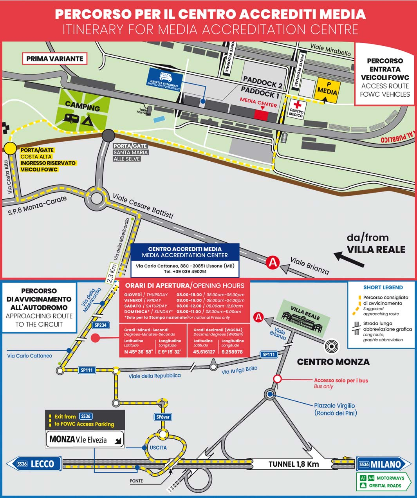

11

RED ZONES MAP

12

F1 TEAM GARAGE ALLOCATION

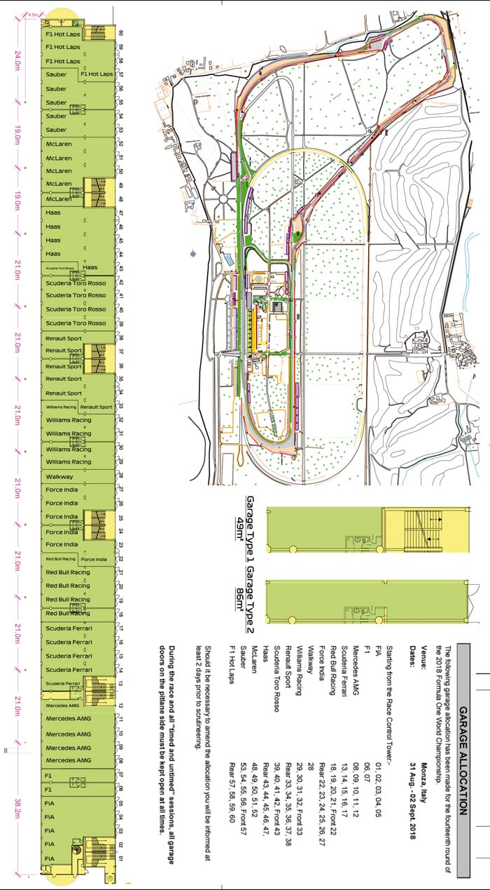

13

MEDIA CENTRE PRESS CONFERENCES

Thursday August 30th - 15.00 hrs

Press Conference for a maximum of six drivers chosen by the FIA F1 Head

of Communications.

Friday August 31st - 13.00 hrs

Press Conference for a maximum of six team personalities, chosen by the

FIA F1 Head of Communications.

Saturday September 1st - Post-Qualifying Press Conference

Press Conference with top three drivers of the qualifying session.

Sunday September 2nd - Post-Race Press Conference

After parc ferme interviews, Press Conference with top three finishing

drivers.

We remind that during Press Conferences neither TV crew nor any personnel

holding moving pictures TV cameras are allowed in the Media Centre unless

specifically authorized by the FIA Press Delegate.

14

2 0 1 8 F I A F 1 W O R L D C H A M P I O N S H I P

FORMULA 1 RACES

Date Country Location Winner

25.03 Australia Melbourne Sebastian Vettel

08.04 Bahrain Bahrain Sebastian Vettel

15.04 China Sanghai Daniel Ricciardo

29.04 Azerbaijan Baku Lewis Hamilton

13.05 Spain Barcelona Lewis Hamilton

27.05 Monaco Monte Carlo Daniel Ricciardo

10.06 Canada Montreal Sebastian Vettel

24.06 France Paul Ricard Lewis Hamilton

01.07 Austria Red Bull Ring Max Verstappen

08.07 Great Britain Silverstone Sebastian Vettel

22.07 Germany Hockenheim Lewis Hamilton

29.07 Hungary Hungaroring Lewis Hamilton

26.08 Belgium Spa-Francorchamps Sebastian Vettel

02.09 Italy Monza

16.09 Singapore Marina Bay

30.09 Russia Sochi

07.10 Japan Suzuka

21.10 USA Americas

28.10 Mexico Mexico City

11.11 Brazil Interlagos

25.11 Abu Dhabi Yas Marina

15

2 0 1 8 F I A F 1 W O R L D C H A M P I O N S H I P

DRIVERS’ STANDINGS

Drivers Aus Bhr Chn Aze Esp Mco Can Fra Aut Gbr Deu Hun Bel Tot

1. Lewis Hamilton 18 15 12 25 25 15 10 25 0 18 25 25 18 231 2. Sebastian Vettel 25 25 4 12 12 18 25 10 15 25 0 18 25 214 3. Kimi Räikkönen 15 0 15 18 0 12 8 15 18 15 15 15 0 146 4 Valtteri Bottas 4 18 18 0 18 10 18 6 0 12 18 10 12 144 5. Max Verstappen 8 0 10 0 15 2 15 18 25 0 12 0 15 120 6. Daniel Ricciardo 12 0 25 0 10 25 12 12 0 10 0 12 0 118 7. Nico Hülkenberg 6 8 8 0 0 4 6 2 0 8 10 0 0 52

8. Kevin Magnussen 0 10 1 0 8 0 0 8 10 2 0 6 4 49 9. Fernando Alonso 10 6 6 6 7 0 0 0 4 4 0 4 0 44 10 Sergio Pérez 0 0 0 15 2 0 0 0 6 1 6 0 10 40 11 Esteban Ocon 0 1 0 0 0 8 2 0 8 6 4 0 8 37 12. Carlos Sainz 1 0 2 10 6 1 4 4 0 0 0 2 0 30 13 Pierre Gasly 0 12 0 0 0 6 0 0 0 0 0 8 2 28 14. Romain Grosjean 0 0 0 0 0 0 0 0 12 0 8 1 6 27 15 Charles Leclerc 0 0 0 8 1 0 1 1 2 0 0 0 0 13 16. Stoffel Vandoorne 2 4 0 2 0 0 0 0 0 0 0 0 0 8 17 Marcus Ericsson 0 2 0 0 0 0 0 0 1 0 2 0 1 6 18 Lance Stroll 0 0 0 4 0 0 0 0 0 0 0 0 0 4 19 Brendon Hartley 0 0 0 1 0 0 0 0 0 0 1 0 0 2 20 Sergey Sirotkin 0 0 0 0 0 0 0 0 0 0 0 0 0 0

CONSTRUCTOR’S STANDINGS

Team Aus Bhr Chn Aze Esp Mco Can Fra Aut Gbr Deu Hun Bel Tot

1. Mercedes AMG Petronas 22 33 30 25 43 25 28 31 0 30 43 35 30 375 2. Scuderia Ferrari 40 25 19 30 12 30 33 25 33 40 15 33 25 360

3. AM Red Bull Racing 20 0 35 0 25 27 27 30 25 10 12 12 15 238 4. Renault Sport 7 8 10 10 6 5 10 6 0 8 10 2 0 82 5. Haas F1 Team 0 10 1 0 8 0 0 8 22 2 8 7 10 76

6. McLaren F1 Team 12 10 6 8 4 0 0 0 4 4 0 4 0 52 7. Scuderia Toro Rosso 0 12 0 1 0 6 0 0 0 0 1 8 2 30 8. AR Sauber F1 Team 0 2 0 8 1 0 1 1 3 0 2 0 1 19

9. Racing Point Force India * - - - - - - - - - - - - 18 18 10. Williams Martini Racing 0 0 0 4 0 0 0 0 0 0 0 0 0 4 11. Sahara Force India * 0 0 0 0 0 0 0 0 0 0 0 0 - 0

* Racing Point Force India is a completely new entity, starting with no points, with the former Force India entry excluded from the 2018 constructors’ championship due to its inability to complete the season. However, race drivers Perez and Ocon will keep their points in the drivers’ standings.

16

F1 WORLD CHAMPIONS SINCE 1950

YEAR DRIVER MAKE PTS WINS POLES FASTEST LAPS

2017 Lewis HAMILTON Mercedes 363 9 11 6

2016 Nico ROSBERG Mercedes 385 9 8 6

2015 Lewis HAMILTON Mercedes 381 10 11 8

2014 Lewis HAMILTON Mercedes 384 11 7 7

2013 Sebastian VETTEL Red Bull 397 13 9 7

2012 Sebastian VETTEL Red Bull 281 5 6 6

2011 Sebastian VETTEL Red Bull 392 11 15 3

2010 Sebastian VETTEL Red Bull 256 5 10 3

2009 Jenson BUTTON Brawn GP 95 6 4 2

2008 Lewis HAMILTON McLaren 98 5 7 1

2007 Kimi RÄIKKÖNEN Ferrari 110 6 3 6

2006 Fernando ALONSO Renault 134 7 6 4

2005 Fernando ALONSO Renault 133 7 6 2

2004 Michael SCHUMACHER Ferrari 148 13 8 10

2003 Michael SCHUMACHER Ferrari 93 6 5 5

2002 Michael SCHUMACHER Ferrari 144 11 7 7

2001 Michael SCHUMACHER Ferrari 123 9 11 2

2000 Michael SCHUMACHER Ferrari 108 9 9 2

1999 Mika HAKKINEN McLaren 76 5 11 6

1998 Mika HAKKINEN McLaren 100 8 9 6

1997 Jacques VILLENEUVE Williams 81 7 10 3

1996 Damon HILL Williams 97 8 9 5

1995 Michael SCHUMACHER Benetton 102 9 4 8

1994 Michael SCHUMACHER Benetton 92 8 6 9

1993 Alain PROST Williams 99 7 13 6

1992 Nigel MANSELL Williams 108 9 14 8

1991 Ayrton SENNA McLaren 96 7 8 2

1990 Ayrton SENNA McLaren 78 6 10 2

1989 Alain PROST McLaren 81 4 2 5

1988 Ayrton SENNA McLaren 94 8 13 3

1987 Nelson PIQUET Williams 76 3 4 4

1986 Alain PROST McLaren 74 4 1 2

1985 Alain PROST McLaren 76 5 2 5

1984 Niki LAUDA McLaren 72 5 - 5

1983 Nelson PIQUET Brabham 59 3 1 4

17

F1 WORLD CHAMPIONS SINCE 1950

YEAR DRIVER MAKE PTS WINS POLES FASTEST LAPS

1982 Keke ROSBERG Williams 44 1 1 -

1981 Nelson PIQUET Brabham 50 3 4 1

1980 Alan JONES Williams 71 5 3 5

1979 Jody SCHECKTER Ferrari 60 3 1 1

1978 Mario ANDRETTI Lotus 64 6 8 3

1977 Niki LAUDA Ferrari 72 3 2 3

1976 James HUNT McLaren 69 6 8 2

1975 Niki LAUDA Ferrari 64.5 5 9 2

1974 Emerson FITTIPALDI McLaren 55 3 2 -

1973 Jackie STEWART Tyrrell 71 5 3 1

1972 Emerson FITTIPALDI Lotus 61 5 3 1

1971 Jackie STEWART Tyrrell 62 6 6 3

1970 Jochen RINDT Lotus 45 5 3 1

1969 Jackie STEWART Matra 63 6 2 5

1968 Graham HILL Lotus 48 3 2 -

1967 Denis HULME Brabham 51 2 - 2

1966 Jack BRABHAM Brabham 45 4 3 1

1965 Jim CLARK Lotus 54 6 6 6

1964 John SURTEES Ferrari 40 2 2 2

1963 Jim CLARK Lotus 73 7 7 6

1962 Graham HILL BRM 52 4 1 3

1961 Phil HILL Ferrari 38 2 5 2

1960 Jack BRABHAM Cooper 43 5 3 3

1959 Jack BRABHAM Cooper 34 2 1 1

1958 Mike HAWTHORN Ferrari 49 1 4 5

1957 Juan-Manuel FANGIO Maserati 46 4 4 2

1956 Juan-Manuel FANGIO Lancia / 33 3 5 3 Ferrari

1955 Juan-Manuel FANGIO Mercedes 41 4 3 3

1954 Juan-Manuel FANGIO Mercedes / 57 6 5 3 Maserati

1953 Alberto ASCARI Ferrari 46.5 5 6 4

1952 Alberto ASCARI Ferrari 52.5 6 5 5

1951 Juan-Manuel FANGIO Alfa Romeo 37 3 4 5

1950 Giuseppe FARINA Alfa Romeo 30 3 2 3

18

2 0 1 8 R A C E R E S U LT S

AUSTRALIAN GRAND PRIX

March 25th

Pos No. Driver F1 Team Laps Time/Retired Points

1 5 Sebastian Vettel Ferrari 58 1:29:33.283 25

2 44 Lewis Hamilton Mercedes 58 +5.036s 18

3 7 Kimi Räikkönen Ferrari 58 +6.309s 15

4 3 Daniel Ricciardo Red Bull Racing Tag Heuer 58 +7.069s 12

5 14 Fernando Alonso McLaren Renault 58 +27.886s 10

6 33 Max Verstappen Red Bull Racing Tag Heuer 58 +28.945s 8

7 27 Nico Hulkenberg Renault 58 +32.671s 6

8 77 Valtteri Bottas Mercedes 58 +34.339s 4

9 2 Stoffel Vandoorne McLaren Renault 58 +34.921s 2

10 55 Carlos Sainz Renault 58 +45.722s 1

11 11 Sergio Perez Force India Mercedes 58 +46.817s 0

12 31 Esteban Ocon Force India Mercedes 58 +60.278s 0

13 16 Charles Leclerc Sauber Ferrari 58 +75.759s 0

14 18 Lance Stroll Williams Mercedes 58 +78.288s 0

15 28 Brendon Hartley Scuderia Toro Rosso Honda 57 +1 lap 0

NC 8 Romain Grosjean Haas Ferrari 24 DNF 0

NC 20 Kevin Magnussen Haas Ferrari 22 DNF 0

NC 10 Pierre Gasly Scuderia Toro Rosso Honda 13 DNF 0

NC 9 Marcus Ericsson Sauber Ferrari 5 DNF 0

NC 35 Sergey Sirotkin Williams Mercedes 4 DNF 0

Fastest lap: Daniel Ricciardo Red Bull Racing 1:25.945

Pole position:Lewis Hamilton Mercedes 1:21.164

19

2 0 1 8 R A C E R E S U LT S

BAHRAIN GRAND PRIX

April 8th

Pos No. Driver F1 Team Laps Time/Retired Points

1 5 Sebastian Vettel Ferrari 57 1:32:01.940 25

2 77 Valtteri Bottas Mercedes 57 +0.699s 18

3 44 Lewis Hamilton Mercedes 57 +6.512s 15

4 10 Pierre Gasly Scuderia Toro Rosso Honda 57 +62.234s 12

5 20 Kevin Magnussen Haas Ferrari 57 +75.046s 10

6 27 Nico Hulkenberg Renault 57 +99.024s 8

7 14 Fernando Alonso McLaren Renault 56 +1 lap 6

8 2 Stoffel Vandoorne McLaren Renault 56 +1 lap 4

9 9 Marcus Ericsson Sauber Ferrari 56 +1 lap 2

10 31 Esteban Ocon Force India Mercedes 56 +1 lap 1

11 55 Carlos Sainz Renault 56 +1 lap 0

12 16 Charles Leclerc Sauber Ferrari 56 +1 lap 0

13 8 Romain Grosjean Haas Ferrari 56 +1 lap 0

14 18 Lance Stroll Williams Mercedes 56 +1 lap 0

15 35 Sergey Sirotkin Williams Mercedes 56 +1 lap 0

16 11 Sergio Perez Force India Mercedes 56 +1 lap 0

17 28 Brendon Hartley Scuderia Toro Rosso Honda 56 +1 lap 0

NC 7 Kimi Räikkönen Ferrari 35 DNF 0

NC 33 Max Verstappen Red Bull Racing Tag Heuer 3 DNF 0

NC 3 Daniel Ricciardo Red Bull Racing Tag Heuer 1 DNF 0

Fastest lap: Valtteri Bottas Mercedes 1:33.740

Pole position:Sebastian Vettel Ferrari 1:27.958

20

2 0 1 8 R A C E R E S U LT S

CHINESE GRAND PRIX

April 15th

Pos No. Driver F1 Team Laps Time/Retired Points

1 3 Daniel Ricciardo Red Bull Racing Tag Heuer 56 1:35:36.380 25

2 77 Valtteri Bottas Mercedes 56 +8.894s 18

3 7 Kimi Räikkönen Ferrari 56 +9.637s 15

4 44 Lewis Hamilton Mercedes 56 +16.985s 12

5 33 Max Verstappen Red Bull Racing Tag Heuer 56 +20.436s 10

6 27 Nico Hulkenberg Renault 56 +21.052s 8

7 14 Fernando Alonso McLaren Renault 56 +30.639s 6

8 5 Sebastian Vettel Ferrari 56 +35.286s 4

9 55 Carlos Sainz Renault 56 +35.763s 2

10 20 Kevin Magnussen Haas Ferrari 56 +39.594s 1

11 31 Esteban Ocon Force India Mercedes 56 +44.050s 0

12 11 Sergio Perez Force India Mercedes 56 +44.725s 0

13 2 Stoffel Vandoorne McLaren Renault 56 +49.373s 0

14 18 Lance Stroll Williams Mercedes 56 +55.490s 0

15 35 Sergey Sirotkin Williams Mercedes 56 +58.241s 0

16 9 Marcus Ericsson Sauber Ferrari 56 +62.604s 0

17 8 Romain Grosjean Haas Ferrari 56 +65.296s 0

18 10 Pierre Gasly Scuderia Toro Rosso Honda 56 +66.330s 0

19 16 Charles Leclerc Sauber Ferrari 56 +82.575s 0

20 28 Brendon Hartley Scuderia Toro Rosso Honda 51 DNF 0

Fastest lap: Daniel Ricciardo Red Bull Racing Tag Heuer 1:35.785

Pole position: Sebastian Vettel Ferrari 1:31.095

21

2 0 1 8 R A C E R E S U LT S

AZERBAIJAN GRAND PRIX

June 29th

Pos No. Driver F1 Team Laps Time/Retired Points

1 44 Lewis Hamilton Mercedes 51 1:43:44.291 25

2 7 Kimi Räikkönen Ferrari 51 +2.460s 18

3 11 Sergio Perez Force India Mercedes 51 +4.024s 15

4 5 Sebastian Vettel Ferrari 51 +5.329s 12

5 55 Carlos Sainz Renault 51 +7.515s 10

6 16 Charles Leclerc Sauber Ferrari 51 +9.158s 8

7 14 Fernando Alonso McLaren Renault 51 +10.931s 6

8 18 Lance Stroll Williams Mercedes 51 +12.546s 4

9 2 Stoffel Vandoorne McLaren Renault 51 +14.152s 2

10 28 Brendon Hartley Scuderia Toro Rosso Honda 51 +18.030s 1

11 9 Marcus Ericsson Sauber Ferrari 51 +18.512s 0

12 10 Pierre Gasly Scuderia Toro Rosso Honda 51 +24.720s 0

13 20 Kevin Magnussen Haas Ferrari 51 +40.663s 0

14 77 Valtteri Bottas Mercedes 48 DNF 0

NC 8 Romain Grosjean Haas Ferrari 42 DNF 0

NC 33 Max Verstappen Red Bull Racing Tag Heuer 39 DNF 0

NC 3 Daniel Ricciardo Red Bull Racing Tag Heuer 39 DNF 0

NC 27 Nico Hulkenberg Renault 10 DNF 0

NC 31 Esteban Ocon Force India Mercedes 0 DNF 0

NC 35 Sergey Sirotkin Williams Mercedes 0 DNF 0

Fastest lap: Valtteri Bottas Mercedes 1:45.149

Pole position:Sebastian Vettel Ferrari 1:41.498

22

2 0 1 8 R A C E R E S U LT S

SPANISH GRAND PRIX

May 13th

Pos No. Driver F1 Team Laps Time/Retired Points

1 44 Lewis Hamilton Mercedes 66 1:35:29.972 25

2 77 Valtteri Bottas Mercedes 66 +20.593s 18

3 33 Max Verstappen Red Bull Racing Tag Heuer 66 +26.873s 15

4 5 Sebastian Vettel Ferrari 66 +27.584s 12

5 3 Daniel Ricciardo Red Bull Racing Tag Heuer 66 +50.058s 10

6 20 Kevin Magnussen Haas Ferrari 65 +1 lap 8

7 55 Carlos Sainz Renault 65 +1 lap 6

8 14 Fernando Alonso McLaren Renault 65 +1 lap 4

9 11 Sergio Perez Force India Mercedes 64 +2 laps 2

10 16 Charles Leclerc Sauber Ferrari 64 +2 laps 1

11 18 Lance Stroll Williams Mercedes 64 +2 laps 0

12 28 Brendon Hartley Scuderia Toro Rosso Honda 64 +2 laps 0

13 9 Marcus Ericsson Sauber Ferrari 64 +2 laps 0

14 35 Sergey Sirotkin Williams Mercedes 63 +3 laps 0

NC 2 Stoffel Vandoorne McLaren Renault 45 DNF 0

NC 31 Esteban Ocon Force India Mercedes 38 DNF 0

NC 7 Kimi Räikkönen Ferrari 25 DNF 0

NC 8 Romain Grosjean Haas Ferrari 0 DNF 0

NC 10 Pierre Gasly Scuderia Toro Rosso Honda 0 DNF 0

NC 27 Nico Hulkenberg Renault 0 DNF 0

Fastest lap: Daniel Ricciardo Red Bull Racing Tag Heuer 1:18.441

Pole position:Lewis Hamilton Mercedes 1:16.173

23

2 0 1 8 R A C E R E S U LT S

MONACO GRAND PRIX

May 27th

Pos No. Driver F1 Team Laps Time/Retired Points

1 3 Daniel Ricciardo Red Bull Racing Tag Heuer 78 1:42:54.807 25

2 5 Sebastian Vettel Ferrari 78 +7.336s 18

3 44 Lewis Hamilton Mercedes 78 +17.013s 15

4 7 Kimi Räikkönen Ferrari 78 +18.127s 12

5 77 Valtteri Bottas Mercedes 78 +18.822s 10

6 31 Esteban Ocon Force India Mercedes 78 +23.667s 8

7 10 Pierre Gasly Scuderia Toro Rosso Honda 78 +24.331s 6

8 27 Nico Hulkenberg Renault 78 +24.839s 4

9 33 Max Verstappen Red Bull Racing Tag Heuer 78 +25.317s 2

10 55 Carlos Sainz Renault 78 +69.013s 1

11 9 Marcus Ericsson Sauber Ferrari 78 +69.864s 0

12 11 Sergio Perez Force India Mercedes 78 +70.461s 0

13 20 Kevin Magnussen Haas Ferrari 78 +74.823s 0

14 2 Stoffel Vandoorne McLaren Renault 77 +1 lap 0

15 8 Romain Grosjean Haas Ferrari 77 +1 lap 0

16 35 Sergey Sirotkin Williams Mercedes 77 +1 lap 0

17 18 Lance Stroll Williams Mercedes 76 +2 laps 0

18 16 Charles Leclerc Sauber Ferrari 70 DNF 0

19 28 Brendon Hartley Scuderia Toro Rosso Honda 70 DNF 0

NC 14 Fernando Alonso McLaren Renault 52 DNF 0

Fastest lap: Max Verstappen Red Bull Racing Tag Heuer 1:14.260

Pole position:Daniel Ricciardo Red Bull Racing Tag Heuer 1:10.810

24

2 0 1 8 R A C E R E S U LT S

CANADIAN GRAND PRIX

June 10th

Pos No. Driver F1 Team Laps Time/Retired Points

1 5 Sebastian Vettel Ferrari 68 1:28:31.377 25

2 77 Valtteri Bottas Mercedes 68 +7.376s 18

3 33 Max Verstappen Red Bull Racing Tag Heuer 68 +8.360s 15

4 3 Daniel Ricciardo Red Bull Racing Tag Heuer 68 +20.892s 12

5 44 Lewis Hamilton Mercedes 68 +21.559s 10

6 7 Kimi Räikkönen Ferrari 68 +27.184s 8

7 27 Nico Hulkenberg Renault 67 +1 lap 6

8 55 Carlos Sainz Renault 67 +1 lap 4

9 31 Esteban Ocon Force India Mercedes 67 +1 lap 2

10 16 Charles Leclerc Sauber Ferrari 67 +1 lap 1

11 10 Pierre Gasly Scuderia Toro Rosso Honda 67 +1 lap 0

12 8 Romain Grosjean Haas Ferrari 67 +1 lap 0

13 20 Kevin Magnussen Haas Ferrari 67 +1 lap 0

14 11 Sergio Perez Force India Mercedes 67 +1 lap 0

15 9 Marcus Ericsson Sauber Ferrari 66 +2 laps 0

16 2 Stoffel Vandoorne McLaren Renault 66 +2 laps 0

17 35 Sergey Sirotkin Williams Mercedes 66 +2 laps 0

NC 14 Fernando Alonso McLaren Renault 40 DNF 0

NC 28 Brendon Hartley Scuderia Toro Rosso Honda 0 DNF 0

NC 18 Lance Stroll Williams Mercedes 0 DNF 0

Fastest lap: Max Verstappen Red Bull Racing Tag Heuer 1:13.864

Pole position:Sebastian Vettel Ferrari 1:10.764

25

2 0 1 8 R A C E R E S U LT S

GRAND PRIX DE FRANCE

June 24th

Pos No. Driver F1 Team Laps Time/Retired Points

1 44 Lewis Hamilton Mercedes 53 1:30:11.385 25

2 33 Max Verstappen Red Bull Racing Tag Heuer 53 +7.090s 18

3 7 Kimi Räikkönen Ferrari 53 +25.888s 15

4 3 Daniel Ricciardo Red Bull Racing Tag Heuer 53 +34.736s 12

5 5 Sebastian Vettel Ferrari 53 +61.935s 10

6 20 Kevin Magnussen Haas Ferrari 53 +79.364s 8

7 77 Valtteri Bottas Mercedes 53 +80.632s 6

8 55 Carlos Sainz Renault 53 +87.184s 4

9 27 Nico Hulkenberg Renault 53 +91.989s 2

10 16 Charles Leclerc Sauber Ferrari 53 +93.873s 1

11 8 Romain Grosjean Haas Ferrari 52 +1 lap 0

12 2 Stoffel Vandoorne McLaren Renault 52 +1 lap 0

13 9 Marcus Ericsson Sauber Ferrari 52 +1 lap 0

14 28 Brendon Hartley Scuderia Toro Rosso Honda 52 +1 lap 0

15 35 Sergey Sirotkin Williams Mercedes 52 +1 lap 0

16 14 Fernando Alonso McLaren Renault 50 DNF 0

17 18 Lance Stroll Williams Mercedes 48 DNF 0

NC 11 Sergio Perez Force India Mercedes 27 DNF 0

NC 31 Esteban Ocon Force India Mercedes 0 DNF 0

NC 10 Pierre Gasly Scuderia Toro Rosso Honda 0 DNF 0

Fastest lap: Max Verstappen Red Bull Racing Tag Heuer 1:13.864

Pole position:Lewis Hamilton Mercedes 1:30.029

26

2 0 1 8 R A C E R E S U LT S

AUSTRIAN GRAND PRIX

July 1st

Pos No. Driver F1 Team Laps Time/Retired Points

1 33 Max Verstappen Red Bull Racing Tag Heuer 71 1:21:56.024 25

2 7 Kimi Räikkönen Ferrari 71 +1.504s 18

3 5 Sebastian Vettel Ferrari 71 +3.181s 15

4 8 Romain Grosjean Haas Ferrari 70 +1 lap 12

5 20 Kevin Magnussen Haas Ferrari 70 +1 lap 10

6 31 Esteban Ocon Force India Mercedes 70 +1 lap 8

7 11 Sergio Perez Force India Mercedes 70 +1 lap 6

8 14 Fernando Alonso McLaren Renault 70 +1 lap 4

9 16 Charles Leclerc Sauber Ferrari 70 +1 lap 2

10 9 Marcus Ericsson Sauber Ferrari 70 +1 lap 1

11 10 Pierre Gasly Scuderia Toro Rosso Honda 70 +1 lap 0

12 55 Carlos Sainz Renault 70 +1 lap 0

13 35 Sergey Sirotkin Williams Mercedes 69 +2 laps 0

14 18 Lance Stroll Williams Mercedes 69 +2 laps 0

15 2 Stoffel Vandoorne McLaren Renault 65 DNF 0

NC 44 Lewis Hamilton Mercedes 62 DNF 0

NC 28 Brendon Hartley Scuderia Toro Rosso Honda 54 DNF 0

NC 3 Daniel Ricciardo Red Bull Racing Tag Heuer 53 DNF 0

NC 77 Valtteri Bottas Mercedes 13 DNF 0

NC 27 Nico Hulkenberg Renault 11 DNF 0

Fastest lap: Kimi Räikkönen Ferrari 1:06.957

Pole position:Valtteri Bottas Mercedes 1:03.130

27

2 0 1 8 R A C E R E S U LT S

BRITISH GRAND PRIX

July 16th

POS NO DRIVER CAR LAPS TIME/RETIRED PTS

1 5 Sebastian Vettel Ferrari 52 1:27:29.784 25

2 44 Lewis Hamilton Mercedes 52 +2.264s 18

3 7 Kimi Räikkönen Ferrari 52 +3.652s 15

4 77 Valtteri Bottas Mercedes 52 +8.883s 12

5 3 Daniel Ricciardo Red Bull Racing Tag Heuer 52 +9.500s 10

6 27 Nico Hulkenberg Renault 52 +28.220s 8

7 31 Esteban Ocon Force India Mercedes 52 +29.930s 6

8 14 Fernando Alonso McLaren Renault 52 +31.115s 4

9 20 Kevin Magnussen Haas Ferrari 52 +33.188s 2

10 11 Sergio Perez Force India Mercedes 52 +34.708s 1

11 2 Stoffel Vandoorne McLaren Renault 52 +35.774s 0

12 18 Lance Stroll Williams Mercedes 52 +38.106s 0

13 10 Pierre Gasly Scuderia Toro Rosso Honda 52 +39.129s 0

14 35 Sergey Sirotkin Williams Mercedes 52 +48.113s 0

15 33 Max Verstappen Red Bull Racing Tag Heuer 46 DNF 0

NC 8 Romain Grosjean Haas Ferrari 37 DNF 0

NC 55 Carlos Sainz Renault 37 DNF 0

NC 9 Marcus Ericsson Sauber Ferrari 31 DNF 0

NC 16 Charles Leclerc Sauber Ferrari 18 DNF 0

NC 28 Brendon Hartley Scuderia Toro Rosso Honda 1 DNF 0

Fastest lap: Sebastian Vettel Ferrari 1:30.696

Pole position:Lewis Hamilton Mercedes 1:25.892

28

2 0 1 8 R A C E R E S U LT S

DEUTSCHLAND GRAND PRIX

July 22nd

POS NO DRIVER CAR LAPS TIME/RETIRED PTS

1 44 Lewis Hamilton Mercedes 67 1:32:29.845 25

2 77 Valtteri Bottas Mercedes 67 +4.535s 18

3 7 Kimi Räikkönen Ferrari 67 +6.732s 15

4 33 Max Verstappen Red Bull Racing Tag Heuer 67 +7.654s 12

5 27 Nico Hulkenberg Renault 67 +26.609s 10

6 8 Romain Grosjean Haas Ferrari 67 +28.871s 8

7 11 Sergio Perez Force India Mercedes 67 +30.556s 6

8 31 Esteban Ocon Force India Mercedes 67 +31.750s 4

9 9 Marcus Ericsson Sauber Ferrari 67 +32.362s 2

10 28 Brendon Hartley Scuderia Toro Rosso Honda 67 +34.197s 1

11 20 Kevin Magnussen Haas Ferrari 67 +34.919s 0

12 55 Carlos Sainz Renault 67 +43.069s 0

13 2 Stoffel Vandoorne McLaren Renault 67 +46.617s 0

14 10 Pierre Gasly Scuderia Toro Rosso Honda 66 +1 lap 0

15 16 Charles Leclerc Sauber Ferrari 66 +1 lap 0

16 14 Fernando Alonso McLaren Renault 65 DNF 0

NC 18 Lance Stroll Williams Mercedes 53 DNF 0

NC 5 Sebastian Vettel Ferrari 51 DNF 0

NC 35 Sergey Sirotkin Williams Mercedes 51 DNF 0

NC 3 Daniel Ricciardo Red Bull Racing Tag Heuer 27 DNF 0

Note - Sainz finished the race in 10th place but received a 10-second time penalty for overtaking under Safety Car conditions

Fastest lap: Lewis Hamilton Mercedes 1:15.545

Pole position:Sebastian Vettel Ferrari 1:11.212

29

2 0 1 8 R A C E R E S U LT S

HUNGARIAN GRAND PRIX

July 30th

POS NO DRIVER CAR LAPS TIME/RETIRED PTS

OS NO DRIVER LAPS TIME/RETIRED PTS

1 44 Lewis Hamilton Mercedes 70 1:37:16.427 25

2 5 Sebastian Vettel Ferrari 70 +17.123s 18

3 7 Kimi Räikkönen Ferrari 70 +20.101s 15

4 3 Daniel Ricciardo Red Bull Racing Tag Heuer 70 +46.419s 12

5 77 Valtteri Bottas Mercedes 70 +60.000s 10

6 10 Pierre Gasly Scuderia Toro Rosso Honda 70 +73.273s 8

7 20 Kevin Magnussen Haas Ferrari 69 +1 lap 6

8 14 Fernando Alonso McLaren Renault 69 +1 lap 4

9 55 Carlos Sainz Renault 69 +1 lap 2

10 8 Romain Grosjean Haas Ferrari 69 +1 lap 1

11 28 Brendon Hartley Scuderia Toro Rosso Honda 69 +1 lap 0

12 27 Nico Hulkenberg Renault 69 +1 lap 0

13 31 Esteban Ocon Force India Mercedes 69 +1 lap 0

14 11 Sergio Perez Force India Mercedes 69 +1 lap 0

15 9 Marcus Ericsson Sauber Ferrari 68 +2 laps 0

16 35 Sergey Sirotkin Williams Mercedes 68 +2 laps 0

17 18 Lance Stroll Williams Mercedes 68 +2 laps 0

NC 2 Stoffel Vandoorne McLaren Renault 49 DNF 0

NC 33 Max Verstappen Red Bull Racing Tag Heuer 5 DNF 0

NC 16 Charles Leclerc Sauber Ferrari 0 DNF 0

Bottas received a 10-second time penalty for causing a collision with Ricciardo

Fastest lap: Daniel Ricciardo Red Bull Racing Tag Heuer 1:20.012

Pole position:Lewis Hamilton Mercedes 1:35.658

30

2 0 1 8 R A C E R E S U LT S

BELGIAN GRAND PRIX

August 26th

POS NO DRIVER CAR LAPS TIME/RETIRED PTS

1 5 Sebastian Vettel Ferrari 44 1:23:34.476 25

2 44 Lewis Hamilton Mercedes 44 +11.061s 18

3 33 Max Verstappen Red Bull Racing Tag Heuer 44 +31.372s 15

4 77 Valtteri Bottas Mercedes 44 +63.605s 12

5 11 Sergio Perez Racing Point Force India Mercedes 44 +71.023s 10

6 31 Esteban Ocon Racing Point Force India Mercedes 44 +79.520s 8

7 8 Romain Grosjean Haas Ferrari 44 +85.953s 6

8 20 Kevin Magnussen Haas Ferrari 44 +87.639s 4

9 10 Pierre Gasly Toro Rosso Honda 44 +105.892s 2

10 9 Marcus Ericsson Sauber Ferrari 43 +1 lap 1

11 55 Carlos Sainz Renault 43 +1 lap 0

12 35 Sergey Sirotkin Williams Mercedes 43 +1 lap 0

13 18 Lance Stroll Williams Mercedes 43 +1 lap 0

14 28 Brendon Hartley Toro Rosso Honda 43 +1 lap 0

15 2 Stoffel Vandoorne McLaren Renault 43 +1 lap 0

NC 3 Daniel Ricciardo Red Bull Racing Tag Heuer 28 DNF 0

NC 7 Kimi Räikkönen Ferrari 8 DNF 0

NC 16 Charles Leclerc Sauber Ferrari 0 DNF 0

NC 14 Fernando Alonso McLaren Renault 0 DNF 0

NC 27 Nico Hulkenberg Renault 0 DNF 0

Fastest lap: Valtteri Bottas Mercedes 1:46.286

Pole position:Lewis Hamilton Mercedes 1:58.179

31

2018 FIA F1 ITALIAN GRAND PRIX - ENTRY LIST

NO DRIVER NAT TEAM CONSTRUCTOR

44 Lewis Hamilton GBR Mercedes AMG Petronas Motorsport Mercedes

77 Valtteri Bottas FIN Mercedes AMG Petronas Motorsport Mercedes

5 Sebastian Vettel GER Scuderia Ferrari Ferrari

7 Kimi Raikkonen FIN Scuderia Ferrari Ferrari

3 Daniel Ricciardo AUS Aston Martin Red Bull Racing Red Bull Racing TAG Heuer

33 Max Verstappen NED Aston Martin Red Bull Racing Red Bull Racing TAG Heuer

11 Sergio Perez MEX Racing Point Force India F1 Team Force India Mercedes

31 Esteban Ocon FRA Racing Point Force India F1 Team Force India Mercedes

18 Lance Stroll CAN Williams Martini Racing Williams Mercedes

35 Sergey Sirotkin RUS Williams Martini Racing Williams Mercedes

27 Nico Hulkenberg GER Renault Sport Formula One Team Renault

55 Carlos Sainz ESP Renault Sport Formula One Team Renault

28 Brendon Hartley NZL Red Bull Toro Rosso Honda Scuderia Toro Rosso Honda

10 Pierre Gasly FRA Red Bull Toro Rosso Honda Scuderia Toro Rosso Honda

8 Romain Grosjean FRA Haas F1 Team Haas Ferrari

20 Kevin Magnussen DEN Haas F1 Team Haas Ferrari

14 Fernando Alonso ESP McLaren F1 Team McLaren Renault

2 Stoffel Vandoorne BEL McLaren F1 Team McLaren Renault

9 Marcus Ericsson SWE Alfa Romeo Sauber F1 Team Sauber Ferrari

16 Charles Leclerc MCO Alfa Romeo Sauber F1 Team Sauber Ferrari

32

TEAMS AND DRIVERS

MERCEDES AMG

PETRONAS MOTORSPORT

Brackley, United Kingdom

Chassis: Mercedes-AMG F1 W09 EQ Power+

Power Unit: Mercedes Formula One Debut: 1954 France GP, winner

Team Principal: Toto Wolff (JM Fangio)

Technical Chief: James Allison World Championships: 4 (2014, 2015, 2016. 2017)

Media contacts: Bradley Lord Grands Prix Contested: 182

+44 (0)7785 682893 Grand Prix Victories: 81

blord@mercedesamgf1.com Most Recent Win: 2018 Hungary

www.mercedesamgf1.com 2017 Championship: Winner

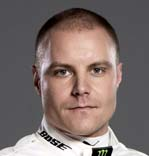

44 Lewis Hamilton 77 Valtteri Bottas

Born: Born: Stevenage, Great Britain, Nastola, Finland, on January 07, 1985 on August 28 , 1989

F1 Debut: 2007 Australia (McLaren), 4th F1 Debut: 2013 Australia (Williams), 16th Team: McLaren (2007-2012) Team: Williams (2013-2016) Mercedes (since 2013) Mercedes (since 2017) Grands Prix Contested: 221 Grands Prix Contested: 110 Grand Prix Victories: 67 Grand Prix Victories: 3 Pole Positions: 78 Pole Positions: 5 Championship Wins: 4 Championship Wins: - Most Recent Win: 2018 Hungary Most Recent Win: 2017 Abu Dhabi

2018 GP QUALIF.-GRID / FINISH POINTS 2018 GP QUALIF.-GRID / FINISH POINTS Australia 1 / 2 18 Australia 10 (19 after penalty) / 8 4 Bahrain 4 (9 after penalty) / 3 15 Bahrain 3 / 2 18 China 4 / 4 12 China 3 / 2 18 Azerbaijan 2 / 1 25 Azerbaijan 3 / 14 0 Spain 1 / 1 25 Spain 2 / 2 18 Monaco 3 / 3 15 Monaco 5 / 5 10 Canada 4 / 5 10 Canada 2 / 2 18 France 1 / 1 25 France 2 / 7 6 Austria 2 / NC 0 Austria 1 / NC 0 Great Britain 1 / 2 18 Great Britain 4 / 4 12 Germany 14 / 1 25 Germany 2 / 2 18 Hungary 1 / 1 25 Hungary 2 / 4 12 Belgium 1 / 2 18 Belgium 10 (15 after penalty) / 4 12

34

SCUDERIA FERRARI

Maranello, Italy

Chassis: Ferrari SF71-H First Team Entry: 1950 Monaco, 2nd (A. Ascari)

Power Unit: Ferrari World Championships:16 (1961,1964, 1975, 1976,

Team Chief: Maurizio Arrivabene 1977, 1979, 1982, 1983, 1999, 2000,

Technical Chief: Mattia Binotto 2001, 2002, 2003, 2004, 2007, 2008)

Media contact: Alberto Antonini Grands Prix Contested: 965

+39 344 055 6635 Grand Prix Victories: 234

alberto.antonini@ferrari.com Most Recent Win: 2018 Belgium

www.ferrari.com 2017 Championship: 2nd

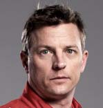

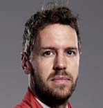

5 Sebastian Vettel 7 Kimi Räikkönen

Born: Born: Heppenheim, Germany, Espoo, Finland, on July 3, 1987 on October 17, 1979

F1 Debut: 2007 USA (BMW Sauber), 8th F1 Debut: 2001 Australia (Sauber), 6th Team:Bmw Sauber (2007), Toro Rosso (2007-2008), Team: Sauber(2001), McLaren (2002-2006), Ferrari Red Bull (2009-2014), Ferrari (since 2015) (2007-2009), Lotus (2010-2013), Ferrari (since 2014) Grands Prix Contested: 211 Grands Prix Contested: 283 Grand Prix Victories: 52 Grand Prix Victories: 20 Pole Positions: 55 Pole Positions: 17

Championship Wins: 4 (2010,2011,2012,2013 - Red Bull) Championship Wins: 1 (2007 - Ferrari)

Most Recent Win: 2018 Belgium Most Recent Win: 2013 Australia

2018 GP QUALIF.-GRID / FINISH POINTS 2018 GP QUALIF.-GRID / FINISH POINTS Australia 3 / 1 25 Australia 2 / 3 15 Bahrain 1 / 1 25 Bahrain 2 / NC 0 China 1 / 8 4 China 2 / 3 15 Azerbaijan 1 / 4 12 Azerbaijan 6 / 2 18 Spain 3 / 4 12 Spain 4 / NC 0 Monaco 2 / 2 18 Monaco 4 / 4 12 Canada 1 / 1 25 Canada 5 / 6 8 France 3 / 4 10 France 6 / 3 15 Austria 3 (6 after penalty) / 3 15 Austria 3 / 4 18 Great Britain 1 / 2 18 Great Britain 3 / 3 15 Germany 1 / NC 0 Germany 3 / 3 15 Hungary 4 / 2 18 Hungary 3 / 3 15 Belgium 2 / 1 25 Belgium 6 / NC 0

35

ASTON MARTIN

RED BULL RACING

Milton Keynes, United Kingdom

Chassis: Red Bull RB13

Power Unit: Tag Heuer

Team Chief: Christian Horner First Team Entry: 2005 Australia, 4th (D. Coulthard)

Technical Chief: Adrian Newey World Championships: 4 (2010,2011,2012,2013)

Media contact: Ben Wyatt Grands Prix Contested: 259

+44 7771 854238 Grand Prix Victories: 58

ben.wyatt@redbullracing.com Most Recent Win: 2018 Austria

www.redbullracing.com 2017 Championship: 3rd

3 Daniel Ricciardo 26 Max Verstappen

Born: Born: Perth, Australia, Hasselt, Belgium, on July 1, 1989 on September 30, 1997

F1 Debut: 2011 Great Britain (HRT,) 19th F1 Debut: 2015 Australia (Toro Rosso) Team: HRT (2011), Toro Rosso (2011-2013), Team: Toro Rosso (2015-2016), Red Bull (since 2014) Red Bull (since 2016) Grands Prix Contested: 142 Grands Prix Contested: 73 Grand Prix Victories: 7 Grand Prix Victories: 4 Pole Positions: 2 Pole Positions: 0 Championship Wins: 0 Championship Wins: 0 Most Recent Win: 2018 Monaco Most Recent Win: 2018 Austria

2018 GP QUALIF.-GRID / FINISH POINTS 2018 GP QUALIF.-GRID / FINISH POINTS Australia 5 (8 after penalty) / 4 12 Australia 4 / 5 8 Bahrain 5 (4 after other drivers’ penalty) / NC 0 Bahrain 15 / NC 0 China 6/ 1 25 China 5 / 5 10 Azerbaijan 4 / NC 0 Azerbaijan 5 / NC 0 Spain 6 / 5 10 Spain 5 / 3 15 Monaco 1 / 1 25 Monaco 20 / 9 2 Canada 6 / 4 12 Canada 3 / 3 15 France 5 / 4 12 France 4 / 2 18

Austria 7 / NC 0 Austria 5 (4 after other drivers’ penalty) / 1 25 Great Britain 6 / 5 10 Great Britain 5 / 15 0 Germany 15 (19 after penalty) / NC 0 Germany 4 / 4 12 Hungary 12 / 4 12 Hungary 7 / 19 0 Belgium 8 / NC 0 Belgium 7 / 3 15

36

RACING POINT FORCE INDIA

F1 TEAM

Silverstone, United Kingdom

Chassis: Force India VJM11

Power unit: Mercedes

Team principal: Otmar Szafnauer First Team Entry: 2018 Belgio, 5th (S. Perez)

Technical Chief: Andrew Green World Championships: 0

Media contact: Will Hings Grands Prix Contested: 1

+44 7734 202020 Grand Prix Victories: 0

will.hings@forceindiaf1.com Most Recent Win: N/A

www.forceindiaf1.com 2017 Championship: -

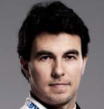

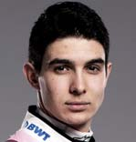

11 Sergio Pérez 31 Esteban Ocon

Born: Born: Guadalajara, Mexico, Evreux, France, on January 26, 1990 on 17 September 1996

F1 Debut: 2011 Australia (Sauber), SQ F1 Debut: 2016 Belgio (Manor), 16th Team: Sauber (2011-2012), McLaren (2013), Team: Manor (2016), Force India (since 2014) Force India (since 2017) Grands Prix Contested: 149 Grands Prix Contested: 42 Grand Prix Victories: 0 Grand Prix Victories: 0 Pole Positions: 0 Pole Positions: 0 Championship Wins: 0 Championship Wins: 0 Most Recent Win: N/A Most Recent Win: N/A

2018 GP QUALIF.-GRID / FINISH POINTS 2018 GP QUALIF.-GRID / FINISH POINTS

Australia 13 (12 after other drivers’ penalty) / 11 0 Australia 15 (14 after other drivers’ penalty) / 12 0 Bahrain 12 / 16 0 Bahrain 9 (8 after other drivers’ penalty) / 10 1 China 8/ 12 0 China 12/ 11 0 Azerbaijan 8 / 3 15 Azerbaijan 7 / NC 0 Spain 15 / 9 2 Spain 13 / NC 0 Monaco 9 / 12 0 Monaco 6 / 6 8 Canada 10 / 14 0 Canada 8 / 9 2 France 13 / NC 0 France 11 / NC 0

Austria 17 (15 after other drivers’ penalty) / 7 6 Austria 11 / 6 8 Great Britain 12 / 10 1 Great Britain 10 / 7 6

Germany 10 / 7 6 Germany 16 (15 after other drivers’ penalty) / 8 4 Hungary 19 (18 after other drivers’ penalty) / 14 0 Hungary 18 (17 after other drivers’ penalty) / 13 0 Belgium 4 / 5 10 Belgium 3 / 6 8

37

WILLIAMS MARTINI RACING

Grove, United Kingdom

Chassis: Williams FW41

Power unit: Mercedes First Team Entry: 1978 Argentina, 17th (J. Lafitte)

Team Principal: Frank Williams World Championships: 9 (1980, 1981, 1986,

Technical Chief: Paddy lowe 1987,1992, 1993, 1994,1996, 1997)

Media contact: Sophie Ogg Grands Prix Contested: 714

+44 7977 275762 Grand Prix Victories: 114

sophie.ogg@williamsf1.com Most Recent Win: 2012 Spain

www.williamsf1.com 2017 Championship: 5th

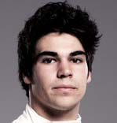

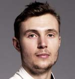

18 Lance Stroll 35 Sergey Sirotkin

Born: Born: Montreal, Canada Moscow, Russia on 29 October 1998 on 25 August 1995

F1 Debut: 2013 Australia (Williams) F1 Debut: 2018 Australia (Williams), NC Team: Williams (since 2017) Team: Williams (since 2018)

Grands Prix Contested: 33 Grands Prix Contested: 13 Grand Prix Victories: 0 Grand Prix Victories: 0 Pole Positions: 0 Pole Positions: 0 Championship Wins: 0 Championship Wins: 0 Most Recent Win: N/A Most Recent Win: N/A

2018 GP QUALIF.-GRID / FINISH POINTS 2018 GP QUALIF.-GRID / FINISH POINTS

Australia 14 (13 after other drivers’ penalty) / 14 0 Australia 19 / NC 0 Bahrain 20 / 14 0 Bahrain 18 / 15 0 China 18/ 14 0 China 16 / 15 0

Azerbaijan 11 (10 after other drivers’ penalty) / 8 4 Azerbaijan 12 (11 after other drivers’ penalty) / NC 0 Spain 19 (18 after other drivers’ penalty)/ 11 0 Spain 18 (19 after penalty) / 14 0 Monaco 18 (17 after other drivers’ penalty) / 17 0 Monaco 13 / 16 0 Canada 17 (16 after other drivers’ penalty) / NC 0 Canada 18 (17 after other drivers’ penalty) / 17 0 France 20 (13 after other drivers’ penalty) / 17 0 France 19 (18 after other drivers’ penalty) / 15 0 Austria 15 (13 after other drivers’ penalty) / 13 0 Austria 18 (16 after other drivers’ penalty) / 14 0 Great Britain 19 / 12 0 Great Britain 18 / 14 0

Germany 19 (17 after other drivers’ penalty) / NC 0 Germany 12 / NC 0 Hungary 15 (20 after penalty) / 17 0 Hungary 20 (19 after other drivers’ penalty) / 16 0 Belgium 19 (16 after other drivers’ penalty) / 13 0 Belgium 18 (15 after other drivers’ penalty) / 12 0

38

RENAULT F1 TEAM

Enstone, United Kingdom

Chassis: Renault R.S. 18

Power unit: Renault First Team Entry: 1977 Great Britain, 21st

Team Chief: Cyril Abiteboul (JP Jabouille)

Technical Chief: Bob Bell World Championships: 2 (2005, 2006)

Media contacts: Louis Bordes Grands Prix Contested: 358

Grand Prix Victories: 35

Louis.BORDES@uk.renaultsportracing.com Most recent win: 2008 Singapore

www.renaultsport.com 2017 Championship: 6th

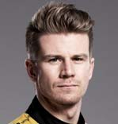

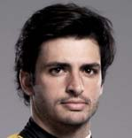

27 Nico Hülkenberg 55 Carlos Sainz

Born: Born: Emmerich am Rhein, Germany Horsham, Great Britain on August 5, 1987 on January 20, 1991

F1 Debut: 2010 Bahrein (Williams), 14th F1 Debut: 2015 Australia (Toro Rosso), 8th Team Williams (2010), Force India (2011-2012), Team: Toro Rosso (2015-2017, Sauber (2013), Force India (2014-2016), Renault (since 2018) Renault (since 2017)

Grands Prix Contested: 150 Grands Prix Contested: 73 Grand Prix Victories: 0 Grand Prix Victories: 0 Pole Positions: 1 Pole Positions: 0 Championship Wins: 0 Championship Wins: 0 Most Recent Win: N/A Most Recent Win: N/A

2018 GP QUALIF.-GRID / FINISH POINTS 2018 GP QUALIF.-GRID / FINISH POINTS

Australia 8 (7 after other drivers’ penalty) / 7 6 Australia 9 / 10 1 Bahrain 8 (7 after other drivers’ penalty) / 6 8 Bahrain 10 / 11 0 China 7 / 6 8 China 9 / 9 2

Azerbaijan 9 (14 after penalty) / NC 0 Azerbaijan 10 (9 after other drivers’ penalty) / 5 10 Spain 16 / NC 0 Spain 9 / 7 6 Monaco 11 / 8 4 Monaco 8 / 10 1 Canada 7 / 7 6 Canada 9 / 8 4 France 12 / 9 2 France 7 / 8 4 Austria 10 / NC 0 Austria 9 / 12 0 Great Britain 11 / 6 8 Great Britain 16 / NC 0 Germany 7 / 5 10 Germany 8 / 12 0 Hungary 13 / 12 0 Hungary 5 / 9 2

Belgium 15 (18 after penalty) / NC 0 Belgium 16 (19 after penalty)/ 11 0

39

RED BULL TORO ROSSO HONDA

Faenza, Italy

Chassis: Toro Rosso STR13

Power unit: Honda First Team Entry: 2006 Bahrain, 11th

Team Chief: Franz Tost (V. Liuzzi)

Technical Chief: James Key World Championships: 0

Media contact: Fabiana Valenti Grands Prix Contested: 240

+39 335 711 3694 Grand Prix Victories: 1

fabiana.valenti@tororosso.com Most Recent Win: 2008 Italy

www.tororosso.com 2017 Championship: 7th

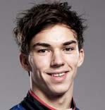

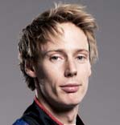

10 Pierre Gasly 28 Brendon Hartley

Born: Born: Rouen, France, Palmerston North, New Zealand on 7 February, 1996 on 10 November, 1989

F1 Debut: 2017 Malaysia (Toro Rosso), 14th F1 Debut: 2017 USA (Toro Rosso), 13th Team: Toro Rosso (since 2017) Team: Toro Rosso (since 2017) Grands Prix Contested: 18 Grands Prix Contested: 17 Grand Prix Victories: 0 Grand Prix Victories: 0 Pole Positions: 0 Pole Positions: 0 Championship Wins: 0 Championship Wins: 0 Most Recent Win: N/A Most Recent Win: N/A

2018 GP QUALIF.-GRID / FINISH POINTS 2018 GP QUALIF.-GRID / FINISH POINTS Australia 20 / NC 0 Australia 16 / 15 0

Bahrain 6 (5 after other drivers’ penalty) / 4 12 Bahrain 11 / 17 0 China 17 / 18 0 China 15 / 20 0 Azerbaijan 17 / 12 0 Azerbaijan 19 / 10 1 Spain 12 / NC 0 Spain 20 / 12 0

Monaco 10 / 7 6 Monaco 16 (15 after other drivers’ penalty) / 19 0 Canada 16 (19 after penalty) / 11 0 Canada 12 / NC 0 France 14 / NC 0 France 17 (20 after penalty) / 14 0 Austria 12 / 11 0 Austria 19 / NC 0 Great Britain 14 / 13 0 Great Britain 20 / NC 0

Germany 17 (20 after penalty) / 14 0 Germany 18 (16 after other drivers’ penalty) / 10 1 Hungary 6 / 6 8 Hungary 8 / 11 0

Belgium 11 (10 after other drivers’ penalty) / 9 2 Belgium 12 (11 after other drivers’ penalty) / 14 0

40

HAAS F1 TEAM

Kannapolis, North Caroline (USA)

Chassis: Haas VF-18

Power unit: Ferrari

Team Principal: Guenther Steiner First Team Entry: 2016 Australia, NC

Technical Chief: Rob Taylor World Championships: 0

Media contacts: Mike Arning Grands Prix Contested: 55

+1 704 236 0405 Grand Prix Victories: 0

marning@haasf1team.com Most Recent Win: N/A

www.haasf1team.com 2017 Championship: 8th

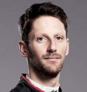

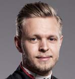

8 Romain Grosjean 20 Kevin Magnussen

Born: Born: Geneva, Switzerland, Roskilde, Denmark, on April 17, 1986 on October 5, 1992

F1 Debut: 2009 Europe (Renault), 14th F1 Debut: 2014 Australia (McLaren), 4th Team Renault (2009), Lotus (2012-2015), Team: McLaren (2014), Renault (2016), Haas (since 2016) Haas (since 2017) Grands Prix Contested: 137 Grands Prix Contested: 74 Grand Prix Victories: 0 Grand Prix Victories: 0 Pole Positions: 0 Pole Positions: 0 Championship Wins: 0 Championship Wins: 0 Most Recent Win: N/A Most Recent Win: N/A

2018 GP QUALIF.-GRID / FINISH POINTS 2018 GP QUALIF.-GRID / FINISH POINTS

Australia 7 (6 after other drivers’ penalty) / NC 0 Australia 6 (5 after other drivers’ penalty) / NC 0 Bahrain 16 / 13 0 Bahrain 7 (6 after other drivers’ penalty) / 5 10 China 10 / 17 0 China 11 / 10 1 Azerbaijan 20 / NC 1 Azerbaijan 15 / 13 0 Spain 10 / NC 0 Spain 7 / 6 8 Monaco 15 (18 after penalty) / 15 0 Monaco 19 / 13 0 Canada 20 / 12 0 Canada 11 / 13 0 France 10 / 11 0 France 9 / 6 8

Austria 6 (5 after other drivers’ penalty) / 4 12 Austria 8 / 5 10 Great Britain 8 / NC 0 Great Britain 7 / 9 2 Germany 6 / 6 8 Germany 5 / 11 0 Hungary 10 / 10 1 Hungary 9 / 7 6 Belgium 5 / 7 6 Belgium 9 / 8 4

41

McLAREN TEAM

Woking, United Kingdom

Chassis: McLaren MCL33

Power unit: Renault First Team Entry: 1966 Monaco, NC

Team Chief: Zack Brown World Championships: 8 (1974, 1984, 1985,

Technical Chief: Andrea Stella 1988, 1989, 1990, 1991, 1998)

Media contact: Tim Bampton Grands Prix Contested: 839

Grand Prix Victories: 182

tim.bampton@mclaren.com Most recent win: 2012 Brazil

www.mclaren.com 2017 Championship: 9th

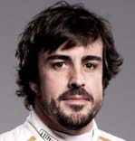

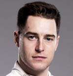

14 Fernando Alonso 2 Stoffel Vandoorne

Born: Born: Oviedo, Spain, Kortrijk, Belgium, on July 29, 1981 on March 26, 1992

F1 Debut: 2001 Australia (Minardi), 19th F1 Debut: 2016 Bahrein (McLaren), 12th Team: Minardi (2001), Renault (2003-2006), Team: McLaren (since 2016) McLaren (2007), Renault (2008-2009), Ferrari (2010-2014), McLaren (since 2015)

Grands Prix Contested: 306 Grands Prix Contested: 34 Grand Prix Victories: 32 Grand Prix Victories: 0 Pole Positions: 22 Pole Positions: 0 Championship Wins: 2 (2005, 2006 - Renault) Championship Wins: 0 Most Recent Win: 2013 Spain Most Recent Win: N/A

2018 GP QUALIF.-GRID / FINISH POINTS 2018 GP QUALIF.-GRID / FINISH POINTS

Australia 11 (10 after other drivers’ penalty) / 5 10 Australia 12 (11 after other drivers’ penalty) / 9 2 Bahrain 13 / 7 6 Bahrain 14 / 8 4 China 13 / 7 6 China 14 / 13 0

Azerbaijan 13 (12 after other drivers’ penalty) / 7 6 Azerbaijan 16 / 9 2 Spain 8 / 8 4 Spain 11 / NC 0 Monaco 7 / NC 0 Monaco 12 / 14 0 Canada 14 / NC 0 Canada 15 / 16 0

France 16 / 16 0 France 18 (17 after other drivers’ penalty) / 12 0 Austria 14 (20 after penalty) / 8 4 Austria 16 (14 after other drivers’ penalty) / 15 0 Great Britain 13 / 8 4 Great Britain 17 / 11 0

Germany 11 / 16 0 Germany 20 (18 after other drivers’ penalty) / 13 0 Hungary 11 / 8 4 Hungary 16 (15 after other drivers’ penalty) / NC 0 Belgium 17 (14 after other drivers’ penalty) / NC 0 Belgium 20 (20 after penalty) / 15 0

42

ALFA ROMEO SAUBER F1 TEAM

Hinwil, Switzerland

Chassis: Sauber C36

Power unit: Ferrari Tipo 059/5 First Team Entry: 1993 South Africa, 5th

Team Chief: Frédéric Vasseur (JJ Letho)

Technical Chief: Simone Resta World Championships: 0

Media contact: Maria Guidotti Grands Prix Contested: 455

+41 79 770 1819 Grand Prix Victories: 1

maria.guidotti@sauber-group.comt Most recent win: N/A

www.sauberf1team.com 2016 Championship: 10th

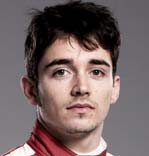

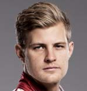

9 Marcus Ericsson 16 Charles Leclerc

Born: Born: Kumla, Sweden, Monte Carlo, Monaco, on September 2, 1990 on October 16, 1997

F1 Debut: 2014 Australia (Caterham), NC F1 Debut: 2018 Australia (Sauber), 13th Team: Caterham (2014), Sauber (since 2015) Team: Sauber (since 2018) Grands Prix Contested: 89 Grands Prix Contested: 13 Grand Prix Victories: 0 Grand Prix Victories: 0 Pole Positions: 0 Pole Positions: 0 Championship Wins: 0 Championship Wins: 0 Most Recent Win: N/A Most Recent Win: N/A

2018 GP QUALIF.-GRID / FINISH POINTS 2018 GP QUALIF.-GRID / FINISH POINTS Australia 17 / NC 0 Australia 18 / 13 0 Bahrain 17 / 9 2 Bahrain 19 / 12 0 China 20 / 16 0 China 19 / 19 0

Azerbaijan 18 / 11 0 Azerbaijan 14 (13 after other drivers’ penalty) / 6 8 Spain 17 / 13 0 Spain 14 / 10 0

Monaco 17 (16 after other drivers’ penalty) / 11 0 Monaco 14 / 18 0 Canada 19 (18 after other drivers’ penalty) / 15 0 Canada 13 / 10 0 France 15 / 13 0 France 8 / 10 0

Austria 20 (18 after other drivers’ penalty) / 10 1 Austria 13 (17 after penalty) / 9 2 Great Britain 15 / NC 0 Great Britain 9 / NC 0 Germany 13 / 9 2 Germany 9 / 15 0

Hungary 14 / 15 0 Hungary 17 (16 after other drivers’ penalty) / NC 0 Belgium 14 (13 after other drivers’ penalty) / 10 1 Belgium 13 (12 after other drivers’ penalty) / NC 0

43

MONZA F1 TRACK CHARACTERISTICS

2018 F1 ITALIAN GRAND PRIX

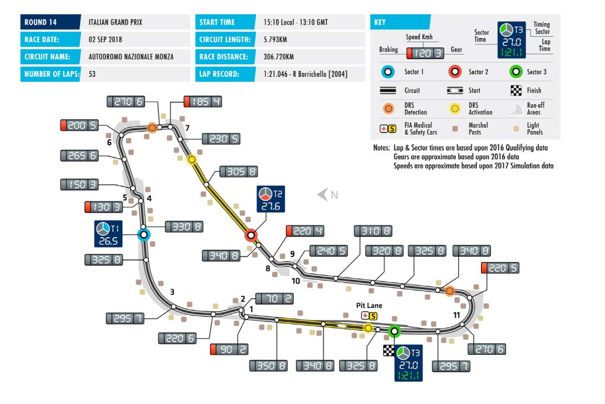

44

ITALIAN GRAND PRIX: WIN, POLE & FASTEST LAP 1921-2017

YEAR WINNER POLE FASTEST LAP

1921 J. GOUX L. WAGNER P. BORDINO (Ballot 3L) (Fiat 802) (Fiat 802)

1922 P. BORDINO F. NAZZARO P. BORDINO (Fiat 804) (Fiat 804) (Fiat 804)

1923 C. SALAMANO F. MINOIA P. BORDINO (Fiat 805/405) (Benz RH) (Fiat 805/405)

1924 Antonio ASCARI Antonio ASCARI Antonio ASCARI (Alfa Romeo P2 8C/2000) (Alfa Romeo P2 8C/2000) (Alfa Romeo P2 8C/2000)

1925 G. BRILLI-PERI E. MATERASSI P. KREIS (Alfa Romeo P2) (Diatto GP) (Duesenberg 122)

1926 L. CHARAVEL E. MATERASSI M. COSTANTINI (Bugatti 39A) (Maserati 26/8C 1500) (Bugatti 39A)

1927 R. BENOIST P. KREIS R. BENOIST (Delage 155B) (Miller 91) (Delage 155B)

1928 L. CHIRON B. BORZACCHINI L. ARCANGELI (Bugatti 37A) (Maserati 26B/(C 2000) (Talbot 700)

1930 A.VARZI T. NUVOLARI A. VARZI (Maserati 8C-2500 (Alfa Romeo P2) (Maserati 8C-2500)

1931 G. CAMPARI/T. NUVOLARI G. CAMPARI G. CAMPARI (Alfa Romeo 8C/2300) (Alfa Romeo 8C/2300) (Alfa Romeo 8C/2300)

1932 T. NUVOLARI B. BORZACCHINI T. NUVOLARI (Alfa Romeo 8C/2600) (Alfa Romeo Monza/8C 2300) (Alfa Romeo 8C/2600)

1933 L. FAGIOLI E. SIENA L. FAGIOLI (Alfa-Romeo 8C-2600) (Alfa Romeo 8C/2300) (Alfa-Romeo 8C-2600)

1934 R. CARACCIOLA/ L. FAGIOLI R. CARACCIOLA H. STUCK (Mercedes-Benz W25) (Mercedes-Benz W25) (Auto Union A)

1935 H. STUCK G. FARINA T. NUVOLARI (Auto Union B) (Maserati V8-R1) (Alfa Romeo 8C-35)

1936 B. ROSEMEYER B. ROSEMEYER B. ROSEMEYER (Auto Union C) (Auto Union C) (Auto Union C)

1937 R. CARACCIOLA R. CARACCIOLA R. CARACCIOLA (Mercedes-Benz W125) (Mercedes-Benz W125) (Mercedes-Benz W125)

1938 T. NUVOLARI H. LANG H. LANG (Auto Union D) (Mercedes Benz W154) (Mercedes Benz W154)

1947 C.F. TROSSI C. SANESI C.F. TROSSI (Alfa Romeo 158) (Alfa Romeo 158) (Alfa Romeo 158)

1948 J.P. WIMILLE J.P. WIMILLE J.P. WIMILLE (Alfa Romeo 158) (Alfa Romeo 158) (Alfa Romeo 158)

45

ITALIAN GRAND PRIX: WIN, POLE & FASTEST LAP 1921-2017

YEAR WINNER POLE FASTEST LAP

1949 Alberto ASCARI Alberto ASCARI Alberto ASCARI (Ferrari 125) (Ferrari 125) (Ferrari 125)

1950 G. FARINA J. M. FANGIO J. M. FANGIO (Alfa Romeo 158) (Alfa Romeo 158) (Alfa Romeo 158)

1951 Alberto ASCARI J. M. FANGIO G. FARINA (Ferrari 375) (Alfa Romeo 159) (Alfa Romeo 159)

1952 Alberto ASCARI Alberto ASCARI Alberto ASCARI (Ferrari 500) (Ferrari 500) (Ferrari 500)

1953 J. M. FANGIO Alberto ASCARI J. M. FANGIO (Maserati A6GCM) (Ferrari 500) (Maserati A6GCM)

1954 J. M. FANGIO J. M. FANGIO J.F. GONZALES (Mercedes-Benz W196) (Mercedes-Benz W196) (Ferrari 553 Squalo)

1955 J. M. FANGIO S. MOSS J. M. FANGIO (Mercedes-Benz W196) (Mercedes-Benz W196) (Mercedes-Benz W196)

1956 S. MOSS J. M. FANGIO S. MOSS (Maserati 250F) (Lancia D50 Ferrari) (Maserati 250F)

1957 S. MOSS S. LEWIS-EVANS T. BROOKS (Vanwall VW5) (Vanwall VW7) (Vanwall VW6)

1958 T. BROOKS S. MOSS P. HILL (Vanwall VW5) (Vanwall VW10) (Ferrari 246)

1959 S. MOSS S. MOSS P. HILL (Cooper T51-Climax) (Cooper T51-Climax) (Ferrari 246)

1960 P. HILL P. HILL P. HILL (Ferrari 246) (Ferrari 246) (Ferrari 246)

1961 P. HILL W. VON TRIPS G. BAGHETTI (Ferrari 156) (Ferrari 156) (Ferrari 156)

1962 G. HILL J. CLARK G. HILL (BRM P578) (Lotus 25-Climax) (BRM P578)

1963 J. CLARK J. SURTEES J. CLARK (Lotus 25-Climax) (Ferrari 156) (Lotus 25-Climax)

1964 J. SURTEES J. SURTEES J. SURTEES (Ferrari 158) (Ferrari 158) (Ferrari 158)

1965 J. STEWART J. CLARK J. CLARK (BRM P261) (Lotus 33-Climax) (Lotus 33-Climax)

1966 L. SCARFIOTTI M. PARKES L. SCARFIOTTI (Ferrari 312) (Ferrari 312) (Ferrari 312)

46

ITALIAN GRAND PRIX: WIN, POLE & FASTEST LAP 1921-2017

YEAR WINNER POLE FASTEST LAP

1967 J. SURTEES J. CLARK J. CLARK (Honda RA300) (Lotus 49 Ford) (Lotus 49 Ford)

1968 D. HULME J. SURTEES J. OLIVER (McLaren M7A Ford) (Honda RA301) (Lotus 49B Ford)

1969 J. STEWART J. RINDT J.P. BELTOISE (Matra MS80 Ford) (Lotus 49B Ford) (Matra MS80 Ford)

1970 C. REGAZZONI J. ICKX C. REGAZZONI (Ferrari 312B) (Ferrari 312B) (Ferrari 312B)

1971 P. GETHIN C. AMON H. PESCAROLO (BRM P160) (Matra MS120B Simca) (March 711 Ford)

1972 E. FITTIPALDI J. ICKX J. ICKX (Lotus 72D Ford) (Ferrari 312B2) (Ferrari 312B2)

1973 R. PETERSON R. PETERSON J. STEWART (Lotus 72D Ford) (Lotus 72D Ford) (Tyrrel 006 Ford)

1974 R. PETERSON N. LAUDA C. PACE (Lotus 72E Ford) (Ferrari 312B3) (Brabham BT44 Ford)

1975 C. REGAZZONI N. LAUDA C. REGAZZONI (Ferrari 312 T) (Ferrari 312 T) (Ferrari 312 T)

1976 R. PETERSON J. LAFFITE R. PETERSON (March 761) (Ligier JS5 Matra) (March 761)

1977 Mario ANDRETTI J. HUNT Mario ANDRETTI (Lotus 78 Ford) (McLaren M26 Ford) (Lotus 78 Ford)

1978 N. LAUDA Mario ANDRETTI Mario ANDRETTI (Brabham BT46 Alfa Romeo) (Lotus 79 Ford) (Lotus 79 Ford)

1979 J. SCHECKTER J.P. JABOUILLE C. REGAZZONI (Ferrari 312 T4) (Renault RS10) (Ferrari 312 T4)

1980 N. PIQUET R. ARNOUX A. JONES (Brabham BT49 Ford) (Renault RE20) (Williams FW07B Ford)

1981 A. PROST R. ARNOUX C. REUTEMANN (Renault RE30) (Renault RE30) (Williams FW07C Ford)

1982 R. ARNOUX Mario ANDRETTI R. ARNOUX (Renault RE30B) (Ferrari 126C2) (Renault RE30B)

1983 N. PIQUET R. PATRESE N. PIQUET (Brabham BT52B BMW) (Brabham BT52B BMW) (Brabham BT52B BMW)

1984 N. LAUDA N. PIQUET N. LAUDA (McLaren MP4/2 TAG) (Brabham BT53 BMW) (McLaren MP4/2 TAG)

47

ITALIAN GRAND PRIX: WIN, POLE & FASTEST LAP 1921-2017

YEAR WINNER POLE FASTEST LAP

1985 A. PROST A. SENNA N. MANSELL (McLaren MP4/2B TAG) (Lotus 97T Renault) (Williams FW10 Honda)

1986 N. PIQUET T. FABI T. FABI (Williams FW11 Honda) (Benetton B186 BMW) (Benetton B186 BMW)

1987 N. PIQUET N. PIQUET A. SENNA (Williams FW11B Honda) (Williams FW11B Honda) (Lotus 99T Honda)

1988 G. BERGER A. SENNA M. ALBORETO (Ferrari F187/88C) (McLaren MP4/4 Honda) (Ferrari F187/88C)

1989 A. PROST A. SENNA A. PROST (McLaren MP4/5 Honda) (McLaren MP4/5 Honda) (McLaren MP4/5 Honda)

1990 A. SENNA A. SENNA A. SENNA (McLaren MP4/5B Honda) (McLaren MP4/5B Honda) (McLaren MP4/5B Honda)

1991 N. MANSELL A. SENNA A. SENNA (Williams FW14 Renault) (McLaren MP4/6 Honda) (McLaren MP4/6 Honda)

1992 A. SENNA N. MANSELL N. MANSELL (McLaren MP4/7A Honda) (Williams FW14B Renault) (Williams FW14B Renault)

1993 D. HILL A. PROST D. HILL (Williams FW15C Renault) (Williams FW15C Renault) (Williams FW15C Renault)

1994 D. HILL J. ALESI D. HILL (Williams FW16B Renault) (Ferrari 412T1B) (Williams FW16B Renault)

1995 J. HERBERT D. COULTHARD G. BERGER (Benetton B195 Renault) (Williams FW17 Renault) (Ferrari 412T2)

1996 M. SCHUMACHER J. VILLENEUVE M. SCHUMACHER (Ferrari F310) (Williams FW18 Renault) (Ferrari F310)

1997 D. COULTHARD J. ALESI D. COULTHARD (McLaren MP4/12 Mercedes) (Benetton B197 Renault) (McLaren MP4/12 Mercedes)

1998 M. SCHUMACHER M. SCHUMACHER M. HAKKINEN (Ferrari F300) (Ferrari F300) (McLaren MP4/13 Mercedes)

1999 H.H. FRENTZEN M. HAKKINEN R. SCHUMACHER (Jordan 199/5 Mugen Honda) (McLaren MP4/14/5 Mercedes) (Williams FW21/5 Supertech)

2000 M. SCHUMACHER M. SCHUMACHER M. HAKKINEN (Ferrari F1-2000/205) (Ferrari F1-2000/205) (McLaren MP4/15/5 Mercedes)

2001 J. P. MONTOYA J. P. MONTOYA R. SCHUMACHER (Williams FW23/8 Bmw) (Williams FW23/8 Bmw) (Williams FW23/7 Bmw)

2002 R. BARRICHELLO J. P. MONTOYA R. BARRICHELLO (Ferrari F2002/224) (Williams FW24/05 Bmw) (Ferrari F2002/224)

48

ITALIAN GRAND PRIX: WIN, POLE & FASTEST LAP 1921-2017

YEAR WINNER POLE FASTEST LAP

2003 M. SCHUMACHER M. SCHUMACHER M. SCHUMACHER (Ferrari F2003 GA/229) (Ferrari F2003 GA/229) (Ferrari F2003 GA/229)

2004 R. BARRICHELLO R. BARRICHELLO R. BARRICHELLO (Ferrari F2004/239) (Ferrari F2004/239) (Ferrari F2004/239)

2005 J. P. MONTOYA J. P. MONTOYA K. RAIKKONEN (McLaren MP4/20- 07 Mercedes) (McLaren MP4/20- 07 Mercedes) (McLaren MP4/20- 07 Mercedes)

2006 M. SCHUMACHER K. RAIKKONEN K. RAIKKONEN (Ferrari F1 248/255) (McLaren MP4/21-05) (McLaren MP4/21-05)

2007 F. ALONSO F. ALONSO F. ALONSO (McLaren MP4/22-06 Mercedes) (McLaren MP4/22-06 Mercedes) (McLaren MP4/22-06 Mercedes)

2008 S. VETTEL S. VETTEL K. RAIKKONEN (Toro Rosso STR03-03 Ferrari) (Toro Rosso STR03-03 Ferrari) (Ferrari F2008/269)

2009 R. BARRICHELLO L. HAMILTON A. SUTIL (Brawn BGP001/01 Mercedes) (McLaren MP4/24-04 Mercedes) (Force India VJM02/01 Mercedes)

2010 F. ALONSO F. ALONSO F. ALONSO (Ferrari F10/285) (Ferrari F10/285) (Ferrari F10/285)

2011 S. VETTEL S. VETTEL L. HAMILTON (RedBull RB7/3 Renault) (RedBull RB7/3 Renault) (McLaren MP4/26-01 Mercedes)

2012 L. HAMILTON L. HAMILTON N. ROSBERG (McLaren MP4/27 Mercedes) (McLaren MP4/27 Mercedes) (Mercedes F1 W03)

2013 S. VETTEL S. VETTEL L.HAMILTON (RedBull RB9 Renault) (RedBull RB9 Renault) (McLaren MP4/28 Mercedes)

2014 L. HAMILTON L. HAMILTON L. HAMILTON (Mercedes F1 W05) (Mercedes F1 W05) (Mercedes F1 W05)

2015 L. HAMILTON L. HAMILTON L. HAMILTON (Mercedes F1 W06) (Mercedes F1 W06) (Mercedes F1 W06)

2016 N. ROSBERG L. HAMILTON F. ALONSO (Mercedes F1 W07) (Mercedes F1 W07) (McLaren MP4-31)

2017 L. HAMILTON L. HAMILTON D. RICCIARDO (Mercedes F1 W08) (Mercedes F1 W08) (Red Bull RB13)

49

THE PODIUM OF THE ITALIAN GRAND PRIX 1921-2017

YEAR CIRCUIT WINNER 2ND 3RD START CLASSIFIED

1921 BRESCIA J. GOUX J. CHASSOGNE L. WAGNER 6 3 (30 laps - 512 km) (Ballot 3L) (Ballot 3L) (Fiat 802)

1922 MONZA P. BORDINO F. NAZZARO P. DE VIZCAYA 6 3 (80 laps x 10 km) (Fiat 804) (Fiat 804) (Bugatti 30)

1923 MONZA C. SALAMANO F. NAZZARO MURPHY 14 4 (80 laps x 10 km) (Fiat 805/405) (Fiat 805) (Miller 122)

1924 MONZA Antonio ASCARI L. WAGNER G. CAMPARI 12 4 (80 laps x 10 km) (Alfa Romeo P2 8C/2000) (Alfa Romeo P2 8C/2000) (Alfa Romeo P2 8C/2000)

1925 MONZA G. BRILLI-PERI G. CAMPARI M. COSTANTINI 16 8 (80 laps x 10 km) (Alfa Romeo P2) (Alfa Romeo P2) (Bugatti 39)

1926 MONZA L. CHARAVEL M. COSTANTINI J. GOUX 16 2 (60 laps x 10 km) (Bugatti 39A) (Bugatti 39A) (Bugatti 39A)

1927 MONZA R. BENOIST G. MORANDI E. COOPER/P. KREIS 6 6 (50 laps x 10 km) (Delage 155B) (OM 865) (Miller 91)

1928 MONZA L. CHIRON A. VARZI/G. CAMPARI T. NUVOLARI 22 8 (60 laps x 10 km) (Bugatti 37A) (Alfa Romeo P2) (Bugatti 35C)

1930 MONZA A. VARZI L. ARCANGELI E. MASERATI 15 10 (35 laps x 6,861 km (Maserati 8C-2500) (Maserati 8C-2500) (Maserati 16C-4000)

1931 MONZA G. CAMPARI/ F. MINOJA/ A. DIVO/ 32 16 (155 laps x 6,861 km T. NUVOLARI B. BORZACCHINI G. BOURIAT 10 hours) (Alfa Romeo 8C/2300) (Alfa Romeo 8C/2300) (Bugatti T51)

1932 MONZA T. NUVOLARI L. FAGIOLI B. BORZACCHINI/ 16 11 (83 laps x 6,861 km R. CARACCIOLA 5 hours) (Alfa Romeo 8C/2600) (Maserati 16C/5000) (Alfa Romeo 8C/2300)

1933 MONZA L. FAGIOLI T. NUVOLARI G. ZEHENDER 20 13 (50 laps x 6,861 km) (Alfa-Romeo 8C-2600) (Maserati 8CM) (Maserati 8CM)

1934 MONZA R. CARACCIOLA/ H. STUCK/ C.F. TROSSI/ 16 14 (166 laps x 4,310 km) L. FAGIOLI E. LEININGEN G. COMOTTI (Mercedes-Benz W25) (Auto Union A) (Alfa Romeo P3)

1935 MONZA H. STUCK R. DREYFUS/ P. PIETSCH/ 17 5 (73 laps x 6,890 km) T. NUVOLARI B. ROSEMEYER (Auto Union B) (Alfa Romeo P3) (Auto Union B)

1936 MONZA B. ROSEMEYER T. NUVOLARI E. DELIUS 12 7 (72 laps x 6,890 km) (Auto Union C) (Alfa Romeo 12C-36) (Auto Union C)

1937 LIVORNO R. CARACCIOLA H. LANG B. ROSEMEYER 15 10 (50 laps x 6,890 km) (Mercedes-Benz W125) (Mercedes-Benz W125) (Auto Union C)

1938 MONZA T. NUVOLARI G. FARINA R. CARACCIOLA/ 17 5 (60 laps x 6,890 km) BRAUCHITSCH (Auto Union D) (Alfa Romeo 16C-316) (Mercedes-Benz W154)

50

THE PODIUM OF THE ITALIAN GRAND PRIX 1921-2017

YEAR CIRCUIT WINNER 2ND 3RD START CLASSIFIED

1947 MILANO C.F. TROSSI A. VARZI C. SANESI 21 9 (100 laps x 3,447 km) (Alfa Romeo 158) (Alfa Romeo 158) (Alfa Romeo 158)

1948 TORINO J.P. WIMILLE G. VILLORESI R. SOMMER 20 11 (75 laps x 4,801 km) (Alfa Romeo 158) (Maserati 4CLT/48) (Ferrari 125)

1949 MONZA Alberto ASCARI P. ETANCELIN B. BIRA 24 9 (80 laps x 6,300 km) (Ferrari 125) (Talbot-Lago T26 C) (Maserati 4CLT/48)

1950 MONZA G. FARINA D. SERAFINI/ Al. ASCARI U. FAGIOLI 27 7 (80 laps x 6,300 km) (Alfa Romeo 158) (Ferrari 375) (Alfa Romeo 158)

1951 MONZA Alberto ASCARI J. F. GONZALES F. BONETTO/ 20 9 (80 laps x 6,300 km) G. FARINA (Ferrari 375) (Ferrari 375) (Alfa Romeo 159)

1952 MONZA Alberto ASCARI J. F. GONZALES L. VILLORESI 24 15 (80 laps x 6,300 km) (Ferrari 500) (Maserati A6GCM) (Ferrari 500)

1953 MONZA J. M. FANGIO G. FARINA L. VILLORESI 30 16 (80 laps x 6,300 km) (Maserati A6GCM) (Ferrari 500) (Ferrari 500)

1954 MONZA J. M. FANGIO M. HAWTHORN J. F. GONZALES/ 20 11 (80 laps x 6,300 km) U. MAGLIOLI (Mercedes-Benz W196) (Ferrari 625) (Ferrari 625)

1955 MONZA J. M. FANGIO P. TARUFFI E. CASTELLOTTI 20 9 (50 laps x 10 km) (Mercedes-Benz W196) (Mercedes-Benz W196) (Ferrari 555)

1956 MONZA S. MOSS P. COLLINS/ R. FLOCKHART 24 11 (50 laps x 10 km) J.M. FANGIO (Maserati 250F) (Lancia-Ferrari D50) (Connaught B7)

1957 MONZA S. MOSS J. M. FANGIO W. VON TRIPS 18 11 (87 laps x 5,750 km) (Vanwall VW5) (Maserati 250F) (Lancia-Ferrari D50)

1958 MONZA T. BROOKS M. HAWTHORN P. HILL 21 7 (70 laps x 5750 km) (Vanwall VW5) (Ferrari Dino 246) (Ferrari Dino 246)

1959 MONZA S. MOSS P. HILL J. BRABHAM 21 15 (72 laps x 5,750 km) (Cooper T51-Climax) (Ferrari Dino 246) (Cooper-Climax T45)

1960 MONZA P. HILL R. GINTHER W. MAIRESSE 16 10 (50 laps x 10 km) (Ferrari 246) (Ferrari 246) (Ferrari 246)

1961 MONZA P. HILL D. GURNEY B. McLAREN 32 12 (43 laps x 10 km) (Ferrari 156) (Porsche 718) (Cooper-Climax T55)

1962 MONZA G. HILL R. GINTHER B. McLAREN 21 12 (86 laps x 5,750 km) (BRM P578) (BRM P578) (Cooper T70-Climax)

51

THE PODIUM OF THE ITALIAN GRAND PRIX 1921-2017

YEAR CIRCUIT WINNER 2ND 3RD START CLASSIFIED

1963 MONZA J. CLARK R. GINTHER B. McLAREN 20 16 (86 laps x 5,750 km) (Lotus 25-Climax) (BRM P578) (Cooper T66-Climax)

1964 MONZA J. SURTEES B. McLAREN L. BANDINI 20 13 (78 laps x 5,750 km) (Ferrari 158) (Cooper T73-Climax) (Ferrari 158)

1965 MONZA J. STEWART G. HILL D. GURNEY 23 14 (76 laps x 5,750 km) (BRM P261) (BRM P261) (Brabham BT11-Climax)

1966 MONZA L. SCARFIOTTI M. PARKES D. HULME 20 10 (68 laps x 5,750 km) (Ferrari 312) (Ferrari 312) (Brabham BT20-Repco)

1967 MONZA J. SURTEES J. BRABHAM J. CLARK 18 7 (68 laps x 5,750 km) (Honda RA300) (Brabham BT24 Repco) (Lotus 49 Ford)

1968 MONZA D. HULME J. SERVOZ-GAVIN J. ICKX 20 6 (68 laps x 5,750 km) (McLaren M7A Ford) (Matra MS10 Ford) (Ferrari 312)

1969 MONZA J. STEWART J. RINDT J. P. BELTOISE 15 7 (68 laps x 5,750 km) (Matra MS80 Ford) (Lotus 49B Ford) (Matra MS80 Ford)

1970 MONZA C. REGAZZONI J. STEWART J. P. BELTOISE 20 9 (68 laps x 5,750 km) (Ferrari 312B) (March 701 Ford) (Matra-Simca MS120)

1971 MONZA P. GETHIN R. PETERSON F. CEVERT 23 10 (68 laps x 5,750 km) (BRM P160) (March 711 Ford) (Tyrrell 002 Ford)

1972 MONZA E. FITTIPALDI M. HAILWOOD D. HULME 25 13 (55 laps x 5,775 km) (Lotus 72D Ford) (Surtess TS9B Ford) (McLaren M19C Ford)

1973 MONZA R. PETERSON E. FITTIPALDI P. REVSON 24 15 (55 laps x 5,775 km) (Lotus 72D Ford) (Lotus 72D Ford) (McLaren M23 Ford)

1974 MONZA R. PETERSON E. FITTIPALDI J. SCHECKTER 25 11 (52 laps x 5,780 km) (Lotus 72E Ford) (McLaren M23 Ford) (Tyrrell 007 Ford)

1975 MONZA C. REGAZZONI E. FITTIPALDI N. LAUDA 26 14 (52 laps x 5,780 km) (Ferrari 312 T) (McLaren M23 Ford) (Ferrari 312 T)

1976 MONZA R. PETERSON C. REGAZZONI J. LAFFITE 26 19 (52 laps x 5,800 km) (March 761) (Ferrari 312 T2) (Ligier JS5 Matra)

1977 MONZA Mario ANDRETTI N. LAUDA A. JONES 24 9 (52 laps x 5,800 km) (Lotus 78 Ford) (Ferrari 312 T2) (Shadow DN8 Ford)

1978 MONZA N. LAUDA J. WATSON C. REUTEMANN 24 15 (52 laps x 5,800 km) (Brabham BT46 Alfa Romeo) (Brabham BT46 Alfa Romeo) (Ferrari 312 T3)

1979 MONZA J. SCHECKTER J. VILLENEUVE C. REGAZZONI 24 14 (50 laps x 5,800 km) (Ferrari 312 T4) (Ferrari 312 T4) (Willimas FW07 Ford)

1980 IMOLA N. PIQUET A. JONES C. REUTEMANN 24 12 (60 laps x 5 km) (Brabham BT49 Ford) (Williams FW07B Ford) (Williams FW07B Ford)

52

THE PODIUM OF THE ITALIAN GRAND PRIX 1921-2017

YEAR CIRCUIT WINNER 2ND 3RD START CLASSIFIED

1981 MONZA A. PROST A. JONES C. REUTEMANN 24 10 (52 laps x 5,800 km) (Renault RE30) (Williams FW07C Ford) (Williams FW07C Ford)

1982 MONZA R. ARNOUX P. TAMBAY Mario ANDRETTI 26 12 (52 laps x 5,800 km) (Renault RE30B) (Ferrari 126C2) (Ferrari 126C2)

1983 MONZA N. PIQUET R. ARNOUX E. CHEEVER 26 13 (52 laps x 5,800 km) (Brabham BT52B BMW) (Ferrari 126C3) (Renault RE40)

1984 MONZA N. LAUDA M. ALBORETO R. PATRESE 25 10 (51 laps x 5,800 km) (McLaren MP4/2 TAG) (Ferrari 126C4) (Alfa Romeo 184T)

1985 MONZA A. PROST N. PIQUET A. SENNA 26 13 (51 laps x 5,800 km) (McLaren MP4/2B TAG) (Brabham BT54 BMW) (Lotus 97T Renault)

1986 MONZA N. PIQUET N. MANSELL S. JOHANSSON 27 11 (51 laps x 5,800 km) (Williams FW11 Honda) (Williams FW11 Honda) (Ferrari F186)

1987 MONZA N. PIQUET A. SENNA N. MANSELL 26 16 (50 laps x 5,800 km) (Williams FW11B Honda) (Lotus 99T Honda) (Williams FW11B Honda)

1988 MONZA G. BERGER M. ALBORETO E. CHEEVER 26 13 (51 laps x 5,800 km) (Ferrari F187/88C) (Ferrari F187/88C) (Arrows A10B Megatron)

1989 MONZA A. PROST G. BERGER T. BOUTSEN 26 11 (53 laps x 5,800 km) (McLaren MP4/5 Honda) (Ferrari 640) (Williams FW12C Renault)

1990 MONZA A. SENNA A. PROST G. BERGER 26 13 (53 laps x 5,800 km) (McLaren MP4/5B Honda) (Ferrari 641) (McLaren MP4/5B Honda)

1991 MONZA N. MANSELL A. SENNA A. PROST 26 16 (53 laps x 5,800 km) (Williams FW14 Renault) (McLaren MP4/6 Honda) (Ferrari 643)

1992 MONZA A. SENNA M. BRUNDLE M. SCHUMACHER 26 11 (53 laps x 5,800 km) (McLaren MP4/7A Honda) (Benetton B192 Ford) (Benetton B192 Ford)

1993 MONZA D. HILL J. ALESI Michael ANDRETTI 26 14 (53 laps x 5,800 km) (Williams FW15C Renault) (Ferrari F93A) (McLaren MP4/8 Ford)

1994 MONZA D. HILL G. BERGER M. HAKKINEN 26 10 (53 laps x 5,800 km) (Williams FW16B Renault) (Ferrari 412T1B) (McLaren MP4/9 Peugeot)

1995 MONZA J. HERBERT M. HAKKINEN H.H. FRENTZEN 24 10 (53 laps x 5,770 km) (Benetton B195 Renault) (McLaren MP4/10B Mercedes) (Sauber C14 Ford)

1996 MONZA M. SCHUMACHER J. ALESI M. HAKKINEN 21 10 (53 laps x 5,770 km) (Ferrari F310) (Benetton B196 Renault) (McLaren MP4/11 Mercedes)

1997 MONZA D. COULTHARD J. ALESI H.H. FRENTZEN 22 14 (53 laps x 5,770 km) (McLaren MB4/12 Mercedes) (Benetton B197 Renault) (Willimas FW19 Renault)

1998 MONZA M. SCHUMACHER E. IRVINE R. SCHUMACHER 22 13 (53 laps x 5,770 km) (Ferrari F300) (Ferrari F300) (Jordan 198 Mugen Honda)

53

THE PODIUM OF THE ITALIAN GRAND PRIX 1921-2017

YEAR CIRCUIT WINNER 2ND 3RD START CLASSIFIED

1999 MONZA H.H. FRENTZEN R. SCHUMACHER M. SALO 22 11 (53 laps x 5,770 km) (Jordan 199/5 Mugen Honda) (Willimas FW21/6 Supertec) (Ferrari F399/195)

2000 MONZA M. SCHUMACHER M. HAKKINEN R. SCHUMACHER 22 12 (53 laps x 5,793 km) (Ferrari F1-2000/205) (McLaren MP4/15-4 Mercedes) (Williamas FW 22/2 Bmw)

2001 MONZA J. P. MONTOYA R. BARRICHELLO R. SCHUMACHER 22 13 (53 laps x 5,793 km) (Williams FW23/8 Bmw) (Ferrari F2001/206) (Williams FW23/7 Bmw)

2002 MONZA R. BARRICHELLO M. SCHUMACHER E. IRVINE 20 13 (53 laps x 5,793 km) (Ferrari F2002/224) (Ferrari F2002/224) (Jaguar R3/05 Cosworth)

2003 MONZA M. SCHUMACHER J. P. MONTOYA R. BARRICHELLO 20 13 (53 laps x 5,793 km) (Ferrari F2003 GA/229) (Williams FW25/05 Bmw) (Ferrari F2003 GA/233)

2004 MONZA R. BARRICHELLO M. SCHUMACHER J. BUTTON 20 15 (53 laps x 5,793 km) (Ferrari F2004/239) (Ferrari F2004/240) (BAR Honda 006/05)

2005 MONZA J. P. MONTOYA F. ALONSO G. FISICHELLA 20 20 (53 laps x 5,793 km) (McLaren MP4/20- 07 Mercedes) (Renault R23/07) (Renault R25/06)

2006 MONZA M. SCHUMACHER K. RAIKKONEN R. KUBICA 22 17 (53 laps x 5,793 km) (Ferrari F1 248/255) (McLaren MP4/21-05) (Bmw Sauber F1.06/05)

2007 MONZA F. ALONSO L. HAMILTON K. RAIKKONEN 22 20 (53 laps x 5,793 km) (McLaren MP4/22-06 Mercedes)(McLaren MP4/22-01 Mercedes) (Ferrari F2007/262)

2008 MONZA S. VETTEL H. KOVALAINEN R. KUBICA 20 19 (53 laps x 5,793 km) (Toro Rosso STR03-03 Ferrari)(McLaren MP4/23-05 Mercedes (Bmw Sauber F1.09/05)

2009 MONZA R. BARRICHELLO J. BUTTON K. RAIKKONEN 20 16 (53 laps x 5,793 km) (Brawn BGP001/01 Mercedes) (Brawn BGP001/02 Mercedes) (Ferrari F60/279)

2010 MONZA F. ALONSO J. BUTTON F. MASSA 24 20 (53 laps x 5,793 km) (Ferrari F10/285) (McLaren MP4/25-03 Mercedes) (Ferrari F10/284)

2011 MONZA S. VETTEL J. BUTTON F. ALONSO 24 15 (53 laps x 5,793 km) (RedBull RB7/3 Renault) (McLaren MP4/26-04 Mercedes) (Ferrari 150 Italia/290)

2012 MONZA L. HAMILTON S. PEREZ F. ALONSO 24 22 (53 laps x 5,793 km) (McLaren MP4/27 Mercedes) (Sauber C31 Ferrari) (Ferrari F2012)

2013 MONZA S. VETTEL F. ALONSO M. WEBBER 22 20 (53 laps x 5,793 km) (RedBull RB9 Renault) (Ferrari) (RedBull RB9 Renault)

2014 MONZA L. HAMILTON N. ROSBERG F. MASSA 22 20 (53 laps x 5,793 km) (Mercedes F1 W05) (Mercedes F1 W05) (Williams FW36)

2015 MONZA L. HAMILTON S. VETTEL F. MASSA 20 18 (53 laps x 5,793 km) (Mercedes F1 W06) (Ferrari SF15-T) (Williams FW37)

2016 MONZA N. ROSBERG L. HAMILTON S.VETTEL 22 18 (53 laps x 5,793 km) (Mercedes F1 W07) (Mercedes F1 W07) (Ferrari SF16-H)

2017 MONZA L. HAMILTON V. BOTTAS S.VETTEL 20 18 (53 laps x 5,793 km) (Mercedes F1 W08) (Mercedes F1 W08) (Ferrari SF70-H)

54

DRIVERS' PRESENCES AT THE ITALIAN GRAND PRIX

DRIVER TOT BEST RACE RESULT BEST QUALIFYING RESULT

44 Lewis HAMILTON 11 2012 - 1° - McLaren 2009/2012 - 1° - McLaren 2014/2015/2017 - 1° - Mercedes 2014/2015/2016/2017 - 1° - Mercedes

77 Valtteri BOTTAS 5 2014/2015 - 4° - Williams 2014 - 3° - Williams

5 Sebastian VETTEL 11 2008 - 1° - Toro Rosso 2008 - 1° - Toro Rosso 2011/2013 - 1° - Red Bull 2011/2013 - 1° - Red Bull

7 Kimi RAIKKONEN 15 2006 - 2° - McLaren 2006 - 1° - McLaren

3 Daniel RICCIARDO 7 2017 - 4° - Red Bull 2017 - 3° - Red Bull

33 Max VERSTAPPEN 3 2016 - 7° - Red BullL 2017 - 2° - Red Bull

11 Sergio PEREZ 8 2012 - 2° - Sauber 2015 - 7° - Force India

31 Esteban OCON 2 2017 - 6° -Force India 2017 - 5° - Force India

18 Lance STROLL 1 2017 - 7° - Williams 2017 - 4° - Williams

35 Sergey SIROTKIN - - -

27 Nico HULKENBERG 7 2013 - 5° - Sauber 2013 - 3° - Sauber

55 Carlos SAINZ 3 2015 - 11° - Toro Rosso 2015 - 13° - Toro Rosso

28 Brendon HARTLEY - - -

10 Pierre GASLY - - -

8 Romain GROSJEAN 6 2013 - 8° - Lotus 2015 - 8° - Lotus

20 Kevin MAGNUSSEN 2 2017 - 11° - Haas 2017 - 16° - Haas

14 Fernando ALONSO 16 2007 - 1° - McLaren 2007 - 1° - McLaren 2010 - 1° - Ferrari 2010 - 1° - Ferrari

2 Stoffel VANDOORNE 1 2017 - NC - McLaren 2017 - 10° - McLaren

9 Marcus ERICSSON 3 2015 - 9° - Sauber 2015 - 10° - Sauber

16 Charles LECLERC - - -

55

TEAMS' PRESENCES AT THE ITALIAN GRAND PRIX 1921-2017

TEAM GP 1st 2nd 3rd POLE FASTEST LAP

FERRARI 69 18 26 23 19 19

McLAREN 50 10 9 5 11 12

WILLIAMS 42 6 5 10 6 9

TYRRELL 28 - 2 - - 1

LIGIER - PROST 26 - 1 1 - -

ARROW - FOOTWORK 23 - 1 - - -

SAUBER 24 - 3 2 - -

BENETTON 21 1 3 1 2 1

MINARDI 21 - - - - -

RENAULT 20 2 1 2 3 1

JORDAN 15 1 1 - - -

RED BULL RACING 13 2 - 1 2 1

SCUDERIA TORO ROSSO 12 1 - - 1 -

FORCE INDIA 10 - - - - 1

HONDA 8 1 - - 1 -

TOYOTA 8 - - - - -

BAR 7 - - 1 - -

MERCEDES AMG PETRONAS 8 4 3 - 4 4

MANOR RACING MRT 6 - - - - -

JAGUAR 5 - - 1 - -

LOTUS F1 TEAM 5 - - - - -

CATERHAM 3 - - - - -

SUPER AGURI 2 - - - - -

HRT F1 TEAM 2 - - - - -

VIRGIN RACING 2 - - - - -

BAR - HONDA 1 - - - - -

BRAWN GP 1 1 1 - - -

HAAS F1 TEAM 2 - - - - -

MF1 RACING 1 - - - - -

SPYKER 1 - - - - -

Other Italian Grand Prix Winners

ALFA ROMEO (1924, 1925, 1931, 1932, 1933, 1947, 1948, 1949, 1950), LOTUS (1963, 1972, 1973, 1974, 1977), MER- CEDES-BENZ (1934, 1937, 1954, 1955); AUTO UNION (1935, 1936, 1938), BRABHAM (1978, 1980, 1983), BRM (1962, 1965, 1971), FIAT (1922, 1923), BUGATTI (1926, 1928), MASERATI (1953, 1956), VANWALL (1957, 1958), COOPER-CLIMAX (1959), MATRA-FORD (1969), MARCH (1976), BALLOT (1921), DELAGE (1927)

56

F1 ITALIAN GRAND PRIX RACE RECORDS

Description Record Year - Details

Fewest retirements 0 2005 - 20 starters, 20 finishers

Most overtakes for the lead 40 1965

Smallest winning margin 0.01 sec 1971 - Peter Gethin (BRM) from

Ronnie Peterson (March-Ford)

Highest average race speed 247,585 km/h 2003 - Michael Schumacher

(winner) (Ferrari)

Highest average lap speed 262,242 km/h 2004 - Juan Pablo Montoya

(in practices) (Williams-BMW)

Highest average lap speed 260,395 km/h 2004 - Rubens Barrichello

(pole position) (Ferrari)

Highest top speed 372,2 km/h 2005 - Juan Pablo Montoya

(Williams-BMW)

Shortest race without a red flag 1h14m19.838 2003

57

2017 FIA F1 ITALIAN GRAND PRIX QUALIFYING CLASSIFICATION

POS NUM DRIVER TEAM Q1 Q2 Q3

1 44 Lewis Hamilton Mercedes 1:36.009 1:34.660 1:35.554

2 33 Max Verstappen Red Bull Racing Tag Heuer 1:37.344 1:36.113 1:36.702

3 3 Daniel Ricciardo Red Bull Racing Tag Heuer 1:38.304 1:37.313 1:36.841

4 18 Lance Stroll Williams Mercedes 1:37.653 1:37.002 1:37.032

5 31 Esteban Ocon Force India Mercedes 1:38.775 1:37.580 1:37.719

6 77 Valtteri Bottas Mercedes 1:35.716 1:35.396 1:37.833

7 7 Kimi Räikkönen Ferrari 1:38.235 1:37.031 1:37.987

8 5 Sebastian Vettel Ferrari 1:37.198 1:36.223 1:38.064

9 19 Felipe Massa Williams Mercedes 1:38.338 1:37.456 1:38.251

10 2 Stoffel Vandoorne McLaren Honda 1:38.767 1:37.471 1:39.157

11 11 Sergio Perez Force India Mercedes 1:38.511 1:37.582

12 27 Nico Hulkenberg Renault 1:39.242 1:38.059

13 14 Fernando Alonso McLaren Honda 1:39.134 1:38.202

14 26 Daniil Kvyat Toro Rosso 1:39.183 1:38.245

15 55 Carlos Sainz Toro Rosso 1:39.788 1:38.526

16 20 Kevin Magnussen Haas Ferrari 1:40.489

17 30 Jolyon Palmer Renault 1:40.646

18 9 Marcus Ericsson Sauber Ferrari 1:41.732

19 94 Pascal Wehrlein Sauber Ferrari 1:41.875

NC 8 Romain Grosjean Haas Ferrari 1:43.355

58

2017 FIA F1 ITALIAN GRAND PRIX RACE CLASSIFICATION

POS NUM DRIVER TEAM/CAR TIME/GAP POINTS

1 44 Lewis Hamilton Mercedes 53 laps in 1:15:32.312 25

2 77 Valtteri Bottas Mercedes +4.471s 18

3 5 Sebastian Vettel Ferrari +36.317s 15

4 3 Daniel Ricciardo Red Bull Racing Tag Heuer +40.335s 12

5 7 Kimi Räikkönen Ferrari +60.082s 10

6 31 Esteban Ocon Force India Mercedes +71.528s 8

7 18 Lance Stroll Williams Mercedes +74.156s 6

8 19 Felipe Massa Williams Mercedes +74.834s 4

9 11 Sergio Perez Force India Mercedes +75.276s 2

10 33 Max Verstappen Red Bull Racing Tag Heuer +1 lap 1

11 20 Kevin Magnussen Haas Ferrari +1 lap 0

12 26 Daniil Kvyat Toro Rosso +1 lap 0

13 27 Nico Hulkenberg Renault +1 lap 0

14 55 Carlos Sainz Toro Rosso +1 lap 0

15 8 Romain Grosjean Haas Ferrari +1 lap 0

16 94 Pascal Wehrlein Sauber Ferrari +2 laps 0

17 14 Fernando Alonso McLaren Honda DNF 0

18 9 Marcus Ericsson Sauber Ferrari DNF 0

NC 2 Stoffel Vandoorne McLaren Honda DNF 0

NC 30 Jolyon Palmer Renault DNF 0

FASTEST LAP

Daniel Ricciardo Red Bull Racing Tag Heuer 1:23.361 on lap 49

59

ATTENDACE FROM 2005

2005 2006 2007 2008 2009 2010 2011 2012 2013 2014 2015 2016 2017

Thursday 2.000* 3.000* 4.000* 4.000* 4.000* 4.000* 4.500* 11.000* 12.000

Friday 12.000 15.000 15.000 12.000 10.000 15.000 20.000 20.000 21.000 20.000 21.000 22.000 34.000

Saturday 25.000 30.000 35.000 30.000 25.000 30.000 32.000 30.000 45.000 40.000 43.000 45.000 46.000

Sunday 60.000 80.000 95.000 90.000 75.000 85.000 90.000 90.000 90.000 80.000 80.000 60.000 93.000

Total 97.000 125.000 145.000 132.000 112.000 133.000 146.000 144.000 160.000 144.000 154.000** 140.000 185.000

* Thursday "Walk about" + "Drivers' Autograph Session" spectators

** Included 5.500 Personnel, Invited Guests, etc.

USEFUL NUMBERS

EMERGENCY

European Emergency number (Carabineers - Police - First Aid) . . . . . 112 ACI Road Assistance . . . . . . . . . . . . . . . . . . . . . . . . . . . . . . . . . 803.116

MONZA

Town Hall (www.comune.monza.it) . . . . . . . . . . . . . . (+39) 039 23721

Police Station . . . . . . . . . . . . . . . . . . . . . . . . . . . . . . . . (+39) 039 24101

Carabineers Station . . . . . . . . . . . . . . . . . . . . . . . . . . (+39) 039 323324

S. Gerardo Hospital . . . . . . . . . . . . . . . . . . . . . . . . . (+39) 039 2332225

Radio Taxi Monza . . . . . . . . . . . . . . . . . . . . . . . . . . . . . (+39) 039 36379

Camping . . . . . . . . . . . . . . . . . . . . . . . . . . . . . . . . . . . (+39) 3394458573

MILANO HOSPITALS

C.T.O. . . . . . . . . . . . . . . . . . . . . . . . . . . . . . . . . . . . . . . . . (+39) 02 57991

Maggiore (Policlinico) . . . . . . . . . . . . . . . . . . . . . . . . . . . (+39) 02 5503

Niguarda . . . . . . . . . . . . . . . . . . . . . . . . . . . . . . . . . . . . .(+39) 02 64441

San Carlo . . . . . . . . . . . . . . . . . . . . . . . . . . . . . . . . . . . . . (+39) 02 40221

San Raffaele . . . . . . . . . . . . . . . . . . . . . . . . . . . . . . . . . . (+39) 02 26431

Fatebenefratelli . . . . . . . . . . . . . . . . . . . . . . . . . . . . . . . . (+39) 02 63631

Gaetano Pini . . . . . . . . . . . . . . . . . . . . . . . . . . . . . . . (+39) 02 58296223

Luigi Sacco . . . . . . . . . . . . . . . . . . . . . . . . . . . . . . . . . . . (+39) 02 39041

San Paolo . . . . . . . . . . . . . . . . . . . . . . . . . . . . . . . . . . . . (+39) 02 81841

AIRPORTS

Malpensa Call Center (www.seamilano.eu) . . . . . . . . . . . . . (+39) 02 232323 Linate Call Center (www.seamilano.eu) . . . . . . . . . . . . . . (+39) 02 74852200

Orio al Serio (www.sacbo.it) . . . . . . . . . . . . . . . . . . (+39) 035 326323

RAILWAY STATIONS

Call Center (www.trenitalia.it) . . . . . . . . . . . . . . . . . . . . . . . 800 892021

61

THE AUTODROME INSTALLATIONS

The Monza autodrome, the biggest motor sports centre in Italy and one of the most complete and famous in the world, consists of:

 3 tracks: the Grand Prix Track, 5,793 m long, the Junior Track, floodlit for evening races, 2,405 m long, the Speed Track with banked curves for record attempts and technical tests, 4,250 m long.

 fixed stands of 56,296 seats; seats on tiers 17,578; infield seats 118,865. In all 192,739 seats.

 pit complex, including, besides the 60 pits, rooms for race control, time keeping and the press office and other services, technical and organizational services, hospitality rooms.

 medical centre with emergency heliport.

 public relations and services buildings.

 olympic swimming pool 50 x 18 m, with facilities.

 international campsite with a capacity of 600 people, with facilities.

 car model track.

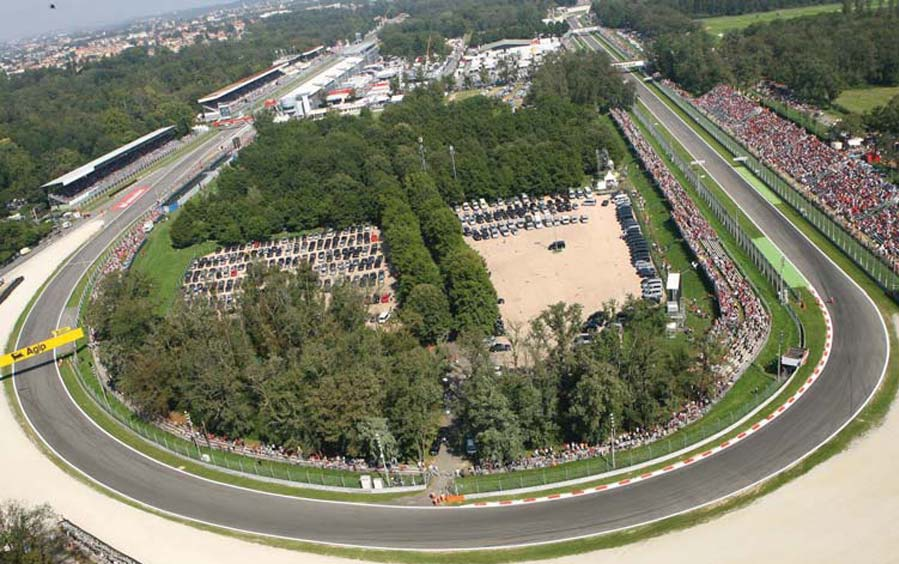

62

AUTODROMO NAZIONALE MONZA HISTORY

The Autodromo Nazionale Monza has been the third permanent installation built in the world after Brooklands in England (1907) and Indianapolis in America (1909). It has always been the most important Italianautodrome and one of the most prestigious places for motor events internationally.

Indeed, during its more than 90 years of activity, it has hosted 78 editions of the Italian Grand Prix, 40 edi- tions of the motorcycle Grand Prix of Nations and 37 editions of “1000 Kms di Monza” (Filippo Caracciolo Trophy) for Sport Prototype cars.

The construction of the Monza autodrome was decided in January 1922 by the Automobile Club of Milan to satisfy the request of the Italian car industry involved in sporting activities, and to celebrateThe 25th anniversary of the Club’s founding which happened, in an embryonic form, in 1897 (the official founding was in 1903).

The project was supported by the president of the Automobile Club of Milan senator Silvio Crespi and by its director Arturo Mercanti, who assigned the job to architect Alfredo Rosselli. Work began on May 15th 1922 and was completed in the record time of 110 days: 3500 workers were employed for the con- struction of the autodrome with 200 wagons, 30 lorries and a narrow-gauge railway 5 kilometres long.

The circuit included a high-speed loop 4.5 kilometres long featuring two banked curves linked by two straights, each 1070 metres long. The two curves lay on an enbankment rising 2.6 metres above the ground. These curves had a radius of 320 metres and made a theoretical top speed of 180-190 kilome- tres per hour possible. The road track was 5.5 kilometres long, with a maximum roadbed width of 12 metres. The two straights intersected on two levels in the Serraglio zone.

The public was received in the central grandstand (3000 seats), in six side stands entirely built of wood and masonry (1000 seats each), and in some stands along the track.

After the autodrome’s official opening on September 3rd 1922, with a race run with Voiturettes won by Pietro Bordino on a racing model Fiat 501, on September 10th the 2nd Italian Grand Prix took place, won again by Bordino on a Fiat 804. The 1st Italian Grand Prix had taken place the year before at the Montichiari circuit, near Brescia, still organized by the Automobile Club of Milan.

All the events were run on the full 10-kilometre track until 1928, when the Grand Prix was temporarily suspended for two years, due to the serious accident occured to Materassi (cars competed only in the Monza Grand Prix, run on the highspeed loop).

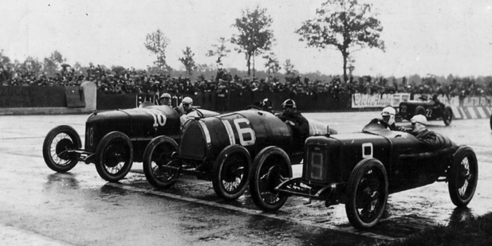

63

AUTODROMO NAZIONALE MONZA HISTORY

The Italian Grand Prix was run again in 1931 on the so-called “Florio circuit” (6800 metres), which made use only of the road track and the banked curve on the south. The full circuit was used again in the fol- lowing two years.

From 1934 to 1938 an extensive program of modifications to the racing facilities was put into effect: two banked curves of “highspeed” were pulled down, the central straight was shifted westward and linked to the grandstand straight by two bends, called the “porphyry bends” due to the stone paving applied. Moreover, new pits and service buildings and a new grandstand were built. The new track measured 6300 metres and could be used only from 1948 when the autodrome resumed its activities after the war.

In 1955, the high-speed loop was put back in use. This track was 4250 metres long with banked curves with superelevation with slope increasing progressively to 80% in the top band. The curves were built on reinforced concrete structures instead of on an earth enbankment as originally, and were calculated for theoretical top speeds of approx. 285 kilometres per hour. The road track’s length was reduced to 5750 metres and the two “porphyry” bends were replaced by a curve with a single pitch that was called the “parabolic” due to its increasing radius toward the exit. Otherimprovements and enlargements were made to the service buildings.

In 1959, a track link was created connecting the grandstand straight with the central straight. This link, togetherwith the “parabolic” curve, gave rise to the Junior track (2405 metres long). In 1961, a vast plan for safety works was put into effect, including the adoption of reinforced fences and guard-rails. After the construction, in 1962, of the pavilion to house motor cars and vehicles of historical interest, in 1963 the pit area was entirely rebuilt according to more rational and modern standards, with a new 3-storey building for race control officials.

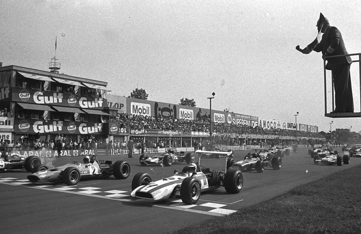

64

AUTODROMO NAZIONALE MONZA HISTORY

To reduce the very high and dangerous speeds of Formula One cars, two chicanes were built in 1972; the first was located on the grandstand straight , while the second was situated at the entrance of the “Ascari” curve. These chicanes were modified between 1974 and 1976 and became proper variants. At the same time, another variant at the entrance of the first Lesmo curve was built. These modifica- tions brought the length of the circuit to 5800 metres.

Between 1989 and 1990, the pit zone was completely renewed, by building a two-storey structure mea- suring approx. 196 metres in length and about 13 metres in width, occupying about the same space as the old pits. On the ground floor the pit system is made up of 48 modular units, each having a 4 m fron- tage, that can be combined, thanks to movable wall panels, to form 16 pits of 3 units each, suitable for 16 Formula 1 two-car teams. The first floor is occupied by offices and hospitality rooms, as well as by a welcoming and rational press room suitable to accomodate almost 550 journalists, with rooms for tele- phone and fax services. The second terraced-floor is reserved as hospitality area. Avant-guarde systems for the management of the internal services of the autodrome and for the gathering and tran- smission of track-data have also been realised.

In 1995, moreover, to comply with the security standards set by FIA, some modifications were made to various parts of the track (“Grande” curve, Roggia variant, Lesmo curves), without drastically changing the structure of the track, leaving the lay-out practically unchanged. The “Grande” curve and the whole section of the Lesmo curves were moved back (with the contemporary reduction of their radii) to crea- te bigger run-off spaces which have now changed , in the most critical points, from 50 m to 118 m and from 20 m to 60 m, respectively. The Roggia variant design and radii have not been modified, but it has been anticipated by approx. 50 metres to put it in a position with bigger run-off spaces. The total length of the track has now been reduced to 5770 metres.

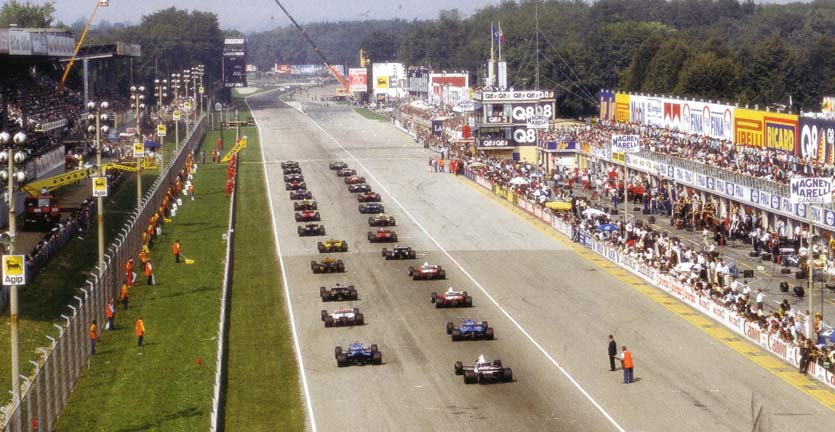

65

AUTODROMO NAZIONALE MONZA HISTORY

In 1998 the finish line had been withdrawn of 250 meters circa. Now it’s situated near the entrance of the pit lane. Among the most recent improvements, there also is the construction of a new medical centre (larger and modern and located in an area easily accessible from the paddock).

The last modification of the track in order of time dates back to summer 2000 when the First Variante’s and Roggia Variante’strack sections have been redesigned to increase the safety according to drivers’ and F.I.A. demands. The First Variante,above all, which was made up by a double ess with left-right-left curves, had been trasformed in a double right-left curve morenarrow and slow that constrains the drivers to hold a speed of about 70-80 km/h instead of about 110 hold previously. The track had been brought again along the historic axis, while the left part of the asphalt is now used as a safety area.

Of minor importance is the modification worked on the Roggia Variante, the streght of which, between the entrance and the exit, is been lengthened of 10 meters. These two operations have increased the lenght of the Stradale Track from 5.770 to current 5.793 meters. Concerning the logistic and services structures, in autumn 2001 has begun a big reconstructive and contructive works of buildings.

The pit building has been lenghtened of 50 metres on the south flank to increase the number of the pits from 48 to 60 and to create new areas for facilities and race control. Now the pit building is 254,30 metres long. A new paddock for support races, with track acces on Rettilineo centrale, has been built next to the F 1 paddock.

Near the nord flank of the pit building has been constructed a new three floor building in which we find hospitalities, offices, data processing center and catering services. Even the podium is new and now it is situated over the pit wall, connected by a platform to the first floor of the pit building.

Other modifications regard the 4 metres enlargement of the pit lane and the new location of the “villaggio”, with shops, bar, bank, now situated in the ex festival pavilion. The old area of “villaggio” is now part of the paddock. The pit building was completed with the enlargement towards the paddock from 12,90 metres to 21,50 metres.

The High-Speed Track

In 1955 it was decided to undertake works which would transform the entire installation, making it more func- tional. A circuit with total length of 10 kilometres was put back in use including, like the original 1922 plan, a road section and high-speed section meeting the new competition requirements and suitable for record attempts. A loop with two banked curves was built following the 1922 plan, except that the track was set back on the south side to allow for an underpass and there was an intersection with the road circuit similar to the original one. The new high- speed track was 4,250 metres long and was built on reinforced concrete structures instead of an earth embankment as originally. The two big banked cur- ves with radii of 320 metres and superelevation with slope increasing progressively to 80% in the top band were calculated for theoretical top speeds of approximately 285 kilometres per hour.

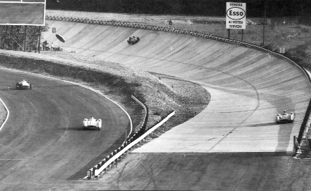

66

AUTODROMO NAZIONALE MONZA HISTORY

The 1955 e 1956 Italian Grand Prix were run on the full 10-km track and they were won respectively by Fangio on Mercedes and Moss on Maserati, the last driver with an average speed of 208.787 km/h.

In 1960 and 1961, the Italian Grand Prix was again run on the full 10-km track, and both editions were won by Phil Hill on Ferrari at an average speed of 212.534 km/h when using a 2.500 cc car and of 209.387 km/h when using a 1.500 cc car.

The high-speed track, in addition to numerous record attempts by cars and motorcycles, was used in 1957 and 1958 for the Monza 500 Miles race open to Indianapolis Formula cars and counting for award of the Two Worlds Trophy offered as prize by the Monza City Administration, a first experiment in bringing to Europe the famous American champions with their powerful single-seaters.

The tragic 1961 Italian Grand Prix, run on the full 10-kilometres circuit and saddened by the fatal accident that cost the life, at the entrance to the "Parabolic" curve, of von Trips on a Ferrari and of eleven spectators, mar- ked the end of the use of the high-speed track for Grand Prix single-seaters. But it was used for the Monza 1,000 Km, reserved for Sports, Prototype and Grand Touring categories, from 1965 to 1969.

Recently the High Speed Track has been object of conservative restoration enabling the visit of the public and the transit of cars: during 2016, for example, Mille Miglia historic vehicles entered the banking.

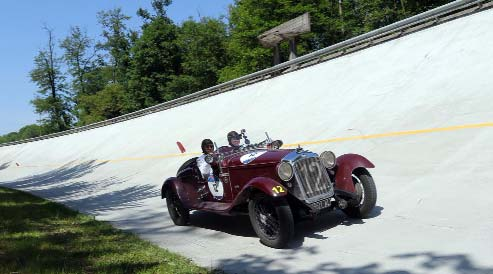

67

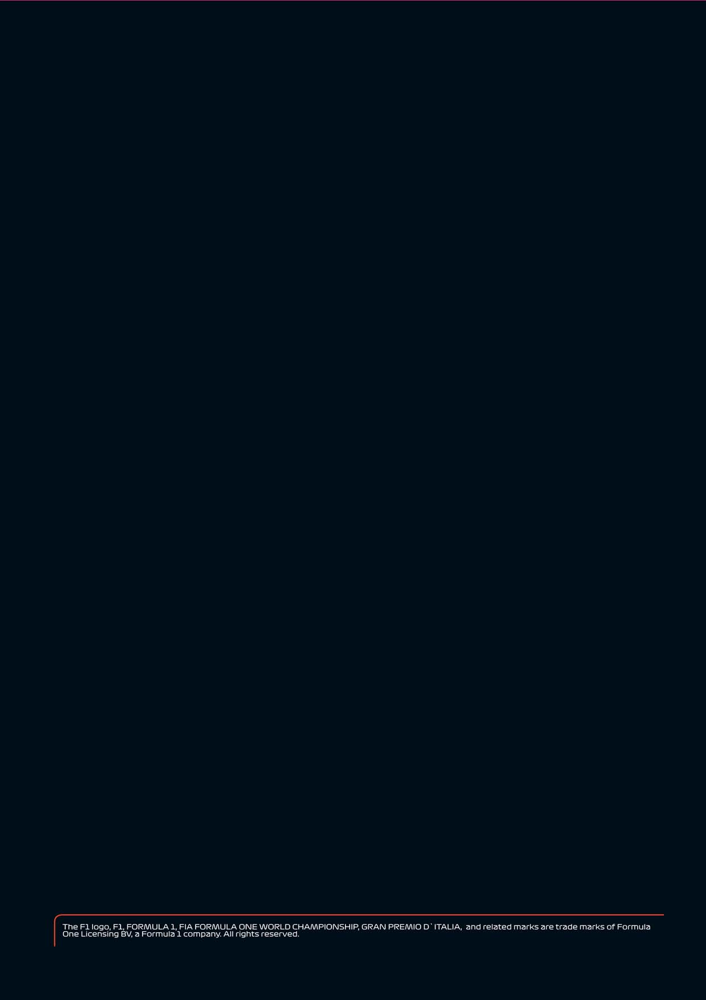
