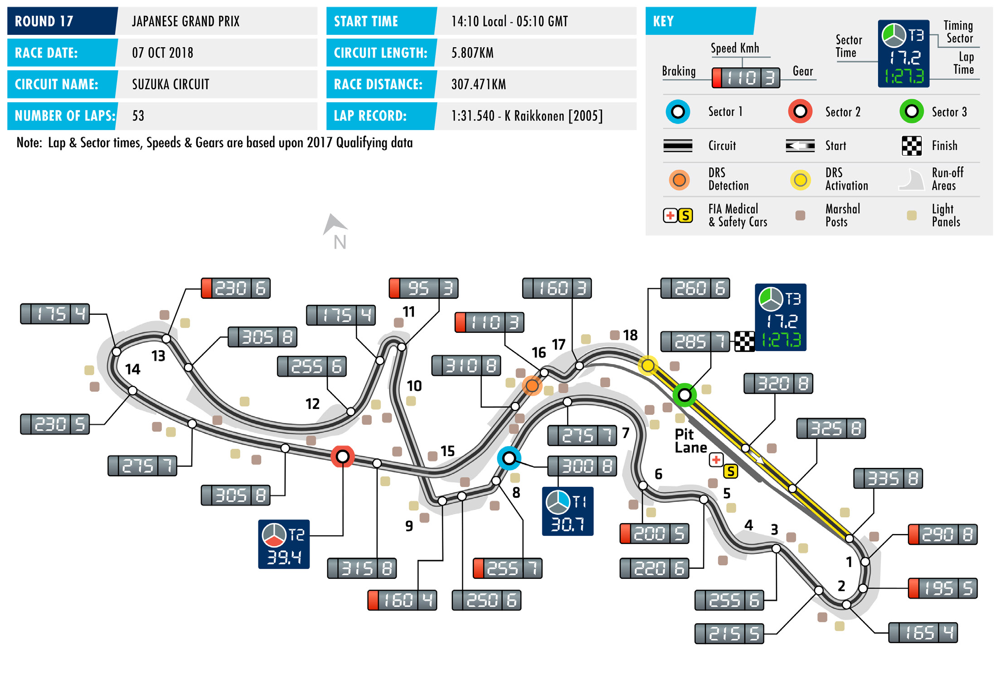
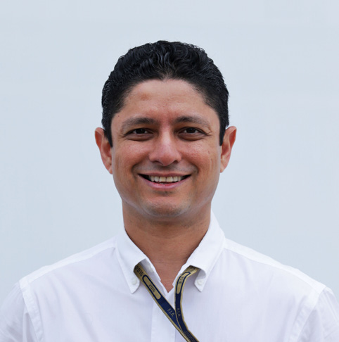
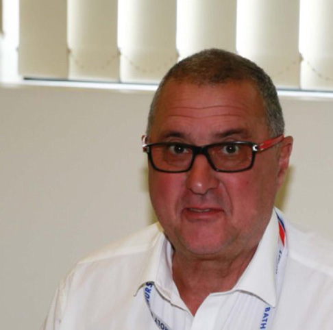

2018 JAPANESE GRAND PRIX

05 – 07 October 2018

After a tense and intriguing battle by the Black Sea in Sochi, SUZUKA INTERNATIONAL

Formula 1 is back in action just a week later as teams and RACING COURSE

drivers head to legendary Suzuka for Round 17 of the 2018 FIA Length of lap: 5.807km Formula One World Championship: the Japanese Grand Prix. Lap record:

A favourite of fans and F1 personnel alike, Suzuka, which is this 1:31.540 (Kimi Räikkönen, McLaren, 2005) weekend celebrating hosting its 30th FIA Formula 1 race, is one of Start line/finish line offset: the sport’s classics circuits, renowned for the exacting nature of its 0.300km layout, which tests drivers and engineers in equal measure. Total number of race laps: 53 The figure-of-eight circuit features every kind of corner. From Total race distance: the precision required to perfectly thread a car through the first 307.471km sector’s intricate ‘Esses’, where balance is at a premium, to the risk Pitlane speed limits: and reward nature of the braking zones for the Degner curves, and 80km/h in practice, qualifying, making the most of the long high-G arc of the Spoon Curve and the and the race

flat out blast of 130R, stitching together a flawless lap of Suzuka is

on the season’s great challenges for drivers. CIRCUIT NOTES

The circuit is no less taxing for teams and the fast and flowing ► New double kerbs have been installed on the exit of Turns 13 nature of the layout – especially through sections such as the and 14. ‘Esses’, where rapid changes of direction put the accent on good ► Tyres, with tube inserts, and balance – makes arriving at the perfect set-up a tricky task. Suzuka additional conveyor belts have is also tough on tyres, with the many fast corners putting high been installed in sections of the lateral loads though the rubber. To cope with these demands, tyre barriers around the outside of tyre supplier Pirelli is bringing its medium, soft and supersoft Turns 2, 5, 7, 8 and 15.

compounds to Japan this weekend. DRS ZONES

Victory in Russia for Lewis Hamilton means that the Mercedes ► There will be just one DRS zone

driver arrives in Japan with a commanding 50-point’ Drivers’ at Suzuka, located on the main straight. The detection point championship lead over closest rival Sebastian Vettel. The Ferrari is 50m before Turn 16 and the man will be hoping for a reversal of recent fortunes and his four activation point is 100m before previous wins in Suzuka will give him cause to believe that feat can the control line.

be accomplished this weekend. Hamilton, though, has three wins

to his credit at this track, while Mercedes, who extended their

Constructors’ title lead over the Scuderia to 53 points in Russia, can

point to four straight hybrid era wins at this track as evidence that

the road to victory at this 30th F1 race in Suzuka should be lined

with silver. A fascinating battle awaits.

FAST FACTS

► This is the 34th Japanese Grand Prix, and venues. The first of Hamilton’s four wins ► Alonso is this weekend set to take sole the 30th to take place at Suzuka. The race in Japan was scored at 2007 at Fuji, with ownership of second place on the list of debuted at the Fuji Speedway in 1976 McLaren, while the others came at Suzuka drivers with the most F1 starts. Sunday and hosted a second edition in 1977 in 2014, 2015 and 2017, with Mercedes. will be the 307th F1 start and will move before dropping off the schedule for a Alonso won at Suzuka in 2006 and then at him one ahead of Michael Schumacher decade. The race returned in 1987 at Fuji in 2008, both with Renault. and Jenson Button. Rubens Barrichello Suzuka and save for a brief spell at Fuji in holds the record, with 322 starts. 2007 and 2008, it has been staged at the ► Apart from Hamilton, Vettel and Alonso, Mie prefecture circuit each year since. Kimi Räikkönen is the only other current ► Alessandro Nannini is the only driver to driver with a Japanese Grand Prix win take a maiden F1 win at the Japanese ► Michael Schumacher is the most to his name. The Finn won in 2005 for Grand Prix. However, five drivers have successful driver at the Japanese Grand McLaren. scored their maiden podium finish at this Prix with six victories, winning for race: Roberto Moreno and Aguri Suzuki Benetton in 1995 and Ferrari in 1997, ► Michael Schumacher also holds the in 1990, Mika Häkkinen in 1993, Heikki 2000, 2001, 2002 and 2004. Second record for Japanese GP pole positions Kovalainen in 2007 and Kamui Kobayashi on the list are current drivers Sebastian with eight. It’s not only a Japan and in 2012. Only three Japanese drivers have Vettel and Lewis Hamilton, both of Suzuka record but also a joint record scored podium finishes in F1: Suzuki and whom have four Japanese GP wins. for most poles for a driver at any grand Kobayashi at their home race and Takuma prix. Schumacher shares the record with Sato who finished third at the 2004 US GP. ► McLaren are the most successful team Ayrton Senna who was on pole eight at the Japanese Grand Prix with nine times at the San Marino Grand Prix. ► In all, 20 Japanese drivers have made F1 victories. Two of those victories are, appearances, with 17 making grand prix however, at Fuji, James Hunt’s 1977 win ► Statistically, pole position is not crucial for starts. The most prolific is Ukyo Katayama at the track being scored 30 years prior victory at Suzuka. In its 29 grands prix to who made 94 starts between his 1992 to Hamilton’s. At Suzuka McLaren are tied date, the man on pole position has won debut in South Africa and his final race, with Ferrari on seven wins each. 14 times. Second position on the grid has the 1997 European Grand Prix. Across yielded victory 11 times. Only Räikkönen those six season he scored five points, ► Hamilton and Fernando Alonso are the has won from further back than sixth on finishing fifth at the Brazilian and San only drivers to have scored Japanese the grid. He scored his 2005 victory from Marino races in 1994 and sixth at the Grand Prix victories at two different a starting place of P17. British Grand Prix in the same year.

RACE STEWARDS BIOGRAPHIES

NISH SHETTY

FIA STEWARD AND MEMBER OF THE FIA INTERNATIONAL COURT OF APPEAL

Nish Shetty sits on the FIA International Court of Appeal as a judge and is a permanent member of the National Court of Appeal (Singapore). He is also Chairman of the Disciplinary Commission of the Singapore Motor Sports Association and a national steward of the Singapore Grand Prix. Shetty has assisted the Singapore Motor Sports Association for many years as a legal advisor and committee member. In addition to being involved in the Singapore Grand Prix, Shetty has acted as a steward in the Singapore Karting Championship. Away from motor sport, he is a Partner and Head of International Arbitration and Dispute Resolution, South East Asia at global law firm Clifford Chance.

STEVE CHOPPING

FORMER VICE PRESIDENT OF THE CONFEDERATION OF AUSTRALIAN MOTOR SPORT (CAMS), CHAIRMAN CAMS JUDICIAL ADVISORY COMMITTEE, CHAIRMAN NATIONAL STEWARDS PANEL, AUSTRALIAN CHAMPIONSHIP STEWARDS COACH (CAMS)

Steven Chopping competed as a driver in various karting, Formula Ford, Australian Formula 2, Sports and Production Car competitions from the early 1970s until 1990. He was a steward at the Australian Rally Championship from 1997-2004 and Chairman of the Stewards at the Australian Production Car Rally Championship from 2001-2004. He has been a permanent steward at the V8 Supercar Championship in Australia since 2004, national steward at the Australian Grand Prix from 2005 and continues to serve as Chairman of the National Stewards Panel, Supercars Stewards Panel, Judicial Advisory Committee, and as a Member of the Australian Rally Championship Stewards Panel. In 2018 he was appointed a Member of the Order of Australia (AM) for his services to motor sport.

TOM KRISTENSEN

NINE TIMES LE MANS WINNER, GERMAN F3 AND JAPANESE F3 CHAMPION (1991 AND 1993) ALMS CHAMPION (2001), WEC CHAMPION (2013) PRESIDENT OF THE FIA DRIVERS’ COMMISSION, FIA WORLD MOTOR SPORT COUNCIL MEMBER

Denmark’s Tom Kristensen is the most successful driver in the history of the Le Mans 24-Hour race having won the endurance event nine times before retiring from competition in November 2014. – Add a part on the 12 Hours of Sebring as he won it 6 times (record). Kristensen’s oustanding career saw him race in single-seaters, touring cars as well as testing in Formula One. However, it is for his achievements in sportscars that he is correctly most lauded. His first Le Mans win came in 1997, driving for the Joest Racing team. After two years competing with BMW, he rejoined Joest, now racing as Audi Sport Team Joest, in 2000, winning three Le Mans 24-Hours in succession with the team. He won again with Bentley in 2003 before returning to the wheel of Audi machines to win in 2004-’05, 2008 and 2013. In 2013 he also won the FIA World Endurance Championship title.

2018 FIA Formula One World Championship

DRIVERS’ CHAMPIONSHIP STANDINGS

NAJIABREZA AILARTSUA EROPAGNIS IBAHD YNAMREG YRAGNUH STNIOP NIARHAB OCANOM ADANAC AIRTSUA MUIGLEB ECNARF OCIXEM ANIHC AISSUR NAPAJ LIZARB NIAPS YLATI ASU UBA BG

| 18 2 | 15 3 | 12 4 | 25 1 | 25 1 | 15 3 | 10 5 | 25 1 | NC | 18 2 | 25 1 | 25 1 | 18 2 | 25 1 | 25 1 | 25 1 |
| --- | --- | --- | --- | --- | --- | --- | --- | --- | --- | --- | --- | --- | --- | --- | --- |
| 25 1 | 25 1 | 4 8 | 12 4 | 12 4 | 18 2 | 25 1 | 10 5 | 15 3 | 25 1 | NC | 18 2 | 25 1 | 12 4 | 15 3 | 15 3 |
| 4 8 | 18 2 | 18 2 | 14 | 18 2 | 10 5 | 18 2 | 6 7 | NC | 12 4 | 18 2 | 10 5 | 12 4 | 15 3 | 12 4 | 18 2 |
| 15 3 | NC | 15 3 | 18 2 | NC | 12 4 | 8 6 | 15 3 | 18 2 | 15 3 | 15 3 | 15 3 | NC | 18 2 | 10 5 | 12 4 |
| 8 6 | NC | 10 5 | NC | 15 3 | 2 9 | 15 3 | 18 2 | 25 1 | 15 | 12 4 | NC | 15 3 | 10 5 | 18 2 | 10 5 |
| 12 4 | NC | 25 1 | NC | 10 5 | 25 1 | 12 4 | 12 4 | NC | 10 5 | NC | 12 4 | NC | NC | 8 6 | 8 6 |
| NC | 10 5 | 1 10 | 13 | 8 6 | 13 | 13 | 8 6 | 10 5 | 2 9 | 11 | 6 7 | 4 8 | 16 | 18 | 4 8 |
| 6 7 | 8 6 | 8 6 | NC | NC | 4 8 | 6 7 | 2 9 | NC | 8 6 | 10 5 | 12 | NC | 13 | 1 10 | 12 |
| 10 5 | 6 7 | 6 7 | 6 7 | 4 8 | NC | NC | 16 | 4 8 | 4 8 | 16 | 4 8 | NC | NC | 6 7 | 14 |
| 11 | 16 | 12 | 15 3 | 2 9 | 12 | 14 | NC | 6 7 | 1 10 | 6 7 | 14 | 10 5 | 6 7 | 16 | 1 10 |
| 12 | 1 10 | 11 | NC | NC | 8 6 | 2 9 | NC | 8 6 | 6 7 | 4 8 | 13 | 8 6 | 8 6 | NC | 2 9 |
| 1 10 | 11 | 2 9 | 10 5 | 6 7 | 1 10 | 4 8 | 4 8 | 12 | NC | 12 | 2 9 | 11 | 4 8 | 4 8 | 17 |
| NC | 12 4 | 18 | 12 | NC | 6 7 | 11 | NC | 11 | 13 | 14 | 8 6 | 2 9 | 14 | 13 | NC |
| NC | 13 | 17 | NC | NC | 15 | 12 | 11 | 12 4 | NC | 8 6 | 1 10 | 6 7 | DQ | 15 | 11 |
| 13 | 12 | 19 | 8 6 | 1 10 | 18 | 1 10 | 1 10 | 2 9 | NC | 15 | NC | NC | 11 | 2 9 | 6 7 |
| 2 9 | 4 8 | 13 | 2 9 | NC | 14 | 16 | 12 | 15 | 11 | 13 | NC | 15 | 12 | 12 | 16 |
| 14 | 14 | 14 | 4 8 | 11 | 17 | NC | 17 | 14 | 12 | NC | 17 | 13 | 2 9 | 14 | 15 |
| NC | 2 9 | 16 | 11 | 13 | 11 | 15 | 13 | 1 10 | NC | 2 9 | 15 | 1 10 | 15 | 11 | 13 |
| 15 | 17 | 20 | 1 10 | 12 | 19 | NC | 14 | NC | NC | 1 10 | 11 | 14 | NC | 17 | NC |
| NC | 15 | 15 | NC | 14 | 16 | 17 | 15 | 13 | 14 | NC | 16 | 12 | 1 10 | 19 | 18 |

1 L. HAMILTON 306

2 S. VETTEL 256

3 V. BOTTAS 189

4 K. RÄIKKÖNEN 186

5 M. VERSTAPPEN 158

6 D. RICCIARDO 134

7 K. MAGNUSSEN 53

8 N. HÜLKENBERG 53

9 F. ALONSO 50

10 S. PÉREZ 47

11 E. OCON 47

12 C. SAINZ 38

13 P. GASLY 28

14 R. GROSJEAN 27

15 C. LECLERC 21

16 S. VANDOORNE 8

17 L. STROLL 6

18 M. ERICSSON 6

B. HARTLEY 2 19

S. SIROTKIN 1 20

2018 FIA Formula One World Championship

CONSTRUCTORS’ CHAMPIONSHIP STANDINGS

NAJIABREZA AILARTSUA EROPAGNIS IBAHD YNAMREG YRAGNUH STNIOP NIARHAB OCANOM ADANAC AIRTSUA MUIGLEB ECNARF OCIXEM ANIHC AISSUR NAPAJ LIZARB NIAPS YLATI ASU UBA BG

| 22 2 8 | 33 2 3 | 30 2 4 | 25 1 13 | 43 1 2 | 25 3 5 | 28 2 5 | 31 1 7 | NC NC | 30 2 4 | 43 1 2 | 35 1 5 | 30 2 4 | 40 1 3 | 37 14 | 43 1 2 |
| --- | --- | --- | --- | --- | --- | --- | --- | --- | --- | --- | --- | --- | --- | --- | --- |
| 40 1 3 | 25 1 NC | 19 3 8 | 30 2 4 | 12 4 NC | 30 2 4 | 33 1 6 | 25 3 5 | 33 2 3 | 40 1 3 | 15 3 NC | 33 2 3 | 25 1 NC | 30 2 4 | 25 35 | 27 3 4 |
| 20 4 6 | NC NC | 35 1 5 | NC NC | 25 15 10 | 27 1 9 | 27 3 4 | 30 2 4 | 25 1 NC | 10 5 NC | 12 4 NC | 12 4 NC | 15 3 NC | 10 5 NC | 26 26 | 18 5 6 |
| 7 7 10 | 8 6 11 | 10 6 9 | 10 5 NC | 6 7 NC | 5 8 10 | 10 7 8 | 6 8 9 | NC NC | 8 6 NC | 10 5 12 | 2 9 12 | 11 NC | 4 8 13 | 5 8 10 | 12 17 |
| NC NC | 10 5 13 | 1 10 17 | 13 NC | 8 6 NC | 13 15 | 12 13 | 8 6 11 | 22 4 5 | 2 9 NC | 8 6 11 | 7 7 10 | 10 7 8 | 16 DQ | 15 18 | 4 8 11 |
| 12 5 9 | 10 7 8 | 6 7 13 | 8 7 9 | 4 8 NC | 14 NC | 16 NC | 12 16 | 4 8 15 | 4 8 11 | 13 16 | 4 8 NC | 15 NC | 12 NC | 6 7 12 | 14 16 |
|  |  |  |  |  |  |  |  |  |  |  |  | 18 5 6 | 14 6 7 | 16 NC | 3 9 10 |
| 15 NC | 12 4 17 | 18 20 | 1 10 12 | 12 NC | 6 7 19 | 11 NC | 14 NC | 11 NC | 13 NC | 1 10 14 | 8 6 11 | 2 9 14 | 14 NC | 13 17 | NC NC |
| 13 NC | 2 9 12 | 16 19 | 8 6 11 | 1 10 13 | 11 18 | 1 10 15 | 1 10 13 | 3 9 10 | NC NC | 2 9 15 | 15 NC | 1 10 NC | 11 15 | 2 9 11 | 6 7 13 |
| 14 NC | 14 15 | 14 15 | 4 8 NC | 11 14 | 16 17 | 17 NC | 15 17 | 13 14 | 12 14 | NC NC | 16 17 | 12 13 | 3 9 10 | 14 19 | 15 18 |
| 11 12 | 10 16 | 11 12 | 3 NC | 9 NC | 6 12 | 9 14 | NC NC | 6 7 | 7 10 | 7 8 | 13 14 |  |  |  |  |

1 MERCEDES AMG 495 PETRONAS MOTORSPORT

442 2 SCUDERIA FERRARI

3 ASTON MARTIN 292 RED BULL RACING

RENAULT SPORT 91 4 FORMULA ONE TEAM

80 5 HAAS F1 TEAM

58 6 MCLAREN F1 TEAM

RACING POINT 35 7 FORCE INDIA F1TEAM

RED BULL 30 8 TORO ROSSO HONDA

ALFA ROMEO 27 9 SAUBER F1 TEAM

WILLIAMS MARTINI 7 10 RACING

SAHARA FORCE INDIA 0 EX F1 TEAM

FORMULA ONE TIMETABLE & FIA MEDIA SCHEDULE

THURSDAY

Press conference 1500

FRIDAY

Practice session 1 1000-1130 Press conference 1200

Practice session 2 1400-1530

SATURDAY

Practice session 3 1200-1300 Qualifying 1500-1600 Followed by track interviews, press conference

SUNDAY

Drivers’ Parade 1230 Race 1410 Followed by parc fermé interviews and press conference

ADDITIONAL MEDIA OPPORTUNITIES

QUALIFYING

All drivers eliminated in Q1 or Q2 will be available for media interviews immediately after the end of each session, as will drivers who participated in Q3, but who are not required for the post-qualifying press conference. The TV Pen is located in front of the entrance to race control.

RACE

Any driver retiring before the end of the race will be made available at the TV pen interview area. In addition, during the race every team will make available at least one senior spokesperson for interview by officially accredited TV crews. A list of those nominated will be made available in the media centre.

FIA COMMUNICATIONS DEPARTMENT press@fia.com T +33 1 43 12 58 15
