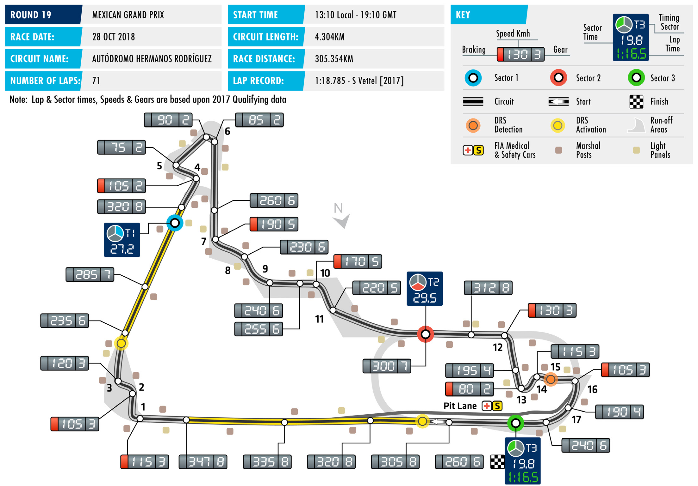
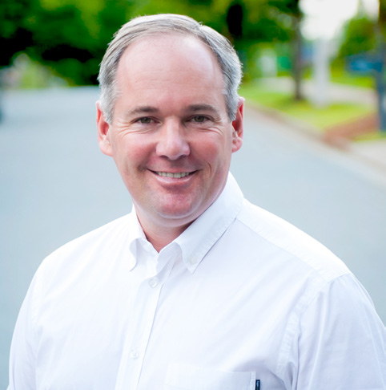

2018 MEXICAN GRAND PRIX

26 – 28 October 2018

Hot on the heels of an enthralling US Grand Prix that saw AUTÓDROMO HERMANOS

Ferrari’s Kimi Räikkönen score a hugely popular first win in RODRÍGUEZ

more than five years, the FIA Formula One World Championship Length of lap: 4.304km Lap record: 1:18.785 (Sebastian this week continues in the Americas, with Round 19 taking place Vettel, Ferrari, 2017) at Mexico City’s Autódromo Hermanos Rodríguez, home of the Start line/finish line offset: 0.230km Mexican Grand Prix. Total number of race laps: 71

Situated almost 2,300m above sea level, the circuit is F1’s highest Total race distance: 305.354km

altitude track, some 1,500m higher than the next on the list, Pitlane speed limits: 80km/h in practice, qualifying, Brazil’s Interlagos, and this presents a particular set of challenges. and the race At this altitude the thinner air leads to lower levels of downforce CIRCUIT NOTES and thus teams are able to bring higher downforce packages to ► Other than routine maintenance this high-speed circuit where normally the opposite might be the no changes of significance have case. There’s less oxygen going to the engine, too, although the been made. negative impact of this on ICE performance is mitigated by the DRS ZONE effect of turbo. However, in order to create the necessary pressure ► There will be two DRS zones in the turbo has to spin faster, and thus this race is particularly Mexico, sharing a detection point, demanding on that element of the power unit. located at the exit of Turn 15. The first activation point will be 323m With a slippery and smooth track surface leading to low rates after Turn 17 and the second will

of tyre wear and degradation, supplier Pirelli is bringing the be 116m after Turn 3.

softest tyres in its range to Mexico – the Supersoft, Ultrasoft and

Hypersoft compounds. In light of the track characteristics, teams

have prioritised the pink-banded hypersoft, with Renault and

Sauber leading the way. Both teams’ drivers have opted for 10

sets of the softest compound, while the drivers of championship

leaders Mercedes and Ferrari have chosen eight sets of Hypersofts.

A third-place finish for Lewis Hamilton, allied to title rival Sebastian

Vettel’s fourth place in Austin a week ago, means that the Drivers’

Championship battle continues this weekend in Mexico. Here, at

the circuit where he wrapped up his fourth title last year, Hamilton

can take his fifth crown, matching the total of F1 legend Juan

Manuel Fangio. In order to do so, Hamilton needs only to finish

this race in seventh place or better, regardless of where Vettel

places. The Constructors’ Championship remains more open, with

Mercedes holding a 66-point advantage over Ferrari with three

rounds remaining.

FAST FACTS

► This will be the 19th World Championship guarantee him the crown. Further back ► As with victory, pole position at the latest Mexican Grand Prix. The race has been in time, John Surtees took his sole title in version of the Autódromo Hermanos part of the F1 calendar in three distinct Mexico in 1964 with Ferrari, Brabham’s Rodríguez has been taken by a different phases: from 1963-1970; from 1986- Denny Hulme took his only title win driver at each of the three events held so 1992, while this latest iteration of the here in 1967, while Graham Hill won his far. Nico Rosberg won from pole in 2015, race joined the schedule in 2015. All of second F1 title here in 1968 with Lotus. as did Hamilton in 2016. Sebastian Vettel the races have taken place at the circuit began last year’s race from pole but that began life as the Magdalena Mixhuca ► In winning the United States Grand Prix finished in fourth place. circuit and was later re-christened the last weekend, Kimi Räikkönen now has Autódromo Hermanos Rodríguez. the most wins of any Finnish driver in ► Fastest lap on the current layout has also Formula One. Räikkönen’s COTA victory been taken by three different drivers. ► Three drivers can claim multiple wins in was his 21st in F1, one more than Mika Rosberg ran fastest in the 2015 race, Mexico, with Jim Clark, Alain Prost and Häkkinen. Keke Rosberg is next on the Daniel Ricciardo was fastest in 2016 and Nigel Mansell all standing as the most list with five wins. Räikkönen’s win came Vettel set the current record last year successful drivers at this race. Clark won after a wait of 113 races, the longest in F1 with a time of 1:18.785, set on lap 68 at in 1963 and 1967, Prost in 1988 and history. The record was previously held by an average speed of 196.666 km/h. 1990 and Mansell in 1987 and 1992. Riccardo Patrese who had to wait 99 races between his 1983 South African Grand ► Max Verstappen has led more laps of the ► The current layout has see a different Prix win and his victory at the 1990 San current configuration than any driver. winner each year since the race’s 2015 Marino Grand Prix. The Dutchman led every lap of the 2017 return. Nico Rosberg won the inaugural race on his way to his third career win. event on the new circuit in 2015, Lewis ► Lotus, McLaren and Williams are tied The only other drivers to have led laps on Hamilton was victorious in 2016 and as most successful constructor at the this current layout are Nico Rosberg (68), Max Verstappen won last year’s race. Mexican Grand Prix, with three wins each. Hamilton (62) and Vettel (12). Lotus’ victories were scored in 1963 and ► If Lewis Hamilton manages to wrap up 1967 with Clark and in 1968 with Graham ► Five drivers on the current grid have been his fifth F1 World Championship title Hill. McLaren won in 1969 with Denny classified in the top three here: Hamilton, on Sunday it will be the fifth F1 crown Hulme, in 1988 with Alain Prost and in Ricciardo, Räikkönen, Verstappen and sealed in Mexico City. Hamilton claimed 1989 with Aytron Senna. Williams won Valtteri Bottas. Hamilton and Bottas his fourth championship here last year, twice with Nigel Mansell, in 1987 and are the only men with multiple podium when a ninth-place finish was enough to 1992 and also in 1991 with Patrese. finishes, with two apiece.

RACE STEWARDS BIOGRAPHIES

DR GERD ENNSER

MEMBER OF THE DMSB’S EXECUTIVE COMMITTEE FOR AUTOMOBILE SPORT, FORMULA ONE AND DTM STEWARD

Dr Gerd Ennser has successfully combined his formal education in law with his passion for motor racing. While still active as a racing driver he began helping out with the management of his local motor sport club and since 2006 has been a permanent steward at every round of Germany’s DTM championship. Since 2010 he has also been a Formula One steward. Dr Ennser, who has worked as a judge, a prosecutor and in the legal department of an automotive- industry company, has also acted as a member of the steering committee of German motor sport body, the DMSB, since spring 2010, where he is responsible for automobile sport. In addition, Dr Ennser is a board member of the South Bavaria Section of ADAC, Germany’s biggest auto club.

TIM MAYER

FIA STEWARD, ORGANIZER OF THE WORLD CHAMPIONSHIPS IN THE USA

As the son of former McLaren founder Teddy Mayer, Tim Mayer grew up around motor sport. He organised IndyCar races internationally from 1992-98, aided the construction of several circuits, and produced international TV for multiple series. In 1998 he became CART’s Senior VP for Racing Operations then in 2003, Mayer became COO of IMSA, operating multiple series at all levels, including the American Le Mans Series. In 2009 he left IMSA, working independently for several US series and focusing on coordinating US motorsports with the FIA. He was elected an Independent Director of ACCUS and US FIA Delegate, responsible for World Championship events in the US. He Stewards the FIA’s F1, WEC and World RX championships as well as teaching and working on multiple commissions..

MIKA SALO

FORMER F1 DRIVER, MEMBER OF THE FIA SINGLE-SEATER COMMISSION

Finnish racer Mika Salo competed in over 100 grands prix between 1994-2002. After junior success in Britain and Japan, Salo made his Formula One debut for Lotus at the last two rounds of the 1994 season. Over the next eight years the Finn drove for Tyrrell, Arrows, BAR, Ferrari, Sauber and Toyota. He twice finished on the podium for Ferrari and scored points for Toyota in the Japanese manufacturer’s debut race. After calling time on his F1 career, Salo competed predominantly in sports cars, most notably racing in GT classes. He has GT2 victories at both Le Mans and Sebring to his name, and in 2007 won the GT class in ALMS. He also tried his hand in CART and Australian V8s. Salo is still a familiar face in the Formula 1 paddock, working extensively for Finnish TV among other roles.

2018 FIA Formula One World Championship

DRIVERS’ CHAMPIONSHIP STANDINGS

NAJIABREZA AILARTSUA EROPAGNIS IBAHD YNAMREG YRAGNUH STNIOP NIARHAB OCANOM ADANAC AIRTSUA MUIGLEB ECNARF OCIXEM ANIHC AISSUR NAPAJ LIZARB NIAPS YLATI ASU UBA BG

| 18 2 | 15 3 | 12 4 | 25 1 | 25 1 | 15 3 | 10 5 | 25 1 | NC | 18 2 | 25 1 | 25 1 | 18 2 | 25 1 | 25 1 | 25 1 | 25 1 | 15 3 |
| --- | --- | --- | --- | --- | --- | --- | --- | --- | --- | --- | --- | --- | --- | --- | --- | --- | --- |
| 25 1 | 25 1 | 4 8 | 12 4 | 12 4 | 18 2 | 25 1 | 10 5 | 15 3 | 25 1 | NC | 18 2 | 25 1 | 12 4 | 15 3 | 15 3 | 8 6 | 12 4 |
| 15 3 | NC | 15 3 | 18 2 | NC | 12 4 | 8 6 | 15 3 | 18 2 | 15 3 | 15 3 | 15 3 | NC | 18 2 | 10 5 | 12 4 | 10 5 | 25 1 |
| 4 8 | 18 2 | 18 2 | 14 | 18 2 | 10 5 | 18 2 | 6 7 | NC | 12 4 | 18 2 | 10 5 | 12 4 | 15 3 | 12 4 | 18 2 | 18 2 | 10 5 |
| 8 6 | NC | 10 5 | NC | 15 3 | 2 9 | 15 3 | 18 2 | 25 1 | 15 | 12 4 | NC | 15 3 | 10 5 | 18 2 | 10 5 | 15 3 | 18 2 |
| 12 4 | NC | 25 1 | NC | 10 5 | 25 1 | 12 4 | 12 4 | NC | 10 5 | NC | 12 4 | NC | NC | 8 6 | 8 6 | 12 4 | NC |
| 6 7 | 8 6 | 8 6 | NC | NC | 4 8 | 6 7 | 2 9 | NC | 8 6 | 10 5 | 12 | NC | 13 | 1 10 | 12 | NC | 8 6 |
| 11 | 16 | 12 | 15 3 | 2 9 | 12 | 14 | NC | 6 7 | 1 10 | 6 7 | 14 | 10 5 | 6 7 | 16 | 1 10 | 6 7 | 4 8 |
| NC | 10 5 | 1 10 | 13 | 8 6 | 13 | 13 | 8 6 | 10 5 | 2 9 | 11 | 6 7 | 4 8 | 16 | 18 | 4 8 | NC | DQ |
| 10 5 | 6 7 | 6 7 | 6 7 | 4 8 | NC | NC | 16 | 4 8 | 4 8 | 16 | 4 8 | NC | NC | 6 7 | 14 | 14 | NC |
| 12 | 1 10 | 11 | NC | NC | 8 6 | 2 9 | NC | 8 6 | 6 7 | 4 8 | 13 | 8 6 | 8 6 | NC | 2 9 | 2 9 | DQ |
| 1 10 | 11 | 2 9 | 10 5 | 6 7 | 1 10 | 4 8 | 4 8 | 12 | NC | 12 | 2 9 | 11 | 4 8 | 4 8 | 17 | 1 10 | 6 7 |
| NC | 13 | 17 | NC | NC | 15 | 12 | 11 | 12 4 | NC | 8 6 | 1 10 | 6 7 | DQ | 15 | 11 | 4 8 | NC |
| NC | 12 4 | 18 | 12 | NC | 6 7 | 11 | NC | 11 | 13 | 14 | 8 6 | 2 9 | 14 | 13 | NC | 11 | 12 |
| 13 | 12 | 19 | 8 6 | 1 10 | 18 | 1 10 | 1 10 | 2 9 | NC | 15 | NC | NC | 11 | 2 9 | 6 7 | NC | NC |
| 2 9 | 4 8 | 13 | 2 9 | NC | 14 | 16 | 12 | 15 | 11 | 13 | NC | 15 | 12 | 12 | 16 | 15 | 11 |
| NC | 2 9 | 16 | 11 | 13 | 11 | 15 | 13 | 1 10 | NC | 2 9 | 15 | 1 10 | 15 | 11 | 13 | 12 | 1 10 |
| 14 | 14 | 14 | 4 8 | 11 | 17 | NC | 17 | 14 | 12 | NC | 17 | 13 | 2 9 | 14 | 15 | 17 | 14 |
| 15 | 17 | 20 | 1 10 | 12 | 19 | NC | 14 | NC | NC | 1 10 | 11 | 14 | NC | 17 | NC | 13 | 2 9 |
| NC | 15 | 15 | NC | 14 | 16 | 17 | 15 | 13 | 14 | NC | 16 | 12 | 1 10 | 19 | 18 | 16 | 13 |

1 L. HAMILTON 346

2 S. VETTEL 276

3 K. RÄIKKÖNEN 221

4 V. BOTTAS 217

5 M. VERSTAPPEN 191

6 D. RICCIARDO 146

7 N. HÜLKENBERG 61

8 S. PÉREZ 57

9 K. MAGNUSSEN 53

10 F. ALONSO 50

11 E. OCON 49

12 C. SAINZ 45

13 R. GROSJEAN 31

14 P. GASLY 28

15 C. LECLERC 21

16 S. VANDOORNE 8

17 M. ERICSSON 7

18 L. STROLL 6

B. HARTLEY 4 19

S. SIROTKIN 1 20

2018 FIA Formula One World Championship

CONSTRUCTORS’ CHAMPIONSHIP STANDINGS

NAJIABREZA AILARTSUA EROPAGNIS IBAHD YNAMREG YRAGNUH STNIOP NIARHAB OCANOM ADANAC AIRTSUA MUIGLEB ECNARF OCIXEM ANIHC AISSUR NAPAJ LIZARB NIAPS YLATI ASU UBA BG

| 22 2 8 | 33 2 3 | 30 2 4 | 25 1 13 | 43 1 2 | 25 3 5 | 28 2 5 | 31 1 7 | NC NC | 30 2 4 | 43 1 2 | 35 1 5 | 30 2 4 | 40 1 3 | 37 14 | 43 1 2 | 43 1 2 | 25 3 5 |
| --- | --- | --- | --- | --- | --- | --- | --- | --- | --- | --- | --- | --- | --- | --- | --- | --- | --- |
| 40 1 3 | 25 1 NC | 19 3 8 | 30 2 4 | 12 4 NC | 30 2 4 | 33 1 6 | 25 3 5 | 33 2 3 | 40 1 3 | 15 3 NC | 33 2 3 | 25 1 NC | 30 2 4 | 25 35 | 27 3 4 | 18 5 6 | 37 1 4 |
| 20 4 6 | NC NC | 35 1 5 | NC NC | 25 15 10 | 27 1 9 | 27 3 4 | 30 2 4 | 25 1 NC | 10 5 NC | 12 4 NC | 12 4 NC | 15 3 NC | 10 5 NC | 26 26 | 18 5 6 | 27 3 4 | 18 2 NC |
| 7 7 10 | 8 6 11 | 10 6 9 | 10 5 NC | 6 7 NC | 5 8 10 | 10 7 8 | 6 8 9 | NC NC | 8 6 NC | 10 5 12 | 2 9 12 | 11 NC | 4 8 13 | 5 8 10 | 12 17 | 1 10 NC | 14 6 7 |
| NC NC | 10 5 13 | 1 10 17 | 13 NC | 8 6 NC | 13 15 | 12 13 | 8 6 11 | 22 4 5 | 2 9 NC | 8 6 11 | 7 7 10 | 10 7 8 | 16 DQ | 15 18 | 4 8 11 | 4 8 NC | NC DQ |
| 12 5 9 | 10 7 8 | 6 7 13 | 8 7 9 | 4 8 NC | 14 NC | 16 NC | 12 16 | 4 8 15 | 4 8 11 | 13 16 | 4 8 NC | 15 NC | 12 NC | 6 7 12 | 14 16 | 14 15 | 11 NC |
|  |  |  |  |  |  |  |  |  |  |  |  | 18 5 6 | 14 6 7 | 16 NC | 3 9 10 | 8 7 9 | 4 8 DQ |
| 15 NC | 12 4 17 | 18 20 | 1 10 12 | 12 NC | 6 7 19 | 11 NC | 14 NC | 11 NC | 13 NC | 1 10 14 | 8 6 11 | 2 9 14 | 14 NC | 13 17 | NC NC | 11 13 | 2 9 12 |
| 13 NC | 2 9 12 | 16 19 | 8 6 11 | 1 10 13 | 11 18 | 1 10 15 | 1 10 13 | 3 9 10 | NC NC | 2 9 15 | 15 NC | 1 10 NC | 11 15 | 2 9 11 | 6 7 13 | 12 NC | 1 10 NC |
| 14 NC | 14 15 | 14 15 | 4 8 NC | 11 14 | 16 17 | 17 NC | 15 17 | 13 14 | 12 14 | NC NC | 16 17 | 12 13 | 3 9 10 | 14 19 | 15 18 | 16 17 | 13 14 |
| 11 12 | 10 16 | 11 12 | 3 NC | 9 NC | 6 12 | 9 14 | NC NC | 6 7 | 7 10 | 7 8 | 13 14 |  |  |  |  |  |  |

1 MERCEDES AMG 563 PETRONAS MOTORSPORT

497 2 SCUDERIA FERRARI

3 ASTON MARTIN 337 RED BULL RACING

RENAULT SPORT 106 4 FORMULA ONE TEAM

84 5 HAAS F1 TEAM

58 6 MCLAREN F1 TEAM

RACING POINT 47 7 FORCE INDIA F1TEAM

RED BULL 32 8 TORO ROSSO HONDA

ALFA ROMEO 28 9 SAUBER F1 TEAM

WILLIAMS MARTINI 7 10 RACING

SAHARA FORCE INDIA 0 EX F1 TEAM

FORMULA ONE TIMETABLE & FIA MEDIA SCHEDULE

THURSDAY

Press conference 1100

FRIDAY

Practice session 1 1000-1130 Press conference 1200

Practice session 2 1400-1530

SATURDAY

Practice session 3 1000-1100 Qualifying 1300-1400 Followed by track interviews, press conference

SUNDAY

Drivers’ Parade 1130 Race 1310 Followed by parc fermé interviews and press conference

ADDITIONAL MEDIA OPPORTUNITIES

QUALIFYING

All drivers eliminated in Q1 or Q2 will be available for media interviews immediately after the end of each session, as will drivers who participated in Q3, but who are not required for the post-qualifying press conference. The TV Pen is located in front of the entrance to the media centre.

RACE

Any driver retiring before the end of the race will be made available at the TV pen interview area. In addition, during the race every team will make available at least one senior spokesperson for interview by officially accredited TV crews. A list of those nominated will be made available in the media centre.

FIA COMMUNICATIONS DEPARTMENT press@fia.com T +33 1 43 12 58 15
