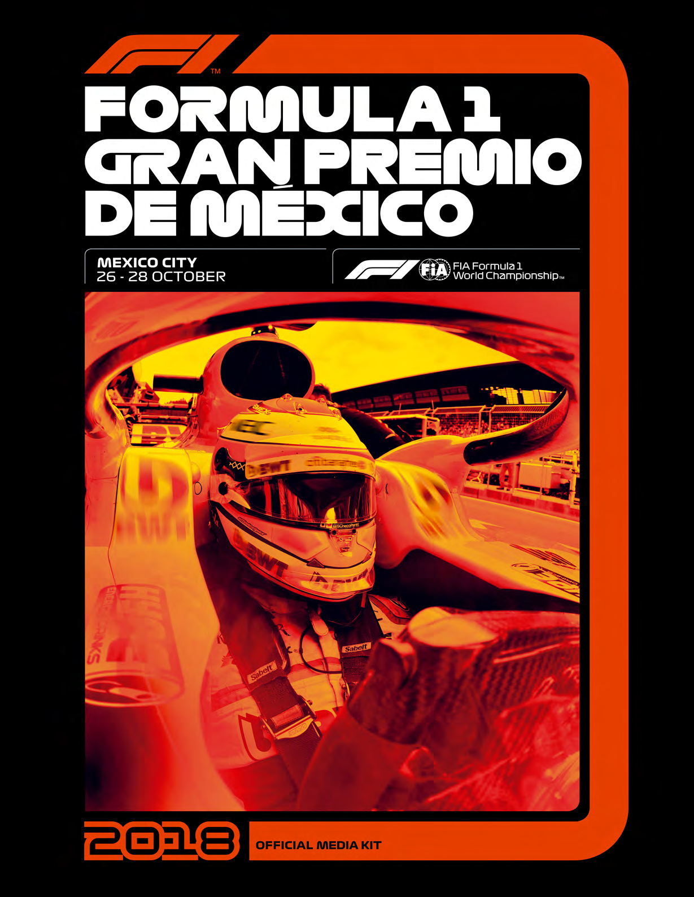

Official Formula 1® Media Kit

Official Formula 1® Media Kit

MEDIA GUIDE

03 WELCOME MESSAGE

04 MEDIA ACCREDITATION CENTRE AND MEDIA CENTRE Opening Hours Location Maps

06 MEDIA CENTRE Key Staff Facilities (IT • Photographic • Telecoms) Working in the Media Centre Operating Hours (Cafeteria)

10 PRESS CONFERENCE SCHEDULE

11 PHOTOGRAPHERS’ SHUTTLE BUS SCHEDULE

12 RACE TIMETABLE

14 2018 FIA FORMULA ONE™ WORLD CHAMPIONSHIP Entry List Calendar The 2018 Season at a glance Standings after round 18 (USA) (Drivers) Standings after round 18 (USA) (Constructors) Team & Driver Statistics Current Drivers’ Mexico Record

27 FORMULA 1 GRAN PREMIO DE MÉXICO 2018 Qualifying Race Classification Race review: ‘Still I Rise’ CHARLES, EL CHAMACO and the GENERAL Leclerc follows in famous footsteps IS THERE GOLD AT THE END OF THE RAINBOW? Pirelli’s colourful contribution to the F1 scene

36 2015 – 2016 - 2017 MEXICAN GRAND PRIX WINNERS / POLE POSITIONS / FASTEST LAPS

37 2018 SUPPORT RACE ENTRY LISTS Formula 4 La Carrera Panamericana Porsche Mobil 1 Supercup

43 USEFUL INFORMATION Airlines Rental cars Airport/Taxi companies

45 MAPS AND DIAGRAMS Corner names Corner numbers Service road Media Shuttle

Official Formula 1® Media Kit

¡BIENVENIDO A MÉXICO!

A warm welcome back to the Autódromo to ensure we give everyone the best experience we Hermanos Rodríguez! And for those of you joining us can, both at the circuit and also away from it. It is for the first time in Mexico City, we hope you enjoy easy to be so focused on the job travelling around our F1®ESTA here at the track and everything our the world that you only see your hotel room and the incredible city has to offer. Media Centre; however, Mexico City has so much to offer and I always urge you to take advantage of your On behalf of everyone at CIE, we would like to sincerely time away from the track, we are always here if you thank you for your continued support and your positive need recommendations. feedback. We always value your comments and will always try to improve. You know my door is always open With the above in mind, and particularly at this stage so please feel free to come and speak to me directly of the Championship, this year we have brought a with any comments or feedback. little bit of Mexico to the paddock to help you get to know more about our country and our culture. Over I cannot believe we are already in year four! Despite the the weekend you will find tacos, churros, a mezcal bar experience we have gathered over the past years, we and, of course, our own pop-up barbershop as part of still face each race as a new challenge that fires our our partnership with the Movember Foundation. We spirit to push the expectation from our fans and make encourage you to enjoy these different experiences this event one of the best races in the Championship. and to have fun. We are proud to be Mexican and our race is a fantastic opportunity to show the world what Mexico is and what My team and I wish you the very best – enjoy the we are capable of achieving. We know how lucky we race, enjoy our city and help us make this the best are to have this race and are completely committed to F1®ESTA yet! maximising this incredible platform.

Here at the Mexican Grand Prix, we like to do things RODRIGO SÁNCHEZ PERAZA differently and present a new, more modern approach National Press Officer to the promotion of Formula 1®. We go to great lengths Director of Marketing, Media & Public Relations

3

Official Formula 1® Media Kit

MEDIA ACCREDITATION CENTRE

AND MEDIA CENTRE

OPENING HOURS

MEDIA ACCREDITATION CENTRE

Wednesday 24 October 11:00 – 18:00 HRS

Thursday 25 October 08:00 – 18:00 HRS

Friday 26 October 08:00 – 16:00 HRS

Saturday 27 October 08:00 – 12 noon

Sunday 28 October 08:00 – 12 noon (National Press Only)

MEDIA CENTRE

Wednesday 24 October 12 noon – 20:00 HRS

Thursday 25 October 08:00 – 22:00 HRS

Friday 26 October 07:00 – 23:00 HRS

Saturday 27 October 07:00 – 23:00 HRS

Sunday 28 October 07:00 – Until last journalist leaves

4

Official Formula 1® Media Kit

MEDIA CENTRE

LOCATION

5

Official Formula 1® Media Kit

MEDIA CENTRE

KEY STAFF

FIA F1 HEAD OF COMMUNICATIONS AND MEDIA DELEGATE

MATTEO BONCIANI

FIA F1 DEPUTY MEDIA DELEGATE

PIERRE GUYONNET-DUPERAT pguyonnet@fia.com

NATIONAL PRESS OFFICER

RODRIGO SÁNCHEZ rsanchezp@cie.com.mx

COMMUNICATIONS MANAGER

FRANCISCO VELÁZQUEZ fvelazquezc@cie.com.mx

EDITORIAL MANAGER

STUART SYKES stuart@scotsport.com.au

MEDIA CENTRE MANAGER

ROB VAN LEEUWEN r.van.leeuwen@bigpond.com

MEDIA OPERATIONS COORDINATOR

BERNARDO VILLANUEVA bernardvc72@hotmail.com | bvillanueva@cie.com.mx

6

Official Formula 1® Media Kit

FACILITIES

(IT • PHOTOGRAPHIC • TELECOMS)

MEDIA CENTRE UPPER LEVEL

RESTROOM RESTROOM

MEDIA CENTRE LOWER LEVEL

RESTROOM RESTROOM

NATIONAL PRESS

PHOTOGRAPHERS

7

Official Formula 1® Media Kit

1 WORKING IN THE MEDIA CENTRE

The Media Centre is located in the Formula 1 Paddock (driver’s right). All accredited

journalists and photographers must register at Media Centre Reception on the lower

level of the building on first arriving at the circuit. Staff at Reception will assist with

seating allocation, internet access and locker keys if required.

2 STANDARD TELEPHONE, AND IT SERVICES

Standard phone services will be available to all media without a connection fee.

Phones will be available in the Media Telecom Centre located in the lower level of the

Media Centre. Also in this room will be computers with internet and printing access.

3 FREE WIRELESS INTERNET SERVICES

Free wireless internet will be available in the Media Centre and Photographers’

Centre. This network will allow 50 Mbps services for national and international press.

Ethernet will be allowed in the Photographers’ area. This will include Internet

browsing, mail services and FTP services. A technician is available everyday

(during opening hours). Inquire at the Reception Desk.

4 PHOTOGRAPHIC SERVICE Nikon and Canon technicians will be available on the lower level.

5 LOCKERS

Lockers are available on the upper and lower level for photographers and press with

a refundable deposit of $10 USD / $100 mexican pesos.

6 ELECTRICAL POWER

Each workstation is equipped with a power outlet: Voltage in Mexico is 114-140 volts.

Members of the international press must inquire about compatibility of their electro-

nic and electric devices. To obtain a transformer, please inquire at the Reception desk.

8

Official Formula 1® Media Kit

OPERATING HOURS

CAFETERIA MEDIA CENTRE

Wednesday 24 October

LUNCH 13:00 - 17:00 HRS 12:00 – 20:00 HRS

Thursday 25 October

BREAKFAST 08:00 - 11:00 08:00 – 22:00 HRS LUNCH 13:00 - 17:00

Friday 26 October

BREAKFAST 07:00 - 11:00 07:00 – 23:00 HRS LUNCH 13:00 - 17:00

Saturday 27 October

07:00 – 23:00 HRS BREAKFAST 07:00 - 10:00 LUNCH 12:00 - 17:00

Sunday 28 October

BREAKFAST 07:00 - 10:00 07:00 – UNTIL LAST LUNCH 12:00 - 17:00 JOURNALIST LEAVES LUNCH BOX 17:00 - 23:00

9

Official Formula 1® Media Kit

PRESS CONFERENCE SCHEDULE

All press conferences organized by the FIA will be held in the Press Conference room on the upper level of the Media Centre.

DAY TIME PARTICIPANTS

Thursday 25th October 11:00 Four drivers nominated by the FIA F1 Head of Communications

Friday 26th October 12:00 Four team members nominated by the FIA F1 Head of Communications

Saturday 27th October After F1 Qualifying Top three drivers in session

Sunday 28th October After the Race Top three finishing drivers

PLEASE NOTE:

After the press conferences on Thursday and Friday the participants will go to the tv pen.

Qualifying and post-race press conferences will take place after the television unilateral interviews and the podium ceremony, which will be broadcast in the Media Centre and the Press Conference Room.

10

Official Formula 1® Media Kit

PHOTOGRAPHERS’ SHUTTLE SCHEDULE

Details of this service will be posted on the photographers’ notice-board prior to the event.

Please note: Only properly accredited photographers and journalists are entitled to use the shuttle service.

FRIDAY SATURDAY SUNDAY

09:00 (10 mins. approx.) 09:00 (10 mins approx.) 11:20 (10 mins approx.) Before

09:20 (10 mins approx.) 09:20 (10 mins approx.) Drivers’ Parade

11:30 (pick up after FP1 ) 11:00 (pick up after FP3) 11:40 (10 mins approx.) Before

10 mins approx starting grid presentation

13:00 (10 mins. approx. ) 12:00 (10 mins approx.)

13:20 (10 mins. approx. ) 12:20 (10 mins. approx.)

15:30 (pick up after FP2 ) 14:00 (pick up after qualifying)

10 mins approx.

Please check the notice board for updates to this schedule.

11

Official Formula 1® Media Kit

RACE TIMETABLE

FOM

THURSDAY

10:00 10:30 PROMOTER ACTIVITY PRESS CONF. ROOM SECURITY BRIEFING

10:00 16:00 FIA FIA GARAGE INITIAL SCRUTINEERING

11:00 11:30 FORMULA 1 PRESS CONF. ROOM PRESS CONFERENCE

11:30 11:45 FORMULA 1 FIA TRACK INSPECTION

12:00 13:00 FORMULA 1 PRESS CONF. ROOM TEAM MANAGERS’ MEETING

13:00 15:00 FIA TRACK TRACK CLOSED FIA/F1 SYSTEMS CHECKS

13:45 14:00 FIA TRACK TRACK INSPECTION, TRACK COMPLETELY CLEAR

14:00 15:00 FIA TRACK HIGH SPEED TRACK TEST – FIA SAFETY & MEDICAL CARS

15:00 15:30 FORMULA 1 TRACK FORMULA 1 PIRELLI HOT LAPS

15:00 15:30 FORMULA 1 PIT LANE F1 EXPERIENCE – PIT LANE WALK (F1 EXPERIENCE GUESTS ONLY)

15:30 16:30 FORMULA 1 TRACK F1 EXPERIENCE TRUCK TOUR (F1 EXPERIENCE GUESTS ONLY)

16:00 17:15 PROMOTER ACTIVITY TBC F1 DRIVERS’ AUTOGRAPH SESSION TBC

16:00 19:30 PROMOTER ACTIVITY PIT LANE PIT LANE WALK

18:00 19:00 FORMULA 1 TRACK RUN THE TRACK

18:00 20:00 PROMOTER ACTIVITY PADDOCK WELCOME BBQ

FRIDAY

09:00 09:30 PADDOCK CLUB PIT LANE PADDOCK CLUB PIT LANE WALK

09:20 09:30 FIA TRACK MEDICAL INSPECTION

09:30 09:45 FIA TRACK TRACK INSPECTION AND SAFETY CAR TEST

10:00 11:30¹ FORMULA 1 TRACK FIRST PRACTICE SESSION

11:55 12:20¹ FORMULA 4 SERIES TRACK PRACTICE SESSION

12:00 13:00 FORMULA 1 PRESS CONF. ROOM PRESS CONFERENCE

12:30 13:00 FORMULA 1 TRACK FORMULA 1 PIRELLI HOT LAPS

12:30 13:20 PADDOCK CLUB PIT LANE PADDOCK CLUB PIT LANE WALK

13:00 13:30 PADDOCK CLUB TRACK PADDOCK CLUB TRUCK TOUR

13:00 13:30 PORSCHE MOBIL 1 SUPERCUP DRIVERS’ MEETING

13:30 13:40 FIA TRACK TRACK INSPECTION

14:00 15:30¹ FORMULA 1 TRACK SECOND PRACTICE SESSION

16:00 16:45¹ PORSCHE MOBIL 1 SUPERCUP TRACK PRACTICE SESSION

17:00 18:00 FORMULA 1 PRESS CONF. ROOM DRIVERS’ MEETING

17:10 17:35¹ PANAMERICANA SERIES TRACK PRACTICE SESSION

18:00 18:25 FORMULA 4 SERIES TRACK QUALIFYING SESSION

* These times refer to the start of the formation lap ¹ Fixed End Session ² Approximate Finishing time 12

Official Formula 1® Media Kit

RACE TIME TABLE

FOM

SATURDAY

08:00 08:45 FORMULA 1 PIT LANE TEAM PIT STOP PRACTICE

08:00 09:00 PADDOCK CLUB PIT LANE PADDOCK CLUB PIT LANE WALK

08:30 09:00 PADDOCK CLUB TRACK PADDOCK CLUB TRUCK TOUR

09:20 09:30 FIA TRACK MEDICAL INSPECTION

09:30 09:45 FIA TRACK TRACK INSPECTION & SAFETY CAR TEST

10:00 11:00¹ FORMULA 1 TRACK THIRD PRACTICE SESSION

11:25 11:55 PORSCHE MOBIL 1 SUPERCUP TRACK QUALIFYING SESSION

12:00 12:30 PADDOCK CLUB TRACK PADDOCK CLUB TRUCK TOUR

12:00 12:30 PADDOCK CLUB PIT LANE PADDOCK CLUB PIT LANE WALK

12:30 12:40 FIA TRACK TRACK INSPECTION

13:00 14:00 FORMULA 1 TRACK QUALIFYING SESSION

14:00 15:00 FORMULA 1 PRESS CONF. ROOM PRESS CONFERENCE

14:30 14:50 FORMULA 1 TRACK FORMULA 1 PIRELLI HOT LAPS

15:00* 15:35² PORSCHE MOBIL 1 SUPERCUP TRACK FIRST RACE (16 LAPS OR 30 MINS)

16:00* 16:30² FORMULA 4 SERIES TRACK FIRST RACE (12 LAPS OR 25 MINS)

17:00 17:25 PANAMERICANA SERIES TRACK QUALIFYING SESSION

17:35 18:05 PADDOCK CLUB TRACK PADDOCK CLUB TRUCK TOUR

17:45 18:30 PROMOTER ACTIVITY TRACK MARSHAL PIT LANE WALK

18:15 18:45 PROMOTER ACTIVITY TRACK GO KARTING ACTIVITY

SUNDAY (CLOCKS CHANGE OVERNIGHT -1 HOUR)

07:35 07:45 FIA TRACK MEDICAL INSPECTION

07:45 08:00 FIA TRACK TRACK INSPECTION & TRACK TEST

08:25* 08:55² PANAMERICANA SERIES TRACK RACE (12 LAPS OR 25 MINS)

09:20* 09:50² FORMULA 4 SERIES TRACK SECOND RACE (12 LAPS OR 25 MINS)

10:15* 10:50² PORSCHE MOBIL 1 SUPERCUP TRACK SECOND RACE (16 LAPS OR 30 MINS)

11:00 11:20 FORMULA 1 TRACK FORMULA 1 PIRELLI HOT LAPS

11:20 12:15 PADDOCK CLUB PIT LANE PADDOCK CLUB PIT LANE WALK

11:25 11:55 PADDOCK CLUB TRACK PADDOCK CLUB TRUCK TOUR

11:30 12:00 FORMULA 1 TRACK FORMULA 1 DRIVERS’ PARADE (CARS)

12:00 12:15 FORMULA 1 TRACK STARTING GRID PRESENTATION

12:00 12:10 FIA TRACK MEDICAL INSPECTION

12:10 12:20 FIA TRACK TRACK INSPECTION

12:30 12:40 FORMULA 1 PIT LANE PIT LANE OPEN

12:54 12:56 FORMULA 1 TRACK NATIONAL ANTHEM

12:58 13:00 PROMOTER ACTIVITY AIR DISPLAY HELICOPTER FLY PAST TBC

13:10 15:10 FORMULA 1 TRACK GRAND PRIX (71 LAPS OR 120 MINS)

* These times refer to the start of the formation lap ¹ Fixed End Session ² Approximate Finishing time 13

Official Formula 1® Media Kit

2018 FIA FORMULA 1® WORLD CHAMPIONSHIP

ENTRY LIST

NO. DRIVER NATIONALITY TEAM CHASSIS ENGINE

44 LEWIS HAMILTON

MERCEDES MERCEDES F1 W09 HYBRID

77 VALTTERI BOTTAS

SEBASTIAN 5 VETTEL

FERRARI FERRARI SF71-H

KIMI 7 RÄIKKÖNEN

3 DANIEL RICCIARDO

RED BULL RENAULT RB14

MAX 33 VERSTAPPEN

14

Official Formula 1® Media Kit

2018 FIA FORMULA 1® WORLD CHAMPIONSHIP

ENTRY LIST

NO. DRIVER NATIONALITY TEAM CHASSIS ENGINE

27 NICO HÜLKENBERG

RS18 RENAULT

55 CARLOS SAINZ

8 ROMAIN GROSJEAN

VF-18 FERRARI

KEVIN 20 MAGNUSSEN

FERNANDO 14 ALONSO

McLAREN RENAULT MCL-33

2 STOFFEL VANDOORNE

15

Official Formula 1® Media Kit

2018 FIA FORMULA 1® WORLD CHAMPIONSHIP

ENTRY LIST

NO. DRIVER NATIONALITY TEAM CHASSIS ENGINE

SERGIO 11 PÉREZ

VJM-11 MERCEDES

ESTEBAN 31 OCON

PIERRE 10 GASLY

TORO ROSSO HONDA STR13

28 BRENDON HARTLEY

MARCUS 9 ERICSSON

SAUBER FERRARI C37

16 CHARLES LECLERC

16

Official Formula 1® Media Kit

2018 FIA FORMULA 1® WORLD CHAMPIONSHIP

ENTRY LIST

NO. DRIVER NATIONALITY TEAM CHASSIS ENGINE

LANCE 18 STROLL

WILLIAMS MERCEDES FW41

35 SERGEY SIROTKIN

17

Official Formula 1® Media Kit

CHAMPIONSHIP CALENDAR

DATE GRAND PRIX CIRCUIT

MARCH 25 AUSTRALIA ALBERT PARK

APRIL 08 BAHRAIN BAHRAIN INTERNATIONAL CIRCUIT

APRIL 15 CHINA SHANGHAI INTERNATIONAL CIRCUIT

APRIL 29 AZERBAIJAN BAKU CITY CIRCUIT

MAY 13 SPAIN CIRCUIT DE CATALUNYA

MAY 27 MONACO CIRCUIT DE MONACO

JUNE 10 CANADA CIRCUIT GILLES - VILLENEUVE

JUNE 24 FRANCE CIRCUIT PAUL RICARD

JULY 01 AUSTRIA RED BULL RING - SPIELBERG

JULY 08 GREAT BRITAIN SILVERSTONE CIRCUIT

JULY 22 GERMANY HOCKENHEIMRING CIRCUIT

JULY 29 HUNGARY HUNGARORING

AUGUST 26 BELGIUM CIRCUIT SPA-FRANCORCHAMPS

SEPTEMBER 02 ITALY AUTODROMO NAZIONALE MONZA

SEPTEMBER 16 SINGAPORE MARINA BAY CIRCUIT

SEPTEMBER 30 RUSSIA SOCHI AUTODROM

OCTOBER 07 JAPAN SUZUKA INTERNATIONAL RACING COURSE

OCTOBER 21 USA CIRCUIT OF THE AMERICAS

OCTOBER 28 MEXICO AUTÓDROMO HERMANOS RODRÍGUEZ

NOVEMBER 11 BRAZIL AUTODROMO DE INTERLAGOS

NOVEMBER 25 ABU DHABI YAS MARINA CIRCUIT

18

Official Formula 1® Media Kit

THE 2018 SEASON AT A GLANCE

GRAND PRIX 1º 2º 3º POLE POSITION FASTEST LAP

AUSTRALIA VETTEL HAMILTON RÄIKKÖNEN HAMILTON RICCIARDO

BAHRAIN VETTEL BOTTAS HAMILTON VETTEL BOTTAS

CHINA RICCIARDO BOTTAS RÄIKKÖNEN VETTEL RICCIARDO

AZERBAIJAN HAMILTON RÄIKKÖNEN PÉREZ VETTEL BOTTAS

SPAIN HAMILTON BOTTAS VERSTAPPEN HAMILTON RICCIARDO

MONACO RICCIARDO VETTEL HAMILTON RICCIARDO VERSTAPPEN

CANADA VETTEL BOTTAS VERSTAPPEN VETTEL VERSTAPPEN

FRANCE HAMILTON VERSTAPPEN RÄIKKÖNEN HAMILTON BOTTAS

AUSTRIA VERSTAPPEN RÄIKKÖNEN VETTEL BOTTAS RÄIKKÖNEN

GREAT BRITAIN VETTEL HAMILTON RÄIKKÖNEN HAMILTON VETTEL

GERMANY HAMILTON BOTTAS RÄIKKÖNEN VETTEL HAMILTON

HUNGARY HAMILTON VETTEL RÄIKKÖNEN HAMILTON RICCIARDO

BELGIUM VETTEL HAMILTON VERSTAPPEN HAMILTON BOTTAS

ITALY HAMILTON RÄIKKÖNEN BOTTAS RÄIKKÖNEN HAMILTON

SINGAPORE HAMILTON VERSTAPPEN VETTEL HAMILTON MAGNUSSEN

RUSSIA HAMILTON BOTTAS VETTEL BOTTAS BOTTAS

JAPAN HAMILTON BOTTAS VERSTAPPEN HAMILTON VETTEL

USA RÄIKKÖNEN VERSTAPPEN HAMILTON HAMILTON HAMILTON

MEXICO

BRAZIL

ABU DHABI

19

Official Formula 1® Media Kit

STANDINGS AFTER ROUND 18 (USA) (DRIVERS)

DRIVER TEAM COUNTRY WINS POLES F/LAPS PODIUMS PTS

| 1 LEWIS HAMILTON MERCEDES GBR 9 | 9 | 3 | 15 | 346 |
| --- | --- | --- | --- | --- |
|  | 5 | 2 | 10 |  |
| 3 KIMI RÄIKKÖNEN FERRARI FIN 1 | 1 | 1 | 10 | 221 |
|  | 2 | 5 | 8 |  |
| 5 MAX VERSTAPPEN RED BULL NDL 1 | 0 | 2 | 8 | 191 |
|  | 1 | 4 | 2 |  |
| 7 NICO HÜLKENBERG RENAULT GER 0 | 0 | 0 | 0 | 61 |
|  | 0 | 1 | 0 |  |
| 9 KEVIN MAGNUSSEN HAAS DEN 0 | 0 | 0 | 1 | 53 |
|  | 0 | 0 | 0 |  |
| 11 ESTEBAN OCON FORCE INDIA FRA 0 | 0 | 0 | 0 | 49 |
|  | 0 | 0 | 0 |  |
| 13 ROMAIN GROSJEAN HAAS FRA 0 | 0 | 0 | 0 | 31 |
|  | 0 | 0 | 0 |  |
| 15 CHARLES LECLERC SAUBER MON 0 | 0 | 0 | 0 | 21 |
|  | 0 | 0 | 0 |  |
| 17 LANCE STROLL WILLIAMS CAN 0 | 0 | 0 | 0 | 6 |
|  | 0 | 0 | 0 |  |
| 19 BRENDON HARTLEY STR NZL 0 | 0 | 0 | 0 | 2 |

20 SERGEY SIROTKIN WILLIAMS RUS 0 0 0 0 1

20

Official Formula 1® Media Kit

STANDINGS AFTER ROUND 18 (USA) (CONSTRUCTORS)

| TEAM WINS | POLES | F/LAPS | PODIUMS | PTS |
| --- | --- | --- | --- | --- |
| 1 MERCEDES 9 | 11 | 8 | 23 | 563 |
|  | 6 | 3 | 20 |  |
| 3 RED BULL 3 | 1 | 6 | 10 | 337 |
|  | 0 | 0 | 0 |  |
| 5 HAAS 0 | 0 | 1 | 0 | 84 |
|  | 0 | 0 | 0 |  |
| 7 RACING POINT FORCE INDIA 0 | 0 | 0 | 0 | 47 |
|  | 0 | 0 | 0 |  |
| 9 SAUBER 0 | 0 | 0 | 0 | 28 |

10 WILLIAMS 0 0 0 0 7

21

Official Formula 1® Media Kit

TEAM & DRIVER STATISTICS (AFTER USA)

MERCEDES AMG PETRONAS MOTORSPORT – CHASSIS: W09 ENGINE: MERCEDES Base: Brackley, U.K. • Races 186 • Wins 85 • Poles 99 • F/Laps 64 Drivers’ Championships 4 (In 1954 Fangio drove both a Mercedes & a Maserati to win the title) • Constructors’ Championships 4

• 7.1.1985 • F1 Debut 2007 Races 226 • Wins 71 • Poles 81 • F/Laps 41 44 LEWIS • World Champion 2008, ’14, ‘15, ‘17 HAMILTON

77 VALTTERI •28.8.1989 • F1 Debut 2013 Races 115 • Wins 3 • Poles 6 • F/Laps 8 BOTTAS

SCUDERIA FERRARI – CHASSIS: SF-71H ENGINE: FERRARI Base: Maranello, Italy • Races 967 • Wins 235 • Poles 234 • F/Laps 247 Drivers’ Championships 15 • Constructors’ Championships 16

SEBASTIAN • 3.7.1987 • F1 Debut 2007 • Races 216 • Wins 52 • Poles 55 5 VETTEL • F/Laps 35 • World Champion 2010, ‘11, ‘12, ‘13

KIMI •17.10.1979 • F1 Debut 2001 • Races 289 • Wins 21 • Poles 18 7 RÄIKKÖNEN • F/Laps 46 • World Champion 2007

RED BULL RACING – CHASSIS: RB14 ENGINE: RENAULT Base: Milton Keynes, UK • Races 262 • Wins 58 • Poles 59 • F/Laps 60 Drivers’ Championships 4 • Constructors’ Championships 4

3 DANIEL • 1.7.1989 • F1 Debut 2011 • Races 147 • Wins 7 • Poles 2 • F/Laps 13 RICCIARDO

MAX • 30.9.1997 • F1 Debut 2015 • Races 78 • Wins 4 • Poles 0 • F/Laps 4 33 VERSTAPPEN

22

Official Formula 1® Media Kit

TEAM & DRIVER STATISTICS (AFTER USA)

RENAULT SPORT F1 TEAM – CHASSIS: RS18 ENGINE: RENAULT Base: Enstone, U.K. • Races 359 • Wins 35 • Poles 51 • F/Laps 31

NICO 27 • 19.8.1987 • F1 Debut 2010 • Races 153 • Wins 0 • Poles 1 • F/Laps 2 HÜLKENBERG

CARLOS 55 • 1.9.1994 • F1 Debut 2015 • Races 78 • Wins 0 • Poles 0 • F/Laps 0 SAINZ

HAAS F1 TEAM – CHASSIS: VF18 ENGINE: FERRARI Base: North Carolina, USA & Banbury, U.K. Races 59 • Wins 0 • Poles 0 • F/Laps 1

8 ROMAIN • 17.4.1986 • F1 Debut 2009 • Races 140 • Wins 0 • Poles 0 • F/Laps 1 GROSJEAN

20 KEVIN • 5.10.1992 • F1 Debut 2014 • Races 78 • Wins 0 • Poles 0 • F/Laps 1 MAGNUSSEN

MCLAREN – CHASSIS: MCL33 ENGINE: RENAULT Base: Woking, U.K. • Races 839 • Wins 182 • Poles 155 • F/Laps 155 Drivers’ Championships 12 • Constructors’ Championships 8

14 FERNANDO • 29.7.1981 • F1 Debut 2001 • Races 309 • Wins 32 • Poles 22 ALONSO • F/Laps 23 • World Champion 2005, ‘06

2 STOFFEL • 26.3.1992 • F1 Debut 2016 • Races 38 • Wins 0 • Poles 0 • F/laps 0 VANDOORNE

23

Official Formula 1® Media Kit

TEAM & DRIVER STATISTICS (AFTER USA)

RACING POINT FORCE INDIA F1 TEAM – CHASSIS: VJM11 ENGINE: MERCEDES Base: Silverstone, U.K. • Races 6 • Wins 0 • Poles 0 • F/Laps 0

SERGIO 11 • 26.1.1990 • F1 Debut 2011 • Races 152 • Wins 0 • Poles 0 • F/Laps 4 PÉREZ

ESTEBAN 31 • 17.9.1996 • F1 Debut 2016 • Races 47 • Wins 0 • Poles 0 • F/Laps 0 OCON

SCUDERIA TORO ROSSO – CHASSIS: STR13 ENGINE: HONDA Base: Faenza, Italy • Races 244 • Wins 1 • Poles 1 • F/Laps 1

PIERRE 10 GASLY • 07.02.1996 • F1 Debut 2017 • Races 23 • Wins 0 • Poles 0 • F/Laps 0

28 BRENDON HARTLEY • 10.11.1989 • F1 Debut 2017 • Races 22 • Wins 0 • Poles 0 • F/Laps 0

SAUBER F1 TEAM (EXCLUDES 2006 – 2010 WHEN IT WAS BMW) – CHASSIS: C37 ENGINE: FERRARI Base: Hinwil, Switzerland • Races 370 • Wins 0 • Poles 0 • F/Laps 3

MARCUS 9 ERICSSON • 2.9.1990 • F1 Debut 2014 • Races 94 • Wins 0 • Poles 0 • F/Laps 0

CHARLES 16 • 16.10.1997 • F1 Debut 2018 • Races 18 • Wins 0 • Poles 0 • F/Laps 0 LECLERC

24

Official Formula 1® Media Kit

TEAM & DRIVER STATISTICS (AFTER USA)

WILLIAMS MARTINI RACING (AS OF 1977) – CHASSIS: FW41 ENGINE: MERCEDES Base: Wantage, U.K. • Races 695 • Wins 114 • Poles 128 • F/Laps 132 Drivers’ Championships 7 • Constructors’ Championships 9

LANCE • 29.10.1998 • F1 Debut 2017 • Races 38 • Wins 0 18 STROLL •Poles 0 • F/Laps 0

SERGEY •27.08.1995 • F1 Debut 2018 • Races 18 • Wins 0 • Poles 0 • F/Laps 0 35 SIROTKIN

25

Official Formula 1® Media Kit

CURRENT DRIVERS’ MEXICO RECORD

DRIVER 2015 2016 2017

LEWIS HAMILTON Q2 / R2 MERCEDES Q1 / R1 MERCEDES Q3 / R9 MERCEDES

VALTTERI BOTTAS Q6 / R3 WILLIAMS Q8 / R8 WILLIAMS Q4 / R2 MERCEDES

SEBASTIAN VETTEL Q3 / DNF FERRARI Q7 / R5 FERRARI Q1 / R4 FERRARI

KIMI RÄIKKÖNEN Q15 / DNF FERRARI Q6 /R6 FERRARI Q5 /R3 FERRARI

DANIEL RICCIARDO Q5 / R5 RED BULL Q4 / R3 RED BULL Q7 / DNF RED BULL

MAX VERSTAPPEN Q8 / R9 TORO ROSSO Q3 / R4 RED BULL Q2 / R1 RED BULL

NICO HÜLKENBERG Q10 / R7 FORCE INDIA Q5 / R7 FORCE INDIA Q8 / DNF RENAULT

CARLOS SAINZ Q11 / R13 TORO ROSSO Q10 / R16 TORO ROSSO Q9 / DNF RENAULT

ROMAIN GROSJEAN Q12 / R10 LOTUS Q21 / R20 HAAS Q19 / R15 HAAS

KEVIN MAGNUSSEN - Q14 / R17 RENAULT Q18 / R8 HAAS

SERGIO PÉREZ Q9 / R8 FORCE INDIA Q12 / R10 FORCE INDIA Q10 / R7 FORCE INDIA

ESTEBAN OCON - Q20 / R21 MANOR Q6 / R5 FORCE INDIA

STOFFEL VANDOORNE - - Q15 / R12 MCLAREN

FERNANDO ALONSO Q16 / DNF MCLAREN Q11 / R13 McLAREN Q14 / R10 MCLAREN

PIERRE GASLY - - NO TIME / R13 TORO ROSSO

BRENDON HARTLEY - - Q13 / DNF TORO ROSSO

MARCUS ERICSSON Q14 / R12 SAUBER Q15 /R11 SAUBER Q16 /DNF SAUBER

CHARLES LECLERC - - -

LANCE STROLL - - Q12 / R6 WILLIAMS

SERGEY SIROTKIN - - -

Q = Qualifying position R = Race finish

26

Official Formula 1® Media Kit

FORMULA 1 GRAN PREMIO DE MÉXICO 2017

QUALIFYING

POS. NO. DRIVER NAT CAR QUALIFYING TIME

1 5 Sebastian VETTEL GER FERRARI 1:16.488 / 202.572 KM/H

2 33 Max VERSTAPPEN NDL RED BULL RACING 1:16.574

3 44 Lewis HAMILTON GBR MERCEDES 1:16.934

4 77 Valtteri BOTTAS FIN MERCEDES 1:16.958

5 7 Kimi RÄIKKÖNEN FIN FERRARI 1:17.238

6 31 Esteban OCON FRA FORCE INDIA MERCEDES 1:17.437

7 3 Daniel RICCIARDO AUS RED BULL RACING 1:17.447

8 27 Nico HÜLKENBERG GER FORCE INDIA MERCEDES 1:17.466

9 55 Carlos SAINZ SPA TORO ROSSO FERRARI 1:17.794

10 11 Sergio PÉREZ MEX FORCE INDIA MERCEDES 1:17.807

11 19 Felipe MASSA BRA WILLIAMS MERCEDES 1:18.099

12 18 Lance STROLL CAN WILLIAMS MERCEDES 1:19.159

13 28 Brendon HARTLEY NZ TORO ROSSO FERRARI NO TIME

14 14 Fernando ALONSO SPA MCLAREN HONDA NO TIME

15 2 Stoffel VANDOORNE BEL MCLAREN HONDA NO TIME

16 9 Marcus ERICSSON SWE SAUBER FERRARI 1:19.176

17 94 Pascal WEHRLEIN GER SAUBER FERRARI 1:19.333

18 20 Kevin MAGNUSSEN DEN HAAS FERRARI 1:19.443

19 8 Romain GROSJEAN FRA HAAS FERRARI 1:19.473

20 10 Pierre GASLY FRA TORO ROSSO FERRARI OUTSIDE 107%

27

Official Formula 1® Media Kit

FORMULA 1 GRAN PREMIO DE MÉXICO 2017

RACE CLASSIFICATION

POS. NO. DRIVER NAT CAR TIME/GAP

1 33 Max VERSTAPPEN NDL RED BULL RACING 1:36:26.552/189.970 km/h

2 77 Valtteri BOTTAS FIN MERCEDES 19.678

3 7 Kimi RÄIKKÖNEN FIN FERRARI 54.007

4 5 Sebastian VETTEL GER FERRARI 70.078

5 31 Esteban OCON FRA FORCE INDIA MERCEDES 1 lap

6 18 Lance STROLL CAN WILLIAMS MERCEDES 1 lap

7 11 Sergio PÉREZ MEX FORCE INDIA MERCEDES 1 lap

8 20 Kevin MAGNUSSEN DEN HAAS FERRARI 1 lap

9 44 Lewis HAMILTON GBR MERCEDES 1 lap

10 14 Fernando ALONSO SPA MCLAREN HONDA 1 lap

11 19 Felipe MASSA BRA WILLIAMS MERCEDES 1 lap

12 2 Stoffel VANDOORNE BEL MCLAREN HONDA 1 lap

13 10 Pierre GASLY FRA TORO ROSSO FERRARI 1 lap

14 94 Pascal WEHRLEIN GER SAUBER F1 TEAM 2 laps

15 8 Romain GROSJEAN FRA HAAS FERRARI 2 laps

28

Official Formula 1® Media Kit

FORMULA 1 GRAN PREMIO DE MÉXICO 2017

NOT CLASSIFIED

NO. DRIVER NAT CAR NOT CLASSIFIED

55 Carlos SAINZ SPA RENAULT dnf

9 Marcus ERICSSON SWE SAUBER FERRARI dnf

28 Brendon HARTLEY NZ TORO ROSSO FERRARI dnf

27 Nico HÜLKENBERG GER RENAULT dnf

3 Daniel RICCIARDO AUS RED BULL RACING dnf

FASTEST LAP

NO. DRIVER NAT CAR FASTEST LAP

44 Sebastian VETTEL GER FERRARI 1:18.785 /196.666 km/h

29

Official Formula 1® Media Kit

THE FIA FORMULA 1 GRAN PREMIO DE MÉXICO 2017

RACE REVIEW

‘STILL I RISE’: LEWIS LOOKS ONWARD AND UPWARD

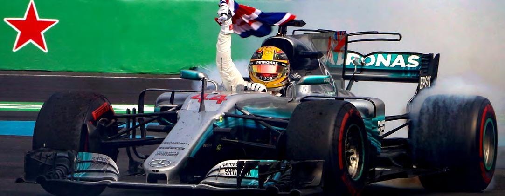

Songs and poetry were in the air as Lewis As Vettel and Hamilton fought it out through the opening

Hamilton rescued triumph from first-lap disaster at moments of the 71-lap race, Verstappen opted for the

the Autódromo Hermanos Rodríguez to become World sensible approach. ‘My start was not great,’ said the

Champion for the fourth time. young Dutch driver, ‘but then actually because of that

I was in a good position, because then I had a good

After clashing with Sebastian Vettel’s Ferrari in the first slipstream from Sebastian.

two corners of the 2017 race, Hamilton kept the lyrics of

Maya Angelou’s poem ‘Still I Rise’ firmly in the front of ‘I was like, “I’m going to try around the outside and see

his mind as he brought his Mercedes through from last what happens.” I just saw we had a little bit of a touch

to ninth – his lowest race finish of the year but enough to into Turn 2 but luckily nothing happened there. From

give him an unbeatable lead over Vettel, who could finish there onwards I could do my own race.’

only fourth.

He did it well enough to claim his third F1 victory, his

Vettel, arriving in Mexico with a 66-point deficit to the second in the last four races, almost 20 seconds clear

British driver, underlined his own determination not to of Hamilton’s teammate Valtteri Bottas, with Vettel’s

give up without a fight by claiming pole position, the 50th Ferrari partner Kimi Räikkönen in third place, a full 54

of his career, while Red Bull’s Max Verstappen joined him seconds in arrears.

on the front row.

30

Official Formula 1® Media Kit

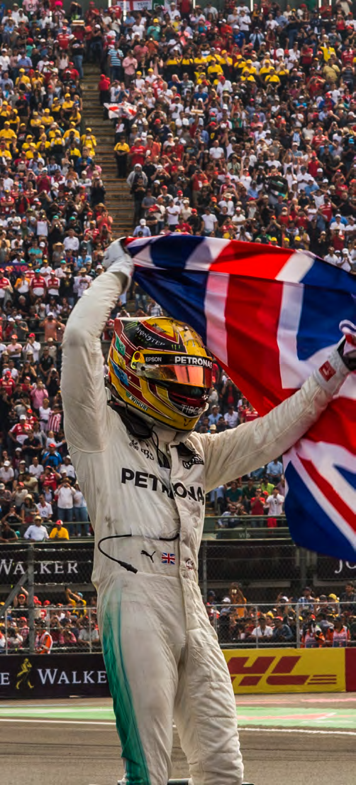

Two more young drivers caught the eye as France’s

Esteban Ocon took fifth place in his Force India

Mercedes, ahead of Canadian Lance Stroll in the

similarly-powered Williams and local favourite Sergio

Pérez in the second Force India entry.

Kevin Magnussen finished in a typically combative

eighth place for Haas Ferrari ahead of the battle-

hardened duo of Hamilton and Fernando Alonso.

While the early incidents caught the headlines, for

racing fans the real excitement in the race came as

Hamilton’s fight-back brought him up behind former

World Champion Alonso.

Reminding us of the talent that earned him his two

titles, Alonso defied the limitations of his McLaren

to go to wheel-to-wheel with Hamilton and make the

Mercedes man fight for every inch of track he gained.

Quoting ‘Still I Rise’ after the race, Hamilton insisted

that what helped him was his refusal to give up. ‘It was

a horrible way to do it, to be honest,’ he admitted, but

his pride in taking the battle to Ferrari shone through

as he spoke of ‘fighting with a silver sword’ against

the iconic red cars.

His fourth title made him Britain’s most successful

ever, surpassing Sir Jackie Stewart’s three crowns

won between 1969 and 1973. Citing his own modest

origins, Hamilton added: ‘You really can do something

from nowhere.’

31

Official Formula 1® Media Kit

CHARLES, EL CHAMACO AND THE GENERAL

LECLERC FOLLOWS IN FAMOUS FOOTSTEPS

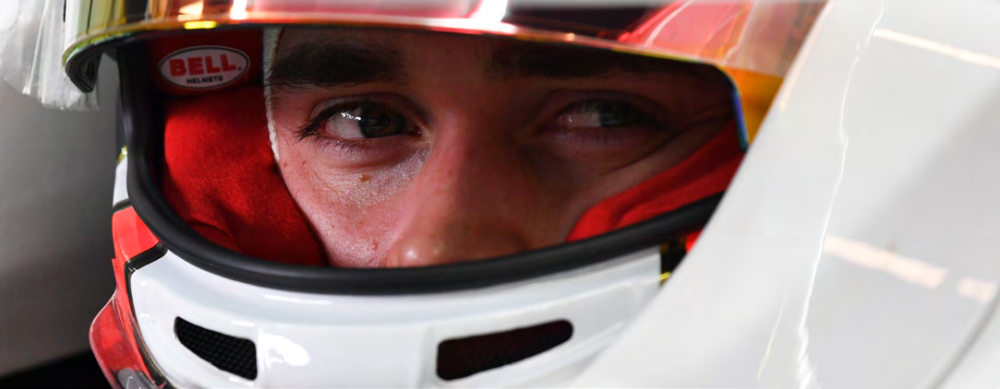

Monza, September 10, 1961: much-loved But Charles Leclerc, the 21-year-old racing driver, is Mexican driver Ricardo Rodriguez is on the front row the latest top recruit to the ranks of Grand Prix racing for the Italian Grand Prix – in a Ferrari. and he burns with ambition to earn five stars of his own on the race-tracks which are the battlefields of ‘El Chamaco’ – The Kid, as his many friends and fans his world. called him – was just a tenth of a second slower in qualifying than Wolfgang von Trips, who would perish So far Private Leclerc is going the right way about it. during that race, but Rodriguez retired with engine He raised a few eyebrows in September when he said problems after just 14 laps. firmly, ‘I’m not going to Ferrari to learn.’ What he meant was that Ferrari take drivers to win races and Ricardo was 19 years and 208 days old when he made titles, not to complete their apprenticeship. As far that famous debut; 58 years later, Charles Leclerc as he is concerned, he will not be #2 to four-time has become the youngest driver since ‘ El Camacho’ world champion Sebastian Vettel in the other scarlet to earn a Ferrari drive, his move from Sauber next cockpit. season being announced in Singapore a few weeks ago. ‘I focus on myself and don’t think about what people expect of me in the car,’ he insists. ‘I believe if I do At the time of the announcement, Leclerc was just the right job in the car and if I work the right way, the 20 – his birthday is October 16. And yet, in his home performances will be there.’ town of Monaco there is already a street named after Charles Leclerc, as there is in many other towns and No wonder: Leclerc was an outstanding champion cities in neighbouring France. in the F2 series in 2017 and he has almost single- handedly dragged Sauber from back-of-the-grid All right, it’s not the young man who races for Sauber obscurity into the F1 spotlight. in F1, it’s the brilliant general who rallied to De Gaulle’s Free French in 1940, played a key role in For a start, Leclerc is only the second Monaco North Africa and was a key figure in the liberation driver to earn a place in the F1 fields of his day. The of Paris. first was Louis Chiron, who competed in 15 World

32

Official Formula 1® Media Kit

Championship Grands Prix between 1950, when the of the world’s most famous racing team. Now he new series was launched, and 1955. has secured the greatest F1 promotion of all: to a Ferrari race seat. There is one big difference: Chiron was already 50 when he drove a Maserati in the inaugural race at But, as Ferrari boss Maurizio Arrivabene pointed out Silverstone in May 1950. Leclerc was just 20 when he in Singapore when the news broke, ‘The first mistake made his debut for the Ferrari-engined Sauber team is to put too much pressure on the shoulders of this in Australia in March 2018. guy. It could be, potentially, a huge mistake.

Leclerc has also benefited from the ability to rise ‘I signed with Charles in November 2016 or November through the racing ranks which modern-day racing 2015 the first contract in the Ferrari Driver Academy. series offer to young drivers. After a stellar karting In that contract we already designed and committed career – he was runner-up to Mexican GP winner and signed and wrote his future in Formula 1.’ Max Verstappen in the World Championships of 2013 – he graduated to Formula Renault 2.0 in 2014, then ‘Since I was a child I was looking up to Ferrari like F3 in 2015 before taking on GP3 in 2016. any child is doing,’ Leclerc said earlier this year. ‘I felt very privileged to be part of this academy. Since then Leclerc has driven only for racing’s elite They have helped me massively on the physical battalions: ART Grand Prix helped him to the 2016 preparation, and what for me is the most important GP3 title with three victories along the way, then one, the mental preparation, on the concentration, PREMA signed him for F2 (formerly GP2) as the managing the pressure - and the rumours!’ young man – like a marauding general – collected race wins in Barcelona, Baku, Austria, Britain, Spain Now all the rumours are confirmed: soon enough and Abu Dhabi on his way to wnning the 2017 title. this 21st-century Leclerc will rise through the ranks to become a five-star general in his own right on the After having his first F1 runs for Ferrari partners sporting battlefields of Formula 1. As Arrivabene Haas in Friday practice for the British GP and with added, ‘Thank God, it’s a guy that grew up with us! Ferrari at the Hungaroring test, Leclerc finally wore And I hope he is going to continue his career with an F1 uniform for good in Australia this year with us, at least until 2022 for sure.’ Sauber.

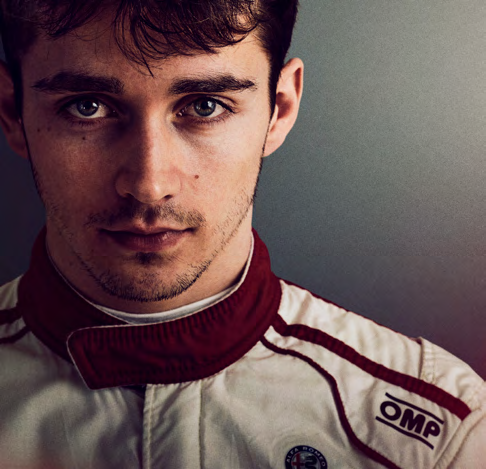

He qualified 18th and finished 13th; but in only his fourth race, in Azerbaijan, he made it through to Q2 then stunned everyone by finishing fourth. Since then he has become almost a permanent fixture in Q2 and more points rapidly followed in Spain, Canada, France and Austria.

His ninth place in Austria matched the best F1 result achieved by his close friend and mentor Jules Bianchi, who lost his life after an accident at the 2014 Japanese Grand Prix.

Louis Chiron had one F1 podium – in Monaco. Bianchi’s ninth place also came in Monaco and is just one more reason why Leclerc always has Jules in his mind.

It was with Bianchi – also a Ferrari Academy member – that Leclerc first visited the Maranello headquarters

33

Official Formula 1® Media Kit

IS THERE GOLD AT THE END OF THE RAINBOW?

PIRELLI’S COLOURFUL CONTRIBUTION TO THE F1 SCENE

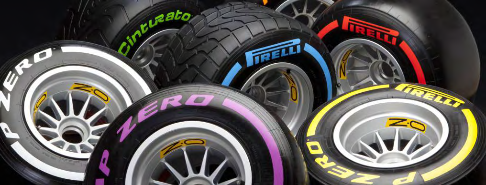

Seven colours in the rainbow – and seven colours in Why does Mexico fall into the same category as far as the bright-walled range of tires offered to F1 drivers Pirelli are concerned? in 2018 by sole supplier Pirelli. Which ones point the way to the pot of gold? ‘Because Mexico is quite unique on another side’, explains Isola. ‘Because of the altitude, the In Singapore a few races ago Pirelli’s Mario Isola took downforce the cars can produce is lower than on time to tell us about his company’s 2018 Formula other circuits; also with the maximum downforce you 1 tires, starting with the obvious question: why so cannot achieve the same kilograms on the car and many? with this situation you need to rely on mechanical grip rather than downforce. So we need to select soft ‘Because’, he says, ‘the current process of tire compounds in order to give the cars the mechanical homologation says that we have the freedom to grip they need. homologate as many compounds as we want, but after that we cannot bring in additional compounds. ‘The tarmac of the Autódromo Hermanos Rodriguez When we developed the new compounds last year, is not very rough, it’s quite smooth, and this helps at the end of that process we had a good number the choice of softer compounds, and the layout of compounds suitable for the championship and is not very severe, like Silverstone, or Suzuka: you we decided to homologate all of them to have more have a long straight, you have a layout that is putting flexibility.’ some energy on the tires but not at an extreme level. If you put together the layout, the tarmac and the Although there is a range of Pirelli compounds from downforce, that’s why we selected the three softest Superhard to Hypersoft, the company has prescribed compounds.’ the three compounds at the softer end of the range for use in Mexico: Supersoft, Ultrasoft and Hypersoft. In 2017 Sebastian Vettel was able to complete 39 race Local fans might be taken aback to learn that the laps on the softest compound available, the Ultrasoft, range – red, purple and pink – has been offered only which will be the medium compound in this year’s twice before: on the street circuit in Monaco and range. The newcomer is the pink Hypersoft: will it in Montreal, whose island layout is also close to a be a one-lap screamer for qualifying, and how many street circuit in its own way. laps will it last in racing conditions?

34

Official Formula 1® Media Kit

And what effect will the tire range have on pit stops? ‘We are the sole supplier,’ says Mario Isola, ‘so there As Mercedes’ chief strategist James Vowles has said, is no need to try to achieve the best performance. ‘Strategy is predominantly understanding your tires.’ We need to supply to the teams a tire that is And Mario Isola is quick to agree: ‘Yes, because the reliable, that is the same for everybody – that is very tires are the only part of the car that is touching the important, and it is difficult. We have to upgrade ground so it’s very important for them to understand all the production processes and quality control to the tires in order to make them work in the right ensure that we supply the same tires to everybody, window, provide maximum grip, set up the car and we are very strict in controlling and checking every make up the proper strategy to use the tire to its single tire. There is a random allocation made by the maximum potential. FIA that is a guarantee that we are not giving any special tire to anybody but on top of that we must ‘We target to have multiple strategies available. be sure that we are supplying the same product to Usually when we select the compounds for each everybody.’ event, before the event we use a software tool that we have developed in order to simulate all the different While acknowledging that competition would provide strategies and to understand in a range of 5-7 the adrenaline we associate with racing, Isola is seconds considering the total race time, how many adamant that there are different types of satisfaction strategies are possible. We always try to select the to be had. ‘We are not here to look for the result, it’s combination that is giving us the highest number of a different approach, but on the technical side it is strategies in a short time.’ very interesting, very challenging,’ he insists.

So the key question will be this: one stop or two? ‘Obviously if you are in an open competition you are Pirelli had anticipated two-stop races this year but part of the result, the tyre supplier is part of the one-stoppers have been the norm, except when result, is part of the team, so there is a different unusual circumstances have come into play. Last involvement. As sole supplier all the Pirelli guys year in Mexico only two drivers – Sergio Pérez and are here to be sure that we are doing the same for Romain Grosjean – stopped twice. everybody. We win every race!’

Watch for several drivers, especially the top ten qualifiers, starting on the pink-walled Hypersofts before switiching to one of the supposedly more durable compounds left in their allotment for the weekend.

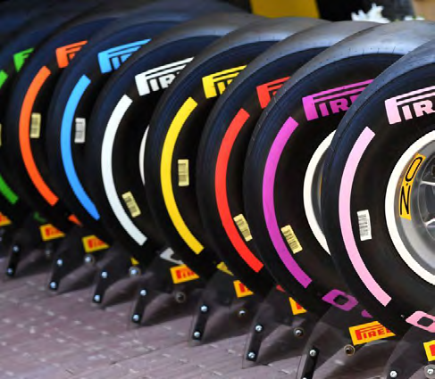

That is 13 sets of dry-weather tires, three of which are mandated by Pirelli, and six of which are returned to the supplier in the course of the practce sessions before Qualifying on Saturday afternoon. The top ten in Qualifying will start the race on the tires they used to set their fastest qualifying time.

And remember one other key point: while the tires in 2018 have helped the current generation of F1 cars to become the fastest in F1’s history, Pirelli does not go in search of pure performance. It has no need, as it is in a class, literally, of its own.

35

Official Formula 1® Media Kit

MEXICO STATISTICS 2015-2017

2015

Winner Nico ROSBERG (Mercedes)

2nd Lewis HAMILTON (Mercedes)

3rd Valtteri BOTTAS (Williams Mercedes)

Pole Nico ROSBERG (Mercedes) – 1:19.480 (194.947 km/h)

F/Lap Nico ROSBERG (Mercedes) – 1:20.521 (192.426 km/h) – lap 67

2016

Winner Lewis HAMILTON (Mercedes)

2nd Nico ROSBERG (Mercedes)

3rd Daniel RICCIARDO (Red Bull TAG Heuer)

Pole Lewis HAMILTON (Mercedes) – 1:18.704 (196.869 km/h)

F/Lap Daniel RICCIARDO (Red Bull TAG Heuer) – 1:21.134 (190.972 km/h) – lap 53

2017

Winner Max VERSTAPPEN (Red Bull)

2.º Valtteri BOTTAS (Mercedes)

3.º Kimi RÄIKKÖNEN (Ferrari)

Pole Sebastian VETTEL (Ferrari) – 1:16.488 (202.572 km/h)

F/Lap Sebastian VETTEL (Ferrari) – 1:18.785 (196.666 km/h) – lap 68

36

Official Formula 1® Media Kit

2018 SUPPORT RACES

FIA FORMULA 4 NACAM

The FIA Formula 4 NACAM Championship will begin its fourth season as an opening act for the FORMULA 1 GRAN PREMIO DE MÉXICO™ and with a seven-date calendar for the 2018-2019 season.

“It’s a great satisfaction to launch the start of our 2018-2019 season with no other than our main race, as a support category for the Mexican Grand Prix. The FIA Formula 4 NACAM has proven to be an extraordinary platform to showcase young talent for Formula 1 as it was the case with Luis Leeds – with the Red Bull Junior team – during the first year and the following with Enzo Fittipaldi – now a member of Ferrari’s Driver Academy,” said Flavio Abed, FIA Formula 4 NACAM CEO.

The head of the category stated that: “we are very proud to kick this fourth season off and consolidate ourselves as the most important Formula cars category in Latin America, with the participation of drivers from countries such as Brazil, Colombia, Costa Rica, Dominican Republic. For this year we have also created a partnership with CODASUR to count with drivers from Argentina, like Agustín Milera – who will debut in the category during the FORMULA 1 GRAN PREMIO DE MÉXICO™. Through this collaboration we hope to be able to count with the participation of drivers from Chile in the future”.

For the fourth consecutive year, the FIA Formula 4 NACAM will serve as an opening act for the Mexican Grand Prix with the participation of 18 cars on the grid – most of which are still forming towards the 2018-2019 season. So far, ahead of the start of the season, the following teams have confirmed their participation: Martiga-EG with 3 cars, Telcel RPL Racing with 3 cars, RAM Racing with 2 cars, PROP Car with 2 cars, Herrera Racing Team with 1 car, Easy Shop Racing with 1 car, OMDAI with 1 car, Marespi Racing with 1 car and Toledano with 2 cars.

37

Official Formula 1® Media Kit

2018 SUPPORT RACES

FIA FORMULA 4 NACAM

ENTRY LIST

RACE NUMBER DRIVER NAT TEAM

1 CHARA MANSUR MEX MARTIGA

2 KORY ENDERS USA MARTIGA

3 CARLTON JAKSON CRAWFORD USA MARTIGA

4 MANUEL SULAIMAN MEX RAM

5 ALEJANDRO GARCIA MEX RAM

6 NOEL DE JESUS VAZQUEZ MEX RAM

7 MARIANO MARTINEZ MEX RPL

8 PABLO PEREZ DE LARA MEX RPL

9 MATEO LLARENA GUATEMALA RPL

10 IÑIGO LEON MEX PROP CAR

11 GABRIEL BACCO PUERTO RICO PROP CAR

12 DANIEL FORCADELL MEX FORCADELL

13 SERGIO MARTINEZ MEX MARESPI

14 NICOLAS CHRISTODOULOU USA BERNAL

15 SHEEHAM CHANBRAZO USA PRONTO

38

Official Formula 1® Media Kit

2018 SUPPORT RACES

LA CARRERA PANAMERICANA

Sunday´s demonstration race will celebrate La Carrera Panamericana, the most important and longest running rally-type motorsports event in the world. It has been compared to a mixture of the Mille Miglia, the Targa Florio of Italy and the Tripoli Grand Prix. During seven intense days, drivers from around the world race together throughout Mexico covering over 3,000 km in adverse conditions.

Originally, the race was created to celebrate the opening of the Pan-American Highway in 1950. During its first five editions, from 1950 to 1954, several drivers from North American and European renowned championships participated in it such as Juan Manuel Fangio, Alberto Ascari, Piero Taruffi, Jean Trevoux, Johnny Mantz, Bill Vukovich and Hershe McGriff, among others. The category raised the interest of European brands in participating such as Ferrari, Porsche, Mercedes Benz, Lancia and Porsche – their participation projected Mexico as an ideal destination capable of organizing top level sporting events.

In 1988 Eduardo Leon gathered and invited different motorsports groups from around the world to join the revival of La Carrera Panamericana. In this new era the goal was to preserve the competition for vehicles manufactured between 1940 and 1965, separated into categories based on the modernization of their engine units, suspensions and safety measures.

Renowned celebrities have participated in this new era including former Formula 1® personalities such as Eric Comas – who has even won it –, Stefan Johansson, Phillipe Alliot, Clay Regazzoni, Jo Ramírez, Guy Edwards, Luigi Villoresi; from WRC Harry Rovanpera and Stig Blomquist have also taken part in it. In addition, over the years outstanding businessmen from around the world have also participated, as well as celebrities such as Pink Floyd stars David Gilmour and Nick Mason who took part in 1989.

With the participation of these guest competitors, the category has positioned itself as one of the world’s favorite rally-type competitions.

Every year the route is adapted to the inhospitable terrain of the different landscapes of Mexico. For 2018 La Carrera departed from Oaxaca, continued through Mexico City, Querétaro, Morelia, San Miguel de Allende and Zacatecas, finally finishing in Durango.

The spirit of La Panamericana is about crossing and enjoying Mexico from south to north in seven stages against the clock. About 80 classic cars take on speed stages between one city and another. This represents a great challenge of ability, skill and expertise as the drivers have to overcome the harsh road conditions of drastic curves and narrow roads under extreme weather conditions and at speeds of over 180 km/hour.

La Carrera Panamericana is one of the last major road racing events in the world which, in addition, helps project Mexico to the world as a sports tourism destination. Through its 31 editions, it has welcomed over 1,000 participants from over 20 nationalities, including five former Formula 1® drivers, two former WRC Champions and several other personalities from the business and entertainment industries. At each finish it welcomes more than 200,000 people.

All these elements make La Carrera Panamericana the Ultimate Road Race!

39

Official Formula 1® Media Kit

2018 SUPPORT RACES

LA CARRERA PANAMERICANA

ENTRY LIST

DRIVER CAR CATEGORY

Diego Candano PORSCHE 911 HISTORICA B

Miguel Granados PORSCHE 911 HISTORICA B

Pablo Cervantes PORSCHE 911 HISTORICA B

Alexis Uribe PORSCHE 911 HISTORICA B

Karlo Flores PORSCHE 356 SPORT MAYOR

Oscar Uribe PORSCHE 356 SPORT MENOR

Gabriel Perez STUDEBAKER CHAMPION TURISMO MAYOR

Luis Cervantes STUDEBAKER CHAMPION TURISMO MAYOR

Federico Juarez STUDEBAKER CHAMPION TURISMO PRODUCCIÓN

Eduardo Henkel PORSCHE 356 SPORT MENOR

Luis Ascencio PORSCHE 911 HISTORICA B

Victor Segura BUICK CENTURY TURISMO PRODUCCIÓN

Gilberto Jimenez MAZDA RX2 TURISMO MAYOR

Jose Luis Salamanca PORSCHE 911 HISTORICA B

Ernesto Anmtmann JAGUAR SPORT MAYOR

Harry Luchtan BMW 2002 HISTORICA A PLUS

Gerardo Rejon CHEVROLET CAMARO HISTORICA C

Doug Mockett OLDSMOBILE SUPER 88 TURISMO MAYOR

Alejandro Pimentel FORD ESCORT HISTORICA A

Carlos Gomez

José Abed VOLVO P544 TURISMO PRODUCCIÓN

Moises Sacal FORD MUSTANG HISTORICA C

Miguel Campero PORSCHE 356 SPORT MENOR

David Jassan PORSCHE 911 HISTORICA B 40

Official Formula 1® Media Kit

2018 SUPPORT RACES

PORSCHE MOBIL 1 SUPERCUP

Porsche Mobil 1 Supercup returns to the Autódromo Hermanos Rodríguez for the final two races of a season that started in Barcelona in the European spring.

2018 marks the 26th season for the Porsche Mobil 1 Supercup. Porsche’s most international one-make cup was contested for the first time in 1993 at the San Marino Grand Prix in Imola. With a capacity grid and races held on tradition-steeped tracks, the series has produced exciting motorsport on the same bill as Formula 1 ever since.

The Porsche Mobil 1 Supercup field is traditionally made up of drivers from all over the world. The registered competitors come from 15 countries, with guest drivers supplementing the grid over the season. After celebrating his first championship title last year in the Porsche Mobil 1 Supercup, Michael Ammermüller returns to tackle the season as the defending champion. Twenty-eight pilots have signed on permanently for 2018.

All cars are technically identical, while the two main driver categories are ‘A’ for seasoned professionals and ‘B’, with a minimum age of 35, for the keen amateur or part-time racers.

Points are awarded on a sliding scale: 20-18-16-14-12-10-9-8-7-6-5-4-3-2-1.

The Porsche Mobil 1 Supercup drivers have one free practice session, a 30-minute qualifying session and two races. The grids are set by the fastest qualifying times, for Race 1, and the second-fastest for Race 2.

Ammermüller leads the series with 119 points from Nick Yelloly on 114 and Thomas Preining on 105 with only the two races at Autodromo Hermanos Rodríguez to come.

41

Official Formula 1® Media Kit

2018 SUPPORT RACES

PORSCHE MOBIL 1 SUPERCUP

ENTRY LIST

RACE NUMBER DRIVER NAT TEAM

1 Michael Ammermüller Germany BWT Lechnner Racing

2 Thomas Preining Austria BWT Lechnner Racing

3 Dylan Pereira Luxembourg Lechnner Racing

4 Josh Webster United Kingdom Momo Megatron Lechnner Racing

5 Jaap van Lagen Netherlands FACH AUTO TECH

6 Nick Yelloly United Kingdom FACH AUTO TECH

7 Christof Langer Germany FACH AUTO TECH

8 Al Faisal Al Zubair Oman Lechnner Racing Middle East

9 Raor Lindland Norway Lechnner Racing Middle East

10 Mattia Drudi Italy Dinamic Motorsport

11 Ronnie Valori Italy Dinamic Motorsport

12 Gianmarco Quaresmini Italy Dinamic Motorsport

13 Alberto Cerqui Italy Dinamic Motorsport

14 Mikkel O. Pedersen Denmark MRS GT- Racing

15 Zaid Ashkanani Kuwait MRS GT- Racing

16 Richard Heistand United States MRS Cup- Racing

17 Yuey Tan Singapore MRS Cup- Racing

18 Philipp Sager Austria MRS Cup- Racing

19 Julien Andlauer France martinet by ALMÉRAS

20 Florian Latorre France martinet by ALMÉRAS

21 Nicolas Misslin France Pierre martinet by ALMÉRAS

22 Stephane Denoual France Pierre martinet by ALMÉRAS

23 Larry ten Voorde Netherlands Team Project 1

24 Egidio Perfetti Netherlands Team Project 1

25 Gustav Malja Sweden Team Project 1

26 Tom Sharp United Kingdom IDL Racing

27 Mark Radcliffe United Kingdom IDL Racing

28 Pablo Otero Argentina MRS GT-Racing

29 Philip Hamprecht Germany Lechnner Racing Middle East

42

Official Formula 1® Media Kit

USEFUL INFORMATION

AIRLINES RENTAL CAR

AEROMEXICO: 5133-4000 ALAMO: 01 800 849-8001

INTERJET: 01 800 322-5050 BUDGET: 55 5784-3011

AMERICAN AIRLINES: 01 800 904-6000 EUROPCAR: 01 800 201-2084

DELTA AIRLINES: 01 800 266-0046 HERTZ: 01 800 709-5000

UNITED AIRLINES: 5283-5555

BRITISH AIRWAYS: 001 866 835-4133

AIR CANADA: 9138-0280 AIRPORT TAXI COMPANIES

AIR FRANCE: 01 800 266-0048 YELLOW CAB 2599-6024

IBERIA: 2599-0226 NUEVA IMAGEN: 5716-1616

LUFTHANSA: 55 2482-2400 TAXIS 300: 5571-9344

COPA AIRLINES: 5241-2000

LATAM AIRLINES: 01 800 272-0330

43

Official Formula 1® Media Kit

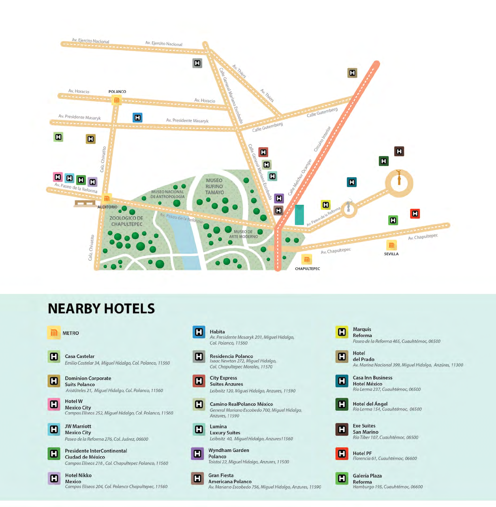

es Polanco

Polanco México

Andrés Bello 29, Polanco 4ta secc. 11560

44

Official Formula 1® Media Kit

MAPS AND DIAGRAMS

CORNER NAMES

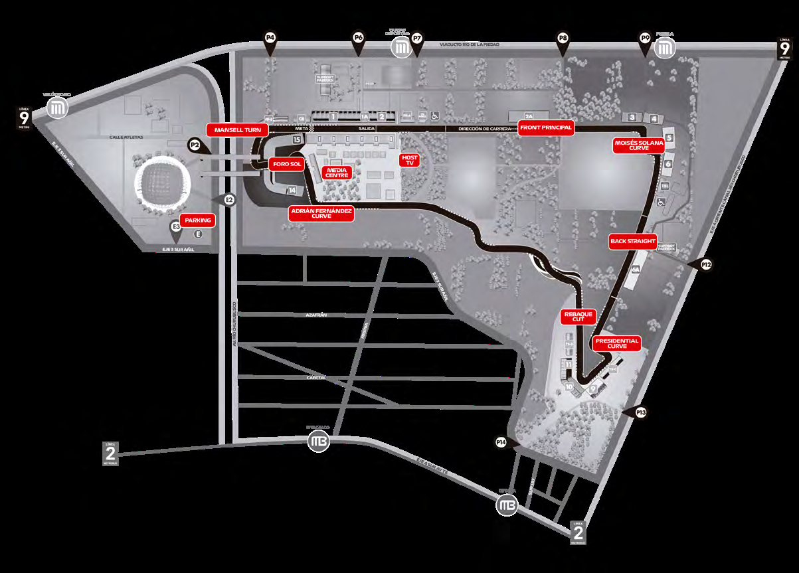

45

Official Formula 1® Media Kit

MAPS AND DIAGRAMS

CORNER NUMBERS

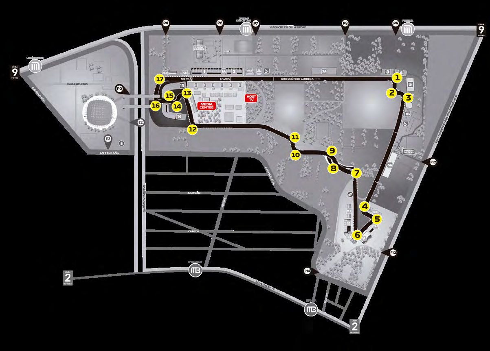

46

Official Formula 1® Media Kit

MAPS AND DIAGRAMS

SERVICE ROAD

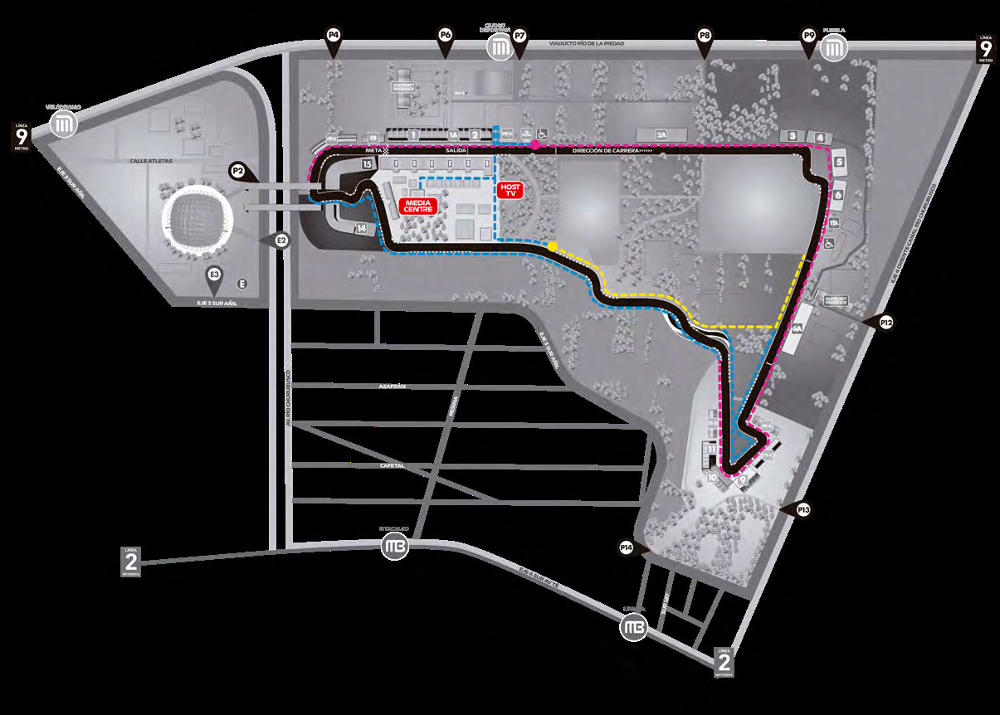

PHSOETS ROH VGI CRT EAT RPL OHE AEDRS´ U <<<TRACK DIRECTION TRACK DIRECTION>>>

INFIEPLICDK S UHPUTTE

WALK DISTANCE

INFIELD SHUTTLE

SERVICE ROAD- PHOTOGRAPHERS´ SHUTTLES

47

Official Formula 1® Media Kit

MAPS AND DIAGRAMS

MEDIA SHUTTLE

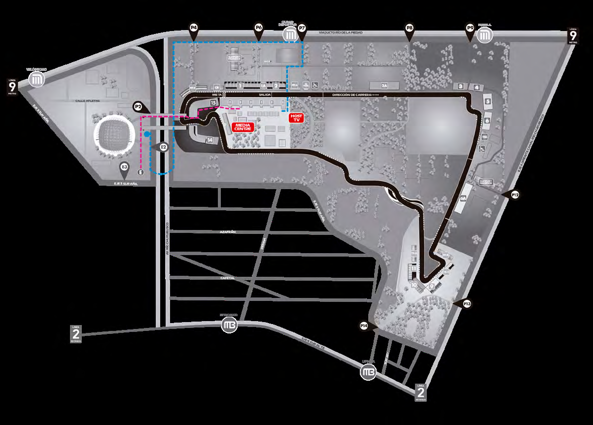

PARKING

WALK DISTANCE

SERVICE ROAD- SHUTTLES

48

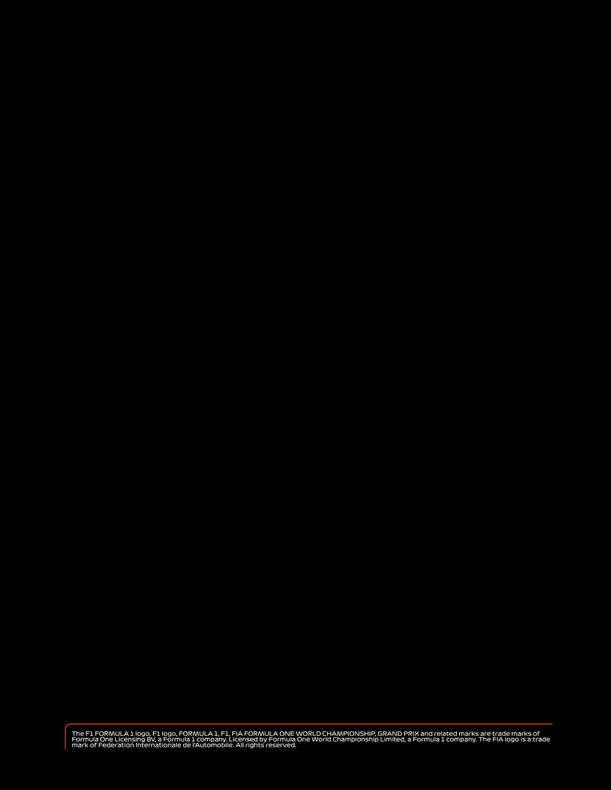
