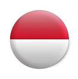
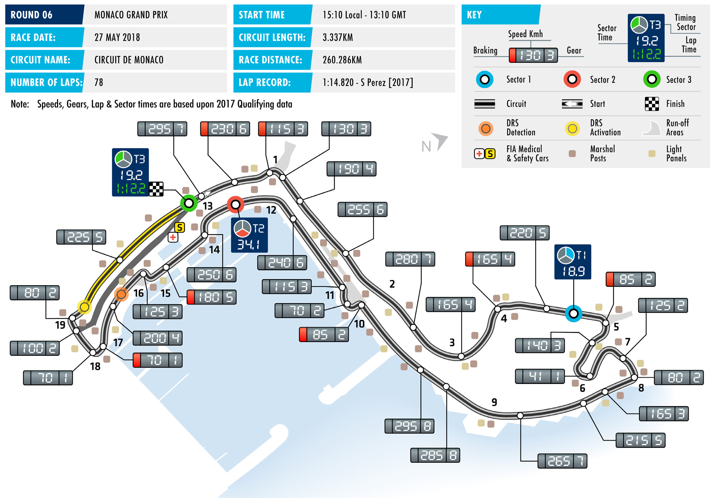
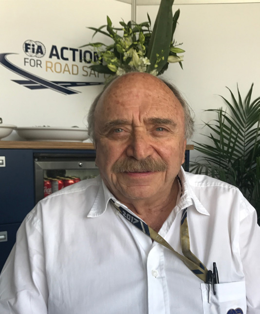

2018 MONACO GRAND PRIX

24 – 27 May 2018

Formula One heads to Monte Carlo this week for Round Six of CIRCUIT DE MONACO

the 2018 FIA Formula One World Championship, the illustrious Length of lap:

Monaco Grand Prix. 3.337km Lap record: On a circuit little changed from its essential pre-war layout, the 1:14.820 Monaco Grand Prix is something of an anomaly within the modern (Sergio Pérez, Force India, 2017)

calendar. While the closeness of the barriers and the proximity of Start line/finish line offset:

the grandstands makes the cars appear incredibly fast, this is the 0.000km

lowest speed circuit of the year and unique in having a reduced Total number of race laps: 78 race distance, 40km shorter than standard to ensure the laps Total race distance: fit into the required timeframe. Its status as the shortest circuit 260.286km means, however, that spectators are afforded more laps in Monaco Pitlane speed limits: than at any other grand prix. 60km/h in practice, qualifying, and the race The intricate nature of the Circuit de Monaco sees teams

employing as much downforce as possible and fitting bespoke CIRCUIT NOTES steering racks to cope with the famously-tight hairpin. While the ► The circuit has been resurfaced layout doesn’t demand it, the nature of the race ensures teams between turns 7-15 and 19-1. The pay close attention to their cooling requirements: with overtaking fast lane in the pits has also been resurfaced. difficult, cars often form trains, disrupting airflow for those behind.

Pirelli gives a debut this weekend to the pink-banded hypersoft DRS ZONE

tyre, the softest in the range. The soft, supersoft and ultrasoft ► There is a single DRS zone in Monaco, with the detection point compounds have proved to have very similar performance located 80m after Turn 16 and the characteristics so far this year but engineers believe the hypersoft activation point located 18m after to be an appreciable step up in performance from those. The Turn 19. supersoft and ultrasoft tyres are also available this weekend but

drivers have largely shunned these in their selections, choosing to

take between nine and the maximum 11 sets of hypersofts.

Consecutive victories have allowed Mercedes’ Lewis Hamilton

to pull clear of the chasing pack in the Drivers’ Championship

standings: he now enjoys a 17-point lead over Sebastian Vettel,

with Valtteri Bottas and Kimi Räikkönen respectively 20 and

30 points further back. Mercedes have a similar margin in the

Constructors’ Championship, leading Ferrari by 27 points. There

has, however, been no evidence of any team possessing a

definitive advantage so far this year, with the outcome of each race

being deemed circuit or circumstance-specific.

FAST FACTS

► The Monaco Grand Prix appeared (1989-93), Mika Häkkinen (1998), David ► Olivier Panis is the only winner to start on the original Formula One World Coulthard (2000, 2002), Räikkönen, outside the top ten. His 1996 triumph Championship calendar in 1950. It Alonso (2007) and Hamilton (2008). for Ligier came from P14. That race holds reappeared in 1955 and has been ever- the record for the highest number of present since. This is the 65th Monaco ► Mercedes took their 50th victory with retirements as a percentage of starters, Grand Prix. Hamilton’s win here in 2016. On the with 85.7% of the field (18 from 21) same weekend, Daniel Ricciardo had his failing to see the chequered flag. ► With six wins, Ayrton Senna is Monaco’s first, and so far, only pole position. most successful driver. Of the current ► All four Monaco F1 debutants have raced field, no-one has more than two: that ► New aerodynamic rules for 2017 were in Monaco before – though only Brendon honour is shared by Fernando Alonso expected to decrease lap times and Hartley and Sergey Sirotkin have been (2006-07), Lewis Hamilton (2008, 2016) challenge lap records. The record at the on the podium. Hartley raced here in and Sebastian Vettel (2011, 2017). Each Circuit de Monaco was one of 11 to fall Formula Renault 3.5 in 2009-2011, with has victories for two different teams. last year, with Sergio Pérez setting a new a best result of third in 2011. Sirotkin benchmark on lap 76 of 78. The other lap raced in FR3.5 in 2013-14, and then GP2 ► The other winner in the current field is records set during the 2017 F1 season in 2015-16, finishing third in the 2015 Kimi Räikkönen, who won the race in are at: the Sochi Autodrom, the Baku City sprint. Pierre Gasly did FR3.5 in 2014 2005. Were Räikkönen, last year’s pole- Circuit, the Red Bull Ring, Silverstone, and then GP2 in 2015-16, while Charles sitter, to win at Monaco this year, it would Spa-Francorchamps, the Marina Bay Leclerc made a home town debut last represent the longest interval between Circuit, Sepang, COTA, the Autódromo year in Formula 2. victories at a single event. Alain Prost Hermanos Rodríguez and Interlagos. currently holds this record with 11 years This year, Daniel Ricciardo set a new ► While many drivers call Monaco home, between his 1982 and 1993 South African lap record at the Circuit de Barcelona- Leclerc is one of very few Monegasques Grand Prix victories. (Or, for races held Catalunya. to take part in the race. Louis Chiron every year, nine years between 1984 and raced in 1950 and 1955 (with a DNS in 1993 German Grand Prix victories.) ► Of the 65 Monaco Grands Prix to date, ’56 and a DNQ in ’58) finishing third in 28 have been won from pole position, 1950. He competed many times in the ► McLaren are the most successful team including ten in 11 years between 2004 pre-World Championship Monaco Grand in Monaco with 15 victories, split and 2014. The pole position driver has Prix, winning in 1931. Olivier Beretta between Prost (1984-1986, 1988), Senna failed to win in the last three attempts. finished eighth for Larousse in 1994.

RACE STEWARDS BIOGRAPHIES

NISH SHETTY

FIA STEWARD AND MEMBER OF THE FIA INTERNATIONAL COURT OF APPEAL

Nish Shetty sits on the FIA International Court of Appeal as a judge and is a permanent member of the National Court of Appeal (Singapore). He is also Chairman of the Disciplinary Commission of the Singapore Motor Sports Association and a national steward of the Singapore Grand Prix. Shetty has assisted the Singapore Motor Sports Association for many years as a legal advisor and committee member. In addition to being involved in the Singapore Grand Prix, Shetty has acted as a steward in the Singapore Karting Championship. Away from motor sport, he is a Partner and Head of International Arbitration and Dispute Resolution, South East Asia at global law firm Clifford Chance.

JOSÉ ABED

FIA VICE PRESIDENT FOR SPORT

José Abed, an FIA Vice President since 2006, began competing in motor sport in 1961. In 1985, as a motor sport of cial, Abed founded the Mexican Organisation of International Motor Sport (OMDAI) which represents Mexico in the FIA. He sat as its Vice- President from 1985 to 1999, becoming President in 2003. In 1986, Abed began promoting truck racing events in Mexico and from 1986 to 1992, he was President of Mexican Grand Prix organising committee. In 1990 and 1991, he was President of the organising committee for the International Championship of Prototype Cars and from 1990 to 1995, Abed was designated Steward for various international Grand Prix events. Since 1990, Abed has been involved in manufacturing prototype chassis, electric cars, rally cars and kart chassis.

DANNY SULLIVAN

FORMER F1 DRIVER, INDIANAPOLIS 500 WINNER AND CART CHAMPION

US racer Danny Sullivan made his F1 debut with Tyrrell at the 1983 Brazilian Grand Prix. He raced just one season in F1, scoring a best result of fifth in Monaco. In 1984, Sullivan returned to the US where he resumed a successful Indy Car career. He is perhaps best known for his ‘spin and win’ victory at the 1985 Indianapolis 500, where he passed leader Mario Andretti, survived a 360 degree spin, and then caught and re-passed Andretti to claim the Borg-Warner Trophy. He won the Indy Car World Series title in 1988. After 17 victories from 170 Indy Car starts he drew a line under his open-wheel career in 1995. He finished third in the Le Mans 24 Hours in a Dauer Porsche 962 in 1994. He made four starts at Le Mans, the most recent being 2004.

2018 Formula One World Championship

DRIVERS’ CHAMPIONSHIP STANDINGS

|  | NIARHAB | ANIHC | NAJIABREZA | NIAPS | OCANOM | ADANAC | ECNARF | AIRTSUA | BG | YNAMREG | YRAGNUH | MUIGLEB | YLATI | EROPAGNIS | AISSUR | NAPAJ | ASU | OCIXEM | LIZARB | IBAHD UBA |
| --- | --- | --- | --- | --- | --- | --- | --- | --- | --- | --- | --- | --- | --- | --- | --- | --- | --- | --- | --- | --- |
| 18 2 | 15 3 | 12 4 | 25 1 | 25 1 |  |  |  |  |  |  |  |  |  |  |  |  |  |  |  |  |
| 25 1 | 25 1 | 4 8 | 12 4 | 12 4 |  |  |  |  |  |  |  |  |  |  |  |  |  |  |  |  |
| 4 8 | 18 2 | 18 2 | 14 | 18 2 |  |  |  |  |  |  |  |  |  |  |  |  |  |  |  |  |
| 15 3 | NC | 15 3 | 18 2 | NC |  |  |  |  |  |  |  |  |  |  |  |  |  |  |  |  |
| 12 4 | NC | 25 1 | NC | 10 5 |  |  |  |  |  |  |  |  |  |  |  |  |  |  |  |  |
| 8 6 | NC | 10 5 | NC | 15 3 |  |  |  |  |  |  |  |  |  |  |  |  |  |  |  |  |
| 10 5 | 6 7 | 6 7 | 6 7 | 4 8 |  |  |  |  |  |  |  |  |  |  |  |  |  |  |  |  |
| 6 7 | 8 6 | 8 6 | NC | NC |  |  |  |  |  |  |  |  |  |  |  |  |  |  |  |  |
| NC | 10 5 | 1 10 | 13 | 8 6 |  |  |  |  |  |  |  |  |  |  |  |  |  |  |  |  |
| 1 10 | 11 | 2 9 | 10 5 | 6 7 |  |  |  |  |  |  |  |  |  |  |  |  |  |  |  |  |
| 11 | 16 | 12 | 15 3 | 2 9 |  |  |  |  |  |  |  |  |  |  |  |  |  |  |  |  |
| NC | 12 4 | 18 | 12 | NC |  |  |  |  |  |  |  |  |  |  |  |  |  |  |  |  |
| 13 | 12 | 19 | 8 6 | 1 10 |  |  |  |  |  |  |  |  |  |  |  |  |  |  |  |  |
| 2 9 | 4 8 | 13 | 2 9 | NC |  |  |  |  |  |  |  |  |  |  |  |  |  |  |  |  |
| 14 | 14 | 14 | 4 8 | 11 |  |  |  |  |  |  |  |  |  |  |  |  |  |  |  |  |
| NC | 2 9 | 16 | 11 | 13 |  |  |  |  |  |  |  |  |  |  |  |  |  |  |  |  |
| 12 | 1 10 | 11 | NC | NC |  |  |  |  |  |  |  |  |  |  |  |  |  |  |  |  |
| 15 | 17 | 20 | 1 10 | 12 |  |  |  |  |  |  |  |  |  |  |  |  |  |  |  |  |
| NC | 13 | 17 | NC | NC |  |  |  |  |  |  |  |  |  |  |  |  |  |  |  |  |
| NC | 15 | 15 | NC | 14 |  |  |  |  |  |  |  |  |  |  |  |  |  |  |  |  |

STNIOP

1 L. HAMILTON 95

2 S. VETTEL 78

3 V. BOTTAS 58

4 K. RÄIKKÖNEN 48

5 D. RICCIARDO 47

6 M. VERSTAPPEN 33

7 F. ALONSO 32

8 N. HÜLKENBERG 22

9 K. MAGNUSSEN 19

10 C. SAINZ 19

11 S. PÉREZ 17

12 P. GASLY 12

13 C. LECLERC 9

14 S. VANDOORNE 8

15 L. STROLL 4

16 M. ERICSSON 2

17 E. OCON 1

18 B. HARTLEY 1

19 R. GROSJEAN 0

20 S. SIROTKIN 0

2018 Formula One World Championship

CONSTRUCTORS’ CHAMPIONSHIP STANDINGS

NAJIABREZA AILARTSUA EROPAGNIS IBAHD YNAMREG YRAGNUH STNIOP NIARHAB OCANOM ADANAC AIRTSUA MUIGLEB ECNARF OCIXEM ANIHC AISSUR NAPAJ LIZARB NIAPS YLATI ASU UBA BG

| 22 2 8 | 33 2 3 | 30 2 4 | 25 1 13 | 43 1 2 |
| --- | --- | --- | --- | --- |
| 40 1 3 | 25 1 NC | 19 3 8 | 30 2 4 | 12 4 NC |
| 20 4 6 | NC NC | 35 1 5 | NC NC | 25 15 10 |
| 7 7 10 | 8 6 11 | 10 6 9 | 10 5 NC | 6 7 NC |
| 12 5 9 | 10 7 8 | 6 7 13 | 8 7 9 | 4 8 NC |
| NC NC | 10 5 13 | 1 10 17 | 13 NC | 8 6 NC |
| 11 12 | 1 10 16 | 11 12 | 15 3 NC | 2 9 NC |
| 15 NC | 12 4 17 | 18 20 | 1 10 12 | 12 NC |
| 13 NC | 2 9 12 | 16 19 | 8 6 11 | 1 10 13 |
| 14 NC | 14 15 | 14 15 | 4 8 NC | 11 14 |

1 MERCEDES AMG 153 PETRONAS MOTORSPORT

126 2 SCUDERIA FERRARI

3 ASTON MARTIN 80 RED BULL RACING

RENAULT SPORT 41 4 FORMULA ONE TEAM

40 5 MCLAREN F1 TEAM

19 6 HAAS F1 TEAM

SAHARA FORCE INDIA 18 7 F1 TEAM

RED BULL 13 8 TORO ROSSO HONDA

ALFA ROMEO 11 9 SAUBER F1 TEAM

WILLIAMS MARTINI 4 10 RACING

FORMULA ONE TIMETABLE & FIA MEDIA SCHEDULE

WEDNESDAY

Press conference 15.00

THURSDAY

Practice session 1 11.00-12.30 Press conference 13.00

Practice session 2 15.00-16.30

SATURDAY

Practice session 3 12.00-13.00 Qualifying 15.00-16.00 Followed by unilateral and press conference

SUNDAY

Drivers’ Parade 13.30 Race 15.10 Followed by podium interviews and press conference

ADDITIONAL MEDIA OPPORTUNITIES

QUALIFYING

All drivers eliminated in Q1 or Q2 will be available for media interviews immediately after the end of each session, as will drivers who participated in Q3, but who are not required for the post-qualifying press conference. The TV Pen is located at the paddock entrance.

RACE

Any driver retiring before the end of the race will be made available at the TV pen interview area. In addition, during the race every team will make available at least one senior spokesperson for interview by officially accredited TV crews. A list of those nominated will be made available in the media centre.

FIA COMMUNICATIONS DEPARTMENT press@fia.com T +33 1 43 12 58 15
