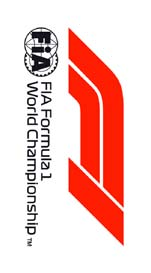
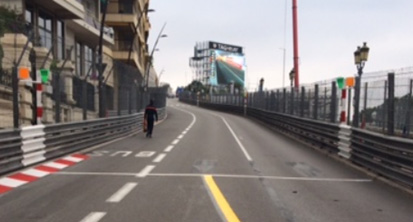
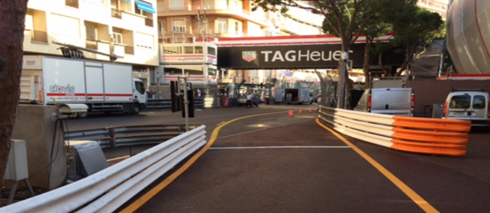
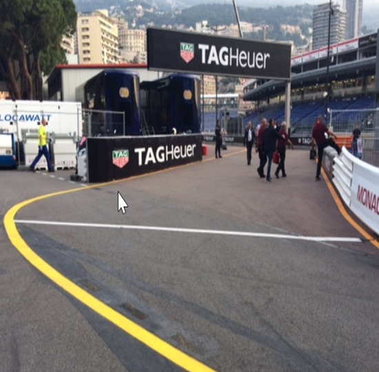

2018 MONACO GRAND PRIX

23 - 27 May 2018

From The FIA Formula One Race Director Document 2

To All Teams, All Officials Date 23 May 2018

Time 09:00

Title Event Notes

Description Event Notes

Enclosed MONACO_GP_EVENT_NOTES_23_05_2018_v1.pdf

Charlie Whiting

The FIA Formula One Race Director

2018 MONACO GRAND PRIX

23-27 MAY 2018

From The FIA Formula One Race Director Document 2

To Formula One Team Managers Date 23 May 2018

Time 09.00

EVENT NOTES

23 MAY 2018

1) Issues arising from the Spanish Grand Prix

2) Changes to the circuit

2.1 The circuit has been resurfaced between turns 7 and 15 and also between turns 19 and 1.

2.2 The fast lane of the pits has also been resurfaced.

3) Pit lane map

3.1 Safety Car lines.

3.2 The location of the pit entry and the pit exit.

3.3 Designated garage areas.

3.4 Safety Car position for first lap and rest of race.

3.5 Blue flag marshal at the pit exit.

3.6 Track light panels displaying pit entry status.

4) Pirelli Event Preview

4.1 With reference to Article 24.4(a) of the Sporting Regulations see the attached document provided by the official tyre supplier.

5) Weighing and weighing platform

5.1 The FIA weighing platform will be available for teams to use at the following times, however, no more than 10 team personnel may be present during any visit. Each visit should last no more than 10 minutes unless no other team is waiting in the pit lane :

1/5

a) From 11.30 on Wednesday until midnight on Thursday.

b) From 14.00 on Friday until 14.30 on Saturday (between 13.00 and 14.30 on Saturday each visit will be restricted to five minutes).

c) From when the cars are returned to the teams after qualifying until 19.30 on Saturday.

d) From 10.10 until 14.10 on Sunday.

Any team found to be abusing the time limits set out above, which we will be enforced by FIA security personnel and our own CCTV, will not be permitted to use the weighbridge again during the Event.

6) Red zones for photographers in the pit lane during sessions

6.1 See the attached drawing.

7) Practice starts

7.1 Practice starts may only be carried out on the track at the end of each free practice session, none may be carried out in the pit lane. Any car on the track when the chequered flag is shown may then complete another lap and, instead of entering the pits, proceed to the grid and make a practice start.

All drivers carrying out a practice must do so by pulling as far forward on the grid as possible and, if necessary, should wait for others to carry out a start before getting to a grid position further forward. Under no circumstances should a driver make a practice start if another car is still stationary in front of him on the same side of the grid.

If any driver appears to be disregarding any of the above a red flag will be displayed and the possibility to carry out any further starts will be immediately terminated.

8) Lines or bollards at the pit entry and pit exit

8.1 In accordance with Chapter 4 (Section 5) of Appendix L to the ISC drivers must stay to the right of the yellow line at the pit exit when leaving the pits and stay to the right of it until it finishes after turn 1.

8.2 In order to warn drivers leaving the pits that the pit exit is obstructed two yellow arrows will be illuminated, one at the pit exit and one just before turn 1. If either of these are illuminated drivers leaving the pits may cross the yellow line.

8.3 There are no restrictions at the pit entry.

9) Lights before the pit exit

9.1 There are two yellow arrows above the track just before the pit exit, these will be flashed to warn drivers on the track that a car is leaving the pit lane.

10) Chicane escape road

10.1 If a car uses the escape road at the chicane the driver may re-join the track only when the lights, operated by the marshal on the spot, are turned green.

11) DRS

11.1 DRS will be globally disabled if panels 1, 18 or 19 are displaying yellow.

2/5

11.2 Detection will be automatically disabled if the light panels below are displaying yellow :

Zone 1 : Panels 15, 16 or 17.

11.3 If automatic detection is not working , and permission has been given by race control to use manual detection, DRS must not be used in the zone if panels 15, 16 or 17 are displaying yellow.

12) Observing yellow flags during free practice and qualifying

12.1 Double waved : Any driver passing through a double waved yellow marshalling sector must reduce speed significantly and be prepared to change direction or stop. In order for the stewards to be satisfied that any such driver has complied with these requirements it must be clear that he has not attempted to set a meaningful lap time, for practical purposes this means the driver should abandon the lap (this does not necessarily mean he has to pit as the track could well be clear the following lap).

12.2 Single waved : Drivers should reduce their speed and be prepared to change direction. It must be clear that a driver has reduced speed and, in order for this to be clear, a driver would be expected to have braked earlier and/or discernibly reduced speed in the relevant marshalling sector.

Drivers should not overtake any car in a single waved yellow marshalling sector unless it is clear that a car is slowing with a completely obvious problem, e.g. obvious accident damage or a deflated tyre.

13) Track light panels

13.1 The FIA light panels have been installed in the positions shown on the circuit map. In accordance with Appendix H to the ISC the light signals have the same meaning as flag signals.

14) Drivers leaving their pit stop position in the pit lane

14.1 For safety reasons, no car should be driven from its pit stop position at any time unless :

a) It has first been driven into the pit stop position having just entered the pit lane from the track, and ;

b) It is then driven immediately back onto the track from the pit stop position.

15) Fire extinguishers around the circuit

15.1 Indicated by small fluorescent orange boards attached to the debris fences.

16) Places to remove cars from the track

16.1 Indicated by fluorescent orange panels on the walls or guardrail.

17) In laps and reconnaissance laps

17.1 In order to ensure that cars are not driven unnecessarily slowly on in laps during and after the end of qualifying or during reconnaissance laps when the pit exit is opened for the race, drivers must stay below the maximum time set by the FIA between the Safety Car lines shown on the pit lane map.

You will be informed of the maximum time after the first day of practice.

3/5

18) Support races

18.1 Well before and during each support race practice session and race please be kind enough to ensure all your pit equipment is no more than one metre from your garage. The organisers have asked if you could keep your equipment within one metre of the garages from the following times :

Thursday 07.15 (Before Eurocup Renault practice)

08.50 (Before the Formula 2 practice)

12.50 (Before the Formula 2 qualifying)

16.50 (Before the Porsche practice)

Friday 07.10 (Before the Eurocup Renault qualifying)

09.10 (Before the Porsche qualifying)

10.50 (Before the first Formula 2 race)

Saturday 09.30 (Before the first Eurocup Renault race)

16.15 (Before the second Formula 2 race)

Sunday 10.00 (Before the Porsche race)

11.10 (Before the second Eurocup Renault race)

On no account should F1 cars be pushed to the weighing area while a support race is in the pit lane.

19) Post qualifying parc fermé

19.1 The cameras should be installed and operated in the same way as 2017.

20) Operational personnel curfew

20.1 Boards warning anyone attempting to enter the paddock that the curfew is in operation will be placed immediately before the entry turnstiles at the appropriate times.

21) Removing cars from the grid

21.1 Pit exit.

22) Car number light panels for the start

22.1 On the right hand side of the grid.

23) Track light panels displaying pit entry status

23.1 The light panels indicated on the pit lane map will display flashing yellow arrows if cars are required to use the pit lane once the Safety Car has been deployed during the race.

23.2 The light panels indicated on the pit lane map will display flashing red crosses if the pit lane is closed at any point during the race.

24) Lapping during the race

24.1 The ISC requires drivers who are caught by another car about to lap him to allow the faster driver past at the first available opportunity. The F1 Marshalling System has been developed in order to ensure that the point at which a driver is shown blue flags is consistent, rather than trusting the ability of marshals to identify situations that require blue flags.

4/5

As it was at the end of last season the system will be set to give a pre-warning when the faster car is within 3.0s of the car about to be lapped, this should be used by the team of the slower car to warn their driver he is soon going to be lapped and that allowing the faster car through should be considered a priority. When the faster car is within 1.2s of the car about to be lapped blue flags will be shown to the slower car (in addition to blue light panels, blue cockpit lights and a message on the timing monitors) and the driver must allow the following driver to overtake at the first available opportunity.

It should be noted that the aim of using F1MS is ensure consistent application of the rules, additional instructions may also be given by race control when necessary.

25) Suspending a race

25.1 If the race is suspended we would like the first car entering the pit lane to stop at the end of the last garage, rather than going to the pit exit lights. This will provide more room for the teams and allow any cars permitted to un-lap to be pushed to the front of the line of cars in the fast lane.

26) Post race parc fermé

26.1 The first three cars on the grid as usual and the remainder in the weighing area.

27) Any other business

Charlie Whiting FIA Formula One Race Director

5/5

|  |  | GrandPrixofMonaco 24-27/05/2018(18R06MNC) |  |  |  |  |  |  |  |
| --- | --- | --- | --- | --- | --- | --- | --- | --- | --- |
|  |  | Compound |  | FL | FR | RL | RR |  | Mandatoryracetyres |
|  |  | SUPERSOFT |  | X60 | X62 | X70 | X72 |  | SUPERSOFT |
|  |  | ULTRASOFT |  | U60 | U62 | U70 | U72 |  | ULTRASOFT |
|  |  | HYPERSOFT |  | K60 | K62 | K70 | K72 |  |  |
|  |  | INTERMEDIATESOFT |  | G37 | G38 | G39 | G40 |  | Q3tyre |
|  |  | WETSOFT Cross-Overtime MINIMUMSTARTINGPRESSURE,BLISTERINGSENSITIVITY,CAMBERLIMIT |  | W37 WET>119%>INT>113%>DRY | W38 Front(psi) | W39 | W40 | Rear(psi) | HYPERSOFT |
|  |  |  | Slicks |  | 17.5 |  |  | 17.5 |  |
|  |  |  | Intermediate |  | 17.0 |  |  | 17.0 |  |
|  |  |  | Wet |  | 16.0 |  |  | 16.0 |  |
| FEEOSCamberlimit REEOSCamberlimit -4.00° -2.75° FEBlistering REBlistering sensitivity sensitivity Low Low |  | TYREHEATINGSTRATEGY |  |  |  |  |  |  |  |
| Storagetemperature: Optimumtimein Storagetemperature: Optimumtimein blanket(@80°): blanket(@60°): 60°C 40°C 2h 1h SLICKS INTER Maximumboost Blankettimewindow Maximumboost Blankettimewindow temperature (@80°): temperature (@60°): 1h@110°C 1hto3h 30min@80°C 30minto2h Storagetemperature: Optimumtimein blanket(@60°): 40°C 1h WET Blankettimewindow NOBOOST (@60°): 30minto2h GENERALNOTES TeamsarekindlyremindedthatthefollowingparameterswillbesubjectedtoFIAchecksduringtheevent: -Startingpressure. -Camberatmaximumspeed. -Maximumblankettemperature. -Tyreswapping. | TyreNotes |  |  |  |  |  |  |  |  |
| භEŽƚƉĞƌŵŝƩĞĚƚŽƐǁŝƚĐŚƚLJƌĞƐĨƌŽŵƚŚĞŝƌŽƌŝŐŝŶĂůůLJĂůůŽĐĂƚĞĚƉŽƐŝƟŽŶ͘ Storage Temp˚C is the recommended temperature the tyre can stay in blankets without time limit.Alltemperaturelimitsapplytotheactualtyresurfacetemperature,measuredwiththeIR භŽŶŽƚƐƵďũĞĐƚƚLJƌĞƐƚŽůĂƌŐĞĚĞĨŽƌŵĂƟŽŶŽƌŚĞĂǀLJŝŵƉĂĐƚ͘ gundetailedinTD029-15. භŽŶŽƚůĞĂǀĞĮƩĞĚƚLJƌĞƐĞdžƉŽƐĞĚĂƚĂŶĂŝƌƚĞŵƉĞƌĂƚƵƌĞůŽǁĞƌƚŚĂŶϭϱΣ SIDEWALLSHEATINGCLARIFICATION(ALLPRODUCTS):youareallowedtoapplyamax. and/oranyUVemission. temperatureof100°Cformax.1hrtothesidewallsaslongasthemax.temp/timeatanypart භZĞǀŝƐĞĚƉƌĞƐĐƌŝƉƟŽŶƐĐŽƵůĚďĞŝƐƐƵĞĚĚƵƌŝŶŐƚŚĞƌĂĐĞǁĞĞŬĞŶĚŝŶ ofthetreadistheonedescribedinthecorrespondingsectionabove. accordancewithTD/007-16. | භEŽƚƉĞƌŵŝƩĞĚƚŽƐǁŝƚĐŚƚLJƌĞƐĨƌŽŵƚŚĞŝƌŽƌŝŐŝŶĂůůLJĂůůŽĐĂƚĞĚƉŽƐŝƟŽŶ͘ භŽŶŽƚƐƵďũĞĐƚƚLJƌĞƐƚŽůĂƌŐĞĚĞĨŽƌŵĂƟŽŶŽƌŚĞĂǀLJŝŵƉĂĐƚ͘ භŽŶŽƚůĞĂǀĞĮƩĞĚƚLJƌĞƐĞdžƉŽƐĞĚĂƚĂŶĂŝƌƚĞŵƉĞƌĂƚƵƌĞůŽǁĞƌƚŚĂŶϭϱΣ and/oranyUVemission. භZĞǀŝƐĞĚƉƌĞƐĐƌŝƉƟŽŶƐĐŽƵůĚďĞŝƐƐƵĞĚĚƵƌŝŶŐƚŚĞƌĂĐĞǁĞĞŬĞŶĚŝŶ accordancewithTD/007-16. |  |  |  |  | Storage Temp˚C is the recommended temperature the tyre can stay in blankets without time limit.Alltemperaturelimitsapplytotheactualtyresurfacetemperature,measuredwiththeIR gundetailedinTD029-15. SIDEWALLSHEATINGCLARIFICATION(ALLPRODUCTS):youareallowedtoapplyamax. temperatureof100°Cformax.1hrtothesidewallsaslongasthemax.temp/timeatanypart ofthetreadistheonedescribedinthecorrespondingsectionabove. |  |  |  |

2018 Monaco Grand Prix Pit Lane

RC Tower

PIT ENTRY PIT EXIT PIT LANE Starts X SAFETY CAR Pit Entry Race SAFETY CAR Line 1 Status panels Blue Flag Marshal

X PIT LANE Ends SAFETY CAR Line 2

SAFETY CAR First Lap

1 2 3 4 5 6 7 8 9 10 11 12 13

| AIF | AIF | sedecreM | sedecreM | sedecreM | irarreF | irarreF | irarreF | lluB deR | lluB deR | lluB deR | aidnI ecroF | aidnI ecroF | aidnI ecroF | smailliW | smailliW | smailliW | tluaneR | tluaneR | tluaneR | ossoR oroT | ossoR oroT | ossoR oroT |  | saaH | saaH | ssaH | neraLcM | neraLcM | neraLcM | rebuaS | rebuaS | 1F 1F | 1F |
| --- | --- | --- | --- | --- | --- | --- | --- | --- | --- | --- | --- | --- | --- | --- | --- | --- | --- | --- | --- | --- | --- | --- | --- | --- | --- | --- | --- | --- | --- | --- | --- | --- | --- |
|  |  | Mercedes |  |  | Ferrari |  |  | Red Bull |  |  | Force India |  |  | Williams |  |  | Renault |  |  | Toro Rosso |  |  | Haas |  |  |  | McLaren |  |  | Sauber |  |  |  |

1F / AIF AIF

Designated Stop Garage Areas Position

FAST LANE FAST LANE

Version 1 – 23 May 2018
