Official A4 Media Kit Cover Width 210mm x Depth 297mm (3mm bleed)

DE MONACO

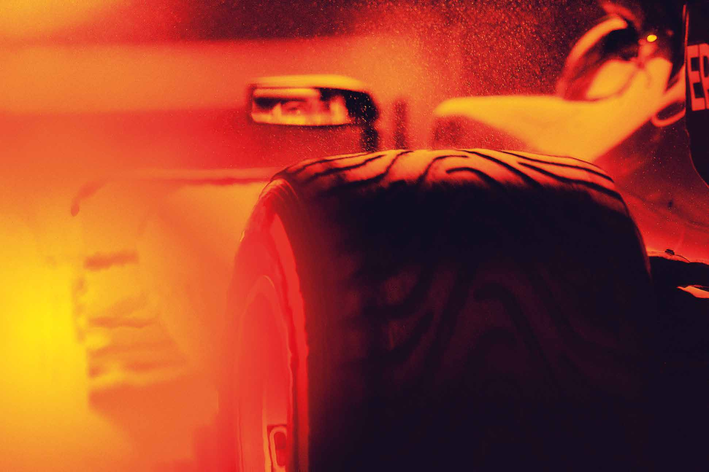

MONTE CARLO 24 -27 MAY

The F1 logos, F1, FORMULA 1, FIA FORMULA ONE WORLD CHAMPIONSHIP, GRAND PRIX DE MONACO and related marks are trade marks of Formula One Licensing BV, a Formula 1 company. All rights reserved. OFFICIAL MEDIA KIT 1

76th GRAND PRIX

DE MONACO

24-27 MAY 2018

counting for the 2018 FIA Formula One

World Championship

Organised by the Automobile Club de Monaco

Under the High Patronage of

THEIR SERENE HIGHNESSES THE PRINCE

AND THE PRINCESS OF MONACO

with the support of the Princely Government, of the Municipality and the participation

of the Société des Bains de Mer

2

CONTENTS

The Story of Automobile Club de Monaco ....................................................................................................... 4

76th Grand Prix Automobile de Monaco 2018

Programme .............................................................................................................................................................. 8

Media Accreditation Centre and Media Centre Opening Hours Media Shuttle Service ........................................................................................................................................... 9

Map ............................................................................................................................................................................. 10

Various information ............................................................................................................................................... 11

Press Conferences .................................................................................................................................................. 14

Restricted Areas ...................................................................................................................................................... 15

Equipments and means ....................................................................................................................................... 17

Speed on the Monaco circuit ............................................................................................................................... 19

The Monaco circuit ................................................................................................................................................. 20

New High Tech Pits ................................................................................................................................................ 21

Monaco podium procedure .................................................................................................................................. 24

75th Grand Prix Automobile de Monaco 2017 .............................................................................................. 25

2017 FIA Formula One World Championship - Classification ................................................................. 29

76th Grand Prix Automobile de Monaco 2018

Entry list ................................................................................................................................................... 30

Helmets .................................................................................................................................................... 31

Garage allocation in the pit lane ....................................................................................................... 32

Teams and Drivers ................................................................................................................................. 34

2018 Formula One World Championship

What’s new in 2018 ............................................................................................................................ 44

The Season so far... ............................................................................................................................... 46

Classifications ........................................................................................................................................ 51

Dates and places ................................................................................................................................... 52

Grand Prix Automobile de Monaco : 1929-2017

Honors List .............................................................................................................................................. 53

Records ...................................................................................................................................................... 56

1950 - 2017 - Formula One World Championship Winners .................................................. 57

The Principality of Monaco ................................................................................................................. 59

Various Informations ............................................................................................................................ 60

Photographs : archives ACM - Jean-Marc FOLLETÉ - Michael ALESI - Jean-François GALERON

3

THE STORY OF AUTOMOBILE CLUB DE MONACO

The club was founded on August 26, 1890. Originally known as ‘Sport Vélocipédique de la Principauté (SVP) – Principality Cycling Sporting Association – it was born out of the enthusiasm and passion of 21 cycling aficionados. Within a week, it had already been re-christened ‘Sport Vélocipédique Monégasque (SVM)’ – Monaco Cycling Sporting Association.

That name changed again 27 years later, on August 28, 1907, to become ‘Sport Automobile et Vélocipédique de Monaco (SAVM)’ – Monaco Cycling and Automobile Sporting Association – under the impulsion of its President Henri Tairraz, who was inspired by the technological advances of the motor car.

On October 31, 1909, Alexandre Noghès succeeded Tairraz as SAVM President. This heralded the beginning of a great motoring adventure. No sooner had he been elected, than Noghès tabled the proposal to stage a sporting event in the Principality, which – driven by his son Antony – ultimately materialised two years later with the organisation of the 1st Rallye Automobile Monaco on January 21-29, 1911.

Paris, Berlin, Brussels, Boulogne-sur-Mer, Vienna and Geneva were the six starting-points for this event. Having set out from Paris behind the wheel of a 25hp Turcat-Méry, early aviator Henri Rougier triumphed ahead of 22 rivals, registering an average speed of 13.8kph.

Buoyed by this success, and to firmly instil in the hearts and minds of the club’s members that their association would henceforth be predominantly focused upon motor vehicles rather than bicycles, a directory was published, containing members’ names and addresses and itineraries for car excursions. The determination of those at the helm of the SAVM was already palpable: they were starting to write the future... The consequences of the World War 1 would be devastating, however, temporarily putting a halt to all motorsport activity. In 1918, Monaco was left to mourn its losses from the battlefield, amongst whom were several dozen club members. For obvious reasons, during these four dreadful years of conflict, the SAVM did not organise a single sporting or even non-competitive event.

Through sheer perseverance, President Noghès pressed on and, in January, 1921, revealed that the 1st Automobile Week – which had originally been conceived back in June, 1914 – would take place two months later, from March 8-15. Boasting an impressive 35,000 Francs in prize money, this event was composed of various challenges for both cars and motorbikes, in addition to a display and a Concours d’Elegance. The fruit of a remarkable vision that had never wavered, this new success story confirmed – to everybody’s delight – that President Noghès and his committee were very much on the right track, both in terms of the club’s evolution and its association with the motor car.

On the morning of March 29, 1925, during an Extraordinary General Meeting attended by 55 SAVM members, its President Alexandre Noghès declared “that due to the ever-increasing size of the club, its name must be changed to Automobile Club de Monaco’, explaining that ‘cycling is becoming less common as a sport, whereas motorsport is on the rise.” The proposal was subsequently put to a secret ballot and adopted by 49 votes in favour, five against and one abstention. In becoming the ACM, the association joined a large and growing family of national auto clubs, each member of which embodied automobile adventure at national level. In order to assure its future, however, the ACM needed to be admitted to the Association Internationale des Automobiles Clubs Reconnus (AIACR) – International Association of Recognised Automobile Clubs – forerunner of the current Fédération Internationale de l’Automobile (FIA).

4

As the club’s General Commissioner, Antony Noghès, then 35, was tasked with taking the Automobile Club de Monaco’s application to the AIACR’s headquarters in Paris. He unfortunately returned empty- handed, since the gentlemen of the AIACR considered that although the club did indeed organise sporting competitions, these did not take place within the territory of Monaco. With wounded pride, but with youthful enthusiasm and determination, Antony Noghès decided to undertake the extraordinary challenge of staging a car race around the streets of Monaco.

The idea of holding a race in the city was certainly a daunting one – perhaps even unachievable. Firstly, there were the steps between the Quai des Etats-Unis and Quai Albert 1er to overcome, plus more steps alongside the gasometers. There were also the cobblestones and tram tracks between La Condamine and the Casino to consider. Antony Noghès weighed up his options for two years, before finally deciding to entrust his ambitious project to the only men who could be counted upon to offer a fair and dispassionate opinion: on the sporting side, Louis Chiron and in terms of the technical aspect, Jacques Taffe.

Next, he needed to convince the Société des Bains de Mer to get on-board with the project and underwrite the financing of the event. Its administrator, René Léon, immediately appreciated the value of Noghès’ vision and released the necessary funds.

Nowhere else in the world will have a circuit like this! The official announcement of the organisation of the Grand Prix rang out triumphantly across Monaco. Indeed, it created such a stir in the Principality that, on October 18, 1928, the Gazette de Monaco newspaper proclaimed: “We are delighted to learn that the Association Internationale des Automobiles Clubs Reconnus has admitted the ACM as a national club, which takes the number of countries represented to 34.”

Just six months later, on sunday 14th April 1929, under spring sunshine, H.S.H. Prince Pierre of Monaco, grandfather of H.S.H. Prince Rainier III, formally opened the circuit of the 1st Grand Prix de Monaco driving a VOISIN. At 13 h 30, 16 competitors, representing 7 countries and 6 makes of cars, started the Grand Prix, on the original circuit that has hardly changed to this day. Three hours, 56 minutes and 11 seconds later, the 100 laps were accomplished at an average speed of 80,194 km/h. H.S.H. Prince Louis II, the Sovereign Prince of Monaco, awarded a cup to the winner, an Englishman called William GROVER, competing under the pseudonym “Williams” driving a 2,3 litres supercharged BUGATTI 35.

The race through the tight-and-twisty streets of the Principality was such a phenomenal success that practically overnight, the ACM found itself transformed. Expansion was essential, with the number of members increasing rapidly, from 712 in 1929 to 841 in 1930 and 910 in 1931, including 41 women... It was already a far cry from the 21 friends who had established the Sport Vélocipédique de la Principauté four decades earlier!

On November 8, 1940 and with the Second World War in its infancy, Alexandre Noghès stepped down from the Presidency after 31 years, justifiably considering that he had accomplished his mission. Nine days later, on November 17, his son Antony was elected as his successor – and with cars having been requisitioned for the war effort, the bicycles reappeared! Alexandre Noghès died on February 25, 1944, at the age of 79. After almost a decade of difficulties relating to the war and its aftermath, on May 16, 1948, the almost forgotten roar of single-seater engines was once more heard echoing through the streets of the Principality.

Life had returned to normal and two years later, in 1950, the Formula 1 World Championship was created. On May 21, Argentina’s Juan-Manuel Fangio prevailed in the Principality, winning the 11th Monaco Grand Prix.

5

On April 14, 1953, President Antony Noghès called time on his intensive work with the club. He was succeeded by Alexandre Auttier the following year.

Five years later, the ACM moved to a new home. Since its foundation in 1890, the club’s headquarters had relocated first from the Café de la Méditerranée on Boulevard de la Condamine (now Boulevard Albert 1er) to the Café du Siècle on the corner of Place d’Armes and Avenue de la Gare (now Avenue Prince Pierre). In 1907, it switched to No. 5 on the same Avenue, before moving again in 1923 to the ground floor of No. 1, Rue Suffren- Reymond and then in 1931, it made its home at No. 45, Rue Grimaldi.

On April 15, 1958, their Royal Highnesses the Sovereign Prince and Princess Grace of Monaco honoured the inauguration of the club’s new headquarters with their presence and signed the guestbook. This took place at No. 23, Boulevard Albert 1er, which remains the ACM’s base to this day.

Since March 7, 1972, the current ACM team has been re-writing history on a daily basis, whilst at the same time preparing for the future. One of its first key actions was to create a Marshals Corps for road and track events. These voluntary members must demonstrate an exemplary level of professionalism in order to carry out supervisory and safety functions during both the Rallye Monte-Carlo and the Monaco Grand Prix. This requires specific training that culminates in an internationally recognised licence which is re- evaluated on an annual basis. This small, 700-strong army benefits from a very clear hierarchy and organisation and is universally praised for its efficiency.

In 1984, the ACM headquarters extended firstly with the acquisition of the former Rambaldi garage on Boulevard Albert 1er, followed by the rental of premises belonging to the Rosso printing works.

On Rue Grimaldi, meanwhile, the club purchased the Galerie Park Palace and rented its three adjoining boutiques, before adding the SAMIPA building to its set of occupied premises.

This meant that between 1972 and 2015, the ACM’s owned and occupied premises increased five- fold.

That allowed for the introduction of a restaurant, a bar, private members’ rooms, a Boutique, the ‘ACM Sport & Marketing’ agency, a ticket office for events and several technical areas rented out to Maison de France.

All of this expansion has been necessary to ensure the ACM’s efficient everyday functioning and effective communication at all times between the association’s premises on Boulevard Albert 1er and those on Rue Grimaldi. This is to the immediate benefit of the organisation and management of Monaco’s motorsport events and the club’s members-only services.

The club’s long and illustrious history owes much to its volunteers and permanent members who have all exhibited common human values down the years. This is in addition to an unswerving loyalty to the Principality’s institutions and a burning desire to be – on both a sporting and technical level – the very best in the world in a global field where amateurism no longer has a place.

Today, events run by the Automobile Club de Monaco continue to be organised with the utmost respect for tradition and innovation, whilst retaining the same bold vision that characterised the association’s founders and pioneers so many years ago...

6

Formula 1 Monaco Grand Prix The ‘F1 Monaco Grand Prix’ is widely regarded as one of the most prestigious motorsport events in the world, with a reputation as illustrious as that of the Indianapolis 500, Le Mans 24 Hours and Rallye Monte-Carlo, affectionately nicknamed ‘the Monte’.

Since its creation back in 1929, drivers and teams alike have always relished the challenge of competing around such a narrow circuit through the undulating streets of the glamorous Principality, with countless changes of elevation, tight corners and the famous tunnel. It is beyond doubt one of the most demanding and punishing circuits on the Formula 1 World Championship calendar – and the grand prix that drivers and teams want to conquer more than any other!

The race weekend schedule is atypical in that the first two free practice sessions take place on the Thursday, with the circuit open to the public on the Friday afternoon and each evening. The Monaco Grand Prix attracts some 200,000 spectators over the course of the weekend, and is considered by fans to be one of the unmissable events on the Formula 1 sporting calendar.

Maintaining, developing and improving all of these events requires on-going and unrelenting hard work.

This means that, having already undergone substantial modifications such as the new pits area and the Chicane du Port, the circuit continues to be regularly evaluated with a view to enhancing its safety and the sustainability of the race.

ACM PRESIDENTS

1890: Théodore MULLER 1891: Frédéric BONNAUD 1892: Victorien ROQUES 1893: Ange MONTALDI 1894: Dr. UEIRARD 1895: M. ETAINTURIER 1896 / 1899: Paul GALLERAND 1900 / 1902: Henri ROUSTAN 1903: P. GALLAND 1904 - 1909: Henri TAIRRAZ 1909 - 1940: Alexandre NOGHES 1940 - 1953: Antony NOGHES 1954 - 1960: Alexandre AUTTIER 1961 - 1964: Joseph FISSORE 1965 - 1968: Dr. Etienne BOERI 1970 - 1972 (Rally): Joseph FISSORE Since the 1972 Grand Prix: Me Michel BOERI

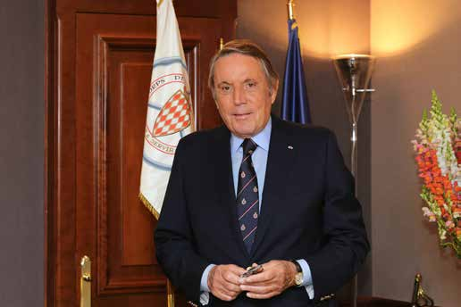

7

TIMETABLE

THURSDAY 24.05

06:00 Track closed

08:00 - 08:45 Formula Renault Practice session

09:15 - 10:00 Formula 2 Practice session

11:00 - 12:30 Formula 1 1st Practice session

13:20 - 13:36 Formula 2 Qualifying session (Group A)

13:44 - 14:00 Formula 2 Qualifying session (Group B)

15:00 - 16:30 Formula 1 2nd Practice session

17:15 - 18:00 Porsche Supercup Practice session

19:30 Track open

FRIDAY 25.05

06:00 Track closed

07:55 - 08:25 Formula Renault Qualifying + Start session (Série A)

08:33 - 09:03 Formula Renault Qualifying + Start session (Série B)

10:00 - 10:30 Porsche Supercup Qualifying session

11:30 - 12:35 Formula 2 Race 1 (42 laps or 60mn max.) 13:00 - 13:30 Renault Celebration laps

14:30 Track open

SATURDAY 26.05

08:00 Track closed

10:00 - 10:30 Formula Renault Race 1 (25 mn + 1 lap) 12:00 - 13:00 Formula 1 3rd Practice session

15:00 - 16:00 Formula 1 Qualifying session (Q1-Q2-Q3)

17:20 - 18:10 Formula 2 Race 2 (30 laps or 45mn max.) 19:30 Track open

SUNDAY 27.05

08:00 Track closed

10:30 - 11:05 Porsche Supercup Race (16 laps or 30mn max.)

12:00 - 12:30 Formula Renault Race 2 (25 mn + 1 lap) 13:40 Formula 1 Drivers' Parade

14:40 - 14:50 Formula 1 Starting grid set up

14:56 Formula 1 National Anthem *

15:10 Formula 1 76e Grand Prix de Monaco (78 laps or 120mn max.) 20:30 Track open

N.B : The closure of the “swimming pool road” will take place every morning 2 hours earlier.

8

TIMETABLE

MEDIA ACCREDITATION CENTRE OPENING HOURS

Wednesday 23 May 2018 from 08.00 am to 7.00 pm

Thursday 24 May 2018 from 08.00 am to 6.00 pm

Friday 25 May 2018 from 08.00 am to 1.00 pm

Saturday 26 May 2018 from 08.00 am to 12.00 am

Sunday 27 May 2018 from 08.00 am to 11.00 am

MEDIA CENTRE OPENING HOURS

Tuesday 22 May 2018 from 02.00 pm to 7.00 pm (Permanent Holders only)

Wednesday 23 May 2018 from 08.00 am to 9.00 pm

Thursday 24 May 2018 from 07.00 am to 10.00 pm

Friday 25 May 2018 from 08.00 am to 10.00 pm

Saturday 26 May 2018 from 07.00 am to 11.00 pm

Sunday 27 May 2018 from 07.00 am - until the last journalist leaves

MEDIA SHUTTLE SERVICE

|  | ACCREDITATION Start at 10 minutes intervals | PECHEURS Start at 10 minutes intervals | CENTRE MEDIA Start on request Ave de la Quarantaine Parking des Pêcheurs |
| --- | --- | --- | --- |
| Wed. 23 May | 08.00 am - 07.00 pm | 07.50 am - 08.00 pm | 06.00 pm - 10.15 pm |
| Thu. 24 May | 08.00 am - 06.00 pm | 06.50 am - 04.00 pm | 04.00 pm - 10.15 pm |
| Fri. 25 May | 08.00 am - 01.00 pm | 07.50 am - 01.00 pm | 01.00 pm - 10.15 pm |
| Sat. 26 May | 08.00 am - 12.00 pm | 06.50 am - 12.00 pm | 12.00 pm - 11.15 pm |
| Sun. 27 May | 08.00 am - 11.00 pm | 06.50 am - 11.00 pm | 12.00 pm - 00.00 am |

9

O T T O V R A L

U D

D R NO N C IADE A N A V 'L E L E U D E O

REM E N YU UN E E V A SED NIM S E T H E LLIEO D' I T A LI B E C A R G DRAV C D R DESCENTE MOULINS G SNIDRAJ OTTOVRAL A BOUL E V E DES SELAZE NU OR G .E RUE L U UD DES ORCHIDEES O E IDM B S S LU E N G E AR MO ATE C IRF CHEMIN DE LA NOIX R N I G S NILUOM B R ECALP SE P D E DNARG NUDREV ED E ED U

N A V E N U E D U C A R NI E R A V E N U E D U M A R E C H A L 8102 YAM 72-42 F O C H E R U E J U UL E S FE N R R Y E V A PLACE RAYNAL RB U L E E U ANC Q ILB U P E R A L C N A L E D A R D B LEGA V P ELLUAG ED LARENEG UD EUNEVA E E L L L TM I U M RUE O DU MARC HE A UD B C EUR .V ED EN R E A G L A . U L I C A N E D S CL R E E EZNI'L R C D R A B O V UL E E C N A P L A E R D E F C A E L D P D B E R AV. E L L IA MERC NT ERUAL L P R O A H T C St CHARLES tS T .SS P .VA E A EUNEVA A R P EIRRAB ED .SSAP SELRAHC ENNEICNA tS .CS .VA 'L A E NARG EIRETOP .F S .C N N S IC I E SED DRA V M E O L U E L U DEM O .S B Y S S EN A E O P ICNARF N .CSE G O SR emsiruoT ud noitceriD ER SED O A A N U E T O T D Q SRUE L LF T IV S L S A E I N H M T 661 661 29 773+ .léT IL I C W R RUHC O O B AL S R E V D E SN . .SS N R I R E A A T D A E N N P A J ARG A R R ED G S I R tS E E O D R L I N E U E N P N G E V O A L R N L E T EUNEVA I I U C U L R LE TÔ HTÉ S U U E D N E LO D P O R O D M E E U B P V NE V A A EIRELAG D E III SELRAHC R UR B A V SNIDRAJ SNIDRAJ E SIANOPAJ P ONISAC L UD ECALP É FA U C S O IR A P E D B C E GIS A R IV ONISAC UD O N A C N U S P TN O M R IA F LE O TO N H IS A C E G A R IV R E IT R O P U D E G A R IV T E N E S S A L E N N U T E É R T N E OLRAC-ETNOM Access: FIA VARIOUS CENTRE Location: MEDIA From By By MEDIA 4, DELEGATE foot: car: Quai Monaco INFORMATIONS Via and Via and Antoine rue avenue avenue avenue railway de 1er, la de Prince Colle, de 1st station la la Quarantaine. floor Place Quarantaine. Pierre, d’Armes, Place d’Armes, avenue avenue du Port du Port

U R E L S A S N E G F E O VI R P U D EU N EVA LIELOSUAEB C A R L P M U V D I E L A I E N T E U R T E - OCANOM ED ELIBOMOTUA RUE DES GERANIUMS E GA .CSE SSAP RC U LE O H LE E HCI C M tS S A I M tS V . S S E R D O S R U E E S I S DA R A U P E t A R U e E S D V E U D L E A U U R RI E E R C SET TE N L OIV E U A C V E E N UE I D S E G L ASSAP t U E A DOD M B IC E H R E C L E S A A L IL S E D E U U R E C A L P T I D E R C U D SIANNOYL P RI S N I R E C S E S I S LEHCI IMPASSE E A M t V S D E E U N EU R DE LA FONTAINE D E S U I S P S S E E D A T S O S C AVENUE E E A L E C I L A L HENRY EGRES L V A EELLA VELIHGAID A E ED NUE P DUNANT ESSEC DE E G A ERAUQS STRA-XUAEB TI L SED M SIAHCRAMUAEB .VANIRP ' R H E LE TÔ HR E G A TIM E H LE TÔ H EUNEV S IR A P E D A M L E N N U T E IT R O S neercs tnaiG / tnaég narcE selleressaP F1 Deputy: MEDIA Chairman National Assistants: Accreditations: Head STAFF Pierre of Press of Alexandre Communications the GUYONNET-DUPERAT Officer: Eddy Media GALLO BRUNEAU Richard Commission: assisted and MICOUD FIA Michel by Media Céline Delegate: DOTTA LUBERT Matteo BONCIANI

AVE N U E D E R U E D E A L RE BELLEV L L UE I V E RESPI U R O Q O E R V A R D ED E UN E V A BO U LE VA R D EGASSAP ETROP EGUOR D E 1F Responsibles Richard MICOUD of the assisted Media by Centre: Laurie AUGE and Majdi HAJJAR L E UE BEL O U N U kcoddaP

XIRP R R UE B SUISSE A V E CO S TA E N A N O IT E Staff:

DNARG ARIERIEP AL ED .CSE BOULEVARD 10 06 01 DE SETAMUA . G C E S S E ED A V E N U E ATSOC D E L A Z1 C IH C ED OCANOM A ID E M A T ID E R C R T N E C Alain Anne HALIN, d’AYRAL Jérôme DE SERIGNAC, HALIN, Aldo Marc COLETTI, BERGHMANS, François Alain GIANNETTINI, BERNARDI, Jean Armand ITURRALDE, BONIFACI, FCNS 39 EO T .CSE AL ED N O TROP C A FCNS Bernard LATOUR, Fabrice LESNE, Christian MANE, Richard MULLER, Stéphane MULLER,

AVENUE D' e67 ALSAC E P eraG 773+ .léT GV A R IV É D -E ECALP ETOVED A 1 ER G A R IH C SRUE H eraG Yann-Antony NOGHES, Alain SACCO et Flavio VITALI.

ITTE H N IU G R U O E B EN E OM T T SE E D R D U B O SNOITAMROFNI SUOIRAV V EDNABAL R UE M E ALB O E US Q ESCALIER I UET B MALBOUSQUET U RU IMP ITTEHGENOM ITTEHGENOM R T . DE S D A D CARRIERES U L R E CH A D EM ÉRO NI V ERAUQS E KCRAMAL L N U N ID O O R J H A B E U R E U Q IG LE B P EXOTIQ E D ESC. J O O R I D GABRIEL S S R O U A B ARNOUX E E V III E P P L H U EIBRUT O AL ED - B NIMEHC FRA U R çN II I R O E E I I S N E IA ETOVE IN R IA O D R T D .C R A V E L N U O ED D B R EETNOM S E e EtS A ANAYAR V UD AL O V NI . T CT SE E T ER S L T E E A IL T G S E R U E A L U O L U I S U L U .P G E R M T U I SAC O S A A E IL V G B E A E R U G A U E A L L E R T S E R E B D EUR ID E L A M etS IR G R R E R U U MCA euqituoB R E E P I s E P se N R A I E U 1K T N E I C S E T S D O E N I U I à B R N F I L R F R O E R P T A 6K L U E T I F N E T R M E A E U RI R A S . T ERÈICNIRP B R R E A L S TRAPÉD E O R 1 O Y E G N N IV M C St O E e T N S N U E E R D I D Z R U L R S IU O L A N G E U N P N D EGOL E E S E A E S R L E I B SS P E U U ER R R U U R DE I U N U R R L R O G E EN E C UA E L SDNATS A S RRO I P M N R BE I D N R R E T C U ECALP Y E E U R S SEMRA'D S R E A D E V C IN A M R A E AZ O IL O L LI V ZAR L L N O E E U RE N RT OB U E E U U DE R E S P A 2X r ç e1 D ORE U TREBLA S EE GH AG RO IVN PORT 1X T S .A 05 IAUQ E D E GS AA RR IV AI S V E S S A C A L CI E R QUAI ANTOINE M E A DI V 1 E E A N R U C E E D N E T L R A E Q U A R A N T AI N E PE C SE G N IK R A P D M U S E EP N IMEHC A ID E M P O C E A N O G R A HI Q U E GNIKRAP SRUEHCEP SED MEDIA MEDIA - - - - * - TV1 main from Data sions Immediate On On 25 39 : left room) Host acquisition and CAR INFORMATIONS TV TV Parking (Shuttle to feed receivers receivers races PARKING right transmission - des Service TV2 from from Pêcheurs installed installed : Timing the race at of 22 10 headquarter - this at on marshal - TV3 minutes Avenue the the information : Timing Media 39 posts intervals) de commentators of - la Centre TV all divided Quarantaine in 4 informations English : International (TV on n° positions and the 1). circuit French. concerning feed Radio-TV. (only as well in the the as practice Media the pits Centre ses- area. - N LN E 00 A V PRI A ELLIEIVTNOF 50

O T T O S E R E R F S E V O IB ELLOC AL RR UO EC HDE UR gnikraP II siuoL edatS tropiléH 29 773+ P O T E U ITA ED noitceriD .léT ELLIEIVTNOF

O T T O R O T C E U E T E V O R N AS SE RB R LP EUR P ED

10 E H C INROC NIMEHC ENNEYOM SERIOVÉR SED T O C R E H E U N E VA H E U N E VA N ID R E X O A TI Q J U D DRAVELUOB E U Q IG LEB E IT D AL P D EU R C E U N E R A V A E V U E R I L T U HPE A SO J EU R O L B P EUR III R E IN IA R C H A R L E S III CMN E N T RREI ECIL CF OO M E AL LE T VI TROP 11 A L D E D A R D E T U O R L E V V A R U E O L B U O B H SEFLEU U R H T E II ELLEIVTNOF DES G A S S EREIRRUOF 8A P UI AVENUE

- EHCINRO C P A S T E U R AV E N U E ESC. DES SALINES III S E L R P D E L O SERUGIL SED EUNEVA ENNEYOM A A U E CIMETIERE MONACO H C EIRTSUDNI'L S T N D SREV E V A DE ECIN R A V LENNUT SREV E L ED U EUR O B

LOCKERS

Journalists and photographers will be able to leave their equipment on the lockers, available

at the Media Centre opening hours.

PODIUM PHOTOGRAPHER GRANDSTAND

Installed at the level of starting-finishing line, between the track and the pits lane. Permanent credential photographers with FIA jacket or a race tabard will be authorized. Pods and tripods forbidden.

NB: The waiting area is located at the foot of the Race Direction building. The marshals and the security staff are in charge of controlling the transfer of the photographers from the pit entry bridge till the waiting area (15 minutes from the end of the race) and across the Pitlane (3 laps before the end of each race).

PHOTOGRAPHER TOWER

Installed on left side of Sainte-Dévote bend, access by underground passage. Permanent credential photographers with FIA jacket or a race tabard will be authorized to access. Pods and tripods forbidden.

CAMERA REPAIR SERVICE FOR PHOTOGRAPHER

Camera repair service will be providing for photographers. It will be located in the photographer’s area.

INFORMATION

For safety reasons, the pit lane and the track will be evacuated 15 minutes before each practice session and race; only the tabards holders can go alongside the track; these decisions concern not only the Formula One but also F2 and all Support Races.

12 1133

PRESS CONFERENCES

FORMULA 1 WORLD CHAMPIONSHIP

Wednesday 23rd May 2018 - 03.pm

Press Conference for a maximum of 6 drivers chosen by the FIA F1 Head of Communications and Media Delegate, in the Press Conference Room of the Media Centre.

Thursday 24th May 2018 - 01.pm

Press Conference for a maximum of 6 team personalities chosen by the FIA F1 Head of Communications and Media Delegate, in the Press Conference Room of the Media Centre.

Saturday 26th May 2018 - after the qualifying session

a) TV unilateral interviews with top three drivers of the qualifying session from the Pitlane entry;

b) Post-Qualifying Press Conference with top three drivers of the qualifying session in the Press Conference Room of the Media Centre.

Sunday 27th May 2018 - after the prize-giving ceremony

a) TV unilateral interviews with top three finishing drivers - Podium

b) Post-Race Press Conference with top three finishing drivers, in the Press Conference Room of the Media Centre.

FIA FORMULA 2 CHAMPIONSHIP

Thursday 24th May 2018 - 02.20 pm

Post-Qualifying Press Conference with top three drivers of the qualifying session, in the Press Conference Room of the Media Centre.

Friday 25th May 2018 - 01 pm

Post-Race 1 Press Conference with top three finishing drivers, in the Press Conference Room of the Media Centre.

Saturday 26th May 2018 - 06.30 pm

Post-Race 2 Press Conference with top three finishing drivers, in the Press Conference Room of the Media Centre.

* * * * *

We remind that during the press conferences, no TV crew nor any personnel holding moving pictures TV cameras are allowed in the Media Centre unless specifically authorised by the FIA Press Delegate.

14

RESTRICTED AREAS DNEB REITROP YRTNE In Monaco, the head-marshals have the right to admit or refuse access to any person in LENNUT their marshal’s zone. 8 UAEBARIM Moreover security obliges us to establish forbidden and restricted areas. In the restricted LETÔH areas it is possible to stay a brief instant only with the head-marshal consent. These zones EPACSE 7 are clearly indicated on the circuit by panels and are also shown on the attached map. 5 SAERA ELOPORTEM ENOZ 7102 LETÔH 6 ONISAC OLRACETNOM SLLAHSRAM DETCIRTSER EGDIRBTOOF DNEB TNOMRIAF YAM NUS erauqs TAKE CARE SIRAP lennut tenessaM 82-52 ED ONISAC ÉFAC neewteb 5 STFIL 5 laps before the end of the FIA Formula 2 on Saturday, and 5 laps before the end of the F1 dna 9 4 Grand Prix on Sunday, some gates will be closed. - TENESSAM OCANOM DNEB These gates have been clearly marked. ED LETÔH SIRAP 3 Please pay attention to this when you circulate between the pits, lane and Media Room.

EGATIMREH TIXE ED LETÔH LENNUT ELIBOMOTUA

EPACSE ednetsO’D ydenneK 01 2 .vA XIRP neewteb FJ .vA STFIL dna REWOT ENACIHC N DNARG P O REHPARGOTOHP IT E 11 A ID A T ID R T E N M E R E C C ht57 C A NORIHC DNEB 1 21 SIUOL LORTNOC N E S R AI U N T G N E H

| 1A 2018 21C 1B 12B 21B 12A 21A 2A 2B 13A 20B 13B 11B 4A 5 14 11C 11A 20b 15B 2C 4B 7 20A 16 2D 3C 8 15A 10 8B 6bis 22 9D 6 3A 3B 9A 19A 19B 17 9C 9B 18 ® | 2018 |
| --- | --- |
| ® |  |

DNEB ETOVED-ETS 31 ECAR DNEB E N T R E Q U A R A IK R A P C E P S E ESSACSAR C A D A L 12 DI E E D TRATS 41 51 M U E N E V A STIP REWOT 61 EGDIRBTOOF SSECCA 71 81 SAERA REHPARGOTOHP 22 LLA 02 OLINE

DETCIRTSER C A R E G I A S SEHGON.A DNEB 91 E L O E U R

ELGNAL E U U R E PRIN C U E E S S D E IN M A IL Z Z AR RRE U T E E D U E R S A ç A O V R E E N S U E DU PORT R R

15 16

650 620 120 EQUIPMENTS AND MEANS Marshals Controllers

Professional fire men 2 disincarceration and extraction 3km337 vehicles 42 intervention stations 84 Circuit Security 5 fire express vehicles Lenght of the circuit 2 reduced intervention stations 22 Paddock Security 290km/h 26 Pits Security

Top speed

260,286km 19 Bends 78 laps 8 on the left 1’12”178 11 on the right

Record Kimi RAIKKONEN (2017) VIM VIM (Ferrari)

VIM Extraction

Extraction TRACK MEDICAL EQUIPMENT PUBLIC MEDICAL EQUIPMENT

1 Advanced medical station 5 doctors 5 Red Cross doctors 1 Medical Center 6 first aid nurses 1 Hospital structure 12 Red Cross first aid nurses 29 Ressucitors doctors 210 first aid workers 8 Doctors 15 ambulancies

1100 tonnes grandstands 1420 22 First aid nurses 49 18 First aid workers Protection tyres 10 3 Medical intervention cars (MIC) Cameras to supervision Cranes 2 Disincarceration and extraction vehicles 15 fixed 34 motorised 21 km safety rails Virage Sainte Dévote 1 Helicopter Haut avenue d’Ostende 36 Cardiovascular and breathing ressucitation kits Square Massenet 800 880 m barriers Tecpro® Avenue des Spélugues 30 Depression mattress Extinguishers / 1 each 15 meters Echappatoire virage Mirabeau 6 K.E.D. vertebral and spinal immobilizing plaster 256 Virage Sun Casino 8 Ambulancies Sortie Tunnel Talkie-walkies 20 000 m2 wire netting 12 Sortie échappatoire Chicane 10 Radio networks Sortie “S” Piscine Tow trucks Rue Suffren Reymond

17 18

                                           

                                              

                                                        

                                                      €    ‚

SPEED

           on Monaco Circuit (2,076 miles)                   

   

 

                                       

                                                                                            

                  1’50’’ 109,309 km/h     1’51’’ 108,324 km/h           1’52’’ 107,357 km/h                1’53’’ 106,407 km/h 1’54’’ 105,473 km/h         1’55’’ 104,556 km/h       1’56’’ 103,655 km/h

                1’57’’ 102,769 km/h 1’58’’ 101,898 km/h               1’59’’ 101,042 km/h 2’00’’ 100,200 km/h

|  |  |  |  |  |  | 2’01’’  „   „2ƒ’02’’ | 99,371 km/h  ƒ 9 8ƒ,557 km/h “„…„Ž  |  |
| --- | --- | --- | --- | --- | --- | --- | --- | --- |
| 1’12 1’ 13 | ’’  ’’  | ˆ  1‰6„…6†,999 km/h    164,712 km/h |    ƒ     ƒ  1’32’’ | 130,695 | km/h | 2’03’’   Š ƒ’ | 97,75   ‹„    | 6 km/h    Ž   Ž |
| 1’14 1’15 |  ’’ ’’     |        ƒ1 6  2 ,486 km/h   Š              160,320 km/h |  „  1’33’’   ‡ 1’34’’  „  | 12 9 , 2ƒ9  0   127,914 | km/h km/h |  |   9 6,96 96,19   …  ŠŠ |  |
|  |  |  |  | 12 6 , 5ƒ6  8   125,250 km/h 123,958 km/h 122,693 km/h 121,545 km/h 120,240 km/h 119,049 km/h 117,882 km/h 116,737 km/h 115,615 km/h 114,514 km/h 113,433 km/h 112,373 km/h 111,333 km/h 110,311 km/h | km/h |  |   9 5Ž,42 |  |

 ‡ ‹    

   

19

THE CIRCUIT

The circuit itself had not undergone any major changes, until 1952 where modifications are brought to the Sainte Dévote bend. It was not until 1973 that the layout underwent a change again. It was extended another 135 ms by the addition of a new track along the port, a track which was to join the track of the new pool and which would end in a hairpin bend around the restaurant «La Rascasse». As the length of each lap was increased, the Grand Prix was shortened to 78 laps. In 1976, two more chicanes, one to Sainte Dévote, the other coming round the “La Rascasse hairpin bend” were added, then in 1986, the widening of the road at the beginning of the “Quai des Etats Unis” at the foot of the “Boulevard Louis II” descent, allowed the creation of a new chicane. In 1997, the first « S » of the Swimming pool has been drawn again and is called bend « Louis Chiron ».

Between 2002 and 2003 Grand Prix: construction of a platform of about 5000 m2 by creating a 150m long quayside wall aligned on the old front at a distance of approximately thirty meters.

The quayside wall has been made by stacking nearly 400 concrete blocks, each weighing 10 tones.

It also serves as a retaining wall for the 25,000m3 of calibrated backfill used for reclaiming the land to create a new platform of about 5000m2 1.20 m above sea-level.

In the mass of the platform nearly 3km of trenches have been laid for installing various main networks. The networks will supply the area with electricity, telephony, television, drinking water and sewage, both during the Grand Prix period and for future events.

On the surface of the platform, there are:

- The new stretch of the Formula 1 circuit track. This consists in the translation of the former line by about ten meters towards the waterfront

- 36 concrete supports which used as of the 2004 Grand Prix for assembling the metal scaffolding for the spectator boxes 13m from ground level above the three new stands and overlooking the new stand area.

After the 2011 Monaco Grand Prix Automobile, Automobile Club de Monaco directors met with Charlie Whiting, F1 World Championship Race Director and Safety Delegate, with the aim of optimising safety on the Monaco circuit and implementing appropriate changes. All work requested by the FIA was completed, as follows:

• The Pit Lane exit, leading to the track, was widened from 10m to 20m, by removing a planter. Cars will now be able to return to the track at a much greater speed.

• A laser study of the road surface was undertaken by a specialist company, leading to a planing of the road from the tunnel to the chicane by up to 20cm at certain points. This removed a bump and corrected some banking.

• The impact point of the chicane was pushed back by 14.6m.

• The track surface at the exit of the escape lane and the Mirabeau escape lane was replaced with an abrasive braking surface, as used on the Paul Ricard HTTT circuit.

• Pit lane protection was completely refurbished by removing windows and replacing them with metal safety gratings.

• Tyre barriers previously placed on the St Devote corner and around the Swimming Pool S-bend have been replaced with the latest generation of TecPro barriers.

• As every year, a third of the circuit was resurfaced, between the tunnel exit and the Rascasse.

In 2013, creation a chamfer inside Mirabeau Supérieur bend and replacement of the tyre walls by « Tecpro » blocs in, and on the Mirabeau Supérieur bend escape lane.

20

In 2014, a new pit wall was built. It consists of 90 steel blocks filled with concrete, each weighing 2.7 tonnes. A gateway was created along the pit wall in the middle of the pit lane, dedicated mainly to the persons who must work on the starting grid. To ensure a better overall view, the bridge located at the “Diver” in front of the pool has been removed. A new foam extinguishing system was implemented along the two thirds of the tunnel. A sidewalk outside of the track was conducted between the new Yacht Club and the chicane. A safety rail, sea side, now replaces the old wall opposite the corner of the “Tobacco” Corner.

Since 2015, a slight modification was done in the “Tabac” corner (more close on entrance) because the entire track of the Darse Nord part was shifted by 2m70 to the sea. The total distance of the track is now 3.337km.

From 2016, a modification to the lighting in the tunnel was made to reduce the “black hole” effect upon entry and the glare drivers experience when exiting. The track was extended by 30cm at the point of the Sainte Devote corner going into Avenue de la Costa. However, in 2016 the biggest change remains the new Race Control building.

2018: NEW HIGH TECH PITS

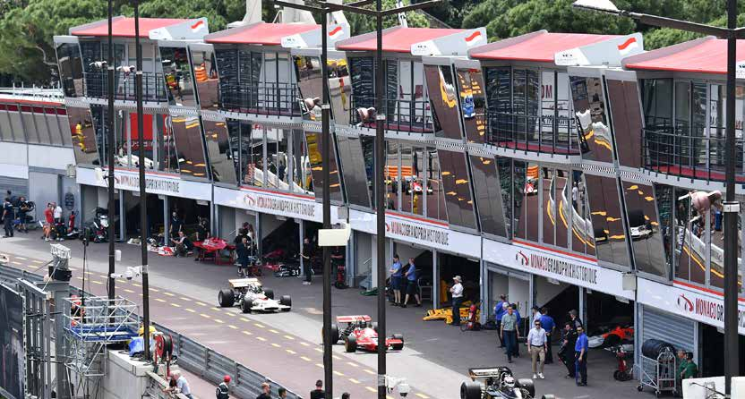

After the introduction of the new race control building two years ago and the Royal Box in 2017, it was vital to maintain that coherent style and harmony to ensure that it fitted in with the whole location. It was with this in mind that the architectural themes of these buildings have been retained.

These new pits show that the Automobile Club of Monaco is committed to the future in its will to continually innovate and move forward and modernise the circuit. After nearly 15 years of efficient and loyal service with the old pits, it was time for change, time to build something new. Over the last few years, Formula One has visited a lot more permanent circuits and indeed has seen many new technological developments. So it’s with the total agreement with the Formula One teams and thanks to the experience gained since 2004 that these new pits have been designed and built.

21

First of all in order to gain space, the basic structures have been modified with the introduction of a second floor. This has increased available space by a third but it still has to meet a fundamental requirement of a temporary street circuit: the ability to be built and pulled down quickly. Consequently, the manufacturer was set a target in order to ensure that it would take less than a day to construct each pit. There being 12 in total, two weeks would be sufficient.

Each pit has a total floor space of 450 square meters, comprising three floors of 150 square meters each:

• The ground floor is for the mechanical equipment

• The first floor is shared between the IT infrastructure, track monitors, meeting rooms and engineers’ offices

• The second floor comprises the drivers’ rest rooms and hospitality for sponsors and VIP guests. It has a fantastic view of the lower part of the circuit and the pit lane.

At the front of the building on the pit lane side are two sloping columns of mirrored glass. They frame the facade of the whole structure, which comprises the vertical bays including, on the second floor, a panoramic balcony. This balcony is protected by a roof which resembles the rear wing of a Formula One car.

As in 2004, the historic Formula One cars were the first to benefit from these new pits at the 11th Grand Prix Historique on May, 11, 12, 13. They will be home to the Formula One cars taking part in the FIA’s Formula One World Championship from May 24, to 27, 2018.

NUMBERS

> Number of modules ..................................................................................................................... 120

> Hours taken in construction ............................................................................................ 21000

> Time taken to install on circuit .................................................................................... 14 days

> Area ...................................................................................................................................................................... 18000 m2

> Weight of winged roof ............................................................................................................. less than 3 tons

> Weight of the basic steel framework ................................................................ 18 tons

> Total weight of the steel structure ........................................................................ 400 tons

> Total length of the steel girders, uprights and beams ............. 30 km

> Number of rivets in the winged roof .................................................................. 48000

> Length of electric cabling ..................................................................................................... 6,3 km

> Number of lights ............................................................................................................................... 1488

> Number of electrical connectors .............................................................................. 1220 > Maximum area required (storage, workshop) more than 10000m³

22

MONACO HARBOUR - CIRCUIT CONSTRUCTION IN 5 STEPS

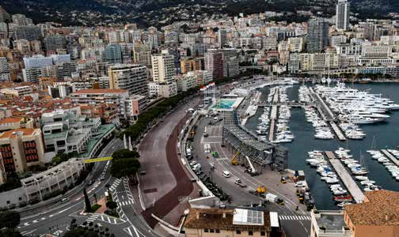

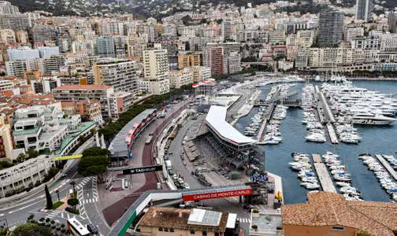

SUNDAY 25 MARCH 2018 - 8:30 / MONACO - STEP 1 SUNDAY 8 APRIL 2018 - 9:30 / MONACO - STEP 2 MELBOURNE, AUSTRALIAN GRAND PRIX BAHRAIN, BAHRAIN GRAND PRIX

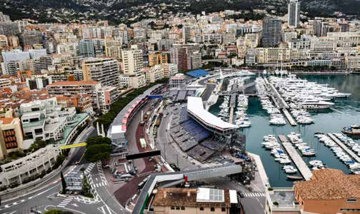

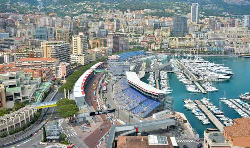

SUNDAY 15 APRIL 2018 - 20:00 / MONACO - STEP 3 SUNDAY 29 APRIL 2018 - 15:30 / MONACO - STEP 4 SHANGAI, CHINESE GRAND PRIX BAKU, GRAND PRIX OF AZERBAIJAN

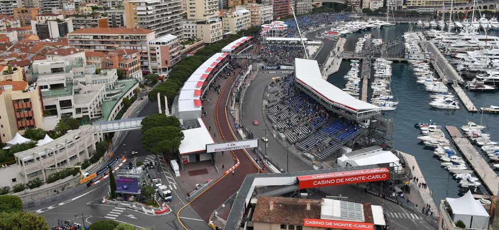

SUNDAY 13 MAY 2018 - 14:00 / MONACO - STEP 5 / BARCELONA, SPANISH GRAND PRIX

23

PODIUM PROCEDURE IN MONACO

One lap after the finish line is crossed, the winner and second and third finishers stop below the Princely Lodge.

Unilateral TV interviews of the top three drivers are then conducted, in the Princely Lodge, for the attendant public.

When the constructor of the winning car has joined them, they enter the Princely Lodge.

The winning driver’s national anthem is played first, followed by that of the winning constructor. If the driver and constructor both share the same national anthem then it is played once only.

HSH Prince Albert II of Monaco then presents his trophy to the winning driver. The winning constructor, second-placed driver and third-placed driver each receive their prizes in that order. Champagne.

Then, immediately after, the three drivers will be driven to the Press Centre, on Quai Antoine 1er, to attend the press conference.

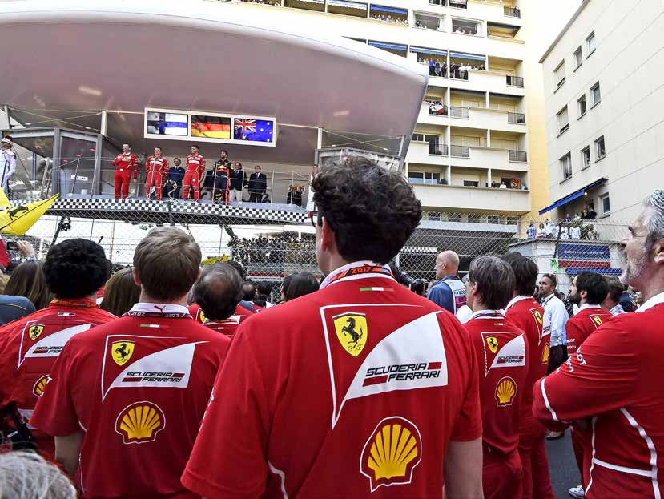

24

75th GRAND PRIX DE MONACO 2017

PRACTICE SESSIONS First Practice Session Classification

1st Free Practice Session

POS NO DRIVER NAT ENTRANT TIME LAPS GAP KPH TIME OF DAY 1 44 L. HAMILTON GBR Mercedes AMG Petronas F1 Team 1:13.425 40 163.611 10:48:37 2 5 S. VETTEL GER Scuderia Ferrari 1:13.621 34 0.196 163.176 10:58:15 0.150 3 33 M. VERSTAPPEN NED Red Bull Racing 1:13.771 32 0.346 162.844 11:21:27 0.020 4 77 V. BOTTAS FIN Mercedes AMG Petronas F1 Team 1:13.791 40 0.366 162.800 10:49:22 0.063 5 3 D. RICCIARDO AUS Red Bull Racing 1:13.854 45 0.429 162.661 11:03:02 0.257 6 26 D. KVYAT RUS Scuderia Toro Rosso 1:14.111 42 0.686 162.097 11:14:15 0.053 7 7 K. RAIKKONEN FIN Scuderia Ferrari 1:14.164 37 0.739 161.981 11:06:35 0.037 8 11 S. PEREZ MEX Sahara Force India F1 Team 1:14.201 32 0.776 161.900 11:02:20 0.132 9 55 C. SAINZ ESP Scuderia Toro Rosso 1:14.333 39 0.908 161.613 11:08:52 0.092 10 31 E. OCON FRA Sahara Force India F1 Team 1:14.425 39 1.000 161.413 11:06:53 0.192 11 19 F. MASSA BRA Williams Martini Racing 1:14.617 37 1.192 160.998 10:45:00 0.196 12 2 S. VANDOORNE BEL McLaren Honda 1:14.813 38 1.388 160.576 11:15:43 0.057 13 20 K. MAGNUSSEN DEN Haas F1 Team 1:14.870 34 1.445 160.454 10:51:46 0.084 14 22 J. BUTTON GBR McLaren Honda 1:14.954 35 1.529 160.274 11:16:34 0.367 15 8 R. GROSJEAN FRA Haas F1 Team 1:15.321 33 1.896 159.493 10:49:31 0.274 16 18 L. STROLL CAN Williams Martini Racing 1:15.595 44 2.170 158.915 10:56:41 0.354 17 30 J. PALMER GBR Renault Sport F1 Team 1:15.949 42 2.524 158.174 11:05:25 0.309 18 94 P. WEHRLEIN GER Sauber F1 Team 1:16.258 33 2.833 157.533 11:00:35 19 27 N. HULKENBERG GER Renault Sport F1 Team 3 20 9 M. ERICSSON SWE Sauber F1 Team 3 Second Practice Session Classification

2nd Free Practice Session

| POS NO DRIVER NAT ENTRANT TIME LAPS GAP KPH TIME OF DAY 1 5 S. VETTEL GER Scuderia Ferrari 1:12.720 38 165.198 14:51:42 2 3 D. RICCIARDO AUS Red Bull Racing 1:13.207 35 0.487 164.099 14:51:50 0.076 3 7 K. RAIKKONEN FIN Scuderia Ferrari 1:13.283 46 0.563 163.928 14:43:02 0.048 4 26 D. KVYAT RUS Scuderia Toro Rosso 1:13.331 41 0.611 163.821 14:15:09 0.069 5 55 C. SAINZ ESP Scuderia Toro Rosso 1:13.400 43 0.680 163.667 14:40:42 0.086 6 33 M. VERSTAPPEN NED Red Bull Racing 1:13.486 36 0.766 163.476 14:20:47 0.313 7 11 S. PEREZ MEX Sahara Force India F1 Team 1:13.799 45 1.079 162.782 14:34:16 0.074 me8keepe4r4: L. HAMILTON GBR Mercedes AMG Petronas F1 Team 1:13.873 31 1.153 162.619 14:42:49 0.017 9 20 K. MAGNUSSEN DEN Haas F1 Team 1:13.890 46 1.170 162.582 14:45:13 0.012 10 77 V. BOTTAS FORMFUINLA M1e rcGedResA AMNGD Pe tPronRasI XF1 TDeaEm MONA1C:13O.9 02201379 - M1o.1n8t2e-Carlo 162.555 14:44:01 0.044 N1 o 1 p a r t o f th 2 e s e S re. s Vu l tAs / d Na tD a mO a Oy b Re rNe p E r o d u ce d , s t oB rE e dL in a r e Mt ri ec vL a a l r se y n s t eH m o no dr ta ra n sm it te d in a n y fo r m o r b y a n y m e 1a n :s 1 e 3l e . c9t r 4 o n6 ic , m 4e c2 h a n ic a l, 1 p h. 2o t2o c6 o p y i n g0 , r.u e0b c l3o r5 d in g , b r1o a6 d2 c a. s4 t i5n g9 o r o th e r1 w 4 is:e51:03 w i t h o u t p r i o r p e r m is s i o n o f t h e c o p y ri g h t h o ld e r e x c e p t f o r r e p r o d u c t i o n i n l o c a l/ n a tio n al/ in te r n a ti on a l d ai l y p r e s s a n d r e g u l a r p r i n t e d p u b li ca t io n s o n sa le to t h e p ic w it h in 9 0 d a y s o f th e e v e n t t o w1h2ich the 2re2sultJs/d. aBta UreTlatTe OanNd provided that the cGopByRright symMbcoLl aarpepne aHrso tnodgaether with the address shown below.1:13.981 37 1.261 162.382 14:51:54 he F1 FORMULA 1 logo, F1 logo, F1 FIA FORMULA 1 WORLD CHAMPIONSHIP logo, FORMULA 1, FORMULA ONE, F1, FIA FORMULA ONE WORLD CH0A.0M2PI2ONSHIP, GRAND PRIX and ©1 e l 2 a 30 te 1 d 7 m Fo a 1 r r k 9m s u a l r aF e O . t r n a Me d e AW m oS a rl r Sd k s AC o h f a F m o p rm io u n la s h O ip ne L L td ic , e 6 nB s PRi r n iAg n c B e V s , G a Wa F t o eilr ,lm iLau oml n as d O oMn n ea, rS gtriWnoui7 pR 1 caQ ocJ mi,n p Ega n n g y l . and. 1:14.003 46 1.283 0.019 162.333 14:47:18 14 8 R. GROSJEAN FRA Haas F1 Team 1:14.022 44 1.302 162.292 14:42:30 0.071 15 31 E. OCON FRA Sahara Force India F1 Team 1:14.093 47 1.373 162.136 14:46:10 0.381 16 18 L. STROLL CAN Williams Martini Racing 1:14.474 27 1.754 161.307 14:31:08 0.396 17 27 N. HULKENBERG GER Renault Sport F1 Team 1:14.870 41 2.150 160.454 15:02:54 0.746 18 30 J. PALMER GBR Renault Sport F1 Team 1:15.616 8 2.896 158.871 14:10:09 0.075 19 9 M. ERICSSON SWE Sauber F1 Team 1:15.691 32 2.971 158.713 14:48:13 0.004 20 94 P. WEHRLEIN GER Sauber F1 Team 1:15.695 37 2.975 158.705 14:52:44 |  |  |
| --- | --- | --- |
| 11 |  |  |
| No part of these results/data may be reproduced, stored in a retrieval system or transmitted in any form or by any means electronic, mechanical, photoc without prior permission of the copyright holder except for reproduction in local/national/international daily press and regular printed publications on sale | o p y i n g0 , r.u e0b c l3o r5 d i to t h e p ic w | ng, broadcasting or otherwise ithin 90 days of the event to |
| w1h2ich the 2re2sultJs/d. aBta UreTlatTe OanNd provided that the cGopByRright symMbcoLl aarpepne aHrso tnodgaether with the address shown below.1:13.981 37 1.26 he F1 FORMULA 1 logo, F1 logo, F1 FIA FORMULA 1 WORLD CHAMPIONSHIP logo, FORMULA 1, FORMULA ONE, F1, FIA FORMULA ONE WO |  |  |
| ©1 e l 2 a 30 te 1 d 7 m Fo a 1 r r k 9m s u a l r aF e O . t r n a Me d e AW m oS a rl r Sd k s AC o h f a F m o p rm io u n la s h O ip ne L L td ic , e 6 nB s PRi r n iAg n c B e V s , G a Wa F t o eilr ,lm iLau oml n as d O oMn n ea, rS gtriWnoui7 pR 1 caQ ocJ mi,n p Ega n n g y l . and. 1:14.003 46 1.28 14 8 R. GROSJEAN FRA Haas F1 Team 1:14.022 44 1.30 15 31 E. OCON FRA Sahara Force India F1 Team 1:14.093 47 1.37 16 18 L. STROLL CAN Williams Martini Racing 1:14.474 27 1.75 17 27 N. HULKENBERG GER Renault Sport F1 Team 1:14.870 41 2.15 18 30 J. PALMER GBR Renault Sport F1 Team 1:15.616 8 2.89 19 9 M. ERICSSON SWE Sauber F1 Team 1:15.691 32 2.97 20 94 P. WEHRLEIN GER Sauber F1 Team 1:15.695 37 2.97 |  |  |
| 20 |  |  |

| K. MAGNUSSE |  |  |  |  |  |  |  |  |
| --- | --- | --- | --- | --- | --- | --- | --- | --- |
| V. BOTTA | FORM | FUIN | LA | M1e rcGedResA AMNGD Pe tPronRasI XF1 TD | eaEm MON | A1C:13O.9 02201 | 379 - M1o.1n8t | 0.012 2e-Carlo |

25

Timekeeper:

FORMULA 1 GRAND PRIX DE MONACO 2017 - Monte-Carlo

No part of these results/data may be reproduced, stored in a retrieval system or transmitted in any form or by any means electronic, mechanical, photocopying, recording, broadcasting or otherwise without prior permission of the copyright holder except for reproduction in local/national/international daily press and regular printed publications on sale to the public within 90 days of the event to which the results/data relate and provided that the copyright symbol appears together with the address shown below. The F1 FORMULA 1 logo, F1 logo, F1 FIA FORMULA 1 WORLD CHAMPIONSHIP logo, FORMULA 1, FORMULA ONE, F1, FIA FORMULA ONE WORLD CHAMPIONSHIP, GRAND PRIX and related marks are trade marks of Formula One Licensing BV, a Formula One group company. © 2017 Formula One World Championship Ltd, 6 Princes Gate, London, SW7 1QJ, England.

75th GRAND PRIX DE MONACO 2017

PRACTICE SESSIONS Third Practice Session Classification

3rd Free Practice Session

POS NO DRIVER NAT ENTRANT TIME LAPS GAP KPH TIME OF DAY 1 5 S. VETTEL GER Scuderia Ferrari 1:12.395 23 165.939 11:42:37 2 7 K. RAIKKONEN FIN Scuderia Ferrari 1:12.740 26 0.345 165.152 11:45:07 0.090 3 77 V. BOTTAS FIN Mercedes AMG Petronas F1 Team 1:12.830 29 0.435 164.948 11:46:52 0.110 4 33 M. VERSTAPPEN NED Red Bull Racing 1:12.940 27 0.545 164.699 11:32:52 0.290 5 44 L. HAMILTON GBR Mercedes AMG Petronas F1 Team 1:13.230 27 0.835 164.047 11:19:37 0.162 6 3 D. RICCIARDO AUS Red Bull Racing 1:13.392 24 0.997 163.685 11:33:01 0.008 7 55 C. SAINZ ESP Scuderia Toro Rosso 1:13.400 27 1.005 163.667 12:00:00 0.163 8 26 D. KVYAT RUS Scuderia Toro Rosso 1:13.563 23 1.168 163.304 11:24:37 0.033 9 20 K. MAGNUSSEN DEN Haas F1 Team 1:13.596 21 1.201 163.231 11:50:55 0.209 10 2 S. VANDOORNE BEL McLaren Honda 1:13.805 21 1.410 162.769 11:26:28 0.131 11 11 S. PEREZ MEX Sahara Force India F1 Team 1:13.936 23 1.541 162.481 12:00:07 0.040 12 22 J. BUTTON GBR McLaren Honda 1:13.976 26 1.581 162.393 11:48:28 0.096 13 31 E. OCON FRA Sahara Force India F1 Team 1:14.072 21 1.677 162.182 11:21:53 0.000 14 19 F. MASSA BRA Williams Martini Racing 1:14.072 28 1.677 162.182 11:58:54 0.211 15 27 N. HULKENBERG GER Renault Sport F1 Team 1:14.283 24 1.888 161.722 11:58:16 0.264 16 8 R. GROSJEAN FRA Haas F1 Team 1:14.547 23 2.152 161.149 11:25:00 0.128 17 18 L. STROLL CAN Williams Martini Racing 1:14.675 35 2.280 160.873 11:51:18 0.489 18 30 J. PALMER GBR Renault Sport F1 Team 1:15.164 25 2.769 159.826 11:38:25 0.127 19 94 P. WEHRLEIN GER Sauber F1 Team 1:15.291 29 2.896 159.556 11:59:41 Doc0 .53722 Time 18:25 20 9 M. ERICSSON SWE Sauber F1 Team 1:15.863 26 3.468 158.353 11:59:38 Qualifying Session Official Classification

Qualifying session

POS NO NAME ENTRANT Q1 LAPS PERCENT TIME OF DAY Q2 LAPS TIME OF DAY Q3 LAPS TIME OF DAY 1 7 K. RAIKKONEN Scuderia Ferrari 1:13.117 8 100.053 14:09:12 1:12.231 7 14:35:00 1:12.178 8 14:58:39 2 5 S. VETTEL Scuderia Ferrari 1:13.090 8 100.016 14:09:23 1:12.449 7 14:36:52 1:12.221 8 15:00:14 3 77 V. BOTTAS Mercedes AMG Petronas F1 Team 1:13.325 10 100.337 14:12:33 1:12.901 10 14:30:17 1:12.223 10 15:00:29 4 33 M. VERSTAPPEN Red Bull Racing 1:13.078 8 100.000 14:09:17 1:12.697 9 14:38:58 1:12.496 7 15:00:35 5 3 D. RICCIARDO Red Bull Racing 1:13.219 6 100.192 14:08:14 1:13.011 9 14:30:12 1:12.998 6 14:51:43 6 55 C. SAINZ Scuderia Toro Rosso 1:13.526 9 100.613 14:14:45 1:13.397 11 14:39:13 1:13.162 10 15:00:10 7 11 S. PEREZ Sahara Force India F1 Team 1:13.530 6 100.618 14:07:42 1:13.430 9 14:39:30 1:13.329 8 15:01:01 8 8 R. GROSJEAN Haas F1 Team 1:13.786 13 100.968 14:19:00 1:13.203 10 14:35:25 1:13.349 6 14:57:00 Timekeeper: 9 22 J. BUTTON McLaren Honda 1:13.723 12 100.882 14:16:29 1:13.453 9 14:32:34 1:13.613 6 15:00:40 10 2 S. VANDOORNE McLaren Honda 1:13.476 11 100.544 14:16:21 1:13.249 9 14:32:12 FORMULA 1 GRAND PRIX DE MONACO 2017 - Monte-Carlo 11 26 D. KVYAT Scuderia Toro Rosso 1:13.899 10 101.123 14:08:05 9 14:31:59 N1i o2th p e r w ise w o e n t to which T1h3e and related ©1 15 19 F. MASSA Williams Martini Racing 1:13.796 14 100.982 14:14:17 1:20.529 6 14:38:56 16 31 E. OCON Sahara Force India F1 Team 1:14.101 7 101.399 14:14:59 17 30 J. PALMER Renault Sport F1 Team 1:14.696 11 102.214 14:18:08 18 18 L. STROLL Williams Martini Racing 1:14.893 7 102.483 14:08:56 19 94 P. WEHRLEIN Sauber F1 Team 1:15.159 11 102.847 14:14:52 20 9 M. ERICSSON Sauber F1 Team 1:15.276 11 103.007 14:14:50 POLE POSITION LAP 7 K. RAIKKONEN Scuderia Ferrari 1:12.178 166.438 KPH FASTEST LAP OVERALL 7 K. RAIKKONEN Scuderia Ferrari 1:12.178 166.438 KPH

| 2u r t7t p o r f i No th r . e p s He e r Um re iLs s s u Ki l o t E s n / d No a fB t t a hE e m Rc a o y Gp b y e r | i g re hRp t r heo ond ld uae cue rl td e S, x s cpt e oop rrt et f dFo r i1n r eTa p er r eao tmd ri u e c v t a io l n s y in s t l e o m ca | o l/ r n 1t a r:a ti1o n n s3m a.l7/ it in t8e te d7r n in a a t1i n o | 2n y a fo l 1r d m a0i l0o y r . p b9r y e7 s a0s n y a n | m d1e 4r a e:n g1s u 8l e a l r:e 3p ct r1r in | onic, ted | p m 1u e b: c l1i h c3a a t n .io i 6 c n a 2s l, 8 o p n h o s9a to l | e c o t1o p y4t i h n:e g3 , p0 r u e:b c0l o ic1r d w in it g h | , broadcasting or ot in 90 days of the ev |
| --- | --- | --- | --- | --- | --- | --- | --- | --- |
| the results/data relate and provided that the copyright symbol appears together with the address shown belo |  |  |  |  |  |  |  |  |
| 210 FOKR.M MULAAG 1 NloUgoS, FS1E loNgo, d marks are trade marks of Fo | F1 FHIaAa FsO FR1M TUeLaAm 1 WORLD CHAMPION rmula One Licensing BV, a Formula One | SH1I:P1 l3og.5o,3 F1ORM1 group company. | U1LA1 10, F0O.6R1M9ULA | 1 O4N:E1,1 F:14, F2I | A FO | 1RM:1U3LA.9 O5N9E W9O | RL1D4 C:3H8AM:4P1ION |  |
| 474 FoLrm. uHlaA OMnIeL WToOrlNd Cham | pioMnsehricpe Ldteds, 6A PMrGin cPeest rGoantaes, LFo1n dToena, | mSW17: 11Q3J.6, E4n0glan |  | 14:11:34 |  |  |  |  |

26

Tim Mayer Jose Abed Derek Warw ick Eric Barrabino The Stew ards

Timekeeper:

FORMULA 1 GRAND PRIX DE MONACO 2017 - Monte-Carlo

No part of these results/data may be reproduced, stored in a retrieval system or transmitted in any form or by any means electronic, mechanical, photocopying, recording, broadcasting or otherwise without prior permission of the copyright holder except for reproduction in local/national/international daily press and regular printed publications on sale to the public within 90 days of the event to which the results/data relate and provided that the copyright symbol appears together with the address shown below. The F1 FORMULA 1 logo, F1 logo, F1 FIA FORMULA 1 WORLD CHAMPIONSHIP logo, FORMULA 1, FORMULA ONE, F1, FIA FORMULA ONE WORLD CHAMPIONSHIP, GRAND PRIX and related marks are trade marks of Formula One Licensing BV, a Formula One group company. © 2017 Formula One World Championship Ltd, 6 Princes Gate, London, SW7 1QJ, England.

75th GRAND PRIX DE MONACO 2017 Doc 39 Time 13:00 THE STARTING GRID Official Starting Grid

POLE POSITION

7 K. RAIKKONEN 1 1:12.178 Scuderia Ferrari 2 5 S. VETTEL 1:12.221 Scuderia Ferrari 77 V. BOTTAS 3 1:12.223 Mercedes AMG Petronas F1 Team 4 33 M. VERSTAPPEN 1:12.496 Red Bull Racing 3 D. RICCIARDO 5 1:12.998 Red Bull Racing 6 55 C. SAINZ 1:13.162 Scuderia Toro Rosso 11 S. PEREZ 7 1:13.329 Sahara Force India F1 Team 8 8 R. GROSJEAN 1:13.349 Haas F1 Team 26 D. KVYAT 9 1:13.516 Scuderia Toro Rosso 10 27 N. HULKENBERG 1:13.628 Renault Sport F1 Team 20 K. MAGNUSSEN 11 1:13.959 Haas F1 Team 12 2 S. VANDOORNE * McLaren Honda 44 L. HAMILTON 13 1:14.106 Mercedes AMG Petronas F1 Team 14 19 F. MASSA 1:20.529 Williams Martini Racing 31 E. OCON 15 1:14.101 Sahara Force India F1 Team 16 30 J. PALMER 1:14.696 Renault Sport F1 Team 18 L. STROLL 17 1:14.893 Williams Martini Racing 18 94 P. WEHRLEIN 1:15.159 Sauber F1 Team 9 M. ERICSSON * 19 1:15.276 Sauber F1 Team

DRIVERS REQUIRED TO START FROM THE PIT LANE 22 J. BUTTON * 1:13.613 McLaren Honda

* PENALTIES Car 2 - 3 place grid penalty - Causing a collision - Stewards' document no. 45 (2017 Spanish Grand Prix) Car 22 - 15 place grid penalty - Additional power unit elements have been used - Stewards' document no. 22 Car 9 - 5 place grid penalty - Replacement Gearbox - Stewards' document no. 36 Car 22 - Required to start from the Pit Lane - Car modified whilst under Parc Fermé conditions - Stewards' document no. 37

Tim Mayer J ose Abed Derek Warw ic k Eric Barrabino

The St ew ards

| No part of | these results/data m | ay be | reproduced, stored in a retrieval system or transmitted in any form or by any means electronic, mechanical, photocopying, recording, broadcasting or otherwise |
| --- | --- | --- | --- |
| without pr which the | ior permission of the results/data relate an | copyr d pro |  |
| The F1 F | ORMULA 1 logo, F1 l | ogo, F | 1 FIA FORMULA 1 WORLD CHAMPIONSHIP logo, FORMULA 1, FORMULA ONE, F1, FIA FORMULA ONE WORLD CHAMPIONSHIP, GRAND PRIX |
| related m | arks are trade marks | of For | mula One Licensing BV, a Formula One group compan |
| © 2017 F | ormula One World C | hampionship Ltd, 6 Princes Gate, London, SW7 1QJ, England. |  |

27

|  | 18:2 |
| --- | --- |
| POS NO DRIVER NAT ENTRANT LAPS TIME GAP KPH BE 1 5 S. VETTEL GER Scuderia Ferrari 78 1:44:44.340 149.105 1:15. 2 7 K. RAIKKONEN FIN Scuderia Ferrari 78 1:44:47.485 3.145 149.030 1:15. 0.600 3 3 D. RICCIARDO AUS Red Bull Racing 78 1:44:48.085 3.745 149.016 1:15. 1.772 4 77 V. BOTTAS FIN Mercedes AMG Petronas F1 Team 78 1:44:49.857 5.517 148.974 1:16. 0.682 5 33 M. VERSTAPPEN NED Red Bull Racing 78 1:44:50.539 6.199 148.958 1:16. 5.839 6 55 C. SAINZ ESP Scuderia Toro Rosso 78 1:44:56.378 12.038 148.820 1:16. 3.763 7 44 L. HAMILTON GBR Mercedes AMG Petronas F1 Team 78 1:45:00.141 15.801 148.731 1:15. 2.349 8 8 R. GROSJEAN FRA Haas F1 Team 78 1:45:02.490 18.150 148.676 1:17. 1.295 9 19 F. MASSA BRA Williams Martini Racing 78 1:45:03.785 19.445 148.645 1:16. 1.998 10 20 K. MAGNUSSEN DEN Haas F1 Team 78 1:45:05.783 21.443 148.598 1:16. 1.294 11 30 J. PALMER GBR Renault Sport F1 Team 78 1:45:07.077 22.737 148.567 1:16. 0.988 12 31 E. OCON FRA Sahara Force India F1 Team 78 1:45:08.065 23.725 148.544 1:16. 25.364 13 11 S. PEREZ * MEX Sahara Force India F1 Team 78 1:45:33.429 49.089 147.949 1:14. 14 26 D. KVYAT RUS Scuderia Toro Rosso 71 1:35:56.482 DNF 148.169 1:16. 15 18 L. STROLL CAN Williams Martini Racing 71 1:36:22.014 DNF 147.515 1:16. NOT CLASSIFIED 2 S. VANDOORNE BEL McLaren Honda 66 1:29:11.317 DNF 148.163 1:16. 9 M. ERICSSON SWE Sauber F1 Team 63 1:25:09.966 DNF 148.108 1:16. 22 J. BUTTON GBR McLaren Honda 57 1:15:53.814 DNF 150.368 1:16. 94 P. WEHRLEIN * GER Sauber F1 Team 57 1:15:56.744 DNF 150.272 1:18. 27 N. HULKENBERG GER Renault Sport F1 Team 15 19:50.068 DNF 151.418 1:17. FASTEST LAP 11 S. PEREZ MEX Sahara Force India F1 Team 1:14.820 on lap 76 160.561 | ST LAP 238 38 527 39 756 51 439 22 329 56 649 39 825 54 095 45 543 50 313 44 614 55 482 52 820 76 539 43 075 71 665 45 829 39 912 47 034 25 885 13 |

* PENALTIES Car 94 - 5 second time penalty - Unsafe release - Stewards' document no. 41 Car 11 - 10 second time penalty - Causing a collision - Stewards' document no. 50

Tim Mayer J ose Abed Derek Warw ic k Eric Barrabino

The St ew ards

Timekeeper:

FORMULA 1 GRAND PRIX DE MONACO 2017 - Monte-Carlo

|  | No part of these results/data may be reproduced, stored in a retrieval system or transmitted in any form or by any means electronic, mechanical, photocopying, recording, broadcasting or other |  |  |  | wise |
| --- | --- | --- | --- | --- | --- |
| without prior pe which the resul The F1 FORM related marks a © 2017 Formu | without prior pe | rmission of the copyright holder except for reproduction in local/national/international daily press and regular printed publications on sale to the public within 90 days of the event |  |  | to |
|  | which the resul The F1 FORM elated marks a | ts/data relate and provided that the copyright symbol appears together with the address shown below ULA 1 logo, F1 logo, F1 FIA FORMULA 1 WORLD CHAMPIONSHIP logo, FORMULA 1, FORMULA ONE, F1, FIA FORMULA ONE WORLD CHAMPIONSHIP, GRAND PRIX an re trade marks of Formula One Licensing BV, a Formula One group company. |  | . |  |
|  | © 2017 Formu | la On | e World Championship Ltd, 6 Princes Gate, London, SW7 1QJ, Engla |  |  |

28

2017 FORMULA 1 WORLD CHAMPIONSHIP

CLASSIFICATIONS

DRIVERS

| Pos. | Driver | Nat. | Team | Points |
| --- | --- | --- | --- | --- |
|  | LEWIS HAMILTON | GBR | MERCEDES |  |
|  | SEBASTIAN VETTEL | GER | FERRARI |  |
|  | VALTTERI BOTTAS | FIN | MERCEDES |  |
|  | KIMI RÄIKKÖNEN | FIN | FERRARI |  |
|  | DANIEL RICCIARDO | AUS | RED BULL RACING TAG HEUER |  |
|  | MAX VERSTAPPEN | NED | RED BULL RACING TAG HEUER |  |
|  | SERGIO PEREZ | MEX | FORCE INDIA MERCEDES |  |
|  | ESTEBAN OCON | FRA | FORCE INDIA MERCEDES |  |
|  | CARLOS SAINZ | ESP | RENAULT |  |
|  | NICO HULKENBERG | GER | RENAULT |  |
|  | FELIPE MASSA | BRA | WILLIAMS MERCEDES |  |
|  | LANCE STROLL | CAN | WILLIAMS MERCEDES |  |
|  | ROMAIN GROSJEAN | FRA | HAAS FERRARI |  |
|  | KEVIN MAGNUSSEN | DEN | HAAS FERRARI |  |
|  | FERNANDO ALONSO | ESP | MCLAREN HONDA |  |
|  | STOFFEL VANDOORNE | BEL | MCLAREN HONDA |  |
|  | JOLYON PALMER | GBR | RENAULT |  |
|  | PASCAL WEHRLEIN | GER | SAUBER FERRARI |  |
|  | DANIIL KVYAT | RUS | TORO ROSSO |  |
|  | MARCUS ERICSSON | SWE | SAUBER FERRARI |  |
|  | PIERRE GASLY | FRA | TORO ROSSO |  |
|  | ANTONIO GIOVINAZZI | ITA | SAUBER FERRARI |  |

23 BRENDON HARTLEY NZL TORO ROSSO 0

CONSTRUCTORS

Pos. Team Points

1 MERCEDES 668

2 FERRARI 522

3 RED BULL RACING TAG HEUER 368

4 FORCE INDIA MERCEDES 187

5 WILLIAMS MERCEDES 83

6 RENAULT 57

7 TORO ROSSO 53

8 HAAS FERRARI 47

9 MCLAREN HONDA 30

10 SAUBER FERRARI 5

29

76e GRAND PRIX AUTOMOBILE DE MONACO F1 2018

ENTRY LIST

N° Driver Nat. Team Car / Engine

44 Lewis HAMILTON GBR MERCEDES AMG MERCEDES F1 W09 77 Valtteri BOTTAS FIN PETRONAS MOTORSPORT MERCEDES

5 Sebastian VETTEL DEU FERRARI SF71H SCUDERIA FERRARI 7 Kimi RÄIKKÖNEN FIN FERRARI

3 Daniel RICCIARDO AUS ASTON MARTIN ASTON MARTIN RED BULL RB14 33 Max VERSTAPPEN HOL RED BULL RACING TAG HEUER

27 Nico HÜLKENBERG DEU RENAULT SPORT RENAULT R18 55 Carlos SAINZ Jr ESP FORMULA ONE TEAM RENAULT

14 Fernando ALONSO ESP McLAREN MCL33 McLAREN F1 TEAM 2 Stoffel VANDOORNE BEL RENAULT

8 Romain GROSJEAN FRA HAAS VF-18 HAAS F1 TEAM 20 Kevin MAGNUSSEN DNK FERRARI

11 Sergio PÉREZ MEX SAHARA FORCE INDIA FORCE INDIA VJM11 31 Esteban OCON FRA F1 TEAM MERCEDES

10 Pierre GASLY FRA RED BULL TORO ROSSO STR13 28 Brendon HARTLEY NZL TORO ROSSO HONDA HONDA

9 Marcus ERICSSON SWE ALFA ROMEO SAUBER C37 16 Charles LECLERC MCO SAUBER F1 TEAM FERRARI

18 Lance STROLL CAN WILLIAMS WILLIAMS FW41 35 Sergey SIROTKIN RUS MARTINI RACING MERCEDES

30

2018 FORMULA 1 SEASON / HELMETS

MERCEDES AMG PETRONAS MOTORSPORT HAAS F1 TEAM

Lewis Romain

44 HAMILTON GBR 8 GROSJEAN FRA

Valtteri Kevin

77 BOTTAS FIN 20 MAGNUSSEN DNK

SCUDERIA FERRARI SAHARA FORCE INDIA F1 TEAM

Sebastian Sergio

5 VETTEL DEU 11 PÉREZ MEX

Kimi Esteban

7 RÄIKKÖNEN FIN 31 OCON FRA

ASTON MARTIN RED BULL RACING RED BULL TORO ROSSO HONDA

Daniel Pierre

3 RICCIARDO AUS 10 GASLY FRA

Max Brendon

33 VERSTAPPEN HOL 28 HARTLEY NZL

RENAULT SPORT FORMULA ONE TEAM ALFA ROMEO SAUBER F1 TEAM

Nico Marcus

27 HÜLKENBERG DEU 9 ERICSSON SWE

Carlos Charles

55 SAINZ Jr ESP 16 LECLERC MCO

McLAREN F1 TEAM WILLIAMS MARTINI RACING

Fernando Lance

14 ALONSO ESP 18 STROLL CAN

Stoffel Sergey

2 VANDOORNE BEL 35 SIROTKIN RUS

31

GARAGE ALLOCATION IN THE PITLANE

32 33

MERCEDES AMG PETRONAS MOTORSPORT

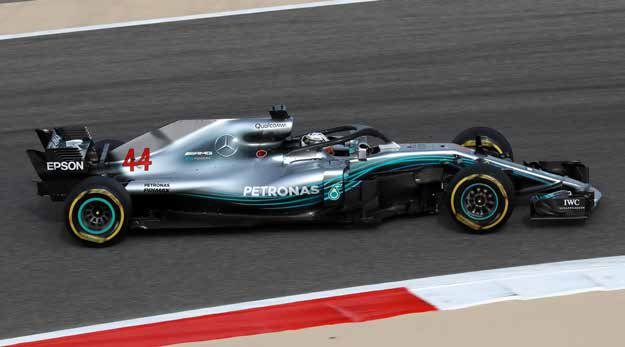

mercedes-amg-f1.com 1st start France 1954

173* GP started* 1954 et 1955 inclus

78 Victories

162 Podiums

90 Pole positions

57 Fastest laps

4 Championships 2014, 2015, 2016, 2017

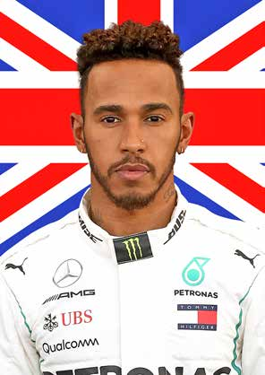

#44 British

LEWIS HAMILTON 07.01.85

Stevenage, England The world title-holder and four- times World Champion (just like 1st start in F1 Australia 2007 Prost and Vettel) is able to reach World Champion Fangio and his five titles, but he 2008, 2014, 2015, 2017 has to make sure that Vettel is not achieving this before him... 213 GP started

64 Victories

121 Podiums

74 Pole positions

38 Fastest laps

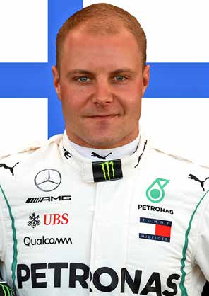

#77 Finnish

VALTTERI BOTTAS 28.08.89

Nastola, Finland Very quick, able to claim pole positions and wins, the “other” 1st start in F1 Australia 2013 Finnish driver in F1 needs to be Best classification more constant at the highest level. 3e en 2017 This year, he needs to fight for wins on a regular basis, or at least to 102 GP started score lots of points for Mercedes as 3 Victories well as finishing between Hamilton 25 Podiums and his closest rivals. 4 Pole positions

5 Fastest laps

34

SCUDERIA FERRARI

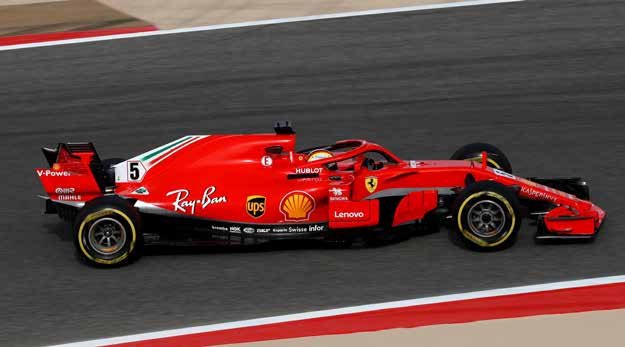

formula1ferrari.com 1st start Monaco 1950

954 GP started

231 Victories

732 Podiums

216 Pole positions

244 Fastest laps

16 Championships 1961, 1964, 1975, 1976, 1977, 1979, 1982, 1983, 1999, 2000, 2001, 2002, 2003, 2004, 2007, 2008

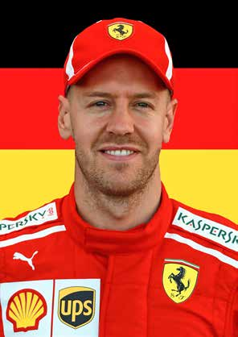

#5 German

SEBASTIAN VETTEL 03.07.87

Heppenheim, Germany Four times a Formula 1 World Champion, Vettel is still hungry 1st start in F1 USA 2007 for wins after four seasons at World Champion Ferrari. He has all the assets in 2010, 2011, 2012, 2013 hand for aiming at another title and equalling Fangio, in a more 203 GP started competitive and reliable car. 49 Victories

101 Podiums

53 Pole positions

33 Fastest laps

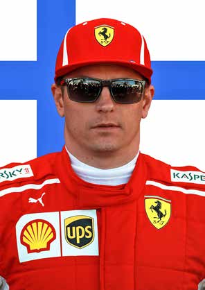

#7 Finnish

KIMI RAÏKKÖNEN 17.10.79

Espoo, Finland Crowned in 2007 with Ferrari, 4th in the 2017 Championship, 1st start in F1 Australia 2001 Iceman did a good job despite World Champion 2007 various misfortunes. Often overshadowed by his team mate, 276 GP started Kimi has not won a GP since 20 Victories 2013, but he still holds what it takes to win in Monaco, where he 94 Podiums

finished 2nd last year… 17 Pole positions

45 Fastest laps

3355

ASTON MARTIN RED BULL RACING

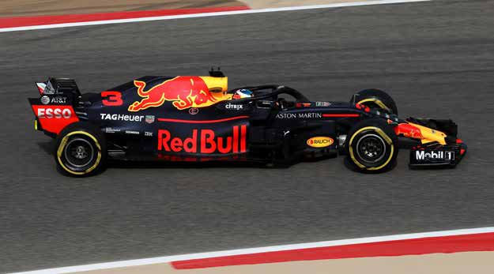

redbullracing.com 1st start Australia 2005

249 GP started

56 Victories

150 Podiums

58 Pole positions

57 Fastest laps

4 Championships 2010, 2011, 2012, 2013

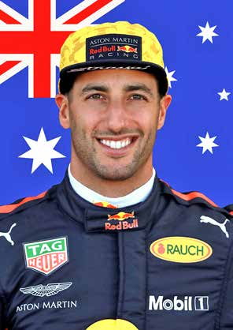

#3 Australian

DANIEL RICCIARDO 01.07.89

Perth, Australia In 2017, Ricciardo had to retire from six races, for various reasons, 1st start in F1 Great Britain 2011 and he is now at the end of his Best classification contract with Red Bull Racing. He 3rd (2014, 2016) has no other choice than scoring as many points as possible to keep his 134 GP started job at RBR… or to find another top 6 Victories team. He finished third in Monaco 28 Podiums last year and is still one of the quickest drivers around. And he 1 Pole positions won his 6th F1 race in China. 12 Fastest laps

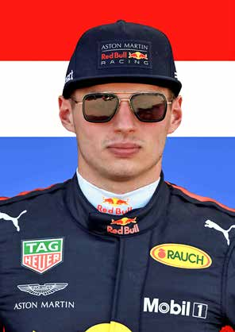

#33 Dutch

MAX VERSTAPPEN 30.09.97

Hasselt, Belgium In 2017, Max had his ups and downs, scoring two wins (Malaysia, 1st start in F1 Australia 2015 Mexico) and climbing on four Best classification podiums. He needs to control his 5th in 2016 temper and “calm down” a bit, as most of his rivals advise him to do. 65 GP started Especially if he wants to aim at a 3 Victories world title in the near future. He 12 Podiums has the talent… - Pole positions

2 Fastest laps

36

RENAULT SPORT FORMULA ONE TEAM

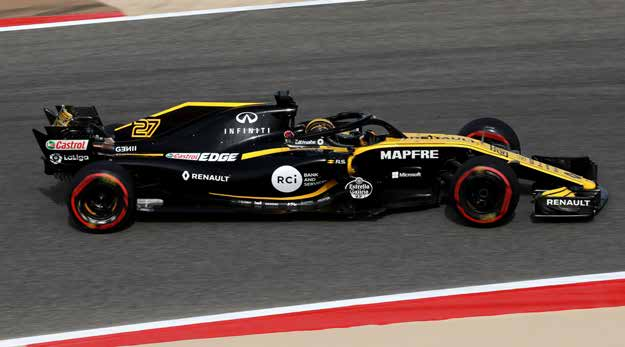

renaultsport.com 1st start Great Britain 1977

346 GP started

35 Victories

100 Podiums

51 Pole positions

31 Fastest laps

2 Championships 2005, 2006

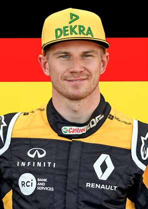

#27 German

NICO HÜLKENBERG 19.08.87

Emmerich, Germany Nico was 10th at the end of the 2017 championship, he knows 1st start in F1 Bahrain 2010 how to score points (43 out of 57 Best classification claimed by Renault F1 last year). The 9th (2014, 2016) German driver continued to score in 2018, at the first three Grands 140 GP started Prix of the season. More than - Victories ever, Renault counts on his huge - Podiums experience to climb in the Top 5 of the F1 Teams. 1 Pole positions

2 Fastest laps

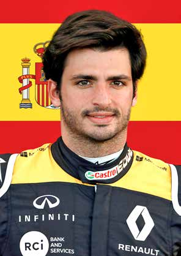

#55 Spanish

CARLOS SAINZ Jr 01.09.94

Madrid, Spain On loan in 2018, from Red Bull Racing, Carlos Sainz, after three 1st start in F1 Australia 2015 seasons in F1, needs to claim Best classification great results and to beat a very 9th in 2017 experienced team-mate. The son of a two-time rally world champion, 65 GP started he has all the tools in hand. - Victories

- Podiums

- Pole positions

- Fastest laps

3377

McLAREN F1 TEAM

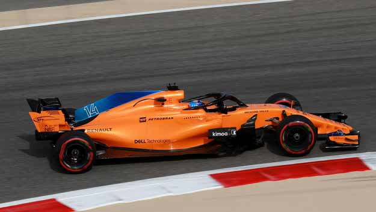

mclaren.com

1st start Monaco 1966

826 GP started

182 Victories

485 Podiums

155 Pole positions

155 Fastest laps

8 Championships 1974, 1984, 1985, 1988, 1989, 1990, 1991, 1998

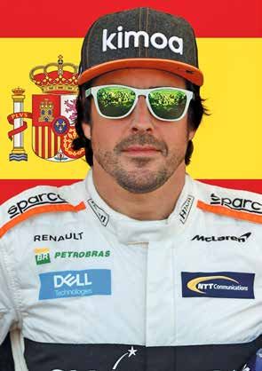

#14 Spanish

FERNANDO ALONSO 29.07.81

Oviedo, Spain Fernando is one of the most experienced drivers around. He 1st start in F1 Australia 2001 was crowned World Champion World Champion 2005, 2006 twice (2005-2006) but in his last three seasons at McLaren, he only 295 GP started managed to score points 15 times 32 Victories (in 56 GPs). The popular Spaniard, still very fast, hopes to be back on 97 Podiums the podium soon. 22 Pole positions

23 Fastest laps

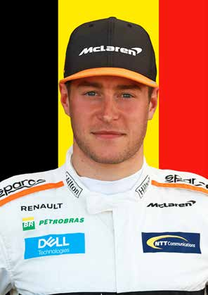

#2 Belgian

STOFFEL VANDOORNE 26.03.92

Kortrijk, Belgium In 2017, the Belgian driver only managed to score points three 1st start in F1 Bahrain 2016 times, and he retired five times. In Best classification 2018, Stoffel already managed to 16th in 2017 finish three times in the Top 10, in the first four races. So we are likely 25 GP started to see his true worth this year, if - Victories only his car shows more reliable - Podiums and efficient. - Pole positions

- Fastest laps

38

HAAS F1 TEAM

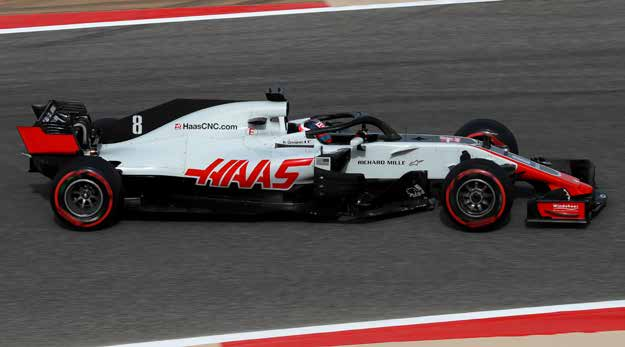

haasf1team.com 1st start Australia 2016

46 GP started

- Victories

- Podiums

- Pole positions

- Fastest laps

47 Points en 2017

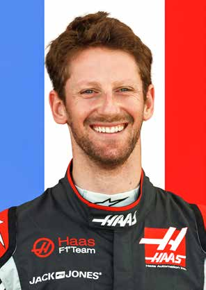

#8 French

ROMAIN GROSJEAN 17.04.86

Geneva, Switzerland The Franco-Swiss driver has over 120 GP behind his belt but victory 1st start in F1 Europe 2009 still eludes him. His ten podiums Best classification date back to his Lotus years, but 7th in 2013 with Haas he only managed to finish eight races in the Top 10 127 GP started last year. With a brand new car, - Victories supposed to be more efficient, he 10 Podiums needs to be more consistent and to beat his ruthless team-mate often. - Pole positions

1 Fastest laps

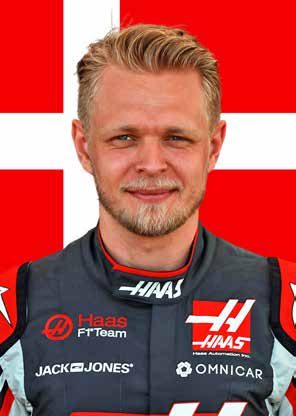

#20 Danish

KEVIN MAGNUSSEN 05.10.92

Roskilde, Denmark In his second season with Haas F1, the Dane needs to improve on his 1st start in F1 Australia 2014 2017 record (5 times in the Top 10, Best classification 5 retirements). His fighting spirit, 11th in 2014 on track, and his high tempers sometimes provoke a flood of 65 GP started criticism from his rivals. He needs - Victories to change a bit, and to score points 1 Podiums more often. - Pole positions

- Fastest laps

3399

SAHARA FORCE INDIA F1 TEAM

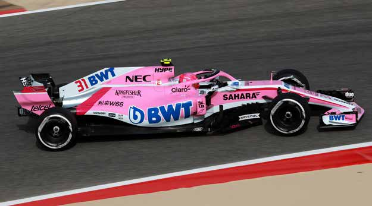

forceindiaf1.com 1st start Australia 2008

196 GP started

- Victories

6 Podiums

1 Pole positions

5 Fastest laps

187 Points en 2017

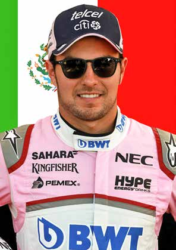

#11 Mexican

SERGIO PEREZ 26.01.90

Guadalajara, Mexico The one and only Mexican F1 driver is well into his 8th F1 season. In 1st start in F1 Australia 2011 2018, Pérez first mission is to beat Best classification his young and gifted team-mate, 7th (2016, 2017) Esteban Ocon, as often as possible. It was not always the case last 139 GP started year... - Victories

8 Podiums

- Pole positions

4 Fastest laps

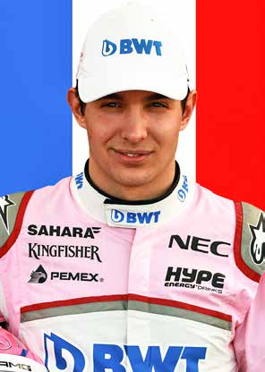

#31 French

ESTEBAN OCON 17.09.96

Evreux, France The Frenchman of the Mercedes galaxy showed the extent of his 1st start in F1 Belgium 2016 talent last year at Force India, Best classification scoring points at 18 races, one 8th in 2017 more than team-mate Sergio Pérez. He will have to confirm in 2018, 34 GP started but Pérez is warned… - Victories

- Podiums

- Pole positions

- Fastest laps

4400

RED BULL TORO ROSSO HONDA

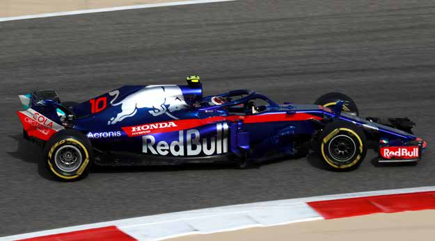

scuderiatororosso.redbull.com

1st start Bahrain 2006

231 GP started

1 Victories

1 Podiums

1 Pole positions

1 Fastest laps

53 Points en 2017

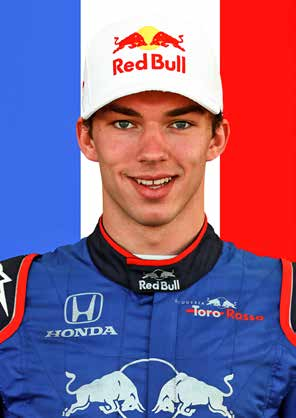

#10 French PIERRE GASLY 07.02.96

The 2016 GP2 Champion (and Rouen, France

Super Formula vice-champion in 1st start in F1 Malaysia 2017 2017) needs to prove his worth to Best classification Red Bull Racing, scoring as many 21st in 2017 points as possible, and to remain consistent all season, on all tracks. 10 GP started His outstanding performance in - Victories Bahrain (4th) was very promising. - Podiums

- Pole positions

- Fastest laps

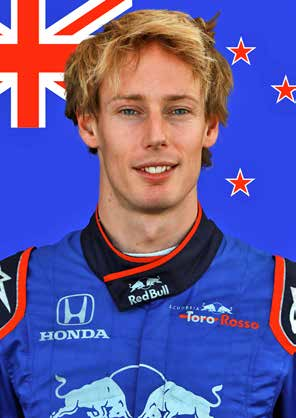

#28 New-Zelander

BRENDON HARTLEY 10.11.89

Palmerston North, NZ Thanks to Red Bull, Brendon discovered F1 in 2008 when testing 1st start in F1 USA 2017 a Toro Rosso, but nothing serious Best classification followed, so he found a job at 23th in 2017 Porsche, in the endurance team. He won WEC twice and Le Mans 24 9 GP started Hours once. Back to Toro Rosso at - Victories the end of 2017, he raced alongside - Podiums very fast Pierre Gasly, which put extra pressure on his shoulders. - Pole positions Both drivers managed it well. - Fastest laps

4411

ALFA ROMEO SAUBER F1 TEAM

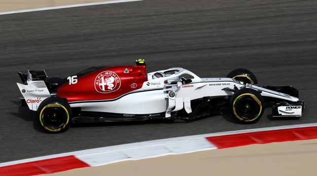

sauberf1team.com 1st start South Africa 1993

357 GP started

- Victories

10 Podiums

- Pole positions

3 Fastest laps

5 Points en 2017

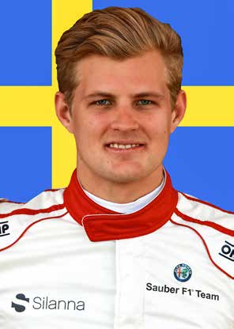

#9 Swedish

MARCUS ERICSSON 02.09.90

Kumla, Sweden This year, for his 5th F1 season, in a more competitive car, alongside 1st start in F1 Australia 2014 a rookie team-mate, Ericsson has Best classification no excuse: he needs to be ahead, 18th in 2015 often. 62 GP started

- Victories

- Podiums

- Pole positions

- Fastest laps

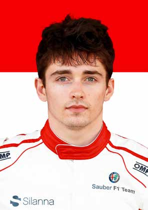

#16 Monegasque

CHARLES LECLERC 16.10.97

Monaco At the age of 20, Leclerc starts in F1 after winning two consecutive 1st start in F1 Australia 2018 titles: GP3 in 2016, F2 in 2017. Best classification Ferrari believes that he can become 6th in Baku 2018 a F1 star, but the Monégasque needs to be consistent and “to learn 5 GP started how not to win». He will surely - Victories be in the limelight for his national - Podiums Grand Prix, with extra pressure and expectations. Especially after - Pole positions finishing 6th in Baku. - Fastest laps

4422

WILLIAMS MARTINI RACING

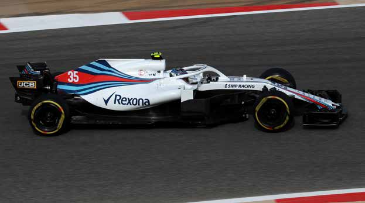

williamsf1.com 1st start Spain 1977

707 GP started

114 Victories

312 Podiums

128 Pole positions

133 Fastest laps

9 Championships 1980, 1981, 1986, 1987, 1992, 1993, 1994, 1996, 1997

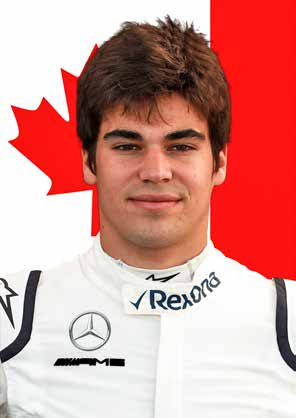

#18 Canadian

LANCE STROLL 29.10.98

Montreal, Canada A former member of the Ferrari Driver Academy, which scouted 1st start in F1 Australia 2017 him at the age of 9, the Canadian Best classification hopeful was crowned Italian F4 12th in 2017 Champion in 2014 and European F3 Champion in 2016. Last year, he 25 GP started climbed on his first ever F1 podium, - Victories in Baku, and scored almost as 1 Podiums many points as veteran team-mate Felipe Massa (40 points to 43). - Pole positions In 2018, he needs to confirm, but - Fastest laps beating is rookie team-mate will not be enough.

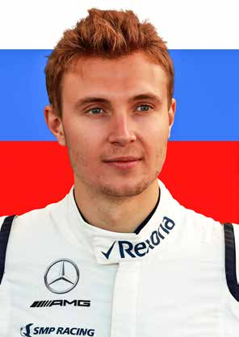

#35 Russian SERGEY SIROTKIN 27.08.95

The Russian rookie is now a race Moscow, Russia

driver in a mid-table team, where 1st start in F1 Australia 2018 a lot is expected from him, so he 5 GP started feels the pressure. His team-mate only has a bit more F1 experience, - Victories so he will not be able to help - Podiums him a lot regarding technical and tactical choices. Hopefully, Williams - Pole positions can count on a brilliant and very - Fastest laps experienced developer: Robert Kubica.

4433

2017 FORMULA 1 WORLD CHAMPIONSHIP

WHAT’S NEW?

HALO

Frontal cockpit protection safety cage to protect drivers from flying debris or in case of accident. Made of titanium, the T-shaped structure is built to withstand the weight of a double decker bus for five seconds. It weighs nine kilos but the mountings can weigh a further six. They are not all identical, being offered by three different manufacturers in Britain, Germany and Italy at a cost starting at €15,000. Mandatory exit time from the cockpit has been increased by two seconds to seven.

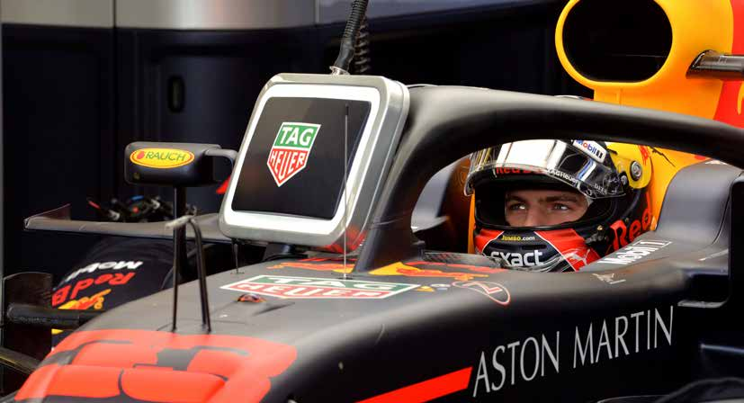

THREE ENGINES

This year each driver is limited to a maximum of three power unit elements whereas it was four last year. This is in spite of there being one more race than in 2017. In fact it’s three combustion engines, three turbochargers, three MGU-Hs, two MGU-Ks, two energy stores and two control electronic units for 21 races. Reducing power will help reliability. Some teams factoring four.

T-WINGS AND SHARK FINS OUTLAWED

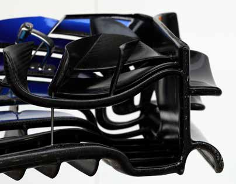

The long, shark-finned engine covers have been banned and so have both the monkey seats and the little T-wings that were mounted behind them, intended to channel air flow to the rear wing. This is on aesthetic grounds. Teams have tried to reprofile the sharks fins.

44

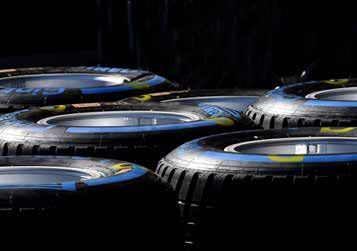

SEVEN DIFFERENT SLICKS

There is now a wider range of Pirellis, up from five last year with the addition of a new hypersoft, pink side-walled Pirelli at the softest end of the range, and now the orange side-wall being a superhard tyre at the other end of the scale - which may never be used. Last year’s relatively untested range was thought to be too hard but this year they are all a step softer. The ice blue is now the hard tyre.

CLAMPDOWN ON OIL BURN FIA has banned oil injection into the air intake for 2018. Teams have to supply data on engine oil mass and oil tank levels. Oil sensors of temperature and pressure are now much tighter.

HYBRID SYSTEM

Weight and volume of certain electrical elements in the hybrid systems have been standardised, while the FIA will monitor engine plenum air temperature to ensure it remains above 10c.

GRID PENALTIES

These have been simplified. Anyone who earns more than 15 penalty positions for taking power unit elements outside prescribed limits will start from the back of the grid. These will be prioritised by the timing of taking these elements.

JUMP STARTS

There is now greater monitoring of starts and moving before the start with the addition of a transponder programme. A 10s stop/go penalty would be imposed in the event of transgression.

SUSPENSION ANGLE

The FIA wants to prevent teams using steering angle to gain an aerodynamic advantage by using trick front suspension systems. Ride height change under steering lock cannot exceed 5mm.

SAFETY CAR STANDING STARTS

Races will feature standing starts after safety car periods following red flags, unless conditions rule against it.

21 RACE CALENDAR

With the return of the French Grand Prix at Circuit Paul Ricard, and the German Grand Prix at Hockenheim, and the loss of the Malaysian Grand Prix, this year’s championship will feature 21 races. The French Grand Prix heads the first ever triple header of the French, Austrian and British Grands Prix in late June/July.

ENGINE PARITY

The FIA have issued a technical directive reminding engine suppliers that they must supply identical engine specifications to customer teams as those used by the factory teams. This includes software, fuel and lubricants, where that supplier is the same.

45

2018 FORMULA 1 WORLD CHAMPIONSHIP

THE SEASON 2018 SO FAR...

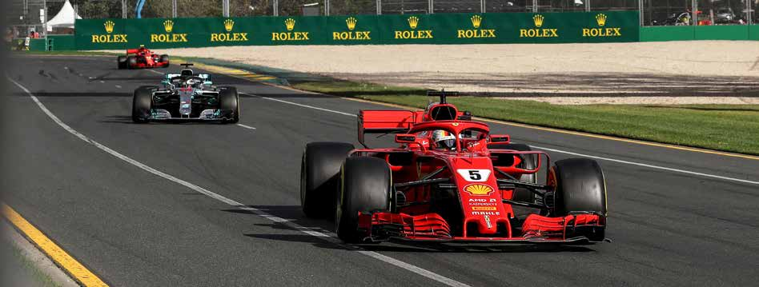

ROLEX AUSTRALIAN

GRAND PRIX

25.03.2018 Top stories ALBERT PARK CIRCUIT • Hamilton’s party mode; MELBOURNE • Little overtaking leads to suggested circuit changes;

Qualifying • Haas accused of building a Ferrari clone; 1/ Lewis Hamilton (Mercedes) • Wolff warns Ferrari serious about possible pull-out. 2/ Kimi Räikkönen (Ferrari) 3/ Sebastian Vettel (Ferrari) Quotes • Räikkönen: “Where is my pit board, it can’t be too Race difficult to put it out”. Later: “OK, my pit board is 1/ Sebastian Vettel (Ferrari) missing again”. 2/ Lewis Hamilton (Mercedes) • Engineer to Alonso (lap 13): “Fernando, Verstappen’s 3/ Kimi Räikkönen (Ferrari) spun. He’s now the car in front of Sainz”. Alonso: “OK, speak up a little bit because it’s a long race and Fastest lap you are losing the energy already”. Engineer: “Mate, Daniel Ricciardo (Red Bull-Renault) I’m racing with you, the energy’s high. Come on, let’s do this”. Best driver • Hamilton (lap 28):“What just happened guys, why Sebastian Vettel (Ferrari) didn’t you tell me Vettel was in the pits? What happened guys?”. Best team • Engineer to Ricciardo (lap 45): “Have a think how Ferrari turn tables on Mercedes again you want to approach the last part of the race? Do you want to attack every lap or chill out and go Up and Down again. Have a think”. Ricciardo: “I don’t want to let • Hamilton’s seventh pole but suffers him breathe!” costly race strategy glitch; • Sainz (lap 49): Yeah, I’m struggling with my stomach. • Vettel’s 100th podium with 2nd I have a lot of nausea from the water. successive Australian win for Ferrari; • Alonso: “Well done guys, very proud of you. Long • Qualifying accident setback for Bottas; winter, long seasons in past but now we can fight, • Raikkonen third; we can fight”. • Wheels come off Haas’ impressive form; • Force India and Williams disappoint.

46

2018 FORMULA 1 WORLD CHAMPIONSHIP

THE SEASON 2018 SO FAR...

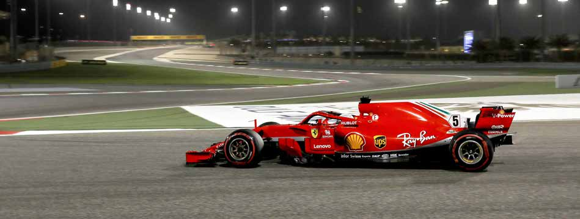

GULF AIR BAHRAIN

GRAND PRIX

08.04.2018 Top stories BAHRAIN INTERNATIONAL CIRCUIT • Liberty outline 2021 plans to teams; few details SAKHIR revealed; • Hamilton slams Verstappen after T1 collision; Qualifying 1/ Sebastian Vettel (Ferrari) • Ferrari mechanic suffers broken leg in pit stop; 2/ Kimi Räikkönen (Ferrari) • Hamilton gets gearbox penalty. 3/ Valtteri Bottas (Mercedes) Quotes Race • Leclerc after Q1 accident: “I’m stupid, I am so stupid. 1/ Sebastian Vettel (Ferrari) My bad.” 2/ Valtteri Bottas (Mercedes) • Engineer to Vettel: “Yes, P1, pole position, that was 3/ Lewis Hamilton (Mercedes) a lion lap, lion lap”. • Hamilton on Verstappen collision: “I had a coming Fastest lap together with Max and it was an unnecessary Sebastian Vettel (Ferrari) collision. There needs to be a certain respect between drivers. It didn’t feel like a respectful Best driver manoeuvre and it was a silly manoeuvre for himself Gasly competitive all weekend because he didn’t finish the race”. • Verstappen: “In my opinion there was plenty of room Best team for the both of us to go around that corner and to Both McLarens score points, third in say no action by the stewards is a bit harsh”. Constructors • Hamilton: “You guys aren’t giving me much of a picture. I don’t know what the XXXX going on”. Up and Down • Vettel: “I came on the radio with 10 laps to go and • V ettel wins in Bahrain again; said I had everything under control, but that was a • Bottas’s late charge; lie as I had nothing under control. When they told me • Penalized Hamilton in third; the pace of Valtteri at that time I thought that there is no way I could do that”. • Ferrari lose second podium with agonizing pit stop blunder; • Vettel at the flag: “Woooooo, wooohooo. These tyres were done. They were done for the last ten • 8 teams score points, including Toro laps. Should Bottas have tried to overtake at the Rosso and Sauber; end?” • Penalties for Perez and Hartley; • Ricciardo afterwards: “I definitely would have sent • Williams disappoint again. it, 100%. I would have gone.”

47

2018 FORMULA 1 WORLD CHAMPIONSHIP

THE SEASON 2018 SO FAR...

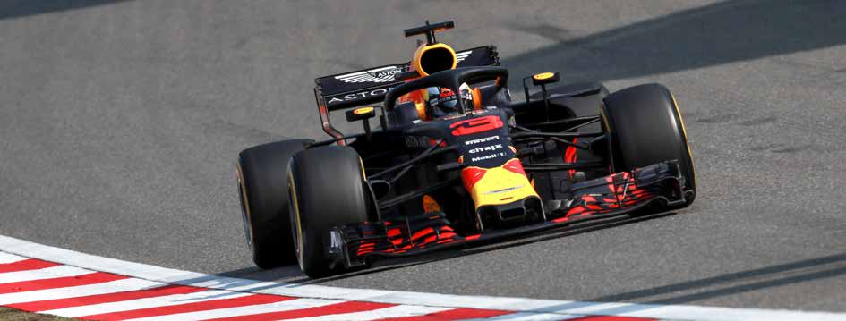

HEINEKEN CHINESE

GRAND PRIX

15.04.2018 Top stories SHANGAI INTERNATIONAL CIRCUIT • Safety car timing draws criticism;

Qualifying • Haas reject “dumbing down”; 1/ Sebastian Vettel (Ferrari) • Cost cap to end two tier F1; 2/ Kimi Räikkönen (Ferrari) • Fuel limit to be raised to promote flat out F1; 3/ Valtteri Bottas (Mercedes) • John Booth leaves Toro Rosso; • Rosberg expands racing interests. Race 1/ Daniel Ricciardo (Red Bull) Quotes 2/ Valtteri Bottas (Mercedes) • Perez after qualifying 8th: “Oh ho ho, that was 3/ Kimi Räikkönen (Ferrari) magic, man”. • Vettel after pole: “Grazie regazzi, machina grande, Fastest lap machina rossa. Thank you guys, great qualifying, Daniel Ricciardo (Red Bull-Renault) great car, really enjoyed that one. What an amazing car”. Best driver • Hamilton: “Fronts are super cold. Shoot, why didn’t Ricciardo from sixth on the grid we stop for new tyres?” Engineer: “because then they’d be in front of you”. Best team • Vettel after Verstappen collision: “in that situation, Red Bull, great engine change and pit he has to change his style, otherwise it will happen work again. I gave him room; I wasn’t planning on resisting but he had a big lock-up and that is why we crashed. Up and Down We are not happy because we had the car to win”. • Vettel steals pole from Raikkonen; • Verstappen: “He(Vettel) locked up and then turned in • Ferrari, Mercedes and Red Bull all lead very sharp”. thrilling GP; • Engineer to Ricciardo after win: “clinical moves, cut • Red Bull twice double stack in pits; throat, scary. Nice job, absolutely brilliant mate”. • Tyre strategy wins for Red Bull; Ricciardo: “I’m speechless, what a turnaround. I • Toro Rosso cause safety car with don’t seem to win boring races”. collision; • Verstappen in the wars again.

48

2018 FORMULA 1 WORLD CHAMPIONSHIP

THE SEASON 2018 SO FAR...

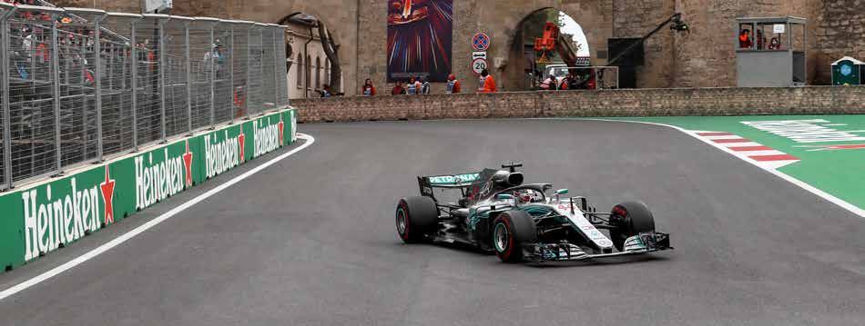

AZERBAIJAN

GRAND PRIX

29.04.2018 Top stories BAKU CITY CIRCUIT • Gasly’s near miss; • F1 commission votes through overtaking changes; Qualifying • New venues in Denmark, Vietnam gain strength; 1/ Sebastian Vettel (Ferrari) • Red Bull starts formal Honda talks; 2/ Lewis Hamilton (Mercedes) • DRS problems; 3/ Valtteri Bottas (Mercedes) • Red Bull drivers ordered to apologise to factory.

Race Quotes 1/ Lewis Hamilton (Mercedes) • Vandoorne (practice): “The smell of the car is 2/ Kimi Raïkkonen (Ferrari) horrendous.” 3/ Sergio Pérez (Force India) • Stroll: “I can’t really see where I’m going”.

Fastest lap • Gasly: “It was probably the scariest moment of my Valtteri Bottas (Mercedes) career! I was sure I was going to crash into Brendon because it’s the part of the track where we’re going Best driver at 320kph”. Bottas, deserved win; Leclerc’s first • Ricciardo (Qualifyng): “I brushed the wall at T15. I points wouldn’t go again on this set”. • Alonso (Lap 1): “He closed the door, we were side by Best team side”. Mercedes turn tables on Ferrari • Ocon: “The Ferrari crashed me totally into the wall”. Raikkonen: “He just turned into me”.

Up and Down • Verstappen behind Hamilton: “I’m just stuck now”. • Perez’s second third here; • Hamilton after winning: “It doesn’t feel like justice or relief. If my normal level is eagle and birdie, then • Competitive Renault close the gap; today I was shooting pars and bogeys”. • Vandoorne’s points-winning strategy; • Horner on Red Bull drivers: “The most important • Raikkonen takes out Ocon; thing is that they both recognize that what • Red Bulls collide; happened was unacceptable. They are both in the • Magnussen penalized; doghouse”. • Two safety cars. • Lauda: “If I was a member of the Red Bull team I would go home and cry”.

49

2018 FORMULA 1 WORLD CHAMPIONSHIP

THE SEASON 2018 SO FAR...

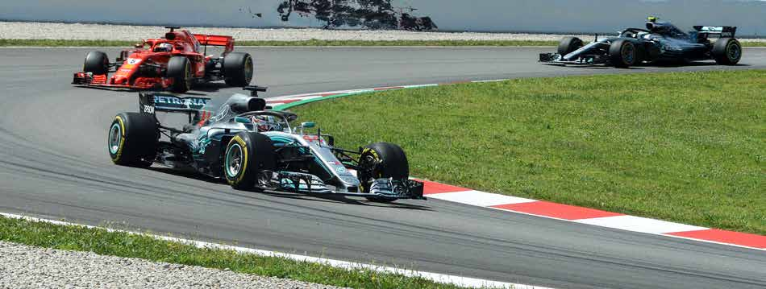

GRAN PREMIO DE

ESPAÑA EMIRATES

13.05.2018 Top stories CATALUNYA CIRCUIT - BARCELONA • Liberty introduce new fan initiatives;

Qualifying • Miami gets a step closer to a GP; 1/ Lewis Hamilton (Mercedes) • Bottas receives Trofeo Bandini; 2/ Valtteri Bottas (Mercedes) • One more crash and it’s team orders, says Red Bull’s 3/ Sebastian Vettel (Ferrari) Marko;

• Alonso helps Toyota to WEC win; Race • Ferrari’s Marchionne steps back from pull-out 1/ Lewis Hamilton (Mercedes) threat; 2/ Valtteri Bottas (Mercedes) • Sauber’s technical boss Zander quits; 3/ Max Verstappen (Red Bull) • Ferrari’s halo winglets banned; • Pirelli tyres changed. Fastest lap Daniel Ricciardo (Red Bull) Quotes • Hartley after FP1 excursion: “Any damage ? Don’t Best driver think so but we have a lot of stones”. Lewis Hamilton • Kubica after FP1 outing: “I can’t say it was fun”. Best team • Alonso: “I think if we recover six places on the first Mercedes’s first one-two lap we will be very happy”. • Ricciardo: “I’m going to shine bright like a diamond”. Up and Down • Vettel on second tyre stop: “We were going through • Mercedes defeat allcomers to score first the tyres too quickly. We couldn’t make the tyres 2018 one-two; last, so for us it was clear we had to come in again”. • Verstappen third despite wing damage; • Romain Grosjean: “I had wanted to avoid contact • Magnussen lonely 6th; with my teammate. Kevin had a bit of a wobble”. • Leclerc after scoring another point: “It is a great • Spaniards in points at home; feeling to finish in the points again. We have made • Leclerc scores again; considerable progress since the beginning of the • Grosjean penalized for first lap pile-up; season, and the whole team is eager to continue • Vettel loses third; working hard in this direction”. • Six retirements. • Hamilton: “I was surprised that nobody had the pace to keep up with me. I found a synergy with the car that I hadn’t felt before”.

50

2018 FORMULA 1 WORLD CHAMPIONSHIP

CLASSIFICATIONS

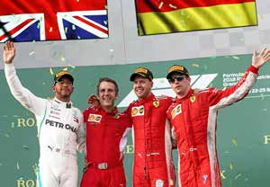

Drivers stP SUA NRB NHC EZA PSE NOM

Lewis Hamilton 95 18 15 12 25 25

Sebastian Vettel 78 25 25 4 12 12

Valtteri Bottas 58 4 18 18 - 18

Kimi Raïkkonen 48 15 - 15 18 -

Daniel Ricciardo 47 12 - 25 - 10

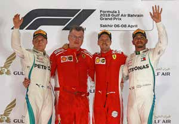

Max Verstappen 33 8 - 10 - 15

Fernando Alonso 32 10 6 6 6 4

Nico Hülkenberg 22 6 8 8 - -

Carlos Sainz Jr 19 1 - 2 10 6

Kevin Magnussen 19 - 10 1 - 8

Sergio Perez 17 - - - 15 2

Pierre Gasly 12 - 12 - - -

Charles Leclerc 9 - - - 8 1

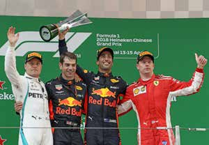

Stoffel Vandoorne 8 2 4 - 2 -

Lance Stroll 4 - - - 4 -

Marcus Ericsson 2 - 2 - - -

Brendon Hartley 1 - - - 1 -

Esteban Ocon 1 - 1 - - -

Romain Grosjean 0 - - - - -

Sergey Sirotkin 0 - - - - -

Constructors stP SUA NRB NHC EZA PSE NOM

Mercedes 153 22 33 30 25 43

Ferrari 126 40 25 19 30 12

Red Bull 80 20 0 35 0 25

Renault 41 7 8 10 10 6

McLaren 40 12 10 6 8 4

Haas 19 0 10 1 0 8

Force India 18 0 1 0 15 2

Toro Rosso 13 0 12 0 1 0

Sauber 11 0 2 0 8 1

Williams 4 0 0 0 4 0

51

2018 FORMULA 1 WORLD CHAMPIONSHIP

DATES AND PLACES

10.06 Canada, Montréal, Circuit Gilles-Villeneuve 4,361 km - 70 tours / laps

24.06 France, Le Castellet, Circuit Paul Ricard 5,842 km - 52 tours / laps

01.07 Austria, Spielberg, Red Bull Ring 4,318 km - 71 tours / laps

08.07 Great-Britain, Silverstone Circuit 5,891 km - 52 tours / laps

22.07 Germany, Hockenheim, Hockenheimring 4,574 km - 67 tours / laps

29.07 Hungary, Budapest, Hungaroring 4,381 km - 70 tours / laps

26.08 Belgium, Circuit de Spa-Francorchamps 7,004 km - 44 tours / laps

02.09 Italy, Monza, Autodroma Nazionale Monza 5,793 km - 53 tours / laps

16.09 Singapour, Marina Bay Street Circuit 5,065 km - 61 tours / laps

30.09 Russia, Sochi, Sochi Autodrom 5,848 km - 53 tours / laps

07.10 Japan, Suzuka International Racing Course 5,807 km - 53 tours / laps

21.10 USA, Austin, Circuit of the Americas 5,513 km - 56 tours / laps

28.10 Mexico, Mexico, Autod. Hermanos Rodriguez 4,304 km - 71 tours / laps

11.11 Brasil, Sao Paulo, Autodromo Jose Carlos Pace 4,309 km - 71 tours / laps

25.11 Abu Dhabi, UAE, Yas Marina Circuit 5,554 km - 55 tours / laps

52

GRAND PRIX AUTOMOBILE DE MONACO

1929-2017 - HONOUR LIST

| YEAR | LAPS | DISTANCE KM | STARTING | CLASS. | WINNER | CAR | TIME & SPEED en KM/H |
| --- | --- | --- | --- | --- | --- | --- | --- |
| 1929 | 100 | 318,000 | 16 | 09 | ‘’Williams’’ | Bugatti 35 B | 3h56’11”0 80,194 |
| 1930 | 100 | 318,000 | 17 | 06 | René DREYFUS | Bugatti 35 B | 3h41’02”6 86,317 |
| 1931 | 100 | 318,000 | 23 | 09 | Louis CHIRON | Bugatti 51 | 3h39’09”2 87,062 |
| 1932 | 100 | 318,000 | 17 | 10 | Tazio NUVOLARl | Alfa Roméo “Monza” | 3h32’25”2 89,822 |
| 1933 | 100 | 318,000 | 18 | 08 | Achille VARZl | Bugatti 51 | 3h27’49”4 91,808 |
| 1934 | 100 | 318,000 | 15 | 10 | Guy MOLL | Alfa Roméo “B” P3 | 3h31’31”4 90,202 |
| 1935 | 100 | 318,000 | 15 | 08 | Luigi FAGIOLl | Mercedes-Benz W 25 | 3h23’49”8 93,607 |
| 1936 | 100 | 318,000 | 18 | 09 | Rudi CARACCIOLA | Mercedes-Benz W 25 | 3h49’20”4 83,195 |
| 1937 | 100 | 318,000 | 15 | 09 | Manfred Von BRAUCHITSCH | Mercedes-Benz W 125 | 3h07’23”9 101,815 |
| 1948 | 100 | 318,000 | 19 | 08 | Guiseppe (‘’Nino’)’ FARINA | Maserati 4 CLT | 3h18’26”9 96,145 |
| 1950 | 100 | 318,000 | 19 | 07 | Juan Manuel FANGIO | Alfa Roméo “158” | 3h13’18”7 98,700 |
| 1952 | 100 | 314,5000 | 18 | 08 | Vittorio MARZOTTO | Ferrari 225 S | 3h21’28”7 93,660 |
| 1955 | 100 | 314,5000 | 20 | 09 | Maurice TRINTIGNANT | Ferrari “625” | 2h58’09”7 105,914 |
| 1956 | 100 | 314,5000 | 14 | 08 | Stirling MOSS | Maserati 250 F | 3h00’32”9 104,514 |
| 1957 | 100 | 314,5000 | 16 | 06 | Juan Manuel FANGIO | Maserati 250 F | 3h10’12”8 104,160 |
| 1958 | 100 | 314,5000 | 16 | 06 | Maurice TRINTIGNANT | Cooper Climax T45 | 2h52’27”9 109,413 |
| 1959 | 100 | 314,5000 | 16 | 06 | Jack BRABHAM | Cooper Climax T51 | 2h55’51”3 107,361 |
| 1960 | 100 | 314,5000 | 16 | 09 | Stirling MOSS | Lotus Climax 18 | 2h53’45”5 108,599 |
| 1961 | 100 | 314,5000 | 16 | 13 | Stirling MOSS | Lotus Climax 18 | 2h45’50”1 113,787 |
| 1962 | 100 | 314,5000 | 16 | 08 | Bruce Mc LAREN | Cooper Climax T60 | 2h46’29”7 113,396 |
| 1963 | 100 | 314,5000 | 15 | 09 | Graham HILL | BRM P57 | 2h41’45”7 116,555 |
| 1964 | 100 | 314,5000 | 16 | 10 | Graham HILL | BRM P261 | 2h41’19”5 116,910 |
| 1965 | 100 | 314,5000 | 16 | 10 | Graham HILL | BRM P261 | 2h37’39”6 119,637 |
| 1966 | 100 | 314,5000 | 16 | 04 | Jackie STEWART | BRM P261 | 2h33’10”5 123,139 |
| 1967 | 100 | 314,5000 | 16 | 06 | Dennis HULME | Brabbham Repco BT 20 | 2h34’34”3 122,143 |
| 1968 | 80 | 251,6000 | 16 | 05 | Graham HILL | Lotus Cosworth 49 | 2h00’32”3 125,238 |
| 1969 | 80 | 251,6000 | 16 | 07 | Graham HILL | Lotus Cosworth 49 B | 1h56’59”4 129,036 |

53

| YEAR | LAPS | DISTANCE KM | STARTING | CLASS. | WINNER | CAR | TIME & SPEED en KM/H |
| --- | --- | --- | --- | --- | --- | --- | --- |
| 1970 | 80 | 251,6000 | 16 | 08 | Jochen RINDT | Lotus Cosworth 49 C | 1h54’36”6 131,176 |
| 1971 | 80 | 251,6000 | 18 | 10 | Jackie STEWART | Tyrrell Cosworth 003 | 1h52’21”3 134,359 |
| 1972 | 80 | 251,6000 | 25 | 17 | Jean-Pierre BELTOISE | BRM P160 D | 2h26’54”7 102,754 |
| 1973 | 78 | 255,684 | 25 | 11 | Jackie STEWART | Tyrrell Cosworth 006 | 1h57’44”3 130,297 |
| 1974 | 78 | 255,684 | 25 | 09 | Ronnie PETERSON | Lotus Cosworth 72 | 1h58’03”7 129,409 |
| 1975 | 75 | 245,850 | 18 | 09 | Niki LAUDA | Ferrari 312 T | 2h01’21”31 121,552 |
| 1976 | 78 | 258,336 | 20 | 14 | Niki LAUDA | Ferrari 312 T2 | 1h59’51”47 129,321 |
| 1977 | 76 | 251,712 | 20 | 12 | Jody SCHECKTER | Wolf Cosworth WR1 | 1h57’52”77 128,119 |
| 1978 | 75 | 248,400 | 20 | 11 | Patrick DEPAILLER | Tyrrell Cosworth 008 | 1h55’14”66 129,325 |
| 1979 | 76 | 251,712 | 20 | 6 | Jody SCHECKTER | Ferrari 312 T4 | 1h55’22”48 130,901 |
| 1980 | 76 | 251,712 | 20 | 8 | Carlos REUTEMANN | Williams Ford FW07B | 1h55’34”365 130,677 |
| 1981 | 76 | 251,712 | 20 | 7 | Gilles VILLENEUVE | Ferrari 126C | 1h54’23”38 131,976 |
| 1982 | 76 | 251,712 | 20 | 9 | Ricardo PATRESE | Brabham Ford GT49D | 1h54’11”259 132,300 |
| 1983 | 75 | 248,400 | 20 | 7 | Keke ROSBERG | Williams Ford FW08D | 1h56’38”121 129,585 |
| 1984 | 31 | 106,672 | 20 | 9 | Alain PROST | McLaren Tag MP4/2 | 1h01’07”740 100,775 |
| 1985 | 78 | 258,336 | 20 | 11 | Alain PROST | McLaren Tag MP4/2B | 1h51’58”034 138,434 |
| 1986 | 78 | 259,5840 | 20 | 12 | Alain PROST | McLaren Tag MP4/2C | 1h55’41”060 134,634 |
| 1987 | 78 | 259,5840 | 24 | 13 | Ayrton SENNA | Lotus Honda 99T | 1h57’54”085 132,102 |
| 1988 | 78 | 259,5840 | 26 | 21 | Alain PROST | McLaren Honda MP4/4 | 1h57’17”077 132,797 |
| 1989 | 77 | 259,5840 | 26 | 15 | Ayrton SENNA | McLaren Honda MP4/5 | 1h53’33”251 135,401 |
| 1990 | 78 | 259,5840 | 25 | 15 | Ayrton SENNA | McLaren Honda MP4/5B | 1h52’46”982 138,097 |
| 1991 | 78 | 259,5840 | 25 | 15 | Ayrton SENNA | McLaren Honda MP4/6 | 1h53’02”334 137,785 |
| 1992 | 78 | 259,5840 | 26 | 12 | Ayrton SENNA | McLaren Honda MP4/6B | 1h50’59”372 140,329 |
| 1993 | 78 | 259,5840 | 26 | 14 | Ayrton SENNA | McLaren Ford MP4/8 | 1h52’10’’947 138,837 |
| 1994 | 78 | 259,5840 | 24 | 11 | Michael SCHUMACHER | Benetton Ford B194 | 1h49’55’’372 141.690 |
| 1995 | 78 | 259,5840 | 26 | 10 | Michael SCHUMACHER | Benetton Renault B195 | 1h53’11’’258 137.603 |
| 1996 | 75 | 249.6000 | 22 | 7 | Olivier PANIS | Ligier Mugen Honda JS43 | 2h00’45’’629 124.011 |
| 1997 | 62 | 208.6920 | 22 | 10 | Michael SCHUMACHER | Ferrari F310B | 2h00’05’’654 104.264 |
| 1998 | 78 | 262.6260 | 21 | 12 | Mika HAKKINEN | McLaren Mercedes Mp4/13 | 1h51’23’’595 141.458 |
| 1999 | 78 | 262.6260 | 22 | 9 | Michael SCHUMACHER | Ferrari F393 | 1h49’31’’812 143.864 |

| YEAR | LAPS | DISTANCE KM | STARTING | CLASS. | WINNER | CAR | TIME & SPEED en KM/H |
| --- | --- | --- | --- | --- | --- | --- | --- |
| 2000 | 78 | 262.6260 | 22 | 10 | David COULTHARD | McLaren Mercedes MP4/15 | 1h49’28’’213 144.072 |
| 2001 | 78 | 262.860 | 22 | 10 | Michael SCHUMACHER | Ferrari F2001 | 1h47’22’’561 146.881 |
| 2002 | 78 | 262.860 | 22 | 12 | David COULTHARD | McLaren Mercedes MP4/17 | 1h45’39’’055 149.280 |
| 2003 | 78 | 260.520 | 20 | 13 J | uan Pablo MONTOYA | BMW Williams FW25 | 1h42’19’’010 152.772 |
| 2004 | 78 | 257.180 | 20 | 10 J | arno TRULLI | Renault R24 | 1h45’46’’601 145,880 |
| 2005 | 78 | 257.180 | 18 | 14 | Kimi RAIKKONEN | West McLaren Mercedes | 1h45’15’’556 148,501 |
| 2006 | 78 | 260.520 | 22 | 17 | Fernando ALONSO | Renault R26 | 1h43’43’’116 150,707 |
| 2007 | 78 | 155.551 | 22 | 19 | Fernando ALONSO | McLaren Mercedes MP4/22 | 1h40’29’’329 155.551 |
| 2008 | 76 | 253.840 | 20 | 14 | Lewis HAMILTON | McLaren Mercedes 108T | 2h00’42’’742 126.170 |
| 2009 | 78 | 260.520 | 20 | 15 J | enson BUTTON | Brawn GP Formula 1 Team | 1h40’44’’282 155.166 |
| 2010 | 78 | 260.520 | 24 | 15 | Mark WEBBER | Red Bull Renault | 1h50’13’’355 141.814 |
| 2011 | 78 | 260.520 | 23 | 18 | Sebastian VETTEL | Red Bull Racing | 2h09‘38‘‘373 120.574 |
| 2012 | 78 | 260.520 | 24 | 16 | Mark WEBBER | Red Bull Racing | 1h46‘06‘‘557 147.312 |
| 2013 | 78 | 260.520 | 22 | 16 | Nico ROSBERG | Mercedes AMG Petronas | 2h17‘52‘‘056 113.378 |
| 2014 | 78 | 260.520 | 22 | 14 | Nico ROSBERG | Mercedes AMG Petronas | 1h49‘27‘‘661 142.801 |
| 2015 | 78 | 260.286 | 20 | 17 | Nico ROSBERG | Mercedes AMG Petronas | 1h49‘18‘‘420 142.874 |
| 2016 | 78 | 260.52 | 22 | 15 | Lewis HAMILTON | Mercedes AMG Petronas | 1h59‘29‘‘133 130.703 |
| 2017 | 78 | 260.52 | 20 | 15 | Sebastian VETTEL | Ferrari | 1h44‘44‘‘340 149.105 |

55

GRAND PRIX AUTOMOBILE DE MONACO

RECORDS

VICTORIES

6 for Ayrton SENNA 1987-89-90-91-92-93 5 for Graham HILL 1963-64-65-68-69 5 for Michael SCHUMACHER 1994-95-97-99-01 4 for Alain PROST 1984-85-86-88 3 for Stirling MOSS 1956-60-61 3 for Jackie STEWART 1966-71-73 3 for Nico ROSBERG 2013-14-15 2 for Jean-Manuel FANGIO 1950-57 2 for Maurice TRINTIGNANT 1955-58 2 for Niki LAUDA 1975-76 2 for Jody SCHEKTER 1977-79 2 for David COULTHARD 2000-02 2 for Fernando ALONSO 2006-07 2 for Mark WEBBER 2010-12 2 for Lewis HAMILTON 2008-16 2 for Sebastian VETTEL 2011-17

RECORDS OF THE LAP

- 1929 “WILLIAMS ”: 84,800 km/h - 1930 René DREYFUS: 90,141 km/h - 1937 CARACIOLA: 107,492 km/h - 1955 J.M. FANGIO: 110,568 km/h - 1964 Graham HILL: 120,575 km/h - Before the new chicane: Michele ALBORETO / Ferrari : 144,264 km/h, 1’22”637 in 1985 - Since the new chicane: Michael SCHUMACHER / Benetton Ford : 147,772 km/h, 1’21’’076 in 1994 - Actual record on new circuit : Michael SCHUMACHER / Scuderia Ferrari Marlboro : 161.528 km/h, 1’14’’439 in 2004

TOTAL RECORD FOR THE RACE

- Before the new chicane: Alain PROST / 138,434 km/h - 1h51’58” (78 tours in 1985) - Since the new chicane: Michael SCHUMACHER / 141,690 km/h - 1h 49’55’’372 (78 tours in 1994) - Actual record on new circuit: Fernando ALONSO / 155,551 km/h - 1h40’29’’329 (78 tours in 2007)

RECORD OF THE CIRCUIT

Kimi RAIKKONEN - 1’12’’178 - Ferrari in 2017

POLE POSITIONS

- 1933 Achille VARZI 2’02 - 1937 CARACCIOLA 1’47’’5 - 1972 FITTIPALDI 1’21’’4 - 1974 Niki LAUDA 1’26’’3 - 1980 Didier PIRONI 1’24’’813 - 1985 Ayrton SENNA 1’20’’450 before the new chicane - 1994 Michael SCHUMACHER 1’18’’560 since the new chicane

- 2011 Sebastian VETTEL 1’13’’556 Redevelopment of the Darse Sud

56

FORMULA 1 WORLD CHAMPIONSHIP WINNERS

| YEAR | CONSTRUCTOR/ENGINE | DRIVER | CAR | VICTORIES | POLE POSITIONS | FASTEST LAPS |
| --- | --- | --- | --- | --- | --- | --- |
| 1950 | Alfa Romeo | G.FARINA (I) | Alfa Romeo | 3 | 2 | 3 |
| 1951 | Alfa Romeo | J.M. FANGIO (ARG) | Alfa Romeo | 3 | 4 | 5 |
| 1952 | Ferrari | A. ASCARI (I) | Ferrari | 6 | 5 | 6 |
| 1953 | Ferrari | A. ASCARI (I) | Ferrari | 5 | 6 | 4 |
| 1954 | Mercedes /Maserati | J.M FANGIO (ARG) | Mercedes | 6 | 5 | 3 |
| 1955 | Mercedes | J.M FANGIO (ARG) | Mercedes | 4 | 3 | 3 |
| 1956 | Ferrari | J.M FANGIO (ARG) | Ferrari | 3 | 5 | 4 |
| 1957 | Maserati | J.M FANGIO (ARG) | Maserati | 4 | 4 | 2 |
| 1958 | Vanwall /Vanwall | M. HAWTHORN (GBR) | Ferrari | 1 | 4 | 5 |
| 1959 | Cooper /Climax | J. BRABHAM (AUS) | Cooper Climax | 2 | 1 | 1 |
| 1960 | Cooper /Climax | J. BRABHAM (AUS) | Cooper Climax | 5 | 3 | 3 |
| 1961 | Ferrari /Ferrari | P. HILL (USA) | Ferrari | 2 | 5 | 2 |
| 1962 | Brm /Brm | G. HILL (GBR) | BRM | 4 | 1 | 3 |
| 1963 | Lotus /Climax | J. CLARK (GBR) | Lotus | 7 | 7 | 6 |
| 1964 | Ferrari /Ferrari | J. SURTEES (GBR) | Ferrari | 2 | 2 | 2 |
| 1965 | Lotus /Climax | J. CLARK (GBR) | Lotus | 6 | 6 | 6 |
| 1966 | Brabham /Repco | J. BRABHAM (AUS) | Brabham | 4 | 3 | 1 |
| 1967 | Brabham /Repco | D. HULME (NZ) | Brabham | 2 | - | 2 |
| 1968 | Lotus /Ford | G. HILL (GBR) | Lotus | 3 | 2 | - |
| 1969 | Matra /Ford | J. STEWART (GBR) | Matra | 6 | 2 | 5 |
| 1970 | Lotus /Ford | J. RINDT (AUT) | Lotus | 5 | 3 | 1 |
| 1971 | Tyrrell /Ford | J. STEWART (GBR) | Tyrrell | 6 | 6 | 3 |
| 1972 | Lotus /Ford | E. FITTIPALDI (BRA) | Lotus | 5 | 3 | - |
| 1973 | Tyrrell /Ford | J. STEWART (GBR) | Tyrrell | 5 | 3 | 1 |
| 1974 | McLaren /Ford | E. FITTIPALDI (BRA) | McLaren | 3 | 2 | - |
| 1975 | Ferrari /Ferrari | N. LAUDA (AUT) | Ferrari | 5 | 9 | 2 |
| 1976 | McLaren / Ford | J. HUNT (GBR) | McLaren | 6 | 8 | 2 |
| 1977 | Ferrari /Ferrari | N. LAUDA (AUT) | Ferrari | 3 | 2 | 3 |
| 1978 | Lotus /Ford | M. ANDRETTI (USA) | Lotus | 6 | 8 | 3 |
| 1979 | Ferrari /Ferrari | J. SCHECKTER (SA) | Ferrari | 3 | 1 | 1 |
| 1980 | Williams /Ford | A. JONES (AUS) | Williams | 5 | 3 | 5 |
| 1981 | Brabham /Ford | N. PIQUET (BRA) | Brabham | 3 | 4 | 1 |
| 1982 | Williams /Ford | K. ROSBERG (FIN) | Williams | 1 | 1 | - |

57

| YEAR | CONSTRUCTOR/ENGINE | DRIVER | CAR | VICTORIES | POLE POSITIONS | FASTEST LAPS |
| --- | --- | --- | --- | --- | --- | --- |
| 1983 | Brabham /BMW | N. PIQUET (BRA) | Brabham | 3 | 1 | 4 |
| 1984 | McLaren /Tag Porsche | N. LAUDA (AUT) | McLaren | 5 | - | 5 |
| 1985 | McLaren /Tag Porsche | A. PROST (F) | McLaren | 5 | 2 | 5 |
| 1986 | McLaren /Tag Porsche | A. PROST (F) | McLaren | 4 | 1 | 2 |
| 1987 | Williams /Honda | N. PIQUET (BRA) | Williams | 3 | 4 | 4 |
| 1988 | McLaren /Honda | A. SENNA (BRA) | McLaren | 8 | 13 | 3 |
| 1989 | McLaren /Honda | A. PROST (F) | McLaren | 4 | 2 | 5 |
| 1990 | McLaren /Honda | A. SENNA (BRA) | McLaren | 6 | 10 | 2 |
| 1991 | McLaren /Honda | A. SENNA (BRA) | McLaren | 7 | 8 | 2 |
| 1992 | Williams /Renault | N. MANSELL (GBR) | Williams | 9 | 14 | 8 |
| 1993 | Williams /Renault | A. PROST (F) | Williams | 7 | 13 | 6 |
| 1994 | Benetton /Ford | M. SCHUMACHER (G) | Benetton | 8 | 6 | 8 |
| 1995 | Benetton /Renault | M. SCHUMACHER (G) | Benetton | 9 | 4 | 8 |
| 1996 | Williams /Renault | D. HILL (GBR) | Williams | 8 | 9 | 5 |
| 1997 | Williams /Renault | J.VILLENEUVE (CDN) | Williams | 7 | 10 | 3 |
| 1998 | McLaren /Mercedes | M.HAKKINEN (FIN) | McLaren | 8 | 9 | 6 |
| 1999 | McLaren /Mercedes | M.HAKKINEN (FIN) | McLaren | 5 | 9 | 7 |
| 2000 | Ferrari | M.SCHUMACHER (G) | Ferrari | 9 | 9 | 2 |
| 2001 | Ferrari | M.SCHUMACHER (G) | Ferrari | 9 | 11 | 3 |
| 2002 | Ferrari | M.SCHUMACHER (G) | Ferrari | 11 | 7 | 7 |
| 2003 | Ferrari | M.SCHUMACHER (G) | Ferrari | 6 | 5 | 5 |
| 2004 | Ferrari | M.SCHUMACHER (G) | Ferrari | 13 | 8 | 10 |
| 2005 | Renault | F.ALONSO (E) | Renault | 7 | 8 | 4 |
| 2006 | Renault | F.ALONSO (E) | Renault | 7 | 6 | 5 |
| 2007 | Ferrari | K.RAIKKONEN (FIN) | Ferrari | 6 | 3 | 6 |
| 2008 | McLaren /Mercedes | L.HAMILTON (GBR) | McLaren | 9 | 13 | 3 |
| 2009 | Brawn GP | J.BUTTON (GBR) | Brawn | 6 | 4 | 3 |
| 2010 | Red Bull Racing | S.VETTEL (GER) | Red Bull | 5 | 10 | 3 |
| 2011 | Red Bull Racing | S.VETTEL (GER) | Red Bull | 11 | 15 | 3 |
| 2012 | Red Bull Racing | S.VETTEL (GER) | Red Bull | 5 | 5 | 2 |
| 2013 | Red Bull Racing | S.VETTEL (GER) | Red Bull | 13 | 9 | 7 |
| 2014 | Mercedes AMG | L. HAMILTON (GBR) | Mercedes | 11 | 7 | 7 |
| 2015 | Mercedes AMG | L. HAMILTON (GBR) | Mercedes | 10 | 11 | 8 |
| 2016 | Mercedes AMG | N. ROSBERG (GER) | Mercedes | 9 | 8 | 6 |
| 2017 | Mercedes AMG | L. HAMILTON (GBR) | Mercedes | 9 | 11 | 7 |

58

THE PRINCIPALITY OF MONACO

An independent and sovereign state, the Principality of Monaco shares its land frontiers with many of the Maritime Alps districts : from west to east, Cap d’Ail, La Turbie, Beausoleil and Roquebrune Cap Martin, all facing the Mediterranean.

The population of the Principality is about 36.000 inhabitants of which 8.000 are nationals.

The surface area is about 195 hectares, of which about 40 are land reclaimed from the sea over the past 20 years.

It spreads on a narrow belt coastal setting up sometimes almost to the vertical and culminate at 163 meters.

The width ranges from 1050 metres in some place to only 350 metres in others. It runs alongside the sea for 4100 metres.

The Principality is not made up of just one district, Monaco, whose borders are often confused with those of the state.

It is divided into five districts :

• Monaco Ville on the Rock, the old fortress site, with the Prince’s Palace, the ramparts, the gardens, the Cathedral and the Oceanography Museum,

• The Condamine, the port district,

• Monte-Carlo, founded in 1866 during the reign of Prince Charles III who gave it its name, with its world famous casino, its great hotels and recently built leisure spots : the Larvotto beach, the Monte-Carlo Sporting Club and the Boulingrins gardens,

• Fontvieille, a great technical development with a breakwater, 40 metres deep and a 22 hectares strip of land which supports an urban, touristic and sports complex, joining a pleasure port to a pollution-free industrial zone,

• Moneghetti, les Révoires and the Jardin Exotique (to the west on the border with Cap d’Ail).

A mild winter and a not too hot summer. The average annual temperature is 16°,31 and the Principality benefits from exceptional sunshine.

59

VARIOUS INFORMATIONS

| Nice Airport | Standard | 0820 423 333 |
| --- | --- | --- |
| Helicopter Service | Héli Air Monaco Fontvieille | 92.05.00.50 |
| Taxi ranks (24h phone service) |  | 0820.209.898 |
| Railway Station Gare SNCF - Vallon Sainte Dévote | Enquiries and reservations Informations | 36.35 www.sncf.fr |
| Car Rental self drive | ADA Avis Elite Rent a Car Europcar First GT Location GT Rental Hertz MC ECO Rental Roadster’z Monaco | 93.50.18.18 93.30.17.53 97.77.33.11 93 50 74 95 93 50 62 10 97 70 54 53 93.50.79.60 06 80 86 54 09 98 80 01 10 |
| Monaco Hospital | Centre Hospitalier Princesse Grace EMERGENCIES | 97.98.99.00 |
| Ambulance and Fire Services | EMERGENCIES | 93.30.19.45 ou 18 |
| Doctor, Chemist & nurse on duty | EMERGENCIES | 141 |
| Police | Rue Suffren Reymond EMERGENCIES Lost property | 93.15.30.15 17 93.15.30.18 |
| Monaco Government Tourist and Convention Authority | 2a, bld des Moulins | 92.16.61.66 |
| Radio Monte-Carlo | 10, Quai Antoine 1er | 97.70.17.01 |
| Télé Monte-Carlo | 6, Quai Antoine 1er | 93.15.14.15 |

60

TRAVEL AGENCIES

| AEROMAR Voyages | 23, rue Terrazzani | 97.70.67.80 |
| --- | --- | --- |
| Cruise’n Fly | 44, rue Grimaldi | 97.70.25.60 |
| Havas Tourisme | 6, bld des Moulins | 93.25.73.73 |
| Heli Air Voyages | 11, bld du Jardin Exotique | 97.70.80.20 |
| Jet Travel | 20, avenue de Fontvieille | 97.70.08.00 |
| Mercury Travel Agency | 1, av Princesse Alice | 92.16.52.60 |
| Monaco Voyages | 15 bld Princesse Charlotte 17 avenue de l’Annonciade | 97.97.82.50 97.97.82.70 |
| Monaco Top Voyages | 10, avenue Princesse Grace | 97.97.79.90 |

POST OFFICES

| Main Post Office | Palais de la Scala, Monte-Carlo | 9797.2525 |
| --- | --- | --- |
| Monaco Condamine BP | 17, rue Grimaldi | 9999.8039 |
| Monaco Fontvieille | 3 Place du Campanin | 9999.8030 |
| Monte-Carlo | 35, avenue Princesse Grace | 9999.8036 |
| Monte-Carlo | 1, avenue Henri Dunant | 9999.8080 |
| Monte-Carlo Moulins | Place des Moulins | 9999.8026 |

EXCHANGE

| Compagnie Monégasque de Change | Parking des Pêcheurs | 9325.0250 |
| --- | --- | --- |
| Monafinances | 17, Avenue des Spélugues | 9350.0680 |

CURRENCY MACHINE

| Crédit Foncier de Monaco | 11, bld Albert 1er |
| --- | --- |
| Société Générale | 17, bld Albert 1er |
| Crédit Mutuel | 8, rue Grimaldi |
| Centre Commercial de Fontvieille | 23, ave Prince Héréditaire Albert |

PARKINGS

| Standard | 93.30.19.21 |
| --- | --- |
| Parking des Boulingrins | Place du Casino |
| Parking de la Costa | Avenue de la Costa |
| Parking des Pêcheurs | Avenue de la Quarantaine |
| Parking du Stade Louis II | Avenue des Castellans |
| Parking St Nicolas | Avenue des Guelfes |
| Parking du Port de Fontvieille | Quai Jean-Charles Ray |
| Parking du Square Gastaud | Rue Suffren Reymond |
| Parking de la nouvelle digue | Avenue de la Quarantaine |

6611

HOTELS OF THE PRINCIPALITY

| Hôtel de Paris | Place du Casino | 98.06.25.25 |
| --- | --- | --- |
| Hôtel Hermitage | Square Beaumarchais | 98.06.25.25 |
| Fairmont Hotel Monte-Carlo | 12, ave des Spélugues | 93.50.65.00 |
| Hôtel Métropole Palace Monte-Carlo | 4, ave de la Madone | 93.15.15.15 |
| Hôtel Port Palace Monaco | 7, ave Président J.F Kennedy | 97.97.90.00 |
| Monte-Carlo Bay Hotel & Resort | Ave Princesse Grace | 98.06.25.25 |
| Monte-Carlo Beach Hotel | Ave Princesse Grace 06190 Roquebrune Cap Martin | 98.06.25.25 |
| Le Méridien Beach Plaza | 22, ave Princesse Grace | 93.30.98.80 |
| Hôtel Columbus | 23, ave des Papalins | 92.05.90.00 |
| Novotel Monte-Carlo | 16, bd Princesse Charlotte | 99.99.83.00 |
| Hôtel Miramar | 1, ave President J.F Kennedy | 93.30.86.48 |
| Hôtel de France | 6, rue de la Turbie | 93.30.24.64 |
| Hôtel Le Versailles | 4, ave Prince Pierre | 93.50.79.34 |

TELEPHONES

For calls from all other countries (excluding France) to a Monaco number:

• dial the international code, then, after the tone, dial the district “377”, followed by the subscriter’s 8 digit numbers

Calls from Monaco to a number in France:

• dial “00.33” + the region code followed by the subscriter’s 8 digit number

Calls from Monaco to foreign countries: • dial “00” + country code + city code, followed by the subscriter’s number

62
